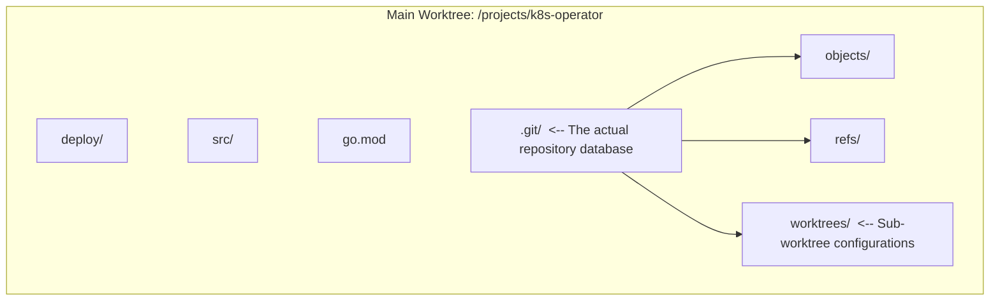
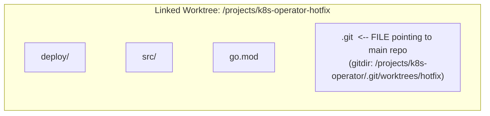

# Module 5: Multi-Tasking Mastery - Worktrees and Stashing

Complexity: **MEDIUM**. Time to complete: **60 minutes**. Prerequisites: **Module 4 of Git Deep Dive**.

## Learning Outcomes

By the end of this module, you will be able to:

- Implement `git worktree` to manage concurrent development efforts across multiple branches without disrupting your primary working directory.
- Diagnose and resolve orphaned or disconnected worktrees using lifecycle commands like `prune` and `remove`.
- Evaluate the precise technical trade-offs between `git stash`, `git worktree`, and multiple repository clones to select the optimal context-switching strategy for a given scenario.
- Execute advanced stash operations, including isolating untracked files, applying specific stashes from the stack, and recovering stashed changes into isolated branches.
- Design a resilient local development workflow that prevents uncommitted state loss during critical, time-sensitive production interruptions.

## Why This Module Matters

It was late afternoon at a regional payments company during a planned Kubernetes platform upgrade. A senior engineer was halfway through refactoring an ingress controller deployment for Kubernetes 1.35, with modified YAML files, half-written Go tests for a custom admission webhook, and a local cluster tuned to reproduce a routing edge case. Then security paged the team: a vulnerable production image had to be replaced immediately, before the next merchant settlement window opened. The change itself was tiny, but the operational risk was not tiny at all, because a broken hotfix would block payment authorization and the company estimated that a fifteen-minute outage during that window could put more than six figures of revenue at risk.

The engineer reached for `git stash`, switched to the production branch, made the image update, and pushed the hotfix. That first part looked successful, but the return trip was painful. The stash did not include a newly created manifest because the file was still untracked, and `git stash pop` collided with the same deployment block that the emergency patch had changed. The fix prevented customer-visible impact, yet the team paid for the rushed context switch with hours of conflict resolution, repeated local cluster resets, and a delayed review of the original ingress refactor.

This module is about preventing that class of avoidable disruption. Git branches are cheap, but a normal clone gives you only one working directory, and real engineering work rarely arrives one task at a time. You will learn when a stash is the right short-term scratchpad, when a linked worktree is the safer architecture, and when a second clone is still justified. By the end, you should be able to leave unfinished work exactly where it is, handle an interruption in a clean directory, and return without relying on memory or luck.

## The Context Switch Problem

A standard Git clone has two pieces that matter during daily development: the repository database and the working tree. The repository database stores objects, refs, branch names, remote-tracking state, and configuration. The working tree is the visible directory where your editor, tests, linters, and local tools interact with files. In the simplest setup, those two pieces feel inseparable because the `.git` directory sits beside the files you edit, but Git treats them as distinct layers.

When you run `git switch` or `git checkout`, Git rewrites the working tree to match the target commit. That rewrite is safe only when your current directory can be moved to the new branch without overwriting uncommitted work. If you have modified tracked files, staged changes, or untracked files that collide with paths on the target branch, Git may refuse the switch. If the paths do not collide, Git may allow the switch and carry your dirty state forward, which is often worse because unfinished feature work can accidentally ride into a hotfix branch.

The practical lesson is that a branch is not the same thing as a workspace. A branch names a line of history; a workspace is a directory, an index, editor state, test artifacts, environment variables, and your own mental context. Many early Git users learned branches first and assumed they solved context switching by themselves. Branches solve the history problem, but they do not give you two independent working directories unless you create a second clone or a linked worktree.

Teams traditionally used two workarounds. The first was the multiple-clone strategy: clone the repository again whenever a new task, release check, or urgent review appears. The second was the stash-and-pray strategy: sweep uncommitted work onto the stash stack, switch branches, do the interruption, switch back, and hope the saved patch still applies cleanly. Both can work in narrow cases, but both become expensive when they are the default response to every interruption.

Multiple clones provide strong isolation because each clone has its own object database, refs, configuration, working tree, and index. That can be useful when you truly need separate credentials, separate hooks, or a hermetic test environment. The cost is duplication and drift. Large repositories can consume several gigabytes per clone, each clone needs its own fetches, and a branch that exists locally in one clone does not automatically exist locally in another. The strategy solves workspace isolation by pretending each task is a separate universe.

There is also a coordination cost that does not show up in disk usage. In a multi-clone workflow, each directory can quietly develop its own local branches, remotes, ignored files, hook state, and unpushed commits. When a teammate asks which directory contains the fix, the answer may depend on memory rather than repository state. Worktrees reduce that ambiguity because the linked directories remain attached to one repository database, and `git worktree list` gives you a single inventory of the local workspaces that currently exist.

Stash has the opposite shape. It is lightweight and local, but it stores a patch-like snapshot whose context is easy to forget. A stash entry records the state of tracked modifications, and with the right flags it can include untracked or ignored files, but it does not preserve your open terminals, local database state, running cluster, or exact mental stack. It is a temporary shelf, not a parallel desk. The longer a stash sits while the branch underneath it changes, the more likely the return path turns into conflict recovery.

That distinction is why the right question is not "Is stash bad?" but "What kind of state am I saving?" If the state is a two-line formatting cleanup before a pull, stash is appropriate. If the state includes half a feature, a failing test, a running cluster, and a branch that may be interrupted for a day, stash is hiding too much context behind a single stack entry. A senior workflow makes that difference explicit before the interruption starts.

> **Pause and predict:** what do you think happens if you run `git stash` while a new file exists in your directory but has never been added with `git add`?

By default, `git stash` saves tracked modifications and staged changes, but it leaves untracked files alone. That behavior surprises engineers because a dirty `git status` can contain both tracked and untracked state, while the plain stash command captures only part of it. If the untracked file does not collide with the branch you switch to, it remains visible in the new branch. If it does collide, Git may block the branch switch or force you to decide what to do at the worst possible moment.

## Mastering Git Stash for Micro-Interruptions

Stash is still worth mastering because not every interruption deserves a new directory. If you are about to pull upstream changes, run a formatter, or briefly inspect another branch, a named stash can be faster than making a worktree. The key is to treat stash as a precise tool for micro-interruptions, not as a general-purpose storage locker for unfinished projects. Good stash usage starts with context, includes the right files, and restores with a reversible command.

Never run a bare `git stash` when the work matters. The default message usually says something like `WIP on branch-name`, which is enough for the next thirty seconds and nearly useless after lunch. Use `git stash push -m` so future you can connect the entry to a real task, file, or experiment. The message is cheap insurance because the stash stack is indexed by position, and those positions shift as new entries are added or removed.

```bash
# Bad practice
git stash

# Good practice
git stash push -m "Mid-refactor of deployment.yaml resource limits"
```

When your work includes new files, add the `-u` or `--include-untracked` flag. This is common in infrastructure repositories because a feature might introduce a new Kubernetes manifest, a values file, a migration, or a test fixture before it is ready for staging. Using `-u` tells Git to stash tracked modifications and untracked files together, which makes the saved state more complete. It does not include ignored files such as build outputs unless you use the stronger `-a` flag.

```bash
# Stashes tracked modifications AND untracked new files
git stash push -u -m "Added new redis-deployment.yaml and modified configmap"
```

The `-a` or `--all` flag is more aggressive because it includes ignored files too. That can be useful when you need to completely sanitize a directory before reproducing a build issue, but it can also sweep large generated artifacts into the stash and make the operation slow. In most professional workflows, explicit `-u` is the better default because it captures source files that Git does not yet track while leaving caches and build directories out of the stash.

Every stash entry goes onto a stack, with the newest entry at `stash@{0}`. You can inspect the stack before applying anything, and you should do that whenever more than one entry exists. The command below is not just a convenience; it is a guard against applying the wrong patch to the wrong branch. A stash message that looked obvious yesterday may be ambiguous after two incident calls and a review rotation.

```bash
git stash list
```

The output will look something like this:

```text
stash@{0}: On feature-auth: Added new redis-deployment.yaml and modified configmap
stash@{1}: On main: Mid-refactor of deployment.yaml resource limits
```

Before applying a stash, inspect it as a patch. The `show -p` subcommand lets you review the exact files and hunks without changing your working directory. This is especially important when stashes contain configuration, database migrations, or Kubernetes manifests, because those files often have names that repeat across environments. You want to know whether the saved patch touches production resources, test-only manifests, or local scaffolding before it changes your current tree.

```bash
git stash show -p stash@{1}
```

> **Before running this, what output do you expect if you apply `stash@{1}` rather than pop it?** Think about whether the stash stack itself should change, then verify your prediction with `git stash list`.

Use `git stash apply` as the safe restoration command. `apply` takes the changes from the selected stash and attempts to put them into the current working tree, but it leaves the stash entry on the stack. If the patch applies cleanly, you can test the result before deleting the saved state. If the patch conflicts, you still have the original stash entry available, which gives you room to abort, reset, create a recovery branch, or retry in a cleaner location.

```bash
# Applies the most recent stash
git stash apply

# Applies a specific stash from the stack
git stash apply stash@{1}
```

`git stash pop` is convenient, but convenience is not the same as safety. Pop applies the stash and, when the application succeeds, drops the entry from the stack. That behavior is fine for trivial edits, but it becomes risky when you are tired, on the wrong branch, or dealing with configuration files whose conflicts are subtle. For critical infrastructure work, apply first, inspect and test the result, and only then drop the stash intentionally.

```bash
# Drop a specific stash
git stash drop stash@{1}

# Clear the entire stash stack (use with extreme caution)
git stash clear
```

The best recovery command for an old or conflict-prone stash is `git stash branch`. This command creates a new branch at the commit where the stash was originally made, applies the stash there, and drops the stash if the application succeeds. That starting point matters because it reconstructs the context the patch expected, rather than forcing the patch directly onto a branch that may have changed for days. You can then commit the recovered work and merge or rebase it using normal Git techniques.

```bash
git stash branch recovered-auth-work stash@{0}
```

Here is a small practice workflow that focuses on the untracked-file trap. It uses a throwaway repository because stash practice should never require risking real work. Notice that the example stores a file named `.env`, but it uses harmless placeholder content rather than realistic credentials. The goal is to see how Git treats tracked and untracked state, not to model secret management.

```bash
mkdir stash-practice && cd stash-practice
git init
```

Create an initial commit so the repository has a clean baseline. Git stash depends on a repository with commits because it needs a `HEAD` commit as the reference point for the saved changes. In a brand-new repository with no commit, many normal history operations do not yet have a stable anchor.

```bash
echo "v1" > config.txt
git add config.txt
git commit -m "Initial commit"
```

Now create one tracked modification and one untracked file. This gives you a realistic dirty state: part of the work is visible as a modification to a tracked file, and part of it is visible only as a new path. That mixed state is where many stash mistakes start, because a quick glance at `git status` may not translate into the right stash flags.

```bash
echo "v2" > config.txt
echo "example-local-value" > .env
```

Stash both pieces together with `-u`. After this command, the working tree should return to a clean state and the untracked file should disappear from the directory because it has been saved inside the stash entry. This is the behavior you want before switching into a review or a tiny branch inspection.

```bash
git stash push -u -m "WIP on new config and local env"
```

Inspect the stash stack and the patch before restoring. This reinforces the habit of treating stash entries as named records that deserve review, not as invisible magic. The patch output will show the tracked file change; Git may summarize untracked content differently depending on version, but the file should be part of the entry.

```bash
git stash list
git stash show -p stash@{0}
```

Finally, restore with `apply` rather than `pop`. The working tree gets the changes back, while the stash stack still contains the saved entry. That lets you run `git status`, confirm that `config.txt` and `.env` returned as expected, and then choose whether to drop the stash or keep it until you have committed the work.

```bash
git stash apply stash@{0}
```

## The Power of Git Worktrees

If stash is a temporary shelf, a worktree is a separate desk connected to the same filing cabinet. Git introduced linked worktrees so one repository database can support multiple working directories, each with its own checked-out branch and index. The main advantage is that you do not have to clean, stash, or commit unfinished work before opening a clean directory for another task. Your feature branch can remain dirty in one terminal while a hotfix branch is clean in another.

The architecture is efficient because linked worktrees share the same object database and references. A second clone copies the repository database, but a linked worktree stores only the checked-out files plus small metadata that points back to the main repository. If you fetch in one worktree, the updated remote-tracking refs are available to the others because the refs live in the shared repository. That gives you most of the isolation developers wanted from multiple clones without duplicating history or creating local synchronization drift.

The isolation is not absolute, and that distinction matters. Each worktree has its own working directory and index, so staged changes and uncommitted file edits do not bleed between them. However, global services such as a single local database, fixed ports, shared Docker networks, and editor-wide settings can still collide. A team running two Kubernetes test environments from two worktrees must still choose separate namespaces, ports, or clusters. Worktrees solve Git workspace contention; they do not automatically isolate every tool outside Git.

The index isolation is one of the most underrated benefits. Staging is local to the worktree, so you can have a carefully staged patch in the feature directory while the hotfix directory has a completely different staged patch. This matters for review quality because `git diff --cached` remains focused on the task in front of you. With stash-based interruption, staged and unstaged intent can be flattened into a saved entry, and restoring that intent later takes extra attention.

Worktrees also encourage smaller, named branches for temporary tasks. Instead of leaving a hotfix as an uncommitted mutation in your primary clone, you create `hotfix/image-patch`, commit the fix, and push it from the linked directory. That branch name becomes part of the audit trail. Even if the temporary directory is removed after the pull request merges, the branch and commit history still explain what happened during the interruption.

When you run `git clone`, you create the main worktree. Inside that directory, the `.git` directory stores objects, refs, configuration, and metadata for linked worktrees. This diagram shows the normal shape before adding any linked worktree.



When you add a linked worktree, Git creates a new directory with normal project files, but the `.git` entry inside that directory is a file rather than a full repository directory. That file points back to metadata under the main repository's `.git/worktrees/` directory. The linked worktree gets its own `HEAD`, its own index, and its own administrative state, while the actual object database remains shared.



The standard creation command is `git worktree add`. You provide a path for the new directory and the branch or commit you want checked out there. In many interruption workflows, you also create a new branch at the same time with `-b`. That lets you leave a dirty feature branch untouched, create a clean hotfix branch from `main`, and start working in a sibling directory.

```bash
# Usage: git worktree add <path> <branch>

# Create a new directory alongside your current one,
# create a new branch called 'hotfix-cve',
# and check it out starting from 'main'
git worktree add -b hotfix-cve ../k8s-operator-hotfix main
```

Git will output:

```text
Preparing worktree (new branch 'hotfix-cve')
HEAD is now at 8f3a9b2 Update ingress documentation
```

At this point you have two separate directories connected to one repository database. Your original directory can contain uncommitted feature work, while `../k8s-operator-hotfix` starts clean on the hotfix branch. You can open a new terminal, run tests, commit, and push from the hotfix worktree. When the emergency ends, you remove the temporary worktree and return to the original terminal without replaying a stash or reconstructing your thought process.

Git enforces one important rule: a branch can be checked out in only one worktree at a time. That rule prevents two directories from updating the same branch pointer independently, which would be a recipe for confusion. If you need another directory for the same starting point, create a new branch name or check out a detached commit intentionally. Most teams should prefer a branch name because it gives the work a clear place in history.

> **Pause and predict:** before running this, what output do you expect if you try to create a worktree for a branch that is already checked out in another worktree?

The command will fail with an error explaining that the branch is already checked out. That failure is protective, not annoying. Imagine two terminals both claiming to own `feature/auth-refresh`, each with a different index and different uncommitted files. Git avoids that split-brain branch state by forcing each checked-out branch name to have one active worktree. If you see this error, list your worktrees before forcing anything.

```bash
git worktree list
```

The output gives you the path, commit, and branch for each attached worktree. Treat this list as your local operations dashboard. Before deleting a branch, rebasing shared work, or cleaning old directories, check the list so you know which paths still matter. It is much faster to read this state than to rediscover it through failed checkout commands.

```text
/projects/k8s-operator         8f3a9b2 [feature-auth]
/projects/k8s-operator-hotfix  2c9b4e1 [hotfix-cve]
```

When you finish with a worktree, remove it through Git. The command deletes the directory and cleans the matching metadata under the main repository. Git will refuse to remove a worktree that contains uncommitted changes unless you force it, which is another useful guardrail. If the worktree contains commits that have not been pushed or merged, pause and decide whether to keep the branch before removing the directory.

```bash
# This deletes the directory and cleans up the references in the main .git folder
git worktree remove ../k8s-operator-hotfix
```

The common failure mode is deleting the directory with the operating system, for example with `rm -rf`, instead of using `git worktree remove`. The files disappear, but the main repository still has metadata saying that the branch is checked out in that missing location. Later, when you try to use the branch somewhere else, Git refuses because it trusts its metadata until you tell it to verify the filesystem.

```bash
git worktree prune
```

`git worktree prune` asks Git to inspect registered worktree paths and discard metadata for locations that no longer exist. Use it as a repair command for orphaned worktree records, not as your normal cleanup habit. Normal cleanup should be `git worktree remove`, because it gives Git a chance to protect uncommitted work and keep the metadata consistent in the first place.

## Kubernetes Interruption Workflow

Worktrees become especially valuable in Kubernetes repositories because the source files are only part of the local state. A change to a Deployment may be tied to a running KinD cluster, a port-forward, generated manifests, and a failing integration test. Stashing the source files does not reset those external systems, and carrying dirty YAML into a production hotfix branch can produce misleading tests. A separate worktree gives the hotfix a clean file view while allowing you to decide separately how to isolate the cluster.

Suppose you are developing a reliability upgrade for a Deployment that targets Kubernetes 1.35. In your normal shell profile, you can introduce the common `alias k=kubectl` once, then use commands such as `k version --client` and `k apply --dry-run=client -f deployment.yaml` during validation. The alias is not required for Git itself, but KubeDojo examples use it consistently after the first introduction so commands stay compact without hiding that `k` means `kubectl`.

For a local test, the unfinished feature might include probes, resource requests, and image changes. Those are exactly the fields an emergency hotfix might also need to touch. If you stash the feature, switch to `main`, update the image, and return later, you are betting that the same manifest regions did not drift in incompatible ways. If you create a worktree from `main`, the hotfix starts from the production file while the feature file stays physically open in the original directory. That physical separation is useful when your editor has multiple tabs open, your terminal history is full of feature-specific commands, and your local notes refer to paths in the original directory.

The worktree does not automatically give you a second Kubernetes cluster, so design that part deliberately. For a one-line image hotfix, you might validate the manifest with a client-side dry run against the hotfix directory and run unit tests only. For a deeper controller change, you might create a separate KinD cluster or a separate namespace so the hotfix validation does not share resources with the feature branch. The Git decision and the runtime-environment decision are related, but they are not the same decision.

The strongest teams write this separation into their runbooks. An incident runbook can say, "Create a worktree from `main`, create or select a clean namespace, validate only the hotfix diff, and remove the worktree after the fix merges." That procedure reduces the chance that an engineer improvises while under pressure. It also makes reviews calmer because the pull request can be judged as an isolated production change rather than a mixture of emergency edits and unrelated feature residue.

A realistic operator team uses this split during incident response. Alice is building automated backup support for a database operator, with many modified Go files, new CustomResourceDefinition manifests, and a local cluster configured to test backup scheduling. Production then reports a leader-election crash. The stash approach asks Alice to package a complex feature as a patch, change branch context, run a different investigation in the same directory, and later reapply the patch over a branch that may have moved. The worktree approach asks Alice to open a clean sibling directory from `main`, fix the leader-election code there, and leave the backup work untouched.

The difference is not merely comfort. During an incident, reducing accidental coupling is an operational control. A clean hotfix worktree makes it easier to see which files changed, easier to run focused tests, and easier to produce a reviewable commit. The original feature directory remains dirty, but that dirtiness is contained. When the incident ends, Alice does not need to remember whether a local manifest belonged to the feature or the hotfix; the directory boundary preserves that answer.

## Patterns & Anti-Patterns

The first durable pattern is the sibling-directory worktree. Keep the main clone in a stable location and create temporary worktrees beside it with names that explain their purpose, such as `../operator-hotfix-leader-election` or `../site-review-pr-812`. The path name becomes operational documentation when `git worktree list` is printed during a busy day. This pattern scales well because every worktree shares fetched refs, while the directory name communicates why it exists.

This naming discipline sounds minor until a team has several temporary directories open during a release week. A directory named `../tmp2` tells you nothing about whether it can be deleted, while `../operator-hotfix-leader-election` tells you the branch purpose before you even run Git. When the name, branch, pull request, and test namespace line up, cleanup becomes a simple verification step instead of an archeology project.

The second pattern is apply-before-drop for stash recovery. Use `git stash apply`, run `git status`, inspect the diff, and run a small validation before dropping the stash. That extra minute protects you from deleting the only copy of a patch that was applied in the wrong place. It also creates a natural checkpoint: once the restored work is committed or deliberately abandoned, the stash can be removed with confidence.

The third pattern is branch-from-stash for old work. If a stash is more than a short interruption old, assume its original context matters. `git stash branch` reconstructs that context better than a direct apply against a branch that has evolved. This pattern turns a risky patch replay into a normal branch integration problem, which is easier to review and easier to undo.

The fourth pattern is environment naming that follows the worktree. If a worktree exists for `hotfix/image-patch`, give its local namespace, database, or cluster a matching name when practical. The exact command depends on the tool, but the principle is stable: directory isolation should be paired with runtime isolation when tests mutate external state. Otherwise two worktrees can still compete for port bindings, test databases, or Kubernetes resources.

The most common anti-pattern is treating stash as a filing cabinet. A stack of unnamed WIP entries is not a backlog; it is deferred confusion. Teams fall into this because stash is fast and because Git makes it easy to hide mess temporarily. The better alternative is to make a WIP commit on a branch when the work is meaningful, or create a worktree when another task needs a clean directory.

Another anti-pattern is force-removing worktrees as routine cleanup. `git worktree remove -f` exists for exceptional cases, but regular use trains you to ignore Git's warning that uncommitted changes exist. If a temporary worktree has valuable edits, commit them, stash them with a message, or consciously discard them after inspection. The safest cleanup path is boring: list, status, remove.

A subtler anti-pattern is assuming that worktrees replace branches. They do not. A worktree is a directory attached to a branch, detached commit, or new branch. The branch still carries history, review identity, and push behavior. If you use detached worktrees casually, you can create commits that are easy to lose because no branch name points at them. For normal team work, create a named branch with `-b` and push it like any other branch.

The last anti-pattern is using worktrees to avoid committing for too long. Worktrees let you keep tasks separate, but they do not remove the need for small commits and reviewable history. If three worktrees each contain days of uncommitted work, you have traded one crowded directory for three hidden risk piles. Commit meaningful checkpoints, push branches that need backup or review, and remove temporary directories when their purpose ends.

## Decision Framework

Choose the tool by asking what kind of isolation you need and how long the interruption will last. If the interruption is measured in minutes and your dirty state is simple, stash can be appropriate. If the interruption needs a clean directory, a separate branch, tests, or review work, use a worktree. If the task needs a completely independent repository configuration, credentials, hooks, or object database, use a second clone and accept the cost intentionally.

> **Which approach would you choose here and why?** Your colleague asks you to review a pull request that changes two files, you have no uncommitted work, and you expect the review to take ten minutes.

If your working tree is clean and the review is tiny, switching branches in the current directory is reasonable. A worktree is still a good option when you want to preserve editor context, keep your current branch visible, or run tests without disturbing local artifacts. The important point is that worktrees are not mandatory for every branch switch; they are valuable when the cost of mixing contexts exceeds the cost of another directory.

| Scenario | Recommended Strategy | Technical Rationale |
| :--- | :--- | :--- |
| **Pulling latest changes** before pushing your local commits. | `git stash` | The interruption is measured in seconds. The context remains clear, the risk of major conflicts is low, and stash is the fastest local operation. |
| **Emergency production hotfix** while mid-feature. | `git worktree` | The hotfix requires a clean state and may take hours. You need a strong guarantee that feature code will not leak into the hotfix. |
| **Reviewing a colleague's massive pull request** while working on your own code. | `git worktree` | Reviews often require running code, editing configuration, and executing tests. A separate directory keeps review experiments away from feature work. |
| **Testing a completely different Kubernetes version** locally against the codebase. | `git clone` sometimes | A worktree isolates files, but a full clone may be justified when credentials, hooks, or environment configuration must be completely independent. |
| **Trying a speculative refactor that you might throw away.** | `git branch` in the current tree | If your tree is clean, a normal branch and a WIP commit may be enough. Stash is unnecessary when you can preserve the experiment in history. |

One way to operationalize the framework is to set team conventions. For incident response, create a worktree by default. For one-minute pull-before-push interruptions, use a named stash. For external customer reproductions that require different credentials or hooks, use a fresh clone. Conventions reduce decision fatigue during stressful moments and make local directories easier for teammates to interpret when they pair, debug, or review together.

The framework should also account for the cost of return. A context-switch tool is successful only if returning to the original task is boring. Stash has a low start cost but can have a high return cost when patches conflict or messages are vague. A worktree has a slightly higher start cost because it creates a directory and often a branch, but its return cost is usually just changing terminals. A clone has the highest start and maintenance cost, so reserve it for cases where shared repository state would itself be a problem.

## Did You Know?

1. Git worktrees were introduced in Git 2.5 in 2015, after years of teams using helper scripts such as `git-new-workdir` to approximate the same workflow.
2. A stash entry is built from internal commits that record the working tree and, when needed, the index; it is not just a loose diff file tucked away on disk.
3. Git prevents a branch from being checked out in two worktrees at the same time, which protects the branch pointer from competing updates across directories.
4. The `git worktree prune` command repairs stale metadata when a linked worktree directory was deleted outside Git, but it is not a substitute for normal `git worktree remove` cleanup.

## Common Mistakes

| Mistake | Why It Happens | How to Fix It |
| :--- | :--- | :--- |
| **Losing new files in a stash** | Running `git stash` without `-u` leaves newly created untracked files in the working directory, so they follow you into the next branch. | Use `git stash push -u -m "clear context"` when the dirty state includes new source files. |
| **Stash stack amnesia** | Bare `git stash` creates generic messages that do not explain why the entry exists once more work has happened. | Always use `git stash push -m "specific task and file context"` and inspect with `git stash list`. |
| **Orphaned worktree directories** | Deleting a worktree folder with `rm -rf` removes files but leaves Git metadata that still locks the branch. | Prefer `git worktree remove <path>`; use `git worktree prune` only to repair stale metadata. |
| **Popping onto the wrong branch** | `git stash pop` applies and then deletes the entry after a clean application, leaving little room to reconsider. | Default to `git stash apply`, verify the result, and then run `git stash drop` deliberately. |
| **Trying to checkout a locked branch** | A branch already checked out in another worktree cannot be checked out again under the same name. | Run `git worktree list`, switch or remove the other worktree, or create a new branch for the second directory. |
| **Ignoring environment bleed** | Worktrees isolate Git files and indexes, but shared ports, databases, clusters, and credentials can still collide. | Pair worktree isolation with separate namespaces, ports, clusters, or local configuration when tests mutate external state. |
| **Using detached worktrees casually** | Checking out a commit without a branch can make new commits harder to find and push. | Use `git worktree add -b <branch> <path> <start-point>` for normal team work. |

## Quiz

<details>
<summary>Question 1: You are deep into modifying a Helm chart for a reliability upgrade when an urgent production image patch must be made on `main`. Your current directory has uncommitted YAML and generated test fixtures. What workflow should you choose, and why?</summary>

Use `git worktree add -b hotfix/image-patch ../project-hotfix main` and make the production patch in that new directory. The hotfix needs a clean working tree, and your feature has enough uncommitted state that a stash would become a risky patch replay. A worktree keeps the hotfix commit reviewable because only hotfix files are visible there. It also lets you return to the original directory without reapplying anything.
</details>

<details>
<summary>Question 2: You stashed work before helping a colleague, then returned two days later after the target branch had changed heavily. A direct apply produces painful conflicts. What should you try next, and what problem does it solve?</summary>

Try `git stash branch recovered-work stash@{0}` or the specific stash index you inspected. This creates a new branch at the commit where the stash was originally made, so the saved patch is applied in the context it expected. That avoids forcing an old patch directly onto a changed branch. After recovery, you can commit the work and integrate it with normal merge or rebase tools.
</details>

<details>
<summary>Question 3: A teammate deleted `../testing-env` with the file manager. Now Git refuses to check out `test-deployment` because it says the branch is already checked out. How do you diagnose and repair the state?</summary>

Run `git worktree list` first so you can see the stale path Git still remembers, then run `git worktree prune` from the repository. The directory is gone, but metadata under the main repository still records that linked worktree. Prune tells Git to verify registered paths and drop records for missing directories. Future cleanup should use `git worktree remove` so Git can protect uncommitted changes and remove metadata in one operation.
</details>

<details>
<summary>Question 4: You created a new Python script but did not run `git add`. After `git stash` and a branch switch, the script is still present in the new branch. Why did that happen, and how would you avoid it?</summary>

Plain `git stash` does not include untracked files. The new script had no index entry, so Git left it in the working directory during the stash operation. If the target branch did not have a tracked file at the same path, the file remained visible after the switch. Use `git stash push -u -m "message"` when new source files are part of the temporary state.
</details>

<details>
<summary>Question 5: You need to compare behavior against a different Kubernetes version and also use different credentials and hooks. A teammate suggests a worktree because it saves disk space. What concern should you raise?</summary>

A worktree isolates the working directory and index, but it still shares the repository database and may share global Git configuration, hooks strategy, credentials, editor settings, and local services. If the test truly requires independent credentials or repository-level configuration, a separate clone may be more appropriate despite the disk cost. The right decision depends on what must be isolated. Worktrees are excellent for file and branch isolation, but they are not a full sandbox for every tool around the repository.
</details>

<details>
<summary>Question 6: You have three stashes and suspect `stash@{1}` contains database migration work. Your current branch is clean, but applying the wrong stash would waste time. What should you do before restoring it?</summary>

Run `git stash list` to confirm the stack and `git stash show -p stash@{1}` to inspect the patch. This changes nothing in the working directory, so it is safe even when you are unsure. The patch view tells you which files and hunks are stored in that entry. After you confirm it is the right work, use `git stash apply stash@{1}` and verify before dropping the stash.
</details>

<details>
<summary>Question 7: Your team uses worktrees for every incident, but two incident worktrees keep failing tests because both try to bind the same local port and use the same namespace in a shared cluster. Did Git worktrees fail here?</summary>

No. Git worktrees solved the source-directory and index isolation problem, but they did not isolate external runtime resources. Shared ports, shared databases, shared clusters, and shared namespaces can still collide across directories. The fix is to pair each worktree with environment isolation such as separate namespaces, dynamic ports, or separate KinD clusters. Treat worktree creation as one part of the incident workspace, not the whole workspace.
</details>

## Hands-On Exercise: The Mid-Flight Hotfix

In this exercise, you will simulate a real-world interruption using Kubernetes manifests. You will begin a reliability upgrade, leave it uncommitted, create a clean hotfix worktree from `main`, commit a production image patch there, and then return to the original directory. The exercise is intentionally small, but the workflow is the same one you would use for a controller change, a chart review, or an emergency configuration fix.

Start in a temporary directory so the practice repository can be deleted when you are done. The first repository represents your normal development workspace. It begins with a stable production Deployment so there is a clean `main` branch to patch during the interruption.

```bash
mkdir k8s-fleet-manager && cd k8s-fleet-manager
git init
```

Create the stable base state. This manifest is intentionally minimal so the difference between production and unfinished feature work is easy to see. Commit it before starting the feature branch because the hotfix worktree needs a real `main` commit as its starting point.

```bash
cat << 'EOF' > deployment.yaml
apiVersion: apps/v1
kind: Deployment
metadata:
  name: fleet-api
spec:
  replicas: 2
  selector:
    matchLabels:
      app: fleet-api
  template:
    metadata:
      labels:
        app: fleet-api
    spec:
      containers:
      - name: api
        image: fleet-api:v1.0.0
EOF
git add deployment.yaml
git commit -m "Initial production release v1.0.0"
```

Create and check out a new feature branch. This branch represents a normal medium-sized change, not an emergency. You are going to leave it dirty on purpose so you can see that worktrees do not require a clean starting directory.

```bash
git checkout -b feature/reliability-upgrade
```

Begin the unfinished reliability work by replacing the Deployment with a more complex version. Do not commit these changes. The dirty working tree is the point of the exercise, because it models the moment when an interruption arrives while you are mid-thought.

```bash
cat << 'EOF' > deployment.yaml
apiVersion: apps/v1
kind: Deployment
metadata:
  name: fleet-api
spec:
  replicas: 2
  selector:
    matchLabels:
      app: fleet-api
  template:
    metadata:
      labels:
        app: fleet-api
    spec:
      containers:
      - name: api
        image: fleet-api:v1.1.0-rc1
        resources:
          requests:
            memory: "64Mi"
            cpu: "250m"
          limits:
            memory: "128Mi"
            cpu: "500m"
        livenessProbe:
          httpGet:
            path: /healthz
            port: 8080
          initialDelaySeconds: 3
          periodSeconds: 3
EOF
```

Your interruption is a production bug in `fleet-api:v1.0.0`. You need to patch the image version to `v1.0.1` on `main`, but you cannot lose the reliability upgrade and you do not want to apply a stash later. Use the checklist below as your success path.

- [ ] Create a new worktree named `fleet-manager-hotfix` in the parent directory, creating a new branch `hotfix/image-patch` based on `main`.
- [ ] Navigate to the new worktree directory.
- [ ] Verify that `deployment.yaml` in this new directory is the clean original production version with `fleet-api:v1.0.0`.
- [ ] Update the image tag in the hotfix directory to `fleet-api:v1.0.1`.
- [ ] Commit the hotfix in the hotfix worktree.
- [ ] Safely remove the hotfix worktree using Git commands rather than deleting the directory directly.
- [ ] Return to your original directory and verify your reliability upgrades are still exactly as you left them.

<details>
<summary>Solution</summary>

Create the worktree while leaving your dirty feature directory exactly as it is. This command makes a sibling directory, creates a new branch, and starts that branch from `main`.

```bash
git worktree add -b hotfix/image-patch ../fleet-manager-hotfix main
```

Move into the new directory and inspect the manifest. It should show the original `v1.0.0` image and none of the resource or probe changes from the feature branch.

```bash
cd ../fleet-manager-hotfix
cat deployment.yaml
```

Apply and commit the hotfix. The macOS and Linux `sed` examples differ, so use the one that matches your environment. If you prefer, edit the file manually and then continue with the same Git commands.

```bash
# macOS
sed -i '' 's/v1.0.0/v1.0.1/g' deployment.yaml

# Linux
# sed -i 's/v1.0.0/v1.0.1/g' deployment.yaml

git add deployment.yaml
git commit -m "Hotfix: update API image to v1.0.1"
```

Clean up through Git. Move out of the hotfix directory first, then remove the linked worktree so Git deletes both the directory and its metadata.

```bash
cd ../k8s-fleet-manager
git worktree remove ../fleet-manager-hotfix
```

Verify that the original feature work is still present and uncommitted. You should see the resource requests, limits, liveness probe, and release-candidate image exactly where you left them.

```bash
cat deployment.yaml
git status
```
</details>

Success criteria:

- [ ] The hotfix commit exists on `hotfix/image-patch`.
- [ ] The hotfix worktree was removed with `git worktree remove`.
- [ ] `git worktree list` no longer shows `fleet-manager-hotfix`.
- [ ] The original `feature/reliability-upgrade` directory still has uncommitted reliability changes.
- [ ] No stash entry was required to survive the interruption.

## Next Module

Continue to [Module 6: The Digital Detective](../module-6-troubleshooting/) to learn how to diagnose broken history, failed merges, and repository states that do not match your expectations.

## Sources

- [Git documentation: git-worktree](https://git-scm.com/docs/git-worktree)
- [Git documentation: git-stash](https://git-scm.com/docs/git-stash)
- [Git documentation: git-switch](https://git-scm.com/docs/git-switch)
- [Git documentation: git-checkout](https://git-scm.com/docs/git-checkout)
- [Git documentation: git-branch](https://git-scm.com/docs/git-branch)
- [Git documentation: git-prune](https://git-scm.com/docs/git-prune)
- [Git documentation: git-clean](https://git-scm.com/docs/git-clean)
- [Git documentation: gitrepository-layout](https://git-scm.com/docs/gitrepository-layout)
- [Pro Git book: Stashing and Cleaning](https://git-scm.com/book/en/v2/Git-Tools-Stashing-and-Cleaning)
- [Pro Git book: Advanced Merging](https://git-scm.com/book/en/v2/Git-Tools-Advanced-Merging)
- [Pro Git book: Branches in a Nutshell](https://git-scm.com/book/en/v2/Git-Branching-Branches-in-a-Nutshell)
- [Kubernetes documentation: Deployments](https://kubernetes.io/docs/concepts/workloads/controllers/deployment/)
- [Kubernetes documentation: Liveness, readiness, and startup probes](https://kubernetes.io/docs/tasks/configure-pod-container/configure-liveness-readiness-startup-probes/)
