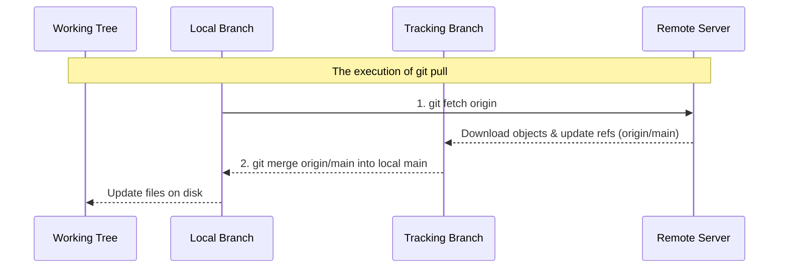

# Module 7: Professional Collaboration — Remotes and PRs

**Complexity**: [MEDIUM]  
**Time to Complete**: 75 minutes  
**Prerequisites**: Module 6 of Git Deep Dive  

## Learning Outcomes

Upon completing this module, you will be able to:
1. **Diagnose** discrepancies between local, remote-tracking, and remote branches to resolve synchronization issues without data loss.
2. **Implement** a strict fork-and-pull workflow using multiple remotes (`origin` and `upstream`) for secure enterprise collaboration.
3. **Evaluate** the safety of branch updates by choosing between `--force` and `--force-with-lease` based on shared branch states.
4. **Design** atomic commits that isolate infrastructure changes (e.g., separating Kubernetes ConfigMap updates from Deployment scaling) to streamline Pull Request reviews.
5. **Implement** conventional commit specifications and SSH/GPG signing to construct automated, verifiable project changelogs.

## Why This Module Matters

A junior platform engineer at a mid-sized logistics company merged a pull request containing a misconfigured Kubernetes Ingress manifest. Because the commits were tangled, massive, and lacked clear messages, the senior reviewer skimmed the 2,500-line diff, missed a crucial host routing rule, and approved the merge. The resulting deployment took down the primary shipping API for two hours, costing the company hundreds of thousands of dollars in lost transaction volume. The post-mortem revealed that the engineer had squashed multiple unrelated configuration changes—database migrations, service meshes, and the ingress rules—into a single monolithic commit with the vague message "update k8s manifests".

When infrastructure is defined as code, version control is the final safety net before production. Professional collaboration in Git is not merely about memorizing commands to move code from your laptop to a server; it is about communicating intent, minimizing blast radius, and ensuring that every proposed change is independently verifiable. If you cannot structure your commits logically and navigate remote branches with absolute confidence, you introduce systemic risk to your team's deployment pipeline.

In this module, you will transition from using Git as a personal save button to wielding it as a collaborative engineering instrument. You will master the mechanics of remote tracking, the nuances of push strategies, and the discipline required to construct pull requests that your peers can actually review effectively.

## 1. The Anatomy of a Remote and Tracking Branches

Many engineers mistakenly believe that when they reference `origin/main`, they are querying the remote server in real-time over the network. This is a dangerous misconception. Git is fundamentally decentralized. The branch `origin/main` is entirely local to your machine; it is a cached bookmark of what the remote branch looked like the last time your local repository communicated with the server.

To understand collaboration, you must visualize the three distinct layers of repository state:

```text
+-----------------------------------------------------------------------+
|                         Git Branch Architecture                       |
+-----------------------------------+-----------------------------------+
|           Local Machine           |           Remote Server           |
|                                   |                                   |
|  +-----------------------------+  |   +-----------------------------+ |
|  |       Local Branches        |  |   |      Remote Repository      | |
|  |       (refs/heads/)         |  |   |          (origin)           | |
|  |                             |  |   |                             | |
|  |  * main                     |  |   |  * main                     | |
|  |  * feature/add-redis        |  |   |  * feature/add-redis        | |
|  +--------------+--------------+  |   +---------------+-------------+ |
|                 |                 |                   |               |
|            git merge              |                   |               |
|                 |                 |                   |               |
|  +--------------v--------------+  |                   |               |
|  |   Remote Tracking Branches  |  |                   |               |
|  |      (refs/remotes/)        | <----- git fetch ----+               |
|  |                             |  |                                   |
|  |  * origin/main              |  |                                   |
|  |  * origin/feature/add-redis |  |                                   |
|  +-----------------------------+  |                                   |
+-----------------------------------+-----------------------------------+
```

When you work offline, you can checkout `main` and compare it against `origin/main` because `origin/main` is just a file on your hard drive (located in `.git/refs/remotes/origin/main`). It acts as a proxy.

### The Magic of the Refspec

How does Git actually know what `origin` means? The configuration is stored plainly in your `.git/config` file. If you run `cat .git/config`, you will see something like this:

```ini
[remote "origin"]
    url = git@github.com:kubedojo/core-platform.git
    fetch = +refs/heads/*:refs/remotes/origin/*
```

The `fetch` line is called a **Refspec**. It explicitly tells Git how to map the branches on the server to the branches on your local machine. 
- `refs/heads/*` is the source (the branches on the server).
- `refs/remotes/origin/*` is the destination (your local tracking branches).
- The `+` sign tells Git to forcefully update these tracking branches even if it results in a non-fast-forward update, ensuring your local cache is an exact mirror of the server.

### Inspecting Your Remotes

To view the remotes configured for your local repository without opening the config file, use the verbose flag:

```bash
git remote -v
```

Output:
```text
origin  git@github.com:kubedojo/core-platform.git (fetch)
origin  git@github.com:kubedojo/core-platform.git (push)
```

**Pause and predict: What do you think happens if you run `git commit` while on your local `main` branch? Does `origin/main` move?**
*Prediction outcome:* Only your local `main` branch pointer moves forward. `origin/main` remains exactly where it was, representing the last known state of the server. They are now diverged.

## 2. Fetch vs Pull: The Hidden Danger

Because `origin/main` is merely a local cache, it goes stale the moment a teammate pushes new code to the remote server. To update your cache, you must synchronize.

This is where the distinction between `git fetch` and `git pull` becomes critical.

### `git fetch`: The Safe Reconnaissance
Running `git fetch origin` simply connects to the remote, downloads any new commits, and updates your Remote Tracking Branches (`origin/*`). It does **not** touch your local branches or your working directory. It is completely safe. You can fetch a dozen times a day without impacting your ongoing work.

### `git pull`: The Aggressive Updater
Running `git pull` is a compound operation. Under the hood, it executes:
1. `git fetch origin`
2. `git merge origin/main` (assuming you are on the `main` branch)



### The Merge Commit Menace
If you have made local commits on `main`, and the remote `main` has also received new commits, `git pull` will automatically create a "Merge commit" to reconcile the two diverged histories.

```text
Fast-Forward Merge (Clean - when you have no local commits):
A --- B --- C (origin/main)
             \
              C' (main, after pull)

3-Way Merge (Messy - when histories have diverged):
A --- B --- C (origin/main)
       \      \
        D ---- M (main, after pull)
        ^
    Your local commit
```

This clutters the project history with unnecessary branch diamonds. To maintain a clean, linear history, modern engineering teams prefer rebasing over merging when pulling updates.

```bash
# Fetch and rebase your local commits on top of the remote updates
git pull --rebase origin main
```

You can make this the default behavior for your machine:
```bash
git config --global pull.rebase true
```

## 3. The Fork and Pull Model (Upstream vs Origin)

In enterprise environments and open-source projects, you rarely have direct write access to the central repository. Instead, you use the "Fork and Pull" model, often referred to as the **Triangle Workflow**.

1. **Upstream**: The central, authoritative repository (e.g., `kubedojo/core-platform`).
2. **Origin**: Your personal copy of the repository under your own account (e.g., `yourname/core-platform`).
3. **Local**: Your laptop.

You clone your fork to your laptop, meaning `origin` points to your personal copy. To stay synchronized with the rest of the team, you must manually add the central repository as a second remote called `upstream`.

```bash
# Add the central repository as a remote
git remote add upstream git@github.com:kubedojo/core-platform.git

# Verify the configuration
git remote -v
```

Expected output:
```text
origin    git@github.com:yourname/core-platform.git (fetch)
origin    git@github.com:yourname/core-platform.git (push)
upstream  git@github.com:kubedojo/core-platform.git (fetch)
upstream  git@github.com:kubedojo/core-platform.git (push)
```

### Synchronizing a Fork (The Triangle Workflow)
To bring your local `main` branch up to date with the team's central repository, you pull from one point of the triangle and push to another.

```bash
# 1. Fetch all updates from the central repository
git fetch upstream

# 2. Ensure you are on your local main branch
git checkout main

# 3. Update your local main to match upstream exactly
git rebase upstream/main

# 4. Push the synchronized state to your personal fork
git push origin main
```

**Pause and predict: If you accidentally run `git push upstream main`, what output do you expect?**
*Prediction outcome:* The server will reject the push with an HTTP 403 Forbidden error, because you do not have direct write permissions to the upstream repository. This is the exact security boundary the fork model is designed to enforce.

## 4. Force Pushing Safely: The Lease Mechanism

When you rebase a branch or amend a commit, you rewrite Git history. You are essentially creating entirely new commits that happen to have the same file contents. If you have already pushed the old version of that branch to a remote, your local history and the remote history now conflict. A standard `git push` will be rejected.

You must force the remote to accept your rewritten history.

### The Danger of `--force`
Running `git push --force` tells the remote server: "Overwrite whatever you have with my local state, no questions asked."

**War Story:** A platform engineer named Alex was working on a shared feature branch (`feature/helm-migration`). Alex rebased the branch locally to clean up commit messages, then typed `git push --force`. Meanwhile, a teammate, Sarah, had pushed three new commits to that exact remote branch an hour earlier. Alex's `--force` push completely eradicated Sarah's commits from the remote server. Git did exactly what it was told: it overwrote the server's history with Alex's local history.

### The Solution: `--force-with-lease`
Instead of unconditional destruction, use a lease.

```bash
git push --force-with-lease origin feature/helm-migration
```

When you use `--force-with-lease`, Git performs a safety check. It compares your local tracking branch (`origin/feature/helm-migration`) with the actual branch on the remote server. 
- If they match, it means nobody else has pushed new commits since your last fetch. The force push succeeds.
- If they do not match, it means someone (like Sarah) has pushed new work. The push is instantly rejected, saving your teammate's data.

**What to do when your lease is rejected?**
If `--force-with-lease` is rejected, do not panic and do not fall back to `--force`.
1. Run `git fetch origin` to update your tracking branches.
2. Run `git log origin/feature-branch` to see what your teammate pushed.
3. Incorporate their changes into your work (usually via `git rebase origin/feature-branch`).
4. Attempt the `--force-with-lease` push again.

Always use `--force-with-lease`. Never use `--force`.

## 5. Pull Request Lifecycles and Atomic Commits

A Pull Request (PR) is a request to merge your branch into the upstream main branch. The quality of a PR is determined entirely by the commits it contains.

An **Atomic Commit** is a commit that does exactly one logical thing, and leaves the repository in a fully functional state. It should compile, tests should pass, and the infrastructure should deploy successfully at every single commit in the history.

Consider you need to update a Kubernetes Deployment to use a new ConfigMap.

**Bad Practice (The Monolithic Commit):**
You modify `deployment.yaml`, `configmap.yaml`, `service.yaml`, and update a Python script, then commit them all together with the message: `fix: update environment setup`.

If the deployment fails, the team must revert the entire commit, removing the valid Python script and Service changes along with the broken ConfigMap.

**Good Practice (Atomic Commits):**
You break the changes down logically using Git's interactive staging tool: `git add -p`.

```bash
git add -p deployment.yaml
```

Git will present you with "hunks" of code and ask what you want to do:
```text
diff --git a/deployment.yaml b/deployment.yaml
@@ -14,6 +14,9 @@
     spec:
       containers:
       - name: api
+        envFrom:
+        - configMapRef:
+            name: app-config
         image: internal.registry.com/finance/payment:v1.2.4

Stage this hunk [y,n,q,a,d,s,e,?]? 
```

You can press `y` to stage it, `n` to skip it, or `s` to split it into smaller pieces. This allows you to construct precise, logical commits out of a messy working directory.

Commit 1: Add the new ConfigMap variables.
```yaml
# configmap.yaml
apiVersion: v1
kind: ConfigMap
metadata:
  name: app-config
data:
  ENABLE_NEW_FEATURE: "true"
  CACHE_TIMEOUT_SECONDS: "300"
```

Commit 2: Mount the ConfigMap in the Deployment.
```yaml
# deployment.yaml
apiVersion: apps/v1
kind: Deployment
metadata:
  name: backend-api
spec:
  template:
    spec:
      containers:
      - name: api
        envFrom:
        - configMapRef:
            name: app-config
```

Commit 3: Update the Python script logic.

*Note: The manifest examples in this module assume Kubernetes 1.35+ compatibility, ensuring we are using the latest stable API behaviors.*

When you open a PR containing these three atomic commits, the reviewer can step through the logic sequentially. If the Deployment configuration is wrong, they can request changes specifically to Commit 2.

## 6. Conventional Commits and Signed Commits

To further professionalize collaboration, teams use **Conventional Commits** to standardize commit messages, allowing automated tools to generate changelogs and determine semantic version bumps automatically.

### Conventional Commit Format

```text
<type>[optional scope]: <description>

[optional body]

[optional footer(s)]
```

Common types and their semantic versioning implications:
- `fix:` A bug fix. (Triggers a PATCH release, e.g., `v1.0.1`)
- `feat:` A new feature or capability. (Triggers a MINOR release, e.g., `v1.1.0`)
- `docs:` Documentation only changes. (No release)
- `chore:` Maintenance tasks, dependency updates. (No release)
- `refactor:` Code changes that neither fix a bug nor add a feature. (No release)
- `BREAKING CHANGE:` anywhere in the footer or a `!` after the type (Triggers a MAJOR release, e.g., `v2.0.0`)

Example:
```text
feat(ingress): add TLS termination for backend services

Configured the cert-manager annotations on the primary ingress route
to automate Let's Encrypt certificate provisioning.

Resolves: #812
```

### Commit Signing
To verify that a commit actually came from you (and not an attacker spoofing your email address), you should cryptographically sign your commits.

Historically, this required complex GPG key management. As of Git 2.34, you can use standard SSH keys instead.

```bash
# Configure Git to use SSH for signing
git config --global gpg.format ssh

# Point Git to your public SSH key
git config --global user.signingkey ~/.ssh/id_ed25519.pub

# Tell Git to sign all commits automatically
git config --global commit.gpgsign true
```

Now, every time you commit, Git will use your SSH key to sign the objects, and platforms like GitHub/GitLab will display a trusted "Verified" badge next to your work.

## 7. Reviewing Code: The Human Element

Submitting a Pull Request is only half the battle; reviewing your peers' code is the other. Effective code review is a high-level skill that separates junior engineers from seniors.

**What to Ignore:**
- Formatting, spacing, and styling. (These should be handled automatically by linters and formatters like `Prettier` or `gofmt`).
- Missing semicolons or trivial syntax issues.

**What to Focus On:**
- **Architecture**: Does this change fit the overall design of the system?
- **Security**: Are credentials hardcoded? Are Kubernetes security contexts overly permissive (e.g., `runAsRoot: true`)?
- **Resilience**: Are there resource limits on the containers? What happens if the downstream service is unavailable?
- **Observability**: Did the developer add necessary logging or metrics for the new feature?

When reviewing, be kind but rigorous. Instead of saying, "This is wrong, use a Secret instead of a ConfigMap," say, "Since this contains an API key, we should consider moving this to a Kubernetes Secret to prevent exposing it in plaintext logs. What do you think?"

### Code Review Anti-Patterns

| Anti-Pattern | Description | How to Fix It |
|--------------|-------------|---------------|
| **The Rubber Stamp** | Approving a PR purely based on trust or because "it's just a config change." | Actually pull the branch locally and test it. Read every line. |
| **The Syntax Sniper** | Focusing entirely on tabs vs spaces, variable names, or other linting errors. | Configure an automated CI pipeline with a linter so humans don't have to check syntax. |
| **The Ghost Reviewer** | Leaving comments on a PR but never returning to approve it after the author makes the requested changes. | Set clear SLAs for re-reviewing code (e.g., within 24 hours of an update). |
| **The Monolith Approver** | Reviewing a 3,000-line PR and giving up halfway through, just approving it to get it out of the queue. | Reject the PR and ask the author to split it into multiple, smaller, atomic PRs. |

## Did You Know?

1. The Linux Kernel mailing list still relies heavily on `git format-patch` and email threads for reviewing code, eschewing modern web-based Pull Requests entirely.
2. Git does not track directories, only files. A directory only exists in Git's internal object database if it contains at least one tracked file.
3. The conventional commit specification was heavily inspired by the Angular project's commit guidelines, which were formalized in 2014 to manage their massive changelogs.
4. SSH keys can be used to sign Git commits natively as of Git version 2.34, removing the complex requirement of managing GPG keys for developers who already use SSH for authentication.

## Common Mistakes

| Mistake | Why It Happens | How to Fix It |
|---------|----------------|---------------|
| Running `git pull` on a diverged branch | Git defaults to merging the remote tracking branch into the local branch, creating an unnecessary merge commit. | Configure Git to rebase on pull by default: `git config --global pull.rebase true`. |
| Pushing with `git push --force` | You rebased locally and the remote rejected the standard push, so you forced it blindly. | Always use `git push --force-with-lease` to protect teammates' pushed commits. |
| Committing secrets to a branch | Forgetting to add `.env` files or credentials to `.gitignore` before running `git add .`. | Use `git rm --cached <file>` immediately, and consider using tools like `git-filter-repo` if it has already been pushed. |
| Vague commit messages | Treating the commit message as a chore rather than a communication tool (e.g., "updates"). | Adopt the Conventional Commits specification and describe *why* the change was made, not just *what* changed. |
| Pushing directly to upstream `main` | Having write permissions to the central repo and bypassing the PR review process. | Protect the `main` branch in repository settings so it strictly requires verified Pull Requests to modify. |
| Squashing unrelated changes | Laziness; wanting to group an afternoon's worth of disparate work into one save point. | Use `git add -p` to interactively stage specific chunks of files into separate, atomic commits. |
| Panicking when a lease is rejected | You used `--force-with-lease` and it failed, so you switch to `--force`. | Stop. Fetch the remote, inspect the new commits, rebase them into your work, and try the lease again. |

## Quiz

<details>
<summary>Question 1: You are ready to start work on a new feature. You know the upstream `main` branch has received updates since yesterday. What sequence of commands ensures your local `main` is perfectly synced before you branch off?</summary>
Answer: First, `git fetch upstream` to update your tracking branches. Then, `git checkout main` to ensure you are on the correct local branch. Finally, `git rebase upstream/main` to fast-forward your local branch to match the remote state. (Using `git pull --rebase upstream main` achieves the same in one step).
</details>

<details>
<summary>Question 2: You just spent an hour rebasing your local feature branch to squash some messy commits. You run `git push origin my-feature` and it is rejected. Why did this happen, and what is the safest way to proceed?</summary>
Answer: It was rejected because rebasing rewrites commit hashes, causing your local history to diverge from the remote history. The safest way to proceed is `git push --force-with-lease origin my-feature`. This forces the update but aborts if someone else has pushed new commits to the remote in the meantime.
</details>

<details>
<summary>Question 3: Your team requires atomic commits. You have added a new Redis deployment manifest, updated the backend Service manifest to expose a new port, and fixed a typo in the README. How should you commit these?</summary>
Answer: You should create three separate commits using `git add -p` or by specifying the files individually: one commit for the Redis deployment (`feat(cache): add redis deployment`), one for the Service port update (`feat(api): expose backend port 8080`), and one for the README typo (`docs: fix typo in setup instructions`).
</details>

<details>
<summary>Question 4: You run `git fetch origin`. Which of the following statements is true regarding your local working directory?</summary>
Answer: Your local working directory is completely unchanged. `git fetch` only communicates with the remote server to download new objects and updates your hidden Remote Tracking Branches (like `origin/main`). It does not merge or rebase anything into your active files.
</details>

<details>
<summary>Question 5: What is the primary architectural difference between an `origin` remote and an `upstream` remote in the Fork and Pull model?</summary>
Answer: There is no technical difference in Git—they are both just URL aliases configured in `.git/config`. The difference is purely conventional. `upstream` refers to the central, authoritative repository maintained by the organization, while `origin` refers to your personal, writable copy (fork) of that repository hosted under your own account.
</details>

<details>
<summary>Question 6: A teammate reviews your Pull Request and asks you to change a label in your Kubernetes Deployment manifest. You make the change locally. How do you update the PR without adding a messy "fix label" commit to the history?</summary>
Answer: You stage the change with `git add deployment.yaml`, then run `git commit --amend --no-edit` to fold the change into your previous commit. Finally, you run `git push --force-with-lease origin branch-name` to update the Pull Request on the server.
</details>

<details>
<summary>Question 7: You are examining a repository's log and see a commit message starting with `chore(deps):`. What does this indicate based on Conventional Commits?</summary>
Answer: The `chore` type indicates a routine maintenance task that does not add a feature or fix a bug in the application code. The `(deps)` scope specifically indicates that this commit involves updating dependencies or libraries.
</details>

<details>
<summary>Question 8: Why is cryptographically signing Git commits important in an enterprise environment?</summary>
Answer: Git allows you to set your `user.name` and `user.email` to absolutely anything in your local configuration, making it trivial to impersonate another developer. Cryptographic signing (via SSH or GPG) proves that the commit was generated by someone holding the corresponding private key, verifying authenticity and preventing supply-chain spoofing attacks.
</details>

## Hands-On Exercise

In this exercise, you will simulate a professional fork-and-pull workflow by creating atomic commits and navigating a PR review loop. 

**Setup Instructions:**
1. Create a new empty directory on your machine named `k8s-pr-lab` and initialize a git repository.
2. We will simulate the `upstream` and `origin` remotes using local folders instead of GitHub to keep the exercise self-contained.

### Task 1: Setup the Simulated Remotes
Execute the following commands to create the "server" repositories.

```bash
# Create the upstream central repository
mkdir upstream.git
cd upstream.git
git init --bare
cd ..

# Create your personal fork repository
mkdir origin.git
cd origin.git
git init --bare
cd ..
```

Now, link your working repository to these remotes.

```bash
cd k8s-pr-lab
git remote add origin ../origin.git
git remote add upstream ../upstream.git

# Create an initial commit so branches exist
echo "# Core Platform" > README.md
git add README.md
git commit -m "chore: initial project setup"
git push origin main
git push upstream main
```

### Task 2: Create a Feature Branch
As a Kubernetes practitioner, you should configure the standard alias for kubectl if you haven't already: `alias k=kubectl`. We are defining infrastructure, so create a new feature branch for adding an NGINX deployment.

```bash
git checkout -b feat/nginx-deployment
```

### Task 3: Make Atomic Commits
Create the Kubernetes manifests using two distinct, atomic commits with conventional commit messages.

First, create the namespace manifest:
```yaml
# namespace.yaml
apiVersion: v1
kind: Namespace
metadata:
  name: web-tier
```
Commit this file isolated:
```bash
git add namespace.yaml
git commit -m "feat(k8s): add web-tier namespace"
```

Next, create the deployment manifest:
```yaml
# deployment.yaml
apiVersion: apps/v1
kind: Deployment
metadata:
  name: nginx
  namespace: web-tier
spec:
  replicas: 2
  selector:
    matchLabels:
      app: nginx
  template:
    metadata:
      labels:
        app: nginx
    spec:
      containers:
      - name: nginx
        image: nginx:1.24-alpine
```
Commit this file isolated:
```bash
git add deployment.yaml
git commit -m "feat(k8s): add nginx deployment"
```

### Task 4: Push to Your Fork
Push your feature branch to your personal `origin` repository.
```bash
git push origin feat/nginx-deployment
```

### Task 5: Respond to Review Feedback
Imagine a reviewer requested that you increase the `replicas` to `3`. Instead of making a new "fix replicas" commit, you will amend your previous work to keep the history clean.

Modify `deployment.yaml` and change `replicas: 2` to `replicas: 3`.

```bash
# Stage the change
git add deployment.yaml

# Fold it into the previous commit
git commit --amend --no-edit

# Safely force push the rewritten commit to your fork
git push --force-with-lease origin feat/nginx-deployment
```

### Task 6: Review and Merge via Squash
In the real world, you would open a PR on GitHub. Here, we will simulate the repository maintainer reviewing and merging your code using a squash merge. A squash merge takes all the commits from your feature branch, squashes them into a single new commit, and places it on the `main` branch. This keeps the `main` branch history pristine.

Checkout the `main` branch and merge the feature branch using the squash flag:
```bash
git checkout main
git merge --squash feat/nginx-deployment
```

At this point, Git has prepared the merge but has *not* created a commit. Check your status:
```bash
git status
```

Commit the squashed changes with a new conventional commit message that summarizes the entire PR:
```bash
git commit -m "feat(web): introduce nginx deployment and namespace

This adds the core web-tier namespace and the nginx deployment 
configured for 3 replicas based on review feedback.

Resolves PR #1"
```

### Task 7: Cleanup
Push the newly squashed commit to upstream (simulating the maintainer hitting "Merge PR").
```bash
git push upstream main
```

Now, delete your local feature branch to keep your workspace clean:
```bash
git branch -d feat/nginx-deployment
```

And finally, fetch from upstream and sync your origin to complete the triangle:
```bash
git fetch upstream
git rebase upstream/main
git push origin main
```

### Success Criteria Checklist
- [ ] You have two remote repositories configured (`origin` and `upstream`).
- [ ] Your feature branch contains exactly two new commits (one for namespace, one for deployment).
- [ ] The deployment commit message strictly follows the conventional commit format.
- [ ] You successfully utilized `--force-with-lease` to update a remote branch after an amend operation.
- [ ] You successfully squashed the feature branch into the `main` branch, resulting in a single clean commit.

### Solutions
<details>
<summary>View the commands to verify your repository state</summary>

Run `git remote -v` to check remotes:
```text
origin    ../origin.git (fetch)
origin    ../origin.git (push)
upstream  ../upstream.git (fetch)
upstream  ../upstream.git (push)
```

Run `git log --oneline` to verify the atomic commits before squashing:
```text
a1b2c3d (HEAD -> feat/nginx-deployment, origin/feat/nginx-deployment) feat(k8s): add nginx deployment
e4f5g6h feat(k8s): add web-tier namespace
i7j8k9l (upstream/main, origin/main, main) chore: initial project setup
```

Run `git log --oneline main` to verify the squashed state:
```text
m0n1o2p (HEAD -> main, upstream/main, origin/main) feat(web): introduce nginx deployment and namespace
i7j8k9l chore: initial project setup
```
*(Your commit hashes will differ)*
</details>

## Next Module

Ready to apply these concepts to massive, monorepo environments? Move on to [Module 8: Efficiency at Scale](../module-8-scale/).
