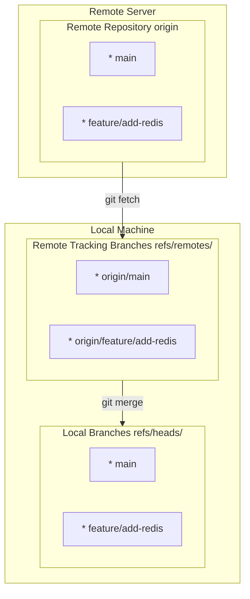
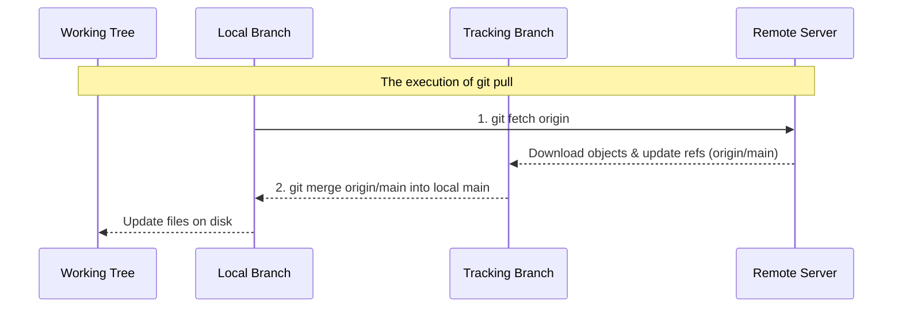
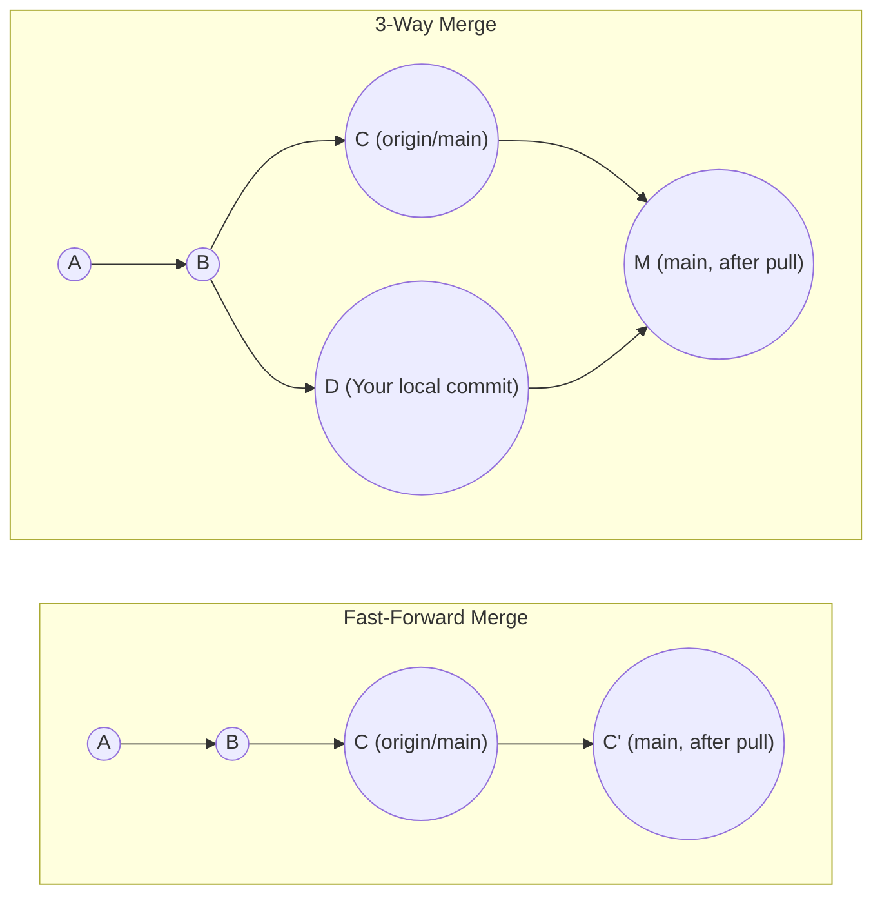
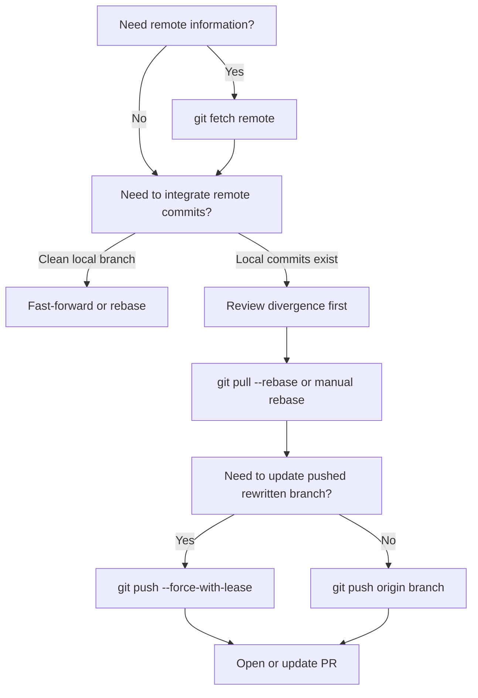

# Module 7: Professional Collaboration - Remotes and PRs

**Complexity**: [MEDIUM]. **Time to Complete**: 90 minutes. **Prerequisites**: Module 6 of Git Deep Dive, comfort with branches, and basic Kubernetes manifest editing. This module uses Kubernetes 1.35+ examples and introduces the standard `alias k=kubectl` convention before using short `k apply` commands in review workflows.

## Learning Outcomes

Upon completing this module, you will be able to perform the following review and synchronization tasks in realistic collaboration workflows:

1. **Diagnose** discrepancies between local, remote-tracking, and remote branches to resolve synchronization issues without data loss.
2. **Implement** a strict fork-and-pull workflow using multiple remotes (`origin` and `upstream`) for secure enterprise collaboration.
3. **Evaluate** the safety of branch updates by choosing between `--force` and `--force-with-lease` based on shared branch states.
4. **Design** atomic commits that isolate infrastructure changes, such as separating Kubernetes ConfigMap updates from Deployment scaling, to streamline Pull Request reviews.
5. **Implement** conventional commit specifications and SSH/GPG signing to construct automated, verifiable project changelogs.

## Why This Module Matters

A junior platform engineer at a mid-sized logistics company merged a pull request containing a misconfigured Kubernetes Ingress manifest. Because the commits were tangled, massive, and labeled with a vague message, the senior reviewer skimmed a 2,500-line diff, missed a critical host routing rule, and approved the change during a release window. The resulting deployment sent shipping API traffic to the wrong backend for two hours, interrupting order creation and costing the company hundreds of thousands of dollars in lost transaction volume and customer credits.

The post-incident review found no exotic Git bug, no broken CI runner, and no mysterious platform outage. The failure came from ordinary collaboration habits: stale local branches, a branch pushed from the wrong remote, unrelated Kubernetes ConfigMap and Deployment edits packed into one commit, and a pull request that asked reviewers to trust intent instead of verifying it. The team had used Git as a file transport mechanism, but production needed Git to behave like an audit trail, a safety boundary, and a shared reasoning system.

When infrastructure is defined as code, version control is the final safety net before production. Professional collaboration in Git is not merely about memorizing commands to move code from a laptop to a server; it is about communicating intent, minimizing blast radius, and ensuring that every proposed change is independently reviewable. In this module, you will move from using Git as a personal save button to using it as a collaborative engineering instrument, with special attention to remote state, fork boundaries, safe history rewriting, atomic pull requests, and verifiable commits.

## 1. Remote State Is a Local Cache, Not a Live Window

Many engineers mistakenly believe that `origin/main` is a live view of the remote server. That misunderstanding creates real operational risk, because it encourages people to make safety decisions from stale evidence. Git is distributed by design, so most names you inspect locally are just references in your `.git` directory. A remote-tracking branch such as `origin/main` is a local bookmark that records what the remote branch looked like the last time your repository communicated with that server.

Think of remote-tracking branches like a printed train schedule on your desk. The schedule may have been accurate when you printed it, and it is useful for planning, but it does not prove that the train has not been delayed since then. `git fetch` is how you print a fresh schedule. Until you fetch, comparisons between `main` and `origin/main` are comparisons between your local branch and your last known copy of the remote branch, not a conversation with GitHub, GitLab, or another server.



This diagram matters because each layer has a different owner and a different update rule. Local branches move when you commit, merge, rebase, reset, or check out a new position. Remote-tracking branches move when you fetch, pull, or push in ways that update your local knowledge. Remote branches move when someone successfully pushes to the server. Confusing those layers is how engineers accidentally rebase stale work, push to the wrong destination, or assume a teammate has not changed a branch when the only thing that is stale is their own cache.

The mapping from remote server branches into local remote-tracking branches is not magical. It is configured by a refspec in `.git/config`, which tells Git where to fetch from and where to store the result locally. Reading this configuration once removes a lot of superstition from remote work, because it shows that `origin` is just a named remote with a URL and a mapping rule.

```ini
[remote "origin"]
    url = git@github.com:kubedojo/core-platform.git
    fetch = +refs/heads/*:refs/remotes/origin/*
```

The source side, `refs/heads/*`, means "all branch heads on the remote server." The destination side, `refs/remotes/origin/*`, means "store those remote branch positions under my local remote-tracking namespace." The leading plus sign allows Git to update the tracking reference even when the remote branch moved in a non-fast-forward way, because the tracking reference is supposed to mirror the server rather than protect local work. Your local branch is protected separately by merge, rebase, and push rules.

You can inspect remotes without opening the config file, and you should do this whenever a repository has more than one collaboration path. A surprising number of production mistakes start with a developer assuming `origin` points to the central repository when it actually points to a personal fork, a stale mirror, or a temporary migration remote.

```bash
git remote -v
```

The output should show separate fetch and push URLs for the same remote, which is the simplest healthy configuration for a single-remote repository:

```text
origin  git@github.com:kubedojo/core-platform.git (fetch)
origin  git@github.com:kubedojo/core-platform.git (push)
```

Pause and predict: if you run `git commit` while checked out on local `main`, what do you think happens to `origin/main`? The important answer is that only your local `main` branch pointer moves forward. `origin/main` stays exactly where it was, because it represents your last fetched knowledge of the server, not your current local work and not a live server query.

This distinction is the foundation for diagnosing remote discrepancies. When `git status` says your branch is ahead, behind, or diverged, Git is comparing your local branch to its configured upstream tracking branch. That comparison is only as current as your most recent fetch. A disciplined engineer therefore treats `git fetch --all --prune` as reconnaissance, not as a risky operation, and uses it before making decisions about rebasing, force pushing, or reviewing whether a branch is safe to delete.

One useful diagnostic habit is to name the branch layer out loud before acting. "My local `main` is ahead of `origin/main`" is a different statement from "the remote server is ahead of my local `main`," and both are different from "my fork is behind upstream." That precision slows people down just enough to prevent destructive guesses. In team channels and incident notes, precise branch language also helps another engineer reproduce your state without sitting at your keyboard.

## 2. Fetch, Pull, and the Shape of History

Because remote-tracking branches are local cache entries, synchronization has two separate concerns: updating your knowledge of the remote and integrating that knowledge into your current work. `git fetch` handles the first concern and stops there. It connects to the remote, downloads objects you do not yet have, and updates `origin/*` or another remote-tracking namespace. It does not rewrite your working tree, change staged files, or move your local branch.

`git pull` handles both concerns in one command, which is why it feels convenient and occasionally dangerous. A pull first fetches from the remote, then integrates the fetched tracking branch into your current branch by merge or rebase depending on configuration and flags. The danger is not that pull is broken; the danger is that it hides two decisions inside one word. In calm conditions that shortcut is fine, but during review repair, incident response, or branch recovery, you usually want to inspect before you integrate.



The hidden integration step is where teams accidentally create noisy merge commits. If your local branch has commits that the remote branch does not have, and the remote branch has commits that your local branch does not have, a merge-based pull must create a new merge commit to connect the histories. That merge commit may be technically valid, but it often adds no useful design information to a feature branch and makes later review harder.



Modern review-oriented teams often prefer a linear feature history because it lets reviewers read the branch as a sequence of decisions. Rebasing local commits on top of the latest remote state preserves that shape by replaying your work after the commits that already exist upstream. The tradeoff is that rebasing rewrites commit hashes, so it is appropriate for your own unpublished or review-branch work but should be handled carefully on shared branches.

```bash
# Fetch and rebase your local commits on top of the remote updates
git pull --rebase origin main
```

You can make this frequent behavior the default for your machine, which reduces accidental merge commits when you pull updates into local feature branches:

```bash
git config --global pull.rebase true
```

Before running a pull during real work, pause and ask a better diagnostic question: "Do I want to update my knowledge, or do I want to modify my current branch right now?" If you only need knowledge, fetch. If you are ready to integrate and have reviewed the incoming branch position, pull with the integration mode your team expects. That small pause prevents the common panic where an engineer thinks Git destroyed their work when it actually performed the merge they requested without realizing the branch had diverged.

A practical Kubernetes example makes the decision concrete. Suppose you are editing `deployment.yaml` for a backend rollout and a teammate has just changed `configmap.yaml` on `origin/main`. Running `git fetch origin` lets you inspect the teammate's commit before your local files move. You can compare the branch tips, read the diff, and decide whether to rebase now or finish your local commit first. If you have defined `alias k=kubectl`, you can later validate the integrated manifest with `k apply --dry-run=server -f deployment.yaml` after the history is intentionally updated rather than accidentally blended.

## 3. Fork-and-Pull Workflows Create a Deliberate Security Boundary

In enterprise environments and open-source projects, you often should not have direct write access to the central repository even if you are a trusted contributor. The fork-and-pull model creates a deliberate buffer between personal work and authoritative history. Your fork is the place where you can push branches freely, experiment with rebases, and update pull requests. The upstream repository is the controlled integration point where branch protection, required reviews, signed commits, and CI checks decide what becomes official.

This model is often called the triangle workflow because your local repository talks to two server-side repositories. `origin` usually points to your writable fork, while `upstream` points to the canonical project. That naming is convention rather than law, but it is so common that following it reduces cognitive load for every reviewer and teammate who helps you debug a remote problem.

```bash
# Add the central repository as a remote
git remote add upstream git@github.com:kubedojo/core-platform.git

# Verify the configuration
git remote -v
```

The expected output makes the fork boundary visible by showing your writable `origin` separately from the authoritative `upstream` project:

```text
origin    git@github.com:yourname/core-platform.git (fetch)
origin    git@github.com:yourname/core-platform.git (push)
upstream  git@github.com:kubedojo/core-platform.git (fetch)
upstream  git@github.com:kubedojo/core-platform.git (push)
```

The operational habit is simple: fetch from the authority, branch locally, push your proposal to your fork, then open a pull request against upstream. This is not bureaucracy for its own sake. It ensures that the same code path handles contributions from employees, contractors, and external maintainers, and it prevents a single mistaken `git push` from bypassing the review system that protects production.

```bash
# 1. Fetch all updates from the central repository
git fetch upstream

# 2. Ensure you are on your local main branch
git checkout main

# 3. Update your local main to match upstream exactly
git rebase upstream/main

# 4. Push the synchronized state to your personal fork
git push origin main
```

Pause and predict: if you accidentally run `git push upstream main` from a repository where you lack direct write permissions, what output do you expect and why? The expected result is a permission rejection from the hosting platform, often an HTTP 403 or SSH authorization error. That rejection is not a nuisance; it is the security boundary doing its job by forcing changes through pull requests instead of direct mutation.

The fork workflow also gives you a cleaner diagnostic vocabulary. If your branch is missing a teammate's merged work, ask whether you fetched from `upstream`, not whether "GitHub is behind." If your pull request does not update after a push, ask whether you pushed to `origin` and whether the PR source branch points to that fork. If your local `main` differs from both `origin/main` and `upstream/main`, ask which one represents your personal mirror and which one represents the project authority.

There is one subtle tradeoff: maintaining two remotes means you can create two kinds of staleness. Your local repository can be stale relative to upstream, and your fork can be stale relative to both upstream and your local work. The synchronization loop above closes that gap by updating local `main` from upstream and then pushing the synchronized `main` back to origin. In professional review flows, that extra push is useful because it keeps future feature branches and web-based comparisons from being based on an old fork state.

Teams that skip the fork synchronization step often discover the cost later, when a contributor opens a pull request whose base comparison includes months of unrelated upstream history. The code may be correct, but the review becomes noisy because the hosting platform is comparing from a stale fork branch. Keeping `origin/main` aligned with `upstream/main` is therefore not only housekeeping. It protects reviewer attention, keeps conflict resolution close to the author, and makes the eventual pull request show only the intended branch delta.

## 4. Safe History Rewriting Depends on Leases

Rebasing, squashing, and amending are normal parts of preparing a clean pull request. They are not dishonest when used on a review branch; they are editing the proposed story before it becomes project history. The danger appears when a rewritten branch has already been pushed, because the old commit hashes still exist on the remote while your local branch now contains replacement commits. A normal push is rejected because the remote cannot fast-forward from the old history to your rewritten history.

The blunt tool is `--force`, which tells the remote to accept your local branch position regardless of what currently exists on the server. That command is sometimes described as dangerous in a vague way, but the concrete danger is data loss for teammates. If another engineer pushed commits to the same branch after your last fetch, an unconditional force push can remove their commits from the branch tip even though you never saw them locally.

**War Story:** A platform engineer named Alex was working on a shared feature branch called `feature/helm-migration`. Alex rebased the branch locally to clean up commit messages, then typed `git push --force`. Meanwhile, a teammate, Sarah, had pushed three new commits to that exact remote branch earlier that morning. Alex's push completely replaced the server's branch with the local rewritten branch, and Git did exactly what it was instructed to do.

The safer tool is `--force-with-lease`, which turns the push into a conditional update. The lease says, in effect, "rewrite the remote branch only if it still points to the commit that my local remote-tracking branch says it points to." If the server has moved since your last fetch, the lease fails and the push is rejected. That rejection is a feature, because it tells you your local mental model is stale before you overwrite someone else's work.

```bash
git push --force-with-lease origin feature/helm-migration
```

Stop and think: why does the lease check use your remote-tracking branch instead of trusting your memory of the branch? The reason is that Git can compare object IDs precisely, while human memory collapses branch state into vague phrases like "I fetched recently." A lease converts "recently" into a specific expected commit. If the server does not match that expected commit, Git refuses to proceed until you fetch and inspect the new state.

When a lease is rejected, the correct response is not to fall back to `--force`. Fetch the remote, inspect the new commits, and decide how to incorporate them. A typical repair loop is `git fetch origin`, `git log origin/feature/helm-migration`, and then a rebase or merge that deliberately includes the teammate's work. Only after your local branch is based on the updated remote state should you try `--force-with-lease` again.

The lease mechanism is also a useful social signal. If a branch rejects your push, Git is telling you that your assumption of sole ownership is no longer guaranteed. That does not always mean a teammate intentionally collaborated on your branch; automation might have updated it, a maintainer might have pushed a fix, or a previous local machine might have moved the same branch. In all cases, the safe next step is investigation, because the cost of one extra fetch is tiny compared with reconstructing lost review work.

This habit matters during pull request review because review branches are often rewritten in response to feedback. You might amend a Kubernetes Deployment commit after a reviewer asks for a resource limit, squash a noisy "fix typo" commit into the original documentation change, or rebase on a newly merged security patch. Those are reasonable operations when you own the review branch. They become risky only when the branch is shared and the push command ignores whether the server changed while you were editing.

## 5. Pull Requests Are Reviewable Stories, Not File Dumps

A pull request is not merely a request to merge files. It is a structured argument that says, "Here is the problem, here is the smallest coherent change that solves it, here is how I tested it, and here is the evidence reviewers need to trust it." The quality of that argument is determined largely by the commits it contains. If each commit does one logical thing and leaves the repository in a working state, reviewers can evaluate design decisions rather than untangling the author's afternoon.

An atomic commit is a commit that does exactly one logical thing and keeps the repository functional. In infrastructure code, that often means separating a ConfigMap data change from a Deployment wiring change, or separating a Service port change from an application code change. The point is not aesthetic purity. The point is operational reversibility. During an incident, `git revert` is only surgical if the original commit was surgical.

Consider a change that updates a Kubernetes Deployment to consume a new ConfigMap. A monolithic approach modifies `deployment.yaml`, `configmap.yaml`, `service.yaml`, and a Python helper script, then commits everything as `fix: update environment setup`. If the rollout fails because the ConfigMap contains an invalid key, the team must either revert unrelated valid work or manually craft a forward fix while production is degraded. The commit has made the rollback decision harder than the original configuration problem.

The better approach is to stage the work by intent. Use `git add -p` when one file contains multiple unrelated hunks, and use explicit file paths when files naturally map to separate logical changes. This is a review skill as much as a Git skill. You are shaping the evidence so reviewers can verify one claim at a time.

```bash
git add -p deployment.yaml
```

Git will present you with "hunks" of code and ask what you want to do, which turns one messy file edit into a set of intentional review decisions:

```text
diff --git a/deployment.yaml b/deployment.yaml
@@ -14,6 +14,9 @@
     spec:
       containers:
       - name: api
+        envFrom:
+        - configMapRef:
+            name: app-config
         image: internal.registry.com/finance/payment:v1.2.4

Stage this hunk [y,n,q,a,d,s,e,?]? 
```

You can press `y` to stage the hunk, `n` to skip it, or `s` to split it into smaller pieces when Git can divide the patch safely. That interaction may feel slow at first, but it is faster than asking three reviewers to reverse-engineer which lines belong together. It also lets you build a branch where each commit can be checked out, tested, and reverted independently.

Commit 1 adds only the new ConfigMap variables, so reviewers can evaluate configuration data without also reasoning about Deployment wiring:

```yaml
# configmap.yaml
apiVersion: v1
kind: ConfigMap
metadata:
  name: app-config
data:
  ENABLE_NEW_FEATURE: "true"
  CACHE_TIMEOUT_SECONDS: "300"
```

Commit 2 mounts the ConfigMap in the Deployment, which is a separate runtime integration decision with a different rollback profile:

```yaml
# deployment.yaml
apiVersion: apps/v1
kind: Deployment
metadata:
  name: backend-api
spec:
  selector:
    matchLabels:
      app: backend-api
  template:
    metadata:
      labels:
        app: backend-api
    spec:
      containers:
      - name: api
        envFrom:
        - configMapRef:
            name: app-config
        image: internal.registry.com/finance/payment:v1.2.4
```

Commit 3 updates the Python script logic, keeping application behavior separate from Kubernetes resource definition changes in the review history.

The manifest examples in this module assume Kubernetes 1.35+ compatibility, so the API versions shown here are stable for modern clusters. If you have `alias k=kubectl` defined in your shell, validate the manifest shape with a server-side dry run such as `k apply --dry-run=server -f deployment.yaml` after the branch contains the intended commits. Validation does not replace review, but it gives reviewers stronger evidence that the proposed history is not merely tidy; it is also deployable.

Before opening a pull request, read your branch with the reviewer in mind. Does the first commit establish a prerequisite? Does the second commit use it? Does the final commit update tests, documentation, or automation in a way that follows from the earlier changes? If the branch reads like a sequence of clean engineering decisions, reviewers can focus on architecture, security, resilience, and observability instead of asking the author to split the work after the fact.

This is where atomic commits become a mentoring tool rather than a private preference. A reviewer can leave a focused comment on the Deployment commit, approve the ConfigMap commit, and ask for a test adjustment in the script commit without mixing concerns. The author receives clearer feedback, and the team builds a shared vocabulary for change size. Over time, those habits reduce review latency because small, well-labeled commits make it easier to distinguish real risk from ordinary implementation detail.

## 6. Conventional and Signed Commits Turn History into Automation Evidence

Commit messages are part of the product interface for future maintainers. A vague message like `updates` forces every later reader to open the diff and infer intent. A conventional message gives automation and humans a compact summary of the kind of change being made, the area affected, and whether the change should influence release notes or version numbers. This is especially valuable in platform repositories where infrastructure, application code, policy, and documentation often live together.

Conventional Commits provide a lightweight grammar. The type communicates intent, the optional scope points to the affected subsystem, the description names the behavior change, and the body or footer explains context that does not fit on one line. The format is simple enough to write by hand but structured enough for changelog generators and release pipelines.

```text
<type>[optional scope]: <description>

[optional body]

[optional footer(s)]
```

Common types and their semantic versioning implications give both humans and automation a shared vocabulary for deciding release impact:

- `fix:` A bug fix. (Triggers a PATCH release, e.g., `v1.0.1`)
- `feat:` A new feature or capability. (Triggers a MINOR release, e.g., `v1.1.0`)
- `docs:` Documentation only changes. (No release)
- `chore:` Maintenance tasks, dependency updates. (No release)
- `refactor:` Code changes that neither fix a bug nor add a feature. (No release)
- `BREAKING CHANGE:` anywhere in the footer or a `!` after the type (Triggers a MAJOR release, e.g., `v2.0.0`)

This example shows how a concise subject, explanatory body, and issue reference combine into a commit message that supports review and later auditing:

```text
feat(ingress): add TLS termination for backend services

Configured the cert-manager annotations on the primary ingress route
to automate Let's Encrypt certificate provisioning.

Resolves: #812
```

Signed commits answer a different question: not "what kind of change is this?" but "can we verify who created this commit?" Git commit metadata includes a name and email address, but those values are easy to configure locally and are not proof of identity. Cryptographic signing ties the commit to a private key, allowing hosting platforms and CI policies to detect spoofed authorship or unsigned changes in protected branches.

Historically, many teams avoided signing because GPG key management felt heavy. As of Git 2.34, standard SSH keys can be used for commit signing, which fits the authentication material many engineers already maintain. The setup is still security-sensitive, but it is no longer an exotic workflow reserved for release managers.

```bash
# Configure Git to use SSH for signing
git config --global gpg.format ssh

# Point Git to your public SSH key
git config --global user.signingkey ~/.ssh/id_ed25519.pub

# Tell Git to sign all commits automatically
git config --global commit.gpgsign true
```

Now every commit can carry verifiable authorship, and platforms such as GitHub and GitLab can display a trusted verification badge when the signature matches a registered public key. That badge is not a substitute for code review, but it removes one class of impersonation from the reviewer's threat model. In regulated or high-change infrastructure repositories, signed commits also make audit trails easier to defend because the commit graph records both the content and a verifiable identity signal.

## 7. Reviewing Pull Requests as a Production Control

Submitting a pull request is only half the collaboration loop; reviewing someone else's work is the other half. Effective review is a high-leverage engineering practice because it catches design mismatches, unclear rollback paths, and missing operational evidence before they reach production. The best reviewers are not trying to prove they are clever. They are trying to decide whether the change is understandable, safe, observable, and maintainable.

Low-value review comments usually belong to automation. Formatting, spacing, generated files, import sorting, missing semicolons, and simple style consistency should be handled by linters, formatters, and CI checks. Human attention is expensive, so use it on architecture, security, resilience, observability, migration safety, and whether the pull request tells a coherent story. If a Kubernetes Deployment gains a new container without resource limits, if a Secret-like value appears in a ConfigMap, or if a rollback would remove unrelated work, those are human review findings.

Tone matters because review is a technical control performed by humans who must keep working together. Instead of saying, "This is wrong, use a Secret instead of a ConfigMap," say, "Since this value behaves like a credential, we should move it to a Kubernetes Secret so it is not exposed through ConfigMap reads or plaintext logs. Can you split that into its own commit?" The second version is still rigorous, but it explains the risk and gives the author a concrete path to repair.

| Anti-Pattern | Description | How to Fix It |
|--------------|-------------|---------------|
| **The Rubber Stamp** | Approving a PR purely based on trust or because "it's just a config change." | Actually pull the branch locally and test it. Read every line. |
| **The Syntax Sniper** | Focusing entirely on tabs vs spaces, variable names, or other linting errors. | Configure an automated CI pipeline with a linter so humans don't have to check syntax. |
| **The Ghost Reviewer** | Leaving comments on a PR but never returning to approve it after the author makes the requested changes. | Set clear SLAs for re-reviewing code, such as within 24 hours of an update. |
| **The Monolith Approver** | Reviewing a 3,000-line PR and giving up halfway through, just approving it to get it out of the queue. | Reject the PR and ask the author to split it into multiple, smaller, atomic PRs. |

Reviewers should also know when to test locally. A documentation-only change might be safe to read in the web diff, but a Kubernetes manifest update deserves at least schema validation and often a dry run against an appropriate cluster context. The goal is not to create ceremony around every pull request. The goal is to match verification effort to blast radius and to make sure the branch structure gives reviewers enough evidence to do that work efficiently.

## Patterns & Anti-Patterns

Professional Git collaboration becomes repeatable when teams standardize patterns around branch ownership, synchronization, review size, and history rewriting. The patterns below are not rigid law; they are defaults that reduce ambiguity under pressure. When a team intentionally deviates from them, the deviation should be documented in the pull request or repository contribution guide so the next engineer understands the rule being applied.

| Pattern | When to Use It | Why It Works | Scaling Consideration |
|---------|----------------|--------------|-----------------------|
| Fetch-before-decide | Before rebasing, force pushing, deleting branches, or diagnosing divergence. | It refreshes remote-tracking branches so decisions use current server state. | Make it part of review-branch repair playbooks and incident checklists. |
| Fork-and-pull triangle | When contributors should not push directly to the authoritative repository. | It separates personal write access from protected integration history. | Keep `origin` and `upstream` names consistent across onboarding docs. |
| Atomic PR commits | When a change touches multiple manifests, services, scripts, or docs. | It lets reviewers validate and revert one logical decision at a time. | Enforce smaller PRs socially before adding heavy policy gates. |
| Lease-based rewriting | When amending, squashing, or rebasing a branch that has been pushed. | It prevents stale local state from overwriting newer remote commits. | Teach `--force-with-lease` as the default rewrite push, not as an advanced option. |

Anti-patterns usually appear when speed is mistaken for simplicity. A monolithic pull request may feel fast for the author because it postpones organization, but it transfers complexity to reviewers and incident responders. A direct push to protected history may feel efficient until it bypasses the evidence trail that explains why the change was accepted. A raw force push may feel like the quickest way through a rejection, but it removes Git's chance to warn you that the server changed.

| Anti-Pattern | What Goes Wrong | Better Alternative |
|--------------|-----------------|--------------------|
| Treating `origin/main` as live truth | You rebase or compare against stale tracking data. | Run `git fetch` before synchronization decisions and inspect the updated refs. |
| Using `git pull` as a reflex | You merge or rebase before understanding incoming changes. | Fetch first when risk is high, then choose merge or rebase deliberately. |
| Sharing one mutable feature branch broadly | Multiple people rewrite or push to the same branch and create ownership confusion. | Use separate contributor branches, or agree explicitly when a shared branch is required. |
| Squashing unrelated work before review | Reviewers cannot isolate risk, and rollback becomes imprecise. | Use `git add -p` and explicit paths to create atomic commits before opening the PR. |

## Decision Framework

The most useful Git decision is often not "which command can do this?" but "what state am I protecting?" If you are protecting uncommitted working-tree changes, avoid commands that modify files until you have committed, stashed, or inspected. If you are protecting teammate commits, avoid unconditional force pushes. If you are protecting production history, avoid direct pushes and require review, signatures, and CI.



| Situation | Prefer | Avoid | Reason |
|-----------|--------|-------|--------|
| You want to see whether teammates pushed new work | `git fetch origin` | `git pull` as a reflex | Fetch updates knowledge without touching your branch or working tree. |
| Your feature branch has local commits and upstream moved | `git pull --rebase` or explicit `git rebase upstream/main` | Merge commits that add no design meaning | A linear review branch is easier to read and bisect. |
| You amended a pushed review commit | `git push --force-with-lease origin branch` | `git push --force` | The lease protects teammate commits that appeared after your last fetch. |
| You need a reviewer to understand Kubernetes manifest risk | Atomic commits plus validation notes | One huge commit with unrelated YAML and code | Reviewers can test and revert one operational decision at a time. |
| You are contributing through a fork | Push to `origin`, open PR to `upstream` | Direct push to upstream main | The fork boundary preserves protected integration history. |

Which approach would you choose here and why: a reviewer asks for a one-line label fix in the last commit of your PR, while another teammate has just commented that they are testing your branch locally? The safe answer depends on branch ownership. If you are the only pusher and the teammate is only reading, amend and push with a lease. If the teammate might push changes to the same branch, coordinate first or ask them to open a separate branch, because Git cannot infer team intent from a branch name.

## Did You Know?

1. The Linux Kernel mailing list still relies heavily on `git format-patch` and email threads for reviewing code, eschewing modern web-based Pull Requests entirely.
2. Git does not track directories, only files. A directory only exists in Git's internal object database if it contains at least one tracked file.
3. The conventional commit specification was heavily inspired by the Angular project's commit guidelines, which were formalized in 2014 to manage their massive changelogs.
4. SSH keys can be used to sign Git commits natively as of Git version 2.34, removing the complex requirement of managing GPG keys for developers who already use SSH for authentication.

## Common Mistakes

| Mistake | Why It Happens | How to Fix It |
|---------|----------------|---------------|
| Running `git pull` on a diverged branch | Git defaults to merging the remote tracking branch into the local branch, creating an unnecessary merge commit. | Configure Git to rebase on pull by default: `git config --global pull.rebase true`, and fetch first when the branch state matters. |
| Pushing with `git push --force` | You rebased locally and the remote rejected the standard push, so you forced it blindly. | Always use `git push --force-with-lease` to protect teammates' pushed commits. |
| Committing secrets to a branch | Forgetting to add `.env` files or credentials to `.gitignore` before running `git add .`. | Use `git rm --cached <file>` immediately, rotate exposed credentials, and use history-rewrite tools only with an agreed recovery plan. |
| Vague commit messages | Treating the commit message as a chore rather than a communication tool, such as writing only "updates." | Adopt the Conventional Commits specification and describe why the change was made, not just what changed. |
| Pushing directly to upstream `main` | Having write permissions to the central repo and bypassing the PR review process. | Protect the `main` branch in repository settings so it strictly requires verified Pull Requests to modify. |
| Squashing unrelated changes | Laziness; wanting to group an afternoon's worth of disparate work into one save point. | Use `git add -p` to interactively stage specific chunks of files into separate, atomic commits. |
| Panicking when a lease is rejected | You used `--force-with-lease` and it failed, so you switch to `--force`. | Stop, fetch the remote, inspect the new commits, rebase them into your work, and try the lease again. |
| Reviewing only the web diff for high-risk manifests | The browser makes it easy to skim YAML without testing server-side validation or rollout assumptions. | Pull the branch when risk warrants it, run the relevant tests, and validate Kubernetes manifests with `k apply --dry-run=server` where appropriate. |

## Quiz

<details>
<summary>Question 1: You are ready to start work on a feature, and you know `upstream/main` changed overnight. What sequence gives you a clean starting point, and what are you diagnosing before creating your branch?</summary>

Answer: First fetch from `upstream` so your remote-tracking branch reflects the current authoritative repository. Then check out local `main` and rebase it onto `upstream/main`, or use an equivalent pull-rebase command if your team permits that shortcut. This diagnoses whether your local branch was stale, ahead, or diverged before new feature work begins. Starting from a current upstream base reduces conflicts later and keeps the pull request focused on your change rather than yesterday's synchronization drift.
</details>

<details>
<summary>Question 2: You rebased your review branch to clean up commits, but `git push origin my-feature` is rejected. How do you evaluate whether `--force-with-lease` is safe, and what should you do if the lease fails?</summary>

Answer: A rejected normal push is expected after a rebase because the commit hashes no longer fast-forward from the remote branch. `--force-with-lease` is safe when you own the branch and your local remote-tracking reference still matches the server's current branch tip. If the lease fails, do not use raw `--force`; fetch the remote, inspect the new commits, and integrate them deliberately. The lease failure is evidence that someone or something moved the branch after your last known state.
</details>

<details>
<summary>Question 3: Your team requires atomic commits, and your working tree contains a new Redis Deployment, a Service port change, and a README typo. How should you design the commits so the pull request remains reviewable?</summary>

Answer: Create separate commits for each logical purpose: one for the Redis Deployment, one for the Service port change, and one for the README typo. Use explicit file staging or `git add -p` if the changes are mixed within a file. This design lets reviewers evaluate operational risk independently and lets incident responders revert only the failing component if needed. A single commit would hide unrelated risk behind one approval decision.
</details>

<details>
<summary>Question 4: You have uncommitted local edits and your teammate just pushed a breaking change to `origin/main`. You run `git fetch origin`. What changes locally, and why is this the right first diagnostic step?</summary>

Answer: Your working directory and local branch do not change; Git only downloads objects and updates remote-tracking references such as `origin/main`. That makes fetch the safe first step when you need current information but are not ready to integrate it. You can inspect the incoming diff, commit or stash your own edits, and then choose a merge or rebase deliberately. This preserves your local work while replacing stale remote knowledge with current evidence.
</details>

<details>
<summary>Question 5: You cloned your personal fork of an open-source Kubernetes controller, and a maintainer merged a major feature into the central repository. Which remote do you fetch from, which remote do you push to, and why does that separation matter?</summary>

Answer: Fetch from `upstream`, because it represents the central authoritative repository, and push your branch or synchronized fork state to `origin`, because that is your writable fork. This separation preserves the security boundary that prevents contributors from mutating protected history directly. It also clarifies troubleshooting: missing maintainer work means you need upstream synchronization, while a pull request that does not update usually means you pushed to the wrong fork or branch. The fork-and-pull model turns access control into a visible workflow.
</details>

<details>
<summary>Question 6: A reviewer asks you to change a label in a Kubernetes Deployment manifest that belongs in your previous commit. How do you update the pull request without creating a noisy "fix label" commit, and what safety command protects collaborators?</summary>

Answer: Stage the label change, amend the previous commit with `git commit --amend --no-edit`, and update the remote review branch with `git push --force-with-lease origin branch-name`. Amending keeps the commit history aligned with the final intended change rather than preserving every review iteration as noise. The lease matters because the branch has already been pushed and might have changed on the server. If another contributor pushed to the same branch, the lease fails before their work is overwritten.
</details>

<details>
<summary>Question 7: Your CI pipeline uses commit prefixes to decide release behavior, and a teammate pushes `chore(deps): bump helm to 3.16`. Should that commit trigger a production feature release, and what would change the answer?</summary>

Answer: It should not trigger a feature release by itself because `chore` indicates maintenance rather than a user-visible feature or bug fix. Conventional Commits let automation distinguish dependency housekeeping from release-worthy behavior changes. The answer would change if the commit used `feat`, `fix`, or an explicit breaking-change marker because those types communicate different release implications. The pipeline should follow the structured intent, while reviewers still verify whether the chosen type is honest.
</details>

<details>
<summary>Question 8: A suspicious commit appears with your name and email on a deployment script, but the hosting platform does not mark it verified. How do signed commits help reviewers evaluate the risk?</summary>

Answer: Git names and emails are local configuration values and can be spoofed, but a valid cryptographic signature requires access to the private key associated with your registered public key. If the commit is unsigned or signed by an untrusted key, reviewers should not treat the author metadata as proof of identity. Signed commits therefore add an identity verification signal to the review process. They do not prove the code is correct, but they help detect impersonation and support stronger branch protection policies.
</details>

## Hands-On Exercise

In this exercise, you will simulate a professional fork-and-pull workflow by creating atomic commits and navigating a pull request review loop. The lab uses local bare repositories instead of GitHub so you can practice the remote mechanics without network access, permissions, or cleanup risk. Treat `upstream.git` as the protected central project, `origin.git` as your personal fork, and `k8s-pr-lab` as the working repository on your laptop.

**Setup Instructions:** We will simulate the `upstream` and `origin` remotes using local folders instead of GitHub to keep the exercise self-contained. Run the commands from a scratch directory, not from an existing production repository. The goal is to see branch movement clearly, so avoid adding extra files beyond the manifests requested in the tasks.

### Task 1: Setup the Simulated Remotes

Execute the following commands to create a workspace, the "server" repositories, and your local repository. The bare repositories behave like remote servers because they contain Git object data and references but no editable working tree. This mirrors the part of a hosting platform that receives pushes and serves fetches.

```bash
# Create a workspace directory
mkdir git-collab-workspace
cd git-collab-workspace

# Create the upstream central repository
mkdir upstream.git
cd upstream.git
git init --bare
cd ..

# Create your personal fork repository
mkdir origin.git
cd origin.git
git init --bare
cd ..
```

Now, create and link your working repository to these remotes. Notice that your local repository can push to both remotes in the lab, even though a real upstream repository would usually be protected by permissions and branch rules.

```bash
# Initialize working repository
mkdir k8s-pr-lab
cd k8s-pr-lab
git init -b main
git remote add origin ../origin.git
git remote add upstream ../upstream.git

# Verify remotes as a checkpoint
git remote -v

# Create an initial commit so branches exist
echo "# Core Platform" > README.md
git add README.md
git commit -m "chore: initial project setup"
git push origin main
git push upstream main
```

### Task 2: Create a Feature Branch

As a Kubernetes practitioner, configure the standard alias for kubectl if you have not already: `alias k=kubectl`. You are defining infrastructure, so create a new feature branch for adding an NGINX deployment rather than committing directly on `main`. That branch boundary is the local version of a future pull request.

```bash
git checkout -b feat/nginx-deployment
```

### Task 3: Make Atomic Commits

Create the Kubernetes manifests using two distinct, atomic commits with conventional commit messages. The namespace establishes the destination for later resources, and the Deployment consumes that namespace in a separate commit. Keeping those changes separate lets a reviewer verify the dependency order and revert one layer without rewriting the other.

First, create the namespace manifest, because the Deployment should not be reviewed as though its target namespace appears from nowhere:

```yaml
# namespace.yaml
apiVersion: v1
kind: Namespace
metadata:
  name: web-tier
```

Commit this file in isolation so the first atomic commit creates only the Kubernetes namespace prerequisite:

```bash
git add namespace.yaml
git commit -m "feat(k8s): add web-tier namespace"
```

Next, create the deployment manifest, which should depend on the namespace but remain an independent review unit:

```yaml
# deployment.yaml
apiVersion: apps/v1
kind: Deployment
metadata:
  name: nginx
  namespace: web-tier
spec:
  replicas: 2
  selector:
    matchLabels:
      app: nginx
  template:
    metadata:
      labels:
        app: nginx
    spec:
      containers:
      - name: nginx
        image: nginx:1.27-alpine
```

Commit this file in isolation so the second atomic commit introduces only the workload that will run inside the namespace:

```bash
git add deployment.yaml
git commit -m "feat(k8s): add nginx deployment"
```

### Task 4: Push to Your Fork

Push your feature branch to your personal `origin` repository. In a hosted workflow, this branch would become the source branch for a pull request into the upstream project. The branch name and commit messages should make the review intent obvious before anyone opens a diff.

```bash
git push origin feat/nginx-deployment
```

### Task 5: Respond to Review Feedback

Imagine a reviewer requested that you increase the `replicas` value to `3`. Instead of making a new "fix replicas" commit, you will amend your previous work to keep the history clean. This is appropriate because the branch is still under review and the change belongs to the existing Deployment commit rather than a new design decision.

Modify `deployment.yaml` and change `replicas: 2` to `replicas: 3`, treating the edit as a refinement of the Deployment commit rather than a new feature.

```bash
sed -i.bak 's/replicas: 2/replicas: 3/' deployment.yaml
rm deployment.yaml.bak

# Stage the change
git add deployment.yaml

# Fold it into the previous commit
git commit --amend --no-edit

# Safely force push the rewritten commit to your fork
git push --force-with-lease origin feat/nginx-deployment
```

### Task 6: Review and Merge via Squash

In the real world, you would open a PR on GitHub. Here, you will simulate the repository maintainer reviewing and merging your code using a squash merge. A squash merge takes all commits from your feature branch, squashes them into a single new commit, and places it on the `main` branch, which keeps the main branch history concise while preserving review discussion in the pull request record.

Checkout the `main` branch and merge the feature branch using the squash flag, which prepares the combined content without immediately creating the final integration commit:

```bash
git checkout main
git merge --squash feat/nginx-deployment
```

At this point, Git has prepared the merge but has not created a commit, so checking status confirms exactly what will enter the squashed result:

```bash
git status
```

Commit the squashed changes with a new conventional commit message that summarizes the entire PR rather than repeating the lower-level branch commits:

```text
git commit -m "feat(web): introduce nginx deployment and namespace

This adds the core web-tier namespace and the nginx deployment 
configured for 3 replicas based on review feedback.

Resolves PR #1"
```

### Task 7: Cleanup

Push the newly squashed commit to upstream, simulating the maintainer hitting "Merge PR." Then delete your local feature branch to keep your workspace clear and complete the triangle synchronization loop so your fork's `main` follows the central project again.

```bash
git push upstream main
```

Now, delete your local feature branch to keep your workspace clean after the integration branch contains the accepted change:

```bash
git branch -d feat/nginx-deployment
```

Finally, fetch from upstream and sync your origin to complete the triangle, proving that local main, upstream main, and fork main converge again:

```bash
git fetch upstream
git rebase upstream/main
git push origin main
```

### Success Criteria Checklist

- [ ] You have two remote repositories configured (`origin` and `upstream`).
- [ ] Your feature branch contains exactly two new commits, one for namespace and one for deployment.
- [ ] The deployment commit message strictly follows the conventional commit format.
- [ ] You successfully utilized `--force-with-lease` to update a remote branch after an amend operation.
- [ ] You successfully squashed the feature branch into the `main` branch, resulting in a single clean commit.

### Solutions

<details>
<summary>View the commands to verify your repository state</summary>

Run `git remote -v` to check remotes:

```text
origin    ../origin.git (fetch)
origin    ../origin.git (push)
upstream  ../upstream.git (fetch)
upstream  ../upstream.git (push)
```

Run `git log --oneline` to verify the atomic commits before squashing:

```text
a1b2c3d (HEAD -> feat/nginx-deployment, origin/feat/nginx-deployment) feat(k8s): add nginx deployment
e4f5g6h feat(k8s): add web-tier namespace
i7j8k9l (upstream/main, origin/main, main) chore: initial project setup
```

Run `git log --oneline main` to verify the squashed state:

```text
m0n1o2p (HEAD -> main, upstream/main, origin/main) feat(web): introduce nginx deployment and namespace
i7j8k9l chore: initial project setup
```

*(Your commit hashes will differ)*
</details>

## Sources

- [Git documentation: git-fetch](https://git-scm.com/docs/git-fetch)
- [Git documentation: git-pull](https://git-scm.com/docs/git-pull)
- [Git documentation: git-push](https://git-scm.com/docs/git-push)
- [Git documentation: git-config](https://git-scm.com/docs/git-config)
- [Git documentation: git-add](https://git-scm.com/docs/git-add)
- [Git documentation: git-commit](https://git-scm.com/docs/git-commit)
- [Pro Git: Remote Branches](https://git-scm.com/book/en/v2/Git-Branching-Remote-Branches)
- [GitHub Docs: Collaborating with pull requests](https://docs.github.com/en/pull-requests/collaborating-with-pull-requests)
- [GitHub Docs: Telling Git about your signing key](https://docs.github.com/en/authentication/managing-commit-signature-verification/telling-git-about-your-signing-key)
- [Conventional Commits specification](https://www.conventionalcommits.org/en/v1.0.0/)

## Next Module

Ready to apply these collaboration habits to large repositories with expensive test suites and many moving parts? Move on to [Module 8: Efficiency at Scale](../module-8-scale/) and learn how to keep Git fast and reviewable when the repository itself becomes part of the challenge.
