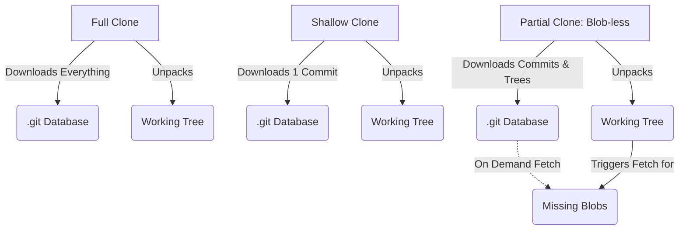

# Module 8: Efficiency at Scale — Sparse Checkout and LFS

**Complexity**: [MEDIUM]  
**Time to Complete**: 90 minutes  
**Prerequisites**: Previous module in Git Deep Dive (Module 7)  

## Learning Outcomes

By the end of this module, you will be able to:

*   **Implement** sparse checkouts using cone mode to isolate specific service directories within a massive Kubernetes monorepo, drastically reducing local disk usage.
*   **Compare and contrast** shallow clones and partial clones to optimize CI/CD pipeline checkout times and network bandwidth.
*   **Configure** Git Large File Storage (LFS) to manage large binary files, such as packaged Helm chart tarballs, without bloating the core repository history.
*   **Evaluate** the operational trade-offs between Git Submodules and Git Subtrees when architecting shared configuration repositories.
*   **Diagnose** local repository performance degradation and execute Git maintenance strategies, including garbage collection and commit graph optimization, to restore speed.

## Why This Module Matters

The platform engineering division at a rapidly expanding e-commerce provider decided to consolidate all their infrastructure configuration into a single repository. Initially, this monorepo was an operational dream: twenty microservices, all Kubernetes manifests in one place, and atomic commits that could deploy cross-service configuration changes synchronously. Everyone praised the visibility and simplicity.

Fast forward two years. The company acquired three competitors. The repository now contains configurations for over 1,500 distinct microservices, 50,000 raw Kubernetes manifests, and gigabytes of bundled, proprietary Helm chart tarballs that the security team requires to be stored alongside the deployment code. A simple `git clone` operation now takes twelve minutes on a gigabit connection. The CI/CD runners are timing out during the initial fetch phase before a single test or deployment step can even begin. Developers are complaining that their laptop fans spin up to maximum speed just by running `git status`, and their IDEs are freezing while trying to index the massive directory tree. 

Engineering velocity ground to a halt. The code was not broken, the deployments were not failing due to bad YAML, but the version control system was choking on the sheer volume of data. The tool meant to accelerate collaboration became the primary bottleneck.

This module teaches you how to rescue a team in exactly that scenario. You will learn how to tame massive repositories, optimize clone operations for CI pipelines, manage large binary assets without permanently bloating the Git history, and keep local developer performance snappy. You will move from treating Git as a simple file tracker to operating it as a high-performance database optimized for scale.

## Core Content: The Monorepo Problem and Sparse Checkout

When you execute a standard `git clone`, Git performs two distinct, resource-intensive operations. First, it downloads the entire compressed history of every file that has ever existed in the repository into the `.git` directory. Second, it unpacks the latest commit into your working tree — the actual files you see and edit on your disk.

In a massive monorepo, both of these operations become problematic, but the working tree is often the most immediate pain point for developers. If a repository has 1,500 services, a developer working on the `payment-gateway` service does not need the files for the other 1,499 services cluttering their IDE, slowing down their searches, and consuming their local disk space.

This is where **Sparse Checkout** comes in. Sparse checkout allows you to tell Git to only populate specific directories in your working tree while leaving the rest of the repository hidden.

### Cone Mode vs. Non-Cone Mode

Historically, sparse checkout used complex regular expressions to determine which files to include. This "non-cone" mode was extremely flexible but computationally expensive. Running `git status` required Git to evaluate those regular expressions against every file in the repository, which could take seconds in a large codebase.

Modern Git introduced **Cone Mode**. Cone mode restricts the matching logic to exact directory paths (forming a "cone" of inclusion). It is exponentially faster because Git can use hash lookups instead of pattern matching.

Let us visualize the difference in a standard Kubernetes platform repository:

```text
+-----------------------------------------------------+
|              Monorepo Directory Tree                |
+-----------------------------------------------------+
|                                                     |
|  platform-repo/                                     |
|  ├── .git/                     (Full History)       |
|  ├── cluster-addons/           (Hidden)             |
|  │   ├── calico/                                    |
|  │   └── cert-manager/                              |
|  ├── namespaces/               (Hidden)             |
|  │   ├── default/                                   |
|  │   └── kube-system/                               |
|  └── services/                 (Sparse Checkout)    |
|      ├── payment-gateway/      (Visible in tree)    |
|      │   ├── deployment.yaml                        |
|      │   └── service.yaml                           |
|      ├── inventory-api/        (Hidden)             |
|      └── user-auth/            (Hidden)             |
|                                                     |
+-----------------------------------------------------+
```

In cone mode, if you specify `services/payment-gateway`, Git automatically includes the files directly in `platform-repo/` (like `README.md` or `.gitignore`), the files directly in `platform-repo/services/`, and everything recursively inside `platform-repo/services/payment-gateway/`.

### Implementing Cone Mode

To set up a sparse checkout for an existing repository, you use the `sparse-checkout` command.

```bash
# First, enable sparse checkout in cone mode
git sparse-checkout init --cone

# Notice that your working directory is now nearly empty!
# It only contains files in the root directory.

# Now, specify the directory you want to work on
git sparse-checkout set services/payment-gateway

# Your working directory now contains the root files and the payment-gateway files.
```

If you need to collaborate with another team temporarily, you can add their service to your cone:

```bash
git sparse-checkout add services/user-auth
```

To return to a normal, full working tree:

```bash
git sparse-checkout disable
```

> **Pause and predict**: If you have a sparse checkout configured to only show `services/payment-gateway`, and you run `git commit -a -m "update"`, will Git accidentally commit changes that someone else made to `services/inventory-api` that you recently pulled? 

**War Story: The Regex Trap**
A platform team tried to optimize their workflow by writing a sparse checkout rule to include "any file named `deployment.yaml` anywhere in the repo." They used the legacy non-cone mode with a wildcard pattern `**/deployment.yaml`. As the repository grew to 30,000 files, every time a developer typed `git status`, Git had to execute a recursive pattern match across the entire virtual tree. `git status` began taking 8 seconds. Switching to cone mode and explicitly listing the required service directories dropped the execution time to 40 milliseconds.

## Core Content: Starving the CI Pipeline: Shallow and Partial Clones

While sparse checkout solves the working tree problem for human developers, it does not solve the network and disk problem for Continuous Integration (CI) pipelines. A sparse checkout still downloads the entire `.git` history; it just hides the files on the final checkout.

CI pipelines usually do not care about the history. When a pipeline runs to apply Kubernetes manifests via `kubectl apply` (or using the alias `k apply` which we will use from now on), it only needs the exact state of the files at the specific commit that triggered the job.

### Shallow Clones

A **Shallow Clone** truncates the repository history. You tell Git to only download the last *N* commits.

```bash
# Clone only the very latest commit of the default branch
git clone --depth 1 https://git.example.com/platform-repo.git
```

This drastically reduces the data transferred over the network. A 5GB repository might become a 20MB download. 

However, shallow clones have severe limitations:
1. You generally cannot push from a shallow clone.
2. Tools that rely on history (like SonarQube for blame-based metrics, or release note generators) will fail.
3. Fetching updates into a shallow clone can sometimes be computationally heavier on the server side than a normal fetch, as the server has to calculate exactly what is missing from your truncated history.

### Partial Clones

**Partial Clones** are the modern, superior alternative to shallow clones. Instead of truncating time (history), partial clones filter data types. The most common filters omit large file contents (blobs) or omit entire directory trees until they are explicitly needed.



A **blob-less** clone downloads all the commits and all the directory structures (trees), but omits the actual file contents (blobs) for historical commits. It only downloads the blobs required to populate your current working tree.

```bash
# Clone the repository, but omit all historical file contents
git clone --filter=blob:none https://git.example.com/platform-repo.git
```

If you ever run a command that needs an old file (like `git log -p` to see the diffs, or `git checkout` to move to an old branch), Git will automatically and transparently reach out to the server and download just the specific blobs it needs in real-time.

> **Pause and predict**: You ran `git clone --filter=blob:none`. Now you run `git diff HEAD~5`. What network activity do you expect, and why?

For CI pipelines that only need the latest commit, a **tree-less** clone is even faster:

```bash
# Omit all historical file contents AND historical directory structures
git clone --filter=tree:0 https://git.example.com/platform-repo.git
```

> **Stop and think**: Which approach would you choose for a CI pipeline that runs a security scanner analyzing the evolution of RBAC permissions over the last six months, and why?

## Core Content: The Heavy Lifters: Git LFS for Binaries

Git is exceptionally good at versioning plain text files like YAML manifests, Go source code, or Markdown documentation. It uses delta compression, storing only the specific lines that changed between commits.

Git is exceptionally terrible at versioning compiled binaries, database dumps, or compressed archives. If you change one byte in a 100MB Helm chart `.tgz` file and commit it, Git cannot compress the difference. It stores an entirely new 100MB object. Do this ten times, and your repository size increases by 1GB. Every developer who clones the repo has to download that entire gigabyte, even if they only want the latest version.

**Git Large File Storage (LFS)** solves this by replacing the large files in your repository with tiny text pointers. The actual large files are stored on a separate LFS server.

### The Anatomy of LFS

When you commit a file tracked by LFS, the actual binary data is intercepted and uploaded to the LFS server via an HTTP API. Git only records a pointer file in the commit history.

```text
+----------------------------------------------------------+
|                 How Git LFS Operates                     |
+----------------------------------------------------------+
|                                                          |
|  Your Working Tree                                       |
|  ├── deployment.yaml (1KB)                               |
|  └── monitoring-chart-v2.tgz (50MB)                      |
|                                                          |
|       |                                                  |
|       |  git add & git commit                            |
|       v                                                  |
|                                                          |
|  Local .git Database                                     |
|  ├── Blob: deployment.yaml content                       |
|  └── Blob: Pointer File (130 bytes)                      |
|      |                                                   |
|      |  version https://git-lfs.github.com/spec/v1       |
|      |  oid sha256:4d7a214614ab2...                      |
|      |  size 52428800                                    |
|                                                          |
|       |                                                  |
|       |  git push                                        |
|       v                                                  |
|                                                          |
|  Remote Git Server           Remote LFS Server           |
|  [Stores the 130b pointer]   [Stores the 50MB binary]    |
|                                                          |
+----------------------------------------------------------+
```

> **Stop and think**: If you run `git log -p` on a file tracked by LFS, what will you see in the diff — the binary content or the pointer file content? What if you have the LFS extension installed vs not installed?

When another developer clones the repository, Git downloads the tiny pointer files. Then, the LFS extension reads those pointers and automatically downloads the correct 50MB binary from the LFS server to populate their working tree. They only download the binaries for the specific commit they have checked out, not the entire history.

### Configuring LFS

First, you must install the LFS extension and initialize it for your user account:

```bash
git lfs install
```

Next, you tell LFS which files to track in your repository. This creates or updates a `.gitattributes` file.

```bash
# Track all tarball files
git lfs track "*.tgz"

# Track a specific large database dump used for local testing
git lfs track "tests/data/seed-db.sql"
```

You must commit the `.gitattributes` file so everyone else cloning the repository knows which files should be handled by LFS.

```bash
git add .gitattributes
git commit -m "chore: configure LFS tracking for tarballs and test DBs"
```

Now, when you add a tarball, it is processed by LFS automatically:

```bash
cp ~/Downloads/monitoring-chart-v2.tgz charts/
git add charts/monitoring-chart-v2.tgz
git commit -m "feat: add monitoring helm chart"
git push origin main
```

**War Story: The Accidental Dump**
A junior engineer generated a 2GB PostgreSQL database dump locally to test a data migration script. They accidentally ran `git commit -a -m "WIP"` and pushed to the origin. Realizing the mistake, they immediately ran `git rm the-dump.sql`, committed the deletion, and pushed again. The file was gone from the working tree, but the 2GB object was permanently embedded in the Git history. Every subsequent `git clone` by every pipeline and developer took twenty minutes longer. The team had to coordinate a highly disruptive history rewrite using `git filter-repo` to scrub the binary out of the permanent record, forcing everyone to delete their local clones and start fresh. If LFS had been configured for `*.sql` files proactively, this disaster would have been averted.

## Core Content: Dependency Hell: Submodules vs Subtrees

In large platforms, you often want to share code between repositories. For example, you might have a dedicated repository for standard Kubernetes Custom Resource Definitions (CRDs) that needs to be included in multiple different service repositories. 

Git provides two native ways to nest repositories inside other repositories: Submodules and Subtrees.

### Git Submodules

A submodule is essentially a pointer to a specific commit in another repository. 

When you add a submodule:

```bash
git submodule add https://git.example.com/shared-crds.git manifests/crds
```

Git does not copy the files from `shared-crds` into your repository's database. Instead, it creates a special file called `.gitmodules` and records the exact commit hash of the `shared-crds` repository.

**The pain of submodules:**
When someone else clones your repository, the `manifests/crds` directory will be completely empty. They must explicitly run:

```bash
git submodule update --init --recursive
```

Furthermore, if you enter the `manifests/crds` directory, you will be in a "detached HEAD" state. If you make changes there, commit them, and push your main repository without first pushing the submodule repository, you will break the build for everyone else (your main repo points to a commit in the submodule that does not exist on the remote server).

### Git Subtrees

A subtree takes a different approach. It physically copies the files and the history from the external repository directly into your repository.

```bash
# Add a remote for the shared repo
git remote add shared-crds https://git.example.com/shared-crds.git

# Pull the shared repo into a specific directory using the subtree strategy
git subtree add --prefix=manifests/crds shared-crds main --squash
```

The `--squash` flag combines all the history of the external repository into a single commit in your repository, keeping your history clean.

**The benefit of subtrees:**
When another developer clones your repository, they get the `manifests/crds` directory immediately. No extra commands are needed. The CI pipeline does not need special configuration to fetch submodules. It behaves exactly like normal files.

| Feature | Submodules | Subtrees |
| :--- | :--- | :--- |
| **Storage Mechanism** | Pointer to an external commit | Files actually merged into the host repo |
| **Cloning** | Requires extra `--recurse-submodules` flag | Works immediately with a standard clone |
| **History Integration** | Separate histories | Shared history (can be squashed) |
| **Making Upstream Changes** | Difficult (detached HEAD, push ordering) | Complex but manageable (`git subtree push`) |
| **Best Used For** | Large external projects you rarely edit | Smaller shared libraries you update occasionally |

> **Stop and think**: Your team maintains a shared Terraform modules repo (200 files, updated weekly) and a massive vendor CRD repo (5,000 files, updated quarterly). Which inclusion strategy would you use for each, and why?

## Core Content: Under the Hood: Maintenance and Performance

As you work with Git, adding, modifying, and deleting files, the local `.git` database accumulates "loose objects." Furthermore, Git's internal index of how commits relate to each other can become fragmented. Over time, operations like `git status` or `git log` will visibly slow down.

Git includes internal tools to optimize its own database.

### Garbage Collection and Repacking

The `git gc` (garbage collection) command cleans up unnecessary files and optimizes the local repository. 

```bash
# Run a standard garbage collection
git gc

# Run an aggressive garbage collection (takes longer, optimizes better)
git gc --aggressive
```

When you run `gc`, Git performs a `repack`. It takes thousands of individual loose object files and compresses them into a single "packfile." Packfiles use delta compression to store objects incredibly efficiently. This reduces the number of file handles the operating system needs to open and saves disk space.

### Commit Graphs

In a repository with hundreds of thousands of commits, commands that traverse history (like figuring out if a branch is ahead or behind, or generating a log) have to read and parse thousands of individual commit objects. 

Git can generate a **commit graph** file, which is a highly optimized binary cache of the commit history structure.

```bash
# Generate the commit graph
git commit-graph write --reachable
```

Writing the commit graph can make commands like `git log --graph` execute significantly faster.

> **Pause and predict**: A repository has 500,000 loose objects and no commit graph. Estimate the relative speedup of running `git gc` alone vs `git gc` + `commit-graph write` for a `git log --graph` command.

### Automated Maintenance

Instead of remembering to run these commands manually, modern Git allows you to register a repository for automatic background maintenance.

```bash
git maintenance start
```

This sets up background cron jobs (or systemd timers, depending on your OS) that will periodically run pre-fetch operations, loose object pruning, and commit graph updates while you are not actively using the repository. 

## Did You Know?

*   **The Linux Kernel Repo:** The Linux kernel repository contains over 1.2 million commits and 80,000 files, yet a properly optimized local clone can execute a `git status` in under 50 milliseconds.
*   **Git LFS Origins:** Git LFS was originally created by GitHub in 2015 as an open-source extension, specifically because game developers and machine learning teams were abandoning Git due to its inability to handle large textures, models, and datasets.
*   **The 2GB Limit:** Due to architectural decisions in how Git maps memory and processes files on 32-bit systems (which persist in some legacy underlying libraries), Git can catastrophicly fail or run out of memory if you attempt to track a single file larger than 2 Gigabytes without LFS.
*   **Zero-Byte Commits:** You can create a commit that contains absolutely no changes to the working tree using `git commit --allow-empty`. This is frequently used by platform engineers to trigger CI/CD pipeline runs without having to push a fake "bump" change to a README.

## Common Mistakes

| Mistake | Why It Happens | How to Fix It |
| :--- | :--- | :--- |
| **Tracking already committed binaries with LFS** | A developer runs `git lfs track "*.tgz"` *after* the `.tgz` has already been pushed to the repo history. | Use `git lfs migrate import --include="*.tgz"` to rewrite local history and move the existing objects to LFS pointers, then force push. |
| **Forgetting to push submodules** | A developer updates a submodule, commits the pointer change in the main repo, and pushes the main repo, but forgets to push the changes from inside the submodule directory. | Configure Git to push submodules automatically: `git config push.recurseSubmodules check` or `on-demand`. |
| **Using shallow clones for SonarQube analysis** | The CI pipeline is optimized with `--depth 1`, but the static analysis tool needs the Git history to assign blame and track new vs. old code smells. | Switch the CI pipeline from a shallow clone to a partial clone: `git clone --filter=blob:none`. |
| **Mixing cone and non-cone sparse checkouts** | Manually editing the `.git/info/sparse-checkout` file with complex regexes while cone mode is enabled. | Stick strictly to the `git sparse-checkout set` command; avoid manual edits to the underlying configuration files. |
| **Running out of disk space during `git gc`** | Repacking requires creating the new packfile before deleting the old ones, temporarily doubling the required storage space. | Ensure you have at least as much free disk space as the size of your `.git/objects` directory before running an aggressive GC. |
| **Committing the `.gitattributes` file late** | Setting up LFS tracking rules but forgetting to commit `.gitattributes`, causing other developers' clones to treat binaries as regular Git objects. | Always commit the `.gitattributes` file in the exact same commit (or earlier) as the first large binary file you add. |

## Quiz

<details>
<summary>Question 1: Your CI pipeline runs a bash script that lints all Kubernetes YAML files in the `manifests/` directory. It does not need to analyze history, and it does not need to build any binaries. The monorepo is 10GB. What is the most efficient clone strategy to implement in the CI configuration?</summary>
You should use a treeless partial clone by executing `git clone --filter=tree:0 <url>`. Because the CI pipeline only needs to read the files at the current commit to lint them, it does not need historical file contents (blobs) or historical directory structures (trees). This approach drastically reduces the amount of data transferred over the network compared to a full clone, speeding up the pipeline execution. Furthermore, it is generally more robust and less computationally expensive for the Git server to process than a traditional shallow clone (`--depth 1`), which requires the server to calculate exactly what to omit.
</details>

<details>
<summary>Question 2: You joined a new team and cloned their microservice repository. When you try to run `k apply -f vendor/shared-crds/base.yaml`, kubectl reports that the file does not exist. You look in the `vendor/shared-crds` directory and it is completely empty. What happened, and how do you fix it?</summary>
The team is using Git Submodules to include the shared CRDs, and a standard `git clone` does not automatically fetch submodule contents. You need to initialize and update the submodules by running `git submodule update --init --recursive` in the root of the repository. Alternatively, you could have cloned the repository initially using `git clone --recurse-submodules`. This happens because Git only records a pointer to the submodule's commit in the parent repository, leaving the actual fetching of the nested repository's data as an explicit, secondary step for the developer.
</details>

<details>
<summary>Question 3: Your team lead asks you to configure sparse checkout so you only download the `services/billing` directory. You run `git sparse-checkout init --cone` and then `git sparse-checkout set services/billing`. Later, you run `git merge main` to get the latest updates. Will this merge process updates to the `services/auth` directory even though you cannot see it?</summary>
Yes, the merge operation will successfully process and record the updates to the `services/auth` directory. Sparse checkout is purely a working tree optimization; it only hides files from your local disk view to save space and index time. The underlying `.git` database still downloads and tracks the full history and state of the entire repository during fetch and merge operations. Therefore, your local repository remains perfectly in sync with the remote, and you will not inadvertently revert or ignore changes made by other teams in directories outside your sparse cone.
</details>

<details>
<summary>Question 4: You need to include an open-source Helm chart repository into your internal platform repository. You want other engineers to get the files automatically when they clone, without having to run any extra commands. Which tool should you use, Submodules or Subtrees, and why?</summary>
You should use Git Subtrees for this scenario because it physically merges the external files into your repository's tree and history. When other engineers execute a standard `git clone`, they will receive all the Helm chart files immediately alongside your internal code. If you had chosen Submodules instead, they would pull down an empty directory and would be forced to run the `git submodule update` command to actually retrieve the chart data. Subtrees provide a much smoother developer experience when the goal is seamless, out-of-the-box consumption of shared dependencies.
</details>

<details>
<summary>Question 5: A developer complains that their local repository is extremely sluggish. `git status` takes several seconds, and their IDE is freezing. They have never configured any advanced Git features. What two commands should you instruct them to run to optimize their local database?</summary>
You should instruct them to run `git gc` and `git commit-graph write --reachable`. The `git gc` command will garbage collect loose objects and compress them efficiently into packfiles, which reduces the number of file handles the OS needs to open and saves disk space. The `git commit-graph write --reachable` command generates an optimized binary cache of the commit history structure, drastically accelerating history traversal commands. Alternatively, they could enable background optimization by running `git maintenance start`, which schedules these critical maintenance tasks to run automatically without manual intervention.
</details>

<details>
<summary>Question 6: You correctly configured Git LFS to track `*.iso` files, committed the `.gitattributes` file, and committed a 5GB Ubuntu image. When you push to your corporate Git server, it rejects the push with an HTTP 413 "Payload Too Large" error. What is the most likely architectural cause of this failure?</summary>
The most likely cause is that a reverse proxy or load balancer (like Nginx or HAProxy) sitting in front of the Git LFS server is restricting the maximum client body size. Even though Git LFS is specifically designed to handle massive binary objects, the actual data transfer still occurs via standard HTTP API calls. These API requests must pass through the corporate network infrastructure, which often has default upload limits configured for standard web traffic. You will need to work with the infrastructure team to increase the `client_max_body_size` or equivalent setting on the proxy handling the LFS route.
</details>

## Hands-On Exercise

In this exercise, you will simulate working in a massive Kubernetes monorepo. You will initialize a local repository with a simulated structure of 20 services, configure a sparse checkout to isolate just your team's domains, and set up Git LFS to track compiled Helm charts.

### Prerequisites Setup

First, let's generate a simulated monorepo structure. Execute this script in your terminal to create the environment:

```bash
mkdir k8s-monorepo-sim
cd k8s-monorepo-sim
git init

# Generate 20 simulated services with fake manifests
mkdir -p services
for i in {1..20}; do
  mkdir -p "services/service-$i"
  echo "apiVersion: apps/v1\nkind: Deployment\nmetadata:\n  name: service-$i" > "services/service-$i/deployment.yaml"
  echo "apiVersion: v1\nkind: Service\nmetadata:\n  name: service-$i" > "services/service-$i/service.yaml"
done

# Generate some platform-level folders
mkdir -p cluster-addons/ingress namespaces/core
touch cluster-addons/ingress/nginx.yaml namespaces/core/ns.yaml

git add .
git commit -m "Initial massive monorepo commit"
```

### Tasks

1.  **Analyze the initial state:** Check how many directories are currently visible in the `services/` folder.
2.  **Predict and Observe:** You are about to initialize sparse checkout. Predict what will happen to the `services` directory when you run `git sparse-checkout init --cone`. Run the command and observe your working directory. Explain why the files disappeared.
3.  **Target your scope:** Your team is only responsible for `service-4` and `service-12`. Configure the sparse checkout to include these specific directories.
4.  **Predict and Verify:** Before running `ls services/`, predict exactly what will be returned. Run the command to verify your prediction and confirm isolation.
5.  **Configure LFS tracking:** Your team needs to store bundled Helm charts (`*.tgz` files) in the `services/service-4/charts/` directory. Configure Git LFS to track all `.tgz` files anywhere in the repository.
6.  **Commit the configuration:** Ensure the LFS tracking configuration is permanently recorded in the repository.

### Solutions and Success Criteria

<details>
<summary>Task 1: Analyze the initial state</summary>

```bash
ls services/
```
You should see `service-1` through `service-20`.
</details>

<details>
<summary>Task 2: Predict and Observe</summary>

```bash
git sparse-checkout init --cone
```
Immediately after running this, if you type `ls`, you will likely only see files at the root of the repository. The `services` directory will disappear from your working tree. This happens because initializing sparse checkout in cone mode defaults to only including the root directory files, hiding everything else until explicitly requested.
</details>

<details>
<summary>Task 3: Target your scope</summary>

```bash
git sparse-checkout set services/service-4 services/service-12
```
This tells Git to construct a cone that explicitly includes those two directories, signaling that you want them populated in your working tree.
</details>

<details>
<summary>Task 4: Predict and Verify</summary>

```bash
ls services/
```
You should now ONLY see `service-4` and `service-12`. The other 18 service directories remain hidden from your local disk, fulfilling the prediction that sparse checkout isolates your view to exactly the cones you defined, saving space and index time.
</details>

<details>
<summary>Task 5: Configure LFS tracking</summary>

```bash
# Ensure LFS is installed for your user
git lfs install

# Track tarballs
git lfs track "*.tgz"
```
This command creates or updates a `.gitattributes` file in the root of your repository with the LFS tracking definition.
</details>

<details>
<summary>Task 6: Commit the configuration</summary>

```bash
# You must commit the .gitattributes file so others get the LFS rules
git add .gitattributes
git commit -m "build: configure LFS tracking for helm chart tarballs"
```
</details>

**Success Criteria:**
- [ ] Running `ls services/` shows exactly two directories: `service-4` and `service-12`.
- [ ] A `.gitattributes` file exists in the root of the repository containing the line `*.tgz filter=lfs diff=lfs merge=lfs -text`.
- [ ] `git status` reports a clean working tree.

## Next Module

Ready to stop doing things manually? Learn how to force compliance and automate conflict resolution in [Module 9: Automation and Customization](../module-9-hooks-rerere/).