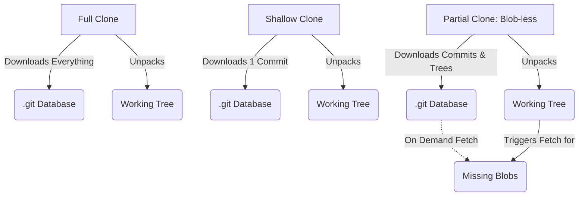
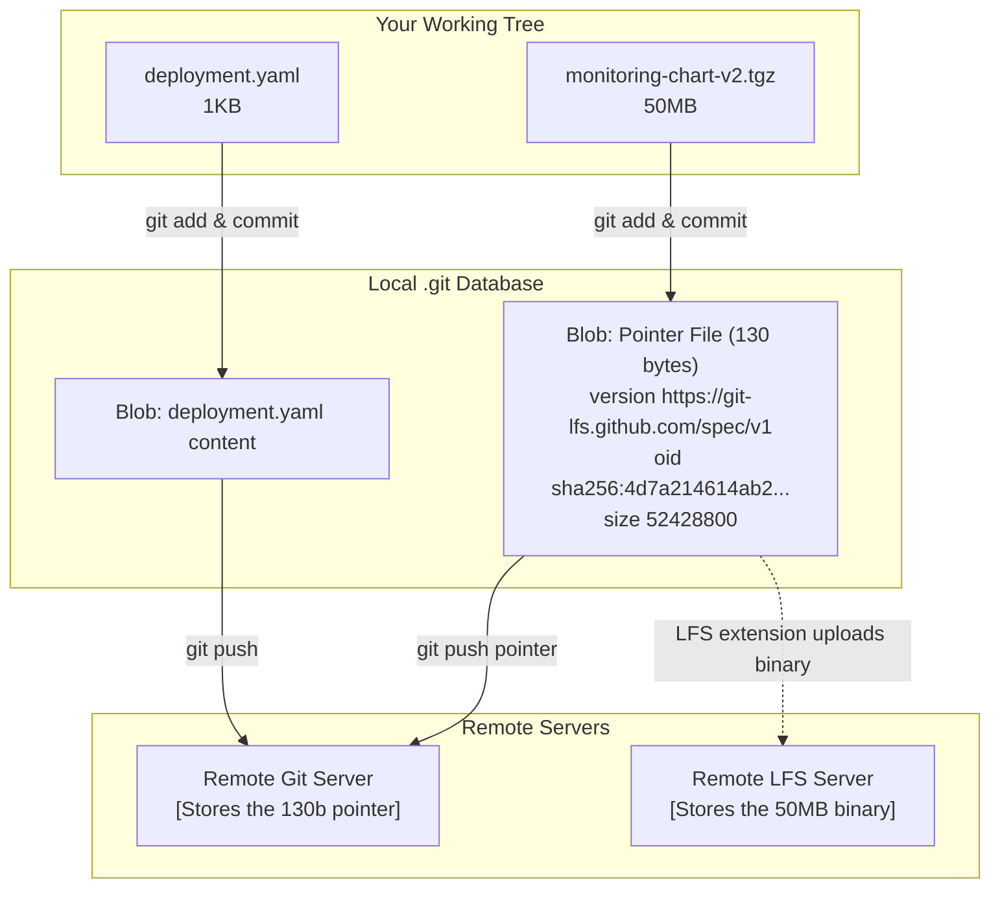

# Module 8: Efficiency at Scale — Sparse Checkout and LFS

**Complexity**: [MEDIUM]  
**Time to Complete**: 90 minutes  
**Prerequisites**: Previous module in Git Deep Dive (Module 7)  

## Learning Outcomes

By the end of this module, you will be able to:

* **Implement** sparse checkouts using cone mode to isolate specific service directories within a massive Kubernetes monorepo while preserving correct repository history.
* **Compare** shallow clones and partial clones for CI/CD pipelines, choosing the strategy that matches network cost, history needs, and server workload.
* **Configure** Git Large File Storage for large binary assets such as packaged Helm chart tarballs without bloating the core Git object database.
* **Evaluate** the operational trade-offs between Git Submodules and Git Subtrees when designing shared configuration repositories.
* **Diagnose** local repository performance degradation and apply Git maintenance strategies such as garbage collection, repacking, commit graphs, and scheduled maintenance.

## Why This Module Matters

The platform engineering division at a rapidly expanding e-commerce provider decided to consolidate infrastructure configuration into a single repository. At first, the decision felt elegant: service manifests lived beside shared policies, cluster add-ons were visible to every team, and one pull request could update a Deployment, its NetworkPolicy, and the matching observability rule together. Two years later the same repository held more than 1,500 services, tens of thousands of Kubernetes manifests, and several gigabytes of proprietary Helm chart tarballs that security required to be versioned with the deployment code. A normal clone took more than ten minutes on a strong office connection, CI runners burned paid minutes before reaching the first test, and developers began avoiding routine rebases because `git status` made their laptops sound like build machines.

Nothing in that story is a Git bug. Git was built as a content-addressed database, and a large repository asks that database to move several different kinds of weight: commit history, directory structure, file content, working tree entries, and binary objects that may not compress well. When teams talk loosely about a repository being "too big," they often mix these costs together and reach for the wrong fix. Sparse checkout reduces working tree scope, shallow clones reduce history depth, partial clones defer object downloads, Git LFS moves binary payloads out of normal Git history, and maintenance commands rebuild the local database so common operations stay fast. Each tool solves a different pressure point.

This module teaches you how to reason about those pressure points instead of copying optimization flags into every clone command. You will work through sparse checkout for human developers, clone filters for CI, LFS for large artifacts, submodules and subtrees for shared dependencies, and local maintenance for repositories that have accumulated years of loose objects. Kubernetes examples use version 1.35+ assumptions, and when we need `kubectl` we will introduce the shell alias `alias k=kubectl` before using `k` in commands. The goal is not to make every repository tiny; the goal is to make large repositories predictable, explainable, and fast enough that Git stops being the bottleneck in the delivery path.

## Core Content: The Monorepo Problem and Sparse Checkout

When you execute a standard `git clone`, Git performs two expensive operations that are easy to confuse. First it downloads repository objects into the `.git` directory, including commits, trees, tags, and blobs that represent file contents. Second it checks out one commit into your working tree, which is the ordinary directory full of files that your editor, shell, search tools, and language servers inspect. In a monorepo, the working tree is often the pain a human feels first, because the developer touching `services/payment-gateway` still watches the editor index `services/inventory-api`, `services/user-auth`, and hundreds of unrelated directories.

Sparse checkout addresses the working tree side of the problem. It tells Git to keep the repository database intact while only materializing selected paths on disk, so the user sees a smaller tree without creating a forked or incomplete history. That distinction matters operationally. If another team updates a hidden service and you fetch or merge `main`, Git still processes that change inside the repository database; the file simply does not appear in your working directory unless it is inside your sparse definition. Sparse checkout is therefore a visibility and performance tool, not a permission boundary and not a way to avoid integrating the rest of the repository.

Historically, sparse checkout supported flexible pattern matching. You could write rules that looked like `.gitignore` patterns and include individual filenames anywhere in the repository. That flexibility had a hidden cost: commands such as `git status` had to evaluate pattern rules across the tracked tree, and those checks became noticeable as repositories grew. Modern Git strongly favors cone mode, which restricts sparse rules to directory cones and lets Git use faster path matching. The trade-off is intentional. You give up arbitrary wildcard selection so the common case, "I work in these service directories," remains cheap.

```mermaid
graph TD
    PR["platform-repo/"]
    GIT[".git/ <br> Full History"]
    CA["cluster-addons/ <br> Hidden"]
    CAL["calico/"]
    CERT["cert-manager/"]
    NS["namespaces/ <br> Hidden"]
    DEF["default/"]
    KS["kube-system/"]
    SVC["services/ <br> Sparse Checkout"]
    PG["payment-gateway/ <br> Visible in tree"]
    DEP["deployment.yaml"]
    SER["service.yaml"]
    INV["inventory-api/ <br> Hidden"]
    UA["user-auth/ <br> Hidden"]

    PR --> GIT
    PR --> CA
    CA --> CAL
    CA --> CERT
    PR --> NS
    NS --> DEF
    NS --> KS
    PR --> SVC
    SVC --> PG
    PG --> DEP
    PG --> SER
    SVC --> INV
    SVC --> UA

    classDef hidden stroke-dasharray: 5 5, color: #999, fill: #f9f9f9, stroke: #ccc;
    class CA,CAL,CERT,NS,DEF,KS,INV,UA hidden;
```

In cone mode, if you specify `services/payment-gateway`, Git automatically includes root-level files such as `README.md` and `.gitignore`, the immediate parent directories needed to reach the cone, and everything recursively inside `services/payment-gateway`. That behavior keeps the repository usable because root metadata and parent directories still exist, while unrelated service trees stay absent from disk. Think of it like checking out a map with only the roads you need highlighted, while the navigation system still knows the rest of the city exists.

```bash
# First, enable sparse checkout in cone mode
git sparse-checkout init --cone

# Notice that your working directory is now nearly empty!
# It only contains files in the root directory.

# Now, specify the directory you want to work on
git sparse-checkout set services/payment-gateway

# Your working directory now contains the root files and the payment-gateway files.
```

The sequence above is deliberately staged. Initializing sparse checkout in cone mode usually leaves you with only root files, which surprises people the first time because an apparently healthy repository suddenly looks empty. The next command defines the cone that should be populated. If your team rotates on-call across two services, you can widen the cone without restarting the clone, which is much cheaper than maintaining separate local copies of the monorepo.

```bash
git sparse-checkout add services/user-auth
```

Sparse checkout should also be easy to unwind. If you are about to perform a repository-wide refactor, migrate all manifests to a new Kubernetes 1.35+ field convention, or run a formatter across every service, temporarily disabling sparse checkout is clearer than trying to remember which paths are hidden. After the wide operation, you can re-enable the focused cone and return to your normal working set.

```bash
git sparse-checkout disable
```

Pause and predict: if you have a sparse checkout configured to only show `services/payment-gateway`, and you run `git commit -a -m "update"`, will Git accidentally commit changes that someone else made to `services/inventory-api` after you pulled? The answer is no for ordinary pulled changes, because `git commit -a` records your staged or modified working tree changes, not every hidden path that changed upstream. The more important risk is the opposite: you may forget that a cross-service change requires paths outside your cone, so you should widen the cone before making repository-wide edits.

War story: a platform team tried to optimize daily work by writing a sparse checkout rule that included any file named `deployment.yaml` anywhere in the repository. The rule seemed clever because Kubernetes services usually had that filename, but it forced legacy non-cone matching across a rapidly growing tree. By the time the repository passed 30,000 tracked files, `git status` took several seconds because every path had to be tested against the pattern. Switching to cone mode and explicitly listing service directories reduced status latency to interactive speed because Git could reason about directory prefixes rather than arbitrary wildcard matches.

Sparse checkout is also a social contract. If every team invents private path rules, support gets harder because build failures may reproduce only for the one person whose working tree is shaped differently. Strong platform teams publish common cones, such as "service developer," "cluster add-on maintainer," and "release engineer," and they document which tasks require widening the tree. That documentation prevents sparse checkout from becoming invisible local state that only the original author understands.

## Core Content: Starving the CI Pipeline: Shallow and Partial Clones

Sparse checkout helps humans by shrinking the working tree, but it does not automatically shrink the object database. A CI runner that uses sparse checkout may still download most repository history before it hides unused files, which means the runner pays the network and storage cost before getting any benefit. CI optimization starts by asking a different question: what historical data does this job actually need? A lint job that checks current YAML has different needs from a release-note generator, and both differ from a security scanner that compares RBAC changes across months of history.

A shallow clone truncates history by asking Git for only the most recent commits. It is simple, widely supported, and often effective for jobs that only need the checked-out files at one revision. The cost is that many history-aware tools stop working or produce misleading output because the runner no longer has enough ancestry to answer questions about blame, merge bases, tags, or previous versions. Shallow clone is a time filter, and time filters are risky when a job quietly depends on context older than the selected depth.

```bash
# Clone only the very latest commit of the default branch
git clone --depth 1 https://git.example.com/platform-repo.git
```

The appeal of `--depth 1` is obvious: a multi-gigabyte repository can become a much smaller transfer for a simple current-state job. The operational drawback is less obvious until a tool fails in production CI. A code quality scanner may need blame information to distinguish new findings from old findings, a deployment script may compute the merge base against `main`, and a release process may search tags to derive a version. In those cases the checkout appears successful, but the job's reasoning is based on a deliberately incomplete history.

Partial clone solves a different problem by filtering object types instead of truncating time. A blobless clone downloads commits and tree objects while deferring file content blobs until they are needed. That means Git can still answer many history and ancestry questions without immediately downloading every historical version of every file. When a command later asks for an old diff, Git performs an on-demand fetch for the missing blobs. The result is often a better default for large monorepos because it preserves the shape of history while avoiding old file payloads until a workflow proves it needs them.



```bash
# Clone the repository, but omit all historical file contents
git clone --filter=blob:none https://git.example.com/platform-repo.git
```

Pause and predict: you run `git clone --filter=blob:none`, then run `git diff HEAD~5` on a path that changed several commits ago. The local repository has the commit graph and tree information needed to locate the old path, but it may not have the old blob content needed to render the patch. Git will contact the remote, fetch the missing blobs for that diff, and then continue as though the data had always been local. This is usually good for interactive work, but it can surprise CI designers who expected a job to be fully offline after clone.

Treeless partial clones go further by omitting historical tree objects as well. They are useful for highly ephemeral CI jobs that need the current checkout and little else, because the runner avoids downloading old directory structures that it will never traverse. The trade-off is that history exploration becomes more dependent on on-demand network fetches. If your CI job runs in an isolated network after the checkout step, or if it performs many historical comparisons, treeless clones can move cost from the start of the job to the middle of the job, where failures are more frustrating.

```bash
# Omit all historical file contents AND historical directory structures
git clone --filter=tree:0 https://git.example.com/platform-repo.git
```

Before applying Kubernetes manifests in CI, define the `kubectl` alias close to the first use so the log is explicit and shell steps are reproducible. The alias itself is not a Git optimization, but it keeps the module's Kubernetes commands consistent with the rest of KubeDojo. A shell setup line such as `alias k=kubectl` should appear before later commands like `k apply -f services/payment-gateway/manifests/`, and that small discipline prevents readers from wondering whether `k` is a custom wrapper, a local script, or the standard Kubernetes CLI shortcut.

Combining partial clone and sparse checkout is often the winning move for current-state deployment jobs, but the order still matters. The clone filter decides what object data is available locally, while sparse checkout decides what paths appear in the working tree. If the job clones bloblessly and then sparsely checks out only one service, the runner avoids old file payloads and avoids materializing unrelated service directories. If the job only uses sparse checkout after a full clone, it may still transfer the very history it was trying to avoid. This is why checkout optimization belongs in the CI design, not in a late shell step copied from a developer laptop.

Stop and think: which approach would you choose for a CI pipeline that runs a security scanner analyzing the evolution of RBAC permissions over the last six months, and why? A depth-one shallow clone is a poor fit because the scanner needs meaningful history. A blobless partial clone is usually a better starting point because it preserves commit and tree relationships while deferring file contents, though you should test whether the scanner repeatedly asks for old blobs and therefore needs a deeper or full checkout for stable runtime.

Clone strategy should be owned like any other build architecture decision. Put the reasoning in CI configuration comments, measure checkout time separately from test time, and revisit the choice when jobs change. A pipeline that originally linted current YAML may later grow release note generation, provenance checks, or policy drift analysis. If the clone mode remains unchanged, the team may debug strange tool behavior for hours before noticing that the runner never had the history the tool assumed.

## Core Content: The Heavy Lifters: Git LFS for Binaries

Git stores file contents as blobs and can compress text history extremely well because line-oriented changes often share structure. Kubernetes YAML, Markdown, Go source, and shell scripts usually produce efficient deltas. Compressed archives, virtual machine images, database dumps, media files, and packaged Helm chart tarballs behave differently. A one-byte change inside a compressed file can make the entire compressed output look unrelated to the previous version, so Git stores another large blob. After several updates, every clone drags years of obsolete binary payloads through the network even though most developers only need the latest one.

Git Large File Storage changes what Git records. Instead of committing the large binary payload directly into the normal object database, LFS stores a small pointer file in Git and uploads the real content to an LFS server. The pointer includes the LFS spec version, a content hash, and the size of the object. From Git's perspective, history contains tiny text files. From the developer's perspective, the LFS extension replaces those pointers with real files in the working tree when the relevant checkout is populated.



The pointer model has two consequences that platform engineers must explain clearly. First, LFS does not make large files vanish; it moves their storage and transfer path to a service designed for large payloads. Second, everyone who needs real binary files must have LFS installed and must authenticate to the LFS endpoint. A clone without LFS support may leave pointer text where a Helm chart or dataset should be, and a CI runner with Git credentials but no LFS access can fail after the Git fetch succeeds.

```bash
git lfs install
```

Installing the extension prepares the user's Git client to apply LFS filters, but it does not decide which repository paths belong in LFS. Tracking rules live in `.gitattributes`, and that file is part of the repository contract. Commit it before or with the first matching binary so every contributor and runner applies the same filters. If you add the tracking rule after binaries have already entered normal Git history, future commits may use LFS, but the old large objects remain in history until you perform a deliberate migration.

```bash
# Track all tarball files
git lfs track "*.tgz"

# Track a specific large database dump used for local testing
git lfs track "tests/data/seed-db.sql"
```

```bash
git add .gitattributes
git commit -m "chore: configure LFS tracking for tarballs and test DBs"
```

Once the rule is committed, adding a matching tarball should store a pointer in Git and upload the real object through LFS during push. Notice that the command sequence is ordinary Git from the user's perspective. That is the strength of LFS: it keeps day-to-day workflows familiar while changing the storage path behind the scenes. The team still needs quota monitoring, retention policy, and restore testing because the large objects now depend on the health of a second service.

```bash
cp ~/Downloads/monitoring-chart-v2.tgz charts/
git add charts/monitoring-chart-v2.tgz
git commit -m "feat: add monitoring helm chart"
git push origin main
```

Stop and think: if you run `git log -p` on a file tracked by LFS, what will you see in the diff? Git history contains pointer file changes, so the textual patch describes pointer metadata rather than the binary payload itself. The LFS extension makes your working tree convenient, but it does not transform Git history into a binary diff viewer. For review workflows, that means teams often pair LFS with checksum checks, provenance metadata, or artifact promotion rules so reviewers know why a large binary changed.

War story: a junior engineer generated a 2GB PostgreSQL database dump to test a migration and accidentally pushed it with a work-in-progress commit. Deleting the file in the next commit removed it from the current tree, but the large object stayed reachable in history and every new clone paid for it. The eventual fix required a coordinated history rewrite, temporary freeze, force push, and instructions for every developer to replace local clones or carefully repair their remotes. If the repository had tracked dump patterns through LFS before the incident, the payload would have gone through the large-object path rather than permanently inflating normal Git history.

LFS is not a reason to store every artifact in Git. If a build can reproduce a chart from source, an artifact registry may be the better system of record, with Git storing only the source and version metadata. LFS is strongest when the binary is legitimately part of the reviewable repository state, must be checked out with the code, and cannot be rebuilt easily by the consumer. That boundary keeps Git useful as a collaboration tool instead of turning it into a general storage bucket.

There is also a review culture dimension to LFS. A pull request that changes a pointer file may look tiny, but the actual payload can be large, opaque, and operationally important. Teams that use LFS well attach generated checksums, provenance notes, release references, or automated validation output to the review so a human can decide whether the binary belongs in the repository state. Without that habit, LFS can accidentally make large changes less visible because the diff becomes smaller. The goal is smaller Git history, not weaker review.

## Core Content: Dependency Hell: Submodules vs Subtrees

Large platform repositories rarely live alone. A service repository may need shared Custom Resource Definitions, common Terraform modules, generated policy bundles, or an upstream Helm chart. Git offers two native inclusion models, submodules and subtrees, and the right choice depends less on elegance than on operational friction. Ask who updates the dependency, how often CI must fetch it, whether consumers need it after an ordinary clone, and how painful it would be if the dependency pointer referenced a commit that nobody else could fetch.

A submodule is a pointer from one Git repository to a specific commit in another repository. The parent repository records metadata in `.gitmodules` and stores a special entry for the nested path, but it does not copy the nested repository's file contents into the parent object database. This is clean when the dependency is large, independently versioned, and rarely edited by the parent team. It is also easy to misuse because a normal clone may leave the submodule directory empty until the user performs an additional initialization step.

```bash
git submodule add https://git.example.com/shared-crds.git manifests/crds
```

When someone else clones a repository that uses submodules, they must either clone with submodule recursion enabled or initialize submodules afterward. CI systems need the same treatment, otherwise a job can fail with missing CRD files even though the parent repository checkout succeeded. The detached-head behavior inside a submodule is another source of mistakes: if a developer commits inside the submodule but only pushes the parent pointer update, the parent can reference an object that does not exist on the submodule remote visible to everyone else.

```bash
git submodule update --init --recursive
```

A subtree makes the opposite trade-off. It brings external files into a directory of the parent repository, optionally squashing the imported history into a single commit so the parent history stays readable. A normal clone gets the files immediately because they are ordinary files in the parent tree. The cost is that synchronization with the upstream repository is more manual, and the parent repository now carries those files directly, which may be undesirable for very large or fast-moving dependencies.

```bash
# Add a remote for the shared repo
git remote add shared-crds https://git.example.com/shared-crds.git

# Pull the shared repo into a specific directory using the subtree strategy
git subtree add --prefix=manifests/crds shared-crds main --squash
```

The comparison table is intentionally blunt because most submodule and subtree debates are really about developer experience. Submodules preserve separation but demand extra clone and push discipline. Subtrees simplify consumption but make the parent repository larger and place more responsibility on the parent maintainers to pull upstream changes intentionally. Neither tool replaces a package registry, chart repository, or artifact registry when those are the cleaner abstraction.

| Feature | Submodules | Subtrees |
| :--- | :--- | :--- |
| **Storage Mechanism** | Pointer to an external commit | Files actually merged into the host repo |
| **Cloning** | Requires extra `--recurse-submodules` flag | Works immediately with a standard clone |
| **History Integration** | Separate histories | Shared history (can be squashed) |
| **Making Upstream Changes** | Difficult (detached HEAD, push ordering) | Complex but manageable (`git subtree push`) |
| **Best Used For** | Large external projects you rarely edit | Smaller shared libraries you update occasionally |

Stop and think: your team maintains a shared Terraform modules repository with 200 files updated weekly and a massive vendor CRD repository with 5,000 files updated quarterly. The Terraform modules may fit a subtree if you want ordinary clones and occasional parent-side edits, provided the parent can tolerate carrying those files. The vendor CRDs may fit a submodule if you rarely change them and want to avoid importing thousands of files, but only if your CI and onboarding documentation make recursive checkout mandatory. The decision is not about which feature is newer; it is about which failure mode your team can reliably operate.

The strongest teams also define ownership around inclusion mechanisms. If a subtree is used, someone must own upstream pulls and conflict resolution. If a submodule is used, someone must own pointer updates, remote availability, and CI clone configuration. The lack of ownership is why shared dependency strategies become painful: the command works once, then the repository quietly accumulates stale pointers or copied code nobody feels responsible for maintaining.

Submodules and subtrees also interact differently with incident response. During an outage, an empty submodule directory can consume precious time because responders must remember the recursive update step before they can inspect the missing manifests. A stale subtree creates a different failure mode: the files are present, so the incident team may not realize they are looking at an older copy of a shared policy bundle. Good runbooks call out these mechanics directly. They say how to refresh the dependency, how to verify the exact upstream revision, and who is allowed to move the pointer or subtree import during a live incident.

## Core Content: Under the Hood: Maintenance and Performance

Git repositories age. Every commit, rebase, fetch, merge, delete, and branch operation changes the shape of the local object database. Some objects are stored as loose files before they are packed, some packfiles become suboptimal as new history arrives, and history traversal may repeatedly parse commit relationships that could be cached. When a developer says a repository is slow, the right response is not always "clone it again." A fresh clone hides the symptom, but maintenance commands teach you what was wrong and help the whole team document a repeatable fix.

Garbage collection is the familiar entry point. `git gc` prunes unreachable objects when safe, packs loose objects, and optimizes storage so the operating system opens fewer files during common operations. Aggressive garbage collection can spend more CPU looking for better deltas, which may reduce disk usage but can take much longer. That trade-off matters on laptops and shared CI runners: a normal garbage collection is often enough for routine cleanup, while aggressive repacking is better reserved for planned maintenance windows or local clones with serious bloat.

```bash
# Run a standard garbage collection
git gc

# Run an aggressive garbage collection (takes longer, optimizes better)
git gc --aggressive
```

Commit graphs target a different bottleneck. Many Git commands need to walk commit ancestry, answer reachability questions, determine whether a branch is ahead or behind, or render a graph. In a repository with hundreds of thousands of commits, repeatedly parsing individual commit objects adds latency. A commit graph file is a compact, optimized representation of commit relationships, and writing it can make history-heavy operations feel much more responsive without changing repository content.

```bash
# Generate the commit graph
git commit-graph write --reachable
```

Pause and predict: a repository has 500,000 loose objects and no commit graph. Running `git gc` alone should improve operations that suffer from loose-object overhead, while adding `git commit-graph write --reachable` should especially help commands that traverse history, such as `git log --graph` or branch ahead-behind checks. The exact speedup depends on disk, filesystem, repository shape, and command mix, so the professional move is to measure before and after rather than promise a universal percentage.

Modern Git also supports scheduled maintenance so users do not have to remember periodic cleanup commands. `git maintenance start` registers background tasks appropriate to the operating system, such as prefetching, loose-object cleanup, incremental repacking, and commit graph updates. This is useful for long-lived local clones of large repositories because maintenance runs while the developer is not actively waiting on Git. It is less useful for short-lived CI workspaces, where clone strategy and cache design usually dominate.

```bash
git maintenance start
```

Maintenance should be paired with diagnosis. Check whether slow operations are working-tree scans, history walks, network fetches, or LFS downloads. A slow `git status` in a huge tree may point to sparse checkout or filesystem monitoring; a slow `git log --graph` may point to commit graph maintenance; a slow CI checkout may point to clone filters; a slow first build after checkout may point to LFS payload size. Treat Git performance like any other production performance problem: identify the resource under pressure, choose the tool designed for that resource, and record the result so the team does not rediscover the fix next quarter.

For a local diagnosis, ask the developer to describe the slow command rather than the vague feeling that "Git is slow." `git status`, `git fetch`, `git checkout`, `git log`, and the first build after checkout stress different parts of the system. The path from symptom to fix is much shorter when the team names the command, repository size, recent history, sparse configuration, LFS status, and whether background maintenance is enabled. That information also helps distinguish a repository problem from an endpoint protection tool, network proxy, or editor extension that is scanning the same files Git is trying to update.

## Patterns & Anti-Patterns

The best pattern for large repositories is scope-first checkout. Human developers should materialize the directories they actively edit, while retaining enough root metadata and shared configuration to run local checks. This pattern works because it reduces editor indexing, shell search noise, and working tree scans without creating a separate repository or hiding history from Git. It scales when platform owners publish recommended sparse cones and teach people when to widen them for cross-service changes.

Another strong pattern is history-aware CI checkout. Rather than applying `--depth 1` everywhere, classify jobs by history needs. Current-state linters and manifest validators can use aggressive filters, while scanners, release-note builders, and provenance tools need enough history to reason correctly. This pattern works because it treats checkout as part of the job contract, not as a generic prelude copied between workflows. It scales when CI logs report checkout mode and timing as separate metrics.

For large binary files, the durable pattern is policy before payload. Configure LFS rules, commit `.gitattributes`, verify runner authentication, and document size expectations before the first large chart, image, or dump enters the repository. The policy must also say when LFS is not appropriate and an artifact registry should be used instead. This pattern works because cleaning old large objects from Git history is disruptive, while preventing them from entering normal history is routine.

The common anti-pattern is optimization by folklore. Someone remembers that shallow clones were fast in one project and applies them to every job, including tools that need blame history. Someone else hears that submodules are "clean" and adds one without teaching CI to recurse. A third engineer enables LFS after the binary damage is already in history and expects old clones to shrink. These mistakes happen because Git features are treated as magic flags instead of database design choices with explicit trade-offs.

## Decision Framework

Start with the pain you can measure. If developers see too many files and local commands crawl while history operations are acceptable, choose sparse checkout in cone mode. If CI spends most of its time downloading history for jobs that only inspect the current tree, evaluate partial clone filters and possibly shallow depth. If the repository grows because large binary artifacts change over time, introduce LFS or move the artifacts to a registry. If shared files must appear inside another repository, decide between submodules and subtrees based on consumption friction, update ownership, and repository size.

Use this decision matrix as a practical guide, then verify the choice with a small experiment before rolling it across every team. A clone strategy that saves one minute in a lint job may break a release job, while an LFS rule that helps developers may require extra CI credentials. The point of a framework is not to replace judgment; it is to force the right questions before a flag becomes institutional habit.

If the pressure is the working tree, start with sparse checkout because it reduces visible files while preserving the full repository model. If the pressure is CI network transfer for a current-state job, start with partial clone filters and test whether the job triggers on-demand fetches. If the pressure is history-aware CI, avoid depth-only fixes until you prove the tool can operate on truncated ancestry. If the pressure is binary growth, choose between LFS and an artifact registry based on whether the binary must be reviewed and checked out with source. If the pressure is shared dependency inclusion, use submodules when separation matters more than clone convenience, and subtrees when ordinary clones matter more than keeping the parent small. If the pressure is a slow long-lived local clone, run maintenance before asking everyone to reclone.

The framework becomes more useful when teams write down negative decisions. "We are not using shallow clone for releases because release notes need merge bases" is the kind of sentence that prevents a future well-meaning optimization from breaking production. "We are not storing rebuilt charts in LFS because the registry is the source of truth" prevents repository storage from becoming an accidental artifact archive. These notes do not need to be long, but they should live beside the CI workflow or repository onboarding guide where the next person will look during a performance cleanup.

For a Kubernetes platform repository, a realistic design often combines several tools. Developers use sparse checkout for their service cones, CI uses a blobless or treeless partial clone depending on job history needs, packaged Helm charts move to LFS only when they must be reviewed with the code, and shared CRDs use either subtrees or submodules based on ownership. The important habit is to explain each layer separately. When the next failure occurs, the team can identify whether the working tree, object transfer, binary storage, dependency inclusion, or local database is the constraint.

A good rollout plan starts with one repository and one workflow rather than a site-wide flag day. Pick a painful service directory, publish the sparse checkout commands, measure local status time before and after, then repeat with one CI job whose history needs are understood. Only after those wins are stable should the team migrate binary policy or dependency inclusion patterns. This staged approach creates evidence, gives developers time to adjust their mental model, and avoids mixing unrelated changes into one difficult rollback.

## Did You Know?

* **The Linux Kernel Repo:** The Linux kernel repository contains more than 1.2 million commits and roughly 80,000 tracked files, yet a properly optimized local clone can still make common status checks feel interactive on modern hardware.
* **Git LFS Origins:** Git LFS was announced by GitHub in 2015 because teams working with games, media, and machine learning datasets needed Git workflows without storing every large binary revision in the normal object database.
* **The 2GB Limit:** Very large single files have historically exposed memory and tooling limits in Git clients and surrounding libraries, which is one reason large payloads should move to LFS or an artifact system before they become routine.
* **Zero-Byte Commits:** `git commit --allow-empty` creates a commit with no working tree changes, and platform engineers often use it to trigger CI/CD flows without inventing a meaningless file edit.

## Common Mistakes

| Mistake | Why It Happens | How to Fix It |
| :--- | :--- | :--- |
| **Tracking already committed binaries with LFS** | A developer runs `git lfs track "*.tgz"` *after* the `.tgz` has already been pushed to the repo history. | Use `git lfs migrate import --include="*.tgz"` to rewrite local history and move the existing objects to LFS pointers, then force push only with a coordinated migration plan. |
| **Forgetting to push submodules** | A developer updates a submodule, commits the pointer change in the main repo, and pushes the main repo, but forgets to push the changes from inside the submodule directory. | Configure Git to push submodules automatically with `git config push.recurseSubmodules check` or `on-demand`, and document the parent-plus-submodule push order. |
| **Using shallow clones for SonarQube analysis** | The CI pipeline is optimized with `--depth 1`, but the static analysis tool needs the Git history to assign blame and track new versus old code smells. | Switch the CI pipeline from a shallow clone to a partial clone such as `git clone --filter=blob:none`, then confirm the scanner can reach the history it needs. |
| **Mixing cone and non-cone sparse checkouts** | Someone manually edits `.git/info/sparse-checkout` with complex patterns while cone mode is enabled, creating rules Git cannot optimize cleanly. | Stick to `git sparse-checkout set` and `git sparse-checkout add` for cone-mode directories, and reserve non-cone mode for rare cases with measured justification. |
| **Running out of disk space during `git gc`** | Repacking creates new packfiles before deleting old ones, so cleanup can temporarily require much more free space than expected. | Check the size of `.git/objects` before aggressive maintenance and run cleanup on a machine with enough temporary disk headroom. |
| **Committing the `.gitattributes` file late** | LFS tracking rules are configured locally but not committed before the first large binary, so other clones treat the file as a normal Git blob. | Commit `.gitattributes` in the same change as the policy setup, and add a review checklist item for new binary patterns. |
| **Assuming sparse checkout is access control** | Hidden directories feel absent, so teams incorrectly treat sparse rules as a security boundary or ownership enforcement mechanism. | Use repository permissions, CODEOWNERS, and review rules for access and governance; use sparse checkout only for local working tree scope. |

## Quiz

<details><summary>Question 1: Your CI pipeline lints all Kubernetes YAML files under `manifests/`. It does not analyze history, derive versions from tags, or build binaries. The monorepo is several gigabytes. What clone strategy would you test first, and what risk would you watch for?</summary>

I would test a treeless partial clone such as `git clone --filter=tree:0 <url>` because the job needs the current checkout more than historical trees or blobs. This can reduce network transfer and startup time while keeping the checkout model compatible with normal Git commands. The risk is that a future version of the job may add a history-aware tool and trigger on-demand fetches or incorrect assumptions. I would record the clone mode in the CI configuration and measure checkout time separately so the trade-off remains visible.
</details>

<details><summary>Question 2: You joined a team and cloned its microservice repository. When you run `k apply -f vendor/shared-crds/base.yaml`, Kubernetes reports that the file does not exist, and the directory is empty. What happened, and how do you fix the immediate problem?</summary>

The repository is probably using a Git submodule for `vendor/shared-crds`, and a standard clone did not fetch the nested repository contents. The immediate fix is to run `git submodule update --init --recursive` from the parent repository root, or to reclone with submodule recursion enabled. The deeper lesson is that submodules require explicit clone and CI configuration because the parent stores a pointer, not the dependency files themselves. If the team wants ordinary clones to contain those files, it should evaluate a subtree or another distribution mechanism.
</details>

<details><summary>Question 3: Your sparse checkout contains only `services/billing`. After fetching `main`, you merge a change that updated `services/auth`, which is outside your cone. Will Git ignore that hidden service, and what should you check before committing your own work?</summary>

Git will not ignore the hidden service during repository operations; sparse checkout controls what appears in your working tree, not what exists in the object database or merge result. The merge can record updates outside your cone even though those files remain hidden locally. Before committing your own work, check whether the change you are making is truly limited to `services/billing` or whether it should include shared manifests, policies, or other service directories. If the work is cross-cutting, widen the cone or disable sparse checkout temporarily.
</details>

<details><summary>Question 4: A packaged Helm chart was committed normally six months ago and updated several times. Today your team adds `git lfs track "*.tgz"`. Why does the repository stay large, and what kind of fix is required?</summary>

The new LFS tracking rule affects future additions and modifications, but it does not rewrite the existing Git history where the tarballs were stored as ordinary blobs. Those old objects remain reachable from previous commits, so fresh clones still download them. Fixing the old history requires a deliberate migration such as `git lfs migrate import --include="*.tgz"` followed by a coordinated force push and clone repair plan. Because that is disruptive, teams should define LFS policy before large binaries enter the repository.
</details>

<details><summary>Question 5: A release job computes notes from tags and merge bases, then packages current manifests. A teammate proposes `--depth 1` because checkout is slow. How would you respond?</summary>

I would reject `--depth 1` as the first fix because the release job explicitly depends on history, tags, and ancestry. A depth-one checkout may make the clone faster while making version calculation wrong or brittle. I would test a blobless partial clone because it preserves commit and tree relationships while deferring old file contents until needed. If the release tooling still fetches many old blobs, the team should measure that behavior and choose a deeper or full fetch for this specific job.
</details>

<details><summary>Question 6: Developers report that `git log --graph` and branch ahead-behind checks are slow in a long-lived local clone, but current working tree size is reasonable. Which maintenance actions fit the symptom?</summary>

The symptom points at history traversal and local database shape more than working tree size, so I would start with `git gc` and `git commit-graph write --reachable`. Garbage collection packs loose objects and improves object access, while the commit graph gives Git an optimized cache for ancestry questions. If the repository is a long-lived daily workspace, `git maintenance start` can keep those optimizations fresh in the background. I would still measure before and after because filesystem performance and repository shape can change which command helps most.
</details>

<details><summary>Question 7: Your platform team maintains a small shared policy bundle used by every service repository. Developers complain whenever clone instructions require extra steps. Would you lean toward submodules or subtrees, and what ownership rule would you add?</summary>

I would lean toward a subtree if the bundle is small enough for parent repositories to carry and the priority is that ordinary clones work immediately. Subtrees make the dependency files regular parent-tree content, which removes the empty-directory surprise that submodules create. The ownership rule is that one team must own upstream synchronization, conflict handling, and the cadence for pulling policy updates into each parent repository. Without that ownership, subtree copies become stale and the convenience turns into hidden drift.
</details>

## Hands-On Exercise

In this exercise, you will simulate working in a large Kubernetes monorepo. You will initialize a local repository with 20 services, configure sparse checkout to isolate your team's domains, and set up Git LFS to track packaged Helm charts. The exercise is intentionally local so you can inspect every file and undo the directory afterward without needing a remote Git server or a Kubernetes cluster.

### Prerequisites Setup

First, generate a simulated monorepo structure. Run this script in a disposable directory, and make sure your Git user name and email are configured before the first commit. The manifests are intentionally small because the lesson is about Git shape, not Kubernetes API depth, but they are recognizable enough for a platform workflow that targets Kubernetes 1.35+ clusters.

```bash
mkdir k8s-monorepo-sim
cd k8s-monorepo-sim
git init

# Generate 20 simulated services with fake manifests
mkdir -p services
for i in {1..20}; do
  mkdir -p "services/service-$i"
  printf "apiVersion: apps/v1\nkind: Deployment\nmetadata:\n  name: service-$i\n" > "services/service-$i/deployment.yaml"
  printf "apiVersion: v1\nkind: Service\nmetadata:\n  name: service-$i\n" > "services/service-$i/service.yaml"
done

# Generate some platform-level folders
mkdir -p cluster-addons/ingress namespaces/core
touch cluster-addons/ingress/nginx.yaml namespaces/core/ns.yaml

git add .
git commit -m "Initial massive monorepo commit"
```

### Tasks

1. **Analyze the initial state:** Check how many directories are visible in the `services/` folder and explain why a developer assigned to two services would not want all of them in the editor.
2. **Predict and Observe:** Before initializing sparse checkout, predict what will happen to the `services` directory when cone mode starts with only root files selected. Run the command and compare the result with your prediction.
3. **Target your scope:** Configure sparse checkout so your working tree includes only `service-4` and `service-12`, then explain why Git can still merge changes for services you cannot see.
4. **Predict and Verify:** Before running `ls services/`, predict exactly which names will be returned. Run the command, then record whether the output proves the cone is isolated.
5. **Configure LFS tracking:** Your team needs to store bundled Helm charts (`*.tgz` files) under `services/service-4/charts/`. Configure Git LFS to track tarballs anywhere in the repository.
6. **Commit the configuration:** Commit the LFS tracking policy and explain why `.gitattributes` must be reviewed like source code rather than treated as a private local setting.

### Solutions and Success Criteria

<details><summary>Task 1: Analyze the initial state</summary>

```bash
ls services/
```

You should see `service-1` through `service-20`. The point is not that 20 directories are hard to manage; it is that the same pattern becomes expensive when a real platform repository grows to hundreds or thousands of services. A developer assigned to two services benefits when search, editor indexing, and accidental file browsing focus on the paths they actually maintain.
</details>

<details><summary>Task 2: Predict and Observe</summary>

```bash
git sparse-checkout init --cone
```

Immediately after running this, `ls` will likely show only files at the repository root. The `services` directory disappears from your working tree because cone mode starts with the root selected and no service cone requested yet. The repository history is still present; Git has changed which tracked paths are materialized on disk.
</details>

<details><summary>Task 3: Target your scope</summary>

```bash
git sparse-checkout set services/service-4 services/service-12
```

This command tells Git to populate exactly those service cones, along with the parent directories needed to reach them. Git can still merge changes outside those cones because sparse checkout does not delete history or remote tracking data. It only limits your working tree view.
</details>

<details><summary>Task 4: Predict and Verify</summary>

```bash
ls services/
```

You should now see only `service-4` and `service-12`. The other service directories remain hidden from your local disk, which confirms that your sparse definition is doing useful work. If additional services appear, inspect your sparse checkout list before assuming Git ignored the command.
</details>

<details><summary>Task 5: Configure LFS tracking</summary>

```bash
# Ensure LFS is installed for your user
git lfs install

# Track tarballs
git lfs track "*.tgz"
```

This command creates or updates `.gitattributes` in the repository root. The rule says matching tarballs should pass through the LFS filter rather than becoming ordinary Git blobs. If `git lfs` is not installed, install it through your operating system package manager and rerun the command.
</details>

<details><summary>Task 6: Commit the configuration</summary>

```bash
# You must commit the .gitattributes file so others get the LFS rules
git add .gitattributes
git commit -m "build: configure LFS tracking for helm chart tarballs"
```

Committing `.gitattributes` makes the LFS policy part of the repository contract. Other developers and CI runners need that rule before they add or modify matching tarballs. Treat this commit as a policy change because it affects storage, authentication, and future migration work.
</details>

**Success Criteria:**

- [ ] Running `ls services/` shows exactly two directories: `service-4` and `service-12`.
- [ ] A `.gitattributes` file exists in the root of the repository containing the line `*.tgz filter=lfs diff=lfs merge=lfs -text`.
- [ ] `git status` reports a clean working tree after the final commit.
- [ ] You can explain why sparse checkout reduces working tree scope but does not remove hidden services from repository history.
- [ ] You can explain why LFS must be configured before large tarballs are committed normally.

## Next Module

Ready to stop doing things manually? Learn how to force compliance and automate conflict resolution in [Module 9: Automation and Customization](../module-9-hooks-rerere/).

## Sources

- [Git sparse-checkout documentation](https://git-scm.com/docs/git-sparse-checkout)
- [Git partial clone design notes](https://git-scm.com/docs/partial-clone)
- [Git clone documentation](https://git-scm.com/docs/git-clone)
- [Git LFS documentation](https://git-lfs.com/)
- [Git LFS specification](https://github.com/git-lfs/git-lfs/blob/main/docs/spec.md)
- [Git submodule documentation](https://git-scm.com/docs/git-submodule)
- [Git subtree documentation](https://git-scm.com/docs/git-subtree)
- [Git garbage collection documentation](https://git-scm.com/docs/git-gc)
- [Git commit-graph documentation](https://git-scm.com/docs/git-commit-graph)
- [Git maintenance documentation](https://git-scm.com/docs/git-maintenance)
