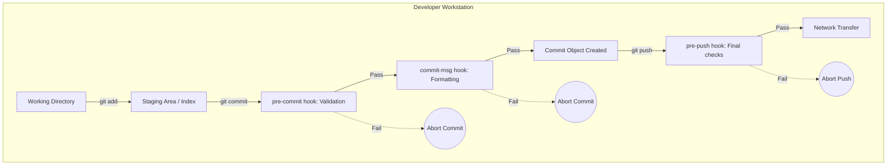

# Module 9: Automation and Customization - Hooks and Rerere

**Complexity**: [MEDIUM]
**Time to Complete**: 75 minutes
**Prerequisites**: Previous module in Git Deep Dive
**Next Module**: [Module 10: Bridge to GitOps](../module-10-gitops-bridge/)

## Learning Outcomes

By the end of this module, you will be able to:

1. **Design** client-side Git hooks that automatically validate code quality and prevent sensitive data exposure before a commit is finalized.
2. **Implement** a conventional commit enforcement strategy using the `commit-msg` hook to standardize repository history.
3. **Evaluate** when and how to leverage Git Rerere, or Reuse Recorded Resolution, to automate the resolution of repeated merge conflicts.
4. **Compare** methods for standardizing Git configurations across a team, including global configurations, wrapper frameworks, and Git template directories.
5. **Diagnose** failing Git hooks by debugging file names, permissions, exit codes, staged content, and execution environment context.

## Why This Module Matters

It was a quiet Tuesday morning at a mid-sized fintech company, Vanguard Pay, when the automated alerting system suddenly filled the incident channel. The core payment microservice, deployed through GitOps into a Kubernetes 1.35 production cluster, had just consumed a new manifest from the main branch and started crash-looping. For Kubernetes examples in this course, configure `alias k=kubectl`; later you might confirm the blast radius with `k get pods` or `k describe deploy`, but in this incident the team first saw the failure through customer payment errors and a growing queue of failed transaction retries.

The culprit was painfully ordinary. A malformed YAML indentation change reached the repository in the same commit as a hardcoded credential-shaped configuration value, and the GitOps controller reacted faster than the humans around it. CI would have rejected the manifest eventually, yet the deployment trigger watched the branch closely enough that the broken state propagated before the pipeline finished. The team spent three hours rolling back workloads, rotating credentials, restoring clean configuration, and explaining why a local typo had become a production incident with a multi-million-dollar business impact.

Git hooks exist because the cheapest defect is the one that never leaves the developer workstation. They let a repository interrupt local operations such as commit and push, run validation at the exact moment the developer has context, and reject changes before they become shared history. Hooks are not a replacement for CI, branch protection, or server-side policy, but they make the happy path safer and faster for engineers who are trying to do the right thing under deadline pressure.

Rerere solves a different but related problem: repeated human effort. When a long-lived branch collides with a fast-moving main branch, the same merge conflict can return during rebases, cherry-picks, and repeated integration attempts. Git can remember a conflict that you resolved once, recognize the same conflict geometry later, and reapply the previous resolution so you spend attention on new design decisions instead of solving the same puzzle again.

This module treats Git as an automation surface rather than a passive storage tool. You will build local hooks that validate staged content, enforce useful commit messages, and block risky pushes; then you will evaluate how rerere, aliases, global configuration, and template directories change the daily ergonomics of a platform engineer's workflow. The goal is not to create clever shell scripts for their own sake, but to design small guardrails that make correct behavior the easiest behavior.

## Part 1: The Interception Layer: Demystifying Git Hooks

Git hooks are executable programs that Git runs at defined lifecycle points. A hook can run before a commit is created, after a commit is created, before a push transfers objects, after a merge finishes, or when a remote repository receives updates. Git does not care whether the hook is written in Bash, Python, Ruby, Node.js, or a compiled language; it only cares that the file has the exact hook name, lives in the correct hooks directory, can execute on the operating system, and returns an exit status that tells Git whether to continue.

The most important mental model is that a hook is not a background service. It is a synchronous checkpoint inside a Git command. When you run `git commit`, Git prepares the index snapshot, looks for a hook named `pre-commit`, runs it if present and executable, and waits for the process to finish. A zero exit code means the hook approves the operation, while a non-zero exit code means the hook rejected the operation and Git must stop.

Client-side hooks run on the developer's workstation, so they are excellent for fast feedback and weak as hard security boundaries. A developer can delete them, forget to install them, or bypass many of them with `--no-verify`. Server-side hooks and hosted platform controls run where the shared repository receives pushes, so they are better suited for non-negotiable policy. A good engineering program uses both: local hooks reduce accidental mistakes, and central controls enforce the rules that must never depend on an individual laptop.



The diagram shows why hook placement matters. A `pre-commit` hook can inspect the staged snapshot before any new commit object exists, so it is the right place for formatting, linting, and quick secret checks. A `commit-msg` hook receives the proposed commit message after the developer has written it, so it is the right place for Conventional Commits or ticket references. A `pre-push` hook sees the refs being pushed, so it is better for branch protection reminders, local test suites, and checks that are too expensive to run on every commit.

The `pre-commit` hook should be fast because it runs during the highest-friction moment of the editing loop. If a hook takes several minutes, developers will learn to bypass it, which turns a quality gate into a source of resentment. Reserve `pre-commit` for deterministic checks that complete quickly, and move slower checks to `pre-push` or CI. In a Kubernetes manifest repository, a reasonable local hook validates YAML syntax, prevents obvious credential strings, and maybe runs a schema check on changed files rather than rebuilding the whole platform.

The `commit-msg` hook is less about code correctness and more about history quality. Conventional commit prefixes, scoped messages, and ticket references make `git log`, release generation, and incident investigation easier months after the original change. During a production regression, a clear commit message can shorten a `git bisect` search because the operator can distinguish a harmless documentation update from a change to admission policy, deployment templates, or cluster bootstrap logic.

The `pre-push` hook is the last local checkpoint before network transfer. It can prevent accidental direct pushes to `main`, run a focused test suite, or verify that the branch name matches an issue-tracking convention. Because a push is less frequent than a commit, this hook can afford to be heavier than `pre-commit`, but it still should not replace CI. Treat it as a helpful local preview of remote expectations, not as the only place where correctness is proven.

Pause and predict: what do you think happens if a developer uses `git commit --no-verify` against a repository that relies only on client-side hooks? Git skips the local hook execution that the flag is allowed to bypass, which means the local safety net disappears for that operation. This is why local hooks should express helpful developer workflow checks, while mandatory controls such as protected branches, required reviews, and server-side validation must live outside the developer's personal configuration.

One practical design rule follows from this distinction: write local hook messages as coaching, not as punishment. A failed hook should name the file, explain the failed rule, and suggest the next command or remediation. The engineer is already in the flow of committing or pushing, so a vague message such as "failed" wastes the moment when they are most ready to fix the problem.

Another design rule is to keep hook ownership visible. If a repository depends on a local hook, the team should know who maintains it, where the canonical version lives, and how a contributor updates their local installation. Hooks often begin as one engineer's helpful script and slowly become required workflow infrastructure. Once that happens, an undocumented hook can create support load every time a laptop is replaced, a shell changes, or a dependency moves.

## Part 2: Building a `pre-commit` Hook for YAML Validation and Secrets Scanning

Imagine an infrastructure repository with hundreds of Kubernetes manifests, Helm values files, and environment overlays. A single malformed YAML file can break automation, and a single committed credential can trigger emergency rotation. The purpose of a local `pre-commit` hook in this repository is not to prove the whole system works; it is to reject obvious defects while the author still remembers what they changed and before those defects enter shared history.

The critical implementation detail is that a commit records the staging area, not necessarily the files currently visible in the working directory. Developers often stage a clean file, keep editing, and accidentally leave unstaged work behind. A correct hook validates the exact staged blobs that Git is about to commit. A flawed hook that lints plain file paths can reject a valid staged commit because of unrelated unstaged edits, or worse, pass a staged defect because the working tree has already been fixed but not staged.

Begin by inspecting the local hooks directory. Git creates sample hook files in `.git/hooks`, but their `.sample` suffix means Git will not run them. The active hook must be named exactly after the hook phase, with no extension, and the file must be executable according to the operating system.

```bash
# Navigate to the hidden hooks directory
cd .git/hooks

# Inspect the default samples provided by Git
ls -l
```

Before running this, predict what you expect to see in a new repository. You should see sample files such as `pre-commit.sample`, `commit-msg.sample`, and `pre-push.sample`, but Git ignores them until you create files with the exact active names. That naming rule matters because a hook called `pre-commit.py` can be perfectly executable and still never run.

```bash
# Create the file and grant it execute permissions
touch pre-commit
chmod +x pre-commit
```

The hook below implements two phases. First it identifies staged files that were added, copied, or modified, then it lints staged YAML content by streaming the index version through `git show ":$FILE"`. Second it scans staged blobs for simple credential-shaped markers. The credential pattern is intentionally basic for teaching; production teams should use a maintained scanner such as Gitleaks, TruffleHog, or a hosted secret-scanning service in addition to any local hook.

```bash
#!/bin/bash
# .git/hooks/pre-commit

# Redirect all output to standard error to ensure it's visible in all Git GUIs
exec 1>&2

echo "Running KubeDojo pre-commit validation suite..."

# Initialize a global error tracking flag
ERROR_FOUND=0

# ---------------------------------------------------------
# Phase 1: Strict YAML Linting
# ---------------------------------------------------------
echo "--> Initiating YAML syntax verification..."
while IFS= read -r -d '' FILE; do
    if [[ "$FILE" == *.yaml ]] || [[ "$FILE" == *.yml ]]; then
        # Verify that the yamllint binary is accessible in the environment's PATH
        if command -v yamllint &> /dev/null; then
            # DANGER ZONE AVOIDED: We use 'git show :$FILE' to extract and lint the
            # exact STAGED version of the file, completely ignoring the working directory.
            git show ":$FILE" | yamllint -d "{extends: relaxed, rules: {line-length: disable}}" -
            
            # $? captures the exit code of the previous command (yamllint)
            if [ $? -ne 0 ]; then
                echo "CRITICAL: YAML validation failed for manifest -> $FILE"
                ERROR_FOUND=1
            fi
        else
            echo "WARNING: 'yamllint' binary not detected, skipping validation for $FILE"
        fi
    fi
done < <(git diff --cached --name-only --diff-filter=ACM -z)

# ---------------------------------------------------------
# Phase 2: Aggressive Secrets Scanning
# ---------------------------------------------------------
echo "--> Scanning staged blobs for hardcoded credentials..."
while IFS= read -r -d '' FILE; do
    # Search the staged blob content for a regex of forbidden, high-risk keywords.
    # Note: This is a simplistic regex for educational illustration. Real-world
    # production setups should utilize dedicated engines like TruffleHog or Gitleaks.
    if git show ":$FILE" | grep -iE 'password\s*[:=]|secret\s*[:=]|api_key|aws_access_key_id'; then
        echo "FATAL: Potential hardcoded secret identified within -> $FILE"
        ERROR_FOUND=1
    fi
done < <(git diff --cached --name-only --diff-filter=ACM -z)

# ---------------------------------------------------------
# Phase 3: Final Execution Evaluation
# ---------------------------------------------------------
if [ $ERROR_FOUND -ne 0 ]; then
    echo ""
    echo "COMMIT ABORTED: Security or syntax violations detected."
    echo "Please remediate the errors highlighted above, stage your fixes, and try again."
    # Exiting with a non-zero status explicitly instructs Git to terminate the commit process
    exit 1
fi

echo "All pre-commit quality gates passed successfully."
exit 0
```

Notice that the script starts by redirecting standard output to standard error. Many Git clients and terminal workflows show hook errors more reliably when the hook writes to stderr, especially when the Git command itself captures stdout. The script also uses `--diff-filter=ACM` so deleted files are ignored; attempting to lint a file that no longer exists adds noise and can cause a hook to fail for the wrong reason.

The `git show ":$FILE"` expression is the heart of the hook. The colon prefix tells Git to read the file from the index, which is the staged snapshot. If a developer has unstaged changes in the working tree, those changes are invisible to this validation step. That behavior is exactly what you want, because the hook should approve or reject the commit that Git is about to create, not the editor buffer the developer has not staged yet.

A hook like this also needs a clear dependency policy. If `yamllint` is missing, this educational script warns and continues so a new learner can still complete the exercise. A production repository might make the opposite choice and fail closed, but then the team must provide a reliable installation path. Otherwise the hook becomes a hidden onboarding tax, and new contributors spend their first hour debugging local tooling rather than learning the codebase.

Now create an intentionally flawed manifest. The first defect is invalid YAML indentation, and the second is an obviously unsafe credential-shaped value. In real repositories, prefer Kubernetes Secrets sourced through external secret management, sealed secrets, or cloud identity primitives; this example is deliberately small so the hook behavior is easy to see.

```text
# broken-deploy.yaml
apiVersion: apps/v1
kind: Deployment
metadata:
  name: test-app
spec:
  replicas: 3
    selector: # FATAL ERROR: Invalid YAML indentation
      matchLabels:
        app: test
  template:
    metadata:
      labels:
        app: test
    spec:
      containers:
      - name: app
        image: nginx:1.26
        env:
        - name: DATABASE_PASSWORD
          value: "super_secret_production_123!" # FATAL ERROR: Hardcoded secret exposed
```

```bash
git add broken-deploy.yaml
git commit -m "feat: introduce new production deployment manifest"
```

```text
Running KubeDojo pre-commit validation suite...
--> Initiating YAML syntax verification...
stdin
  7:5       error    wrong indentation: expected 2 but found 4  (indentation)

CRITICAL: YAML validation failed for manifest -> broken-deploy.yaml
--> Scanning staged blobs for hardcoded credentials...
        - name: DATABASE_PASSWORD
          value: "super_secret_production_123!" # FATAL ERROR: Hardcoded secret exposed
FATAL: Potential hardcoded secret identified within -> broken-deploy.yaml

COMMIT ABORTED: Security or syntax violations detected.
Please remediate the errors highlighted above, stage your fixes, and try again.
```

This failure is a success because the repository rejected a bad snapshot before it became history. The hook did not need a remote repository, a CI queue, or a reviewer to notice the obvious problem. It also gave the author a concrete file name and a concrete remediation path: fix the YAML, remove the unsafe value, stage the corrected file, and rerun the commit.

There is one tradeoff worth stating plainly. A local scanner that uses simple regular expressions will produce both false positives and false negatives. That does not make it useless; it means the hook is a cheap early filter, not the final authority. The stronger design is layered: local checks for speed, CI checks for consistency, hosted secret scanning for repository-wide detection, and credential rotation procedures for the cases that still escape.

This staged-content habit also helps with partial commits. Experienced developers often use `git add -p` to stage one logical change while leaving unrelated edits in the same file for later. A hook that reads the working tree destroys that workflow because it judges the whole file on disk. A hook that reads the index respects the developer's intent and validates only the patch that is becoming history, which makes the automation feel precise rather than intrusive.

## Part 3: Enforcing Standards with `commit-msg` Hooks

A repository's history is an operational interface. People read it during outages, release managers parse it for changelogs, and automation systems use it to decide whether a change is a feature, fix, refactor, or build update. A messy log full of "wip", "fix", and "stuff" forces future operators to open every diff when they are trying to answer a simple question under pressure.

Conventional Commits create a small grammar for commit messages. The message starts with a type such as `feat`, `fix`, or `docs`, optionally includes a scope in parentheses, and then provides a concise description. The format is simple enough for humans to remember and structured enough for tools to parse. The `commit-msg` hook is the correct enforcement point because Git passes the proposed message file to the hook before the commit object is created.

The following hook reads the commit message from the file path supplied as the first argument. It then checks that the message matches the expected type, optional scope, optional breaking-change marker, colon, space, and description. If the message fails, the hook explains the acceptable shape and exits with status `1`.

```bash
#!/bin/bash
# .git/hooks/commit-msg

# The first argument ($1) passed to this specific script by Git is the absolute path
# to a temporary hidden file containing the exact commit message the user just typed.
MESSAGE_FILE=$1
MESSAGE=$(cat "$MESSAGE_FILE")

# Define our strictly allowed semantic types
TYPES="build|chore|ci|docs|feat|fix|perf|refactor|revert|style|test"

# Define the uncompromising regular expression for conventional commits
# ^($TYPES)          : Must explicitly start with one of the allowed types
# (\([a-z0-9\-]+\))? : May contain an optional scope wrapped in parentheses
# !?                 : May contain an optional breaking change exclamation mark
# : \s+              : Must contain a colon followed by at least one space
# .*                 : Must contain a descriptive payload
REGEX="^($TYPES)(\([a-z0-9\-]+\))?!?: .+"

# Check if the user's message matches our rigorous regex
if ! echo "$MESSAGE" | grep -qE "$REGEX"; then
    echo "COMMIT REJECTED: Invalid commit message format."
    echo "Your submitted message was: '$MESSAGE'"
    echo ""
    echo "This repository strictly enforces the Conventional Commits specification."
    echo "Please reformat your message to match the following template:"
    echo "  <type>[optional scope]: <description>"
    echo ""
    echo "Allowed types include: $TYPES"
    echo "Valid Example: feat(auth): implement OIDC provider integration"
    exit 1
fi

exit 0
```

Pause and predict: what output do you expect if a developer runs `git commit -m "WIP: fixing stuff"` with this hook installed? The hook reads the temporary message file, compares the string to the regular expression, rejects the uppercase `WIP` type because it is not in the allowed list, and prints the corrective template. The important teaching point is that the hook is validating repository history as data, not merely nagging developers about style.

Regular expressions are useful here, but they also become maintainability risks when they try to encode every possible policy. If your organization requires ticket IDs, breaking-change trailers, signed-off-by lines, or branch-based message rules, consider whether a small script with named checks would be clearer than a single dense expression. Hooks are production code in miniature; they deserve readability, tests, and error messages that a tired engineer can understand.

The `commit-msg` phase can also normalize behavior across tools. Some developers commit from a terminal, others from an IDE, and others through a graphical Git client. As long as the client invokes Git normally, the hook sees the same message file and applies the same rule. That consistency is why message validation belongs in Git's lifecycle rather than in a wiki page that people are expected to remember.

## Part 4: Guarding the Remote with the `pre-push` Hook

The `pre-push` hook runs after Git has determined what refs it intends to update, but before the objects are transferred. That timing makes it useful for stopping mistakes that are obvious from the destination ref or expensive to discover after a remote rejection. Accidentally pushing directly to `main` is a classic example: server-side branch protection may reject the push, but a local hook can catch the intent immediately and explain the expected feature-branch workflow.

Unlike `pre-commit`, the `pre-push` hook receives data on standard input. Each line describes one ref update with the local ref, local SHA, remote ref, and remote SHA. A hook can read those lines and decide whether the push is acceptable. In the simple policy below, any attempt to update `refs/heads/main` is rejected with a message that tells the developer to push an isolated branch and open a pull request.

```bash
#!/bin/bash
# .git/hooks/pre-push

PROTECTED_BRANCH="main"

# The pre-push hook receives specific ref data on standard input in the format:
# <local ref> <local sha1> <remote ref> <remote sha1>
while read LOCAL_REF LOCAL_SHA REMOTE_REF REMOTE_SHA
do
    # Check if the remote reference being targeted is our protected branch
    if [[ "$REMOTE_REF" == *"refs/heads/$PROTECTED_BRANCH" ]]; then
        echo "FATAL PUSH REJECTED: Direct, unmediated pushes to '$PROTECTED_BRANCH' are forbidden."
        echo "Please push your changes to an isolated feature branch and open a formal Pull Request."
        exit 1
    fi
done

exit 0
```

This hook improves the developer experience, but it still does not replace remote branch protection. A developer can bypass many client-side hooks, push from another machine, use a different Git client, or misconfigure their environment. The remote repository must still require reviews, status checks, and permissions for protected branches. The local hook is valuable because it turns a predictable mistake into immediate local feedback instead of a slower remote rejection.

The same hook phase can run heavier checks because a push is less frequent than a commit. For example, a repository might run a targeted unit test suite before allowing a push, or it might verify that generated manifests are up to date. The design question is whether the check is fast enough that developers will tolerate it and specific enough that failures feel actionable. If the answer is no, move the check to CI and keep the local hook focused on policy hints and fast validation.

## Part 5: Rerere: Reuse Recorded Resolution

Merge conflicts are normal in active repositories, but repeated merge conflicts are waste. The pain shows up when a feature branch lives for days while `main` keeps changing. You resolve a conflict during a rebase, continue, and then encounter the same textual conflict later when Git replays another commit. The human brain has already solved the problem, yet Git asks for the same work again because rerere is usually disabled by default.

Rerere means Reuse Recorded Resolution. When enabled, Git records the preimage of a conflict and the postimage of your resolution. The preimage is the conflict shape Git saw, including the competing versions. The postimage is the clean file you staged after resolving the conflict. When Git later sees the same conflict shape, it can reapply the recorded postimage and tell you that it used a previous resolution.

```bash
git config --global rerere.enabled true
```

Rerere is especially useful for long-running rebases, patch stacks, release branches, and repeated merges between integration branches. It is less useful when conflicts are rare or when the surrounding code changes so much that a textually similar conflict needs a different semantic decision. The tool is a memory aid, not a design authority. You still need to inspect the result before continuing, especially in files where syntax can pass while behavior is wrong.

```mermaid
flowchart TD
    subgraph Step 1: The Initial Conflict
        direction TB
        C1["Conflict (Main vs Feature)\n\n<<<<<<< HEAD\nspec.replicas: 3\n=======\nspec.replicas: 5\n>>>>>>> feature"]
        R1["You manually resolve this to:\n\nspec.replicas: 5"]
        C1 --> R1
    end
    
    subgraph Step 2: Rerere Records State
        Mem["Git memorizes the state:\n\n1. Preimage (The conflict signature)\n2. Postimage (Your final resolved state)"]
    end
    
    subgraph Step 3: The Future Rebase Conflict
        direction TB
        C2["Rebasing Feature onto Main\n\n<<<<<<< HEAD\nspec.replicas: 3\n=======\nspec.replicas: 5\n>>>>>>> feature"]
        R2["Git recognizes the signature!\nSilently auto-resolves to:\n\nspec.replicas: 5"]
        C2 --> R2
    end
    
    Step 1 --> Step 2 --> Step 3
```

The diagram uses a Kubernetes replica count because it is easy to visualize, but the same mechanism applies to application code, documentation, configuration, and generated files. Git is not understanding business intent; it is matching conflict geometry. If the same conflict shape appears again, rerere can apply the same textual resolution. That is powerful during repetitive rebases and dangerous if you stop reviewing the final diff.

The following exercise simulates a conflict in a tiny repository. In a real team, the conflict might involve a deployment strategy, an admission policy, a CI workflow, or a shared library function. The lesson is the same: enable rerere before the conflict, resolve once, and let Git record enough information to save future effort.

```bash
# On the main branch
echo 'version: "1.0"' > app-config.yaml
git add app-config.yaml && git commit -m "chore: add initial config"

# Switch to a new feature branch
git checkout -b feature
echo 'version: "2.0-beta"' > app-config.yaml
git commit -am "feat: update config to beta release"

# Back on main, someone makes a conflicting change
git checkout main
echo 'version: "1.1"' > app-config.yaml
git commit -am "chore: bump version to 1.1"

# Trigger a catastrophic conflict
git merge feature
```

```text
Auto-merging app-config.yaml
CONFLICT (content): Merge conflict in app-config.yaml
Recorded preimage for 'app-config.yaml'
Automatic merge failed; fix conflicts and then commit the result.
```

The phrase `Recorded preimage` means rerere has captured the conflict side of the mapping. It has not yet learned the answer. You teach it the answer by editing the file to the correct resolved state, staging that result, and completing the merge or rebase step. Only then can Git record the postimage and reuse that resolution later.

```bash
git add app-config.yaml
git commit -m "Merge feature branch"
```

```text
Recorded resolution for 'app-config.yaml'.
[main 7f3a8b2] Merge feature branch
```

Now imagine that the merge was not the workflow you wanted. Maybe the team prefers a linear history, so you reset the merge and rebase the feature branch instead. The reset command below is intentionally destructive in the throwaway exercise repository; do not run it in a real repository unless you are certain which commit you are discarding.

```bash
# Undo the merge operation in the throwaway exercise repository
git reset --hard HEAD~1
```

Pause and predict: if you ran `git rerere forget app-config.yaml` right now, what would happen during the next rebase? Git would discard the remembered mapping for that path, so the next identical conflict would stop for manual resolution as if rerere had never seen it. That command is the escape hatch when Git learned a bad answer or when a file's surrounding context changed enough that the old answer is no longer trustworthy.

```bash
# Switch back to the feature branch and initiate a rebase onto main
git checkout feature
git rebase main
```

```text
Auto-merging app-config.yaml
CONFLICT (content): Merge conflict in app-config.yaml
Resolved 'app-config.yaml' using previous resolution.
```

Even after rerere applies a previous resolution, you should inspect the result. Run `git diff`, confirm the file still expresses the intended behavior, stage the file if needed, and continue the rebase. The habit matters because text can match while meaning drifts. A deployment manifest that resolved correctly last week might need a different image tag, environment variable, or rollout strategy after nearby changes landed.

Rerere has an optional `rerere.autoupdate` setting that automatically stages the reused resolution. That setting is convenient for experienced maintainers working in stable patch queues, but it removes a useful pause. In most learning and team settings, leave autoupdate off so the developer has to review and stage the file deliberately. Speed is helpful only when it does not erase the review moment that catches semantic mistakes.

Rerere also changes how you think about aborting and retrying integration work. Without rerere, restarting a messy rebase can feel expensive because every conflict resolution may have to be repeated. With rerere enabled, aborting a confusing attempt and restarting from a clearer plan becomes less costly. That can improve decision quality because you are less tempted to keep pushing through a rebase just to avoid redoing manual conflict work.

## Part 6: Git Aliases and Global Configuration for Complex Workflows

Hooks and rerere automate decision points, while aliases and global configuration reduce repeated typing. As repositories grow, the commands you run most often become long enough that small shortcuts change behavior. A good alias is not just shorter; it captures a workflow you want to repeat consistently, such as viewing a readable graph, undoing the last commit without losing staged changes, or publishing the current branch with upstream tracking.

```bash
git config --global --edit
```

The aliases below are intentionally practical for DevOps and SRE work. The log alias turns history into a graph that makes branching and merges visible. The undo alias removes the last commit while keeping its changes staged, which is useful when the commit message was wrong or one file was forgotten. The contains and pub aliases answer common coordination questions quickly.

```ini
[alias]
    # The ultimate log graph. Renders branches, tags, and commit hashes beautifully in the terminal.
    lg = log --color --graph --pretty=format:'%Cred%h%Creset -%C(yellow)%d%Creset %s %Cgreen(%cr) %C(bold blue)<%an>%Creset' --abbrev-commit
    
    # Soft "Undo" of the last commit, dropping the commit but keeping changes staged.
    # Perfect for when you forgot to add a critical file or made a typo in the message.
    undo = reset --soft HEAD~1
    
    # Hard "Nuke" of your current working directory back to a completely clean slate.
    # WARNING: Irreversibly destroys all uncommitted tracked and untracked changes.
    nuke = !git clean -fd && git reset --hard && git checkout .
    
    # Rapidly check which branches currently contain a specific commit hash
    contains = branch --contains
    
    # Push the current branch and automatically set the upstream tracking branch on the remote
    pub = push -u origin HEAD
```

The `nuke` alias is included because it appears in many real-world dotfiles, but it deserves caution. It deletes untracked files and resets tracked changes, so it is appropriate only when the repository is disposable or when you have verified that no useful work remains. Powerful aliases should be named in a way that makes their danger obvious, and teams should avoid normalizing destructive shortcuts for beginners.

Global configuration changes can also shift default Git behavior. Setting `pull.rebase` to `true` makes `git pull` fetch and rebase instead of fetch and merge, which helps teams that prefer linear local history. Setting `push.default` to `current` lets `git push` publish the current branch to a remote branch with the same name. These defaults save time, but they also encode workflow choices, so document them when onboarding a team.

There is a useful analogy here with shell aliases such as `alias k=kubectl`. The alias does not make Kubernetes safer by itself; it lowers friction for commands you run frequently. Git aliases behave the same way. They should shorten well-understood operations, not hide operations that a learner has not yet understood. If a shortcut prevents you from explaining what the underlying command does, it is too early to depend on that shortcut.

When you review another engineer's dotfiles, pay attention to whether aliases are transparent or surprising. A harmless alias such as `git lg` makes output easier to read, while a destructive alias can remove work with one typo. Team documentation should recommend aliases that improve shared vocabulary and avoid requiring personal shortcuts for core workflows. Repository instructions must remain runnable for someone using plain Git without private shell customization.

## Part 7: Template Directories and Team Standardization

The biggest surprise for many engineers is that `.git/hooks` is not versioned. A hook placed there belongs to one local clone. When a teammate clones the repository, they get a new `.git` directory populated by Git, not a copy of your local hook directory. That design protects repository portability, but it means a team needs an explicit distribution strategy for hooks and Git configuration.

There are two common approaches. Wrapper frameworks such as the `pre-commit` framework or Husky keep hook configuration in tracked repository files and provide an install step that wires the local hooks directory to the framework. Git template directories are native to Git and copy files into new repositories during `git init` or `git clone`. The framework approach is usually better for project-specific checks, while templates are useful for machine-wide defaults that one engineer wants in every repository.

The template directory mechanism is simple. You create a directory with the same shape as files you want copied into `.git`, place hooks under its `hooks` subdirectory, and configure `init.templatedir` to point there. Future repositories initialized or cloned by that Git installation receive those files at creation time. Existing repositories are not automatically updated, which is an important operational limitation.

```bash
# Create a centralized location safely within your home directory
mkdir -p ~/.git-templates/hooks
```

Copy the `pre-commit` and `commit-msg` scripts from earlier into `~/.git-templates/hooks/`, then make sure each file is executable. If the execute bit is missing, Git will ignore the hook, and the failure mode can look like the hook never existed. This is one reason wrapper frameworks are attractive: they often handle installation, permissions, and tool environments more consistently than ad hoc manual setup.

```bash
git config --global init.templatedir '~/.git-templates'
```

Template directories are not a complete team governance system. They depend on each person's global Git configuration, and they affect new repositories rather than retroactively repairing old ones. They are excellent for personal defaults, training environments, and organizations that manage developer workstations centrally. For most application repositories, combine a tracked framework configuration with CI enforcement so the repository declares its own expectations.

Which approach would you choose for a platform team that owns dozens of Kubernetes add-ons across many repositories, and why? A reasonable answer is to use a tracked framework configuration for repository-specific validation, remote branch protection for mandatory policy, and optional template directories for personal convenience. That layered design keeps the repository self-describing while still letting individual engineers carry helpful defaults across unrelated projects.

The distribution choice should match the blast radius of the rule. A personal preference such as a log alias belongs in global configuration or a template. A repository rule such as "all manifests must pass this schema check" belongs in tracked project configuration and CI. A company-wide rule such as "no direct pushes to protected branches" belongs in the hosting platform. Mixing those levels creates confusion because contributors cannot tell whether a failure came from their machine, the repository, or the organization.

## Patterns & Anti-Patterns

Good Git automation is small, observable, and layered. A hook should answer one workflow question at the right lifecycle point, return a meaningful exit code, and explain failures in terms the author can fix. Rerere should reduce repeated conflict labor without removing human review. Global configuration should encode deliberate defaults rather than hide surprising behavior.

| Pattern | When to Use It | Why It Works |
|---------|----------------|--------------|
| Validate staged content in `pre-commit` | Use this for fast syntax, formatting, and obvious secret checks on files about to be committed. | The hook evaluates the same snapshot Git will record, so unstaged edits do not corrupt the result. |
| Enforce history grammar in `commit-msg` | Use this when release tooling, audits, or incident response depend on readable commit messages. | The hook receives the proposed message before the commit exists, making rejection clean and local. |
| Keep heavy checks in `pre-push` or CI | Use this when a check is valuable but too slow for every commit. | Developers still receive early feedback, while the commit loop stays fast enough to preserve flow. |
| Enable rerere with manual review | Use this for long-lived branches, repeated rebases, and patch queues. | Git reuses recorded conflict resolutions while the author still inspects the final diff before continuing. |

Anti-patterns usually appear when teams expect local automation to carry more responsibility than it can support. A client-side hook cannot be your only security policy, a regex scanner cannot be your only secret defense, and a template directory cannot be your only onboarding mechanism. These tools are most effective when each layer has a narrow job and failure at one layer is caught by another.

| Anti-pattern | Why Teams Fall Into It | Better Alternative |
|--------------|------------------------|--------------------|
| Treating local hooks as mandatory security | Hooks feel strict because they block local commands, so teams overestimate their enforcement power. | Use local hooks for feedback and enforce non-negotiable rules with CI, protected branches, and server-side controls. |
| Linting working-tree files in `pre-commit` | Reading file paths is simpler than reading index blobs, especially in first drafts of hook scripts. | Use `git diff --cached` and `git show ":$FILE"` so validation matches the staged snapshot. |
| Installing hooks only in `.git/hooks` | The hook works on the author's machine, creating the illusion that it belongs to the repository. | Track hook configuration in the repository through a framework, or document template setup for personal defaults. |
| Auto-staging rerere resolutions blindly | Repeated conflicts are tedious, so removing every manual step looks attractive. | Let rerere apply the text, then inspect `git diff` and stage deliberately before continuing. |

The scaling lesson is that hooks become shared infrastructure once a team depends on them. Treat them with the same care as scripts under `scripts/` or CI workflows under `.github/`. Keep them readable, review changes to them, test their failure paths, and document the supported installation method. A confusing hook can waste as much time as the defect it was meant to prevent.

## Decision Framework

Choosing where to put a Git automation rule starts with the consequence of failure. If a missed check can expose credentials, break production deployment, or violate compliance, the rule must be enforced centrally even if it is also previewed locally. If a missed check merely causes a style cleanup, local hooks and CI feedback may be enough. Put the strongest enforcement where bypass is hardest, and put the fastest guidance where the developer can fix the issue immediately.

| Decision Question | Prefer This Approach | Tradeoff |
|-------------------|----------------------|----------|
| Does the rule need to inspect only staged files before a commit exists? | Use `pre-commit`. | Keep it fast, because it runs during the editing loop. |
| Does the rule validate the commit message itself? | Use `commit-msg`. | Be careful with merge commits, revert commits, and generated messages. |
| Does the rule depend on the target branch or push destination? | Use `pre-push` as a local reminder and remote branch protection as enforcement. | Local checks improve speed, but the server remains the authority. |
| Does the rule repeat across every repository on one workstation? | Use a Git template directory or global config. | It helps one machine, but it does not declare project policy. |
| Does the rule need consistent installation for every contributor? | Use a tracked hook framework plus CI. | There is an onboarding step, but expectations live with the repository. |
| Are repeated conflicts wasting rebase time? | Enable rerere and review reused resolutions. | It saves repeated work, but it cannot judge semantic correctness. |

Use this sequence when designing a new rule: define the defect, decide whether it is advisory or mandatory, choose the earliest lifecycle point with the needed information, and write the failure message before writing the check. That last step forces clarity. If you cannot explain the failure in one actionable paragraph, the policy may be too broad for a local hook.

The same framework applies to Kubernetes repositories. YAML syntax checks and simple manifest linting belong in `pre-commit`, schema validation might belong in `pre-push` or CI, and cluster admission policy belongs in the cluster or deployment pipeline. A local Git hook can catch the obvious mistake, but only centralized controls can prove that the accepted manifest is safe for the shared environment.

## Did You Know?

1. **Client-side hooks can be bypassed**: `git commit --no-verify` and `git push --no-verify` can skip many local hooks, which is why local hooks are best treated as fast feedback rather than final security enforcement.
2. **Rerere has its own retention settings**: Git can expire recorded resolutions through garbage collection, and the `gc.rerereresolved` and `gc.rerereunresolved` settings control how long resolved and unresolved records are retained.
3. **Template directories are copied, not linked**: Files from `init.templatedir` are copied into a new repository's `.git` directory at initialization time, so later edits to the template do not automatically update existing repositories.
4. **Hook language is determined by the operating system**: A hook file can be Bash, Python, Node.js, Ruby, or a compiled executable as long as the file name is exact, permissions allow execution, and the shebang or binary format is valid.

## Common Mistakes

| Mistake | Why It Happens | How to Fix It |
|---------|----------------|---------------|
| **Hooks silently failing to execute** | The hook file lacks execute permissions, or it has an extension such as `.py` that Git does not recognize as the active hook name. | Name the file exactly after the hook phase, such as `.git/hooks/pre-commit`, and run `chmod +x .git/hooks/<hook-name>`. |
| **Linting the working tree instead of the index** | A first draft hook reads file paths directly, so unstaged editor changes influence a commit that would not include them. | Build the file list with `git diff --cached --name-only --diff-filter=ACM` and inspect staged blobs with `git show ":$FILE"`. |
| **Assuming hooks sync through `git pull`** | The `.git` directory is local repository metadata, so hooks installed there are invisible to other clones. | Store hook configuration in a tracked framework setup, or use documented Git template directories for machine-wide defaults. |
| **Trusting rerere without reviewing diffs** | A repeated textual conflict feels solved, so developers continue a rebase without checking whether the old answer still makes sense. | Keep `rerere.autoupdate` off at first, run `git diff`, and stage the reused resolution only after confirming semantic correctness. |
| **Running slow suites in `pre-commit`** | Teams try to shift every quality gate left and accidentally make every commit feel expensive. | Keep `pre-commit` checks focused and fast; move slower tests to `pre-push`, CI, or a manually invoked validation command. |
| **Returning the wrong exit code** | A script prints an error but falls through to a successful exit, so Git continues despite the detected failure. | Track failures explicitly and call `exit 1` whenever the hook should reject the operation. |
| **Forgetting the hook environment is minimal** | Hooks run from Git with a different current directory, PATH, or shell behavior than an interactive terminal session. | Print diagnostic context while debugging, use absolute tool paths when needed, and document required dependencies. |

## Quiz

<details>
<summary><strong>Question 1:</strong> Your team designs a client-side Git hook to validate Kubernetes YAML, but a developer stages a valid file, keeps editing, introduces an unstaged syntax error, and then sees the commit fail. What is wrong with the hook, and how should it validate code quality instead?</summary>

The hook is reading the working-tree file path rather than the staged snapshot. A commit records the index, so unstaged edits should not decide whether the staged content is acceptable. The hook should list staged files with `git diff --cached --name-only --diff-filter=ACM` and stream each staged blob with `git show ":$FILE"` into the validator. That design validates code quality for the exact content Git is about to record and prevents sensitive data checks from drifting away from the commit payload.

</details>

<details>
<summary><strong>Question 2:</strong> A repository needs every commit message to follow Conventional Commits so release tooling can classify changes. Where should the team implement conventional commit enforcement, and why is that hook phase the right one?</summary>

The rule belongs in a `commit-msg` hook because that phase receives the proposed commit message file before the commit object is created. A `pre-commit` hook does not have the final message, and a `pre-push` hook would discover the problem later after the bad local history already exists. The `commit-msg` hook can reject malformed messages immediately and print a useful template. CI can still verify the policy centrally, but local enforcement keeps the author's feedback loop short.

</details>

<details>
<summary><strong>Question 3:</strong> During a long rebase, you resolve the same conflict in `deployment.yaml` three separate times. Which Git feature should you evaluate, and what review habit should remain even after the feature helps?</summary>

You should evaluate Git rerere, which records a conflict preimage and the resolved postimage so Git can reuse the recorded resolution when the same conflict geometry returns. It is valuable for repeated merge conflicts on long-lived branches and patch queues. Even when rerere says it reused a previous resolution, you should inspect `git diff` before staging or continuing. The reused text may be correct mechanically while still needing a different semantic decision in the new context.

</details>

<details>
<summary><strong>Question 4:</strong> A platform team wants every engineer to receive the same hooks automatically after cloning a repository. Someone suggests committing files directly under `.git/hooks`. Compare that method with tracked hook frameworks and Git template directories.</summary>

Committing files under `.git/hooks` will not work because `.git` is local metadata and is not transferred as repository content. A tracked hook framework keeps configuration in normal versioned files and gives every contributor an install path, which is usually best for project-specific policy. Git template directories copy hooks into newly initialized repositories on one machine, which is useful for personal or managed-workstation defaults. The strongest team design combines tracked configuration with CI enforcement so the repository declares its expectations.

</details>

<details>
<summary><strong>Question 5:</strong> A hook prints "FATAL" when it finds a credential-shaped string, but Git still creates the commit. What diagnosis should you perform first, and what fix makes the hook authoritative?</summary>

First inspect the hook's exit behavior. Printing an error message does not reject a Git operation unless the hook exits with a non-zero status. Many Bash scripts accidentally fall through to the status of the last successful command, especially after a loop. Track an error variable when any check fails and call `exit 1` at the end when that variable is set. That makes the hook's decision explicit and gives Git the signal it needs to abort the commit.

</details>

<details>
<summary><strong>Question 6:</strong> Your `pre-push` hook blocks direct pushes to `main`, but a teammate argues that remote branch protection already exists. How should you evaluate whether the local hook is still useful?</summary>

The local hook is still useful if it gives faster and clearer feedback than waiting for the remote to reject the push. It can prevent the network transfer, explain the team workflow, and nudge the developer toward pushing a feature branch. However, it should not be treated as enforcement because it can be bypassed or missing. Remote branch protection remains the mandatory control, while the local hook improves the developer experience around that control.

</details>

<details>
<summary><strong>Question 7:</strong> A new hire says their hook works in the terminal but fails from an IDE with "command not found" for `yamllint`. How do you diagnose the hook execution context without weakening the check?</summary>

Hooks may run with a different PATH or shell environment than an interactive terminal, especially from graphical Git clients. Add temporary diagnostics that print `pwd`, `PATH`, the hook arguments, and the result of `command -v yamllint` so you can see what Git actually provides. Then fix the installation or call a documented tool path instead of silently skipping the check. The goal is to make dependencies reliable, not to hide the environment problem by allowing invalid commits.

</details>

## Hands-On Exercise

In this exercise, you will set up a local Git template directory, build a reusable `pre-commit` hook, test it against staged content, and extend the workflow with a `commit-msg` hook. Use a throwaway workspace so every command is safe to experiment with. The exercise deliberately changes global Git configuration, so record the original `init.templatedir` value before starting if you already use one.

```bash
mkdir -p ~/git-hooks-lab
cd ~/git-hooks-lab
```

### Operational Tasks

#### Task 1: Engineer a Global Template Directory

Create a template directory at `~/.git-templates/hooks`, configure Git to use it for new repositories, and then initialize a fresh repository so you can observe the copy behavior. This task helps you compare standardizing Git configurations through native templates with repository-tracked frameworks. Remember that the template affects future repository creation; it does not retrofit existing clones.

<details>
<summary><strong>Solution: Task 1</strong></summary>

```bash
mkdir -p ~/.git-templates/hooks
git config --global init.templatedir '~/.git-templates'
```

</details>

#### Task 2: Build the Global `pre-commit` Bouncer

Create an executable Bash script inside the template directory that blocks files larger than one megabyte and rejects staged content containing the string `AWS_SECRET_ACCESS_KEY`. The goal is to design a client-side Git hook that validates staged content rather than the working tree. Keep the script intentionally small so you can diagnose exit codes and environment behavior when a test fails.

<details>
<summary><strong>Solution: Task 2</strong></summary>

Create the file and set execution bits:

```bash
touch ~/.git-templates/hooks/pre-commit
chmod +x ~/.git-templates/hooks/pre-commit
```

Add the following robust logic to `~/.git-templates/hooks/pre-commit`:

```bash
#!/bin/bash

ERROR=0

while IFS= read -r -d '' FILE; do
    # 1. Check strict file size limitations. Using wc -c to count raw bytes of the STAGED blob.
    SIZE=$(git show ":$FILE" | wc -c)
    if [ "$SIZE" -gt 1048576 ]; then
        echo "FATAL: File $FILE violates size constraints. It is larger than 1MB ($SIZE bytes)."
        ERROR=1
    fi

    # 2. Check for exposed secrets
    if git show ":$FILE" | grep -q "AWS_SECRET_ACCESS_KEY"; then
        echo "FATAL: Hardcoded AWS secret string identified in $FILE"
        ERROR=1
    fi
done < <(git diff --cached --name-only --diff-filter=ACM -z)

if [ $ERROR -ne 0 ]; then
    echo "COMMIT ABORTED: Quality gates failed."
    exit 1
fi

echo "Pre-commit validation passed."
exit 0
```

</details>

#### Task 3: Initialize, Trigger, and Test the Quality Gate

Create a completely new repository so Git copies the template hook into `.git/hooks`. Then test three cases: a credential-shaped string that should fail, a large binary-like file that should fail, and a clean YAML file that should commit. This task verifies both the template distribution mechanism and the hook's staged-content validation behavior.

<details>
<summary><strong>Solution: Task 3</strong></summary>

**Step 1 and 2: Initialize and Verify Injection**

```bash
cd ~/git-hooks-lab
git init k8s-manifests-repo
cd k8s-manifests-repo
cat .git/hooks/pre-commit # You should clearly see your injected script logic!
```

**Step 3: Test Aggressive Secret Scanning**

```bash
echo 'export AWS_SECRET_ACCESS_KEY="xyz123"' > aws-credentials.sh
git add aws-credentials.sh
git commit -m "chore: add local aws credentials script"
# Expected Output: FATAL: Hardcoded AWS secret string identified...
# Followed by: COMMIT ABORTED: Quality gates failed.
```

**Step 4: Test Strict File Size Limitation**

```bash
dd if=/dev/urandom of=massive_binary.bin bs=1M count=2
git add massive_binary.bin
git commit -m "chore: add massive database dump binary"
# Expected Output: FATAL: File massive_binary.bin violates size constraints...
```

**Step 5: Test Clean, Valid Commit Execution**

```bash
echo "apiVersion: v1" > clean-deployment.yaml
git add clean-deployment.yaml
git commit -m "feat: add initial clean deployment manifest"
# Expected Output: Pre-commit validation passed.
```

</details>

#### Task 4: Stretch Task - Enforce Ticket Tracking via `commit-msg`

Add a `commit-msg` hook to the template directory that rejects commit messages without a Jira-style ticket prefix. This task aligns with the outcome to implement conventional commit enforcement, because the same hook phase and message-file mechanics apply even when your organization chooses a ticket format instead of pure Conventional Commits. Test both a rejected message and an accepted message.

<details>
<summary><strong>Solution: Task 4</strong></summary>

Create the file and set execution bits:

```bash
touch ~/.git-templates/hooks/commit-msg
chmod +x ~/.git-templates/hooks/commit-msg
```

Add the following logic to `~/.git-templates/hooks/commit-msg`:

```bash
#!/bin/bash
MESSAGE_FILE=$1
MESSAGE=$(cat "$MESSAGE_FILE")

# Check if the message starts with an uppercase project code and number
if ! echo "$MESSAGE" | grep -qE "^\[?[A-Z]+-[0-9]+\]?:? "; then
    echo "COMMIT REJECTED: Missing Jira Ticket ID."
    echo "Your message must start with a ticket ID (e.g., 'PROJ-123: Your message')."
    exit 1
fi
exit 0
```

Test the implementation in your repository:

```bash
git commit -m "update readme" --allow-empty
# Expected Output: COMMIT REJECTED: Missing Jira Ticket ID.

git commit -m "KUBE-42: update readme" --allow-empty
# Commit succeeds.
```

</details>

#### Task 5: Inspect Rerere Behavior in a Throwaway Conflict

Enable rerere globally, reproduce the `app-config.yaml` conflict from the lesson, resolve it once, undo the throwaway merge, and trigger the conflict again through a rebase. This task asks you to evaluate Git rerere as an automation tool instead of accepting it as magic. The success condition is not only that Git reuses the resolution, but that you inspect the reused diff before continuing.

<details>
<summary><strong>Solution: Task 5</strong></summary>

Use the rerere sequence from Part 5 in a disposable repository. After Git reports `Resolved 'app-config.yaml' using previous resolution.`, run `git diff` and confirm the file contains `version: "2.0-beta"` without conflict markers. Then stage the file if needed and continue the operation. If you want to prove the memory can be cleared, run `git rerere forget app-config.yaml` and repeat the conflict.

</details>

#### Task 6: Diagnose a Deliberately Broken Hook

Break the hook in one controlled way, such as removing execute permissions or renaming it to `pre-commit.sh`, then run a commit and observe that the hook no longer protects the repository. Restore the correct name and permissions afterward. This task reinforces the diagnosis process for failing Git hooks: verify the file name, verify permissions, verify exit codes, and verify the environment in which Git runs the script.

<details>
<summary><strong>Solution: Task 6</strong></summary>

Run `mv .git/hooks/pre-commit .git/hooks/pre-commit.sh` and try a commit that should fail. Git will ignore the renamed file because it does not match the hook phase name. Move it back with `mv .git/hooks/pre-commit.sh .git/hooks/pre-commit`, then run `chmod +x .git/hooks/pre-commit`. If a hook still behaves unexpectedly, temporarily add `pwd`, `echo "$PATH"`, and `command -v yamllint` diagnostics near the top.

</details>

### Success Criteria Checklist

- [ ] You have successfully configured a global `init.templatedir` mapping in your `.gitconfig`.
- [ ] New repositories automatically inherit a functional `pre-commit` executable script upon initialization.
- [ ] The `pre-commit` hook successfully rejects commits explicitly containing the string `AWS_SECRET_ACCESS_KEY`.
- [ ] The `pre-commit` hook successfully rejects files definitively larger than 1MB in byte size.
- [ ] Valid, properly sized files without exposed secrets are successfully committed into the history.
- [ ] A `commit-msg` hook successfully rejects commits lacking a valid Jira-style ticket ID.
- [ ] You can evaluate rerere by reproducing a conflict, reusing a recorded resolution, and inspecting the final diff.
- [ ] You can diagnose failing Git hooks by checking names, permissions, exit codes, staged content, and execution context.

## Sources

- [Git documentation: githooks](https://git-scm.com/docs/githooks)
- [Git documentation: git-commit](https://git-scm.com/docs/git-commit)
- [Git documentation: git-diff](https://git-scm.com/docs/git-diff)
- [Git documentation: git-show](https://git-scm.com/docs/git-show)
- [Git documentation: git-config](https://git-scm.com/docs/git-config)
- [Git documentation: git-rerere](https://git-scm.com/docs/git-rerere)
- [Git documentation: git-init](https://git-scm.com/docs/git-init)
- [Pro Git book: Customizing Git - Git Hooks](https://git-scm.com/book/en/v2/Customizing-Git-Git-Hooks)
- [pre-commit framework documentation](https://pre-commit.com/)
- [Conventional Commits specification](https://www.conventionalcommits.org/en/v1.0.0/)
- [Kubernetes documentation: ConfigMaps](https://kubernetes.io/docs/concepts/configuration/configmap/)

## Next Module

[Module 10: Bridge to GitOps](../module-10-gitops-bridge/) - Transition from manual Git operations to automated, fully declarative Kubernetes cluster state management with Argo CD and Flux.
