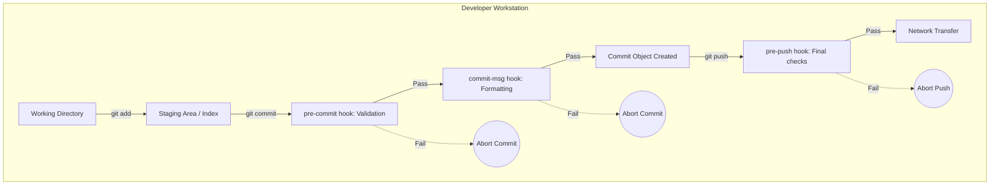

# Module 9: Automation and Customization — Hooks and Rerere
**Complexity**: [MEDIUM]
**Time to Complete**: 75 minutes
**Prerequisites**: Previous module in Git Deep Dive
**Next Module**: [Module 10: Bridge to GitOps](../module-10-gitops-bridge/)

## Learning Outcomes
By the end of this module, you will be able to:
1. **Design** client-side Git hooks that automatically validate code quality and prevent sensitive data exposure before a commit is finalized.
2. **Implement** a conventional commit enforcement strategy using the `commit-msg` hook to standardize repository history.
3. **Evaluate** when and how to leverage Git Rerere (Reuse Recorded Resolution) to automate the resolution of repeated merge conflicts.
4. **Compare** various methods for standardizing Git configurations across a team, including global configurations and Git template directories.
5. **Diagnose** failing Git hooks and debug the environment execution context of hook scripts.

---

## Why This Module Matters

It was a quiet Tuesday morning at a mid-sized fintech company when the automated alerting system suddenly lit up like a Christmas tree. The core payment processing microservice, running on a production Kubernetes cluster, had just pulled a new configuration from the main branch and promptly crash-looped. The incident response team assembled rapidly, frantically digging into the logs while customer support queues began to overflow with failed transaction reports. 

The culprit, discovered after twenty minutes of agonizing troubleshooting, was absurdly simple: a trailing space in a YAML key within a critical Kubernetes ConfigMap manifest, combined with an accidentally hardcoded AWS access key that was pushed in the very same commit. The developer who pushed the code was mortified. They had tested the logic locally, but in the rush to deliver, they missed running the local linter before executing their final `git commit`. 

The CI/CD pipeline eventually caught the YAML syntax error, but only *after* the commit was pushed to the shared repository. Compounding the disaster, due to a slightly misconfigured deployment trigger, the broken manifest was eagerly synced to the production environment by an overzealous GitOps controller before the CI pipeline could fully abort the rollout. The team spent three grueling hours rotating the exposed AWS credentials, fixing the YAML syntax, forcing a rollback, and restoring service. The incident cost the company thousands of dollars in downtime, eroded customer trust, and consumed immense manual remediation effort.

If that engineering team had utilized Git hooks to "shift left" their security and linting checks—running them locally on the developer's machine at the exact millisecond of the `git commit` invocation—the trailing space and the exposed secret would have been caught instantly. The commit would have been rigidly blocked by Git itself, the developer would have fixed it locally in seconds, and the catastrophic incident would never have happened. 

This module is about fundamentally shifting your relationship with Git from being a reactive storage system to an active, intelligent partner. You will learn how to build automated bouncers that enforce quality standards, leverage powerful hidden features like `rerere` to automate tedious conflict resolutions, and customize your local environment to maximize your productivity as a platform engineer.

---

## Part 1: The Interception Layer: Demystifying Git Hooks

Git hooks are custom, executable scripts that Git automatically runs before or after specific lifecycle events such as committing, pushing, and receiving code. They are built-in native features, requiring absolutely no extra software installation, and they live discreetly inside your repository's hidden `.git/hooks` directory. 

Think of Git hooks as an automated security detail standing at the doors of your repository's history. They rigorously inspect anyone and anything trying to enter (a commit or a push) and possess the authority to either wave the changes through or flat-out reject them if they don't meet the club's uncompromising standards.

There are two primary architectural categories of hooks:
1. **Client-Side Hooks**: These execute entirely on the developer's local workstation. They are triggered by local operations like committing, merging, or rebasing. Examples include `pre-commit`, `commit-msg`, and `pre-push`.
2. **Server-Side Hooks**: These run exclusively on the remote repository server (like GitHub, GitLab, or a self-hosted Git daemon). They are utilized to enforce network policies, reject incoming pushes based on content analysis, or trigger complex CI/CD pipelines. Examples include `pre-receive`, `update`, and `post-receive`.

In this module, our focus will be primarily on **Client-Side Hooks**, as they represent the absolute first line of defense for a developer attempting to maintain high-quality code.

### The Client-Side Hook Architecture



### The Big Three Local Hooks

1. **The `pre-commit` Hook**: This script runs first, before you are even prompted to type in a commit message. It is designed to inspect the specific snapshot of data that is staged and about to be committed. If this script exits with a non-zero status (indicating a failure), Git immediately aborts the commit. This is the optimal location to lint code, run rapid unit tests, format files, or check for trailing whitespace.
2. **The `commit-msg` Hook**: This hook takes a single parameter: the path to a temporary file that contains the commit message drafted by the developer. If this script exits with a non-zero status, Git halts the commit process. This is the undisputed industry standard location to programmatically enforce commit message formats, such as the Conventional Commits specification.
3. **The `pre-push` Hook**: This hook executes during a `git push` operation, occurring after the remote references have been updated but strictly before any objects have been transferred over the network. It is ideal for executing heavier, longer-running integration tests or verifying that you aren't accidentally pushing experimental code to a highly protected branch.

> **Pause and predict**: What do you think happens if a `pre-commit` hook is explicitly bypassed by a developer using the `--no-verify` flag?
> 
> If a developer runs `git commit --no-verify` (or `-n`), Git completely bypasses the execution of the `pre-commit` and `commit-msg` hooks. This highlights a critical, unshakeable rule: **Client-side hooks are entirely for developer convenience and fast, localized feedback; they are NOT a hard security boundary.** A malicious or lazy developer can easily circumvent them. True, unbreakable security enforcement must always occur via server-side hooks or centralized CI/CD pipelines.

---

## Part 2: Building a pre-commit Hook for YAML Validation and Secrets Scanning

Let's translate theory into practice. Imagine you are managing an infrastructure repository packed with hundreds of Kubernetes manifests. Broken YAML syntax and accidentally committed API keys are the absolute bane of your existence. Let's engineer a bespoke `pre-commit` hook that automatically validates all modified YAML files and aggressively scans for hardcoded secrets before they can be permanently etched into your repository's history.

First, navigate to your repository's hook directory. Whenever you initialize a new Git repository, Git automatically populates the `.git/hooks` directory with a series of example scripts (all ending in the `.sample` extension).

```bash
# Navigate to the hidden hooks directory
cd .git/hooks

# Inspect the default samples provided by Git
ls -l
```

> **Stop and think**: If you were to write pseudocode for a `pre-commit` hook that checks for trailing spaces, what steps would it need to take to ensure it only checks the code about to be committed?
> 
> It would need to first identify only the files currently sitting in the staging area. Then, instead of reading those files directly from the hard drive's working directory, it would need to extract the exact snapshot of the file from Git's index to scan for trailing spaces, ensuring unstaged changes aren't accidentally validated.

To create an actively executing hook, we simply create a new file named exactly after the specific hook phase (with no file extension whatsoever) and ensure it has executable permissions.

Let's create our `pre-commit` script. While we will write this example in standard Bash, Git hooks are entirely language agnostic; they can be written in Python, Ruby, Go, Node.js, or any executable binary format your system supports.

```bash
# Create the file and grant it execute permissions
touch pre-commit
chmod +x pre-commit
```

Now, let's open the `pre-commit` file and architect our validation logic. We need the script to accomplish three sequential objectives:
1. Identify all files that are currently staged for commit.
2. If those staged files are `.yaml` or `.yml` manifests, meticulously lint them.
3. Scan the exact content of all staged files for forbidden strings like "password", "secret", or AWS access keys.

```bash
#!/bin/bash
# .git/hooks/pre-commit

# Redirect all output to standard error to ensure it's visible in all Git GUIs
exec 1>&2

echo "Running KubeDojo pre-commit validation suite..."

# Extract a list of all files that have been Added, Copied, or Modified (staged)
# --name-only: Ensure we only receive the raw file names
# --diff-filter=ACM: Filter out deleted files (we can't lint a file that's gone)
STAGED_FILES=$(git diff --cached --name-only --diff-filter=ACM)

# If no files are staged (e.g., an empty commit), exit cleanly and allow the commit
if [ -z "$STAGED_FILES" ]; then
    exit 0
fi

# Initialize a global error tracking flag
ERROR_FOUND=0

# ---------------------------------------------------------
# Phase 1: Strict YAML Linting
# ---------------------------------------------------------
echo "--> Initiating YAML syntax verification..."
for FILE in $STAGED_FILES; do
    if [[ "$FILE" == *.yaml ]] || [[ "$FILE" == *.yml ]]; then
        # Verify that the yamllint binary is accessible in the environment's PATH
        if command -v yamllint &> /dev/null; then
            # DANGER ZONE AVOIDED: We use 'git show :$FILE' to extract and lint the 
            # exact STAGED version of the file, completely ignoring the working directory.
            git show ":$FILE" | yamllint -d "{extends: relaxed, rules: {line-length: disable}}" -
            
            # $? captures the exit code of the previous command (yamllint)
            if [ $? -ne 0 ]; then
                echo "CRITICAL: YAML validation failed for manifest -> $FILE"
                ERROR_FOUND=1
            fi
        else
            echo "WARNING: 'yamllint' binary not detected, skipping validation for $FILE"
        fi
    fi
done

# ---------------------------------------------------------
# Phase 2: Aggressive Secrets Scanning
# ---------------------------------------------------------
echo "--> Scanning staged blobs for hardcoded credentials..."
for FILE in $STAGED_FILES; do
    # Search the staged blob content for a regex of forbidden, high-risk keywords.
    # Note: This is a simplistic regex for educational illustration. Real-world
    # production setups should utilize dedicated engines like TruffleHog or Gitleaks.
    if git show ":$FILE" | grep -iE 'password\s*[:=]|secret\s*[:=]|api_key|aws_access_key_id'; then
        echo "FATAL: Potential hardcoded secret identified within -> $FILE"
        ERROR_FOUND=1
    fi
done

# ---------------------------------------------------------
# Phase 3: Final Execution Evaluation
# ---------------------------------------------------------
if [ $ERROR_FOUND -ne 0 ]; then
    echo ""
    echo "COMMIT ABORTED: Security or syntax violations detected."
    echo "Please remediate the errors highlighted above, stage your fixes, and try again."
    # Exiting with a non-zero status explicitly instructs Git to terminate the commit process
    exit 1 
fi

echo "All pre-commit quality gates passed successfully."
exit 0
```

### War Story: The "Staged vs. Working Directory" Trap

Take a very close look at the code above. Notice how we meticulously use `git show ":$FILE"` in the script instead of just running `yamllint $FILE`? 

A classic, incredibly common mistake when engineers first begin writing Git hooks is to run their linter or unit tests directly against the raw file path residing in the working directory. Why is this a catastrophic architectural flaw?

Imagine you perfectly stage a completely valid `deployment.yaml` manifest. Then, right before you actually type `git commit`, you continue working in your editor, get distracted, and accidentally break the syntax in your working directory file—but crucially, you *do not stage* those new, broken changes. 

If your hook blindly executes `yamllint deployment.yaml`, it will read the *broken working directory version* from your hard drive, fail the linting check, and violently reject the commit of the *perfectly valid staged version* that Git was actually attempting to record. By utilizing `git show ":$FILE"`, we instruct Git to output the exact binary blob content that is currently locked inside the staging area (the index), ensuring our validation is perfectly accurate to what will actually be committed.

Let's test our newly engineered hook. We will intentionally create a deeply flawed Kubernetes manifest:

```yaml
# broken-deploy.yaml
apiVersion: apps/v1
kind: Deployment
metadata:
  name: test-app
spec:
  replicas: 3
    selector: # FATAL ERROR: Invalid YAML indentation
      matchLabels:
        app: test
  template:
    metadata:
      labels:
        app: test
    spec:
      containers:
      - name: app
        image: nginx:1.26
        env:
        - name: DATABASE_PASSWORD
          value: "super_secret_production_123!" # FATAL ERROR: Hardcoded secret exposed
```

Attempt to add and commit this abomination:

```bash
git add broken-deploy.yaml
git commit -m "feat: introduce new production deployment manifest"
```

**Console Output:**
```text
Running KubeDojo pre-commit validation suite...
--> Initiating YAML syntax verification...
stdin
  7:5       error    wrong indentation: expected 2 but found 4  (indentation)

CRITICAL: YAML validation failed for manifest -> broken-deploy.yaml
--> Scanning staged blobs for hardcoded credentials...
        - name: DATABASE_PASSWORD
          value: "super_secret_production_123!" # FATAL ERROR: Hardcoded secret exposed
FATAL: Potential hardcoded secret identified within -> broken-deploy.yaml

COMMIT ABORTED: Security or syntax violations detected.
Please remediate the errors highlighted above, stage your fixes, and try again.
```

The commit is instantly aborted! Our automated bouncer did its job perfectly, preventing a disaster before it could even enter the local repository history.

---

## Part 3: Enforcing Standards with commit-msg Hooks

A clean, structured Git history is an absolute joy to read and debug; a messy, chaotic one is a waking nightmare during a frantic `git bisect` session or when attempting to automatically generate semantic release notes. To combat entropy, many high-performing engineering teams adopt "Conventional Commits"—a rigorous specification for adding human and machine-readable meaning to commit messages.

A standard Conventional Commit strictly adheres to this structure:
`<type>[optional scope]: <description>`

- Example: `feat(api): add robust user authentication endpoint via JWT`
- Example: `fix(database): resolve postgresql connection pool timeout under load`

We can mathematically enforce this exact formatting requirement using the `commit-msg` hook.

```bash
#!/bin/bash
# .git/hooks/commit-msg

# The first argument ($1) passed to this specific script by Git is the absolute path 
# to a temporary hidden file containing the exact commit message the user just typed.
MESSAGE_FILE=$1
MESSAGE=$(cat "$MESSAGE_FILE")

# Define our strictly allowed semantic types
TYPES="build|chore|ci|docs|feat|fix|perf|refactor|revert|style|test"

# Define the uncompromising regular expression for conventional commits
# ^($TYPES)          : Must explicitly start with one of the allowed types
# (\([a-z0-9\-]+\))? : May contain an optional scope wrapped in parentheses
# !?                 : May contain an optional breaking change exclamation mark
# : \s+              : Must contain a colon followed by at least one space
# .*                 : Must contain a descriptive payload
REGEX="^($TYPES)(\([a-z0-9\-]+\))?!?: .+"

# Check if the user's message matches our rigorous regex
if ! echo "$MESSAGE" | grep -qE "$REGEX"; then
    echo "COMMIT REJECTED: Invalid commit message format."
    echo "Your submitted message was: '$MESSAGE'"
    echo ""
    echo "This repository strictly enforces the Conventional Commits specification."
    echo "Please reformat your message to match the following template:"
    echo "  <type>[optional scope]: <description>"
    echo ""
    echo "Allowed types include: $TYPES"
    echo "Valid Example: feat(auth): implement OIDC provider integration"
    exit 1
fi

exit 0
```

> **Pause and predict**: Before blindly running this, what output do you expect if you impulsively type `git commit -m "WIP: fixing stuff"`?
> 
> The `commit-msg` hook will instantly intercept your message, compare it against the rigidly defined `$REGEX` string, fail the `grep` evaluation, print the highly detailed rejection error explaining *why* it failed, and exit with status `1`. Your lazy commit will not be recorded in the repository's history, forcing you to think about your change.

---

## Part 4: Guarding the Remote with the pre-push Hook

While `pre-commit` rigorously protects your local, private history from basic syntax errors and exposed secrets, the `pre-push` hook acts as the final, unyielding gatekeeper before your code physically leaves your workstation and traverses the network to hit the shared remote repository.

A highly common operational scenario in mature enterprise environments is actively preventing accidental pushes directly to the `main` or `production` branches. Even if remote branch protection rules are firmly established on GitHub or GitLab, a developer accidentally typing `git push origin main` will still transmit all of the Git objects over the network, wait for the server to process them, only to inevitably be rejected by the remote server. A local `pre-push` hook intercepts this critical error *before* the network transfer even begins, saving bandwidth, time, and preventing momentary panic.

Let's engineer a `pre-push` hook that explicitly forbids pushing to `main`.

```bash
#!/bin/bash
# .git/hooks/pre-push

PROTECTED_BRANCH="main"

# The pre-push hook receives specific ref data on standard input in the format:
# <local ref> <local sha1> <remote ref> <remote sha1>
while read LOCAL_REF LOCAL_SHA REMOTE_REF REMOTE_SHA
do
    # Check if the remote reference being targeted is our protected branch
    if [[ "$REMOTE_REF" == *"refs/heads/$PROTECTED_BRANCH" ]]; then
        echo "FATAL PUSH REJECTED: Direct, unmediated pushes to '$PROTECTED_BRANCH' are forbidden."
        echo "Please push your changes to an isolated feature branch and open a formal Pull Request."
        exit 1
    fi
done

exit 0
```
If you absentmindedly attempt to execute `git push origin main`, this hook will parse the standard input stream dynamically provided by Git, detect the target destination `refs/heads/main`, and cleanly abort the push locally before a single byte of code leaves your machine.

---

## Part 5: Rerere (Reuse Recorded Resolution) — Automating Conflict Resolution

Merge conflicts are an unavoidable, often painful fact of engineering life. You carefully resolve them, commit the result, and move on. But what happens if you are maintaining a long-lived feature branch that you need to repeatedly rebase against a rapidly moving `main` branch? 

Every single time you execute that rebase, Git mechanically replays your commits one by one. If the exact same line of code was changed in `main`, you might find yourself forced to painstakingly resolve the *exact same complex conflict* over and over again for each individual commit in your branch.

This is where `rerere` (Reuse Recorded Resolution) shines. It is a hidden, almost magical superpower baked directly into Git.

When actively enabled, Git acts like a highly intelligent sponge. Every time you successfully resolve a merge conflict, Git meticulously records exactly how the file looked before the conflict occurred, what the conflict markers specifically looked like, and precisely how you manually resolved it to achieve a clean state. The next time Git encounters that identical conflict geometry, it automatically and silently applies your previously recorded resolution without bothering you.

### Enabling Rerere Globally

Rerere is disabled by default in standard Git installations. You should absolutely enable it globally across your machine:

```bash
git config --global rerere.enabled true
```

### How it Works: A Visual Mental Model

```mermaid
flowchart TD
    subgraph Step 1: The Initial Conflict
        direction TB
        C1["Conflict (Main vs Feature)\n\n<<<<<<< HEAD\nspec.replicas: 3\n=======\nspec.replicas: 5\n>>>>>>> feature"]
        R1["You manually resolve this to:\n\nspec.replicas: 5"]
        C1 --> R1
    end
    
    subgraph Step 2: Rerere Records State
        Mem["Git memorizes the state:\n\n1. Preimage (The conflict signature)\n2. Postimage (Your final resolved state)"]
    end
    
    subgraph Step 3: The Future Rebase Conflict
        direction TB
        C2["Rebasing Feature onto Main\n\n<<<<<<< HEAD\nspec.replicas: 3\n=======\nspec.replicas: 5\n>>>>>>> feature"]
        R2["Git recognizes the signature!\nSilently auto-resolves to:\n\nspec.replicas: 5"]
        C2 --> R2
    end
    
    Step 1 --> Step 2 --> Step 3
```

### Seeing Rerere in Action

Let's simulate a painful rebase scenario to observe the magic:

1. Create a file `app-config.yaml` on the `main` branch.
2. Create a parallel `feature` branch.
3. Modify line 1 on `main` and commit it.
4. Modify line 1 on `feature` and commit it.
5. Attempt to merge `feature` into `main` to trigger the conflict.

```bash
# On the main branch
echo 'version: "1.0"' > app-config.yaml
git add app-config.yaml && git commit -m "chore: add initial config"

# Switch to a new feature branch
git checkout -b feature
echo 'version: "2.0-beta"' > app-config.yaml
git commit -am "feat: update config to beta release"

# Back on main, someone makes a conflicting change
git checkout main
echo 'version: "1.1"' > app-config.yaml
git commit -am "chore: bump version to 1.1"

# Trigger a catastrophic conflict
git merge feature
```

Git will immediately halt with a severe conflict. But look at the output carefully if `rerere` is active:

```text
Auto-merging app-config.yaml
CONFLICT (content): Merge conflict in app-config.yaml
Recorded preimage for 'app-config.yaml'
Automatic merge failed; fix conflicts and then commit the result.
```

Notice the crucial line: **`Recorded preimage for 'app-config.yaml'`**. Git has proactively taken a high-fidelity snapshot of the exact structure of the conflict.

Now, we resolve it manually. Let's say we decide the correct architectural version is `2.0-beta`.
We open the file, strip out the `<<<<<<<` markers, and save the file cleanly as `version: "2.0-beta"`.

```bash
git add app-config.yaml
git commit -m "Merge feature branch"
```

Console Output:
```text
Recorded resolution for 'app-config.yaml'.
[main 7f3a8b2] Merge feature branch
```

Notice the subsequent line: **`Recorded resolution`**. Git has permanently saved our intellectual labor.

Now, imagine we realize that merge was a tactical mistake. We abort it by executing a hard reset, and decide we actually want to *rebase* our feature branch instead of merging to maintain a linear history.

```bash
# Violently undo the merge operation
git reset --hard HEAD~1
```

> **Pause and predict**: If you ran `git rerere forget app-config.yaml` right now, before executing the checkout and rebase, what would Git do when it encounters the conflict again?
> 
> Git would completely erase the previously saved resolution from its internal memory cache. When the rebase operation subsequently replays the commits and hits the exact same file collision, Git would immediately halt the process. It would insert the standard conflict markers into the file and force you to manually resolve the issue all over again, exactly as if it were the first time.

```bash
# Switch back to the feature branch and initiate a rebase onto main
git checkout feature
git rebase main
```

Rebasing mechanically replays our commits. Inevitably, it slams into the exact same conflict again. But watch the magic unfold:

```text
Auto-merging app-config.yaml
CONFLICT (content): Merge conflict in app-config.yaml
Resolved 'app-config.yaml' using previous resolution.
```

Git automatically fixed the file for you! You still must run `git add app-config.yaml` and `git rebase --continue` to manually confirm the automated resolution, but the painful cognitive labor of deciphering the markers is completely eliminated.

> **Stop and think**: If a senior colleague suggests turning `rerere.autoupdate = true` so Git automatically stages the resolution without asking you, should you do it? Which approach would you choose here and why?
> 
> While highly tempting for speed, it is generally much safer to leave `autoupdate` off. You desperately want a brief moment to inspect `git diff` to ensure Git's automated resolution is actually semantically correct in the context of the new codebase before blindly continuing the rebase. A textually identical conflict might require a slightly different resolution depending on surrounding code changes.

---

## Part 6: Git Aliases and Global Configuration for Complex Workflows

As you transition from a novice to an advanced Git power user, typing long, complex command strings becomes incredibly tedious. Git empowers you to create aliases—powerful shortcuts for complex command chains—directly in your global `.gitconfig` file.

Open your global configuration editor:
```bash
git config --global --edit
```

Here are several highly recommended, battle-tested aliases specifically curated for a DevOps/SRE workflow:

```ini
[alias]
    # The ultimate log graph. Renders branches, tags, and commit hashes beautifully in the terminal.
    lg = log --color --graph --pretty=format:'%Cred%h%Creset -%C(yellow)%d%Creset %s %Cgreen(%cr) %C(bold blue)<%an>%Creset' --abbrev-commit
    
    # Soft "Undo" of the last commit, dropping the commit but keeping changes staged.
    # Perfect for when you forgot to add a critical file or made a typo in the message.
    undo = reset --soft HEAD~1
    
    # Hard "Nuke" of your current working directory back to a completely clean slate.
    # WARNING: Irreversibly destroys all uncommitted tracked and untracked changes.
    nuke = !git clean -fd && git reset --hard && git checkout .
    
    # Rapidly check which branches currently contain a specific commit hash
    contains = branch --contains
    
    # Push the current branch and automatically set the upstream tracking branch on the remote
    pub = push -u origin HEAD
```

With these aliases firmly established, instead of typing out `git log --color --graph ...`, you simply type `git lg`. 

### Advanced Global Configuration Mechanics

Beyond simple aliases, your global config can fundamentally alter default behaviors to automate your workflow:

- `git config --global pull.rebase true`: By default, `git pull` executes a fetch followed by a merge, often resulting in ugly, meaningless "Merge branch 'main' of..." commits littering your history. Setting this configuration to `true` forces `git pull` to automatically perform a rebase instead, keeping your local history perfectly linear and clean.
- `git config --global push.default current`: When you lazily type `git push` without explicitly specifying a branch name, Git will automatically push your current branch to a branch of the exact same name on the remote repository.

---

## Part 7: Template Directories: Standardizing Team Environments

We have successfully engineered incredible client-side hooks, but we now face a monumental architectural problem: **Hooks are fundamentally not tracked by Git version control.** They live securely isolated in the `.git/hooks` directory, which is expressly ignored by design. When your colleague clones the repository onto their machine, they absolutely do *not* receive the hooks you painstakingly wrote.

How do you standardize these hooks across an entire engineering organization? 

There are two primary industry methodologies:
1. **The Wrapper Framework Method (Repository-Level):** This is the modern standard for collaborative projects. You utilize a tool like **Husky** (for Node.js) or the **pre-commit framework** (`pre-commit.com`). These tools track a configuration file (like `.pre-commit-config.yaml`) directly in the repository. Developers run an install command once, and the framework automatically hijacks the Git hook execution path, managing linters in isolated environments before every commit.
2. **The Git Template Directory Method (Machine-Level):** This is native to Git and mathematically guarantees that *every* single repository you personally create or clone on your local machine automatically inherits a standard set of configurations and hooks.

Let's explore the native Template Directory feature.

When you execute `git init` or `git clone`, Git physically creates the `.git` directory by indiscriminately copying files from a master template directory located deep on your system. You can explicitly define a custom template directory to aggressively inject your standard hooks into every new repo you touch.

**Step 1: Architect the template directory structure**
```bash
# Create a centralized location safely within your home directory
mkdir -p ~/.git-templates/hooks
```

**Step 2: Inject your standardized hooks**
Copy the `pre-commit` and `commit-msg` bash scripts we engineered earlier directly into `~/.git-templates/hooks/` and meticulously verify they possess executable permissions (`chmod +x`).

**Step 3: Instruct Git to utilize this master directory**
Configure your global git config to intercept repository initialization:
```bash
git config --global init.templatedir '~/.git-templates'
```

Now, whenever you execute `git clone <url>` or `git init`, Git will silently and automatically copy absolutely everything inside `~/.git-templates/` directly into the `.git/` folder of the newly created repository. Your automated bouncers are now permanently stationed at the door of every codebase you manage.

---

## Did You Know?

1. **Hooks Can Be Easily Bypassed**: Any client-side hook can be completely bypassed by appending the `--no-verify` (or `-n`) flag to the Git command. For example, `git commit -m "quick emergency fix" -n`. This is exactly why core security logic must ultimately live enforced in centralized CI pipelines, not just local developer machines.
2. **Rerere Stores Data Forever (Almost)**: By default, successful resolutions recorded by the `rerere` subsystem are kept aggressively cached for 60 days, and unresolved abandoned conflicts for 15 days, before Git's internal garbage collection finally purges them. You can manually tweak these thresholds with `gc.rerereresolved` and `gc.rerereunresolved`.
3. **Template Directories Override Everything**: When you specify a custom template directory in your global config, Git *does not* intelligently merge it with the system's default template directory. Your custom directory completely overrides and replaces the default one used during initialization.
4. **Hooks Defy Language Barriers**: A Git hook is fundamentally just an executable file. You can write your sophisticated hook in Python (`#!/usr/bin/env python3`), leverage Node.js, or even compile a high-performance Rust binary, drop it directly into `.git/hooks/pre-commit`, and Git will faithfully execute it without complaint.

---

## Common Mistakes

| Mistake | Why It Happens | How to Fix It |
|---------|----------------|---------------|
| **Hooks silently failing to execute** | The hook script file completely lacks execute permissions. Git will silently ignore hooks that aren't marked executable by the OS. | Run `chmod +x .git/hooks/<hook-name>` immediately after creating the file. |
| **Linting the working tree instead of the index** | A `pre-commit` hook runs a linter directly on a file path, checking unstaged, experimental changes instead of the exact snapshot actually about to be committed. | Use `git show ":$FILE"` to extract the exact binary blob content from the staging area and pipe it directly to your linter tool. |
| **Assuming hooks sync automatically via `git pull`** | The entire `.git` directory is explicitly never tracked. New developers cloning the repo won't automatically receive the custom hooks located in `.git/hooks`. | Store hooks in a tracked folder (e.g., `scripts/githooks`) and use a framework (like `pre-commit` or Husky) to systematically orchestrate them. |
| **Rerere blindly applying broken fixes** | A file suffered a merge conflict, was resolved poorly by a tired developer, and that deeply flawed resolution was permanently recorded and automatically applied on subsequent rebases. | Use `git rerere forget <file>` to violently wipe the recorded resolution for that specific path and force a fresh manual merge calculation next time. |
| **Executing heavy test suites in `pre-commit`** | Running massive, multi-minute integration tests in a `pre-commit` hook aggressively slows down the developer feedback loop, inevitably leading them to constantly bypass it via `--no-verify`. | Move heavy integration tests to the `pre-push` hook or, ideally, offload them entirely to the CI/CD pipeline. Keep `pre-commit` execution time under 3 seconds. |
| **Forgetting to return strict exit codes** | A bash script hook successfully detects a validation failure but exits implicitly with status `0` (success), inexplicably allowing the broken commit to proceed. | Ensure your hook script explicitly and loudly calls `exit 1` upon encountering any internal validation failure. |

---

## Quiz

<details>
<summary><strong>Question 1:</strong> You have meticulously written a fantastic `pre-commit` hook in Python that lints Kubernetes manifests. You place the `pre-commit.py` file securely in `.git/hooks/` and make it executable. However, when you run `git commit`, the hook inexplicably fails to trigger. What is the fundamental issue?</summary>

Git hook execution relies strictly on predefined filenames with no extensions. Because the Git internal system is hardcoded to execute a file named exactly `pre-commit`, it completely ignores `pre-commit.py`, assuming it is just a standard file in the directory. To resolve this, you must rename the file to strip the `.py` extension entirely. The operating system will still understand it is a Python script because of the `#!/usr/bin/env python3` shebang at the top of the file.

</details>

<details>
<summary><strong>Question 2:</strong> Your engineering team uses a rigid `pre-push` hook to run unit tests. A critical production bug is found, and you've coded a hotfix locally. However, the unit tests are currently failing on the main branch due to an unrelated flaky test. You need to push your hotfix to the remote immediately. How do you push without triggering the hook block?</summary>

You can bypass any client-side hook execution by appending the `--no-verify` (or `-n`) flag to your command. By running `git push origin HEAD --no-verify`, you explicitly instruct Git's internal engine to skip the `pre-push` script evaluation phase entirely and immediately begin the network transfer. This feature exists because client-side hooks are fundamentally designed for developer convenience and fast feedback, not as impenetrable security boundaries. In emergency situations, engineers must have an escape hatch to override local checks, relying on the server-side CI/CD pipeline as the ultimate source of truth.

</details>

<details>
<summary><strong>Question 3:</strong> You want to ensure that every new infrastructure engineer who clones your core microservices repository automatically has the team's standard `commit-msg` hook installed. Why is placing the hook file in the `.git/hooks` directory and pushing to the remote repository an utterly ineffective strategy?</summary>

The entire `.git/` directory structure, including the nested `hooks/` subdirectory, is strictly local to your specific machine and is explicitly excluded from version control transfer. When another engineer runs `git clone`, Git generates a totally fresh, default `.git/` directory on their local workstation. It fundamentally does not download or sync the custom hooks you placed in your local `.git/hooks` folder. To solve this organizational challenge, you must either track the hooks in a standard repository folder and use a wrapper framework like `pre-commit`, or rely on configuring Git Template Directories across the team.

</details>

<details>
<summary><strong>Question 4:</strong> Your `pre-commit` hook script currently contains the raw command: `yamllint deployment.yaml`. A developer stages a perfectly valid YAML file, but right before committing, they mistakenly type a massive typo into the file without staging it. The commit is rejected. Why did this happen, and how must the hook be rewritten?</summary>

The hook mistakenly evaluated the file exactly as it existed on the disk in the working directory, completely ignoring the pristine version safely locked in the staging area (the index). When the developer introduced the typo, they modified the working tree, which the flawed hook then read, causing it to reject the commit of the perfectly valid staged payload. The hook must be architecturally rewritten to dynamically extract and evaluate the staged blob content directly. This is typically achieved by using a command stream like `git show ":deployment.yaml" | yamllint -` to ensure you only validate what Git is actually about to record.

</details>

<details>
<summary><strong>Question 5:</strong> You are actively rebasing a massive, long-lived feature branch onto `main`. You slam into a highly complex merge conflict in `deployment.yaml`. You manually resolve it, stage it, and run `git rebase --continue`. Three commits later, the rebase violently halts again with the *exact same textual conflict* in `deployment.yaml`. What hidden Git feature could have prevented this repetitive, painful work?</summary>

The hidden Git feature that automates this is `rerere` (Reuse Recorded Resolution). If you had executed `git config --global rerere.enabled true` before the rebase started, Git would have silently recorded the exact conflict geometry and your manual resolution during the first encounter. When the rebase replayed subsequent commits and hit the identical textual conflict, the `rerere` subsystem would have recognized the signature and automatically applied your previous fix. This transforms a tedious, error-prone manual process into an instantaneous, automated operation, saving immense time on long-lived branches.

</details>

<details>
<summary><strong>Question 6:</strong> You eagerly enabled `rerere.autoupdate=true` to save maximum time. During a complex rebase, Git flawlessly auto-resolves a conflict in a Go application file and immediately stages it. The rebase continues successfully to completion. Later, you realize the application won't even compile because the auto-resolution aggressively stripped out a necessary import statement. What is the inherent danger of `autoupdate`?</summary>

The `autoupdate` configuration setting instructs the `rerere` subsystem to not only resolve the conflict internally but also to automatically execute `git add` on the file, blindly assuming the resolution is perfectly accurate. This dangerously bypasses the critical human review step—executing `git diff`—before continuing the rebase. Context matters intensely in software engineering, and a textually identical conflict might require a slightly different semantic resolution based on newly introduced surrounding code changes. By auto-staging, you lose the opportunity to catch these subtle logic errors before they are permanently baked into the commit history.

</details>

---

## Hands-On Exercise

In this comprehensive exercise, you will actively set up a local Git environment, engineer a template directory to standardize hooks globally, and build a highly robust `pre-commit` hook that acts as an uncompromising quality gate for Kubernetes manifests.

### Setup Phase
1. Create a dedicated workspace for this intensive exercise:
   ```bash
   mkdir -p ~/git-hooks-lab
   cd ~/git-hooks-lab
   ```

### Operational Tasks

#### Task 1: Engineer a Global Template Directory
To ensure all future repositories created on your machine automatically inherit your standard hooks, you must set up a template directory.
1. Create a directory structure permanently at `~/.git-templates/hooks`.
2. Configure Git globally to explicitly use this directory as the initialization template payload.

<details>
<summary><strong>Solution: Task 1</strong></summary>

```bash
mkdir -p ~/.git-templates/hooks
git config --global init.templatedir '~/.git-templates'
```

</details>

#### Task 2: Build the Global `pre-commit` Bouncer
Create an executable Bash script strictly inside your template directory that acts as an uncompromising `pre-commit` hook. 
The hook must reliably accomplish two distinct things:
1. Prevent the commit of any file larger than exactly 1 Megabyte (to aggressively prevent accidentally committing massive binaries or database dumps).
2. Scan all staged files for the specific hardcoded string `AWS_SECRET_ACCESS_KEY`.

<details>
<summary><strong>Solution: Task 2</strong></summary>

Create the file and set execution bits:
```bash
touch ~/.git-templates/hooks/pre-commit
chmod +x ~/.git-templates/hooks/pre-commit
```

Add the following robust logic to `~/.git-templates/hooks/pre-commit`:
```bash
#!/bin/bash

# Extract staged files
STAGED_FILES=$(git diff --cached --name-only --diff-filter=ACM)
if [ -z "$STAGED_FILES" ]; then exit 0; fi

ERROR=0

for FILE in $STAGED_FILES; do
    # 1. Check strict file size limitations. Using wc -c to count raw bytes of the STAGED blob.
    SIZE=$(git show ":$FILE" | wc -c)
    if [ "$SIZE" -gt 1048576 ]; then
        echo "FATAL: File $FILE violates size constraints. It is larger than 1MB ($SIZE bytes)."
        ERROR=1
    fi

    # 2. Check for exposed secrets
    if git show ":$FILE" | grep -q "AWS_SECRET_ACCESS_KEY"; then
        echo "FATAL: Hardcoded AWS secret string identified in $FILE"
        ERROR=1
    fi
done

if [ $ERROR -ne 0 ]; then
    echo "COMMIT ABORTED: Quality gates failed."
    exit 1
fi

echo "Pre-commit validation passed."
exit 0
```

</details>

#### Task 3: Initialize, Trigger, and Test the Quality Gate
Create a completely new repository, trigger the template population logic, and rigorously test your hooks against various simulated failure scenarios.

1. Initialize a new Git repository named `k8s-manifests-repo`.
2. Verify without a doubt that the `.git/hooks/pre-commit` file was automatically injected into the new repository.
3. Attempt to commit a file containing `export AWS_SECRET_ACCESS_KEY="xyz123"`. Ensure it is violently rejected.
4. Attempt to commit a file larger than 1MB. (Hint: use `dd if=/dev/urandom of=massive_binary.bin bs=1M count=2` to magically generate one). Ensure it is rejected.
5. Create a clean YAML file, stage it normally, and verify that the commit succeeds flawlessly.

<details>
<summary><strong>Solution: Task 3</strong></summary>

**Step 1 & 2: Initialize and Verify Injection**
```bash
cd ~/git-hooks-lab
git init k8s-manifests-repo
cd k8s-manifests-repo
cat .git/hooks/pre-commit # You should clearly see your injected script logic!
```

**Step 3: Test Aggressive Secret Scanning**
```bash
echo 'export AWS_SECRET_ACCESS_KEY="xyz123"' > aws-credentials.sh
git add aws-credentials.sh
git commit -m "chore: add local aws credentials script"
# Expected Output: FATAL: Hardcoded AWS secret string identified...
# Followed by: COMMIT ABORTED: Quality gates failed.
```

**Step 4: Test Strict File Size Limitation**
```bash
dd if=/dev/urandom of=massive_binary.bin bs=1M count=2
git add massive_binary.bin
git commit -m "chore: add massive database dump binary"
# Expected Output: FATAL: File massive_binary.bin violates size constraints...
```

**Step 5: Test Clean, Valid Commit Execution**
```bash
echo "apiVersion: v1" > clean-deployment.yaml
git add clean-deployment.yaml
git commit -m "feat: add initial clean deployment manifest"
# Expected Output: Pre-commit validation passed.
```

</details>

#### Task 4: Stretch Task — Enforce Ticket Tracking via commit-msg
Modify your template directory to include a `commit-msg` hook that ensures robust traceability. This hook must read the commit message and verify that it strictly starts with a Jira-style ticket ID (e.g., `PROJ-1234: ` or `[KUBE-99] `). If the ticket ID is missing, reject the commit.

<details>
<summary><strong>Solution: Task 4</strong></summary>

Create the file and set execution bits:
```bash
touch ~/.git-templates/hooks/commit-msg
chmod +x ~/.git-templates/hooks/commit-msg
```

Add the following logic to `~/.git-templates/hooks/commit-msg`:
```bash
#!/bin/bash
MESSAGE_FILE=$1
MESSAGE=$(cat "$MESSAGE_FILE")

# Check if the message starts with an uppercase project code and number
if ! echo "$MESSAGE" | grep -qE "^\[?[A-Z]+-[0-9]+\]?:? "; then
    echo "COMMIT REJECTED: Missing Jira Ticket ID."
    echo "Your message must start with a ticket ID (e.g., 'PROJ-123: Your message')."
    exit 1
fi
exit 0
```

Test the implementation in your repository:
```bash
git commit -m "update readme" --allow-empty
# Expected Output: COMMIT REJECTED: Missing Jira Ticket ID.

git commit -m "KUBE-42: update readme" --allow-empty
# Commit succeeds.
```

</details>

### Success Criteria Checklist
- [ ] You have successfully configured a global `init.templatedir` mapping in your `.gitconfig`.
- [ ] New repositories automatically inherit a functional `pre-commit` executable script upon initialization.
- [ ] The `pre-commit` hook successfully rejects commits explicitly containing the string `AWS_SECRET_ACCESS_KEY`.
- [ ] The `pre-commit` hook successfully rejects files definitively larger than 1MB in byte size.
- [ ] Valid, properly sized files without exposed secrets are successfully committed into the history.
- [ ] (Stretch) A `commit-msg` hook successfully rejects commits lacking a valid Jira-style ticket ID.

---

## Next Module
[Module 10: Bridge to GitOps](../module-10-gitops-bridge/) - Transition from manual Git operations to automated, fully declarative Kubernetes cluster state management utilizing ArgoCD and Flux.