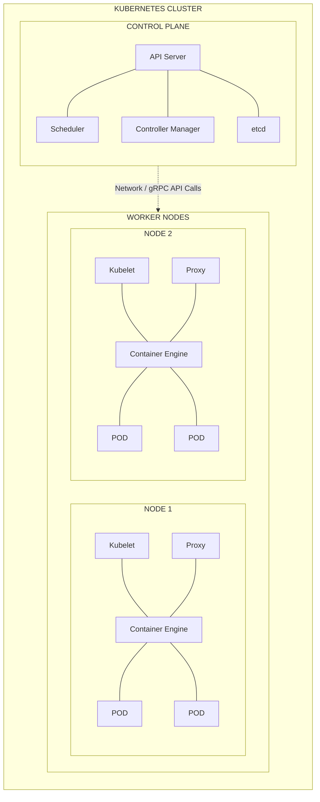
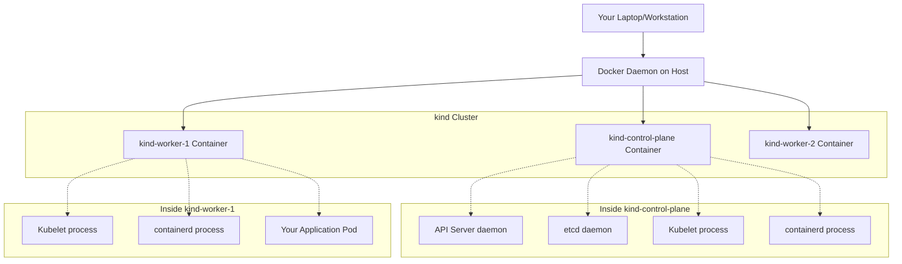

> **Complexity**: [MEDIUM]
>
> **Time to Complete**: 45-60 minutes
>
> **Prerequisites**: Docker installed, Cloud Native 101 completed

---

Throughout this module, `kubectl` is the official Kubernetes command-line client, and we will use the common short alias `k` after defining it once. The alias matters because Kubernetes work involves many repeated inspection commands, and the shorter form keeps examples readable without changing what is executed.

```bash
alias k=kubectl
```

## What You'll Be Able to Do

- Construct and verify a Kubernetes 1.35+ local cluster with `kind`, Docker, and the `k` command-line workflow.
- Compare local cluster tools and design a topology that matches the development or testing problem in front of you.
- Diagnose local cluster startup, networking, kubeconfig, and control plane failures by reading concrete signals from Docker and Kubernetes.
- Evaluate how control plane and worker node components cooperate, then predict how failures affect scheduling and access.
- Implement a repeatable local development routine that keeps clusters disposable, version-pinned, and isolated from cloud cost risk.

## Why This Module Matters

In August 2012, Knight Capital Group deployed a software update across production trading servers and accidentally reactivated old testing logic that should never have influenced live orders. The company lost 460 million dollars in about 45 minutes, then needed outside rescue financing almost immediately. The incident was not a Kubernetes story, but it was exactly the kind of engineering failure Kubernetes teams still create when they treat production or a shared staging cluster as the first realistic place to test behavior.

A cluster is not just another command-line tool you install and forget. It is a distributed control system with authentication, desired state, schedulers, background controllers, network translation, container runtimes, and persistent state. When a team experiments directly in a shared environment, one mistaken manifest can block other engineers, consume scarce cloud resources, or hide a bug behind someone else's active changes. A local cluster gives you the opposite operating model: a private arena where failure is cheap, recovery is fast, and the blast radius stays on your laptop.

Cloud-managed Kubernetes is the right answer for many production workloads, yet it is a poor first sandbox for learning. A managed control plane can take many minutes to provision, incurs a fee simply for existing, and often brings attached costs for nodes, disks, load balancers, and cross-zone traffic. A forgotten learning cluster can create a real invoice, while a local `kind` cluster can be deleted without leaving behind cloud infrastructure. This module teaches you to build that local arena, inspect its moving parts, and decide when a single-node cluster is enough versus when a multi-node topology is worth the extra resources.

The goal is not to memorize a cluster creation command. The goal is to develop an operational model: you should know what `kind` builds, where `k` sends requests, why kubeconfig controls your identity, which component schedules a Pod, why a local LoadBalancer stays pending, and how to recover when Docker, disk space, version skew, or the control plane fails. Once you can deliberately create, break, inspect, and delete your first cluster, later modules about workloads, services, storage, security, and automation become much less abstract.

There is also a cultural lesson in this first module. Teams that are confident with disposable local clusters tend to write smaller experiments, reproduce bugs with fewer meetings, and describe failures with better evidence. Teams without that practice often treat every cluster problem as a shared emergency because nobody can quickly recreate the conditions alone. As you work through the module, keep asking which facts you can prove locally before involving a shared platform. That habit saves time, money, and credibility when the same diagnostic pattern later appears in a real environment.

## Section 1: Anatomy of a Kubernetes Cluster

Before you construct a cluster, you need to know what is being assembled. Kubernetes is not a single process that "runs containers"; it is a collection of cooperating services that maintain desired state through an API. A useful first split is the control plane and the data plane. The control plane stores decisions and coordinates work, while the data plane runs the actual application containers on nodes. That separation is why a cluster can keep existing Pods running even when some management components are temporarily unhealthy, but it is also why new changes can freeze when the API or scheduler is unavailable.

Think about an orchestra where the musicians are the worker nodes and the conductor is the control plane. The musicians create the sound, but the conductor decides timing, coordination, and interpretation of the score. In Kubernetes, your YAML manifests are the score: they describe what should exist, not every mechanical step required to create it. The control plane accepts that desired state, stores it, and continuously guides worker nodes toward it. If you remember that model, many confusing behaviors become predictable rather than mysterious.

Another useful analogy is a shipping port. The cranes and dock workers move containers, but the port authority assigns berths, tracks manifests, checks credentials, and coordinates the overall flow. A worker node is like the machinery that physically moves cargo, while the control plane is the authority that decides what should move where. If the authority is temporarily unreachable, cargo already sitting on a dock does not vanish, but new instructions cannot be accepted cleanly. That is why a healthy cluster is more than "containers are still running"; it is the continued cooperation of state storage, API access, scheduling, and node execution.



The API server is the front door of the cluster. Every external command, controller request, and internal status update flows through it, and it is the only component that talks directly to the backing datastore. When you run a command with `k`, the API server authenticates who you are, authorizes the action through RBAC, applies admission policies, validates the object, and then persists accepted state. If the API server is down, you may still have containers running on worker nodes, but you cannot reliably read or change cluster state through the Kubernetes API.

`etcd` is the cluster's memory. It is a strongly consistent key-value store that holds objects such as namespaces, Deployments, Secrets, Services, and Pod records. The scheduler does not keep an independent private database, and neither does the controller manager; they watch the API server and write their decisions back into persisted state. This design makes Kubernetes auditable and declarative, but it also means that `etcd` health is not optional. If the datastore cannot accept writes, the cluster cannot safely accept new desired state.

The scheduler is the matchmaker. It watches for Pods that exist in the API but do not yet have a node assignment, filters nodes that cannot run them, scores the remaining nodes, and writes the selected node name back onto the Pod object. It does not start containers itself. The kubelet on the chosen node later observes the assignment and works with the container runtime to make the Pod real. This distinction is important when debugging: a Pending Pod is often a scheduling problem, while a Pod assigned to a node but failing to start is usually a node, image, runtime, or configuration problem.

The controller manager is the cluster's collection of reconciliation loops. A controller repeatedly compares observed state with desired state and takes small corrective actions. If a Deployment says three replicas should exist and one Pod disappears, the relevant controller creates another Pod object. If a node stops reporting, the node controller marks that condition. Kubernetes feels automatic because many controllers are constantly watching and nudging state toward the declarations you made. They are not magic; they are programs repeatedly asking, "What changed, and what needs to happen next?"

Worker nodes run the kubelet, kube-proxy, and a container engine such as `containerd`. The kubelet receives Pod specifications assigned to its node and ensures the required containers are running and reporting health. Kube-proxy manages network rules so Services can route traffic to changing Pod IPs. The container engine pulls images and asks the operating system kernel to create isolated processes using cgroups and namespaces. Kubernetes also delegates networking to CNI plugins and runtime integration to the CRI, which is why clusters can use different networking and runtime implementations while exposing the same Kubernetes API.

This component split also explains why Kubernetes debugging is usually a process of narrowing responsibility. If the API server rejects a manifest, you inspect schema, authentication, authorization, or admission. If a Pod stays Pending, you inspect scheduling constraints and node capacity. If a Pod is assigned but not running, you inspect kubelet events, image pulls, runtime errors, probes, and volumes. If traffic reaches a Service but not a backend, you inspect selectors, endpoints, kube-proxy behavior, and network policy. A local cluster gives you a place to practice that narrowing without waiting for a production incident to teach it under pressure.

Pause and predict: if the `kube-scheduler` process crashes but the API server and `etcd` remain healthy, what happens when you create a new Deployment? The request can still be accepted and stored, but the new Pods will remain Pending because nothing assigns them to nodes. Existing running Pods usually continue because kubelets already know about them. That prediction is the operational habit you are building: separate "the API accepted my desired state" from "a worker can actually execute it."

## Section 2: Choosing a Local Kubernetes Tool

Local Kubernetes tools all answer the same high-level need, but they do not build the same kind of environment. Some tools create virtual machines, some run clusters inside containers, and some integrate with a desktop virtualization layer. The right choice depends on whether you care most about startup speed, distribution fidelity, resource limits, multi-node behavior, or convenience. For this curriculum, we use `kind` because it is fast, scriptable, upstream-oriented, and excellent for disposable clusters used in tests and exercises.

| Tool | Underlying Architecture | Primary Use Case | Pros | Cons |
|---|---|---|---|---|
| **minikube** | Virtual Machines (historically) or Containers | Traditional local development | Massive feature set, mature ecosystem. VM mode uses fixed-size virtual disks, protecting host disk space. | Can be heavily resource intensive. Slower startup times. Emulates a cluster rather than running pure upstream. |
| **kind** (Kubernetes IN Docker) | Docker Containers acting as Nodes | CI/CD pipelines, automated testing, rigorous local dev | Extremely fast, identical to pure upstream Kubernetes, highly customizable multi-node topologies. | Requires Docker daemon. Complex networking edge cases when exposing services to host. |
| **k3d** | Docker Containers running k3s | Edge computing simulation, IoT | Minimal memory footprint, extraordinarily fast startup. | Uses k3s (a stripped-down, modified Kubernetes distribution), which may lack 100% parity with cloud providers. |
| **Docker Desktop / Colima** | Integrated Hypervisor / Lightweight VM | Quick validation for Mac/Windows users | Zero configuration, GUI integration, easy volume mounting. | Inflexible, limited strictly to a single monolithic node, tightly coupled to the virtualization engine. |

`kind` stands for Kubernetes IN Docker, and the name is literal. A `kind` node is a Docker container that is privileged enough to run Kubernetes node processes inside it. When you create a three-node `kind` cluster, Docker starts three node containers, and each node container runs its own kubelet and `containerd`. The cluster feels distributed to Kubernetes because each node has a separate identity and network address, even though all of those nodes are ultimately containers on your workstation. This is not the same as production hardware, but it is close enough to teach scheduling, kubeconfig, controller behavior, and many networking patterns.



The hidden tradeoff is that a `kind` cluster depends on the host Docker daemon. If Docker stops, the node containers stop, and your cluster disappears with them. That makes `kind` a poor home for durable state and a strong home for learning, integration testing, and quick reproduction. A local cluster should be treated like a whiteboard, not a records archive. Build it, test the hypothesis, export logs if you need evidence, and delete it when the exercise is over.

That tradeoff is exactly why `kind` fits the early Kubernetes learning path. You are not trying to preserve customer data, survive a zone outage, or prove a managed cloud integration. You are trying to learn the shape of the API, observe controllers, compare node topology, and build confidence with failure. The cheaper the environment is to recreate, the more willing you become to test dangerous questions: what if the scheduler is gone, what if an image is missing, what if the active context is wrong, or what if the host Docker daemon stops. Those experiments are valuable precisely because cleanup is quick.

Before running commands, choose the smallest topology that can prove the behavior you care about. A single-node cluster is enough for basic API interaction, simple manifests, and most early workload tests. A multi-node cluster becomes valuable when you need scheduling spread, node selectors, taints, tolerations, DaemonSets, or realistic network paths between nodes. Which approach would you choose here and why: testing a basic ConfigMap mount, or testing whether two replicas land on different nodes? The first needs little topology; the second requires a cluster that can express placement.

## Section 3: Kubeconfig Is Your Passport

Kubernetes is secure by default, so `k` cannot simply send anonymous HTTP requests to a cluster and hope for the best. It needs an API server address, a trusted certificate authority, and credentials that identify you. That information lives in kubeconfig, usually at `~/.kube/config`. A kubeconfig file is not merely a convenience file; it is the passport that tells your client where to travel, which identity to present, and which cluster/user pairing is active right now.

The structure has three major pieces. A cluster entry defines the destination API server and the certificate authority data used to verify that server, much like knowing which country you are entering and trusting its passport control. A user entry defines the identity material, such as certificates, tokens, or an external login plugin. A context binds one user to one cluster, optionally with a default namespace. Switching context changes where future commands go and which credentials they use, which is why context mistakes can be dangerous.

Kubeconfig becomes especially important once you have more than one cluster. A single file might contain a local `kind` context, a staging context, and a production context, all available to the same command-line tool. That convenience is powerful, but it means the active context is part of the safety model. Before applying anything that creates, deletes, or changes workloads, make it a habit to ask, "Which cluster will receive this request, which user will I be, and which namespace will be assumed?" Beginners often treat kubeconfig as plumbing; operators treat it as a control surface.

Here is a simplified kubeconfig. The certificate fields are shortened because real files contain long base64-encoded values, and those values are sensitive when they grant cluster access. Notice that the context does not contain a server URL or a private key itself; it references the named cluster and user. That indirection is what lets one kubeconfig file hold multiple clusters and multiple identities without duplicating every field.

```yaml
apiVersion: v1
kind: Config
preferences: {}
current-context: kind-dojo-basics

clusters:
- cluster:
    certificate-authority-data: LS0tLS1CR...
    server: https://127.0.0.1:6443
  name: kind-dojo-basics

users:
- name: kind-dojo-basics
  user:
    client-certificate-data: LS0tLS1CR...
    client-key-data: LS0tLS1CR...

contexts:
- context:
    cluster: kind-dojo-basics
    user: kind-dojo-basics
  name: kind-dojo-basics
```

You can inspect and manipulate your passport at any time. In production, you should avoid casually printing secrets to shared terminals, recordings, or logs, but on a private learning workstation these commands are useful for seeing how context selection works. The active context is the one with the star in `get-contexts`, and changing it changes the default destination for future commands in that shell.

```bash
# View the raw YAML of your configuration (redacting actual secrets)
kubectl config view

# See all the context "stamps" in your passport
kubectl config get-contexts

# Explicitly switch your active context
kubectl config use-context <context-name>
```

Sometimes you do not want to modify your default kubeconfig. A teammate might send a temporary staging config, or a CI job might generate a short-lived file for one deployment. The `KUBECONFIG` environment variable lets you point the client at a specific file for the current process environment. That is useful because it makes access explicit, temporary, and reversible instead of merging unknown credentials into your everyday configuration.

```bash
export KUBECONFIG=/path/to/my/temporary/config.yaml
kubectl get nodes # Operates against the temporary cluster
```

You can also combine multiple kubeconfig files by separating paths with a colon on Unix-like systems. Kubernetes reads them as a merged view, which is helpful when your personal clusters, staging clusters, and generated CI credentials live in separate files. The merge behavior is powerful, but it also means names matter. Two contexts with the same name can create confusing collisions, so use clear cluster names when creating local environments.

```bash
export KUBECONFIG=~/.kube/config:/path/to/another/config.yaml
```

Pause and predict: if a kubeconfig containing administrator credentials for a production cluster is committed to a public repository, what happens next? The practical answer is immediate incident response. Automated scanners look for exposed credentials, and an attacker with valid cluster credentials can read Secrets, create workloads, or run compute at your expense. Treat kubeconfig files like keys, not notes, and practice with local clusters so your muscle memory becomes careful before the stakes are high.

## Section 4: Bootstrapping and Verifying the First Cluster

To create your first cluster, Docker must be installed and running because `kind` calls the Docker API to create node containers. The `kind` binary itself is a single executable. The exact install command varies by operating system and package manager, but the Linux AMD64 example shows the basic shape: download the binary, mark it executable, and place it somewhere on your `PATH`. Package managers such as Homebrew can perform the same job on macOS or Linux.

```bash
# Example download for Linux AMD64 architecture
curl -Lo ./kind https://kind.sigs.k8s.io/dl/latest/kind-linux-amd64
# Grant execute permissions to the downloaded binary
chmod +x ./kind
# Move the binary to a directory included in your system PATH
sudo mv ./kind /usr/local/bin/kind
```

A default `kind` cluster is created with one command. In that default topology, one container acts as both control plane and worker node. That is acceptable for first contact because it gives you the API server, `etcd`, scheduler, controller manager, kubelet, kube-proxy, CoreDNS, and a runtime in one compact environment. For deterministic exercises, pin the node image to a Kubernetes 1.35+ tag so everyone sees the same API behavior rather than whatever happens to be latest on the day they run the command.

```bash
kind create cluster --name dojo-basics
```

When this command runs, `kind` pulls the `kindest/node` image, starts a privileged node container, generates certificates, runs `kubeadm init`, starts control plane components, installs networking, and writes access details into kubeconfig. That final kubeconfig step is why your next `k` command knows where the new API server lives. The cluster is local, but it is not fake: you are talking to a real Kubernetes API server whose loopback port is mapped from your host into the node container.

This sequence is worth slowing down because every step leaves a different diagnostic trail. A pull failure points toward registry access or disk space. A node container failure points toward Docker health, permissions, or resource allocation. A `kubeadm init` failure points toward Kubernetes bootstrap logs inside the node. A kubeconfig failure points toward client access rather than cluster creation. When you read a `kind` error, do not collapse all of those stages into "cluster failed." Identify which stage failed, then choose the tool that can see that layer.

To explicitly pin the Kubernetes version, append the `--image` flag, for example `kind create cluster --name dojo-basics --image kindest/node:v1.35.0`. Pinning matters when you are learning from written material because Kubernetes evolves. A command, API default, or warning can change between releases, and you want differences to be deliberate rather than accidental. In real teams, version pinning also makes bug reports reproducible because everyone can create the same local cluster shape before discussing the failure.

```bash
k cluster-info
```

The `cluster-info` output should show the Kubernetes control plane running at a loopback address such as `https://127.0.0.1:42315`, plus system services such as CoreDNS. This confirms three things at once: kubeconfig points to the new cluster, your credentials authenticate successfully, and the API server can answer requests. If this command fails, do not jump straight to workload debugging. First prove whether the client can reach the control plane.

```bash
k get nodes
```

You should see one node named `dojo-basics-control-plane` in the Ready state. In many production clusters, control plane nodes are tainted so normal workloads cannot run there. In a default single-node `kind` cluster, the tool makes that node schedulable so you can run application Pods without needing separate workers. That is convenient, but it is also a reminder that local clusters intentionally trade some production separation for speed and simplicity.

```bash
k get pods --namespace kube-system
```

System Pods in `kube-system` show the cluster running itself as Kubernetes-managed workloads. You should see components such as `etcd`, `kube-apiserver`, `kube-controller-manager`, and `kube-scheduler`. This is a useful mental shift: Kubernetes does not hide every internal process from you. Many core components are visible as Pods, which means you can inspect their status, logs, and restarts using the same habits you will later use for your own workloads.

Do not skip verification just because the create command ended successfully. A command can return after bootstrapping while some background components are still settling, image pulls are completing, or CoreDNS is restarting. The node list, system Pod list, and cluster-info output together give you a fast health snapshot from three angles: node readiness, control plane reachability, and add-on state. In professional workflows, those checks become preconditions for running tests. You want failures to point at the thing under test, not at a half-created cluster that was never ready.

Before running this, what output do you expect from `docker ps` on your host after creating a default `dojo-basics` cluster? You should expect one outer Docker container for the single `kind` node, not one Docker container per Kubernetes Pod visible inside the cluster. The Pods run through `containerd` inside the node container, so host Docker sees the node abstraction while Kubernetes sees the internal cluster abstraction. That layered view explains many early surprises when learners compare Docker and Kubernetes commands.

## Section 5: Local Networking and Multi-Node Design

Networking is where local clusters often stop feeling intuitive. Your Pods receive IP addresses from a cluster network, but your laptop does not automatically route to that Pod network. In a `kind` cluster, nodes sit on a Docker bridge network, and the API server is the one port mapped by default so `k` can communicate. If you deploy a web application, a Pod IP such as `10.244.0.5` is meaningful inside the cluster, but your browser has no native route to that address from the host.

The quickest access pattern is port forwarding. A command like `k port-forward svc/my-web-app 8080:80` opens a local client-side tunnel through the API server to a Service or Pod. It is excellent for debugging because it requires no permanent cluster networking setup, but it ends when the foreground process ends. For more realistic local ingress, you can configure `kind` port mappings before cluster creation and run an ingress controller. For local LoadBalancer behavior, you need an implementation such as MetalLB because your laptop does not have a cloud load balancer controller.

Pause and predict: if you start a port-forward, load the application in your browser, and then close the terminal window, what happens to the browser connection? The tunnel disappears immediately because the forwarding path is maintained by the local process. Kubernetes did not create a durable Service exposure on your host; it simply carried traffic through a live debugging connection. This distinction keeps you from mistaking a successful port-forward for a production networking design.

A single-node cluster is enough for many first exercises, but it cannot represent placement constraints. If every control plane process and every workload share one node, you cannot test whether replicas spread across nodes, whether a DaemonSet runs once per node, or whether a workload with a node selector lands only where intended. Multi-node `kind` clusters solve that by declaring multiple node containers in a configuration file. You still run locally, but Kubernetes now has a meaningful set of nodes to choose from.

The multi-node step also prepares you for a key production reality: Kubernetes placement is an API decision, not a wish. You can request replicas, set affinity rules, add tolerations, label nodes, and constrain resources, but the scheduler still evaluates the current node set before binding each Pod. In a one-node cluster, many placement mistakes are invisible because there is nowhere else to go. In a multi-node cluster, those mistakes surface as Pending Pods, unexpected distribution, or workloads landing on nodes you did not intend. That feedback is exactly what a local training topology should reveal.

Create a file named `multi-node-config.yaml` on your filesystem:

```yaml
# multi-node-config.yaml
kind: Cluster
apiVersion: kind.x-k8s.io/v1alpha4
nodes:
  # The control plane node (API server, etc.)
  - role: control-plane
  # The first worker node (Application workloads)
  - role: worker
  # The second worker node (Application workloads)
  - role: worker
```

Delete the first cluster before creating the next one unless you intentionally want multiple clusters running. Local clusters consume CPU, memory, disk, and ports, and the fastest way to create confusing test results is to forget which context is active. Treat the delete-and-recreate loop as normal, not destructive. Your local cluster should be easier to replace than to repair.

```bash
kind delete cluster --name dojo-basics
```

Now create the multi-node topology. `kind` starts three Docker containers, initializes the first as the control plane, generates join material, and has the other two join as workers over the Docker bridge network. The command takes a little longer than the single-node cluster, but it gives you a topology that can teach scheduling decisions instead of merely API submission.

```bash
kind create cluster --name dojo-multi --config multi-node-config.yaml
```

Verify the architecture through Kubernetes, not only through Docker. The Kubernetes node list is what the scheduler uses when it chooses placement, so it is the view that matters for later workload behavior. Worker nodes normally show `<none>` in the roles column unless you label them, which is expected and not an error.

```bash
k get nodes
```

Your terminal output should now accurately reflect the distributed topology:

```text
NAME                        STATUS   ROLES           AGE     VERSION
dojo-multi-control-plane    Ready    control-plane   2m14s   v1.35.0
dojo-multi-worker           Ready    <none>          1m58s   v1.35.0
dojo-multi-worker2          Ready    <none>          1m58s   v1.35.0
```

Run `k get nodes -o wide` and examine the internal IPs. Each node is really a Docker container, yet Kubernetes sees distinct node addresses and can schedule across them. That makes the topology valuable for practicing node labels, taints, tolerations, affinity, anti-affinity, and DaemonSets. If you later test a workload that must run one copy per node, the multi-node cluster is the first topology in this module that can prove the behavior rather than merely accept the manifest.

Multi-node local clusters are still approximations, so use them honestly. They do not reproduce separate physical machines, independent power domains, real cloud routing, or storage hardware failure. They do reproduce enough of the Kubernetes control loop to teach scheduling, node identity, Pod placement, and many networking patterns. That boundary matters when reporting results. You can say, "This manifest schedules correctly across three `kind` nodes," but you should not claim it proves production availability. Good local testing answers the Kubernetes question first and leaves cloud-specific questions for environments that actually contain those cloud behaviors.

## Section 6: Troubleshooting and Local Development Discipline

Local cluster failures usually come from the host environment. Docker might be stopped, Docker might lack memory, the disk might be full, your client might be outside the supported Kubernetes version skew, or a port might already be bound by another process. These are not distractions from Kubernetes learning; they are the first diagnostic layer. Production debugging also starts by separating client, control plane, node, network, and storage signals. Local clusters simply make those layers visible and cheap to reproduce.

The fastest troubleshooting loop starts with the error boundary. If `kind` cannot create a node container, Kubernetes is not ready for inspection yet. If the node exists but the API is unreachable, inspect control plane logs and kubeconfig. If the API is reachable but a workload is Pending, inspect events and scheduling constraints. If the workload is Running but inaccessible, inspect Services, endpoints, port-forwarding, and ingress mappings. Writing those branches down may feel mechanical, but it prevents a common beginner mistake: running random commands until one seems relevant.

If `kind create cluster` hangs at control-plane startup, inspect Docker first. A Kubernetes control plane needs memory, and the node image is not small. Docker Desktop users should allocate enough memory for the engine, especially for multi-node clusters, while Linux users should check host pressure and swapping. When the API is not available yet, `k` cannot help you, so you bypass Kubernetes and read the node container logs directly through Docker.

```bash
docker logs <container-id>
```

Port conflicts produce a different failure shape. The API server listens on port 6443 inside the node container, and `kind` maps a host port to reach it. If you explicitly configure host ports for ingress or reuse a port already taken by another local process, the new cluster cannot bind it. On macOS or Linux, commands such as `lsof -i :6443` or `netstat -tulpn | grep 6443` identify the owner. Prefer choosing a different configured port over killing unknown processes unless you are certain what owns the socket.

Version skew looks stranger because the cluster may be healthy while your client behaves incorrectly. Kubernetes supports a limited minor-version skew between `kubectl` and the API server. If your local client is too old for a Kubernetes 1.35 cluster, you can see errors such as missing resources, malformed output, or unsupported API behavior even though Docker shows the control plane container running. Check both client and server versions, then upgrade the client so it falls within the supported skew window.

The most basic failure is a missing container runtime. `kind` cannot create nodes if Docker is not reachable, and the error often says exactly that:

```text
failed to create cluster: failed to get docker info: Cannot connect to the Docker daemon at unix:///var/run/docker.sock.
```

On Linux, verify the service and permissions. On desktop platforms, confirm the virtualization engine is running before retrying. If your user is not allowed to access the Docker socket, adding the user to the Docker group requires a new login session before the permission change applies. Do not debug Kubernetes scheduling when the node factory itself is unavailable.

```bash
systemctl status docker
sudo usermod -aG docker $USER
```

Disk pressure is another common local failure because node images, application images, writable container layers, and volumes accumulate quietly. A Pod stuck in `ImagePullBackOff` after a local build may be an image-loading mistake, but a failure to pull node images can be plain storage exhaustion. Maintain free space and prune deliberately when old test images are no longer needed. The command below is intentionally aggressive, so read its output and avoid using it when you still need stopped containers, volumes, or cached images.

```bash
docker system prune -a --volumes
```

When a cluster fails in a way worth studying, export logs before deleting it. `kind` can collect kubelet, container runtime, API server, and other component logs from node containers into a local directory. This is the local version of preserving evidence during an incident. It lets you inspect after the cluster is gone and gives teammates concrete data instead of a vague report that "kind broke."

```bash
kind export logs ./kind-troubleshooting-logs --name dojo-multi
```

Strong local development discipline keeps these problems bounded. Pin Kubernetes versions, name clusters clearly, check the active context before applying manifests, load local images into the cluster when needed, and delete idle clusters when the test is complete. Avoid manually editing files inside node containers because that creates invisible state drift; put node-level changes into `kind` configuration and recreate the cluster. The point of local Kubernetes is not to preserve one perfect snowflake. The point is to make realistic environments disposable.

A useful routine is to start each session with a named cluster, a clear version, and one written hypothesis. For example, "I am testing whether this Deployment schedules on workers labeled `workload=frontend` in Kubernetes 1.35." After the test, capture the commands, events, and final observation, then delete the cluster. That routine gives you reproducible evidence instead of a half-remembered terminal session. It also makes later automation obvious: once the manual sequence is clear, a script or Makefile can recreate it consistently for teammates and CI.

## Patterns & Anti-Patterns

Reliable local Kubernetes work depends less on one clever command and more on repeatable habits. The patterns below are the habits worth building early because they scale into team workflows. The anti-patterns are tempting because they feel faster in the moment, but they create the exact hidden state, cost, and ambiguity that local clusters are supposed to remove.

| Pattern | When to Use It | Why It Works |
|---|---|---|
| Disposable named clusters | Any learning lab, reproduction case, or integration test | Names make kubeconfig contexts obvious, while deletion keeps resource use and state drift under control. |
| Version-pinned node images | Curriculum, CI, operator testing, and bug reproduction | Pinning Kubernetes 1.35+ behavior makes test results deterministic and avoids accidental release drift. |
| Declarative topology files | Multi-node tests, ingress port mappings, or kubeadm patches | A checked-in config can be reviewed, recreated, and shared instead of reconstructed from memory. |
| Host-first diagnostics | Cluster creation failures, Docker errors, disk pressure, and port conflicts | Local clusters depend on the host runtime, so Docker and OS signals often explain failures before Kubernetes exists. |

| Anti-Pattern | What Goes Wrong | Better Alternative |
|---|---|---|
| Treating a local cluster as durable infrastructure | Manual changes disappear or become impossible to reproduce after deletion | Store manifests and `kind` configs, then recreate the cluster to prove repeatability. |
| Applying manifests without checking context | Workloads land in the wrong cluster, sometimes a costly shared environment | Run `k config current-context` or inspect contexts before risky actions. |
| Expecting LoadBalancer Services to work like cloud providers | `EXTERNAL-IP` remains pending because no cloud controller provisions hardware | Use port-forwarding, mapped ingress, or a local load balancer implementation. |
| Leaving many clusters idle | CPU, memory, ports, and disk are consumed by environments no one is using | Audit with `kind get clusters` and delete clusters at the end of each session. |

## Decision Framework

Use a local cluster when the learning or test question is about Kubernetes API behavior, scheduling, manifests, controllers, Services, or basic networking. Use a cloud-managed cluster when the question depends on cloud integrations such as managed load balancers, IAM identity, persistent disks, autoscaling groups, or production-grade failure domains. Use a single-node local cluster when the topology does not matter. Use a multi-node local cluster when placement, node-specific behavior, DaemonSets, or inter-node networking are part of the hypothesis.

```text
Start with the question you need to answer
|
+-- Is the question about cloud-managed integrations?
|   +-- Yes: use a real cloud cluster with strict cost controls.
|   +-- No: continue locally.
|
+-- Does the behavior depend on multiple nodes?
|   +-- Yes: create a multi-node kind cluster from YAML.
|   +-- No: create a single-node kind cluster.
|
+-- Do you need deterministic version behavior?
|   +-- Yes: pin kindest/node:v1.35.0 or the required test version.
|   +-- No: still record the version so results are explainable.
```

The practical decision is usually about feedback speed and fidelity. Local clusters give rapid feedback and low risk, but they cannot prove every cloud behavior. Cloud clusters give high fidelity for provider integrations, but they cost money and take longer to rebuild. Good engineers do not pick one forever; they choose the cheapest environment that can honestly answer the question. For this module, the honest question is how Kubernetes itself behaves, so a local `kind` cluster is the right default.

## Did You Know?

1. Kubernetes 1.35 is the version target for this curriculum, so pinning local node images prevents examples from drifting as upstream releases continue.
2. The name "Kubernetes" comes from a Greek word associated with a helmsman or pilot, which matches the project's steering-wheel logo.
3. `kind` began as infrastructure for testing Kubernetes itself, which explains why it is fast, disposable, and friendly to automation.
4. The abbreviation `k8s` is a numeronym: it keeps the first and last letters of Kubernetes and replaces the eight letters between them with `8`.

## Common Mistakes

| Mistake | Why It Happens | How to Fix It |
|---|---|---|
| Building an image on the host and expecting a `kind` Pod to find it | The node container has its own internal `containerd`, separate from the host Docker image list. | Run `kind load docker-image my-app:v1 --name <cluster-name>` or push the image to a registry the cluster can reach. |
| Forgetting which kubeconfig context is active | `kind` updates kubeconfig automatically, and multiple clusters can coexist in one file. | Inspect contexts before applying changes and use clear cluster names such as `kind-dojo-basics`. |
| Assuming a local LoadBalancer Service provisions an external IP | There is no cloud provider controller on your laptop to create external load balancer infrastructure. | Use `k port-forward`, configured ingress port mappings, or a local implementation such as MetalLB. |
| Leaving idle clusters running for days | Control plane loops, node containers, images, and volumes consume host resources even when you are not testing. | Audit with `kind get clusters` and delete clusters immediately after a lab or reproduction is complete. |
| Editing a node container by hand | Manual `docker exec` changes are invisible to your cluster configuration and vanish on recreate. | Encode node behavior in `kind` config, manifests, or automation, then recreate the cluster to prove it persists. |
| Ignoring Docker memory and disk limits | `kind` relies on Docker, so host resource pressure prevents Kubernetes components and images from starting. | Allocate enough Docker memory, keep free disk space, and inspect Docker logs when cluster creation fails. |
| Using an old client against a newer API server | Kubernetes only supports limited client/server minor-version skew. | Upgrade the client or create a cluster version that falls within the supported skew policy. |

## Quiz

<details><summary><strong>[Tests LO4]</strong> You create a Deployment while the API server and `etcd` are healthy, but the scheduler Pod has been deleted. What state do the new Pods enter, and why?</summary>
The Pods will be accepted into the API and remain Pending. The API server can validate and persist the desired state because `etcd` is available, but the scheduler is the component that assigns unscheduled Pods to nodes. Without that assignment, no kubelet receives responsibility for starting the containers. This is why a Pending Pod is often evidence of a scheduling break rather than an image pull or application crash.
</details>

<details><summary><strong>[Tests LO2]</strong> Your team needs to test a DaemonSet that must run one Pod on every node. Should you use a single-node or multi-node `kind` cluster, and what would the single-node test fail to prove?</summary>
Use a multi-node `kind` cluster because the behavior depends on node count and placement. A single-node cluster can prove that the DaemonSet object is accepted and that one Pod can run, but it cannot prove per-node scheduling across multiple workers. A multi-node topology lets you verify that each node receives exactly one Pod and that node-level conditions or labels affect the outcome as expected.
</details>

<details><summary><strong>[Tests LO3]</strong> A developer builds `my-app:v1` with Docker, applies a Deployment, and gets `ImagePullBackOff` in `kind`. The image name is correct. What should they check and do?</summary>
They should check whether the image was loaded into the `kind` cluster's internal runtime. Host Docker can know about an image while the node container's `containerd` cannot see it, so Kubernetes tries to pull the image from a registry and fails. The local fix is to run `kind load docker-image my-app:v1 --name <cluster-name>` before creating or restarting the Pod. In team workflows, pushing to a registry can be more repeatable.
</details>

<details><summary><strong>[Tests LO1]</strong> You are required to reproduce a bug on Kubernetes v1.35.0, but your default `kind` installation creates a different version. What is the safest local workflow?</summary>
Create a fresh cluster with an explicit node image tag instead of mutating an existing cluster in place. A command such as `kind create cluster --name repro-135 --image kindest/node:v1.35.0` gives you a deterministic API server and node version for the test. Local clusters are disposable, so recreating them is usually safer and faster than treating them like long-lived infrastructure. Record the version in your notes so other engineers can reproduce the same environment.
</details>

<details><summary><strong>[Tests LO5]</strong> You receive a temporary kubeconfig for a staging cluster, but you do not want it merged into your default `~/.kube/config`. How should you use it?</summary>
Set the `KUBECONFIG` environment variable for the shell session or command that needs access. That makes the client read the provided file instead of silently modifying or depending on your default configuration. After the session ends or the variable is unset, your normal contexts return. This reduces the chance of accidentally applying manifests to the wrong cluster later.
</details>

<details><summary><strong>[Tests LO3]</strong> `kind create cluster` fails before any Kubernetes objects are available, and the error says it cannot connect to the Docker daemon. Why is `k get pods` the wrong next diagnostic command?</summary>
`k get pods` depends on a reachable Kubernetes API server, and the API server does not exist yet if `kind` cannot create node containers. The failure is below Kubernetes, at the host runtime layer. The right next checks are Docker service status, Docker Desktop state, socket permissions, and whether the current user can run Docker commands. Once Docker is reachable, `kind` can create the node container that hosts the control plane.
</details>

<details><summary><strong>[Tests LO3]</strong> A local Service of type `LoadBalancer` stays in `<pending>` for a long time. The Pods are healthy. What is missing from the local cluster?</summary>
The cluster is missing a load balancer implementation that can satisfy the Service request. In cloud clusters, a provider controller creates external infrastructure and updates the Service status with an address. A plain local `kind` cluster has no such controller or external hardware, so the request remains pending. For local access, use port-forwarding, configured ingress mappings, or install a local load balancer implementation appropriate for the lab.
</details>

## Hands-On Exercise

In this exercise, you will create multiple local clusters, inspect kubeconfig, pin Kubernetes versions, switch contexts, declare topology, and observe what happens when the control plane disappears. The work is intentionally progressive: first you prove basic creation, then you prove identity and version control, and only then do you simulate failure. Keep notes on what each command proves, because the diagnostic habit is more valuable than the specific cluster names.

**Setup Requirements:**
Ensure the Docker daemon is installed and actively running on your host machine. Ensure you have the `kind` CLI utility and `kubectl` downloaded, marked as executable, and available on your system path. Use the `k` alias after defining it, and delete lab clusters when finished so your workstation returns to a clean state.

### Tasks

1. **The Baseline Cluster Initialization:** Create a standard single-node cluster named `primary-dojo`. Verify the cluster is fully running, and utilize command-line tools to determine the exact IP address and port the control plane API server is bound to on your host machine's network interface.
2. **The Kubeconfig Deep Dive:** Without using the `kubectl config view` command, directly open your `~/.kube/config` file utilizing a terminal text editor like `cat`, `less`, or `vim`. Locate the precise Cluster, User, and Context blocks that `kind` just injected for your `primary-dojo` cluster.
3. **Strict Version Pinning:** Create a second, completely simultaneous cluster named `legacy-dojo`. This cluster must rigidly enforce running an older version of Kubernetes, specifically v1.34.0, utilizing the specific image tag `kindest/node:v1.34.0`.
4. **Context Switching Mastery:** Utilize `kubectl` to seamlessly switch your authentication context back and forth between `primary-dojo` and `legacy-dojo`. Execute a version command against each to mathematically prove you are communicating with two distinctly different API Server versions.
5. **Topology Engineering and Declaration:** Create a declarative YAML configuration file designed to deploy a third cluster named `ha-dojo`. This cluster must artificially simulate a highly available control plane architecture by provisioning exactly three control-plane nodes and zero worker nodes.
6. **Simulated Catastrophic Failure:** Delete all currently running clusters to reclaim resources. Create a fresh cluster named `broken-dojo`. Locate the underlying Docker container running the control plane daemon. Utilize a raw Docker command to forcibly terminate the container without graceful shutdown. Immediately observe and document how `kubectl` behaves when the control plane is suddenly unreachable.

### Solutions

<details>
<summary>Solution for Task 1: Baseline Cluster Initialization</summary>

First, execute the standard creation command. The custom name makes the generated node container and kubeconfig context easier to identify later.

```bash
# Provision the cluster
kind create cluster --name primary-dojo
```

Once the cluster indicates it has started successfully, find out exactly where it is listening. `kind` maps a random high-numbered port on your host's localhost address to port 6443 inside the container.

```bash
# Investigate the cluster connection metadata
kubectl cluster-info

# Alternatively, find the port mapping directly from Docker
docker port primary-dojo-control-plane
```
</details>

<details>
<summary>Solution for Task 2: The Kubeconfig Deep Dive</summary>

The configuration file is plain text YAML, so you can print it to the screen directly in a private terminal.

```bash
# Print the raw contents of the file
cat ~/.kube/config
```

Locate the three distinct sections that bind your access together: `clusters:` contains `name: kind-primary-dojo`, `users:` contains `name: kind-primary-dojo`, and `contexts:` contains `name: kind-primary-dojo`. Notice that `current-context:` is also set to `kind-primary-dojo` after creation.
</details>

<details>
<summary>Solution for Task 3: Strict Version Pinning</summary>

Run multiple `kind` clusters simultaneously only if your computer has enough memory. The `--image` flag overrides the default node image and pulls the requested Kubernetes version.

```bash
# Provision the version-pinned cluster in parallel
kind create cluster --name legacy-dojo --image kindest/node:v1.34.0
```

This command may take a moment if Docker must download the node image for version 1.34.0.
</details>

<details>
<summary>Solution for Task 4: Context Switching Mastery</summary>

Now that two clusters are running, instruct the client which one to talk to by changing the active context in kubeconfig.

```bash
# List all available contexts in your configuration file. 
# The active one will have a '*' next to it.
kubectl config get-contexts

# Explicitly switch the active context to the primary cluster
kubectl config use-context kind-primary-dojo

# Verify the server version matches the latest default
kubectl version

# Explicitly switch the active context to the legacy cluster
kubectl config use-context kind-legacy-dojo

# Verify the server version matches exactly v1.34.0
kubectl version
```
</details>

<details>
<summary>Solution for Task 5: Topology Engineering and Declaration</summary>

To build complex architectures, use a configuration file instead of a long set of command-line flags. Create a file named `ha-config.yaml`:

```yaml
kind: Cluster
apiVersion: kind.x-k8s.io/v1alpha4
nodes:
  - role: control-plane
  - role: control-plane
  - role: control-plane
```

Now instruct `kind` to read this file during cluster creation.

```bash
# Provision the cluster using the configuration file
kind create cluster --name ha-dojo --config ha-config.yaml

# Validate the topology
kubectl get nodes 
```

You should see exactly three nodes listed, all explicitly marked with the control-plane role. Notice how the generated names are suffixed to keep each node distinct.
</details>

<details>
<summary>Solution for Task 6: Simulated Catastrophic Failure</summary>

Finally, practice cleaning up the environment and observing a raw control plane failure.

```bash
# Aggressively clean up the environment
kind delete cluster --all

# Create the target cluster
kind create cluster --name broken-dojo

# Locate the precise container ID for the control plane
docker ps | grep broken-dojo-control-plane

# Forcibly terminate the container process (replace <container-id> with the actual ID discovered)
docker kill <container-id>

# Attempt to interact with the broken cluster state
kubectl get nodes
```

The connection will either hang until timeout or immediately fail with a TCP connection refused error. This demonstrates that without the API server container operating, the cluster interface is unavailable. You cannot read state through Kubernetes, nor can you alter it, even if some previous workload process might have existed before the control plane disappeared.
</details>

### Success Criteria

- [ ] You successfully provisioned and ran multiple distinct, isolated Kubernetes clusters on your host machine simultaneously.
- [ ] You identified and explained the structural components of the `kubeconfig` file.
- [ ] You seamlessly and reliably switched authentication contexts between different clusters utilizing `kubectl`.
- [ ] You successfully designed and provisioned a highly non-standard cluster topology utilizing a declarative YAML configuration file.
- [ ] You empirically observed and documented the exact failure mode of `kubectl` when the control plane becomes catastrophically unreachable.
- [ ] You practiced excellent infrastructure hygiene by successfully deleting all ephemeral clusters created during this exercise.

## Next Module

[Module 1.2: kubectl Basics](/prerequisites/kubernetes-basics/module-1.2-kubectl-basics/) — Learn to navigate cluster resources, inspect objects, and turn API access into practical operational control.

## Sources

- [Kubernetes Components](https://kubernetes.io/docs/concepts/overview/components/)
- [Kubernetes Nodes](https://kubernetes.io/docs/concepts/architecture/nodes/)
- [Organizing Cluster Access Using kubeconfig Files](https://kubernetes.io/docs/concepts/configuration/organize-cluster-access-kubeconfig/)
- [kubectl Reference](https://kubernetes.io/docs/reference/kubectl/)
- [Kubernetes Version Skew Policy](https://kubernetes.io/releases/version-skew-policy/)
- [Kubernetes Services](https://kubernetes.io/docs/concepts/services-networking/service/)
- [Use Port Forwarding to Access Applications in a Cluster](https://kubernetes.io/docs/tasks/access-application-cluster/port-forward-access-application-cluster/)
- [kind Project](https://kind.sigs.k8s.io/)
- [kind Quick Start](https://kind.sigs.k8s.io/docs/user/quick-start/)
- [kind Configuration](https://kind.sigs.k8s.io/docs/user/configuration/)
- [kind Known Issues](https://kind.sigs.k8s.io/docs/user/known-issues/)
- [etcd Learning Documentation](https://etcd.io/docs/)
