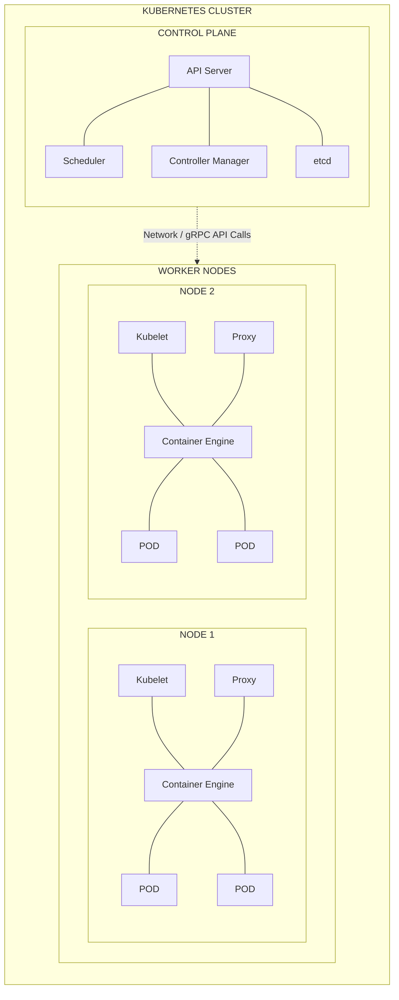
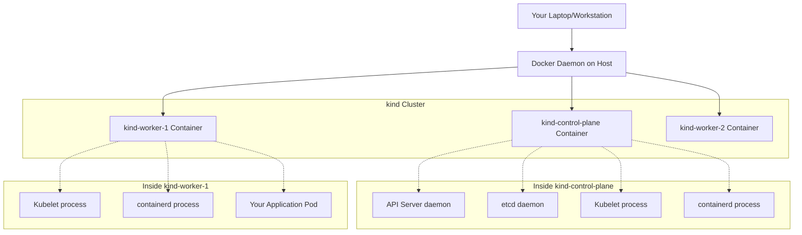

# Module 1.1: Your First Cluster

**Complexity:** [MEDIUM]
**Time to Complete:** 45-60 minutes
**Prerequisites:** Docker installed, Cloud Native 101 completed

## Learning Outcomes
- Construct a local Kubernetes cluster using `kind` to provide an isolated environment for workload experimentation.
- Compare local Kubernetes provisioning tools (kind, minikube, k3d, Docker Desktop) to select the appropriate solution for specific development scenarios.
- Diagnose common cluster initialization failures by interpreting system logs and container states.
- Design a multi-node local cluster configuration to simulate realistic production topologies.
- Evaluate the impact of control plane component failures on the overall cluster state.
- Analyze and manipulate the `kubeconfig` file to seamlessly authenticate and switch contexts between multiple discrete clusters.
- Formulate a strict local development strategy that mitigates the financial and operational risks associated with cloud-managed Kubernetes environments.
- Deconstruct the monolithic architecture of a cluster into its distinct Control Plane and Data Plane components.

## Why This Module Matters

It is widely cited in industry case studies that in August 2012, Knight Capital Group deployed a software update to their production trading servers. They lacked a proper staging environment that precisely mirrored production, and they had no local sandboxes for developers to safely test the interaction between new code and legacy routing systems. When the flawed update went live, it resurrected a dormant testing subroutine that began buying high and selling low at a staggering volume. In just 45 minutes, Knight Capital lost 460 million dollars. They went bankrupt shortly after. 

While you might not be deploying high-frequency algorithmic trading software today, the foundational engineering principle remains identical: testing directly in production, or in shared staging environments where multiple teams are constantly mutating state, is a recipe for unpredictable and catastrophic failure. You need a safe, ephemeral, and accurate replica of your production orchestration system where you can experiment, break things, and rebuild them in seconds without financial or operational risk. Relying solely on cloud-managed clusters for initial learning and testing introduces unnecessary friction, high costs, and dangerous blast radii.

Consider the reality of cloud computing costs. An Amazon EKS cluster incurs an hourly control plane fee simply for existing. Beyond that base tax, you pay for the EC2 worker nodes, the Elastic Block Store (EBS) volumes, the Elastic Load Balancers (ELB), and cross-Availability Zone data transfer. Leaving a simple "learning" cluster running over a long weekend can easily result in a $150 surprise bill. In a team of 10 developers, if everyone spins up their own cloud sandbox, the monthly burn rate skyrockets unnecessarily.

Furthermore, cloud provisioning is inherently slow. Bootstrapping a managed cluster via Terraform or a cloud console often takes 15 to 25 minutes as underlying virtual machines are allocated, networks are configured, and control plane software is bootstrapped by the provider. If you make a fundamental mistake in your configuration—such as applying a globally restrictive network policy that locks you out—and need to tear the cluster down to rebuild it, that feedback loop is painfully long. Local clusters, in contrast, can be provisioned from scratch and destroyed in mere seconds. The faster you fail, the faster you learn.

This module provides exactly the solution to that problem. You will learn to provision and manage a local Kubernetes cluster entirely on your workstation. This is the absolute foundational skill for everything that follows in your Kubernetes journey. By running a cluster locally, you isolate your learning environment, completely eliminate cloud costs, and gain the freedom to intentionally destroy and restore your infrastructure to deeply understand how it behaves under duress. You will transition from theoretical knowledge to practical, hands-on control of a distributed system.

> **Stop and think**: Reflect on a time you or a colleague accidentally broke a shared staging environment. How much time was wasted coordinating with other developers who were blocked by your mistake? How would an isolated, local replica of the environment have changed the outcome?

## Section 1: Anatomy of a Kubernetes Cluster

Before you can construct a cluster, you must possess a rigorous understanding of what you are actually building. A Kubernetes cluster is not a single monolithic application; it is a highly distributed system composed of multiple specialized, independent components working in concert through declarative APIs. At the highest architectural level, a cluster is rigidly divided into two distinct logical planes: the Control Plane and the Data Plane (commonly referred to as Worker Nodes).

Consider a symphony orchestra as an analogy. The orchestra consists of dozens of highly skilled musicians (the worker nodes) who actually hold the instruments and produce the sound (run the application workloads). However, without a conductor (the control plane) interpreting the musical score (the desired state), keeping the tempo, and directing exactly when specific sections should play, the result would be uncoordinated noise. The conductor does not play an instrument, just as the control plane does not execute your business logic. It solely manages the state, maintains harmony, and orchestrates the workers based on a central plan.

Alternatively, imagine a massive global shipping port. The container ships and the dockworkers physically moving cargo represent the Worker Nodes. But the Port Authority—the central office making decisions about which ship docks at which pier, tracking the ledger of all manifests, and monitoring the weather—represents the Control Plane. 

Here is an architectural view mapping the components of a standard Kubernetes cluster:



### The Control Plane Components

The Control Plane consists of four critical, distinct daemons. Understanding their distinct responsibilities is the key to mastering Kubernetes.

#### 1. `kube-apiserver`
This is the absolute front door of the cluster. It provides the REST API that all other components and external users (like you) interact with. Crucially, it is the *only* component permitted to communicate with the backend datastore (`etcd`). 
When you execute a command, the API server performs three distinct, sequential steps before doing anything else:
- **Authentication:** Proving who you are cryptographically.
- **Authorization:** Proving you have Role-Based Access Control (RBAC) permissions to perform the action.
- **Admission Control:** Executing plugins that can mutate your request or deny it based on complex organizational policy.
If the API server is down, the entire cluster becomes a frozen, read-only system where no configuration can change.

#### 2. `etcd`
The memory of the cluster. This is a highly available, strongly consistent key-value store utilizing the Raft consensus algorithm. It holds the entire state of the cluster—every configuration, every secret, every pod definition, every namespace. If the `etcd` quorum is lost, your cluster suffers complete amnesia. It favors consistency over availability; in a network partition, it will halt writes rather than risk diverging state (split-brain).

#### 3. `kube-scheduler`
The matchmaker. It constantly watches the API server for newly created workloads (Pods) that have no assigned node. It executes a complex two-step algorithm:
- **Filtering:** Which nodes possess the required hardware (CPU/Memory) and fulfill the strict constraints (node selectors) to run this pod? If a node is out of memory, it is filtered out immediately.
- **Scoring:** Of the eligible nodes, which is the absolute optimal choice based on current utilization and affinity rules? 
Once decided, the scheduler simply writes the chosen node's name back to the Pod API object in etcd. It doesn't actually start the Pod.

#### 4. `kube-controller-manager`
The thermostat. It runs numerous independent controller processes in continuous background loops. These controllers obsessively compare the current observed state of the cluster to your desired state (stored in etcd), taking immediate action to reconcile any deviations. If a node crashes, the Node Controller notices and triggers the ReplicaSet Controller to spin up replacement pods elsewhere.

### The Worker Node Components

The Worker Nodes are the heavy lifters where the actual computational execution occurs:

#### 1. `kubelet`
The captain of the ship. Each node runs a kubelet process directly on the operating system. It receives pod specifications from the API server and ensures the described containers are actually running and healthy on that specific node. It acts as the bridge between Kubernetes and the underlying container runtime via the Container Runtime Interface (CRI). It constantly reports the node's health back to the API Server. If the kubelet dies, the node becomes "NotReady".

#### 2. `kube-proxy`
The network dispatcher. It maintains complex network routing rules (often manipulating Linux `iptables` or `IPVS`) directly on the host operating system. When a request hits a Service IP (a virtual IP that doesn't actually exist on any network card), `kube-proxy`'s rules are responsible for transparently translating that virtual IP into the real, routable IP address of a backend Pod container.

#### 3. Container Engine
The low-level software (such as `containerd` or `CRI-O`) responsible for unpacking OCI (Open Container Initiative) images from a registry and interfacing with the Linux kernel (using cgroups and namespaces) to create isolated processes. It executes the literal start/stop commands on the containers.

#### 4. Container Runtime Interface (CRI)
While not a standalone daemon, the CRI is a critical architectural boundary. Originally, Kubernetes was hard-coded specifically to talk to Docker. As the ecosystem matured, the maintainers realized they needed to support other runtimes. They ripped out the hard-coded Docker logic and replaced it with the CRI, a standardized gRPC interface. Any software that implements the CRI can now act as a Kubernetes container engine.

#### 5. Container Network Interface (CNI)
Similar to the CRI, the CNI is a standardized interface, but specifically for network plugins. Kubernetes itself does not know how to assign IP addresses to Pods or route traffic between different physical nodes. It delegates this entirely to a CNI plugin (such as Calico, Flannel, or Cilium). When a Pod starts, the kubelet calls the CNI plugin to configure the virtual network interfaces and assign the IP.

> **Pause and predict**: What do you think happens if the `kube-scheduler` process crashes, but all other components remain healthy? If you attempt to deploy a new application while the scheduler is down, what exact state will that application be stuck in?
> <details>
> <summary>Reveal Answer</summary>
> The API Server will successfully authenticate your request and persist the pod definition into the `etcd` datastore. However, the pod will remain in a `Pending` state indefinitely. This occurs because the `kube-scheduler` is exclusively responsible for evaluating nodes and assigning the pod to a specific worker. Without that assignment, no `kubelet` will ever be instructed to launch the corresponding container.
> </details>

## Section 2: The Local Kubernetes Arena - Choosing Your Weapon

The ecosystem recognizes the critical need for local development and provides several exceptional, mature tools for running local Kubernetes clusters. Each tool makes distinct architectural trade-offs to achieve its specific goals. Selecting the right tool requires understanding how they construct the illusion of a distributed system on a single physical machine.

| Tool | Underlying Architecture | Primary Use Case | Pros | Cons |
|---|---|---|---|---|
| **minikube** | Virtual Machines (historically) or Containers | Traditional local development | Massive feature set, mature ecosystem, extensive add-on library. Excellent for beginners. | Can be heavily resource intensive. Slower startup times. Emulates a cluster rather than running pure upstream. |
| **kind** (Kubernetes IN Docker) | Docker Containers acting as Nodes | CI/CD pipelines, automated testing, rigorous local dev | Extremely fast, identical to pure upstream Kubernetes, highly customizable multi-node topologies. | Requires Docker daemon. Complex networking edge cases when exposing services to host. |
| **k3d** | Docker Containers running k3s | Edge computing simulation, IoT | Minimal memory footprint, extraordinarily fast startup. | Uses k3s (a stripped-down, modified Kubernetes distribution), which may lack 100% parity with cloud providers. |
| **Docker Desktop / Colima** | Integrated Hypervisor / Lightweight VM | Quick validation for Mac/Windows users | Zero configuration, GUI integration, easy volume mounting. | Inflexible, limited strictly to a single monolithic node, tightly coupled to the virtualization engine. |

For this curriculum, we strictly mandate the use of `kind`. 

### The Magic of Docker-in-Docker (DinD)

The name `kind` stands for Kubernetes IN Docker. It was originally built by the Kubernetes open-source project maintainers themselves. They needed a way to automatically test the Kubernetes codebase on GitHub Pull Requests without waiting 30 minutes for cloud resources to provision. They needed something fast, cheap, and entirely ephemeral.

`kind` provisions Kubernetes nodes by running standard Docker containers, but these containers are specially privileged to run `systemd` (the Linux init system), container runtimes (like `containerd`), and all the native Kubernetes components *inside* themselves. This nested architecture is known as "Docker-in-Docker."

When you ask `kind` for a 3-node cluster, it simply asks your host Docker daemon to spin up 3 large Docker containers. Inside each of those containers, a full Linux environment boots up, starts `kubelet`, and begins running Kubernetes pods (which are themselves containers nested inside the outer node container). This provides the exact API surface and distributed nature of a real cluster while keeping resource overhead drastically lower than booting three separate VirtualBox VMs.



> **Pause and predict**: If a `kind` worker node is fundamentally just a Docker container running on your host machine, what happens if you restart the Docker daemon on your host? Will the Kubernetes cluster survive?
> <details>
> <summary>Reveal Answer</summary>
> No, the Kubernetes cluster will not survive a Docker daemon restart. Because `kind` nodes are essentially just privileged Docker containers, restarting the host daemon forcibly stops and reconstructs the container environments. This terminates all active Kubernetes processes, including the API Server and `etcd`. Consequently, the active state of your local cluster is destroyed, requiring a complete recreation of the cluster to restore functionality.
> </details>

## Section 3: Demystifying Kubeconfig - The Passport to Your Cluster

Before we bootstrap a cluster, we must rigorously understand how we will talk to it. Kubernetes is secure by default. You cannot simply send unauthenticated HTTP requests to the API Server. You require cryptographic credentials. 

Enter the `kubeconfig` file. By default, the `kubectl` command-line tool looks for a file located at `~/.kube/config`. This file is the absolute source of truth for your identity and routing information. It tells `kubectl` *where* the cluster is, and *who* you are.

Think of the `kubeconfig` file as a physical **Passport**.

1.  **Clusters (The Country):** A cluster entry in the file defines the destination. It contains the URL of the API Server (e.g., `https://127.0.0.1:54321`) and the Certificate Authority (CA) data required to cryptographically verify that the server is legitimate and not a man-in-the-middle attacker. This is like knowing the geographical location of a country and trusting its government.
2.  **Users (The Visa / Identity):** A user entry defines *you*. It might contain a client certificate and private key, a bearer token, or instructions to execute an external authentication plugin (like AWS IAM or Google Cloud Identity). This is your biometric data and visa paperwork proving who you are.
3.  **Contexts (The Passport Stamp):** A context is the crucial glue. A context explicitly binds one specific User to one specific Cluster, and optionally defines a default namespace. When you "switch contexts," you are telling `kubectl`, "For my next commands, use the 'admin' user credentials to talk to the 'production-eu' cluster."

When you create a cluster with `kind`, or any other tool, the very last step of the provisioning process automatically writes a new Cluster, User, and Context entry into your `~/.kube/config` file, and sets that new context as the current active one.

### Anatomy of the YAML

Here is a simplified example of what that file actually looks like. Pay close attention to how the context glues the user and cluster together:

```yaml
apiVersion: v1
kind: Config
preferences: {}
current-context: kind-dojo-basics

clusters:
- cluster:
    certificate-authority-data: LS0tLS1CR...
    server: https://127.0.0.1:6443
  name: kind-dojo-basics

users:
- name: kind-dojo-basics
  user:
    client-certificate-data: LS0tLS1CR...
    client-key-data: LS0tLS1CR...

contexts:
- context:
    cluster: kind-dojo-basics
    user: kind-dojo-basics
  name: kind-dojo-basics
```

You can inspect and manipulate your passport at any time using the `config` subcommand:

```bash
# View the raw YAML of your configuration (redacting actual secrets)
kubectl config view

# See all the context "stamps" in your passport
kubectl config get-contexts

# Explicitly switch your active context
kubectl config use-context <context-name>
```

### The KUBECONFIG Environment Variable

Sometimes you do not want to modify your default `~/.kube/config` file. If a teammate sends you a configuration file for a temporary staging cluster, merging it manually is tedious and error-prone. Kubernetes solves this elegantly via the `KUBECONFIG` environment variable.

If you set this variable, `kubectl` will completely ignore the default file and read exclusively from the path you specify:

```bash
export KUBECONFIG=/path/to/my/temporary/config.yaml
kubectl get nodes # Operates against the temporary cluster
```

You can even instruct `kubectl` to merge multiple files in memory simultaneously by separating paths with a colon. This is incredibly useful for CI/CD pipelines:

```bash
export KUBECONFIG=~/.kube/config:/path/to/another/config.yaml
```

> **Pause and predict**: If you possess a `kubeconfig` file containing administrative credentials for a production cluster, what are the security implications of accidentally committing that file to a public GitHub repository?
> <details>
> <summary>Reveal Answer</summary>
> It would result in an immediate and total cluster compromise. Automated bots continuously scan public repositories for exposed credentials and `kubeconfig` files. Once obtained, malicious actors can use the embedded certificates to bypass authentication and gain full administrative access to your API Server. They will instantly deploy malicious workloads, such as cryptominers, or exfiltrate highly sensitive secrets and customer data from your environment.
> </details>

> **Stop and think**: Run `kubectl config get-contexts` in your terminal. Examine the output and locate the context with a `*` next to it, which indicates your currently active cluster connection.

## Section 4: Bootstrapping Your First Cluster with kind

To begin, you must have Docker running on your system, as `kind` utilizes the Docker API to provision its node containers. `kind` itself is distributed as a single, statically compiled Go binary that you download and place in your system's executable path. 

```bash
# Example download for Linux AMD64 architecture
curl -Lo ./kind https://kind.sigs.k8s.io/dl/latest/kind-linux-amd64
# Grant execute permissions to the downloaded binary
chmod +x ./kind
# Move the binary to a directory included in your system PATH
sudo mv ./kind /usr/local/bin/kind
```

Creating a default cluster is accomplished with a single declarative command. By default, `kind` provisions a single-node cluster architecture. In this specific configuration, the control plane components and the worker components (where your applications run) are collocated on the exact same node (container).

```bash
kind create cluster --name dojo-basics
```

When you execute this seemingly simple command, `kind` performs a complex orchestration sequence behind the scenes:
1.  **Image Pull:** It pulls a massive Docker image (`kindest/node`) pre-packaged with the Kubernetes binaries, systemd, and containerd.
2.  **Node Provisioning:** It starts a privileged Docker container mapping random host ports to the container's internal port 6443.
3.  **Cert Generation:** It generates cryptographic certificates for secure internal communication.
4.  **Bootstrapping:** It executes `kubeadm init` inside the container to bootstrap the API server, etcd, scheduler, and controller-manager.
5.  **Kubeconfig Injection:** It automatically extracts the generated admin credentials and merges them into your `~/.kube/config` file.

To interact with the cluster, you will use `kubectl`, the official Kubernetes command-line interface. Because interacting with Kubernetes requires typing this command continuously throughout the day, the universal industry standard is to alias it to a single letter: `k`. You should append this to your `~/.bashrc` or `~/.zshrc` profile immediately:

```bash
alias k=kubectl
```

Let us empirically verify your cluster is fully operational. First, check the cluster endpoint metadata:

```bash
k cluster-info
```

You should see output indicating that the Kubernetes control plane is running at a local loopback address (e.g., `https://127.0.0.1:42315`) and that the CoreDNS service is operational. This proves your local `kubectl` binary can successfully authenticate and establish a secure connection to the API Server.

Next, verify the state of the logical nodes:

```bash
k get nodes
```

You will observe one node named `dojo-basics-control-plane` reporting a status of `Ready`. Notice that its designated role is `control-plane`. In a single-node setup, `kind` automatically removes the standard "NoSchedule" taint from this node, allowing your regular application workloads to be scheduled right alongside the critical control plane daemons.

Finally, rigorously examine the system pods. Kubernetes natively runs its own control plane components as standard pods within an isolated, protected namespace called `kube-system`.

```bash
k get pods --namespace kube-system
```

You will see pods listed for `etcd`, `kube-apiserver`, `kube-controller-manager`, and `kube-scheduler`. If these pods are reporting a `Running` state, your cluster is mathematically healthy and ready to accept custom workloads.

> **Pause and predict**: Before running `docker ps` on your host machine, what exact output do you expect to see based on the architecture discussed? How many containers will the Docker daemon report are actively running to support this single-node cluster?

> **Stop and think**: Run `docker ps` on your host machine. Count the number of containers running for your `dojo-basics` cluster. You should see exactly one container running the `kindest/node` image, acting as your entire single-node cluster.

## Section 5: Understanding kind Networking

Before we build complex topologies, we need to understand how traffic flows into our isolated `kind` cluster. This is where many engineers stumble.

Because the cluster is running inside a Docker network bridge, it does not share an IP space with your host machine. Your laptop cannot natively "ping" a Pod IP address (e.g., `10.244.0.5`) because your laptop's routing table has no idea where that subnet exists.

When you create a cluster, `kind` only exposes one port by default: the API Server port. This is mapped from a random localhost port (like `127.0.0.1:42315`) to the container's internal `6443`. This is why `kubectl` works.

If you deploy a web application and want to view it in your browser, you cannot simply use a Kubernetes `LoadBalancer` service, because your laptop is not AWS. It cannot provision a physical load balancer. You have three primary solutions:

1. **Port Forwarding:** Use `kubectl port-forward svc/my-web-app 8080:80`. This creates a secure, temporary tunnel from your laptop's port 8080 directly to the Pod's port 80 over the API Server connection. It's excellent for quick debugging.
2. **NodePorts with kind config:** You can pre-configure `kind` to map specific host ports directly to NodePorts during cluster creation.
3. **Ingress Controllers:** You can deploy an NGINX Ingress controller and configure `kind` to map host port 80 and 443 to the Ingress controller pods.

> **Pause and predict**: If you run `kubectl port-forward`, and then close your terminal window, what happens to the network tunnel?
> <details>
> <summary>Reveal Answer</summary>
> The tunnel process is terminated immediately, and all access to the pod is completely severed. The `kubectl port-forward` command runs as a foreground process in your local terminal session to maintain the proxy connection. When you close the terminal, the operating system sends a termination signal to the process. Since the tunnel relies entirely on that active client-side process, closing the window destroys the routing path.
> </details>

## Section 6: Designing Multi-Node Topologies

While a single-node cluster is entirely sufficient for basic API testing and validating simple pod manifests, it completely fails to replicate the complex, distributed nature of real-world production systems. In any production environment, you will have multiple distinct worker nodes, and your pods will be scheduled dynamically across them based on resource availability and constraints. 

To effectively practice advanced concepts like node affinity (forcing a pod to run on a specific node), pod anti-affinity (ensuring two replicas never run on the same physical hardware), taints, tolerations, and distributed network routing, you strictly require a multi-node cluster.

The brilliance of `kind` is that it allows you to declaratively define the physical architecture of your local cluster using a simple YAML configuration file, mirroring how you deploy applications. Let us design a cluster architecture containing one dedicated control plane node and two dedicated worker nodes.

Create a file named `multi-node-config.yaml` on your filesystem:

```yaml
# multi-node-config.yaml
kind: Cluster
apiVersion: kind.x-k8s.io/v1alpha4
nodes:
  # The control plane node (API server, etcd, etc.)
  - role: control-plane
  # The first worker node (Application workloads)
  - role: worker
  # The second worker node (Application workloads)
  - role: worker
```

Before applying this new desired state, you must decisively delete your existing cluster to free up local CPU and memory resources:

```bash
kind delete cluster --name dojo-basics
```

Now, construct the new, distributed topology by passing the declarative configuration file directly to the create command:

```bash
kind create cluster --name dojo-multi --config multi-node-config.yaml
```

This provisioning process will take slightly longer. `kind` is now explicitly starting three distinct Docker containers on your host daemon. It configures the first container as the master control plane, generates secure join tokens, and explicitly instructs the other two containerized nodes to execute `kubeadm join` to securely attach themselves to the cluster as standard workers over the virtual Docker bridge network.

Verify the new architecture is fully realized:

```bash
k get nodes
```

Your terminal output should now accurately reflect the distributed topology:

```text
NAME                        STATUS   ROLES           AGE     VERSION
dojo-multi-control-plane    Ready    control-plane   2m14s   v1.35.0
dojo-multi-worker           Ready    <none>          1m58s   v1.35.0
dojo-multi-worker2          Ready    <none>          1m58s   v1.35.0
```

Notice closely that the worker nodes do not have a defined role in the output column; this is standard, expected Kubernetes behavior. A missing role indicates they are standard nodes completely available for generic workload scheduling. You now possess a fully functional distributed orchestration system running entirely within the memory space of your local workstation.

> **Stop and think**: Which node approach would you choose when testing a DaemonSet configuration (a workload that must run exactly one replica on every node), and why? A single-node cluster or a multi-node cluster?

> **Stop and think**: Run `kubectl get nodes -o wide` in your newly created `dojo-multi` cluster. Observe the `INTERNAL-IP` column. Notice how each node (which is actually a Docker container) has been assigned a distinct IP address on the virtual bridge network.

## Section 7: Best Practices for Local Development

To ensure your local environment mimics reality without crushing your laptop, adopt these core principles:

1. **Resource Limits:** Always configure resource limits (CPU/Memory) on your pods during local testing. If you don't, a memory leak in a pod will consume all memory inside the `kind` container, which will in turn consume all Docker memory, bringing your entire workstation to a halt.
2. **Namespace Isolation:** Do not deploy everything into the `default` namespace. Practice creating namespaces for different components (e.g., `monitoring`, `database`, `frontend`). This habit is critical for production readiness.
3. **Automate Bootstrap:** Write a simple `Makefile` or bash script to bootstrap your `kind` cluster and install core dependencies (like an Ingress Controller, Metrics Server, or local registry). This ensures you can destroy and rebuild your cluster in exactly the same state in under two minutes.

## Section 8: When Things Go Sideways - Troubleshooting

Infrastructure eventually fails. When operating a local cluster, failures diverge from cloud failures; they usually stem from host-level resource constraints, strict networking conflicts, or misconfigured container daemons. Learning to systematically diagnose these local failures builds the exact same analytical mental muscle memory required to debug catastrophic production outages.

Below are five specific, common failure scenarios you will eventually encounter, and how to scientifically diagnose them.

### Scenario 1: The OOMKilled Silence (Memory Exhaustion)
**Symptom:** You execute `kind create cluster`. The terminal output hangs indefinitely at "Starting control-plane...". Eventually, it times out and crashes with an unhelpful generic error. 
**Diagnosis:** `kind` relies entirely on Docker's stability. If Docker is starved for hardware resources, the heavy Kubernetes components inside the node container will fail to start. `kind` strictly requires at least 4GB of RAM (preferably 8GB for multi-node) allocated specifically to the Docker engine.
**Action:** Inspect the node container logs directly bypassing `kubectl`: 

```bash
docker logs <container-id>
```

You will likely discover an `OOMKilled` (Out Of Memory) event injected by the Linux kernel. If using Docker Desktop, open the settings and increase the memory allocation limit. On Linux, ensure your host is not aggressively swapping using `free -h`.

### Scenario 2: The Port 6443 Conflict
**Symptom:** `kind` fails immediately during control-plane initialization complaining about "port already in use" or "bind address".
**Diagnosis:** The Kubernetes API server fundamentally listens on port 6443. `kind` attempts to map a host port to the container's internal 6443. If you are running multiple local development tools, an ingress controller on your host, or if an orphaned, crashed `kind` cluster left a binding zombie process open, the new cluster cannot bind the port.
**Action:** Utilize `lsof -i :6443` or `netstat -tulpn | grep 6443` (on macOS or Linux) to definitively identify the conflicting process ID (PID). Terminate it (`kill -9 <PID>`) before retrying. Alternatively, you can use a `kind` config file to explicitly map to a different host port (like 8443).

### Scenario 3: The API Negotiation Failure (Version Skew)
**Symptom:** The cluster bootstraps perfectly. However, when you type `kubectl get pods`, you receive bizarre errors like `the server could not find the requested resource` or completely silent formatting failures.
**Diagnosis:** You have a severe version skew between your `kubectl` client binary and the cluster's API Server version. Kubernetes officially supports a version skew of exactly +/- 1 minor version (e.g., client v1.34 can talk to server v1.33, v1.34, or v1.35). If your local client is v1.33 and `kind` just booted a v1.35 cluster, the API schemas are fundamentally incompatible.
**Action:** Check your skew by running `kubectl version`. Utilize a strict version manager like `asdf`, `mise`, or `brew` to ensure your local `kubectl` binary is upgraded to match your cluster version.

### Scenario 4: The Daemon Disconnect
**Symptom:** You execute `kind create cluster`, but the command instantly fails with: 

```text
failed to create cluster: failed to get docker info: Cannot connect to the Docker daemon at unix:///var/run/docker.sock.
```

**Diagnosis:** `kind` is fundamentally incapable of working without a running container runtime. Either the Docker service has crashed, hasn't been started, or your current user account lacks the necessary file permissions to read and write to the Docker unix socket.
**Action:** Verify Docker is running (`systemctl status docker` on Linux, or check the Docker Desktop UI). If it is running, verify your user is in the `docker` group (`sudo usermod -aG docker $USER`), log out, and log back in to apply the permission change.

### Scenario 5: Silent Disk Space Exhaustion
**Symptom:** The cluster creation succeeds, but when you attempt to deploy a simple NGINX pod, it gets stuck in `Pending` or `ImagePullBackOff` state. You notice system performance degrading rapidly.
**Diagnosis:** Docker images utilized for `kind` nodes (`kindest/node`) are exceptionally large, often exceeding 1.5GB each. As you test different Kubernetes versions, these images accumulate silently. Furthermore, any files written by your pods are actually written to the underlying Docker container's filesystem, consuming your host's physical disk space. You have run out of disk space.
**Action:** Execute the following command periodically to aggressively clear unused images, dangling volumes, and stopped containers, ensuring you maintain at least 20GB of free space for local development:

```bash
docker system prune -a --volumes
```

**Pro Tip:** If a cluster fails and you need deep forensic data, `kind` provides a powerful utility command to extract all internal Kubernetes component logs (kubelet, containerd, API server, etcd) from the failed node containers onto your local filesystem for deep inspection:

```bash
kind export logs ./kind-troubleshooting-logs --name dojo-multi
```

## Common Mistakes Deep Dive

Understanding how developers commonly misconfigure or misunderstand their local clusters is crucial for avoiding those exact traps. The local cluster can be an immense boon, but if misunderstood, it can cause deep frustration.

### Mistake 1: Exhausting Host Disk Space
**Symptom:** Your computer runs extremely slowly. `kind` suddenly fails to pull new node images. Your terminal warns "No space left on device."
**Root Cause:** Docker node images are enormous. A single `kindest/node:v1.35.0` image can be upwards of 1.5GB. Over time, as you test different versions of Kubernetes to reproduce bugs, these massive images silently fill up your hard drive, leading to an eventual complete lack of space.
**Resolution:** Run `docker system prune -a --volumes` periodically. This clears unused images, dangling volumes, and stopped containers. Ensure you always maintain at least 20GB of free space for local cloud native development.

### Mistake 2: Forgetting to Delete Idle Clusters
**Symptom:** Your workstation's fan is running constantly, and battery life is dropping rapidly, even when you aren't doing any active development. Your IDE starts to lag.
**Root Cause:** Developers rapidly create clusters for quick testing and simply leave them running in the background. The `kubelet` and `API server` components are constantly polling and reconciling, consuming massive amounts of RAM and CPU cycles unnecessarily. A Kubernetes control plane is never truly "idle".
**Resolution:** Always execute `kind get clusters` to audit your system and aggressively run `kind delete cluster --name <name>` when finished with a localized development session. Treat clusters as completely disposable entities. Do not grow attached to them.

### Mistake 3: Modifying the Node Container Directly
**Symptom:** You manually SSH/exec into a node to tweak a configuration file. It works perfectly today. But the next time you recreate the cluster to test again, the setting is gone and your application breaks in mysterious ways.
**Root Cause:** Attempting to execute `docker exec -it <node-container> bash` into the node and change system configurations manually leads to untracked state drift. It explicitly breaks the core concept of reproducible environments. If it isn't documented in code, it never happened.
**Resolution:** Treat the kind nodes strictly as immutable infrastructure. Make any required architectural changes via declarative YAML config files (like using `kind`'s `kubeadmConfigPatches`) and completely recreate the cluster from scratch to verify the configuration actually persists.

### Mistake 4: Assuming LoadBalancers Work Natively
**Symptom:** You expose a deployment using a Service of type `LoadBalancer`. When you run `kubectl get svc`, the EXTERNAL-IP column is perpetually stuck in `<pending>`. You wait 20 minutes, and nothing changes.
**Root Cause:** Local clusters completely lack a cloud provider controller (like AWS ELB, Azure LB, or Google Cloud Load Balancer) to dynamically provision external hardware load balancers. There is no physical infrastructure outside your laptop to fulfill the request to route traffic in.
**Resolution:** Install a local load balancer implementation operator like MetalLB into your `kind` cluster, or simply utilize `kubectl port-forward` for direct, temporary local network testing without exposing an actual IP.

### Mistake 5: Encountering Port Binding Conflicts
**Symptom:** You try to run two `kind` clusters simultaneously that both require an Ingress controller, and the second one fails to start with a networking error.
**Root Cause:** You are attempting to start multiple independent kind clusters that are heavily mapping to the exact same host ports (like port 80 for HTTP and port 443 for HTTPS). A host operating system can only bind a port to a single process at a time. The first cluster took port 80, the second one crashed trying to steal it.
**Resolution:** Specify explicit, mathematically unique host port mappings in the `kind` configuration YAML for each distinct cluster instance (e.g., mapping cluster A to 8080 and cluster B to 8081).

### Mistake 6: Forgetting to Load Local Docker Images
**Symptom:** You build an image locally (`docker build -t my-app:v1 .`), and then apply a Deployment manifest. The Pod gets stuck in `ImagePullBackOff` state.
**Root Cause:** The `kind` cluster is running *inside* Docker. It has its own isolated `containerd` runtime inside that container. It cannot see the images you just built on your host machine's Docker daemon. It attempts to pull them from Docker Hub, fails, and crashes.
**Resolution:** You must explicitly load local images into the cluster's internal runtime using `kind load docker-image my-app:v1 --name <cluster-name>`.

## Did You Know?

1. The name "Kubernetes" originates directly from ancient Greek, meaning helmsman, pilot, or governor. This is why the project's iconic logo is a ship's steering wheel consisting of exactly eight spokes.
2. The initial, highly secretive internal project name for Kubernetes at Google was reportedly "Project Seven", a deliberate reference to the Star Trek Borg character Seven of Nine. This is why the spokes on the steering wheel logo number exactly eight: it was a subtle nod to the project name, plus one.
3. The `kind` project was never originally intended or designed for end-users or developers. It was constructed strictly as an internal continuous integration mechanism for the Kubernetes project itself, allowing maintainers to run deep compliance tests on GitHub pull requests without waiting hours for cloud resources to provision. It just happened to be incredibly useful for developers, too.
4. An `etcd` datastore node is generally understood to be hard-limited to 8GB of storage space by maximum configuration. While this sounds incredibly small for a modern database, because it only stores cluster state configuration (as compressed text YAML/JSON), this capacity can easily support massive enterprise clusters running tens of thousands of concurrent pods.
5. The abbreviation `k8s` is a numeronym. It simply takes the word Kubernetes, keeps the first letter (k), the last letter (s), and replaces the 8 letters in between (`ubernete`) with the number 8. It's a standard linguistic compression technique, similar to `i18n` for internationalization.
6. The original creators of Kubernetes (Joe Beda, Brendan Burns, and Craig McLuckie) reportedly originally pitched the idea to Google executives explicitly as a way to commoditize the cloud layer, preventing Amazon AWS from achieving total monopoly lock-in via proprietary APIs.
7. `kubectl` is essentially just a very fancy `curl` wrapper. Every single command you execute with `kubectl` is translated into a standard HTTP REST API call (GET, POST, PUT, PATCH, DELETE) against the `kube-apiserver`. You can actually use raw `curl` with the right certificates to run a cluster.

## Quiz

<details>
<summary><strong>[Tests LO8: Deconstruct the monolithic architecture]</strong> You successfully deploy a critical application to your local `kind` cluster. You wish to verify that the API Server has successfully persisted the declarative desired state of your application for fault tolerance. Which specific daemon component of the Control Plane must be fully operational for this state persistence to occur?</summary>
The `etcd` datastore daemon must be fully operational and possess quorum. The API Server itself is entirely stateless; it acts solely as the RESTful interface and validation engine. When you submit a deployment request, the API Server validates the schema, checks authorization, and then writes that desired state configuration directly into the `etcd` key-value store. If `etcd` is unavailable, crashed, or locked in read-only mode, absolutely no new state can be persisted, and the cluster is mathematically incapable of accepting new workloads.
</details>

<details>
<summary><strong>[Tests LO2: Compare local Kubernetes provisioning tools]</strong> Your team is building a new logging microservice that needs to write heavily to the local disk of the node it executes on. During local testing, a developer complains that when they test with `kind`, their laptop's entire hard drive fills up and crashes, but when using `minikube` (with VirtualBox), it does not. What fundamental architectural difference causes this behavior?</summary>
Because `kind` leverages Docker containers to simulate entire physical nodes, any raw data written to the "node's" local disk by a pod is actually being written directly into the underlying Docker container's writable layer on your host filesystem. If the container grows indefinitely, it consumes the host's physical disk space. `minikube` traditionally utilizes a hardware Virtual Machine, which possesses a pre-allocated, fixed-size virtual disk block. The VM physically cannot consume more space on your host than its allocated block size, thus protecting the broader host operating system from catastrophic disk exhaustion.
</details>

<details>
<summary><strong>[Tests LO1: Construct a local Kubernetes cluster]</strong> You are strictly required to test a third-party custom operator that explicitly mandates Kubernetes version 1.33. Your currently running local `kind` cluster is operating on version 1.35. What is the safest, most deterministic, and fastest method to acquire a local 1.33 environment?</summary>
You must completely bypass the upgrade or downgrade process and create an entirely new, parallel cluster by explicitly specifying the node image version tag during the creation command. You execute `kind create cluster --name test-133 --image kindest/node:v1.33.0`. Unlike attempting to upgrade or downgrade a complex production cluster in place (which is inherently risky and error-prone), local clusters are strictly ephemeral. It is fundamentally safer and significantly faster to provision a fresh cluster with the exact version required, execute your tests, and subsequently destroy the cluster when finished.
</details>

<details>
<summary><strong>[Tests LO4: Design a multi-node local cluster configuration]</strong> You are tasked with reproducing a complex production bug that only manifests when network latency between a web frontend pod and a backend database pod consistently exceeds 50ms. Which local cluster architecture would you design to test this hypothesis, and why?</summary>
You must design and provision a multi-node cluster configuration utilizing `kind` with a minimum of two separate worker nodes. By explicitly scheduling the web application on worker node 1 and the database on worker node 2 using node selectors, you force the network traffic to traverse the virtualized network bridge between the distinct nodes. You can then utilize standard Linux traffic control utilities (`tc`) executing inside one of the worker node containers to artificially inject exactly 50ms of latency on its virtual network interface. This accurately and deterministically simulates the production network partition without requiring complex cloud infrastructure.
</details>

<details>
<summary><strong>[Tests LO5: Evaluate the impact of control plane component failures]</strong> During a routine chaos engineering exercise on your local `kind` multi-node cluster, you accidentally delete the `kube-scheduler` pod running in the `kube-system` namespace. Immediately after, you submit a new `Deployment` manifest for a critical frontend application. What exact state will the new frontend pods enter, and why?</summary>
The newly created frontend pods will transition immediately into a `Pending` state and remain there indefinitely. The API Server will successfully authenticate the request, validate the manifest, and persist the desired state to `etcd`, meaning the pods exist as records in the datastore. However, because the `kube-scheduler` is responsible for evaluating node resources and assigning pods to specific worker nodes, its absence breaks the deployment chain. Without the scheduler's node assignment, the `kubelet` processes on the worker nodes will never be instructed to actually start the containers.
</details>

<details>
<summary><strong>[Tests LO6: Analyze and manipulate the kubeconfig file]</strong> You are consulting for a team managing multiple Kubernetes environments. A developer provides you with a custom `kubeconfig` file containing administrative credentials for their staging cluster and asks you to debug a deployment. You do not want to risk permanently modifying your default `~/.kube/config` file. How do you securely interact with the staging cluster using their provided file without altering your existing global configuration?</summary>
You must explicitly export the `KUBECONFIG` environment variable in your terminal session, pointing it directly to the absolute path of the provided file (e.g., `export KUBECONFIG=/path/to/staging-config.yaml`). When this variable is set, the `kubectl` binary completely bypasses the default `~/.kube/config` location and exclusively reads authentication and routing data from the specified path. This ensures perfect isolation for your debugging session. Once you close the terminal window or unset the variable, your `kubectl` tool will safely revert to utilizing your original, unmodified default configuration file.
</details>

<details>
<summary><strong>[Tests LO7: Formulate a strict local development strategy]</strong> You successfully provision a local `kind` cluster. You then run `kubectl port-forward svc/my-web-app 8080:80` to access a web server pod. You open a browser and the site loads perfectly. You then press `Ctrl+C` in your terminal to stop the command, and refresh the browser. What happens and why?</summary>
The browser will immediately return a "Connection Refused" or "Site cannot be reached" error. `kubectl port-forward` creates an active, foreground proxy tunnel between your local workstation and the API Server, which then tunnels directly to the specific pod network namespace. When you terminate the process (`Ctrl+C`), the tunnel is immediately destroyed, completely severing the network path. It is not a permanent routing configuration or a load balancer; it is strictly an ephemeral debugging utility that relies on the foreground process remaining active.
</details>

<details>
<summary><strong>[Tests LO3: Diagnose cluster failures]</strong> A junior engineer executes `kind create cluster`, but the command immediately fails, throwing an error stating "failed to pull image". The engineer verifies their internet connection is functioning perfectly. What is the most probable root cause, and how do you explicitly diagnose it?</summary>
The most probable root cause is that the underlying Docker daemon is either not running, has crashed, or the executing user lacks the necessary permission to communicate with the Unix socket. `kind` relies entirely on the local Docker socket to communicate the instruction to pull the node images and bootstrap the containers. You diagnose this by running a simple daemon command like `docker ps`. If that command hangs indefinitely or returns an explicit "cannot connect to the Docker daemon" error, the issue is isolated to the host's container runtime setup, not the external network or the Kubernetes binary itself.
</details>

<details>
<summary><strong>[Tests LO3: Diagnose cluster failures]</strong> You recently joined a new project and are tasked with testing a deployment on a local `kind` cluster running Kubernetes v1.35. You run `kubectl get pods` on your workstation, and you immediately receive an error: `the server could not find the requested resource`. You check `docker ps` and see the control plane container is running perfectly. What is the likely mismatch occurring here, and how do you resolve it?</summary>
This is the classic symptom of severe Version Skew between your client and the server. The `kubectl` binary you are using on your host machine is likely too far out of date (e.g., v1.33) compared to the Kubernetes version running inside the `kind` cluster API Server (v1.35). The API schemas and endpoints have fundamentally changed between those versions, and the client no longer knows how to correctly construct or parse the REST requests. To resolve this, you must upgrade your `kubectl` binary to ensure it is within the officially supported +/- 1 minor version window of the cluster.
</details>

## Hands-On Exercise

In this comprehensive exercise, you will synthesize everything you've learned. You will provision multiple isolated Kubernetes environments, manipulate cluster topologies using declarative configuration, dive deeply into your `kubeconfig` file to extract secret certificates, and deterministically diagnose a deliberately broken state. 

**Setup Requirements:**
Ensure the Docker daemon is installed and actively running on your host machine. Ensure you have the `kind` CLI utility and `kubectl` downloaded, marked as executable, and available on your system path. Grab a coffee, because we are diving deep.

**Tasks:**

1. **The Baseline Cluster Initialization:** Create a standard single-node cluster named `primary-dojo`. Verify the cluster is fully running, and utilize command-line tools to determine the exact IP address and port the control plane API server is bound to on your host machine's network interface.
2. **The Kubeconfig Deep Dive:** Without using the `kubectl config view` command, directly open your `~/.kube/config` file utilizing a terminal text editor (like `cat`, `less`, or `vim`). Locate the precise Cluster, User, and Context blocks that `kind` just injected for your `primary-dojo` cluster.
3. **Strict Version Pinning:** Create a second, completely simultaneous cluster named `legacy-dojo`. This cluster must rigidly enforce running an older version of Kubernetes, specifically v1.33.0 (utilizing the specific image tag `kindest/node:v1.33.0`).
4. **Context Switching Mastery:** Utilize `kubectl` to seamlessly switch your authentication context back and forth between `primary-dojo` and `legacy-dojo`. Execute a version command against each to mathematically prove you are communicating with two distinctly different API Server versions.
5. **Topology Engineering and Declaration:** Create a declarative YAML configuration file designed to deploy a third cluster named `ha-dojo`. This cluster must artificially simulate a highly available control plane architecture by provisioning exactly three control-plane nodes and zero worker nodes. 
6. **Simulated Catastrophic Failure:** Delete all currently running clusters to reclaim resources. Create a fresh cluster named `broken-dojo`. Locate the underlying Docker container running the control plane daemon. Utilize a raw Docker command to forcibly terminate (kill) the container without graceful shutdown. Immediately observe and document how `kubectl` behaves when the control plane is suddenly annihilated.

**Solutions:**

<details>
<summary>Solution for Task 1: Baseline Cluster Initialization</summary>

First, we execute the standard creation command. We specify a custom name to override the default "kind" name.

```bash
# Provision the cluster
kind create cluster --name primary-dojo
```

Once the cluster indicates it has started successfully, we need to find out exactly where it is listening. `kind` maps a random high-numbered port on your host's localhost address to port 6443 inside the container.

```bash
# Investigate the cluster connection metadata
kubectl cluster-info

# Alternatively, find the port mapping directly from Docker
docker port primary-dojo-control-plane
```
</details>

<details>
<summary>Solution for Task 2: The Kubeconfig Deep Dive</summary>

The configuration file is a plain text YAML file. We can print it to the screen directly.

```bash
# Print the raw contents of the file
cat ~/.kube/config
```

You will see a large YAML structure. Scroll through it and locate the three distinct sections that bind your access together:
1. `clusters:` -> look for `name: kind-primary-dojo`
2. `users:` -> look for `name: kind-primary-dojo`
3. `contexts:` -> look for `name: kind-primary-dojo`
4. Notice that `current-context:` is set to `kind-primary-dojo`.
</details>

<details>
<summary>Solution for Task 3: Strict Version Pinning</summary>

We can run multiple `kind` clusters simultaneously on the same machine, as long as our computer has enough RAM. By providing the `--image` flag, we override the default version and pull an older image.

```bash
# Provision the version-pinned cluster in parallel
kind create cluster --name legacy-dojo --image kindest/node:v1.33.0
```
This command will take a moment as it must download the 1.5GB+ Docker image for version 1.33.0.
</details>

<details>
<summary>Solution for Task 4: Context Switching Mastery</summary>

Now that we have two clusters running, we need to instruct `kubectl` which one to talk to. We do this by changing the active context in our `kubeconfig` file.

```bash
# List all available contexts in your configuration file. 
# The active one will have a '*' next to it.
kubectl config get-contexts

# Explicitly switch the active context to the primary cluster
kubectl config use-context kind-primary-dojo

# Verify the server version matches the latest default
kubectl version

# Explicitly switch the active context to the legacy cluster
kubectl config use-context kind-legacy-dojo

# Verify the server version matches exactly v1.33.0
kubectl version
```
</details>

<details>
<summary>Solution for Task 5: Topology Engineering and Declaration</summary>

To build complex architectures, we use a configuration file instead of command line flags. Create a file named `ha-config.yaml`:

```yaml
kind: Cluster
apiVersion: kind.x-k8s.io/v1alpha4
nodes:
  - role: control-plane
  - role: control-plane
  - role: control-plane
```

Now, instruct `kind` to read this file during cluster creation:

```bash
# Provision the cluster using the configuration file
kind create cluster --name ha-dojo --config ha-config.yaml

# Validate the topology
kubectl get nodes 
```
You should definitively see exactly three nodes listed, all explicitly marked with the control-plane role. Notice that the names are suffixed with `-1`, `-2`, etc.
</details>

<details>
<summary>Solution for Task 6: Simulated Catastrophic Failure</summary>

Finally, we practice cleaning up our environment and observing a raw failure.

```bash
# Aggressively clean up the environment
kind delete cluster --all

# Create the target cluster
kind create cluster --name broken-dojo

# Locate the precise container ID for the control plane
docker ps | grep broken-dojo-control-plane

# Forcibly terminate the container process (replace <container-id> with the actual ID discovered)
docker kill <container-id>

# Attempt to interact with the broken cluster state
kubectl get nodes
```
The connection will either hang indefinitely until timeout or immediately fail with a `TCP connection refused` error. This empirically demonstrates that without the API Server container operating, the entire cluster interface is dead. You cannot read state, nor can you alter it.
</details>

**Success Criteria:**
- [ ] You successfully provisioned and ran multiple distinct, isolated Kubernetes clusters on your host machine simultaneously.
- [ ] You identified and explained the structural components of the `kubeconfig` file.
- [ ] You seamlessly and reliably switched authentication contexts between different clusters utilizing `kubectl`.
- [ ] You successfully designed and provisioned a highly non-standard cluster topology utilizing a declarative YAML configuration file.
- [ ] You empirically observed and documented the exact failure mode of `kubectl` when the control plane becomes catastrophically unreachable.
- [ ] You practiced excellent infrastructure hygiene by successfully deleting all ephemeral clusters created during this exercise.

## Next Module
[Module 1.2: kubectl Basics](/prerequisites/kubernetes-basics/module-1.2-kubectl-basics/) — Learn to fluidly talk to your cluster, navigate its resources, and bend it to your exact will.

## Section 9: The Developer Setup Checklist

Before you conclude this module, ensure you have established these local tools for your ongoing journey:
1. **Docker Desktop / Colima:** The engine running your clusters. Ensure memory limits are at least 8GB.
2. **kind:** The cluster lifecycle tool.
3. **kubectl:** The universal cluster client.
4. **k9s (Optional but Recommended):** A powerful terminal UI that wraps `kubectl`, drastically speeding up navigation and debugging. It visualizes exactly what is happening in your cluster in real-time.
5. **Helm (Upcoming):** The Kubernetes package manager, which you will need in later modules.
6. **A robust terminal multiplexer:** Tools like `tmux`, `zellij`, or `iTerm2` are invaluable when you need to watch logs in one pane while executing commands in another.
7. **Lens (Alternative):** A graphical IDE for Kubernetes. While `k9s` keeps you close to the terminal, Lens provides a full desktop experience for cluster management.

> **Stop and think**: Install `k9s` today and run it against your `dojo-multi` cluster. How does the experience of navigating pods compare to typing raw `kubectl get pods` commands?