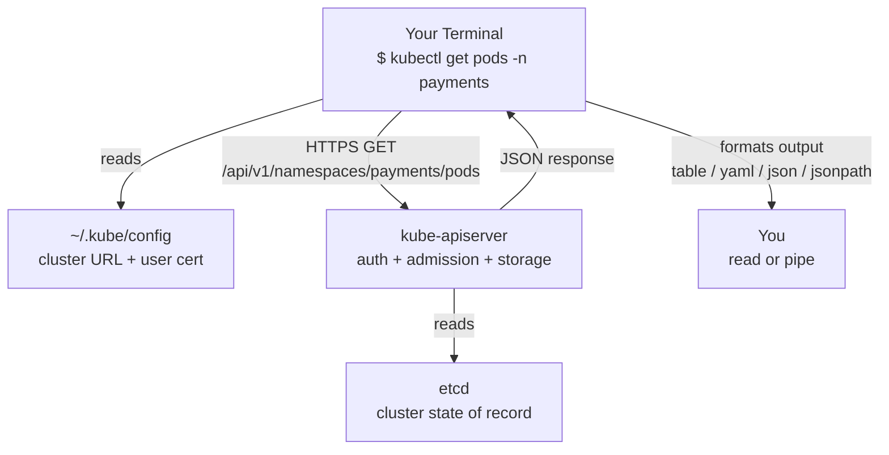

> **Complexity**: `[MEDIUM]` - Essential commands to master
>
> **Time to Complete**: 60-75 minutes
>
> **Prerequisites**: Module 1.1 (a working kind or minikube cluster), basic familiarity with the Linux shell, and a `kubectl` binary on your `$PATH` matching your cluster within one minor version.

---

## Why This Module Matters

It is 03:00 on a Saturday, and a pager has just shattered the silence in an SRE's apartment. The company's checkout service has stopped responding, customers are bouncing off the cart page, and the Slack incident channel is filling up faster than anyone can read. The on-call engineer has exactly one tool that matters in the next ninety seconds: a terminal with `kubectl` configured against the right cluster. If they can type `kubectl get pods -n payments`, spot the `CrashLoopBackOff`, run `kubectl logs --previous`, and identify the bad config map within two minutes, the outage is contained and the post-mortem is short. If they fumble for syntax, mistype the namespace, or — worse — run a destructive command against the wrong context, the company loses six figures and the engineer spends Monday morning explaining themselves to leadership.

This is the unglamorous truth about Kubernetes: every operator, every developer, and every platform engineer talks to the cluster through the same single command. `kubectl` is not a CLI in the way `ls` is a CLI. It is a typed, schema-aware HTTPS client that translates your shell commands into REST calls against the Kubernetes API server, and it is the universal adapter through which all human intent reaches the control plane. CI/CD pipelines wrap it. GitOps controllers re-implement its behavior. Helm and Kustomize generate manifests that you ultimately apply with it. Even when you are using a fancy dashboard, somewhere underneath, a `kubectl`-equivalent API call is being issued. Mastering it is therefore not optional polish — it is the load-bearing skill on top of which every other Kubernetes competency is built.

A real incident from 2019 illustrates the cost of mediocrity. A senior engineer at a well-known FinTech intended to delete a stale namespace called `payments` from a staging cluster. They ran `kubectl delete namespace payments`. The command succeeded instantly, and only as the alerts began firing did they realize their `kubectl` context was still pointing at production. The payments routing layer was gone, recovery from backups took roughly forty-five minutes, and the company estimated the lost transaction revenue at one hundred and twenty thousand dollars. There was no bug in Kubernetes. The system did exactly what it was told. The lesson is that `kubectl` rewards precision and punishes haste, and that the muscle memory you build in this module — checking your context, using `--dry-run=client`, preferring declarative `apply` over imperative `delete` — is the difference between a senior operator and a liability.

## Learning Outcomes

After completing this module, you will be able to:

- **Debug** a non-running pod end-to-end by chaining `kubectl get`, `kubectl describe`, and `kubectl logs --previous` to isolate whether the failure is at scheduling, image pull, or runtime.
- **Compare** imperative (`kubectl run`, `kubectl create`) and declarative (`kubectl apply`) workflows and **justify** which to use for a given situation, including when Server-Side Apply is the right escalation.
- **Design** a safe context-management workflow that prevents the cross-cluster destruction described above, including current-context checks, named contexts per environment, and `--dry-run=server` previews.
- **Evaluate** the output of `kubectl get -o jsonpath` and `kubectl get -o custom-columns` to extract precisely the data needed for automation, monitoring scripts, or certification exam tasks.
- **Implement** a productivity-boosting shell environment with the `k` alias, autocomplete, and a small library of inspection one-liners that you can reproduce on any new machine in under five minutes.

---

## The Mental Model: kubectl Is a Typed API Client

Before you memorize a single command, internalize this sentence: every `kubectl` invocation is an HTTPS request against the Kubernetes API server. The CLI looks like a local tool because it lives on your laptop, but it does almost no real work locally. It reads `~/.kube/config` to find a cluster URL and a credential, serializes your subcommand into a REST verb plus a JSON body, sends it to the API server over TLS, and pretty-prints the response. If the API server is unreachable, `kubectl` is useless. If your kubeconfig is wrong, you can be talking to the wrong cluster without any visual indication. This mental model dissolves a hundred mysteries that beginners have about why certain commands behave the way they do.

The mapping between subcommand and HTTP verb is regular and worth memorizing. `kubectl get` is `GET /api/v1/...` and is read-only and side-effect-free. `kubectl create` is `POST` and fails if the resource already exists. `kubectl apply` is `PATCH` (or, with `--server-side`, an `apply` operation) and is idempotent — running it twice produces the same end state as running it once. `kubectl delete` is `DELETE` and is irreversible. Once you see commands as verbs against an API, the difference between `create` and `apply` stops being arbitrary trivia and becomes obvious: `create` is for one-shot first-time provisioning, `apply` is for the continuous reconciliation pattern that GitOps depends on.



The diagram above is the most important picture in this module. Print it, tape it to your monitor, and look at it whenever a command behaves unexpectedly. Nine out of ten "kubectl is broken" complaints turn out to be one of three things: the wrong cluster URL in kubeconfig, an expired or wrong credential, or an admission webhook on the API server rejecting the request. None of those are problems with `kubectl` itself; they are problems on the path between your terminal and `etcd`, and the diagram tells you exactly where to look.

> **Stop and think**: If `kubectl` is just an HTTPS client, what would happen if you used `curl` against the API server directly with your kubeconfig credentials? (You can — and `kubectl --v=8` will print the exact `curl`-equivalent request it is making, which is one of the best debugging tricks in the Kubernetes universe. Try `kubectl get pods --v=8 2>&1 | grep curl` after this module.)

---

## The kubectl Command Anatomy

Every `kubectl` command follows the same four-part structure: `kubectl [VERB] [TYPE] [NAME] [FLAGS]`. The verb is what you want to do — `get`, `describe`, `apply`, `delete`, `exec`, `logs`. The type is the resource kind, written either in full (`pods`, `deployments`, `services`) or in a short name (`po`, `deploy`, `svc`). The name is optional; omit it to operate on all resources of that type, or supply it to target one. Flags modify behavior — namespace selection, output format, label filters, dry-run mode, and so on. Once you see the four-part structure, every command in the documentation snaps into place.

```text
kubectl    get        pods       nginx          -n web -o yaml
   |        |          |           |               |
 binary    verb       type        name          flags
 (HTTP    (HTTP      (REST     (resource    (namespace,
  client)  method:   path       identifier)   output, etc.)
            GET)     segment)
```

Short names matter once you start running these commands hundreds of times a day. `kubectl get po` is meaningfully faster to type than `kubectl get pods`, and `kubectl get deploy,svc,po -n web` lists three resource types at once when you are eyeballing what is running in a namespace. The full list is available with `kubectl api-resources`, which is itself a command worth running on every new cluster — it tells you not just the built-in types but every Custom Resource Definition the cluster has installed, which is how you discover that the cluster has Argo Rollouts, Cert-Manager, or Crossplane without having to ask anyone.

Flags follow standard Unix conventions. Single-letter flags are prefixed with one dash and can be combined: `-it` for interactive TTY in `kubectl exec`. Long-form flags use two dashes: `--namespace=web`, `--output=yaml`. The `=` is optional but recommended for clarity, especially in shell scripts where a missing `=` can cause a flag to consume the next argument. `kubectl` is generally forgiving about flag ordering, but it is not promised behavior — when scripting, always put the verb and type first and flags last.

> **Pause and predict**: What do you think `kubectl get all -n kube-system` returns? Will it return literally every resource in `kube-system`, including Secrets and ConfigMaps? (Answer: no — `all` is a curated alias that expands to roughly Pods, ReplicaSets, Deployments, StatefulSets, DaemonSets, Jobs, CronJobs, and Services. It does NOT include Secrets, ConfigMaps, Roles, ServiceAccounts, or any CRDs. This is one of the most-misunderstood pieces of `kubectl` behavior, and a frequent source of "I deleted everything but the namespace is not empty" confusion.)

---

## Reading the Cluster: get, describe, explain

The three read-only verbs — `get`, `describe`, and `explain` — answer three different questions and using the wrong one wastes time. `kubectl get` answers "what exists?" with a compact tabular listing. `kubectl describe` answers "what is the state of this specific thing, including events?" with a verbose multi-section dump. `kubectl explain` answers "what fields does this resource type even support?" by reading the OpenAPI schema embedded in the API server. Beginners reach for `describe` for everything because it shows the most data; experienced operators almost always start with `get` to establish the lay of the land and only escalate to `describe` once they have identified the suspect resource.

```bash
# What exists in this namespace?
kubectl get pods                     # default namespace, table view
kubectl get pods -A                  # every namespace, every pod
kubectl get pods -n kube-system      # one specific namespace
kubectl get pods -o wide             # add node, pod IP, nominated node
kubectl get pod nginx -o yaml        # the full server-stored object

# What's the state of this specific thing?
kubectl describe pod nginx           # spec, status, conditions, EVENTS
kubectl describe node kind-control-plane

# What fields does this resource even have?
kubectl explain pod.spec.containers
kubectl explain pod.spec.containers.resources --recursive
```

The killer feature of `kubectl describe` is the Events section at the bottom. When a pod is `Pending`, the events tell you whether the scheduler could not find a node, whether the image pull failed, whether a volume could not mount, or whether an admission webhook rejected the resource. Beginners often skip past the events because there is so much output above them; train yourself to scroll directly to the bottom. The single phrase that solves more "why is my pod broken?" tickets than any other is "did you read the events at the bottom of `kubectl describe`?"

The `kubectl explain` command is the one most beginners never discover, and it is genuinely transformative once you do. Instead of switching to a browser and searching the Kubernetes documentation site for the structure of a `PodSpec`, you can stay in your terminal: `kubectl explain pod.spec.containers.livenessProbe`. The output is the canonical schema, sourced from the same OpenAPI definition the API server uses to validate your YAML, which means it is always exactly correct for your cluster's version. Pair it with `--recursive` when you want to see every nested field at once, and you have a perfect cheat sheet for writing manifests by hand without ever consulting external docs.

> **Stop and think**: A junior engineer says "`kubectl describe pod` does not show me the container exit code when a container has crashed." Are they right or wrong? (They are wrong — `describe` does show it, in the `Last State` block under each container, with fields like `Reason`, `Exit Code`, and `Started`/`Finished`. They probably ran `describe` while the pod was still running fine, before the crash. Run it again the next time the pod is in `CrashLoopBackOff`.)

---

## Output Formats and Why They Matter

The default tabular output of `kubectl get` is optimized for human eyeballs scanning a screen, which makes it almost useless for scripts and automation. Kubernetes exposes every resource as a fully-typed JSON object, and `kubectl` lets you pull any subset of that object out via `-o`. The five output formats you will actually use are `wide`, `yaml`, `json`, `jsonpath`, and `custom-columns`, and each one has a clear use case.

`-o wide` adds columns to the default table — typically node name, pod IP, and image — without changing the structure. Use it when you want a quick "where is this scheduled?" answer without parsing YAML. `-o yaml` and `-o json` dump the entire server-stored object, which is the source of truth for that resource. Use `-o yaml` when you want to read the manifest as a human; use `-o json` when you want to pipe it through `jq` for transformation. `-o jsonpath` and `-o custom-columns` are precision tools that extract specific fields, which is what you want when scripting against the cluster or producing dashboard data.

```bash
# The five formats you will actually use
kubectl get pods                                        # default table
kubectl get pods -o wide                                # extra columns
kubectl get pod nginx -o yaml                           # full object as YAML
kubectl get pod nginx -o json | jq '.status.podIP'      # pipe to jq

# JSONPath: extract a single field
kubectl get pod nginx -o jsonpath='{.status.podIP}'

# JSONPath: extract a list
kubectl get pods -o jsonpath='{.items[*].metadata.name}'

# JSONPath: per-line output (for shell loops)
kubectl get pods -o jsonpath='{range .items[*]}{.metadata.name}{"\n"}{end}'

# Custom columns: tabular, scriptable, beautiful
kubectl get pods -o custom-columns=NAME:.metadata.name,STATUS:.status.phase,NODE:.spec.nodeName
```

The JSONPath dialect that `kubectl` uses is similar to but not identical to the original Stefan Goessner JSONPath spec. The most common gotcha is that `kubectl`'s flavor does not support the full filter expression syntax; you cannot, for example, easily say "give me all pods where `.status.phase` equals `Running`" via JSONPath alone. For that, you either pipe to `jq` (which is the strict-superset answer) or use `--field-selector=status.phase=Running` (which is faster because the filtering happens server-side). Knowing when to use each — JSONPath for projection, jq for complex transformation, field selectors for server-side filtering — is one of the marks of a senior operator.

For certification exams (CKA, CKAD, CKS), `-o jsonpath` and `-o custom-columns` show up constantly. A typical question reads "list the names of all pods sorted by their restart count, in descending order." The fast answer combines `--sort-by`, `-o custom-columns`, and a touch of JSONPath, and the candidates who ace the time pressure are the ones who have built muscle memory for these flags ahead of time.

> **Pause and predict**: What does `kubectl get pods -o jsonpath='{.items[?(@.status.phase=="Failed")].metadata.name}'` return on a cluster where two pods have failed? (It returns the names of those two pods, space-separated on one line. The `[?(...)]` is a JSONPath filter expression — `kubectl`'s JSONPath supports a subset of these. For richer filtering, prefer `--field-selector=status.phase=Failed` because the API server does the work for you.)

---

## Imperative vs Declarative: The Most Important Choice

You can create a Kubernetes resource in two fundamentally different ways, and choosing between them is one of the first real engineering decisions you will make as an operator. Imperative commands like `kubectl run nginx --image=nginx` and `kubectl create deployment web --image=httpd:2.4` tell the cluster directly to do something. Declarative commands like `kubectl apply -f deployment.yaml` describe the desired state and let the cluster figure out how to reach it. Both produce running workloads, but they have radically different operational consequences.

Imperative commands are fast, terse, and great for ad-hoc work — spinning up a debugging pod, generating a YAML skeleton, scaling something quickly during an incident. They are terrible for anything that needs to be repeatable, version-controlled, or reviewed. There is no audit trail of what `kubectl run` you ran last week, no way to roll forward in another environment, and no diff against a known-good state. Declarative manifests live in Git, get reviewed in pull requests, get applied by CI or a GitOps controller, and produce a system whose state at any moment can be traced back to a specific commit. Every production-grade Kubernetes shop runs declaratively; imperative work is reserved for prototyping, exam practice, and incident triage.

```bash
# Imperative: fast, ephemeral, no audit trail
kubectl run nginx --image=nginx:1.27.0
kubectl create deployment web --image=httpd:2.4 --replicas=3
kubectl expose deployment web --port=80 --target-port=80
kubectl scale deployment web --replicas=5

# Declarative: slower to write, but reviewable, repeatable, gittable
kubectl apply -f deployment.yaml
kubectl apply -f .                            # all manifests in directory
kubectl apply -f https://example.com/app.yaml # straight from URL
kubectl apply -f deployment.yaml --server-side # SSA, see below

# The bridge: generate YAML imperatively, then commit it
kubectl create deployment web --image=httpd:2.4 --replicas=3 \
    --dry-run=client -o yaml > deployment.yaml
```

The third pattern — `--dry-run=client -o yaml` — is the single most useful trick in `kubectl` and deserves its own paragraph. It tells the client "go through the motions of the imperative command, format the resulting object as YAML, and print it without sending it to the server." You get a syntactically perfect, schema-correct skeleton that you can edit and commit. This is how every working Kubernetes engineer writes manifests in practice; nobody hand-writes a Deployment from memory because the result would be brittle and probably wrong on the first try. If a junior engineer asks how to write a manifest, the senior answer is always "use `kubectl create ... --dry-run=client -o yaml > foo.yaml` and edit the result."

Server-Side Apply (`--server-side`) is the modern evolution of the declarative pattern and worth understanding even at the beginner stage. Classical client-side `apply` computes the diff between your manifest and the live object on your laptop, then sends a patch. This breaks down when multiple actors — a human, a controller, an admission webhook — all want to write to the same resource, because the client has no way to know which fields it owns. Server-Side Apply moves the merge logic into the API server, which tracks ownership of each field per actor (`fieldManager`). When two actors set conflicting values, you get a clear conflict error instead of silent overwrites. New code should default to `--server-side`; existing code can be migrated incrementally.

> **Stop and think**: You ran `kubectl scale deployment web --replicas=5` during an incident, and an hour later the GitOps controller re-applies the manifest from Git, which says `replicas: 3`. What happens? (The controller wins — it sets replicas back to 3 and your imperative scale-up is lost. This is exactly why mixing imperative changes with a declarative GitOps workflow is dangerous. The fix is to update the YAML in Git, not to type a `kubectl scale` and hope nobody notices.)

---

## Modifying and Deleting Resources Safely

Once a resource exists, you have four ways to change it: `kubectl apply` (re-apply an updated manifest), `kubectl edit` (open the live object in your `$EDITOR`), `kubectl patch` (send a targeted JSON or strategic-merge patch), and `kubectl set` (set a single common field, like an image). Each has a sweet spot. `apply` is the production answer because it preserves the manifest in Git as the source of truth. `edit` is convenient for one-off tweaks but leaves no audit trail. `patch` is for scripts where you need to change one field without touching the rest, common in controllers. `set image` is the ergonomic shortcut for the most common operation — rolling out a new version — without having to crack open the YAML.

```bash
# The four ways to change a live resource
kubectl apply -f updated-deployment.yaml             # production answer
kubectl edit deployment web                          # opens $EDITOR live
kubectl patch deployment web -p '{"spec":{"replicas":3}}'  # surgical
kubectl set image deployment/web web=nginx:1.27.0    # common-case shortcut

# Scaling
kubectl scale deployment web --replicas=5
kubectl scale deployment web --replicas=5 --current-replicas=3  # CAS-style guard

# Annotation / label tweaks (handy in scripts)
kubectl label pod nginx env=prod
kubectl annotate pod nginx owner=team-payments
```

Deletion is where Kubernetes punishes carelessness. `kubectl delete pod nginx` issues a graceful termination request: the API server marks the pod for deletion, the kubelet sends `SIGTERM` to the container, waits for `terminationGracePeriodSeconds` (default 30), and only then sends `SIGKILL`. Most of the time this is what you want. Sometimes a pod will hang in `Terminating` for minutes because the kubelet on its node has lost contact with the API server, and you need an escape hatch.

```bash
# Graceful deletion (the default — let the container clean up)
kubectl delete pod nginx
kubectl delete -f deployment.yaml

# Bulk deletion within a namespace
kubectl delete pods --all -n test
kubectl delete pods -l app=stale-experiment

# The nuclear option (use only when the pod is truly stuck)
kubectl delete pod nginx --grace-period=0 --force

# The safer escape hatch: drain the node first
kubectl drain kind-worker --ignore-daemonsets --delete-emptydir-data
```

The `--grace-period=0 --force` combination is dangerous because it tells the API server to remove the pod object from `etcd` immediately, even if the kubelet has not confirmed the actual container has stopped. If the kubelet is alive and just slow, you can end up with a "ghost" container still running on the node consuming resources, with no API-server-side record of it. Reach for `--force` only when you have already confirmed the underlying node is dead or the kubelet is unrecoverable; otherwise prefer to wait, or to investigate why the graceful deletion is hanging (almost always a misbehaving finalizer).

A subtler trap is deleting the wrong layer of the Kubernetes hierarchy. If you delete a Pod that is owned by a Deployment, the ReplicaSet controller will recreate it within seconds, and you will be left wondering why deletion "did not work." The fix is to delete the owning Deployment, which cascades through the ReplicaSet and removes its Pods. The general rule is: delete the highest-level resource you control. If you created it with `kubectl run`, delete the Pod; if you created it with `kubectl create deployment`, delete the Deployment.

---

## Namespaces, Contexts, and the Multi-Cluster Reality

Namespaces are Kubernetes's primary tenancy boundary inside a single cluster, and `kubectl` defaults to the namespace called `default` unless you tell it otherwise. Almost every real cluster has dozens of namespaces — `kube-system` for control-plane components, `kube-public` for cluster-wide info, plus per-team or per-environment namespaces like `payments-prod`, `payments-staging`, `observability`, `cert-manager`. Forgetting to specify a namespace is the single most common newbie mistake; you run `kubectl get pods`, see nothing, and assume the cluster is empty when in reality you are looking at the empty `default` namespace and your workloads are in `web`.

```bash
# Namespace operations
kubectl get namespaces                               # short: kubectl get ns
kubectl create namespace payments-staging
kubectl get pods -n payments-staging                 # one-shot
kubectl get pods --all-namespaces                    # short: -A
kubectl config set-context --current --namespace=payments-staging  # persistent default

# Context operations (clusters + users + default namespace)
kubectl config get-contexts                          # see what you have
kubectl config current-context                       # WHERE AM I?
kubectl config use-context kind-kind
```

Contexts are the layer above namespaces. A context is a named bundle of `(cluster URL, user credential, default namespace)`, and your `~/.kube/config` may contain dozens of them as you accumulate clusters over your career. The currently active context determines which cluster your next `kubectl` command will hit. The disaster story at the start of this module was caused by a stale `prod` context being active while the engineer thought they were in `staging`. The defensive practice is to run `kubectl config current-context` before any destructive command and to install a shell prompt indicator that always shows your current context — `kube-ps1` and `starship` both have built-in modules for this.

A more advanced pattern is to set `KUBECONFIG` as an environment variable per shell, so that each terminal tab is bound to a specific cluster and switching clusters means opening a new tab rather than running `use-context` and hoping nothing else mutates the file. Many production-grade engineers keep one kubeconfig per cluster, version-controlled in their dotfiles or fetched via `aws eks update-kubeconfig` / `gcloud container clusters get-credentials`, and never touch the merged `~/.kube/config`. This is the pattern you should adopt before you have your first cross-cluster incident, not after.

> **Pause and predict**: After running `kubectl config set-context --current --namespace=kube-system`, what does `kubectl get pods` return? (It returns the system pods — kube-apiserver, etcd, kube-controller-manager, kube-scheduler, kube-proxy, CoreDNS — without needing the `-n kube-system` flag. The setting persists in your kubeconfig file, so it survives terminal restarts. Don't forget to switch back, or your next `kubectl run` will create a pod in `kube-system` where it doesn't belong.)

---

## Debugging Workflow: logs, exec, port-forward

Three commands carry the bulk of day-to-day debugging: `kubectl logs`, `kubectl exec`, and `kubectl port-forward`. Each one corresponds to a question you ask while triaging a misbehaving workload. `logs` answers "what did the container print?" `exec` answers "what does the container's filesystem and network look like from the inside?" `port-forward` answers "can I talk to the container from my laptop without exposing it to the world?" Together they form a debugging vocabulary that experienced operators reach for without thinking.

```bash
# Logs: the first thing you check when an app misbehaves
kubectl logs nginx                          # current container
kubectl logs nginx -f                       # stream (Ctrl-C to stop)
kubectl logs nginx --tail=200               # last 200 lines
kubectl logs nginx --since=10m              # everything in the last 10 minutes
kubectl logs nginx -c sidecar               # multi-container pod, name the container
kubectl logs nginx --previous               # the PREVIOUS container instance — KEY for CrashLoopBackOff
kubectl logs -l app=web --tail=50           # all pods matching a label

# Exec: drop into the container
kubectl exec nginx -- ls /etc/nginx         # one-shot command
kubectl exec -it nginx -- bash              # interactive shell (-i interactive, -t TTY)
kubectl exec -it nginx -- sh                # fall back to sh if bash isn't installed
kubectl exec -it nginx -c sidecar -- sh     # specific container in a multi-container pod

# Port-forward: tunnel a local port to a pod or service
kubectl port-forward pod/nginx 8080:80      # localhost:8080 -> pod:80
kubectl port-forward svc/api 9090:80        # localhost:9090 -> service:80
kubectl port-forward deploy/web 8080:80     # picks one healthy pod from the deployment
```

`kubectl logs --previous` is the flag that separates the engineers who can debug `CrashLoopBackOff` from the ones who file tickets. When a container crashes, the kubelet starts a fresh one. `kubectl logs` without `--previous` shows the new container's output, which is often empty or just the startup banner because the new container has not crashed yet. The actual stack trace, panic, or fatal log line is in the previous, dead container's output. `kubectl logs nginx --previous` (or `-p`) retrieves it. This single flag, used reflexively, will save you hours over your career.

`kubectl exec` is the Kubernetes-native equivalent of `docker exec` and is essential for debugging container internals — checking environment variables, hitting an internal health endpoint, inspecting mounted ConfigMap files, running a one-shot `nslookup` to verify cluster DNS. The catch is that the container image must actually contain the binary you want to run. Distroless images and scratch-based Go binaries have no shell at all, in which case you need `kubectl debug` (covered in a later module) to attach an ephemeral debug container with the tools you need. For most beginner-grade workloads, `kubectl exec -it pod -- sh` works fine.

`kubectl port-forward` deserves a moment of explanation because it is one of the strongest reasons Kubernetes feels easier than its predecessors. There is no firewall to punch, no SSH tunnel to set up, no LoadBalancer to provision; you just say "give me localhost:8080 mapped to pod's port 80" and the API server proxies the connection through the cluster's existing TLS-secured channel. This is how you point a local browser at an internal admin dashboard, how you connect a database GUI to a Postgres pod, and how you quickly verify that a service is responding before exposing it externally. The tunnel dies when you Ctrl-C the command, so it is also entirely safe — there is nothing to forget to clean up.

> **Stop and think**: A pod is in `CrashLoopBackOff` and `kubectl logs nginx` returns nothing. What two commands do you run, in what order, and why? (First `kubectl describe pod nginx` to read the Events block at the bottom — this catches image-pull failures, OOM kills, and admission rejections, none of which produce app logs. Then `kubectl logs nginx --previous` to see the dead container's stdout/stderr. If both come up empty, the container is being killed by the kubelet before it produces output, which usually means a failed liveness probe or a missing required environment variable.)

---

## Productivity Boosters: Aliases, Autocomplete, and `--v=8`

You will type `kubectl` thousands of times a week. Optimizing the typing is not vanity — it is real productivity, and it pays back the five minutes of setup within the first day. The standard alias is `alias k=kubectl`, plus a small constellation of derived aliases for the most common queries.

```bash
# Add to ~/.bashrc or ~/.zshrc and source it
alias k='kubectl'
alias kgp='kubectl get pods'
alias kgs='kubectl get services'
alias kgd='kubectl get deployments'
alias kgn='kubectl get nodes'
alias kaf='kubectl apply -f'
alias kdel='kubectl delete'
alias klog='kubectl logs'
alias kex='kubectl exec -it'
alias kctx='kubectl config current-context'  # SAFETY CHECK
alias kns='kubectl config set-context --current --namespace'

# Autocomplete (so tab completes resource names, not just flags)
source <(kubectl completion bash)               # bash
source <(kubectl completion zsh)                # zsh

# Make autocomplete work for the alias too
complete -F __start_kubectl k                   # bash
compdef k=kubectl                               # zsh
```

The `kubectl completion` integration is the second-biggest productivity multiplier after the alias. Once enabled, tab-completion works for verbs, resource types, resource names (it queries the cluster!), namespaces, and contexts. Typing `k get po ng<TAB>` will autocomplete `nginx-7f4b...-abc12` for you. This single feature eliminates an entire class of typo-induced bugs.

Two debugging tricks round out the productivity toolkit. `kubectl --v=8` prints the underlying HTTP request and response, which is invaluable when something behaves unexpectedly and you need to see exactly what the API server received. And `--dry-run=server` (different from `--dry-run=client`) sends the request to the API server, runs admission and validation, but rolls back before persisting — so you can preview exactly what the server would do, including admission webhooks that would mutate or reject your manifest, without actually changing anything. Use it before any apply that scares you.

```bash
# The two safety previews — learn them before you learn anything else
kubectl apply -f deployment.yaml --dry-run=client    # client validation only
kubectl apply -f deployment.yaml --dry-run=server    # full admission, rolled back

# The debugging escape hatch
kubectl get pods --v=8 2>&1 | grep -E 'curl|http'    # see the actual HTTP call
```

---

## Worked Example: Diagnosing a Stuck Deployment

Reading a list of commands is not the same as knowing how to use them. The following worked example walks through a realistic incident, step by step, in the order a senior engineer would actually attack it. Read it once now; come back to it as a template the next time something is broken on your own cluster. The goal of a worked example is to expose the *reasoning chain* — what you check, why you check it, what each result rules in or out — not just the commands.

**Scenario.** A teammate Slacks you: "Hey, I deployed `web-frontend` to the `staging` namespace ten minutes ago and the service is not responding. Can you take a look?" You have never seen this Deployment before. Your job is to find the failure and either fix it or explain it.

**Step 1: Confirm you're talking to the right cluster.** Always. Always. Always.

```bash
$ kubectl config current-context
kind-staging
```

Good — you are on the staging cluster, not production. If this returned `prod-east-1`, you would stop and switch contexts before doing anything else. This single habit would have prevented the 2019 FinTech outage at the start of this module.

**Step 2: Establish the lay of the land with `get`, not `describe`.** Get the high-level picture first, then drill in.

```bash
$ kubectl get pods,deploy,svc -n staging -l app=web-frontend
NAME                                READY   STATUS              RESTARTS   AGE
pod/web-frontend-6c5f9b7d8-2xqpk    0/1     ImagePullBackOff    0          11m
pod/web-frontend-6c5f9b7d8-9xsvm    0/1     ImagePullBackOff    0          11m
pod/web-frontend-6c5f9b7d8-fpvtd    0/1     ImagePullBackOff    0          11m

NAME                            READY   UP-TO-DATE   AVAILABLE   AGE
deployment.apps/web-frontend    0/3     3            0           11m

NAME                    TYPE        CLUSTER-IP      EXTERNAL-IP   PORT(S)
service/web-frontend    ClusterIP   10.96.142.18    <none>        80/TCP
```

The `get` already tells you the headline: all three pods are in `ImagePullBackOff`, the Deployment shows `0/3 AVAILABLE`, and the Service exists but has no healthy endpoints behind it. You now know the Service is not the problem; you do not need to look at it further. The Deployment is correctly creating pods, so the Deployment is not the problem either. The pods are failing at image pull. That is where you go next.

**Step 3: Drill into one failing pod with `describe`.** Read the Events at the bottom — that is where the answer always lives.

```bash
$ kubectl describe pod web-frontend-6c5f9b7d8-2xqpk -n staging
[... lots of output above ...]
Events:
  Type     Reason     Age                 From     Message
  ----     ------     ----                ----     -------
  Normal   Scheduled  11m                 default  Successfully assigned staging/...
  Normal   Pulling    9m (x4 over 11m)    kubelet  Pulling image "myregistry.local/web-frontend:v2.1.0"
  Warning  Failed     9m (x4 over 11m)    kubelet  Failed to pull image: rpc error: code = NotFound
                                                    desc = manifest for myregistry.local/web-frontend:v2.1.0 not found
  Warning  Failed     9m (x4 over 11m)    kubelet  Error: ErrImagePull
  Normal   BackOff    1m (x42 over 11m)   kubelet  Back-off pulling image
```

This is decisive. The image tag `v2.1.0` does not exist in the registry. The pod was scheduled fine; the kubelet found the node; the registry was reachable (it returned `NotFound`, not `connection refused`); the tag is simply missing. Now you know the problem is not Kubernetes — it is on the registry side or in the manifest.

**Step 4: Confirm what tag the manifest actually requested.** Read the source of truth, the live Deployment object.

```bash
$ kubectl get deployment web-frontend -n staging -o jsonpath='{.spec.template.spec.containers[*].image}'
myregistry.local/web-frontend:v2.1.0
```

The Deployment is asking for `v2.1.0`. Either the build pipeline did not push that tag, or your teammate typed the wrong version. A quick check of the registry (or a Slack message to the build pipeline channel) confirms the latest pushed tag is `v2.0.9`. The build pipeline ran on a branch that was never merged.

**Step 5: Apply the fix declaratively.** Update the manifest in Git, not via `kubectl edit`. The fastest way to test the fix in front of you, before the PR merges, is `kubectl set image` — but you must follow up with a Git commit, or the next GitOps reconcile will revert your change.

```bash
$ kubectl set image deployment/web-frontend -n staging web-frontend=myregistry.local/web-frontend:v2.0.9
deployment.apps/web-frontend image updated

$ kubectl rollout status deployment/web-frontend -n staging
Waiting for deployment "web-frontend" rollout to finish: 1 of 3 updated replicas are available...
deployment "web-frontend" successfully rolled out

$ kubectl get pods -n staging -l app=web-frontend
NAME                              READY   STATUS    RESTARTS   AGE
web-frontend-7d4c8f6b9-abc12      1/1     Running   0          45s
web-frontend-7d4c8f6b9-def34      1/1     Running   0          40s
web-frontend-7d4c8f6b9-ghi56      1/1     Running   0          35s
```

**Step 6: Update the manifest in Git.** Open a PR with `image: myregistry.local/web-frontend:v2.0.9`, mention the incident in the description, and merge after review. Without this step, the next GitOps sync will set the image back to `v2.1.0` and the outage returns. Your teammate posts in Slack: "Fixed, it was a typo in the tag, PR #1138 has the correction." Total time from page to fix: under five minutes. That is what fluency in `kubectl` looks like in practice.

**The reasoning chain to remember.** Notice that the worked example walked the cluster from the outside in: cluster → namespace → resource type → specific resource → specific field. At each step you asked a question and let the answer narrow the search. You did not run `kubectl describe` against every pod in the cluster; you used `get` with a label selector to scope the problem, then `describe` once to read events. This top-down funnel is how every senior operator debugs, and it is the pattern you are practicing every time you triage a ticket.

---

## Did You Know?

1. **`kubectl` was not always called `kubectl`.** In the earliest commits of the Kubernetes repository in mid-2014, the CLI was named `kubecfg`, and it spoke a different protocol than the modern API. The rename to `kubectl` (pronounced inconsistently as "cube-control," "cube-cuttle," "cube-C-T-L," or "kubectl" by people who have given up) happened during the rapid pre-1.0 design churn, alongside the shift to the resource-oriented REST API we use today. The original `kubecfg` binary is preserved in the Git history as a fossil of how different the project's design used to be.

2. **`kubectl explain` reads its data from your cluster, not from a hard-coded table inside the binary.** When you run `kubectl explain pod.spec.containers`, the CLI fetches the OpenAPI schema document from the API server's `/openapi/v3` endpoint and renders the relevant subtree. This means if your cluster has a Custom Resource Definition installed — say, an Argo Rollout — you can run `kubectl explain rollout.spec.strategy.canary` and get accurate, version-correct documentation for that CRD without ever leaving your terminal. The CRD author wrote those descriptions; the API server serves them; your CLI renders them.

3. **`kubectl` ships its own version of `git diff` and you have probably never used it.** `kubectl diff -f deployment.yaml` shows you exactly what would change if you applied the manifest, computed by the API server using server-side dry-run. It respects admission webhooks, mutating defaults, and field ownership. Engineers who discover this command treat it as a revelation, because it eliminates the "what is this `apply` actually going to do?" anxiety that affects every change in production.

4. **The `kubectl` binary is itself a Kubernetes API client library wrapped in a CLI.** Everything `kubectl` does is implemented on top of `client-go`, the same Go library that custom controllers use. This means anything `kubectl` can do, your own code can do — including watching resources, applying server-side patches, and running port-forwards. The CLI is genuinely just a thin convenience layer over the API, which is part of why the Kubernetes ecosystem has so many alternative clients (`k9s`, `lens`, `kubie`, `stern`, etc.) that all interoperate cleanly.

---

## Common Mistakes

| Mistake | Why It Happens | The Fix |
|---|---|---|
| Running destructive commands in the wrong context. | Stale `current-context` from previous work; no visual prompt indicator. | Run `kubectl config current-context` reflexively before destructive ops; install `kube-ps1` or starship's k8s module so context is always visible. |
| Forgetting `--namespace` and assuming the cluster is empty. | `kubectl get pods` defaults to `default`, which is rarely where workloads live. | Either use `-n <ns>` explicitly, or set a default per shell with `kubectl config set-context --current --namespace=<ns>`. |
| Reading `kubectl logs` on a `CrashLoopBackOff` pod and seeing nothing. | The current container hasn't crashed yet — it just started and won't have output for a few seconds. | Use `kubectl logs <pod> --previous` (or `-p`) to read the dead container's output where the actual error is. |
| Editing deployments with `kubectl edit` and breaking them with a typo. | The live YAML is huge; one bad indent ruins it. | Update the manifest in Git, run `kubectl diff -f` to preview, then `kubectl apply -f`. Reserve `edit` for genuinely one-off tweaks. |
| Mixing `kubectl scale` with a GitOps controller that owns the same Deployment. | The imperative change works for a few minutes, then the controller reverts it. | Pick one source of truth. Either change the manifest in Git, or temporarily suspend the controller's reconciliation. Never both. |
| Deleting a Pod that is owned by a Deployment and being surprised it comes back. | The ReplicaSet controller recreates owned pods within seconds. | Delete the highest-level resource you control — the Deployment, not the Pod. Use `kubectl get pod <name> -o yaml | grep ownerReferences` to see who owns a resource. |
| Using `--force --grace-period=0` as a default. | It feels faster, and senior engineers in tutorials use it without explanation. | Reserve `--force` for confirmed-dead nodes. Otherwise, investigate the stuck finalizer or hung kubelet — forcing a delete can leave orphaned containers running on the node. |
| Hand-writing YAML manifests from memory. | Beginners assume "real" engineers write YAML by hand. | They don't. Run `kubectl create <kind> <name> ... --dry-run=client -o yaml > file.yaml` to generate a correct skeleton, then edit. |

---

## Quiz

1. **You are paged because the `checkout-api` pod in the `payments` namespace is failing health checks. You run `kubectl logs checkout-api -n payments` and see only a few lines of startup banner — no errors. The pod's `STATUS` column shows `CrashLoopBackOff`. What is the next single command, and what are you hoping to find?**
   <details>
   <summary>Answer</summary>

   `kubectl logs checkout-api -n payments --previous` — you are looking for the stack trace, panic, or fatal log line from the *previous* container instance, the one that just died. The current container has only been alive for a few seconds since the kubelet restarted it after the last crash, so its logs only show the startup banner before it inevitably crashes again. The `--previous` flag retrieves the dead container's last gasps, which is where the actual root cause almost always lives. If `--previous` also returns nothing, escalate to `kubectl describe pod` and read the Events at the bottom — that catches OOM kills and failed liveness probes, neither of which produce app-level logs.
   </details>

2. **A teammate ran `kubectl scale deployment web --replicas=10` during last night's traffic spike to handle the load. This morning you notice the Deployment is back at three replicas, even though nobody else touched it. Your team uses Argo CD for GitOps. What happened, and what is the correct fix going forward?**
   <details>
   <summary>Answer</summary>

   Argo CD reconciled the Deployment back to the manifest stored in Git, which still says `replicas: 3`. The imperative `kubectl scale` worked for a while because Argo's reconciliation is periodic (default every three minutes), but as soon as the next sync ran, the controller saw a drift between desired (3) and actual (10) and reset to the Git-defined value. The correct fix is to never make imperative changes to GitOps-managed resources. Either update `replicas: 10` in the manifest in Git and merge a PR, or — if you need elastic scaling — replace the static `replicas` with a `HorizontalPodAutoscaler` resource and remove the field from the Deployment spec so Argo doesn't fight the HPA. Mixing manual `kubectl scale` with GitOps creates exactly this kind of "ghost reverts" bug.
   </details>

3. **You need to write a one-line command for a monitoring script that prints, one per line, the names of all pods in the cluster that are currently in `Pending` state, across all namespaces, sorted by creation time so the oldest stuck pod appears first. Which command satisfies this?**
   <details>
   <summary>Answer</summary>

   `kubectl get pods -A --field-selector=status.phase=Pending --sort-by=.metadata.creationTimestamp -o jsonpath='{range .items[*]}{.metadata.name}{"\n"}{end}'` — `--field-selector` filters server-side (cheap and fast even on huge clusters), `--sort-by` orders by creation timestamp, and the `jsonpath` `range` block produces one name per line, which is what shell loops want. A common wrong answer is to use `-o custom-columns` with `--no-headers`, which also works but is harder to compose in pipelines. Avoid `grep Pending` against the default tabular output — it works until a node name happens to contain the word "Pending" and silently breaks your script.
   </details>

4. **You are about to apply a substantial change to a production Deployment. Your team has a strict rule that any apply must be previewed first, including the effect of any admission webhooks (which mutate manifests in non-obvious ways). Which `kubectl` flag gives you the highest-fidelity preview, and what is the difference between it and the alternative?**
   <details>
   <summary>Answer</summary>

   Use `kubectl apply -f manifest.yaml --dry-run=server`. The `server` mode sends the request all the way to the API server, runs validation and admission (including mutating and validating webhooks), and then rolls back before persisting — so you see exactly what the server would have done, including any defaults the webhooks would have injected. The alternative, `--dry-run=client`, only validates locally against the OpenAPI schema and does not contact the API server at all, so it cannot detect webhook-driven changes or quota violations. For even better diff visibility, combine with `kubectl diff -f manifest.yaml`, which performs a server-side dry-run and prints a unified diff against the live object. Production-grade workflows always run `kubectl diff` before `kubectl apply`.
   </details>

5. **A pod has been sitting in `Terminating` state for forty-five minutes. The owning Deployment has been deleted, but this one Pod refuses to go away. You have already verified the node it is scheduled on is healthy and the kubelet is responding. What is the most likely cause, and what is the safe diagnostic command before you reach for `--force --grace-period=0`?**
   <details>
   <summary>Answer</summary>

   The most likely cause is a stuck finalizer — a controller has registered itself as needing to perform cleanup before the API server will fully delete the object, and that controller is either crashed, lagging, or has a bug. The safe diagnostic command is `kubectl get pod <name> -o yaml | grep -A2 finalizers`, which shows you exactly which finalizers are still registered. From there, you investigate the controller responsible (often something like `volume.kubernetes.io/...` or a custom controller's finalizer key). Forcing the deletion with `--force --grace-period=0` removes the API object immediately but leaves whatever cleanup the finalizer was supposed to do undone — which can mean orphaned cloud resources, leaked volumes, or stuck IP allocations. Always investigate the finalizer first; only force-delete when you have confirmed the cleanup is unnecessary or has already completed manually.
   </details>

6. **A new engineer on your team has been hand-writing Deployment YAML from memory and getting indentation errors and missing required fields. You want to teach them the canonical "engineer's way" to start a manifest in under thirty seconds. What single command do you show them, and why is it better than copying a YAML snippet from a blog post?**
   <details>
   <summary>Answer</summary>

   `kubectl create deployment myapp --image=nginx:1.27.0 --replicas=3 --dry-run=client -o yaml > deployment.yaml`. This produces a syntactically perfect, schema-valid Deployment skeleton in under a second, using the exact API group and version your cluster's `kubectl` knows about, with all required fields populated and correct indentation. It is better than a copied blog snippet for three reasons: blog snippets often use deprecated `apiVersion`s (e.g., `extensions/v1beta1`), they may include fields that your cluster's admission policies reject, and they teach the wrong habit of relying on web search instead of the cluster itself. Pair this with `kubectl explain deployment.spec.strategy --recursive` to discover the fields you might want to add, and you have a complete authoring workflow that never requires leaving the terminal.
   </details>

7. **Your Postgres pod in the `data` namespace exposes port 5432 internally. You need to connect from your laptop's `psql` client to inspect a few rows during an investigation, but the cluster has no LoadBalancer or Ingress for this database (deliberately — it's an internal-only service). Which command exposes it safely to your local machine, and what happens when you Ctrl-C?**
   <details>
   <summary>Answer</summary>

   `kubectl port-forward -n data pod/postgres-0 5432:5432` (or `svc/postgres 5432:5432` if you want to be load-balanced across replicas). This opens a TLS-tunneled connection from `localhost:5432` on your laptop, through the API server, to the pod's port 5432. Your `psql` client connects to `localhost:5432` and the bytes flow through the tunnel transparently. When you Ctrl-C the `port-forward`, the tunnel closes immediately and there is nothing left to clean up — no firewall rules, no LoadBalancer billing, no exposed network surface. This is why `port-forward` is the correct answer for ad-hoc debugging access; permanent access should go through a real Service plus an Ingress or a properly-secured external endpoint, not through engineers running `port-forward` on their laptops.
   </details>

8. **You have just run `kubectl config use-context prod-east-1` because you needed to inspect a production resource. You finished the inspection and ran `kubectl delete deployment test-experiment` — but now you are not 100% sure whether you remembered to switch back to staging first. The command has already executed. What two commands do you run, in what order, and what does each tell you?**
   <details>
   <summary>Answer</summary>

   First, `kubectl config current-context` to find out which cluster you actually just deleted from. If it returns `kind-staging`, you are fine — there was no `test-experiment` deployment in production for you to delete, or there was and it was meant to be deleted. If it returns `prod-east-1`, you have a problem. Second, run `kubectl get deployment -A | grep test-experiment` on both clusters (using `--context=prod-east-1` and `--context=kind-staging` to be explicit) to see whether the resource still exists anywhere. If it is gone from production and you should not have deleted it, your recovery path is your manifest store — re-apply the manifest from Git. This is exactly why the safety habits of running `current-context` *before* destructive commands and managing one kubeconfig per cluster matter more than any technical Kubernetes skill: the system has no undo button, and humans make mistakes. Build the habit before you need it.
   </details>

---

## Hands-On Exercise

**Task.** You will create a namespace, deploy a small workload imperatively, debug it, convert it to a declarative manifest, and clean up. The goal is to exercise every command you have learned in this module against a real cluster, in roughly the same order you would use them during live operations work.

**Before you start**, confirm your kubeconfig is pointing at a non-production cluster. If the next command returns anything other than your local kind/minikube cluster, stop and switch contexts before continuing — every subsequent step is destructive.

```bash
# Pre-flight check (this is the habit you are building)
kubectl config current-context
# Expected: something like "kind-kind" or "minikube"
```

**Step 1: Set up a working namespace and make it your default for this shell.**

```bash
kubectl create namespace kubectl-practice
kubectl config set-context --current --namespace=kubectl-practice
kubectl config view --minify | grep namespace:
# Expected: namespace: kubectl-practice
```

**Step 2: Deploy two workloads — one imperatively, one declaratively — and compare.**

```bash
# Imperative
kubectl create deployment imperative-web --image=nginx:1.27.0 --replicas=2

# Generate a manifest declaratively, then apply it
kubectl create deployment declarative-web --image=httpd:2.4 --replicas=2 \
    --dry-run=client -o yaml > declarative-web.yaml
kubectl apply -f declarative-web.yaml

# Inspect both
kubectl get deploy,rs,pod -o wide
```

**Step 3: Break something on purpose, then debug it.**

```bash
# Push a bad image tag — this should fail
kubectl set image deployment/imperative-web nginx=nginx:does-not-exist
kubectl rollout status deployment/imperative-web --timeout=30s
# Expected: timeout, deployment stuck

# Diagnose
kubectl get pods -l app=imperative-web
# Look for ImagePullBackOff
kubectl describe pod -l app=imperative-web | tail -30
# Read the Events at the bottom

# Fix it
kubectl set image deployment/imperative-web nginx=nginx:1.27.0
kubectl rollout status deployment/imperative-web
```

**Step 4: Practice information extraction.**

```bash
# Get just pod names, one per line
kubectl get pods -o jsonpath='{range .items[*]}{.metadata.name}{"\n"}{end}'

# Custom columns view
kubectl get pods -o custom-columns=NAME:.metadata.name,STATUS:.status.phase,NODE:.spec.nodeName,IP:.status.podIP

# Sort by age
kubectl get pods --sort-by=.metadata.creationTimestamp
```

**Step 5: Exec into a pod and confirm internal state.**

```bash
POD=$(kubectl get pod -l app=imperative-web -o jsonpath='{.items[0].metadata.name}')
kubectl exec -it $POD -- sh -c 'nginx -v && hostname && cat /etc/hostname'
```

**Step 6: Port-forward and verify connectivity from your laptop.**

```bash
kubectl port-forward deployment/imperative-web 8080:80 &
sleep 2
curl -s http://localhost:8080 | head -5
# You should see HTML from nginx
kill %1
```

**Step 7: Clean up.**

```bash
kubectl config set-context --current --namespace=default
kubectl delete namespace kubectl-practice
# Wait for it to fully terminate before moving on
kubectl get namespace kubectl-practice 2>&1 | grep NotFound
```

**Success criteria:**

- [ ] You ran `kubectl config current-context` before doing anything destructive and confirmed you were on a local cluster.
- [ ] You created the `kubectl-practice` namespace and set it as the default namespace for your shell.
- [ ] You deployed `imperative-web` with an imperative `kubectl create deployment` command and `declarative-web` from a generated YAML manifest.
- [ ] You broke `imperative-web` by setting a non-existent image tag, observed the resulting `ImagePullBackOff`, and used `kubectl describe` Events to confirm the cause.
- [ ] You fixed the broken Deployment by re-setting a valid image and confirmed via `kubectl rollout status` that the rollout succeeded.
- [ ] You extracted pod names using `-o jsonpath` with a `range` block, producing one name per line.
- [ ] You used `kubectl exec -it` to drop into a pod and successfully ran a multi-command shell snippet.
- [ ] You used `kubectl port-forward` to access the workload from your laptop on `localhost:8080` and saw a real HTTP response.
- [ ] You cleaned up by deleting the namespace and confirmed it no longer exists.

---

## Summary

`kubectl` is a typed HTTPS client that turns shell commands into REST calls against the Kubernetes API server. Every operator action — reading state, creating resources, modifying live objects, debugging failures, and cleaning up — flows through the same four-part `[VERB] [TYPE] [NAME] [FLAGS]` structure, and once you internalize that, the rest of the command surface becomes navigable instead of intimidating. The three read verbs (`get`, `describe`, `explain`) each answer a different question and the senior workflow is to start broad with `get`, narrow with `describe`, and consult `explain` for schema. The single most important production discipline is choosing declarative `apply` over imperative `kubectl run`/`kubectl scale`, with `--dry-run=client -o yaml` as the bridge for generating manifests, and Server-Side Apply as the modern default for shared resources. Debugging is a reflex chain — `get`, then `describe` for events, then `logs --previous` for crash output, then `exec` for filesystem inspection — and every senior engineer can walk that chain in their sleep.

The unglamorous habits matter more than the fancy commands. Run `kubectl config current-context` before any destructive operation. Set up the `k` alias and tab completion on every machine you touch. Use `kubectl diff` before any production apply. Treat `--force --grace-period=0` as a last resort, not a default. And remember that the cluster has no undo button — the discipline you build now is what protects you the next time a teammate Slacks you "the checkout service is down" at 03:00 on a Saturday.

---

## Next Module

[Module 1.3: Pods](../module-1.3-pods/) — the atomic unit of Kubernetes scheduling, the smallest object you can create, and the next concept you need before deployments, services, and everything else makes sense.
