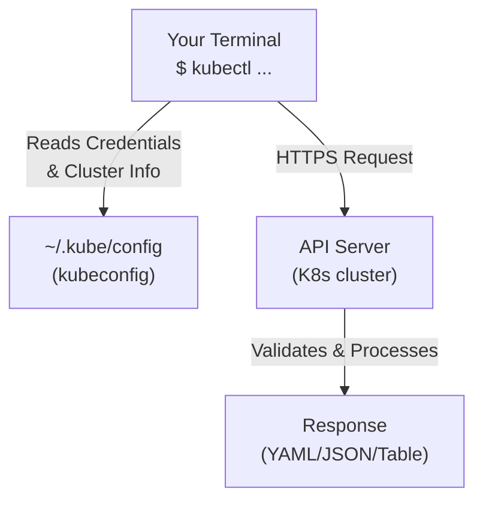

> **Complexity**: `[MEDIUM]` - Essential commands to master
>
> **Time to Complete**: 40-45 minutes
>
> **Prerequisites**: Module 1 (First Cluster running)

---

Imagine a pager going off at 3 AM. Your company's primary checkout service is down, and thousands of dollars are evaporating every minute. You have a terminal and one tool: `kubectl`. If you know exactly how to query the cluster, pull the logs, and find the failing pod, you are the hero. If you are fumbling through documentation trying to remember the flag for namespace filtering, the outage drags on. `kubectl` is not just a CLI tool; it is your central nervous system for communicating with Kubernetes.

## What You'll Be Able to Do

After this module, you will be able to:
- **Navigate** Kubernetes resources using `kubectl get`, `kubectl describe`, and `kubectl explain`
- **Create** resources both imperatively (quick commands) and declaratively (YAML files)
- **Debug** resource issues using `kubectl describe` events and `kubectl logs`
- **Use** output formatting (`-o wide`, `-o yaml`, `-o json`) to get the information you need

---

## Why This Module Matters

kubectl is your primary interface to Kubernetes. Every interaction—creating resources, debugging problems, checking status—goes through kubectl. Mastering it is essential for both daily work and certification exams.

**The "Wrong Context" Outage (A Real War Story)**
In 2019, a prominent FinTech startup (anonymized) experienced a devastating 45-minute outage costing an estimated $120,000 in dropped transactions. The root cause was not a complex network failure or a zero-day exploit. A senior engineer, intending to clean up resources in a staging environment, executed `kubectl delete namespace payments`. Unfortunately, their `kubectl` context was still set to production. Because `kubectl` executes exactly what you tell it against the currently active context without a safety net, the entire production payments routing layer was instantly wiped out. This is why mastering `kubectl` context management, dry-runs, and careful execution is not just about speed—it is about survival.

---

## The kubectl Command Structure

```
kubectl [command] [TYPE] [NAME] [flags]

Examples:
kubectl get pods                   # List all pods
kubectl get pod nginx              # Get specific pod
kubectl get pods -o wide           # More output columns
kubectl describe pod nginx         # Detailed info
kubectl delete pod nginx           # Delete resource
```

> **Stop and think**: If `kubectl get pods` lists pods, what command would you guess lists the nodes that make up your cluster? (Answer: `kubectl get nodes`).

---

## Essential Commands

### Getting Information

```bash
# List resources
kubectl get pods                   # Pods in current namespace
kubectl get pods -A                # Pods in all namespaces
kubectl get pods -n kube-system    # Pods in specific namespace
kubectl get pods -o wide           # More columns (node, IP)
kubectl get pods -o yaml           # Full YAML output
kubectl get pods -o json           # JSON output

# Common resource types
kubectl get nodes                  # Cluster nodes
kubectl get deployments            # Deployments
kubectl get services               # Services
kubectl get all                    # Common resources
kubectl get events                 # Cluster events

# Describe (detailed info)
kubectl describe pod nginx
kubectl describe node kind-control-plane
kubectl describe deployment myapp
```

### Creating Resources

```bash
# From YAML file
kubectl apply -f pod.yaml
kubectl apply -f pod.yaml --server-side             # Use Server-Side Apply
kubectl apply -f .                                  # All YAML files in directory
kubectl apply -f https://example.com/resource.yaml  # From URL

# Imperatively (quick creation)
kubectl run nginx --image=nginx
kubectl create deployment nginx --image=nginx
kubectl expose deployment nginx --port=80

# Generate YAML without creating
kubectl run nginx --image=nginx --dry-run=client -o yaml
kubectl create deployment nginx --image=nginx --dry-run=client -o yaml
```

> **Pause and predict**: What will happen if you run `kubectl apply -f .` in a directory containing both valid Kubernetes YAML files and a plain text `README.md` file? (It will attempt to apply everything, fail with an error on the README, but still successfully apply the valid YAMLs).

### Modifying Resources

```bash
# Apply changes
kubectl apply -f updated-pod.yaml

# Edit live resource
kubectl edit deployment nginx

# Patch resource
kubectl patch deployment nginx -p '{"spec":{"replicas":3}}'

# Scale
kubectl scale deployment nginx --replicas=5

# Set image
kubectl set image deployment/nginx nginx=nginx:1.27.0
```

### Deleting Resources

```bash
# Delete by name
kubectl delete pod nginx
kubectl delete deployment nginx

# Delete from file
kubectl delete -f pod.yaml

# Delete all of a type
kubectl delete pods --all
kubectl delete pods --all -n my-namespace

# Force delete (stuck pods)
kubectl delete pod nginx --force --grace-period=0
```

---

## Output Formats

```bash
# Default (table)
kubectl get pods
# NAME    READY   STATUS    RESTARTS   AGE
# nginx   1/1     Running   0          5m

# Wide (more columns)
kubectl get pods -o wide
# NAME    READY   STATUS    RESTARTS   AGE   IP           NODE
# nginx   1/1     Running   0          5m    10.244.0.5   kind-control-plane

# YAML
kubectl get pod nginx -o yaml

# JSON
kubectl get pod nginx -o json
```

> **Bonus: Power User Syntax** (come back to these after you are comfortable with the basics)
>
> ```bash
> # Custom columns (great for dashboards)
> kubectl get pods -o custom-columns=NAME:.metadata.name,STATUS:.status.phase
>
> # JSONPath (extract specific fields — exam gold!)
> kubectl get pod nginx -o jsonpath='{.status.podIP}'
> kubectl get pods -o jsonpath='{.items[*].metadata.name}'
> ```

---

## Working with Namespaces

```bash
# List namespaces
kubectl get namespaces
kubectl get ns

# Set default namespace
kubectl config set-context --current --namespace=my-namespace

# Create namespace
kubectl create namespace my-namespace

# Run command in specific namespace
kubectl get pods -n kube-system
kubectl get pods --namespace=my-namespace

# All namespaces
kubectl get pods -A
kubectl get pods --all-namespaces
```

---

## Debugging Commands

```bash
# View logs
kubectl logs nginx                  # Current logs
kubectl logs nginx -f               # Follow (stream) logs
kubectl logs nginx --tail=100       # Last 100 lines
kubectl logs nginx -c container1    # Specific container
kubectl logs nginx --previous       # Previous instance logs

# Execute command in container
kubectl exec nginx -- ls /          # Run command
kubectl exec -it nginx -- bash      # Interactive shell
kubectl exec -it nginx -- sh        # If bash not available

# Port forwarding
kubectl port-forward pod/nginx 8080:80
kubectl port-forward svc/nginx 8080:80
# Access at localhost:8080

# Copy files
kubectl cp nginx:/etc/nginx/nginx.conf ./nginx.conf
kubectl cp ./local-file.txt nginx:/tmp/
```

> **Stop and think**: If a pod is failing to start, which command should you run first: `kubectl logs` or `kubectl describe`? (Use `describe` first to check the Events for scheduling or image pull errors, then `logs` if the container actually started but crashed).

---

## Useful Flags

```bash
# Watch (auto-refresh)
kubectl get pods -w
kubectl get pods --watch

# Labels and selectors
kubectl get pods -l app=nginx
kubectl get pods --selector=app=nginx,tier=frontend

# Sort output
kubectl get pods --sort-by=.metadata.creationTimestamp
kubectl get pods --sort-by=.status.startTime

# Field selectors
kubectl get pods --field-selector=status.phase=Running
kubectl get pods --field-selector=spec.nodeName=kind-control-plane

# Show labels
kubectl get pods --show-labels

# Output to file
kubectl get pod nginx -o yaml > pod.yaml
```

---

## Configuration and Context

```bash
# View current config
kubectl config view
kubectl config current-context

# List contexts
kubectl config get-contexts

# Switch context
kubectl config use-context kind-kind
kubectl config use-context my-cluster

# Set default namespace for context
kubectl config set-context --current --namespace=default
```

---

## Visualization: kubectl Flow



---

## Helpful Shortcuts

### Shell Alias (Add to ~/.bashrc or ~/.zshrc)

```bash
alias k='kubectl'
alias kgp='kubectl get pods'
alias kgs='kubectl get services'
alias kgd='kubectl get deployments'
alias kaf='kubectl apply -f'
alias kdel='kubectl delete'
alias klog='kubectl logs'
alias kexec='kubectl exec -it'
```

### kubectl Autocomplete

```bash
# Bash
source <(kubectl completion bash)
echo 'source <(kubectl completion bash)' >> ~/.bashrc

# Zsh
source <(kubectl completion zsh)
echo 'source <(kubectl completion zsh)' >> ~/.zshrc

# With alias
complete -F __start_kubectl k  # Bash
compdef k=kubectl              # Zsh
```

---

## Quick Reference Card

| Action | Command |
|--------|---------|
| List pods | `kubectl get pods` |
| All namespaces | `kubectl get pods -A` |
| Detailed info | `kubectl describe pod NAME` |
| View logs | `kubectl logs NAME` |
| Shell access | `kubectl exec -it NAME -- bash` |
| Port forward | `kubectl port-forward pod/NAME 8080:80` |
| Create from file | `kubectl apply -f file.yaml` |
| Delete | `kubectl delete pod NAME` |
| Generate YAML | `kubectl run NAME --image=IMG --dry-run=client -o yaml` |

---

## Practical Tips from the Trenches

- **kubectl talks to the API server over HTTPS.** All commands are API calls. You could use `curl` instead (but why would you?).

- **`-o yaml` is exam gold.** Get any resource as YAML, modify it, apply it back. Faster than writing from scratch.

- **`--dry-run=client -o yaml` generates templates.** Never memorize YAML structure—generate it.

- **`apply` uses patch semantics.** Unlike `replace`, declarative object configuration via `apply` uses patch operations, which preserves fields set by other controllers or writers.

- **Use Server-Side Apply (`--server-side`)** to shift the merge logic from the `kubectl` client to the API server, which improves conflict resolution and avoids issues when multiple actors manage the same resource.

- **kubectl has built-in help.** `kubectl explain pod.spec.containers` shows field documentation.

---

## Common Mistakes

| Mistake | Solution |
|---------|----------|
| Forgetting namespace | Use `-n namespace` or set default |
| Wrong context | Check with `kubectl config current-context` before executing |
| Typos in resource names | Use tab completion to auto-fill names |
| Not using `-o yaml` for templates | Always generate templates via dry-run, do not memorize them |
| Using `create` instead of `apply` | `apply` is idempotent and handles updates gracefully, prefer it |
| Mixing management techniques | Do not mix imperative (`scale`) and declarative (`apply`) techniques on the same object. This results in undefined behavior. |
| Deleting a pod directly instead of its parent | The ReplicaSet will recreate the pod immediately. Delete the Deployment instead. |
| Overwhelming output from `kubectl get events` | Use `--sort-by='.metadata.creationTimestamp'` to read chronologically |
| Trying to edit immutable fields | Generate YAML, delete the resource, and apply the new YAML instead of `kubectl edit` |

---

## Quiz

1. **You just got paged that the `payment-processor` pod is crash-looping in the `finance` namespace. You need to see the logs from the previous, crashed instance of the container to understand why it died. What command do you run?**
   <details>
   <summary>Answer</summary>
   `kubectl logs payment-processor -n finance --previous`

   *Why?* The `--previous` flag (or `-p`) is critical for debugging CrashLoopBackOff errors. By default, `kubectl logs` only shows the logs of the currently running container. When a container crashes and restarts, the current logs might be empty or only show the startup sequence. Using `--previous` pulls the logs from the dead container just before it exited, revealing the actual exception or error that caused the crash.
   </details>

2. **You are writing a script to monitor the IP addresses of all running pods in the cluster, but you only want the raw IP addresses without headers or extra columns. How do you extract just this specific field?**
   <details>
   <summary>Answer</summary>
   `kubectl get pods -o jsonpath='{.items[*].status.podIP}'`

   *Why?* While `-o wide` shows the IP address, it includes headers and other columns that are hard to parse in a script. `jsonpath` allows you to navigate the JSON structure of the Kubernetes API response and extract exactly the data you need. This is a crucial skill not only for automation and bash scripting but also for passing the CKA/CKAD certification exams where extracting specific data is heavily tested. The JSONPath syntax uses a dialect custom to kubectl, so practicing its specific format is highly recommended.
   </details>

3. **A developer asks you to update a deployment to use a new image tag (`v2.1.0`). They do not have the original YAML file, and you need to do this quickly without risking typos in a manual `kubectl edit` session. What is the safest imperative command?**
   <details>
   <summary>Answer</summary>
   `kubectl set image deployment/myapp myapp=nginx:v2.1.0`

   *Why?* Using `kubectl set image` is safer and faster than `kubectl edit` because it performs a targeted, atomic update to the specific field without opening a text editor. Opening a live resource in vi/nano introduces the risk of accidentally deleting or modifying other lines, which can break the deployment. This imperative command triggers a standard rolling update immediately, ensuring you do not accidentally introduce syntax errors. It is the industry standard approach when you need to quickly roll out a known image tag without going through a full GitOps pipeline.
   </details>

4. **You have created a YAML file `app.yaml` and applied it, but the pod is not behaving correctly and is stuck in a Pending state. You want to see the detailed events associated with this specific pod to understand why. What do you do?**
   <details>
   <summary>Answer</summary>
   `kubectl describe pod <pod-name>`

   *Why?* The `kubectl describe` command aggregates data from multiple API endpoints, most importantly the cluster Events associated with that specific resource. When a pod is stuck in `Pending` or `ImagePullBackOff`, the `get` command will not tell you why. The `describe` command will show you exactly what the scheduler or kubelet is complaining about at the bottom of its output, making it your first stop for troubleshooting. These events include everything from node scheduling decisions to container runtime image pull failures, painting a complete picture of the resource's lifecycle.
   </details>

5. **Your team is moving to a declarative GitOps workflow. You need to create a complex Deployment but want to avoid writing the YAML from scratch to prevent indentation errors. How can you trick `kubectl` into writing the skeleton for you?**
   <details>
   <summary>Answer</summary>
   `kubectl create deployment myapp --image=nginx --dry-run=client -o yaml > myapp.yaml`

   *Why?* The combination of `--dry-run=client` and `-o yaml` is the ultimate cheat code in Kubernetes. It tells the kubectl client to process the command and format the intended API request as YAML, but stops before actually sending the POST request to the API server. By redirecting this output to a file, you get a syntactically perfect, valid template that you can commit to version control and modify later. This technique guarantees that the resulting configuration relies on the exact API group and version your cluster expects.
   </details>

6. **You are investigating a performance issue and need to execute a network diagnostic tool (`curl`) from inside an existing, running pod named `api-backend`. How do you drop into an interactive shell inside that pod?**
   <details>
   <summary>Answer</summary>
   `kubectl exec -it api-backend -- sh`

   *Why?* The `kubectl exec` command works very similarly to `docker exec`, allowing you to spawn a new process inside the namespace of a running container. The `-i` (interactive) and `-t` (tty) flags allocate a terminal session so you can type commands and see the output in real-time. We use `sh` (or `bash`) as the command to run, giving us a fully interactive shell environment to run our diagnostics from the pod's perspective. Remember that the required binaries, like `curl` or `sh`, must actually exist within the container's file system for this command to succeed.
   </details>

7. **You are working on two different clusters: `dev-cluster` and `prod-cluster`. You want to verify which cluster your `kubectl` commands are currently pointing to before you accidentally delete a critical resource. How do you check this?**
   <details>
   <summary>Answer</summary>
   `kubectl config current-context`

   *Why?* Your `~/.kube/config` file can contain connection details for dozens of clusters. The "context" determines which cluster, user, and default namespace `kubectl` will communicate with. Running `current-context` is a crucial safety check that should become muscle memory before running destructive commands, ensuring you do not repeat the classic mistake of applying dev changes to the production environment. A context is essentially a named grouping of a specific cluster, user credential, and default namespace.
   </details>

8. **You notice a pod named `cache-worker` is completely unresponsive and stuck in a `Terminating` state for over 30 minutes. Normal deletion commands just hang. How do you forcefully remove it from the API server?**
   <details>
   <summary>Answer</summary>
   `kubectl delete pod cache-worker --force --grace-period=0`

   *Why?* Sometimes the kubelet on a node loses communication with the API server, or a container runtime gets deadlocked, leaving a pod permanently stuck in `Terminating`. Setting `--grace-period=0` tells Kubernetes not to wait for the container to shut down gracefully. Adding `--force` tells the API server to immediately remove the pod object from its datastore, even if the node has not confirmed the deletion. Use this command with caution, as it can leave orphaned containers running on the node if the kubelet is completely unresponsive.
   </details>

---

## Hands-On Exercise

**Task**: Practice essential kubectl commands.

```bash
# 1. Create a namespace
kubectl create namespace practice

# 2. Run a pod in that namespace
kubectl run nginx --image=nginx -n practice

# 3. List pods in the namespace (wait for it to be ready)
kubectl get pods -n practice
kubectl wait --for=condition=ready pod/nginx -n practice --timeout=60s

# 4. Get detailed info
kubectl describe pod nginx -n practice

# 5. View logs
kubectl logs nginx -n practice

# 6. Execute a command
kubectl exec nginx -n practice -- nginx -v

# 7. Get YAML output
kubectl get pod nginx -n practice -o yaml

# 8. Delete everything
kubectl delete namespace practice
```

**Success criteria**: 
- [ ] You successfully created a new namespace named `practice`.
- [ ] You deployed an `nginx` pod into the `practice` namespace.
- [ ] You verified the pod is running by listing pods in the namespace.
- [ ] You successfully retrieved detailed information using `describe`.
- [ ] You retrieved the logs of the running container.
- [ ] You executed a command inside the container and saw the output.
- [ ] You extracted the pod's YAML definition to your terminal.
- [ ] You cleanly deleted the namespace and all its contents.

---

## Summary

Essential kubectl commands:

**Information**:
- `kubectl get` - List resources
- `kubectl describe` - Detailed info
- `kubectl logs` - Container output

**Creation**:
- `kubectl apply -f` - Create/update from file
- `kubectl run` - Quick pod creation
- `kubectl create` - Create resources

**Modification**:
- `kubectl edit` - Edit live resource
- `kubectl scale` - Change replicas
- `kubectl delete` - Remove resources

**Debugging**:
- `kubectl exec` - Run commands in container
- `kubectl port-forward` - Local access
- `kubectl logs` - View output

---

## Next Module

[Module 1.3: Pods](../module-1.3-pods/) - The atomic unit of Kubernetes.