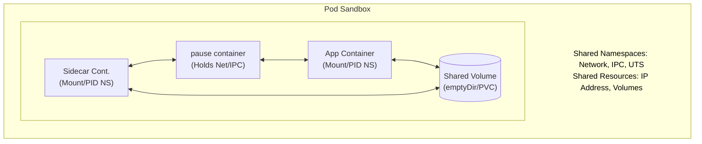
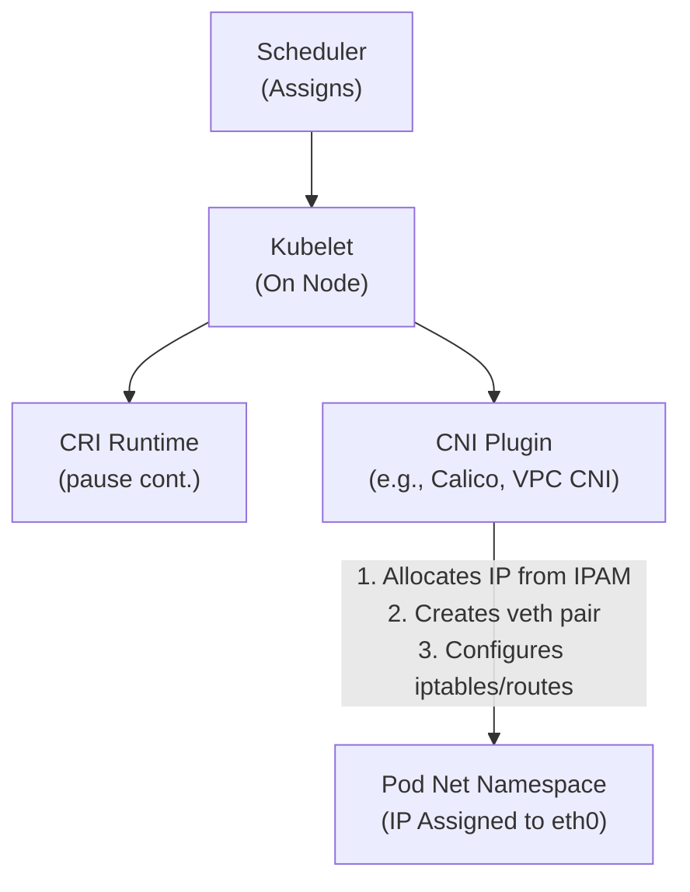
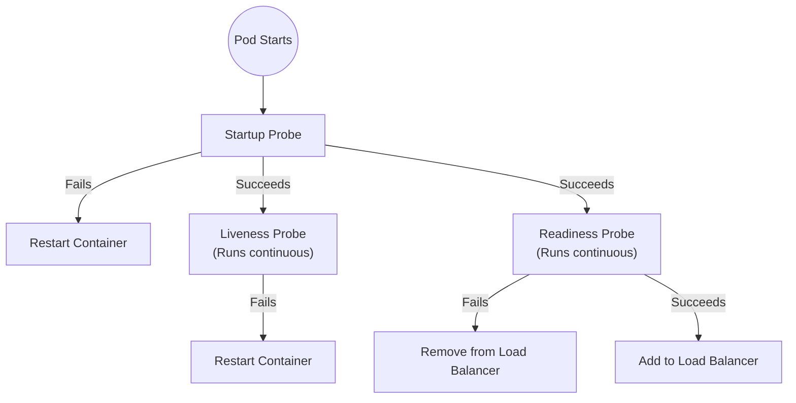
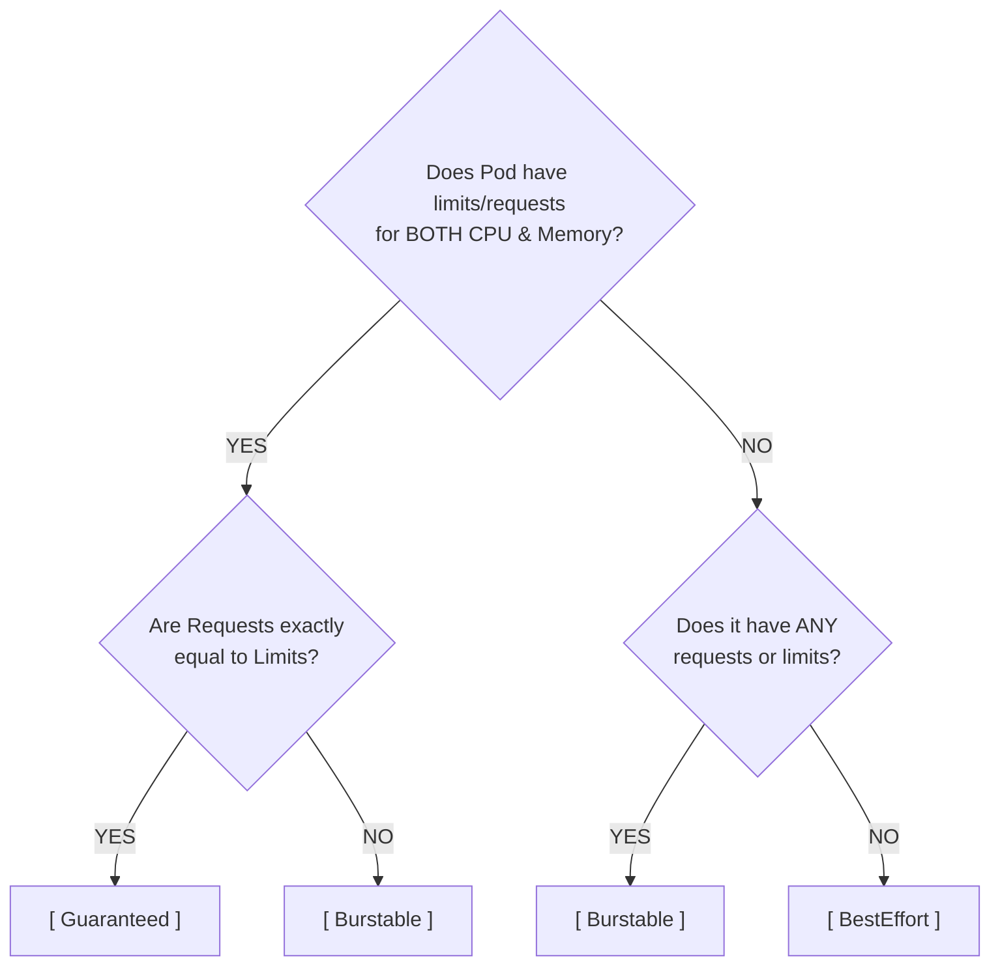

> **Complexity**: [MEDIUM]
>
> **Time to Complete**: 60-75 minutes
>
> **Prerequisites**: Module 1.2 (kubectl Basics; define `alias k=kubectl` before using shorthand)

---

## What You'll Be Able to Do
- Diagnose Pod lifecycle failures, including `Pending`, `ImagePullBackOff`, `CreateContainerConfigError`, `CrashLoopBackOff`, and `OOMKilled`, by combining events, logs, exit codes, and native `k` inspection commands.
- Design multi-container Pods that use sidecar, ambassador, adapter, init container, ephemeral container, shared `emptyDir`, and `localhost` communication patterns without turning the Pod into a small virtual machine.
- Evaluate requests, limits, Quality of Service classes, CFS throttling, OOM killer behavior, taints, tolerations, affinity, and anti-affinity when predicting how Pods schedule and survive resource pressure.
- Implement declarative Pod manifests with labels, annotations, volumes, probes, `securityContext`, service accounts, and Kubernetes 1.35-compatible fields that make runtime behavior explicit and reviewable.
- Compare naked Pods and imperative commands with controller-managed, Git-backed declarative workflows, and justify when a temporary Pod is useful versus when a Deployment or Job is required.

## Why This Module Matters
In late 2021, a scaling e-commerce platform, anonymized here as GlobalTradeX, migrated its inventory system to Kubernetes before a holiday traffic surge. The team had strong application engineers and a reasonable cluster, but they carried a virtual-machine mental model into a scheduler designed around Pods. They packed a web frontend, Java API, cache, worker, log forwarder, metrics exporter, and timed job into one Pod because those processes had once lived together on one server. When the API needed more CPU, the Horizontal Pod Autoscaler could only duplicate the whole Pod, which multiplied every helper process and exhausted node memory. The outage lasted several hours and cost an estimated $2.4 million in missed orders, not because Kubernetes was mysterious, but because the team misunderstood the unit Kubernetes can actually place, restart, scale, and evict.

A Pod is not a miniature server, and it is not a convenient folder for everything that happens to support an application. It is the smallest scheduling and lifecycle unit in Kubernetes: the control plane places the entire Pod on one node, the kubelet starts and watches the containers together, and higher-level controllers replace the Pod rather than repairing it in place. This matters because every design choice flows from that boundary. If two processes must share a local file and loopback network, they may belong together; if they scale, fail, upgrade, or store data independently, putting them in the same Pod creates a hidden coupling that production traffic will eventually expose.

This module turns the Pod from a vocabulary word into an operational model. You will see why Kubernetes wraps containers in a shared sandbox, how the pause container anchors networking, why `Pending` differs from `CrashLoopBackOff`, how probes change traffic routing, and how resource settings influence scheduling and eviction. We will use the shorthand alias `k` for `kubectl`; if your shell does not already define it, run `alias k=kubectl` before practicing the commands. The examples target Kubernetes 1.35 or later and focus on decisions you will make repeatedly: when to use one container, when to add a sidecar, how to write a manifest that survives review, and how to debug a Pod without guessing.

## From Containers to Pods: The Sandbox Boundary
Containerization is built from Linux primitives rather than magic. Namespaces decide what a process can see, and control groups decide what a process can consume. A network namespace gives a process its own interfaces, routing table, and port space; a mount namespace gives it a filesystem view; a PID namespace gives it a process tree; and cgroups account for CPU, memory, and other resource use. Docker made these pieces approachable for developers, but Kubernetes needed a higher-level abstraction because production applications often need a tiny group of tightly coupled processes to share the same placement, IP address, and scratch storage.

The Pod is that abstraction. When the scheduler binds a Pod to a node, the kubelet asks the container runtime to create a Pod sandbox before it starts your application containers. The sandbox owns the shared network, IPC, and UTS namespaces, while each application container keeps its own image and mount namespace. That arrangement lets two containers talk over `localhost` and share an `emptyDir` volume without forcing them to share every binary, library, or filesystem path. It is the same reason two roommates can share a kitchen and front door while keeping separate bedrooms; shared space is useful only when the occupants truly need it.



The pause container is the quiet anchor that makes this model stable. It starts first, claims the Pod's shared namespaces, and then sleeps by calling a small process that does essentially nothing. Your application containers join those namespaces after the sandbox exists. If the app crashes ten times, the Pod IP does not have to disappear ten times, because the pause container still holds the network namespace open. That stability is why Services can keep routing to a Pod while an individual container restarts, and why container restarts are not the same thing as Pod replacement.

Pause and predict: if one container in a Pod binds port 8080 and a second container in the same Pod tries to bind port 8080, what should you expect? The second process fails with an address-in-use error because both containers share the same network namespace and port table. The containers have different filesystems, but the kernel sees only one loopback interface for that Pod. This is a frequent beginner mistake when teams add a metrics exporter, debug proxy, or admin endpoint and forget that ports must be unique across the whole Pod, not merely inside each container stanza.

The Pod model also explains why Kubernetes does not scale containers independently inside the same Pod. A ReplicaSet, Deployment, Job, or StatefulSet creates and replaces whole Pods. If your API container needs ten replicas but its cache helper needs one, those processes should not be in one Pod. Multi-container Pods are for colocated helpers that share fate with the main process: a log tailer reading a local file, a proxy encrypting local traffic, an adapter normalizing metrics, or an init container preparing files before the app starts. The shared fate is the feature and the cost.

That shared-fate rule is also why Pod design belongs early in architecture conversations, not at the end of deployment work. A team might say that a report generator and an API "belong together" because they are released from the same repository, but release origin is not the same as runtime coupling. If the report generator spikes CPU once an hour while the API needs steady low latency, a shared Pod forces the scheduler, probes, and resource limits to treat very different behaviors as one unit. Separating them lets the API scale for traffic and the report worker scale for batch load, even if the source code lives side by side.



Networking adds another layer to the same idea. Kubernetes defines the Container Network Interface contract, but the installed CNI plugin performs the node-level work: allocate an IP address, create a virtual ethernet pair, place one end in the Pod namespace, and program routes, iptables rules, or eBPF maps so other Pods can reach that address. If the CNI plugin is missing or broken on a node, the kubelet cannot finish the sandbox, so the application containers do not safely start. The symptom often looks like `ContainerCreating`, `NetworkPluginNotReady`, or a stream of network setup events rather than an application crash.

Before running a manifest, ask yourself which boundaries the process actually needs. If it needs a separate release cadence, independent scaling, independent failure handling, or a different security profile, make it a separate Pod behind a Service. If it needs local disk sharing, loopback communication, strict startup ordering, or namespace-level troubleshooting next to the main process, a multi-container Pod may be justified. That decision is architectural, not decorative, and it should be visible in code review before the scheduler ever sees the YAML.

## Lifecycle, Conditions, and Health Signals
A Pod has a lifecycle, but the high-level phase is only the first clue. `Pending` means the API server accepted the object but at least one container has not been created; the cause may be unsatisfied scheduling, image pull trouble, missing networking, or container setup delay. `Running` means the Pod is bound to a node and at least one container is running or starting, but it does not guarantee the application is ready for traffic. `Succeeded` and `Failed` describe terminal Pods, usually batch or one-off work, and `Unknown` means the control plane cannot reliably hear from the kubelet.

Conditions provide the detail that phases omit. `PodScheduled` tells you whether the scheduler found a node. `Initialized` tells you whether all init containers completed successfully. `ContainersReady` tells you whether the ordinary containers are ready. `Ready` tells Services and load balancers whether this Pod should receive user requests. A Pod can be `Running` while `Ready` remains false because the process exists but the application has not warmed caches, opened database pools, or passed its readiness endpoint. That distinction is one of the most important operational lessons in Kubernetes.



Probes turn vague health expectations into kubelet decisions. A startup probe protects slow applications by giving them a separate boot window before other probes begin. A liveness probe asks whether the process is so broken that it should be restarted, such as a deadlocked server that still has a PID but no longer handles requests. A readiness probe asks whether the Pod should receive traffic right now, and failure removes the Pod from Service endpoints without restarting the container. Mixing those meanings is a common cause of self-inflicted outages, especially when teams use an aggressive liveness probe for an endpoint that really describes dependency readiness.

Probe timing is simple arithmetic with real consequences. `initialDelaySeconds` controls when checking begins, `periodSeconds` controls how often the kubelet checks, `failureThreshold` controls how many failures trigger action, and `successThreshold` controls how many successful readiness checks are needed after failure. If a Java service usually takes 70 seconds to load but the liveness probe begins at 20 seconds and fails after three quick checks, Kubernetes will kill the app before it has a fair chance to start. The fix is not to remove health checks; the fix is to model startup, liveness, and readiness as different questions.

The kubelet enforces this lifecycle through a sync loop. It watches the Pod objects assigned to the node, asks the container runtime about actual containers, and reconciles differences. Internally, the Pod Lifecycle Event Generator helps the kubelet react to container changes without relying on expensive constant polling. If the runtime reports that a container exited, the kubelet records the state, evaluates the Pod's restart policy, and starts the next attempt when appropriate. When a node logs that PLEG is unhealthy, the node may stop reporting accurate container state, so Pods can appear stale even though the control plane itself is still alive.

Pause and predict: a web Pod is `Running`, its liveness probe succeeds, and its readiness probe fails for two minutes during a database migration. Should the kubelet restart the container? It should not restart the container solely because readiness fails. Instead, the Pod should be removed from Service endpoints until the readiness probe passes again. This lets rolling updates and dependency disruptions drain traffic without turning a temporary dependency problem into a restart storm.

Lifecycle also clarifies why naked Pods are fragile. When a node dies, the Pod object may remain visible for a while, but the processes on that node are gone. A Deployment, StatefulSet, DaemonSet, or Job is the controller that creates replacement Pods; the Pod itself does not travel to a new node like a live virtual machine. For temporary experiments, a naked Pod is useful because it is easy to inspect. For an application that must recover, the absence of a controller is a design defect.

## Writing Declarative Pod Manifests
Declarative manifests are the operational contract between your team and the cluster. An imperative command says, "do this now," which is excellent for learning, probing, or generating a draft. A YAML manifest says, "this is the desired state," which can be reviewed, versioned, rolled back, audited, and reapplied. In production, the difference matters because the cluster will recreate Pods after failures, and it can only recreate what your source of truth describes. If a manual command changed a live Pod but Git never changed, the next replacement returns to the old behavior.

The core Pod shape has four top-level parts: `apiVersion`, `kind`, `metadata`, and `spec`. Metadata names and labels the object so controllers, Services, metrics systems, and humans can select it. The spec describes the containers, volumes, security posture, resource constraints, node placement, service account, probes, and restart behavior. Treat the spec as a review document, not just a blob of YAML. A reviewer should be able to answer where the Pod may run, what identity it uses, how it proves readiness, how much memory it can consume, and what happens if it fails.

```yaml
apiVersion: v1
kind: Pod
metadata:
  name: financial-processor-pod
  namespace: payments-prod
  labels:
    app: payment-gateway
    environment: production
    tier: backend
    security-zone: pci-dss
  annotations:
    prometheus.io/scrape: "true"
    prometheus.io/port: "8443"
spec:
  restartPolicy: Always
  serviceAccountName: processor-vault-accessor
  priorityClassName: mission-critical-high
  nodeSelector:
    disk-type: nvme-ssd
    compliance: pci-dss-certified
  tolerations:
    - key: "dedicated"
      operator: "Equal"
      value: "payments"
      effect: "NoSchedule"
  affinity:
    podAntiAffinity:
      requiredDuringSchedulingIgnoredDuringExecution:
      - labelSelector:
          matchExpressions:
          - key: app
            operator: In
            values:
            - payment-gateway
        topologyKey: "kubernetes.io/hostname"
  volumes:
    - name: tmp-scratch-data
      emptyDir:
        sizeLimit: 1Gi
  initContainers:
    - name: vault-bootstrap
      image: hashicorp/vault-agent:1.16
      command: ["/bin/sh", "-c", "vault pull-secrets > /shared/secrets.env"]
      volumeMounts:
        - name: tmp-scratch-data
          mountPath: /shared
  containers:
    - name: main-processor
      image: registry.example.com/payment-processor:v2.4.1
      imagePullPolicy: IfNotPresent
      command: ["/app/start-processor.sh"]
      ports:
        - containerPort: 8443
          name: https-metrics
          protocol: TCP
      securityContext:
        runAsUser: 1000
        runAsGroup: 3000
        runAsNonRoot: true
        readOnlyRootFilesystem: true
        allowPrivilegeEscalation: false
        capabilities:
          drop:
            - ALL
      volumeMounts:
        - name: tmp-scratch-data
          mountPath: /var/scratch
      livenessProbe:
        httpGet:
          path: /health/live
          port: 8443
        initialDelaySeconds: 30
        periodSeconds: 15
        failureThreshold: 3
      readinessProbe:
        httpGet:
          path: /health/ready
          port: 8443
        initialDelaySeconds: 15
        periodSeconds: 10
        successThreshold: 2
      resources:
        requests:
          cpu: "500m"
          memory: "256Mi"
        limits:
          cpu: "1000m"
          memory: "512Mi"
```

This example is intentionally rich because production Pods usually encode more than an image name. Labels such as `app`, `tier`, and `security-zone` give Services, NetworkPolicies, metrics, and policy engines a stable way to select the Pod. Annotations provide non-identifying hints for tools, such as a Prometheus scraper. The service account gives the Pod an identity, which is much safer than baking static cloud credentials into an image. The `securityContext` forces least privilege, and the probes separate boot, health, and traffic readiness from whether the Linux process exists.

Volumes also express runtime intent. An `emptyDir` is created when the Pod lands on a node and disappears when the Pod leaves that node, so it is useful for scratch space and container-to-container handoff. A `hostPath` mounts a node path into the Pod and should be treated as privileged access because it ties the Pod to node internals. A PersistentVolumeClaim is the normal path for durable data, because the storage object outlives the Pod and can be reattached according to the storage class rules. The manifest should make those durability choices obvious rather than hiding them inside application code.

Before running this, what output do you expect from a dry review of the manifest? A scheduler will only consider nodes matching the `nodeSelector`, permitted by the toleration, and compatible with the anti-affinity rule. The init container must complete before the main container starts, and the main container will refuse to run as root. Once the process starts, readiness controls traffic and liveness controls restarts. If you cannot describe those consequences from the YAML, the manifest is not yet reviewable enough for production.

Imperative commands still have a place when used deliberately. For a quick connectivity test, `k run` can create a disposable Pod, and `--dry-run=client -o yaml` can help you draft a manifest. The danger appears when an emergency manual change becomes the only record of truth. A news organization once fixed a cache image during a live event with a direct command and restored service, but the change never reached Git. When a node failed later, the replacement Pod came from the old manifest and reintroduced the bug. The rule is blunt because incidents are blunt: if the desired state is not in version control, the cluster cannot be trusted to preserve it.

## Scheduling, Resources, and Quality of Service
Scheduling is a constraint-solving problem. The scheduler does not place a Pod on a node because the image looks small or because the cluster has total free capacity somewhere. It evaluates the Pod's requested resources, placement rules, taints, tolerations, affinity, anti-affinity, and current node allocations. A Pod requesting more memory than any single node can provide will stay `Pending` even if the cluster has plenty of memory in aggregate. This is why requests are not documentation; they are part of the scheduling equation.

Requests are guarantees used for placement, while limits are enforcement boundaries applied by the kernel. A CPU request reserves scheduling capacity and influences fair sharing under contention. A CPU limit can cause throttling through the Completely Fair Scheduler when a container tries to use more than its quota; the process slows down but usually does not die. A memory limit is harsher. When the process exceeds the cgroup memory ceiling, the Linux OOM killer can terminate it, and Kubernetes records the familiar `OOMKilled` reason with exit code 137. Latency problems often come from CPU throttling, while sudden restarts without application logs often point toward memory pressure.



Quality of Service classes summarize how completely resources are specified. A `Guaranteed` Pod sets CPU and memory requests equal to limits for every container, making it the last class Kubernetes prefers to evict during node pressure. A `Burstable` Pod has some requests or has requests lower than limits, so it can use spare capacity but may be evicted before Guaranteed workloads if it exceeds its request. A `BestEffort` Pod has no requests or limits and is easiest to evict when the node needs protection. The class does not replace good sizing, but it helps you predict survival during resource starvation.

Placement rules shape where the scheduler may solve the resource problem. A taint repels ordinary Pods from a node, and a toleration lets selected Pods accept that taint, which is useful for dedicated hardware or isolation zones. Node affinity attracts Pods to nodes with labels such as storage type, region, or compliance boundary. Pod anti-affinity spreads replicas away from each other so a single node failure does not remove every copy of a service. Pod affinity colocates related Pods when locality matters, although colocating independent services can create shared failure risk if overused.

| Feature | Target | Action | Use Case |
|---|---|---|---|
| Taints & Tolerations | Nodes (Taint), Pods (Tolerate) | Repels pods from nodes | Dedicate nodes to specific workloads (e.g., GPUs) |
| Node Affinity | Pods | Attracts pods to specific nodes | Ensure pods run in specific zones or on specific hardware |
| Pod Affinity | Pods | Attracts pods to other pods | Co-locate tightly coupled services to reduce latency |
| Pod Anti-Affinity | Pods | Repels pods from other pods | Spread replicas across hosts/zones for high availability |

The practical workflow is to start with resource requests that match observed baseline usage, then set memory limits carefully enough to protect the node without creating predictable OOM kills. CPU limits deserve extra caution on latency-sensitive services because throttling can look like random slowness even when the Pod never restarts. For placement, prefer simple labels and anti-affinity for availability, then add taints or hard node affinity only when you have a clear isolation or hardware requirement. Strong constraints improve control but reduce scheduling flexibility, so every hard rule should have a reason a reviewer can defend.

Resource decisions also affect neighbors that your team may never meet. In a shared cluster, an oversized request can strand capacity by reserving space the process rarely uses, while a missing request can make the scheduler overpack a node and invite eviction pressure later. Limits have their own failure modes: a limit that is too low creates predictable restarts, but no limit allows a runaway process to threaten unrelated workloads on the same node. The point is not to find perfect numbers on the first day. The point is to start with honest estimates, observe real usage, and treat resource changes as part of application tuning rather than as a one-time platform chore.

Which approach would you choose here and why: a payment API with three replicas must survive a node failure, while a fraud-scoring model needs GPU nodes and has one replica during a test? The payment API should use anti-affinity or topology spread through a controller so replicas do not pile onto one host. The model should tolerate a GPU taint and request the appropriate accelerator resources, accepting that scheduling may be slower because eligible nodes are scarce. Both are Pods, but the scheduling intent is different, and the manifest should make that difference explicit.

## Multi-Container Patterns, Storage, and Security
Most Pods contain one application container, and that is healthy. A single-container Pod is simple to scale, simple to reason about, and easy for controllers to replace. Multi-container Pods become valuable only when two processes need shared fate and node-local collaboration. The sidecar pattern augments an application without changing it, such as tailing a legacy log file from a shared `emptyDir` and writing it to stdout. The ambassador pattern proxies local traffic, often to add TLS, connection pooling, or policy. The adapter pattern translates application-specific output into a standard format that the platform already understands.

Init containers solve a different problem: finite setup that must finish before the app starts. They run sequentially, and each must exit successfully before the next init container or main container begins. This is appropriate for preparing a schema, downloading a model file, waiting for a dependency contract, or rendering configuration into a shared volume. It is not appropriate for continuous polling, background synchronization, or log forwarding, because an init container that never exits blocks the main application forever. Kubernetes 1.35 also supports native sidecar-style behavior through init container semantics, but the design question remains whether the helper should run before, beside, or outside the main app.

Ephemeral containers are for live debugging rather than steady architecture. They let an operator attach a temporary debugging image to an existing Pod, which is especially useful when the production image is distroless and intentionally lacks a shell. Because the debug container can join the Pod's namespaces, it can inspect network behavior next to the app without rebuilding the app image. That power should be controlled through RBAC and audit logs, because the ability to attach debugging tools to production Pods can expose sensitive runtime information if granted casually.

Security context settings turn least privilege into runtime policy. `runAsNonRoot` blocks images that try to start as UID 0, `allowPrivilegeEscalation: false` prevents child processes from gaining more privilege than their parent, `readOnlyRootFilesystem` makes the image layer immutable at runtime, and dropping Linux capabilities removes kernel privileges that most web applications never need. These settings can break poorly prepared images, which is a feature during review rather than a nuisance during an incident. If an app needs scratch space with a read-only root filesystem, mount an `emptyDir` at `/tmp` or another explicit path instead of leaving the whole image writable.

Storage choices should match data meaning. Files written directly to a container filesystem are disposable because a restarted container gets a fresh writable layer. `emptyDir` keeps data for the lifetime of the Pod on the node, so it is excellent for shared logs, generated static content, temporary model downloads, or handoff between init and main containers. `hostPath` reaches into the node and should be limited to privileged infrastructure agents with a clear reason. PersistentVolumeClaims are for data that must outlive Pod replacement, such as database files, but stateful workloads also need higher-level controllers and storage-aware rollout plans.

A useful mental test is whether deleting the Pod should delete the data or only stop the process. If deleting the Pod should delete the data, an `emptyDir` may be correct. If deleting the Pod must not delete the data, use a persistent volume and design recovery deliberately. If the Pod needs node internals, pause and ask whether you are building a node agent, a security exception, or an accidental privilege escalation. The storage stanza is not just plumbing; it is a durability and trust statement.

## Diagnosing Pod Failures Without Guessing
Debugging Pods is easier when you follow the lifecycle instead of jumping straight to logs. If the Pod is `Pending`, the application may never have started, so logs are often irrelevant. Start with `k describe pod <pod-name>` and read the Events section from bottom to top. Events such as insufficient CPU, untolerated taints, node affinity mismatch, or volume attach failure point to scheduling and setup. Events such as `ErrImagePull` or `ImagePullBackOff` point to registry access, wrong image names, missing tags, or private registry authentication. The kubelet is telling you which step failed; your job is to look at the step that actually ran.

`CreateContainerConfigError` usually means the kubelet cannot assemble the container configuration from the Pod spec. A missing ConfigMap key, missing Secret, invalid environment reference, or impossible security setting can block startup even after the image pulls successfully. `CreateContainerError` means the runtime encountered a lower-level creation problem, such as a bad command, missing executable, mount failure, or permission issue. In both cases, the container may not have produced application logs because the process did not reach normal execution. Events and state blocks are more useful than staring at an empty log stream.

`CrashLoopBackOff` means the container did start and then exited repeatedly. Kubernetes restarts it according to policy, but backs off to avoid burning node CPU on a process that immediately fails. Here, logs are usually the primary signal, and the `--previous` flag matters because the current container instance may be new and empty. Use `k logs <pod-name> --previous` when the last crashed instance printed the useful stack trace, failed database connection, syntax error, or missing file message just before exiting. If there are multiple containers, add `-c <container-name>` so you are reading the right process.

`OOMKilled` is different because the application may not have a chance to print anything. The kernel terminates the process after it exceeds its memory cgroup limit, and Kubernetes records `Reason: OOMKilled` with exit code 137 in the container's last state. The short-term fix may be increasing the memory limit, but the durable fix is to compare actual memory growth, request sizing, limit sizing, and application behavior. A memory leak hidden behind repeated restarts can look like a flaky cluster until you connect restart count, last state, and metrics.

Interactive tools are useful after you know what layer you are investigating. `k exec -it <pod-name> -- /bin/sh` drops into a running container if the image includes a shell, which lets you inspect mounted files, environment variables, DNS, and local network behavior. `k port-forward pod/<pod-name> 8080:80` tunnels traffic through the API server to the Pod, which is helpful before you create a Service or Ingress. Ephemeral containers help when the image lacks a shell, but they should support diagnosis, not become a substitute for fixing the manifest or image.

The debugging order is simple enough to memorize. First, identify the phase and conditions with `k get pod` and `k describe`. Second, read Events for scheduling, image, network, volume, and configuration failures. Third, read logs, using `--previous` for repeated crashes and `-c` for multi-container Pods. Fourth, inspect resource state for OOM kills and throttling. Fifth, use exec, port-forward, or ephemeral containers to test what the process can see from inside the namespace. Skipping the first two steps is how teams waste an hour debugging application code that never started.

A good incident note records the same sequence because it separates evidence from guesses. Instead of writing "Kubernetes killed the app," record that the Pod was scheduled to a specific node, the container previously terminated with exit code 137, memory usage rose above the configured limit, and the kubelet restarted the container according to policy. Instead of writing "networking is broken," record that the Pod remained in `ContainerCreating`, the Events stream showed CNI setup failure, and no application container had started. These details matter during review because they point to different owners, different fixes, and different prevention work.

The same discipline helps when several symptoms appear together. A Pod can have an image pull warning from an older attempt, a readiness failure from the current instance, and a restart count from a previous crash. Events are chronological, container state is per container, and logs are per container instance. Reading them as one flat error message creates false conclusions. During an outage, name the container, the attempt, the timestamp, and the lifecycle step before proposing a fix. That habit makes your diagnosis slower for the first minute and much faster for the next thirty.

## Patterns & Anti-Patterns
Use a single application container per Pod when the process can scale, fail, and deploy independently. This is the default pattern because it keeps controller behavior clean and lets Services route to one application boundary. Use a sidecar when a helper must share a local volume or loopback interface with the main process and should be replaced whenever the main Pod is replaced. Use an init container when setup must finish before the application starts, and keep the init image separate if it needs tools you do not want in the production runtime image.

Use declarative manifests for anything that should be repeatable. A manifest reviewed in Git captures labels, probes, resources, security context, volumes, and placement rules in one place. Use naked imperative Pods for temporary experiments, connectivity tests, or quick reproductions, then delete them. Use controllers for durable workloads because controllers create replacement Pods when nodes fail, roll out new versions, and maintain replica counts. A Pod is the thing being managed; it is not usually the manager.

The strongest anti-pattern is the "server in a Pod" design, where teams place unrelated processes together because they once shared a host. It feels familiar but destroys independent scaling and failure isolation. Another anti-pattern is the probe-as-hammer design, where every health endpoint becomes a liveness probe and temporary dependency failures trigger restarts. A third anti-pattern is resource optimism, where teams omit requests and limits until a shared node becomes unstable. These mistakes share one cause: treating the Pod spec as a deployment afterthought rather than the operating contract.

When a multi-container Pod is justified, keep the relationship narrow and documented. The helper should have a clear reason to share the Pod sandbox, and its failure mode should make sense alongside the main container. A log sidecar dying may mean observability is broken even if the app still serves traffic; a proxy sidecar dying may make the app effectively unavailable; an adapter failing may break scraping but not user traffic. The Pod can express these differences only if probes, resources, and container responsibilities are configured intentionally.

## Decision Framework
Start with the question, "What is the smallest unit that should be scheduled and replaced together?" If the answer is one process, use one container in one Pod and put replication, rollout, and recovery in a controller. If a helper must share `localhost` or an `emptyDir` with the main process, consider a sidecar or adapter. If a task must complete before the main process starts, use an init container. If the work is a finite batch task, use a Job rather than a long-running Pod. If the workload needs stable identity and durable storage across replacements, study StatefulSets after you understand basic controllers.

Next, ask, "What must be true before this Pod receives traffic?" Put startup assumptions into startup probes, serving assumptions into readiness probes, and deadlock recovery into liveness probes. Then ask, "What can this Pod consume without harming the node?" Put baseline needs into requests and hard safety boundaries into limits, remembering that CPU limits throttle and memory limits can kill. Finally, ask, "Where is this Pod allowed to run?" Use labels and soft preferences first, then hard affinity, taints, and tolerations when hardware, compliance, or isolation requires them.

The decision is rarely about a single field. A secure payment Pod may need a service account, non-root user, read-only root filesystem, memory limit, readiness probe, anti-affinity, and a controller above it. A disposable network test Pod may need only an image, a command, and a fast deletion path. Both are valid when their manifests match their purpose. The danger is using the disposable shape for a production service or using the production shape as a cargo-cult template without understanding the tradeoffs.

When you are unsure, write down the recovery story in one paragraph before choosing the object. If a node disappears, who creates the replacement Pod and what state must move with it? If a rollout fails, what signal stops traffic and what signal triggers rollback? If the process leaks memory, will the node survive and will the evidence remain visible long enough to debug? These questions often reveal whether you are missing a controller, a probe, a resource boundary, or durable storage. The right Pod spec is the one whose failure behavior you can explain before the failure happens.

## Did You Know?
1. Kubernetes introduced Pods in 2014 as a deliberate abstraction above individual containers, reflecting lessons from Google's earlier large-scale container orchestration systems.
2. The pause container is tiny because its job is only to hold shared namespaces open, which makes Pod networking stable while ordinary containers restart.
3. Native sidecar container behavior reached stable status in recent Kubernetes releases, including the Kubernetes 1.35 era targeted by this curriculum, after years of teams modeling long-running helpers with ordinary containers.
4. Exit code 137 is conventionally 128 plus signal 9, which is why it strongly suggests a SIGKILL event such as the kernel OOM killer terminating a container.

## Common Mistakes

| Mistake | Why It Happens | How to Fix It |
| :--- | :--- | :--- |
| **Treating Pods exactly like physical VMs** | Misunderstanding the shared lifecycle. Placing a web frontend, backend API, and a database inside one single Pod. | Break disparate, independently scalable applications into separate single-container Pods unless they are physically coupled and share local disk space. |
| **Deploying naked, unmanaged Pods in production** | Falsely believing Pods are inherently resilient. They are ephemeral and will not be resurrected if a physical node dies. | Always wrap Pods in higher-level, resilient controllers like Deployments, DaemonSets, or StatefulSets to ensure high availability. |
| **Forgetting Resource Requests and Limits entirely** | Laziness, rushing features to production, or a lack of application performance profiling. | Always strictly define memory and CPU limits. Without limits, a single severe memory leak in one rogue Pod can crash the entire multi-tenant worker node. |
| **Misunderstanding `localhost` in multi-container Pods** | Forgetting that all containers inside a Pod strictly share the exact same network namespace, routing table, and IP address. | Use distinct, different ports for each individual container within the Pod to completely avoid `Address already in use` OS-level bind errors. |
| **Using `latest` Docker image tags** | Developer convenience during local development dangerously leaking into production manifests. | Always pin images to specific SHAs or immutable version tags (e.g., `v2.1.4`) to prevent unpredictable rollouts and `ImagePullBackOff` disasters. |
| **Using `exec` to manually fix live production problems** | Treating ephemeral containers like mutable Linux servers. Manual changes are lost instantly the very moment the Pod restarts. | Pods are strictly immutable. Fix the configuration centrally in Git or the Dockerfile, build a brand new image, and redeploy it declaratively via CI/CD. |
| **Overusing Init Containers for continuous polling tasks** | Misunderstanding that Init Containers must completely exit (code 0) before the main app can begin to start booting. | Use background sidecar containers for continuous polling tasks; strictly reserve Init Containers only for finite, pre-flight, boot-time setup scripts. |
| **Ignoring Liveness and Readiness Probes completely** | Assuming the underlying framework will handle health naturally, or simple oversight. | Unmonitored pods will receive live traffic before they finish booting, causing massive 502 errors and dropping critical production requests. |

## Quiz

<details>
<summary>1. Scenario: Your team deploys a Pod that stays `Pending` for 20 minutes. `k describe pod api` shows insufficient CPU and a node affinity mismatch. What layer failed, and what should you change first?</summary>

**Answer:** The failure is at scheduling time, not inside the application container. The scheduler cannot find a node that satisfies both the requested CPU and the placement rule, so logs will not help because the container may never have started. First review whether the CPU request reflects measured need and whether the hard affinity is truly required. If both are correct, add suitable node capacity or adjust node labels so the scheduler has a valid target.
</details>

<details>
<summary>2. Scenario: A legacy application writes audit logs only to `/var/log/app.log`, but the platform collects stdout. How should you design the Pod without changing the application code?</summary>

**Answer:** Use a sidecar pattern with a shared `emptyDir` volume. The legacy container writes the file into the shared mount, while the sidecar tails that file and writes each line to its own stdout. This design is appropriate because the helper needs local file sharing and should be replaced with the main application. It would be overkill to create a separate Service for a process whose only job is local log translation.
</details>

<details>
<summary>3. Scenario: A Pod is `Running`, but users still receive errors during rollout because the application needs time to build caches and open database pools. Which probe should control traffic, and why?</summary>

**Answer:** A readiness probe should control whether the Pod receives traffic. The process can be alive while still unable to serve correctly, and readiness failure removes the Pod from Service endpoints without restarting it. A liveness probe would be too aggressive for this dependency and could cause restart loops during normal warmup. If boot itself is slow, pair readiness with a startup probe so liveness checks do not begin too early.
</details>

<details>
<summary>4. Scenario: A container restarts repeatedly with no useful application logs. The last state shows `Reason: OOMKilled` and `Exit Code: 137`. What happened, and how do requests and limits influence the fix?</summary>

**Answer:** The process exceeded its memory cgroup limit and the kernel killed it with SIGKILL, which Kubernetes recorded as exit code 137. Raising the memory limit may stop the immediate restarts, but it should be based on observed memory behavior rather than guesswork. The memory request affects scheduling capacity, while the memory limit defines the hard ceiling. A good fix reviews the application memory pattern, adjusts request and limit values, and checks for a leak.
</details>

<details>
<summary>5. Scenario: A security review rejects a Pod because the image starts as root and has a writable filesystem. What manifest fields reduce the risk, and what side effect should you plan for?</summary>

**Answer:** Add a `securityContext` that sets `runAsNonRoot: true`, disables privilege escalation, drops unnecessary capabilities, and makes the root filesystem read-only. These settings reduce the blast radius if the application is compromised because the process has fewer kernel privileges and cannot freely write into the image layer. The side effect is that applications needing scratch space must receive an explicit writable volume such as `emptyDir` mounted at `/tmp` or another known path. The image may also need a non-root user configured before the Pod can start.
</details>

<details>
<summary>6. Scenario: Two containers in one Pod need to communicate. One serves HTTP on port 80, and the other scrapes it every few seconds. What address should the scraper use, and what mistake must it avoid?</summary>

**Answer:** The scraper can use `http://localhost:80` because containers in the same Pod share the network namespace. That shared namespace is provided by the Pod sandbox, so loopback traffic stays inside the Pod and does not require a Service. The mistake to avoid is binding the scraper itself to the same port, because port numbers are unique across the whole Pod. If both containers need listeners, assign distinct ports.
</details>

<details>
<summary>7. Scenario: An engineer hotfixes a naked Pod with an imperative command during an incident, but the change never reaches Git. A node failure happens later. What should you expect, and what workflow prevents it?</summary>

**Answer:** The original naked Pod will not be recreated by itself when the node is lost, and any replacement created from old manifests will lose the manual hotfix. Imperative state is temporary unless it is captured in the declarative source of truth. The correct workflow is to update the manifest, review it, apply it through the normal delivery path, and let a controller manage replacement Pods. Temporary imperative commands are acceptable for diagnosis, but they should not become production configuration.
</details>

## Hands-On Exercise: The Ultimate Multi-Container Debugging Challenge

In this hands-on exercise, you will create a multi-container Pod, inspect its shared namespace behavior, trigger an intentional memory failure, and practice the diagnostic sequence used during real incidents. Work in a disposable namespace or local training cluster, and keep using the `k` alias so your commands match the rest of the Kubernetes basics track.

<details>
<summary>Task 1: Declarative Multi-Container Creation</summary>

Write a declarative YAML manifest named `multi-pod.yaml` that creates a single Pod containing two communicating containers. The Pod name should be `web-logger`. The first container should be named `nginx-server`, use the `nginx:1.27-alpine` public image, and mount a shared volume named `html-dir` at `/usr/share/nginx/html`. The second container should be named `content-writer`, use the `busybox:1.36.1` public image, mount the same volume at `/data`, and continuously write the current date to `/data/index.html` every 5 seconds. The shared volume must be an `emptyDir`.

**Solution:**
```yaml
apiVersion: v1
kind: Pod
metadata:
  name: web-logger
spec:
  volumes:
    - name: html-dir
      emptyDir: {}
  containers:
    - name: nginx-server
      image: nginx:1.27-alpine
      volumeMounts:
        - name: html-dir
          mountPath: /usr/share/nginx/html
    - name: content-writer
      image: busybox:1.36.1
      command: ["/bin/sh", "-c", "while true; do date > /data/index.html; sleep 5; done"]
      volumeMounts:
        - name: html-dir
          mountPath: /data
```
</details>

<details>
<summary>Task 2: Apply and Verify the Architecture</summary>

Apply the declarative manifest to your local cluster. Verify that the Pod transitions through `Pending` into `Running`, confirm both containers become ready, and then use port-forwarding to view the generated page through the API server tunnel.

**Solution:**
```bash
# Apply the declarative manifest to the API Server
k apply -f multi-pod.yaml

# Wait for the pod to become fully ready
k wait --for=condition=Ready pod/web-logger --timeout=60s
```

Open a new terminal window, or background the port-forward process to test it:

```bash
# Establish a secure port-forward tunnel to the Pod in the background
k port-forward pod/web-logger 8080:80 &

# Wait a moment for the tunnel to establish
sleep 2

# Curl the local port to verify
curl http://localhost:8080
# You should see the current date and time printed, updating every 5 seconds.

# Terminate the background port-forward process
kill %1
```
</details>

<details>
<summary>Task 3: Interactive Namespace Exploration</summary>

The `content-writer` container continuously overwrites the physical file on the shared volume. Use `k exec` to open an interactive shell inside the `nginx-server` container. Once inside, install `curl` and make a local HTTP request to `localhost:80`. Explain why this works across container boundaries.

**Solution:**
```bash
# Execute an interactive shell inside the specific container
k exec -it web-logger -c nginx-server -- /bin/sh
```

Once inside the container's interactive shell, execute the following:

```bash
# Inside the container's isolated mount namespace, install curl
apk add --no-cache curl

# Curl the local network interface shared by the Pod
curl http://localhost:80

# Exit the container gracefully
exit
```
Even though you entered the `nginx-server` container's filesystem namespace, Nginx listens on port 80 of the Pod's shared network namespace. The loopback interface is shared by all containers in the Pod, while the mounted volume lets one container write the file another container serves.
</details>

<details>
<summary>Task 4: Intentionally Triggering an OOMKilled Event</summary>

Create a new file named `oom-pod.yaml`. Define a Pod that runs the `polinux/stress` image, give it a strict memory limit of `50Mi`, and set the command to allocate more memory than the cgroup permits. Apply the file and watch its lifecycle status.

**Solution:**
```yaml
# oom-pod.yaml
apiVersion: v1
kind: Pod
metadata:
  name: memory-hog
spec:
  containers:
    - name: stress-test
      image: polinux/stress:1.0.4
      command: ["stress", "--vm", "1", "--vm-bytes", "150M", "--vm-hang", "1"]
      resources:
        limits:
          memory: "50Mi"
```
```bash
# Apply the doomed pod to the cluster
k apply -f oom-pod.yaml

# Watch the failure unfold after the process asks for too much memory
sleep 5
k get pod memory-hog
```
You should briefly see the Pod run and then observe a restart cycle. The process asks the kernel for substantially more memory than the configured cgroup permits, so the kernel terminates it to protect the node.
</details>

<details>
<summary>Task 5: Forensically Diagnosing the Death</summary>

Use `k describe` to prove why the `memory-hog` Pod died. Find the exact reason and exit code in the container's last state, and connect that result back to the memory limit in the manifest.

**Solution:**
```bash
# Extract the forensic log of the dead pod
k describe pod memory-hog
```
Scroll to the `Containers:` section, locate the `stress-test` container, and inspect the `Last State:` block. The important evidence is `Reason: OOMKilled` alongside `Exit Code: 137`, which shows that the kernel killed the process after it exceeded the configured memory limit.
</details>

<details>
<summary>Task 6: Systematic Clean Up</summary>

Cleanly delete both Pods created during this exercise to free cluster resources and leave the training environment ready for the next module.

**Solution:**
```bash
# Delete the pods, returning the cluster to a clean state
k delete pod web-logger memory-hog --force --grace-period=0
```
</details>

Success criteria:
- [ ] You created a declarative multi-container Pod that uses a shared `emptyDir` volume.
- [ ] You verified both containers became ready and served changing content through `localhost` and port-forwarding.
- [ ] You explained why Pod containers can share loopback networking while keeping separate filesystems.
- [ ] You triggered and diagnosed an `OOMKilled` restart using `k describe` and exit code 137.
- [ ] You cleaned up both disposable Pods without leaving training resources behind.

## Sources
- [Kubernetes Pods](https://kubernetes.io/docs/concepts/workloads/pods/)
- [Pod Lifecycle](https://kubernetes.io/docs/concepts/workloads/pods/pod-lifecycle/)
- [Init Containers](https://kubernetes.io/docs/concepts/workloads/pods/init-containers/)
- [Sidecar Containers](https://kubernetes.io/docs/concepts/workloads/pods/sidecar-containers/)
- [Ephemeral Containers](https://kubernetes.io/docs/concepts/workloads/pods/ephemeral-containers/)
- [Resource Management for Pods and Containers](https://kubernetes.io/docs/concepts/configuration/manage-resources-containers/)
- [Pod Quality of Service Classes](https://kubernetes.io/docs/concepts/workloads/pods/pod-qos/)
- [Security Context](https://kubernetes.io/docs/tasks/configure-pod-container/security-context/)
- [Configure Liveness, Readiness, and Startup Probes](https://kubernetes.io/docs/tasks/configure-pod-container/configure-liveness-readiness-startup-probes/)
- [Volumes](https://kubernetes.io/docs/concepts/storage/volumes/)
- [Taints and Tolerations](https://kubernetes.io/docs/concepts/scheduling-eviction/taint-and-toleration/)
- [Assign Pods to Nodes](https://kubernetes.io/docs/concepts/scheduling-eviction/assign-pod-node/)

## Next Module
Now that you can reason about the Pod as the atomic unit, the next question is how production systems keep enough Pods alive through failures, updates, and scale changes. In **[Module 1.4: Deployments](/prerequisites/kubernetes-basics/module-1.4-deployments/)**, you will learn how Deployment controllers create, replace, and roll out Pods without treating individual Pods as permanent pets.
