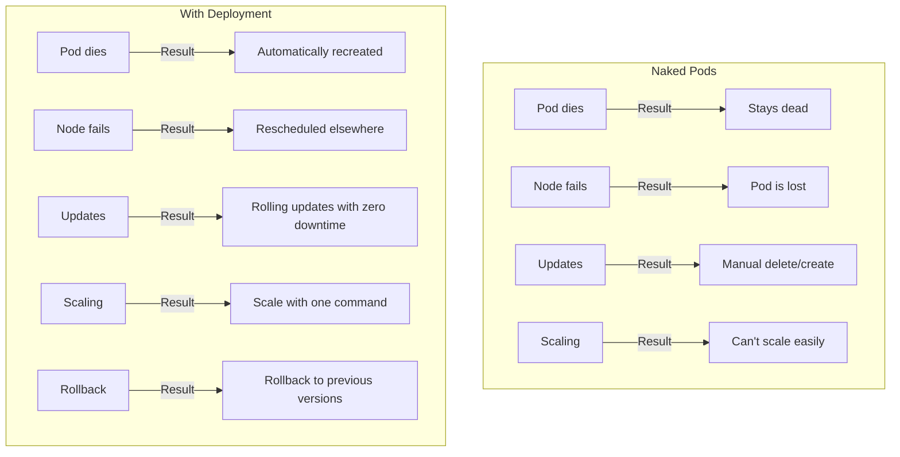
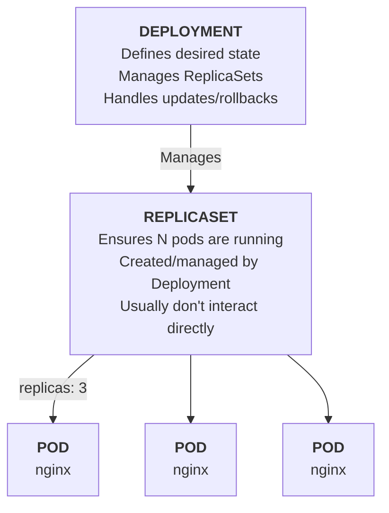
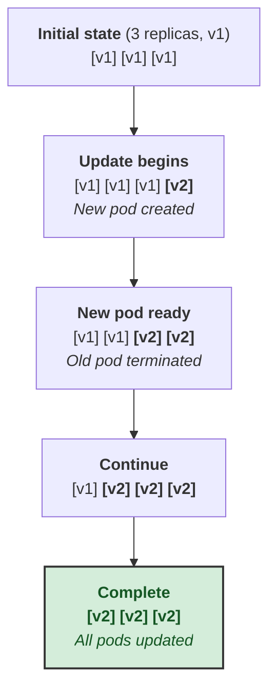

> **Complexity**: `[MEDIUM]` - Core workload management
>
> **Time to Complete**: 40-45 minutes
>
> **Prerequisites**: Module 3 (Pods)

---

## Learning Outcomes

After completing this module, you will be able to:
- **Create** Deployments both imperatively and declaratively
- **Scale** applications up and down and explain what happens to the underlying Pods
- **Perform** rolling updates and rollbacks, and diagnose a stuck rollout
- **Explain** the Deployment → ReplicaSet → Pod hierarchy and why each layer exists

---

## Why This Module Matters

A startup's payment processing service ran as a single Pod. At 2 PM on a Friday, the Pod crashed due to a memory leak. Because it was a naked Pod — no Deployment, no ReplicaSet — it stayed dead. For 23 minutes, no one could process payments. When the on-call engineer finally `kubectl apply`'d a new Pod, they accidentally deployed the wrong image tag. Another 15 minutes of downtime.

The total cost: $12K in lost transactions and a very stressed team. A Deployment would have restarted the Pod automatically in under 10 seconds. A rolling update strategy would have caught the bad image before it replaced all replicas.

> **The Manager Analogy**: Think of a Deployment as a restaurant manager. You (the developer) say "I need 3 servers on the floor." The manager (Deployment) handles hiring (creating Pods), replacing someone who calls in sick (self-healing), and training new staff on a new menu (rolling updates). You describe WHAT you want; the Deployment handles HOW.

---

## Why Deployments?

Pods alone have problems:



---

## Creating Deployments

### Imperative (Quick Testing)

```bash
# Create deployment
kubectl create deployment nginx --image=nginx

# With replicas
kubectl create deployment nginx --image=nginx --replicas=3

# Dry run to see YAML
kubectl create deployment nginx --image=nginx --dry-run=client -o yaml
```

### Declarative (Production Way)

```yaml
# deployment.yaml
apiVersion: apps/v1
kind: Deployment
metadata:
  name: nginx
  labels:
    app: nginx
spec:
  replicas: 3                    # Number of pod copies
  selector:                      # How to find pods to manage
    matchLabels:
      app: nginx
  template:                      # Pod template
    metadata:
      labels:
        app: nginx               # Must match selector
    spec:
      containers:
      - name: nginx
        image: nginx:1.25
        ports:
        - containerPort: 80
```

```bash
kubectl apply -f deployment.yaml
```

> **Stop and think**: If you change the `replicas` field in the `deployment.yaml` file from 3 to 5 and run `kubectl apply -f deployment.yaml` again, what will Kubernetes do?
> *Explanation*: Kubernetes will compare the desired state in your YAML file (5 replicas) with the current state in the cluster (3 replicas). It will instruct the Deployment controller to scale up by creating 2 additional Pods, leaving the existing 3 Pods untouched.

---

## Deployment Architecture



---

## Common Operations

### View Deployments

```bash
# List deployments
kubectl get deployments
kubectl get deploy              # Short form

# Detailed info
kubectl describe deployment nginx

# See related resources
kubectl get deploy,rs,pods
```

### Scaling

```bash
# Scale up/down
kubectl scale deployment nginx --replicas=5

# Or edit YAML and apply
kubectl edit deployment nginx
# Change replicas, save

# Watch pods scale
kubectl get pods -w
```

> **Pause and predict**: If you manually delete two Pods from a 5-replica Deployment, what exactly happens in the cluster? Try it: `kubectl delete pod <name> <name>` then quickly run `kubectl get rs`.
> *Explanation*: The ReplicaSet immediately detects the current count (3) doesn't match the desired count (5) and creates two new Pods to replace them to maintain the declarative state.

### Updates (Rolling)

```bash
# Update image
kubectl set image deployment/nginx nginx=nginx:1.26

# Or edit deployment
kubectl edit deployment nginx

# Watch rollout
kubectl rollout status deployment nginx

# View rollout history
kubectl rollout history deployment nginx
```

> **Stop and think**: Try running `kubectl set image deployment/nginx nginx=nginx:broken` on a running deployment. Use `kubectl get pods` and `kubectl rollout status deployment nginx`. What do you see?
> *Hint*: Kubernetes pauses the rollout because the new Pods never become ready, protecting your existing running Pods from being terminated. You'll see `ImagePullBackOff` for the new pods while old ones remain `Running`.

### Rollback

```bash
# Undo last change
kubectl rollout undo deployment nginx

# Rollback to specific revision
kubectl rollout history deployment nginx
kubectl rollout undo deployment nginx --to-revision=2
```

> **Stop and think**: Try editing a ReplicaSet directly via `kubectl edit rs <name>` and change its replica count. What does the Deployment do?
> *Explanation*: The Deployment's controller loop detects the drift almost instantly. It will immediately overwrite your manual ReplicaSet changes to ensure the cluster matches the Deployment's declarative state.

---

## Rolling Update Strategy

Deployments update Pods gradually. By default, both `maxSurge` and `maxUnavailable` are set to `25%`.

```yaml
spec:
  strategy:
    type: RollingUpdate
    rollingUpdate:
      maxSurge: 25%        # Max extra pods during update
      maxUnavailable: 25%  # Max pods that can be unavailable
```



> **Note**: This process ensures zero downtime! Traffic is served throughout the entire update.

---

## Deployment YAML Explained

```yaml
apiVersion: apps/v1
kind: Deployment
metadata:
  name: nginx
  labels:
    app: nginx
spec:
  replicas: 3                    # Desired pod count
  selector:
    matchLabels:
      app: nginx                 # Must match template labels
  strategy:
    type: RollingUpdate
    rollingUpdate:
      maxSurge: 1                # Defaults to 25% if not specified
      maxUnavailable: 0          # Defaults to 25% if not specified
  template:                      # Pod template (same as Pod spec)
    metadata:
      labels:
        app: nginx               # Labels for service discovery
    spec:
      containers:
      - name: nginx
        image: nginx:1.25
        ports:
        - containerPort: 80
        resources:
          requests:
            memory: "64Mi"
            cpu: "100m"
          limits:
            memory: "128Mi"
            cpu: "200m"
```

---

## Self-Healing in Action

```bash
# Create deployment
kubectl create deployment nginx --image=nginx --replicas=3

# See pods
kubectl get pods

# Delete a pod
kubectl delete pod <pod-name>

# Immediately check again
kubectl get pods
# A new pod is already being created!

# The deployment maintains desired state
kubectl get deployment nginx
# READY shows 3/3
```

---

## Did You Know?

- **Deployments don't directly manage Pods.** They manage ReplicaSets, which manage Pods. This enables rollback. ReplicaSet names are appended with a hash (e.g., `nginx-7b5c8f9`), and Pods carry a matching `pod-template-hash` label.
- **Each update creates a new ReplicaSet.** Old ReplicaSets are kept (with 0 replicas) for rollback history. The `.spec.revisionHistoryLimit` dictates how many old ReplicaSets to keep (defaults to 10); setting it to 0 prevents rollback entirely.
- **`maxSurge: 0, maxUnavailable: 0` is impossible.** You can't update without either creating new pods or terminating old ones. By default, both are set to 25%.
- **`kubectl rollout restart`** triggers a new rollout without changing the spec. Useful for pulling new images with the same tag.
- **Rollouts have a time limit.** The `.spec.progressDeadlineSeconds` defaults to 600 seconds (10 minutes). If exceeded, the Deployment condition `Progressing` becomes `False` (Reason: `ProgressDeadlineExceeded`), and `kubectl rollout status` will exit with a status code of 1.
- **Let the HPA scale.** If you use a HorizontalPodAutoscaler (HPA) to manage a Deployment's replicas, you should omit `.spec.replicas` from the Deployment manifest to avoid fighting the autoscaler during apply.

---

## Common Mistakes

| Mistake | Why It Hurts | Solution |
|---------|--------------|----------|
| Selector doesn't match template labels | Deployment creates orphaned pods or API rejects the YAML entirely. | Ensure `matchLabels` exactly matches the Pod template labels. |
| Updating the selector later | The `.spec.selector` field is immutable after creation in `apps/v1`. | You must delete and recreate the Deployment if you need to change its label selector. |
| Using `:latest` image tag | Rollbacks are unpredictable; nodes won't pull the new image if the tag name hasn't changed. | Use immutable, specific version tags (like git commit hashes). |
| Editing ReplicaSet directly | Changes are overwritten by the Deployment during the next reconciliation loop. | Always modify the Deployment directly, never the underlying ReplicaSet. Any direct modifications to objects managed by a higher-level controller will be reverted. |
| Recreate strategy on highly available apps | Causes hard downtime as all old pods are killed before new ones start. | Use `RollingUpdate` unless the application strictly forbids concurrent versions. |
| Missing resource limits | New pods during a rollout might starve existing pods or crash the node. | Always set resource requests and limits in the pod template. |
| Ignoring rollout status | A broken rollout can hang indefinitely in the background without operators realizing it. | Always run `kubectl rollout status` after applying changes. |
| Unrecorded rollouts | Rollback history shows cryptic revision numbers without explaining what changed. | Use `kubernetes.io/change-cause` annotations to document the reason for updates. |
| Scaling during rollout blindly | Can cause confusion as proportional scaling affects both old and new ReplicaSets. | Wait for the rollout to complete, or understand proportional scaling behavior. |

---

## Quiz

1. **Scenario**: You are running a legacy stateful application that cannot have two instances running simultaneously because they will corrupt the database. You need to deploy a new version. Which deployment strategy should you choose and why?
   <details>
   <summary>Answer</summary>
   You must use the `Recreate` deployment strategy instead of the default `RollingUpdate`. The `RollingUpdate` strategy starts new Pods before terminating the old ones, which would result in two instances running concurrently and corrupting your database. By choosing `Recreate`, the Deployment will first terminate all existing Pods and wait for them to fully shut down. Only after the old Pods are completely gone will it start the new Pods, guaranteeing absolute isolation between versions at the cost of some downtime. This strategy is essential for legacy systems that cannot handle concurrent database locks or shared state during upgrades.
   </details>

2. **Scenario**: An on-call engineer notices a Deployment's Pods are consuming too much memory. In a panic, they edit the ReplicaSet directly using `kubectl edit rs` to change the resource limits. What happens next and why?
   <details>
   <summary>Answer</summary>
   The changes made directly to the ReplicaSet will be completely ignored or quickly overwritten, and the Pods will not be updated. Deployments are designed to act as the declarative source of truth for their underlying ReplicaSets. If the ReplicaSet drifts from the Deployment's template, or if you try to trigger an update at the ReplicaSet layer, the Deployment controller will reconcile the state back to match its own specifications. To fix the memory issue, the engineer must edit the Deployment directly, which will automatically generate a brand new ReplicaSet with the correct limits. Any direct modifications to objects managed by a higher-level controller will be reverted.
   </details>

3. **Scenario**: You trigger a Deployment update with a new image tag, but 10 minutes later, users complain the app is still on the old version. You run `kubectl get pods` and see `ImagePullBackOff` for the new pods, while old pods are still `Running`. Why did the Deployment behave this way?
   <details>
   <summary>Answer</summary>
   The Deployment behaved perfectly by halting the rollout, thanks to the default `maxUnavailable` setting in the `RollingUpdate` strategy. When the new Pods failed to pull their image and crashed, they never reached the `Ready` state. Because the Deployment guarantees a certain number of available Pods, it refused to terminate the old, functioning Pods until the new ones were healthy. This self-preservation mechanism prevented the bad configuration from causing a total cluster outage, leaving your users unaffected while you investigate the broken image. The rollout will remain paused until the image issue is resolved or the Deployment is rolled back.
   </details>

4. **Scenario**: During a major traffic spike, your team triggers a rolling update to fix a critical bug. Midway through the rollout, traffic doubles again and you run `kubectl scale deployment web --replicas=10`. How does the Deployment handle this scaling event during an active rollout?
   <details>
   <summary>Answer</summary>
   The Deployment is smart enough to handle simultaneous scaling and updating without dropping traffic, using a mechanism called proportional scaling. It temporarily pauses the rolling update and distributes the new replica count across both the old and new ReplicaSets based on their current sizes. Once the scaling is achieved, it resumes the rolling update, gradually shifting the newly scaled pods from the old version to the new version. This ensures you immediately get the capacity you need to handle the traffic spike while still progressing toward the bug fix. Note that scaling operations do not trigger a new rollout, they merely adjust the replica counts of the existing active ReplicaSets.
   </details>

5. **Scenario**: Your team uses `maxSurge: 100%` and `maxUnavailable: 0%` for a 10-replica Deployment to ensure ultra-fast rollouts. What are the cluster capacity implications of this configuration during an update?
   <details>
   <summary>Answer</summary>
   Setting `maxSurge` to 100% means the Deployment will attempt to create a full duplicate set of 10 new Pods immediately, while keeping all 10 old Pods running since `maxUnavailable` is 0%. This requires your Kubernetes cluster to have enough spare CPU and memory capacity to run 20 Pods simultaneously during the rollout phase. If your cluster autoscaler isn't fast enough or you lack the physical nodes, the new Pods will be stuck in a `Pending` state. While this configuration guarantees zero downtime and fast updates, it is highly resource-intensive and can cause scheduling bottlenecks in tight clusters. You must ensure you have adequate buffer capacity before using aggressive update strategies.
   </details>

6. **Scenario**: A developer complains that their newly created Deployment is failing. You inspect the YAML and notice the Deployment's `spec.selector.matchLabels` has `app: web-frontend`, but the Pod template's `metadata.labels` has `app: web-backend`. Why is this a fatal error for the Deployment?
   <details>
   <summary>Answer</summary>
   The Deployment controller relies entirely on label selectors to identify which Pods it is supposed to manage. If the selector doesn't match the labels applied to the Pods generated by its template, the API will reject the Deployment. In API version `apps/v1`, the selector is strictly validated against the template labels and becomes immutable after creation to prevent chaotic runaway conditions where a Deployment creates orphaned Pods endlessly. To fix this, the developer must ensure that `spec.selector.matchLabels` matches `spec.template.metadata.labels` exactly before submitting the manifest. This strict validation protects the cluster from runaway controller loops.
   </details>

---

## Hands-On Exercise

**Task**: Create a Deployment, scale it, update it, and roll back.

```bash
# 1. Create deployment
kubectl create deployment web --image=nginx:1.24

# 2. Scale to 3 replicas
kubectl scale deployment web --replicas=3

# 3. Verify
kubectl get deploy,rs,pods

# 4. Update image
kubectl set image deployment/web nginx=nginx:1.25

# 5. Watch rollout
kubectl rollout status deployment web

# 6. Check history
kubectl rollout history deployment web

# 7. Simulate problem - rollback
kubectl rollout undo deployment web

# 8. Verify rollback
kubectl get deployment web -o jsonpath='{.spec.template.spec.containers[0].image}'
# Should show nginx:1.24

# 9. Cleanup
kubectl delete deployment web
```

**Success Criteria**:
- [ ] Create a deployment named `web` with image `nginx:1.24`
- [ ] Scale the deployment to 3 replicas
- [ ] Verify 3 pods are running using `kubectl get pods`
- [ ] Update the image to `nginx:1.25`
- [ ] Watch the rollout complete using `kubectl rollout status`
- [ ] Roll back the deployment to the previous version
- [ ] Verify the active pods are running `nginx:1.24`
- [ ] Clean up by deleting the deployment

---

## Summary

Deployments manage your applications:

**Features**:
- Declarative updates
- Rolling updates (zero downtime)
- Rollback capability
- Self-healing
- Easy scaling

**Key commands**:
- `kubectl create deployment`
- `kubectl scale deployment`
- `kubectl set image`
- `kubectl rollout status`
- `kubectl rollout undo`

**Best practices**:
- Always use Deployments (not naked Pods)
- Use specific image tags
- Set resource requests/limits

---

## Next Module

[Module 1.5: Services](../module-1.5-services/) - Stable networking for your Pods.