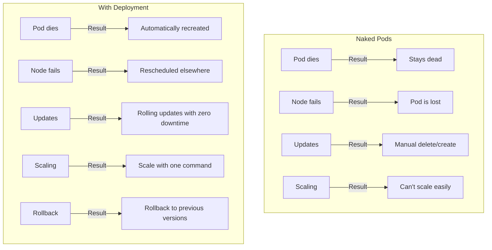
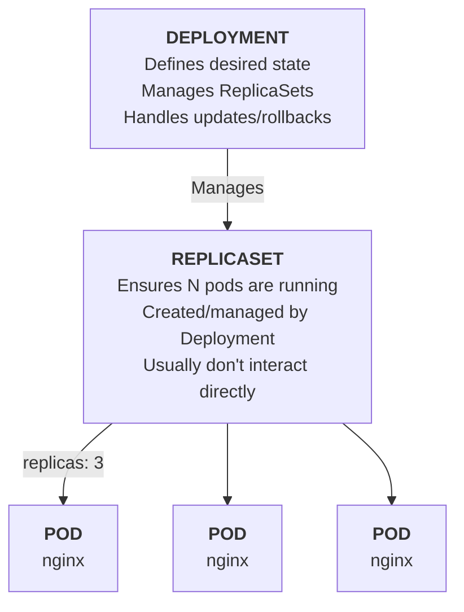
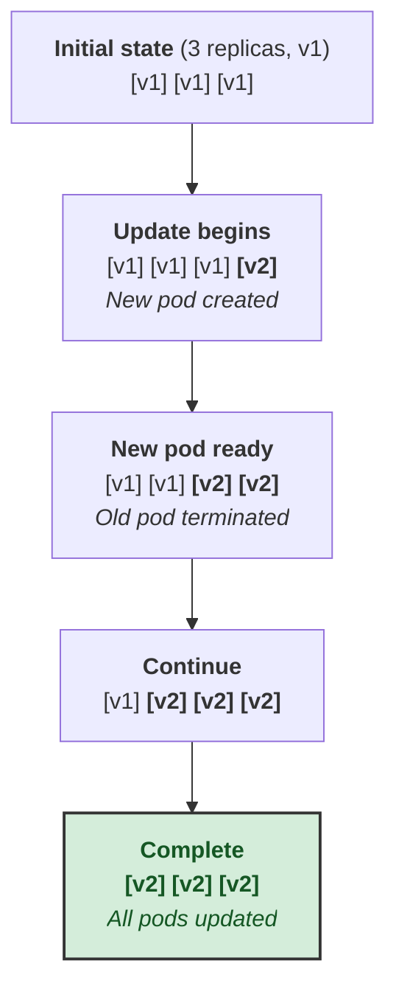

> **Complexity**: `[MEDIUM]` - Core workload management.
>
> **Time to Complete**: 40-45 minutes.
>
> **Prerequisites**: Module 3, Pods. This module assumes a Kubernetes 1.35 or newer cluster and a working shell. To keep commands short during practice, set `alias k=kubectl` before you begin, then read `k` as the same client command you already used in earlier modules.

---

## What You'll Be Able to Do

After completing this module, you will be able to:

- **Implement** Deployments imperatively and declaratively while preserving selector and template alignment.
- **Scale** a Deployment and diagnose how ReplicaSets create, replace, and balance Pods underneath it.
- **Evaluate** rolling update settings, rollback behavior, and rollout progress when a release becomes unhealthy.
- **Debug** Deployment failures caused by label mismatches, image errors, capacity pressure, and direct edits to managed ReplicaSets.

## Why This Module Matters

A payment startup once ran its checkout processor as a single naked Pod because the team wanted the smallest possible manifest while preparing for a product launch. At 2 PM on a Friday, a memory leak killed that Pod during a partner promotion, and nothing in the cluster recreated it because no controller owned the workload. For 23 minutes, every payment request failed until an on-call engineer manually applied a replacement, then another 15 minutes disappeared when the replacement used the wrong image tag and needed a second emergency fix.

The incident cost roughly twelve thousand dollars in failed transactions, but the worse damage was operational: engineers stopped trusting deploys, customer support handled angry merchants, and the next release was delayed because the team had no repeatable way to replace application instances safely. A Deployment would not have made the memory leak vanish, yet it would have recreated failed Pods automatically, kept a desired replica count, and provided a controlled rolling update path instead of a late-Friday manual rebuild under pressure.

That is why Deployments are the first Kubernetes workload controller worth treating as more than syntax. Pods describe one running copy of something, while Deployments describe how many copies should exist, how they should be updated, and how Kubernetes should recover when reality drifts away from the desired state. The practical skill is not memorizing `k create deployment`; it is learning to read the Deployment, ReplicaSet, and Pod layers as one control system that protects availability while still letting you change software.

Think of a Deployment as a restaurant manager rather than an individual server. You say, "I need three trained servers on the floor using the current menu," and the manager handles hiring, replacing someone who calls in sick, and rotating staff onto a revised menu without emptying the dining room. Kubernetes uses more precise language, but the shape is the same: you declare the desired staffing plan, and the controller keeps reconciling the floor until the observed state matches that plan.

## Why Deployments Exist

Pods are useful for learning because they expose the smallest schedulable unit in Kubernetes, but they are the wrong abstraction for long-running applications. A Pod has no memory of how many peers should exist, no update strategy, and no owner that can rebuild it after deletion. If a node disappears, the scheduler can place replacement Pods only when a higher-level controller asks for them, which means a naked Pod is closer to a hand-started process than a managed service.

Deployments solve this by adding a durable intent above individual Pods. The Deployment controller stores the desired replica count, the Pod template, the selector that identifies managed Pods, and the strategy for changing that template over time. When the cluster differs from that intent, Kubernetes creates, deletes, or scales ReplicaSets, and those ReplicaSets create, delete, or replace Pods until the live workload matches the requested shape.



The important difference in the diagram is not that Deployments are more complicated; it is that they preserve intent after the first successful start. A naked Pod can be running perfectly at noon and still leave you exposed at noon-thirty because there is no controller obligated to notice a crash. A Deployment keeps asking whether the expected number of ready Pods exists, so a one-time launch becomes a continuing contract between your manifest and the cluster.

This contract is especially valuable because failure rarely arrives in one neat category. A node can drain during maintenance, an image can fail to pull in one region, a resource request can make new Pods unschedulable, or a readiness probe can reveal that a new version starts but cannot serve traffic. Deployments give you one place to observe those situations, and they make the default response conservative: keep enough old Pods available while trying to move toward the new version.

Pause and predict: if you manually delete two Pods from a five-replica Deployment, what exact object notices first, and what object creates the replacements? The answer matters because operators often say "the Deployment recreated my Pods," but the Deployment usually delegates that immediate replica math to the active ReplicaSet. That distinction becomes useful when you inspect a stuck rollout and need to know whether the Deployment, the new ReplicaSet, or the Pods are the layer reporting the useful symptom.

The Deployment is therefore both a safety mechanism and a debugging map. When an application is healthy, you mostly interact with the Deployment because it is the source of truth. When it is unhealthy, you walk down the hierarchy: Deployment conditions explain rollout progress, ReplicaSet counts explain old-versus-new balancing, and Pod status explains scheduling, image, readiness, or crash behavior.

## Creating Deployments

There are two normal ways to create a Deployment, and they serve different purposes. Imperative commands are fast when you are exploring a cluster, testing a small image, or generating a starter manifest. Declarative YAML is the production habit because it can be reviewed, versioned, repeated, and compared against the live cluster without relying on whoever happened to type the original command.

The first command block preserves the quick testing workflow from the original module and adds the `k` alias used throughout KubeDojo labs. Run the alias in every new shell session, because it is a shell convenience rather than a Kubernetes object. The dry-run command is especially useful because it lets you convert a correct one-line experiment into YAML without pretending that hand-written manifests are always the fastest first step.

```bash
alias k=kubectl

# Create deployment
k create deployment nginx --image=nginx

# With replicas
k create deployment nginx --image=nginx --replicas=3

# Dry run to see YAML
k create deployment nginx --image=nginx --dry-run=client -o yaml
```

Imperative creation is deliberately narrow: it can set a name, image, and replica count, but it does not encourage you to reason about selectors, update strategy, resource requests, or labels beyond the defaults generated for you. That is acceptable for a learning cluster and risky for a shared environment. Treat the command as a scaffold builder, then move the resulting manifest into version control before other people or automation start depending on it.

Declarative creation starts with a complete desired state. The selector says which Pods the Deployment owns, the template says what future Pods should look like, and the replica count says how many matching Pods should be maintained. The selector and template labels must agree because a controller that cannot recognize its own Pods would either manage nothing or accidentally compete with another controller.

```bash
cat << 'EOF' > deployment.yaml
apiVersion: apps/v1
kind: Deployment
metadata:
  name: nginx
  labels:
    app: nginx
spec:
  replicas: 3                    # Number of pod copies
  selector:                      # How to find pods to manage
    matchLabels:
      app: nginx
  template:                      # Pod template
    metadata:
      labels:
        app: nginx               # Must match selector
    spec:
      containers:
      - name: nginx
        image: nginx:1.26
        ports:
        - containerPort: 80
EOF

k apply -f deployment.yaml
```

Before running this, what output do you expect from `k get deploy,rs,pods` after the apply completes? A healthy result should show one Deployment, one active ReplicaSet, and three Pods with names derived from the ReplicaSet name. If you see fewer Pods than requested, resist the urge to apply again; describe the Deployment and inspect the Pods, because the controller is already trying and needs you to read the blocker.

The safest mental model is that `k apply` changes intent rather than directly starting containers. If you edit `replicas: 3` to `replicas: 5` and apply the file again, Kubernetes compares the new desired state with the current cluster state, then asks the active ReplicaSet to create two additional Pods. Existing healthy Pods remain untouched because the Pod template did not change, which is why scaling a Deployment should be less disruptive than deleting and recreating one.

A practical team habit is to keep a small command note beside the manifest during early development: the imperative command that generated the first draft, the declarative file that became the source of truth, and the verification commands used after each change. That habit helps beginners connect fast experiments to reviewable infrastructure. It also prevents a common split-brain situation where one engineer changes YAML while another tries to fix the same Deployment with ad hoc commands.

## Deployment Architecture

The Deployment architecture has three visible layers, and each layer owns a different kind of decision. The Deployment owns rollout intent and history, the ReplicaSet owns a count of identical Pods from one template revision, and each Pod owns the actual container status for one running instance. You usually modify only the Deployment because direct edits to child objects are either overwritten or bypass the history you need for rollback.



The ReplicaSet layer exists because rollout history needs stable snapshots. When you update a Deployment's Pod template, Kubernetes creates a new ReplicaSet for the new template while keeping older ReplicaSets around with zero or fewer replicas. A rollback can then scale an older ReplicaSet back up because its template still describes the previous version. Without that middle layer, Kubernetes would need to reconstruct old Pod templates from less reliable history.

You can observe the hierarchy without learning any hidden API. The `deploy,rs,pods` resource list is one of the most useful beginner commands because it shows the parent, the template revision, and the live instances in one view. The names are intentionally related: a Deployment named `nginx` produces ReplicaSets with generated suffixes, and Pods inherit another suffix so you can trace ownership by eye before using labels or owner references.

```bash
# List deployments
k get deployments
k get deploy              # Short form

# Detailed info
k describe deployment nginx

# See related resources
k get deploy,rs,pods
```

A useful debugging pattern is to start broad and descend only when the broad layer points you downward. `k describe deployment nginx` shows conditions such as progress and availability, recent events, selector information, and desired versus available counts. If those counts are off, `k get rs` shows whether the old or new ReplicaSet has replicas, and `k get pods` shows the concrete reason a specific instance is waiting, crashing, or not ready.

Direct ReplicaSet edits are tempting because the object is visible and has a replica field, but that field is not the source of truth when a Deployment owns it. The next reconciliation loop will adjust the ReplicaSet to match the Deployment's desired state, or the next Deployment update will create a different ReplicaSet entirely. In production, this is a feature: operators can trust that managed children return to the parent specification rather than accumulating hidden manual drift.

Stop and think: if you edit a ReplicaSet directly with `k edit rs <name>` and change its replica count, what should the Deployment do? It should notice that the child state no longer matches the Deployment intent and correct the drift. The learning point is not "never inspect ReplicaSets"; it is "inspect them freely, but make durable changes at the Deployment layer."

## Scaling, Self-Healing, and Day-Two Operations

Scaling is the simplest operation that proves the controller model. You are not launching individual Pods; you are changing the desired replica count, and the controller system decides how to reach that count. This distinction matters during incidents because deleting a bad Pod, draining a node, or scaling a workload all become variations of the same reconciliation story rather than separate operational tricks.

```bash
# Scale up/down
k scale deployment nginx --replicas=5

# Or patch the deployment to scale
k patch deployment nginx -p '{"spec": {"replicas": 5}}'

# Watch pods scale
k get pods -w
```

When you scale from three replicas to five, the active ReplicaSet increases its desired count and creates two new Pods from the same template. When you scale back down, Kubernetes chooses Pods to terminate according to controller logic and scheduling hints, so you should avoid storing unique local state in any one Pod. A Deployment assumes replicas are interchangeable, which is perfect for stateless web services and dangerous for single-writer databases that need stronger identity guarantees.

Self-healing uses the same count logic. If one Pod disappears, the ReplicaSet observes fewer live Pods than desired and creates a replacement. If a node fails, Pods on that node vanish from the healthy set, and replacement Pods can be scheduled elsewhere as long as the cluster has capacity and the Pod template can be scheduled. The Deployment does not promise magic capacity; it promises continuous effort toward the declared state.

```bash
# Create deployment
k create deployment nginx --image=nginx --replicas=3

# See pods
k get pods

# Delete a pod (using label selector to target the first one)
k delete pod $(k get pods -l app=nginx -o jsonpath='{.items[0].metadata.name}')

# Immediately check again
k get pods
# A new pod is already being created!

# The deployment maintains desired state
k get deployment nginx
# READY shows 3/3
```

Pause and predict: if you delete the underlying ReplicaSet instead of just one Pod, what will the Deployment do, and why might the workload briefly look more disrupted? The Deployment owns the ReplicaSet, so it recreates a suitable ReplicaSet, which then recreates Pods. The disruption can be larger than deleting one Pod because you removed the whole count manager at once, but the parent controller still has enough information to rebuild the intended child objects.

The operational tradeoff is that self-healing can hide repeated failure if you only look at the final READY count. A Pod that crashes every few minutes may be replaced quickly enough that casual checks look fine, while logs and restart counts tell a different story. Good Deployment operations therefore combine count checks with event checks, rollout checks, and application-level metrics so reconciliation does not become a mask for a broken release.

Another day-two concern is autoscaling. If a HorizontalPodAutoscaler manages the replica count, your Deployment manifest and your autoscaler can fight if both keep asserting different counts. Many teams omit `.spec.replicas` from the Deployment manifest once an HPA becomes authoritative, or they manage replica changes through the autoscaler configuration rather than through repeated Deployment applies. The principle is the same as with ReplicaSets: decide which object owns the intent, then avoid competing writers.

## Rolling Updates and Rollbacks

Rolling updates are where Deployments become release machinery instead of just restart machinery. A template change, such as a new container image, causes the Deployment to create a new ReplicaSet and gradually move replicas from the old ReplicaSet to the new one. The default strategy tries to preserve availability by allowing limited extra Pods and limited unavailable Pods during the transition.

```bash
# Update image
k set image deployment/nginx nginx=nginx:1.27

# Watch rollout
k rollout status deployment nginx

# View rollout history
k rollout history deployment nginx
```

The important behavior is that a rollout waits for new Pods to become ready before it removes too much old capacity. If the new image pulls successfully and passes readiness, the Deployment keeps shifting traffic capacity toward the new ReplicaSet until the old one reaches zero. If the image is broken, the new Pods may sit in `ImagePullBackOff` while old Pods continue serving, which gives you time to roll back without causing a complete outage.

```bash
# Undo last change
k rollout undo deployment nginx

# Rollback to specific revision
k rollout history deployment nginx
k rollout undo deployment nginx --to-revision=2
```

Rollbacks work because old ReplicaSets keep previous Pod templates. The revision history limit defaults to ten, which is enough for many beginner labs but should still be an explicit operational choice in real systems. A very low history limit saves object clutter but reduces recovery options, while a very high limit keeps more templates around without replacing proper release records, observability, or artifact provenance.

Try running `k set image deployment/nginx nginx=nginx:broken` on a disposable lab Deployment, then compare `k get pods`, `k describe deployment nginx`, and `k rollout status deployment nginx`. You should see Kubernetes protect old healthy Pods while reporting that the new revision is not progressing. This is the moment when a Deployment feels less like a command wrapper and more like a release guardrail.

Rollout status should be part of every human or CI-driven apply. `k apply -f deployment.yaml` tells you the API accepted a desired state, but it does not prove the workload became healthy. `k rollout status deployment nginx` waits for Deployment progress, and its failure is a signal to inspect events, Pod reasons, and image availability before telling users a release is complete.

## Rolling Update Strategy

The rolling update strategy is controlled by `maxSurge` and `maxUnavailable`. `maxSurge` describes how many extra Pods Kubernetes may create above the desired replica count during an update, while `maxUnavailable` describes how many desired Pods may be unavailable during the same transition. Kubernetes defaults both values to twenty-five percent, but the right setting depends on capacity, startup time, and how much unavailability the application can tolerate.

```yaml
spec:
  strategy:
    type: RollingUpdate
    rollingUpdate:
      maxSurge: 25%        # Max extra pods during update
      maxUnavailable: 25%  # Max pods that can be unavailable
```

Those two values form a capacity contract. A high surge with zero unavailable Pods favors availability and speed, but it requires spare CPU, memory, IP addresses, and scheduling room for temporary extra Pods. A low surge with some unavailability favors constrained clusters, but it may reduce live serving capacity during the rollout. Setting both to zero is impossible because Kubernetes would have no permission to create a new Pod or remove an old one.



The diagram shows a friendly case where new Pods become ready quickly. Real rollouts are messier because readiness probes, slow image pulls, resource pressure, and node placement can stretch each step. If the new Pods cannot become ready before the progress deadline, the Deployment reports `ProgressDeadlineExceeded`; it does not automatically undo the release for you, so your operational process must decide whether to roll back, fix the image, or change capacity.

Which approach would you choose here and why: `maxSurge: 1, maxUnavailable: 0` for a customer-facing web app, or `maxSurge: 0, maxUnavailable: 1` for a small internal worker? The web app often deserves extra temporary capacity to avoid dropping requests, while the worker may accept slower replacement if the cluster has little headroom. The right answer follows the workload's availability promise, not a universal setting.

Some applications cannot safely run old and new versions at the same time. A legacy single-writer process that performs a one-way database migration may need the `Recreate` strategy, which stops old Pods before starting new ones. That strategy creates downtime by design, but it can be the honest choice when concurrent versions would corrupt shared state. Kubernetes gives you the tool; your job is to match it to application semantics.

## Deployment YAML Explained

A production Deployment manifest is more than a name and image. It captures labels for discovery, selectors for ownership, rollout behavior for releases, and resource settings that let the scheduler make realistic placement decisions. Beginners often focus on the `containers` stanza because it looks like the application, but the surrounding fields decide whether Kubernetes can operate that application safely.

```yaml
apiVersion: apps/v1
kind: Deployment
metadata:
  name: nginx
  labels:
    app: nginx
spec:
  replicas: 3                    # Desired pod count
  selector:
    matchLabels:
      app: nginx                 # Must match template labels
  strategy:
    type: RollingUpdate
    rollingUpdate:
      maxSurge: 1                # Defaults to 25% if not specified
      maxUnavailable: 0          # Defaults to 25% if not specified
  template:                      # Pod template (same as Pod spec)
    metadata:
      labels:
        app: nginx               # Labels for service discovery
    spec:
      containers:
      - name: nginx
        image: nginx:1.26
        ports:
        - containerPort: 80
        resources:
          requests:
            memory: "64Mi"
            cpu: "100m"
          limits:
            memory: "128Mi"
            cpu: "200m"
```

The selector deserves special attention because it is immutable in `apps/v1`. Once the Deployment exists, you cannot casually change which labels define ownership, because doing so could orphan Pods or cause the controller to adopt the wrong Pods. If you need a different selector, the safe path is usually to create a new Deployment with the correct selector, migrate traffic through a Service or routing layer, then remove the old Deployment.

Resource requests and limits are not Deployment-specific, but rollouts make their absence more painful. During an update, Kubernetes may temporarily run extra Pods, and the scheduler needs requests to know whether the cluster has room. Without requests, the cluster may pack Pods too tightly; without limits, a broken version can consume memory or CPU in a way that harms neighboring workloads. A Deployment can coordinate replacement, but it cannot make an unschedulable template schedulable.

Image tags are another quiet source of rollback trouble. The tag `latest` looks convenient, but it does not identify a stable artifact, and different nodes may have different cached images. Use immutable version tags, release tags tied to a build, or digests when your environment supports them. A rollback should mean "return to a known template," not "ask every node what it thinks this floating tag means today."

Change-cause annotations can help humans read rollout history, but they are not a substitute for release notes or Git history. The Deployment will happily show revision numbers, yet revision numbers alone rarely tell an on-call engineer why a change happened. When teams connect manifest changes, image tags, and rollout observations, Deployment history becomes an operational clue rather than a list of mysterious integers.

## Patterns & Anti-Patterns

Good Deployment usage is mostly about choosing a clear owner for intent and then letting the controller do its job. Use a Deployment when replicas are interchangeable, the application can tolerate replacement, and you need rollout history. Use a StatefulSet or another workload type when identity, stable storage ordering, or one-at-a-time semantics are central to correctness. The mistake is not choosing a simpler object; the mistake is choosing it without matching the workload behavior.

| Pattern | When to Use It | Why It Works | Scaling Consideration |
|---|---|---|---|
| Declarative Deployment manifests | Shared environments, CI, and anything reviewed by a team | The manifest records selector, template, resources, and rollout strategy in one source of truth | Pair it with `k rollout status` so apply success is not mistaken for application health |
| Small surge with zero unavailable Pods | User-facing services with enough spare cluster capacity | New Pods prove readiness before old capacity is removed | Capacity must cover at least the desired replicas plus the allowed surge |
| Immutable image tags | Any environment where rollback must be predictable | Each revision points to a known artifact instead of a moving tag | Tag naming should connect cleanly to build, release, or commit metadata |
| Inspect children, edit parents | Debugging Deployments, ReplicaSets, and Pods during incidents | Child status gives symptoms while the Deployment remains the durable intent | Direct child edits can be overwritten, so promote durable fixes to the Deployment |

Anti-patterns usually appear when a team treats Kubernetes objects as independent files rather than a hierarchy. Editing a ReplicaSet to fix a Deployment is like changing a printed copy of a schedule while the manager keeps printing the real one from a different system. The change may look visible for a moment, but it is not where the durable decision lives, so reconciliation eventually erases it.

| Anti-Pattern | What Goes Wrong | Better Alternative |
|---|---|---|
| Running naked Pods for services | Crashes, node loss, and updates require manual intervention | Use Deployments for stateless replicated applications |
| Using `latest` for release images | Rollback and audit become ambiguous because the tag can move | Use immutable tags or digests tied to a build |
| Ignoring rollout progress | The API accepts a bad manifest while users remain on an old or broken version | Gate releases on `k rollout status` and inspect events on failure |
| Changing selectors after launch | The selector is immutable and wrong ownership can create orphaned workloads | Design labels before creation or migrate with a new Deployment |

## Decision Framework

Choose a Deployment when the application replicas are interchangeable, the Pod template can be replaced over time, and the desired operational behavior is "keep N healthy copies running while I release new versions." Choose a naked Pod only for short learning experiments where you are deliberately studying Pod behavior. Choose a StatefulSet when each replica needs stable identity, ordered rollout, or persistent storage semantics that a Deployment deliberately avoids.

| Situation | Prefer | Reason |
|---|---|---|
| Stateless web API with three or more replicas | Deployment with RollingUpdate | Replicas are interchangeable and can be replaced gradually |
| One-off troubleshooting container | Pod or Job | A controller for long-running desired state is unnecessary |
| Batch task that should complete once | Job | Success is completion, not continuous availability |
| Database with stable identity and storage | StatefulSet | Pod names, storage, and rollout ordering matter |
| Legacy app that cannot run two versions together | Deployment with Recreate, or redesign before scaling | Availability is traded for correctness during replacement |

The rollout strategy decision is a separate layer from the workload kind decision. After you decide that a Deployment is appropriate, decide whether the application can run old and new versions side by side, how much spare capacity the cluster has, and how long a new Pod takes to become ready. Those answers guide `maxSurge`, `maxUnavailable`, readiness probes, and whether a release should be automatic or require a human checkpoint.

During incidents, use the same framework in reverse. If users report errors after a release, check whether the Deployment is progressing, whether the new ReplicaSet has ready replicas, and whether Pods are failing for scheduling, image, readiness, or crash reasons. If the old ReplicaSet still serves enough capacity, rollback is often the lowest-risk first move; if both old and new versions are unhealthy, focus on shared dependencies, capacity, or configuration rather than the rollout mechanism alone.

### Worked Example: Reading a Stuck Rollout

Imagine a team ships a new frontend image at the start of a quiet maintenance window. The apply command succeeds, but the release dashboard never shows the new version, and `k rollout status` eventually reports that the Deployment exceeded its progress deadline. This is the point where beginners often retry the same apply, delete random Pods, or scale the Deployment down and back up. Those actions create more churn without answering the central question: which layer failed to move from desired state to healthy observed state?

Start at the Deployment because it records the rollout story. The desired replica count tells you how much capacity the controller is trying to maintain, while the available and updated counts tell you whether the new template has produced enough ready Pods. Conditions add timing and reason fields, so a progress failure is not just "the command failed"; it is Kubernetes saying that the new ReplicaSet did not advance in the expected time window. That narrows the investigation before you look at individual Pods.

Next, read the ReplicaSets as revision snapshots. One ReplicaSet represents the old template and another represents the new template, and their replica counts show how far the rollout moved before it stopped. If the old ReplicaSet still has most of the available replicas, the Deployment protected serving capacity while the new version failed. If both ReplicaSets have few or no ready replicas, the problem may be broader than a bad image, and you should inspect scheduling, shared configuration, or cluster capacity before assuming rollback will fully restore service.

Then inspect the Pods owned by the new ReplicaSet. Pod status gives concrete causes that the parent objects intentionally summarize away. `ImagePullBackOff` points toward a tag, registry, or credential issue. `Pending` points toward scheduling constraints, missing resources, taints, affinity, or unavailable nodes. `CrashLoopBackOff` points toward a container that starts and exits, so logs and application configuration become more useful than Deployment fields. `Running` without readiness points toward probes, startup time, dependencies, or application health checks.

The discipline is to avoid mixing symptoms from different layers. A Deployment condition can tell you a rollout is not progressing, but it cannot tell you whether the container has a missing environment variable. A Pod event can tell you an image pull failed, but it cannot tell you whether rollback history exists. A ReplicaSet count can tell you how much of each revision is active, but it cannot tell you whether users are still reaching enough healthy endpoints. Each layer answers a different question, and reliable operators ask those questions in order.

This layered reading also helps you decide whether to roll back. If the new Pods are failing because an image tag is misspelled and the old ReplicaSet is still serving, rollback is usually quick and low risk. If the new Pods are pending because the cluster has no spare capacity, rollback may reduce pressure by removing surge Pods, but the deeper fix is capacity planning or lower surge settings. If new Pods start but never become ready because a downstream dependency changed, rollback may work only if the old version still understands that dependency.

A useful release runbook writes these decisions in plain language. "If rollout status fails, describe the Deployment, compare old and new ReplicaSets, inspect new Pod events, and roll back only after identifying whether the old revision is still healthy." That sentence is more valuable than a page of disconnected commands because it teaches sequence and purpose. Commands are easy to search; the hard part during an incident is knowing which observation should change your next action.

For beginner labs, you can practice this without breaking a real service by using a fake image tag. The Deployment will accept the template update because the API server is not able to prove whether every image registry pull will succeed from every node. The new ReplicaSet will create Pods, the Pods will report pull failures, and the rollout will stop making progress while old Pods remain. This failure mode is excellent practice because it is visible, reversible, and close to mistakes that happen in real delivery pipelines.

Be careful not to overgeneralize the happy safety story. RollingUpdate protects capacity only within the limits you configured and the readiness signals your application provides. If your readiness probe returns success before the process can actually serve useful requests, Kubernetes will treat bad Pods as available and may terminate old Pods too early. If your application has no readiness probe, the cluster may consider containers ready before the application has warmed caches, opened database connections, or loaded configuration.

That is why Deployment design and application health design belong together. A Deployment can coordinate replacement, but it needs accurate readiness information to know when replacement is safe. Resource requests help the scheduler decide where replacement Pods can run, but they need to reflect actual startup and steady-state demand. Rollback history helps you return to an earlier template, but it works best when image tags and configuration references identify known artifacts rather than moving targets.

The same reasoning applies to scaling during an incident. Scaling up a Deployment with a broken new template may create more broken Pods if the active rollout points at the bad revision. Scaling up a healthy old revision may be exactly what you need if the problem is traffic pressure, but proportional scaling during a rollout can distribute replicas across old and new ReplicaSets. Before changing replica counts, check which ReplicaSet is active, which one is healthy, and whether extra Pods will land on the version you actually want.

A mature team turns these observations into deployment policy. They may require immutable image tags, resource requests, readiness probes, and rollout status checks before a change is considered complete. They may set conservative surge values for clusters with limited spare capacity and more aggressive values for customer-facing services with proven headroom. They may also reserve the `Recreate` strategy for applications whose correctness depends on never running two versions at once, while treating downtime as a documented tradeoff rather than a surprise.

The most important habit is to describe the failure in controller language before naming a fix. "The new ReplicaSet has zero ready Pods because every Pod is in ImagePullBackOff" leads to a different response than "the Deployment is broken." "The Deployment is available but not fully updated" leads to a different response than "the service is down." Precise language reduces guesswork, and Kubernetes gives you enough structured status to be precise if you read from parent to child.

As you work through the lab, narrate each command this way. Creating the Deployment establishes desired state. Scaling changes the replica count on the active intent. Deleting a Pod tests ReplicaSet reconciliation. Updating the image creates a new template revision and ReplicaSet. Rolling back restores a previous template. Cleanup removes the parent, which removes the managed children. That narration is the difference between running a recipe and learning the operating model.

One final operational detail: Deployments are excellent for stateless applications, but they do not replace release discipline. They will not validate business logic, migrate databases safely, choose good image tags, or write meaningful readiness probes for you. What they provide is a reliable controller loop for maintaining and changing interchangeable replicas. Once you understand that boundary, you can use Deployments confidently without expecting them to solve problems that belong in application design, testing, or platform policy.

This boundary is also why the Deployment should be part of a larger delivery conversation. A clean manifest, a reliable image build, a readiness probe, a Service, and a rollout gate each answer a different question about production readiness. The Deployment asks whether the requested replicas of the requested template are becoming available; it does not know whether the business feature is correct, whether the database migration was reversible, or whether the new version satisfies a customer workflow. Treat its signal as necessary, not sufficient.

When you review another engineer's Deployment change, look for intent before syntax. Ask whether the selector and template labels still match, whether the image identifies a specific artifact, whether resource requests fit the rollout strategy, and whether the strategy matches the application's tolerance for overlapping versions. This review style catches subtle production risks that a YAML linter may miss because the manifest can be valid while the operational behavior is still wrong for the workload.

Over time, these checks become routine. You will see a Deployment name and immediately ask which ReplicaSet is active, which Pods are ready, what changed in the template, and what rollback would mean. That fluency is the point of this module. Kubernetes gives you a compact API object, but the skill is learning to read it as a living agreement among application design, cluster capacity, release strategy, and incident response.

## Did You Know?

- **Deployments do not directly manage Pods.** They manage ReplicaSets, which manage Pods, and the generated `pod-template-hash` label is what lets Kubernetes distinguish one template revision from another during rollouts and rollbacks.
- **Every template update creates a new ReplicaSet.** Older ReplicaSets are kept for rollback history according to `.spec.revisionHistoryLimit`, which defaults to ten, and setting that limit to zero removes normal rollback history.
- **`maxSurge: 0` and `maxUnavailable: 0` cannot work together.** A rollout needs permission either to create a new Pod before deleting an old one or to remove an old Pod before creating a replacement.
- **`progressDeadlineSeconds` defaults to 600 seconds.** If a rollout fails to make progress before that deadline, the Deployment condition changes to `Progressing=False` with reason `ProgressDeadlineExceeded`, and rollout status exits unsuccessfully.

## Common Mistakes

| Mistake | Why It Happens | How to Fix It |
|---|---|---|
| Selector does not match template labels | The author changes labels in one stanza and forgets the selector must identify the Pods created by the template. | Make `spec.selector.matchLabels` match `spec.template.metadata.labels` before creation, then verify with `k get deploy -o yaml`. |
| Trying to update the selector later | Teams discover a naming problem after launch, but `apps/v1` treats the selector as immutable. | Create a replacement Deployment with the correct selector and migrate traffic intentionally. |
| Using a floating `latest` image tag | The tag is convenient during demos, but it makes rollbacks and node cache behavior unpredictable. | Use immutable tags or digests that point to one known image artifact. |
| Editing the ReplicaSet directly | The child object is visible during debugging, so operators mistake it for the durable source of truth. | Inspect ReplicaSets freely, but change the Deployment template or replica count instead. |
| Choosing Recreate for highly available apps | The strategy looks simpler, but it stops old Pods before new Pods are serving. | Use RollingUpdate unless concurrent versions are unsafe for application correctness. |
| Omitting resource requests and limits | Early manifests focus on the image and forget that rollouts may temporarily need extra capacity. | Add realistic requests and limits so the scheduler and cluster autoscaler can make good decisions. |
| Ignoring rollout status and history | Apply success is mistaken for release success, and revision numbers are left without context. | Run `k rollout status` after changes and annotate or document the reason for each meaningful rollout. |
| Scaling blindly during an active rollout | Traffic pressure and release pressure happen together, and operators forget both old and new ReplicaSets may receive replicas. | Inspect both ReplicaSets, understand proportional scaling, and finish or pause the rollout deliberately. |

## Quiz

<details><summary>Scenario: Your team needs to implement an nginx Deployment from a one-line experiment, then make it reviewable for production. What sequence should you choose?</summary>

Start with `k create deployment nginx --image=nginx --dry-run=client -o yaml` if you need a quick scaffold, then edit the generated manifest into a declarative Deployment with explicit labels, selector, replica count, image tag, and resources. Apply the manifest with `k apply -f deployment.yaml`, then verify with `k get deploy,rs,pods` and `k rollout status deployment nginx`. This sequence preserves the speed of imperative exploration while moving durable intent into a file the team can review and repeat.

</details>

<details><summary>Scenario: You delete two Pods from a five-replica Deployment, and replacements appear almost immediately. Which layer caused that behavior, and how would you diagnose it?</summary>

The active ReplicaSet observed that the number of live matching Pods was below its desired count and created replacements from the Deployment's current template. The Deployment owns the ReplicaSet and desired rollout history, but the ReplicaSet handles the immediate "keep this many identical Pods" work. Diagnose the behavior by running `k get deploy,rs,pods` so you can see the desired counts at each layer and confirm the replacements belong to the expected ReplicaSet.

</details>

<details><summary>Scenario: A rollout to `nginx:broken` stalls with new Pods in `ImagePullBackOff`, while old Pods remain Running. What should you conclude before taking action?</summary>

The Deployment is protecting availability by refusing to remove too much old capacity before the new ReplicaSet produces ready Pods. The image reference or registry access is likely wrong, so applying the same manifest again will not help. Inspect Pod events, confirm the image tag, then either fix the template with a valid image or run `k rollout undo deployment nginx` if the safest move is to return to the previous revision.

</details>

<details><summary>Scenario: A developer edits a ReplicaSet to raise memory limits because Pods are being killed. Why is this not the durable fix?</summary>

A ReplicaSet owned by a Deployment is a managed child, not the source of truth for future Pods. The Deployment template will continue to define the desired Pod specification, and a new rollout can replace or override the directly edited ReplicaSet. The durable fix is to update the Deployment's Pod template resources, apply the manifest, and watch the rollout so the corrected template creates a new ReplicaSet.

</details>

<details><summary>Scenario: Your cluster has tight capacity, and a ten-replica web Deployment uses `maxSurge: 100%` with `maxUnavailable: 0`. What risk should you evaluate?</summary>

That strategy may try to run a full temporary duplicate of the workload while keeping every old Pod available. Availability is strong if the cluster has enough headroom, but the rollout can stall with Pending Pods when CPU, memory, IP addresses, or node capacity are insufficient. Evaluate scheduler events and capacity before using aggressive surge values, and consider a smaller surge if the cluster cannot absorb the temporary load.

</details>

<details><summary>Scenario: A legacy application corrupts shared state if two versions run together. Which Deployment strategy should you choose, and what tradeoff are you accepting?</summary>

Use the `Recreate` strategy or redesign the application before attempting concurrent rolling updates. Recreate stops old Pods before starting new ones, which prevents overlapping versions but creates downtime. The decision is a correctness tradeoff: accepting a planned service interruption is better than preserving availability while corrupting shared data.

</details>

<details><summary>Scenario: A Deployment manifest has `app: web-frontend` in the selector and `app: web-backend` in the Pod template labels. Why is this a release blocker?</summary>

The Deployment must be able to identify the Pods created from its own template, and mismatched labels break that ownership relationship. In `apps/v1`, Kubernetes validates the selector against the template labels and prevents unsafe ownership patterns. Fix the labels before creation; after a Deployment exists, selector changes require a replacement and a controlled migration.

</details>

## Hands-On Exercise

This lab creates a Deployment, scales it, performs a rollout, observes history, and rolls back to the previous image. Use a disposable namespace or lab cluster, and keep the object names exactly as written so your verification commands match the expected output. The goal is not only to make the commands pass; it is to connect each command to the Deployment, ReplicaSet, and Pod layer that changes afterward.

```bash
# 1. Create deployment
k create deployment web --image=nginx:1.26

# 2. Scale to 3 replicas
k scale deployment web --replicas=3

# 3. Verify
k get deploy,rs,pods

# 4. Update image
k set image deployment/web nginx=nginx:1.27

# 5. Watch rollout
k rollout status deployment web

# 6. Check history
k rollout history deployment web

# 7. Simulate problem - rollback
k rollout undo deployment web

# 8. Verify rollback
k get deployment web -o jsonpath='{.spec.template.spec.containers[0].image}'
# Should show nginx:1.26

# 9. Cleanup
k delete deployment web
```

### Tasks

1. Create the `web` Deployment with `nginx:1.26`, then inspect the Deployment, ReplicaSet, and Pods in a single command so you can trace ownership.

<details><summary>Solution</summary>

Run the first create command, then run `k get deploy,rs,pods`. You should see one Deployment named `web`, one active ReplicaSet owned by it, and one Pod before scaling. If the Pod is not running, describe it and read events before continuing.

</details>

2. Scale the Deployment to three replicas, delete one generated Pod, and explain which controller restores the missing instance.

<details><summary>Solution</summary>

Run the scale command, wait until three Pods are ready, then delete one Pod by name or by using a label selector. The ReplicaSet restores the missing Pod because its desired count remains three, while the Deployment remains the parent that defines the active template and rollout history.

</details>

3. Update the image to `nginx:1.27`, watch the rollout, and identify the new ReplicaSet created by the template change.

<details><summary>Solution</summary>

Run the set image command and then `k rollout status deployment web`. After it completes, `k get rs` should show a newer ReplicaSet with the active replicas and an older ReplicaSet retained for history with zero replicas. The exact generated names vary because Kubernetes includes hashes in the names.

</details>

4. Roll back the Deployment and verify that the Pod template again references `nginx:1.26`.

<details><summary>Solution</summary>

Run `k rollout undo deployment web`, wait for rollout status to complete, and then read the image with the jsonpath command from the lab. The output should be `nginx:1.26`, which proves the Deployment restored the previous template revision rather than merely deleting current Pods.

</details>

5. Clean up the Deployment and confirm that the managed ReplicaSet and Pods disappear with it.

<details><summary>Solution</summary>

Run `k delete deployment web`, then use `k get deploy,rs,pods` to confirm the lab resources are gone. Deleting the parent Deployment removes the managed ReplicaSets and Pods, which is another reminder that ownership flows from the Deployment down through the hierarchy.

</details>

**Success Criteria**:

- [ ] Create a deployment named `web` with image `nginx:1.26`.
- [ ] Scale the deployment to 3 replicas.
- [ ] Verify 3 pods are running using `k get pods`.
- [ ] Delete one Pod and observe the replacement.
- [ ] Update the image to `nginx:1.27`.
- [ ] Watch the rollout complete using `k rollout status`.
- [ ] Roll back the deployment to the previous version.
- [ ] Verify the active pods are running `nginx:1.26`.
- [ ] Clean up by deleting the deployment.

## Sources

- [Kubernetes Deployments](https://kubernetes.io/docs/concepts/workloads/controllers/deployment/)
- [Kubernetes ReplicaSet](https://kubernetes.io/docs/concepts/workloads/controllers/replicaset/)
- [Kubernetes Pods](https://kubernetes.io/docs/concepts/workloads/pods/)
- [Kubernetes Workload Management](https://kubernetes.io/docs/concepts/workloads/)
- [kubectl create deployment](https://kubernetes.io/docs/reference/kubectl/generated/kubectl_create/kubectl_create_deployment/)
- [kubectl scale](https://kubernetes.io/docs/reference/kubectl/generated/kubectl_scale/)
- [kubectl rollout](https://kubernetes.io/docs/reference/kubectl/generated/kubectl_rollout/)
- [kubectl set image](https://kubernetes.io/docs/reference/kubectl/generated/kubectl_set/kubectl_set_image/)
- [Kubernetes Labels and Selectors](https://kubernetes.io/docs/concepts/overview/working-with-objects/labels/)
- [Kubernetes Resource Management for Pods and Containers](https://kubernetes.io/docs/concepts/configuration/manage-resources-containers/)

## Next Module

[Module 1.5: Services](../module-1.5-services/) - Stable networking for your Pods.
