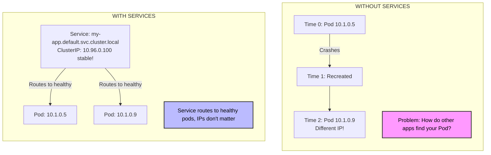
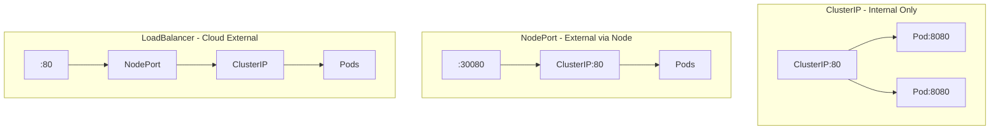

> **Complexity**: `[MEDIUM]` - Essential networking concept
>
> **Time to Complete**: 35-40 minutes
>
> **Prerequisites**: Module 4 (Deployments)

---

## What You'll Be Able to Do

After this module, you will be able to:
- **Create** Services to expose pods and explain why pods need Services (pod IPs are ephemeral)
- **Choose** between ClusterIP, NodePort, and LoadBalancer and explain when to use each
- **Test** service connectivity from inside the cluster using `curl` and DNS names
- **Debug** a service that can't reach its pods by checking labels, selectors, and endpoints

---

## Why This Module Matters

It was Black Friday, and the e-commerce platform was struggling. The engineering team noticed their payment processing pods were crashing and restarting due to memory leaks. While Kubernetes successfully recreated the pods to maintain capacity, the frontend application was hardcoded to talk to the *old* pod IP addresses. Every time a payment pod restarted, transactions failed until an engineer manually updated the frontend configuration with the new IP. They were losing thousands of dollars a minute because their internal networking couldn't adapt to ephemeral infrastructure.

Pods are ephemeral—they come and go, each with a different IP address. Services provide stable networking: a fixed IP and DNS name that routes to your Pods, no matter how many there are or how often they change.

---

## The Problem Services Solve



> **Stop and think**: If a Deployment scales up to 10 Pods, how many IP addresses does the associated Service have? 
> *(Answer: Just one. The Service maintains a single, stable IP address while distributing traffic among all 10 backing Pods.)*

---

## Creating Services

### Try It Yourself: Imperative (Quick)

```bash
# Create a deployment first
kubectl create deployment nginx --image=nginx

# Expose the deployment (defaults to ClusterIP)
kubectl expose deployment nginx --port=80

# Expose with specific type (using a different name to avoid conflict)
kubectl expose deployment nginx --port=80 --type=NodePort --name=nginx-np

# Check the service
kubectl get services
kubectl get svc              # Short form
```

### Try It Yourself: Declarative (Production)

```bash
cat <<EOF > service.yaml
apiVersion: v1
kind: Service
metadata:
  name: nginx-declarative
spec:
  selector:
    app: nginx               # Match pod labels
  ports:
  - port: 80                 # Service port
    targetPort: 80           # Container port
  type: ClusterIP            # Default type
EOF

kubectl apply -f service.yaml
```

---

## Service Types Trade-off Comparison

Choosing the right Service type is critical for security and architecture. 

| Type | Accessibility | Best For | Trade-off |
|------|---------------|----------|-----------|
| **ClusterIP** | Internal only | Backend databases, internal APIs | Cannot be reached from outside the cluster. |
| **NodePort** | External (High Port) | Quick debugging, bare-metal clusters | Exposes high ports (30000+), hard for external clients to use. |
| **LoadBalancer** | External (Standard Port) | Public-facing web apps in the Cloud | Costs money per Service, relies on an external cloud provider. |

### ClusterIP (Default)

Internal-only access within the cluster:

```yaml
apiVersion: v1
kind: Service
metadata:
  name: internal-api
spec:
  type: ClusterIP            # Default, can omit
  selector:
    app: api
  ports:
  - port: 80
    targetPort: 8080
```

```bash
# Access from within cluster only
curl http://internal-api:80
```

### NodePort

Exposes on every node's IP at a static port:

```yaml
apiVersion: v1
kind: Service
metadata:
  name: web-nodeport
spec:
  type: NodePort
  selector:
    app: web
  ports:
  - port: 80
    targetPort: 80
    nodePort: 30080          # Optional: 30000-32767 range
```

```bash
# Access from outside cluster
curl http://<node-ip>:30080
```

### LoadBalancer

Creates external load balancer (cloud environments):

```yaml
apiVersion: v1
kind: Service
metadata:
  name: web-lb
spec:
  type: LoadBalancer
  selector:
    app: web
  ports:
  - port: 80
    targetPort: 80
```

```bash
# Get external IP (cloud only)
kubectl get svc web-lb
# EXTERNAL-IP column shows the load balancer IP
```

---

## Service Diagram



---

## Service Discovery (DNS)

Kubernetes creates DNS entries for Services:

```
<service-name>.<namespace>.svc.cluster.local
```

```bash
# From any pod, you can reach:
curl nginx                           # Same namespace
curl nginx.default                   # Explicit namespace
curl nginx.default.svc               # More explicit
curl nginx.default.svc.cluster.local # Full FQDN
```

### Example

```bash
# Create a new deployment and service for DNS testing
kubectl create deployment nginx-dns --image=nginx
kubectl expose deployment nginx-dns --port=80
kubectl rollout status deployment nginx-dns
kubectl get svc nginx-dns

# Test DNS from another pod (using -i and --restart=Never for non-interactive compatibility)
kubectl run test --image=busybox --rm -i --restart=Never -- wget -qO- nginx-dns
# Returns nginx HTML!

# Test with full DNS name
kubectl run test --image=busybox --rm -i --restart=Never -- nslookup nginx-dns.default.svc.cluster.local
```

---

## Selectors: How Services Find Pods

Services use label selectors:

```yaml
# Service
spec:
  selector:
    app: nginx
    tier: frontend

# Pod (must match ALL labels)
metadata:
  labels:
    app: nginx
    tier: frontend
```

> **Pause and predict**: What happens to your Service if you manually edit a running Pod and remove the `tier: frontend` label?
> *(Answer: The Service immediately drops that Pod from its endpoints list because it no longer perfectly matches the selector, and no further traffic will be routed to it.)*

```bash
# Check what pods a service targets
kubectl get endpoints nginx
# Shows IP:Port of matched pods
```

---

## Port Mapping


```yaml
spec:
  ports:
  - port: 80           # Service port (what clients use)
    targetPort: 8080   # Container port (where app listens)
    protocol: TCP      # TCP (default) or UDP
```

---

## Tales from the Trenches: The Phantom Outage

A major streaming company experienced a bizarre outage where exactly 10% of user requests to their video catalog failed with connection timeouts. The pods were all showing as healthy, and the Service was active. After hours of debugging, a senior engineer ran `kubectl get endpoints catalog-service`. 

They discovered 10 endpoints, but one of the IP addresses belonged to a pod that had been manually deleted directly via the container runtime (Docker), bypassing Kubernetes entirely. The Service's underlying iptables rules were still routing traffic to a dead IP! The fix? Restarting the `kube-proxy` component on the affected node to flush the stale routing rules. The lesson: Always let Kubernetes manage your pod lifecycle, and always check your endpoints when traffic vanishes!

---

## Did You Know?

- **Services use iptables or IPVS.** `kube-proxy` sets up rules that route Service IPs to Pod IPs. No actual proxy process handles each connection.
- **ClusterIP is virtual.** No network interface has this IP. It only exists in iptables rules.
- **NodePort uses ALL nodes.** Even nodes without target pods will route traffic correctly to the right node.
- **Services load balance randomly** by default. Each connection might hit a different pod.

---

## Common Mistakes

| Mistake | Why It Hurts | Solution |
|---------|--------------|----------|
| Selector doesn't match pod labels | Service has no endpoints and traffic drops into a black hole. | Check `kubectl get endpoints <service-name>` to verify pods are matched. |
| Wrong `targetPort` | Connection refused errors because the service sends traffic to a port where nothing is listening. | Ensure `targetPort` matches the container's actual listening port. |
| Using pod IP instead of service name | Breaks your application the moment a pod restarts and gets a new IP. | Always configure apps to use the Service DNS name. |
| Forgetting to set `protocol: UDP` | DNS or custom UDP services fail because Services default to TCP routing. | Explicitly define `protocol: UDP` in the port configuration. |
| Exposing every microservice as a `LoadBalancer` | Skyrocketing cloud bills, as each LoadBalancer provisions a costly external cloud resource. | Use `ClusterIP` for internal services and an Ingress for HTTP routing. |
| Misconfiguring named ports | Services fail to route if the `targetPort` string doesn't perfectly match the container's port name. | Double-check spelling and case between the Service `targetPort` and Pod `ports.name`. |
| Using `NodePort` for production public traffic | Difficult to manage, requires clients to know non-standard ports (30000+), and lacks advanced routing. | Use LoadBalancer or Ingress for production external access. |

---

## Quiz

1. **Scenario**: A junior developer hardcodes the IP address of a backend database pod into the frontend configuration. The next day, the frontend cannot reach the database, even though the database pod is running perfectly. Why did this happen, and what is the Kubernetes-native solution?
   <details>
   <summary>Answer</summary>
   Pods are ephemeral, meaning they are frequently destroyed and recreated by controllers like Deployments. When the database pod was recreated (due to a node update or crash), it received a new IP address, breaking the hardcoded frontend configuration. The solution is to create a Kubernetes Service for the database, which provides a stable, unchanging IP address and DNS name that the frontend can reliably use, regardless of pod churn. By using the Service DNS name, the frontend is decoupled from the underlying network reality of the pods.
   </details>

2. **Scenario**: You are deploying a Redis cache that should strictly only be accessed by your backend API pods running in the same cluster. Security mandates that this cache must not be reachable from the public internet. Which Service type should you choose and why?
   <details>
   <summary>Answer</summary>
   You should choose `ClusterIP`, which is the default Service type in Kubernetes. A ClusterIP service assigns an internal IP address that is only routable from within the cluster itself. This perfectly satisfies the security requirement by preventing any external ingress traffic from reaching the Redis cache, while allowing the backend API pods to communicate with it seamlessly. External users cannot target this IP because it is restricted entirely to the virtual network managed by the cluster.
   </details>

3. **Scenario**: You've deployed a new web application and created a Service for it. However, when you try to access the Service, you get a "connection refused" error. You run `kubectl get pods --show-labels` and see your pods have `app=frontend,env=prod`. Your Service has a selector of `app=frontend,tier=web`. Why is the traffic failing?
   <details>
   <summary>Answer</summary>
   Services use label selectors to identify which Pods should receive traffic. For a Service to route traffic to a Pod, the Pod must possess *all* the labels specified in the Service's selector. In this scenario, the Service is looking for Pods with `tier=web`, but the Pods do not have this label. As a result, the Service has zero endpoints and drops the traffic. You must update either the Pod labels or the Service selector to match perfectly.
   </details>

4. **Scenario**: A developer is troubleshooting an issue from within a busybox testing pod in the `default` namespace. They need to test connectivity to a payment API Service that resides in the `finance` namespace. What exact DNS name should they use with their `curl` command?
   <details>
   <summary>Answer</summary>
   The developer should use `payment-api.finance` or the fully qualified domain name (FQDN) `payment-api.finance.svc.cluster.local`. Because the testing pod and the target Service are in different namespaces, simply curling `payment-api` will fail, as Kubernetes DNS resolves bare service names to the pod's *current* namespace by default. Appending the target namespace ensures the DNS resolver finds the correct Service. This namespace-scoped resolution design prevents naming collisions between different environments running on the same cluster.
   </details>

5. **Scenario**: Your team is migrating a legacy application to Kubernetes on AWS. The application needs to be accessible to external customers over the internet on standard port 80. You initially tried `NodePort`, but the security team rejected exposing ports in the 30000+ range. Which Service type is the correct architectural choice here?
   <details>
   <summary>Answer</summary>
   You should use the `LoadBalancer` Service type. When you create a LoadBalancer Service in a supported cloud environment (like AWS, GCP, or Azure), Kubernetes automatically provisions a native cloud load balancer. This external load balancer routes traffic from standard ports (like 80 or 443) on a public IP address directly to your cluster, bypassing the need for clients to use high NodePorts and satisfying the security team's requirements. It provides a production-ready, highly available entry point that integrates natively with the cloud provider's network infrastructure.
   </details>

6. **Scenario**: You have created a Service named `auth-svc` and a Deployment of auth pods. You want to verify that Kubernetes has successfully linked the Service to the Pods before you test the application from another microservice. What `kubectl` command should you run to prove the Service has discovered the Pod IPs?
   <details>
   <summary>Answer</summary>
   You should run `kubectl get endpoints auth-svc` (or `kubectl describe svc auth-svc`). The Endpoints object is automatically created and updated by Kubernetes to maintain a list of the actual IP addresses of the Pods that match the Service's label selector. If the endpoints list is empty, it immediately tells you there is a label mismatch or the pods are crashing, saving you time debugging the application code. Modern Kubernetes also uses `EndpointSlice` objects for better scalability, but the basic endpoint command still provides the quickest validation.
   </details>

7. **Scenario**: Your Node.js application listens on port 3000 inside its container. You want other pods in the cluster to reach it by calling `http://node-backend:80`. How do you configure the `port` and `targetPort` in the Service definition to make this happen?
   <details>
   <summary>Answer</summary>
   You must set the Service's `port: 80` and `targetPort: 3000`. The `port` field defines the port that the Service itself exposes to clients (the virtual port that other pods will call). The `targetPort` defines the actual port where the container application is listening. The Service acts as an internal proxy, seamlessly translating traffic arriving on port 80 and forwarding it to the pod on port 3000.
   </details>

---

## Hands-On Exercise

**Task**: Create a deployment and expose it via Service.

```bash
# 1. Create deployment
kubectl create deployment web --image=nginx --replicas=3

# 2. Expose as ClusterIP
kubectl expose deployment web --port=80

# 3. Check service and wait for pods to be ready
kubectl rollout status deployment web
kubectl get svc web
kubectl get endpoints web

# 4. Test from within cluster
kubectl run test --image=busybox --rm -i --restart=Never -- wget -qO- web

# 5. Create NodePort service
kubectl expose deployment web --port=80 --type=NodePort --name=web-external

# 6. Get NodePort
kubectl get svc web-external
# Note the port in 30000-32767 range

# 7. Cleanup
kubectl delete deployment web
kubectl delete svc web web-external
```

**Success criteria**:
- [ ] The internal `web` Service is created and has a ClusterIP assigned.
- [ ] `kubectl get endpoints web` shows three distinct pod IP addresses.
- [ ] The `wget` command from the temporary pod successfully returns the Nginx welcome HTML.
- [ ] The `web-external` Service is created with a `TYPE` of `NodePort` and a port in the 30000-32767 range.

---

## Summary

Services provide stable networking:

**Types**:
- ClusterIP - Internal only (default)
- NodePort - External via node port
- LoadBalancer - External via cloud LB

**Key concepts**:
- Selectors match pod labels
- DNS names for discovery
- Port mapping (port → targetPort)
- Endpoints show matched pods

**Commands**:
- `kubectl expose deployment NAME --port=PORT`
- `kubectl get svc`
- `kubectl get endpoints`

---

## Next Module

[Module 1.6: ConfigMaps and Secrets](../module-1.6-configmaps-secrets/) - Managing configuration.