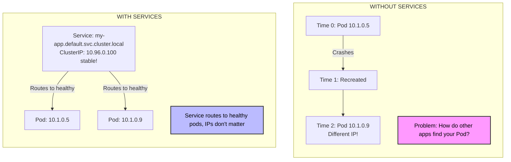
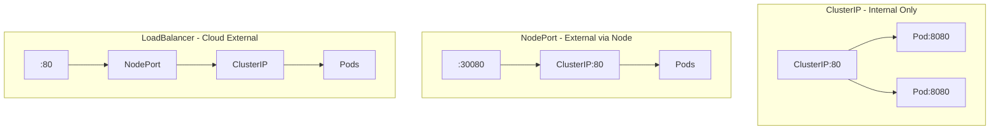
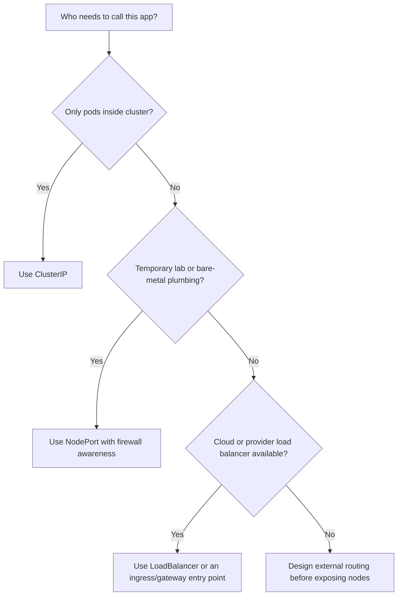

> **Complexity**: `[MEDIUM]` - Essential networking concept for every application that runs behind a controller
>
> **Time to Complete**: 35-40 minutes of reading and lab work, with extra practice time if you intentionally break selectors
>
> **Prerequisites**: Module 4 (Deployments), especially labels, replicas, rollout behavior, and why pods are replaceable

---

This module uses the common shell alias `alias k=kubectl` so the examples stay readable once the commands become repetitive. Run that alias in your terminal before the hands-on section, and read commands such as `k get svc` as normal Kubernetes CLI calls through `kubectl`. The examples target Kubernetes 1.35 and focus on the built-in Service API rather than higher-level routing systems such as Ingress or Gateway API.

## What You'll Be Able to Do

After this module, you will be able to perform the work below in a real cluster rather than only define the vocabulary. Each outcome is reflected again in the troubleshooting narrative, quiz scenarios, and lab checks, because Services are best learned by following traffic from a stable name to the selected pods behind it.

- **Design** Services that hide pod IP churn behind stable cluster DNS names and virtual IPs.
- **Compare** ClusterIP, NodePort, and LoadBalancer Services for access scope, security posture, cost, and operational fit.
- **Implement** Service manifests with selectors, `port`, `targetPort`, protocols, and named backends that match real pod labels.
- **Diagnose** Service failures by inspecting labels, selectors, Endpoints, EndpointSlices, DNS names, and the Service-to-pod port mapping.

## Why This Module Matters

During a peak sales weekend, an online retailer watched its payment success rate collapse even though Kubernetes kept recreating the payment pods exactly as designed. The frontend had been configured with individual pod IP addresses because that looked simple during a rushed migration, and every restart silently invalidated part of the routing table the application believed was true. Engineers could see healthy replacement pods, but customers saw failed checkouts, abandoned carts, and a revenue graph falling by thousands of dollars per minute while the team chased symptoms in the wrong layer.

That story is painful because nothing exotic had failed. Kubernetes treated pods as replaceable units, which is the whole point of controllers such as Deployments, but the application had treated those pods as durable network destinations. A pod IP is closer to a hotel room number than a home address: it is useful while the guest is there, but you should not print it on contracts or bake it into another service's configuration. Services exist to give applications a stable name and address while Kubernetes continues replacing, scaling, and moving pods underneath.

The lesson in this module is that stable networking is not just a convenience feature. It is the boundary that lets application code depend on an intent, such as "talk to the payment API," instead of depending on an accident, such as "talk to whichever pod currently owns 10.1.0.5." You will design that boundary, choose the right Service type, verify DNS discovery, and debug the common cases where a Service exists but still sends traffic nowhere useful.

## The Problem Services Solve

Kubernetes makes pods disposable on purpose. A Deployment can replace pods during a rollout, the scheduler can place new pods on different nodes, and a node failure can force controllers to create replacements with fresh IP addresses. That behavior is good for resilience, but it breaks the mental model many people bring from virtual machines, where a server address might stay stable for months. If one application stores another pod's IP directly, it is betting against the control plane.



A Service is a small API object with a large consequence: it creates a stable virtual destination and points that destination at a changing set of pods. Clients use the Service name or Service IP, while Kubernetes keeps the backend membership current through label selectors and endpoint objects. That means the client does not need to know whether there are two pods, ten pods, or a freshly recreated pod that arrived moments ago.

Pause and predict: if a Deployment scales from three pods to ten pods, how many Service IP addresses should clients need to learn? The answer is still one, because the Service is the contract and the pods are the implementation detail. When you catch yourself wanting to publish a list of pod IPs to another application, treat that as a design smell and ask what stable Service name should represent the group instead.

The stable address is not a physical network interface sitting on a node. In most clusters, `kube-proxy` watches Services and endpoint changes, then programs packet handling rules so traffic for the Service virtual IP reaches one of the selected pod IPs. The exact data plane can be iptables, IPVS, or an implementation supplied by the cluster networking stack, but the developer-facing promise stays the same: use the Service, not the pod IP.

This indirection is also where load distribution begins. A Service can spread connections across multiple ready pods that match its selector, which gives a simple Deployment a stable front door inside the cluster. It is not a full application load balancer with path rules, TLS policy, retries, or request-aware routing, but it is the primitive that makes those higher-level systems possible.

Readiness is the quiet partner in this design. A pod can exist, have labels, and still not be ready to receive traffic because the application is starting, warming caches, or failing a readiness probe. Kubernetes uses readiness information when building the backend set for normal Services, which prevents many rollout problems where a pod is technically running but not yet able to serve requests. That behavior is why a Service is more than a static list of matching labels.

This also explains why Services belong in the same mental category as Deployments rather than in the same category as firewall rules. A Deployment states how Kubernetes should keep pods present, and a Service states how other workloads should find the ready pods that satisfy a label contract. Neither object is interesting by itself during an incident; what matters is whether the controller, labels, readiness, endpoint data, and packet handling all agree about the application you intended to expose.

Think of the Service as the sign above a checkout counter and the pods as the individual cashiers. Customers do not need to know which cashier is working right now, and the store manager can add, remove, or rotate staff without changing the sign. If the sign points to an empty counter, customers still know where to walk, but no transaction completes. That is exactly the difference between a Service that resolves and a Service that has usable endpoints.

## Creating Services

Before creating a Service, create something worth exposing. A Deployment gives Kubernetes a controller that owns replica management, labels pods consistently, and replaces failed replicas without needing you to recreate the Service. This matters because a Service selector does not point at a Deployment object directly; it points at labels on pods, and the Deployment is usually what keeps those labels consistent across old and new replicas.

```bash
alias k=kubectl

# Create a deployment first
k create deployment nginx --image=nginx

# Expose the deployment (defaults to ClusterIP)
k expose deployment nginx --port=80

# Expose with specific type (using a different name to avoid conflict)
k expose deployment nginx --port=80 --type=NodePort --name=nginx-np

# Check the service
k get services
k get svc              # Short form
```

The imperative `k expose deployment` command is useful when you are learning or when you need a quick Service during troubleshooting. It reads the Deployment's labels, creates a selector, and writes a Service object for you. The tradeoff is that the command hides the contract until you inspect the generated object, so production teams normally commit declarative YAML where code review can catch an accidental selector, external exposure, or port mismatch.

```bash
cat <<EOF > service.yaml
apiVersion: v1
kind: Service
metadata:
  name: nginx-declarative
spec:
  selector:
    app: nginx               # Match pod labels
  ports:
  - port: 80                 # Service port
    targetPort: 80           # Container port
  type: ClusterIP            # Default type
EOF

k apply -f service.yaml
```

The declarative version makes the important fields visible. `spec.selector` tells Kubernetes which pods are eligible backends, `spec.ports[].port` tells clients which Service port to call, and `spec.ports[].targetPort` tells the data plane where the selected pods actually listen. If your application listens on port 8080 but you publish `targetPort: 80`, the Service may look valid while every connection fails at the pod boundary.

Pause and predict: before running `k get endpoints nginx-declarative`, what output would prove that the Service has found real pods rather than just existing as an empty virtual IP? You should expect one or more pod IP and port pairs. An empty endpoint list is not a DNS problem, a load balancer problem, or an application problem yet; it first says the Service selector did not currently match ready pod backends.

A useful worked example is a frontend Deployment with labels `app=frontend` and `tier=web`. A Service with `selector: app: frontend` will include all pods with that app label, even if later you add canary pods that should not receive normal traffic. A Service with both `app: frontend` and `tier: web` is more restrictive, because every selector label must be present on the pod. That precision is powerful, but it also makes label drift one of the most common causes of silent Service outages.

When you write Service YAML, resist the urge to treat labels as decoration. Labels are part of the routing contract, so they deserve the same care you would give a function signature or database schema. A Deployment template can change labels only on newly created pods, which means a careless rollout may leave old and new pods with different labels for a while. During that window, a Service can select fewer pods than you expected, and the failure may look like intermittent capacity loss instead of a clean outage.

Declarative Services also make review possible across teams. The application team can confirm the container port, the platform team can confirm the exposure type, and the security team can confirm that internal APIs are not published outside the cluster. Imperative commands are excellent for experiments because they teach object behavior quickly, but the YAML is the durable artifact that records the decision. In production, the difference between a remembered command and a reviewed manifest often shows up during the next incident.

Another useful habit is to inspect the Service immediately after creating it, even if the command appeared to succeed. A Service can be accepted by the API server while still representing the wrong workload because selectors are just labels, not references to a specific controller. If `k get svc` and `k describe svc` do not match the application story in your head, stop and correct that mismatch before adding more routing layers on top.

## Service Types Trade-off Comparison

Service type is an architectural decision, not a formatting choice. ClusterIP answers the question "how do workloads inside this cluster reach this application?" NodePort answers "how can something outside the cluster reach a port opened on every node?" LoadBalancer answers "how can the cloud or infrastructure provider create an external load balancer that forwards into this Service?" Each option widens the network boundary, so each option should also make you think about security, cost, and ownership.

| Type | Accessibility | Best For | Trade-off |
|------|---------------|----------|-----------|
| **ClusterIP** | Internal only | Backend databases, internal APIs | Cannot be reached from outside the cluster. |
| **NodePort** | External high port | Quick debugging, bare-metal clusters | Exposes high ports in the 30000-32767 range, hard for external clients to use. |
| **LoadBalancer** | External standard port | Public-facing web apps in the cloud | Costs money per Service, relies on an external cloud provider or load balancer integration. |

ClusterIP is the default because most Service traffic is internal. A backend API, Redis cache, metrics collector, or database proxy usually should not have a public address just because another pod needs to call it. Keeping those Services internal reduces accidental exposure and keeps the networking shape easier to reason about: clients inside the cluster use DNS, and external entry points are handled by a smaller number of deliberately exposed components.

```yaml
apiVersion: v1
kind: Service
metadata:
  name: internal-api
spec:
  type: ClusterIP            # Default, can omit
  selector:
    app: api
  ports:
  - port: 80
    targetPort: 8080
```

```bash
# Access from within cluster only
curl http://internal-api:80
```

NodePort opens a port from the configured Service range on every node and forwards traffic to the Service backends. It is helpful for quick experiments, lab environments, and some bare-metal designs where you pair it with your own external load balancer, but it is rarely the cleanest public interface for end users. Clients must know a node address and a high port, firewall rules become more visible, and production routing concerns such as TLS and host-based routing are usually better handled above the Service layer.

```yaml
apiVersion: v1
kind: Service
metadata:
  name: web-nodeport
spec:
  type: NodePort
  selector:
    app: web
  ports:
  - port: 80
    targetPort: 80
    nodePort: 30080          # Optional: 30000-32767 range
```

```bash
# Access from outside cluster
curl http://<node-ip>:30080
```

LoadBalancer builds on the lower layers by asking the environment to provision an external load balancer and connect it to the Service. In a managed cloud cluster, that can produce a reachable external IP or hostname without manually configuring node addresses. The convenience is real, but so is the cost and operational footprint, because each LoadBalancer Service may create billable infrastructure and security rules outside the Kubernetes API object you are editing.

```yaml
apiVersion: v1
kind: Service
metadata:
  name: web-lb
spec:
  type: LoadBalancer
  selector:
    app: web
  ports:
  - port: 80
    targetPort: 80
```

```bash
# Get external IP (cloud only)
k get svc web-lb
# EXTERNAL-IP column shows the load balancer IP
```

Pause and predict: if you create a `LoadBalancer` Service, does it also consume a NodePort and a ClusterIP under the hood? In the common implementation, yes, because these Service types build on each other like nesting dolls: the external load balancer forwards to node-level plumbing, and the Service virtual IP still represents the cluster-internal destination. Kubernetes has options that can change pieces of this behavior, but the beginner mental model should be layered rather than isolated.



The practical decision is to start with the narrowest access scope that satisfies the caller. If only pods call the application, use ClusterIP and let DNS do the work. If you need quick external access in a lab, NodePort is acceptable as long as you recognize its limits. If real users or systems outside the cluster need stable standard-port access, LoadBalancer or a higher-level routing layer becomes the more operationally honest choice.

ClusterIP also keeps ownership boundaries cleaner. An internal backend Service can be owned by the application team without asking cloud administrators to approve a public load balancer, assign certificates, or manage internet-facing firewall rules. That narrower scope reduces the amount of infrastructure that must be correct for the application to function. When the caller is already inside the cluster, making traffic leave and reenter through public networking usually adds cost and failure modes without adding value.

NodePort deserves respect because it is simple, visible, and useful when you are close to the infrastructure. Many bare-metal clusters use NodePort behind an external load balancer that the organization already owns, and many local clusters expose lab workloads through NodePort because there is no cloud provider to provision anything else. The mistake is not using NodePort; the mistake is forgetting that clients now depend on node reachability and high ports instead of a polished application entry point.

LoadBalancer is strongest when Kubernetes and the infrastructure provider are meant to cooperate. In a managed cloud, the Service object becomes a request for cloud networking, and the provider controller reconciles that request into an external resource. That is convenient, but it makes deletion, cost allocation, firewall policy, annotations, and health checks part of your operational model. Treat each LoadBalancer as real infrastructure, because the cloud does.

Service type decisions can also change over an application's lifetime. A new API might begin as ClusterIP while another internal service integrates with it, then later sit behind an ingress controller when browser clients arrive. That evolution is healthy when the team changes the boundary deliberately. It becomes unhealthy when every temporary test exposure stays in production because nobody can remember whether a high NodePort is still needed.

## Service Discovery and DNS

Kubernetes Service discovery gives every normal Service a DNS name, which is usually more important to applications than the numeric ClusterIP. Names are stable, readable, and namespace-aware, so configuration can say `http://payments.finance` instead of carrying a brittle IP. This also lets different namespaces reuse simple names, because `api.default` and `api.staging` are distinct DNS targets even though the short name `api` might appear in both environments.

```text
<service-name>.<namespace>.svc.cluster.local
```

```bash
# From any pod, you can reach:
curl nginx                           # Same namespace
curl nginx.default                   # Explicit namespace
curl nginx.default.svc               # More explicit
curl nginx.default.svc.cluster.local # Full FQDN
```

The short form works only when the client pod is in the same namespace as the Service. That default is convenient during simple demos, but it can hide bugs when teams move applications into separate namespaces for staging, finance, platform, or tenant isolation. When debugging cross-namespace traffic, use at least `<service>.<namespace>` so you are not accidentally testing a different Service with the same short name.

```bash
# Create a new deployment and service for DNS testing
k create deployment nginx-dns --image=nginx
k expose deployment nginx-dns --port=80
k rollout status deployment nginx-dns
k get svc nginx-dns

# Test DNS from another pod (using -i and --restart=Never for non-interactive compatibility)
k run test --image=busybox --rm -i --restart=Never -- wget -qO- nginx-dns
# Returns nginx HTML!

# Test with full DNS name
k run test --image=busybox --rm -i --restart=Never -- nslookup nginx-dns.default.svc.cluster.local
```

DNS proves name resolution, but it does not prove the application is healthy. A Service name can resolve even when the selector matches no pods, and a Service can have endpoints even when the container port is wrong. Good troubleshooting separates these layers: first prove the name resolves, then prove the Service has endpoints, then prove the endpoint port accepts traffic from a test pod in the same network context.

Before running this, what output do you expect from the `wget` command when the Service is wired correctly? You should expect the Nginx welcome HTML, not merely a successful DNS lookup. If DNS succeeds but the HTTP request times out or gets connection refused, keep moving down the chain toward endpoint readiness, labels, and port mapping instead of repeatedly editing the client.

War story: a platform team once lost hours on a "DNS outage" because a temporary debug pod in `default` curled `orders` while the real Service lived in `commerce`. The short name resolved to an unrelated stub Service in `default`, so every test was technically successful and operationally useless. The fix was not a CoreDNS change; it was the habit of writing namespace-qualified names during incident response.

DNS search paths are convenient until they hide the namespace you meant. Inside a pod, the resolver is normally configured so a short Service name is expanded through namespace and cluster suffixes. That saves typing for common same-namespace calls, but it means humans must be explicit when a test crosses a namespace boundary. During troubleshooting, prefer the name that communicates intent to the next engineer reading your shell history.

Another practical point is that DNS answers can outlive your patience during rapid tests. Clients, language runtimes, and intermediary libraries may cache lookups differently, so a fast sequence of create, delete, and recreate operations can produce confusing results. The Service abstraction is stable, but your debugging client may not ask the DNS server every time. When a name seems stale, test from a fresh temporary pod and inspect the Service and endpoint objects directly.

DNS also does not replace configuration discipline. Applications still need the correct service name, namespace, scheme, and port in their settings. A common beginner mistake is proving `nslookup` works and then forgetting that the application is using `https` against a plain HTTP backend or calling the wrong port. Name resolution answers "where is the Service name," while application connectivity answers "can this client speak the expected protocol to that backend."

## Selectors, Endpoints, and Port Mapping

Services find pods through label selectors, and selectors are exact enough to deserve careful review. If a Service selector says `app: nginx` and `tier: frontend`, a pod must have both labels to be selected. Extra labels on the pod are fine, but missing one required label removes that pod from the backend set immediately, which is why a harmless-looking label rename can create a complete outage.

```yaml
# Service
spec:
  selector:
    app: nginx
    tier: frontend

# Pod (must match ALL labels)
metadata:
  labels:
    app: nginx
    tier: frontend
```

The selected pods are represented through endpoint data, historically by Endpoints objects and at scale by EndpointSlices. For a beginner, the key idea is simple: endpoint data is the live list of backend pod IPs and ports the Service can route to. When that list is empty, traffic has nowhere useful to go, even if the Service object, DNS record, and ClusterIP all exist.

```bash
# Check what pods a service targets
k get endpoints nginx
# Shows IP:Port of matched pods
```

Pause and predict: what happens to your Service if you manually edit a running pod and remove the `tier: frontend` label? The Service immediately drops that pod from its endpoint set because it no longer perfectly matches the selector. If that was the only matching pod, clients still resolve the Service name, but there are no ready backends behind it.

Port mapping adds another layer where the object can look right while traffic fails. The Service `port` is what clients call, while `targetPort` is where the application listens inside each selected pod. That translation lets you expose a clean internal contract like `http://node-backend:80` even when the container process listens on port 3000, but it also means you must know the real application port rather than copying random examples.


```yaml
spec:
  ports:
  - port: 80           # Service port (what clients use)
    targetPort: 8080   # Container port (where app listens)
    protocol: TCP      # TCP (default) or UDP
```

Named ports are a useful refinement when teams maintain larger manifests. A container can name its port `http`, and the Service can use `targetPort: http`, which survives a future port-number change as long as the name remains accurate. The tradeoff is that spelling now matters as much as the number did; a mismatched port name can produce a Service that selects pods but forwards to no valid application listener.

For diagnosis, think in a chain rather than a single command. `k get svc` tells you the Service exists and shows its type, cluster IP, and published ports. `k describe svc` shows selectors and events. `k get endpoints` or `k get endpointslices` shows whether Kubernetes found ready backends. A test pod using `wget`, `curl`, or `nslookup` then proves what a real in-cluster client experiences.

The original phantom outage story illustrates why endpoints matter. A streaming company's catalog API showed healthy pods and an active Service, yet a slice of traffic timed out after operational work bypassed Kubernetes and left stale dataplane state on one node. The senior engineer who checked endpoint and proxy state found that requests were still being steered toward a dead address from one node's rules, and restarting the affected `kube-proxy` cleared the stale path. The lesson is not to restart components randomly; it is to prove where the Service contract and the data plane disagree.

EndpointSlice is worth knowing even in a beginner module because modern clusters use it heavily. The old Endpoints object is easy to read for small examples, but a very large Service can have enough backends that a single object becomes inefficient to update and watch. EndpointSlices divide backend information into smaller pieces, which helps the control plane and networking components scale. In day-to-day debugging, the idea stays familiar: you are still asking which pod IPs and ports the Service currently believes are valid backends.

Port mapping should be tested from the same side that clients use. Testing inside the container proves the process listens on a port, but it does not prove the Service sends traffic to that port. Testing the pod IP directly can prove the pod network path, but it bypasses the Service. Testing the Service name from a temporary pod exercises DNS, Service virtual IP handling, selector membership, and target port translation together, which is usually the test that matches user-facing symptoms.

Readiness can make endpoint behavior look mysterious if you are not expecting it. A pod that matches labels but fails readiness should not receive normal Service traffic, and that is usually what you want during startup or partial failure. If endpoints are missing for pods that look alive, check readiness conditions before changing selectors. The Service may be protecting clients from a pod that is running but not actually ready to serve.

Selectors and target ports also interact with rollouts. Imagine version one of an application listens on port 8080 and version two listens on port 9090, but both versions share the same Service selector during a rolling update. If the Service has one numeric `targetPort`, one version may fail until the rollout completes. A named port can reduce that risk when each pod version maps the same name to its correct container port, but only if the names are kept consistent.

## Patterns & Anti-Patterns

Good Service design starts by naming the contract the client actually needs. A Service called `payments-api` should represent the stable backend for payment calls, not a particular rollout, pod hash, or node. That contract lets Deployments, rollouts, readiness probes, and scaling change the implementation while clients keep using the same name. The pattern works best when labels are intentional, reviewed, and shared between Deployment templates and Service selectors.

| Pattern | When to Use It | Why It Works | Scaling Consideration |
|---------|----------------|--------------|-----------------------|
| Stable ClusterIP per internal app | Workloads call each other only inside the cluster | Keeps public exposure narrow while giving clients a durable DNS name | Use namespace-qualified names when teams share clusters. |
| Selector labels owned by the workload contract | A Deployment and Service represent one application role | Prevents accidental selection of canaries, jobs, or unrelated pods | Keep selector labels boring and stable across rollouts. |
| Service port as client contract | Containers listen on implementation-specific ports | Lets clients call simple ports while pods use their natural application ports | Use named `targetPort` when port numbers change across versions. |
| Endpoint-first troubleshooting | A Service exists but traffic fails | Separates name resolution, selector matching, and backend reachability | Check EndpointSlices in larger clusters where endpoint scale matters. |

The strongest anti-pattern is publishing pod IPs to other applications. Teams usually do it because it works during the first manual test, and a direct IP feels concrete when Service concepts are still new. It fails because the IP belongs to a temporary pod, not to the application contract. The better alternative is to create a Service early, even in a small lab, so every consuming application learns the stable name from the beginning.

Another anti-pattern is exposing every workload as a LoadBalancer because it feels production-ready. In cloud clusters, that can create unnecessary external infrastructure, broaden the attack surface, and make cost harder to control. A better design normally keeps most workloads as ClusterIP Services and uses a limited set of external entry points, such as a LoadBalancer for an ingress controller, Gateway, or a truly public service that needs its own load balancer.

NodePort misuse is subtler. It is perfectly valid for labs, break-glass debugging, or integration with a separately managed load balancer, but using high node ports as the primary customer-facing API couples clients to node addresses and cluster firewall details. If the caller is a browser user, partner system, or production mobile app, choose a cleaner external entry point and keep NodePort as plumbing rather than product surface.

Selectors that are too broad create the opposite problem from selectors that match nothing. A selector like `app: web` might accidentally include old replicas, preview pods, or a one-off diagnostic pod if those resources reuse the same label. Use labels that describe the Service contract, and avoid changing selector labels casually because a Service selector is usually immutable in spirit even when Kubernetes lets you edit it.

The most reliable pattern is to keep routing labels boring and separate from labels used for organization, billing, dashboards, or ownership. Labels such as `team`, `track`, or `release` may change for reasons unrelated to traffic, so they are risky as Service selectors unless they truly define the backend set. Labels such as `app.kubernetes.io/name` and a stable role label can be a better foundation because they describe what the pod is rather than which report should include it.

Another pattern is to create Services early in a feature branch or preview environment, not at the end of a release. Early Services force you to name the application contract, decide the expected port, and discover label mismatches before other teams integrate. They also make local smoke tests resemble production traffic paths. Waiting until the release window to add a Service turns networking into a final assembly problem, where mistakes are harder to isolate.

Avoid using a Service to paper over an unhealthy application. If readiness probes are failing, pods are crash-looping, or the application listens on the wrong interface, changing Service types will not make the backend healthy. Services are routing contracts, not healing mechanisms for application bugs. The right move is to fix the backend health signal, then let the Service route only to backends that can honor the contract.

## Decision Framework

Choose a Service by starting with the caller, not with the application. If the caller is another pod in the same cluster, the narrow answer is ClusterIP. If the caller is outside the cluster and you are doing a quick lab or bare-metal integration, NodePort may be acceptable. If the caller is outside the cluster and expects normal ports, stable external addressing, and cloud-managed availability, LoadBalancer is the stronger fit.



The framework is intentionally conservative because exposure is easier to add than to unwind after clients depend on it. A database that starts as a public LoadBalancer may force emergency firewall work later, while a ClusterIP database can still be reached by internal APIs and maintenance jobs. In the same way, a web app can begin as ClusterIP behind an ingress controller and later receive a dedicated LoadBalancer only when a real requirement justifies it.

When two Service types seem plausible, write down the caller path in one sentence. "Pods in namespace `shop` call `payments.finance`" points to ClusterIP and namespace-qualified DNS. "A hardware load balancer forwards to every worker node on a fixed high port" points to NodePort as infrastructure plumbing. "Internet clients need a provider-managed external address for this one Service" points to LoadBalancer. The sentence often exposes assumptions that a table cannot.

Security review should happen before the first public address appears. A ClusterIP Service can still be risky if untrusted workloads share the cluster network, but it is not automatically reachable from the internet. A NodePort or LoadBalancer changes the conversation because traffic can arrive from outside the workload namespace and possibly outside the organization. That wider path should trigger questions about allowed sources, TLS termination, authentication, rate limits, and logging.

Cost review matters for the same reason. ClusterIP is a Kubernetes object using cluster networking, while LoadBalancer often maps to external cloud resources with billing and quotas. In a small environment, one accidental LoadBalancer may be only annoying; across dozens of teams, the pattern becomes expensive and hard to audit. A good platform gives teams an approved external routing path so they do not create one-off load balancers for every internal dependency.

Use `k get svc` as a quick audit tool after applying any Service, but do not stop there. For a ClusterIP, confirm the type is internal and test from a pod. For a NodePort, confirm the allocated port and check whether every node should really accept that traffic. For a LoadBalancer, confirm the external address, cloud resource, firewall behavior, and whether the cost matches the intended architecture.

Which approach would you choose here and why: a metrics scraper inside the cluster needs to pull `/metrics` from twenty application pods, but no user should ever reach that endpoint from the internet? The right answer is usually a ClusterIP Service, because the scraper is an internal client and the endpoint should not become public. If the team later needs external dashboards, expose the dashboard deliberately rather than exposing every scraped workload.

## Did You Know?

- **Services date back to Kubernetes v1.0 in 2015.** Stable Service discovery was part of the original API surface because pod churn was never meant to be hidden from operators by pretending pods were permanent servers.
- **ClusterIP addresses are virtual.** In many clusters, no network interface owns the Service IP; packet rules or the cluster networking implementation translate that destination to selected pod endpoints.
- **NodePort normally uses the 30000-32767 range.** That range keeps Service ports away from common low ports, but it also explains why NodePort is awkward as a human-facing production URL.
- **EndpointSlice became stable in Kubernetes v1.21.** EndpointSlices split backend endpoint data into smaller resources so large Services can scale better than a single giant Endpoints object.

## Common Mistakes

| Mistake | Why It Happens | How to Fix It |
|---------|----------------|---------------|
| Selector does not match pod labels | The Service exists, DNS resolves, and the ClusterIP looks valid, so teams assume routing is configured. | Compare `k describe svc <name>` with `k get pods --show-labels`, then make the Deployment template labels and Service selector match. |
| Wrong `targetPort` | The manifest copies a sample port while the container process listens somewhere else. | Inspect the container port or application config, then set `targetPort` to the real listener or a correctly named container port. |
| Using pod IP instead of Service DNS | Direct IP tests work briefly, so the temporary address gets copied into application configuration. | Configure clients with the Service DNS name, preferably namespace-qualified when crossing namespaces. |
| Forgetting `protocol: UDP` | Service ports default to TCP, and UDP workloads are less common in beginner examples. | Set `protocol: UDP` explicitly for DNS-like or custom UDP services and test with a UDP-capable client. |
| Exposing every microservice as a `LoadBalancer` | External access feels simpler than designing internal routing and shared entry points. | Keep internal workloads on ClusterIP and expose only deliberate public entry points through LoadBalancer, Ingress, or Gateway API. |
| Misconfiguring named ports | The Service uses a string `targetPort`, but the pod port name has different spelling or case. | Keep port names consistent between pod specs and Service specs, and verify endpoint ports after each change. |
| Using `NodePort` as the main public API | It works in a lab, so teams keep high ports and node addresses in production client paths. | Use LoadBalancer or a higher-level HTTP routing layer for production external traffic, and reserve NodePort for specific infrastructure needs. |

## Quiz

<details>
<summary>Scenario: A frontend was configured with the IP of a database pod, and it breaks after a node maintenance window even though the database Deployment is healthy. What do you change?</summary>

Create or repair a Service for the database and configure the frontend to use the Service DNS name rather than the pod IP. The database pod received a new IP when Kubernetes recreated it, which is normal behavior for an ephemeral pod. A Service gives the database role a stable virtual IP and DNS name while selectors keep the backend pod list current. This answer maps directly to the design outcome: hide pod IP churn behind a stable Service contract.
</details>

<details>
<summary>Scenario: A Redis cache must be reachable only from backend pods in the same cluster. Which Service type fits, and what risk does it avoid?</summary>

Use a ClusterIP Service because the caller is internal and the cache should not have an external entry point. ClusterIP gives backend pods a stable DNS name while keeping access inside the cluster network. Choosing NodePort or LoadBalancer would widen the reachable surface and create firewall or cloud-resource concerns that the requirement does not justify. The secure default is the narrowest Service type that satisfies the caller.
</details>

<details>
<summary>Scenario: A web Service selects `app=frontend,tier=web`, but the pods show `app=frontend,env=prod`; DNS resolves but requests time out. What is the first diagnosis?</summary>

The Service selector does not match the pods, so the Service likely has no usable endpoints. Services require every selector label to be present on a pod before that pod becomes a backend. Run `k get endpoints <service>` or inspect EndpointSlices to confirm the empty backend set, then update either the Deployment template labels or the Service selector so they represent the same workload contract. Do not start by changing DNS because DNS can resolve an empty Service.
</details>

<details>
<summary>Scenario: A test pod in `default` needs to call `payment-api` in the `finance` namespace. Which DNS name should it use, and why?</summary>

Use `payment-api.finance` or the fully qualified `payment-api.finance.svc.cluster.local`. A bare Service name resolves relative to the caller's namespace, so `payment-api` from `default` searches for a Service in `default` first. Namespace qualification prevents accidental success against the wrong Service and makes incident commands easier to review. The full name is verbose, but it removes ambiguity during cross-namespace debugging.
</details>

<details>
<summary>Scenario: A Node.js container listens on port 3000, but other pods should call `http://node-backend:80`. How should the Service ports be implemented?</summary>

Set the Service `port` to 80 and `targetPort` to 3000. The Service port is the stable client-facing contract, while the target port is the implementation detail inside the selected pods. This mapping lets clients use a conventional HTTP port even though the Node.js process listens on its natural application port. If the container port is named, using the name as `targetPort` can make later number changes safer.
</details>

<details>
<summary>Scenario: Your team wants customer traffic on standard port 80 in a managed cloud cluster, and security rejects public high node ports. Which Service approach should you compare against NodePort?</summary>

Compare NodePort with LoadBalancer, and choose LoadBalancer when the application truly needs its own cloud-managed external entry point. A LoadBalancer Service can provision a provider load balancer with a normal external address and standard ports, while NodePort exposes high ports on nodes. You should still consider whether an ingress or gateway layer is a better shared entry point, but the direct replacement for high-port node exposure is not another ClusterIP. The key tradeoff is cleaner external access versus provider cost and infrastructure ownership.
</details>

<details>
<summary>Scenario: A Service exists, but users report intermittent failures after a rollout. Which checks prove whether the problem is selectors, endpoints, DNS, or port mapping?</summary>

Start with `k get svc` and `k describe svc` to confirm the Service type, ports, and selector. Then check `k get endpoints` or EndpointSlices to verify that ready pod IPs and ports are present. From a temporary pod, test DNS resolution and an actual HTTP request so you distinguish name lookup from application reachability. If endpoints exist but requests fail, inspect `targetPort`, pod readiness, and the container's real listening port before blaming the Service object itself.
</details>

## Hands-On Exercise

In this exercise, you will create a small Nginx Deployment, expose it with a ClusterIP Service, prove that DNS and endpoints work from inside the cluster, then create a NodePort Service to compare the external shape. The sequence is intentionally close to day-to-day troubleshooting: create the contract, inspect the contract, test from a client pod, and then clean up the resources you created.

### Setup

Run the alias once if you have not already done so in this shell. The lab assumes a working Kubernetes 1.35 or newer cluster and a namespace where you can create Deployments, Services, and temporary pods.

```bash
alias k=kubectl
```

### Task 1: Create the workload

Create a three-replica Deployment so the Service has multiple pod backends to discover. Waiting for rollout completion matters because a Service can select pods before the application is actually ready, and you want the first endpoint check to reflect healthy backends rather than a rollout in progress.

```bash
k create deployment web --image=nginx --replicas=3
k rollout status deployment web
k get pods -l app=web --show-labels
```

<details>
<summary>Solution notes</summary>

You should see three pods with an `app=web` label because `k create deployment` generates that label for this Deployment. If the pods are still pending or creating, wait before exposing and testing the Service. The Service selector in the next task depends on these labels, so this is the first place to catch a mismatch.
</details>

### Task 2: Expose the Deployment as ClusterIP

Expose the Deployment and inspect both the Service and the endpoint list. This validates the core implementation outcome: the Service exists as a stable client destination, and Kubernetes has discovered the actual pod IP and port backends behind it.

```bash
k expose deployment web --port=80
k get svc web
k get endpoints web
```

<details>
<summary>Solution notes</summary>

The `web` Service should show `TYPE` as `ClusterIP`, and the endpoint list should contain three pod IP and port entries for port 80. If the endpoint list is empty, compare the Service selector with `k get pods --show-labels` before testing DNS. Empty endpoints mean the Service contract has no selected ready backends.
</details>

### Task 3: Test DNS and HTTP from inside the cluster

Launch a temporary BusyBox pod and request the Service by name. This step proves more than object creation: it proves that an in-cluster client can resolve the Service name and receive an HTTP response from one of the selected pods.

```bash
k run test --image=busybox --rm -i --restart=Never -- wget -qO- web
k run test --image=busybox --rm -i --restart=Never -- nslookup web.default.svc.cluster.local
```

<details>
<summary>Solution notes</summary>

The `wget` command should print the Nginx welcome page, while `nslookup` should resolve the Service name. If DNS resolves but `wget` fails, look at endpoints and `targetPort`. If DNS does not resolve, confirm the Service name and namespace before changing the application.
</details>

### Task 4: Add a NodePort Service for comparison

Create a second Service pointing at the same Deployment, but this time publish it as NodePort. You are not making this the recommended production path; you are observing how the Service type changes the externally visible shape while the backend pod selection stays label-driven.

```bash
k expose deployment web --port=80 --type=NodePort --name=web-external
k get svc web-external
k describe svc web-external
```

<details>
<summary>Solution notes</summary>

The `web-external` Service should show `TYPE` as `NodePort` and include a high allocated node port in the Service range. The selector should still point at the `app=web` pods, which shows that Service type changes exposure but not the basic label-selection model. In a local lab, actual outside access depends on how your cluster exposes node networking.
</details>

### Task 5: Break and repair the selector

Patch the Service selector to an intentionally wrong value, observe the endpoint list, then restore the selector. This is the fastest way to make the most common Service failure visible in a safe lab environment.

```bash
k patch svc web -p '{"spec":{"selector":{"app":"missing-web"}}}'
k get endpoints web
k patch svc web -p '{"spec":{"selector":{"app":"web"}}}'
k get endpoints web
```

<details>
<summary>Solution notes</summary>

After the broken selector, the endpoint list should become empty because no pod has `app=missing-web`. After restoring `app=web`, the endpoint list should repopulate with the three backend pod IPs. This is the diagnosis loop you will use in real incidents: Service exists, selector changes, endpoints reveal whether traffic has somewhere to go.
</details>

### Cleanup

Delete the Deployment and both Services so the namespace returns to its original state. Cleaning up deliberately is part of the exercise because abandoned NodePort or LoadBalancer objects can create confusing future tests and unnecessary infrastructure exposure.

```bash
k delete deployment web
k delete svc web web-external
```

**Success criteria**: use this checklist to confirm that you designed a stable Service contract, implemented the selector and port mapping correctly, compared Service types, and diagnosed the most common empty-endpoints failure mode.

- [ ] Design check: the internal `web` Service is created as a stable ClusterIP destination for the `app=web` pods.
- [ ] Implementation check: `k get endpoints web` shows three distinct pod IP addresses before you break the selector.
- [ ] Discovery check: the temporary pod resolves `web.default.svc.cluster.local` and the `wget` command returns the Nginx welcome HTML.
- [ ] Comparison check: the `web-external` Service is created with a `TYPE` of `NodePort` and a port in the 30000-32767 range.
- [ ] Diagnosis check: changing the selector empties the endpoints list, and restoring the selector repopulates it.

## Sources

- [Kubernetes Services, Load Balancing, and Networking](https://kubernetes.io/docs/concepts/services-networking/service/)
- [Kubernetes DNS for Services and Pods](https://kubernetes.io/docs/concepts/services-networking/dns-pod-service/)
- [Kubernetes Service API reference](https://kubernetes.io/docs/reference/kubernetes-api/service-resources/service-v1/)
- [Kubernetes EndpointSlice concept](https://kubernetes.io/docs/concepts/services-networking/endpoint-slices/)
- [Kubernetes EndpointSlice API reference](https://kubernetes.io/docs/reference/kubernetes-api/service-resources/endpoint-slice-v1/)
- [Kubernetes Connecting Applications with Services](https://kubernetes.io/docs/tutorials/services/connect-applications-service/)
- [Kubernetes Using Source IP](https://kubernetes.io/docs/tutorials/services/source-ip/)
- [Kubernetes Debug Services](https://kubernetes.io/docs/tasks/debug/debug-application/debug-service/)
- [Kubernetes Ports and Protocols](https://kubernetes.io/docs/reference/networking/ports-and-protocols/)
- [Kubernetes Service Internal Traffic Policy](https://kubernetes.io/docs/concepts/services-networking/service-traffic-policy/)

## Next Module

[Module 1.6: ConfigMaps and Secrets](../module-1.6-configmaps-secrets/) - Next you will separate application configuration from container images and learn how Kubernetes injects settings safely into workloads.
