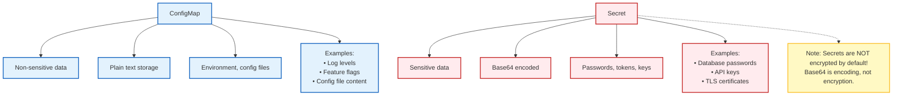
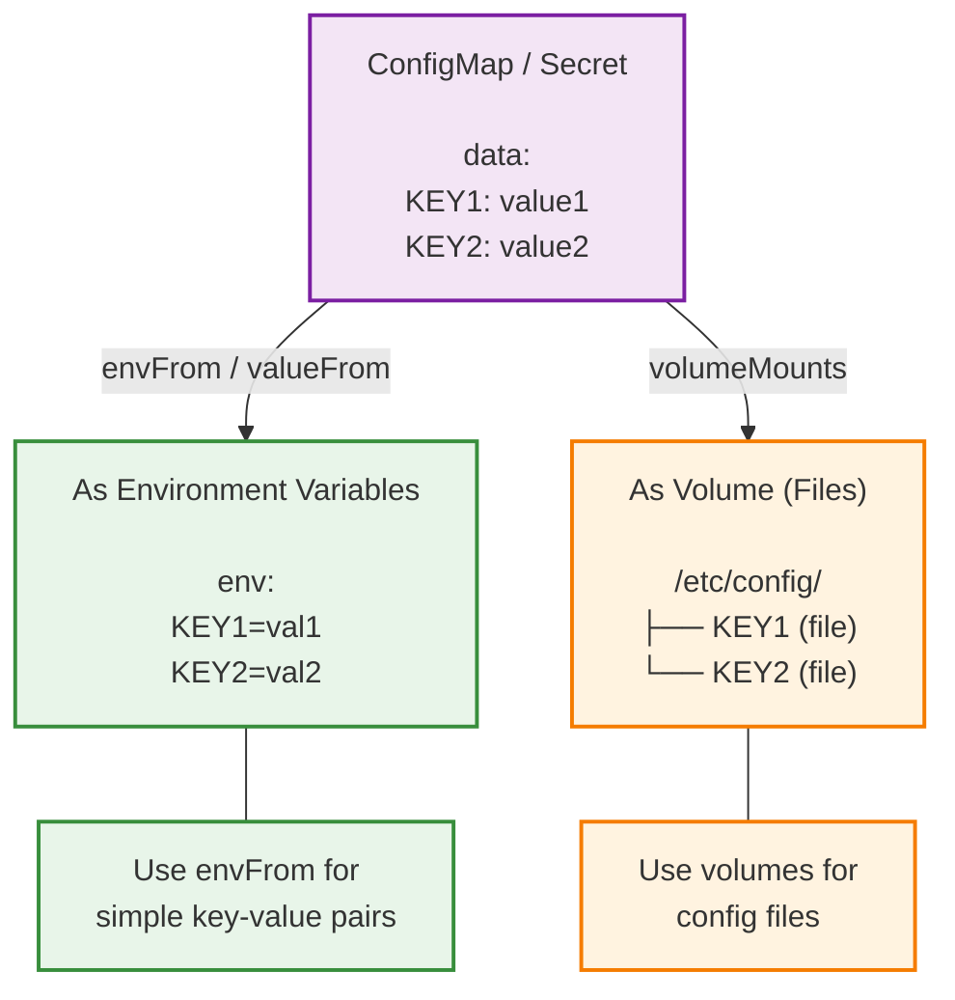

> **Complexity**: `[MEDIUM]` - Essential configuration management
>
> **Time to Complete**: 35-40 minutes
>
> **Prerequisites**: Module 1.3 (Pods)

In late 2016, a catastrophic failure in secret management cost rideshare giant Uber a staggering $148 million in regulatory fines, alongside immeasurable reputational damage. The breach did not stem from a sophisticated zero-day exploit or a nation-state hacking syndicate. Instead, attackers compromised a private GitHub repository used by Uber's engineering team. Inside the repository's source code, the attackers discovered hardcoded AWS credentials—plaintext keys that granted broad access to the company's cloud infrastructure. With these credentials, the intruders accessed an Amazon S3 datastore containing the personal information of 57 million riders and drivers.

This devastating incident highlights a fundamental rule of modern software engineering: sensitive configuration must never be embedded within application code or container images. Hardcoding credentials not only exposes them to anyone with read access to the version control system but also guarantees that rotating a compromised password requires a full recompilation and redeployment of the application. In a cloud-native environment, configuration and code must evolve independently, allowing operators to rotate keys instantly without touching the underlying deployment artifacts.

Kubernetes solves this problem through two core API resources: ConfigMaps and Secrets. These objects allow you to decouple configuration artifacts from container image content, ensuring your applications remain portable, configurable, and secure. However, as many organizations have discovered the hard way, simply moving a password into a Kubernetes Secret does not magically secure it. In this module, we will explore the internal mechanics of these resources, how they interact with the kubelet, and the critical security boundaries you must enforce to prevent your cluster from becoming the next headline.

## What You'll Be Able to Do

After completing this module, you will be able to:
- **Design** decoupled deployment architectures by extracting hardcoded environment variables and configuration files into externalized Kubernetes API objects.
- **Implement** dynamic configuration updates for running pods by leveraging volume mounts and understanding the kubelet's synchronization delays.
- **Diagnose** common failure modes related to secret consumption, including base64 encoding errors, namespace boundary violations, and static Pod limitations.
- **Compare** the security postures of various encryption-at-rest providers, evaluating the transition from legacy KMS v1 to the modern KMS v2 architecture.
- **Evaluate** the performance benefits of immutable ConfigMaps and Secrets in large-scale, high-churn Kubernetes clusters.

## The Core Concept: Separation of Configuration and Code

The Third Factor of the influential "Twelve-Factor App" methodology states: *Store config in the environment*. Configuration is defined as everything that is likely to vary between deployments (staging, production, developer environments). This includes database URIs, external API credentials, and application-specific toggle flags.

When you package an application into a Docker container, the filesystem is baked into an immutable image. If you hardcode a database connection string into a configuration file inside that image, you must build a distinct image for your staging environment and another for production. This violates the principle of artifact promotion, where the exact same binary or image should traverse the entire CI/CD pipeline untouched.

Kubernetes ConfigMaps and Secrets provide a mechanism to inject this variable configuration into an immutable container at runtime. The application remains unaware of Kubernetes; it simply reads environment variables or files from its local filesystem, exactly as it would if running on a traditional Linux server. Both ConfigMap and Secret are core `v1` API resources, meaning they are foundational to the cluster's architecture and universally supported.

To fully grasp the implications of this decoupling, imagine a scenario where a database password is leaked. If the password is baked into an image, your incident response team must wait for a full CI/CD pipeline run to build, test, and deploy a new image. During an active breach, every minute counts. If the password is externalized into a Kubernetes Secret, the team can update the Secret object in seconds, gracefully roll the deployment, and immediately sever the attacker's access without rebuilding a single binary.

## Architecture of ConfigMaps and Secrets

Before diving into the syntax, we must understand the boundaries and structure of these objects. Both ConfigMaps and Secrets operate at the core API group and share foundational mechanics.

Think of ConfigMaps as a restaurant's public menu: it changes occasionally, anyone can read it, and it tells the staff what to cook. Secrets are the locked safe containing the secret sauce recipe: you only give access to the specific chefs who actually need it.



### Shared Constraints and API Details

ConfigMap and Secret objects share several underlying constraints due to how Kubernetes stores data in its distributed key-value store, `etcd`:

1. **Size Limits**: Both ConfigMap and Secret individual object sizes are strictly limited to **1 MiB** (mebibyte) per object. This hard limit is designed to discourage users from storing massive datasets or binary blobs in the cluster state. Exceeding this limit would rapidly exhaust API server and kubelet memory, bloat the `etcd` database, and severely degrade cluster performance.
2. **Namespace Isolation**: A pod must reside in the exact same namespace as the ConfigMap or Secret it references when using environment variables or volume mounts. You cannot mount a ConfigMap from the `backend` namespace into a pod running in the `frontend` namespace. Only direct API access (via custom controllers) allows cross-namespace reads, and this is heavily restricted by Role-Based Access Control (RBAC).

> **Pause and predict**: You have a TLS certificate (a `.pem` file) and an Nginx configuration file (`nginx.conf`). Both are plain text files. Which Kubernetes objects should you use to store them, and what makes their storage requirements different?

### ConfigMap Data Structures

A ConfigMap does not provide secrecy or encryption and should absolutely never be used for sensitive or confidential data. It exposes two distinct data-bearing fields:

- `data`: This field holds standard UTF-8 string values. It is ideal for application properties, JSON configuration files, and standard text variables.
- `binaryData`: This field holds binary data represented as base64-encoded strings. If you need to store a binary payload (like a compressed `.gz` file or a non-UTF-8 payload), you must place it here. 

Crucially, keys must not overlap between the `data` and `binaryData` fields. If a key named `config.json` exists in both, the API server will reject the object.

### Secret Data Structures and Types

Secrets are designed to handle confidential data, but they carry a massive caveat: the `data` values are merely base64-encoded byte strings, not encrypted. Base64 is an encoding mechanism, providing zero cryptographic confidentiality. 

To make secret creation easier, Kubernetes offers the `stringData` field as a write-only convenience field. The `stringData` field on a Secret accepts plaintext values; upon creation or update, Kubernetes automatically base64-encodes them and stores the result in the standard `data` field. When you read the object back via the API, the `stringData` field vanishes, and only the base64-encoded `data` is returned.

While you will mostly use generic secrets, there are actually eight built-in Secret types native to the cluster:
1. `Opaque` (The default for generic data when no type is specified)
2. `kubernetes.io/service-account-token` (Used for ServiceAccount tokens)
3. `kubernetes.io/dockercfg` (Legacy Docker credentials)
4. `kubernetes.io/dockerconfigjson` (Modern Docker credentials for pulling images)
5. `kubernetes.io/basic-auth` (Credentials for basic authentication)
6. `kubernetes.io/ssh-auth` (SSH keys)
7. `kubernetes.io/tls` (TLS certificates and private keys)
8. `bootstrap.kubernetes.io/token` (Node bootstrap tokens)

## Creating and Consuming ConfigMaps

Let's look at how to construct ConfigMaps practically. You can generate them imperatively via the command line or declaratively via YAML manifests. The imperative approach is excellent for quickly bootstrapping data, especially from existing files on your workstation.

```bash
# From literal values
kubectl create configmap app-config \
  --from-literal=LOG_LEVEL=debug \
  --from-literal=ENVIRONMENT=staging

# From file
kubectl create configmap nginx-config --from-file=nginx.conf

# From directory (each file becomes a key)
kubectl create configmap configs --from-file=./config-dir/

# View ConfigMap
kubectl get configmap app-config -o yaml
```

The resulting YAML representation places your variables cleanly into the `data` block. Notice how multi-line strings, like `config.json`, use the YAML pipe `|` character to preserve formatting.

```yaml
apiVersion: v1
kind: ConfigMap
metadata:
  name: app-config
data:
  LOG_LEVEL: "debug"
  ENVIRONMENT: "staging"
  config.json: |
    {
      "database": "localhost",
      "port": 5432
    }
```

### The Four Consumption Methods

ConfigMaps and Secrets can be consumed by pods via four distinct methods:
1. Container command and arguments (interpolating variables into the pod spec).
2. Environment variables.
3. Read-only volume mounts.
4. Direct Kubernetes API access via custom application code.

Only the direct API method supports reactive or subscribed updates directly from the control plane. The other three methods are either set statically at pod creation or refreshed asynchronously by the kubelet on the node.

#### Injection via Environment Variables

When you map a ConfigMap to environment variables, the variables are injected at pod startup.

```yaml
apiVersion: v1
kind: Pod
metadata:
  name: app
spec:
  containers:
  - name: app
    image: myapp
    env:
    - name: LOG_LEVEL
      valueFrom:
        configMapKeyRef:
          name: app-config
          key: LOG_LEVEL
    # Or all keys at once:
    envFrom:
    - configMapRef:
        name: app-config
```

**Critical Limitation**: Environment variable values injected from a ConfigMap are NOT updated in a running container when the ConfigMap changes. They remain static for the container's entire lifetime. To force an application to pick up new environment variables, the Pod must be manually deleted and recreated, or rolled via a Deployment controller.

#### Injection via Volume Mounts

Volume mounts treat the ConfigMap keys as filenames and the values as file contents, placing them directly into the container's filesystem.

```yaml
apiVersion: v1
kind: Pod
metadata:
  name: app
spec:
  containers:
  - name: app
    image: nginx
    volumeMounts:
    - name: config
      mountPath: /etc/nginx/conf.d
  volumes:
  - name: config
    configMap:
      name: nginx-config
```

**The Update Advantage**: ConfigMap data mounted as a volume is updated automatically in running pods when the ConfigMap changes. The kubelet periodically syncs these mounts. However, the update is eventually consistent. The total propagation delay can take up to the sum of the kubelet sync period and the cache TTL (both defaulting to roughly 1 minute each, meaning up to ~2 minutes total delay). Applications that natively watch their configuration files for changes (like Prometheus or Nginx) can reload themselves without ever terminating the pod.

**The SubPath Trap**: There is a major exception to the automatic update rule. Volumes mounted using the `subPath` directive (often used to inject a single file into a directory without overwriting the existing contents) do NOT receive automatic updates when the underlying ConfigMap or Secret changes. A `subPath` mount creates a static bind mount at the OS level, breaking the symbolic link rotation the kubelet uses to seamlessly swap in new data.

> **Stop and think**: Your application takes 5 minutes to start up. If you need to change its log level from 'info' to 'debug' temporarily to troubleshoot an issue, would you prefer the log level to be injected as an environment variable or a mounted file? Explain your reasoning.

## Creating and Consuming Secrets

Secrets follow the same structural paradigm but require more caution regarding data formatting. Base64 encoding is mandatory for the `data` field, which often trips up beginners.

```bash
# From literal values
kubectl create secret generic db-creds \
  --from-literal=username=admin \
  --from-literal=password=secret123

# From file
kubectl create secret generic tls-cert \
  --from-file=cert.pem \
  --from-file=key.pem

# View secret (base64 encoded)
kubectl get secret db-creds -o yaml

# Decode a value
kubectl get secret db-creds -o jsonpath='{.data.password}' | base64 -d
```

When writing declarative YAML, you must choose between pre-encoding your data in the `data` field, or leveraging the `stringData` field to let the API server handle the encoding.

```yaml
apiVersion: v1
kind: Secret
metadata:
  name: db-creds
type: Opaque              # Generic secret type
data:                     # Base64 encoded
  username: YWRtaW4=      # echo -n 'admin' | base64
  password: c2VjcmV0MTIz  # echo -n 'secret123' | base64
```

```yaml
# Or use stringData for plain text (K8s encodes it)
apiVersion: v1
kind: Secret
metadata:
  name: db-creds
type: Opaque
stringData:               # Plain text, auto-encoded
  username: admin
  password: secret123
```

Consumption mirrors ConfigMaps perfectly, merely substituting `configMapRef` with `secretKeyRef` or `secretName`.

```yaml
apiVersion: v1
kind: Pod
metadata:
  name: app
spec:
  containers:
  - name: app
    image: myapp
    env:
    - name: DB_USER
      valueFrom:
        secretKeyRef:
          name: db-creds
          key: username
    - name: DB_PASS
      valueFrom:
        secretKeyRef:
          name: db-creds
          key: password
```

If you wish to mount Secrets as files, the pattern is identical to ConfigMap volumes:

```yaml
apiVersion: v1
kind: Pod
metadata:
  name: app
spec:
  containers:
  - name: app
    image: myapp
    volumeMounts:
    - name: secrets
      mountPath: /etc/secrets
      readOnly: true
  volumes:
  - name: secrets
    secret:
      secretName: db-creds
```

The underlying mechanics of delivery are virtually identical. The kubelet handles the extraction of the payload and provisions it to the container runtime via either standard Linux environment variables or transient, memory-backed `tmpfs` volumes for file mounts. One extremely important restriction exists: Secrets cannot be used with static Pods. Because static Pods bypass the API server entirely, they cannot securely fetch the confidential payloads that the API server guards.



## Worked Example: Refactoring Hardcoded Config

Let's walk through how to refactor an application that has hardcoded settings.

**1. Identify the configuration points**: The application connects to a database at `localhost:5432` with a password `supersecret`, and uses a caching TTL of `3600`.

**2. Separate by sensitivity**: The cache TTL is not sensitive, so it belongs in a ConfigMap. The database password is highly sensitive, so it must go into a Secret.

**3. Create the objects**:

```yaml
# ConfigMap
apiVersion: v1
kind: ConfigMap
metadata:
  name: app-settings
data:
  CACHE_TTL: "3600"
```

```yaml
# Secret
apiVersion: v1
kind: Secret
metadata:
  name: app-secrets
stringData:
  DB_PASSWORD: "supersecret"
```

**4. Mount them into the Pod**:

```yaml
# Pod using both
apiVersion: v1
kind: Pod
metadata:
  name: myapp
spec:
  containers:
  - name: app
    image: myapp:v1
    envFrom:
    - configMapRef:
        name: app-settings
    env:
    - name: DB_PASSWORD
      valueFrom:
        secretKeyRef:
          name: app-secrets
          key: DB_PASSWORD
```

By decoupling these values, the exact same container image can be promoted from a local developer laptop all the way to a high-compliance production cluster simply by pointing the Pod spec at different ConfigMaps and Secrets in the respective namespaces. Furthermore, if you need to merge multiple configurations into a single path, ConfigMaps and Secrets can be combined into a single projected volume, allowing your application to read from a unified directory.

## The Reality of Secret Security

As emphasized repeatedly, Secrets are stored unencrypted (in plaintext) in `etcd` by default. If an attacker gains read access to the underlying `etcd` node, or steals a backup of the database, every secret in the cluster is compromised instantly. 

### Encryption at Rest

To combat this, cluster administrators must explicitly configure encryption at rest via the `--encryption-provider-config` flag on the API server. This configuration dictates how data is encrypted before being flushed to disk.

Encryption at rest supports multiple providers:
- `identity`: This is a no-op provider. It means no encryption is taking place. It is typically the default first provider.
- `aesgcm`: High-performance, highly secure AES encryption.
- `aescbc`: An older AES block cipher implementation.
- `secretbox`: Uses the XSalsa20 and Poly1305 cryptographic primitives.
- `kms`: Delegates the encryption keys to an external Key Management Service (like AWS KMS, Azure Key Vault, or HashiCorp Vault).

The KMS integration has seen significant architectural evolution. KMS v1 was deprecated in Kubernetes v1.28 and is actively disabled by default since v1.29. It suffered from performance issues because it forced a remote network call to the KMS provider for every single encryption operation, introducing tremendous latency to API server responses.

To solve this, the modern KMS v2 encryption provider graduated to stable (GA) in Kubernetes v1.29. KMS v2 utilizes key derivation functions to generate single-use Data Encryption Keys (DEKs) locally from a primary seed, practically eliminating the network bottleneck and drastically improving cluster performance while maintaining a rigorous security posture.

### RBAC and Lateral Movement

Beyond disk encryption, you must respect the access control boundaries within the cluster. Granting `list` access to Secrets implicitly allows a user to read all Secret values in the namespace, because a list operation returns the full object payload, not just the metadata.

Furthermore, an attacker does not need direct read access to Secrets if they can run workloads. A user with Pod-creation permissions in a namespace can indirectly read all Secrets accessible to those pods in that namespace. They simply create a dummy pod that mounts the desired Secret and executes a command to read the file and transmit it over the network. Therefore, Pod-creation privileges are functionally equivalent to Secret-reading privileges.

> **Stop and think**: An attacker manages to execute a shell inside your application's container. They want to steal the database password. Will they be stopped by the fact that the password is stored in a Kubernetes Secret rather than a ConfigMap? Why or why not?

## Projected Volumes and Immutability

As clusters grow, managing dozens of configurations becomes tedious. What if an application expects a configuration file, a TLS certificate, and a database password all to reside in the same `/opt/app/config` directory? 

Kubernetes solves this with **Projected Volumes**. A projected volume takes multiple sources and maps them into a unified directory structure, ensuring the application sees a contiguous set of files regardless of where the data originated.

### The Power of Immutable Configuration

In massive, high-churn clusters with tens of thousands of pods, the kubelet spends a massive amount of CPU cycles constantly polling the API server to watch for changes to ConfigMaps and Secrets. This constant polling can create immense load on the control plane.

To optimize this, Kubernetes introduced the concept of immutability. Marking a ConfigMap or Secret as immutable (by adding `immutable: true` to the object spec) causes the kubelet to completely stop watching or polling it for updates. This drastically reduces API server load and ensures that a rogue script cannot accidentally modify a critical configuration in production. If a configuration change is required, you must create a brand new object and update the Deployment to point to the new name, enforcing a safer rollout pattern.

Immutable ConfigMaps and Secrets were introduced as alpha in v1.18 and promoted to beta in v1.19. The feature officially graduated to GA (stable) in Kubernetes v1.21. However, if you read the original Kubernetes Enhancement Proposal (KEP sig-storage/1412) documentation, it erroneously slated it for v1.20. The official merged PR and release blog confirmed the v1.21 timeline. Always rely on the official release announcements rather than enhancement planning documents for definitive timelines.

## Did You Know?

- **1 MiB Payload Limit**: ConfigMap and Secret individual object sizes are strictly limited to exactly 1 MiB to protect the etcd datastore from bloated memory consumption and unresponsive queries.
- **KMS v2 GA Date**: The modern KMS v2 encryption provider achieved General Availability in Kubernetes v1.29, finally deprecating the slow, network-heavy KMS v1 architecture which is disabled by default.
- **Immutability GA Timeline**: Immutable ConfigMaps and Secrets reached stable status in Kubernetes v1.21, though early KEP documentation erroneously slated it for v1.20.
- **2-Minute Propagation Delay**: When mounting ConfigMaps as volumes, it can take up to roughly 2 minutes for changes to propagate into running pods due to the combined delay of the kubelet sync period and cache TTL.

## Common Mistakes

| Mistake | Why | Fix |
|---------|-----|-----|
| Committing secrets to Git | Exposes plain text or base64 credentials permanently in version history, resulting in a 100% compromise requiring immediate rotation. | Use tools like sealed-secrets or External Secrets Operator to manage references, not raw data. |
| Thinking base64 = encrypted | Base64 is merely an encoding scheme. Anyone with read access can decode it instantly. It provides a false sense of security. | Enable encryption at rest in etcd using a secure provider like `aesgcm` or `kms`. |
| Not using stringData | Manually encoding values to base64 frequently leads to errors, such as accidentally encoding trailing newline characters (`echo` vs `echo -n`). | Use the `stringData` field for plain text, letting the API server handle the encoding safely. |
| Hardcoding in images | Changing a single variable requires a complete image rebuild and pipeline run, causing multi-minute deployment delays during an outage. | Externalize all variables into ConfigMaps and Secrets, ensuring the image remains immutable. |
| Mounting with subPath | The `subPath` directive breaks the symbolic link rotation the kubelet relies on. The mounted file becomes completely static. | Mount the entire directory, or accept that changes will require manual pod restarts. |
| Relying on `list` access | Granting a service account `list` permissions for Secrets allows it to read the full contents of every Secret in the namespace. | Scope RBAC permissions strictly. Prefer `get` on specific resource names instead of a blanket `list`. |

## Quiz

1. **A developer updates a ConfigMap that is injected into a running Pod as an environment variable, but the application isn't picking up the new value. Why?**
   <details>
   <summary>Answer</summary>
   Environment variables are only read by the container runtime when the container initially starts up. Updating a ConfigMap in the API server does not automatically signal the kubelet to restart the Pod or inject new variables into the running process. To pick up the new environment variable, the Pod must be manually deleted and recreated, or restarted gracefully via a Deployment rollout. If the ConfigMap was mounted as a volume instead, the file contents would update dynamically on the filesystem without requiring a Pod restart.
   </details>

2. **You are reviewing a colleague's Kubernetes YAML and notice they have stored a production API key in a ConfigMap. Why is this a problem, and how should it be fixed?**
   <details>
   <summary>Answer</summary>
   ConfigMaps are meant strictly for non-sensitive data and are often broadly accessible to anyone with read access within a namespace. Exposing the API key in a ConfigMap allows unauthorized internal users or compromised workloads to easily view the credential. To resolve this, the configuration should be moved to a Secret, and access to Secrets should be tightly restricted using Role-Based Access Control (RBAC). Additionally, for comprehensive security, the cluster itself should be configured with encryption at rest for Secrets so they are protected in the underlying etcd datastore.
   </details>

3. **Your security team runs a vulnerability scan and finds that if your application crashes, the database password is being printed in the crash logs. How can you change how the Secret is provided to fix this?**
   <details>
   <summary>Answer</summary>
   The application is likely receiving the Secret as an environment variable, which crash dumpers and application frameworks often log by default during a fatal error. The most effective mitigation strategy is to mount the Secret as a read-only volume (a file) instead of injecting it as an environment variable. The application can then be configured to read the file into memory at startup to retrieve the password. Because crash reporters dump the environment state but do not automatically read and log the contents of arbitrary mounted files, this approach prevents the credential from leaking into your observability stack.
   </details>

4. **You are attempting to deploy the following Secret YAML to your cluster to store a database password, but the application is failing to authenticate. What is the major problem with this configuration?**
   ```yaml
   apiVersion: v1
   kind: Secret
   metadata:
     name: db-creds
   data:
     password: mysecretpassword
   ```
   <details>
   <summary>Answer</summary>
   The YAML uses the `data` field but provides the plaintext value directly instead of the required encoding. In Kubernetes, the `data` field strictly expects all values to be base64 encoded byte strings, not raw text. Because it is not encoded, the application will receive a corrupted or improperly decoded value when it attempts to read the Secret from the volume or environment variable. To fix this issue, the developer should either manually base64 encode the password before placing it in the `data` field, or change the key from `data` to `stringData` to allow Kubernetes to handle the encoding automatically upon creation.
   </details>

5. **Your engineering team is deploying a legacy application that requires an incredibly large, 5 MiB configuration file. Can this file be stored in a standard ConfigMap?**
   <details>
   <summary>Answer</summary>
   No, a standard ConfigMap cannot accommodate a 5 MiB file because both ConfigMaps and Secrets have a strict 1 MiB size limit per object. This constraint exists to prevent massive objects from exhausting the memory of the API server and the kubelet, and to protect the underlying `etcd` datastore from becoming bloated and unresponsive. To handle a 5 MiB configuration file, you must explore alternative delivery mechanisms designed for larger payloads. Options include baking the file directly into the container image, downloading it at startup via an init container, or mounting a persistent volume that contains the necessary data.
   </details>

6. **You have successfully configured KMS v2 encryption at rest on your API server. Does this mean your developers can now safely commit plaintext Secret YAML files into the company's public GitHub repository?**
   <details>
   <summary>Answer</summary>
   Absolutely not; configuring KMS v2 encryption at rest only protects the data once it is written to the `etcd` database on the cluster's backend. The YAML manifests you construct locally on your workstation and commit to version control remain entirely unencrypted plain text. If you commit these plaintext Secrets to a GitHub repository, anyone with read access to the codebase can immediately view and compromise your credentials. To securely manage Secrets in version control, you must employ GitOps-friendly tools like Sealed Secrets or the External Secrets Operator, which encrypt the manifests before they are committed.
   </details>

7. **A junior developer successfully mounts a Secret using the `subPath` directive to place a specific key into an existing directory. Later, they update the Secret in the API server, but complain that the mounted file in the Pod never updates. What is occurring?**
   <details>
   <summary>Answer</summary>
   Volumes mounted using `subPath` do not receive automatic updates when the underlying ConfigMap or Secret changes in the API server. The `subPath` implementation relies on standard operating system bind mounts, which fundamentally break the symlink-rotation strategy the kubelet uses to seamlessly refresh mounted data. To force the application to see the new value, the Pod must be manually deleted and recreated. A better approach, if dynamic updates are required, is to mount the entire directory without using `subPath` and have the application watch the directory for changes.
   </details>

8. **You need to optimize your production cluster. A specific ConfigMap containing a list of global constants is read by 5,000 pods across the cluster, causing high kubelet polling load on the API server. How can you mitigate this without removing the ConfigMap?**
   <details>
   <summary>Answer</summary>
   You should mark the ConfigMap as immutable by setting `immutable: true` in its specification. Marking a ConfigMap or Secret as immutable causes the kubelet to completely stop watching or polling it for updates. This dramatically reduces the burden on the API server, improving overall cluster performance and stability while guaranteeing the configuration cannot be accidentally altered in production. If the configuration ever needs to change in the future, you would simply create a new ConfigMap with a different name and update your Deployment to reference the new object.
   </details>

## Hands-On Exercise

**Task**: Create and use ConfigMaps and Secrets.

```bash
# 1. Create ConfigMap
kubectl create configmap app-config \
  --from-literal=LOG_LEVEL=debug \
  --from-literal=APP_NAME=myapp

# 2. DECISION POINT: Create the secret.
# Will you use --from-literal or create a YAML file with stringData? 
# We'll use the CLI for speed here:
kubectl create secret generic app-secret \
  --from-literal=DB_PASS=secretpassword

# 3. Create pod using both
cat << 'EOF' | kubectl apply -f -
apiVersion: v1
kind: Pod
metadata:
  name: config-test
spec:
  containers:
  - name: test
    image: busybox
    command: ['sh', '-c', 'env && sleep 3600']
    envFrom:
    - configMapRef:
        name: app-config
    env:
    - name: DB_PASSWORD
      valueFrom:
        secretKeyRef:
          name: app-secret
          key: DB_PASS
EOF

# 4. Verify env vars are present
kubectl wait --for=condition=Ready pod/config-test --timeout=60s
kubectl logs config-test | grep -E "LOG_LEVEL|APP_NAME|DB_PASSWORD"
```

**Success criteria**: 
- [ ] ConfigMap `app-config` created successfully.
- [ ] Secret `app-secret` created successfully without base64 errors.
- [ ] Pod `config-test` transitions to the Running state.
- [ ] Pod logs output all three environment variables populated with the correct plaintext values.

### Graduated Mini-Challenge

Instead of injecting the ConfigMap as an environment variable using `envFrom`, modify the `config-test` Pod YAML to mount `app-config` as a volume at `/etc/app-config`. 

Once the Pod is running, verify the files exist by running:
`kubectl exec config-test -- ls -l /etc/app-config`

Then clean up your resources:
```bash
kubectl delete pod config-test
kubectl delete configmap app-config
kubectl delete secret app-secret
```

## Next Module

[Module 1.7: Namespaces and Labels](../module-1.7-namespaces-labels/) - Ready to organize the chaos? Learn how to logically partition your cluster to prevent massive workloads from colliding, and how Labels act as the fundamental connective tissue of Kubernetes architecture.