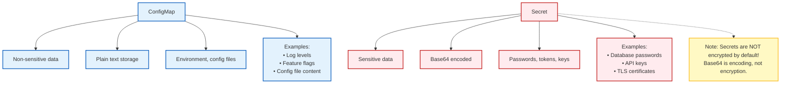
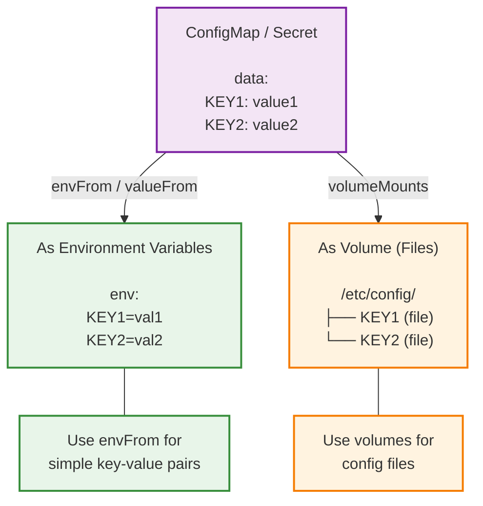

# Module 1.6: ConfigMaps and Secrets

> **Complexity**: `[MEDIUM]` - Essential configuration management
>
> **Time to Complete**: 35-40 minutes
>
> **Prerequisites**: Module 1.3 (Pods)

Throughout this module, commands use the short alias `k` for `kubectl`. If your shell does not already define it, run `alias k=kubectl` before starting the hands-on work. The examples target Kubernetes 1.35 and focus on behavior that matters when configuration, credentials, and rollout operations meet in a real cluster.

## Learning Outcomes

After completing this module, you will be able to:

- **Design** decoupled deployment architectures that move environment-specific settings out of container images and into ConfigMaps or Secrets.
- **Implement** runtime configuration delivery with environment variables, mounted files, and projected volumes while predicting which changes require a Pod restart.
- **Diagnose** failed configuration and credential rollouts caused by base64 mistakes, namespace boundaries, missing keys, static Pod limits, or `subPath` mounts.
- **Compare** ConfigMap and Secret security boundaries, including RBAC exposure, etcd encryption at rest, and the KMS v2 provider available in modern Kubernetes.
- **Evaluate** when immutable ConfigMaps and Secrets reduce control-plane load and when versioned replacement objects create safer production rollouts.

## Why This Module Matters

In late 2016, a catastrophic failure in secret management cost rideshare giant Uber a staggering $148 million in regulatory fines, alongside immeasurable reputational damage. The breach did not stem from a sophisticated zero-day exploit or a nation-state hacking syndicate. Instead, attackers compromised a private GitHub repository used by Uber's engineering team. Inside the repository's source code, the attackers discovered hardcoded AWS credentials that granted broad access to the company's cloud infrastructure. With these credentials, the intruders accessed an Amazon S3 datastore containing the personal information of 57 million riders and drivers.

That incident is remembered because the failure mode was painfully ordinary: a credential that should have been operational data became part of the application artifact. Once a password, token, certificate, database URI, or endpoint gets baked into a container image or committed into source control, rotation becomes slow and risky. The team cannot simply change a value; they must find every copy, invalidate every leaked credential, rebuild artifacts, retest deployments, and hope no old image is still running in a forgotten environment.

Kubernetes gives you two built-in resources for avoiding that trap: ConfigMaps for non-sensitive configuration and Secrets for sensitive data. They let the same container image run in development, staging, and production while the cluster supplies the values that vary between those environments. That design is powerful, but it also creates a new responsibility: you must know exactly how those resources are stored, delivered, refreshed, and protected, because moving a password into a Secret does not automatically make the surrounding workflow secure.

## Separation of Configuration and Code

The core idea behind ConfigMaps and Secrets is separation of concerns. Container images should contain application code, dependencies, and default behavior that is safe to promote unchanged through a pipeline. Deployment-specific values should be supplied at runtime, because they change for reasons that are independent of the application release cycle. A logging level changes during an incident, a database endpoint changes during a migration, a feature flag changes during a gradual launch, and a credential changes when it is rotated or compromised.

The Third Factor of the influential "Twelve-Factor App" methodology states: store config in the environment. In Kubernetes, that principle becomes more flexible than plain shell variables, because the platform can deliver configuration as environment variables, files, command arguments, or API objects. The application still reads ordinary process environment values or local filesystem paths; it does not need to know that a kubelet placed those values there. The operational benefit is that you can change a Deployment manifest, a ConfigMap, or a Secret without rebuilding the image.

Think about artifact promotion as a chain of custody. If a web application image is built once and promoted unchanged from a developer namespace to staging and then production, every environment is testing the same executable payload. If the production database URL is hardcoded into the image, the chain breaks, because production now needs a different build. That difference makes debugging harder because a staging success no longer proves that the production artifact behaves the same way.

ConfigMaps and Secrets are both core `v1` Kubernetes API resources, but they are not interchangeable. A ConfigMap is appropriate for non-sensitive values such as log levels, feature flags, application properties, Nginx snippets, or JSON configuration files. A Secret is appropriate for passwords, private keys, API tokens, TLS private material, and image pull credentials. The difference is not that Secrets are magically invisible; the difference is that Kubernetes applies different intent, access patterns, optional encryption support, and specialized types around data that should be treated as confidential.

Pause and predict: if a team changes only a ConfigMap key used by a Deployment, should the container image digest change? If your answer is yes, the configuration is still coupled to the artifact somewhere. If your answer is no, you are describing the design Kubernetes is trying to support: the image stays fixed while the runtime object changes.

There is also a practical incident-response reason to separate configuration from code. If a leaked database password is baked into an image, the response path includes a new build, a registry push, a Deployment update, and cleanup of any Pods still running the old image. If the password is externalized into a Secret, the team can rotate the credential, update the Secret object, and restart the consuming Pods without changing the application binary. That difference does not remove the need for disciplined rollout automation, but it shortens the path between detection and containment.



This diagram captures the first decision boundary, but it is only the beginning. The same value can be operationally sensitive in one environment and harmless in another, so classification is contextual. A log level is usually safe in a ConfigMap, but an internal endpoint that reveals private topology may deserve tighter handling. A TLS certificate file may be public material, while its matching private key must be treated as a Secret. The safest habit is to classify by consequence: if disclosure would create a security, compliance, or customer-impacting problem, use a Secret and restrict the surrounding access path.

## Object Anatomy and API Boundaries

ConfigMaps and Secrets are namespaced objects. A Pod can reference only a ConfigMap or Secret in its own namespace through ordinary environment variable or volume configuration. That boundary is deliberate because namespace-scoped RBAC, resource quotas, and application ownership often line up with team or environment boundaries. If a frontend Pod in the `web` namespace could mount a Secret from the `payments` namespace by accident, a small YAML mistake could become a cross-team credential leak.

Both object types are also limited to 1 MiB per object. That limit exists because these resources live in the Kubernetes API and are stored in etcd, which is designed for cluster state rather than bulk payload delivery. Large blobs force the API server, kubelet, watch caches, and etcd to move data that should have been served by an image layer, object store, persistent volume, or initialization workflow. When a configuration file grows beyond that limit, the right answer is usually to change the delivery mechanism, not to split the file into dozens of fragile keys.

A ConfigMap has two payload fields. The `data` field stores UTF-8 strings, which is what you use for normal application settings and text configuration files. The `binaryData` field stores base64-encoded binary payloads for non-UTF-8 bytes. Kubernetes rejects a ConfigMap when the same key appears in both fields, because a consuming volume cannot safely decide which payload should become the file with that name.

A Secret has a similar `data` field, but every value in that field must be base64-encoded. This is a serialization requirement, not encryption. Anyone who can read the Secret object can decode those bytes. Kubernetes also offers `stringData`, a write-only convenience field that accepts plaintext values during create or update and stores them under `data` after encoding. When you read the Secret back, `stringData` is gone, which is why GitOps tools and server-side apply workflows sometimes need careful handling around field ownership.

The built-in Secret types add validation and intent. The default `Opaque` type is a generic key-value container, while specialized types represent service account tokens, Docker registry credentials, basic authentication credentials, SSH keys, TLS certificate pairs, and bootstrap tokens. Those types do not replace access control; they tell Kubernetes and operators what shape of credential the object is supposed to hold. For example, a TLS Secret has conventional `tls.crt` and `tls.key` keys, making it easier for Ingress controllers and other components to consume it consistently.

Static Pods are the exception that reveals why the API boundary matters. A static Pod is defined directly on a node and managed by the kubelet rather than created through the normal API server workflow. Because that path bypasses the normal Secret retrieval and authorization process, Secrets cannot be used with static Pods. If a node-level component needs sensitive material, the design must use a different secure delivery mechanism and should be reviewed as node administration, not as an ordinary Pod configuration pattern.

Optional references are another boundary worth designing deliberately. Kubernetes lets you mark some ConfigMap or Secret references as optional, which can be helpful during phased rollouts when a value may not exist in every environment yet. The risk is that optional references can hide a real deployment error until application startup, where the symptom looks like a confusing missing file or empty variable. Use optional references for planned compatibility windows, not as a way to silence manifest validation.

Before running this, what output do you expect from a Secret created with `stringData`? The important prediction is that a later `k get secret -o yaml` will not show `stringData`; it will show base64 values under `data`. If that surprises you, pause before putting Secrets into review workflows, because reviewers may see encoded text and incorrectly assume it is protected from disclosure.

## Creating ConfigMaps and Secrets

Kubernetes supports both imperative creation and declarative manifests. Imperative commands are useful for learning, quick experiments, and generating initial YAML from local files. Declarative manifests are better for repeatable environments because they can be reviewed, versioned, diffed, and applied through the same delivery pipeline as the rest of the application. The professional habit is to understand both, then use declarative workflow for anything you expect to recreate.

```bash
# From literal values
kubectl create configmap app-config \
  --from-literal=LOG_LEVEL=debug \
  --from-literal=ENVIRONMENT=staging

# From file
kubectl create configmap nginx-config --from-file=nginx.conf

# From directory (each file becomes a key)
kubectl create configmap configs --from-file=./config-dir/

# View ConfigMap
kubectl get configmap app-config -o yaml
```

The commands above are preserved because they show the basic creation modes exactly: literal keys, a single file, an entire directory, and a YAML inspection step. In day-to-day module work, run the same operations with `k` after defining the alias. A generated ConfigMap from a directory maps every file name to a key, which is convenient for configuration directories but dangerous if the directory contains editor backups, local overrides, or files that were never meant to leave your workstation.

```yaml
apiVersion: v1
kind: ConfigMap
metadata:
  name: app-config
data:
  LOG_LEVEL: "debug"
  ENVIRONMENT: "staging"
  config.json: |
    {
      "database": "localhost",
      "port": 5432
    }
```

The YAML representation shows why ConfigMaps are often used for application files, not just small variables. The `config.json` key becomes a file when mounted as a volume, and the pipe character preserves multiline formatting. That is useful for Nginx snippets, application properties, JSON, YAML, or INI files, but it also means normal configuration review rules apply. If a multiline block contains a password, it is still visible ConfigMap data and should be moved into a Secret.

```bash
# From literal values
kubectl create secret generic db-creds \
  --from-literal=username=admin \
  --from-literal=password=secret123

# From file
kubectl create secret generic tls-cert \
  --from-file=cert.pem \
  --from-file=key.pem

# View secret (base64 encoded)
kubectl get secret db-creds -o yaml

# Decode a value
kubectl get secret db-creds -o jsonpath='{.data.password}' | base64 -d
```

The Secret example demonstrates the workflow that causes many early mistakes. The CLI accepts literal values and stores encoded bytes, so the YAML view looks different from what the application will receive. Decoding with `base64 -d` is a debugging technique, not an authorization boundary. If a user, service account, or process can run that get command successfully, it can recover the original value.

```yaml
apiVersion: v1
kind: Secret
metadata:
  name: db-creds
type: Opaque              # Generic secret type
data:                     # Base64 encoded
  username: YWRtaW4=      # echo -n 'admin' | base64
  password: c2VjcmV0MTIz  # echo -n 'secret123' | base64
```

```yaml
# Or use stringData for plain text (K8s encodes it)
apiVersion: v1
kind: Secret
metadata:
  name: db-creds
type: Opaque
stringData:               # Plain text, auto-encoded
  username: admin
  password: secret123
```

The two Secret manifests produce the same practical result for a consuming Pod, but they create different review experiences. With `data`, the author must encode values correctly and avoid accidental newline characters from commands such as plain `echo`. With `stringData`, the author writes readable plaintext and lets the API server encode it. Neither style is safe to commit to a public repository, and neither style replaces a proper external secret workflow when Git is part of the delivery path.

A useful review trick is to read a manifest from the perspective of the future operator who gets paged. Can they tell which values are safe to print in a ticket, which values require rotation if exposed, and which values need a rollout to take effect? If the answer is no, the manifest may be technically valid while still being operationally unclear. Names like `app-settings`, `app-secrets`, and stable keys such as `DB_PASSWORD` are simple, but they teach the reader where to look during an outage.

## Consuming Values in Pods

A Pod can consume ConfigMaps and Secrets through command arguments, individual environment variables, `envFrom`, read-only volumes, projected volumes, or direct API access from application code. The choice should follow how the application expects to read configuration and how often the value needs to change. Environment variables are simple and familiar, but they are captured when the container starts. Files are a better fit for structured config and can be refreshed by the kubelet for normal ConfigMap and Secret volumes.

```yaml
apiVersion: v1
kind: Pod
metadata:
  name: app
spec:
  containers:
  - name: app
    image: myapp
    env:
    - name: LOG_LEVEL
      valueFrom:
        configMapKeyRef:
          name: app-config
          key: LOG_LEVEL
    # Or all keys at once:
    envFrom:
    - configMapRef:
        name: app-config
```

This environment variable pattern is easy to read and works well for values that are naturally scalar, such as `LOG_LEVEL`, `ENVIRONMENT`, or a feature flag. Its limitation is just as important: changing the ConfigMap later does not mutate the environment of a running process. Linux processes receive their environment at start time, and Kubernetes does not rewrite it under the process. To pick up a new value, you delete the Pod, trigger a Deployment rollout, or use a controller pattern that changes a Pod template annotation when config changes.

```yaml
apiVersion: v1
kind: Pod
metadata:
  name: app
spec:
  containers:
  - name: app
    image: nginx
    volumeMounts:
    - name: config
      mountPath: /etc/nginx/conf.d
  volumes:
  - name: config
    configMap:
      name: nginx-config
```

Mounted ConfigMaps and Secrets behave differently because the kubelet manages files on the node. When the API object changes, the kubelet eventually updates the projected files for regular volume mounts. The delay is not instantaneous; it can be as high as the kubelet sync period plus the cache propagation delay, which is commonly described as roughly two minutes under default behavior. Applications that watch files or reload on signal can use this path for dynamic configuration, while applications that read files only at startup still need a restart.

The `subPath` option is the major exception. Teams often use `subPath` to mount a single ConfigMap key into a directory without hiding the rest of the directory contents. That convenience creates a static bind mount and breaks the kubelet's normal symlink rotation mechanism, so updates to the ConfigMap or Secret do not appear in the running container. If dynamic refresh matters, mount a directory without `subPath` and arrange the application path accordingly.

Pause and predict: your application takes five minutes to start and you need to temporarily change logging from `info` to `debug` during an incident. If the application can reload a file but cannot reload environment variables, the mounted-file design is operationally better. If the application reads configuration only once at startup, both delivery methods still require a restart, so the deciding factor becomes readability, leak risk, and application convention.

```yaml
apiVersion: v1
kind: Pod
metadata:
  name: app
spec:
  containers:
  - name: app
    image: myapp
    env:
    - name: DB_USER
      valueFrom:
        secretKeyRef:
          name: db-creds
          key: username
    - name: DB_PASS
      valueFrom:
        secretKeyRef:
          name: db-creds
          key: password
```

Secret environment variables are common but deserve extra caution. Many crash reporters, debug endpoints, support bundles, and process-inspection tools include environment variables by default. If a password appears in the environment, it may leak into logs or diagnostics even when RBAC around the Secret object is correct. Mounting a Secret as a file narrows that accidental exposure path because tooling usually does not read arbitrary credential files unless configured to do so.

```yaml
apiVersion: v1
kind: Pod
metadata:
  name: app
spec:
  containers:
  - name: app
    image: myapp
    volumeMounts:
    - name: secrets
      mountPath: /etc/secrets
      readOnly: true
  volumes:
  - name: secrets
    secret:
      secretName: db-creds
```

When mounted as files, Secret payloads are delivered on the node through memory-backed storage rather than written as ordinary image-layer files. That implementation detail reduces the chance of accidental disk persistence on the node, but it does not protect the data from the running container. If an attacker gets a shell inside the application container, the Secret is available through the same filesystem path the application uses. Secrets protect against some storage and API exposure paths; they do not protect against a compromised workload that legitimately needs the credential.



This flow explains why a rollout plan must include both the Kubernetes delivery mechanism and the application reload mechanism. Kubernetes can update a file, but it cannot force arbitrary application code to reread that file. Kubernetes can create an environment variable, but it cannot change a process environment after startup. The best production designs make that behavior explicit by using versioned object names, checksums in Pod template annotations, reload sidecars, or application-native reload endpoints depending on the reliability requirements.

Controllers often automate the restart side of this problem by changing the Pod template whenever a referenced ConfigMap or Secret changes. Helm charts commonly add a checksum annotation derived from rendered configuration, and some operators watch objects directly and trigger rollouts. That pattern is powerful because it converts an invisible dependency into a visible Deployment change. The tradeoff is that every configuration edit can now restart workloads, so teams should decide whether the value is safe for live reload, restart-based rollout, or a manual maintenance window.

## Worked Example: Refactoring Hardcoded Config

Imagine a small web service that was originally built for a single developer laptop. It connects to a database at `localhost:5432`, uses a cache time-to-live of `3600`, and reads a password from a checked-in file. That design might work for a demo, but it fails the moment the same image needs to run in separate namespaces or clusters. The database location changes by environment, the cache policy may change during troubleshooting, and the password must rotate without producing a new application image.

The first step is to classify the values by sensitivity and update behavior. The cache TTL is not confidential, so it belongs in a ConfigMap. The database password is confidential, so it belongs in a Secret. A database host might be non-sensitive in a small lab but sensitive in a production environment where topology disclosure matters; this module keeps the example simple, but production teams should classify that value deliberately rather than by habit.

```yaml
# ConfigMap
apiVersion: v1
kind: ConfigMap
metadata:
  name: app-settings
data:
  CACHE_TTL: "3600"
```

```yaml
# Secret
apiVersion: v1
kind: Secret
metadata:
  name: app-secrets
stringData:
  DB_PASSWORD: "supersecret"
```

These two objects decouple the release artifact from the runtime environment. The ConfigMap can be reviewed by application owners, and the Secret can be managed by a narrower operational path. In a GitOps setup, you would normally avoid committing plaintext Secret manifests and instead use a sealed, encrypted, or externally synchronized representation. The conceptual separation still matters because the Pod spec should communicate which values are configuration and which values are credentials.

```yaml
# Pod using both
apiVersion: v1
kind: Pod
metadata:
  name: myapp
spec:
  containers:
  - name: app
    image: myapp:v1
    envFrom:
    - configMapRef:
        name: app-settings
    env:
    - name: DB_PASSWORD
      valueFrom:
        secretKeyRef:
          name: app-secrets
          key: DB_PASSWORD
```

This Pod keeps the original application interface simple: the process receives the cache setting and password as environment variables. That is acceptable for many beginner labs, but a production review should ask whether the password could appear in crash output, thread dumps, or debugging bundles. If the application supports reading a credential file, a mounted Secret is often preferable. If the application can reload configuration files, a mounted ConfigMap may reduce restart pressure during incident response.

The operational win is that the image `myapp:v1` can move through environments without being rebuilt. A staging namespace can provide one ConfigMap and Secret, while production provides different objects with the same keys. If the production password rotates, the Secret changes and the workload rolls; the application image remains the same. That is the difference between configuration as an operational input and configuration as a hidden dependency inside a release artifact.

When an application expects several files in one directory, projected volumes prevent awkward directory juggling. A projected volume can combine ConfigMaps, Secrets, service account tokens, and downward API data into a single mounted path. The application sees one directory, while Kubernetes preserves the separate ownership and sensitivity of each source object. That is especially useful for older software that expects `/opt/app/config` to contain a config file, a certificate, and a password file side by side.

## Security Reality: Secrets Are a Boundary, Not a Vault

The most important sentence in this module is simple: base64 is not encryption. Kubernetes uses base64 in Secret `data` fields so arbitrary bytes can fit cleanly into JSON and YAML API payloads. Base64 does not hide data from anyone who can read the object, list Secrets in the namespace, create a Pod that mounts the Secret, or compromise a running container that already has the Secret mounted. Treat a Secret as a Kubernetes access-controlled object, not as a complete secret-management system by itself.

Encryption at rest addresses a different threat: the exposure of stored API data in etcd or backups. Cluster administrators can configure the API server with `--encryption-provider-config`, causing selected resource data such as Secrets to be encrypted before being written to disk. Providers include `identity`, which performs no encryption; local encryption providers such as `aescbc`, `aesgcm`, and `secretbox`; and KMS providers that integrate with an external key-management system.

The KMS story matters for Kubernetes 1.35 because older KMS v1 behavior had serious performance drawbacks. KMS v1 was deprecated in Kubernetes v1.28 and disabled by default beginning in v1.29 because it required remote provider interaction in ways that could add latency and fragility to API server operations. KMS v2 reached stable status in Kubernetes v1.29 and is the modern path for external key management because it improves performance while keeping the root of trust outside the cluster.

Encryption at rest does not protect plaintext manifests before they reach the API server. If a team commits a Secret YAML with `stringData` into a public repository, KMS v2 cannot help; the leak happened in Git, not in etcd. If a developer sends a Secret manifest through an unprotected chat channel, the cluster storage provider never gets a chance to reduce that exposure. The security boundary begins only after the API server receives and persists the object.

RBAC is the second major boundary, and it is easy to underestimate. Granting `get` on a named Secret allows direct retrieval of that Secret. Granting `list` on Secrets in a namespace is broader because list responses include full object payloads, not just names. Granting a user permission to create Pods in a namespace can also become indirect Secret access, because the user can create a Pod that mounts a Secret and then read it from inside the container.

That last point changes how you should review access requests. A role that cannot read Secrets directly may still be too powerful if it can run arbitrary workloads in the same namespace as valuable credentials. Admission policies, namespace design, service account scoping, and workload identity all help narrow that blast radius. In production, the question is not merely "who can read Secret objects?" but also "who can cause a workload to run with access to those Secret objects?"

Stop and think: an attacker has a shell inside your application container, and the application reads its database password from `/etc/secrets/password`. Will the attacker be stopped because the value came from a Secret rather than a ConfigMap? No. Once the workload is compromised, the credential is available through the same path the workload uses, so the stronger controls are runtime hardening, least privilege, short-lived credentials, network policy, and rapid rotation.

This is why Secret design should be paired with credential design. A long-lived database password mounted into every replica creates a larger blast radius than a short-lived token scoped to one service account and rotated automatically. Kubernetes can deliver either value, but it cannot decide whether the credential itself is overpowered. Good teams review the consumer, the namespace, the service account, the network path, the database permissions, and the rotation mechanism as one system.

## Projected Volumes, Immutability, and Rollout Strategy

Configuration delivery becomes more interesting as clusters grow. A single namespace might contain many Deployments that share common settings, and a large platform might have thousands of Pods watching the same stable object. If every kubelet is watching mutable ConfigMaps and Secrets that almost never change, the control plane spends resources maintaining update paths that the application does not need. Kubernetes supports immutable ConfigMaps and Secrets to reduce that ongoing watch and polling pressure.

Setting `immutable: true` on a ConfigMap or Secret tells Kubernetes that the object data cannot be changed after creation. The kubelet can stop watching for updates to that object, which reduces load in high-churn clusters. The tradeoff is deliberate: a change now requires creating a new object and updating the workload to reference the new name. That pattern looks slightly more verbose, but it creates a safer rollout history because each versioned object represents a specific configuration snapshot.

Immutable ConfigMaps and Secrets became stable in Kubernetes v1.21 after earlier alpha and beta stages. The original enhancement planning documents included earlier target dates, but release announcements and current documentation are the source of truth for operational decisions. In Kubernetes 1.35, immutability is normal production behavior, not an experimental trick. It is especially useful for global constants, application defaults, certificate bundles, and config that should change only through a controlled rollout.

Versioned names are the practical companion to immutability. Instead of editing `app-config`, create `app-config-2026-05-03` or another release-specific name, update the Deployment, and let the rollout controller replace Pods gradually. The old object can stay in place while old Pods drain, and cleanup can happen after the rollout is complete. This makes rollback easier because the previous object still exists and has not been overwritten.

There is a tradeoff between dynamic update behavior and rollout clarity. A mutable mounted ConfigMap can update files in running Pods, which is useful for software that safely reloads configuration. A versioned immutable ConfigMap forces a rollout, which is more predictable when a bad configuration could break every replica at once. Senior operators choose based on blast radius: dynamic reload is convenient for low-risk toggles, while versioned rollouts are safer for settings that change connection pools, authorization behavior, or startup assumptions.

Use this decision as a small design review habit. If a value changes frequently and the application can validate and reload it safely, a mounted mutable ConfigMap may be right. If a value defines startup behavior, authentication, or critical routing, favor a versioned object and a Deployment rollout. If a value is sensitive, start with a Secret and then decide whether file or environment delivery creates fewer accidental leak paths for that specific application.

Rollout history also matters after the incident is over. If a mutable object was edited in place several times during troubleshooting, reconstructing which Pods saw which value becomes difficult unless audit logs and deployment events are complete. Versioned objects leave a clearer trail because the object name appears in the Pod template. That extra clarity can be the difference between a quick post-incident review and hours spent guessing which configuration was active during a customer-impacting window.

## Patterns & Anti-Patterns

The strongest pattern is to make configuration ownership explicit. Application teams can own non-sensitive ConfigMaps that describe behavior, while platform or security teams own Secret creation, synchronization, and rotation. This does not mean every team needs a separate tool, but it does mean review paths should reflect consequence. A typo in a feature flag is not the same class of problem as a leaked database credential, and the workflow should not pretend they are equal.

Another reliable pattern is to use stable keys with versioned object names. Applications should not need to change from `DB_PASSWORD` to `DATABASE_PASSWORD_V2` during ordinary rotation; the key contract should stay stable. The object name can change to represent a new version, and the Deployment rollout can point at that new object. Stable keys reduce application churn, while versioned names give operators a clean rollback surface.

A third pattern is to prefer file mounts for complex structured configuration. JSON, YAML, certificates, and multi-line properties are easier to validate as files than as long environment variables. File mounts also allow applications or sidecars to watch for changes when dynamic reload is safe. Environment variables remain useful for small scalar values, but they become awkward when values contain whitespace, nested structure, or sensitive data that crash tooling might expose.

The most common anti-pattern is treating Secrets as a complete vault. Kubernetes Secrets are API objects protected by Kubernetes controls; they are not a replacement for credential lifecycle management, short-lived tokens, access review, or external key management. Another anti-pattern is granting broad namespace permissions because a CI job or developer "just needs to deploy." If that role can create Pods, it may be able to extract Secrets indirectly. The better alternative is scoped service accounts, admission constraints, and separate namespaces for workloads with different credential sensitivity.

These patterns scale because they reduce ambiguity. A new engineer can inspect a Deployment and infer whether a value is safe configuration, sensitive credential material, dynamically refreshed file data, or versioned rollout input. That readability is not cosmetic; it lowers operational risk. During an outage, teams make fewer mistakes when the YAML expresses intent clearly enough that the next action is obvious.

| Pattern or Anti-Pattern | When It Appears | Operational Consequence | Better Practice |
|---|---|---|---|
| Pattern: stable keys with versioned object names | Teams rotate credentials or config while keeping application code stable. | Rollbacks are simpler because old Pods can keep using the old object until they drain. | Keep key names consistent and change object names during controlled rollouts. |
| Pattern: file mounts for structured config | Applications read JSON, YAML, certificates, or multiline settings. | Validation and reload behavior are clearer than long environment variables. | Mount a directory and avoid `subPath` when updates must appear in running Pods. |
| Pattern: immutable shared config | Many Pods consume a value that rarely changes. | Kubelet and API server watch pressure decreases in large clusters. | Set `immutable: true` and replace the object with a new version when needed. |
| Anti-pattern: plaintext Secrets in Git | Teams want declarative manifests but skip secret-specific tooling. | Repository access becomes credential access, and history keeps old leaked values. | Use sealed, external, or operator-synchronized secret workflows. |
| Anti-pattern: broad Pod creation rights | A user or job needs deployment convenience in a shared namespace. | Pod creation can become indirect access to mounted Secrets. | Scope RBAC, separate namespaces, and enforce admission policies. |
| Anti-pattern: `subPath` for live config | A team wants one file mounted into an existing directory. | The file stops receiving kubelet refreshes after the initial bind mount. | Mount the whole directory or roll Pods intentionally after updates. |

## Decision Framework

Choosing between a ConfigMap, Secret, environment variable, mounted file, projected volume, or immutable object should be a design decision, not a reflex. Start by asking what happens if the value is disclosed. If disclosure is harmful, use a Secret and design the surrounding RBAC and delivery path carefully. If disclosure is harmless but incorrect values could break production, use a ConfigMap with the same rollout discipline you would apply to code.

Next, ask how the application reads the value. If it expects process environment variables and reads them only at startup, environment injection is simple, but every change means a Pod restart. If it expects files or can be adapted to files, volume mounts often produce cleaner behavior for structured data and reduce accidental logging of sensitive values. If it expects a single directory that mixes several sources, projected volumes let Kubernetes compose that directory while keeping source objects separate.

Finally, ask how often the value changes and how dangerous a bad change would be. High-risk changes deserve versioned objects and controlled rollouts even if Kubernetes could update a mounted file automatically. Low-risk toggles may benefit from dynamic file refresh if the application validates them safely. Rarely changing shared values are good candidates for immutability because they reduce platform overhead and prevent accidental edits.

```text
+-----------------------------+
| Is disclosure harmful?      |
+--------------+--------------+
               |
        yes    |    no
               |
      Secret   |   ConfigMap
               |
               v
+-----------------------------+
| Does the app need a file?   |
+--------------+--------------+
        yes    |    no
               |
  volume mount | environment
               |
               v
+-----------------------------+
| Should updates be dynamic?  |
+--------------+--------------+
        yes    |    no
               |
 avoid subPath | version name
+-----------------------------+
```

| Choice | Use It When | Avoid It When | Main Tradeoff |
|---|---|---|---|
| ConfigMap environment variable | The value is non-sensitive, scalar, and read only at startup. | The value must update in running Pods. | Simple startup injection in exchange for restart-based updates. |
| ConfigMap volume | The value is structured text or a file the app can reload. | The application cannot tolerate eventual refresh timing. | Better file semantics with asynchronous propagation. |
| Secret environment variable | The application only supports env-based credentials and logs are controlled. | Crash dumps or diagnostics expose environment values. | Compatibility in exchange for higher accidental leak risk. |
| Secret volume | The application can read credential files. | A legacy app cannot be configured for file paths. | Lower accidental environment exposure with filesystem access inside the Pod. |
| Projected volume | Multiple sources must appear in one directory. | Ownership boundaries would become confusing to operators. | Unified app view while preserving source object separation. |
| Immutable object | Values rarely change or require controlled versioned rollout. | You need live mutation of the same object name. | Lower control-plane overhead and safer history in exchange for replacement workflow. |

## Did You Know?

- **1 MiB Payload Limit**: ConfigMap and Secret individual object sizes are strictly limited to exactly 1 MiB to protect the etcd datastore from bloated memory consumption and unresponsive queries.
- **KMS v2 GA Date**: The modern KMS v2 encryption provider achieved General Availability in Kubernetes v1.29, finally replacing the slow, network-heavy KMS v1 architecture that is disabled by default.
- **Immutability GA Timeline**: Immutable ConfigMaps and Secrets reached stable status in Kubernetes v1.21, though early enhancement planning materials targeted an earlier release.
- **Two-Minute Propagation Window**: When mounting ConfigMaps as volumes, changes can take roughly two minutes to appear because kubelet sync timing and cache propagation both matter.

## Common Mistakes

| Mistake | Why It Happens | How to Fix It |
|---|---|---|
| Committing secrets to Git | Teams want declarative delivery and forget that base64 or `stringData` values remain recoverable from repository history. | Use sealed, external, or operator-managed secret workflows and rotate any credential that was committed. |
| Thinking base64 means encrypted | Secret YAML displays encoded values, which looks unfamiliar enough to feel protected. | Treat base64 as serialization only, restrict Secret RBAC, and enable encryption at rest for stored API data. |
| Encoding newline characters | Plain `echo` adds a newline, so the decoded password does not match what the application expects. | Prefer `stringData` for hand-written manifests or use `echo -n` when you intentionally prepare `data` values. |
| Hardcoding config in images | A value starts as a demo default and becomes a hidden deployment dependency. | Move environment-specific values into ConfigMaps or Secrets and promote the same image across environments. |
| Mounting live config with `subPath` | A team wants one file in an existing directory without masking other files. | Mount the whole directory when dynamic refresh matters, or accept that a Pod restart is required. |
| Granting broad Secret `list` access | Operators think listing is safer than reading individual objects. | Remember that list responses include payload data and grant named `get` access only where practical. |
| Ignoring Pod creation as Secret access | A role cannot read Secrets directly, so it appears harmless. | Treat arbitrary Pod creation in a namespace as potential indirect access to Secrets mounted in that namespace. |

## Quiz

<details><summary>Your team updates a ConfigMap key used as an environment variable, but the running application still reports the old value. What should you check first?</summary>

Environment variables are captured when the container starts, so the first check is whether the value was delivered through `env`, `envFrom`, or a file mount. If it was an environment variable, the behavior is expected and the Pod must be recreated or rolled by a controller. If the team expected dynamic updates, the design should move the setting to a mounted file and ensure the application actually reloads that file. This diagnoses the delivery mechanism instead of blaming the ConfigMap object itself.

</details>

<details><summary>A developer stores a production API token in a ConfigMap because it is "only internal." How do you evaluate and correct the design?</summary>

The value belongs in a Secret because disclosure would create a security incident regardless of whether the cluster is internal. Moving it to a Secret is only the first correction; RBAC must also restrict who can read it, list it, or create Pods that mount it. If the manifest is stored in Git, the team should use an encrypted or external secret workflow rather than committing plaintext `stringData`. The better design classifies by consequence, not by the network location of the cluster.

</details>

<details><summary>A Secret mounted with `subPath` does not update after rotation, and the application keeps using the old credential. What is happening?</summary>

`subPath` creates a bind mount for a specific file, which bypasses the kubelet's normal symlink rotation for ConfigMap and Secret volumes. The Secret object may be updated correctly in the API server, but the mounted file inside the existing container remains static. The immediate fix is to restart or roll the Pod. The longer-term fix is to mount a directory without `subPath` when live refresh is required, or to use versioned Secrets with intentional rollouts.

</details>

<details><summary>A review finds this manifest, and the application cannot authenticate. What is the likely configuration error?</summary>

```yaml
apiVersion: v1
kind: Secret
metadata:
  name: db-creds
data:
  password: mysecretpassword
```

The manifest uses the `data` field but provides raw plaintext instead of a base64-encoded value. Kubernetes Secret `data` values must be encoded byte strings, so the application will not receive the intended password. The safer hand-written version uses `stringData`, which lets the API server perform the encoding. If `data` is required, encode the exact value without an accidental trailing newline.

</details>

<details><summary>Your security team enables KMS v2 encryption at rest. Can developers now commit plaintext Secret YAML to a public repository?</summary>

No. KMS v2 protects selected API data after the API server persists it to storage; it does not protect files before they enter the cluster. A plaintext Secret committed to a public repository is already leaked, even if the cluster later stores it encrypted in etcd. The correct workflow keeps plaintext credentials out of Git by using sealed secrets, external synchronization, or another approved secret-management process. Encryption at rest is an important layer, not permission to weaken source-control hygiene.

</details>

<details><summary>A platform team sees heavy API server load from thousands of Pods consuming a shared ConfigMap that almost never changes. What design change should they evaluate?</summary>

They should evaluate marking the ConfigMap as immutable and moving to a versioned replacement workflow. Immutability lets kubelets stop watching or polling for updates to that object, reducing control-plane load in large clusters. When the value needs to change, the team creates a new ConfigMap and updates the workload reference, which triggers a controlled rollout. This fits stable shared configuration better than repeatedly editing one mutable object.

</details>

<details><summary>A user cannot read Secrets directly but can create Pods in the same namespace as a database credential. Why might this still be a security concern?</summary>

Pod creation can become indirect Secret access. The user can create a Pod that references the Secret as an environment variable or mounted file, then read the credential from inside that Pod. RBAC reviews should therefore consider workload creation rights alongside direct Secret permissions. Stronger namespace boundaries, scoped service accounts, and admission controls reduce that lateral movement path.

</details>

<details><summary>A legacy application needs a 5 MiB configuration file. Should you store it in a standard ConfigMap?</summary>

No. ConfigMaps and Secrets have a 1 MiB object size limit, and pushing multi-mebibyte payloads through the Kubernetes API harms the wrong components. A better design uses an image layer, persistent volume, object-store download, init container, or another delivery mechanism built for larger artifacts. The deciding factor is whether the file is code-like, data-like, environment-specific, or sensitive. ConfigMaps are for configuration state, not bulk file distribution.

</details>

## Hands-On Exercise

This exercise uses a disposable namespace so you can inspect ConfigMaps and Secrets without touching other work. You will create non-sensitive application settings, create a Secret, run a Pod that consumes both, and then modify the design to practice file-based delivery. The goal is not just to make the YAML apply; it is to predict which values are visible where and which changes require a new Pod.

Before you begin, define the alias expected throughout the module:

```bash
alias k=kubectl
```

### Task 1: Create the configuration objects

Use the original quick path to create a ConfigMap and Secret, then inspect them with the alias. The literal Secret value is intentionally a lab placeholder, not a production credential pattern.

```bash
# 1. Create ConfigMap
kubectl create configmap app-config \
  --from-literal=LOG_LEVEL=debug \
  --from-literal=APP_NAME=myapp

# 2. DECISION POINT: Create the secret.
# Will you use --from-literal or create a YAML file with stringData? 
# We'll use the CLI for speed here:
kubectl create secret generic app-secret \
  --from-literal=DB_PASS=secretpassword

# 3. Create pod using both
cat << 'EOF' | kubectl apply -f -
apiVersion: v1
kind: Pod
metadata:
  name: config-test
spec:
  containers:
  - name: test
    image: busybox
    command: ['sh', '-c', 'env && sleep 3600']
    envFrom:
    - configMapRef:
        name: app-config
    env:
    - name: DB_PASSWORD
      valueFrom:
        secretKeyRef:
          name: app-secret
          key: DB_PASS
EOF

# 4. Verify env vars are present
kubectl wait --for=condition=Ready pod/config-test --timeout=60s
kubectl logs config-test | grep -E "LOG_LEVEL|APP_NAME|DB_PASSWORD"
```

<details><summary>Solution notes for Task 1</summary>

The original commands create one ConfigMap, one Secret, and one Pod. If you are following the module convention, the equivalent inspection commands are `k get configmap app-config -o yaml`, `k get secret app-secret -o yaml`, and `k logs config-test`. Notice that the Pod logs show plaintext environment values because the process received them at startup. That visibility is useful for a lab and risky for real credentials in production logs.

</details>

### Task 2: Inspect the Secret encoding boundary

Read the stored Secret and decode the single value so you can see exactly where base64 applies. This step builds the habit of distinguishing Kubernetes serialization from actual confidentiality.

```bash
k get secret app-secret -o yaml
k get secret app-secret -o jsonpath='{.data.DB_PASS}' | base64 -d
```

<details><summary>Solution notes for Task 2</summary>

The YAML view shows encoded data under `.data.DB_PASS`, while the decode command prints the original lab value. That proves base64 is reversible by anyone with read access. In a production review, this is the point where you verify RBAC, encryption at rest, and whether the Secret manifest itself was ever committed in plaintext.

</details>

### Task 3: Prove environment variables are static

Update the ConfigMap after the Pod is running, then compare the API object with the Pod logs. You should see the new value in the ConfigMap and the old value inside the already-started container.

```bash
k create configmap app-config \
  --from-literal=LOG_LEVEL=info \
  --from-literal=APP_NAME=myapp \
  --dry-run=client -o yaml | k apply -f -
k get configmap app-config -o jsonpath='{.data.LOG_LEVEL}'
k logs config-test | grep LOG_LEVEL
```

<details><summary>Solution notes for Task 3</summary>

The ConfigMap object changes, but the environment in the existing container does not. This is expected because the container runtime does not rewrite process environments after startup. A Deployment rollout, Pod deletion, or file-based configuration design is required when the running application must observe a changed value.

</details>

### Task 4: Rework the Pod to mount the ConfigMap as files

Delete the original Pod and recreate it with the ConfigMap mounted at `/etc/app-config`. Then inspect the directory to see how keys become files.

```bash
k delete pod config-test
cat << 'EOF' | k apply -f -
apiVersion: v1
kind: Pod
metadata:
  name: config-test
spec:
  containers:
  - name: test
    image: busybox
    command: ['sh', '-c', 'ls -l /etc/app-config && cat /etc/app-config/LOG_LEVEL && sleep 3600']
    volumeMounts:
    - name: app-config
      mountPath: /etc/app-config
  volumes:
  - name: app-config
    configMap:
      name: app-config
EOF
k wait --for=condition=Ready pod/config-test --timeout=60s
k exec config-test -- ls -l /etc/app-config
k exec config-test -- cat /etc/app-config/LOG_LEVEL
```

<details><summary>Solution notes for Task 4</summary>

Each ConfigMap key appears as a file under `/etc/app-config`. This layout is better for applications that read configuration files or can reload them. If you update the ConfigMap, the file may refresh after kubelet propagation delay, but the application must still reread the file to act on the new value.

</details>

### Task 5: Clean up and record success criteria

Remove the disposable resources after you have confirmed both environment and file delivery behavior. Cleanup matters because stale Secrets and ConfigMaps make later debugging harder.

```bash
kubectl delete pod config-test
kubectl delete configmap app-config
kubectl delete secret app-secret
```

<details><summary>Solution notes for Task 5</summary>

The cleanup commands remove only the resources created in this exercise. If a delete command reports that a resource is not found, confirm you are in the expected namespace before assuming the resource never existed. In a shared cluster, explicit namespaces are safer than relying on the current context.

</details>

Success criteria:

- [ ] ConfigMap `app-config` was created and inspected successfully.
- [ ] Secret `app-secret` was created and decoded without confusing base64 for encryption.
- [ ] Pod `config-test` reached the Running state and displayed the expected environment values.
- [ ] Updating the ConfigMap did not change the already-running environment variable.
- [ ] The ConfigMap was mounted as files under `/etc/app-config`.
- [ ] All lab resources were deleted after verification.

## Sources

- [Kubernetes documentation: ConfigMaps](https://kubernetes.io/docs/concepts/configuration/configmap/)
- [Kubernetes documentation: Secrets](https://kubernetes.io/docs/concepts/configuration/secret/)
- [Kubernetes task: Configure a Pod to use a ConfigMap](https://kubernetes.io/docs/tasks/configure-pod-container/configure-pod-configmap/)
- [Kubernetes task: Distribute credentials securely using Secrets](https://kubernetes.io/docs/tasks/inject-data-application/distribute-credentials-secure/)
- [Kubernetes task: Encrypt data at rest](https://kubernetes.io/docs/tasks/administer-cluster/encrypt-data/)
- [Kubernetes documentation: RBAC authorization](https://kubernetes.io/docs/reference/access-authn-authz/rbac/)
- [Kubernetes documentation: Projected volumes](https://kubernetes.io/docs/concepts/storage/projected-volumes/)
- [Kubernetes API reference: ConfigMap v1](https://kubernetes.io/docs/reference/kubernetes-api/config-and-storage-resources/config-map-v1/)
- [Kubernetes API reference: Secret v1](https://kubernetes.io/docs/reference/kubernetes-api/config-and-storage-resources/secret-v1/)
- [Kubernetes documentation: Managing Secrets using kubectl](https://kubernetes.io/docs/tasks/configmap-secret/managing-secret-using-kubectl/)
- [Kubernetes documentation: Immutable Secrets](https://kubernetes.io/docs/concepts/configuration/secret/#immutable-secrets)
- [Kubernetes documentation: ConfigMap object details](https://kubernetes.io/docs/concepts/configuration/configmap/#configmap-object)

## Next Module

[Module 1.7: Namespaces and Labels](../module-1.7-namespaces-labels/) - Ready to organize the chaos? Learn how to logically partition your cluster to prevent massive workloads from colliding, and how Labels act as the fundamental connective tissue of Kubernetes architecture.
