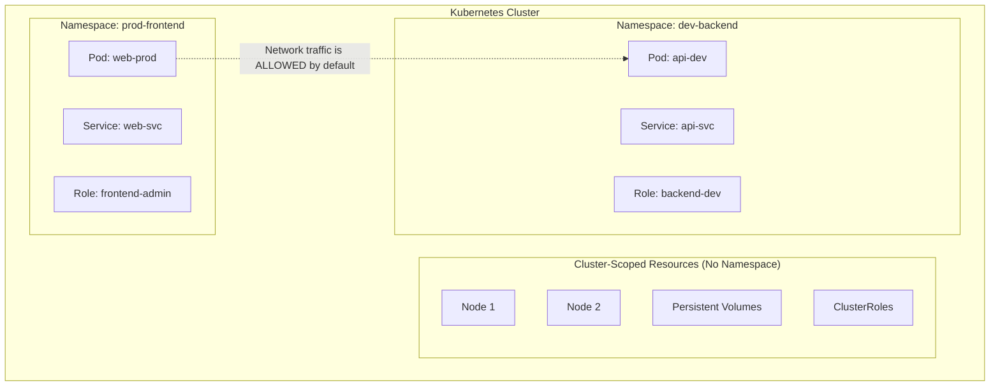
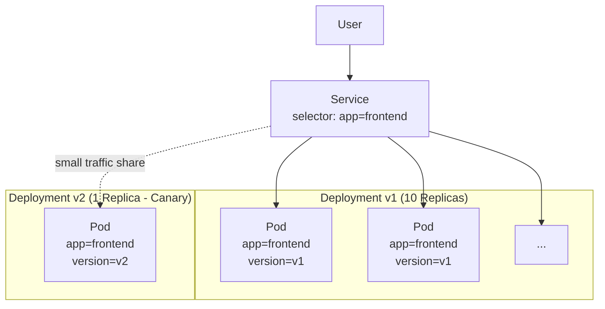

# Module 1.7: Namespaces and Labels

**Complexity:** [MEDIUM]
**Time to Complete:** 50-60 minutes
**Prerequisites:** [Module 1.4: Deployments](/prerequisites/kubernetes-basics/module-1.4-deployments/), [Module 1.5: Services](/prerequisites/kubernetes-basics/module-1.5-services/)

## Learning Outcomes

After completing this module, you will be able to:

- Segment a shared Kubernetes cluster into namespace-scoped environments while preserving awareness of cluster-scoped resources.
- Design label taxonomies that Services, Deployments, and operational tooling can select reliably during normal operations and incidents.
- Compare equality-based and set-based selectors, then choose query expressions for rollouts, investigations, and targeted cleanup.
- Implement ResourceQuotas and LimitRanges that defend namespace stability without surprising developers at admission time.
- Diagnose when metadata belongs in labels versus annotations for controllers, audits, billing, and human context.

## Why This Module Matters

At 2:00 AM on a Friday, a platform engineer at a busy online retailer is paged because checkout latency has crossed the customer-facing error budget and internal APIs are timing out. The first suspect is the payment service, but the real cause is quieter: a load-testing job was launched in the same shared Kubernetes cluster as production, without a dedicated namespace budget, without default resource limits, and without a label scheme that made ownership obvious. The job was meant to run against a staging endpoint, but it landed in `default`, consumed most allocatable CPU on several nodes, and forced the team to burn precious minutes asking a basic question: whose workload is this?

The outage is not really about one careless command. It is about a cluster that has grown past the point where memory, discipline, and naming conventions can protect it. A single physical Kubernetes cluster is attractive because it centralizes capacity, networking, observability, and operational skill, but that same centralization creates a shared fate unless the cluster is divided into understandable operating zones. Without namespaces, teams collide over names and permissions; without labels, controllers and humans cannot reliably find the objects they mean to affect; without quotas and defaults, one tenant can unintentionally starve another.

This module teaches the two organizational primitives that make Kubernetes usable beyond toy demos. Namespaces divide the API into logical rooms, while labels attach structured identity to the objects inside those rooms. You will learn what those boundaries actually isolate, what they absolutely do not isolate, how selectors allow decoupled controllers to cooperate, and how namespace-level policy turns a shared cluster into a platform that can survive normal human mistakes.

Throughout the commands, this module uses `k` as the local alias for `kubectl`; if your shell does not already define it, run `alias k=kubectl` before practicing. The Kubernetes examples target version 1.35 or newer behavior, and the concepts are stable across modern clusters even when individual cloud distributions add their own admission policies or default labels.

```bash
alias k=kubectl
k version --client
```

## Section 1: Namespaces - Logical Rooms, Not Separate Buildings

A Kubernetes namespace is a logical partition in the API server, not a miniature cluster with its own scheduler, network, or nodes. That distinction matters because the word "namespace" sounds stronger than it is. Namespaces give names a scope, give RBAC policies a natural boundary, give quotas a place to attach, and give operators a way to reason about ownership. They do not, by themselves, encrypt traffic, block network paths, reserve nodes, or hide cluster-scoped resources.

Think of a shared cluster as a large engineering floor in an office building. A namespace is a labeled room on that floor: the room can have its own team, budget, door policy, and naming system, but people still share elevators, power, fire alarms, and the building network. Kubernetes follows the same pattern. A `Service` named `redis` can exist in both `frontend` and `backend` namespaces because names only need to be unique inside one room, but the two workloads may still run on the same physical node unless scheduling policy says otherwise.



The diagram shows the boundary that often surprises new operators. `Pods`, `Services`, `ConfigMaps`, `Secrets`, `Roles`, and most application-level objects belong to one namespace. `Nodes`, `PersistentVolumes`, `StorageClasses`, `CustomResourceDefinitions`, `ClusterRoles`, and many admission policies are cluster-scoped, so a namespace-scoped `Role` cannot grant access to them. This split is why a monitoring agent can run as a `DaemonSet` in `monitoring` while still needing a `ClusterRole` if it must list every `Node` in the cluster.

```text
+------------------------------------------------------------+
| Kubernetes cluster                                         |
|                                                            |
|  Cluster-scoped: Nodes, PersistentVolumes, ClusterRoles    |
|                                                            |
|  +----------------------+   +---------------------------+  |
|  | Namespace: dev       |   | Namespace: prod           |  |
|  | Pod: api             |   | Pod: api                  |  |
|  | Service: redis       |   | Service: redis            |  |
|  | Role: team-admin     |   | Role: release-operator    |  |
|  +----------------------+   +---------------------------+  |
|                                                            |
|  Shared by default: node pool, network fabric, API server  |
+------------------------------------------------------------+
```

The strongest namespace guarantees are API scoping guarantees. A namespaced object name must be unique only inside its namespace, a RoleBinding can give a user rights inside one namespace without granting the same rights elsewhere, and a ResourceQuota can set a budget for one namespace without changing another. These are powerful controls because most day-to-day application operations happen through namespaced objects, so the boundary lines up with how teams actually deploy software.

The weakest namespace guarantee is network isolation, because there is none by default. Kubernetes networking starts from a flat model where every Pod can usually reach every other Pod IP, regardless of namespace, unless a Container Network Interface plugin and `NetworkPolicy` objects enforce stricter rules. This default makes service discovery simple for beginners, but it means a production hardening plan cannot stop at namespaces. A namespace is the place where you attach policy; it is not the policy itself.

Kubernetes creates several namespaces before you add your own. The `default` namespace is the catch-all destination when a manifest or command does not specify a namespace. The `kube-system` namespace holds cluster services such as CoreDNS, networking components, and infrastructure controllers. The `kube-public` namespace is readable by all users and is now rarely central to application work. The `kube-node-lease` namespace contains lightweight heartbeat Lease objects that let nodes report liveness without constantly rewriting large Node status documents.

Mature clusters treat `default` as a warning light rather than a convenient home. If production workloads, experiments, and one-off debugging Pods all live there, ownership becomes ambiguous and destructive commands become harder to review. A better habit is to create purpose-built namespaces such as `team-frontend`, `team-backend`, `observability`, `payments-prod`, or `payments-staging`, then put the namespace in every manifest. Explicit placement makes the desired boundary reviewable in Git and visible in incident output.

Namespace names must be valid DNS labels, and you should avoid the `kube-` prefix because Kubernetes reserves that convention for system namespaces. You should also avoid names that look like public top-level domains, such as `com` or `org`, because Kubernetes DNS search behavior can make short names confusing. Starting in modern Kubernetes versions, the control plane automatically applies the immutable label `kubernetes.io/metadata.name` to every namespace, which gives policies and selectors a stable way to identify a namespace by name.

```bash
k create namespace team-frontend
k get namespaces
k get pods -n team-frontend
```

Constantly typing `-n team-frontend` is useful for clarity in scripts, but it is tiring during interactive work. Your kubeconfig context can store a default namespace, so ordinary commands target the namespace you are currently operating in. This is convenient, yet it also creates a class of mistakes where your terminal prompt and your mental model disagree. The safer practice is to make the active context visible in your shell prompt and to check it before running destructive commands.

```bash
# View your current context configuration to see your active namespace
k config view --minify | grep namespace:

# Set the default namespace for your current context to 'team-frontend'
k config set-context --current --namespace=team-frontend

# Now this command automatically looks in 'team-frontend'
k get pods
```

War story: an experienced engineer once intended to delete a broken deployment in `staging`, but their current context still pointed at `production`. The command was syntactically perfect and operationally wrong, so Kubernetes did exactly what the engineer asked. Namespaces reduce blast radius only when humans and automation carry the namespace through the workflow. A visible prompt, explicit manifest metadata, restricted RBAC, and dry-run habits work together; no single layer is enough.

Pause and predict: if a Pod in the `test` namespace tries to connect to `http://data:8080`, while the `data` Service exists only in `prod`, what namespace will DNS search first and what name would make the cross-namespace target explicit? Make a prediction before reading the next paragraph, because this detail explains many "it worked locally" failures.

Kubernetes Service DNS is namespace-aware. A short lookup such as `data` is resolved first in the querying Pod's own namespace, while a cross-namespace lookup should use a more explicit name such as `data.prod` or the fully qualified name `data.prod.svc.cluster.local`. This behavior allows two teams to use the same Service name without collision, while still allowing deliberate cross-namespace communication when the application is configured for it.

Namespace planning also affects how you operate during failure. If every team has separate namespaces for development, staging, and production, an incident commander can quickly ask whether the failure is isolated to one environment or spreading across shared infrastructure. If every environment shares a namespace, the first minutes of the incident are spent untangling object names, owners, and histories. The namespace boundary is not only a deployment choice; it is an incident-response search boundary.

There is a cost to making namespaces too granular. A namespace per developer, per branch, and per feature can become noisy if your platform has no automation for RBAC, quotas, labels, and cleanup. The best namespace model is one your organization can administer consistently. If a namespace is created by hand and then forgotten, it becomes another form of drift. If it is created from a standard template with owner labels, quotas, LimitRanges, and lifecycle rules, it becomes a repeatable platform unit.

| Namespace behavior | What it gives you | What it does not give you |
| :--- | :--- | :--- |
| Name scoping | Same object names can exist in different namespaces | Automatic protection from deleting the wrong namespace |
| RBAC boundary | Roles and RoleBindings can be limited to one namespace | Permissions over cluster-scoped resources |
| DNS search scope | Short Service names resolve locally first | Network isolation between namespaces |
| Quota attachment | Namespace budgets for resource requests, limits, and counts | Guaranteed node reservation without scheduling policy |

## Section 2: Labels and Selectors - The Control Plane's Shared Vocabulary

If namespaces answer "where does this object live?", labels answer "what role does this object play?" A label is a key-value pair on Kubernetes object metadata, and a selector is an expression that matches objects by those labels. Kubernetes relies on this indirection because Pods are temporary, IP addresses change, and controller membership must survive replacement. A Service does not need to know the names of its backend Pods; it only needs a selector that says which labels qualify as endpoints.

This design is one reason Kubernetes feels dynamic instead of brittle. A Deployment creates Pods from a template, a ReplicaSet tracks Pods whose labels match its selector, and a Service routes to Pods whose labels match its selector. When a Pod dies, the replacement gets a new name and IP address, but it receives the same identifying labels from the template. Controllers converge on the desired state because they agree on metadata, not because they share a hidden list of object IDs.

```yaml
apiVersion: v1
kind: Pod
metadata:
  name: payment-processor-v2
  namespace: team-backend
  labels:
    app.kubernetes.io/name: payment-processor
    app.kubernetes.io/version: "2.1.4"
    app.kubernetes.io/part-of: e-commerce-suite
    tier: backend
    environment: production
    cost-center: "finance-ops"
spec:
  containers:
  - name: app
    image: payment-app:2.1.4
```

A label key has an optional DNS-subdomain prefix and a required name, separated by a slash. The prefixes `kubernetes.io/` and `k8s.io/` are reserved for Kubernetes components, while your organization should use its own domain-style prefixes when automated tools add labels. The unprefixed labels in the example, such as `tier` and `environment`, are readable and common, but they are more likely to collide with another tool's assumptions in a large platform. The prefixed application labels are better for shared conventions.

Values are strings, even when they look numeric. Quoting values such as `"2.1.4"` or `"finance-ops"` keeps YAML parsers and human reviewers from guessing about types. Labels also have size and character constraints because the API server indexes them for fast selection. That indexing is the reason labels should stay compact, stable, and identifying; it is also the reason large release notes, JSON blobs, and controller-specific directives belong somewhere else.

```bash
# Find all backend pods in the current namespace
k get pods -l tier=backend

# Find all production payment processors in the current namespace
k get pods -l app.kubernetes.io/name=payment-processor,environment=production

# Look across namespaces when the incident boundary is unclear
k get pods -A -l app.kubernetes.io/name=payment-processor
```

Label taxonomies deserve deliberate design because they become operational contracts. A useful taxonomy usually includes application identity, component, environment, version, owner, cost center, and managed-by information. The exact keys matter less than consistency, but Kubernetes recommends the `app.kubernetes.io/*` family because many ecosystem tools already understand it. When teams improvise labels per deployment, incident response turns into archaeology: every query requires guessing which spelling somebody chose months earlier.

Before running this, what output do you expect from `k get pods -l app.kubernetes.io/name=payment-processor,environment=production` if one Pod has the payment label but `environment=staging`? The answer should be "it will not match," because comma-separated label requirements are logical AND operations. This small rule is worth internalizing before you use selectors in cleanup commands.

Equality-based selectors match exact values or exclude exact values. The operators `=`, `==`, and `!=` are available in command-line selectors, and multiple requirements separated by commas must all be true. Equality is simple and readable, which makes it a good default for Services and narrow incident queries. The tradeoff is that equality cannot express "one of these several values" without repeating commands or switching to set-based syntax.

```bash
# Select pods where environment is exactly 'production'
k get pods -l environment=production

# Select pods where tier is not 'frontend'
k get pods -l tier!=frontend
```

Services use a simple selector map, which behaves like equality across every listed key. This is intentionally limited because a Service should usually define a stable contract rather than a clever query. If the Service selector is too broad, it may send traffic to Pods that expose a different protocol or version. If the selector is too narrow, it may fail to find newly rolled-out Pods that should receive traffic.

```yaml
apiVersion: v1
kind: Service
metadata:
  name: payment-svc
  namespace: team-backend
spec:
  selector:
    app.kubernetes.io/name: payment-processor
    environment: production
  ports:
  - protocol: TCP
    port: 80
    targetPort: 8080
```

Set-based selectors add operators such as `in`, `notin`, `exists`, and `doesnotexist`. They are essential when the question is operational rather than structural, such as "show me production and staging Pods" or "find everything with a release label." Kubernetes selectors do not provide a general top-level OR operator, so `in` is the normal way to express several acceptable values for one key. The value lists for `in` and `notin` must be non-empty.

```bash
# Select pods where environment is either 'production' or 'staging'
k get pods -l 'environment in (production, staging)'

# Select pods that have the 'release' label, regardless of its value
k get pods -l release

# Select pods that are not in the cache tier and are part of a release
k get pods -l 'tier notin (cache),release'
```

Newer workload controllers such as Deployments, ReplicaSets, Jobs, and DaemonSets use the richer selector structure with `matchLabels` and `matchExpressions`. `matchLabels` is syntactic convenience for exact matching, while `matchExpressions` exposes the set-based operators. The critical rule is that the selector must match the Pod template labels, and for Deployments the selector is effectively immutable after creation. Kubernetes protects that immutability because changing the selector could make a Deployment lose track of its existing ReplicaSets.

```yaml
apiVersion: apps/v1
kind: Deployment
metadata:
  name: payment-deploy
  namespace: team-backend
spec:
  replicas: 2
  selector:
    matchLabels:
      app.kubernetes.io/name: payment-processor
    matchExpressions:
      - {key: environment, operator: In, values: [production, staging]}
      - {key: release, operator: Exists}
  template:
    metadata:
      labels:
        app.kubernetes.io/name: payment-processor
        environment: production
        release: "true"
    spec:
      containers:
      - name: payment-processor
        image: payment-app:2.1.4
```

The most useful labels are stable enough for controllers and flexible enough for operations. `app.kubernetes.io/name` should not change every release, because Services and dashboards may depend on it. `app.kubernetes.io/version` can change with rollout waves, because it helps you separate old and new Pods. `environment` and `tier` are excellent filtering labels if your organization defines the allowed values. `owner` and `cost-center` are useful, but only if they match billing and on-call systems rather than personal preferences.

Design label taxonomies from the queries you expect to run under pressure. During a rollout, you may ask for all Pods in one version, all Pods owned by one Deployment, or every backend component in production. During a cost review, you may ask for all objects charged to one cost center. During a security audit, you may ask which workloads are managed by a particular tool. Labels should make those questions direct instead of forcing operators to infer intent from names.

Avoid encoding too much hierarchy into one label value. A value like `payments-prod-backend-v2` looks tidy until you need to select every production workload across all applications or every backend workload across all environments. Separate keys such as `app.kubernetes.io/name=payments`, `environment=production`, `tier=backend`, and `app.kubernetes.io/version=v2` let selectors combine dimensions. Kubernetes selectors are simple, so label design should keep each dimension explicit.

Labels also enable canary releases because Services route by selector, not by version unless you include version in the Service selector. Imagine a Service selecting only `app=frontend`. Version one has ten Pods labeled `app=frontend, version=v1`, and version two has one Pod labeled `app=frontend, version=v2`. Both versions match the Service, so the endpoint set contains eleven Pods and a small portion of traffic reaches the canary without editing the Service.



This canary pattern is simple, but it has a sharp edge. Kubernetes Services do not guarantee percentage-based traffic splitting by label; they load-balance across ready endpoints according to implementation details. Counting Pods gives you only a rough traffic share, and uneven connection reuse can skew it further. For precise progressive delivery you would use a service mesh, Gateway API implementation, or ingress controller feature, but understanding label-based routing is still the foundation beneath those tools.

War story: a team once added `app=api` to a one-off debug Pod because they wanted it to appear in a familiar dashboard. Their production Service also selected `app=api`, so a Pod running a diagnostic container became a backend endpoint. The fix was not just deleting the Pod; it was tightening the Service selector to include `component=http` and `environment=production`, then documenting which labels were safe for ad hoc resources.

Selectors also shape cleanup safety. A command such as `k delete pod -l app=web` is fast, but speed is dangerous when the selector is broad. Before deleting, prefer `k get pods -l ... --show-labels` and check the exact objects that would be affected. In production automation, combine selectors with namespaces and dry-run workflows where possible. The safest selector is not the shortest selector; it is the one that expresses the operational boundary you actually intend.

## Section 3: Annotations - Metadata for Machines and Humans

Labels and annotations both live under object metadata, but they are designed for different jobs. Labels identify objects for selection and grouping. Annotations attach extra information that Kubernetes stores but does not index for selector queries. The practical rule is simple: if Kubernetes, a controller, or an operator needs to select objects by the value, use a label; if a tool only needs to read configuration, history, or descriptive context from the object it already found, use an annotation.

This distinction protects the API server as well as your future self. Labels are indexed so selectors remain fast across large clusters, which means labels should remain short, bounded, and meaningful. Annotations can hold much larger strings, including JSON fragments or controller directives, because they are not part of the selector index. A backup controller, ingress controller, monitoring agent, or release tool can read annotations after watching objects without turning every piece of metadata into a cluster-wide search key.

Pause and predict: consider these five metadata items before checking the worked example: team name for filtering, Git SHA of the commit, Prometheus scrape configuration, cost center for billing grouping, and an SSL certificate directive for an ingress controller. Which items should be labels because you will select or group by them, and which should be annotations because a tool reads them after discovering the object?

Team name and cost center usually belong in labels when operators use them for filtering, chargeback, or policy selection. The Git SHA, Prometheus scrape directive, and ingress certificate instruction usually belong in annotations because they are descriptive or controller-specific metadata rather than identity. Prometheus annotations are a common historical pattern, although some modern monitoring stacks prefer ServiceMonitors or PodMonitors. The key lesson is not the specific tool; it is the selection-versus-description decision.

```yaml
apiVersion: v1
kind: Pod
metadata:
  name: reporting-job
  namespace: team-backend
  labels:
    app: reporting
    team: analytics
    cost-center: "finance-ops"
  annotations:
    builder/author: "jane.doe@example.com"
    build/commit-sha: "a1b2c3d4e5f6g7h8i9j0"
    prometheus.io/scrape: "true"
    prometheus.io/port: "8080"
spec:
  containers:
  - name: reporting
    image: reporting-job:latest
```

The example keeps selection keys short and descriptive while placing longer or tool-specific details in annotations. An operator can find every analytics team reporting Pod with a label selector, and a monitoring tool can read the scrape annotations after it has discovered the Pod through the API. If you tried to store a large JSON configuration in a label, Kubernetes would reject it because label values are constrained. If you stored `team=analytics` only in an annotation, `k get pods -l team=analytics` would never find it.

Annotations are also useful for human-facing context, but they should not become a junk drawer. A runbook URL, owner contact, deployment SHA, or controller directive can be extremely helpful during an incident. A long, stale paragraph explaining why an object existed three quarters ago is usually better placed in Git history or a change ticket. The line is not about whether humans or machines read the field; it is about whether the API server should index it for selection.

When you are unsure, ask whether changing the value should change membership in some group. If changing `environment` from `staging` to `production` changes which policies, dashboards, or Services should include the object, it is label territory. If changing `build/commit-sha` only changes the forensic record of how the object was produced, it is annotation territory. This test keeps metadata decisions tied to behavior rather than preference.

```yaml
metadata:
  name: internal-wiki
  namespace: team-tools
  labels:
    dept: it
    app.kubernetes.io/name: internal-wiki
  annotations:
    backup.company.com/config: '{"schedule":"0 2 * * *","retention_days":30,"storage_class":"cold-archive","exclude_paths":["/tmp","/var/cache"]}'
```

In that metadata block, `dept=it` is a label because the IT department wants to find resources with `k get pods -l dept=it`. The backup configuration is an annotation because it is a long controller-specific instruction. Notice that the annotation key is prefixed with a domain-style namespace owned by the tool. That prefix reduces the chance that another controller will attach a different meaning to the same key.

## Section 4: ResourceQuotas and LimitRanges - Budgets at the Namespace Door

Namespaces become operationally serious when you attach resource policy to them. Without policy, a namespace is mostly an organizational boundary: useful for names, RBAC, and visibility, but not enough to stop a runaway workload. A Pod without CPU and memory requests can be difficult for the scheduler to place responsibly, and a Pod without limits can consume far more than the developer expected. In a shared cluster, that behavior becomes a noisy-neighbor problem.

Kubernetes resource management starts with two numbers. A request is the amount of CPU or memory a container asks the scheduler to reserve when placing the Pod. A limit is the ceiling the runtime enforces when the container consumes resources. If a container exceeds its memory limit, it may be terminated with an OOMKilled reason. If it exceeds its CPU limit, it is throttled rather than immediately killed. Requests influence placement; limits influence runtime behavior.

ResourceQuotas set aggregate budgets for a namespace. They can limit total requested CPU, total requested memory, total limits, object counts, storage claims, LoadBalancer Services, and other resources. The quota is enforced by admission control when an object is created or updated. If a new Pod would push the namespace over budget, the API server rejects the request before the scheduler ever sees it. This is a hard policy gate, not a background recommendation.

```yaml
apiVersion: v1
kind: ResourceQuota
metadata:
  name: frontend-quota
  namespace: team-frontend
spec:
  hard:
    requests.cpu: "4"
    requests.memory: "8Gi"
    limits.cpu: "8"
    limits.memory: "16Gi"
    pods: "20"
    services.loadbalancers: "2"
```

If the `team-frontend` namespace is already using `3.5` CPU cores in requests, a new Pod requesting `1` additional CPU core would exceed the `requests.cpu: "4"` budget. The API server returns a forbidden error, and the Deployment or ReplicaSet remains unable to create the extra Pod. That failure is intentional. The quota protects the rest of the cluster from an unplanned expansion and forces the team to either reduce usage, right-size requests, or negotiate a larger namespace budget.

LimitRanges solve a different problem. Once you enforce CPU or memory quota, every admitted container generally needs resource requests and limits so Kubernetes can calculate the budget impact. Many developers forget those fields, especially in early learning environments or copied manifests. A LimitRange can inject defaults, enforce minimums and maximums, and prevent one container from consuming the entire namespace budget. It is a guardrail for each object, while ResourceQuota is the shared account balance.

```yaml
apiVersion: v1
kind: LimitRange
metadata:
  name: frontend-limits
  namespace: team-frontend
spec:
  limits:
  - default:
      cpu: "500m"
      memory: "512Mi"
    defaultRequest:
      cpu: "100m"
      memory: "256Mi"
    max:
      cpu: "2"
      memory: "4Gi"
    min:
      cpu: "10m"
      memory: "64Mi"
    type: Container
```

The interplay is easier to understand as a checkout counter. The LimitRange writes missing price tags on individual items and rejects absurdly large or tiny items. The ResourceQuota totals the basket and rejects the purchase if the namespace cannot afford it. Applying quota without defaults often breaks teams because their existing templates omit requests. Applying defaults without quota improves individual Pod shape but does not stop aggregate growth. Together, they make namespace budgets predictable.

Which approach would you choose here and why: a quota that allows `4` CPU cores with a LimitRange default request of `500m`, or the same quota with a default request of `100m` for small web workloads? The first setting admits fewer defaulted Pods but may represent capacity honestly. The second admits more Pods but can understate demand if the applications regularly need more CPU. The correct value depends on measured workload behavior, not a universal template.

```bash
k describe quota frontend-quota -n team-frontend
k describe limitrange frontend-limits -n team-frontend
k get pods -n team-frontend -o custom-columns=NAME:.metadata.name,CPU_REQ:.spec.containers[*].resources.requests.cpu,CPU_LIM:.spec.containers[*].resources.limits.cpu
```

Admission timing is another critical detail. Newly created or updated objects are evaluated against current LimitRanges and ResourceQuotas, but existing running Pods are not retroactively rewritten just because a new LimitRange appears. This protects production from surprise throttling, yet it also means a namespace may contain older workloads that do not match current policy until they are restarted or redeployed. During a rollout, platform teams should communicate when defaults take effect and how teams can inspect injected resources.

Quota events are often misunderstood because controllers keep trying to reconcile desired state. A Deployment may say it wants more replicas, the ReplicaSet may try to create Pods, and the API server may reject each new Pod because the namespace is over quota. From a distance, this can look like a scheduling problem, but the scheduler never receives the rejected Pod. Reading ReplicaSet events and `k describe quota` output saves time because it shows whether the failure happened at admission or placement.

Resource requests also deserve cultural care. If requests are set too low, the scheduler packs too many Pods onto nodes and runtime contention appears later as latency. If requests are set too high, quota is exhausted by capacity that applications do not actually use. A good platform team treats requests as measured engineering data. They provide defaults to keep beginners safe, then encourage mature teams to tune values from metrics, load tests, and production observations.

War story: a platform group once introduced a memory quota before adding a LimitRange. Their intention was good, but dozens of CI jobs immediately failed because the generated Pods lacked memory requests. The fix was to add defaults, publish an example patch, and stage the policy change in a non-production namespace first. Policy is not only a YAML object; it is a contract with the teams whose deployment systems will meet that object at admission time.

## Patterns & Anti-Patterns

Good namespace and label design grows from operational questions. Who owns this object? What environment is it in? Which controller should select it? What budget applies to it? Which objects can be safely restarted together during an incident? Patterns answer these questions in a consistent way, while anti-patterns usually come from treating namespaces and labels as cosmetic documentation rather than active control-plane inputs.

| Pattern | When to use it | Why it works | Scaling consideration |
| :--- | :--- | :--- | :--- |
| Namespace per team-environment boundary | Use for shared clusters where teams need separate permissions, budgets, or lifecycle control. | It aligns RBAC, quotas, names, and cleanup with the way teams work. | Too many tiny namespaces can create policy sprawl, so template them with automation. |
| Standard application label taxonomy | Use on every workload, Service, and operational object that belongs to an application. | It gives humans, Services, dashboards, and cost tools a shared vocabulary. | Publish allowed values and validate them through admission policy when the platform matures. |
| Narrow Service selectors | Use selectors that include application identity and the minimum component/environment keys needed for correctness. | It prevents debug Pods or unrelated versions from becoming accidental endpoints. | Review selector changes carefully because workload selectors can be immutable or disruptive. |
| Quota plus LimitRange pairing | Use whenever a namespace has CPU or memory budgets. | Defaults make quota calculations possible and reduce surprise admission failures. | Tune defaults from metrics instead of copying one value across every workload class. |

The most common anti-pattern is using `default` as a dumping ground because it feels faster during early experimentation. That speed vanishes when the cluster contains hundreds of objects with unclear owners, no budget boundary, and no safe cleanup target. A related anti-pattern is labeling everything with only `app=web`, then expecting selectors to distinguish production from staging, frontend from backend, or stable from canary. Sparse labels make controllers easy to configure on day one and dangerous to operate on day two.

Another anti-pattern is assuming namespaces are security sandboxes. A namespace can host RBAC and quota policy, but network isolation requires NetworkPolicy support from the CNI and explicit rules. Node isolation requires scheduling policy, taints, tolerations, node affinity, or separate node pools. Strong multi-tenancy may require admission policies, runtime controls, separate clusters, or hardened distributions. Namespaces are foundational, not sufficient.

Strong patterns tend to be boring because they make the important fields predictable. A new engineer should be able to inspect any workload and immediately identify its application, environment, owner, component, and management tool. A platform engineer should be able to create a namespace and know which guardrails appear with it. Boring metadata becomes exciting only during incidents, when the team can answer precise questions quickly and avoid touching unrelated resources.

The best anti-pattern test is to imagine the most tired person on the on-call rotation using the metadata at night. If they must remember hidden conventions, parse overloaded names, or ask a chat channel who owns a Pod, the design is failing them. If they can run one namespace-scoped selector, see ownership and environment immediately, and understand why a quota rejected a rollout, the design is doing real operational work.

## Decision Framework

Use namespaces when you need API scoping, namespaced RBAC, cleanup boundaries, or resource budgets. Use labels when you need selection, grouping, routing, reporting, or ownership queries. Use annotations when metadata is descriptive, large, tool-specific, or not useful as a selector. Use ResourceQuota when the namespace needs a total budget. Use LimitRange when individual objects need defaults or per-container boundaries. These choices often combine, but each one answers a different operational question.

For a small learning cluster, it is acceptable to start with one or two explicit namespaces and a compact label set. For a production platform, the decision framework should become part of the paved road: namespace creation automation, required labels, default quotas, and admission checks should all reinforce the same model. The goal is not to burden developers with policy trivia. The goal is to make the correct choice the easiest choice before the cluster is under stress.

When evaluating an existing cluster, start by sampling real objects rather than designing in the abstract. Pick one production Service, trace its selector to the matching Pods, inspect those Pods for ownership and environment labels, then check whether their namespace has quota and defaults. That short walkthrough reveals whether namespaces, labels, annotations, and guardrails form a coherent system or four unrelated conventions. It also gives you a practical improvement backlog: tighten broad selectors, add missing labels, move oversized metadata into annotations, and standardize namespace policy where the blast radius is highest. Repeat the same review after major reorganizations, because metadata that was accurate during migration can become misleading once teams and services settle into new ownership boundaries.

```text
Start with the operational question
|
+-- Do teams need separate permissions, budgets, or cleanup scope?
|   +-- Yes: create or use a namespace
|   +-- No: keep the object in an existing explicit namespace
|
+-- Will controllers or humans select objects by this value?
|   +-- Yes: make it a short, stable label
|   +-- No: make it an annotation if the metadata still matters
|
+-- Can one tenant starve another tenant?
|   +-- Yes: add ResourceQuota and matching LimitRange defaults
|   +-- No: document why the namespace is exempt and revisit later
|
+-- Does traffic depend on matching Pods?
    +-- Yes: keep Service selectors narrow and version strategy deliberate
    +-- No: avoid labels that imply routing when no controller uses them
```

| Decision | Prefer this | Avoid this | Reason |
| :--- | :--- | :--- | :--- |
| Naming a workload home | `metadata.namespace: payments-prod` | Letting it fall into `default` | Explicit placement is reviewable and repeatable. |
| Finding all backend Pods | `k get pods -l tier=backend` | Searching names with shell filters | Labels survive Pod recreation and naming changes. |
| Passing controller configuration | Annotation with a tool-owned prefix | Long JSON in a label | Annotations are not selector indexes and allow larger values. |
| Budgeting a team namespace | ResourceQuota plus LimitRange | Quota alone | Defaults prevent admission failures for manifests missing resources. |
| Canary routing | Shared Service selector plus version labels | Editing endpoint IPs manually | Label selection lets controllers update endpoints dynamically. |

## Did You Know?

- Kubernetes Service DNS uses the pattern `<service>.<namespace>.svc.cluster.local` by default, so `data.analytics.svc.cluster.local` and `data.prod.svc.cluster.local` can refer to different Services without a naming collision.
- Label keys and values are constrained around the DNS label tradition, including the familiar 63-character name segment limit, because Kubernetes labels are designed to be compact identifiers that the API server can index efficiently.
- A namespace deletion is asynchronous: after `k delete namespace alpha-team`, Kubernetes removes namespaced objects and waits for finalizers, so a broken finalizer can leave the namespace in `Terminating` until the object is repaired.
- Lease objects in `kube-node-lease` reduce control-plane load by letting each node update a small heartbeat object instead of constantly rewriting the larger Node status object.

## Common Mistakes

| Mistake | Why It Happens | How to Fix It |
| :--- | :--- | :--- |
| Assuming namespaces isolate network traffic | The namespace boundary is visible in the API, so teams assume it also controls packet flow. | Add CNI-supported `NetworkPolicy` objects and test cross-namespace ingress and egress paths. |
| Letting workloads land in `default` | Quick commands and copied manifests omit `metadata.namespace`. | Put the namespace in manifests, set explicit contexts for interactive work, and alert on unexpected objects in `default`. |
| Using labels for large controller configuration | Labels and annotations look similar in YAML, so long metadata gets placed in the indexed field. | Keep selectable identity in labels and move JSON, URLs, release notes, and directives into annotations. |
| Creating ResourceQuotas without LimitRanges | Platform teams focus on the total budget but forget that quota admission needs resource values to count. | Apply defaults with a LimitRange before or alongside quota, then publish examples for application teams. |
| Making Service selectors too broad | A simple selector such as `app=api` works in early demos and later matches debug or canary Pods accidentally. | Include enough stable labels to identify the intended component and environment without overfitting to one version. |
| Trying to mutate immutable Deployment selectors | Teams discover a better label taxonomy after the Deployment already owns ReplicaSets. | Plan selectors before rollout; if the selector must change, recreate the workload through a controlled migration. |
| Treating quota failures like scheduler failures | Pending Pods look similar from a distance, even when admission rejected creation before scheduling. | Read ReplicaSet events and namespace quota usage before debugging node capacity or affinity rules. |

## Quiz

<details><summary><strong>Question 1:</strong> Your team segments a shared Kubernetes cluster into `payments-dev` and `payments-prod`. A developer can delete Pods in both namespaces, even though the intention was namespace-scoped access only. What do you check first, and why?</summary>

Check whether the developer was granted a cluster-wide permission through a `ClusterRoleBinding` or an overly broad binding instead of a namespaced `RoleBinding`. Namespaces can scope ordinary application permissions, but the RBAC object must be attached at the namespace boundary for that scoping to take effect. If a `ClusterRoleBinding` grants Pod deletion, the permission applies across namespaces. The fix is to bind the needed Role in only the intended namespace and remove the cluster-wide grant unless it is truly required.
</details>

<details><summary><strong>Question 2:</strong> A frontend Pod in `default` cannot reach a backend Service named `data-sink` in `analytics` when configured with `http://data-sink:8080`. What DNS name should the application use, and what does this reveal about namespace behavior?</summary>

The application should use `data-sink.analytics.svc.cluster.local`, or at least `data-sink.analytics` if the cluster DNS search configuration supports that shorter form. The original short name searches the querying Pod's own namespace first, so it looks for a `data-sink` Service in `default`. Namespace-aware DNS prevents name collisions while still allowing explicit cross-namespace communication. The failure is not a network-policy denial by itself; it is an ambiguous Service name.
</details>

<details><summary><strong>Question 3:</strong> During an incident, you need to target Pods where `tier` is either `frontend` or `cache`, but you must leave `database` and `backend` alone. Which selector style should you use, and why?</summary>

Use a set-based selector such as `k get pods -l 'tier in (frontend, cache)'` before choosing a destructive action. Equality-based selectors are excellent for one exact value, but they cannot express several acceptable values for the same key in one requirement. The `in` operator captures the intended operational set without repeating commands. That reduces the chance that one command accidentally includes a tier you meant to exclude.
</details>

<details><summary><strong>Question 4:</strong> A new alerting controller needs a contact email and runbook URL for every Deployment, but operators never select resources by those exact values. Should the metadata be labels or annotations?</summary>

Use annotations because the values are descriptive metadata read by a controller or human after the object is discovered. Labels should be reserved for compact identifying values that Kubernetes and operators select against, such as application, team, environment, or component. Email addresses and runbook URLs can be longer, less stable, and not useful in selector indexes. A tool-owned annotation prefix also keeps the meaning clear and avoids collisions with other controllers.
</details>

<details><summary><strong>Question 5:</strong> A namespace has a ResourceQuota of `requests.cpu: "4"` and a LimitRange that defaults each missing CPU request to `500m`. A developer creates seven Pods without requests and then tries to create an eighth. What happens?</summary>

Each defaulted Pod receives a `500m` CPU request, so seven Pods consume `3500m`, or `3.5` CPU cores, of the namespace request budget. The eighth Pod would add another `500m`, reaching exactly `4` CPU cores, so it should still be admitted if no other usage exists. A ninth similar Pod would exceed the budget and be rejected at admission. The important reasoning step is that the LimitRange supplies the missing per-Pod value, and the ResourceQuota sums those values across the namespace.
</details>

<details><summary><strong>Question 6:</strong> You apply a LimitRange today to a namespace that already has CPU-heavy Pods without limits. A developer worries those running Pods will immediately be throttled. Are they right?</summary>

They are not right for already running Pods, because LimitRange enforcement happens when objects are created or updated through admission. Existing Pods are not retroactively modified just because a new LimitRange appears. The policy will affect new Pods, replacement Pods, or updated Pod templates that create new Pods later. This is operationally helpful because policy rollout does not suddenly rewrite running production containers, but it also means old workloads may remain noncompliant until redeployed.
</details>

<details><summary><strong>Question 7:</strong> A Service meant for production traffic selects only `app=api`. Someone creates a debug Pod with the same label and it starts receiving requests. How would you redesign the labels and selector?</summary>

Add stable labels that distinguish the intended component and environment, then make the Service selector narrow enough to match only production-serving Pods. For example, production Pods might carry `app.kubernetes.io/name=api`, `component=http`, and `environment=production`, while debug Pods either omit those labels or use `component=debug`. The Service should select the application identity plus component and environment, not a single broad label. This preserves label-based decoupling while preventing accidental endpoint membership.
</details>

## Hands-On Exercise: The Multi-Tenant Sandbox

In this exercise, you will create a namespace, add resource guardrails, deploy a stable release, expose it through a Service, and then introduce a canary that joins the Service endpoint set because of labels. You can run this in any disposable Kubernetes 1.35+ cluster where you have permission to create namespaces, LimitRanges, ResourceQuotas, Deployments, Pods, and Services. If your current cluster is shared with other learners, choose a unique namespace name instead of `alpha-team`.

Success criteria:

- [ ] The active context points at the exercise namespace before workloads are created.
- [ ] The namespace contains a LimitRange and ResourceQuota that describe the intended guardrails.
- [ ] The stable `web-v1` Deployment creates three ready Pods with `app=web` and `version=v1`.
- [ ] The `web-svc` Service has endpoints for the stable Pods before the canary is added.
- [ ] The canary Pod uses `app=web` and `version=v2`, then appears in the Service endpoint set.
- [ ] Cleanup removes the exercise namespace and returns the context to a safe namespace.

### Task 1: Create the Isolation Zone

Create a new namespace for a simulated development team and switch your active context to it. This makes later commands shorter while still giving you a visible namespace boundary to inspect.

<details><summary><strong>Solution</strong></summary>

```bash
# Create the namespace
k create namespace alpha-team

# Switch your context to the new namespace
k config set-context --current --namespace=alpha-team

# Verify you are in the new namespace
k config view --minify | grep namespace:
```
</details>

### Task 2: Establish the Guardrails

Apply a `LimitRange` to the `alpha-team` namespace so missing CPU requests and limits receive safe defaults, then add a small `ResourceQuota` so the namespace has a visible budget. The default values are intentionally modest because this exercise runs on small learning clusters.

<details><summary><strong>Solution</strong></summary>

```yaml
# guardrails.yaml
apiVersion: v1
kind: LimitRange
metadata:
  name: cpu-guardrails
  namespace: alpha-team
spec:
  limits:
  - default:
      cpu: "200m"
    defaultRequest:
      cpu: "100m"
    max:
      cpu: "500m"
    type: Container
---
apiVersion: v1
kind: ResourceQuota
metadata:
  name: alpha-budget
  namespace: alpha-team
spec:
  hard:
    requests.cpu: "2"
    limits.cpu: "4"
    pods: "10"
```

```bash
k apply -f guardrails.yaml

# Verify the LimitRange and ResourceQuota
k describe limitrange cpu-guardrails
k describe quota alpha-budget
```
</details>

### Task 3: Deploy the Stable Release

Deploy a simple NGINX application representing the stable version of your app. It should consist of three replicas, and the Pod template should carry both `app: web` and `version: v1` labels so later selectors can distinguish identity from rollout version.

<details><summary><strong>Solution</strong></summary>

```yaml
# web-v1.yaml
apiVersion: apps/v1
kind: Deployment
metadata:
  name: web-v1
  namespace: alpha-team
spec:
  replicas: 3
  selector:
    matchLabels:
      app: web
      version: v1
  template:
    metadata:
      labels:
        app: web
        version: v1
    spec:
      containers:
      - name: nginx
        image: nginx:1.26-alpine
```

```bash
k apply -f web-v1.yaml
k get pods --show-labels
k describe pod -l app=web,version=v1
```

The described Pods should show CPU values injected by the LimitRange, even though the Deployment template did not specify them directly. That confirms admission-time defaulting is working.
</details>

### Task 4: Expose the App

Create a Service named `web-svc` that routes traffic to your application. The Service should select traffic based only on the `app: web` label, because this lab intentionally lets both stable and canary versions become endpoints.

<details><summary><strong>Solution</strong></summary>

```yaml
# web-svc.yaml
apiVersion: v1
kind: Service
metadata:
  name: web-svc
  namespace: alpha-team
spec:
  selector:
    app: web
  ports:
  - port: 80
    targetPort: 80
```

```bash
k apply -f web-svc.yaml

# Verify the service is finding the three v1 pods
k get endpoints web-svc
k get pods -l app=web,version=v1
```
</details>

### Task 5: The Canary Release

Deploy a single Pod representing the new `v2` version of your application. Label it with `app: web` and `version: v2`, then observe how the Service handles the new Pod without any Service manifest change.

<details><summary><strong>Solution</strong></summary>

```yaml
# web-v2-canary.yaml
apiVersion: v1
kind: Pod
metadata:
  name: web-v2-canary
  namespace: alpha-team
  labels:
    app: web
    version: v2
spec:
  containers:
  - name: nginx
    image: nginx:1.27-alpine
```

```bash
k apply -f web-v2-canary.yaml

# Check the endpoints again
k get endpoints web-svc
k get pods --show-labels
```

The Service endpoint list should now include the canary Pod as well as the three stable Pods. Because the Service selector checks only `app=web`, both versions qualify for traffic.
</details>

### Task 6: Cleanup

Delete the namespace to remove every namespaced object created in the exercise, then return your context to `default` or another safe namespace. Namespace deletion can take a few moments because Kubernetes garbage-collects the contained objects.

<details><summary><strong>Solution</strong></summary>

```bash
# Delete the namespace and all exercise resources inside it
k delete namespace alpha-team

# Reset your context back to default
k config set-context --current --namespace=default
```
</details>

## Sources

- [Kubernetes documentation: Namespaces](https://kubernetes.io/docs/concepts/overview/working-with-objects/namespaces/)
- [Kubernetes documentation: Labels and Selectors](https://kubernetes.io/docs/concepts/overview/working-with-objects/labels/)
- [Kubernetes documentation: Annotations](https://kubernetes.io/docs/concepts/overview/working-with-objects/annotations/)
- [Kubernetes documentation: Resource Quotas](https://kubernetes.io/docs/concepts/policy/resource-quotas/)
- [Kubernetes documentation: Limit Ranges](https://kubernetes.io/docs/concepts/policy/limit-range/)
- [Kubernetes documentation: DNS for Services and Pods](https://kubernetes.io/docs/concepts/services-networking/dns-pod-service/)
- [Kubernetes documentation: Network Policies](https://kubernetes.io/docs/concepts/services-networking/network-policies/)
- [Kubernetes documentation: Recommended Labels](https://kubernetes.io/docs/concepts/overview/working-with-objects/common-labels/)
- [Kubernetes documentation: Well-Known Labels, Annotations and Taints](https://kubernetes.io/docs/reference/labels-annotations-taints/)
- [Kubernetes documentation: Using RBAC Authorization](https://kubernetes.io/docs/reference/access-authn-authz/rbac/)
- [Kubernetes kubectl reference: config set-context](https://kubernetes.io/docs/reference/kubectl/generated/kubectl_config/kubectl_config_set-context/)

## Next Module

You have now practiced organizing workloads into explicit namespaces, giving controllers stable labels to select, and protecting teams with namespace-level resource guardrails. The next step is learning how to express Kubernetes objects as reviewable API documents rather than one-off command-line actions.

**[Proceed to Module 1.8: YAML for Kubernetes](/prerequisites/kubernetes-basics/module-1.8-yaml-kubernetes/)** - Master the language Kubernetes speaks so you can declare desired state in code, review infrastructure changes, and make your cluster behavior repeatable.
