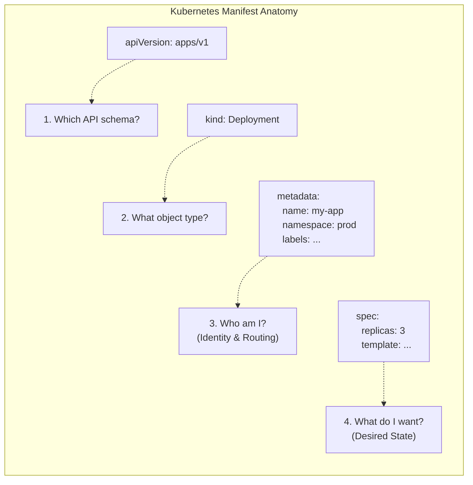

# Module 1.8: YAML for Kubernetes

**Complexity:** [MEDIUM]  
**Time to Complete:** 35-40 minutes  
**Prerequisites:** Modules 1.1-1.7 (familiarity with K8s resources)

---

## Learning Outcomes

By the end of this module, you will be able to:

1. **Construct** structurally sound Kubernetes manifests using fundamental YAML syntax, including scalars, sequences, mappings, and multi-line strings.
2. **Deconstruct** the four required fields of every Kubernetes resource (`apiVersion`, `kind`, `metadata`, `spec`) to explain their distinct roles in declarative state management.
3. **Diagnose** structural and schema validation errors in YAML files by interpreting output from `kubectl apply --dry-run` and `kubectl explain`.
4. **Design** complex, multi-resource deployment configurations utilizing advanced YAML patterns like document separators, environment variables, and volume mounts.

---

## Why This Module Matters

It was 2:15 AM on a Tuesday when the primary checkout service for a mid-sized e-commerce platform abruptly vanished from the production cluster. The on-call engineer, bleary-eyed and fueled by cold coffee, frantically checked the deployment pipelines. A hotfix had just been rolled out to patch a critical vulnerability in a background worker process. The pipeline showed green, but the checkout pods were gone.

After 45 minutes of searching, the root cause was discovered: a single, misplaced hyphen in a YAML file. The developer had accidentally converted a dictionary mapping of deployment labels into a list item, invalidating the selector that tied the Service to the Deployment. The Kubernetes API server, perfectly executing what it was told, saw a Deployment with no matching pods, and the Service routed traffic into the void. This tiny syntactic error cost the company tens of thousands of dollars in lost revenue.

**War Story: The Folded Certificate**
In another infamous incident at a financial tech firm, an engineer updated a TLS certificate stored as a Secret in Kubernetes. Instead of using the literal block scalar (`|`) to preserve the certificate's strict newlines, they accidentally used the folded block scalar (`>`). When Kubernetes mounted the Secret into the Ingress controller, the entire certificate was parsed as a single, massive string separated by spaces instead of newlines. The Ingress controller crashed repeatedly because the certificate format was invalid, causing a two-hour total global outage. A single character difference (`>` vs `|`) bypassed basic YAML syntax checks because the YAML itself was technically valid—it just ruined the data.

YAML (YAML Ain't Markup Language) is the lingua franca of Kubernetes. It is how you communicate your desired state to the control plane. While Kubernetes can technically consume JSON, YAML is the human-readable standard. However, its reliance on significant whitespace and subtle syntactical rules makes it a minefield for the uninitiated. Mastering YAML is not just about learning a configuration language; it is about learning how to precisely and safely interface with the Kubernetes API. This module will transform YAML from a source of frustration into a powerful, predictable tool for declarative infrastructure.

---

## 1. YAML Fundamentals for Infrastructure

Before diving into Kubernetes-specific schema, you must understand the core data structures of YAML. YAML is a data serialization language designed to be directly readable by humans while mapping easily to native data structures in programming languages (like dictionaries, lists, and strings). 

### Scalars, Mappings, and Sequences

At its lowest level, a YAML file is built from three primitive structures:

1. **Scalars:** Single values (strings, integers, booleans). They are the leaves of the data tree.
2. **Mappings (Dictionaries/Hashes):** Key-value pairs. They define properties of an object.
3. **Sequences (Lists/Arrays):** Ordered collections of items.

These structures can be infinitely nested to represent complex systems:

```yaml
# This is a Mapping at the root level
server: nginx
port: 8080
is_active: true # Boolean scalar

# This is a Sequence (List) of scalars
allowed_origins:
  - https://example.com
  - https://api.example.com

# This is a Mapping containing a Sequence of Mappings
users:
  - name: alice
    role: admin
    permissions:
      - read
      - write
  - name: bob
    role: editor
    permissions:
      - read
```

**Crucial Rule:** YAML uses spaces for indentation to denote structure. **Tabs are strictly forbidden.** A standard convention in the Kubernetes ecosystem is to use **two spaces** per indentation level. A single misaligned space changes the entire data structure, often leading to schema validation failures.

> **Pause and predict**: 
> Look at the `users` block above. How many items are in the `users` sequence? What type of data does the `permissions` key hold?
> <details>
> <summary>Reveal Answer</summary>
> The `users` sequence has 2 items (mappings for alice and bob). The `permissions` key holds a Sequence (list) of string scalars.
> </details>

### Multi-Line Strings: The `|` and `>` Operators

When passing configuration files, scripts, or certificates into Kubernetes ConfigMaps or Secrets, you will frequently need to embed multi-line strings. YAML provides two block scalar indicators for this:

*   **Literal Block Scalar (`|`):** Preserves newlines and exact formatting. This is what you want 99% of the time for scripts, configuration files, or TLS certificates.
*   **Folded Block Scalar (`>`):** Folds newlines into spaces, creating a single long string, unless there is a blank line.

```yaml
# Literal (|) - Preserves structure perfectly for a script
setup_script: |
  #!/bin/bash
  echo "Starting setup..."
  apt-get update
  apt-get install -y curl

# Folded (>) - Good for long descriptions that should be a single paragraph
description: >
  This is a very long description that I want to type
  across multiple lines in my editor for readability,
  but I want the application to see it as a single,
  continuous string of text.
```

> **Stop and think**: 
> If you are embedding a `.pem` certificate key into a Kubernetes Secret, which multi-line operator MUST you use and why?
> <details>
> <summary>Reveal Answer</summary>
> You MUST use the literal block scalar (`|`). Certificates rely on strict newline boundaries (e.g., `-----BEGIN CERTIFICATE-----` followed by a newline). If you use `>`, it will fold the certificate into one invalid line.
> </details>

### Advanced YAML: Anchors (`&`) and Aliases (`*`)

While less common in standard Kubernetes manifests due to the preference for Helm or Kustomize for templating, native YAML supports DRY (Don't Repeat Yourself) principles via anchors and aliases.

An anchor (`&`) defines a chunk of YAML, and an alias (`*`) injects it elsewhere.

```yaml
# Define an anchor named 'common_labels'
base_labels: &common_labels
  app: web-tier
  environment: production
  managed-by: platform-team

frontend_pod:
  metadata:
    # Use the merge key (<<) to inject the alias
    <<: *common_labels
    name: react-frontend

backend_pod:
  metadata:
    <<: *common_labels
    name: node-api
```

> **Pause and predict**: 
> Look at the `frontend_pod` structure above. If you were to convert that YAML into JSON, what would the resulting JSON object look like for `frontend_pod.metadata`?
> <details>
> <summary>Reveal Answer</summary>
> 
> ```json
> {
>   "app": "web-tier",
>   "environment": "production",
>   "managed-by": "platform-team",
>   "name": "react-frontend"
> }
> ```
> The merge key expands the dictionary inline.
> </details>

---

## 2. The Anatomy of a Kubernetes Manifest

Every single resource you create in Kubernetes—from a simple Pod to a complex CustomResourceDefinition—requires exactly four root-level fields. If any of these are missing, the API server will reject the payload immediately. Understanding these four fields is the key to mastering declarative state.



### 1. `apiVersion`
This tells the API server which version of the schema to use for validation. Kubernetes APIs evolve. A resource might start in `v1alpha1`, graduate to `v1beta1`, and finally become `v1`. The `apiVersion` dictates exactly what fields are allowed in the rest of the file. Group names are included here (e.g., `apps/v1`, `networking.k8s.io/v1`). If there is no slash, it belongs to the "core" group (e.g., just `v1` for Pods, Services, and ConfigMaps). 

*Worked Example:* If you try to create a `Deployment` with `apiVersion: v1`, the API server will reject it because Deployments are governed by the `apps/v1` schema.

### 2. `kind`
The type of object you are trying to create (e.g., `Pod`, `Service`, `Deployment`, `StatefulSet`, `Ingress`). It is always capitalized (CamelCase).

### 3. `metadata`
Data that uniquely identifies the object and allows the cluster to organize it.
*   **`name`**: Must be unique within the namespace for that specific `kind`.
*   **`namespace`**: The virtual cluster the object belongs to. Defaults to `default` if omitted. If you forget to specify this, you might deploy to the wrong environment!
*   **`labels`**: Key-value pairs used for organizing and selecting subsets of objects (e.g., `tier: frontend`, `env: prod`). These are functional and critical for routing traffic.
*   **`annotations`**: Non-identifying metadata used by external tools or controllers (e.g., `build-commit: 4a2b9c`, `nginx.ingress.kubernetes.io/rewrite-target: /`). These are descriptive and usually don't affect standard Kubernetes routing.

### 4. `spec` (Specification)
This is the heart of the manifest. The `spec` declares your **desired state**. Every `kind` has a drastically different `spec` schema. A Pod's `spec` defines containers and volumes; a Service's `spec` defines ports and selectors. The Kubernetes control plane continuously works to make the actual state match the desired state defined in this block.

*(Note: A few objects, like `ConfigMap` and `Secret`, use a `data` field instead of `spec`, but the principle is the same).*

> **Pause and predict**: 
> You are creating a `ConfigMap`. Which of the 4 standard root fields will be replaced, and what is its name?
> <details>
> <summary>Reveal Answer</summary>
> The `spec` field is replaced by `data` (or `binaryData`). ConfigMaps and Secrets don't have a "specification" of desired state; they just hold raw data.
> </details>

---

## 3. Mastering `kubectl explain`

You cannot memorize the entire Kubernetes API schema. There are thousands of fields, and custom resources add thousands more. When you need to know how to configure a readiness probe or mount a volume, you do not need to search the web—you have the official documentation built directly into your terminal via `kubectl explain`.

`kubectl explain` queries the OpenAPI schema of your cluster.

### Exploring the Schema

Want to know what fields are available in a Pod's `spec`?

```bash
# General syntax: kubectl explain <kind>.<field>.<field>
kubectl explain pod.spec
```

The output provides a description of the `spec` block and lists all available fields within it, including their data types (`<string>`, `<[]Object>`, `<map[string]string>`).
*   `<string>`: Expects a scalar string (e.g., `restartPolicy: Always`).
*   `<[]Object>`: The `[]` means it expects a Sequence (list). You must use hyphens (e.g., `containers:`).
*   `<map[string]string>`: Expects a Mapping (dictionary) of strings to strings (e.g., `nodeSelector:`).

### Drilling Down

You can chain fields with dots to traverse deeply into the schema. Let's find out how to configure a liveness probe for a container.

```bash
kubectl explain pod.spec.containers.livenessProbe
```

**Output snippet:**
```text
KIND:       Pod
VERSION:    v1

RESOURCE:   livenessProbe <Probe>

DESCRIPTION:
     Periodic probe of container liveness. Container will be restarted if the
     probe fails. Cannot be updated...

FIELDS:
   exec <ExecAction>
     Exec specifies the action to take.

   httpGet      <HTTPGetAction>
     HTTPGet specifies the http request to perform.
...
```

You can drill down even further:
```bash
kubectl explain pod.spec.containers.livenessProbe.httpGet
```

### The `--recursive` Flag

If you want to see the entire skeleton of an object at once without descriptions, use the `--recursive` flag. This is incredibly useful for visually grasping the nested structure of complex objects like Deployments.

```bash
kubectl explain deployment --recursive
```

> **Stop and think**: 
> Use your terminal (or imagine using it). You need to add a "node selector" to ensure a Pod only runs on nodes with SSDs. What exact `kubectl explain` command would you run to find the documentation for the node selector field inside a Pod?
> <details>
> <summary>Reveal Answer</summary>
> 
> ```bash
> kubectl explain pod.spec.nodeSelector
> ```
> This will show you that `nodeSelector` expects a `<map[string]string>`, meaning you provide key-value pairs representing node labels.
> </details>

---

## 4. Common YAML Patterns in Kubernetes

Let's look at how fundamental YAML structures map to everyday Kubernetes configurations. Misunderstanding these structures is the number one cause of broken deployments.

### Environment Variables (Sequences of Mappings)

Environment variables in a container are defined as a list (sequence) of dictionaries (mappings), where each dictionary must have at least a `name` and `value` key. You can also inject values from ConfigMaps or Secrets using `valueFrom`.

```yaml
apiVersion: v1
kind: Pod
metadata:
  name: env-demo
spec:
  containers:
  - name: my-app
    image: nginx:alpine
    env:                   # The 'env' field takes a Sequence (List)
      - name: DATABASE_URL # First item in the list, direct value
        value: "postgres://db:5432"
      - name: LOG_LEVEL    # Second item in the list
        value: "debug"
      - name: API_KEY      # Third item, value injected from a Secret
        valueFrom:
          secretKeyRef:
            name: app-secrets
            key: api-key
```

### Volume Mounts (Connecting the Pieces)

Volumes are a two-step process in YAML. First, you define the volume at the Pod level (`spec.volumes`). Second, you mount it into specific containers (`spec.containers[].volumeMounts`). Both are sequences.

```yaml
apiVersion: v1
kind: Pod
metadata:
  name: volume-demo
spec:
  containers:
  - name: app-container
    image: busybox
    command: ["sleep", "3600"]
    volumeMounts:          # Where does the container see the volume?
    - name: config-store   # Must match the volume name below exactly!
      mountPath: /etc/config
      readOnly: true
  volumes:                 # What is the actual volume backing this?
  - name: config-store     # The identifier
    configMap:             # The volume type (populates files from a ConfigMap)
      name: my-app-config
```

### Labels and Selectors (Mappings)

Labels are simple key-value pairs used for identification. Selectors are used by resources like Services and Deployments to find other resources based on those labels. For advanced matching, Deployments use `matchLabels` or `matchExpressions`.

```yaml
# A Service looking for specific pods
apiVersion: v1
kind: Service
metadata:
  name: frontend-svc
spec:
  selector:              # The Service will route traffic to any Pod...
    app: frontend        # ...that has this exact label
    tier: web            # ...AND this exact label.
  ports:
  - port: 80
```

---

## 5. Multi-Resource Files

In the real world, an application consists of multiple components: a Deployment, a Service, a ConfigMap, etc. Instead of managing a dozen separate files, you can combine multiple Kubernetes resources into a single YAML file using the document separator: `---` (three hyphens).

```yaml
apiVersion: v1
kind: ConfigMap
metadata:
  name: app-config
data:
  color: "blue"
---
apiVersion: apps/v1
kind: Deployment
metadata:
  name: my-app
spec:
  replicas: 2
  # ... deployment details ...
---
apiVersion: v1
kind: Service
metadata:
  name: my-app-svc
spec:
  # ... service details ...
```

When you run `kubectl apply -f combined.yaml`, the API server processes all documents.

> **Stop and think**: 
> Does the order of documents separated by `---` matter when you run `kubectl apply -f combined.yaml`?
> <details>
> <summary>Reveal Answer</summary>
> Technically, `kubectl apply` processes them in the order they appear. However, because Kubernetes reconciles state continuously, if a Deployment is created before the ConfigMap it depends on, the Pods will simply fail to start and crash-loop until the ConfigMap is created moments later. It eventually resolves itself, but it is best practice to put dependencies (ConfigMaps, Secrets, PVCs) at the top of the file!
> </details>

---

## 6. Validating YAML and Real Debugging

Writing YAML is easy; debugging it is hard. The Kubernetes API server is incredibly strict. You must validate your files before applying them to a live cluster.

### Client-Side Validation

The fastest way to check syntax without impacting the cluster is to use the client-side dry run. This verifies your YAML structure and basic schema correctness locally without communicating with the server's admission controllers.

```bash
kubectl apply -f my-pod.yaml --dry-run=client
```
If successful, it outputs `pod/my-pod created (dry run)`. If it fails, `kubectl` will point to the exact line containing the error.

### Server-Side Validation

Client-side validation doesn't catch everything. For example, it might not know if a specific Custom Resource Definition exists on the cluster, if a namespace doesn't exist, or if an admission webhook will reject your mutation. Server-side dry-run sends the payload to the API server for full validation without persisting the object to etcd.

```bash
kubectl apply -f my-pod.yaml --dry-run=server
```

### The `kubectl diff` Command

Before applying changes to an existing resource, ALWAYS use `kubectl diff`. It shows you exactly what fields will change, using standard `diff` output (+ for additions, - for deletions). This prevents accidental destructive updates, like changing a label that suddenly orphans all your Pods.

```bash
kubectl diff -f my-updated-deployment.yaml
```

### Decoding Error Messages

When validation fails, Kubernetes error messages can seem cryptic. Let's decode common ones with specific examples:

**Error 1: The Indentation Trap**
```text
error: error parsing deployment.yaml: error converting YAML to JSON: yaml: line 15: mapping values are not allowed in this context
```
*   **Diagnosis:** This almost always means you have an indentation error, specifically a missing hyphen for a list item, or bad spacing around a colon. Check line 15 and the lines immediately preceding it.

**Error 2: The Type Mismatch**
```text
The Deployment "my-app" is invalid: spec.replicas: Invalid value: "3": spec.replicas must be an integer
```
*   **Diagnosis:** You provided a string `"3"` instead of the integer `3`. In YAML, quotes force a string type. Remove the quotes.

**Error 3: The Missing Schema**
```text
error: unable to recognize "pod.yaml": no matches for kind "Pod" in version "apps/v1"
```
*   **Diagnosis:** You used the wrong `apiVersion` for the `kind`. Pods belong to the core `v1` API group, not `apps/v1` (which is for Deployments/StatefulSets).

**Error 4: The Duplicate Key**
```text
error: error parsing config.yaml: error converting YAML to JSON: yaml: unmarshal errors:
  line 12: mapping key "port" already defined at line 10
```
*   **Diagnosis:** Mappings (dictionaries) must have unique keys. You cannot define `port: 80` and then `port: 443` in the same mapping block. One will overwrite the other, or the parser will reject it outright.

**Error 5: Unknown Field Validation**
```text
error: error validating "deployment.yaml": error validating data: ValidationError(Deployment.spec.template.spec): unknown field "image" in io.k8s.api.core.v1.PodSpec;
```
*   **Diagnosis:** Schema mismatch. You put `image` directly under `spec`, but `image` belongs inside the `containers` list (`spec.containers[0].image`).

---

## Did You Know?

*   **YAML versioning:** Kubernetes primarily uses YAML version 1.2 specifications, though older parsers relied on 1.1. In YAML 1.1, the string `NO` (without quotes) evaluates to a boolean `False`. This caused massive issues for Norway (country code `NO`), requiring strict quoting in Kubernetes manifests.
*   **Maximum manifest size:** The maximum size of a single object you can store in etcd (and thus submit via YAML) is exactly **1.5 Megabytes**. If your ConfigMap exceeds this, you must rethink your architecture or use external storage.
*   **JSON equivalence:** Because YAML is a superset of JSON, any valid JSON file is automatically a valid YAML file. You can `kubectl apply -f manifest.json` and it works perfectly.
*   **The origin of 'spec':** The division between `metadata` and `spec` was heavily inspired by the design of Google's internal container orchestrator, Borg. The `spec` represents the "desired state vector" submitted to the control loop.
*   **The Y2K of YAML:** The unquoted string `22:22` in YAML 1.1 resolves to an integer representing base-60 format (like a sexagesimal clock), evaluating to `1342`. In YAML 1.2, it is evaluated as a string. To avoid surprises, always quote your times or versions!

---

## Common Mistakes

| Mistake | Why It Happens | How to Fix It |
| :--- | :--- | :--- |
| **Using Tabs for Indentation** | Copy-pasting from web browsers or using misconfigured editors. YAML parsers will violently reject tabs. | Configure your IDE to convert tabs to spaces. Use exactly 2 spaces per indentation level. |
| **Wrong `apiVersion`** | Guessing the API group instead of checking. Deployments are `apps/v1`, Ingress might be `networking.k8s.io/v1`. | Always verify with `kubectl api-resources \| grep <Kind>` to see the correct API group. |
| **Hyphen vs No Hyphen** | Confusing sequences (lists) with mappings (dictionaries). For example, `containers:` requires a list `- name:`, but `metadata:` does not. | Read the schema. If `kubectl explain` says `<[]Object>`, use a hyphen. If it says `<Object>`, don't. |
| **String/Integer Confusion** | Port numbers in Services must be integers. Annotations must strictly be strings. `port: "80"` (string) will fail if an integer is expected. | Remove quotes for integers (`80`). Force strings with quotes if YAML might misinterpret them (`"true"` vs `true`). |
| **Forgetting `---` separator** | Putting multiple resources in one file without the document separator causes parsing to halt or overwrite data. | Always insert `---` on a blank line between distinct Kubernetes objects in a single file. |
| **Mismatched Selectors** | A Service `selector` doesn't exactly match the Deployment Pod `labels`. | Triple-check that the key and value in the Service selector are identical to the labels applied in the Pod template. |

---

## Quiz

<details>
<summary>1. Scenario: You are writing a ConfigMap and need to include a multiline bash script. You want to preserve the exact line breaks and formatting. Which YAML block scalar indicator should you use?</summary>

**Answer:** You must use the literal block scalar, denoted by the `|` (pipe) character. This operator instructs the YAML parser to preserve all newlines and trailing spaces exactly as they are written in the file. Shell scripts fundamentally rely on strict newline boundaries to separate commands and control structures properly. If you were to use the folded block scalar (`>`), the parser would collapse all those newlines into spaces, effectively turning your multi-line script into a single, un-executable string of gibberish. By using `|`, you guarantee that the script injected into the ConfigMap is identical to what you wrote.
</details>

<details>
<summary>2. Scenario: You execute `kubectl apply -f deployment.yaml` as part of a routine update and receive the error: `yaml: line 22: did not find expected key`. What is the most likely cause?</summary>

**Answer:** This error is almost universally caused by an indentation or structural syntax mistake around line 22 of your manifest. In YAML, exact spacing dictates the data hierarchy, so a missing hyphen in a sequence, an extra space before a key, or an unclosed quote can confuse the parser. When the parser reports that it "did not find expected key", it means it is trying to process a dictionary (mapping) but encountered data that doesn't fit the `key: value` format, often because the indentation level shifted unexpectedly. To resolve this, you should carefully examine line 22 and the lines immediately preceding it, ensuring that you are using exactly two spaces per level and that your sequence items properly start with hyphens.
</details>

<details>
<summary>3. Scenario: You are tasked with determining exactly how to configure a PersistentVolumeClaim (PVC) volume directly within a Pod's specification. You have no internet access to check the official documentation. What exact command do you run to read the documentation locally?</summary>

**Answer:** You should run the command `kubectl explain pod.spec.volumes.persistentVolumeClaim`. The `kubectl explain` utility is incredibly powerful because it queries the cluster's OpenAPI schema directly, giving you offline access to the exact, authoritative documentation for your specific cluster version. By chaining the fields with dots, you traverse the nested structure of the Pod object straight to the persistent volume claim configuration block without needing an internet connection. This output will list all the valid keys (like `claimName` or `readOnly`), their expected data types, and a comprehensive description of what they do, entirely removing the need to search the web.
</details>

<details>
<summary>4. Scenario: You are hastily drafting a new Custom Resource Definition (CRD) manifest from memory during an active incident. You know the API server enforces a strict structural contract for all objects before it even evaluates the schema. Which four root-level fields must you absolutely include for the API server to accept the payload?</summary>

**Answer:** The four mandatory fields are `apiVersion`, `kind`, `metadata`, and `spec` (or occasionally `data` for objects like ConfigMaps). The `apiVersion` tells the cluster which schema version to use, while `kind` specifies the type of resource being created. The `metadata` block provides essential routing and identification information, most notably the unique `name` and `namespace`. Finally, the `spec` block contains the desired state of the object, which the Kubernetes control loops will continuously work to achieve. Without all four of these, the API server cannot even begin to validate the request and will immediately reject it.
</details>

<details>
<summary>5. Scenario: You have written a complex, 300-line StatefulSet YAML file. You want to verify the syntax and ensure the API server understands the resource schema, but you absolutely cannot risk creating the object in the cluster yet because the database is currently migrating. Which flag must you append to `kubectl apply`?</summary>

**Answer:** You must append the `--dry-run=server` flag to your command. This flag is critical because it sends the entire payload directly to the Kubernetes API server for comprehensive validation without actually persisting the object to the etcd datastore. Unlike the client-side dry run, the server-side check ensures that the manifest complies with admission controllers, Custom Resource Definitions, and cluster-specific constraints. It gives you absolute confidence that the 300-line StatefulSet is structurally and functionally sound before you execute a live deployment.
</details>

<details>
<summary>6. Scenario: Your CI/CD pipeline dynamically generates configuration files, but the templating tool only outputs strictly formatted JSON arrays and objects. You need to deploy these generated objects to your Kubernetes cluster using `kubectl apply`, but you do not have a utility installed to convert them to YAML. Can you apply the JSON files directly, and why?</summary>

**Answer:** Yes, you can apply the JSON files directly without any conversion. The YAML specification is officially designed as a strict superset of JSON, which means any properly formatted JSON document is inherently a valid YAML document. The Kubernetes API server and the `kubectl` tool's underlying parsers seamlessly understand and process JSON payloads natively. This compatibility is particularly useful in automated pipelines where tools often emit JSON natively, saving you the computational and operational overhead of adding a conversion step.
</details>

---

## Hands-On Exercise

In this exercise, you will build a multi-resource application from scratch, deliberately introduce errors, and use debugging techniques to fix them.

**Prerequisites:** Ensure you have access to a running Kubernetes cluster (like minikube or kind) and `kubectl` configured.

### Task 1: The Broken Foundation
Create a file named `dojo-app.yaml`. Paste the following intentionally broken YAML into it. Attempt to apply it using `kubectl apply -f dojo-app.yaml --dry-run=client`.

```yaml
apiVersion: v1
kind: Deployment
metadata:
  name: web-app
spec:
  replicas: "2"
  selector:
    matchLabels:
      app: web
  template:
    metadata:
      labels:
        app: web
    spec:
      containers:
      name: nginx
      image: nginx:1.27
```

<details>
<summary>Solution & Diagnosis 1</summary>

You should see an error similar to: `no matches for kind "Deployment" in version "v1"`.
**Fix:** Change `apiVersion: v1` to `apiVersion: apps/v1`. Deployments do not live in the core API group.
</details>

### Task 2: The Type and Structure Failures
Apply the file again (client dry-run). You will hit more errors. Fix them one by one based on the error messages. Use `kubectl explain deployment.spec` if you get stuck on the structure.

<details>
<summary>Solution & Diagnosis 2</summary>

1.  **Error:** `Invalid value: "2": spec.replicas must be an integer`.
    **Fix:** Change `replicas: "2"` to `replicas: 2` (remove quotes).
2.  **Error:** `error converting YAML to JSON: yaml: line 15: mapping values are not allowed in this context` (or similar depending on parser). Look at the `containers` block.
    **Fix:** `containers` expects a sequence (list) of objects, not a direct mapping. You are missing the hyphen.
    Change:
    ```yaml
      containers:
      name: nginx
    ```
    To:
    ```yaml
      containers:
      - name: nginx
        image: nginx:1.27
    ```
</details>

### Task 3: Adding a Service Safely
Now that the Deployment validates, append a Service to the *bottom* of the same `dojo-app.yaml` file. The Service should expose port 80 and route to your Pods. **Ensure you use the correct document separator.**

<details>
<summary>Solution 3</summary>

Add `---` at the end of the file, then append the Service definition:

```yaml
---
apiVersion: v1
kind: Service
metadata:
  name: web-app-svc
spec:
  selector:
    app: web
  ports:
  - port: 80
    targetPort: 80
```
</details>

### Task 4: Adding a ConfigMap Dependency
Now, add a third resource at the **top** of the file (before the Deployment): a ConfigMap named `app-config` with a single key `welcome-message` and value `"Hello KubeDojo!"`. 

<details>
<summary>Solution 4</summary>

Add this to the very top of `dojo-app.yaml` and separate it from the Deployment with `---`.

```yaml
apiVersion: v1
kind: ConfigMap
metadata:
  name: app-config
data:
  welcome-message: "Hello KubeDojo!"
---
```
</details>

### Task 5: Connecting the Pieces
Modify the Deployment from Task 2 so that the `nginx` container mounts the ConfigMap from Task 4 as an environment variable named `GREETING`. Then, run a server-side dry run to validate everything.

```bash
kubectl apply -f dojo-app.yaml --dry-run=server
```

<details>
<summary>Solution 5</summary>

Your final, valid `dojo-app.yaml` should look exactly like this:

```yaml
apiVersion: v1
kind: ConfigMap
metadata:
  name: app-config
data:
  welcome-message: "Hello KubeDojo!"
---
apiVersion: apps/v1
kind: Deployment
metadata:
  name: web-app
spec:
  replicas: 2
  selector:
    matchLabels:
      app: web
  template:
    metadata:
      labels:
        app: web
    spec:
      containers:
      - name: nginx
        image: nginx:1.27
        env:
        - name: GREETING
          valueFrom:
            configMapKeyRef:
              name: app-config
              key: welcome-message
---
apiVersion: v1
kind: Service
metadata:
  name: web-app-svc
spec:
  selector:
    app: web
  ports:
  - port: 80
    targetPort: 80
```

When you run `kubectl apply -f dojo-app.yaml --dry-run=server`, you should see output confirming all three resources:
```text
configmap/app-config created (server dry run)
deployment.apps/web-app created (server dry run)
service/web-app-svc created (server dry run)
```
If you see this, your complex multi-resource YAML file is structurally sound and schema-compliant. You can remove `--dry-run=server` to actually deploy it!
</details>

---

## Next Module

You've mastered the language of Kubernetes (YAML) and understand how to construct the resources that run your workloads. But *why* is Kubernetes designed this way? Why use declarative YAML instead of imperative commands? 

Continue to [Philosophy and Design](/prerequisites/philosophy-design/module-1.1-why-kubernetes-won/) to understand the bigger picture: the control loops, the reconciliation architecture, and why Kubernetes ultimately won the container orchestration war.