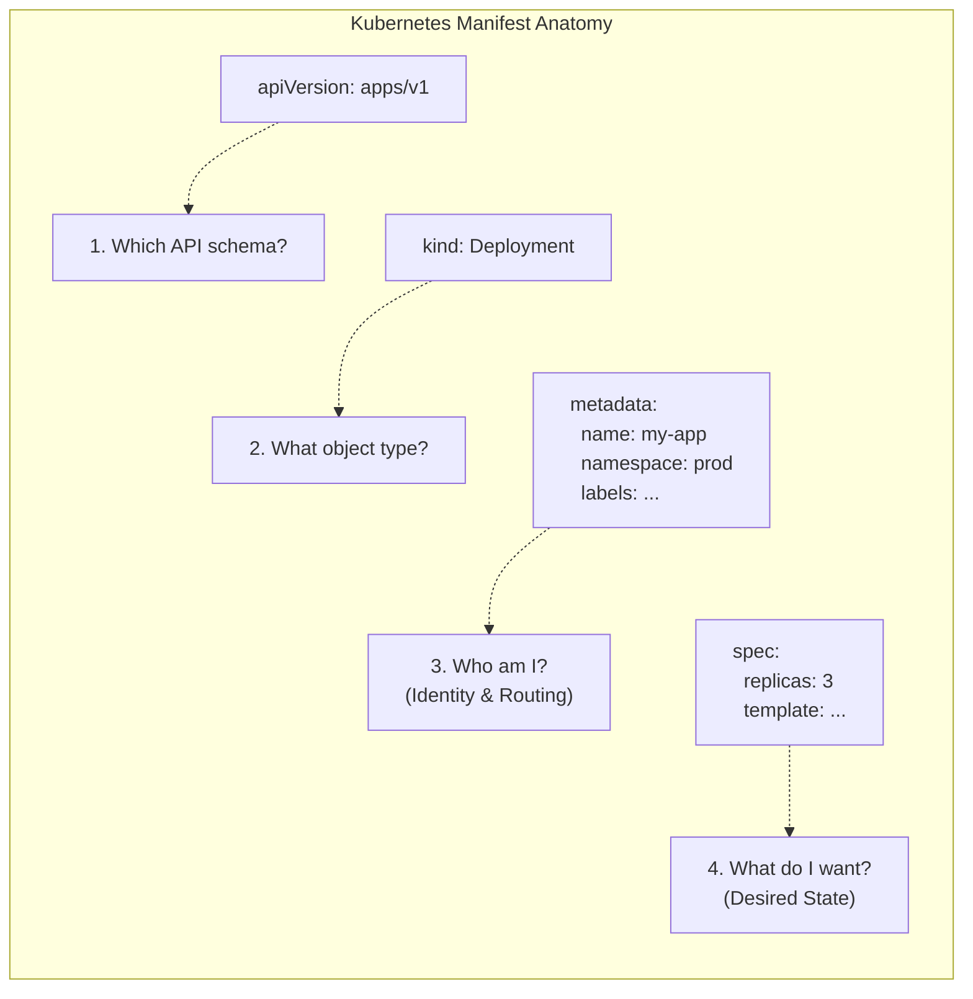

# Module 1.8: YAML for Kubernetes

**Complexity:** [MEDIUM]  
**Time to Complete:** 60-75 minutes
**Prerequisites:** Modules 1.1-1.7, including basic Kubernetes resources, pods, services, deployments, labels, and the `kubectl` workflow
**Command convention:** This module uses the short alias `k` for `kubectl`; set it once with `alias k=kubectl` before running the examples.

## Learning Outcomes

By the end of this module, you will be able to:

1. **Construct** structurally sound Kubernetes manifests using YAML scalars, mappings, sequences, multi-line strings, and multi-document files.
2. **Deconstruct** the required Kubernetes manifest fields `apiVersion`, `kind`, `metadata`, and `spec` so you can explain how they route declarative state through the API server.
3. **Diagnose** YAML syntax, schema, and type validation failures by combining dry-run output, `k explain`, and targeted inspection of nested manifest paths.
4. **Design** multi-resource application manifests that connect Deployments, Services, ConfigMaps, environment variables, labels, selectors, and volume mounts.
5. **Compare** client-side validation, server-side validation, and diff workflows to choose the safest verification step before applying a production change.

## Why This Module Matters

In 2021, a fast-growing fintech platform entered a trading window with customer traffic already above its normal peak. A platform engineer pushed what looked like a routine Kubernetes manifest update: raise the replica count, adjust container arguments, and increase memory limits for the backend processors. One extra indentation level moved a command-line argument out of the container argument list and into a nested mapping. The YAML parser accepted the document, the review looked visually plausible, and the deployment moved forward, but the containers crashed as soon as the runtime tried to start them. The outage lasted 45 minutes, interrupted live transaction processing, and produced an estimated $2.5 million business impact before the team traced the failure back to a small structural mistake.

That kind of incident feels unfair until you remember what YAML does in Kubernetes. YAML is not just a convenient file format for humans; it is the front door to the API server's declarative contract. A manifest is converted into structured data, validated against an OpenAPI schema, admitted through policy, persisted as desired state, and then reconciled by controllers. If the structure says the wrong thing, Kubernetes will faithfully pursue the wrong instruction or reject the request at the point where it can no longer interpret your intent. The discipline you build here is the discipline that keeps routine configuration work from becoming a production event.

There is another class of failure that is even quieter. In 2019, a European financial institution rotated a TLS certificate through a Kubernetes Secret and used YAML's folded block scalar by mistake. The file was valid YAML, the Secret was created, and the rollout continued, but the folded scalar replaced certificate newlines with spaces. The ingress controller received a malformed PEM payload, failed to load its certificate, and repeatedly restarted while external banking APIs were unavailable. A single character, `>` instead of `|`, did not break YAML syntax; it changed the application data that YAML carried.

This module teaches YAML as an operational interface, not as decorative syntax. You will learn the three YAML shapes that appear in every manifest, the four root fields Kubernetes uses to route objects, the schema tools that prevent guessing, and the validation workflow that turns manifest review into an engineering practice. The goal is not memorizing every field in Kubernetes 1.35; the goal is knowing how to reason from structure to schema to controller behavior when the cluster is about to act on your file.

## 1. YAML Fundamentals for Infrastructure

YAML exists because infrastructure configuration has to be both machine-readable and reviewable by humans under time pressure. JSON is explicit, but large JSON manifests are visually noisy because every nested object needs braces, quotes, and commas. YAML removes much of that punctuation and lets indentation carry the hierarchy, which makes ordinary review easier but also makes whitespace part of the data model. A Kubernetes manifest is therefore closer to a carefully folded map than a casual note: the shape of each line tells the parser what belongs to what.

At the lowest level, YAML gives you three building blocks. A scalar is a single value such as `nginx:1.27`, `8080`, `true`, or `"production"`. A mapping is a collection of unique keys and values, the same idea as a dictionary or hash map in a programming language. A sequence is an ordered list, and every item in that list begins with a hyphen at the correct indentation level. Kubernetes resources combine these three shapes again and again until they describe a complete workload.

```yaml
# This is a Mapping at the root level
server: nginx
port: 8080
is_active: true # Boolean scalar

# This is a Sequence (List) of scalars
allowed_origins:
  - https://example.com
  - https://api.example.com

# This is a Mapping containing a Sequence of Mappings
users:
  - name: alice
    role: admin
    permissions:
      - read
      - write
  - name: bob
    role: editor
    permissions:
      - read
```

Read that example as a tree rather than as text. The root contains three mapping keys, `server`, `port`, and `is_active`, followed by two larger keys whose values contain nested structures. `allowed_origins` is a sequence of scalar strings, while `users` is a sequence of mappings, and each user mapping contains another sequence under `permissions`. Kubernetes uses exactly this nesting style for fields like `containers`, `env`, `ports`, `volumeMounts`, and `rules`, so the ability to identify the expected shape is more valuable than memorizing a particular manifest.

The most important rule is also the easiest to underestimate: YAML indentation uses spaces, not tabs, and the Kubernetes convention is two spaces per level. Tabs are not a stylistic disagreement in YAML; they are invalid indentation. A one-space drift can also change meaning without looking dramatic in a pull request, especially when a nested sequence item is visually close to the field above it. Configure your editor to render whitespace, convert tabs to spaces, and format YAML with two-space indentation before you rely on visual review.

Pause and predict: in the `users` block above, how many items are in the `users` sequence, and what type of data does `permissions` hold? There are two user items, and each item is a mapping. The `permissions` value is a sequence of scalar strings. If you answered by counting hyphens at the same indentation level, you used the same structural habit you need when reviewing Kubernetes `containers`, `ports`, and `env` blocks.

### Multi-Line Strings: The `|` and `>` Operators

YAML becomes especially useful in Kubernetes when you need to carry text that already has internal structure. ConfigMaps often contain application configuration files, shell scripts, or web server snippets. Secrets can contain certificate material, private key text, or configuration fragments that must keep exact line boundaries after decoding. JSON can represent that data, but it forces escaped newline characters into a single string, while YAML can embed the text in a readable block.

YAML has two block scalar operators that look similar and behave very differently. The literal block scalar, `|`, preserves newlines and indentation inside the block. The folded block scalar, `>`, folds ordinary line breaks into spaces while preserving paragraph breaks around blank lines. That makes `>` useful for long descriptions and almost always wrong for scripts, certificates, kubeconfig fragments, and any data where the receiving program treats newlines as syntax.

```yaml
# Literal (|) - Preserves structure perfectly for a script
setup_script: |
  #!/bin/bash
  echo "Starting setup..."
  apt-get update
  apt-get install -y curl

# Folded (>) - Good for long descriptions that should be a single paragraph
description: >
  This is a very long description that I want to type
  across multiple lines in my editor for readability,
  but I want the application to see it as a single,
  continuous string of text.
```

The operational consequence is simple: choose the scalar based on what the application expects, not on what is easier to read in your editor. A shell script mounted from a ConfigMap needs `|` because the shell reads one command line after another. A TLS certificate needs `|` because PEM boundaries and base64 line breaks are meaningful to many parsers. A human-readable annotation that an external dashboard displays as a paragraph can use `>` because the consumer wants one flowing string.

Stop and think: if you are embedding a `.pem` certificate key into a Kubernetes Secret, which operator must you use and why? Use the literal block scalar, `|`, because a certificate is structured text with newline boundaries that must survive serialization. If you use `>`, the manifest may pass YAML parsing and still deliver corrupt application data, which is more dangerous than a syntax error because the failure appears later in the rollout.

### Advanced YAML: Anchors (`&`) and Aliases (`*`)

YAML also includes anchors and aliases, a native reuse feature that lets one part of a document refer to another part. An anchor, marked with `&`, names a reusable mapping or value. An alias, marked with `*`, expands that anchored value elsewhere. Combined with the merge key `<<`, anchors can reduce repeated labels or configuration fragments in hand-authored YAML, although many Kubernetes teams prefer Kustomize, Helm, or another purpose-built tool for larger reuse patterns.

```yaml
# Define an anchor named 'common_labels'
base_labels: &common_labels
  app: web-tier
  environment: production
  managed-by: platform-team

frontend_pod:
  metadata:
    # Use the merge key (<<) to inject the alias
    <<: *common_labels
    name: react-frontend

backend_pod:
  metadata:
    <<: *common_labels
    name: node-api
```

When a YAML parser resolves that document, it expands the alias before Kubernetes receives the object. The API server does not store an anchor as a special Kubernetes feature; it receives the resulting mapping. That distinction matters when debugging because an error from the API server refers to the expanded object shape, not to your reuse shortcut. Anchors can be useful in a small local exercise, but in shared production repositories they can make review harder if teammates are not expecting implicit expansion.

```json
{
  "app": "web-tier",
  "environment": "production",
  "managed-by": "platform-team",
  "name": "react-frontend"
}
```

Pause and predict: after expansion, what does `frontend_pod.metadata` contain? It contains the three shared labels from `common_labels` plus the explicit `name: react-frontend` key. The merge keeps the mapping flat, which is why the JSON representation above has four sibling keys rather than a nested `base_labels` object.

## 2. The Anatomy of a Kubernetes Manifest

Once YAML gives you a data tree, Kubernetes needs to know what that tree represents. Every ordinary Kubernetes object starts with a small root-level contract: `apiVersion`, `kind`, `metadata`, and usually `spec`. Those fields are not decoration. They tell the API server which schema to use, which object type to route to, how to identify the object, and what desired state the controllers should reconcile. If the root contract is missing or contradictory, the cluster cannot safely interpret the manifest.



The `apiVersion` field selects the API group and version that define the resource schema. Core resources such as Pods, Services, ConfigMaps, and Secrets use `v1` because they belong to the core API group. Deployments use `apps/v1`, Ingresses use `networking.k8s.io/v1`, and many operators add custom API groups for their own resources. The slash in `apps/v1` is not a path separator in a file system; it separates the group from the version so Kubernetes can choose the correct schema and storage strategy.

The `kind` field names the type of object inside that API version. `Deployment`, `Service`, `Pod`, `Job`, `StatefulSet`, and `Ingress` are different kinds, and each one has its own expected `spec` structure. A common beginner error is pairing a valid kind with the wrong API version, such as `kind: Deployment` under `apiVersion: v1`. That is not a small typo; it asks the core API group to recognize an object it does not own, so the server returns a "no matches for kind" error.

The `metadata` field gives the object identity and the metadata that other controllers and tools use to find it. The `name` must be unique for that resource kind within a namespace. The `namespace` scopes names and policies, and omitting it means the object lands in the current or default namespace, depending on the command context. Labels are structured key-value pairs used by selectors, while annotations hold non-identifying metadata for tools, controllers, and humans. Treat labels as routing and grouping inputs, and treat annotations as descriptive or integration metadata unless a specific controller documents otherwise.

The `spec` field declares desired state, which is the central idea behind Kubernetes. A Deployment `spec` says how many replicas should exist, which pods it should manage, and what container template it should roll out. A Service `spec` says which ports to expose and which pod labels to select. A Pod `spec` says which containers, volumes, probes, and scheduling constraints should exist. Some data-centric resources, such as ConfigMaps and Secrets, use `data`, `binaryData`, or `stringData` instead of a traditional `spec`, but they still follow the same object identity and API routing model.

Worked example: in Kubernetes 1.35, a Deployment belongs to `apps/v1`, and the pod template inside its `spec` contains the eventual container list. If you place `image: nginx:1.27` directly under `Deployment.spec`, the YAML may still be valid, but the schema is wrong because the image field belongs under `spec.template.spec.containers[]`. This is the difference between YAML validity and Kubernetes validity. YAML only proves the text can become data; Kubernetes validation proves the data matches the chosen API schema.

Pause and predict: you are creating a ConfigMap, so which standard root field is replaced and what is the replacement called? A ConfigMap does not use a workload-style `spec`; it stores key-value content under `data` and optionally `binaryData`. You still need `apiVersion`, `kind`, and `metadata`, because the API server must know what object is being created and how to identify it.

## 3. Exploring the Schema with `k explain`

You should not try to memorize the full Kubernetes API. Even the built-in resources have deeply nested fields, and production clusters often add CustomResourceDefinitions for ingress controllers, certificate managers, policy engines, database operators, service meshes, and delivery systems. Kubernetes gives you a better approach: query the OpenAPI schema through `kubectl explain`, or through `k explain` once you have set the alias. This turns the cluster itself into the version-matched reference for the fields it accepts.

The basic habit is to traverse from a kind to the field you want to inspect. If you need to know what belongs directly under a Pod `spec`, ask for that exact path. The output includes a description and field list, and the type hints tell you whether the field expects a scalar, a mapping, or a sequence. Those hints map directly back to YAML structure: `<string>` means a scalar, `<Object>` means a mapping, `<[]Object>` means a sequence of mappings, and `<map[string]string>` means a mapping from string keys to string values.

```bash
# General syntax: kubectl explain <kind>.<field>.<field>
kubectl explain pod.spec
```

When you run the aliased form in your terminal, use the same field path. The command below asks the same schema question while keeping the shorter `k` command style used in the rest of this module. The important habit is not the spelling of the binary; it is using the schema instead of guessing from memory or copying a stale example from an old blog post.

```bash
k explain pod.spec
```

A liveness probe is a good example because it has several nested options, and only some combinations make sense. You can ask for the probe field first to see the available probe mechanisms, then drill into the HTTP action to inspect the path and port fields. That workflow scales from built-in resources to CRDs as long as the CRD publishes a usable OpenAPI schema.

```bash
kubectl explain pod.spec.containers.livenessProbe
```

```text
KIND:       Pod
VERSION:    v1

RESOURCE:   livenessProbe <Probe>

DESCRIPTION:
     Periodic probe of container liveness. Container will be restarted if the
     probe fails. Cannot be updated...

FIELDS:
   exec <ExecAction>
     Exec specifies the action to take.

   httpGet      <HTTPGetAction>
     HTTPGet specifies the http request to perform.
...
```

You can continue drilling down even further to see the exact parameters required for configuring an HTTP-based liveness probe, checking for things like the expected path and port specifications:

```bash
kubectl explain pod.spec.containers.livenessProbe.httpGet
```

The `--recursive` flag is useful when you want the structural outline without reading a long description for every field. It is not a replacement for targeted field lookup, because a full recursive dump can be large, but it is excellent when you are trying to see the rough shape of a resource before authoring a manifest. For a Deployment, the recursive view quickly reminds you that the container list is inside `spec.template.spec`, not directly under the Deployment root.

```bash
kubectl explain deployment --recursive
```

```bash
k explain deployment --recursive
```

Before running this, what output do you expect if you ask for `k explain pod.spec.nodeSelector`? You should expect a field description and a type that behaves like a mapping from string keys to string values. That means the YAML shape is not a list of selector objects; it is a mapping such as `disktype: ssd`, where each key and value correspond to node labels.

```bash
kubectl explain pod.spec.nodeSelector
```

This schema-first workflow is especially valuable in air-gapped environments. If your production cluster has no internet access, the API server still knows its own schema, including installed CRDs and admission-time expectations that generic web examples cannot cover. A senior Kubernetes engineer does not memorize every field; they know how to ask the cluster precise questions, then translate the returned types into YAML shapes that the API server can validate.

## 4. Common YAML Patterns in Kubernetes

The same small set of YAML structures appears repeatedly in real manifests, but the consequences differ by field. A list under `containers` creates one or more container definitions. A mapping under `selector` controls which pods receive traffic. A two-part relationship between `volumes` and `volumeMounts` decides whether a pod can start at all. Once you train yourself to identify those shapes, error messages become clues instead of noise.

Environment variables show the most common nested pattern: a sequence of mappings. The `env` field under a container does not accept a single mapping of names to values. It accepts a list, and each list item is a mapping with a `name` field plus either a direct `value` or a `valueFrom` reference. This design lets each environment variable carry additional structure, such as references to ConfigMaps, Secrets, fields, or resource values.

```yaml
apiVersion: v1
kind: Pod
metadata:
  name: env-demo
spec:
  containers:
  - name: my-app
    image: nginx:alpine
    env:                   # The 'env' field takes a Sequence (List)
      - name: DATABASE_URL # First item in the list, direct value
        value: "postgres://db:5432"
      - name: LOG_LEVEL    # Second item in the list
        value: "debug"
      - name: API_KEY      # Third item, value injected from a Secret
        valueFrom:
          secretKeyRef:
            name: app-secrets
            key: api-key
```

Notice that every environment variable starts with a hyphen at the same indentation level. If you remove one of those hyphens, you are no longer providing a sequence item, even if the text looks close to correct. Kubernetes will reject the manifest with a type mismatch because the OpenAPI schema expects a list of `EnvVar` objects. That is why `k explain pod.spec.containers.env` is more useful than visual guessing when you are unsure.

Volumes demonstrate a different source of mistakes because the configuration is split across two parts of the pod. The pod-level `spec.volumes` sequence declares volume sources, such as ConfigMaps, Secrets, empty directories, projected volumes, or persistent volume claims. Each container-level `volumeMounts` sequence decides where a named volume appears inside that container's filesystem. The link between those blocks is the volume name, so the names must match exactly.

```yaml
apiVersion: v1
kind: Pod
metadata:
  name: volume-demo
spec:
  containers:
  - name: app-container
    image: busybox
    command: ["sleep", "3600"]
    volumeMounts:          # Where does the container see the volume?
    - name: config-store   # Must match the volume name below exactly!
      mountPath: /etc/config
      readOnly: true
  volumes:                 # What is the actual volume backing this?
  - name: config-store     # The identifier
    configMap:             # The volume type (populates files from a ConfigMap)
      name: my-app-config
```

The split design is intentional. One pod can define several volumes, and different containers can mount different subsets of those volumes at different paths. The tradeoff is that a typo in the shared name is not a YAML error and may not be caught by client-side validation. The pod is syntactically valid but cannot mount what it references, so you diagnose the problem by reading pod events with `k describe pod <name>` after creation or by reviewing the two name fields together before deployment.

Labels and selectors are mappings that connect resources without hard-coding pod names. A Service does not send traffic to a specific pod identity; it watches for pods whose labels match its selector. That indirection is what lets Kubernetes replace pods during rollouts while the Service remains stable. It also means a one-character label mismatch can create a healthy-looking Service with no endpoints.

```yaml
# A Service looking for specific pods
apiVersion: v1
kind: Service
metadata:
  name: frontend-svc
spec:
  selector:              # The Service will route traffic to any Pod...
    app: frontend        # ...that has this exact label
    tier: web            # ...AND this exact label.
  ports:
  - port: 80
```

The selector above is an AND relationship across mapping keys. A pod must have both `app: frontend` and `tier: web` to receive traffic. This is why Deployment pod-template labels and Service selectors deserve careful review together. If the Deployment creates pods with `tier: frontend` while the Service selects `tier: web`, both resources can be valid and still fail as a system because the intended relationship is broken.

Which approach would you choose here and why: hard-code pod names into a client configuration file, or use a Service selector that matches stable labels? Use selectors for normal Kubernetes networking because pods are disposable and labels are the stable contract. Hard-coded pod names turn routine rollouts into configuration churn, while selectors let controllers replace pods without forcing clients to learn new identities.

## 5. Multi-Resource Files and CI/CD

A production application rarely consists of one Kubernetes object. Even a small web service may need a ConfigMap for configuration, a Deployment for compute, a Service for stable networking, an Ingress for external routing, and perhaps a ServiceAccount or Secret. Keeping each object in a separate file can be clear for large repositories, but for a compact teaching example or a small application unit, a multi-document YAML file keeps related resources together while still preserving separate Kubernetes objects.

YAML uses `---` as the document separator. Three hyphens on a line by themselves end one YAML document and begin the next document in the same stream. `kubectl apply -f combined.yaml` reads that stream, splits it into individual objects, and submits them in order. Each object still has its own `apiVersion`, `kind`, `metadata`, and object-specific state. The separator does not merge objects; it lets one file carry several independent objects.

```text
apiVersion: v1
kind: ConfigMap
metadata:
  name: app-config
data:
  color: "blue"
---
apiVersion: apps/v1
kind: Deployment
metadata:
  name: my-app
spec:
  replicas: 2
  # ... deployment details ...
---
apiVersion: v1
kind: Service
metadata:
  name: my-app-svc
spec:
  # ... service details ...
```

Order matters less than beginners often fear, but it still matters for clean rollouts and readable logs. `kubectl` sends documents in file order, while controllers reconcile asynchronously after the objects exist. If a Deployment appears before the ConfigMap it references, the Deployment object can be accepted and the first pods may fail until the ConfigMap is created. Kubernetes will often recover once the dependency exists, but a pipeline that creates avoidable crash-loop events is harder to monitor and harder to trust.

For that reason, put foundational dependencies first: Namespaces, ServiceAccounts, ConfigMaps, Secrets, PersistentVolumeClaims, then workload controllers, then Services and ingress-facing resources as appropriate for your delivery system. GitOps tools such as Argo CD and Flux add their own ordering and health concepts, but they still consume manifests that must be valid Kubernetes objects. Multi-document files are not a substitute for dependency design; they are a packaging format for related desired state.

Stop and think: does document order matter when you run `k apply -f combined.yaml`? The client processes documents in order, but the cluster reconciles them over time. A missing dependency may cause a temporary pod failure even if the later document creates the dependency moments afterward, so order your file to reduce noisy transitional failures and make first-apply behavior easier to reason about.

CI/CD validation should treat multi-resource files as a single deployment unit but inspect each object separately. A syntax error near the top can prevent the entire file from parsing. A schema error in one resource can fail the apply even if other resources are valid. A selector mismatch can pass validation entirely because it is a semantic relationship between objects rather than a local schema violation. This is why mature pipelines combine YAML parsing, server-side dry runs, and sometimes policy checks or integration tests.

## 6. Validating YAML and Real Debugging

Debugging manifests becomes manageable when you separate four failure layers. The first layer is YAML syntax: can the text be parsed into data at all? The second layer is Kubernetes schema: does the data match the `apiVersion` and `kind` you declared? The third layer is cluster admission: do namespaces, CRDs, permissions, and policies allow the request? The fourth layer is runtime behavior: do controllers and workloads actually reach the desired state after the object is accepted?

Client-side dry run is the fastest first pass. It catches many syntax and schema mistakes without contacting the API server, so it is useful while authoring a file locally. It is also limited by the client version and by what the client can know without the live cluster. Use it as a quick edit loop, not as the final production gate.

```bash
kubectl apply -f my-pod.yaml --dry-run=client
```

```bash
k apply -f my-pod.yaml --dry-run=client
```

Server-side dry run asks the actual API server to process the request through authentication, authorization, schema validation, defaulting, and admission control, but it stops before persisting the object. That makes it the better preflight for shared clusters, CRDs, and policy-heavy environments. If your CI system has cluster access, server-side dry run gives you confidence that the real control plane can accept the manifest under current conditions.

```bash
kubectl apply -f my-pod.yaml --dry-run=server
```

```bash
k apply -f my-pod.yaml --dry-run=server
```

The `diff` command answers a different question: what would change compared with live state? This is vital for updates because a valid manifest can still make an unsafe change. For example, changing a Deployment selector can orphan existing ReplicaSets, and changing Service selector labels can remove endpoints from a traffic path. A dry run tells you whether the server accepts the request; a diff helps you judge whether the accepted change is the one you intended.

```bash
kubectl diff -f my-updated-deployment.yaml
```

```bash
k diff -f my-updated-deployment.yaml
```

The best debugging workflow is deliberate. Start with the exact error message and decide which layer it belongs to. If the parser says it cannot convert YAML to JSON, inspect indentation, colons, tabs, and missing hyphens around the reported line and the lines immediately above it. If Kubernetes reports an invalid field or type, use `k explain` to inspect the expected path. If server-side dry run fails after client-side dry run succeeds, look for cluster-specific causes such as a missing namespace, CRD version, RBAC denial, or admission policy.

Treat each verifier result as evidence about where the manifest failed, not as a personal judgment about the author. A parser error says the text did not become a data tree, so editing the `apiVersion` will not help until the indentation or scalar syntax is repaired. A schema error says the data tree exists but does not match the object contract, so adding more document separators will not fix a misplaced `image` field. An admission error says the object is valid Kubernetes data but violates something true about the target cluster, such as a policy requiring ownership labels or a namespace quota limiting resource requests. This separation prevents frantic trial-and-error edits and makes review conversations more precise.

```text
error: error parsing deployment.yaml: error converting YAML to JSON: yaml: line 15: mapping values are not allowed in this context
```

This usually means the YAML parser hit a structural contradiction before Kubernetes validation even began. The line number is a clue, not a verdict, because the actual mistake is often on the previous line. Missing hyphens under sequences, inconsistent indentation, or an unquoted colon inside a string can make the parser expect a key where it finds something else.

```text
The Deployment "my-app" is invalid: spec.replicas: Invalid value: "3": spec.replicas must be an integer
```

This is a schema type mismatch. YAML accepted `"3"` as a string, but the Deployment schema requires an integer for `spec.replicas`. The fix is not to silence validation; it is to represent the value with the type the schema expects, which means `replicas: 3` without quotes.

```text
error: unable to recognize "pod.yaml": no matches for kind "Pod" in version "apps/v1"
```

This points to the root contract. Pods are core resources under `apiVersion: v1`, while `apps/v1` owns higher-level workload controllers such as Deployments, ReplicaSets, StatefulSets, and DaemonSets. When `apiVersion` and `kind` do not belong together, the server cannot choose a schema.

```text
error: error parsing config.yaml: error converting YAML to JSON: yaml: unmarshal errors:
  line 12: mapping key "port" already defined at line 10
```

Mappings require unique keys at the same indentation level. Duplicate keys are dangerous because some parsers historically allowed later values to overwrite earlier ones. Modern Kubernetes tooling rejects duplicates to prevent silent configuration loss, so the correct fix is to use a sequence when you need multiple ports or to remove the duplicate key when only one value is valid.

```text
error: error validating "deployment.yaml": error validating data: ValidationError(Deployment.spec.template.spec): unknown field "image" in io.k8s.api.core.v1.PodSpec;
```

Unknown field errors usually mean the field is real but misplaced, or the field belongs to a different API version. In this example, `image` belongs inside a container object under `spec.template.spec.containers[]`, not directly under the pod spec. Follow the path in the error message, then use `k explain deployment.spec.template.spec.containers` to confirm the valid structure.

War story: one platform team added a new `podLabels` field copied from a Helm chart values file directly into a rendered Deployment manifest. The field made sense in the chart input, but it was not part of the Kubernetes Deployment schema. Client-side checks on one developer laptop missed it because the script skipped validation for generated files, while server-side dry run in CI rejected it before production. The team fixed the chart template instead of weakening validation, and that decision prevented a bad habit from entering their release process.

## Patterns & Anti-Patterns

Strong Kubernetes YAML practice is less about memorizing snippets and more about creating reviewable patterns. A good pattern makes the intended data shape obvious, gives controllers stable relationships to reconcile, and lets validation fail early when the file does not match the schema. A bad pattern may still produce valid YAML, but it hides meaning, depends on accidental ordering, or lets a semantic mismatch escape into runtime behavior.

| Pattern | When to Use It | Why It Works | Scaling Considerations |
| :--- | :--- | :--- | :--- |
| Schema-first authoring | Any time you add an unfamiliar field or nested structure | `k explain` tells you the expected Kubernetes type before you write YAML | Works for built-ins and well-defined CRDs; supplement with vendor docs when CRD schemas are sparse |
| Dependency-first multi-document files | Small app bundles with ConfigMaps, Secrets, workloads, and Services | Foundational resources exist before pods reference them, reducing noisy initial failures | Larger systems may move ordering into GitOps waves or separate Kustomize bases |
| Stable label contracts | Services, Deployments, NetworkPolicies, and observability selection | Labels provide durable relationships while pods remain disposable | Define label conventions centrally so teams do not invent incompatible keys |
| Server-side dry run in CI | Shared clusters, CRDs, namespaces, RBAC, and admission policies | The real API server validates the request without persisting it | Requires safe CI credentials and representative target clusters |

| Anti-Pattern | What Goes Wrong | Why Teams Fall Into It | Better Alternative |
| :--- | :--- | :--- | :--- |
| Guessing list versus mapping shape | The file is valid YAML but fails schema validation or creates the wrong object shape | Examples look visually similar, especially around `containers`, `env`, and `ports` | Read the schema type and map `<[]Object>` to hyphenated sequence items |
| Copying chart values into manifests | Fields that belong to a templating tool are rejected by the Kubernetes API | The chart input and rendered output both use YAML, so the boundary feels blurry | Render the chart, inspect the output, and validate the actual Kubernetes manifest |
| Quoting every scalar defensively | Integers and booleans become strings where the schema requires native types | Teams try to avoid YAML type surprises by treating everything as text | Quote ambiguous strings, but leave numeric fields unquoted when the schema expects numbers |
| Treating client dry run as final proof | Cluster-specific policy, RBAC, CRDs, and admission failures appear later | Client validation is fast and available without cluster access | Use client dry run for editing and server-side dry run before merge or release |

The most reliable pattern is to keep the intended object relationships near each other during review. If a Service selects `app: web`, reviewers should be able to see the pod template labels that satisfy that selector. If a container mounts `config-store`, reviewers should be able to see the pod-level volume named `config-store`. If an environment variable references `app-config`, reviewers should be able to see whether that ConfigMap is created by the same release unit or by a documented external dependency.

## Decision Framework

Choosing the right YAML and validation approach depends on the risk of the change, the cluster features involved, and the feedback speed you need. A local edit loop should be fast because you are shaping the document. A release gate should be authoritative because it represents a change the cluster may actually run. A production update should be inspectable because accepted changes can still be operationally dangerous.

```text
Start with a manifest change
        |
        v
Is the field path unfamiliar?
        |
        +-- yes --> Run k explain for the exact path, then edit the YAML shape
        |
        +-- no ----+
                  |
                  v
Does the file parse and match local schema?
                  |
                  +-- no --> Run k apply --dry-run=client and fix syntax or type errors
                  |
                  +-- yes ---+
                             |
                             v
Does the target cluster have CRDs, RBAC, or admission policy involved?
                             |
                             +-- yes --> Run k apply --dry-run=server against that cluster
                             |
                             +-- no ----+
                                       |
                                       v
Are you updating existing live resources?
                                       |
                                       +-- yes --> Run k diff -f <file> and review the patch
                                       |
                                       +-- no ---> Apply through the normal release workflow
```

Use client-side dry run when you are still editing and want immediate feedback on obvious syntax or schema problems. Use server-side dry run when the live cluster's view matters, which includes CRDs, namespaces, RBAC, admission controllers, defaulting, and version-specific validation. Use diff when the object already exists and the important question is not "is this valid?" but "what exactly will change?" A healthy pipeline often uses all three because they answer different questions.

| Situation | Preferred Tool | Reason |
| :--- | :--- | :--- |
| You cannot remember where `readOnly` belongs for a volume mount | `k explain pod.spec.containers.volumeMounts` | The schema shows the exact nested field path and expected type |
| You are editing a local Pod example and want fast feedback | `k apply --dry-run=client -f pod.yaml` | The client catches YAML and basic schema mistakes without waiting on the cluster |
| You are validating an operator CRD before merge | `k apply --dry-run=server -f resource.yaml` | The API server validates the installed CRD version and admission policy |
| You are changing selectors on a live Deployment or Service | `k diff -f service.yaml` | The diff exposes destructive relationship changes before they are applied |

The framework also tells you when YAML is not the real problem. If server-side dry run accepts a Service but traffic still fails, inspect endpoints and labels rather than rewriting indentation. If a ConfigMap is valid but the application ignores it, inspect how the pod consumes it through environment variables or mounted files. YAML is the delivery format for desired state, but runtime debugging still requires following the controller and workload behavior after the API accepts the object.

## Did You Know?

* **YAML version differences caused real surprises:** YAML 1.1 treated several unquoted words, including `NO`, as booleans. That surprised teams using country codes and other short identifiers, which is why quoting ambiguous strings remains a practical habit even when modern tooling follows YAML 1.2 more closely.
* **Kubernetes stores object state through etcd limits:** Large ConfigMaps and Secrets are constrained by the API server and etcd storage path, and Kubernetes documents a 1 MiB limit for individual ConfigMap data. If configuration approaches that size, use mounted files, object storage, or another delivery pattern instead of forcing everything into one manifest.
* **JSON is valid YAML:** YAML is designed so JSON documents are also valid YAML documents. `kubectl` can apply JSON files directly, which is useful for generated payloads and API integrations where human editing is not the main goal.
* **The API server cares about structure, not formatting taste:** Two manifests can look similar in a review while producing different data trees. A missing sequence hyphen under `containers` changes the data type, and the API server validates the data tree after parsing, not your visual intention.

## Common Mistakes

| Mistake | Why It Happens | How to Fix It |
| :--- | :--- | :--- |
| **Using tabs for indentation** | Copying from chat tools, browsers, or editors that insert tabs makes YAML invalid before Kubernetes sees it. | Configure the editor to insert two spaces for YAML files and show whitespace during review. |
| **Pairing the wrong `apiVersion` with a `kind`** | Engineers guess from nearby examples, such as using `v1` for a Deployment because Pods use `v1`. | Run `k api-resources` or `k explain <kind>` and verify the API group before writing the manifest. |
| **Missing hyphens for sequences** | Fields like `containers`, `env`, `ports`, and `volumeMounts` look like nested mappings until you inspect their schema. | If `k explain` shows `<[]Object>`, write a hyphenated list item at the correct indentation level. |
| **Quoting values with the wrong type** | Teams quote every value to avoid YAML surprises, then fields like `replicas` or `port` become strings. | Quote ambiguous strings, but leave numeric schema fields unquoted when Kubernetes expects integers. |
| **Forgetting `---` between resources** | Multiple resources are pasted into one file and the parser treats them as one broken or overwritten document. | Place `---` on a line by itself between complete Kubernetes objects in a multi-document file. |
| **Mismatching Service selectors and pod labels** | Each resource validates locally, but the relationship between them is semantic and easy to miss. | Review Service selectors beside Deployment pod-template labels and confirm endpoints after apply. |
| **Using `>` for structured multi-line data** | Folded scalars are readable, but they replace ordinary line breaks with spaces. | Use `|` for scripts, certificates, kubeconfig fragments, and any data where newlines are syntax. |
| **Treating client dry run as production proof** | Client validation is fast, so teams promote it to the only gate even when clusters use CRDs and policies. | Keep client dry run for authoring, then run server-side dry run against the target cluster before release. |

## Quiz

<details><summary>1. Scenario: A colleague asks you to review a pull request where a Kubernetes Secret containing a private TLS certificate fails to parse in the ingress controller. You notice the certificate data is defined with the `>` YAML operator. Why is this causing the failure, and how do you fix it?</summary>

**Answer:** The folded block scalar `>` converts ordinary line breaks into spaces, which corrupts PEM certificate structure even though the YAML document can still parse successfully. The ingress controller receives a single malformed certificate string instead of line-preserved certificate data, so it cannot load the credential. Use the literal block scalar `|` for certificate material because it preserves newlines exactly. This answer tests the outcome about constructing manifests with the correct multi-line string form and diagnosing failures where valid YAML carries invalid application data.
</details>

<details><summary>2. Scenario: During a production hotfix, an engineer runs `k apply -f hotfix.yaml` and receives `error converting YAML to JSON: yaml: line 22: did not find expected key`. Line 22 contains `image: nginx:alpine`, which looks harmless. What should they inspect first?</summary>

**Answer:** They should inspect the indentation and sequence structure around the `containers` block, including the lines immediately before line 22. YAML parser errors often point to the line where parsing became impossible, not necessarily the line where the mistake began. A missing hyphen before a container item or an incorrectly indented `name` field can make `image` appear where the parser expected a different key. This maps to the diagnostic outcome because the fix comes from reasoning about YAML structure before assuming the image value is wrong.
</details>

<details><summary>3. Scenario: You are in an air-gapped cluster and need to mount a PersistentVolumeClaim, but you cannot remember whether `readOnly` belongs under `volumes` or `volumeMounts`. How do you find the correct field path without web access?</summary>

**Answer:** Use `k explain` to query the cluster's OpenAPI schema for the relevant nested fields. Compare `k explain pod.spec.volumes.persistentVolumeClaim` with `k explain pod.spec.containers.volumeMounts` and read the field descriptions and types. The cluster's schema is authoritative for that Kubernetes version and installed resources, so it is safer than memory or old examples. This evaluates the ability to diagnose and design manifests by traversing schema paths rather than guessing.
</details>

<details><summary>4. Scenario: A Custom Resource manifest is rejected immediately, and the error says the object cannot be recognized. The YAML syntax is valid and indentation is clean. Which root-level Kubernetes contract should you verify?</summary>

**Answer:** Verify `apiVersion` and `kind` first, then confirm `metadata.name` exists and the resource uses the expected object body such as `spec`. The API server uses `apiVersion` and `kind` to locate the schema and handler for the object, so a typo or wrong version prevents deeper validation. For CRDs, the installed version in the cluster must match the manifest version. This tests deconstruction of the root manifest fields and their role in API routing.
</details>

<details><summary>5. Scenario: A 500-line application bundle passes `k apply --dry-run=client -f app.yaml`, but the real apply is rejected by an admission policy for a required label. Why did client-side validation miss it, and what should the pipeline do?</summary>

**Answer:** Client-side validation does not contact the API server, so it cannot evaluate live admission controllers, RBAC, namespace state, or cluster-specific CRD behavior. The required-label policy exists in the target cluster, not in the local syntax check. The pipeline should run `k apply --dry-run=server -f app.yaml` against a representative cluster before applying the change. This question compares validation strategies and explains why server-side dry run is the safer release gate.
</details>

<details><summary>6. Scenario: A Service is valid and a Deployment is valid, but the Service has no endpoints after deployment. The Service selector is `app: frontend` and `tier: web`, while the pod template labels are `app: frontend` and `tier: ui`. What is wrong?</summary>

**Answer:** The YAML and schemas can both be valid while the semantic relationship is broken. A Service selector is an AND match across all selector keys, so pods must have both `app: frontend` and `tier: web` to become endpoints. Since the pods have `tier: ui`, the Service selects nothing. Fix either the Service selector or the pod template labels so the intended label contract matches, then confirm endpoints with `k get endpoints` or EndpointSlice inspection.
</details>

<details><summary>7. Scenario: A release file contains a ConfigMap, a Deployment that consumes it as an environment variable, and a Service. A teammate wants the Deployment first because it is the "main" resource. How would you evaluate that choice?</summary>

**Answer:** Kubernetes may eventually reconcile the application either way, but dependency-first ordering produces cleaner rollout behavior and easier diagnostics. If pods start before the ConfigMap exists, they can fail temporarily, generate noisy events, and obscure real problems. Put the ConfigMap before the Deployment, then put the Service where it best fits the review flow. This tests the design outcome around multi-resource manifests and the operational tradeoff between eventual reconciliation and clean first-apply behavior.
</details>

## Hands-On Exercise

In this exercise, you will build a small multi-resource application manifest, intentionally encounter structural failures, and use the module's debugging workflow to repair them. The exercise assumes access to a Kubernetes 1.35-compatible cluster such as kind, minikube, or a shared development namespace. If you do not have a cluster, you can still read the dry-run commands and compare the expected diagnostics, but the server-side validation step requires an API server.

Use a scratch directory outside your source repository for the lab file so you do not accidentally commit exercise artifacts. Define the alias before you start, then create a file named `dojo-app.yaml`. The first version is intentionally broken in several ways: the API version is wrong for a Deployment, a numeric field is quoted as a string, and the container list is missing its sequence structure.

### Task 1: The Broken Foundation

Create `dojo-app.yaml` with this payload, then run `k apply -f dojo-app.yaml --dry-run=client` and read the first error carefully.

```yaml
apiVersion: v1
kind: Deployment
metadata:
  name: web-app
spec:
  replicas: "2"
  selector:
    matchLabels:
      app: web
  template:
    metadata:
      labels:
        app: web
    spec:
      containers:
      name: nginx
      image: nginx:1.27
```

<details><summary>Solution & Diagnosis 1</summary>

You should see an error similar to `no matches for kind "Deployment" in version "v1"`. Change `apiVersion: v1` to `apiVersion: apps/v1` because Deployments belong to the `apps` API group, not the core group. This repair addresses the Kubernetes root contract before you debug deeper structure.
</details>

### Task 2: The Type and Structure Failures

Run the client dry run again. Fix the next errors one at a time instead of trying to rewrite the whole file from memory. Use `k explain deployment.spec.replicas` and `k explain deployment.spec.template.spec.containers` if you want to confirm both the integer field and the sequence shape.

<details><summary>Solution & Diagnosis 2</summary>

First, change `replicas: "2"` to `replicas: 2` because the Deployment schema expects an integer, not a string. Second, repair the container list because `containers` expects a sequence of container objects.

```yaml
  containers:
  name: nginx
```

should become:

```yaml
  containers:
  - name: nginx
    image: nginx:1.27
```

The exact line number in the parser error may vary, but the structural issue is the missing sequence item under `containers`.
</details>

### Task 3: Adding a Service Safely

After the Deployment validates, append a Service object to the bottom of the same file. The Service should expose port 80 and route to pods with `app: web`. Use the YAML document separator so the Service is a separate Kubernetes object rather than a malformed continuation of the Deployment.

<details><summary>Solution 3</summary>

Add `---` at the end of the Deployment document, then append the Service definition:

```text
---
apiVersion: v1
kind: Service
metadata:
  name: web-app-svc
spec:
  selector:
    app: web
  ports:
  - port: 80
    targetPort: 80
```
</details>

### Task 4: Adding a ConfigMap Dependency

Add a third resource at the very top of the file, before the Deployment. The ConfigMap should be named `app-config` and should contain one key, `welcome-message`, with the value `"Hello KubeDojo!"`. Keep a separator between the ConfigMap and the Deployment so each object remains independent.

<details><summary>Solution 4</summary>

Add this to the very top of `dojo-app.yaml` and separate it from the Deployment with `---`.

```text
apiVersion: v1
kind: ConfigMap
metadata:
  name: app-config
data:
  welcome-message: "Hello KubeDojo!"
---
```
</details>

### Task 5: Connecting the Pieces

Modify the Deployment so the `nginx` container reads the ConfigMap key as an environment variable named `GREETING`. Then run a server-side dry run to validate the complete application stack against the live API server and any admission policy in the cluster.

```bash
kubectl apply -f dojo-app.yaml --dry-run=server
```

```bash
k apply -f dojo-app.yaml --dry-run=server
```

<details><summary>Solution 5</summary>

Your final, valid `dojo-app.yaml` should look like this:

```text
apiVersion: v1
kind: ConfigMap
metadata:
  name: app-config
data:
  welcome-message: "Hello KubeDojo!"
---
apiVersion: apps/v1
kind: Deployment
metadata:
  name: web-app
spec:
  replicas: 2
  selector:
    matchLabels:
      app: web
  template:
    metadata:
      labels:
        app: web
    spec:
      containers:
      - name: nginx
        image: nginx:1.27
        env:
        - name: GREETING
          valueFrom:
            configMapKeyRef:
              name: app-config
              key: welcome-message
---
apiVersion: v1
kind: Service
metadata:
  name: web-app-svc
spec:
  selector:
    app: web
  ports:
  - port: 80
    targetPort: 80
```

When you run `k apply -f dojo-app.yaml --dry-run=server`, you should see output confirming all three resources:

```text
configmap/app-config created (server dry run)
deployment.apps/web-app created (server dry run)
service/web-app-svc created (server dry run)
```

If you see this, your multi-resource YAML file is structurally sound, schema-compliant, and acceptable to the target API server. Remove `--dry-run=server` only when you intend to create or update the objects in the selected namespace.
</details>

### Exercise Success Checklist

- [ ] You triggered an API group error and fixed it by changing the Deployment from `v1` to `apps/v1`.
- [ ] You identified a quoted integer problem and changed `replicas: "2"` to `replicas: 2`.
- [ ] You repaired a sequence indentation problem by adding the missing container hyphen.
- [ ] You appended a Service as a separate YAML document using `---`.
- [ ] You prepended a ConfigMap dependency and referenced it from the Deployment environment.
- [ ] You ran a server-side dry run and saw dry-run confirmations for the ConfigMap, Deployment, and Service.

## Sources

* [Kubernetes API overview](https://kubernetes.io/docs/concepts/overview/kubernetes-api/)
* [Kubernetes objects](https://kubernetes.io/docs/concepts/overview/working-with-objects/)
* [Kubernetes object management](https://kubernetes.io/docs/concepts/overview/working-with-objects/object-management/)
* [Kubernetes labels and selectors](https://kubernetes.io/docs/concepts/overview/working-with-objects/labels/)
* [Kubernetes annotations](https://kubernetes.io/docs/concepts/overview/working-with-objects/annotations/)
* [Kubernetes ConfigMaps](https://kubernetes.io/docs/concepts/configuration/configmap/)
* [Kubernetes Secrets](https://kubernetes.io/docs/concepts/configuration/secret/)
* [Kubernetes volumes](https://kubernetes.io/docs/concepts/storage/volumes/)
* [kubectl explain reference](https://kubernetes.io/docs/reference/kubectl/generated/kubectl_explain/)
* [kubectl apply reference](https://kubernetes.io/docs/reference/kubectl/generated/kubectl_apply/)
* [kubectl diff reference](https://kubernetes.io/docs/reference/kubectl/generated/kubectl_diff/)
* [YAML 1.2.2 specification](https://yaml.org/spec/1.2.2/)

## Next Module

You have now practiced YAML as the language of Kubernetes desired state: structure first, schema second, validation before mutation. Continue to [Philosophy and Design](/prerequisites/philosophy-design/module-1.1-why-kubernetes-won/) to see why Kubernetes is built around declarative APIs, asynchronous reconciliation, and controllers that continuously move actual state toward the state you declare.
