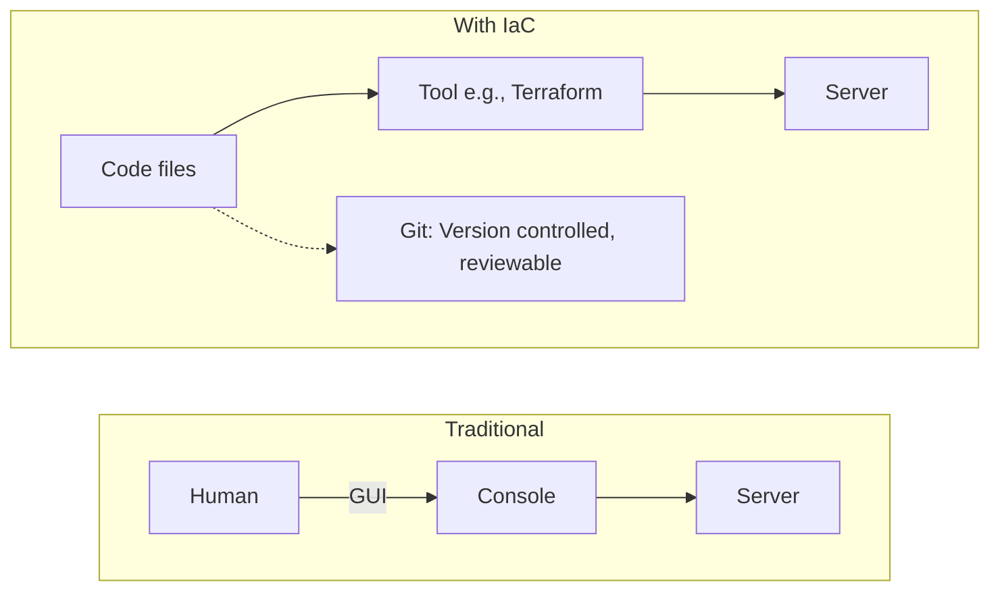
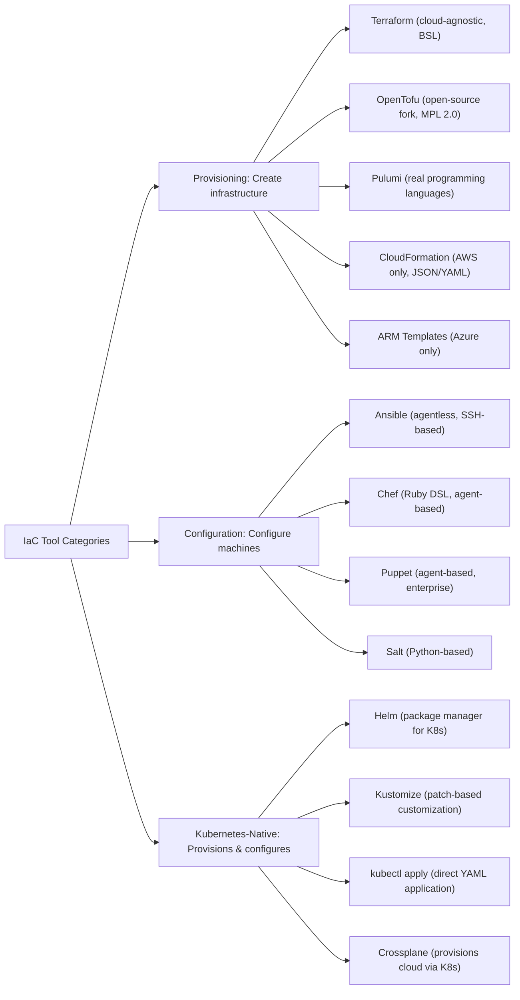
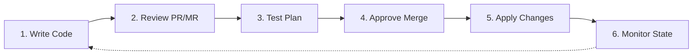

> **Complexity**: `[MEDIUM]` - Foundational concept.
>
> **Time to Complete**: 35-40 minutes.
>
> **Prerequisites**: Basic command line skills, Git basics, and enough YAML familiarity to read indentation.

---

## What You'll Be Able to Do

After this module, you will be able to:

- **Compare** declarative and imperative infrastructure workflows, including the operational consequences of each choice.
- **Design** an Infrastructure as Code repository layout that separates environments while still reusing shared modules.
- **Implement** a Kubernetes declarative change with the standard `k` CLI alias, then verify idempotent reconciliation.
- **Diagnose** configuration drift by tracing whether production state came from code, a manual change, or a pipeline run.
- **Evaluate** Terraform, OpenTofu, Ansible, Pulumi, and Kubernetes-native tools for a realistic provisioning or configuration problem.

## Why This Module Matters

In 2012, Knight Capital Group lost about $460 million in roughly 45 minutes after new trading software reached only part of its production fleet. A technician manually deployed the change to 7 of 8 servers, leaving one machine with old behavior that activated in the worst possible way. The company was not destroyed by a new algorithm alone; it was destroyed by a release process that allowed supposedly identical servers to become different while everyone believed they were the same.

That incident is the harsh version of a problem every operations team eventually meets. A database timeout is changed during an outage, a firewall rule is added from a cloud console, or a package is installed by hand on the one machine that seemed urgent at the time. The change solves the immediate problem, but it also creates a hidden branch of reality that no repository, review, or automated rebuild can explain later.

Infrastructure as Code, usually shortened to IaC, exists to close that gap between intention and reality. Instead of treating servers, networks, clusters, and policies as things people remember how to build, IaC treats them as files that can be reviewed, tested, versioned, and replayed. Kubernetes matters in this course because it is built on the same idea: you submit a desired state, and controllers keep working until the actual state matches it.

> **Stop and think**: If your primary environment vanished today, would your team rebuild it from a repository, or would the recovery plan depend on screenshots, old tickets, and someone's memory of which checkbox they clicked last quarter?

## The Problem IaC Replaced: ClickOps and Memory

Before cloud APIs, virtual machines, and Kubernetes controllers became normal, infrastructure work often meant a person performing a sequence of actions directly on a machine. That person might have been careful, experienced, and well intentioned, but the system still depended on memory. If the setup required a package, a kernel setting, a firewall rule, and a hand-edited config file, then the real infrastructure definition lived partly in the machine and partly in someone's head.

```text
Manual Process:
1. Order physical server (2-4 weeks)
2. Wait for data center to rack it (1 week)
3. SSH in and install packages
4. Configure by editing files
5. Hope you remember what you did
6. Pray nothing breaks

Documentation: "Ask Dave, he set it up"
```

The old process was not foolish for its time, because teams had fewer automation primitives and slower infrastructure cycles. The problem was that every manual step created an opportunity for undocumented variation. Two web servers could start from the same installation guide, but one might get a newer package mirror, a different file permission, or a missing restart command. The machines looked identical on the architecture diagram while behaving differently under load.

ClickOps is the modern version of that same risk. A cloud console is useful for exploration, and a graphical interface can make unfamiliar services less intimidating, but console actions do not automatically become peer-reviewed design decisions. A subnet created by clicking through a wizard may work today, yet the team still has to ask who created it, why it has that CIDR range, whether staging matches it, and how to recreate it after a regional failure.

The practical danger is not that every manual action breaks production immediately. The practical danger is that manual actions break the chain of evidence. When an incident happens, the on-call engineer needs to know what changed, which version introduced it, what the intended state should be, and whether rolling back is safe. A manually edited system can answer those questions only if the human who edited it left perfect records, and production systems should not rely on perfect human memory.

> **Pause and predict**: Imagine two production web servers built from the same checklist. One receives a manual OpenSSL patch during an incident, and the other does not. What kind of failure would you expect during the next certificate renewal or load balancer health check?

## Infrastructure as Code: Desired State in Version Control

Infrastructure as Code means describing infrastructure in files that can be versioned, shared, reviewed, executed, and used as the source of truth for an environment. The exact file format depends on the tool. Terraform and OpenTofu use HCL, Ansible usually uses YAML playbooks, Pulumi uses general-purpose programming languages, and Kubernetes commonly uses YAML manifests. The shared idea is that the desired shape of the system is written down before the system is changed.



The most important shift is that the file becomes more important than the successful one-time action. If a network is created from a reviewed Terraform module, the team can inspect the module, compare revisions, open a pull request for changes, and rebuild the same network in another account. If a Deployment is created from a Kubernetes manifest, the team can see why it has 3 replicas, which image it should run, and whether the running cluster has drifted away from that intent.

This is similar to a recipe, but the analogy only goes so far. A human recipe tells a cook what to do, and the cook must notice if the oven is already hot or the pan already contains oil. A good IaC tool reads the current state, compares it with the desired state, and calculates the smallest safe set of actions needed to close the difference. That comparison is what makes IaC operationally different from a shell script that blindly repeats steps.

The file also creates a social boundary. Infrastructure changes become ordinary code changes, which means they can go through pull requests, review comments, automated checks, and approvals. That process may feel slower than clicking a console button, but it gives the team a shared record of intent. The next engineer does not need to ask whether the current setting is accidental or deliberate, because the answer should be visible in history.

## Declarative, Imperative, and Idempotent Thinking

The first concept to separate is imperative versus declarative work. An imperative instruction tells the system how to perform a sequence of steps. A declarative instruction tells the system what final condition should be true. Both styles can be useful, but infrastructure usually becomes safer when stable resources are described declaratively and the tool is responsible for converging reality toward that description.

```text
Imperative (How):
"Install nginx, then edit /etc/nginx/nginx.conf,
then restart nginx"

Declarative (What):
"I want nginx running with this configuration"
```

Imperative scripts are tempting because they mirror the way a human troubleshoots. If nginx is missing, install it; if the file is old, replace it; if the service is stopped, start it. The weakness is that the script author must predict every possible starting state, including partial failures. After enough conditions are added, the script becomes a fragile local controller that only one team member fully trusts.

Declarative systems put that state comparison at the center of the tool. A Terraform plan compares configuration with stored state and provider APIs, then proposes creates, updates, and deletes. Ansible modules are usually written to be idempotent, so asking for a package with `state: present` should not reinstall it on every run. Kubernetes controllers continuously compare desired objects with actual cluster state and keep reconciling after the first apply.

```bash
# Running this 10 times creates 10 servers (BAD)
create_server web-1

# Running this 10 times ensures 1 server exists (GOOD)
ensure_server_exists web-1
```

Idempotency is the property that makes repeated runs safe. If an operation is idempotent, running it again has the same final effect as running it once. That does not mean nothing happens internally, and it does not mean every change is harmless. It means the tool is designed around the final desired state rather than around blindly replaying an action history.

> **Pause and predict**: If an imperative bash script creates a Linux user and the pipeline crashes just after the user is created, what happens when the pipeline retries from the beginning? What would an idempotent configuration tool try to prove before making another change?

Version control completes the model because it records the evolution of intent. A plan file or Kubernetes manifest sitting on one laptop is better than memory, but it is still not a team system. Once infrastructure definitions live in Git, ordinary engineering tools become available: pull requests for review, commit history for audit, tags for releases, and diffs for incident investigation.

```bash
git log --oneline infrastructure/
abc123 Add production database replica
def456 Increase web server count to 5
ghi789 Initial infrastructure setup

# "Who changed production?" - Just check git blame
```

The operational promise is simple: if production changed, the team should be able to point to the commit, review, pipeline run, or emergency exception that changed it. When that promise is true, infrastructure becomes easier to reason about during stress. When that promise is false, the team is back to detective work across terminals, chat messages, and console history.

State is the part of this promise that beginners often underestimate. A tool cannot compare desired and actual infrastructure unless it has a way to identify the resources it owns and the attributes it last observed. Terraform and OpenTofu commonly store that knowledge in state, Kubernetes stores desired objects in the API server, and configuration tools often infer state from the target machine during each run. The implementation differs, but the operational question is the same: how does the tool know whether it should create, update, leave alone, or delete something?

This is also why IaC should not be treated as a collection of clever text files. The files, state, provider APIs, credentials, and pipeline permissions form one system. If the files are reviewed but the state is writable from a laptop, the workflow still has a weak point. If the state is locked but the cloud console remains open for routine production edits, the tool will keep discovering surprises. Mature IaC design includes both the code and the control plane around the code.

## The IaC Tool Landscape

IaC is not one tool, and choosing badly can create a new kind of complexity. Some tools are strongest at provisioning infrastructure that exists outside a machine, such as VPCs, subnets, databases, buckets, and load balancers. Some tools are strongest at configuring operating systems after machines exist. Kubernetes-native tools manage cluster objects, package Kubernetes applications, or use Kubernetes itself as the control plane for external infrastructure.

For Kubernetes commands later in this module, define alias k=kubectl in your shell; after that, examples use `k` because it is the standard short form many operators use during daily work. The alias does not change the API call or the safety model. It simply makes repeated commands easier to read while keeping the lesson focused on declarative files, reviewable changes, and reconciliation.



Terraform became the default mental model for cloud provisioning because it offered a readable declarative language, a provider ecosystem, and a plan/apply workflow across many platforms. In 2023, HashiCorp moved Terraform to the Business Source License, and the community created OpenTofu as an MPL 2.0 fork intended to preserve an open-source path for compatible workflows. In practice, many teams evaluate both Terraform and OpenTofu through the same architectural lens: provider support, state handling, module quality, and governance requirements.

```hcl
# main.tf - Terraform configuration

# Define provider (where to create resources)
provider "aws" {
  region = "us-west-2"
}

# Define a resource
resource "aws_instance" "web" {
  ami           = "ami-0c55b159cbfafe1f0"
  instance_type = "t2.micro"

  tags = {
    Name = "web-server"
    Environment = "production"
  }
}

# Define output
output "public_ip" {
  value = aws_instance.web.public_ip
}
```

The Terraform-style workflow matters because it separates preview from mutation. `init` downloads providers and prepares the working directory, `plan` shows the proposed difference, `apply` changes the environment, and `destroy` removes managed resources. That workflow gives reviewers something concrete to discuss before a pipeline changes production, but it also creates a new responsibility: the state file must be protected, locked, backed up, and treated as sensitive operational data.

State management deserves that caution because state can contain resource identifiers, attributes, dependency relationships, and sometimes sensitive values returned by providers. A local state file on one engineer's laptop might be acceptable for a throwaway experiment, but it is not acceptable for shared production infrastructure. Teams normally move state to a remote backend with locking so two applies cannot race each other. They also restrict access because the state often reveals more about the environment than the source files do.

```bash
# Terraform workflow
terraform init      # Download providers
terraform plan      # Preview changes
terraform apply     # Create infrastructure
terraform destroy   # Tear it all down
```

| Feature | Terraform / OpenTofu | CloudFormation |
|---------|----------------------|----------------|
| Cloud support | Any cloud | AWS only |
| State management | Built-in (e.g., HCP Terraform, S3) | Managed by AWS |
| Syntax | HCL 2 (readable) | JSON/YAML (verbose) |
| Learning curve | Moderate | AWS-specific |
| Community | Huge ecosystem | AWS-limited |

Ansible solves a different problem. If Terraform creates a virtual machine, security group, and load balancer, Ansible can configure packages, templates, users, services, and application files on the machine. It is agentless by default, which means it can operate over SSH without installing a long-running daemon on each host. That makes it approachable, but it also means inventory accuracy, SSH access, privilege escalation, and playbook idempotency all become part of the reliability story.

The boundary between provisioning and configuration is not always clean, and that is where design judgment matters. Terraform can run provisioners, and Ansible can create cloud resources through modules, but using a tool outside its strength can make reviews harder. A good default is to let provisioning tools own long-lived external resources and let configuration tools own what happens inside machines. When there is overlap, choose the tool whose plan, state model, and failure behavior the team can explain during an incident.

```yaml
# playbook.yml - Ansible playbook
---
- name: Configure web server
  hosts: webservers
  become: yes  # Run as root

  tasks:
    - name: Install nginx
      apt:
        name: nginx
        state: present
        update_cache: yes

    - name: Copy configuration
      template:
        src: nginx.conf.j2
        dest: /etc/nginx/nginx.conf
      notify: Restart nginx

    - name: Ensure nginx is running
      service:
        name: nginx
        state: started
        enabled: yes

  handlers:
    - name: Restart nginx
      service:
        name: nginx
        state: restarted
```

```bash
# Run the playbook
ansible-playbook -i inventory.ini playbook.yml
```

Pulumi takes another path by letting teams define infrastructure in languages such as TypeScript, Python, Go, Java, and .NET. That can be powerful when infrastructure definitions need loops, reusable libraries, tests, and familiar language tooling. The tradeoff is that ordinary programming abstractions can hide resource graphs if teams are not disciplined, and reviewers may need to understand both the cloud model and the application language style.

No tool removes the need for design judgment. A single cloud provider shop may accept CloudFormation or Azure Resource Manager templates because the native integration is worth the platform lock-in. A platform team building self-service infrastructure may choose Crossplane because it wants Kubernetes custom resources to represent cloud services. A small team may start with plain Kubernetes YAML and Kustomize before introducing Helm or a GitOps controller. The right answer depends on the resource lifecycle, the team's skill, and the failure mode the team most needs to control.

Tool choice also affects who can safely contribute. A central platform team may be comfortable with a complex module system because a small group reviews every infrastructure change. A product team that owns its own service may need simpler manifests and guardrails because many developers will touch the files. The best IaC setup is not the most feature-rich one; it is the one that lets the right people make the right changes with enough review context to avoid accidental damage.

Licensing and ecosystem stability are part of evaluation, not trivia. Terraform's license change pushed some organizations to review whether their governance model required OpenTofu, while others stayed with Terraform because their vendor support, modules, or managed workflow already fit. That decision should be explicit. Infrastructure code tends to live for years, so the team should understand upgrade paths, provider compatibility, and what happens if a vendor changes terms or deprecates a service.

One practical way to compare tools is to ask what a new teammate must learn before making a safe one-line change. If they need to understand provider state, cloud quotas, IAM permissions, and replacement behavior, the change belongs behind a deliberate review workflow. If they need to understand an application value in a ConfigMap, the workflow can be lighter but still should be reviewable. IaC does not mean every change has identical ceremony; it means the ceremony matches the risk.

> **Which approach would you choose here and why?** Your team needs to create cloud networks, managed databases, and Kubernetes namespaces for every new customer environment. Would you keep all of that in one Terraform/OpenTofu project, split cluster objects into Kubernetes-native manifests, or expose a Crossplane-backed API to application teams?

## Kubernetes as Infrastructure as Code

Kubernetes is not just a place where IaC tools deploy applications; Kubernetes itself is an IaC system. You send objects to the API server, and controllers reconcile desired state with actual state. A Deployment does not merely start pods once. It declares a rollout strategy, a replica count, a selector, and a pod template, then the Deployment controller and ReplicaSet controller keep working to maintain that state.

For the rest of this module, use the standard shortcut `alias k=kubectl` so commands stay readable while still targeting the Kubernetes CLI. The course target is Kubernetes 1.35+, but the basic declarative workflow shown here is stable across modern clusters. The important habit is to keep manifests in files and use `k apply` for desired state, rather than relying on one-off imperative commands that vanish from review history.

```bash
alias k=kubectl
k version --client
```

```yaml
# deployment.yaml - Desired state
apiVersion: apps/v1
kind: Deployment
metadata:
  name: web
spec:
  replicas: 3
  selector:
    matchLabels:
      app: web
  template:
    metadata:
      labels:
        app: web
    spec:
      containers:
      - name: nginx
        image: nginx:1.27
```

```bash
# Apply desired state
k apply -f deployment.yaml

# Kubernetes reconciles actual state to match desired state
# This is IaC in action.
```

Notice what the manifest does not say. It does not tell Kubernetes which node should run each pod, which exact ReplicaSet name to create, or which internal sequence of API updates should happen first. It states that the desired world contains a Deployment named `web` with 3 replicas of `nginx:1.27`, and Kubernetes calculates the work needed to make the cluster match.

That distinction becomes useful during failure. If a node dies, the desired state still says 3 replicas should exist, so Kubernetes schedules replacement pods. If someone deletes a pod by hand, the controller creates another one because the Deployment still demands it. If you apply the same manifest again, Kubernetes sees that the desired and actual states already match, so the command becomes a safe confirmation rather than a duplicate deployment.

Kubernetes can still be used in a non-IaC way. Commands such as `k run`, `k edit`, and direct console changes can be appropriate for learning or emergency diagnosis, but they are dangerous as the normal path to production. The object may exist in the cluster, yet the repository does not explain it. The mature workflow is to convert discoveries into manifests, review those manifests, and let automation apply them consistently.

There is another Kubernetes-specific reason to prefer files: many objects interact through labels and selectors. A Service finds pods through labels, a Deployment manages pods through selectors, and NetworkPolicies often depend on labels as well. When those relationships are stored in separate hand-entered commands, it is easy to create a resource that looks valid but does not connect to anything. Keeping the objects together in code lets reviewers see the relationships before the cluster has to reveal the mistake.

Kubernetes also teaches the difference between the declared object and the generated runtime details. A Deployment creates ReplicaSets, ReplicaSets create Pods, and Pods receive names, IPs, node assignments, and status fields that you usually should not hardcode. Beginners sometimes copy a live object from the cluster and commit every field, including status and generated metadata. A cleaner IaC manifest includes the fields the team owns and leaves runtime fields to the control plane, which reduces noisy diffs and accidental conflicts.

## Repository Layout, Environments, and Drift Control

A useful IaC repository is more than a dumping ground for YAML and HCL. It needs to help readers answer three questions quickly: what resources exist, which environment they belong to, and which shared components they reuse. If the layout makes those questions hard, engineers will copy files, patch production directly, or invent local conventions because the official structure feels slower than the console.

```bash
infrastructure/
├── terraform/
│   ├── main.tf
│   ├── variables.tf
│   └── outputs.tf
├── kubernetes/
│   ├── deployments/
│   └── services/
└── ansible/
    └── playbooks/
```

The first baseline is simple: everything that defines infrastructure should be in Git unless there is a deliberate exception with a clear owner. That includes cloud resources, Kubernetes manifests, machine configuration, policy definitions, and the scripts that glue deployment steps together. Secrets should not be committed as plaintext, but the reference to the secret manager, secret name, or sealed secret mechanism should still be represented in code.

Reusable modules solve the next problem, which is duplication disguised as clarity. If every environment has a full copy of every resource definition, staging and production will eventually diverge in accidental ways. A better pattern is to keep shared behavior in modules or bases, then let each environment supply the values that genuinely differ, such as size, replica count, region, or feature flags.

```hcl
# Don't repeat yourself
module "web_server" {
  source = "./modules/ec2-instance"

  name          = "web-1"
  instance_type = "t2.micro"
}

module "api_server" {
  source = "./modules/ec2-instance"

  name          = "api-1"
  instance_type = "t2.small"
}
```

```bash
environments/
├── dev/
│   └── main.tf      # Small instances, single replica
├── staging/
│   └── main.tf      # Medium instances, testing
└── prod/
    └── main.tf      # Large instances, high availability
```

Environment separation should protect production without making lower environments meaningless. Development can be smaller and cheaper, but it should still exercise the same module paths and the same policy assumptions. Staging should be close enough to production that a plan or rollout can reveal mistakes before customers feel them. Production should be different only where the business explicitly needs more scale, durability, isolation, or approval.

This is where repository layout becomes an organizational design tool. If the storage team owns database modules and the application team owns Kubernetes manifests, the folder structure should make that ownership visible. If every service team can modify shared network policy, the review process should compensate with CODEOWNERS, policy checks, or a platform API that narrows what can be changed. IaC files are easier to review when the repository mirrors real responsibility instead of hiding ownership behind one shared directory.

Naming also matters more than it first appears. Resource names, module names, workspace names, and environment names become the vocabulary engineers use during incidents. A name like `prod-eu-payments-db` carries more operational context than `database-1`, and a module called `regional_private_cluster` tells reviewers more than `main`. Clear names do not replace documentation, but they reduce the amount of interpretation required when someone is reading a plan under pressure.

> **Pause and predict**: If dev, staging, and prod each contain copied infrastructure files instead of shared modules, which differences will be intentional after six months, and which differences will exist only because someone fixed one environment and forgot the others?

Drift control is the discipline of keeping the real environment aligned with the repository. Drift can come from emergency shell access, console edits, failed pipelines, imported legacy resources, provider defaults, or controllers that mutate objects after creation. The correct response is not to pretend drift never happens. The correct response is to detect it, decide whether the real-world change should become code, and then bring the system back under reviewable control.

```text
Golden Rule: If it's not in code, it doesn't exist.

Manual changes = configuration drift = bugs at 3 AM
```

There are exceptions during incidents. If a manual change is the fastest way to stop customer damage, a strong team may allow it under an emergency procedure. The important part is what happens next: the fix must be backported into the IaC repository, reviewed, and applied through the normal path. Otherwise the next pipeline run may erase the emergency fix because the code still describes the old broken state.

Importing existing infrastructure is the related migration problem. Most organizations do not begin with a clean repository and empty cloud account; they already have resources created by scripts, consoles, and years of local habits. Bringing those resources under IaC usually requires importing them into state, writing configuration that matches reality, and then making small reviewed changes to prove the tool can manage them safely. The first goal is not elegance. The first goal is to avoid destroying something valuable while you establish a trustworthy source of truth.

## The Review and Apply Workflow

An IaC workflow should make dangerous changes visible before they happen. The exact pipeline differs between teams, but the shape is usually the same: write code, review it, test or preview it, approve it, apply it, and monitor the result. This sequence turns infrastructure changes into an engineering process instead of a private session in a cloud console.



The review step is not bureaucracy when the plan is meaningful. A reviewer can spot that a database would be replaced instead of modified, that a security group opens more ports than intended, or that a Kubernetes selector change will orphan old pods. The plan output is a contract between the code and the environment, so approving without reading it is almost the same as clicking blindly in a console.

A useful review explains intent as well as mechanics. The pull request should say why the change is needed, what risk it introduces, how rollback would work, and which environment receives it first. A tiny network rule can be more dangerous than a large refactor if it exposes a private service. A small Kubernetes selector change can cause more outage risk than a replica-count increase. Review quality comes from understanding blast radius, not from counting lines.

Testing IaC is different from testing application code, but it is still possible. Teams can lint syntax, validate schemas, run policy checks, generate plans, test modules with temporary environments, and use admission control for Kubernetes objects. The goal is not to prove the universe is safe. The goal is to catch the mistakes that automation can catch before a human reviewer has to reason about them under time pressure.

Monitoring closes the loop after apply. A successful command only proves that the tool accepted the change, not that the service behaved well afterward. For cloud resources, that might mean checking health checks, route tables, metrics, and access logs. For Kubernetes, that means checking rollouts, events, readiness, and application signals. IaC gives you a controlled way to change the system, but operations still require observing the consequences.

Rollback should be designed before the first production apply. Sometimes rollback is a Git revert followed by another apply, but that is not always enough. A database migration, certificate rotation, or subnet replacement may require a forward fix, a manual checkpoint, or a staged transition. IaC makes the desired configuration visible, yet it cannot magically make every infrastructure change reversible. Senior engineers treat reversibility as a design constraint, not as a comforting assumption.

Pipeline permissions should follow the same principle of least privilege that application credentials follow. A plan job may need read access to providers and state, while an apply job needs write access and should run only after approval. Production credentials should not be available to arbitrary pull request code from untrusted branches. If the IaC pipeline can mutate production, then the pipeline itself is production infrastructure and deserves the same review, logging, and access control as the systems it changes.

## Patterns & Anti-Patterns

Good IaC patterns share a theme: they make the intended state easier to inspect than the accidental state. That means modules should hide repetition without hiding risk, pipelines should preview changes before applying them, and emergency procedures should route discoveries back into code. These patterns are not about making every workflow slower; they are about making important infrastructure changes explainable when the team is tired.

| Pattern | When to Use It | Why It Works | Scaling Consideration |
|---------|----------------|--------------|-----------------------|
| Plan before apply | Any shared or production infrastructure change | Reviewers see the resource delta before mutation | Store plan artifacts for audit when approval matters |
| Shared modules with environment values | Multiple environments that should stay similar | Common behavior changes once while environments keep explicit differences | Version modules so production can adopt changes deliberately |
| Git-owned Kubernetes manifests | Workloads, Services, ConfigMaps, policies, and namespaces | Cluster state can be rebuilt and reviewed from files | Add schema validation and admission policy as teams grow |
| Drift detection runs | Environments where manual access or provider defaults can change state | The team learns when reality diverges from code | Decide who triages drift and how urgent each class is |

Anti-patterns usually start as shortcuts that look reasonable in isolation. A console edit saves a few minutes, a copied module avoids learning variables, and a shell script feels faster than writing declarative configuration. The cost appears later when the team cannot tell which state is real, which differences are intentional, and which changes will be erased by the next pipeline.

| Anti-Pattern | What Goes Wrong | Better Alternative |
|--------------|-----------------|-------------------|
| ClickOps as the normal production path | Changes bypass review, history, and repeatability | Use console exploration only for discovery, then commit the result as code |
| One giant root module | Every change risks unrelated resources and slow reviews | Split by lifecycle, ownership, and blast radius |
| Secrets in IaC files | Repositories and state files become security incidents | Reference a secret manager or sealed secret mechanism instead |
| Ignoring generated plans | Destructive replacements are approved without understanding | Require reviewers to inspect create, update, replace, and delete actions |
| Copy-pasted environments | Dev, staging, and prod drift through forgotten edits | Share modules or bases and pass explicit environment values |

## Decision Framework

When choosing an IaC approach, start with the lifecycle of the resource rather than the popularity of a tool. A managed database, a Kubernetes Deployment, and an operating system package all behave differently. The best tool is the one that can model the resource clearly, detect changes safely, and fit the team's review and recovery process.

```text
+-----------------------------+
| What are you managing?      |
+-------------+---------------+
              |
              v
+-------------+---------------+
| Cloud resources outside K8s?|
+------+------+---------------+
       | Yes                  | No
       v                      v
+------+-------------+  +-----+----------------+
| Terraform/OpenTofu |  | Kubernetes objects?  |
| or native templates|  +-----+----------------+
+------+-------------+        | Yes
       |                      v
       |              +-------+----------------+
       |              | YAML, Kustomize, Helm, |
       |              | GitOps, or Crossplane  |
       |              +-------+----------------+
       v                      |
+------+-------------+        v
| Need OS packages   |  +-----+----------------+
| and machine config?|  | Need app-language    |
+------+-------------+  | abstractions?        |
       | Yes            +-----+----------------+
       v                      | Yes
+------+-------------+        v
| Ansible or another |  +-----+----------------+
| config tool        |  | Pulumi may fit       |
+--------------------+  +----------------------+
```

| Situation | Strong Default | Why | Watch Out For |
|-----------|----------------|-----|---------------|
| Multi-cloud provisioning | Terraform or OpenTofu | Provider ecosystem and plan/apply workflow | State locking, module governance, provider upgrades |
| AWS-only infrastructure | CloudFormation or Terraform/OpenTofu | Native AWS integration or broader ecosystem | Portability versus native service coverage |
| VM package and service setup | Ansible | Agentless SSH configuration and readable playbooks | Inventory drift and non-idempotent shell tasks |
| Kubernetes workloads | YAML with Kustomize, Helm, or GitOps | Kubernetes already reconciles desired state | Template complexity and unreviewed `k edit` changes |
| Platform self-service | Crossplane or higher-level modules | Teams request abstractions instead of raw resources | API design, ownership, and policy boundaries |
| Infrastructure tied to app code abstractions | Pulumi | Real languages and testable libraries | Hidden resource graphs and language-specific complexity |

This framework is deliberately conservative. If a simple manifest and a clear review workflow solve the problem, do not introduce a templating engine just to feel advanced. If a provider-managed service has a tricky lifecycle, do not hide it behind a generic module until the team understands its replacement behavior. IaC should make infrastructure easier to reason about, not merely more abstract.

When the decision is unclear, run a small experiment that includes the full lifecycle rather than only the happy path. Create a resource, update it, detect drift, roll it back, destroy it, and let a teammate review the change without live narration. That exercise reveals whether the tool makes state understandable. It also reveals whether the team can operate the workflow when the original author is unavailable.

Cost should be evaluated across the full life of the system, not only the first deployment. ClickOps often wins the first hour because a console wizard can produce a working demo quickly. IaC wins the tenth rebuild, the second region, the security audit, and the incident review because the steps are recorded and repeatable. The right question is not whether code is always faster than clicking. The right question is when the environment becomes important enough that repeatability, review, and disaster recovery are worth the upfront structure.

Team maturity changes the answer over time. A prototype can tolerate a few manual resources if the team writes down what must be automated before launch. A production platform with customer data cannot rely on future cleanup as a control. Many healthy teams use a ratchet: experiments may begin manually, but anything that survives into shared environments must be captured in IaC before it becomes a dependency. That rule keeps exploration possible without letting temporary shortcuts harden into invisible architecture.

The strongest decision frameworks also include exit criteria. If a module becomes too complex to review, split it. If a templating system hides the generated Kubernetes objects, render the output in CI. If a tool cannot show a useful plan for high-risk resources, add a manual review checklist or choose a different approach. IaC should continuously improve the team's ability to predict changes; when it stops doing that, the design needs another pass.

The final test is whether another engineer can recover your intent without asking you to narrate the system. If they can read the repository, inspect the plan, understand the environment differences, and predict the apply result, the IaC design is doing its job. If they need private context to avoid breaking production, the code is not yet carrying enough operational meaning.

## Did You Know?

- **Knight Capital's 2012 incident** produced an estimated $460 million loss in about 45 minutes, showing how a partial deployment can become a company-level event when fleet consistency is assumed but not enforced.
- **Terraform's license changed in 2023**, and OpenTofu was created as an MPL 2.0 fork so teams could keep a community-governed open-source workflow compatible with Terraform-style configuration.
- **Ansible's name** comes from science fiction, where an ansible is a device for instantaneous communication across distance, which fits a tool designed to coordinate many machines from one control point.
- **Kubernetes is a reconciliation system**, so applying the same manifest repeatedly is not a duplicate action; it is a request for the control plane to make actual state match declared state.

## Common Mistakes

| Mistake | Why It Happens | How to Fix It |
|---------|----------------|---------------|
| Manual changes after an IaC deploy | An incident creates pressure to fix production quickly, and the manual patch never returns to the repository | Backport every emergency change into code, review it, and reapply through the normal pipeline |
| Not using version control for infrastructure | Early experiments start on a laptop and become production before anyone formalizes ownership | Put infrastructure definitions in Git before the environment matters, then require pull requests for shared resources |
| Hardcoding secrets in HCL, YAML, or stateful outputs | Examples often show simple strings, and teams copy that style into real environments | Store secret values in a secret manager and commit only references, policies, or sealed representations |
| Building monolithic configurations | It feels easier to keep everything in one root until reviews become slow and risky | Split code by lifecycle, ownership, and blast radius, then use modules for repeated resource shapes |
| Running without remote state backup and locking | Local state seems harmless while one person owns the project | Use a remote backend with locking, encryption, backups, and access controls before multiple people can apply |
| Ignoring plan output in CI | The pipeline becomes a checkbox, so reviewers approve the job rather than the resource diff | Make destructive actions visible and require humans to inspect replacements, deletes, and security-sensitive updates |
| Copying environment files instead of sharing modules | Copy-paste produces quick progress, but later fixes reach only the environment that hurt most recently | Keep common behavior in modules or bases, then pass explicit values for environment differences |

## Quiz

<details><summary>1. Your team applies a Terraform change and the plan says a managed database will be replaced, not updated. How do you evaluate the change before approving it?</summary>

Do not approve the change just because the syntax is valid. A replacement means the provider believes the current resource cannot be modified in place, so you need to inspect which argument forced replacement, whether data will be lost, and whether the module should be redesigned. This scenario tests your ability to evaluate Terraform or OpenTofu plan output instead of treating IaC as a blind automation button. A safe response may include changing the design, adding migration steps, scheduling downtime, or rejecting the pull request until the blast radius is explicit.

</details>

<details><summary>2. A developer says Kubernetes cannot satisfy the audit rule because they use `k run` and `k edit` during normal releases. How do you correct the workflow?</summary>

The problem is not Kubernetes; the problem is using imperative commands as the release mechanism. Kubernetes supports declarative Infrastructure as Code when Deployments, Services, ConfigMaps, and policies are stored as manifests and applied through a reviewed pipeline. The corrected workflow is to implement Kubernetes changes in files, review them in Git, apply them with `k apply`, and verify the rollout. That gives the organization a durable audit trail and makes the cluster rebuildable from code.

</details>

<details><summary>3. Production has a timeout value that differs from the repository, and nobody can find a commit that changed it. How do you diagnose configuration drift?</summary>

Start by treating the mismatch as drift until proven otherwise. Compare the live setting with the desired state in Git, review recent pipeline runs, and check whether an emergency manual change or console edit occurred during an incident. If the live value is correct, commit it back into the IaC source and apply through the normal workflow so the repository becomes true again. If the live value is wrong, let the IaC pipeline restore the declared state and add controls that make similar drift easier to detect.

</details>

<details><summary>4. Your organization needs VPCs, managed databases, load balancers, VM package configuration, and Kubernetes workloads. How do you compare the tool choices?</summary>

Use the resource lifecycle to split the decision. Terraform or OpenTofu is a strong fit for cloud provisioning such as networks, databases, and load balancers because the plan/apply model handles external APIs well. Ansible is a better fit for OS package and service configuration on VMs because it is designed for machine configuration over SSH. Kubernetes workloads should usually be represented as manifests, Kustomize overlays, Helm charts, or GitOps-managed objects because the cluster already reconciles those resources.

</details>

<details><summary>5. A pipeline crashes halfway through a run, and the retry finishes without creating duplicate resources. Which design property made that possible?</summary>

The key property is idempotency, usually combined with a declarative desired state model. The tool checks what already exists, compares it with the desired configuration, and performs only the remaining work needed to converge the environment. This is safer than an imperative script that blindly repeats creation steps after a partial failure. Idempotency is why retries can be a normal recovery action rather than a new incident risk.

</details>

<details><summary>6. Dev, staging, and prod began as copied folders. Six months later, staging has a firewall rule that production lacks, and nobody knows whether the difference is intentional. How do you design the repository differently?</summary>

Move shared behavior into modules or bases, then pass explicit environment values for the differences that should exist. This design makes common behavior change in one place while still allowing production to have larger sizes, more replicas, or stricter policies. The important part is that differences become named inputs rather than accidental edits in copied files. That structure also makes code review more focused because reviewers can see whether a change affects all environments or only one.

</details>

<details><summary>7. During an incident, an engineer manually changes a production setting and fixes the outage. What should happen after the incident is stable?</summary>

The manual change should be treated as an emergency exception, not as the new normal process. After the incident is stable, the team should translate the fix into the IaC repository, review it, apply it through the standard path, and verify that the live environment still has the intended value. If that backport does not happen, the next pipeline run may erase the manual fix because the repository still describes the old state. This is how teams preserve both incident speed and long-term auditability.

</details>

## Hands-On Exercise

In this exercise, you will implement a small Kubernetes IaC workflow with declarative files, repeated applies, a controlled change, and a drift check. You need access to any Kubernetes 1.35+ compatible practice cluster, such as a local cluster or a shared training namespace where you are allowed to create Deployments and ConfigMaps. Use the `k` alias introduced earlier so your commands match the rest of the module.

### Setup

```bash
alias k=kubectl
k get namespace default
mkdir -p iac-demo
cd iac-demo
```

### Task 1. Create a deployment declaratively

Write the desired state into `deployment.yaml` and apply it. This is intentionally close to the worked example so you can focus on the workflow before adding your own changes.

```bash
cat << 'EOF' > deployment.yaml
apiVersion: apps/v1
kind: Deployment
metadata:
  name: iac-demo
spec:
  replicas: 2
  selector:
    matchLabels:
      app: iac-demo
  template:
    metadata:
      labels:
        app: iac-demo
    spec:
      containers:
      - name: nginx
        image: nginx:1.27
EOF

k apply -f deployment.yaml
k rollout status deployment/iac-demo
```

<details><summary>Solution notes for Task 1</summary>

The important result is not only that the Deployment exists. You should also be able to point to the file that defines the Deployment, explain why the replica count is 2, and rerun the apply command without creating a second Deployment. If rollout status does not complete, use `k describe deployment iac-demo` and `k get pods -l app=iac-demo` to inspect scheduling, image pull, or readiness problems.

</details>

### Task 2. Test idempotency and modification

Apply the same file again, then change the replica count from 2 to 4 in the file and apply the updated desired state. You are proving that the file, not your terminal history, controls the target shape.

```bash
k apply -f deployment.yaml
sed 's/replicas: 2/replicas: 4/' deployment.yaml > temp.yaml && mv temp.yaml deployment.yaml
k apply -f deployment.yaml
k get deployment iac-demo
```

<details><summary>Solution notes for Task 2</summary>

The first apply should report that the Deployment is unchanged or otherwise show no meaningful mutation, because the declared and actual states already match. After editing the file, Kubernetes should scale the Deployment toward 4 replicas because the desired state changed. If the output still shows 2 desired replicas, inspect the file first; in IaC workflows, the source file is the first suspect when reality does not match your expectation.

</details>

### Task 3. Create a ConfigMap from scratch

Create a new file called `config.yaml` that defines a ConfigMap named `app-settings` with the key `theme` set to `"dark"`. Apply it declaratively, then verify that Kubernetes stores the value you declared.

<details><summary>Solution for Task 3</summary>

```bash
cat << 'EOF' > config.yaml
apiVersion: v1
kind: ConfigMap
metadata:
  name: app-settings
data:
  theme: "dark"
EOF

k apply -f config.yaml
k get configmap app-settings -o yaml
```

This solution keeps the configuration in a file rather than creating it with a one-off imperative command. The `k get` command is for verification, not for making the change. If you changed the value to `"light"` in the file and applied again, Kubernetes would update the object to match the new desired state.

</details>

### Task 4. Simulate drift and repair it from code

Patch the live ConfigMap to a different value, then use the file to restore the declared value. This reproduces a small version of a production console edit that must be brought back under IaC control.

```bash
k patch configmap app-settings --type merge -p '{"data":{"theme":"light"}}'
k get configmap app-settings -o jsonpath='{.data.theme}'; echo
k apply -f config.yaml
k get configmap app-settings -o jsonpath='{.data.theme}'; echo
```

<details><summary>Solution notes for Task 4</summary>

The patch changes the live object without changing `config.yaml`, so the cluster temporarily drifts from the repository. Applying the file restores `"dark"` because the file still declares that value. In a real incident, the team would decide whether the live value was a valid emergency fix. If it was valid, the correct long-term repair would be to update `config.yaml`, review the change, and apply it through the normal workflow.

</details>

### Task 5. Clean up from the same files

Remove the resources using the manifests you created, then remove the local exercise directory. Cleanup is still part of the IaC habit because the same files that created the resources can identify what should be removed.

```bash
k delete -f deployment.yaml
k delete -f config.yaml
cd ..
rm -rf iac-demo
```

<details><summary>Solution notes for Task 5</summary>

Deleting from the files makes the cleanup explicit and reduces the chance of removing the wrong resource by name. If a delete command says a resource is not found, inspect whether you already deleted it or whether you are pointed at the wrong namespace. The same discipline matters in production: know which state file, manifest, workspace, account, and namespace your command targets before applying or deleting anything.

</details>

### Success criteria

- [ ] You implemented Kubernetes declarative changes with `k apply -f deployment.yaml` and `k apply -f config.yaml`.
- [ ] You verified idempotent reconciliation by applying an unchanged manifest and observing that no duplicate resource was created.
- [ ] You changed the Deployment replica count in code first, then verified the cluster followed the declared state.
- [ ] You diagnosed configuration drift by patching a live ConfigMap and repairing it from the manifest.
- [ ] You cleaned up the Deployment and ConfigMap using the same files that created them.

## Sources

- [U.S. SEC press release on Knight Capital enforcement action](https://www.sec.gov/news/press-release/2013-222)
- [Terraform language documentation](https://developer.hashicorp.com/terraform/language)
- [Terraform CLI workflow documentation](https://developer.hashicorp.com/terraform/cli)
- [OpenTofu project documentation](https://opentofu.org/docs/)
- [Ansible documentation](https://docs.ansible.com/)
- [Pulumi concepts documentation](https://www.pulumi.com/docs/iac/concepts/)
- [AWS CloudFormation user guide](https://docs.aws.amazon.com/AWSCloudFormation/latest/UserGuide/Welcome.html)
- [Azure Resource Manager templates overview](https://learn.microsoft.com/en-us/azure/azure-resource-manager/templates/overview)
- [Kubernetes declarative object management](https://kubernetes.io/docs/tasks/manage-kubernetes-objects/declarative-config/)
- [Kubernetes Deployments documentation](https://kubernetes.io/docs/concepts/workloads/controllers/deployment/)
- [Kustomize documentation in Kubernetes](https://kubernetes.io/docs/tasks/manage-kubernetes-objects/kustomization/)
- [Crossplane documentation](https://docs.crossplane.io/)

## Next Module

[Module 1.2: GitOps](../module-1.2-gitops/) - Next, you will connect these IaC habits to Git-driven reconciliation, where commits become the durable source of truth for infrastructure changes, reviews, and automated cluster updates.
