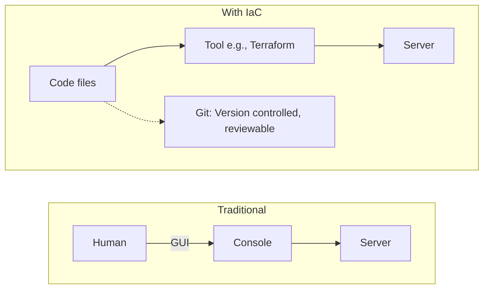
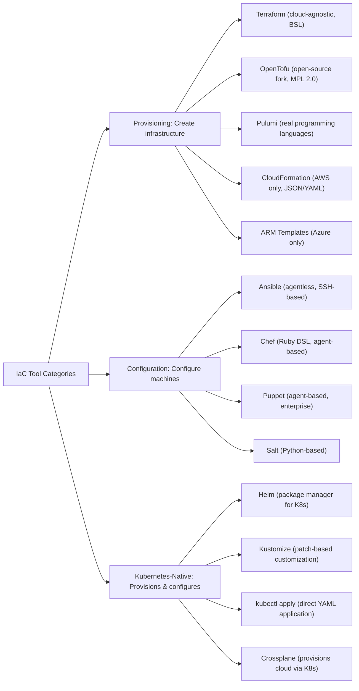
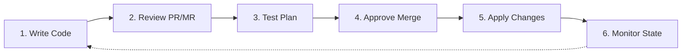

> **Complexity**: `[MEDIUM]` - Foundational concept
>
> **Time to Complete**: 30-35 minutes
>
> **Prerequisites**: Basic command line skills

---

## What You'll Be Able to Do

After this module, you will be able to:
- **Explain** what Infrastructure as Code means and why it replaced manual server configuration
- **Compare** IaC tools (Terraform, Ansible, Pulumi) and explain when to use each
- **Write** a simple declarative configuration and explain how it differs from a script
- **Identify** IaC anti-patterns (clickops, imperative scripts for declarative problems, configuration drift)

---

## Why This Module Matters

In 2012, Knight Capital Group lost $460 million in just 45 minutes. Why? A technician manually deployed new software to 7 of their 8 servers, forgetting the 8th. The mismatch caused the system to aggressively buy high and sell low. A single manual configuration error destroyed a multi-billion dollar company.

Before Infrastructure as Code (IaC), setting up servers was manual, error-prone, and impossible to reproduce. "It works on my machine" was everyone's excuse. IaC changed everything—infrastructure became versionable, testable, and repeatable. Understanding IaC is essential because Kubernetes itself is an IaC system.

> **Stop and think**: How does your current organization track infrastructure changes? If your primary data center vanished today, could you rebuild it from a repository, or would you rely on someone's memory?

---

## The Old Way: ClickOps

Picture this: It's 2005. You need to set up a web server.

```text
Manual Process:
1. Order physical server (2-4 weeks)
2. Wait for data center to rack it (1 week)
3. SSH in and install packages
4. Configure by editing files
5. Hope you remember what you did
6. Pray nothing breaks

Documentation: "Ask Dave, he set it up"
```

**Problems**:
- No record of what was done
- Can't reproduce the setup
- Different "identical" servers behave differently
- Dave goes on vacation; everything breaks

---

## Infrastructure as Code

IaC means **describing infrastructure in files that can be versioned, shared, and executed**.



---

## Key Principles

### 1. Declarative vs Imperative

```text
Imperative (How):
"Install nginx, then edit /etc/nginx/nginx.conf,
then restart nginx"

Declarative (What):
"I want nginx running with this configuration"
```

Declarative is preferred—you describe the desired state, the tool figures out how to get there.

### 2. Idempotency

Running the same code multiple times produces the same result:

```bash
# Running this 10 times creates 10 servers (BAD)
create_server web-1

# Running this 10 times ensures 1 server exists (GOOD)
ensure_server_exists web-1
```

> **Pause and predict**: If you run an imperative bash script that creates a user twice, it will likely throw a fatal error the second time because the user already exists. What will an idempotent declarative system do?

### 3. Version Control

```bash
git log --oneline infrastructure/
abc123 Add production database replica
def456 Increase web server count to 5
ghi789 Initial infrastructure setup

# "Who changed production?" - Just check git blame
```

---

## IaC Tools Landscape



---

## Terraform: The Industry Standard

Terraform by HashiCorp (now part of IBM) is the most widely used IaC tool. It uses HCL (HashiCorp Configuration Language), a declarative syntax that natively describes infrastructure.

*Note: In 2023, HashiCorp moved Terraform from an open-source license to a Business Source License (BSL 1.1). In response, the community created **OpenTofu**, an open-source (MPL 2.0) CNCF Sandbox fork that maintains compatibility with Terraform configurations.*

```hcl
# main.tf - Terraform configuration

# Define provider (where to create resources)
provider "aws" {
  region = "us-west-2"
}

# Define a resource
resource "aws_instance" "web" {
  ami           = "ami-0c55b159cbfafe1f0"
  instance_type = "t2.micro"

  tags = {
    Name = "web-server"
    Environment = "production"
  }
}

# Define output
output "public_ip" {
  value = aws_instance.web.public_ip
}
```

```bash
# Terraform workflow
terraform init      # Download providers
terraform plan      # Preview changes
terraform apply     # Create infrastructure
terraform destroy   # Tear it all down
```

### Why Terraform Wins

| Feature | Terraform / OpenTofu | CloudFormation |
|---------|----------------------|----------------|
| Cloud support | Any cloud | AWS only |
| State management | Built-in (e.g., HCP Terraform, S3) | Managed by AWS |
| Syntax | HCL 2 (readable) | JSON/YAML (verbose) |
| Learning curve | Moderate | AWS-specific |
| Community | Huge ecosystem | AWS-limited |

---

## Ansible: Configuration Made Simple

Ansible (backed by Red Hat/IBM) uses YAML "playbooks" to configure machines. It is agentless and executes modules remotely over SSH.

```yaml
# playbook.yml - Ansible playbook
---
- name: Configure web server
  hosts: webservers
  become: yes  # Run as root

  tasks:
    - name: Install nginx
      apt:
        name: nginx
        state: present
        update_cache: yes

    - name: Copy configuration
      template:
        src: nginx.conf.j2
        dest: /etc/nginx/nginx.conf
      notify: Restart nginx

    - name: Ensure nginx is running
      service:
        name: nginx
        state: started
        enabled: yes

  handlers:
    - name: Restart nginx
      service:
        name: nginx
        state: restarted
```

```bash
# Run the playbook
ansible-playbook -i inventory.ini playbook.yml
```

**Key advantage**: Agentless. Just needs SSH access.

---

## IaC for Kubernetes

Kubernetes IS Infrastructure as Code:

```yaml
# deployment.yaml - Desired state
apiVersion: apps/v1
kind: Deployment
metadata:
  name: web
spec:
  replicas: 3
  selector:
    matchLabels:
      app: web
  template:
    metadata:
      labels:
        app: web
    spec:
      containers:
      - name: nginx
        image: nginx:1.27
```

```bash
# Apply desired state
kubectl apply -f deployment.yaml

# Kubernetes reconciles actual state to match desired state
# This is IaC in action!
```

> **Stop and think**: Notice how we don't tell Kubernetes *how* to run the container. We just state *what* we want (3 replicas of nginx:1.27), and Kubernetes figures out the rest.

The connection: **Kubernetes uses the same declarative, idempotent principles as Terraform and Ansible.**

---

## Trade-Offs: The Cost of IaC

While IaC is essential for modern engineering, it comes with specific trade-offs:

- **Speed vs. Structure**: Clicking through a cloud console (ClickOps) is much faster for a quick, one-off experiment. IaC requires writing code, planning, and applying, which introduces overhead for simple tasks.
- **Learning Curve**: Teams cannot simply provision servers; they must learn domain-specific languages (like HCL for Terraform) and understand state management principles.
- **State Management Complexity**: Tools like Terraform store the environment's state in a file (`terraform.tfstate`). Managing this state file securely (locking it to prevent concurrent runs, encrypting it to hide secrets) becomes a new operational burden.

> **Stop and think**: Why might a startup choose to use ClickOps for their first prototype, even if they know IaC is the industry standard for production?

---

## IaC Best Practices

### 1. Everything in Git

```bash
infrastructure/
├── terraform/
│   ├── main.tf
│   ├── variables.tf
│   └── outputs.tf
├── kubernetes/
│   ├── deployments/
│   └── services/
└── ansible/
    └── playbooks/
```

### 2. Use Modules/Reusable Components

```hcl
# Don't repeat yourself
module "web_server" {
  source = "./modules/ec2-instance"

  name          = "web-1"
  instance_type = "t2.micro"
}

module "api_server" {
  source = "./modules/ec2-instance"

  name          = "api-1"
  instance_type = "t2.small"
}
```

### 3. Separate Environments

```bash
environments/
├── dev/
│   └── main.tf      # Small instances, single replica
├── staging/
│   └── main.tf      # Medium instances, testing
└── prod/
    └── main.tf      # Large instances, high availability
```

> **Pause and predict**: If you have separate environments like dev, staging, and prod, what is the danger of copying and pasting infrastructure code between them instead of using reusable modules?

### 4. Never Edit Manually

```text
Golden Rule: If it's not in code, it doesn't exist.

Manual changes = configuration drift = bugs at 3 AM
```

---

## The IaC Workflow



**Key Guarantees:**
- All changes go through code review
- All changes are auditable
- All changes are reversible

---

## Did You Know?

- **NASA uses Terraform** to manage their cloud infrastructure. If it's good enough for space, it's good enough for your startup.
- **Ansible's name** comes from Ursula K. Le Guin's sci-fi novels, where an "ansible" is a device for instantaneous communication across space.
- **"Cattle, not pets"** is an IaC principle. Treat servers like cattle (replaceable, numbered), not pets (named, irreplaceable). You should be able to destroy and recreate any server without worry.
- **"Configuration Drift"** was originally a systems administration term describing the phenomenon where servers in a cluster become increasingly different over time due to ad-hoc, undocumented manual updates.
- **Pulumi** is an Apache 2.0 licensed IaC tool that lets you write infrastructure in general-purpose languages like TypeScript, Python, Go, Java, and .NET, compiling them into an infrastructure resource graph at runtime.
- **Crossplane** is a CNCF Graduated project that uses Kubernetes itself to provision cloud resources, allowing you to manage AWS/Azure/GCP infrastructure using native Kubernetes YAML.

---

## Common Mistakes

| Mistake | Why It Hurts | Solution |
|---------|--------------|----------|
| Manual changes after IaC deploy | Configuration drift | Redeploy from code |
| Not using version control | No audit trail, no rollback | Git everything |
| Hardcoding secrets | Security breach | Use secret managers |
| Monolithic configs | Hard to maintain | Use modules |
| No state backup | Lost infrastructure state | Remote state storage |
| Not testing IaC in CI before apply | Broken syntax takes down production | Lint and run `plan` in CI/CD |
| Ignoring plan output | Accidentally deleting resources | Always read the diff before approving |
| Environment-specific hardcoding | Code can't be reused for staging/prod | Use variables for environment differences |

---

## Mini-Workshop: IaC with kubectl

Before you practice, let's walk through a worked example of Kubernetes IaC.

**The Goal**: Create a declarative configuration for a simple pod.

**Step 1: The Code (Desired State)**
```yaml
apiVersion: v1
kind: Pod
metadata:
  name: my-web-pod
spec:
  containers:
  - name: nginx
    image: nginx:alpine
```

**Step 2: The Action (Apply)**
Instead of running `kubectl run my-web-pod --image=nginx:alpine` (imperative), we apply the file (declarative):
```bash
kubectl apply -f pod.yaml
```

**Step 3: The Reconciliation (Idempotency)**
If we run `kubectl apply -f pod.yaml` again, Kubernetes compares the desired state (our file) with the actual state running in the cluster. Since they exactly match, it does nothing.

---

## Hands-On Exercise

**Task**: Experience IaC principles with Kubernetes resources.

**Step 1. Create a deployment declaratively**
```bash
cat << 'EOF' > deployment.yaml
apiVersion: apps/v1
kind: Deployment
metadata:
  name: iac-demo
spec:
  replicas: 2
  selector:
    matchLabels:
      app: iac-demo
  template:
    metadata:
      labels:
        app: iac-demo
    spec:
      containers:
      - name: nginx
        image: nginx:1.27
EOF

kubectl apply -f deployment.yaml

# Verify the deployment was created successfully
kubectl rollout status deployment/iac-demo
```

**Step 2. Test idempotency and modification**
```bash
# 1. Apply again (idempotency)
kubectl apply -f deployment.yaml
# Notice the output says "deployment.apps/iac-demo unchanged"

# 2. Modify the code
sed -i 's/replicas: 2/replicas: 4/' deployment.yaml

# 3. Apply change
kubectl apply -f deployment.yaml

# 4. Verify change
kubectl get deployment iac-demo
# Now shows 4 replicas
```

**Step 3. Write from scratch**
Now, without copying from above, write a new file called `config.yaml` that creates a Kubernetes `ConfigMap` named `app-settings` with a key `theme` set to `"dark"`. Then apply it declaratively.

<details>
<summary>Solution for Step 3</summary>

1. Create the declarative file:
```bash
cat << 'EOF' > config.yaml
apiVersion: v1
kind: ConfigMap
metadata:
  name: app-settings
data:
  theme: "dark"
EOF
```

2. Apply it using IaC principles:
```bash
kubectl apply -f config.yaml

# Verify the ConfigMap exists
kubectl get configmap app-settings
```

3. Clean up the exercise resources:
```bash
kubectl delete -f deployment.yaml
kubectl delete -f config.yaml
rm deployment.yaml config.yaml
```
</details>

---

## Quiz

1. **You are running a deployment script for a critical database. The pipeline crashes halfway through. You trigger the pipeline again. Instead of creating a duplicate database, the tool recognizes the first one and simply finishes the configuration. What principle is at work here?**
   <details>
   <summary>Answer</summary>
   This scenario demonstrates the principle of **idempotency** in Infrastructure as Code. Running an idempotent operation multiple times has the exact same effect as running it once, preventing duplicate resource creation. The tooling actively checks the current state of the infrastructure against your desired state and only executes the necessary delta. This safety mechanism is why declarative systems can effortlessly recover from pipeline failures without causing destructive side effects.
   </details>

2. **Your team needs to spin up 50 AWS EC2 instances, configure a VPC, and set up load balancers. Once the VMs are running, they need complex OS-level user configurations and specific application binaries installed. Which combination of tools is most appropriate?**
   <details>
   <summary>Answer</summary>
   Using **Terraform** (or OpenTofu) for the infrastructure provisioning and **Ansible** for the configuration is the most appropriate approach for this scenario. Terraform excels at creating and managing cloud resources like VPCs and EC2 instances declaratively, but it is not designed for deep OS-level configuration. Ansible is an agentless configuration management tool that excels at configuring operating systems and installing software over SSH after the machines are provisioned. Combining these tools leverages their specific strengths, covering the entire infrastructure lifecycle seamlessly from hardware provisioning to software readiness.
   </details>

3. **A junior engineer writes a bash script with 15 `if/else` statements to check if Nginx is installed, installing it if missing, then starting the service if stopped. You suggest replacing it with a 5-line Kubernetes YAML file. Why is the YAML approach fundamentally different and safer?**
   <details>
   <summary>Answer</summary>
   The bash script is an **imperative** approach, meaning it dictates the exact step-by-step instructions and attempts to handle every possible starting state manually. The Kubernetes YAML represents a **declarative** approach, simply describing the desired end state without specifying the sequence of actions required to get there. Declarative approaches are inherently safer because they rely on a continuous control loop (like Kubernetes) to reliably reconcile the actual state with the desired state. This eliminates brittle conditional logic, handles unexpected system states automatically, and drastically reduces the surface area for human error.
   </details>

4. **During an incident, an engineer SSHs into a production server and manually edits a configuration file to increase a timeout value. The issue is resolved. Two weeks later, the team deploys a new version of the app via their IaC pipeline, and the timeout issue immediately returns. What happened?**
   <details>
   <summary>Answer</summary>
   This scenario is a classic example of **configuration drift** caused by out-of-band manual interventions. The manual change made during the incident was never recorded in the declarative IaC repository, creating a hidden mismatch between the real world and the source code. When the IaC pipeline ran two weeks later, it faithfully enforced the configuration defined in version control, which did not include the timeout fix. This overwrote the manual adjustment, demonstrating exactly why all emergency fixes must be backported into the infrastructure codebase to ensure long-term stability.
   </details>

5. **A critical production bug occurs at 3 AM. The on-call engineer discovers the database connection string was changed on the application server. Nobody knows who changed it or when. How does Infrastructure as Code solve this exact problem?**
   <details>
   <summary>Answer</summary>
   Infrastructure as Code solves this problem by enforcing **version control** (like Git) as the strict single source of truth for all environment configurations. If all infrastructure changes are exclusively applied through IaC pipelines, untracked manual edits on servers are either prevented entirely or quickly overwritten. Because every change exists as a commit, an engineer can simply use commands like `git log` or `git blame` to see exactly who modified the connection string and when it occurred. Furthermore, they can review the associated pull request to understand the context and rationale behind the modification, providing a complete audit trail.
   </details>

6. **Your organization mandates that all infrastructure changes must be auditable, reversible, and reviewed by a peer before applying. A developer complains that Kubernetes makes this impossible because they have to use `kubectl run` commands all day. How do you correct this misunderstanding?**
   <details>
   <summary>Answer</summary>
   The developer's complaint stems from using Kubernetes **imperatively** via the CLI, which circumvents IaC principles entirely. Kubernetes functions as a native IaC system when its desired state is defined using declarative YAML manifest files rather than imperative commands. By defining cluster resources in YAML and committing those files to a Git repository, the organization can easily enforce mandatory peer reviews through pull requests. Applying these manifests via an automated CI/CD pipeline ensures that Kubernetes fully supports auditable, reversible, and highly collaborative infrastructure management.
   </details>

7. **You apply a Kubernetes Deployment YAML file to a cluster, creating 3 replicas of a web app. Ten minutes later, you accidentally hit "Up" and "Enter" in your terminal, running the exact same `kubectl apply -f deployment.yaml` command again. What will the cluster do?**
   <details>
   <summary>Answer</summary>
   The cluster will do absolutely **nothing** to the running workloads because the `apply` command is fundamentally idempotent. Kubernetes actively compares the desired state declared in your YAML file with the current actual state running in the cluster. Seeing that 3 replicas of the web app are already running with the exact correct configuration, the control plane realizes no modifications are required. It will simply report that the resource is unchanged, safely avoiding any downtime, errors, or duplicate deployments that might occur in an imperative system.
   </details>

---

## Summary

**Infrastructure as Code** transforms infrastructure management:

**Core principles**:
- Declarative over imperative
- Idempotent operations
- Version controlled
- Reviewable changes

**Key tools**:
- Terraform / OpenTofu: Provision cloud resources
- Ansible: Configure machines
- Kubernetes: Container orchestration (IaC built-in)

**Why it matters**:
- Reproducible environments
- Audit trail for all changes
- Disaster recovery (rebuild from code)
- Collaboration through code review

**Kubernetes connection**: Everything you do in Kubernetes follows IaC principles. YAML files are your infrastructure code.

---

## Next Module

[Module 1.2: GitOps](../module-1.2-gitops/) - Using Git as the source of truth for infrastructure.