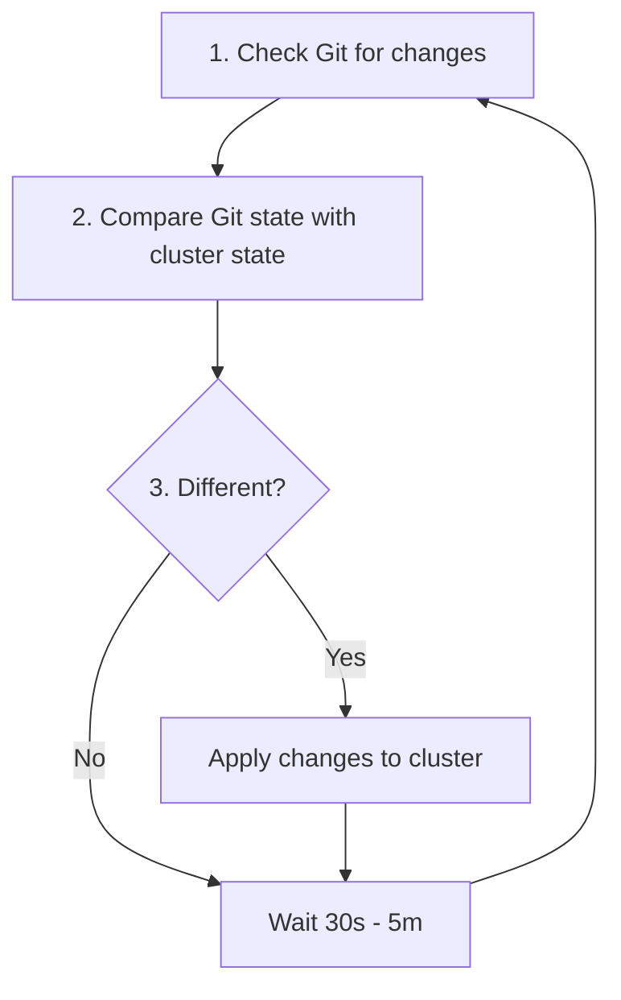
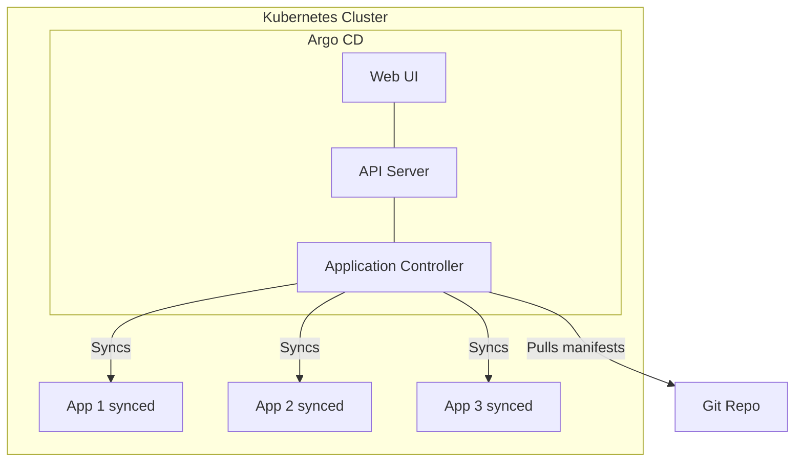
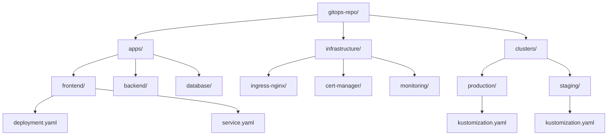
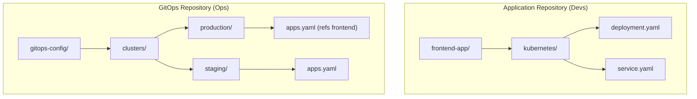
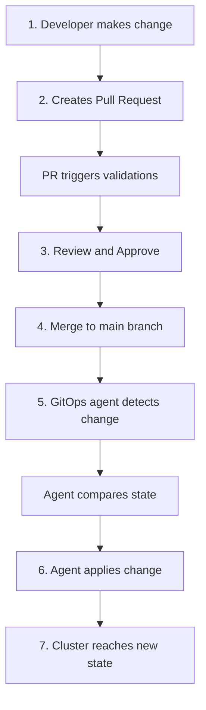
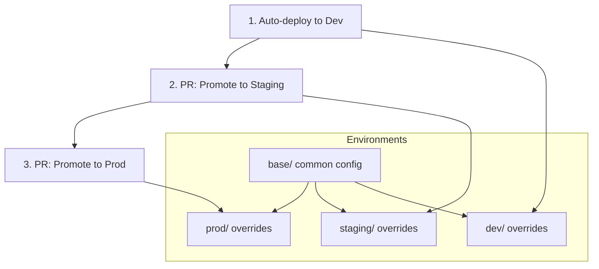

> **Complexity**: `[MEDIUM]` - Key operational pattern
>
> **Time to Complete**: 45-60 minutes
>
> **Prerequisites**: Module 1.1 (Infrastructure as Code), Git fundamentals, Kubernetes basics (v1.35+ compatible)

## What You'll Be Able to Do

After completing this module, you will be able to:
- **Diagnose** configuration drift between a running Kubernetes cluster and its authoritative Git repository by analyzing controller logs.
- **Compare** the security profiles and attack surfaces of legacy push-based CI/CD pipelines versus modern pull-based GitOps reconciliation loops.
- **Design** a scalable, multi-environment repository architecture utilizing Kustomize overlays to prevent configuration duplication.
- **Implement** an automated image promotion strategy leveraging native GitOps controllers to reduce manual release friction.
- **Evaluate** the operational trade-offs between centralized monorepos and distributed polyrepos when structuring infrastructure code.

## Why This Module Matters

In August 2012, Knight Capital Group, a leading financial services firm, lost $465 million in just 45 minutes. The root cause was a botched manual deployment process. A senior systems engineer manually copied new software to their eight production servers but inadvertently missed the eighth server. When the trading system went live at the opening bell, the neglected server ran obsolete code that repurposed an old testing flag. This mistake unleashed a massive flood of erroneous automated trades onto the New York Stock Exchange. The financial impact was so severe that the company was effectively bankrupted and acquired by a rival firm shortly thereafter.

This catastrophic failure highlights the profound danger of relying on human operators executing imperative commands or manual file copies to maintain infrastructure state. In modern distributed systems, configuration drift is not merely an annoyance; it is a critical business risk that can destroy a company overnight. Traditional deployment pipelines often mask this risk by relying on brittle bash scripts and push-based delivery mechanisms that cannot continuously verify if the system remains in the desired state after the deployment completes. When an operator attempts to debug a live system and alters configurations out-of-band, the environment becomes a "snowflake"—a unique, irreproducible state that is inherently fragile.

GitOps emerged as the definitive solution to this exact problem. By declaring the Git repository as the single, immutable source of truth and employing automated software agents to enforce that state continuously, organizations eliminate the possibility of the "missed server" scenario. GitOps takes Infrastructure as Code to its logical conclusion: human operators no longer touch the production environment directly, and every modification is cryptographically signed, version-controlled, and automatically reconciled. Mastering this pattern is essential for modern Kubernetes administration, particularly as clusters scale to hundreds of nodes and thousands of workloads running on Kubernetes v1.35 and beyond.

## What is GitOps?

At its core, GitOps is a paradigm shift in how we manage and deliver software infrastructure. Instead of viewing deployment as an event triggered by a human or a Continuous Integration (CI) server, GitOps treats deployment as a continuous reconciliation loop managed by autonomous agents residing within the destination environment. 

In a traditional CI/CD pipeline, the CI server is granted highly privileged credentials to the production cluster. When a build finishes, the CI server executes imperative commands (such as `kubectl apply` or `helm upgrade`) to push the new manifests into the cluster. This push-based model creates a massive security vulnerability: if the CI server is compromised, the attacker gains full administrative access to production. Furthermore, the CI server is entirely blind to what happens after the deployment. If an administrator subsequently logs into the cluster and modifies a deployment, the CI server has no way of knowing, leading to configuration drift.

GitOps reverses this dynamic by implementing a pull-based model. The cluster itself reaches out to the Git repository, pulls the desired state, and applies it locally. The cluster never exposes its administrative credentials to external systems.

```mermaid
flowchart LR
    subgraph Traditional["Traditional CI/CD (Push-based)"]
        direction LR
        Dev1[Dev] --> Git1[Git]
        Git1 --> CI[CI Pipeline]
        CI -->|Pushes| Cluster1[Cluster]
    end

    subgraph GitOps["GitOps (Pull-based)"]
        direction LR
        Dev2[Dev] --> Git2[Git]
        Git2 <--|Pulls| Agent[GitOps Agent]
        Agent -->|Applies| K8s[Local Kubernetes API]
    end
```

This architectural shift yields massive dividends for security, compliance, and reliability. By pulling configurations, firewalls can remain closed to inbound traffic, drastically reducing the cluster's attack surface. ServiceAccounts dedicated to the GitOps agents are the only entities that require broad RBAC permissions, completely eliminating the need to distribute `kubeconfig` files to developers or external CI runners.

> **Stop and think**: If Git is the single source of truth, what happens to imperative commands like `kubectl scale` or `kubectl edit`? Are they still useful in a GitOps environment?

In a true GitOps environment, imperative commands that mutate the cluster state are strictly prohibited. While `kubectl get` and `kubectl logs` remain essential for read-only debugging and observability, any command that alters resources will be immediately detected as drift and overwritten by the GitOps agent during its next synchronization cycle.

## The Four Principles of GitOps

The Open GitOps Working Group, a project under the Cloud Native Computing Foundation (CNCF), has codified the methodology into four foundational principles. Understanding these principles is critical for designing robust deployment systems capable of self-healing.

### 1. Declarative

A system managed by GitOps must have its desired state expressed declaratively. Rather than writing scripts that detail the step-by-step instructions to achieve a goal (imperative logic), you declare the final state you want the system to reach, and rely on the platform to figure out how to transition to that state safely. Kubernetes is inherently declarative through its robust API, making it the perfect foundational platform for GitOps patterns.

```yaml
# Not "run 3 nginx pods"
# But "desired state is 3 nginx pods"
apiVersion: apps/v1
kind: Deployment
metadata:
  name: web
spec:
  replicas: 3
  # ...
```

By storing these declarative manifests in a repository, any engineer can read the files and immediately understand the intended topology of the application without needing to decipher complex deployment scripts. This declarative approach integrates seamlessly with modern features like Kubernetes v1.35 Server-Side Apply, which intelligently merges fields managed by the GitOps controller with fields managed by other autonomous cluster operators.

### 2. Versioned and Immutable

The desired state must be stored in a system that enforces immutability and strict versioning. Git is the undisputed industry standard for this requirement. Because Git tracks every modification via cryptographic SHA-1 hashes, the history of your infrastructure becomes an unforgeable, chronologically ordered audit trail.

```bash
git log --oneline manifests/
a1b2c3d Scale web to 5 replicas
d4e5f6g Add redis cache
g7h8i9j Initial deployment

# Every change is:
# - Versioned (commit hash)
# - Immutable (can't change history)
# - Attributed (who made it)
# - Reviewable (PR history)
```

This versioning ensures that if a deployment introduces a critical failure, the operations team does not need to guess what changed over the weekend. They can simply review the Git diff between the current and previous commits. By layering branch protection rules and CODEOWNERS files on top of the repository, you mathematically guarantee that no configuration reaches production without explicit peer review and documented approval.

### 3. Pulled Automatically

Software agents within the cluster must continuously monitor the version control system for changes. When a new commit is merged to the tracked branch, the agent detects the updated state and automatically pulls it into the cluster, eliminating the need for manual deployment triggers or external pipeline webhooks to initiate the process.



This polling mechanism ensures that the cluster is always working to synchronize itself with the authoritative repository, even if network partitions temporarily disrupt connectivity. Advanced implementations optimize this loop by utilizing repository webhooks to trigger immediate synchronization, while still maintaining the background polling interval as a fail-safe mechanism.

### 4. Continuously Reconciled

The software agent must continuously compare the actual, runtime state of the cluster against the desired state defined in Git. If a discrepancy—known as drift—is detected, the agent must aggressively revert the cluster back to the authorized state. This drift could be caused by a malicious actor, a misconfigured automation script, or a well-meaning administrator making manual changes during an incident.

```bash
# Someone manually edits production
kubectl scale deployment web --replicas=10

# GitOps agent detects drift
# Git says 3 replicas, cluster has 10
# Agent corrects: scales back to 3

# Result: Git always wins
```

> **Pause and predict**: Based on the concept of continuous reconciliation, how quickly do you think a GitOps agent will revert a manual, unauthorized change made directly to the cluster?

The speed of reconciliation depends on the agent's configured sync interval, which is typically set between one and three minutes. This rapid correction guarantees that out-of-band changes cannot persist long enough to compromise system integrity, enforcing strict compliance and security standards seamlessly.

## GitOps Tools and Architecture

While the GitOps principles are platform-agnostic, the Kubernetes ecosystem has largely coalesced around two primary CNCF-graduated tools: Argo CD and Flux CD. Both tools are highly capable and support the latest enterprise features, but they approach the problem with different architectural philosophies.

### Argo CD

Argo CD is renowned for its comprehensive web-based user interface and robust multi-tenancy capabilities. It visualizes the entire synchronization process, making it incredibly accessible for developers who may not be Kubernetes experts. The architecture consists of an API Server, a Redis cache for performance, a Repository Server that clones and caches Git trees, and an Application Controller that continually executes the reconciliation loops against the Kubernetes API.



Argo CD uses a Custom Resource Definition (CRD) called an `Application` to map a specific Git repository path to a target cluster namespace. Below is a complete, working example of an Argo CD Application manifest that wires a production frontend to its configuration source.

```yaml
# A worked ArgoCD Application example
apiVersion: argoproj.io/v1alpha1
kind: Application
metadata:
  name: frontend-prod
  namespace: argocd
spec:
  project: default
  source:
    repoURL: 'https://github.com/myorg/gitops-config.git'
    path: clusters/production/frontend
    targetRevision: HEAD
  destination:
    server: 'https://kubernetes.default.svc'
    namespace: frontend-prod
  syncPolicy:
    automated:
      prune: true
      selfHeal: true
```

The `selfHeal` parameter is the critical configuration that enforces continuous reconciliation, ensuring any manual drift is immediately corrected without requiring human intervention.

### Flux CD

Flux CD, originally developed by Weaveworks, takes a highly modular, strictly Kubernetes-native approach via the GitOps Toolkit. It relies heavily on specialized, distinct controllers (Source Controller, Kustomize Controller, Helm Controller) that communicate exclusively through Kubernetes custom resources. Flux is heavily CLI-focused and integrates deeply with standard Kubernetes RBAC rather than implementing its own separate permission model.

To define a GitOps workflow in Flux, you declare a source (where the code lives) and a reconciliation process (how to apply it).

```yaml
# Flux GitRepository
apiVersion: source.toolkit.fluxcd.io/v1
kind: GitRepository
metadata:
  name: my-app
  namespace: flux-system
spec:
  interval: 1m
  url: https://github.com/myorg/my-app
  ref:
    branch: main
```

```yaml
# Flux Kustomization (applies manifests)
apiVersion: kustomize.toolkit.fluxcd.io/v1
kind: Kustomization
metadata:
  name: my-app
  namespace: flux-system
spec:
  interval: 5m
  path: ./kubernetes
  prune: true
  sourceRef:
    kind: GitRepository
    name: my-app
```

The Source Controller is responsible for periodically polling the Git repository and packaging the state into an internal artifact. The Kustomize Controller then fetches that artifact and applies it to the cluster, maintaining clean separation of concerns.

### Tool Comparison

Choosing between Argo CD and Flux CD often depends on your organizational culture. Teams that value visual dashboards and developer self-service tend to prefer Argo, while heavily automated platform engineering teams building "invisible" internal developer platforms often lean toward Flux.

| Feature | Argo CD | Flux CD |
|---------|---------|---------|
| UI | Beautiful web dashboard | CLI-focused |
| Multi-tenancy | Built-in | Via namespaces |
| RBAC | Comprehensive | Kubernetes-native |
| Helm support | First-class | Via controllers |
| Learning curve | Moderate | Steeper |
| CNCF status | Graduated | Graduated |

## Repository Design Strategies

A common pitfall when adopting GitOps is poor repository architecture. How you organize your YAML files profoundly impacts your team's velocity and the cognitive load required to manage environments. There are two primary strategies: Monorepos and Polyrepos.

### Monorepo (Everything Together)

In a monorepo setup, a single Git repository houses all manifests for all applications and infrastructure components across all environments.

```bash
gitops-repo/
├── apps/
│   ├── frontend/
│   │   ├── deployment.yaml
│   │   └── service.yaml
│   ├── backend/
│   │   ├── deployment.yaml
│   │   └── service.yaml
│   └── database/
│       └── statefulset.yaml
├── infrastructure/
│   ├── ingress-nginx/
│   ├── cert-manager/
│   └── monitoring/
└── clusters/
    ├── production/
    │   └── kustomization.yaml
    └── staging/
        └── kustomization.yaml
```

The structure above translates visually into the following dependency tree:



Monorepos provide incredible visibility. An architect can clone a single repository and immediately understand the entire organization's cloud footprint. However, they require strict branch protection rules and CODEOWNERS files to prevent unauthorized developers from modifying core infrastructure, since Git does not natively support granular read/write access controls at the folder level.

### Polyrepo (Separate Repos)

In a polyrepo architecture, application developers maintain control over their specific Kubernetes manifests within their application source repositories, while the platform team maintains a centralized GitOps repository that aggregates references to the scattered application repos.

```bash
# App repos (developers own)
frontend-app/
  └── kubernetes/
      ├── deployment.yaml
      └── service.yaml

# GitOps repo (ops owns)
gitops-config/
  └── clusters/
      ├── production/
      │   └── apps.yaml  # References app repos
      └── staging/
          └── apps.yaml
```

The polyrepo structure creates a strict boundary between application concerns and infrastructure concerns:



Polyrepos reduce the risk of merge conflicts and allow teams to operate entirely autonomously without tripping over each other. However, they can make cross-cutting changes—such as updating an ingress annotation across 50 microservices to support a new security policy—significantly more tedious, requiring pull requests across dozens of distinct repositories.

## GitOps Workflow

The day-to-day workflow of an engineer interacting with a GitOps system revolves heavily around standard Git operations. By leveraging Pull Requests (PRs), teams automatically gain peer review, automated validation via CI, and a cryptographically verifiable audit trail.



This workflow ensures that no change enters the cluster without passing organizational gates. You can enforce advanced policies using admission controllers like OPA Gatekeeper or Kyverno during the CI phase (Step 2) to reject manifests that violate security standards (e.g., running containers as root) before they are ever reviewed by a human or merged into the main branch.

## Image Update Automation

A common criticism of adopting GitOps is the manual effort seemingly required to update the image tag in the deployment manifest every time a new container is built. If a team deploys twenty times a day, manually editing YAML files twenty times a day is unacceptable toil. Modern GitOps tools resolve this by providing native image update automation controllers that scan container registries for new tags and automatically commit the updates back to the Git repository on behalf of the developer.

```yaml
# Argo CD Image Updater annotation
metadata:
  annotations:
    argocd-image-updater.argoproj.io/image-list: myapp=myrepo/myapp
    argocd-image-updater.argoproj.io/myapp.update-strategy: semver

# Flux Image Automation
apiVersion: image.toolkit.fluxcd.io/v1beta1
kind: ImageUpdateAutomation
metadata:
  name: flux-system
spec:
  interval: 1m
  sourceRef:
    kind: GitRepository
    name: flux-system
  git:
    checkout:
      ref:
        branch: main
    commit:
      author:
        email: fluxcdbot@users.noreply.github.com
        name: fluxcdbot
      messageTemplate: 'Update image to {{.NewTag}}'
    push:
      branch: main
```

**Flow:**
1. The CI pipeline compiles the code, builds a new image: `myapp:v1.2.3`, and runs unit tests.
2. The CI pipeline pushes the tested image to the secure container registry.
3. The GitOps Image Updater controller, polling the registry, detects the new semantic version tag.
4. The controller clones the Git repository, patches the deployment manifest, and commits the change programmatically.
5. The core GitOps agent detects the new commit in the repository and syncs the cluster.

This creates a fully automated deployment pipeline while rigorously maintaining a perfect, machine-generated audit trail in Git.

## Environment Promotion

Managing multiple environments—such as Development, Staging, and Production—is elegantly handled using native Kubernetes overlay tools like Kustomize. Instead of duplicating thousands of lines of YAML files across environments, you maintain a shared base configuration and apply sparse overrides specifically for each environment (e.g., increasing replica counts or changing environment variables for production).



Promotion between these environments becomes a simple matter of updating the staging or production overlay file to reference the thoroughly tested container image tag previously deployed to the development environment. This promotion is usually executed via a strictly governed pull request, ensuring an operations engineer reviews the diff before it impacts production traffic.

## Rollback with GitOps

In traditional deployment models, rolling back a failed release is a high-stress, error-prone procedure that often involves running bespoke rollback scripts or trying to remember which backup file holds the previous state. In a GitOps paradigm, a rollback is as simple as executing a `git revert`.

```bash
# Production has a bug!

# Option 1: Revert the commit
git revert abc123
git push

# GitOps agent syncs: old version restored
# Time to rollback: < 5 minutes

# Option 2: Use Argo CD UI
# Click "Rollback" on the application
# Argo reverts to previous sync state

# All rollbacks are tracked in Git history
git log --oneline
def456 Revert "Deploy v1.2.3"  # ← Rollback recorded
abc123 Deploy v1.2.3           # ← Bad deployment
```

Because Kubernetes deployments are inherently declarative, reverting the Git commit immediately changes the desired state stored in the repository back to the previous stable configuration. The GitOps agent seamlessly instructs the Kubernetes API server to execute a rolling update to restore the old pods, terminating the buggy instances. The entire rollback process is fully audited and transparent to the entire engineering team.

## Did You Know?

- **The term "GitOps" was coined by Weaveworks** in August 2017 in a foundational blog post describing how they managed their internal Kubernetes clusters reliably.
- **GitOps eliminates "kubectl apply" from your workflow.** In a pure, mature GitOps setup, no human operator ever runs mutating kubectl commands against a production cluster, maximizing compliance.
- **Argo CD's name** comes from Greek mythology. Argo was the legendary ship that carried Jason and the Argonauts on their quest. CD stands for Continuous Delivery.
- **GitOps is officially recognized by the CNCF** (Cloud Native Computing Foundation) through the Open GitOps working group, which published the standardized v1.0 core principles in late 2021.

## Common Mistakes

Implementing GitOps successfully requires strict discipline and organizational buy-in. Below are the most common anti-patterns teams encounter during their adoption journeys, why they are harmful, and how to resolve them effectively.

| Mistake | Why It Hurts | Solution |
|---------|--------------|----------|
| Manual `kubectl` in production | Bypasses the audit trail and causes configuration drift that gets overwritten. | Restrict cluster access; force all changes through the Git repository. |
| Storing raw secrets in Git | Exposes sensitive API keys and passwords to anyone with repository access. | Implement SealedSecrets, SOPS, or an External Secrets Operator. |
| Missing PR review process | Allows destructive or untested changes to automatically sync to production. | Enforce branch protection rules requiring at least one peer approval. |
| Syncing too frequently | Overloads the Kubernetes API server and causes unnecessary network traffic. | Configure the sync interval to a reasonable timeframe (e.g., 3-5 minutes). |
| Missing health checks | Allows broken deployments to remain running while the sync status shows "Healthy". | Configure proper readiness and liveness probes in your manifests. |
| Putting CI and CD in one repo | Causes infinite loops where CD updates trigger CI pipelines endlessly. | Separate your application code repository from your GitOps manifest repository. |
| Ignoring drift alerts | Leads to a false sense of security where the cluster diverges from Git without notice. | Configure Slack or email notifications for any ArgoCD or Flux "OutOfSync" events. |

## Quiz

Evaluate your understanding of GitOps scenarios.

1. **Scenario**: A critical vulnerability is discovered in your web application at 3 AM. The on-call engineer logs into the cluster and uses `kubectl set image` to immediately deploy a patched container. Ten minutes later, the vulnerability is back. What happened?
   <details>
   <summary>Answer</summary>
   The GitOps agent detected configuration drift between the cluster and the Git repository. Because the manual change was not recorded in Git, the agent assumed the cluster was in an incorrect state. It automatically reconciled the cluster back to the vulnerable image version specified in the repository. To fix this properly, the engineer must update the image tag in the Git repository, allowing the agent to pull the new state.
   </details>

2. **Scenario**: Your team decides to adopt GitOps and removes cluster administrator credentials from your Jenkins CI server. The security team asks how Jenkins will deploy the new application builds without these credentials. How should you explain the new deployment flow?
   <details>
   <summary>Answer</summary>
   Jenkins no longer pushes changes directly into the Kubernetes cluster. Instead, the CI pipeline's final step is to commit and push the newly built container image tag to the Git configuration repository. A GitOps agent running securely inside the cluster monitors this repository. When the agent sees the new commit, it pulls the updated manifests and applies them locally, eliminating the need for external systems to hold cluster credentials.
   </details>

3. **Scenario**: The latest release of your payment microservice contains a bug that is double-charging customers. You need to revert the system to the exact state it was in one hour ago as quickly as possible. How do you accomplish this in a pure GitOps environment?
   <details>
   <summary>Answer</summary>
   You execute a `git revert` command on the commit that introduced the broken payment service manifests, and push that reversion to the main branch. The GitOps agent will immediately detect this new commit and reconcile the cluster state to match the previous, stable configuration. Because Git history is immutable, this process provides a perfectly documented audit trail of both the failure and the rollback action. This approach guarantees that your version control system remains the undisputed source of truth for the entire incident.
   </details>

4. **Scenario**: You are designing the repository structure for a large enterprise with 50 microservices. The lead developer suggests keeping all Kubernetes manifests in the same repository as the application source code. What specific GitOps problem will this likely cause?
   <details>
   <summary>Answer</summary>
   Mixing application code and GitOps manifests in a single repository often triggers infinite CI/CD loops. When the CI pipeline builds a new image and updates the manifest in the repository, that new commit will re-trigger the CI pipeline, which builds another image, updates the manifest again, and so on. Additionally, this structure makes it very difficult to manage multi-environment configurations without massive duplication. To avoid this, teams should use a polyrepo structure with separate repositories for application source code and infrastructure manifests.
   </details>

5. **Scenario**: Your compliance department requires a complete audit log of who made changes to the production database configuration, when the changes were made, and who approved them. How does a pull-based GitOps model satisfy this requirement inherently?
   <details>
   <summary>Answer</summary>
   Because Git serves as the single source of truth, the `git log` acts as the definitive audit trail for all infrastructure changes. Every modification is tied to a specific developer's commit signature and timestamp. Furthermore, by enforcing Pull Requests and branch protection rules in your Git hosting platform, you automatically generate an immutable record of peer reviews and approvals before any change is allowed to sync to the cluster. This completely eliminates the need for external change management boards or manual logging.
   </details>

6. **Scenario**: A developer complains that their new deployment isn't showing up in the cluster, even though ArgoCD shows a green "Synced" status. When you inspect the cluster, the Pods are crashing in a CrashLoopBackOff state. Why didn't GitOps prevent this broken deployment?
   <details>
   <summary>Answer</summary>
   GitOps tools ensure that the requested resources are applied to the cluster, which is what the "Synced" status indicates. However, they rely on Kubernetes health probes to determine actual application health. If the developer failed to configure proper readiness and liveness checks in their deployment manifests, ArgoCD assumes the application is healthy as long as the Kubernetes API accepts the resources. You must configure proper probes so the GitOps agent can accurately report a "Degraded" health status and halt further rollouts.
   </details>

7. **Scenario**: You have an application deployed to a `staging` namespace and a `production` namespace. You want to update the staging environment with a new configuration without affecting production. How do you structure this change in your GitOps repository?
   <details>
   <summary>Answer</summary>
   You should utilize a tool like Kustomize or Helm within your GitOps repository to separate base configurations from environment-specific overrides. You would commit the new configuration strictly to the staging environment's overlay folder, leaving the production configuration untouched. The GitOps agent managing the staging environment will pull this specific path and apply the updates. Meanwhile, the production agent remains unaffected, ensuring safe environment isolation and preventing accidental cross-contamination.
   </details>

## Hands-On Exercise

**Task**: Experience GitOps continuous reconciliation concepts manually without installing Argo CD or Flux. This local exercise proves how pull-based reconciliation forces state alignment.

```bash
# This simulates GitOps behavior manually
# In real GitOps, an agent does this automatically

# 1. Create a "Git repo" (directory)
mkdir -p ~/gitops-demo/manifests
cd ~/gitops-demo

# 2. Create initial desired state
cat << 'EOF' > manifests/deployment.yaml
apiVersion: apps/v1
kind: Deployment
metadata:
  name: gitops-demo
spec:
  replicas: 2
  selector:
    matchLabels:
      app: gitops-demo
  template:
    metadata:
      labels:
        app: gitops-demo
    spec:
      containers:
      - name: nginx
        image: nginx:1.27
EOF

# 3. Apply (simulate GitOps sync)
kubectl apply -f manifests/

# 4. Verify
kubectl get deployment gitops-demo

# 5. Simulate drift (manual change)
kubectl scale deployment gitops-demo --replicas=5

# 6. Check drift
kubectl get deployment gitops-demo
# Shows 5 replicas

# 7. Reconcile (simulate GitOps correction)
kubectl apply -f manifests/
# Back to 2 replicas!

# 8. Make a "Git change"
sed -i '' 's/nginx:1.27/nginx:1.28/' manifests/deployment.yaml

# 9. Apply new state (simulate GitOps sync)
kubectl apply -f manifests/

# 10. Verify update
kubectl get deployment gitops-demo -o jsonpath='{.spec.template.spec.containers[0].image}'
# Shows nginx:1.28

# 11. Cleanup
kubectl delete -f manifests/
rm -rf ~/gitops-demo
```

**Success criteria**:
- [ ] You created a simulated Git repository directory and an initial deployment manifest targeting a local Kubernetes v1.35+ compatible cluster.
- [ ] You applied the initial declarative state and verified the correct number of replicas instantiated.
- [ ] You manually scaled the deployment using an imperative command to simulate configuration drift caused by human error.
- [ ] You successfully reconciled the cluster back to the Git state, observing the replicas immediately return to the desired count.
- [ ] You updated the container image version in your simulated Git repo and reapplied the manifest to see the declarative change securely take effect.

## Summary

GitOps fundamentally reshapes the operational model for modern Kubernetes environments, establishing rigorous security, compliance, and reliability guardrails that manual processes simply cannot provide.

**Core principles**:
- Git is the single, undisputed source of truth for the entire platform.
- Changes flow exclusively through peer-reviewed pull requests.
- Agents perform automated, pull-based synchronization directly from within the cluster.
- Drift is automatically and aggressively corrected without human intervention.

**Benefits**:
- **Full audit trail**: Git history provides a cryptographically verifiable log of all activity.
- **Easy rollback**: Reverting to a previously stable state is as simple as running a `git revert` command.
- **Better security**: CI systems no longer hold the keys to the cluster kingdom.
- **Self-documenting**: The desired runtime state is always perfectly described in the repository.

**Key insight**: In a mature GitOps implementation, you never run `kubectl apply` in production. You commit to Git, and the autonomous agents handle the rest.

## Next Module

Ready to dive deeper into the systems that actually compile your code and build the images before GitOps deploys them?

[Module 1.3: CI/CD Pipelines](../module-1.3-cicd-pipelines/) - Discover how to automate the build, test, and containerization processes to create the secure artifacts that GitOps will eventually pull into your Kubernetes cluster.