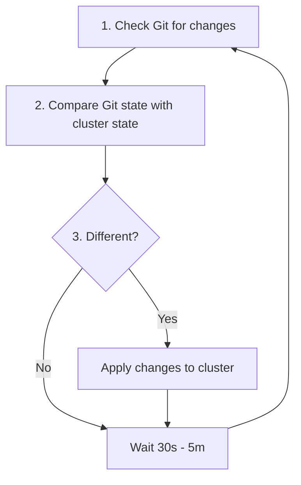
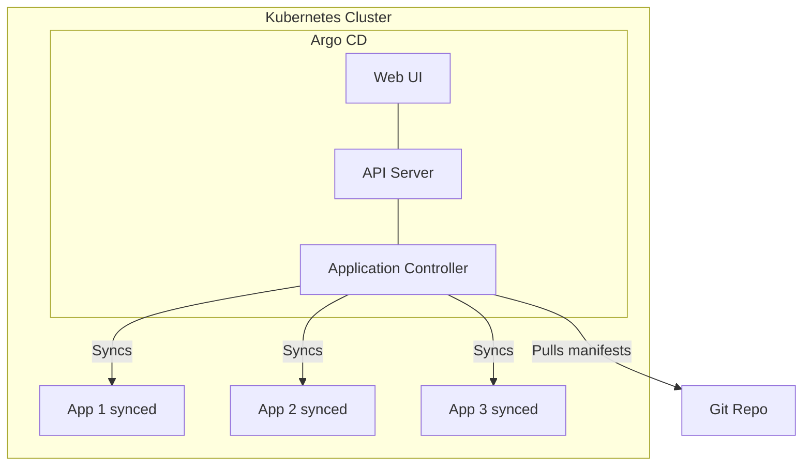
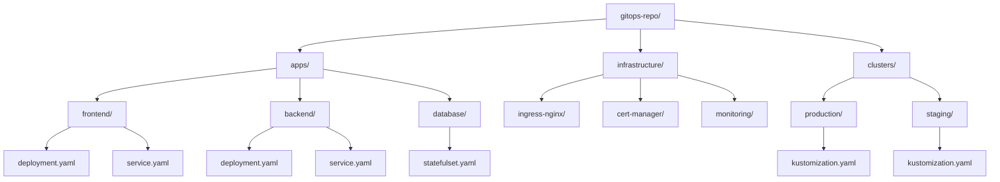
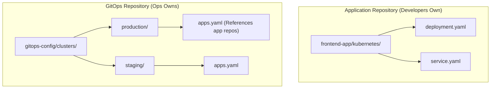
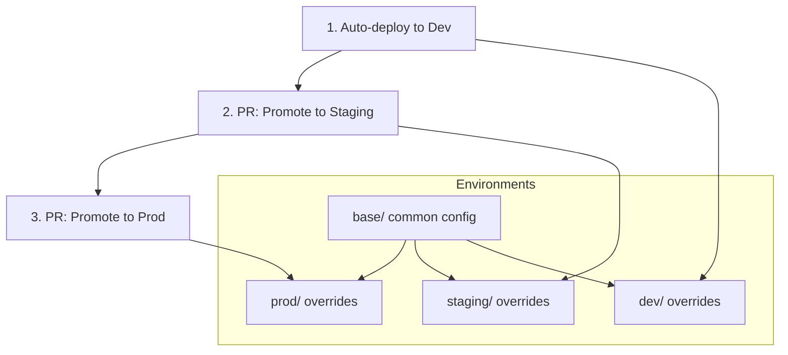
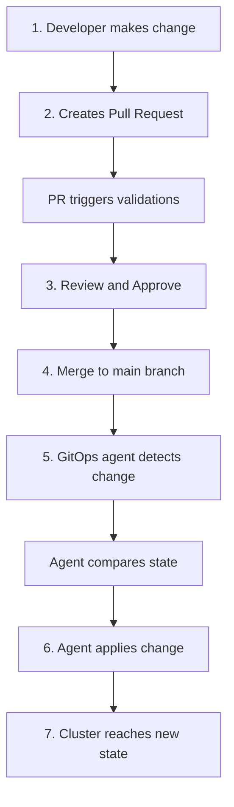
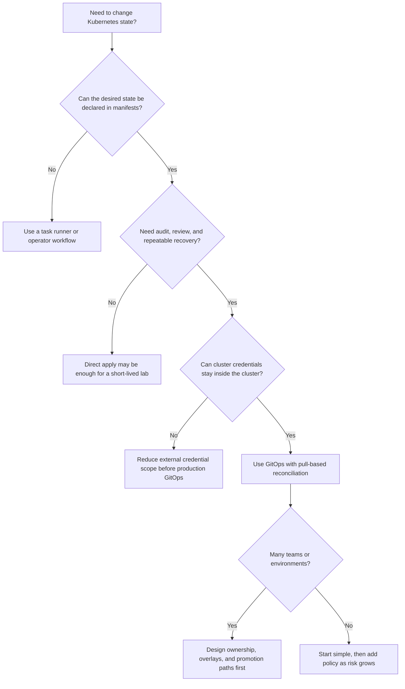

# Module 1.2: GitOps

**Complexity:** [MEDIUM]<br>
**Time to Complete:** 60-75 minutes<br>
**Prerequisites:** [Module 1.1: Infrastructure as Code](/prerequisites/modern-devops/module-1.1-infrastructure-as-code/), Git basics, Kubernetes fundamentals

## Learning Outcomes

By the end of this module, you will be able to:

- **Design** a GitOps repository architecture that supports multi-tenant teams, environment promotion, and controlled production ownership.
- **Diagnose** configuration drift by comparing the live Kubernetes state with the Git source of truth and choosing the correct reconciliation response.
- **Evaluate** the security implications of push-based and pull-based deployment models for Kubernetes 1.35+ clusters.
- **Implement** a continuous reconciliation workflow using Argo CD or Flux CD patterns, including automated sync and self-healing behavior.
- **Compare** monorepo and polyrepo infrastructure layouts and select the structure that fits team scale, audit needs, and release velocity.

## Why This Module Matters

On August 1, 2012, Knight Capital Group deployed new trading software across eight production servers, but one server kept an old code path that should no longer have been active. When the market opened, that server interpreted a reused flag in a dangerous way and began sending erroneous orders at high speed. In about 45 minutes, the firm lost roughly $460 million and needed a rescue sale within days. The most important lesson was not that one person forgot one machine; it was that the delivery system allowed production reality to depend on manual coordination that no audit trail could fully prove.

Kubernetes solves part of that problem by giving teams declarative APIs, controllers, health checks, and rollout mechanics, but Kubernetes does not automatically make a team disciplined. An engineer can still run an urgent command against the wrong namespace, a CI job can still hold broad cluster credentials, and a production fix can still live only in terminal history. GitOps addresses the gap by making Git the operational contract for the cluster. The repository describes the intended state, peer review controls how that state changes, and a controller inside the cluster continuously reconciles reality toward that contract.

Throughout the Kubernetes sections in KubeDojo, the shorthand `k` means `alias k=kubectl`; after configuring that alias, `k get deploy` is simply a shorter form of `kubectl get deploy`. GitOps does not make imperative commands disappear, but it changes their role. Commands become diagnostic tools, temporary emergency actions, or local lab helpers, while durable production changes move through Git. That distinction is what keeps a late-night mitigation from becoming a hidden configuration fork that surprises the next engineer.

This module teaches GitOps as an operating model, not as a tool demo. You will see why pull-based reconciliation reduces credential exposure, how Argo CD and Flux CD express the same core principles with different ergonomics, how repository structure affects multi-tenant safety, and why rollback is a Git operation rather than a frantic sequence of cluster commands. The goal is that you can design, diagnose, and defend a GitOps workflow before you install a controller in a real Kubernetes 1.35+ environment.

## What GitOps Changes About Delivery

GitOps is an operational framework built around a simple rule: the desired state of the system lives in Git, and automated software reconciles the running environment to match that versioned declaration. That rule sounds small, but it moves the center of gravity for operations. Instead of asking who ran a command, you ask which commit changed the desired state, which review approved it, which checks passed, and which controller applied it. The live cluster becomes a result of reviewable history rather than the memory of whoever last touched production.

Traditional CI/CD pipelines often use a push model. A developer commits code, a pipeline builds and tests it, and then the external CI system connects to the Kubernetes API to apply manifests or run Helm commands. The pipeline needs a credential powerful enough to alter the target cluster, and that credential must be stored, rotated, audited, and protected wherever the CI runner executes. This model can work, but it turns the CI platform into a high-value deployment authority, so a compromised runner or overly broad secret can become a direct path into production.

GitOps reverses that trust boundary by placing the deployment authority inside the cluster. A controller such as Argo CD or Flux CD watches a Git repository, compares the repository state with the live state, and applies the difference by using a Kubernetes ServiceAccount governed by RBAC. The CI system still matters, but its job narrows to building an immutable artifact, scanning it, publishing it to a registry, and updating the configuration repository when a release should occur. The cluster pulls the desired state instead of waiting for an external system to push commands into it.

```mermaid
flowchart LR
    subgraph Traditional["Traditional CI/CD (Push-based)"]
        direction LR
        Dev1[Dev] --> Git1[Git]
        Git1 --> CI[CI Pipeline]
        CI -->|Pushes| Cluster1[Cluster]
    end

    subgraph GitOps["GitOps (Pull-based)"]
        direction LR
        Dev2[Dev] --> Git2[Git]
        Git2 <--|Pulls| Agent[GitOps Agent]
        Agent -->|Applies| K8s[Local Kubernetes API]
    end
```

The diagram hides an important operational consequence. In the push model, the pipeline must reach the cluster at deployment time, so network access and credentials exist outside the cluster boundary. In the pull model, the controller only needs outbound access to Git and registries, while all writes to the Kubernetes API happen through in-cluster identity. That is why security teams often prefer GitOps for production clusters: the external automation system no longer needs a kubeconfig that can mutate workloads across namespaces.

GitOps also changes how drift is treated. Drift means the actual cluster state differs from the desired state in Git. Some drift is accidental, such as a developer running `k scale deployment web --replicas=10` during an incident and forgetting to update the manifest. Some drift is malicious, such as an attacker changing an image tag or mounting a new secret into a pod. A GitOps controller detects both cases as disagreement between declaration and reality, then either alerts, repairs, or waits for approval depending on policy.

> **Pause and predict:** if Git says a Deployment should run three replicas and the cluster currently runs ten, what should a GitOps controller do by default in a strict production environment, and when might you intentionally choose a softer policy?

The right answer depends on the risk model. In a strict environment, Git wins because the unauthorized change could be a mistake or an intrusion, and automatic self-healing restores the reviewed state. In a less mature environment, a team may start with alert-only drift detection so operators can learn which manual practices still exist before enabling automatic correction. The key is to make the choice explicit, because silent drift is the worst of both worlds: the team thinks Git is authoritative while production slowly diverges from it.

The four OpenGitOps principles provide a useful test for whether a workflow deserves the name. The system must be declarative, meaning the desired state is described rather than scripted as imperative steps. It must be versioned and immutable, so every change can be traced to a commit. It must be pulled automatically by software agents. It must be continuously reconciled, so the agent observes and corrects differences over time rather than applying a manifest once and walking away.

```yaml
# Not "run 3 nginx pods"
# But "desired state is 3 nginx pods"
apiVersion: apps/v1
kind: Deployment
metadata:
  name: web
spec:
  replicas: 3
  # ...
```

Declarative configuration is powerful because Kubernetes controllers already work this way. You submit the desired state to the API server, and controllers decide how to create pods, replace unhealthy replicas, attach services, and converge gradually. GitOps adds another controller layer above Kubernetes. The GitOps controller does not replace the Deployment controller, Service controller, or scheduler; it keeps the objects those controllers manage aligned with the repository that humans review.

```bash
git log --oneline manifests/
a1b2c3d Scale web to 5 replicas
d4e5f6g Add redis cache
g7h8i9j Initial deployment

# Every change is:
# - Versioned (commit hash)
# - Immutable (can't change history)
# - Attributed (who made it)
# - Reviewable (PR history)
```

The Git history is more than a convenience when incidents happen. A rollback becomes `git revert` rather than an improvised list of commands, and the rollback itself becomes a new audited change. That matters for compliance because the evidence lives in systems engineers already use: commits, pull requests, branch protection, code owners, status checks, and signed tags. It also matters for recovery because a fresh cluster can be pointed at the same repository and told to rebuild the expected state.

One practical way to test whether Git is truly authoritative is to ask where an engineer would make a routine change under time pressure. If the answer is "edit the live Deployment and clean it up later," the team has not yet internalized GitOps even if a controller is installed. If the answer is "open a small pull request that changes the manifest, let checks render the diff, and allow the controller to converge," the process has moved from tool adoption to operational habit. The habit matters more than the brand of controller because the controller can only enforce the contract the team actually follows.

Git also gives reviewers context that the Kubernetes API alone cannot provide. A live object can tell you that a value changed, but it cannot explain the reason, the ticket, the approving engineer, the test run, or the discussion that weighed alternatives. Pull requests attach that surrounding evidence to the desired state change. When a later incident review asks why production used a particular resource limit or image tag, the answer should be recoverable from repository history rather than from chat messages and personal recollection.



The reconciliation loop is intentionally repetitive. A controller checks Git, renders the desired manifests if templates are involved, compares those manifests with live objects, applies missing or changed resources, optionally prunes removed resources, and waits for the next interval or webhook notification. The loop is boring in the best possible way. It performs the same comparison under pressure that it performs on an ordinary Tuesday, so incident recovery does not require a separate heroic procedure.

```bash
# Someone manually edits production
k scale deployment web --replicas=10

# GitOps agent detects drift
# Git says 3 replicas, cluster has 10
# Agent corrects: scales back to 3

# Result: Git always wins
```

That example is deliberately small because the principle scales. A manual replica change, an edited ConfigMap, a removed NetworkPolicy, or an unexpected Service annotation all become differences between declared state and observed state. The challenge is not teaching the controller to notice differences; it is teaching the organization which differences should be auto-corrected, which should page a human, and which should be ignored because another controller legitimately owns that field. Mature GitOps design is therefore part automation and part ownership map.

Field ownership is one of the first details that surprises teams. Kubernetes objects often contain values written by admission controllers, service meshes, certificate managers, autoscalers, and cloud provider integrations. A GitOps controller that compares every byte without understanding those collaborators can report noisy drift or overwrite a value another controller is supposed to manage. Good implementations define which resources and fields belong to Git, which belong to runtime controllers, and which should be excluded or normalized during comparison. That is not weakening GitOps; it is making reconciliation precise enough to be trusted.

Autoscaling is a useful example because it forces nuance. If Git declares `replicas: 3` and a human changes it to ten, strict reconciliation should usually restore three. If a HorizontalPodAutoscaler changes replicas based on CPU or custom metrics, the replica field may be intentionally controlled by the autoscaler after the Deployment is created. The GitOps design should avoid fighting that controller, either by omitting the field where appropriate, configuring ignore rules, or modeling autoscaling resources as the desired policy. The source of truth is still Git, but Git declares the policy rather than every runtime result.

## Reconciliation Engines: Argo CD and Flux CD

Argo CD and Flux CD are the two tools most teams evaluate first because both are CNCF-graduated and both implement the pull-based reconciliation model for Kubernetes. They are not interchangeable skins over the same user experience, though. Argo CD is widely known for its web UI, application-centric model, sync waves, health views, and approachable multi-tenant operations. Flux CD feels more Kubernetes-native and controller-oriented, with separate custom resources for sources, kustomizations, Helm releases, image automation, and notification behavior.

Argo CD models a deployment target as an `Application`. The Application says which repository to read, which path to render, which revision to track, which cluster and namespace to deploy into, and which sync policy to use. This framing is helpful for platform teams that want developers to see whether an app is synced, healthy, degraded, or waiting for action. The UI is not just decorative; in many organizations it becomes the shared incident screen where developers, operators, and security reviewers discuss the exact diff between Git and the cluster.



The Application below preserves the essential production pattern. The controller runs in the `argocd` namespace, reads a configuration repository, targets the in-cluster Kubernetes API, and deploys only into the application namespace. The `prune` option lets Argo CD delete resources that were removed from Git, while `selfHeal` lets it repair drift without waiting for a new commit. Those two flags are powerful enough that teams normally pair them with branch protection, project boundaries, and careful namespace RBAC.

```yaml
# A worked ArgoCD Application example
apiVersion: argoproj.io/v1alpha1
kind: Application
metadata:
  name: frontend-prod
  namespace: argocd
spec:
  project: default
  source:
    repoURL: 'https://github.com/myorg/gitops-config.git'
    path: clusters/production/frontend
    targetRevision: HEAD
  destination:
    server: 'https://kubernetes.default.svc'
    namespace: frontend-prod
  syncPolicy:
    automated:
      prune: true
      selfHeal: true
```

Before enabling `prune` and `selfHeal`, a team should rehearse what ownership means. If a resource is generated by another controller, Argo CD may see fields or whole resources that were not written by Git. If a production operator uses the UI to temporarily pause sync during an incident, the team needs an explicit process to resume it and reconcile the repository afterward. GitOps works best when the controller is strict about the resources it owns and humble about resources owned by other systems.

Argo CD Projects are worth understanding even in an introductory module because they express the boundary between visibility and authority. A project can restrict which repositories, clusters, namespaces, and resource kinds an Application may use. Without those restrictions, a valid Application manifest can become a privilege escalation path because changing a destination namespace or enabling a cluster-scoped resource may affect far more than the application team intended. With projects in place, the GitOps controller becomes a policy-enforcing deployer rather than a general-purpose cluster administrator wearing a friendly dashboard.

Flux CD expresses the same workflow as smaller Kubernetes resources that compose together. A `GitRepository` fetches source content, a `Kustomization` renders and applies a path, and other controllers handle Helm, image updates, and notifications. This approach is attractive for teams that want their GitOps platform itself to be managed as Kubernetes objects and prefer command-line workflows over a central UI. It also makes the dependency graph explicit because one object can wait on another before applying downstream manifests.

```yaml
# Flux GitRepository
apiVersion: source.toolkit.fluxcd.io/v1
kind: GitRepository
metadata:
  name: my-app
  namespace: flux-system
spec:
  interval: 1m
  url: https://github.com/myorg/my-app
  ref:
    branch: main
```

The source object alone does not deploy anything. It tells Flux where to fetch artifacts and how often to refresh them, which keeps source acquisition separate from application of manifests. That separation is a design strength when several clusters consume the same repository differently, or when platform teams want to reason about whether a failure came from Git access, render logic, or the Kubernetes apply step.

```yaml
# Flux Kustomization (applies manifests)
apiVersion: kustomize.toolkit.fluxcd.io/v1
kind: Kustomization
metadata:
  name: my-app
  namespace: flux-system
spec:
  interval: 5m
  path: ./kubernetes
  prune: true
  sourceRef:
    kind: GitRepository
    name: my-app
```

The comparison is less about which tool is universally better and more about which operating style your team can sustain. Argo CD gives many teams a faster path to visibility because the UI shows diffs, sync state, and application health in one place. Flux CD gives teams a smaller, controller-native surface that fits well with Git-only workflows and automation-heavy platform engineering. Either tool can be misused if repository structure, RBAC, secrets, and promotion policy are weak.

Flux's resource model can feel verbose at first, but the extra objects create useful diagnostic checkpoints. If a `GitRepository` is not ready, the problem is source access, credentials, branch naming, or network reachability. If the source is ready but the `Kustomization` fails, the problem is rendering, validation, dependency order, or Kubernetes admission. That separation keeps teams from treating every failed deployment as one vague GitOps problem. The more clusters and tenants you operate, the more valuable those narrow failure domains become.

Both tools also depend on the quality of Kubernetes health signals. A Deployment with no readiness probe can be applied successfully while serving broken traffic. A Service can exist while selecting no useful pods. A Job can be created while failing every execution. GitOps tools can surface many of these states, but only if manifests provide probes, labels, ownership metadata, and rollout semantics that make health observable. Reconciliation gets the declared objects into the cluster; health design tells the team whether those objects are doing useful work.

| Feature | Argo CD | Flux CD |
|---------|---------|---------|
| UI | Beautiful web dashboard | CLI-focused |
| Multi-tenancy | Built-in | Via namespaces |
| RBAC | Comprehensive | Kubernetes-native |
| Helm support | First-class | Via controllers |
| Learning curve | Moderate | Steeper |
| CNCF status | Graduated | Graduated |

The table preserves the usual headline differences, but real selection should include operational questions. Who will debug failed syncs at 03:00? Do application teams need a visual diff, or are they comfortable reading controller status? Will the platform team support many clusters with strict tenant boundaries? Are Helm charts first-class artifacts, or does the organization standardize on Kustomize overlays? These questions reveal the maintenance cost that a feature checklist can hide.

> **Before running this in a real cluster, what output do you expect from `k get applications -n argocd` after a repository path is wrong: a missing Kubernetes object, a synced app, or a degraded/out-of-sync application, and why?**

The expected answer is that the Application object exists, but the controller reports a sync or comparison problem because the desired source cannot be rendered or found. That difference is crucial for diagnosis. A GitOps failure often means the controller is healthy while its input is wrong, so you inspect controller events, source status, generated manifests, and RBAC separately rather than assuming the cluster itself rejected a valid deployment.

## Repository Architecture and Promotion

Repository structure is the first GitOps decision that becomes expensive to change later. A small team can keep manifests close to application code and still understand the whole system, but a larger organization needs boundaries for production changes, shared platform components, environment promotion, and tenant autonomy. The repository is not only a file store; it is the policy surface where branch protection, CODEOWNERS, review rules, and automation decide who can change which part of the cluster.

A common monorepo layout puts applications, platform infrastructure, and cluster overlays in one central GitOps repository. The advantage is visibility. An engineer can review the desired state of the platform in one place, cross-cutting changes can happen in one pull request, and shared conventions are easier to discover. The disadvantage is noise. Every team touches the same repository, permissions need careful path-based ownership, and busy release periods can turn routine changes into a queue of unrelated pull requests.



Monorepos work well when the organization invests in ownership. A `clusters/production/` path should require production approvers, while `apps/frontend/overlays/dev/` can be owned by the frontend team. This lets developers move quickly in safe areas without letting a routine application change alter cluster-wide ingress, certificate management, or production database configuration. Without those rules, a monorepo becomes a single giant blast radius with a friendly folder tree.

A monorepo also rewards consistent validation because every pull request can run the same render and policy checks across the affected paths. The pipeline can detect whether a change modifies production, whether it introduces a cluster-scoped resource, whether required labels are missing, and whether the rendered YAML differs from the expected environment overlay. Those checks are harder to standardize when every team invents its own repository conventions. The trade-off is that the central repository needs stewardship, or it will become a crowded hallway where unrelated teams block one another.

A polyrepo layout separates application repositories from the GitOps control repository. Development teams may own application manifests near their source code, while the platform or operations team owns the repository that declares which applications are admitted to which clusters and environments. This boundary reduces accidental production changes because the production GitOps repository can reference approved versions or paths rather than granting every application developer broad write access to cluster definitions.



Polyrepos trade central visibility for clearer responsibility. The platform repository can remain small and highly protected, while application teams iterate inside their own repositories with their own tests. The cost is that a reviewer may need to follow references across repositories to understand the final desired state. This is why mature polyrepo setups often rely on dashboards, generated inventory, dependency graphs, or GitOps tool queries to answer "what exactly is running in production right now?"

The hybrid model is common in practice. Application teams keep service-level manifests, Helm chart values, or Kustomize bases near their code, while a central environment repository pins approved versions and composes the cluster view. This lets developers own how their service runs without letting them unilaterally decide where it runs in production. It also gives the platform team a single place to manage admission, namespaces, ingress, policy, and shared controllers. The cost is more automation to keep references understandable and promotions repeatable.

Environment promotion is the other structural decision that shapes daily work. A naive setup points every environment at the same branch and hopes values files are edited carefully. A safer setup defines base configuration once, then overlays environment-specific differences such as replica counts, resource requests, feature flags, ingress hosts, and external secret references. Promotion becomes a reviewed change from one overlay or revision to the next, not a manual copy of YAML fragments between folders.



The base-and-overlay model also makes review more meaningful. A production approver should not need to reread every deployment field when promoting a known artifact from staging; they should see the exact difference that affects production. If the diff changes the image tag and one feature flag, review is focused. If the diff rewrites unrelated service accounts, resource limits, and network policies, the reviewer can stop the promotion because the pull request is no longer a clean release.

Promotion should be boring enough that unusual changes stand out. A normal promotion might update one image digest, one chart version, or one environment reference that has already passed lower-environment checks. If the same pull request also changes network policy, database credentials, and controller permissions, the reviewer should ask whether this is really a release or several risky changes bundled together. GitOps makes that conversation easier because the diff is the deployment request, not a screenshot of a pipeline form or a verbal promise about which commands will be run.

```text
gitops-repo/
+-- apps/
|   +-- frontend/
|   |   +-- base/
|   |   +-- overlays/
|   |       +-- dev/
|   |       +-- staging/
|   |       +-- production/
|   +-- backend/
+-- infrastructure/
|   +-- ingress-nginx/
|   +-- cert-manager/
+-- clusters/
    +-- dev/
    +-- staging/
    +-- production/
```

The static tree above is intentionally boring because boring structures are easier to secure. Humans can predict where environment-specific changes live, automation can run path-based validation, and CODEOWNERS can enforce review by area. A clever layout that only one platform engineer understands may feel elegant during design, but it becomes a liability when a new team needs to diagnose a failed promotion during an incident.

## Security, Secrets, and Drift Diagnosis

The strongest security argument for GitOps is that it removes broad cluster credentials from external deployment systems. In a push pipeline, Jenkins, GitLab CI, GitHub Actions, or another runner needs credentials that can change the cluster. In a pull pipeline, those systems publish artifacts and update Git, while the in-cluster controller applies changes through a scoped ServiceAccount. This does not make the cluster magically safe, but it gives defenders a smaller, more understandable set of identities to protect.

RBAC design should follow repository design. If the frontend GitOps Application targets only `frontend-prod`, the controller identity for that application should not be able to mutate cluster-wide admission policy or database namespaces. Argo CD Projects and Flux namespace boundaries can help express these limits, but the important principle is independent of the tool. A compromised application repository should not be able to rewrite platform infrastructure, and a compromised development overlay should not be able to alter production.

Secrets require special care because Git is intentionally durable and widely replicated. Plaintext credentials do not belong in a repository, even a private one, because every clone, fork, backup, and cached pull request can preserve the value long after rotation. GitOps teams usually choose one of three patterns: encrypt secrets before committing them, commit references to an external secret manager, or let a secrets operator materialize Kubernetes Secrets from a controlled backend. The right choice depends on audit requirements, rotation frequency, and platform maturity.

Encrypted secrets are useful when teams want the encrypted file to travel with the rest of the desired state and can manage keys safely. External secret references are useful when credentials are rotated by a central security platform and Kubernetes should receive only the current materialized value. Sealed Secrets are useful when developers need a Kubernetes-native workflow that prevents them from decrypting production values. None of these patterns removes the need for review. A pull request that changes which secret is mounted, where it is mounted, or which service account can read it still deserves careful attention.

The important diagnostic habit is to separate desired state, rendered state, applied state, and runtime state. Desired state is what the repository says. Rendered state is what Helm, Kustomize, or another tool produces after templates and overlays are evaluated. Applied state is what the Kubernetes API accepted. Runtime state is what pods, controllers, probes, and users experience afterward. GitOps can be synced while the app is unhealthy, or the app can be healthy while the GitOps controller reports drift in a field owned by another controller.

```bash
# Useful drift diagnosis sequence once alias k=kubectl is configured
k get deploy gitops-demo -o yaml
k describe deploy gitops-demo
k get events --sort-by=.lastTimestamp
k rollout status deployment/gitops-demo
```

Those commands are diagnostic, not a replacement for the repository. If you find that the live Deployment has five replicas while Git declares two, the durable fix is to change Git or let the controller restore Git's value. If you find that pods are crashing even though the Application is synced, the fix may be a bad image, missing ConfigMap, probe error, or resource limit rather than a GitOps sync problem. The discipline is to use cluster inspection to understand reality, then encode durable corrections in Git.

A useful incident question is "which layer disagrees with which other layer?" If Git and the rendered manifests disagree, the problem is templating or overlay selection. If rendered manifests and live objects disagree, the problem is sync, RBAC, admission, pruning, or controller ownership. If live objects and runtime behavior disagree, the problem is application health, dependencies, probes, or infrastructure conditions. This mental model keeps teams from repeatedly pressing the sync button when the real failure is an invalid secret reference or a crashing process.

```bash
# Production has a bug!

# Option 1: Revert the commit
git revert abc123
git push

# GitOps agent syncs: old version restored
# Time to rollback: < 5 minutes

# Option 2: Use Argo CD UI
# Click "Rollback" on the application
# Argo reverts to previous sync state

# All rollbacks are tracked in Git history
git log --oneline
def456 Revert "Deploy v1.2.3"  # Rollback recorded
abc123 Deploy v1.2.3           # Bad deployment
```

Rollback deserves special attention because GitOps makes the safe path look almost too simple. `git revert` creates a new commit that reverses a bad change, so history remains forward-moving and auditable. Resetting history or force-pushing a production branch is usually the wrong instinct because it destroys evidence and can confuse controllers that already observed the earlier commit. During a serious incident, the team should prefer a clear revert, a focused review, and controller reconciliation over an untracked imperative patch.

Image automation is where teams often worry that GitOps will slow them down. If every release requires a human to edit an image tag, continuous deployment feels like paperwork. Modern GitOps ecosystems solve this with controllers that watch registries, select new tags according to policy, and write the selected tag back to Git as a commit. The deployment remains Git-driven because the automation changes the repository first, then the GitOps controller applies the new desired state.

```yaml
# Argo CD Image Updater annotation
metadata:
  annotations:
    argocd-image-updater.argoproj.io/image-list: myapp=myrepo/myapp
    argocd-image-updater.argoproj.io/myapp.update-strategy: semver

# Flux Image Automation
apiVersion: image.toolkit.fluxcd.io/v1beta1
kind: ImageUpdateAutomation
metadata:
  name: flux-system
spec:
  interval: 1m
  sourceRef:
    kind: GitRepository
    name: flux-system
  git:
    checkout:
      ref:
        branch: main
    commit:
      author:
        email: fluxcdbot@users.noreply.github.com
        name: fluxcdbot
      messageTemplate: 'Update image to {{.NewTag}}'
    push:
      branch: main
```

Automated image commits need the same seriousness as human commits. The bot should have narrow permissions, predictable commit messages, and a tag selection policy that avoids accidentally deploying an untrusted build. Many teams pair image automation with immutable tags, vulnerability scanning, signatures, and promotion rules so the bot can update development quickly while production still requires evidence from staging. The point is not to slow down delivery; it is to keep the audit trail intact while automation handles repetitive version changes.



The workflow diagram shows why GitOps is as much a social system as a technical one. The pull request is where validation, review, ownership, and audit converge. The controller does not decide whether a change is wise; it enforces the fact that the reviewed repository is the desired state. Good teams therefore invest heavily in the pre-merge checks that make controller automation safe: schema validation, policy checks, secret scanning, rendered manifest diffs, and environment-specific tests.

## Patterns & Anti-Patterns

Strong GitOps implementations have a few patterns in common. They separate build artifacts from deployment intent, because the CI pipeline should create an immutable image while the GitOps repository decides where that image runs. They define clear ownership boundaries, because a production cluster is a shared system and not every team should be able to change every resource. They treat drift as a signal, because drift can reveal emergency work, controller conflicts, or attempted tampering.

| Pattern | When to Use It | Why It Works | Scaling Consideration |
|---------|----------------|--------------|-----------------------|
| App-of-apps or cluster bootstrap | Many applications must be installed consistently across clusters. | A small root object points the controller at the rest of the desired state. | Protect the root path tightly because it can affect every child application. |
| Base plus environment overlays | Applications share most manifests but differ by environment. | Reviewers see focused production differences instead of copied YAML. | Keep overlays small; large overlays hide drift between environments. |
| Image automation with policy | Teams want fast release flow without losing Git history. | A bot commits image updates before the controller deploys them. | Use immutable tags, signed artifacts, and separate production promotion rules. |
| Path-based ownership | Multiple teams share a GitOps repository. | CODEOWNERS and branch protection match operational responsibility. | Revisit ownership when namespaces, teams, or platform components move. |

Anti-patterns usually appear when teams adopt the tool before adopting the operating model. Installing Argo CD while developers still edit production with imperative commands creates a controller that fights people. Storing raw secrets in Git creates a permanent exposure problem. Treating the GitOps repository as generated trash makes reviews meaningless because humans stop reading diffs. These are not tool limitations; they are signals that the team has not decided where authority lives.

| Anti-Pattern | What Goes Wrong | Better Alternative |
|--------------|-----------------|--------------------|
| CI runner applies directly to production | External credentials become a high-value target and bypass GitOps audit. | Let CI publish artifacts and update Git; let the in-cluster controller apply. |
| Manual hotfix never reaches Git | Reconciliation overwrites the fix or the cluster silently diverges. | Use emergency commands only as temporary mitigation, then commit the durable state. |
| One giant values file for every environment | Reviewers cannot tell which environment a change affects. | Use base manifests with small, explicit overlays or separate environment paths. |
| Plaintext Kubernetes Secrets in Git | Credentials persist in clones, caches, forks, and backups. | Use SOPS, Sealed Secrets, External Secrets Operator, or a managed secret store. |

There is also a subtle anti-pattern called "green sync confidence." A controller can report that manifests are synced while users still see errors because the application starts and then fails at runtime. GitOps answers whether the cluster received the declared objects; it does not prove the business function works unless health checks, smoke tests, metrics, and rollout policies feed useful signals back into the process. A synced bad deployment is still a bad deployment, just one with a better audit trail.

## Decision Framework

Use GitOps when the system benefits from declarative desired state, repeatable reconciliation, and an auditable change path. Kubernetes is a natural fit because it already exposes declarative APIs and controller loops, but the decision still depends on team readiness. If nobody reviews infrastructure changes, if manifests are generated by hand without validation, or if production access is uncontrolled, installing a GitOps controller will reveal those weaknesses quickly. That can be useful, but it will not fix them by itself.



For a learning cluster or a one-off experiment, `k apply -f manifests/` can be perfectly reasonable because the environment is disposable and the audit burden is low. For a shared staging cluster, GitOps starts paying off by making application changes reviewable and repeatable. For production, GitOps becomes most valuable when paired with branch protection, signed commits, policy checks, scoped controller permissions, and a rollback process that the team has rehearsed before a real outage.

| Decision | Choose This When | Watch Out For |
|----------|------------------|---------------|
| Argo CD | Teams need UI visibility, application health views, and approachable multi-tenant operations. | UI convenience can hide weak repository ownership if projects are too broad. |
| Flux CD | Teams prefer Kubernetes-native resources, CLI workflows, and composable controllers. | Debugging requires comfort with several CRDs and controller status fields. |
| Monorepo | Central visibility and cross-cutting changes matter more than repository noise. | Path ownership must be enforced before many teams contribute. |
| Polyrepo | Team boundaries, reduced blast radius, and separate release cadences matter most. | Inventory and dependency visibility require additional tooling or dashboards. |
| Auto-sync with self-heal | The repository is trusted and manual drift should be corrected quickly. | Controller ownership must be precise to avoid fighting other controllers. |
| Manual sync or alert-only drift | The team is still learning drift sources or production changes require human gates. | Drift can persist longer, so alerts and follow-up discipline are essential. |

The framework should lead to an explicit operating decision. A platform team might choose Argo CD, a central GitOps repository, app-of-apps bootstrap, auto-sync in development, and manual production sync behind a required approval. Another team might choose Flux CD, separate app repositories, automated image updates in development, and production promotion through pull requests. Both can be valid if the choices match the team's risk, skills, and audit obligations.

## Did You Know?

- **The term "GitOps" was coined by Weaveworks** in August 2017 when the company described how it operated Kubernetes by using Git as the control surface for cluster state.
- **The OpenGitOps working group published version 1.0.0 of the GitOps principles** on October 21, 2021, formalizing the declarative, versioned, pulled, and reconciled model.
- **Argo CD began at Intuit in 2018** and later became a CNCF graduated project, which is one reason many enterprise teams recognize its application-centered workflow.
- **Flux reached CNCF graduated status in 2022** and is organized as a set of Kubernetes controllers, which explains why many platform teams describe it as strongly Kubernetes-native.

## Common Mistakes

| Mistake | Why It Happens | How to Fix It |
|---------|----------------|---------------|
| Manual `k` commands in production become the real deployment process | During incidents, people optimize for speed and forget that reconciliation will restore Git or leave undocumented drift. | Treat imperative commands as temporary mitigation, then commit the durable desired state and let the controller reconcile it. |
| Raw secrets are committed to the GitOps repository | Teams correctly want everything declarative, but they forget that Git history is durable and widely copied. | Use encrypted secret workflows, External Secrets Operator, Sealed Secrets, SOPS, or managed secret references instead of plaintext credentials. |
| The GitOps controller has cluster-wide privileges for every application | It is easier to install the tool with broad permissions than to model tenants and namespaces carefully. | Scope controller identities, Argo CD Projects, Flux namespaces, and Kubernetes RBAC to the resources each application should own. |
| Repository ownership is unclear | A folder structure exists, but branch protection and CODEOWNERS do not match operational responsibility. | Assign owners by environment and component, then require approvals for sensitive paths such as production and cluster infrastructure. |
| Auto-prune deletes resources another controller owns | The GitOps controller is told to remove anything missing from Git without understanding generated or shared resources. | Limit each Application or Kustomization to a clear ownership boundary and exclude resources owned by other controllers. |
| Image automation deploys untrusted tags too quickly | A bot watches a registry and commits whatever tag matches a loose pattern. | Use immutable tags, semantic version policies, image scanning, signatures, and stricter promotion rules for production overlays. |
| A green sync status is mistaken for user-facing health | The team assumes applied manifests prove the application works. | Add readiness probes, liveness probes, smoke tests, metrics, and alerts so runtime failures surface beyond the GitOps sync result. |

## Quiz

<details>
<summary>Scenario: An on-call engineer uses `k set image` to deploy a patched container during a vulnerability response, but the old vulnerable image returns several minutes later. What happened, and what is the durable fix?</summary>

The GitOps controller detected that the live Deployment no longer matched the image tag declared in Git, so it reconciled the cluster back to the reviewed repository state. The manual command may have been useful as a temporary emergency mitigation, but it did not change the source of truth. The durable fix is to update the image tag in the GitOps repository, pass the required checks and review, and let the controller apply the approved state. This tests drift diagnosis because the problem is not Kubernetes failing to update; it is Git correctly winning over an unreviewed live edit.
</details>

<details>
<summary>Scenario: Your security team wants Jenkins to stop holding production kubeconfig credentials. How would you evaluate a pull-based GitOps design as the replacement?</summary>

In the pull-based design, Jenkins no longer deploys directly to the cluster. It builds the container image, scans it, publishes it, and updates the GitOps repository or opens a pull request that changes the desired image reference. The in-cluster GitOps controller then reads Git and applies changes through a scoped Kubernetes ServiceAccount. This reduces external credential exposure, but you still need branch protection, bot permission limits, artifact integrity checks, and controller RBAC because Git and the controller become the new enforcement path.
</details>

<details>
<summary>Scenario: A platform team must design GitOps for six product teams sharing one production cluster. Which repository and ownership choices would you recommend first?</summary>

Start by separating production-sensitive paths from ordinary application development paths, then enforce that structure with CODEOWNERS and branch protection. A monorepo can work if path ownership is mature, but a polyrepo or hybrid model may reduce blast radius by letting product teams own application manifests while the platform team owns cluster admission and production overlays. The key design requirement is not the number of repositories by itself; it is that each tenant can change only the resources it is responsible for. The quiz maps to repository architecture because the answer must connect team scale, review boundaries, and production safety.
</details>

<details>
<summary>Scenario: Argo CD reports an Application as synced, but the pods are in CrashLoopBackOff and users see errors. What should you diagnose next?</summary>

Synced means the desired manifests were applied or already matched the live Kubernetes objects; it does not prove the application is functioning. You should inspect pod events, logs, rollout status, probes, ConfigMaps, Secrets, resource limits, and the image that actually started. If health checks are missing or weak, the GitOps tool may not have enough runtime signal to mark the app degraded. The fix belongs in Git after diagnosis, because the durable desired state should include better probes, corrected configuration, or a known-good image.
</details>

<details>
<summary>Scenario: A Flux `Kustomization` with `prune: true` removes resources that a separate operator created. How do you evaluate and correct the ownership problem?</summary>

The controller is probably managing a path or resource set that overlaps with another controller's ownership. Prune is doing what it was told: removing objects that are absent from the desired state it owns. The correction is to narrow the Kustomization path, separate generated resources from Git-managed resources, or configure exclusions according to the tool's supported mechanisms. This answer matters because continuous reconciliation is safe only when ownership boundaries are explicit.
</details>

<details>
<summary>Scenario: A team wants every new registry tag to deploy automatically to production through image automation. What conditions would make that safe enough, and what would make it risky?</summary>

It is safer when tags are immutable, artifacts are scanned and signed, tests cover meaningful behavior, and production promotion has a policy that selects only trusted versions. It is risky when the bot follows loose tag patterns, writes directly to production without review, or deploys images that have not passed staging. Image automation should preserve the Git audit trail by committing desired state changes, but auditability alone does not prove the artifact is safe. A good design often automates development quickly while adding stricter gates before production.
</details>

<details>
<summary>Scenario: Production needs to roll back a broken payment release. Why is `git revert` usually preferred over force-pushing the branch to an older commit?</summary>

`git revert` creates a new forward-moving commit that reverses the bad change, so the incident response remains visible in history and the controller sees a normal new desired state. Force-pushing rewrites shared history, can confuse humans and automation, and removes evidence that auditors or incident reviewers may need. In GitOps, rollback is still a change to desired state, not an attempt to erase the past. The safest workflow is a focused revert, fast review if required, and reconciliation by the controller.
</details>

## Hands-On Exercise

In this exercise, you will manually simulate the exact behavior of a GitOps agent. Instead of installing Argo CD or Flux, you will act as the continuous reconciliation controller to understand the underlying mechanics of drift detection and correction. The lab uses a local directory as the Git source of truth and a Kubernetes cluster as the live environment, so it works best on a disposable local cluster where you can safely create and delete a Deployment.

Before starting, configure the shorthand used throughout KubeDojo: `alias k=kubectl`. The command examples below use `k` for Kubernetes operations, but the original `kubectl` name is included here so the alias is clear. If you are on macOS, the included `sed -i ''` command works as written; on GNU/Linux, use `sed -i 's/nginx:1.27/nginx:1.28/' manifests/deployment.yaml` instead.

Below is the complete simulation script for reference.

```bash
# This simulates GitOps behavior manually
# In real GitOps, an agent does this automatically

# 1. Create a "Git repo" (directory)
mkdir -p ~/gitops-demo/manifests
cd ~/gitops-demo

# 2. Create initial desired state
cat << 'EOF' > manifests/deployment.yaml
apiVersion: apps/v1
kind: Deployment
metadata:
  name: gitops-demo
spec:
  replicas: 2
  selector:
    matchLabels:
      app: gitops-demo
  template:
    metadata:
      labels:
        app: gitops-demo
    spec:
      containers:
      - name: nginx
        image: nginx:1.27
EOF

# 3. Apply (simulate GitOps sync)
k apply -f manifests/

# 4. Verify
k get deployment gitops-demo

# 5. Simulate drift (manual change)
k scale deployment gitops-demo --replicas=5

# 6. Check drift
k get deployment gitops-demo
# Shows 5 replicas

# 7. Reconcile (simulate GitOps correction)
k apply -f manifests/
# Back to 2 replicas!

# 8. Make a "Git change"
sed -i '' 's/nginx:1.27/nginx:1.28/' manifests/deployment.yaml

# 9. Apply new state (simulate GitOps sync)
k apply -f manifests/

# 10. Verify update
k get deployment gitops-demo -o jsonpath='{.spec.template.spec.containers[0].image}'
# Shows nginx:1.28

# 11. Cleanup
k delete -f manifests/
rm -rf ~/gitops-demo
```

### Progressive Tasks

**Task 1: Establish the Baseline**

Create your local directory to act as the simulated Git repository, and generate the initial declarative `deployment.yaml` for an Nginx application specifying exactly 2 replicas. This task maps to the repository design outcome because the file, not the running cluster, becomes the place where desired state is declared.

<details>
<summary>Solution</summary>

Execute steps 1 and 2 from the script above. This establishes your local directory as the undisputed source of truth for the upcoming cluster operations, and the initial manifest gives you a known desired state before any drift is introduced.
</details>

**Task 2: Execute the Initial Pull**

Act as the GitOps agent by applying the manifests to the cluster. Verify the actual cluster state perfectly matches your declared state, and make sure you can explain which command reads the repository state and which command observes the live Kubernetes API.

<details>
<summary>Solution</summary>

Execute steps 3 and 4. You are manually fulfilling the role of the automated agent, bridging the gap between the declared source files and the live Kubernetes API while keeping the desired state in the local repository directory.
</details>

**Task 3: Induce Configuration Drift**

Simulate an unauthorized, late-night production intervention by manually overriding the deployment scale using an imperative command. Observe that the cluster now disagrees with your source of truth, then write down whether a strict GitOps controller should alert, self-heal, or wait for manual approval.

<details>
<summary>Solution</summary>

Execute steps 5 and 6. By running `k scale`, you bypass the declarative process. The cluster now reports 5 replicas, while your file demands 2, which is exactly the drift a controller would detect during its next comparison loop.
</details>

**Task 4: Enforce Continuous Reconciliation**

Act as the GitOps agent performing its routine interval check. Re-apply the manifest repository to correct the configuration drift, then verify that the live Deployment returns to the replica count declared in the file.

<details>
<summary>Solution</summary>

Execute step 7. Re-running the apply command overwrites the manual scale operation because the source file remains unchanged. The GitOps rule is absolute in this simulation: Git always wins, and the replicas return to 2.
</details>

**Task 5: Execute a Declarative Update**

Simulate an approved pull request by editing the source file to bump the image version. Finally, act as the agent one last time to sync this approved change into the live cluster and confirm that the runtime image now matches the repository.

<details>
<summary>Solution</summary>

Execute steps 8, 9, 10, and 11. By using `sed` or a text editor, you update the canonical source of truth first. Applying this new file rolls out the updated container image, and the cleanup removes the temporary resources.
</details>

### Success Criteria Checklist

- [ ] You successfully created a simulated Git repository directory and an initial deployment manifest.
- [ ] You applied the initial state and manually verified the correct number of replicas via the Kubernetes API.
- [ ] You used an imperative scaling command to intentionally simulate dangerous configuration drift.
- [ ] You reconciled the cluster back to the Git state, observing the replicas immediately return to the desired count of 2.
- [ ] You updated the image version strictly within your simulated Git repository and applied it to observe the change take effect correctly.
- [ ] You cleaned up the temporary resources.

## Sources

- [OpenGitOps Principles](https://opengitops.dev/)
- [CNCF GitOps microsurvey and project landscape](https://www.cncf.io/blog/2022/02/17/cncf-gitops-microsurvey/)
- [Argo CD documentation](https://argo-cd.readthedocs.io/en/stable/)
- [Argo CD Application specification](https://argo-cd.readthedocs.io/en/stable/operator-manual/declarative-setup/)
- [Argo CD automated sync policy](https://argo-cd.readthedocs.io/en/stable/user-guide/auto_sync/)
- [Argo CD Image Updater documentation](https://argocd-image-updater.readthedocs.io/en/stable/)
- [Flux documentation](https://fluxcd.io/flux/)
- [Flux GitRepository reference](https://fluxcd.io/flux/components/source/gitrepositories/)
- [Flux Kustomization reference](https://fluxcd.io/flux/components/kustomize/kustomizations/)
- [Flux image update automation guide](https://fluxcd.io/flux/guides/image-update/)
- [Kubernetes declarative object management](https://kubernetes.io/docs/tasks/manage-kubernetes-objects/declarative-config/)
- [Kubernetes RBAC documentation](https://kubernetes.io/docs/reference/access-authn-authz/rbac/)

## Next Module

[Module 1.3: CI/CD Pipelines](../module-1.3-cicd-pipelines/) - Build the pipeline that produces trusted artifacts, runs the right checks, and feeds clean release intent into your GitOps workflow.
