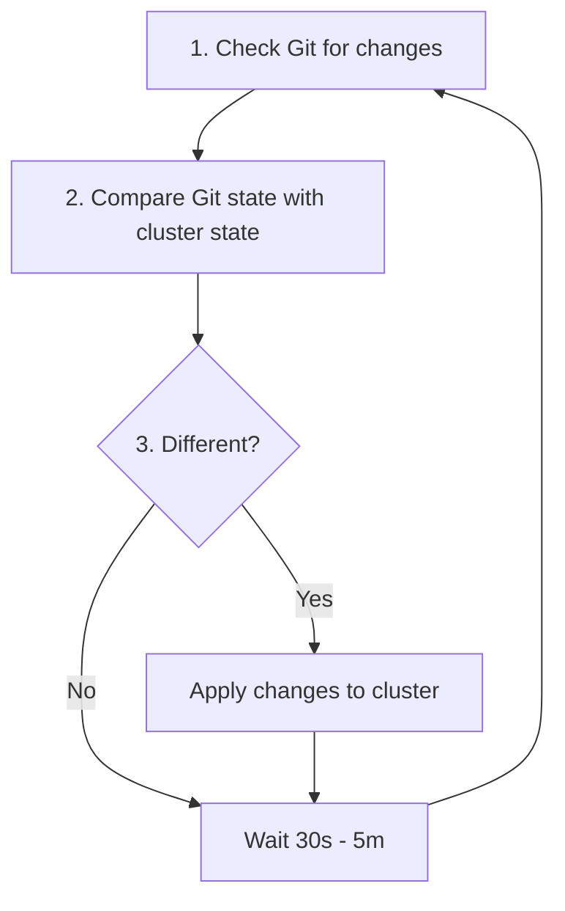
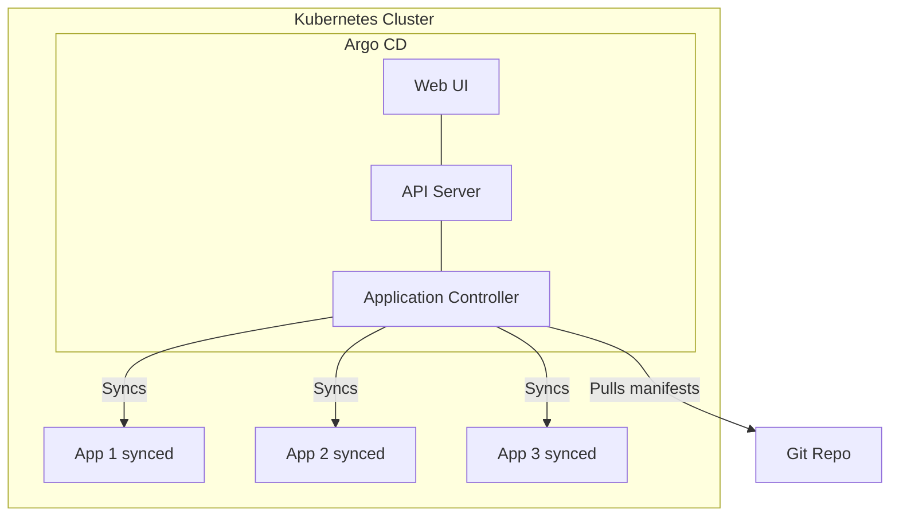
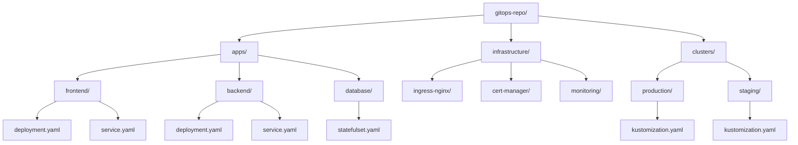
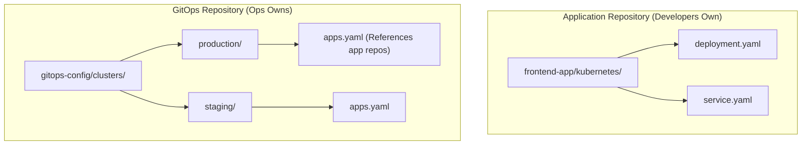
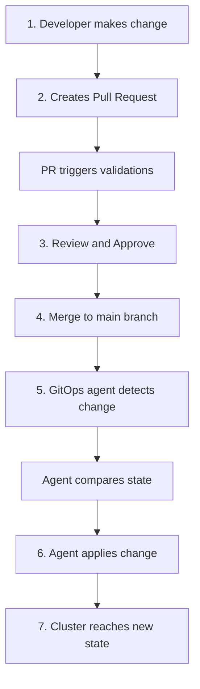
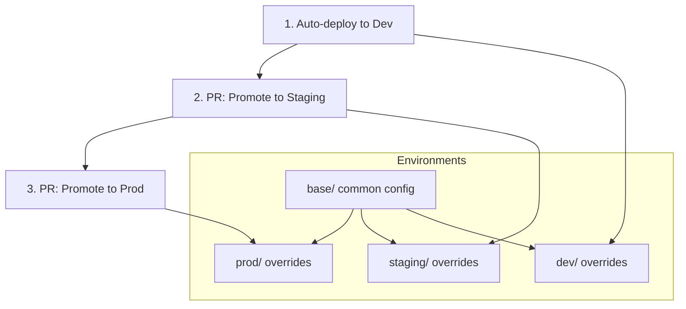

> **Complexity**: `[MEDIUM]` - Key operational pattern
>
> **Time to Complete**: 30-35 minutes
>
> **Prerequisites**: Module 1 (Infrastructure as Code), Git basics

---

## What You'll Be Able to Do

After completing this module, you will be able to:
- **Design** a GitOps repository architecture supporting multi-tenant environments.
- **Diagnose** configuration drift issues by comparing cluster state with the Git source of truth.
- **Evaluate** the security implications of push-based versus pull-based deployment pipelines.
- **Implement** a continuous reconciliation loop using Argo CD or Flux CD patterns.
- **Compare** monorepo and polyrepo infrastructure layouts to determine the optimal structure for scaling teams.

---

## Why This Module Matters

On August 1, 2012, Knight Capital Group, a leading financial services firm, lost $460 million in just 45 minutes, eventually leading to the company's acquisition. The root cause of this catastrophic failure was a deployment error. Technicians had manually deployed new software to seven of their eight production servers but forgot the eighth server. When the system went live, the outdated server repurposed an old configuration flag, executing millions of erratic, highly unprofitable trades. This disaster was not a coding error; it was a configuration and deployment management failure caused by manual, unverified server operations.

GitOps is the cloud-native industry's response to the Knight Capital disaster. By mandating that Git serves as the sole, immutable source of truth for all infrastructure and application states, GitOps completely removes the human element from direct cluster modifications. Changes to infrastructure happen strictly through declarative pull requests, complete with automated testing and rigorous peer review, rather than direct, imperative terminal commands. 

This operational pattern transforms your infrastructure into a deterministic, self-healing system. If an engineer manually tweaks a production server at 3 AM to stop a bleeding incident and forgets to document the change, the GitOps agent will instantly detect the configuration drift and reconcile the cluster back to its declared state in Git. Adopting GitOps is not merely a technical upgrade; it is a fundamental shift in how teams secure, audit, and confidently scale their Kubernetes environments for production workloads on modern clusters (such as Kubernetes v1.35 and beyond).

---

## What is GitOps?

GitOps is an operational framework and a set of best practices that leverages the version control system Git as the single source of truth for declarative infrastructure and applications. At its core, GitOps operates on the following foundational tenets:

1. **Git is the absolute source of truth** for the desired system state.
2. **Changes happen strictly through Git** via commits and formalized pull requests.
3. **Automated agents** continuously sync the actual cluster state to match the Git state.
4. **Configuration drift is automatically corrected** back to the baseline defined in Git.

This represents a massive shift from traditional deployment methodologies. In traditional Continuous Integration and Continuous Deployment (CI/CD) setups, a centralized CI pipeline compiles the code, builds the container image, and then actively "pushes" that image into the Kubernetes cluster using embedded credentials. 

GitOps flips this paradigm on its head by utilizing a "pull-based" model. The cluster itself hosts an intelligent agent that continuously monitors the Git repository. When the agent detects a new commit, it pulls the changes down and applies them internally.

```mermaid
flowchart LR
    subgraph Traditional["Traditional CI/CD (Push-based)"]
        direction LR
        Dev1[Dev] --> Git1[Git]
        Git1 --> CI[CI Pipeline]
        CI -->|Pushes| Cluster1[Cluster]
    end

    subgraph GitOps["GitOps (Pull-based)"]
        direction LR
        Dev2[Dev] --> Git2[Git]
        Git2 <--|Pulls| Agent[GitOps Agent]
        Agent -->|Applies| K8s[Local Kubernetes API]
    end
```

> **Stop and think**: If Git is the single source of truth, what happens to imperative commands like `kubectl scale` or `kubectl edit`? Are they still useful in a GitOps environment?

Now that we understand the high-level concept of pull-based synchronization, let us explore the fundamental principles that make this model function flawlessly in highly dynamic cloud environments.

---

## Security Posture: Why Pull Beats Push

In a traditional push-based pipeline, the CI server (such as Jenkins, GitLab CI, or GitHub Actions) must be granted high-level cluster credentials, often requiring a `kubeconfig` with cluster-admin privileges. This creates a massive security vulnerability. If an attacker successfully breaches the CI server, they instantly gain total control over the entire Kubernetes environment. The CI server becomes a central point of failure and a highly attractive target for malicious actors.

GitOps fundamentally reverses this security dynamic. Instead of granting external tools sweeping access to the internal cluster, the cluster reaches out to the external systems. The GitOps agent operates securely inside the Kubernetes boundary, utilizing internal Kubernetes Role-Based Access Control (RBAC). It requires only read-only access to the external Git repository containing the configuration manifests. The CI server's responsibility ends the exact moment it builds the container image and updates the repository.

Because the cluster pulls its configuration, you never have to expose your Kubernetes API server to the public internet or manage complex firewall rules for external CI tools. The external attack surface is drastically reduced. Furthermore, every single modification to the cluster's state is cryptographically signed and audited via Git commits, providing an unimpeachable record of who changed what, and when.

---

## The Four Principles of GitOps

The Open GitOps working group has formally defined the core principles that classify a system as utilizing GitOps.

### 1. Declarative

Everything deployed to the cluster must be described declaratively. You do not write scripts outlining the steps required to achieve a state; you simply declare the exact state you wish to achieve.

```yaml
# Not "run 3 nginx pods"
# But "desired state is 3 nginx pods"
apiVersion: apps/v1
kind: Deployment
metadata:
  name: web
spec:
  replicas: 3
  # ...
```

By ensuring the configuration is declarative, the underlying Kubernetes controllers can independently determine the optimal sequence of API calls required to transition the current state to the desired state.

### 2. Versioned and Immutable

All changes must go through Git, leveraging its robust versioning capabilities. Git history acts as a permanent, immutable ledger of all infrastructure modifications over time.

```bash
git log --oneline manifests/
a1b2c3d Scale web to 5 replicas
d4e5f6g Add redis cache
g7h8i9j Initial deployment

# Every change is:
# - Versioned (commit hash)
# - Immutable (can't change history)
# - Attributed (who made it)
# - Reviewable (PR history)
```

If an error is introduced, you do not write a new script to undo the damage. You simply revert the specific commit, creating a new deterministic state that restores the cluster to its previously known good configuration.

### 3. Pulled Automatically

Software agents running inside the target environment continuously pull the desired state from the version control system and apply it directly via the local Kubernetes API.



This automated pulling mechanism ensures that the deployment process is entirely decoupled from the continuous integration build process.

### 4. Continuously Reconciled

The software agents continuously observe the actual state of the system and automatically correct any drift back to the desired state stored in Git.

```bash
# Someone manually edits production
kubectl scale deployment web --replicas=10

# GitOps agent detects drift
# Git says 3 replicas, cluster has 10
# Agent corrects: scales back to 3

# Result: Git always wins
```

> **Pause and predict**: Based on the concept of continuous reconciliation, how quickly do you think a GitOps agent will revert a manual, unauthorized change made directly to the cluster?

---

## Continuous Reconciliation Engines

To execute the continuous reconciliation loop inside our clusters, we utilize dedicated GitOps controllers. The two most prominent CNCF-graduated tools in the ecosystem are Argo CD and Flux CD.

### Argo CD

Argo CD is widely considered the most popular GitOps tool for Kubernetes, renowned for its comprehensive visual dashboard and ease of use for multi-tenant enterprise environments.



Argo CD manages deployments using a Custom Resource Definition (CRD) called an `Application`. Here is a worked Argo CD configuration example that securely connects a Git repository to a cluster namespace:

```yaml
# A worked ArgoCD Application example
apiVersion: argoproj.io/v1alpha1
kind: Application
metadata:
  name: frontend-prod
  namespace: argocd
spec:
  project: default
  source:
    repoURL: 'https://github.com/myorg/gitops-config.git'
    path: clusters/production/frontend
    targetRevision: HEAD
  destination:
    server: 'https://kubernetes.default.svc'
    namespace: frontend-prod
  syncPolicy:
    automated:
      prune: true
      selfHeal: true
```

The `selfHeal: true` flag is particularly critical; it instructs Argo CD to automatically overwrite any manual changes made directly to the cluster, strictly enforcing the continuous reconciliation principle.

### Flux CD

Flux CD provides a deeply integrated, CLI-focused GitOps experience. It relies heavily on Kubernetes-native controllers and uses multiple specific CRDs to manage the synchronization process. It requires defining both a `GitRepository` to fetch the source code and a `Kustomization` (or `HelmRelease`) to apply the manifests.

```yaml
# Flux GitRepository
apiVersion: source.toolkit.fluxcd.io/v1
kind: GitRepository
metadata:
  name: my-app
  namespace: flux-system
spec:
  interval: 1m
  url: https://github.com/myorg/my-app
  ref:
    branch: main
```

```yaml
# Flux Kustomization (applies manifests)
apiVersion: kustomize.toolkit.fluxcd.io/v1
kind: Kustomization
metadata:
  name: my-app
  namespace: flux-system
spec:
  interval: 5m
  path: ./kubernetes
  prune: true
  sourceRef:
    kind: GitRepository
    name: my-app
```

### Comparison

Both tools are exceptional and possess graduated status within the Cloud Native Computing Foundation. The choice typically depends on organizational preferences regarding user interfaces versus pure declarative terminal workflows.

| Feature | Argo CD | Flux CD |
|---------|---------|---------|
| UI | Beautiful web dashboard | CLI-focused |
| Multi-tenancy | Built-in | Via namespaces |
| RBAC | Comprehensive | Kubernetes-native |
| Helm support | First-class | Via controllers |
| Learning curve | Moderate | Steeper |
| CNCF status | Graduated | Graduated |

Before fully committing to these tools, it is crucial to understand that shifting to a pull-based model introduces architectural decisions that require careful planning.

---

## The GitOps Trade-offs

While GitOps resolves critical auditing and consistency issues, it introduces its own set of operational challenges:

- **Pros**: It provides a complete, irrefutable audit trail via Git history. Rollbacks become as simple as executing `git revert`. Security is massively enhanced because external CI systems do not need direct cluster credentials. Disaster recovery becomes a trivial exercise of pointing a fresh cluster at the existing Git repository.
- **Cons**: The "Git commit" becomes the bottleneck for every minor operational change. Dealing with sensitive data requires implementing additional tooling (like SealedSecrets or External Secrets Operator) since storing plaintext passwords in Git is a critical security violation. Furthermore, templating complex, multi-region environments can lead to massive "YAML sprawl" if directory structures are not managed carefully.

To mitigate the disadvantages and maximize the benefits, you must thoughtfully design the organization of your Git repositories.

---

## Repository Structure Strategies

Deciding where your infrastructure manifests live in relation to your application source code is one of the most important decisions when adopting GitOps.

### Monorepo (Everything Together)

In a Monorepo setup, all application manifests, infrastructure configurations, and cluster-wide definitions reside in a single centralized repository.



**Monorepo Advantages:**
- **Single Pane of Glass**: Engineers can view the entire cluster state by browsing a single repository.
- **Cross-cutting Changes**: Updating a shared library or base configuration across all applications requires only a single pull request.

**Monorepo Disadvantages:**
- **High Noise**: The repository can become extremely active, leading to merge conflicts and overwhelming pull request notification traffic.
- **Complex Access Control**: Securing who can modify production infrastructure versus staging application code requires sophisticated repository permission tooling (like CODEOWNERS files).

> **Pause and predict**: If you choose a Monorepo strategy, how might you restrict developers from accidentally modifying the production environment manifests while still allowing them to update their application code?

### Polyrepo (Separate Repos)

In a Polyrepo structure, application teams maintain their deployment manifests in their own application repositories, while the operations team maintains a dedicated GitOps repository that references the application repositories.



**Polyrepo Advantages:**
- **Clear Boundaries**: Development teams retain ownership of their application manifests without touching core infrastructure.
- **Reduced Blast Radius**: An error in one application repository cannot easily compromise global cluster configurations.
- **Fine-grained RBAC**: Access control is naturally handled by granting repository access only to the appropriate teams.

**Polyrepo Disadvantages:**
- **Fragmented Visibility**: It is difficult to assess the exact total state of the cluster without querying the GitOps tool directly.
- **Duplication**: Shared base configurations must often be duplicated across multiple application repositories.

For enterprise environments, the Polyrepo approach is generally recommended to prevent infinite CI/CD loops and enforce strict security boundaries.

---

## GitOps Workflow

Once the repository architecture is established, the day-to-day workflow for engineers becomes highly standardized and predictable. Every operation is initiated via a Pull Request.



This workflow ensures that linting, security scanning, and peer reviews are mandatorily enforced before any configuration can impact the live cluster.

---

## Image Update Automation

A common criticism of strict GitOps is that updating a container image tag requires a manual Git commit, which slows down rapid continuous deployment. Modern GitOps tools resolve this by providing automated image updating capabilities. These controllers monitor remote container registries for new image tags and automatically write a commit back to the Git repository.

```yaml
# Argo CD Image Updater annotation
metadata:
  annotations:
    argocd-image-updater.argoproj.io/image-list: myapp=myrepo/myapp
    argocd-image-updater.argoproj.io/myapp.update-strategy: semver

# Flux Image Automation
apiVersion: image.toolkit.fluxcd.io/v1beta1
kind: ImageUpdateAutomation
metadata:
  name: flux-system
spec:
  interval: 1m
  sourceRef:
    kind: GitRepository
    name: flux-system
  git:
    checkout:
      ref:
        branch: main
    commit:
      author:
        email: fluxcdbot@users.noreply.github.com
        name: fluxcdbot
      messageTemplate: 'Update image to {{.NewTag}}'
    push:
      branch: main
```

**The Automated Update Flow:**
1. The CI pipeline builds a new application image, for example: `myapp:v1.2.3`.
2. The CI pipeline pushes this image to the remote container registry.
3. The GitOps image automation controller detects the new semantic version tag in the registry.
4. The controller automatically updates the deployment manifest and pushes a new commit directly to the Git repository.
5. The core GitOps agent detects the new commit and syncs the cluster to run the new image.

This achieves fully automated deployment while maintaining a perfect, cryptographically signed audit trail in Git!

---

## Environment Promotion

Managing configurations across multiple environments (Development, Staging, Production) requires a structured promotion methodology. Using tools like Kustomize allows teams to define a base configuration and apply specific environmental overlays.



Changes are first merged into the development branch. To promote the software to staging, an engineer opens a pull request merging the changes from development to staging. This creates a highly visible, auditable gate for environment promotion.

---

## Rollback with GitOps

In a severe incident, time to recovery is critical. Because the cluster state is strictly bound to the Git history, rollback operations are performed using native Git commands rather than complex Kubernetes imperative commands.

```bash
# Production has a bug!

# Option 1: Revert the commit
git revert abc123
git push

# GitOps agent syncs: old version restored
# Time to rollback: < 5 minutes

# Option 2: Use Argo CD UI
# Click "Rollback" on the application
# Argo reverts to previous sync state

# All rollbacks are tracked in Git history
git log --oneline
def456 Revert "Deploy v1.2.3"  # ← Rollback recorded
abc123 Deploy v1.2.3           # ← Bad deployment
```

When you use `git revert`, you generate a new forward-moving commit that reverses the previous changes. This ensures that the rollback itself is audited, approved, and permanently recorded in the system's history.

---

## Did You Know?

- **The term "GitOps" was coined by Weaveworks** in August 2017 in a comprehensive blog post detailing their internal Kubernetes management practices.
- **The Open GitOps working group** officially defined the four core principles of GitOps in version 1.0.0 of their standard, released on October 21, 2021.
- **Argo CD was originally created by Intuit** in 2018 and has since been adopted by over 250 enterprise organizations, successfully managing thousands of production clusters globally.
- **Organizations implementing strict GitOps workflows** report up to a 75 percent reduction in Mean Time To Recovery (MTTR) during major incidents, as rollbacks often take less than two minutes to execute.

---

## Common Mistakes

| Mistake | Why It Hurts | Solution |
|---------|--------------|----------|
| Manual `kubectl` in production | Bypasses the audit trail and causes configuration drift that gets overwritten. | Restrict cluster access; force all changes through the Git repository. |
| Storing raw secrets in Git | Exposes sensitive API keys and passwords to anyone with repository access. | Implement SealedSecrets, SOPS, or an External Secrets Operator. |
| Missing PR review process | Allows destructive or untested changes to automatically sync to production. | Enforce branch protection rules requiring at least one peer approval. |
| Syncing too frequently | Overloads the Kubernetes API server and causes unnecessary network traffic. | Configure the sync interval to a reasonable timeframe (e.g., 3-5 minutes). |
| Missing health checks | Allows broken deployments to remain running while the sync status shows "Healthy". | Configure proper readiness and liveness probes in your manifests. |
| Putting CI and CD in one repo | Causes infinite loops where CD updates trigger CI pipelines endlessly. | Separate your application code repository from your GitOps manifest repository. |
| Ignoring drift alerts | Leads to a false sense of security where the cluster diverges from Git without notice. | Configure Slack or email notifications for any ArgoCD or Flux "OutOfSync" events. |

---

## Quiz

1. **Scenario**: A critical vulnerability is discovered in your web application at 3 AM. The on-call engineer logs into the cluster and uses `kubectl set image` to immediately deploy a patched container. Ten minutes later, the vulnerability is back. What happened?
   <details>
   <summary>Answer</summary>
   The GitOps agent detected configuration drift between the live cluster state and the Git repository. Because the manual imperative change was not recorded in Git, the agent assumed the cluster was in an incorrect, drifted state. It automatically executed a reconciliation loop to force the cluster back to the vulnerable image version explicitly specified in the repository. To fix this properly and permanently, the engineer must update the image tag declaratively in the Git repository, allowing the agent to pull the new state.
   </details>

2. **Scenario**: Your team decides to adopt GitOps and removes cluster administrator credentials from your Jenkins CI server. The security team asks how Jenkins will deploy the new application builds without these credentials. How should you explain the new deployment flow?
   <details>
   <summary>Answer</summary>
   In a GitOps model, the Jenkins CI server no longer pushes changes directly into the Kubernetes cluster. Instead, the CI pipeline's final responsibility is to build the container image, push it to a registry, and commit the new image tag to the Git configuration repository. A GitOps agent running securely inside the cluster continuously monitors this repository for new commits. When the agent detects the new commit, it pulls the updated manifests and applies them locally using its internal ServiceAccount, completely eliminating the need for external systems to hold cluster credentials.
   </details>

3. **Scenario**: The latest release of your payment microservice contains a bug that is double-charging customers. You need to revert the system to the exact state it was in one hour ago as quickly as possible. How do you accomplish this in a pure GitOps environment?
   <details>
   <summary>Answer</summary>
   You execute a `git revert` command on the specific commit that introduced the broken payment service manifests, and push that reversion to the main branch. The GitOps agent will immediately detect this new forward-moving commit and reconcile the cluster state to match the previous, stable configuration. Because Git history is immutable, this process provides a perfectly documented audit trail of both the failure and the rollback action. This approach guarantees that your version control system remains the undisputed source of truth for the entire incident, avoiding untracked manual interventions.
   </details>

4. **Scenario**: You are designing the repository structure for a large enterprise with 50 microservices. The lead developer suggests keeping all Kubernetes manifests in the same repository as the application source code. What specific GitOps operational problem will this likely cause?
   <details>
   <summary>Answer</summary>
   Mixing application code and GitOps manifests in a single repository often triggers infinite CI/CD loops. When the CI pipeline builds a new image and updates the manifest in the repository, that new commit will re-trigger the CI pipeline, which builds another image, updates the manifest again, and so on. Additionally, this structure makes it very difficult to manage multi-environment configurations without massive duplication and complex branch management. To avoid this cascading failure, teams should use a polyrepo structure with separate repositories for application source code and infrastructure manifests.
   </details>

5. **Scenario**: Your compliance department requires a complete audit log of who made changes to the production database configuration, when the changes were made, and who approved them. How does a pull-based GitOps model satisfy this requirement inherently?
   <details>
   <summary>Answer</summary>
   Because Git serves as the single source of truth for the cluster, the `git log` acts as the definitive, cryptographically verifiable audit trail for all infrastructure changes. Every modification is inherently tied to a specific developer's commit signature and a precise timestamp. Furthermore, by enforcing Pull Requests and branch protection rules in your Git hosting platform, you automatically generate an immutable record of peer reviews and approvals before any change is allowed to sync to the cluster. This native Git workflow completely eliminates the need for external change management boards or manual logging tools.
   </details>

6. **Scenario**: A developer complains that their new deployment isn't showing up in the cluster, even though Argo CD shows a green "Synced" status. When you inspect the cluster, the newly created Pods are crashing in a CrashLoopBackOff state. Why didn't GitOps prevent this broken deployment?
   <details>
   <summary>Answer</summary>
   GitOps tools ensure that the requested resources are successfully applied to the Kubernetes API, which is what the "Synced" status indicates. However, they rely entirely on native Kubernetes health probes to determine actual application runtime health. If the developer failed to configure proper readiness and liveness checks in their deployment manifests, the GitOps agent assumes the application is healthy as long as the Kubernetes API accepts the resource definitions. You must strictly enforce proper probe configurations so the GitOps agent can accurately report a "Degraded" health status and halt further rollout progression.
   </details>

7. **Scenario**: You have an application deployed to a `staging` namespace and a `production` namespace. You want to update the staging environment with a new experimental configuration without affecting production. How do you structure this change safely in your GitOps repository?
   <details>
   <summary>Answer</summary>
   You should utilize a templating tool like Kustomize or Helm within your GitOps repository to cleanly separate base configurations from environment-specific overrides. You would commit the new experimental configuration strictly to the staging environment's overlay folder, leaving the production configuration files completely untouched. The GitOps agent managing the staging environment will pull this specific path and apply the localized updates. Meanwhile, the production agent remains unaffected because its source path has not changed, ensuring safe environment isolation and preventing accidental cross-contamination.
   </details>

---

## Hands-On Exercise

In this exercise, you will manually simulate the exact behavior of a GitOps agent. Instead of installing Argo CD or Flux, you will act as the continuous reconciliation controller to understand the underlying mechanics of drift detection and correction.

Below is the complete simulation script for reference.

```bash
# This simulates GitOps behavior manually
# In real GitOps, an agent does this automatically

# 1. Create a "Git repo" (directory)
mkdir -p ~/gitops-demo/manifests
cd ~/gitops-demo

# 2. Create initial desired state
cat << 'EOF' > manifests/deployment.yaml
apiVersion: apps/v1
kind: Deployment
metadata:
  name: gitops-demo
spec:
  replicas: 2
  selector:
    matchLabels:
      app: gitops-demo
  template:
    metadata:
      labels:
        app: gitops-demo
    spec:
      containers:
      - name: nginx
        image: nginx:1.27
EOF

# 3. Apply (simulate GitOps sync)
kubectl apply -f manifests/

# 4. Verify
kubectl get deployment gitops-demo

# 5. Simulate drift (manual change)
kubectl scale deployment gitops-demo --replicas=5

# 6. Check drift
kubectl get deployment gitops-demo
# Shows 5 replicas

# 7. Reconcile (simulate GitOps correction)
kubectl apply -f manifests/
# Back to 2 replicas!

# 8. Make a "Git change"
sed -i '' 's/nginx:1.27/nginx:1.28/' manifests/deployment.yaml

# 9. Apply new state (simulate GitOps sync)
kubectl apply -f manifests/

# 10. Verify update
kubectl get deployment gitops-demo -o jsonpath='{.spec.template.spec.containers[0].image}'
# Shows nginx:1.28

# 11. Cleanup
kubectl delete -f manifests/
rm -rf ~/gitops-demo
```

### Progressive Tasks

Follow these tasks to systematically execute the simulation logic outlined in the script.

**Task 1: Establish the Baseline**
Create your local directory to act as the simulated Git repository, and generate the initial declarative `deployment.yaml` for an Nginx application specifying exactly 2 replicas.
<details>
<summary>Solution</summary>

Execute steps 1 and 2 from the script above. This establishes your local directory as the undisputed source of truth for the upcoming cluster operations.
</details>

**Task 2: Execute the Initial Pull**
Act as the GitOps agent by applying the manifests to the cluster. Verify the actual cluster state perfectly matches your declared state.
<details>
<summary>Solution</summary>

Execute steps 3 and 4. You are manually fulfilling the role of the automated agent, bridging the gap between the declared source files and the live Kubernetes API.
</details>

**Task 3: Induce Configuration Drift**
Simulate an unauthorized, late-night production intervention by manually overriding the deployment scale using an imperative command. Observe that the cluster now violently disagrees with your source of truth.
<details>
<summary>Solution</summary>

Execute steps 5 and 6. By running `kubectl scale`, you bypass the declarative process. The cluster now reports 5 replicas, while your file strictly demands 2.
</details>

**Task 4: Enforce Continuous Reconciliation**
Act as the GitOps agent performing its routine interval check. Re-apply the manifest repository to forcefully correct the configuration drift.
<details>
<summary>Solution</summary>

Execute step 7. Re-running the apply command overwrites the manual scale operation. The GitOps rule is absolute: Git always wins. The replicas return to 2.
</details>

**Task 5: Execute a Declarative Update**
Simulate an approved Pull Request by manually editing the source file to bump the image version. Finally, act as the agent one last time to sync this approved change into the live cluster.
<details>
<summary>Solution</summary>

Execute steps 8, 9, 10, and 11. By using `sed` (or a text editor), you update the canonical source of truth. Applying this new file gracefully rolls out the updated container image.
</details>

### Success Criteria Checklist
- [ ] You successfully created a simulated Git repository directory and an initial deployment manifest.
- [ ] You applied the initial state and manually verified the correct number of replicas via the Kubernetes API.
- [ ] You utilized an imperative scaling command to intentionally simulate dangerous configuration drift.
- [ ] You successfully reconciled the cluster back to the Git state, observing the replicas immediately return to the desired count of 2.
- [ ] You updated the image version strictly within your simulated Git repository and applied it to observe the change take effect correctly.
- [ ] You cleaned up the temporary resources.

---

## Summary

**GitOps** is the definitive operational model for securing and scaling modern Kubernetes deployments. It systematically removes manual interventions, ensuring predictable infrastructure behavior.

**Core principles**:
- Git is the undisputed, singular source of truth.
- Changes must be executed through approved pull requests.
- Agents automate the synchronization process to the cluster.
- Drift is identified and automatically corrected without human intervention.

**Primary Tools**:
- **Argo CD**: Offers a full-featured, visually rich operational dashboard designed for complex multi-tenant environments.
- **Flux CD**: A CNCF-graduated, Kubernetes-native solution deeply integrated with the command line interface and Git operators.

**Critical Benefits**:
- **Full audit trail**: Every action is cryptographically tied to a Git commit signature.
- **Immediate rollback**: Disaster recovery is achieved rapidly via `git revert`.
- **Enhanced security**: The attack surface is minimized because external CI tools never access the cluster directly.
- **Self-documenting infrastructure**: The repository structure itself acts as comprehensive system documentation.

**Key Insight**: In a mature GitOps organization, an engineer never executes `kubectl apply` against a production cluster. You commit to Git, and the agent securely orchestrates the reality.

---

## Next Module

[Module 1.3: CI/CD Pipelines](../module-1.3-cicd-pipelines/) - Master the art of automating your application builds, defining robust testing suites, and seamlessly integrating your artifacts into GitOps deployment streams.