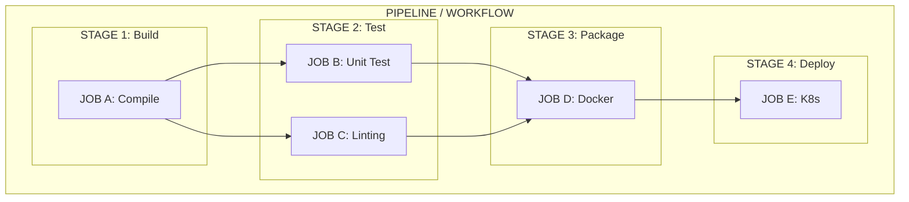
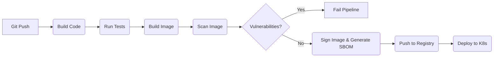

# Module 1.3: CI/CD Pipelines

**Complexity:** [MEDIUM]  
**Time to Complete:** 45-60 minutes  
**Prerequisites:** [Module 1.1: Infrastructure as Code](/prerequisites/modern-devops/module-1.1-infrastructure-as-code/), basic Git knowledge  

## Learning Outcomes

By the end of this module, you will be able to:
- Differentiate between Continuous Integration, Continuous Delivery, and Continuous Deployment by analyzing real-world deployment scenarios.
- Architect a multi-stage container-native pipeline incorporating build, test, vulnerability scanning, and deployment stages.
- Evaluate the architectural trade-offs between GitHub Actions, GitLab CI, Jenkins, and Tekton for Kubernetes-native workflows.
- Compare and implement progressive deployment strategies (rolling updates, blue-green, canary, shadow) using pipeline orchestration.
- Differentiate between traditional Push-based CD and modern Pull-based GitOps (ArgoCD/Flux).
- Troubleshoot failed pipelines by diagnosing common anti-patterns such as ignored flaky tests, snowflake build agents, or hardcoded secrets.
- Optimize pipeline performance using dependency caching and parallel job execution.

## Why This Module Matters

### War Story: The 45-Minute Bankruptcy
In 2012, Knight Capital Group deployed a new software update to their high-frequency trading servers. The deployment process was highly manual, poorly documented, and completely lacked automated testing or verification. An engineer simply forgot to copy the new code to one of the eight load-balanced servers. When the market opened, the outdated server began executing a dormant, flawed testing algorithm that bought high and sold low. In just 45 minutes, Knight Capital lost $460 million and was forced into bankruptcy. This incident remains the starkest, most terrifying reminder of why manual, undocumented deployments are a catastrophic risk at scale. Human beings are terrible at performing repetitive, precise tasks consistently. Machines excel at it.

### War Story: The Supply Chain Compromise
In 2020, sophisticated attackers compromised the build environment of SolarWinds, injecting malicious code into the Orion software update before it was digitally signed and shipped to thousands of government and enterprise customers. This wasn't a vulnerability in the application code written by developers; it was a compromise of the *delivery mechanism itself*. It highlights why securing the pipeline (the software factory) is just as critical as securing the application. A pipeline must not only be automated, but cryptographically verifiable and locked down.

### Analogy: The Automated Assembly Line
In 1913, Henry Ford revolutionized manufacturing with the moving assembly line. Before this, cars were built one at a time by highly skilled craftsmen—a slow, error-prone, and unscalable process. Manual software deployment (SSHing into a server, pulling code, running build scripts by hand) is the digital equivalent of artisanal car manufacturing. CI/CD is the modern assembly line for code. Raw materials (source code) enter the factory, pass through automated quality checks, are assembled into parts (binaries/images), and roll off the line ready for the consumer.

Modern software delivery relies on these automated pipelines to remove human error, enforce strict quality gates, and exponentially accelerate feedback loops. A pipeline is not merely a script that runs commands; it is the codified, executable definition of your engineering culture. If your tests are flaky and ignored, your pipeline will be ignored. If your security scans are manual and happen right before release, your pipeline provides a false sense of security. 

In a cloud-native ecosystem, CI/CD is the essential bridge between developers committing code and users experiencing value. Understanding how to build, secure, and operate these pipelines is non-negotiable for anyone working with Kubernetes, as the orchestrator itself assumes applications will be delivered automatically, consistently, and securely.

## Core Concepts: CI vs. CD vs. CD

The acronym "CI/CD" is often used interchangeably, but it actually represents three distinct, progressive phases of software delivery maturity. Understanding the exact boundaries between them is crucial for designing effective, safe pipelines.

### Continuous Integration (CI)

Continuous Integration is the foundational practice of merging all developers' working copies to a shared mainline (branch) several times a day. Its primary goal is to prevent **"Integration Hell."** 

*Integration Hell* is the dreaded scenario where developers work in isolated feature branches for weeks or months, only to spend an entire weekend resolving massive, complex Git merge conflicts before a release. By the time the code is merged, nobody remembers exactly how it all works together, and bugs multiply exponentially.

When a developer pushes code to a branch or opens a Pull Request, the CI server automatically:
1. Fetches the code from the repository.
2. Compiles or builds the application (catching syntax errors immediately).
3. Runs unit tests and integration tests to verify business logic.
4. Performs static code analysis (linting) to enforce style guides.
5. Runs security scans (SAST - Static Application Security Testing) to catch hardcoded secrets or known insecure coding patterns.

**The Golden Rule of CI:** If the build fails on the mainline branch, the team drops what they are doing to fix it. The mainline branch must always be in a deployable state. It relies on the "broken window theory" of software: if the build is allowed to stay broken, developers will lose trust in it, ignore the red X marks, and stop caring about test failures.

### Continuous Delivery (CD)

Continuous Delivery extends Continuous Integration by ensuring that the software can be released to production at any given time. It's about being technically *ready* to deploy on demand, even if the business chooses not to deploy immediately.

In a Continuous Delivery workflow:
1. The CI pipeline completes and produces a validated, versioned, immutable artifact (e.g., a tagged Docker image).
2. The artifact is automatically deployed to a staging environment that identically mirrors the production environment.
3. Acceptance tests, performance tests, and end-to-end tests are executed automatically against the live staging service.
4. The final deployment to the production cluster is triggered by a **manual business decision** (a human clicking a "Deploy" or "Approve" button). This allows product managers, marketing, or compliance teams to control the exact release timing to align with press releases or maintenance windows.

### Continuous Deployment (CD)

Continuous Deployment is the ultimate automation goal. It removes the human element entirely from the release process.

In a Continuous Deployment workflow:
1. Every single code change that passes all stages of the CI and staging pipelines is automatically deployed directly to production.
2. There are absolutely no manual approval gates. No "Release Managers" or "Change Advisory Boards."
3. This requires immense, absolute trust in your automated testing suite, robust observability (monitoring and alerting), and rapid, automated rollback mechanisms. Companies like Netflix, Amazon, and Etsy deploy thousands of times a day using this model. A developer merges a pull request, goes to get a coffee, and by the time they return, their code is serving live customer traffic.

### Active Learning Prompt

> **Scenario A:** A developer merges code to `main`. The code compiles, tests run, and a Docker image is built and pushed to a container registry. The pipeline stops. On Friday evening, the Ops team manually pulls that specific image tag and applies it to the Kubernetes cluster using `kubectl set image`.
>
> **Scenario B:** A developer merges code. Tests run, an image is built, and the pipeline automatically deploys it to the QA environment. A QA engineer reviews the staging environment and clicks "Approve" in GitHub Actions. The pipeline then automatically continues, deploying the image to the Production cluster.
>
> **Questions:**
> 1. Which phase of CI/CD does Scenario A satisfy?
> 2. Is Scenario B practicing Continuous Delivery or Continuous Deployment?
>
> <details>
> <summary>Click for the answers</summary>
> 1. **Continuous Integration (CI) only.** The artifact is successfully built, tested, and integrated, but the deployment process is entirely manual and disjointed from the automated pipeline.
> 2. **Continuous Delivery.** The presence of the QA engineer's manual "Approve" click before the final production deployment distinguishes it from Continuous Deployment, which would flow all the way to production automatically without human intervention.
> </details>

## Anatomy of a Pipeline

Pipelines are structured hierarchically. While different tools (Jenkins, GitHub Actions, GitLab CI, CircleCI) use slightly different terminology, the underlying mental model remains identical across the industry.

### Analogy: The Restaurant Kitchen
Think of a pipeline like a high-end commercial kitchen during dinner service:
- **Pipeline / Workflow:** The entire dinner service from open to close. The overarching process.
- **Stage:** The course of the meal (Appetizers, Mains, Desserts). You cannot serve the Main stage until the Appetizer stage is fully complete and successful. Stages enforce order.
- **Job:** Different stations in the kitchen. The Grill station and the Fry station can work on different parts of the Appetizer stage at the exact same time (Parallel execution). Jobs run on separate workers (runners) and are isolated.
- **Step:** The specific actions a chef takes. Chop onions, season meat, sear in pan. These must happen in strict sequential order within a Job.
- **Artifact:** The completed, plated dish passed to the waiter to be delivered to the customer (or passed to the next Stage).



1. **Pipeline/Workflow:** The overarching process triggered by an event (e.g., a push to the `main` branch, a pull request creation, or a nightly cron schedule).
2. **Stages:** Logical groupings of jobs that run sequentially. The `Deploy` stage won't start until the `Test` stage succeeds.
3. **Jobs:** A collection of steps that execute on the same runner (virtual machine or container). Jobs within the same stage can run in parallel (e.g., `JOB B` and `JOB C` above) to vastly speed up execution time.
4. **Steps:** Individual tasks within a job. These are executed sequentially. A step can be a simple shell command (like `npm install`) or a complex, predefined, reusable action block.
5. **Artifacts:** Files or data produced by a job that are saved and passed to subsequent jobs or stages (e.g., a compiled binary, a test coverage HTML report, or a Docker image tarball).

### Pipeline-as-Code

Modern pipelines are defined as code (usually YAML) and live directly alongside the application source code in the same Git repository. This practice ensures that the deployment process is version-controlled, auditable, and subject to the exact same Pull Request review process as the application logic. 

**Why does this matter?** If a developer introduces a new microservice that requires a new testing step, they update the pipeline YAML in the exact same Pull Request as the code itself. If you rollback your application code to a version from a month ago, you automatically rollback the pipeline definition to how it existed a month ago, ensuring it builds correctly.

Common locations for pipeline definitions:
- **GitHub Actions:** `.github/workflows/main.yml`
- **GitLab CI:** `.gitlab-ci.yml`
- **Jenkins:** `Jenkinsfile` (often written in Groovy)
- **Tekton:** Kubernetes Custom Resource Definitions (CRDs) like `PipelineRun` and `TaskRun`

## Infrastructure as Code (IaC) Integration

Pipelines aren't just for application code; they are also the primary mechanism for deploying Infrastructure as Code (IaC) tools like Terraform, Pulumi, or AWS CloudFormation. 

### The GitOps vs. traditional CI/CD divide for IaC
When deploying infrastructure, you generally have two choices:
1. **CI/CD Driven (Terraform inside GitHub Actions):** The pipeline runs `terraform plan` to show you what will change, and after manual approval, runs `terraform apply`. The CI server itself executes the infrastructure changes.
2. **GitOps Driven (Crossplane or ACK):** The pipeline merely generates Kubernetes manifests that describe your desired AWS/GCP infrastructure, and GitOps tools (like ArgoCD) apply them to the cluster. The cluster itself provisions the external cloud resources.

> **Pause and predict**: If a developer updates a Terraform file to add a new AWS S3 bucket, at what exact stage in the CI/CD pipeline should the cost estimation tool run to be most effective?

### IaC Pipeline Best Practices
If you are running IaC like Terraform inside your pipelines, you must enforce specific quality gates:
- **`terraform fmt -check`:** Automatically fail the build if the infrastructure code is not formatted correctly. This prevents messy pull requests.
- **`terraform validate`:** Catch syntax errors immediately before wasting time attempting to plan against the cloud provider's API.
- **`tflint`:** A static analysis tool that enforces best practices (e.g., ensuring you attached specific required tags to an AWS EC2 instance).
- **Cost Estimation:** Tools like `Infracost` can be integrated directly into your Pull Request pipeline. When a developer adds a new database to the Terraform code, the pipeline automatically comments on the PR with a message like: *"This change will increase your AWS bill by $140/month."* This provides developers with immediate financial feedback before resources are ever provisioned.
- **Security Scanning (tfsec):** Similar to scanning Docker images, tools like `tfsec` or `checkov` scan your Terraform code *before* it runs to ensure you aren't doing things like creating an S3 bucket that is completely open to the public internet.

## Container-Native CI/CD & Security

When deploying to Kubernetes, your CI/CD pipeline must be absolutely container-native. The ultimate artifact of your build process is no longer a `.jar` file, an `.exe`, or a static binary; it is a Docker container image. 

A typical container-native pipeline integrates security tightly into the workflow, shifting security "left" (earlier) in the development process rather than treating it as an afterthought before release.



### The Software Supply Chain and SBOMs

In physical manufacturing, companies maintain a "Bill of Materials"—a comprehensive list of every nut, bolt, microchip, and wire that goes into a product. If a specific brand of airbag is recalled by a supplier, the car manufacturer can query their Bill of Materials and know exactly which car models contain the defective part.

Software has the exact same concept: the **SBOM (Software Bill of Materials)**. A modern, mature CI/CD pipeline generates an SBOM alongside the Docker image. It exhaustively lists every open-source library, operating system package, and transitive dependency included in your container. Tools like **Syft** can generate this in your pipeline in seconds. If a massive zero-day vulnerability (like Log4j) hits the news, you don't need to guess if your hundreds of microservices are vulnerable; you simply query your central repository of SBOMs to find out instantly.

### SLSA Framework

The industry standard for securing pipelines is **SLSA (Supply-chain Levels for Software Artifacts)**. It provides a maturity model to prevent tampering.
- **Level 1:** You have a build process that is fully automated and generates provenance (data about how it was built).
- **Level 2:** The build service must be hosted, and provenance must be authenticated.
- **Level 3:** The build environment must be ephemeral (created fresh for each build) and isolated, preventing cross-contamination.
- **Level 4:** Requires a two-person review for all changes, and a hermetic (completely isolated from the internet) build process.

### Vulnerability Scanning

Once unit and integration tests pass, the pipeline builds the container image. Before pushing this image to a container registry (like Docker Hub, Amazon ECR, or Google GCR), it is hyper-critical to scan it for known vulnerabilities (CVEs). 

If a critical vulnerability is found in the base image (e.g., using an outdated, vulnerable version of Debian) or in the application dependencies (e.g., an old version of React with XSS flaws), the pipeline should fail immediately, returning a non-zero exit code. This prevents the insecure image from ever reaching the registry, let alone production.

| Security Tool | Primary Use Case | Open Source? | Notes |
| :--- | :--- | :--- | :--- |
| **Trivy** (Aqua) | Comprehensive Container & Repo scanning | Yes | Incredibly fast. Scans OS packages, language dependencies, and Infrastructure as Code (Terraform). The gold standard for easy CI integration. |
| **Grype** (Anchore) | Vulnerability scanning for containers | Yes | Often paired directly with Syft (for SBOM generation). Excellent accuracy and deep inspection. |
| **Snyk** | Developer-focused security platform | Freemium | Deep IDE integration, provides automated fix pull requests to developers before they even commit code. |
| **Kube-linter** | IaC / Kubernetes Manifest scanning | Yes | Checks Kubernetes YAML manifests for security misconfigurations (e.g., running containers as root, missing resource limits) *before* deployment. |

### Signing Images

To ensure software supply chain security and prevent tampering, images should be cryptographically signed. Tools like **Cosign** (part of the Linux Foundation's Sigstore project) allow the pipeline to attach a digital signature to the image. When Kubernetes attempts to pull the image from the registry, an admission controller (like Kyverno or OPA Gatekeeper) verifying the signature intercepts the request. If the image was tampered with by a malicious actor after the pipeline built it, Kubernetes will aggressively reject it and refuse to run the Pod.

## Tool Comparison Deep-Dive

The CI/CD tooling landscape is vast, confusing, and highly competitive. Choosing the right tool depends heavily on your existing infrastructure, team expertise, security requirements, and whether you prefer managed SaaS or self-hosted control.

| Feature | GitHub Actions | GitLab CI | Jenkins | Tekton |
| :--- | :--- | :--- | :--- | :--- |
| **Architecture** | SaaS / Self-hosted runners | SaaS / Self-hosted runners | Master-Worker architecture | Kubernetes-native (CRDs) |
| **Configuration** | YAML (`.github/workflows`) | YAML (`.gitlab-ci.yml`) | Groovy (`Jenkinsfile`) | YAML (K8s Manifests) |
| **Strengths** | Massive ecosystem of pre-built community actions, tightest possible GitHub integration. Very low barrier to entry. | Excellent all-in-one platform (code, registry, CI/CD, issue tracking), robust environment dashboard. | Unmatched flexibility, thousands of plugins, handles legacy systems and custom physical hardware exceptionally well. | Runs natively inside K8s, highly scalable, stateless, standardized execution via Pods. Designed for platform engineers. |
| **Weaknesses** | Debugging complex workflows locally is difficult (requires community tools like `act`). | Best experience requires using GitLab as your Git repository host as well. | "Plugin hell", requires significant, painful ongoing maintenance, not inherently cloud-native. | Extremely steep learning curve, very verbose YAML, total overkill for simple static site projects. |
| **Best For** | Open-source projects, teams already locked into the GitHub ecosystem. | Enterprises wanting a cohesive, single-pane-of-glass DevOps platform. | Complex legacy builds, large monoliths, teams with deep Groovy expertise and dedicated Jenkins admins. | Kubernetes-heavy platform engineering teams wanting infrastructure-as-code for CI. |

### Active Learning Prompt

> **Scenario:** You are joining a rapidly growing AI startup that uses Kubernetes exclusively. They have no legacy applications (no mainframes or ancient VMs). They want their CI/CD pipelines to run directly inside their Kubernetes clusters, utilizing the cluster's native autoscaling capabilities to handle massive bursts of build jobs dynamically during the day, and scale to zero at night to save costs. They want everything, including the pipeline definitions, defined strictly as Kubernetes Custom Resources to integrate seamlessly with their GitOps tools (like ArgoCD).
>
> **Question:** Which CI/CD tool from the table above would be the most architecturally aligned with these specific requirements, and why?
>
> <details>
> <summary>Click for the answer</summary>
> **Tekton**. It is specifically designed from the ground up as a Kubernetes-native CI/CD framework. It uses Custom Resource Definitions (like Task, Pipeline, PipelineRun) to define workflows, and executes jobs natively as Kubernetes Pods. This perfectly leverages the cluster's autoscaling and ties directly into Kubernetes-native tooling, making it ideal for a strictly cloud-native startup.
> </details>

## Deployment Strategies via Pipelines

Once your image is securely in the registry, the pipeline must orchestrate its deployment to Kubernetes. Pushing a new version should rarely mean taking the system offline. Advanced deployment strategies minimize downtime and ruthlessly limit the "blast radius" if the new code contains a critical bug.

### Deployment Strategies Quick Reference

| Strategy | Risk | Rollback Speed | Infrastructure Cost | Best Use Case |
| :--- | :--- | :--- | :--- | :--- |
| **Rolling Update** | Medium | Slow | Low (No extra infra) | Default for most stateless applications. |
| **Blue-Green** | Low | Instant | High (2x resources) | Critical applications requiring zero downtime and instant rollback. |
| **Canary** | Very Low | Fast | Low | Testing new features on real users with minimal blast radius. |
| **Shadow** | None | N/A | High | Testing backend refactors or load capacity without user impact. |

### 1. Push vs. Pull (GitOps)

Before discussing strategies, we must address how the deployment is triggered.
- **Push-based CD (Traditional):** The CI pipeline (e.g., GitHub Actions) finishes building the image, authenticates to the Kubernetes cluster using an admin token, and runs `kubectl apply -f manifest.yaml`. This is a security risk, as the CI server holds the keys to the kingdom.
- **Pull-based CD (GitOps):** The CI pipeline merely updates a Git repository with the new image tag. An agent *inside* the Kubernetes cluster (like ArgoCD or Flux) constantly watches that Git repository. When it sees a change, it pulls the new manifest and applies it locally. The CI server never touches the cluster directly.

### 2. Rolling Update

This is the default, built-in Kubernetes strategy. The pipeline (or GitOps tool) updates the Deployment manifest with the new image tag. Kubernetes incrementally scales down old Pods while simultaneously scaling up new Pods, ensuring a minimum number of Pods are always available to serve user traffic.
*   **Analogy:** Replacing the engines on an airplane one by one while it's still flying at 30,000 feet, ensuring enough thrust remains to keep it airborne.
*   **Pros:** Easy to implement natively, zero downtime.
*   **Cons:** Rollback takes time. Since both v1 and v2 run concurrently during the rollout window, your database schema must be strictly backwards-compatible, or v1 will crash when v2 modifies the database.

### 3. Blue-Green Deployment

The pipeline maintains two completely identical environments: Blue (current live production) and Green (idle). The pipeline deploys the new version to Green and runs extensive automated integration tests against it in complete isolation. Once verified, the pipeline updates a Kubernetes Service or Ingress (the router) to switch 100% of the traffic from Blue to Green instantly.
*   **Analogy:** Changing trains at a station. You prepare the second train (Green) entirely. People step off the platform onto it. If the engine won't start, they simply step back onto the first train (Blue) which is still waiting there perfectly functional.
*   **Pros:** Instant, near-zero-time rollback (just flip the router back to Blue). Safe, realistic testing in a true production-like environment before users ever see it.
*   **Cons:** Extremely expensive; requires double the infrastructure resources. Complex state management (databases must handle both active versions simultaneously, or data replication gets very tricky).

### 4. Canary Deployment

The pipeline routes a very small percentage of live user traffic (e.g., 5%) to the new version (the "canary"). The pipeline then automatically monitors observability metrics (error rates, latency). If the pipeline metrics are healthy for a set time (e.g., 10 minutes), the pipeline automatically increases the traffic percentage (10%, 25%, 50%, 100%) until the new version serves everyone.
*   **War Story: "The Poisonous Canary."** A team rolled out a canary to 1% of traffic. However, their load balancer routed traffic based on user ID hashes, and that specific 1% happened to accidentally include all the company's internal administrators doing heavy, slow database reporting queries, skewing the latency metrics and falsely failing the deployment. Canary rollouts require truly randomized or carefully, deliberately segmented traffic.
*   **Pros:** Lowest risk of broad impact. Tests against real user traffic and real, unpredictable usage patterns. Automated rollback based on cold mathematical thresholds, not human intuition.
*   **Cons:** Highly complex to set up. Requires advanced Ingress controllers or Service Meshes (like Istio or Linkerd) and extremely tight integration with a metrics system (like Prometheus). Results in a very slow deployment process.

> **Stop and think**: Why might a team choose a slower Canary deployment over a near-instant Blue-Green deployment if both strategies aim to reduce deployment risk?

### 5. Shadow Deployment (Dark Launching)

The new version is deployed alongside the old version. The network router duplicates incoming user traffic, sending it to both versions simultaneously. Only the response from the old version is actually returned to the user. The response from the new version is analyzed for errors and then silently discarded.
*   **Pros:** Zero risk to the end user. Tests the new code under true, brutal production load to see if it crashes or leaks memory.
*   **Cons:** Incredibly complex. The new version must absolutely not mutate data (no writing to the database, no sending emails, no charging credit cards), or you will double-charge customers or corrupt data. It is purely for testing read-heavy services, search algorithms, or major architectural refactors.

## Pipeline Anti-Patterns

A badly designed pipeline is often worse than having no pipeline at all, as it provides a false sense of security while actively slowing down developers and frustrating teams. Watch out for these common anti-patterns:

| Anti-Pattern | Description & Impact | The Fix (Best Practice) |
| :--- | :--- | :--- |
| **"Deploy on Friday" Phobia** | Fearing deployments at the end of the week implies your automated testing suite is inadequate and your CI/CD pipeline is fundamentally untrustworthy. | The goal of continuous delivery is boring, uneventful deployments. Build trust through exhaustive automated testing and robust rollback mechanisms so deploying at 4:55 PM on Friday is safe. |
| **The Snowflake Build Agent** | Using a self-hosted CI runner that was manually configured years ago. If the hard drive dies, the company cannot deploy code for a week. | Build agents must be completely ephemeral, stateless, and provisioned dynamically via Infrastructure as Code. |
| **Ignored Flaky Tests** | Tests that randomly fail 10% of the time destroy trust. Developers will ignore failures, assuming it's just the flaky test, masking real bugs. | Flaky tests must be deleted, disabled, or fixed immediately. They are pipeline poison. |
| **Secrets in Code** | Hardcoding API keys or database passwords in the pipeline definition YAML file exposes them to anyone with repository read access. | Use native secret management (GitHub Secrets, HashiCorp Vault, Kubernetes External Secrets) and inject them purely at runtime. |
| **The "God" Script** | A pipeline consisting of a single unreadable, un-debuggable 800-line `deploy.sh` script that cannot utilize parallel execution. | Break scripts into discrete, logical CI/CD jobs and tightly scoped steps that can run concurrently. |
| **Manual Gates Everywhere** | Requiring a human manager's manual approval for every single stage (QA, Security, Staging), creating massive bottlenecks. | Automate the quality gates based on strict thresholds. Reserve manual approvals only for the final business decision to release to production. |
| **The Monolithic Pipeline** | A single pipeline that builds 50 different microservices sequentially, even if only one microservice changed, causing integration hell. | Pipelines should be scoped specifically to the codebase that changed using path-filtering or monorepo tools. |
| **Orphaned Artifacts** | Building Docker images for failed deployments and never cleaning the registry, leading to massive cloud storage fees over time. | Container registries must have lifecycle policies configured to automatically delete untagged or old development images. |
| **Pipeline as an Afterthought** | Writing 100,000 lines of application code and then building the CI/CD pipeline the week before launch. | The pipeline must be the *very first* piece of code written in a new project to establish the deployment path immediately. |

## Did You Know?

- **300x Faster:** According to the highly respected DORA (DevOps Research and Assessment) report, high-performing DevOps teams utilizing robust CI/CD pipelines deploy code 300 times more frequently and recover from critical incidents 2,500 times faster than low-performing teams.
- **50% Less Time:** Teams that integrate automated vulnerability scanning directly into their pipelines (Shift-Left Security) spend 50% less time remediating critical security issues compared to teams that scan right before release.
- **The First CI Server:** The first widely used Continuous Integration tool was "CruiseControl," created by ThoughtWorks developers (including Martin Fowler) in 2001. It was written in Java and paved the way for Jenkins.
- **10 Deploys a Day:** In 2009, engineers from Flickr famously presented a landmark talk titled "10+ Deploys per Day: Dev and Ops Cooperation at Flickr," which radically shifted the industry mindset. At the time, deploying software once a month was considered fast and risky.

## Common Mistakes

| Mistake | Why it happens | How to fix it |
| :--- | :--- | :--- |
| **Using `latest` image tags** | Developers use `image: myapp:latest` in Kubernetes deployment files out of sheer convenience when initially testing. | **Never use `:latest`.** Always use specific, immutable tags (e.g., the Git commit SHA like `:v1.2.3-a1b2c3d`). If a node restarts and pulls `:latest`, it might pull a completely different codebase than what was running 5 minutes ago, causing impossible-to-debug version drift across your cluster. |
| **No timeout limits on jobs** | A process hangs indefinitely (e.g., waiting for an external third-party API that is down, or an infinite `while` loop in a unit test), keeping the CI runner occupied and running up massive cloud computing bills. | Define explicit, aggressive timeouts for every job and step (e.g., `timeout-minutes: 15` in GitHub Actions). Fail fast. |
| **Building images multiple times** | Rebuilding the Docker image from scratch for the testing stage, again for the staging stage, and *again* for the final production stage. | **Build once, promote everywhere.** Build the image exactly once in the CI stage, test that exact image, push it to the registry, and promote that *exact immutable image artifact* through all subsequent environments. Rebuilding introduces the severe risk of pulling different underlying dependencies on the second build. |
| **Running scans at the end** | Security scans are placed right before the deployment step, acting as a slow, painful bottleneck right when developers are trying to ship their feature. | **Shift-left.** Run linting, SAST, and image vulnerability scans in parallel with unit tests at the very beginning of the pipeline. Catch flaws within minutes of a commit. |
| **No cache utilization** | Downloading the exact same 2GB of Node.js or Maven dependencies from the public internet on every single pipeline run, adding 10 minutes of completely wasted time to the build. | Use caching mechanisms provided by the CI tool to store and retrieve dependency folders (like `node_modules`) between runs, hashing the lockfile to know exactly when the cache actually needs updating. |
| **Alert fatigue** | The pipeline sends an automated Slack message or email to the entire engineering channel for every successful step, causing developers to mute the channel entirely. | Only alert the team on **failures**, or when a previously failing pipeline recovers back to green. Silence is golden in CI/CD. |

## Quiz

<details>
<summary>1. Scenario: A startup has configured their pipeline so that every time a developer merges code to the main branch, the code is compiled, tested, built into a container, and automatically deployed to a staging cluster. Once verified in staging, a Product Manager must manually click an "Approve" button in the CI/CD dashboard to trigger the final deployment to the live production cluster. What specific CI/CD practice are they following, and why?</summary>
They are following the practice of Continuous Delivery. The key differentiator is the presence of the manual, human-driven approval gate before the final production rollout. While the pipeline successfully automates the integration, testing, and delivery of the artifact to a production-ready staging environment, it stops short of fully automated production deployment. If the pipeline deployed to production automatically without that human intervention, it would be classified as Continuous Deployment.
</details>

<details>
<summary>2. Scenario: A junior engineer modifies a pipeline to speed up execution. Their new pipeline builds a Docker image to run integration tests. Once the tests pass, it rebuilds a fresh Docker image from the same source code and pushes that second image to the production registry. Why is this considered a dangerous anti-pattern?</summary>
This approach violates the fundamental principle of artifact immutability because the image deployed to production is not the exact same image that was tested. When rebuilding the image a second time, the package manager might pull a newer, slightly different version of an underlying transitive dependency or a patched OS base layer. This introduces a severe risk where the production environment behaves differently than the tested environment, leading to impossible-to-track bugs. The correct approach is to build the image exactly once, verify that specific artifact, and promote it through all subsequent environments.
</details>

<details>
<summary>3. Scenario: A large retail application needs to deploy a major update to its recommendation engine during a busy shopping season. The engineering team is debating between a Rolling Update and a Canary deployment. Both offer zero downtime, but they ultimately choose Canary. What is the primary advantage of a Canary deployment over a Rolling Update in this high-risk situation?</summary>
The primary advantage of a Canary deployment is its ability to strictly limit the "blast radius" of a potential failure by exposing the new code to only a tiny, controlled subset of real user traffic (e.g., 2%). It actively monitors application-level observability metrics (like error rates and latency) to ensure safety before automatically proceeding with the rollout. In contrast, a Rolling Update incrementally replaces pods and eventually exposes all users to the new code, but it doesn't natively pause or rollback based on custom business metrics if the application is technically running but functionally failing. By using a Canary, the team ensures that if the new engine is flawed, only a small fraction of users are impacted.
</details>

<details>
<summary>4. Scenario: Your platform team wants pipeline definitions stored as Kubernetes Custom Resources so GitOps tools like ArgoCD can manage them seamlessly alongside your application manifests. They also need builds to execute as native Pods to leverage the cluster's existing autoscaling capabilities. Which CI/CD tool would you recommend, and what two specific CRD types would define the workflow?</summary>
You should recommend Tekton for this cloud-native architecture. Tekton is fundamentally designed to be Kubernetes-native, meaning it doesn't just deploy to Kubernetes; it runs within and is orchestrated by Kubernetes itself. By utilizing Custom Resource Definitions (CRDs) like `PipelineRun` and `TaskRun`, pipeline definitions become standard Kubernetes manifests. This allows GitOps tools to manage your CI/CD infrastructure exactly the same way they manage your microservices, eliminating the need for a separate, external CI/CD orchestration engine.
</details>

<details>
<summary>5. Scenario: You are reviewing a GitHub Actions workflow that takes 45 minutes to run. Upon investigation, you notice it downloads 2GB of NPM dependencies from the public internet every single time it triggers, even if no dependencies have changed. What architectural feature should you implement to fix this massive bottleneck, and how does it work?</summary>
You should implement dependency caching within the pipeline to eliminate the redundant network downloads. The CI pipeline can be configured to cache the `node_modules` directory across runs, using the cryptographic hash of the `package-lock.json` file as the unique cache key. When the pipeline runs, it checks if the hash matches an existing cache; if it does, it instantly restores the dependencies from the local cache instead of downloading them. This drastically reduces the execution time and skips the network download entirely unless a developer actually modifies the dependencies.
</details>

<details>
<summary>6. Scenario: A pipeline successfully builds code, passes all unit tests, builds a Docker image, and deploys it directly to the cluster. Two days later, a critical zero-day vulnerability is discovered and exploited in the application's base operating system image, leading to a cluster breach. What critical security stage was completely missing from this CI pipeline?</summary>
The pipeline was missing a vulnerability scanning (or Container Image scanning) stage before the deployment phase. Tools like Trivy or Grype should have been integrated to automatically scan the built image immediately after the build step. If configured correctly, this scan would detect critical CVEs in the base OS layer and forcefully fail the pipeline, returning a non-zero exit code. This "shift-left" security approach prevents the insecure image from ever being pushed to the container registry or deployed to the production cluster.
</details>

<details>
<summary>7. Scenario: Your organization recently suffered a data breach because a developer accidentally committed an AWS access key into the `main` branch. The key was valid and exploited within minutes. To prevent this, your security team wants to block such commits from ever being integrated. Where is the most effective place in the CI/CD workflow to implement this control, and why?</summary>
You should implement static code analysis and secret scanning during the Continuous Integration (CI) phase, specifically triggered on Pull Requests before they are merged. By shifting security left, the pipeline acts as an automated gatekeeper that stops sensitive data before it reaches the main repository. If the CI job detects a secret pattern (like an AWS key signature), it immediately fails the build and blocks the PR from merging into the main branch. This approach prevents the exposed secret from ever becoming part of the shared codebase, ensuring it never reaches the deployment phase or gets permanently written into the Git history.
</details>

<details>
<summary>8. Scenario: You are tasked with designing the deployment strategy for a massive, highly complex database schema migration for an e-commerce platform. The migration will completely restructure how user profiles are stored. Can you safely use a standard Rolling Update strategy for the application deployment simultaneously with this database migration? Why or why not?</summary>
No, you cannot safely use a standard Rolling Update for this scenario without extreme caution. During a Rolling Update, both the old version (v1) and the new version (v2) of your application Pods will be running and serving live traffic concurrently. If the database schema is suddenly restructured by v2, the v1 Pods will immediately crash or corrupt data when they attempt to read or write using the old schema expectations. For complex structural changes, the schema must be strictly backwards-compatible, or you must decouple the database migration from the application deployment rollout.
</details>

## Hands-On Exercise

In this comprehensive exercise, you will create a GitHub Actions workflow that not only builds a container image, but utilizes caching to massively speed up builds, scans for critical vulnerabilities using Trivy, and simulates a Continuous Delivery deployment with a manual approval gate.

We will intentionally introduce a severe vulnerability to see the pipeline fail, and then we will remediate it.

### Task 1: Create the Application and Dockerfile

Create a simple Node.js application that deliberately uses an outdated, highly vulnerable base image to demonstrate pipeline security gates in action.

1. Create a new directory and initialize a git repository.
2. Create a file named `app.js`:
```javascript
const http = require('http');
const server = http.createServer((req, res) => {
  res.writeHead(200, { 'Content-Type': 'text/plain' });
  res.end('Hello KubeDojo Secure Pipeline!');
});
// Listen on port 8080
server.listen(8080, () => {
    console.log('Server is listening on port 8080');
});
```
3. Create a `package.json` to simulate real-world dependencies (even though we don't strictly need them for this simple app, it allows us to test caching later):
```json
{
  "name": "kubedojo-pipeline-app",
  "version": "1.0.0",
  "dependencies": {
    "express": "^4.18.2"
  }
}
```
4. Create a `Dockerfile`. **Notice we are using a severely outdated, vulnerable base image.**
```dockerfile
# INSECURE BASE IMAGE FOR TESTING PIPELINE GATES
FROM node:14.16.0-alpine 
WORKDIR /app
COPY package*.json ./
RUN npm install
COPY app.js .
CMD ["node", "app.js"]
```

<details>
<summary>Solution</summary>

```bash
mkdir my-pipeline-lab
cd my-pipeline-lab
git init

# Create app.js
cat <<EOF > app.js
const http = require('http');
const server = http.createServer((req, res) => {
  res.writeHead(200, { 'Content-Type': 'text/plain' });
  res.end('Hello KubeDojo Secure Pipeline!');
});
server.listen(8080, () => {
    console.log('Server is listening on port 8080');
});
EOF

# Create package.json
cat <<EOF > package.json
{
  "name": "kubedojo-pipeline-app",
  "version": "1.0.0",
  "dependencies": {
    "express": "^4.18.2"
  }
}
EOF

# Create Dockerfile
cat <<EOF > Dockerfile
FROM node:14.16.0-alpine
WORKDIR /app
COPY package*.json ./
RUN npm install
COPY app.js .
CMD ["node", "app.js"]
EOF
```
</details>

### Task 2: Define the CI Pipeline with Caching

Create a GitHub Actions workflow file that sets up Node.js, caches npm dependencies to speed up future runs, and builds the Docker image.

1. Create the workflow directory structure: `.github/workflows/`
2. Create a file named `ci-cd.yml` in that directory.
3. Configure it to trigger on `push` events to the `main` branch.
4. Add a job named `build-and-test` that runs on `ubuntu-latest`.
5. Add steps to:
   - Checkout the code using `actions/checkout@v4`.
   - Setup Node.js using `actions/setup-node@v4` and configure it to cache `npm` dependencies.
   - Run `npm install`.
   - Build the Docker image (tag it `kubedojo-app:test`).

<details>
<summary>Solution</summary>

```yaml
# .github/workflows/ci-cd.yml
name: Secure CI/CD Pipeline

on:
  push:
    branches: [ "main" ]

jobs:
  build-and-test:
    runs-on: ubuntu-latest
    steps:
    - name: Checkout code
      uses: actions/checkout@v4

    # This action natively handles caching node_modules based on package-lock.json
    - name: Setup Node.js and Cache
      uses: actions/setup-node@v4
      with:
        node-version: '20'
        cache: 'npm'

    - name: Install dependencies
      run: npm install

    - name: Build Docker image
      run: docker build -t kubedojo-app:test .
```
</details>

### Task 3: Add Vulnerability Scanning (Trivy)

Extend the `build-and-test` job to scan the built image. We want the pipeline to strictly halt immediately if CRITICAL CVEs are detected.

1. Edit `.github/workflows/ci-cd.yml`.
2. At the end of the `build-and-test` job, add a step using the official Trivy action (`aquasecurity/trivy-action`).
3. Configure it to scan the `kubedojo-app:test` image.
4. Set `exit-code: '1'` so the pipeline forcefully fails on finding vulnerabilities.
5. Set `severity: 'CRITICAL'` to only block on the highest risk issues.

<details>
<summary>Solution</summary>

Append this step to your `build-and-test` job:

```yaml
    - name: Run Trivy vulnerability scanner
      uses: aquasecurity/trivy-action@master
      with:
        image-ref: 'kubedojo-app:test'
        format: 'table'
        exit-code: '1'          # 1 means fail the GitHub Action if vulns found
        ignore-unfixed: true
        vuln-type: 'os,library'
        severity: 'CRITICAL'    # Only block the build on CRITICAL severity
```
</details>

### Task 4: Execute and Observe the Security Failure

If you pushed this to GitHub, the pipeline would run and immediately fail. For this local exercise, we will simulate the pipeline security step by running Trivy locally via Docker against our built image.

1. Build the image locally to test: `docker build -t kubedojo-app:test .`
2. Run Trivy locally using Docker (simulating the GitHub Action step):
   `docker run --rm -v /var/run/docker.sock:/var/run/docker.sock aquasec/trivy image --severity CRITICAL --exit-code 1 kubedojo-app:test`

Observe the massive amount of red output. Trivy will find multiple critical CVEs in the outdated `node:14.16.0-alpine` base image (such as `apk-tools` vulnerabilities) and return an exit code of `1`. In a real CI environment, this exit code halts the pipeline, preventing deployment of insecure code.

<details>
<summary>Solution output snippet</summary>

```text
node:14.16.0-alpine (alpine 3.13.2)
===================================
Total: 3 (CRITICAL: 3)

┌─────────────┬────────────────┬──────────┬───────────────────┬───────────────┬───────────────────────────────────────────────────────┐
│   Library   │ Vulnerability  │ Severity │ Installed Version │ Fixed Version │                         Title                         │
├─────────────┼────────────────┼──────────┼───────────────────┼───────────────┼───────────────────────────────────────────────────────┤
│ apk-tools   │ CVE-2021-36159 │ CRITICAL │ 2.12.5-r0         │ 2.12.7-r0     │ libfetch before 2021-07-26, as used in apk-tools,     │
│             │                │          │                   │               │ OSv, and other products, mishandles...                │
...
```
</details>

### Task 5: Fix the Vulnerability (Remediation)

To get our pipeline to pass, we must fix the root cause: the insecure base image.

1. Open your `Dockerfile`.
2. Change the `FROM` line to use a modern, secure, actively supported base image: `node:20-alpine`.
3. Re-run the local docker build: `docker build -t kubedojo-app:test .`
4. Re-run the local Trivy scan. It should now pass with 0 critical vulnerabilities and an exit code of `0`.

<details>
<summary>Solution</summary>

**Updated Dockerfile:**
```dockerfile
FROM node:20-alpine
WORKDIR /app
COPY package*.json ./
RUN npm install
COPY app.js .
CMD ["node", "app.js"]
```

When you re-run Trivy, the output should end with `Total: 0 (CRITICAL: 0)`, and the process will exit successfully. The pipeline gate is now unblocked.
</details>

### Task 6: Implement Continuous Delivery (Manual Approval Gate)

Now that the image is secure and building correctly, let's simulate a Continuous Delivery workflow by adding a deployment job that requires manual human approval before executing.

1. Edit `.github/workflows/ci-cd.yml`.
2. Add a new job named `deploy-to-production`.
3. Ensure this job absolutely only runs if the first job succeeds by using `needs: build-and-test`.
4. Add an `environment: production` key to this job. (In a real GitHub repository, you would configure the "production" environment in repository settings to require specific code reviewers).
5. Add a simple mock step that echoes "Deploying to Kubernetes...".

<details>
<summary>Solution</summary>

**Final Complete Pipeline (`.github/workflows/ci-cd.yml`):**

```yaml
name: Secure CI/CD Pipeline

on:
  push:
    branches: [ "main" ]

jobs:
  build-and-test:
    runs-on: ubuntu-latest
    steps:
    - name: Checkout code
      uses: actions/checkout@v4

    - name: Setup Node.js and Cache
      uses: actions/setup-node@v4
      with:
        node-version: '20'
        cache: 'npm'

    - name: Install dependencies
      run: npm install

    - name: Build Docker image
      run: docker build -t kubedojo-app:test .

    - name: Run Trivy vulnerability scanner
      uses: aquasecurity/trivy-action@master
      with:
        image-ref: 'kubedojo-app:test'
        format: 'table'
        exit-code: '1'
        ignore-unfixed: true
        vuln-type: 'os,library'
        severity: 'CRITICAL'

  deploy-to-production:
    needs: build-and-test
    runs-on: ubuntu-latest
    # This environment keyword hooks into GitHub's deployment protection rules
    # allowing you to mandate manual approval before this job starts.
    environment: production
    steps:
    - name: Authenticate with Kubernetes Cluster
      run: echo "Simulating OIDC authentication to K8s cluster..."
      
    - name: Deploy Image
      run: |
        echo "Simulating applying Kubernetes manifests..."
        echo "kubectl set image deployment/myapp myapp=kubedojo-app:test"
        echo "Deployment successful!"
```
</details>

### Task 7: Configure a Pipeline Timeout (Fail Fast)

One of the most common and expensive mistakes in CI/CD is allowing a pipeline to hang indefinitely (e.g., waiting for an external API that is down, or stuck in an infinite `while` loop inside a unit test). This burns through your monthly CI/CD minutes and locks up valuable runners. Let's add a global timeout to our pipeline to ensure it fails fast.

1. Edit your `.github/workflows/ci-cd.yml` file one last time.
2. At the root level of your jobs, or on specific individual steps, you can add a `timeout-minutes` configuration.
3. For this exercise, add a strict 15-minute timeout to the `build-and-test` job to ensure it doesn't run forever.

<details>
<summary>Solution</summary>

Update the `build-and-test` job definition:

```yaml
jobs:
  build-and-test:
    runs-on: ubuntu-latest
    # Enforce a strict 15-minute timeout for the entire job
    timeout-minutes: 15
    steps:
    - name: Checkout code
      uses: actions/checkout@v4
      # ...rest of steps...
```

If any single step within this job (like a slow `npm install` or a hung Trivy container scan) takes longer than 15 minutes, GitHub Actions will automatically cancel the job, fail the pipeline with a clear error, and instantly free up the runner. This is a critical cost-saving and resource-management best practice.
</details>

## Next Module

Now that you know exactly how code gets packaged, continuously tested, securely scanned, and deployed automatically, how do you know if it's *actually* working once it's running in production? A green pipeline doesn't necessarily mean your users aren't experiencing errors. 

In the next module, we will explore the three pillars of tracing, metrics, and logs to ensure your applications remain healthy post-deployment.

[Proceed to Module 1.4: Observability](/prerequisites/modern-devops/module-1.4-observability/)