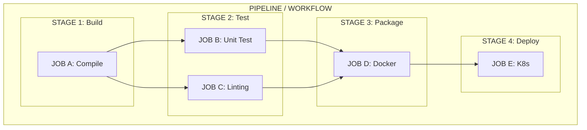
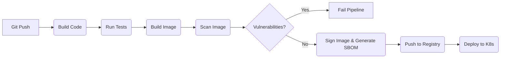

# Module 1.3: CI/CD Pipelines

**Complexity:** [MEDIUM]<br>
**Time to Complete:** 60-75 minutes<br>
**Prerequisites:** [Module 1.1: Infrastructure as Code](/prerequisites/modern-devops/module-1.1-infrastructure-as-code/), basic Git knowledge

## Learning Outcomes

By the end of this module, you will be able to:

- Differentiate Continuous Integration, Continuous Delivery, and Continuous Deployment by analyzing release scenarios and identifying where automation stops.
- Architect a multi-stage container-native pipeline that builds, tests, scans, signs, stores, and deploys one immutable artifact.
- Evaluate the trade-offs between GitHub Actions, GitLab CI, Jenkins, and Tekton for Kubernetes-native delivery workflows.
- Compare Kubernetes deployment strategies and GitOps pull-based delivery against traditional push-based cluster deployment.
- Diagnose pipeline failures and optimize delivery performance using caching, timeouts, immutable tags, and earlier security gates.

## Why This Module Matters

On July 2, 2019, Cloudflare pushed a new Web Application Firewall rule to every edge node simultaneously. The rule contained a regular expression whose backtracking behaviour was quadratic, and within seconds CPU on every machine serving HTTP traffic saturated to 100%. Global traffic dropped 82%; the fix took twenty-seven minutes. The rule had passed static review, but a safety mechanism that would have caught the catastrophic regex had been deleted in a refactor weeks earlier. A CI/CD pipeline is the single chokepoint where the safety of an artifact is decided. If the pipeline's verification weakens, every downstream node receives the same flawed artifact at the same time; if the verification holds, the blast radius of a human error stays bounded by the gates the pipeline still enforces.

In 2020, attackers compromised the SolarWinds Orion build environment and inserted malicious code into a signed software update that customers trusted. That incident widened the definition of deployment risk from "will our app crash?" to "can we prove where this artifact came from, who changed it, which dependencies are inside it, and whether anything touched it after the build?" A modern pipeline is therefore not a convenience script wrapped around Git. It is the software factory, the audit trail, the security checkpoint, the release controller, and the first place where weak engineering discipline becomes visible.

Think of CI/CD as the automated assembly line for software. Source code enters as raw material, moves through quality stations, becomes a container image, receives a label and signature, and is promoted only if each station records a clean result. A team can still choose when a release reaches users, but the release should never depend on someone remembering which commands to run on which host. Kubernetes 1.35+ assumes this world: applications arrive as versioned container images, rollout controllers converge toward desired state, and platform teams rely on repeatable automation rather than personal deployment folklore.

This module turns that assembly line into a design skill. You will separate CI from the two meanings of CD, model pipelines as stages and jobs, connect Infrastructure as Code to delivery gates, secure container artifacts with scans and provenance, compare common CI/CD tools, and choose rollout strategies that fit the risk of the change. When later Kubernetes modules use `k` as the kubectl alias, read it as `alias k=kubectl`; for example, a rollout check would be written as `k rollout status deployment/myapp` after the alias is configured in your shell.

## Core Concepts: CI, Delivery, and Deployment

The phrase "CI/CD" hides three related but different promises, and confusing them leads to brittle release designs. Continuous Integration asks whether a change can merge safely with the shared codebase. Continuous Delivery asks whether the merged artifact is ready to be released on demand. Continuous Deployment asks whether every passing change should flow to production automatically without a final human approval. Those boundaries matter because each step requires more trust in automation, observability, rollback, and organizational discipline than the one before it.

Continuous Integration exists to prevent integration hell, the familiar late-project moment when several long-running branches finally collide and nobody knows which failure came from which change. In a mature CI workflow, developers merge small changes frequently, and every pull request or push triggers a fast feedback loop: checkout, compile, unit tests, linting, static analysis, secret scanning, and sometimes a lightweight integration test. The golden rule is that a red main branch stops normal feature work, because a broken main branch turns the pipeline from a signal into background noise.

Continuous Delivery builds on that foundation by producing a validated, versioned, immutable artifact that could be released at any time. The important word is "could." The pipeline may deploy automatically to a staging environment, run end-to-end checks, publish reports, and wait at a production approval gate because the business wants to coordinate the release with customer support, compliance, or a maintenance window. The final action is still manual, but the manual action is a release decision, not a hand-built deployment procedure.

Continuous Deployment removes that final human approval. If a change passes all automated gates, the system promotes it to production. This is powerful, but it is not a badge a team earns by deleting an approval button. It requires tests that catch real failures, feature flags that limit exposure, metrics that detect customer impact quickly, and rollback automation that can act faster than a meeting can be scheduled. Without those controls, Continuous Deployment simply accelerates mistakes.

> **Pause and predict:** if a team moves from Continuous Delivery to Continuous Deployment, which system becomes more important than the deploy button: the test suite, the observability stack, or rollback automation? The practical answer is that all three become one safety system, because a fully automated release path needs automated evidence before, during, and after the rollout.

Consider two release scenarios. In the first, a developer merges to `main`, the code compiles, tests run, and a Docker image is pushed to a registry, but the operations team later SSHes into a host and manually pulls the tag on Friday evening. That team has CI, not delivery, because the deployment path still depends on human memory. In the second, the pipeline builds the image, deploys it to QA, waits for a reviewer to approve the production environment, and then performs the deployment automatically. That is Continuous Delivery because the release decision is manual while the mechanics are automated.

The distinction also affects incident review. If production broke because a test missed a regression, the pipeline may need better coverage or a safer rollout strategy. If production broke because an engineer ran the wrong command, the problem is not only testing; the deployment procedure itself was outside the pipeline. A senior engineer reviewing a failed release asks where the artifact changed hands, where automation stopped, and whether the next change will travel through the same unreliable gap.

## Anatomy of a Pipeline

A pipeline is easiest to understand as a hierarchy of workflow, stages, jobs, steps, and artifacts. The workflow is the entire process triggered by an event such as a pull request, push, tag, schedule, or manual dispatch. Stages are ordered groups such as build, test, package, scan, and deploy. Jobs are independent units that run on runners or containers, often in parallel. Steps are the commands inside a job, and artifacts are the outputs passed forward, such as test reports, compiled binaries, SBOMs, signatures, or container image references.

The restaurant kitchen analogy is useful because it shows why ordering and parallelism both matter. Dinner service is the workflow. Appetizers, mains, and desserts are stages because the kitchen should not plate dessert before the mains are ready. The grill and fry stations are jobs because they can work at the same time on separate equipment. Chopping, seasoning, and searing are steps because each one depends on the previous one inside the station. The plated dish is the artifact, and if the waiter receives a different dish than the one inspected by the chef, quality control has failed.



This diagram shows a small but important design principle: build once, then fan out where possible. The compile job must succeed before testing and linting can evaluate the result, but the unit test and lint jobs can run at the same time because neither one needs the other. The Docker packaging stage waits for both checks, then produces the artifact used by the deployment job. When pipelines feel slow, the fix is often not more runners; it is recognizing which jobs are truly independent and which ones accidentally serialize work that could be parallel.

Pipeline-as-code makes that hierarchy reviewable. GitHub Actions stores workflow YAML under `.github/workflows/`, GitLab CI uses `.gitlab-ci.yml`, Jenkins commonly uses a `Jenkinsfile`, and Tekton represents pipelines as Kubernetes Custom Resources such as `Task`, `Pipeline`, `TaskRun`, and `PipelineRun`. Keeping the pipeline definition beside the application means the deployment process changes in the same pull request as the application code that needs it. A new service, a new test dependency, or a new scan rule should be reviewed with the code it affects, rather than patched later in a hidden CI dashboard.

The artifact boundary is the most important boundary in the whole pipeline. If you build one image for testing and a second image for production, you have not promoted evidence; you have produced a look-alike. Package managers, base images, and remote build steps can change between those builds, which means production may run dependencies that tests never saw. A mature pipeline builds a single immutable image, tags it with a commit SHA or release identifier, scans that exact image, signs that exact image, and promotes that exact image through staging and production.

### Worked Example: Following One Commit Through the Line

Imagine a developer changes the login service to add stricter session expiration. The pull request should first answer whether the change fits with the existing codebase, so CI checks formatting, compiles the service, runs fast unit tests, and searches for leaked credentials or unsafe patterns. These checks are intentionally close to the developer because they catch mistakes while the change is still small. A failure here should feel like a normal part of editing, not like a release emergency.

After the quick checks pass, the pipeline can build the container image. This is the point where the change stops being an abstract set of source files and becomes the artifact Kubernetes will eventually run. The image should receive a tag tied to the commit and, more importantly, a digest that identifies its exact content. Tags are convenient labels, but digests are the stronger identity because they change when any byte in the image changes.

The next stage tests the artifact rather than rebuilding it. Integration tests might start the login service with a database container, exercise the session expiration path, and publish a report for reviewers. If the test suite needs supporting services, the pipeline should create them from disposable infrastructure rather than relying on a shared environment with unknown state. Shared test environments often produce misleading failures because one team's cleanup job or fixture data can change another team's result.

Security checks then inspect the same image from a different angle. A vulnerability scan asks whether the base operating system and language dependencies contain known issues. An SBOM records what is inside the image so the team can answer future vulnerability questions. A signature records that the approved pipeline produced the artifact. None of these checks proves the login logic is correct, but together they prove the artifact is known, inspected, and traceable.

At this stage, the pipeline has enough evidence to promote the image to a staging environment. In Continuous Delivery, staging deployment should still be automated because manual staging deploys are where drift quietly enters the system. If the staging namespace is missing a secret, has an outdated manifest, or depends on a different database migration state, the pipeline should expose that mismatch before production is involved. Staging is most valuable when it is similar enough to production to reveal deployment problems and isolated enough to be safely disposable.

Production promotion should be boring because every interesting question was asked earlier. The approval gate, if one exists, should ask whether the business is ready for this release, not whether the engineer remembers the deployment command. The job after approval should update a GitOps repository, call a progressive delivery controller, or apply a reviewed manifest using tightly scoped credentials. The approver should see the image digest, test summary, scan result, and target environment, because approving a release without evidence is just a ritual.

Observability closes the loop after the rollout begins. The pipeline can start the deployment, but service health must be measured from production signals such as error rate, latency, saturation, restart count, and domain-specific behavior like login success rate. A rollout controller can pause or rollback when those signals degrade. This is why mature delivery teams treat metrics and alerts as part of the release design rather than a separate operations concern that appears only after an outage.

When this commit later causes an incident, the same evidence chain helps the review stay factual. The team can identify the exact image digest, the workflow run that built it, the tests that passed, the vulnerabilities that were accepted or rejected, the approval that promoted it, and the metrics that changed after rollout. Without that chain, incident review turns into speculation about which server, which image, which dependency, or which manual command was involved. CI/CD is therefore also an investigation tool.

The same chain also helps teams improve without blaming whoever happened to click the final approval. If the login regression escaped because no test covered expired sessions, the corrective action is a test and perhaps a canary metric. If it escaped because staging used a different configuration than production, the corrective action is environment parity and configuration review. If it escaped because the image tag moved after approval, the corrective action is digest pinning and immutable promotion. Good pipelines make the next improvement obvious, concrete, and repeatable.

This worked example shows why a pipeline is not just a set of commands in YAML. It is a sequence of claims: this source merged cleanly, this artifact was built once, this artifact passed checks, this artifact was promoted intentionally, and this deployment behaved acceptably under real conditions. If any claim is missing, the pipeline may still be automated, but it is not yet trustworthy. The engineering task is to make those claims explicit and cheap enough that every change can carry them.

> **Before running this in a real project, predict the failure mode:** what do you expect if an integration test uses one image digest, but the deployment manifest points to a tag that was rebuilt later? The likely result is a confusing incident where every pipeline check appears green while production behaves differently, because the tested artifact and deployed artifact are no longer the same object.

## Infrastructure as Code in the Pipeline

CI/CD is not only for application code. Terraform, Pulumi, CloudFormation, Kubernetes manifests, Helm charts, and Crossplane resources all need the same discipline because infrastructure changes can be more dangerous than application changes. A broken web route can produce errors; a broken network policy, IAM role, or database migration can take away the recovery path. The pipeline must therefore validate infrastructure code before it reaches an account, cluster, or production namespace.

Traditional IaC delivery lets the CI server execute the infrastructure change. A pull request runs formatting, validation, linting, security scanning, cost estimation, and `terraform plan`; after approval, the pipeline runs `terraform apply` using credentials stored in the CI system. This model is direct and widely understood, but it also makes the CI platform a privileged actor. If its credentials are too broad, a compromised runner can mutate production infrastructure far beyond the intended change.

GitOps changes the direction of control. Instead of letting the CI platform push directly into the cluster, the pipeline updates a Git repository that describes desired state, and an in-cluster reconciler such as Argo CD or Flux pulls those changes and applies them locally. For external cloud resources, teams may use Crossplane or provider controllers so Kubernetes Custom Resources represent cloud databases, buckets, and network objects. The tradeoff is more moving parts, but the security boundary is cleaner: the cluster watches Git, and CI does not need a standing admin token for the cluster.

Cost estimation belongs early enough to change behavior. If a developer adds a managed database, the useful moment for financial feedback is the pull request, not the monthly invoice and not the final production gate. Tools such as Infracost can comment on a PR with estimated monthly impact, while policy tools can reject missing tags, public storage buckets, or overly broad security groups. The goal is not to embarrass the developer; it is to make cost and risk visible while the change is still small.

Infrastructure checks should be layered from cheap to expensive. Formatting and syntax validation should run first because they fail quickly and provide precise feedback. Static policy checks and secret scanning should run next because they do not need cloud access. Plans, previews, and environment-specific checks can run after that because they may need remote state, provider credentials, or cluster access. This ordering keeps feedback fast and reduces the number of times privileged credentials enter the pipeline.

## Container-Native CI/CD and Supply Chain Security

Kubernetes delivery changes the artifact from "some files copied to a server" to "a container image referenced by a workload manifest." That sounds simple, but it expands the security surface. The image contains operating system packages, language dependencies, application code, build metadata, and sometimes misconfigured defaults inherited from the base image. A cloud-native pipeline must inspect that artifact before it reaches a registry and must leave enough evidence for operators to answer what is running later.



This flow places security before registry promotion because the registry should be a library of trusted artifacts, not a junk drawer of every experimental build. The pipeline builds an image, scans it, fails on policy violations, generates an SBOM, signs the artifact, and only then pushes or promotes it. In stricter systems, admission control in the cluster later verifies the signature before a Pod starts. That second check matters because it catches images that were modified, replaced, or pulled from an unapproved source after CI completed.

An SBOM, or Software Bill of Materials, is the dependency inventory for the image. Physical manufacturers use bills of materials to identify which products contain a recalled part; software teams use SBOMs to identify which services contain a vulnerable package after a disclosure. Tools such as Syft can generate SBOMs during CI, and vulnerability scanners such as Trivy or Grype can compare image contents against vulnerability databases. During a Log4j-style emergency, the team with SBOMs searches evidence, while the team without SBOMs searches guesses.

SLSA, the Supply-chain Levels for Software Artifacts framework, gives teams a maturity model for build integrity. At early levels, the build is automated and produces provenance describing how an artifact was made. At stronger levels, the build service is hosted, isolated, ephemeral, and protected against tampering. The practical takeaway for this module is that the pipeline should be able to answer who changed the code, which workflow built it, which source revision was used, which dependencies were present, and whether the resulting artifact was signed.

| Security Tool | Primary Use Case | Open Source? | Notes |
| :--- | :--- | :--- | :--- |
| **Trivy** (Aqua) | Comprehensive Container & Repo scanning | Yes | Incredibly fast. Scans OS packages, language dependencies, and Infrastructure as Code (Terraform). The gold standard for easy CI integration. |
| **Grype** (Anchore) | Vulnerability scanning for containers | Yes | Often paired directly with Syft (for SBOM generation). Excellent accuracy and deep inspection. |
| **Snyk** | Developer-focused security platform | Freemium | Deep IDE integration, provides automated fix pull requests to developers before they even commit code. |
| **Kube-linter** | IaC / Kubernetes Manifest scanning | Yes | Checks Kubernetes YAML manifests for security misconfigurations (e.g., running containers as root, missing resource limits) *before* deployment. |

Security gates need thresholds, not vibes. Blocking on every low-severity finding can train developers to ignore the pipeline, especially when the fix is unavailable or unrelated to runtime risk. Blocking on critical exploitable vulnerabilities in the base image, leaked credentials, unsigned release images, or privileged Kubernetes manifests is much easier to defend. A strong platform team publishes the policy in plain language, runs the checks consistently, and gives developers a fast remediation path instead of a mysterious red mark.

Image signing closes the loop between CI and the cluster. Tools such as Cosign attach signatures to image digests, and admission controllers such as Kyverno or OPA Gatekeeper can reject unsigned or untrusted images before scheduling. The signature does not prove the application is bug-free, but it proves the artifact came from the expected pipeline and was not swapped on the way to production. That distinction is central to supply chain security because attackers often target the delivery path rather than the application repository.

## Tool Comparison Deep-Dive

CI/CD tools differ less in their vocabulary than in their operating model. GitHub Actions and GitLab CI are convenient when the source hosting platform is already central to team workflow. Jenkins remains valuable when organizations need unusual plugins, legacy build environments, or dedicated administrators who can maintain it responsibly. Tekton fits Kubernetes-heavy platform teams that want pipeline execution to be expressed as Kubernetes resources and scheduled as Pods. The best choice is not the newest tool; it is the tool whose failure modes your team can operate.

| Feature | GitHub Actions | GitLab CI | Jenkins | Tekton |
| :--- | :--- | :--- | :--- | :--- |
| **Architecture** | SaaS / Self-hosted runners | SaaS / Self-hosted runners | Master-Worker architecture | Kubernetes-native (CRDs) |
| **Configuration** | YAML (`.github/workflows`) | YAML (`.gitlab-ci.yml`) | Groovy (`Jenkinsfile`) | YAML (K8s Manifests) |
| **Strengths** | Massive ecosystem of pre-built community actions, tightest possible GitHub integration. Very low barrier to entry. | Excellent all-in-one platform (code, registry, CI/CD, issue tracking), robust environment dashboard. | Unmatched flexibility, thousands of plugins, handles legacy systems and custom physical hardware exceptionally well. | Runs natively inside K8s, highly scalable, stateless, standardized execution via Pods. Designed for platform engineers. |
| **Weaknesses** | Debugging complex workflows locally is difficult (requires community tools like `act`). | Best experience requires using GitLab as your Git repository host as well. | "Plugin hell", requires significant, painful ongoing maintenance, not inherently cloud-native. | Extremely steep learning curve, very verbose YAML, total overkill for simple static site projects. |
| **Best For** | Open-source projects, teams already locked into the GitHub ecosystem. | Enterprises wanting a cohesive, single-pane-of-glass DevOps platform. | Complex legacy builds, large monoliths, teams with deep Groovy expertise and dedicated Jenkins admins. | Kubernetes-heavy platform engineering teams wanting infrastructure-as-code for CI. |

GitHub Actions is often the fastest path for teams already using GitHub because the trigger model, permission model, marketplace, and pull request checks are integrated. The risk is that marketplace actions are code you execute in your pipeline, so pinning versions and reviewing permissions matter. GitLab CI gives a more integrated DevOps platform when repository hosting, container registry, environments, and deployment views all live together. Jenkins offers enormous flexibility, but that flexibility becomes an operational cost when plugins drift, agents become snowflakes, and Groovy logic grows beyond what reviewers can reason about.

Tekton changes the mental model by making pipeline definitions Kubernetes resources. A `PipelineRun` creates Pods for tasks, those Pods can use cluster scheduling and autoscaling, and GitOps tools can manage the pipeline resources like any other manifest. That is elegant for platform teams standardizing on Kubernetes, but it is verbose for a small static site or a simple library package. If your team cannot explain Kubernetes RBAC, Pod scheduling, storage workspaces, and controller reconciliation, Tekton may move complexity from the CI dashboard into the cluster without reducing it.

> **Which approach would you choose here and why?** A startup runs every workload on Kubernetes, wants CI jobs to scale with cluster capacity, and already manages platform resources through GitOps. Tekton is architecturally aligned because it treats pipelines as Kubernetes objects, but GitHub Actions might still be the pragmatic first step if the team needs a working path this week and lacks platform engineering capacity.

## Deployment Strategies via Pipelines

Once an image is built, scanned, signed, and stored, the pipeline still has to decide how users meet it. Kubernetes gives you a default rolling update, but a pipeline can coordinate richer strategies through manifests, deployment controllers, service mesh routing, progressive delivery tools, or GitOps reconciler changes. The strategy should match the risk of the change, not the seniority of the person pressing the deploy button. A CSS fix and a database-backed recommendation engine rewrite should not share the same release plan.

| Strategy | Risk | Rollback Speed | Infrastructure Cost | Best Use Case |
| :--- | :--- | :--- | :--- | :--- |
| **Rolling Update** | Medium | Slow | Low (No extra infra) | Default for most stateless applications. |
| **Blue-Green** | Low | Instant | High (2x resources) | Critical applications requiring zero downtime and instant rollback. |
| **Canary** | Very Low | Fast | Low | Testing new features on real users with minimal blast radius. |
| **Shadow** | None | N/A | High | Testing backend refactors or load capacity without user impact. |

Push-based deployment is the traditional pattern: the CI pipeline authenticates to the Kubernetes API and runs commands or applies manifests after the build. It is direct, simple to understand, and easy to demonstrate, but it places cluster credentials in the CI system. Pull-based GitOps reverses that trust relationship. The pipeline updates Git with the desired image tag or manifest change, and a controller inside the cluster pulls and reconciles that change. CI no longer needs direct production cluster access, and Git becomes the auditable source of desired state.

Rolling updates are the Kubernetes default for Deployments. The controller incrementally creates Pods for the new ReplicaSet and removes old Pods while respecting availability limits. This is efficient and often correct for stateless services, but it assumes old and new versions can run at the same time. If version two changes a database schema in a way version one cannot read, a rolling update can create a mixed-version failure. The pipeline should catch that risk before rollout, often by requiring expand-and-contract database migrations.

Blue-green deployment keeps two complete environments: blue is live, green is idle or warming. The pipeline deploys the new version to green, runs checks there, and then switches routing. Rollback is fast because traffic can flip back to blue, but the cost is high because the team needs duplicate capacity and careful state management. This strategy fits high-value applications where the cost of idle resources is lower than the cost of a slow recovery.

Canary deployment gradually exposes the new version to a small percentage of traffic, watches metrics, and increases exposure only if the signals stay healthy. A team once failed a canary because its load balancer routed the selected percentage to internal administrators running unusually heavy reporting queries, which made latency look worse than it was. The lesson is that canaries require thoughtful segmentation and meaningful metrics. A canary based only on Pod readiness can miss business failures, while a canary based on biased traffic can reject a healthy release.

Shadow deployment, sometimes called dark launching, duplicates production traffic to the new version while returning only the old version's response to users. It is excellent for read-heavy services, search behavior, and performance testing under real load. It is dangerous for code paths that mutate state, send emails, charge cards, or write analytics events, because duplicated traffic can create duplicated side effects. A safe shadow pipeline needs strict controls that prevent the shadow service from writing to production systems.

> **Stop and think:** why might a team choose a slower canary deployment over a near-instant blue-green switch? The answer is evidence. Blue-green proves the new version can start and pass checks before traffic moves; canary proves the new version behaves acceptably under a controlled slice of real user behavior before everyone receives it.

## Patterns & Anti-Patterns

Healthy pipelines share a few patterns that make releases boring. They build once, promote the same artifact, fail early on cheap checks, isolate runners, keep credentials narrow, and make rollback a tested action rather than a document nobody has opened during an incident. These patterns are less glamorous than a complex dashboard, but they are what let teams deploy on ordinary workdays without changing their breathing.

| Pattern | When to Use It | Why It Works | Scaling Consideration |
| :--- | :--- | :--- | :--- |
| Build once, promote everywhere | Any containerized service moving through staging and production | The tested artifact is the deployed artifact, so evidence follows the image digest | Store image digests, SBOMs, signatures, and scan results together |
| Fast checks before slow checks | Repositories with growing test suites or costly integration environments | Developers receive useful failures quickly and runners are not wasted | Split jobs by dependency boundaries and run independent jobs in parallel |
| Ephemeral runners | Teams handling production credentials, secrets, or supply chain risk | Each build starts clean, reducing contamination from previous jobs | Provision runners through IaC or managed pools rather than manual setup |
| GitOps promotion | Kubernetes platforms with multiple environments and audit needs | CI updates desired state while the cluster reconciles from inside the trust boundary | Use clear repository layout and review rules for environment changes |

A badly designed pipeline can be worse than no pipeline because it creates a false sense of safety. If developers learn that failures are random, approvals are ceremonial, or deployments still depend on a hidden shell script, they will route around the system. The anti-patterns below are not personality flaws; they are structural traps that appear when teams add automation without deciding what evidence the automation must produce.

| Anti-Pattern | Description & Impact | The Fix (Best Practice) |
| :--- | :--- | :--- |
| **"Deploy on Friday" Phobia** | Fearing deployments at the end of the week implies your automated testing suite is inadequate and your CI/CD pipeline is fundamentally untrustworthy. | The goal of continuous delivery is boring, uneventful deployments. Build trust through exhaustive automated testing and robust rollback mechanisms so deploying late in the week is safe. |
| **The Snowflake Build Agent** | Using a self-hosted CI runner that was manually configured years ago. If the hard drive dies, the company cannot deploy code for a week. | Build agents must be completely ephemeral, stateless, and provisioned dynamically via Infrastructure as Code. |
| **Ignored Flaky Tests** | Tests that randomly fail 10% of the time destroy trust. Developers will ignore failures, assuming it's just the flaky test, masking real bugs. | Flaky tests must be deleted, disabled, or fixed immediately. They are pipeline poison. |
| **Secrets in Code** | Hardcoding API keys or database passwords in the pipeline definition YAML file exposes them to anyone with repository read access. | Use native secret management, HashiCorp Vault, or Kubernetes External Secrets and inject values purely at runtime. |
| **The "God" Script** | A pipeline consisting of a single unreadable, un-debuggable 800-line `deploy.sh` script that cannot utilize parallel execution. | Break scripts into discrete, logical CI/CD jobs and tightly scoped steps that can run concurrently. |
| **Manual Gates Everywhere** | Requiring a human manager's manual approval for every single stage creates massive bottlenecks. | Automate the quality gates based on strict thresholds. Reserve manual approvals only for the final business decision to release to production. |
| **The Monolithic Pipeline** | A single pipeline that builds many different microservices sequentially, even if only one microservice changed, recreates integration hell inside CI. | Scope pipelines to the codebase that changed using path filtering, affected-project detection, or monorepo tooling. |
| **Orphaned Artifacts** | Building Docker images for failed deployments and never cleaning the registry leads to avoidable cloud storage costs over time. | Container registries must have lifecycle policies configured to delete untagged or old development images. |
| **Pipeline as an Afterthought** | Writing application code for months and then building the CI/CD pipeline right before launch creates a fragile release path. | The pipeline should be one of the first pieces of project code so delivery constraints shape the service early. |

## Decision Framework

Pipeline design is a set of trade-offs, not a universal template. Start by asking what must be proven before merge, what must be proven before release, who is allowed to promote an artifact, and how the system recovers when the answer is wrong. A small internal tool may need fast tests, a vulnerability scan, and manual deployment. A payment service may need signed images, SBOM retention, canary analysis, environment approvals, and a GitOps controller enforcing production state.

| Decision Point | Choose the Simpler Option When | Choose the Stronger Option When | Operational Tradeoff |
| :--- | :--- | :--- | :--- |
| CI only vs Continuous Delivery | The team is still creating reliable builds and tests | Staging and production deployments need repeatability | Delivery adds environment management and approval design |
| Continuous Delivery vs Continuous Deployment | Releases need business timing or compliance approval | Tests, metrics, feature flags, and rollback are mature | Deployment removes waiting but raises automation requirements |
| Push CD vs GitOps pull CD | The platform is small and CI credentials are tightly scoped | Kubernetes is central and production credentials need stronger boundaries | GitOps adds controllers and repository design decisions |
| Rolling update vs canary | The service is stateless and the change is low risk | Real-user behavior is needed before broad exposure | Canary needs traffic splitting and meaningful metrics |
| GitHub Actions vs Tekton | Source hosting integration and speed matter most | Pipelines should run as Kubernetes-native resources | Tekton fits platform teams but increases YAML and cluster complexity |

Use this sequence as a practical review checklist. First, identify the artifact and make sure it is built once. Second, decide which checks must block merge and which checks must block promotion. Third, choose whether CI pushes to the cluster or updates Git for an in-cluster reconciler. Fourth, select a rollout strategy based on blast radius and rollback speed. Fifth, define the metrics that determine success. A pipeline without explicit success metrics is just a sequence of commands with optimism attached.

When a pipeline fails, diagnose it by layer. If the build fails, inspect dependency changes, runner images, and cache keys. If tests fail, determine whether the failure is deterministic, flaky, or environment-specific. If image scanning fails, check the base image and dependency tree before suppressing the finding. If deployment fails, compare the manifest, image digest, namespace policy, and rollout events. If users report errors after a green rollout, review whether the deployment strategy monitored the right business and service-level indicators.

## Did You Know?

- **300x Faster:** The DORA research program has repeatedly found that high-performing software delivery organizations deploy far more frequently than low performers while also recovering faster from incidents.
- **50% Less Time:** Teams that integrate automated vulnerability scanning early in the pipeline often spend far less time remediating critical security issues than teams that scan only before release.
- **The First CI Server:** CruiseControl, one of the first widely used Continuous Integration tools, was created by ThoughtWorks developers in 2001 and helped popularize automated build feedback.
- **10 Deploys a Day:** In 2009, Flickr engineers presented "10+ Deploys per Day," a talk that made frequent production deployment feel practical to many teams that still treated monthly releases as fast.

## Common Mistakes

| Mistake | Why it happens | How to fix it |
| :--- | :--- | :--- |
| **Using `latest` image tags** | Developers use `image: myapp:latest` in Kubernetes deployment files out of convenience during early testing. | **Never use `:latest`.** Use specific, immutable tags or image digests, such as a Git commit SHA, so a restarted node cannot pull a different artifact than the one tested. |
| **No timeout limits on jobs** | A process hangs indefinitely while waiting for a slow API, an unavailable dependency, or an infinite loop inside a test. | Define explicit timeouts for every job and step, such as `timeout-minutes: 15` in GitHub Actions, so failed work releases the runner quickly. |
| **Building images multiple times** | The team rebuilds the Docker image for testing, staging, and production because each environment owns its own pipeline stage. | Build once, scan once, sign once, and promote the exact immutable image artifact through every environment. |
| **Running scans at the end** | Security checks are placed right before deployment, where they feel like a painful release bottleneck. | Shift scans left by running secret scanning, SAST, IaC checks, and image scanning as early as their inputs are available. |
| **No cache utilization** | The pipeline downloads the same dependency archive on every run even when the lockfile has not changed. | Use dependency caching keyed from lockfiles, and invalidate the cache automatically when dependencies change. |
| **Alert fatigue** | The pipeline sends a notification for every successful step, so developers mute the channel and miss real failures. | Notify only on failures, recovery from failure, and events that require human action, such as a production approval. |

## Quiz

<details>
<summary>1. Scenario: A team builds and tests a container image on every merge, then an operator manually deploys that image to production later in the week. Is this CI, Continuous Delivery, or Continuous Deployment?</summary>
This is Continuous Integration only. The pipeline integrates the change, validates it, and produces an artifact, but the deployment process remains manual and separate from the automated workflow. Continuous Delivery would automate the deployment mechanics and leave only the release decision to a human approval. Continuous Deployment would remove that production approval and release every passing change automatically.
</details>

<details>
<summary>2. Scenario: A pipeline builds one Docker image for integration tests, then rebuilds a second image from the same source for production. Why is this dangerous?</summary>
The production image is not the same artifact that passed testing, so the team has broken the evidence chain. A package manager, base image, or transitive dependency could change between the two builds even if the application source is unchanged. The safer design is to build one immutable image, scan and sign that exact image, and promote it through staging and production. That makes failures easier to diagnose because every environment refers to the same digest.
</details>

<details>
<summary>3. Scenario: A retail service is releasing a new recommendation engine during a busy season. Why might the team choose canary deployment instead of a normal rolling update?</summary>
A canary limits blast radius by exposing the new behavior to a small slice of real traffic before expanding the rollout. A rolling update can prove Pods are healthy, but it does not automatically prove the recommendation engine is producing acceptable business behavior. With canary analysis, the team can watch error rates, latency, conversion impact, and other service indicators before everyone receives the new version. The tradeoff is that canaries require routing control and meaningful metrics.
</details>

<details>
<summary>4. Scenario: A platform team wants pipeline definitions managed as Kubernetes Custom Resources and wants build steps to execute as Pods. Which tool is the best fit, and why?</summary>
Tekton is the best architectural fit because it defines CI/CD workflows through Kubernetes resources and executes tasks as Pods. That lets the team manage pipeline infrastructure with the same GitOps practices used for application manifests. It also allows pipeline workloads to use cluster scheduling and autoscaling behavior. The tradeoff is complexity, because Tekton requires comfort with Kubernetes controllers, RBAC, workspaces, and verbose YAML definitions.
</details>

<details>
<summary>5. Scenario: Security asks why the CI system should not hold a standing production cluster admin token. How does pull-based GitOps reduce that risk?</summary>
Pull-based GitOps keeps the production reconciler inside the cluster and lets it pull desired state from Git. The CI system updates a repository or image tag reference rather than directly applying manifests to the Kubernetes API. This reduces the blast radius of a compromised CI runner because it no longer needs broad production cluster credentials. It also makes Git the auditable record of what the cluster should be running.
</details>

<details>
<summary>6. Scenario: A GitHub Actions workflow takes 45 minutes because it downloads the same npm dependencies on every run. What should you change, and what should key the cache?</summary>
Add dependency caching and key the cache from the lockfile, such as `package-lock.json`, so the cache changes only when dependencies change. That avoids repeated downloads while preserving correctness when the dependency graph is updated. The cache should speed up feedback without hiding dependency changes from the build. If the lockfile changes, the pipeline should create or restore a different cache entry rather than reusing stale packages.
</details>

<details>
<summary>7. Scenario: A signed image passes CI, but Kubernetes rejects the Pod at admission time. What should you inspect first?</summary>
Start by comparing the image reference in the manifest with the digest that CI signed. Admission controllers usually verify a specific digest or trusted identity, so a mutable tag, wrong registry path, or unsigned rebuild can cause rejection. Then inspect the policy rule to confirm which issuer, repository, or signature identity it expects. This failure is useful because it means the cluster is enforcing the artifact trust contract instead of running an unverified image.
</details>

<details>
<summary>8. Scenario: A service needs a database schema migration that old Pods cannot read. Why is a basic rolling update risky, and what should the team do instead?</summary>
A rolling update temporarily runs old and new Pods together, so incompatible schema changes can break one version while the other is still serving traffic. The team should decouple the database migration from the application rollout or use an expand-and-contract migration pattern that keeps both versions compatible during the transition. They may also choose a safer rollout strategy with explicit checks and rollback planning. The key is to preserve compatibility until no old Pods need the old schema.
</details>

## Hands-On Exercise

In this exercise, you will create a GitHub Actions workflow that builds a container image, uses caching to speed up dependency installation, scans the image with Trivy, simulates a Continuous Delivery approval gate, and adds a timeout so a stuck job fails quickly. The application is intentionally small because the goal is to study the pipeline mechanics, not to build a production web service. You will first create an insecure image and watch the security gate fail, then remediate the base image and let the pipeline pass.

### Task 1: Create the Application and Dockerfile

Create a simple Node.js application that deliberately uses an outdated, vulnerable base image to demonstrate pipeline security gates in action. This mirrors real incidents where the application code is harmless, but the inherited operating system layer carries critical vulnerabilities into production. The point is to see that the pipeline must evaluate the whole artifact, not just the lines written by the application developer.

1. Create a new directory and initialize a git repository.
2. Create a file named `app.js`:

```javascript
const http = require('http');
const server = http.createServer((req, res) => {
  res.writeHead(200, { 'Content-Type': 'text/plain' });
  res.end('Hello KubeDojo Secure Pipeline!');
});
// Listen on port 8080
server.listen(8080, () => {
    console.log('Server is listening on port 8080');
});
```

3. Create a `package.json` to simulate real-world dependencies:

```json
{
  "name": "kubedojo-pipeline-app",
  "version": "1.0.0",
  "dependencies": {
    "express": "^4.18.2"
  }
}
```

4. Create a `Dockerfile`. Notice that this base image is intentionally outdated for the lab:

```dockerfile
# INSECURE BASE IMAGE FOR TESTING PIPELINE GATES
FROM node:14.16.0-alpine
WORKDIR /app
COPY package*.json ./
RUN npm install
COPY app.js .
CMD ["node", "app.js"]
```

<details>
<summary>Solution</summary>

```bash
mkdir my-pipeline-lab
cd my-pipeline-lab
git init

# Create app.js
cat <<EOF > app.js
const http = require('http');
const server = http.createServer((req, res) => {
  res.writeHead(200, { 'Content-Type': 'text/plain' });
  res.end('Hello KubeDojo Secure Pipeline!');
});
server.listen(8080, () => {
    console.log('Server is listening on port 8080');
});
EOF

# Create package.json
cat <<EOF > package.json
{
  "name": "kubedojo-pipeline-app",
  "version": "1.0.0",
  "dependencies": {
    "express": "^4.18.2"
  }
}
EOF

# Create Dockerfile
cat <<EOF > Dockerfile
FROM node:14.16.0-alpine
WORKDIR /app
COPY package*.json ./
RUN npm install
COPY app.js .
CMD ["node", "app.js"]
EOF
```
</details>

### Task 2: Define the CI Pipeline with Caching

Create a GitHub Actions workflow file that sets up Node.js, caches npm dependencies to speed up future runs, and builds the Docker image. Caching is safe here because the cache is tied to the dependency definition rather than reused blindly. If the dependency lockfile changes, the cache key changes, and the workflow naturally refreshes the dependency set.

1. Create the workflow directory structure: `.github/workflows/`
2. Create a file named `ci-cd.yml` in that directory.
3. Configure it to trigger on `push` events to the `main` branch.
4. Add a job named `build-and-test` that runs on `ubuntu-latest`.
5. Add steps to checkout code, set up Node.js, install dependencies, and build the Docker image as `kubedojo-app:test`.

<details>
<summary>Solution</summary>

```yaml
# .github/workflows/ci-cd.yml
name: Secure CI/CD Pipeline

on:
  push:
    branches: [ "main" ]

jobs:
  build-and-test:
    runs-on: ubuntu-latest
    steps:
    - name: Checkout code
      uses: actions/checkout@v4

    # This action natively handles caching node_modules based on package-lock.json
    - name: Setup Node.js and Cache
      uses: actions/setup-node@v4
      with:
        node-version: '22'
        cache: 'npm'

    - name: Install dependencies
      run: npm install

    - name: Build Docker image
      run: docker build -t kubedojo-app:test .
```
</details>

### Task 3: Add Vulnerability Scanning

Extend the `build-and-test` job to scan the built image. The scan belongs after the image build because it needs the completed artifact, but before deployment because the registry and cluster should not receive an artifact that violates policy. For this lab, the policy blocks critical vulnerabilities so the failure is obvious and tied to the intentionally outdated base image.

1. Edit `.github/workflows/ci-cd.yml`.
2. At the end of the `build-and-test` job, add a step using the official Trivy action.
3. Configure it to scan the `kubedojo-app:test` image.
4. Set `exit-code: '1'` so the pipeline fails on matching vulnerabilities.
5. Set `severity: 'CRITICAL'` to block only the highest risk issues in this lab.

<details>
<summary>Solution</summary>

Append this step to your `build-and-test` job:

```yaml
    - name: Run Trivy vulnerability scanner
      uses: aquasecurity/trivy-action@master
      with:
        image-ref: 'kubedojo-app:test'
        format: 'table'
        exit-code: '1'          # 1 means fail the GitHub Action if vulns found
        ignore-unfixed: true
        vuln-type: 'os,library'
        severity: 'CRITICAL'    # Only block the build on CRITICAL severity
```
</details>

### Task 4: Execute and Observe the Security Failure

If you pushed this to GitHub, the workflow would run and fail when Trivy reports critical vulnerabilities in the old base image. For a local simulation, build the image and run Trivy with Docker against the local image. The important learning moment is the non-zero exit code: CI/CD tools do not need to understand every vulnerability detail as long as the scanning step produces a clear pass or fail result.

1. Build the image locally to test: `docker build -t kubedojo-app:test .`
2. Run Trivy locally using Docker: `docker run --rm -v /var/run/docker.sock:/var/run/docker.sock aquasec/trivy image --severity CRITICAL --exit-code 1 kubedojo-app:test`
3. Observe that the scanner returns exit code `1`, which would halt the pipeline before deployment.

<details>
<summary>Solution output snippet</summary>

```text
node:14.16.0-alpine (alpine 3.13.2)
===================================
Total: 3 (CRITICAL: 3)

┌─────────────┬────────────────┬──────────┬───────────────────┬───────────────┬───────────────────────────────────────────────────────┐
│   Library   │ Vulnerability  │ Severity │ Installed Version │ Fixed Version │                         Title                         │
├─────────────┼────────────────┼──────────┼───────────────────┼───────────────┼───────────────────────────────────────────────────────┤
│ apk-tools   │ CVE-2021-36159 │ CRITICAL │ 2.12.5-r0         │ 2.12.7-r0     │ libfetch before 2021-07-26, as used in apk-tools,     │
│             │                │          │                   │               │ OSv, and other products, mishandles...                │
...
```
</details>

### Task 5: Fix the Vulnerability

To make the pipeline pass, fix the root cause rather than suppressing the finding. In this case, the root cause is the unsupported base image. Updating to a current base image changes the operating system package set and lets the same scan policy succeed without weakening the gate.

1. Open your `Dockerfile`.
2. Change the `FROM` line to use `node:22-alpine`.
3. Re-run the local Docker build: `docker build -t kubedojo-app:test .`
4. Re-run the local Trivy scan and confirm it exits successfully.

<details>
<summary>Solution</summary>

**Updated Dockerfile:**

```dockerfile
FROM node:22-alpine
WORKDIR /app
COPY package*.json ./
RUN npm install
COPY app.js .
CMD ["node", "app.js"]
```

When you re-run Trivy, the output should end with `Total: 0 (CRITICAL: 0)`, and the process will exit successfully. The pipeline gate is now unblocked.
</details>

### Task 6: Implement Continuous Delivery

Now that the image is secure and building correctly, simulate a Continuous Delivery workflow by adding a deployment job that requires manual human approval before executing. In a real repository, the `environment: production` setting can require reviewers before the job starts. That keeps the deployment mechanics automated while preserving a deliberate release decision.

1. Edit `.github/workflows/ci-cd.yml`.
2. Add a new job named `deploy-to-production`.
3. Ensure this job only runs if the first job succeeds by using `needs: build-and-test`.
4. Add an `environment: production` key to this job.
5. Add a mock step that echoes deployment activity.

<details>
<summary>Solution</summary>

**Final Complete Pipeline (`.github/workflows/ci-cd.yml`):**

```yaml
name: Secure CI/CD Pipeline

on:
  push:
    branches: [ "main" ]

jobs:
  build-and-test:
    runs-on: ubuntu-latest
    steps:
    - name: Checkout code
      uses: actions/checkout@v4

    - name: Setup Node.js and Cache
      uses: actions/setup-node@v4
      with:
        node-version: '22'
        cache: 'npm'

    - name: Install dependencies
      run: npm install

    - name: Build Docker image
      run: docker build -t kubedojo-app:test .

    - name: Run Trivy vulnerability scanner
      uses: aquasecurity/trivy-action@master
      with:
        image-ref: 'kubedojo-app:test'
        format: 'table'
        exit-code: '1'
        ignore-unfixed: true
        vuln-type: 'os,library'
        severity: 'CRITICAL'

  deploy-to-production:
    needs: build-and-test
    runs-on: ubuntu-latest
    # This environment keyword hooks into GitHub's deployment protection rules
    # allowing you to mandate manual approval before this job starts.
    environment: production
    steps:
    - name: Authenticate with Kubernetes Cluster
      run: echo "Simulating OIDC authentication to K8s cluster..."
      
    - name: Deploy Image
      run: |
        echo "Simulating applying Kubernetes manifests..."
        echo "kubectl set image deployment/myapp myapp=kubedojo-app:test"
        echo "Deployment successful!"
```
</details>

### Task 7: Configure a Pipeline Timeout

One common and expensive CI/CD mistake is allowing a pipeline to hang indefinitely while waiting for an external service or a broken test. A timeout is not just a cost control; it is a diagnostic boundary. When a job times out consistently, the team can investigate a specific stage instead of discovering hours later that a runner has been occupied by work that was never going to complete.

1. Edit your `.github/workflows/ci-cd.yml` file one last time.
2. Add a `timeout-minutes` configuration to the `build-and-test` job.
3. Use a strict 15-minute timeout for this lab.

<details>
<summary>Solution</summary>

Update the `build-and-test` job definition:

```yaml
jobs:
  build-and-test:
    runs-on: ubuntu-latest
    # Enforce a strict 15-minute timeout for the entire job
    timeout-minutes: 15
    steps:
    - name: Checkout code
      uses: actions/checkout@v4
      # ...rest of steps...
```

If a slow install, hung test, or stalled scan takes longer than 15 minutes, GitHub Actions cancels the job, fails the pipeline with a clear error, and frees the runner for other work.
</details>

### Success Criteria

- [ ] The workflow builds one container image and uses that same image reference for scanning and deployment simulation.
- [ ] The first Trivy run fails because the intentionally outdated base image contains critical vulnerabilities.
- [ ] Updating the Dockerfile to `node:22-alpine` allows the critical vulnerability gate to pass.
- [ ] The deployment job depends on the build job and uses a production environment gate to model Continuous Delivery.
- [ ] The build job includes a timeout so a stuck pipeline does not consume runner capacity indefinitely.

## Sources

- [GitHub Actions workflow syntax](https://docs.github.com/en/actions/writing-workflows/workflow-syntax-for-github-actions)
- [GitHub Actions dependency caching](https://docs.github.com/en/actions/using-workflows/caching-dependencies-to-speed-up-workflows)
- [GitLab CI/CD YAML syntax reference](https://docs.gitlab.com/ci/yaml/)
- [Jenkins Pipeline documentation](https://www.jenkins.io/doc/book/pipeline/)
- [Tekton Pipelines documentation](https://tekton.dev/docs/pipelines/)
- [Kubernetes Deployments](https://kubernetes.io/docs/concepts/workloads/controllers/deployment/)
- [Argo CD documentation](https://argo-cd.readthedocs.io/en/stable/)
- [Flux documentation](https://fluxcd.io/flux/)
- [Trivy documentation](https://aquasecurity.github.io/trivy/)
- [Syft SBOM tool documentation](https://github.com/anchore/syft)
- [Sigstore Cosign documentation](https://docs.sigstore.dev/cosign/overview/)
- [SLSA specification](https://slsa.dev/spec/v1.0/)

## Next Module

A green pipeline proves that the artifact passed the checks you designed, but it does not prove that users are happy after the rollout. The next module moves from delivery to production feedback by examining metrics, logs, and traces as the evidence system for running services.

[Proceed to Module 1.4: Observability](/prerequisites/modern-devops/module-1.4-observability/)
