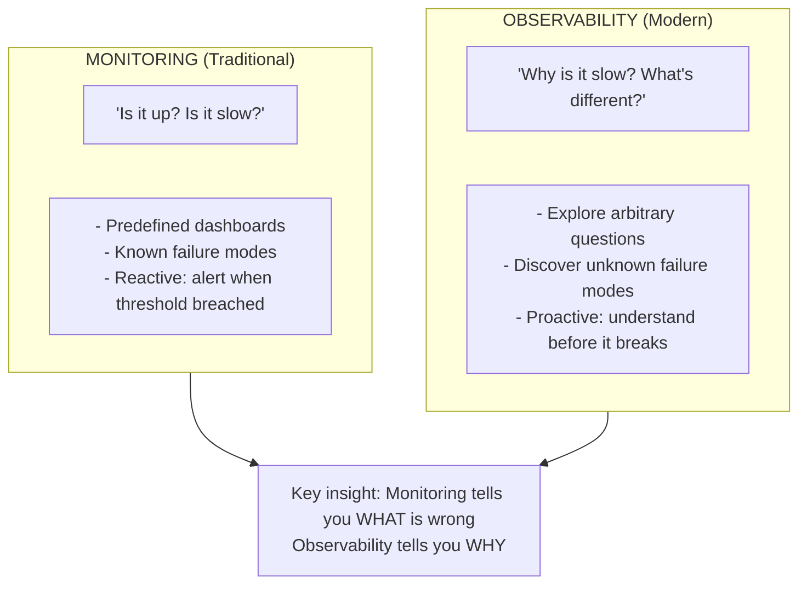
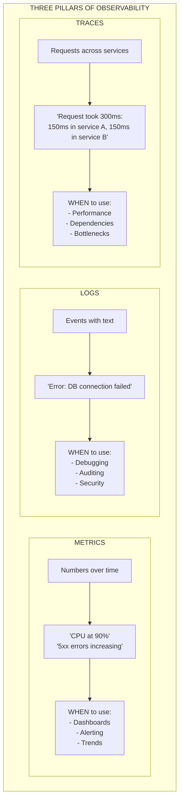
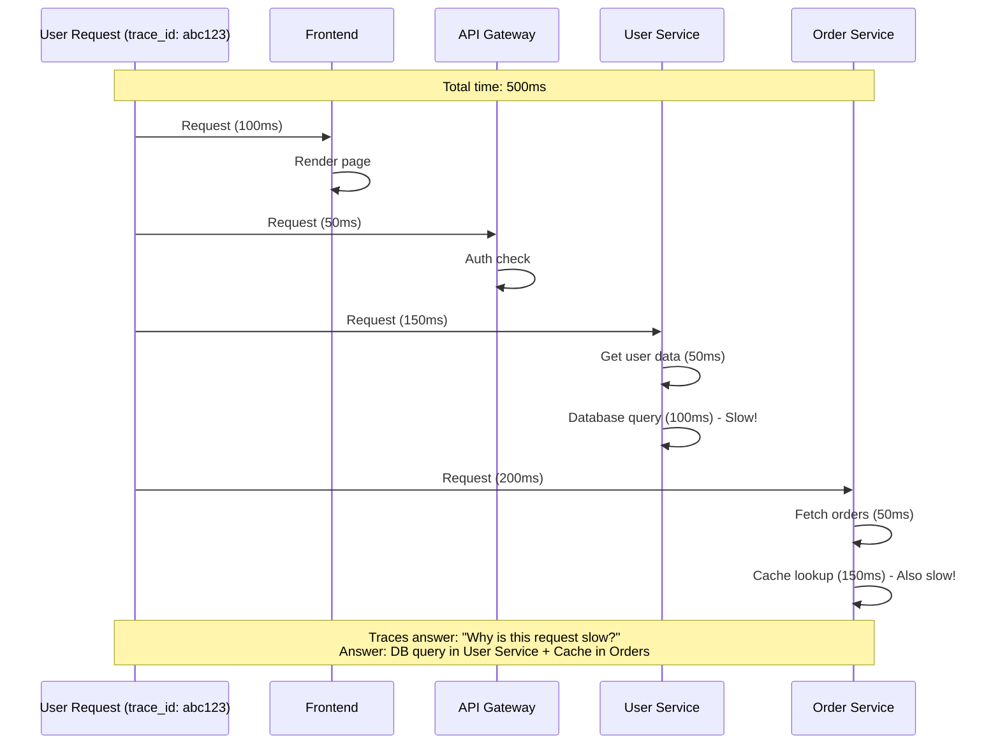
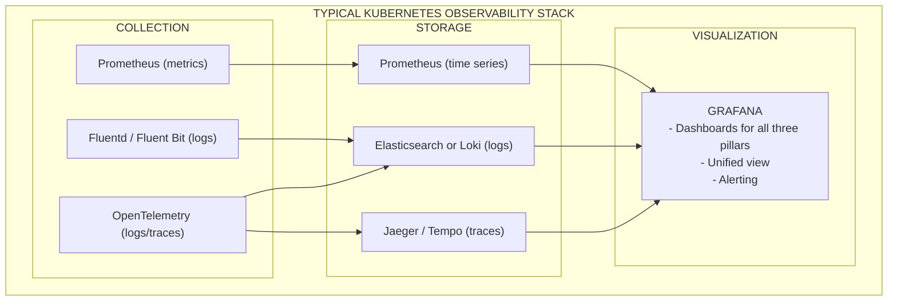
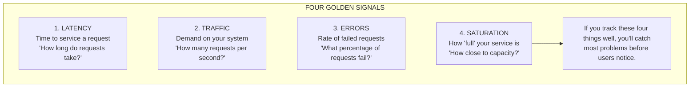

> **Complexity**: `[MEDIUM]` - Critical operational skill
>
> **Time to Complete**: 45-60 minutes
>
> **Prerequisites**: Basic understanding of distributed systems and Kubernetes pods.

## What You'll Be Able to Do

After completing this comprehensive module, you will be able to:
- **Compare** and contrast traditional monitoring approaches with modern observability paradigms across complex architectures.
- **Evaluate** system health by designing queries for Prometheus metrics, utilizing Counters, Gauges, and Histograms correctly.
- **Diagnose** complex distributed failures by tracing requests across microservice boundaries using span correlation and OpenTelemetry.
- **Implement** structured JSON logging practices to facilitate rapid, programmatic querying of system events during major incidents.
- **Design** Service Level Indicators (SLIs) and Service Level Objectives (SLOs) that accurately reflect the end-user experience, avoiding infrastructure-centric metrics.

## Why This Module Matters

In August 2012, Knight Capital Group deployed new software to their high-frequency trading servers. Within minutes, the system began entering millions of erratic trades into the market. Because their monitoring was rudimentary—only checking if the servers were "up" and whether the primary processes were running—engineers could not see *why* the system was behaving anomalously or which specific microservice was responsible for the runaway trades. The lack of deep observability meant they spent 45 minutes manually digging through unindexed text logs and restarting servers blindly in a desperate attempt to halt the bleeding. By the time they successfully diagnosed the issue and shut down the rogue instances, Knight Capital had lost $460 million, effectively bankrupting the company in less than an hour.

This disaster perfectly illustrates the danger of operating complex, distributed systems without true observability. In modern cloud-native environments like Kubernetes, applications are no longer monolithic entities running on a single server where you can simply `SSH` in and read a log file. A single user request might traverse an API gateway, an authentication service, a database cache, a message broker, and a third-party payment provider before ever returning a response to the client.

When something breaks in this massive web of dependencies, asking "Is the server up?" is a fundamentally useless question. The server might be perfectly healthy and operating at low CPU utilization, but the network link between the authentication pod and the database might be dropping 10% of its packets, causing a cascading failure and thread exhaustion across the entire cluster. Without observability, you are effectively flying a commercial airliner through a severe storm while blindfolded. 

Observability transforms you from a reactive firefighter guessing at root causes into a proactive engineer conducting precise structural diagnostics. It gives you the mathematical, structural, and investigative tools to interrogate your system in real-time. Instead of guessing why a checkout service is slow, you can pinpoint the exact function call or slow database query that is causing the bottleneck. By mastering the concepts in this module, you will gain the ability to navigate complex outages, design resilient telemetry pipelines, and ensure your applications meet their reliability objectives before your users ever notice a problem.

## What is Observability?

Observability is a property of a system, not a specific tool you can install. Rooted in mathematical control theory, observability is defined as **the ability to understand the internal state of a system entirely by examining its external outputs**. If a system is perfectly observable, you can answer any arbitrary question about its behavior without needing to ship new code to extract that information.

This represents a massive paradigm shift from traditional monitoring mentalities. 



In the traditional monitoring mindset, engineers attempt to predict every possible way a system might fail and build a custom dashboard panel for it. They create specific alerts for "high CPU" or "low disk space." This works passably well for monolithic systems with known, predictable failure modes. However, distributed microservices fail in unpredictable, emergent ways. A message queue might back up because a third-party API changed its rate-limiting headers, causing a thread pool exhaustion in a completely different, seemingly unrelated service. You cannot pre-build a dashboard for a failure mode you have never conceived of. 

> **Pause and predict**: A web application's Prometheus metrics show a completely stable memory gauge (`container_memory_usage_bytes`), but users are experiencing intermittent connection drops. When you check `kube_pod_status_phase`, you notice the pods are restarting frequently. How is it mathematically possible for a pod to be killed for Out-Of-Memory (OOM) while the metrics never register a spike, and what observability enhancement would better capture this failure mode?
> 
> *(Answer: Metrics are typically scraped on an interval, such as every 60 seconds. If a severe memory leak causes the application to consume all memory and crash within 10 seconds of starting, the Prometheus scraper will miss the spike entirely because it occurred between scrape intervals. To capture this blind spot, you would need to either increase the scrape frequency (costly) or rely on high-resolution event logs generated by the Kubernetes kubelet when it issues the SIGKILL command.)*

## The Three Pillars of Observability

To achieve true observability, site reliability engineers rely on three distinct but complementary types of telemetry data, universally referred to as the "Three Pillars."



While each pillar is incredibly powerful on its own, true observability is only achieved when all three are tightly correlated through shared metadata. If you see a massive spike in an error metric, you should be able to click on that exact point in time to see the corresponding distributed traces, and from a uniquely slow trace, instantly jump to the specific error logs for that single request. This unified workflow drastically reduces Mean Time To Recovery (MTTR).

## Pillar 1: Metrics - The Nervous System

Metrics are the absolute foundation of modern telemetry pipelines. They are defined as **numeric measurements collected over time** (time-series data). Because metrics are just floating-point numbers and UNIX timestamps, they are incredibly cheap to store, aggregate, and query over long periods compared to text logs.

Metrics are best used for triggering alerts and visualizing high-level system health. They tell you definitively that a problem exists right now.

### Types of Metrics

When instrumenting a modern application, developers must choose the correct statistical type of metric for the data they are recording. Choosing incorrectly will break your mathematical queries later.

```text
Counter (always increases):
  - http_requests_total
  - errors_total
  - bytes_sent_total

Gauge (can go up or down):
  - temperature_celsius
  - memory_usage_bytes
  - active_connections

Histogram (distribution):
  - request_duration_seconds
  - Shows: p50, p90, p99 latencies
```

A **Counter** is used for discrete events that happen over time. It can only ever go up (or reset to zero when a pod inevitably restarts). You use counters to mathematically calculate rates, like "requests per second."
A **Gauge** is a snapshot of current state. It goes up and down freely. You cannot reliably calculate a "rate" from a gauge, but they are perfect for queue depths or memory usage.
A **Histogram** groups observations into configurable buckets. This is critical for measuring latency accurately. A simple average (mean) latency is extremely deceptive; if 99 requests take 10ms and 1 request takes 5000ms, the average is 59ms, completely hiding the fact that one user had a terrible, broken experience. Histograms allow you to calculate percentiles (e.g., the 99th percentile, or p99, shows the worst experience out of 100 users).

### Prometheus (The Standard)

In the Kubernetes ecosystem, Prometheus is the undisputed standard for metrics collection. Unlike traditional monitoring systems that wait for applications to "push" data to them (like StatsD), Prometheus uses a "pull" model. It actively scrapes HTTP endpoints exposed by your applications and infrastructure components at regular intervals (typically 15 to 60 seconds).

```yaml
# Prometheus collects metrics by scraping endpoints
# Your app exposes metrics at /metrics

# Example metrics endpoint output:
# HELP http_requests_total Total HTTP requests
# TYPE http_requests_total counter
http_requests_total{method="GET",path="/api",status="200"} 1234
http_requests_total{method="POST",path="/api",status="500"} 12

# HELP request_duration_seconds Request latency
# TYPE request_duration_seconds histogram
request_duration_seconds_bucket{le="0.1"} 800
request_duration_seconds_bucket{le="0.5"} 1100
request_duration_seconds_bucket{le="1.0"} 1200
```

Notice the key-value pairs inside the curly braces `{}`, such as `method="GET"`. These are **labels** (or tags). Labels provide the immense multi-dimensional power of Prometheus. Instead of having a single monolithic metric for all HTTP requests, labels allow you to slice and dice the data by HTTP method, status code, cloud region, or pod name. 

*Warning on Cardinality:* You must never put unbounded data (like a `user_id` or an `email_address`) into a Prometheus label. Every unique combination of labels creates a brand new time series in the database. If you have a million users, inserting `user_id` will create a million time series, immediately crashing your Prometheus server.

### PromQL (Query Language)

To make sense of this raw time-series data, engineers use PromQL (Prometheus Query Language). It is a functional language designed specifically for time-series math and vector aggregations.

```promql
# Rate of requests per second over 5 minutes
rate(http_requests_total[5m])

# Error rate
sum(rate(http_requests_total{status=~"5.."}[5m]))
/
sum(rate(http_requests_total[5m]))

# 99th percentile latency
histogram_quantile(0.99, rate(request_duration_seconds_bucket[5m]))
```

The `rate()` function is the most critical and common PromQL operation. Because `http_requests_total` is a counter that continually grows forever, simply graphing its raw value results in a meaningless diagonal line going up to infinity. The `rate()` function calculates how fast that counter is growing per second over a specified time window (like `[5m]`), giving you a meaningful, actionable "requests per second" graph that spikes when traffic spikes.

## Pillar 2: Logs - The System's Memory

While metrics aggregate data into highly efficient numbers, logs provide the rich, granular context needed for deep debugging. Logs are **timestamped records of discrete events**. They contain the detailed stack traces, the specific user IDs, the executed database query strings, and the exact error messages that explain *why* a metric suddenly spiked.

However, logging is expensive. Emitting, transmitting, indexing, and storing gigabytes of text data requires massive amounts of disk I/O and compute power.

### Structured vs Unstructured Logging

The format of your logs dramatically impacts your ability to debug incidents quickly. At scale, the format is just as important as the content.

```json
UNSTRUCTURED (hard to parse):
2024-01-15 10:23:45 ERROR Failed to connect to database: connection refused

STRUCTURED (JSON, easy to query):
{
  "timestamp": "2024-01-15T10:23:45Z",
  "level": "error",
  "message": "Failed to connect to database",
  "error": "connection refused",
  "service": "api",
  "pod": "api-7d8f9-abc12",
  "trace_id": "abc123def456"
}
```

Unstructured text logs are meant strictly for human eyes. But in a distributed system generating millions of logs per minute across hundreds of pods, humans are far too slow. If an on-call engineer needs to find all database errors specifically for the `checkout` service, searching unstructured logs requires writing complex, computationally expensive, and fragile Regular Expressions (regex) on the fly while the system is burning down.

Structured logging (typically output as raw JSON) treats every single log line as a mini-database record. Variables are explicitly defined as fields. This allows logging platforms to index the fields natively, enabling lightning-fast, highly specific programmatic queries like `level="error" AND service="api" AND trace_id="abc123def456"`.

### Log Levels

Choosing the correct severity level within the application code is crucial for maintaining a healthy signal-to-noise ratio during a stressful incident.

| Level | When to Use |
|-------|-------------|
| DEBUG | Detailed info for debugging (disabled in prod) |
| INFO | Normal operations, milestones |
| WARN | Something unexpected, but recoverable |
| ERROR | Something failed, needs attention |
| FATAL | Application cannot continue |

### Kubernetes Logging Architecture

By default, Kubernetes captures the standard output (`stdout`) and standard error (`stderr`) streams of every container running in a pod. You can view these interactively via the CLI.

```bash
# View logs
kubectl logs pod-name
kubectl logs pod-name -c container-name  # Multi-container
kubectl logs pod-name --previous         # Previous crash
kubectl logs -f pod-name                 # Follow (tail)
kubectl logs -l app=nginx                # By label
```

However, `kubectl logs` is inherently ephemeral. If a pod crashes and is deleted by a deployment controller, its logs on the node's disk are deleted with it. For persistent observability, you must run a log aggregator agent (like Fluentd or Fluent Bit) as a DaemonSet on every single Kubernetes node. These agents collect container logs from the Docker/containerd runtime and forward them to a centralized storage backend over the network.

Common centralized logging stacks include:
- **ELK (Elasticsearch, Logstash, Kibana)**: The traditional heavyweight champion for intense full-text search and complex analytics.
- **EFK (Elasticsearch, Fluentd, Kibana)**: A modern Kubernetes-native variant replacing the heavy Logstash component with the lightweight Fluentd.
- **Loki + Grafana**: Grafana's modern logging solution that indexes only metadata labels (exactly like Prometheus), making it significantly cheaper and faster to operate than full-text indexing solutions, though it sacrifices some raw regex search speed.

## Pillar 3: Traces - The System's Map

In a legacy monolith, diagnosing a slow request is trivially easy: you look at a single stack trace generated by a single server. In a modern microservice architecture, a single user click might trigger cascading network calls across twenty different independent services managed by five different engineering teams. If the end-user request takes ten seconds to complete, which specific service caused the delay?

Distributed Traces **follow a request across multiple services**, providing a highly visual, waterfall view of the request's journey through the architecture.



### Key Concepts and Context Propagation

How does tracing actually work across the network? It relies on passing specific, standardized HTTP headers (like the W3C `traceparent` or the Zipkin `b3` headers) from service to service. This critical process is called **Context Propagation**.

| Term | Definition |
|------|------------|
| Trace | Complete journey of a request |
| Span | Single operation within a trace |
| Trace ID | Unique identifier for the trace |
| Span ID | Unique identifier for a span |
| Parent ID | Links child spans to parents |

When the initial API Gateway receives a brand new HTTP request, it generates a cryptographically unique `Trace ID` and creates a root `Span`. When the gateway subsequently makes a network call to the User Service, it injects that exact Trace ID and its own Span ID (designated as the Parent ID) into the outgoing HTTP headers. The User Service reads these headers from the incoming request, creates its own distinct child span, and reports it asynchronously to the tracing backend. The tracing backend then stitches these spans together using the IDs to draw the waterfall map.

### Tracing Tools
- **Jaeger**: A CNCF graduated project, originally built by Uber, highly popular for visualizing traces in Kubernetes environments.
- **Zipkin**: A Twitter-originated, mature tracing system that defined many early standards.
- **OpenTelemetry**: The modern, vendor-neutral standard for instrumenting code. Instead of locking your application to Jaeger's specific SDK, OpenTelemetry provides a unified API to gather metrics, logs, and traces and export them to any backend you choose.

> **Stop and think**: You are designing the telemetry pipeline for a high-frequency trading platform where individual orders are processed in microseconds. If you enable 100% trace sampling to capture every single transaction path, what hidden architectural bottlenecks might you introduce, and how would you redesign the collection strategy to mitigate them?
>
> *(Answer: Enabling 100% tracing in a massive-throughput system will introduce catastrophic network overhead as microservices constantly serialize and transmit span data. The tracing backend itself will rapidly become a bottleneck, consuming more compute resources and disk I/O than the actual trading application. To mitigate this, you should implement "tail-based sampling," where spans are temporarily buffered in local memory, and the system only permanently records and transmits the full trace if the transaction ends in an error or exceeds a predefined latency threshold. This ensures you only pay for the data you actually need to debug.)*

## The Unified Observability Stack

A modern, mature architecture doesn't treat these three pillars as isolated silos. If an engineer has to constantly switch between three different browser tabs with different query languages to correlate an incident, MTTR will skyrocket. The pillars must be integrated into a cohesive platform.



Grafana acts as the unified pane of glass for the entire stack. When configured correctly with exemplar correlation, an engineer can look at a Prometheus metric spike in Grafana, highlight the specific timeframe of the anomaly, and seamlessly pivot to the exact JSON logs in Loki and the specific distributed traces in Tempo associated with that exact moment. This frictionless correlation is the ultimate goal of observability.

## Kubernetes-Native Metrics in Action

Kubernetes provides built-in mechanisms for surfacing fundamental resource utilization metrics (CPU and Memory), primarily driven by the `metrics-server` component. The `metrics-server` aggregates data from the `cAdvisor` component embedded inside the `kubelet` running on every single node.

```bash
# First, install metrics-server (kind clusters don't include it by default)
kubectl apply -f https://github.com/kubernetes-sigs/metrics-server/releases/latest/download/components.yaml
# For kind/local clusters, patch it to work without TLS verification:
kubectl patch deployment metrics-server -n kube-system --type=json \
  -p '[{"op":"add","path":"/spec/template/spec/containers/0/args/-","value":"--kubelet-insecure-tls"}]'
# Wait ~60 seconds for metrics to start collecting, then:
kubectl top nodes
kubectl top pods

# Resource usage
NAME          CPU(cores)   MEMORY(bytes)
node-1        250m         1024Mi
node-2        100m         512Mi
```

While `kubectl top` is useful for quick CLI sanity checks, it does not store historical data. For production clusters, engineers deploy `kube-state-metrics`, a service that listens to the Kubernetes API server and generates hundreds of detailed Prometheus metrics about the exact state of deployments, nodes, and pods.

### Key Kubernetes Metrics

| Metric | What It Tells You |
|--------|-------------------|
| `container_cpu_usage_seconds_total` | CPU consumption |
| `container_memory_usage_bytes` | Memory consumption |
| `kube_pod_status_phase` | Pod lifecycle state |
| `kube_deployment_status_replicas_available` | Healthy replicas |
| `apiserver_request_duration_seconds` | API server latency |

## Service Level Indicators & Objectives (SLIs/SLOs)

Engineers often proudly point to internal infrastructure dashboards showing 100% database uptime, while external users simultaneously flood the support desk complaining that the website is completely broken. This dangerous disconnect happens when telemetry focuses on infrastructure metrics (CPU, RAM, Disk) rather than the actual user experience.

Google's Site Reliability Engineering (SRE) framework solves this cultural problem through SLIs, SLOs, and SLAs.

- **SLI (Service Level Indicator):** A direct, mathematically measurable fact about a service's behavior measured strictly from the user's perspective (usually at the load balancer). Example: *The proportion of HTTP GET requests to the `/checkout` endpoint that return a 200 OK within 150ms.*
- **SLO (Service Level Objective):** Your internal target for the SLI over a specific rolling time window. Example: *99.9% of requests over the rolling 30-day window must meet the SLI criteria.* 100% is mathematically impossible and financially ruinous to attempt; users' local ISPs will drop packets before you ever reach 100%.
- **SLA (Service Level Agreement):** The external legal and business contract outlining financial penalties if the SLO is missed. Engineers primarily focus on SLIs and SLOs; lawyers handle the SLA.

The mathematical gap between 100% and your SLO (e.g., a 0.1% allowance for failure) is your **Error Budget**. If a team pushes buggy code and depletes their error budget for the month, all feature development halts immediately. The engineering effort is redirected entirely to reliability enhancements and technical debt reduction until the 30-day window recovers. Error budgets remove the emotion from the classic "feature velocity vs. stability" argument.

## Alerting and Golden Signals

If you manage 50 microservices, and each has 10 potential failure modes, you could theoretically create 500 different bespoke alerts. This is a massive anti-pattern that leads directly to alert fatigue, where engineers subconsciously start ignoring pages because the system constantly cries wolf.

```yaml
# Prometheus AlertManager rule
groups:
  - name: kubernetes
    rules:
      - alert: PodCrashLooping
        expr: rate(kube_pod_container_status_restarts_total[15m]) > 0
        for: 5m
        labels:
          severity: warning
        annotations:
          summary: "Pod {{ $labels.pod }} is crash looping"

      - alert: HighErrorRate
        expr: |
          sum(rate(http_requests_total{status=~"5.."}[5m]))
          /
          sum(rate(http_requests_total[5m])) > 0.05
        for: 5m
        labels:
          severity: critical
        annotations:
          summary: "Error rate above 5%"
```

### Alert Best Practices

```text
Good alerts:
- Actionable (someone can fix it)
- Urgent (needs immediate attention)
- Not noisy (low false positives)
- Based on SLO violations

Bad alerts:
- "CPU at 80%" (so what? Are users affected?)
- Every pod restart (expected sometimes in K8s)
- Alert fatigue = ignored alerts
```

To prevent alert fatigue and ensure on-call engineers only wake up at 3 AM for genuine crises, the SRE framework defines the **Four Golden Signals**. If you alert solely on these user-facing metrics, you will catch almost all critical issues without inundating your team with noisy, unactionable infrastructure warnings.



For a web service, Saturation might mean thread pool exhaustion. For a database, it might mean running out of IOPS. For a worker queue, it means the queue depth is growing faster than workers can process messages.

## War Story: The Silent Blackout

Imagine a monolithic e-commerce checkout service buckling on Black Friday. Suddenly, the primary database CPU spiked to 100%. The legacy monitoring system immediately triggered a critical "High CPU" page-out. The panicked on-call engineer, operating under extreme stress, restarted the database, assuming a poorly optimized runaway query was the culprit. The database came back online cleanly, but the CPU immediately spiked to 100% again. Meanwhile, thousands of customers couldn't check out, leading to massive revenue loss and angry social media posts.

With modern observability tools deeply embedded in the stack, the incident response is entirely different:
1. An **SLO-based alert** fires first: "Checkout success rate dropped below 99%". This is a Golden Signal (Errors) alert, measuring actual user pain.
2. The engineer opens the **Grafana dashboard** and looks directly at the Golden Signals panel for the checkout microservice. The *Traffic* volume is completely normal, but the *Latency* histogram shows the p99 has skyrocketed from 200ms to over 30 seconds across the board.
3. They highlight the latency spike on the graph and click to view the associated **Trace in Jaeger**. The visual trace clearly illustrates that the internal `PaymentService` is waiting 30 full seconds for a response from an external 3rd-party payment gateway over the public internet before finally timing out.
4. The database CPU spike was revealed to be a mere secondary symptom—application threads were queueing up waiting for the dead external gateway, holding open thousands of idle database connections and locking up resources.
5. Armed with the true root cause, the engineer ignores the database completely and quickly flips a dynamic feature flag to route transactions to a backup payment provider. The system recovers instantly.

Observability didn't just point out that a server was busy; it provided the precise structural context required to definitively answer *WHY* the system was failing.

## Trade-offs in Observability

Observability provides immense investigative power, but it isn't free. Emitting and storing every piece of telemetry indefinitely will quickly consume your entire infrastructure budget, sometimes costing more than the application compute itself. Engineering teams must make deliberate architectural trade-offs to balance visibility with cost.

- **Cost vs. Granularity**: High-resolution metrics (e.g., scraping Prometheus targets every 1 second) provide incredible detail during incidents, but multiply your database storage costs exponentially. Mature organizations implement Prometheus recording rules to downsample older metrics (e.g., keeping 1-second resolution for 48 hours, then aggregating to 5-minute resolution for long-term historical retention).
- **Logs vs. Metrics**: Logging every single HTTP request just to count traffic volume is computationally expensive and wastes massive amounts of disk space. Instead, developers must use cheap Prometheus counter metrics to track high-volume events, reserving rich JSON logs for actionable errors or statistically sampled diagnostic data.
- **100% Tracing vs. Sampling**: Tracing every single request in a high-throughput microservice architecture adds heavy network payload overhead. Most mature systems implement "head sampling" (randomly choosing to trace only 1% of all new requests) or more advanced "tail sampling" (buffering spans in memory and only committing the trace to disk if the transaction ends in an error or experiences severe latency).

## Common Mistakes

| Mistake | Why It Hurts | Solution |
|---------|--------------|----------|
| Unstructured logs | Cannot be queried or aggregated efficiently; requires fragile regex parsing. | Implement JSON structured logging across all applications. |
| No trace correlation | Impossible to follow a request's path across distributed microservices to find the root cause. | Inject and log trace IDs across all service boundaries. |
| Too many alerts | Causes "alert fatigue"; engineers get overwhelmed and start ignoring critical warnings. | Alert strictly on user-facing symptoms and SLO breaches, not internal causes. |
| Dashboard overload | Causes information paralysis during high-stress incidents when speed of diagnosis is critical. | Build focused dashboards centered strictly around the Golden Signals. |
| No retention policy | Observability data grows exponentially, leading to massive storage costs and slow queries. | Define strict TTLs (Time to Live) and downsample older data. |
| Using logs for metrics | High processing cost to count occurrences or calculate rates via text parsing. | Use Prometheus counters and histograms instead of log scraping. |
| Missing standard labels | Cannot slice or filter telemetry data by environment, region, or application version. | Apply consistent labels (e.g., `env=prod`, `version=v1.2`) to all observability data. |

## Did You Know?

- **Netflix engineers** can trace a single request's journey across hundreds of microservices. Their massive observability infrastructure processes billions of events per second to ensure playback never buffers for their global audience.
- **The term "observability"** originates from mathematical control theory in the 1960s. Hungarian-American engineer Rudolf E. Kálmán defined a system as "observable" if its internal state can be perfectly inferred simply by looking at its external outputs.
- **Alert fatigue is real and dangerous.** Industry studies show that when engineering teams receive too many false or non-actionable alerts, they begin subconsciously ignoring up to 90% of them, risking catastrophic, extended outages because real warnings get lost in the noise.
- **Prometheus was the second** project ever to graduate from the Cloud Native Computing Foundation (CNCF), right after Kubernetes itself. This highlights just how fundamental robust metrics collection is to operating cloud-native architectures at scale.

## Quiz

<details>
<summary>1. Scenario: You are investigating a sudden spike in 500 Internal Server Errors in your web application. You know the exact timestamp but need to see the specific stack traces to understand the code failure. Which pillar of observability is most appropriate here?</summary>
Logs are the most appropriate observability pillar for this investigation. While metrics alerted you that the overall error rate spiked (providing the symptom), logs contain the detailed, timestamped text records of discrete events. By querying the structured logs for that exact timestamp, you can uncover the specific stack trace, the failing database query, or the exact error message. This precise context is required to understand exactly why the application crashed and to develop a fix.
</details>

<details>
<summary>2. Scenario: A user reports that clicking the "Checkout" button in your 15-microservice architecture takes over 10 seconds. However, individual service dashboards show low CPU usage across the board. What observability concept should you use to find the bottleneck?</summary>
You should utilize Distributed Traces to track down the source of the latency. Traces are explicitly designed to follow a single user request as it traverses across multiple boundaries in a distributed architecture. By examining the trace waterfall for a slow checkout request, you can visualize exactly how many milliseconds were consumed by each individual service span. This allows you to instantly pinpoint whether the delay was caused by a slow database query in the inventory service, a blocking external API call to the payment provider, or simple network saturation.
</details>

<details>
<summary>3. Scenario: Your manager wants to ensure maximum uptime and suggests creating a critical page-out alert anytime a database node's CPU exceeds 80%. Based on SLO principles, how should you advise your manager?</summary>
You should advise your manager against creating this alert because high CPU utilization is a potential cause, not a user-facing symptom. Following Site Reliability Engineering (SRE) principles and the Four Golden Signals, alerts must be based on actual user impact, such as increased request Latency or elevated Error rates. A database running at 80% CPU might be operating perfectly efficiently and serving all requests well within the Service Level Objective (SLO). Alerting strictly on infrastructure metrics like CPU or memory inevitably leads to noisy, non-actionable pages, which directly causes alert fatigue among on-call engineers.
</details>

<details>
<summary>4. Scenario: Your Kubernetes cluster generates a terabyte of log data daily, leading to massive storage costs. You discover developers are writing log messages for every HTTP request just to count how many times an endpoint is hit. What architectural change should you recommend?</summary>
You should recommend that the development team migrate from using text logs to using Prometheus metrics for counting request volume. Emitting, transmitting, and indexing text logs for every single successful HTTP request is computationally expensive and wastes massive amounts of disk storage. Instead, developers should instrument their application code to increment a Prometheus counter metric (e.g., `http_requests_total`) whenever a request is processed. Metrics are vastly more efficient because they simply aggregate numerical values over time rather than storing individual, heavy text records for every event.
</details>

<details>
<summary>5. Scenario: During an incident post-mortem, the team realizes the on-call engineer took 45 minutes to diagnose the issue because they had to manually cross-reference timestamps between a metrics dashboard and a separate logging terminal. How does a modern observability stack solve this?</summary>
A modern observability stack solves this through a unified visualization platform like Grafana combined with strict trace context propagation. When developers systematically inject trace IDs into their structured logs, it creates a mathematical link between the different observability pillars. This allows engineers to highlight a latency spike on a high-level metrics dashboard and seamlessly pivot directly to the exact JSON logs and distributed traces that share that timestamp and context. By eliminating manual timestamp matching and context switching across multiple browser tabs, Mean Time To Recovery (MTTR) is drastically reduced.
</details>

<details>
<summary>6. Scenario: Your team uses an SLI defined as "HTTP 200 responses delivered in under 200ms," with an SLO target of 99.9%. Over the last month, you only hit 98%. The product owner is pushing for a massive new feature release next week. What should the engineering team do?</summary>
The engineering team must immediately halt the rollout of the new feature and redirect all their effort toward reliability and performance fixes. When a Service Level Objective (SLO) is breached over the defined time window, it signifies that the team's error budget is entirely depleted and the system is currently too unreliable for end users. Deploying a massive new feature introduces significant system change and risk, which will almost certainly degrade the user experience even further. The mathematical objectivity of the SLO framework removes the emotion from this decision, explicitly prioritizing system stability over feature velocity until the budget recovers.
</details>

<details>
<summary>7. Scenario: A junior developer submits a pull request that logs security events like this: `[WARN] User bob@company.com failed login from IP 192.168.1.5`. Why is this approach problematic at scale, and what is the alternative?</summary>
This approach relies on unstructured logging, which is fundamentally unsuited for large-scale distributed systems. If a security analyst needs to aggregate or count all failed logins originating from a specific IP address, they would be forced to write complex, computationally expensive, and highly brittle regular expressions to parse the raw text strings. The correct alternative is to implement structured logging (typically using JSON), where critical variables like the user's email and IP address are stored as distinct, indexable fields (e.g., `{"level":"warn", "event":"failed_login", "user":"bob@company.com", "ip":"192.168.1.5"}`). This structured format allows the centralized logging platform to index the fields natively, enabling instant, reliable, and programmatic querying during an incident.
</details>

## Hands-On Exercise

**Task**: Explore Kubernetes observability fundamentals by deploying an application, viewing dynamic logs, checking resource metrics via the API, and simulating a failure to generate control plane events.

<details>
<summary>Step 1: Deploy a sample application and expose it.</summary>

```bash
# 1. Deploy a sample application
kubectl create deployment web --image=nginx:1.28 --replicas=3
kubectl expose deployment web --port=80
```
</details>

<details>
<summary>Step 2: Investigate application logs.</summary>

```bash
# 2. View logs
kubectl logs -l app=web --all-containers
kubectl logs -l app=web -f  # Follow logs
```
</details>

<details>
<summary>Step 3: Enable and check resource metrics.</summary>

```bash
# 3. Check resource usage
# Install metrics-server first (if not already done):
kubectl apply -f https://github.com/kubernetes-sigs/metrics-server/releases/latest/download/components.yaml
kubectl patch deployment metrics-server -n kube-system --type=json \
  -p '[{"op":"add","path":"/spec/template/spec/containers/0/args/-","value":"--kubelet-insecure-tls"}]'
# Wait ~60 seconds, then:
kubectl top pods
kubectl top nodes
```
</details>

<details>
<summary>Step 4: Simulate a critical failure and review cluster events.</summary>

```bash
# 4. Simulate a problem
# Scale down to 0 (break it)
kubectl scale deployment web --replicas=0

# Check events (kubernetes logs)
kubectl get events --sort-by='.lastTimestamp'
```
</details>

<details>
<summary>Step 5: Inspect pod metadata and status.</summary>

```bash
# 5. View pod status (basic metrics)
kubectl get pods -o wide
kubectl describe pod -l app=web
```
</details>

<details>
<summary>Step 6: Generate load and examine access logs.</summary>

```bash
# 6. Generate some logs
kubectl scale deployment web --replicas=1
kubectl exec -it $(kubectl get pod -l app=web -o name | head -1) -- \
  curl -s localhost > /dev/null

# View nginx access logs
kubectl logs -l app=web | tail
```
</details>

<details>
<summary>Step 7: Perform advanced metric-like queries using JSONPath.</summary>

```bash
# 7. Explore with JSONPath (metrics-like queries)
kubectl get pods -o jsonpath='{range .items[*]}{.metadata.name}{"\t"}{.status.phase}{"\n"}{end}'
```
</details>

<details>
<summary>Step 8: Clean up resources.</summary>

```bash
# 8. Cleanup
kubectl delete deployment web
kubectl delete service web
```
</details>

**Success criteria checklist**:
- [ ] Deployed the NGINX deployment and verified pod creation.
- [ ] Successfully installed and patched the `metrics-server` component.
- [ ] Verified `kubectl top pods` returns current CPU and Memory values.
- [ ] Verified `kubectl get events` displays recent scaling activities.
- [ ] Executed the complex JSONPath query to list pod phases correctly.

## Summary

Observability empowers engineers to proactively understand their systems rather than reactively responding to massive outages. It is the evolution of monitoring for the cloud-native era.

**Three pillars**:
- **Metrics**: Highly compressed, time-series numerical data. Ideal for real-time alerting, dashboarding, and historical trend analysis (e.g., Prometheus).
- **Logs**: High-fidelity records of discrete events. Vital for deep, post-alert debugging and finding the exact line of failing code (e.g., Fluentd, Loki, Elasticsearch).
- **Traces**: Visual maps of request journeys across complex distributed services. Essential for identifying hidden latency bottlenecks and network failures (e.g., Jaeger, OpenTelemetry).

**Golden signals** (The foundational metrics you must track to avoid alert fatigue):
- **Latency**: How long requests take to process.
- **Traffic**: The volume of demand on your system.
- **Errors**: The rate of failing requests.
- **Saturation**: How close your system is to its breaking point.

**Kubernetes specifics**:
- Native tools like `kubectl logs` and `kubectl top` provide immediate CLI feedback for rapid troubleshooting.
- Persistent production observability requires a dedicated, decoupled stack like Prometheus + Fluentd + Grafana.
- Event logs (`kubectl get events`) provide crucial context for cluster-level control plane activities like pod evictions and scheduling failures.

True observability is not achieved by simply purchasing a SaaS tool, but by fostering an engineering culture where code is instrumented carefully, telemetry is structured for correlation, and alerts are rigorously tied to the actual user experience through SLOs.

## Next Module

Ready to automate the provisioning of the observability stacks you just learned about? Proceed to [Module 1.5: Platform Engineering Concepts](../module-1.5-platform-engineering/) to learn how Internal Developer Platforms (IDPs) deliver these complex toolchains as a seamless service to developers without requiring them to become Kubernetes experts.