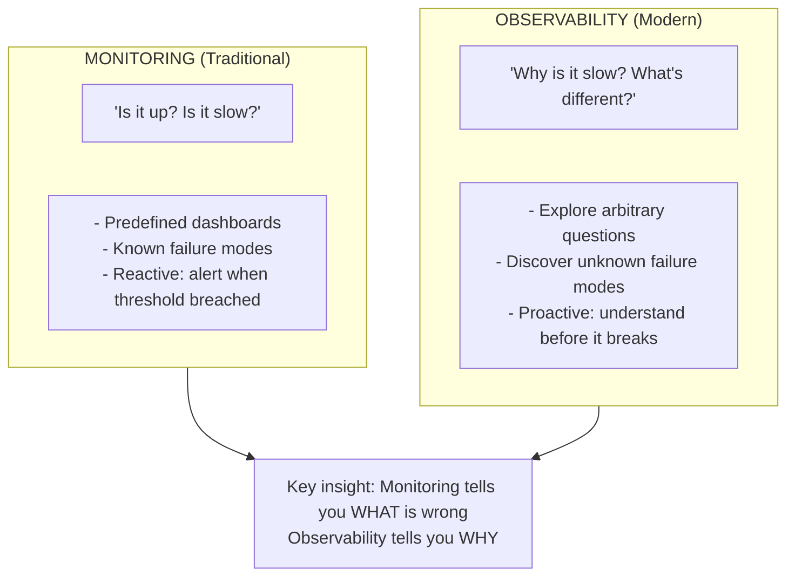
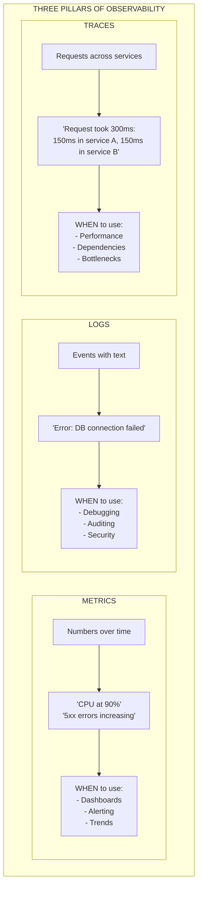
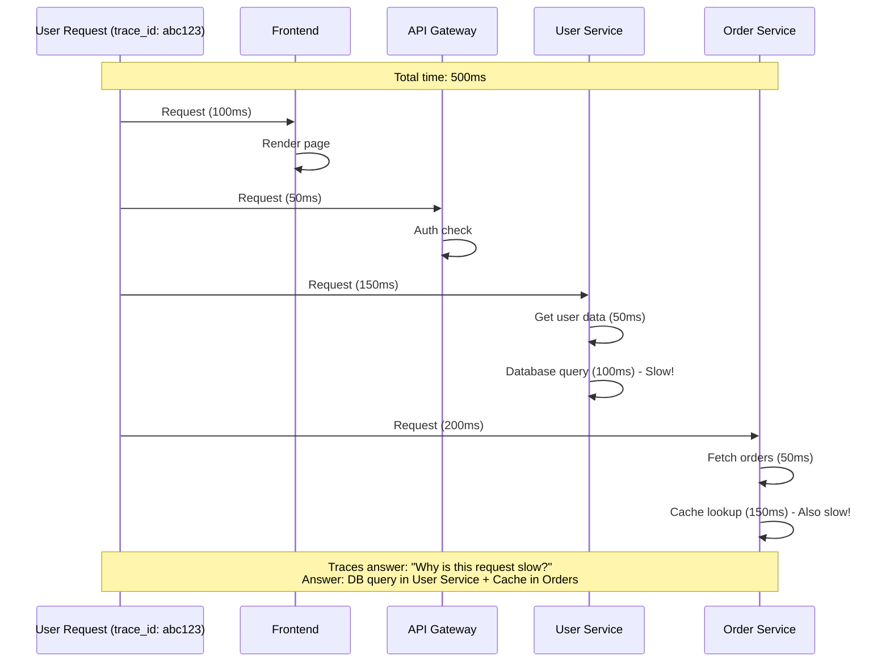
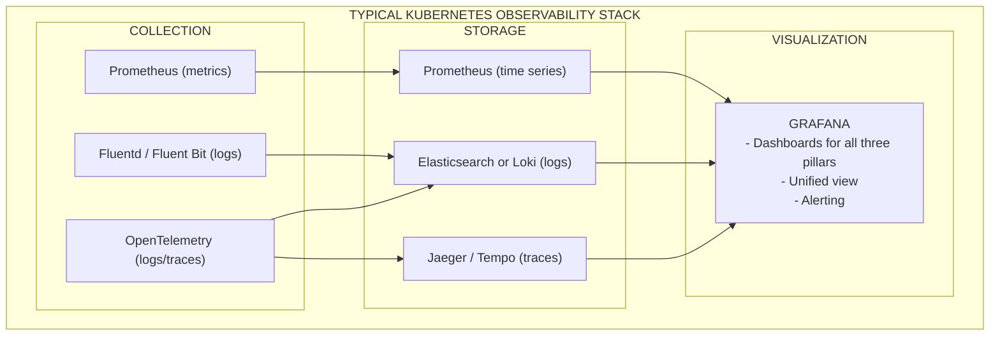
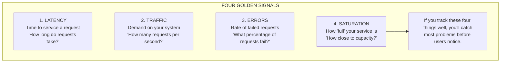
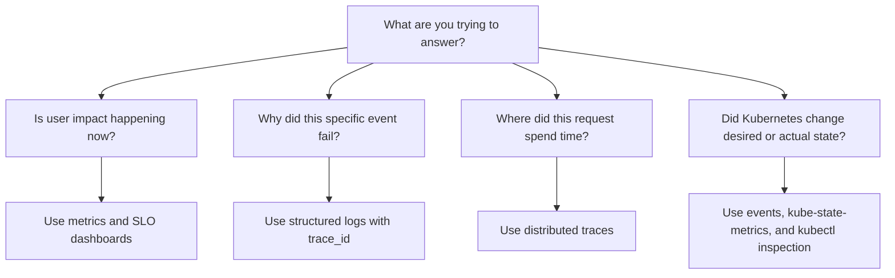

# Module 1.4: Observability Fundamentals

> **Complexity**: `[MEDIUM]` - Critical operational skill
>
> **Time to Complete**: 90-120 minutes
>
> **Prerequisites**: Basic understanding of distributed systems, Kubernetes deployments, and API architectures.

## Learning Outcomes

After completing this module, you will be able to:

- **Compare** traditional monitoring approaches with modern observability practices across complex, distributed architectures.
- **Evaluate** system health by designing Prometheus queries that use Counters, Gauges, and Histograms without distorting the underlying math.
- **Diagnose** distributed failures by tracing requests across service boundaries with span correlation, context propagation, and OpenTelemetry.
- **Implement** structured JSON logging that supports fast, programmatic investigation during high-pressure incidents.
- **Design** Service Level Indicators and Service Level Objectives that measure user experience instead of brittle infrastructure symptoms.

## Why This Module Matters

On August 10, 2021, an edge-case slow query from a high-traffic internal application degraded one of GitHub's primary MySQL databases. The cluster's queuing and retry logic prevented automatic recovery, and engineers opened their dashboards to diagnose the problem — only to find the dashboards down too, because they ran on the same affected database. GitHub spent part of its incident response window diagnosing why it could not see what was broken. The first wave lasted seventy-seven minutes; a second related incident lasted three hours later that day. When a system's monitoring depends on the system being monitored, mean-time-to-diagnose climbs non-linearly during the worst incidents — observability tooling must be architecturally isolated from the workloads it observes.

Kubernetes v1.35+ platforms make this lesson more urgent because the thing you are operating is rarely a single long-lived server. A request may pass through a cloud load balancer, ingress controller, API gateway, authentication service, feature flag client, message broker, cache, database, and third-party provider before the user sees a response. Every hop is independently deployed, scaled, restarted, and owned. The operational question changes from "is the server up?" to "which part of this request path changed, how much user pain did it create, and what should we do first?"

Observability is the discipline that lets you answer those questions from external outputs: metrics, logs, traces, events, and the relationships between them. It does not replace good testing, safe deployment, or simple architecture, but it changes the incident from guesswork into investigation. In this module, you will build the mental model behind observability, learn when each telemetry signal is useful, practice Kubernetes-native inspection with the `k` alias for `kubectl`, and design alerts that protect users rather than merely describing busy infrastructure.

## What Observability Adds Beyond Monitoring

Observability is a property of a system, not a brand name for a dashboard product. In control theory, a system is observable when its internal state can be inferred from its external outputs. For software teams, that means you can ask new questions during an incident without shipping emergency debug code first. You can compare a broken request against a healthy one, connect a latency spike to the slow service span that caused it, and locate the log record that explains the failure mode.

Traditional monitoring is still useful, but it assumes you already know the failure you are looking for. A CPU panel answers whether CPU is high. A disk alert answers whether free space is low. Those checks are valuable for known hazards, especially on simpler systems, but distributed platforms fail through interactions that are difficult to predict. A payment provider can slow down, causing application threads to pile up, database connections to stay open, and queue consumers to fall behind. No single "CPU over threshold" alert explains that chain.



The diagram is deliberately simple because the cultural difference is simple. Monitoring starts with predetermined questions, while observability preserves enough context to support questions you did not know you would need. A team with only monitoring may know that checkout latency is bad, then open separate tools and manually search by timestamp. A team with observability can start from the latency graph, jump to the representative slow trace, and then inspect logs for the same trace identifier.

This difference matters most under stress. During a severe incident, people do not become more patient, more precise, or more willing to read ambiguous dashboards. They need telemetry that reduces choices. Good observability tells the responder where the user pain is, how quickly it is growing, which dependency path is involved, and what evidence supports the next action. It also helps after the incident, because the same data explains whether the fix actually restored service.

Pause and predict: a web application's Prometheus metrics show a stable memory gauge, but users see intermittent connection drops and `kube_pod_status_phase` suggests pods are restarting. If the pod is killed for memory pressure between scrapes, the gauge may never show the peak. What signal would you add to avoid missing that failure next time, and why would it complement the metric instead of replacing it?

The practical answer is to add Kubernetes events, restart counters, and application logs that record shutdown context. Metrics are sampled, so they can miss fast spikes when the scrape interval is wider than the failure. Events and logs are discrete records, so they preserve the fact that the kubelet killed a container even if the resource graph looks calm. The lesson is not that metrics are weak; it is that every signal has a shape, and observability comes from combining shapes intelligently.

```bash
# CLI convention for this module:
alias k=kubectl

# Confirm the client and server are available before starting the lab.
k version
k cluster-info
```

Using the short alias keeps commands readable, but it does not change the underlying tool. In production documentation, teams should state aliases explicitly before using them, because an alias that feels obvious to one engineer may be invisible to another. Throughout the rest of the module, `k` means `kubectl`, and the Kubernetes examples assume a v1.35+ cluster or a local cluster with compatible API behavior.

## The Three Pillars and Their Tradeoffs

The classic teaching model for observability uses three pillars: metrics, logs, and traces. That model is useful because each pillar answers a different investigative question. Metrics compress behavior into numbers over time, logs preserve detailed events, and traces connect operations into a request path. A mature platform does not choose one pillar and ignore the others; it correlates them so responders can move from symptom to evidence without rebuilding the incident timeline by hand.



Metrics are the nervous system because they are cheap to store and excellent for trend detection. A counter can tell you that requests per second doubled, an error ratio crossed a threshold, or a queue is growing faster than workers can drain it. Metrics are also lossy by design. They intentionally discard individual request context so they can scale across months of history and thousands of targets. That compression makes them perfect for alerting, but insufficient for explaining every root cause.

Logs are the system's memory because they retain the details that aggregation removes. A structured log can capture the error class, request route, dependency name, retry count, and trace identifier that explain why a metric moved. The tradeoff is cost. Logs are heavier to transmit, index, search, and retain, especially when developers log every successful request just because they want a traffic count. Logs should contain high-value events and diagnostic context, not become a second metrics backend.

Traces are the system's map because they show how one request moved through the architecture. They are the best tool for latency questions in service-oriented systems, because they reveal where time was spent instead of merely showing that time was spent. Their tradeoff is volume and overhead. A high-throughput platform usually cannot keep every trace forever, so it must sample intelligently while preserving the abnormal requests that engineers will need during incidents.

The pillars become far more powerful when they share labels and identifiers. If a Prometheus graph shows error rate rising for `service=checkout`, the trace backend should let you filter by the same service, and the log backend should contain `trace_id` fields for the failing requests. Without shared metadata, every tool becomes a separate island. With shared metadata, the responder can follow evidence in the same way a doctor moves from a vital sign to a scan to a lab result.

Which approach would you choose here and why: logging every HTTP request body so you never miss detail, or emitting a request counter plus structured logs for errors and sampled slow requests? The second design is usually better because it separates measurement from diagnosis. Counters are cheap enough for every request, while logs stay focused on the events where their detail is actually needed. The first design feels safe until storage cost, privacy exposure, and query latency make the telemetry system harder to operate than the application.

## Metrics With Prometheus

Metrics are numeric measurements collected over time, usually with labels that describe where the measurement came from. In Kubernetes, Prometheus is the common standard because it pulls metrics from HTTP endpoints and stores them as time series. The pull model fits Kubernetes well: services and pods can appear or disappear, and Prometheus can discover scrape targets from the API server rather than waiting for every workload to push data correctly.

The most important Prometheus skill is choosing the correct metric type. A Counter represents a value that only increases until the process restarts, such as total requests handled. A Gauge represents a current value that can rise or fall, such as memory usage or active connections. A Histogram records observations into buckets so you can reason about distributions, especially latency. These choices are not cosmetic; they determine which PromQL operations are valid later.

```text
Counter (always increases):
  - http_requests_total
  - errors_total
  - bytes_sent_total

Gauge (can go up or down):
  - temperature_celsius
  - memory_usage_bytes
  - active_connections

Histogram (distribution):
  - request_duration_seconds
  - Shows: p50, p90, p99 latencies
```

Counters become useful when you calculate rates. If you graph `http_requests_total` directly, the line mostly climbs forever, which says little about current traffic. `rate(http_requests_total[5m])` converts the counter into per-second growth over a rolling window, which is what operators actually need during an incident. This is why using a Gauge for a cumulative count is damaging: the data may look numeric, but the intended math no longer matches the metric.

Gauges are best for state that can move in both directions. Memory usage, queue depth, pod count, and active connections are natural gauges because they represent "how much right now." They can still be misleading when interpreted without context. A queue depth of one thousand may be harmless during a planned batch job and severe during interactive checkout. A useful dashboard pairs the gauge with traffic, processing rate, and user-facing latency so responders can tell whether the state is normal.

Histograms protect you from averages. If ninety-nine requests complete quickly and one request takes several seconds, the average may look acceptable while a real user suffers. Percentiles such as p90 and p99 expose the slower tail of the distribution. In reliability work, tail latency often matters more than mean latency because users judge the service by their own request, not by the average of everyone else's experience.

```text
# Prometheus collects metrics by scraping endpoints
# Your app exposes metrics at /metrics

# Example metrics endpoint output:
# HELP http_requests_total Total HTTP requests
# TYPE http_requests_total counter
http_requests_total{method="GET",path="/api",status="200"} 1234
http_requests_total{method="POST",path="/api",status="500"} 12

# HELP request_duration_seconds Request latency
# TYPE request_duration_seconds histogram
request_duration_seconds_bucket{le="0.1"} 800
request_duration_seconds_bucket{le="0.5"} 1100
request_duration_seconds_bucket{le="1.0"} 1200
```

Labels are the source of Prometheus's analytical power and one of its easiest failure modes. Labels such as `method`, `status`, `route`, `namespace`, and `service` let you slice the same metric across useful operational dimensions. Labels such as `user_id`, `email_address`, `session_token`, or raw URL path fragments can create unbounded cardinality. Every unique label combination is a separate time series, so an innocent-looking user label can create millions of series and exhaust memory.

The safest rule is to label by bounded operational categories, not by identities or arbitrary values. A route template like `/orders/{id}` is usually safe, while `/orders/928381` is not. A software version label is useful because it helps compare a new release against an old one. A request identifier label is dangerous because it creates a new time series for every request. If you need per-request detail, use logs and traces where that detail belongs.

```promql
# Rate of requests per second over 5 minutes
rate(http_requests_total[5m])

# Error rate
sum(rate(http_requests_total{status=~"5.."}[5m]))
/
sum(rate(http_requests_total[5m]))

# 99th percentile latency
histogram_quantile(0.99, rate(request_duration_seconds_bucket[5m]))
```

PromQL rewards clear thinking. The error-rate query divides failing request rate by total request rate, which turns raw counts into a user-facing ratio. The histogram query estimates the 99th percentile from bucket rates, which is more meaningful than calculating an average duration. When you evaluate system health, ask whether the query matches the question. "Are users failing checkout?" needs an error ratio for checkout traffic, not a node CPU graph.

A practical war story shows the difference. A team once paged on high container CPU for a search service every afternoon, but users were not affected because the service was warming caches during expected traffic. The alert trained responders to ignore pages. When the team replaced that alert with latency and error-rate SLO burn alerts, the noise disappeared, and the next real incident pointed to a broken dependency instead of a busy container. The metric did not become less true; it became less central to paging.

## Logs, Events, and Kubernetes Runtime Evidence

Logs are timestamped records of discrete events. They explain things that metrics intentionally hide: the exception type, the payment provider response code, the feature flag state, the tenant identifier, or the retry decision. In a small system, a human can read unstructured logs and still make progress. In a Kubernetes platform, where pods are short-lived and logs flow from many replicas at once, the structure of the log is as important as the message.

```json
UNSTRUCTURED (hard to parse):
2024-01-15 10:23:45 ERROR Failed to connect to database: connection refused

STRUCTURED (JSON, easy to query):
{
  "timestamp": "2024-01-15T10:23:45Z",
  "level": "error",
  "message": "Failed to connect to database",
  "error": "connection refused",
  "service": "api",
  "pod": "api-7d8f9-abc12",
  "trace_id": "abc123def456"
}
```

Structured JSON logging turns each log line into a small record with named fields. That matters because incident response is full of filtering questions: show errors for one service, one route, one version, or one trace identifier. Regex can sometimes extract those fields from text, but regex written during an outage is fragile and slow. If the application emits fields directly, the logging backend can index them and responders can query with confidence.

Log levels are a contract with future responders. `DEBUG` should help local development or temporary deep investigation. `INFO` should record meaningful lifecycle events, not every line of normal execution. `WARN` should mark unexpected but recoverable conditions. `ERROR` should mean work failed and may require attention. `FATAL` should mean the process cannot continue. When every message is an error, the level loses meaning and alerts become noisy.

| Level | When to Use |
|-------|-------------|
| DEBUG | Detailed info for debugging (disabled in prod) |
| INFO | Normal operations, milestones |
| WARN | Something unexpected, but recoverable |
| ERROR | Something failed, needs attention |
| FATAL | Application cannot continue |

Kubernetes gives you immediate access to container stdout and stderr through the API server, which is convenient for fast inspection. The default runtime log path is not a long-term archive, though. If a pod is deleted, rescheduled, or garbage-collected from the node, local log files may disappear. Production observability therefore uses a DaemonSet collector such as Fluent Bit, Fluentd, Promtail, or an OpenTelemetry Collector agent to ship logs away from nodes before the workload lifecycle removes them.

```bash
# View logs
kubectl logs pod-name
kubectl logs pod-name -c container-name  # Multi-container
kubectl logs pod-name --previous         # Previous crash
kubectl logs -f pod-name                 # Follow (tail)
kubectl logs -l app=nginx                # By label
```

The `--previous` flag is especially important because crash loops often hide the useful evidence in the terminated container instance. If an application starts, fails, and restarts quickly, plain logs may show only the current attempt. Previous logs let you inspect the last failed attempt without racing the restart loop. That one flag often separates a five-minute diagnosis from a long search through central logs.

Events are adjacent to logs but not the same thing. Kubernetes events describe control-plane observations such as scheduling failures, image pull problems, failed readiness probes, scaling actions, evictions, and volume mount issues. They are not application logs, and they are not durable enough to be your only audit record, but they are excellent context. When a metric says replicas are unavailable, events often explain whether the scheduler, image registry, kubelet, or probe configuration is involved.

The most useful logging architecture enriches records at collection time. A collector can add namespace, pod, container, node, labels, annotations, and cluster name before shipping logs to storage. That enrichment lets responders ask operational questions even when application code forgot to include the right fields. The application should still emit `trace_id`, request route, and domain context, because collectors cannot infer business meaning from stdout alone.

Before running this in a real cluster, what output do you expect from `k logs --previous` when a pod has never restarted? You should expect Kubernetes to report that no previous terminated container exists. That answer is useful because it tells you the failure is probably not hidden in an earlier container instance. If the pod has restarted, previous logs become the first place to look for startup exceptions, failed migrations, missing environment variables, or dependency timeouts.

## Traces, Context Propagation, and OpenTelemetry

Distributed tracing follows a single request across multiple services. A trace is the full journey, and each span is one operation within that journey. A span may represent an HTTP handler, database query, cache lookup, queue publish, or call to an external API. When spans carry parent-child relationships and timing data, the tracing backend can render the request as a waterfall, showing which operations happened in sequence, which overlapped, and where time was lost.



The trace works because context travels with the request. When the first service receives a request, it creates or accepts a trace identifier and records a root span. When it calls another service, it injects standardized context into outbound headers, commonly using the W3C `traceparent` format. The downstream service reads that context, creates a child span, and repeats the process. The backend later stitches spans together by trace ID, span ID, and parent ID.

| Term | Definition |
|------|------------|
| Trace | Complete journey of a request |
| Span | Single operation within a trace |
| Trace ID | Unique identifier for the trace |
| Span ID | Unique identifier for a span |
| Parent ID | Links child spans to parents |

Context propagation is easy to break accidentally. A service may make an HTTP call with a client library that does not forward headers. A queue consumer may start new work without linking it to the producing request. A background job may retry after the original trace has ended. These are not just tracing bugs; they are missing links in the operational story. If the trace stops at the gateway, the responder loses the path precisely when the system becomes interesting.

OpenTelemetry reduces lock-in by standardizing how applications create and export telemetry. Instead of instrumenting code directly for one vendor backend, the application uses OpenTelemetry APIs and SDKs, while the collector exports to systems such as Jaeger, Tempo, Prometheus-compatible backends, or commercial platforms. This separation matters because observability stacks change over time. You want instrumentation to survive backend migrations, cost changes, and organizational decisions.

Tracing also forces teams to think about sampling. Capturing every trace in a low-volume internal service may be fine, but capturing every trace in a high-frequency path can overwhelm the network and backend. Head-based sampling decides early whether to keep a trace, which is simple and cheap but may drop rare failures. Tail-based sampling waits until more of the trace is known, then keeps errors or slow requests, which is operationally richer but requires buffering and collector capacity.

Stop and think: you are designing telemetry for a trading platform where individual operations are processed in microseconds. If you enable full trace retention for every transaction, the telemetry pipeline may become a meaningful part of latency and cost. A better design might sample ordinary successful requests, always keep failed or unusually slow traces, and run the collector close to the workload so span export does not sit on the critical path.

The most valuable traces are not isolated screenshots; they are connected evidence. If application logs include the same `trace_id`, an engineer can move from the slow span to the exact exception record for that request. If metric exemplars link a latency bucket to representative traces, a dashboard can become the starting point for investigation rather than the end of it. The goal is not to admire traces; the goal is to reduce the distance between symptom and cause.

## A Unified Kubernetes Observability Stack

A mature Kubernetes observability stack treats collection, storage, visualization, and alerting as separate concerns. Prometheus commonly collects metrics, a log collector ships stdout and events, and OpenTelemetry gathers traces and sometimes logs or metrics. Storage backends are chosen for the shape of the data: time-series databases for metrics, label-aware or full-text systems for logs, and trace stores for span graphs. Grafana often provides the shared investigation surface across those backends.



This architecture is powerful because it avoids turning one tool into everything. Prometheus is excellent at metrics and alert rules, but it is not a general log store. Loki can make Kubernetes logs cheaper by indexing labels rather than every word, but it does not replace histograms for latency objectives. Jaeger and Tempo help visualize traces, but they do not tell you whether a service violated its error budget across a month. The stack works when each component does its job and shares enough context with the others.

Kubernetes adds its own native signals. `metrics-server` provides current CPU and memory through the resource metrics API, which powers commands such as `k top`. It is useful for quick checks and autoscaling inputs, but it does not provide historical analysis. `kube-state-metrics` watches the Kubernetes API and exports desired-state and actual-state metrics, such as available replicas, pod phases, and deployment status. Together, they help connect workload symptoms to control-plane state.

```bash
# First, install metrics-server (kind clusters don't include it by default)
kubectl apply -f https://github.com/kubernetes-sigs/metrics-server/releases/latest/download/components.yaml
# For kind/local clusters, patch it to work without TLS verification:
kubectl patch deployment metrics-server -n kube-system --type=json \
  -p '[{"op":"add","path":"/spec/template/spec/containers/0/args/-","value":"--kubelet-insecure-tls"}]'
# Wait ~60 seconds for metrics to start collecting, then:
kubectl top nodes
kubectl top pods

# Resource usage
NAME          CPU(cores)   MEMORY(bytes)
node-1        250m         1024Mi
node-2        100m         512Mi
```

The original long-form commands above are common in official examples, but the lab uses the declared alias for day-to-day operation. The distinction is useful in real teams: documentation can show canonical `kubectl` for clarity and still teach engineers to use `k` interactively. What matters operationally is that the cluster state can be inspected quickly and that the command output is interpreted correctly. `k top` shows current resource usage, not a root cause by itself.

```bash
# Same check using the module alias after metrics-server is ready.
k top nodes
k top pods
k get pods -A
k get events -A --sort-by='.lastTimestamp'
```

| Metric | What It Tells You |
|--------|-------------------|
| `container_cpu_usage_seconds_total` | CPU consumption |
| `container_memory_usage_bytes` | Memory consumption |
| `kube_pod_status_phase` | Pod lifecycle state |
| `kube_deployment_status_replicas_available` | Healthy replicas |
| `apiserver_request_duration_seconds` | API server latency |

The table shows why Kubernetes telemetry needs both resource and state signals. CPU and memory can reveal pressure, but pod phase and available replica metrics explain whether controllers are achieving the desired state. API server latency matters because a slow or overloaded control plane can make the whole cluster feel unreliable even when application pods are healthy. During an incident, combine these signals instead of treating any one of them as the final answer.

## SLIs, SLOs, Alerts, and Golden Signals

Service Level Indicators and Service Level Objectives translate observability into reliability decisions. An SLI is a measured fact about service behavior, usually from the user's perspective. An SLO is the target you commit to internally over a window of time. An SLA is the external contract that may include financial penalties. Engineers focus mainly on SLIs and SLOs because they determine when reliability work should take priority over feature work.

The most common mistake is defining SLIs around infrastructure instead of user experience. A database can be up while checkout fails. A pod can be ready while every request returns an application error. A node can be busy while users are happy. A better SLI describes successful user work, such as "the proportion of checkout requests that return a successful response within 300ms over a rolling 30-day window." That wording connects measurement to the thing the user actually values.

An SLO creates an error budget: the allowed amount of unreliability during the window. If the target is 99.9%, the remaining 0.1% is the budget that can be spent by failures, risky releases, dependency outages, and operational mistakes. This is not a loophole for low quality. It is a mechanism for making tradeoffs explicit. If the budget is healthy, the team can accept measured release risk. If the budget is exhausted, the team should reduce change and invest in reliability.

```yaml
# Prometheus AlertManager rule
groups:
  - name: kubernetes
    rules:
      - alert: PodCrashLooping
        expr: rate(kube_pod_container_status_restarts_total[15m]) > 0
        for: 5m
        labels:
          severity: warning
        annotations:
          summary: "Pod {{ $labels.pod }} is crash looping"

      - alert: HighErrorRate
        expr: |
          sum(rate(http_requests_total{status=~"5.."}[5m]))
          /
          sum(rate(http_requests_total[5m])) > 0.05
        for: 5m
        labels:
          severity: critical
        annotations:
          summary: "Error rate above 5%"
```

The first alert can be useful as a warning because crash loops often need attention, but it should not automatically wake someone unless the service impact justifies it. The second alert is closer to user pain because it measures failed requests. In practice, mature teams often use multi-window SLO burn-rate alerts rather than a single error-rate threshold. Burn-rate alerts compare how quickly the error budget is being consumed across short and long windows, reducing both delayed detection and noisy pages.

```text
Good alerts:
- Actionable (someone can fix it)
- Urgent (needs immediate attention)
- Not noisy (low false positives)
- Based on SLO violations

Bad alerts:
- "CPU at 80%" (so what? Are users affected?)
- Every pod restart (expected sometimes in K8s)
- Alert fatigue = ignored alerts
```

The Four Golden Signals are a practical starting point for user-centered alerting. Latency measures how long work takes. Traffic measures demand. Errors measure failed work. Saturation measures how close the system is to a limit. These signals do not replace domain-specific indicators, but they prevent teams from building hundreds of pages for every possible internal cause. If you watch these signals well, most severe user-impacting problems become visible quickly.



Consider a Black Friday checkout incident. A database CPU alert fires first, and a tired responder restarts the database because that is the loudest symptom. The restart does not help because the real issue is an external payment gateway taking 30 seconds to time out. Application threads hold database connections while waiting, causing lock contention and CPU pressure. Observability changes the path: an SLO alert shows checkout failures, the latency histogram shows p99 damage, and a trace points to the payment call.

That example also shows why alerts should lead to action. "Database CPU high" invites speculation. "Checkout success SLO burning fast because payment spans are timing out" points toward a mitigation, such as routing to a backup provider, disabling a risky feature, or accepting orders asynchronously. The best alert is not merely true. It is true, urgent, user-relevant, and attached to a runbook or decision that an on-call engineer can execute.

Alert quality also depends on ownership. A page that goes to everyone usually belongs to no one, because each person assumes another team has more context or authority. A useful page names the affected service, the user-facing symptom, the likely owning team, and the first diagnostic view to open. This is why service catalogs and consistent labels matter for observability. They turn telemetry from anonymous data into routed operational responsibility.

Runbooks should be written as decision aids, not encyclopedias. During a stressful incident, a responder needs the first few checks that separate common causes, the commands that gather decisive evidence, and the rollback or mitigation paths that are safe to execute. A runbook that starts with ten pages of background will not be read when the service is burning. A good runbook links to deeper context, but its opening section should help the on-call engineer decide what to do in the next few minutes.

Retention policy is part of alert design because history changes what you can prove. High-resolution metrics are valuable during a live incident, but the same resolution may be unnecessary after a few days. Logs for security-sensitive events may need longer retention than verbose debug logs. Traces for failed or slow requests are usually more valuable than traces for ordinary successful requests. The platform should make these retention choices explicit, because silent default retention often becomes either expensive or insufficient.

Sampling deserves the same level of care. Random head sampling can be enough for broad latency exploration, but it may drop rare errors that matter. Tail sampling can keep errors and slow requests, but the collector must buffer spans long enough to make that decision. Log sampling can reduce cost, but it should never discard audit records or security events that policy requires. The correct sampling strategy depends on the question the telemetry must answer, not on a generic percentage copied from another system.

Privacy and security are observability concerns as well. Telemetry often contains user identifiers, IP addresses, request paths, headers, exception messages, and sometimes business data. A team that ships all of that detail to every dashboard creates a new risk surface. Strong observability design includes redaction, access control, retention limits, and clear rules about which fields can be indexed. The goal is to make incidents debuggable without turning the telemetry platform into an uncontrolled copy of production data.

Finally, observability should be tested like any other production feature. If a new service launches without metrics, logs, trace propagation, dashboards, and SLO definitions, it is not operationally complete. Teams can add release checks that confirm basic telemetry exists before production rollout. They can run game days where a dependency is slowed or a pod is crash-looped, then measure whether responders can find the cause using the intended signals. These practices keep observability from becoming documentation that no deployed system actually follows.

The healthiest teams also review telemetry after quiet periods, not only after outages. If an alert has not fired in months, it may be protecting an important invariant, or it may be dead configuration that nobody trusts. If a dashboard is never opened during incidents, it may need redesign or removal. Regular review keeps the observability system aligned with the services it is supposed to explain.

## Patterns & Anti-Patterns

Strong observability patterns share a theme: they preserve context while controlling cost. Instrument application boundaries, not only infrastructure. Emit bounded labels for metrics, structured fields for logs, and trace context across service calls. Put user-facing SLIs at the center of dashboards, then use infrastructure signals as supporting evidence. This design lets responders start with impact, move toward cause, and stop once the recovery action is clear.

| Pattern | When to Use | Why It Works | Scaling Consideration |
|---------|-------------|--------------|-----------------------|
| Golden Signal dashboards | Every user-facing service | Keeps attention on latency, traffic, errors, and saturation | Add service, route, region, and version filters without adding unbounded labels |
| Trace-context logging | Any distributed request path | Connects logs to traces and metrics during incidents | Ensure every service propagates `traceparent` and logs `trace_id` |
| SLO burn-rate alerting | Services with reliability targets | Pages on budget consumption instead of noisy causes | Tune short and long windows based on user impact and team response time |
| Collector-based enrichment | Kubernetes clusters with many teams | Adds pod, namespace, node, and label context consistently | Control label cardinality before data reaches storage |

The matching anti-patterns usually come from understandable pressure. Teams over-log because they fear missing evidence. They alert on every internal metric because they fear being blamed for silence. They add high-cardinality labels because one investigation needed that dimension once. Each decision feels reasonable locally, but the combined system becomes expensive, slow, and noisy. Observability quality depends on resisting the temptation to collect everything in the most detailed form.

| Anti-Pattern | What Goes Wrong | Better Alternative |
|--------------|-----------------|--------------------|
| Logging every successful request body | Creates cost, privacy risk, and slow searches | Use counters for volume, sampled logs for diagnostics, and redaction for sensitive fields |
| Paging on every pod restart | Trains engineers to ignore expected platform behavior | Page on SLO impact; route restart signals to dashboards or lower-severity tickets |
| Using user identifiers as metric labels | Explodes time-series cardinality and can crash Prometheus | Put user identifiers in protected logs or traces when needed for investigation |
| Deploying disconnected tools | Forces manual timestamp matching during outages | Standardize service labels, trace IDs, and dashboard links across all pillars |

## Decision Framework

Choosing the right telemetry starts with the question you need to answer. If you need to know whether a problem is happening and how severe it is, start with metrics. If you need the detailed reason an event occurred, inspect structured logs. If you need to know where time went across services, inspect traces. If you need to know whether Kubernetes itself changed workload state, inspect events and state metrics. The best engineers move between these signals deliberately rather than opening every tool at once.



| Situation | Start With | Then Pivot To | Avoid |
|-----------|------------|---------------|-------|
| Users report slow checkout | Latency histogram and SLO dashboard | Trace for a slow checkout request, then logs for the slow span | Restarting infrastructure before locating the slow dependency |
| Error rate rises after deploy | Error ratio by version and route | Logs and traces filtered by new version | Searching all logs without labels or version context |
| Pods are unavailable | Deployment and pod state metrics | Events, `k describe`, and previous container logs | Treating CPU as the only health signal |
| Storage cost explodes | Ingestion volume by signal and label | Retention policy, sampling, and cardinality review | Turning off telemetry globally during incidents |

This framework is intentionally operational. It does not ask which vendor you bought or which dashboard looks most impressive. It asks what evidence will narrow the decision. During a real incident, the next action might be rollback, traffic shift, dependency failover, rate limiting, queue draining, or feature disablement. Observability is successful when it makes that choice faster and more defensible.

## Did You Know?

- **GitHub published a public availability report** for its August 2021 MySQL incident, naming the secondary-incident root cause (a service-discovery misconfiguration during GitHub Actions setup) — the kind of separately-failing dependency that observability is supposed to surface before users do.
- **The term "observability"** comes from control theory and is associated with Rudolf E. Kalman's 1960 work on dynamic systems.
- **Prometheus graduated from the CNCF** on August 9, 2018, becoming one of the foundation's earliest graduated cloud-native projects after Kubernetes.
- **W3C Trace Context reached Recommendation status** in 2021, giving distributed tracing tools a standard way to propagate trace identifiers across services.

## Common Mistakes

| Mistake | Why It Happens | How to Fix It |
|---------|----------------|---------------|
| Treating CPU as the primary page signal | Infrastructure graphs are easy to collect, so teams mistake busy resources for user pain. | Page on SLO burn, latency, and error impact; keep CPU as supporting diagnostic context. |
| Using unstructured logs for incident workflows | Developers optimize log messages for local reading instead of queryable production investigation. | Emit JSON fields for level, service, route, version, trace ID, error class, and dependency. |
| Adding user IDs or raw paths as metric labels | A one-off debugging need gets placed into a global metric without cardinality review. | Keep labels bounded and move high-cardinality details to protected logs or traces. |
| Breaking trace propagation at service boundaries | Teams instrument one service but forget HTTP clients, queues, workers, or gateways. | Standardize OpenTelemetry instrumentation and test that `traceparent` survives each boundary. |
| Keeping every trace forever | Full retention feels safe until ingestion, storage, and query costs overwhelm the backend. | Use sampling policies that retain errors and slow requests while sampling normal traffic. |
| Alerting on every pod restart | Kubernetes restarts are visible and easy to alert on, even when users are unaffected. | Route restart metrics to dashboards and page only when availability or error SLOs burn. |
| Building disconnected dashboards | Each team chooses different labels, tools, and names, so responders manually correlate evidence. | Define common service labels, trace IDs, dashboard links, and runbook entry points. |

## Quiz

<details><summary>1. Scenario: Your team sees stable CPU and memory graphs, but checkout users report intermittent failures after a deployment. Which observability path should you take first?</summary>
Start with user-facing metrics such as checkout error ratio, latency, and traffic by version, because those confirm whether the deployment changed the user experience. Then pivot into traces for failing checkout requests and structured logs filtered by the new version and trace ID. CPU and memory may still be useful later, but they are not sufficient evidence that the service is healthy. This approach compares monitoring symptoms with observability evidence and keeps the investigation centered on user impact.
</details>

<details><summary>2. Scenario: A Prometheus counter named `http_requests_total` rises all day, and a teammate wants to alert when its raw value exceeds one million. How should you evaluate that alert?</summary>
The raw counter value is a poor alert because counters are designed to increase over the life of the process. You should use `rate(http_requests_total[5m])` for traffic volume or divide error request rate by total request rate for an error ratio. The alert should also include service, route, and status labels that are bounded and operationally meaningful. Evaluating the metric type prevents mathematically invalid queries from becoming noisy production alerts.
</details>

<details><summary>3. Scenario: A request through five services takes eight seconds, but each service dashboard only shows average latency. What should you inspect to diagnose the bottleneck?</summary>
Inspect a distributed trace for a slow request, because the trace shows each span and how much time was spent at every boundary. Averages can hide tail latency and cannot explain the path of a single request. If the slow span is a database query or external API call, use the shared trace ID to inspect the relevant structured logs. This connects span correlation, context propagation, and root-cause evidence rather than guessing from aggregate dashboards.
</details>

<details><summary>4. Scenario: A developer proposes adding `user_id` as a Prometheus label to debug one customer's errors. What should you recommend?</summary>
Do not put `user_id` in a Prometheus label because it can create unbounded cardinality and overload the time-series database. Keep metrics labeled by bounded dimensions such as service, route template, status, region, and version. Put the specific user identifier in protected structured logs or traces, subject to privacy and retention rules. This preserves the ability to investigate the customer issue without damaging the metrics backend.
</details>

<details><summary>5. Scenario: During a post-incident review, responders say they lost time matching Grafana timestamps to a separate log search. What design change would reduce that delay?</summary>
Standardize correlation fields across the telemetry stack, especially `trace_id`, service name, route, environment, and version. Metrics should link to representative traces when possible, and logs should include the trace ID emitted by application instrumentation. Dashboards should provide direct pivots into trace and log views for the same time window and labels. The goal is to remove manual timestamp matching so responders can follow evidence quickly.
</details>

<details><summary>6. Scenario: Your checkout SLO is 99.9% successful requests under 300ms over 30 days, and a dependency outage burns most of the error budget. The product owner wants a risky release tomorrow. What should the team do?</summary>
The team should treat the depleted error budget as a signal to reduce risk and prioritize reliability work before the release. Even if the dependency caused the outage, the SLI measures user experience, so users experienced checkout as unreliable. The team can discuss mitigations such as fallback providers, asynchronous acceptance, timeouts, or circuit breakers. SLOs exist to make this tradeoff explicit instead of turning it into an opinion fight.
</details>

<details><summary>7. Scenario: A pod is crash looping, and `k logs` only shows the current startup attempt. Which Kubernetes evidence should you gather next?</summary>
Use previous container logs with `k logs --previous` and inspect events with `k get events --sort-by='.lastTimestamp'`. The previous logs may contain the exception or configuration error from the last failed container instance. Events can show image pull failures, probe failures, evictions, or scheduling issues that application logs do not explain. Combining logs and events gives a more complete diagnosis than repeatedly watching the current container restart.
</details>

## Hands-On Exercise

**Task**: Explore Kubernetes observability fundamentals by deploying an application, viewing dynamic logs, checking resource metrics through the API, simulating a failure, and connecting events back to workload state.

This exercise intentionally starts with the simple tools every Kubernetes engineer has before moving toward the observability habits used in larger platforms. You will deploy NGINX, inspect logs, enable resource metrics, break the workload, and compare events with pod state. The goal is not to build a full Prometheus stack in one lab; it is to practice asking better questions from the evidence Kubernetes already provides.

<details>
<summary>Step 1: Deploy a sample application and expose it.</summary>

```bash
# 1. Deploy a sample application
kubectl create deployment web --image=nginx:1.27 --replicas=3
kubectl expose deployment web --port=80
kubectl wait --for=condition=available deployment/web --timeout=90s
```

Using the module alias, the same workflow is:

```bash
k create deployment web --image=nginx:1.27 --replicas=3
k expose deployment web --port=80
k wait --for=condition=available deployment/web --timeout=90s
```
</details>

<details>
<summary>Step 2: Investigate application logs.</summary>

```bash
# 2. View logs
kubectl logs -l app=web --all-containers
kubectl logs -l app=web -f  # Follow logs (Press Ctrl+C to exit)
```

Using the module alias, the same workflow is:

```bash
k logs -l app=web --all-containers
k logs -l app=web -f
```
</details>

<details>
<summary>Step 3: Enable and check resource metrics.</summary>

```bash
# 3. Check resource usage
# Install metrics-server first (if not already done):
kubectl apply -f https://github.com/kubernetes-sigs/metrics-server/releases/latest/download/components.yaml
kubectl patch deployment metrics-server -n kube-system --type=json \
  -p '[{"op":"add","path":"/spec/template/spec/containers/0/args/-","value":"--kubelet-insecure-tls"}]'
# Wait for metrics-server to become ready:
kubectl rollout status deployment/metrics-server -n kube-system

# Note: It may take an additional 30-60 seconds for metrics to propagate to the API.
kubectl top pods
kubectl top nodes
```

Using the module alias, the same workflow is:

```bash
k apply -f https://github.com/kubernetes-sigs/metrics-server/releases/latest/download/components.yaml
k patch deployment metrics-server -n kube-system --type=json \
  -p '[{"op":"add","path":"/spec/template/spec/containers/0/args/-","value":"--kubelet-insecure-tls"}]'
k rollout status deployment/metrics-server -n kube-system
k top pods
k top nodes
```
</details>

<details>
<summary>Step 4: Simulate a critical failure and review cluster events.</summary>

```bash
# 4. Simulate a problem
# Scale down to 0 (break it)
kubectl scale deployment web --replicas=0

# Check events (kubernetes logs)
kubectl get events --sort-by='.lastTimestamp'
```

Using the module alias, the same workflow is:

```bash
k scale deployment web --replicas=0
k get events --sort-by='.lastTimestamp'
```
</details>

<details>
<summary>Step 5: Restore the application and inspect pod metadata.</summary>

```bash
# 5. Restore application and view pod status
kubectl scale deployment web --replicas=1
kubectl wait --for=condition=ready pod -l app=web --timeout=60s
kubectl get pods -o wide
kubectl describe pod -l app=web
```

Using the module alias, the same workflow is:

```bash
k scale deployment web --replicas=1
k wait --for=condition=ready pod -l app=web --timeout=60s
k get pods -o wide
k describe pod -l app=web
```
</details>

<details>
<summary>Step 6: Generate load and examine access logs.</summary>

```bash
# 6. Generate some logs
kubectl exec $(kubectl get pod -l app=web -o name | head -1) -- \
  curl -s localhost > /dev/null

# View nginx access logs
kubectl logs -l app=web | tail
```

Using the module alias, the same workflow is:

```bash
k exec $(k get pod -l app=web -o name | head -1) -- \
  curl -s localhost > /dev/null
k logs -l app=web | tail
```
</details>

<details>
<summary>Step 7: Perform advanced metric-like queries using JSONPath.</summary>

```bash
# 7. Explore with JSONPath (metrics-like queries)
kubectl get pods -o jsonpath='{range .items[*]}{.metadata.name}{"\t"}{.status.phase}{"\n"}{end}'
```

Using the module alias, the same workflow is:

```bash
k get pods -o jsonpath='{range .items[*]}{.metadata.name}{"\t"}{.status.phase}{"\n"}{end}'
```
</details>

<details>
<summary>Step 8: Clean up resources.</summary>

```bash
# 8. Cleanup
kubectl delete deployment web
kubectl delete service web
```

Using the module alias, the same workflow is:

```bash
k delete deployment web
k delete service web
```
</details>

**Success criteria checklist**:

- [ ] Deployed the NGINX deployment and verified pod creation.
- [ ] Successfully installed and patched the `metrics-server` component.
- [ ] Verified `k top pods` returns current CPU and memory values.
- [ ] Verified `k get events` displays recent scaling activities.
- [ ] Executed the JSONPath query to list pod phases correctly.
- [ ] Cleaned up the deployment and service after the exercise.

## Next Module

Ready to automate the provisioning of the observability stacks you just learned about? Proceed to [Module 1.5: Platform Engineering Concepts](../module-1.5-platform-engineering/) to learn how Internal Developer Platforms deliver complex toolchains as a reliable service for application teams.

## Sources

- [Kubernetes: Resource metrics pipeline](https://kubernetes.io/docs/tasks/debug/debug-cluster/resource-metrics-pipeline/)
- [Kubernetes: Logging architecture](https://kubernetes.io/docs/concepts/cluster-administration/logging/)
- [Kubernetes: Tools for monitoring resources](https://kubernetes.io/docs/tasks/debug/debug-cluster/resource-usage-monitoring/)
- [Kubernetes: Events](https://kubernetes.io/docs/reference/kubernetes-api/cluster-resources/event-v1/)
- [Prometheus: Metric types](https://prometheus.io/docs/concepts/metric_types/)
- [Prometheus: Querying basics](https://prometheus.io/docs/prometheus/latest/querying/basics/)
- [Prometheus: Alerting rules](https://prometheus.io/docs/prometheus/latest/configuration/alerting_rules/)
- [OpenTelemetry: Concepts](https://opentelemetry.io/docs/concepts/)
- [OpenTelemetry: Traces](https://opentelemetry.io/docs/concepts/signals/traces/)
- [W3C Trace Context](https://www.w3.org/TR/trace-context/)
- [Google SRE Book: Service Level Objectives](https://sre.google/sre-book/service-level-objectives/)
- [CNCF: Prometheus graduation announcement](https://www.cncf.io/announcements/2018/08/09/prometheus-graduates/)
