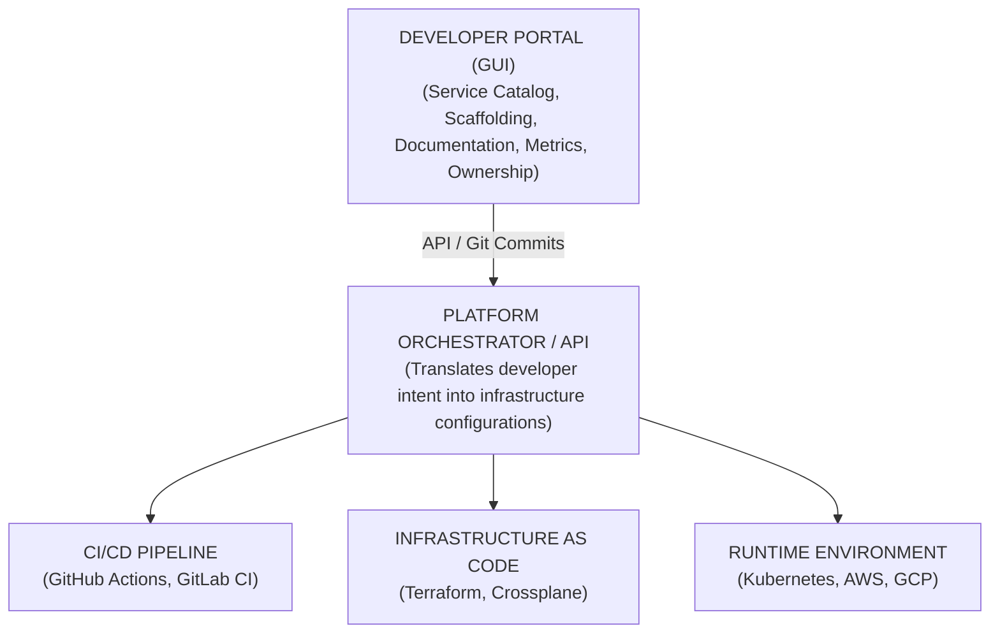

# Module 1.5: Platform Engineering Concepts

**Complexity**: [MEDIUM]  
**Time to Complete**: 45-60 minutes  
**Prerequisites**: Modules 1.1-1.4 (IaC, GitOps, CI/CD, Observability)

## Learning Outcomes

By the end of this module, you will be able to:
- **Design** the architecture of an Internal Developer Platform (IDP) that reduces cognitive load without restricting necessary developer flexibility.
- **Differentiate** the specific responsibilities, tooling, and operational mindsets of Platform Engineering, Site Reliability Engineering (SRE), and traditional DevOps.
- **Evaluate** the organizational readiness for a platform engineering initiative based on engineering headcount, deployment frequency, and existing bottleneck metrics.
- **Formulate** "Golden Paths" that provide paved roads for common deployment scenarios while defining boundaries for unsupported architectural choices.
- **Construct** a foundational service catalog definition using industry-standard tooling paradigms.
- **Measure** platform adoption and developer satisfaction using product management methodologies and engineering metrics.
- **Identify** the anti-patterns of premature platforming and understand when to rely on simpler abstractions.

## Why This Module Matters

> **War Story: The Five-Day Patch Nightmare**
>
> It was a Tuesday afternoon, and a critical zero-day vulnerability had just been disclosed for a popular logging library used across a mid-sized technology company. The security team mandated an immediate patch. The engineering organization consisted of 120 developers spread across 15 autonomous microservice teams. They had fully embraced the "You Build It, You Run It" mantra of early DevOps.
>
> However, over the years, the reality of "running it" had mutated into a nightmare of cognitive load. To patch the library and deploy the fix, a developer needed to navigate an intricate maze of disconnected tools:
> 
> 1. Update the dependency in their `package.json` or `pom.xml`.
> 2. Run local tests to ensure backward compatibility.
> 3. Update the `Dockerfile` because the new library required a different OS-level package dependency that conflicted with the base image.
> 4. Write a Jenkins pipeline script modification because the base image update changed how the build cache was layered.
> 5. Tweak a Helm chart to accommodate a new, mandatory environment variable required by the patched library.
> 6. Open a Jira ticket for the database team to run a schema migration that the new library version expected for audit logging.
> 7. Manually update the PagerDuty escalation policy because the deployment required unexpected downtime and the on-call rotation had shifted.
>
> The patch took five days to roll out across all 15 services. Why? Not because the code change was hard—it was a one-line version bump. The delay happened because the infrastructure and deployment tooling required highly specialized knowledge that the product developers simply did not possess. They were drowning in Kubernetes YAML, Terraform state lock errors, and esoteric CI/CD failures. The company had achieved "DevOps," but at the devastating cost of developer productivity. They had replaced a centralized, siloed operations team with distributed operational chaos.

This is the exact crisis that Platform Engineering was born to solve. When Kubernetes and cloud-native ecosystems became too complex for product developers to manage alongside their primary goal—writing business logic—a new discipline emerged. Platform Engineering treats internal infrastructure as a curated product, offering a self-service Internal Developer Platform (IDP) that abstracts away the cognitive crushing weight of modern infrastructure while retaining its power.

## The Breaking Point of "You Build It, You Run It"

To understand Platform Engineering, we must first deeply analyze the failure modes of its predecessor. The original promise of DevOps was breaking down the wall between development and operations. Developers would take ownership of their code in production, closing the feedback loop and ensuring accountability. In a world of simple monoliths deployed to virtual machines or basic PaaS offerings, this was manageable, efficient, and empowering.

However, in the modern cloud-native era, "running it" means understanding a vast, complex, and rapidly evolving ecosystem.

### The Cloud-Native Burden

To truly own a service in production today, a developer often needs deep, specialized knowledge of:
- **Containerization:** Dockerfile optimization, multi-stage builds to reduce attack surface, rootless containers for security, and image vulnerability scanning.
- **Kubernetes:** Resource limits, CPU requests, scheduling, tolerations, affinity rules, StatefulSets, and custom resource definitions (CRDs).
- **Networking:** Service meshes (Istio, Linkerd), ingress controllers, TLS certificate rotation, and complex network policies governing pod-to-pod communication.
- **Infrastructure as Code (IaC):** Terraform modules, state management, provider configuration, AWS CloudFormation, or Pulumi.
- **GitOps Synchronization:** ArgoCD, Flux, handling configuration drift, and securely managing secrets in Git repositories.
- **Observability Instrumentation:** OpenTelemetry collectors, Prometheus PromQL for querying metrics, Grafana dashboard creation, and distributed tracing spans.

> **Pause and predict**: Count how many of these technologies you interact with weekly. Which ones cause you the most friction?

### The Cognitive Load Crisis

Human working memory has limits. When a developer is forced to understand the intricacies of a Kubernetes `PodDisruptionBudget` just to deploy a basic user authentication feature, their cognitive load exceeds their capacity. They stop thinking about the business domain and start fighting the infrastructure. The "shift left" movement inadvertently shifted everything left until the developers collapsed under the weight.

This leads to three destructive organizational anti-patterns:

1. **Ticket-Driven Operations (The Rebuilt Wall):** Developers give up trying to understand the infrastructure. The organization responds by creating a "Cloud Ops" or "DevOps" team. Developers write code and submit a Jira ticket to provision a database, create a DNS record, or deploy a service. The wall between Dev and Ops is rebuilt, just with modern tools. Lead times stretch from minutes to days as tickets pile up in the ops queue. The agility promised by cloud-native is lost.
2. **Shadow IT and YAML Copy-Pasta:** Developers, desperate to avoid the ticket queue and hit their deadlines, copy Terraform and Kubernetes YAML from other teams without understanding it. "Cargo cult" engineering takes over. Security vulnerabilities proliferate, resource requests are wildly inaccurate (costing the company thousands in wasted cloud spend), and no two services are deployed the same way. When an incident occurs, nobody knows how to fix it because nobody truly understands the copied configuration.
3. **The "10x" Bottleneck:** One or two developers on a product team happen to possess a deep understanding of Kubernetes and Terraform. They become the de-facto release engineers, spending 80% of their time debugging pipelines for their teammates instead of writing product code. They become single points of failure, create massive key-person risk, and are at extreme risk of burnout.

Platform Engineering solves this by shifting the paradigm from *"You build it, you run it"* to *"You build it, the platform runs it, and you control the platform via self-service APIs."*

> **Stop and think**: Think about your current or previous engineering organization. If a developer needs a new Redis cache for their microservice, how many steps does it take? How many different tools must they interact with? How many tickets must they open? If the answer involves waiting on another human or navigating three different cloud provider consoles, you have a platform gap.

## What is Platform Engineering?

Platform Engineering is the discipline of designing, building, and rigorously maintaining toolchains and automated workflows that enable true self-service capabilities for software engineering organizations operating in the highly complex cloud-native era. 

It is a deliberate, massive paradigm shift away from ad-hoc bash scripting, tribal knowledge hoarded by senior engineers, and slow, ticket-based operations teams toward a highly structured, scalable, product-centric approach to infrastructure delivery and management. The CNCF Platform Engineering Maturity Model classifies a Level 3 (Scalable) organization specifically by its adoption of this "Platform as a Product" mindset, characterized by user-focused, data-driven investment and self-service capabilities. Furthermore, the highly influential framework *Team Topologies* (published in 2019 and updated in late 2025) formally defines this as a "platform team" whose entire purpose is to provide a compelling internal product that accelerates "stream-aligned" (product) teams.

At its core, Platform Engineering seeks to fundamentally optimize the "Developer Experience" (DevEx). While the initial DevOps movement successfully tore down the organizational walls between development and operations teams, it simultaneously and unintentionally flooded product developers with an overwhelming deluge of operational responsibilities. Developers were suddenly expected to be experts in Go, React, SQL, Docker, Kubernetes, Terraform, Helm, Prometheus, and AWS IAM roles simultaneously. This is completely unsustainable at scale.

Platform Engineering acts as the necessary course correction. It acknowledges that cognitive load is finite. By building a curated, intelligent abstraction layer over the underlying infrastructure, Platform Engineering allows product developers to safely return their intense focus to their primary, value-generating task: writing the business logic that actually pays the company's bills.

### Platform as a Product: Treating Developers as Customers

A platform team does not dictate how developers work; they build a product that developers *want* to use because it makes their lives undeniably easier. 

This requires treating the internal platform with the exact same rigor, user research, and marketing as an external SaaS product. The platform team must embrace product management methodologies.

- **The Customers:** Internal software developers, data scientists, machine learning engineers, and QA testers.
- **The Product:** The Internal Developer Platform (IDP) and its associated APIs, CLIs, and graphical interfaces.
- **The Metrics:** 
  - **Voluntary Adoption Rate:** What percentage of teams voluntarily use the platform? Mandated adoption obscures whether the platform is actually good.
  - **Time-to-First-Commit:** How long does it take a new hire to deploy a "Hello World" app to production?
  - **Lead Time for Changes:** The time from a committed code change to that change running successfully in production. *(This is a core DORA metric. Note: Industry sources sometimes conflict on whether DORA officially tracks exactly 4 or 5 key metrics as 'Reliability' and 'Rework Rate' have been introduced in recent years, but Lead Time remains fundamental).*
  - **Developer Net Promoter Score (eNPS):** Are developers satisfied with the tooling? Do they recommend it to peers? Are frustrated?
- **The Feedback Loop:** Conducting rigorous user interviews, observing developers "in the wild" as they struggle with deployments, creating frictionless onboarding experiences, and continuously iterating based on specific developer pain points.

> **Analogy:** Think of the platform team as the city planners and the product developers as the citizens. The city planners build paved roads, traffic lights, and public transport (the platform). They don't tell the citizens exactly where to drive or what their destination should be, but they make it incredibly easy and safe to get to the most popular destinations. If a citizen wants to off-road through the wilderness, they can, but they shouldn't expect the city to dispatch a free tow truck if they get stuck in the mud.

If a platform team builds a complex, mandated Kubernetes abstraction that developers hate using and find confusing, they have failed as product managers, even if the underlying technology is elegant and brilliant. "Mandated adoption" is the death knell of a truly successful platform.

### The Concept of "Golden Paths"

A Golden Path (often interchangeably called a "Paved Road" or "Supported Highway") is a highly opinionated, completely automated, aggressively tested, and fully officially supported way to build, test, secure, and deploy software within a specific engineering organization. It is deliberately engineered to be the path of absolute least resistance, designed to be so wildly attractive and frictionless that developers naturally and voluntarily gravitate toward it without any managerial coercion.

If a developer voluntarily chooses to embrace the Golden Path (for example: "Deploy a standard Spring Boot Java microservice with a managed AWS PostgreSQL backend and a Redis cache"), the platform team provides an incredible, enterprise-grade array of automated benefits instantly:

- **Intelligent Scaffolding:** One-click, self-service repository generation pre-loaded with organizational boilerplate code, standardized folder hierarchies, and pre-configured strict linting rules that the security team has already signed off on.
- **Pre-configured CI/CD Pipelines:** Sophisticated, multi-stage pipelines that automatically run unit and integration tests, dynamically build container images using distroless bases, rigorously scan for deeply nested vulnerabilities, and seamlessly deploy to ephemeral staging environments for manual QA sign-off.
- **Out-of-the-box, World-Class Observability:** Immediately pre-configured Grafana dashboards auto-generated from code, standard Prometheus metrics scraping endpoints exposed, and default, finely tuned PagerDuty integrations for critical alerting already routed to the correct on-call team.
- **Automated, Invisible Security:** Static Application Security Testing (SAST), comprehensive Software Composition Analysis (SCA), and dynamic application security testing baked seamlessly into the pipeline execution without ever requiring a human security team member's manual intervention or approval ticket.
- **Default, Scalable Infrastructure:** Production-grade Kubernetes manifests (or Helm charts) generated automatically and invisibly behind the scenes, provisioned with extremely sensible, cost-effective defaults for memory limits, CPU requests, and horizontal pod auto-scaling (HPA) thresholds.

**Crucially, the Golden Path is an accelerator, absolutely not a cage.** Product developers are completely free to step off the paved road at any time. If a specialized feature team insists on using an esoteric graph database written in a niche functional language like Elixir because their highly specific domain logic demands it, they are officially allowed to do so. 

However, they must accept the heavy operational tax: they must build their own bespoke CI/CD pipelines, write their own complex infrastructure as code, and support it themselves in production when it breaks at 3:00 AM on a Sunday. The platform team explicitly only guarantees strict support, stringent SLAs, and deep API integration for the Golden Path itself. This precise contract strikes the perfect, delicate balance between necessary, cost-saving organizational standardization and the absolute freedom required for technical innovation on the edge.

## Internal Developer Platform (IDP) Components

An Internal Developer Platform (IDP) is the physical manifestation of Platform Engineering. It is not a single, monolithic tool; it is a meticulously stitched-together ecosystem of tools presented through a unified interface that abstracts infrastructure complexity. 

*(Note: The industry often confusingly uses the acronym "IDP" to refer to both an "Internal Developer Platform"—the broad underlying system—and an "Internal Developer Portal"—the UI layer. In this module, IDP refers to the complete platform system, of which the portal is just the front door.)*

A mature IDP typically consists of four core components:

### 1. The Developer Portal (The Front Door)
The Developer Portal is the user interface of the IDP. It provides a centralized web dashboard where developers can interact with the platform. Instead of bookmarking 15 different AWS consoles, Datadog dashboards, Jenkins instances, and ArgoCD endpoints, developers go to one centralized place.

*Key capabilities include:*
- Viewing overall system health and deployment statuses across all environments.
- Accessing centralized API documentation (e.g., automatically aggregated Swagger/OpenAPI specs).
- Managing team ownership, operational readiness checklists, and on-call schedules.
- Reading technical documentation, architectural decision records (ADRs), and runbooks.

### 2. The Service Catalog
The Service Catalog is a central, living registry of all software assets in the company—microservices, libraries, data pipelines, and infrastructure components. It eliminates the "tribal knowledge" required to navigate a microservice architecture.

*Key capabilities include:*
- Tracking who exactly owns what (crucial during an incident at 3 AM).
- Mapping dependencies (e.g., visualizing that Service A depends on Service B and Database C).
- Storing metadata (lifecycle stage, programming language, compliance tier, data sensitivity level).
- Preventing "zombie services" (services running in production costing money that no one claims to own or maintain).

### 3. Software Templates (Scaffolding & Self-Service)
Templates provide the mechanism for self-service provisioning. They eliminate the "blank canvas" problem and ensure new services start with the company's best practices embedded from day one.

*Key capabilities include:*
- "One-click" creation of new microservices via a simple web form.
- Automated creation of GitHub repositories with branch protection rules and CODEOWNERS files enforced.
- Immediate provisioning of underlying infrastructure (e.g., spinning up a staging database and injecting the credentials into the application secrets).
- Generating the initial CI/CD pipeline configuration.

### 4. Platform Orchestrator (The Engine)
While the portal is the frontend, the platform orchestrator is the backend engine. It translates developer intent into concrete, verifiable infrastructure state. It is the bridge between the portal and the infrastructure.

*Key capabilities include:*
- Taking an abstract request ("I need a Postgres database") and translating it into the specific Terraform modules or Kubernetes custom resources required to provision it.
- Managing environment-specific configurations dynamically (e.g., using a lightweight, ephemeral container in Dev, but provisioning a managed AWS RDS Multi-AZ instance in Prod).
- Enforcing organizational policies, cost limits, and security compliance checks before infrastructure is provisioned.

### IDP Conceptual Architecture Diagram



> **Stop and think**: Map your current organization's tools to these 4 IDP layers. Which layer is strongest? Which is missing entirely?

## The Ecosystem: Backstage, Port, Humanitec, and Kratix

The tooling landscape for Platform Engineering is maturing rapidly and has exploded into a multi-billion dollar ecosystem. To navigate it, it is critical to understand that different tools operate at fundamentally different layers of the Internal Developer Platform (IDP) architecture. Let us explore four distinct approaches to building an IDP, representing the spectrum from frontend developer portals to backend Kubernetes orchestrators.

### 1. Backstage (The Developer Portal & Catalog)

Created by Spotify (open sourced in March 2020) and donated to the Cloud Native Computing Foundation (CNCF), Backstage is currently the dominant, highly extensible framework for building developer portals (remaining an Incubating project as of April 2026, with over 3,400 adopters and 250+ open source plugins). Some industry marketing suggests it holds a massive majority market share compared to SaaS competitors, though precise figures are difficult to independently verify. It is not an infrastructure provisioner; it is a frontend. It is primarily focused on the **Service Catalog**, **Software Templates**, **TechDocs** (Documentation), and providing a unified UI via a massive plugin ecosystem.

Backstage relies on `catalog-info.yaml` files placed in the root of every single repository. This decentralized, GitOps-driven approach allows the portal to auto-discover services as they are created or modified without requiring a central database to be manually updated by an operations team.

```yaml
# Example: Backstage catalog-info.yaml
apiVersion: backstage.io/v1alpha1
kind: Component
metadata:
  name: payment-routing-service
  description: Handles all credit card processing, PCI tokenization, and external gateway routing
  tags:
    - java
    - spring-boot
    - pci-compliant
    - tier-1
  links:
    - url: https://admin.paymentgateway.com
      title: Gateway Admin Console
      icon: dashboard
  annotations:
    github.com/project-slug: acme-corp/payment-routing-service
    pagerduty.com/integration-key: "xyz123abc_critical_alerts"
    prometheus.io/rule: "payment-service-high-latency-alerts"
    snyk.io/org-id: "security-org-123-finance"
    backstage.io/techdocs-ref: dir:.
spec:
  type: service
  lifecycle: production
  owner: group:checkout-core-team
  system: payment-system
  dependsOn:
    - component:user-auth-service
    - resource:payment-postgres-db
```

By reading this single file, Backstage's plugin engine can generate a comprehensive, highly interactive dashboard. Without writing any custom frontend code, developers can see the service's recent GitHub pull requests, its active PagerDuty on-call schedule, its live Prometheus metrics, its latest security vulnerabilities from Snyk, and even its CI/CD pipeline status from Jenkins or GitHub Actions—all in one place. Developers no longer need to hunt for links; everything related to their service is unified in a single pane of glass.

> **Pause and predict**: Pick a service you work on. What annotations would you include? Who is the owner? What are its dependencies?

**The Drawback:** Backstage is notoriously difficult to adopt. It is essentially a giant React/TypeScript framework. You do not just "install" Backstage; you build a custom React application using Backstage components. This requires dedicated frontend engineers on the platform team, which many backend-heavy infrastructure teams lack.

### 2. Port (The SaaS Alternative to Backstage)

Recognizing the extreme friction of adopting Backstage, a new generation of SaaS-based Internal Developer Portals has emerged, with Port being a leading example. Port offers the same fundamental capabilities as Backstage (Service Catalog, Scorecards, Self-Service Actions) but requires zero React code to configure.

Port focuses heavily on the concept of **Scorecards**. A platform team can define a scorecard for "Production Readiness," which automatically evaluates every service in the catalog against organizational standards:
- Does it have an owner assigned?
- Is the on-call schedule active?
- Is the test coverage above 80%?
- Are there any critical vulnerabilities unpatched for more than 7 days?

If a service fails these checks, its score drops, and the platform team can gamify compliance across the engineering organization without resorting to nagging or Jira tickets.

### 3. Humanitec (The Platform Orchestrator)

While Backstage and Port focus heavily on the frontend catalog and UI, Humanitec focuses on the backend orchestration layer. Humanitec introduces a dynamic configuration manager that takes abstract workload specifications and generates environment-specific Kubernetes manifests and infrastructure definitions on the fly.

Developers write a simple, open-source `score.yaml` file declaring their dependencies (e.g., "I need a database" or "I need an S3 bucket"), and the platform orchestrator resolves that abstract request based on the specific environment context.

```yaml
# Example: Humanitec Score Specification (score.yaml)
apiVersion: score.dev/v1b1
metadata:
  name: user-profile-api
containers:
  user-profile:
    image: myregistry.com/user-profile:latest
    variables:
      DB_CONNECTION_STRING: ${resources.db.connection_string}
resources:
  db:
    type: postgres
  cache:
    type: redis
```

In a local development environment, the orchestrator intercepts this request and might spin up lightweight PostgreSQL and Redis Docker containers via Docker Compose. 

In a staging environment, it might connect the application to a shared database cluster to save costs. 

In production, it securely provisions an isolated, Multi-AZ AWS RDS instance and an ElastiCache cluster, generates the complex Terraform required, applies it, and injects the resulting secret connection strings directly into the application pod. The developer never touches complex Terraform state or Kubernetes YAML directly, significantly reducing cognitive load and absolutely preventing configuration drift across environments.

### 4. Kratix (The GitOps Platform Framework)

Kratix is an open-source framework that allows platform teams to build their own IDP using Kubernetes itself as the underlying control plane. It is heavily favored by teams already deeply invested in GitOps. It introduces the powerful concept of "Promises".

A platform team authors a Promise (e.g., "PostgreSQL-as-a-Service" or "Redis-Cluster-as-a-Service"). Developers request this Promise by creating a simple Kubernetes Custom Resource (CRD), exactly as they would request a standard Kubernetes Pod or Service.

```yaml
# Example: Developer requesting a Kratix Promise
apiVersion: postgres.marketplace.kratix.io/v1alpha1
kind: PostgreSQL
metadata:
  name: user-database
  namespace: checkout-team-namespace
spec:
  size: small
  backup:
    enabled: true
    retention_days: 30
  high_availability: false
  version: "16.2"
  encryption: "kms-managed"
```

The developer doesn't need to know how the backup is implemented via Velero, what Bitnami Helm charts are used beneath the surface, or how the AWS EBS storage classes are configured. The Kratix Promise controller intercepts this Custom Resource request and executes a complex backend pipeline to provision the actual infrastructure via Terraform, Crossplane (a graduated CNCF project that introduced a refined architecture for building control planes in its v2.0 release in late 2025), or Ansible.

This allows the platform team to vend infrastructure as an API, completely abstracting the "how" from the "what."

### Mini-Exercise: Choose Your Platform Path

**Scenario:** GlobalCorp has 400 engineers and a sprawling microservice architecture that has grown organically over five years. Developers constantly complain that they cannot find API documentation, and incident response is chaotic because nobody knows who owns which service when an alert fires. However, their infrastructure provisioning via Terraform is actually quite stable and well-understood by the feature teams. 

> **Stop and think**: Based on this scenario, which tool (Backstage, Port, Humanitec, or Kratix) should GlobalCorp prioritize adopting first, and why?

<details>
<summary><strong>View the Answer</strong></summary>

GlobalCorp should prioritize adopting **Backstage** (or **Port**). Their primary pain point is organizational visibility, service ownership, and documentation discovery, which are the exact problems a Developer Portal and Service Catalog solve. Because their underlying infrastructure provisioning (Terraform) is already stable, adopting a backend orchestrator like Humanitec or Kratix would not address their most acute cognitive load issues.
</details>

## Role Clarity: Platform Engineer vs. DevOps vs. SRE

A common and deeply problematic point of confusion across the technology industry is how Platform Engineering relates to traditional DevOps and Site Reliability Engineering (SRE). Because the tooling (Kubernetes, Terraform, CI/CD) heavily overlaps, organizations frequently mislabel roles or conflate the disciplines entirely. 

However, they are highly complementary disciplines but have starkly distinct focuses, fundamentally different primary customers, and entirely different day-to-day operational activities. Understanding these nuances is not just semantics; it is absolutely critical for effective organizational design and successful hiring.

### The Detailed Breakdown

| Characteristic | Traditional DevOps / Cloud Ops | Site Reliability Engineering (SRE) | Platform Engineering |
| :--- | :--- | :--- | :--- |
| **Primary Core Goal** | Bridge the historical gap between writing code (Dev) and deploying code (Ops). Architect and heavily automate the entire software delivery pipeline. | Ensure large-scale systems are exceptionally reliable, highly available, and performant. Protect the business and end-users from outages. | Maximize product developer productivity. Reduce crushing cognitive load. Treat infrastructure aggressively as a curated product. |
| **Primary Customer** | The automated delivery pipeline, the codebase itself, and the overarching business. | The end-user (protecting their overall experience from service degradation). | The internal software developer (enhancing their daily workflow). |
| **Core Artifacts & Deliverables** | CI/CD pipeline configurations, complex Terraform scripts, configuration management playbooks (Ansible/Chef), shell deployment scripts. | Service Level Objectives (SLOs), Service Level Indicators (SLIs), Error Budgets, detailed Incident runbooks, Chaos Engineering experiment designs, deep Observability frameworks. | Internal Developer Portals (Backstage), Service Catalogs, highly opinionated Golden Paths, automated Software Templates, abstract Self-service APIs. |
| **Engagement & Operating Model** | Often project-based or tightly embedded in specific feature teams. Can unfortunately rapidly devolve into manual ticket-ops and manual database provisioning if not careful. | Deeply embedded or consultative. Aggressively steps in to physically halt feature deployments when organizational Error Budgets are completely depleted. | Strictly product-based. Builds scalable self-service tools that developers consume entirely voluntarily. Heavily emphasizes User Experience (UX) and developer adoption rates. |
| **Key Performance Indicators (KPIs)** | Deployment frequency, overall Lead time for changes, Infrastructure compute cost efficiency. | System Uptime/Availability (the "nines"), Mean Time to Recovery (MTTR), Mean Time to Detect (MTTD), total Incident frequency and severity. | Platform adoption rate (percentage of new services on Golden Path), Developer satisfaction via eNPS, Time-to-first-commit for new hires. |

> **Stop and think**: Think about your organization's infrastructure team. Are they functioning as DevOps, SRE, or Platform Engineering? What signals tell you?

### The "Automotive" Summary Analogy

To solidify this in your mind, consider the modern automobile industry:

1. **DevOps is the Assembly Line Engine and Drivetrain:** 
   - DevOps is the foundational culture and the underlying automation methodology that physically allows the car to be built efficiently and the engine to translate fuel into forward motion. It focuses on the sheer mechanics of delivery. Without it, you are building cars by hand.

2. **Site Reliability Engineering (SRE) is the Brakes, Airbags, and Safety Systems:** 
   - SRE protects the car and the passengers from total disaster. They design the anti-lock braking systems. They aggressively monitor the car's telemetry to ensure the engine doesn't explode at high speeds. They protect the production environment from the developers (who want to drive faster) and from external threats (road hazards). SRE ensures you survive the journey.

3. **Platform Engineering is the Steering Wheel, the Intuitive Dashboard, and the GPS Navigation:** 
   - Platform Engineering protects the driver (the developer) from the immense, terrifying complexity of the underlying combustion engine and the transmission. The driver does not need to know how fuel injection works to drive to the grocery store. The platform provides an elegant interface (the steering wheel) to abstract away the mechanics, significantly reducing the cognitive load of operating the vehicle. 

If an organization attempts to force its SRE team to also build the Developer Portal, the portal will likely be incredibly secure and robust, but it will have terrible User Experience (UX) because an SRE is fundamentally wired to prioritize system stability over developer velocity.

## The "YAGNI" Warning: When NOT to Build a Platform

"You Aren't Gonna Need It" (YAGNI) is a critical software engineering principle that originated in Extreme Programming (XP). It states that a programmer should not add functionality until it is deemed absolutely necessary. This principle applies doubly, perhaps triply, to Platform Engineering. 

The industry hype around Internal Developer Platforms (IDPs), fueled by highly visible tech blogs from massive companies like Spotify, Netflix, and Uber, has led many small and mid-sized startups to make a fatal, company-killing strategic error: **Premature Platforming.**

Building a custom Internal Developer Platform is incredibly expensive. It requires a team of dedicated, highly skilled, and highly paid senior infrastructure engineers who are explicitly *not* building features for your external paying customers. It requires continuous, grueling maintenance. It requires comprehensive documentation, rigorous user research, internal evangelism, and constant updates to keep pace with the hyper-active Cloud Native ecosystem.

### The "Platform of One" Anti-Pattern (The Highway to Nowhere)

If your company has 8 backend engineers, 3 frontend engineers, and a single product manager, building a custom Backstage instance and a bespoke Kratix platform orchestrator is an absolutely egregious waste of venture capital and engineering cycles. 

At this scale, your engineers can likely communicate effectively over a single shared Slack channel. Raw, slightly repetitive Terraform stored in a single monorepo is perfectly manageable. You do not have a "cognitive load" problem at scale; you just have standard, everyday engineering work. 

**Building an IDP for 11 people is exactly like building a massive, concrete, eight-lane toll highway for a small, sleepy village of bicycles.** The maintenance of the highway will immediately bankrupt the village.

> **War Story: The Over-Engineered Series-A Startup**
> 
> A well-funded Series-A startup in the logistics space had 15 engineers. They read several highly persuasive blog posts about Spotify's Backstage and the "Golden Path." The VP of Engineering decided they needed a world-class IDP to "scale correctly from day one and avoid technical debt later." 
> 
> They dedicated 3 of their most senior engineers—20% of their entire engineering workforce—to building the platform for six agonizing months. These engineers built incredibly complex, bespoke Kubernetes operators, a beautiful custom React portal, and tightly integrated custom Terraform providers. 
> 
> Meanwhile, feature delivery for their core logistics product completely ground to a halt. Their direct competitors shipped faster, captured the market, and signed key enterprise contracts. The startup ultimately pivoted and laid off half the team to survive. 
> 
> The platform they built was beautiful, technically flawless, elegantly coded, and completely solved a scaling problem they simply didnt have yet. They died building the engine for a rocket ship while they were still trying to sell bicycles.

### The "PaaS First" Philosophy

Before you build a platform, you must exhaust all available commercial Platform-as-a-Service (PaaS) offerings. Companies like Heroku, Render, Vercel, Fly.io, and Railway have spent hundreds of millions of dollars building phenomenal developer experiences. 

If you are a startup:
1. **Phase 1 (0-15 Engineers):** Use a PaaS (Render, Vercel). Do not touch Kubernetes. Do not write Terraform unless absolutely necessary for external APIs.
2. **Phase 2 (15-40 Engineers):** Move to managed cloud services (AWS ECS, Google Cloud Run). Write simple, modular Terraform. Introduce basic CI/CD standardization. You still do not need a platform team.
3. **Phase 3 (40-100+ Engineers):** This is where cognitive load breaks. Cross-team communication fails. Microservices sprawl. *Now* you evaluate building an IDP.

### Hard Metrics for Platform Readiness

Gartner famously predicted in 2023 that by 2026, 80% of large software engineering organizations would establish platform engineering teams. Whether that exact metric was universally met or not, the trend is undeniable. When should you actually pull the trigger and invest in a dedicated Platform Engineering team? Do not guess; watch for these specific, measurable inflection points:

1. **Engineering Headcount:** Usually, the Return on Investment (ROI) only becomes positive when you cross the threshold of **40-50 software engineers**. At this critical mass, informal tribal knowledge breaks down completely. Cross-team communication becomes chaotic, and standardization becomes strictly necessary to prevent catastrophic operational drift.
2. **Deployment Frequency & Lead Times:** If your lead times for changes are steadily slipping from hours to days because developers are constantly waiting on infrastructure provisioning, waiting for manual approvals from a centralized ops team, or debugging esoteric CI/CD pipeline failures they don't understand.
3. **Onboarding Time-to-Productivity:** If it takes a newly hired engineer more than 2 to 3 weeks to push their very first line of code to production because the local development environment and deployment processes are undocumented, fragile, complex, and require deep tribal knowledge to navigate.
4. **The "Shadow Ops" Tax:** When you analyze sprint velocity and notice that product developers are spending more than 25-30% of their weekly capacity writing YAML, fighting Terraform state locks, configuring Helm charts, or helping their junior colleagues debug infrastructure instead of writing revenue-generating business logic.
5. **Incident Response Chaos:** If during a Sev-1 incident, the first 45 minutes are spent just trying to figure out which team owns the failing microservice, where the repository lives, and how to access the logs. This indicates a dire need for a Service Catalog.

If you are below these thresholds, buy a PaaS. Use managed services from cloud providers. Stick to simple, aggressively documented Terraform. Do not build an IDP until the acute pain of coordination and cognitive load vastly outweighs the massive organizational cost of building a dedicated platform team.

> **Pause and predict**: Score your organization 1-5 on each of the 5 readiness indicators. Total below 10? You likely don't need a platform yet.

---

## Test Your Intuition

Instead of reading facts, try to guess the answers to these industry trends before expanding the details.

<details>
<summary><strong>1. Your leadership team is concerned that implementing a self-service platform will lead to more production outages because developers have too much freedom. Based on industry data, how should you respond to this concern?</strong></summary>

According to Puppet's State of DevOps report, organizations with highly evolved Platform Engineering practices actually report significantly lower change failure rates (often below 5%) compared to those relying on decentralized, ad-hoc operations. This is because the platform team encodes security, compliance, and best practices directly into the automated Golden Paths. When developers use these pre-approved, heavily tested templates, the likelihood of human error during configuration or deployment drops dramatically. The platform provides safe boundaries that empower developers to move faster without breaking things.
</details>

<details>
<summary><strong>2. Your engineering organization is evaluating Backstage as a potential Internal Developer Portal. A senior architect questions its maturity and ability to handle thousands of microservices. What origin story of Backstage would you share to alleviate their concerns?</strong></summary>

Backstage was originally built internally at Spotify to manage their own rapidly sprawling, massive microservice architecture. Spotify's engineering ecosystem had grown so large that it became impossible to track service ownership, dependencies, and documentation manually. They designed Backstage specifically to bring order to this extreme internal chaos before eventually donating it to the CNCF in March 2020. Because it was forged in one of the most complex microservice environments in the world, it is highly optimized for scale and extensibility.
</details>

<details>
<summary><strong>3. A new hire on your product team is feeling completely overwhelmed during their first week. They thought they would just be writing Java code, but they are struggling to understand the deployment process. Why is this a common experience in modern cloud-native organizations?</strong></summary>

This overwhelming experience is a direct result of the massive cognitive load placed on modern product developers. In a standard cloud-native environment without a cohesive platform, deploying a single microservice often requires a developer to interact with over 10 distinct toolchains. These include Git, CI runners, image registries, Kubernetes, Helm, Terraform, cloud provider consoles, APM tools, logging aggregators, and incident management systems. Expecting a product developer to be an expert in all of these disparate domains simultaneously is a primary cause of burnout and slow onboarding.
</details>

<details>
<summary><strong>4. Your company has just launched a new Internal Developer Platform (IDP). The VP of Engineering wants to issue a mandate forcing all teams to migrate to the new platform by the end of the quarter to prove ROI. Why is this strategy widely considered an anti-pattern?</strong></summary>

Mandating adoption is an anti-pattern because it fundamentally violates the "Platform as a Product" mindset. The most successful internal platforms rely entirely on voluntary use, aiming to win developers over by providing a vastly superior, lower-friction developer experience. If a platform is genuinely good and saves time, top-performing teams naturally gravitate toward it, often achieving over 80% voluntary adoption rates. Mandates obscure whether the platform actually solves real problems, leading to resentment and a lack of authentic feedback from the developer community.
</details>

<details>
<summary><strong>5. Your organization suffers from deep silos; the database team, security team, and application teams rarely communicate effectively, resulting in disjointed, fragile software architectures. How can implementing a strong Platform Engineering practice use Conway's Law to fix this?</strong></summary>

Platform Engineering executes a strategy known as the "Reverse Conway Maneuver" to intentionally fix these disjointed structures. Conway's Law states that organizations design systems that mirror their communication structures. By deliberately designing an elegant, unified, self-service Internal Developer Platform (IDP), leadership forces the underlying teams to reorganize and communicate in a more streamlined, API-driven manner to support that platform. The curated IDP essentially dictates a cleaner organizational communication model, breaking down the traditional silos by abstracting them behind self-service interfaces.
</details>

---

## Common Mistakes

| Mistake | Why It Happens | How to Fix It |
| :--- | :--- | :--- |
| **Mandating the Platform** | Executive management frequently wants immediate ROI on their massive infrastructure investment and literally forces product teams to migrate to the new IDP, even if the new platform lacks necessary features or introduces friction. | Treat the IDP precisely as a commercial product. Win developers over organically by making it undeniably, objectively better and significantly faster than their current workflow. Focus heavily on voluntary adoption metrics, absolutely avoiding top-down engineering mandates. |
| **Building a Beautiful UI over a Slow Jira Queue** | The platform team builds an absolutely beautiful React-based portal, but clicking "Provision Database" just silently opens a Jira ticket in the background for a senior DBA to fulfill manually a week later. | True platform engineering strictly requires fully automated, self-service provisioning at the orchestration layer. If a human engineer must manually intervene to fulfill a standard request, it is fundamentally not an IDP; it is merely a ticketing system with a very nice CSS theme applied to it. |
| **Premature Platforming** | A young Series-A startup with only 10 backend engineers reads a highly persuasive blog post about Spotify's Backstage and spends 3 grueling months attempting to implement it from scratch. | Stick relentlessly to raw, simple tools or a commercial PaaS (like Heroku or Vercel) until the sheer operational pain of team coordination genuinely outweighs the massive engineering cost of building a dedicated platform. Follow the YAGNI principle aggressively. |
| **Ignoring the Paved Road (Trying to boil the ocean)** | The platform team ambitiously tries to support every possible database engine, programming language, and framework equally, spreading themselves far too thin to provide excellence in anything. | Define very strict Golden Paths early. Offer best-in-class, heavily automated support solely for the paved road, and let edge-case architectures explicitly fend for themselves with clear, documented operational boundaries. |
| **Neglecting Direct Developer Feedback** | The entire platform is designed based entirely on what senior infrastructure engineers think is elegant and architecturally pure, not what frantic product developers actually need to ship features under pressure. | Conduct rigorous, regular user interviews, strictly measure eNPS (Employee Net Promoter Score), and require platform engineers to physically shadow product developers during their daily deployment workflows to see where the pain points lie. |
| **Failing to Market the Platform** | The IDP is built, tested, and fully operational, but product teams simply don't know it exists or fundamentally don't understand how it practically saves them time. | Run recurring internal engineering workshops, aggressively create comprehensive, easily searchable documentation, and publicly celebrate the first product teams that successfully migrate to the Golden Path. Treat the internal rollout exactly like a high-stakes external product launch. |
| **Confusing SRE and Platform Engineering** | Leadership assumes that the engineers responsible for keeping production from crashing (SREs) are the same people who should be building the developer UI, leading to secure but highly confusing tools. | Separate the roles. SREs are the "brakes" and protect production; Platform Engineers are the "engine" and protect developer velocity. They require completely different mindsets and skillsets. |
| **Treating the IDP as "Done"** | The platform team "finishes" the portal, declares victory, and moves on to other projects, allowing the portal plugins and scripts to slowly rot over the next 18 months. | Platform Engineering is a continuous, never-ending product lifecycle. As the cloud-native ecosystem evolves, the IDP must constantly be updated, patched, and improved based on user feedback. It is never "done." |

---

## Quiz

<details>
<summary>1. A developer needs to deploy a machine learning model using a highly specific, proprietary graph database that is not currently supported by the platform team. Under the "Golden Path" philosophy, what is the correct outcome?</summary>

**Answer**: The developer is absolutely allowed to use the proprietary database, but they must write their own infrastructure as code, build their own CI/CD pipelines, and assume full operational responsibility for it. The platform team focuses their support exclusively on the defined Golden Path to maintain high quality and prevent their own engineers from burning out by supporting every edge case. This ensures that standardization is encouraged while technical innovation on the fringes is still possible, albeit with a higher operational tax for the product team. If they run into critical issues at 3:00 AM, the platform team will not be paged to fix the bespoke database architecture.
</details>

<details>
<summary>2. You are an engineering director at a startup with 12 developers. Your lead engineer suggests spending the next quarter deploying and configuring Backstage and Crossplane to build a robust IDP. What should your response be?</summary>

**Answer**: You should firmly reject the proposal as it represents a classic case of premature platforming. At a scale of only 12 developers, the sheer organizational cost of building and maintaining a custom IDP far outweighs any potential cognitive load benefits. Your team can easily communicate over Slack and use simple Terraform scripts in a monorepo without needing a complex orchestrator. Instead, you should direct your engineers to focus entirely on business logic and rely on a commercial PaaS or managed cloud services until your headcount crosses the 40-50 engineer threshold.
</details>

<details>
<summary>3. Your CTO asks you to prove that the new Internal Developer Platform is a success after its first six months in production. Which metric should you present as the primary indicator of the platform's overall value, and why?</summary>

**Answer**: You should present the voluntary adoption rate of the platform as the primary indicator of success. Because a modern internal platform must be treated as a product, high voluntary adoption clearly demonstrates that the platform is genuinely solving developer pain points and reducing their cognitive load. If developers are willingly abandoning their old workflows to use the Golden Path, it proves the platform offers superior value. Mandated adoption metrics, on the other hand, only prove compliance and can obscure deep developer frustration.
</details>

<details>
<summary>4. A developer on your team currently has to open three separate Jira tickets to get a PostgreSQL database, a DNS record, and an IAM role provisioned by the operations team. How would a mature Platform Engineering approach resolve this specific bottleneck?</summary>

**Answer**: A mature platform approach resolves this by replacing the ticketing system with fully automated, self-service APIs and portals. Instead of waiting days for a human operations engineer to manually execute scripts, the developer interacts directly with the Internal Developer Platform (IDP) to request the resources. The IDP's orchestrator layer automatically translates the developer's abstract request into the necessary infrastructure as code and provisions the resources instantly. This completely eliminates the human bottleneck, drastically reducing lead times while enforcing organizational security standards.
</details>

<details>
<summary>5. Your team has just deployed a new payment processing microservice. How does the Backstage catalog integration process actively prevent the "Ticket-Driven Operations" anti-pattern when onboarding this new service into the developer portal?</summary>

**Answer**: It prevents the ticket-driven anti-pattern by utilizing a decentralized, GitOps-driven discovery mechanism via a `catalog-info.yaml` file placed in the repository root. Instead of a developer opening a Jira ticket for an operations team to manually add the service to a central registry, Backstage automatically ingests the metadata directly from the source code repository. This self-service approach completely eliminates the human bottleneck for service registration while instantly providing critical context such as team ownership, system dependencies, and operational dashboards. This ensures that the catalog remains perfectly synchronized with the actual state of the codebase without requiring continuous manual curation by the platform team.
</details>

<details>
<summary>6. During a major severity-1 incident, the production database cluster goes offline. The next day, a product developer complains that the deployment pipeline for their staging environment is too confusing to use. Based on role clarity, who is primarily responsible for addressing the database outage, and who is responsible for fixing the confusing pipeline?</summary>

**Answer**: The Site Reliability Engineering (SRE) team is primarily responsible for addressing the database outage because their core mandate is to ensure system availability and protect the end-user experience from instability. Conversely, the Platform Engineering team is responsible for fixing the confusing deployment pipeline because their core mandate is to reduce cognitive load and improve the developer experience. While both disciplines use similar automation tools and infrastructure as code, the SRE focuses squarely on production stability, whereas the Platform Engineer treats the internal tooling itself as a curated product for developers. These distinct boundaries prevent the teams from becoming overwhelmed with conflicting priorities.
</details>

---

## Hands-On Exercise: Designing the Internal Developer Platform

In this comprehensive exercise, you will step into the role of a newly hired Platform Product Manager for "FinTech-Fast", a rapidly growing financial technology company. The company currently has 80 developers spread across 8 distinct product teams. 

**The Current State:**
- They are currently drowning in custom Helm charts.
- Their ticket queues for database provisioning have a 4-day SLA.
- They suffer from constant Terraform state lock errors because all 80 developers share a single monolithic Terraform state file.
- Production deployments require manual approval from the single "Ops" team.

You have been hired to design and build their first Internal Developer Platform (IDP) to completely eliminate these bottlenecks.

### Task 1: Establish the Golden Path for Microservices
FinTech-Fast primarily writes Node.js APIs and Python data processors. They use AWS exclusively.
Draft a highly detailed markdown document outlining the "Golden Path" for a standard transactional API. 

*What exactly will the platform team provide out-of-the-box for a developer choosing this path? Define the repository structure, the CI tool, the deployment target, and the default database.*

<details>
<summary><strong>View Detailed Solution & Architectural Justification</strong></summary>

**Golden Path: Transactional API (Node.js)**

**1. Language and Framework:** 
- Node.js (LTS Version) with the NestJS framework to enforce structural consistency across teams.

**2. Repository Scaffolding (Software Template):** 
- One-click repository generation via Backstage Software Templates.
- Pre-configured `tsconfig.json` with strict typing enforced.
- Standardized linting (ESLint + Prettier) running on pre-commit hooks.
- A standardized, multi-stage, rootless `Dockerfile` adhering to company security standards (distroless base images).
- Enforced `CODEOWNERS` file ensuring the generating team is automatically assigned PR reviews.

**3. CI/CD Pipeline (GitHub Actions):** 
- **CI Phase:** Runs unit tests (Jest), builds the container, executes static code analysis (SonarQube), and scans the container image for CVEs (Trivy). If any critical CVEs are found, the build hard-fails.
- **CD Phase:** Automatically pushes the validated image to Amazon ECR. Updates a central GitOps repository with the new image tag.

**4. Deployment Target:** 
- Automated deployment via ArgoCD (GitOps) to a multi-tenant Amazon EKS (Kubernetes) cluster.
- Pre-configured Kubernetes manifests generated by the platform (Deployments, Services, HorizontalPodAutoscalers).

**5. Infrastructure (Self-Service):** 
- Self-service provisioning of an Amazon RDS PostgreSQL database (Multi-AZ in production, single instance in staging) via a Kratix Promise.
- IAM Roles for Service Accounts (IRSA) automatically configured to grant the pod least-privilege access to the database.

**6. Observability & Alerting:** 
- Automatic injection of OpenTelemetry sidecars.
- Metrics, traces, and logs forwarded to Datadog.
- A pre-built, standard dashboard showing the "Four Golden Signals" (Latency, Traffic, Errors, Saturation).
- Default PagerDuty escalation policy routing critical alerts to the specific product team that generated the service, NOT the platform team.

**Why this matters:** By defining this path, a developer can go from an empty directory to a fully compliant, production-ready, observable service in under 5 minutes without writing a single line of Terraform or Kubernetes YAML. This radical reduction in setup time drastically lowers the cognitive load on product teams. It ensures that security, observability, and deployment best practices are automatically baked in from the first commit. Consequently, the organization scales safely while engineers remain focused solely on delivering business value.
</details>

### Task 2: Service Catalog Metadata Definition
Select one fictional microservice for FinTech-Fast (e.g., `user-auth-service`). Write a robust YAML definition that could be used by a tool like Backstage to track this service. Include its name, description, owner group, lifecycle stage, and extensive annotations for external integrations.

<details>
<summary><strong>View Detailed Solution & Architectural Justification</strong></summary>

```yaml
apiVersion: backstage.io/v1alpha1
kind: Component
metadata:
  name: user-auth-service
  description: Manages user authentication, JWT issuance, MFA verification, and secure session state.
  tags:
    - nodejs
    - nestjs
    - security-critical
    - tier-1
    - pci-compliant
  annotations:
    # Source Code Integration
    github.com/project-slug: fintech-fast/user-auth-service
    
    # Observability Integration
    datadoghq.com/dashboard-url: "https://app.datadoghq.com/dashboard/auth-service-prod"
    prometheus.io/rule: "auth-team-critical-alerts"
    
    # Incident Management
    pagerduty.com/integration-key: "auth-team-critical-alerts"
    pagerduty.com/service-id: "P123456"
    
    # Security Integration
    snyk.io/org-id: "fintech-fast-security"
    snyk.io/project-id: "abc-123-def-456"
    
    # Documentation
    backstage.io/techdocs-ref: dir:.
spec:
  type: service
  lifecycle: production
  owner: group:identity-and-access-team
  system: core-banking-system
  dependsOn:
    - resource:auth-postgres-db
    - resource:auth-redis-cache
  providesApis:
    - api:jwt-validation-api
```

**Why this matters:** When the `user-auth-service` inevitably experiences an incident at 2:00 AM on a Sunday, the incident commander does not need to wake up five different people to find out where the repository lives, who owns it, or where the dashboard is. The `catalog-info.yaml` acts as the ultimate, decentralized source of truth. Because this file lives directly alongside the application code, developers naturally maintain it as part of their standard workflow. This significantly reduces the overhead of maintaining an external, centralized configuration database.
</details>

### Task 3: The Buy vs. Build Decision Matrix
Your VP of Engineering asks if you should dedicate three senior engineers to build a custom Developer Portal from scratch using React, or adopt Spotify's open-source Backstage framework. Create a 2x2 matrix comparing the two options across "Time to Market" and "Total Cost of Ownership (Maintenance Burden)".

<details>
<summary><strong>View Detailed Solution & Architectural Justification</strong></summary>

| Approach | Time to Market (TTM) | Total Cost of Ownership (TCO) & Maintenance Burden |
| :--- | :--- | :--- |
| **Adopt Backstage (Open Source)** | **Fast/Medium:** The core architectural framework already exists. Time is spent writing or integrating plugins, creating `catalog-info.yaml` files, and customizing the theme. | **Medium/High:** Requires learning the Backstage ecosystem (React/TypeScript). The platform team must keep up with CNCF updates, manage plugin compatibility matrixes, and handle Node.js dependency updates. |
| **Build Custom Portal (In-House)** | **Extremely Slow:** The team must design the UI/UX, build robust authentication, design scalable metadata schemas, write all third-party API integrations (GitHub, PagerDuty, Datadog) from scratch, and build a plugin system. | **Extremely High:** The platform team owns absolutely every bug, UI glitch, and API integration forever. This diverts highly paid engineering resources away from building actual infrastructure capabilities and into maintaining a CRUD web app. |

*Recommendation:* **Adopt Backstage** (or evaluate a SaaS offering like Port). Do not reinvent the wheel for the user interface. The unique, differentiating value of your platform team lies in automating FinTech-Fast's specific infrastructure and compliance requirements, not in building a custom web portal.
</details>

### Task 4: Defining the Abstraction Level (The User Experience)
A product developer wants to provision a brand new PostgreSQL database for a feature they are building. 
1. Describe step-by-step how this workflow looks in a traditional "Ticket-Driven DevOps" model.
2. Describe step-by-step how this looks in a mature, self-service "Platform Engineering" model.

<details>
<summary><strong>View Detailed Solution & Architectural Justification</strong></summary>

**1. Traditional Ticket-Driven DevOps Workflow:**
- The developer figures out they need a database.
- They clone the central `fintech-fast-infrastructure` repository.
- They struggle to write a complex `aws_db_instance` Terraform block because they don't know which VPC subnet IDs to use, which security groups are required, or how to configure the KMS encryption keys.
- They copy-paste an existing block, changing the names.
- They open a Pull Request.
- They ping the `#devops-requests` Slack channel.
- They wait 3 days for a DevOps engineer to review the PR.
- The DevOps engineer rejects the PR because the developer used a public subnet instead of a private one.
- The developer fixes it, waits another day.
- It is merged and applied. The developer then manually copies the database credentials from AWS Secrets Manager into their application's `.env` file.

**2. Platform Engineering Self-Service Workflow:**
- The developer opens the Developer Portal (Backstage).
- They navigate to "Self-Service Actions" -> "Provision Database".
- They fill out a 3-field web form: `Size: Medium`, `Engine: PostgreSQL 16`, `Environment: Staging`.
- They click "Submit".
- Behind the scenes, the Platform Orchestrator immediately translates this abstract request into the complex, secure Terraform required, applying it via Crossplane.
- 5 minutes later, the database is up.
- The Orchestrator automatically injects the resulting connection string directly into the developer's application secrets in Kubernetes.

**Result:** Zero tickets, zero waiting, zero security misconfigurations. By abstracting the infrastructure creation behind a self-service form, the platform team empowers developers to act autonomously. The platform orchestrator guarantees that the resulting resources strictly adhere to organizational security and compliance policies. This allows product teams to move rapidly without requiring constant, manual oversight from a dedicated operations team.
</details>

### Task 5: Platform Metrics and Measurement
A platform is only successful if it is adopted and beloved. How will you measure the success of the new FinTech-Fast platform after the first 6 months? Define at least three specific Key Performance Indicators (KPIs) you will track to prove to the CTO that the platform was worth the significant capital investment.

<details>
<summary><strong>View Detailed Solution & Architectural Justification</strong></summary>

**1. Time-to-First-Commit (Onboarding Efficiency):** 
- *Metric:* Measure the total calendar time it takes for a newly hired software engineer to push their first piece of code to production. 
- *Why:* A successful platform abstracts away environmental setup. If this drops from 14 days to 2 days, you have massive, quantifiable ROI. This metric directly demonstrates that the platform reduces friction and accelerates onboarding for new engineering hires.

**2. Voluntary Adoption Rate:** 
- *Metric:* Track the percentage of newly created microservices that use the IDP Golden Path templates versus those created manually from scratch. 
- *Why:* A goal of >85% indicates the product is highly desirable, frictionless, and actively solving real developer pain points. If adoption is mandated, this metric is useless for measuring true satisfaction. High voluntary adoption proves that developers genuinely prefer the Golden Path over managing their own complex infrastructure.

**3. Developer eNPS (Employee Net Promoter Score):** 
- *Metric:* Conduct a quarterly, anonymous survey asking developers: "On a scale of 1-10, how likely are you to recommend our internal platform tooling to a colleague?"
- *Why:* This tracks qualitative sentiment and frustration levels over time. If the eNPS is negative, the platform team must immediately pivot and conduct user interviews to understand the friction points. Consistently high eNPS proves that the platform team is successfully treating their internal tooling as a valuable product.
</details>

### Task 6: Designing a Continuous Feedback Loop
A core principle of treating the "Platform as a Product" is gathering continuous user feedback. However, developers hate answering surveys. Describe a practical, multi-pronged strategy for gathering ongoing feedback from the developers at FinTech-Fast without causing survey fatigue.

<details>
<summary><strong>View Detailed Solution & Architectural Justification</strong></summary>

**1. Embedded Shadowing (Contextual Inquiry):**
- Platform engineers do not just write code; they must understand the user. Once a month, a platform engineer spends a half-day "shadowing" a product developer. They sit with them (virtually or physically) and watch them use the platform in real-time. This reveals hidden friction points, confusing UI elements, and workarounds that developers are simply too busy to formally report.

**2. Friction Logging (In-App Feedback):**
- Provide a simple, omnipresent "Report Friction" button directly inside the Developer Portal. If a developer gets stuck, they click the button, type a one-sentence frustration (e.g., "The database template failed with a weird KMS error"), and it automatically opens a Slack thread with the platform team. No formal Jira tickets are required, ensuring that providing feedback is as effortless as possible. This encourages developers to report minor annoyances before they compound into major organizational bottlenecks.

**3. Platform Advisory Board (PAB):**
- Establish a rotating group of 3-4 highly influential, vocal developers from different product teams (frontend, backend, data). The platform team meets with the PAB bi-weekly to review the upcoming roadmap, discuss major pain points, and beta test new features before a general rollout. This ensures the platform team is building what the business actually needs. It also turns vocal critics into active contributors, fostering a culture of shared ownership over the developer experience.
</details>

---

## Next Module

You've successfully learned how to build deeply opinionated, paved roads for developers to deploy their cloud-native infrastructure safely, automatically, and efficiently without losing their minds to cognitive overload. You've seen precisely how treating the Internal Developer Platform (IDP) as a rigorously managed commercial product radically transforms the overall developer experience, reducing massive organizational bottlenecks and eliminating ticket queues. 

But what about the final frontier of modern software delivery: absolute security? 

In the highly anticipated next module, we will explore precisely how to integrate deep security checks seamlessly and invisibly into the CI/CD pipeline and the platform itself. We will move away from the slow, reactive patching of the past toward an aggressive, proactive, and fully automated defense posture.

[Proceed to Module 1.6: DevSecOps](/prerequisites/modern-devops/module-1.6-devsecops/) — Learn to build security directly and immutably into every single stage of the software development lifecycle, from the very first commit to the final production deployment.

## Further Reading

- *Team Topologies* by Matthew Skelton and Manuel Pais
- *The State of DevOps Report* by Puppet
- *Platform Engineering on Kubernetes* by Kratix Documentation
- *The Spotify Engineering Culture* (Backstage Origins)