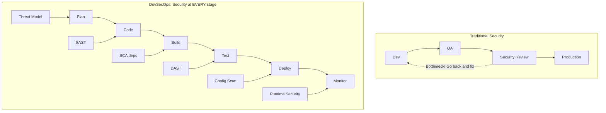
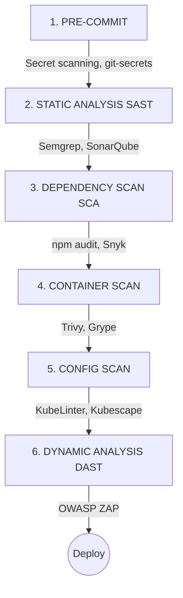
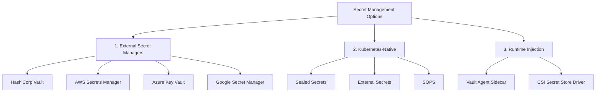
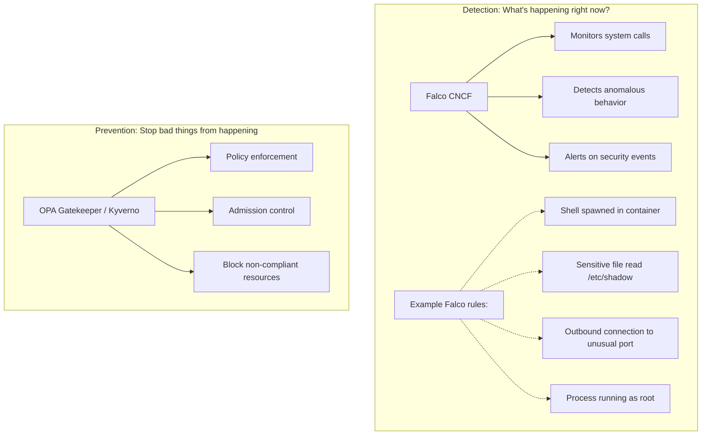
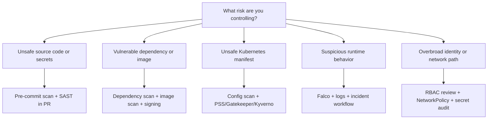

> **Complexity**: `[MEDIUM]`.
>
> **Time to Complete**: 75 minutes.
>
> **Prerequisites**: Modern DevOps modules 1.1-1.5, basic Kubernetes manifests, CI/CD concepts, and command-line comfort.

---

## What You'll Be Able to Do

After completing this module, you will be able to:

- **Design** a secure CI/CD pipeline that combines pre-commit secret scanning, source analysis, dependency checks, image scanning, policy enforcement, and runtime monitoring.
- **Evaluate** Kubernetes security risks such as exposed dashboards, excessive RBAC, privileged containers, weak secret handling, and unrestricted pod networking.
- **Implement** Pod Security Standards, NetworkPolicies, and least-privilege RBAC controls for Kubernetes 1.35+ workloads.
- **Compare** DevSecOps tools such as Trivy, OPA Gatekeeper, Kyverno, Falco, KubeLinter, Kubescape, and Sealed Secrets by the stage of risk they address.
- **Debug** insecure Kubernetes manifests and refactor them into deployable configurations that reduce privilege, limit blast radius, and produce clear audit evidence.

## Why This Module Matters

Cloud-native incidents tend to start small. A management interface gets deployed without authentication so a developer can iterate quickly; an IAM role gets a permissive policy because the precise list of required actions was hard to enumerate; a workload gets a host-path mount because a pre-flight check was easier to write that way. Each of those choices, by itself, looks like a reasonable trade-off in a sprint. Together, they create the conditions where one misconfiguration cascades into a cluster-wide compromise — because the network, identity, and runtime layers were never tightened independently. The CKS-track modules walk through two canonical examples in detail: an [exposed Kubernetes dashboard](/k8s/cks/part1-cluster-setup/module-1.5-gui-security/) <!-- incident-xref: tesla-2018-cryptojacking --> and a [cloud metadata service compromise](/k8s/cks/part1-cluster-setup/module-1.4-node-metadata/) <!-- incident-xref: capital-one-2019 -->. This module operates one layer up: how do engineering teams stop those small choices from accumulating in the first place?

In April 2021, the answer to that question was rewritten by a single supply-chain attack. The Codecov bash uploader — a script that thousands of CI pipelines piped directly into `bash` — was modified to exfiltrate environment variables from every CI run that used it. The attackers harvested credentials, deploy keys, and signed-artifact secrets from the pipelines of dozens of high-profile customers. The lesson was uncomfortable: a CI tool that handles secrets is itself a production system, and "trusted" external scripts deserve the same scrutiny as internal code. DevSecOps is the engineering discipline that makes that scrutiny routine rather than reactive.

DevSecOps is the engineering response to that pattern. It does not mean adding one scanner to the end of a pipeline or asking a security team to approve every release by hand. It means turning security requirements into repeatable checks that run where engineers already work, then enforcing the highest-risk rules at the cluster boundary so a tired person cannot accidentally deploy a dangerous workload on a Friday afternoon.

This module treats security as a delivery system. You will see how early feedback catches cheap mistakes, how admission control blocks unsafe manifests, how runtime detection catches behavior that static checks cannot see, and how least privilege keeps one compromised component from becoming a full environment compromise. The point is not to memorize a tool list; the point is to learn where each control belongs and how to choose a control that matches the failure you are trying to prevent.

## DevSecOps as a Feedback System

DevSecOps stands for development, security, and operations, but the name matters less than the feedback loop it creates. Traditional security often appeared late in the delivery cycle, after developers had finished the feature, QA had validated behavior, and release pressure had already built up. When a late review found a vulnerability, the team had to choose between delaying the release, accepting risk, or applying a rushed fix with poor context.

In a DevSecOps model, security is treated like testing, observability, and reliability: a shared engineering responsibility backed by automation. Developers get local feedback before code leaves their workstation, CI systems verify the artifact before it is promoted, admission controllers enforce non-negotiable cluster rules, and runtime tools watch for behavior that only appears after deployment. Each stage has a different job, and the stages work best when they fail with explanations that a developer can act on quickly.



The diagram shows why DevSecOps is not a single tool category. Threat modeling belongs before code because architectural mistakes are cheapest to fix while the design is still flexible. Static analysis belongs near the code because it can find unsafe patterns without waiting for a container image. Configuration scanning belongs before deployment because Kubernetes YAML is executable infrastructure, and runtime monitoring belongs after deployment because an attacker does not care that every earlier check passed.

Shift left is the phrase teams use for moving checks earlier in the lifecycle, but the phrase can be misunderstood. It does not mean shifting responsibility away from security teams and onto developers without support. It means moving the first useful signal as close as possible to the person who can fix the problem, while still keeping strong controls later in the path for risks that require central enforcement.

```mermaid
flowchart LR
    A[Code] -- "$" --> B[Build]
    B -- "$$" --> C[Test]
    C -- "$$$" --> D[Stage]
    D -- "$$$$" --> E[Production]
    E -- "$$$$$$$" --> F[Breach!]

    classDef default fill:#f9f9f9,stroke:#333,stroke-width:2px;
    style F fill:#ff9999,stroke:#cc0000,stroke-width:3px;
```

The economic reason for shifting left is straightforward. If a developer notices a hardcoded password before committing, the fix is usually a short edit. If a pre-commit hook catches it, the developer can amend the commit before the secret enters shared history. If the same password reaches a built image, a Git repository, a container registry, and production logs, the fix becomes credential rotation, audit review, incident triage, and sometimes customer notification.

Pause and predict: if a developer hardcodes a database password in a feature branch, which control should catch it first, and which later control should still exist in case the first one is bypassed? A strong answer names both a local or pull-request secret scan and a server-side repository or CI scan, because real systems need layered controls rather than a single perfect checkpoint.

The practical tradeoff is signal quality. A scanner that reports hundreds of low-confidence findings will be ignored, even if it technically runs early. A scanner that blocks a release without showing the exact file, rule, severity, and remediation path creates resentment rather than safety. Good DevSecOps programs tune rules, document exceptions, and make the secure path easier than the risky workaround.



Pre-commit checks stop secrets and obvious unsafe patterns before they enter history. SAST tools examine source code for dangerous functions, injection paths, insecure deserialization, and authorization mistakes that can be detected without running the application. Software composition analysis checks dependencies against known vulnerability databases, which matters because modern services often contain far more third-party code than custom code.

Container scanning happens after the application is packaged because the final image includes operating system packages, language runtimes, and base-image layers that source scanning cannot see. Configuration scanning examines Kubernetes manifests, Helm output, and policy files before they reach the API server. Dynamic testing then probes a running service from the outside, finding issues such as missing headers, broken authentication behavior, and route-specific defects that only exist when the application is assembled.

The pipeline should be strictest where the consequence is highest and the evidence is strongest. A local warning is appropriate for an experimental branch with a medium-severity dependency that has no exploit path in the application. A production admission denial is appropriate for a privileged pod, a host filesystem mount, or an unsigned image in a regulated namespace, because those conditions create immediate platform risk.

Before running a new security gate in blocking mode, ask what the developer will do when it fails. If the answer is "open a ticket and wait," the gate may still be necessary, but the operating model is incomplete. Effective teams pair each blocking rule with documentation, examples, an owner, an exception path, and a way to reproduce the failure locally.

## Securing the Artifact Supply Chain

Kubernetes eventually runs container images, so the first concrete security boundary is the artifact itself. A container image is not just your application binary; it is a stack of base layers, packages, libraries, startup commands, user identities, and filesystem permissions. If that stack is bloated, mutable, unsigned, or built with secrets, the cluster inherits those problems no matter how carefully the Deployment object is written.

The smallest useful image is usually safer than a general-purpose operating system image because it removes tools an attacker can reuse after compromise. A shell, package manager, network client, compiler, and debugging tools are convenient during development, but they are also convenient during an intrusion. Minimal images are not magic, but they reduce options for an attacker and reduce the number of packages that vulnerability scanners must track.

```dockerfile
# BAD: Large attack surface, runs as root
FROM ubuntu:latest
RUN apt-get update && apt-get install -y nginx
COPY app /app
CMD ["nginx"]

# GOOD: Minimal image, non-root user
FROM nginx:1.25-alpine
RUN adduser -D -u 1000 appuser
COPY --chown=appuser:appuser app /app
USER appuser
EXPOSE 8080
```

The bad example uses a floating tag and leaves the process running as root. The good example still needs validation, but it makes two important choices explicit: a more constrained base image and a non-root user. Pinning to a specific image tag improves traceability, while running as a dedicated user limits what the process can do if the application is exploited.

Image tags deserve special attention because they are human-friendly labels, not immutable guarantees. The tag `nginx:1.25-alpine` is more specific than a floating tag, but a digest is stronger when you need reproducibility. In production pipelines, teams often build from approved base images, scan the output, sign the digest, and deploy by digest so the workload that passed review is the workload the cluster receives.

```bash
# Trivy - most popular open-source scanner
trivy image nginx:1.25

# Example output:
# nginx:1.25 (debian 12.0)
# Total: 142 (UNKNOWN: 0, LOW: 89, MEDIUM: 45, HIGH: 7, CRITICAL: 1)
```

The sample output is useful because it shows why vulnerability management is a prioritization problem. A scanner can find many issues, but not every finding deserves the same response. Teams usually block known exploitable critical vulnerabilities, high-severity issues in reachable components, and violations of internal baseline policy, while tracking lower-risk findings through normal maintenance.

Scanning also has timing limits. A clean scan at build time can become stale when a new CVE is published the next day. That is why mature programs scan images in CI, rescan registries on a schedule, and monitor running workloads for images that have become non-compliant after deployment. DevSecOps is continuous because vulnerability knowledge changes after the artifact is created.

```bash
# Sign images to ensure they haven't been tampered with
# Using cosign (sigstore)
cosign sign myregistry/myapp:v1.0

# Verify before deploying
cosign verify myregistry/myapp:v1.0
```

Image signing addresses a different risk than scanning. A scanner asks whether an artifact contains known problems; a signature asks whether the artifact came from a trusted build process and remained unchanged. Without provenance, an attacker who gains registry access can replace an image after it passes CI, and the cluster may pull the malicious artifact because the tag looks familiar.

The strongest pattern is to connect build identity, scan evidence, and admission control. The CI system builds the image, records the digest, scans the digest, signs the digest, and publishes metadata. The cluster admission policy then verifies that production workloads reference an approved and signed artifact. This turns "we scanned it somewhere" into an enforceable deployment rule.

War story: a platform team once discovered that several services were rebuilding from `latest` base images during emergency patches. The release notes looked clean, but two services pulled newer packages than the staging environment had used, and a runtime behavior changed under load. The fix was not just "do better tagging"; the team changed the pipeline to pin base image digests, record build provenance, and reject production images without a signed digest.

Which approach would you choose here and why: blocking every medium vulnerability at build time, or blocking only high-confidence reachable findings while opening tracked work for the rest? The second approach is usually more sustainable, but only if the team has a real process for aging, ownership, and escalation. A non-blocking finding with no owner is just delayed risk.

## Hardening Kubernetes Workloads

Once the artifact is trustworthy, the next question is what the workload is allowed to do inside the cluster. Kubernetes gives you many powerful knobs because workloads are diverse, but that flexibility can become dangerous when manifests are copied from old examples or written only to make an application start. Security context settings are the workload equivalent of building access rules into the launch instructions.

The key idea is least privilege. A pod should run as a non-root user, avoid privilege escalation, drop unnecessary Linux capabilities, use a read-only root filesystem when practical, and request only the resources it needs. These settings do not make the application invulnerable, but they force an attacker to work harder after the first exploit and reduce the chance that one compromised process can control the node.

```yaml
# BAD: Overly permissive pod
apiVersion: v1
kind: Pod
metadata:
  name: insecure-pod
spec:
  containers:
  - name: app
    image: myapp
    securityContext:
      privileged: true          # Never do this!
      runAsUser: 0              # Don't run as root
    volumeMounts:
    - name: host
      mountPath: /host          # Don't mount host filesystem
  volumes:
  - name: host
    hostPath:
      path: /

# GOOD: Secure pod configuration
apiVersion: v1
kind: Pod
metadata:
  name: secure-pod
spec:
  securityContext:
    runAsNonRoot: true
    runAsUser: 1000
    fsGroup: 1000
  containers:
  - name: app
    image: myapp
    securityContext:
      allowPrivilegeEscalation: false
      readOnlyRootFilesystem: true
      capabilities:
        drop:
        - ALL
    resources:
      limits:
        memory: "128Mi"
        cpu: "500m"
```

The insecure pod combines several high-risk settings. `privileged: true` gives the container broad host-level access, `runAsUser: 0` starts the process as root, and the `hostPath` mount exposes the node filesystem. Any one of those settings deserves scrutiny; together, they turn a pod compromise into a plausible node compromise.

The secure pod is not a universal template, but it demonstrates the direction of travel. `runAsNonRoot` and `runAsUser` make identity explicit, `allowPrivilegeEscalation: false` prevents a process from gaining more privileges through setuid binaries, `readOnlyRootFilesystem` limits tampering after compromise, and dropping all capabilities removes Linux privileges the app likely never needed. Resource limits also matter because denial of service can be a security impact, not just a reliability issue.

Relying on every developer to remember every field is fragile, so Kubernetes 1.35+ clusters should use Pod Security Standards through Pod Security Admission. The admission controller evaluates pods against namespace labels and can enforce, warn, or audit violations. This gives platform teams a native baseline without requiring a third-party webhook for the most common workload hardening rules.

```yaml
# Enforce security standards at namespace level
apiVersion: v1
kind: Namespace
metadata:
  name: production
  labels:
    pod-security.kubernetes.io/enforce: restricted
    pod-security.kubernetes.io/warn: restricted
    pod-security.kubernetes.io/audit: restricted
```

PSS has three profile levels, and the level names are intentionally plain. `privileged` leaves workloads mostly unrestricted, `baseline` prevents known privilege escalations while allowing common application patterns, and `restricted` applies a stronger set of hardening requirements. Production application namespaces should usually trend toward `restricted`, while infrastructure namespaces may need carefully documented exceptions.

| Level | Description |
|-------|-------------|
| privileged | No restrictions (dangerous) |
| baseline | Minimal restrictions, prevents known escalations |
| restricted | Highly restrictive, follows best practices |

The important operational choice is enforcement mode. `warn` helps developers see violations without blocking them, `audit` records violations for review, and `enforce` rejects non-compliant pods. A practical rollout often starts with `warn` and `audit`, fixes the noisy workloads, then enables `enforce` for new deployments before tightening existing namespaces.

Use the `k` alias for `kubectl` during hands-on work to keep commands readable: `alias k=kubectl`. The alias is only a shortcut, but the habit matters in this curriculum because later Kubernetes modules use it consistently and expect you to recognize common command shapes quickly.

```bash
alias k=kubectl
k label namespace production pod-security.kubernetes.io/enforce=restricted --overwrite
k label namespace production pod-security.kubernetes.io/warn=restricted --overwrite
k label namespace production pod-security.kubernetes.io/audit=restricted --overwrite
```

Before running this in a shared cluster, what output do you expect when a developer submits the earlier insecure pod to a namespace with `enforce=restricted`? The correct expectation is an admission rejection before scheduling, because the API server evaluates the request and refuses to persist a pod that violates the selected profile.

## Protecting Secrets and Identity

Secret management is where many cloud-native teams accidentally confuse encoding with security. Kubernetes `Secret` objects are designed to separate sensitive values from normal configuration, but the values are base64-encoded by default and should not be treated as safe to commit to Git. Anyone who can read the manifest or access the stored object can decode the data unless additional encryption, access control, and workflow controls are in place.

```yaml
# NEVER DO THIS
apiVersion: v1
kind: ConfigMap
metadata:
  name: app-config
data:
  DATABASE_PASSWORD: "your-database-password-here"  # In Git history forever!
```

The problem is not only the file on the current branch. Git history keeps previous versions, forks may copy the secret, CI logs may echo it, and local clones may persist long after the original file is removed. Once a real credential enters history, the correct response is rotation and investigation, not simply deleting the line and hoping nobody noticed.

DevSecOps secret handling has three layers. First, prevent accidental commits with local and server-side scanning. Second, store deployable secret references in a form that is safe for GitOps review. Third, deliver the real secret to the workload at runtime from a system that can audit access, rotate values, and restrict who can read them.



Sealed Secrets is popular because it fits GitOps habits. Developers encrypt a normal Kubernetes Secret into a SealedSecret using a public key, then commit the encrypted object. The controller inside the cluster holds the private key and decrypts the object into a usable Secret only inside the target cluster, which means the repository can store the encrypted manifest without exposing the plaintext value.

```bash
# Install sealed-secrets controller
# Then create sealed secrets that can be committed to Git

kubeseal --format yaml < secret.yaml > sealed-secret.yaml

# sealed-secret.yaml can be committed
# Only the cluster can decrypt it
```

External secret operators solve a slightly different problem. Instead of encrypting a value into Git, they synchronize secrets from systems such as AWS Secrets Manager, Azure Key Vault, Google Secret Manager, or HashiCorp Vault into Kubernetes. This can be better for organizations that already centralize secret lifecycle, rotation, approval, and audit in a cloud or enterprise secret manager.

The tradeoff is operational ownership. Sealed Secrets makes repository review simple, but the cluster private key becomes critical backup material and cluster migration needs planning. External secret managers centralize lifecycle controls, but they require cloud identity, operator permissions, network access, and careful RBAC so application teams cannot read secrets outside their boundary.

RBAC is the identity half of this story. Kubernetes authorizes API actions through subjects, roles, and bindings, and the safest design grants the narrowest verbs on the narrowest resources in the narrowest namespace. Granting broad access because a pipeline failed once is one of the fastest ways to turn a leaked token into a platform-wide incident.

```yaml
# Principle of least privilege
# Give only the permissions needed

# BAD: Cluster admin for everything
apiVersion: rbac.authorization.k8s.io/v1
kind: ClusterRoleBinding
metadata:
  name: developer-admin
subjects:
- kind: User
  name: developer@company.com
roleRef:
  kind: ClusterRole
  name: cluster-admin    # Too much power!
```

The bad binding is dangerous because it is cluster-scoped and uses the built-in `cluster-admin` role. If the user's workstation, browser session, or identity provider account is compromised, the attacker inherits full control across namespaces. This is especially risky for CI/CD service accounts because those credentials often run unattended and may be stored in automation systems.

```yaml
# GOOD: Namespace-scoped, minimal permissions
apiVersion: rbac.authorization.k8s.io/v1
kind: Role
metadata:
  namespace: development
  name: developer
rules:
- apiGroups: ["apps"]
  resources: ["deployments"]
  verbs: ["get", "list", "create", "update"]
- apiGroups: [""]
  resources: ["pods"]
  verbs: ["get", "list"]
```

```yaml
# GOOD: RoleBinding to attach the Role to the User
apiVersion: rbac.authorization.k8s.io/v1
kind: RoleBinding
metadata:
  name: developer-binding
  namespace: development
subjects:
- kind: User
  name: developer@company.com
roleRef:
  kind: Role
  name: developer
```

The better configuration keeps the developer inside one namespace and grants only the verbs needed for the job. Notice what is missing: no permission to delete resources, read Secrets, modify RBAC, or operate across namespaces. Those omissions are the security control, because least privilege is defined as much by what you leave out as by what you include.

War story: a deployment pipeline at one company used a cluster-admin service account because early Helm releases needed several permissions and nobody revisited the binding. Months later, a CI integration token leaked through a misconfigured job log. The incident response team avoided a larger compromise only because registry credentials had separate rotation, but the pipeline token still had enough access to enumerate every namespace and inspect sensitive workload metadata.

## Network and Runtime Defenses

Kubernetes networking is intentionally open by default in many clusters. Pods can often reach other pods across namespaces unless a network plugin and NetworkPolicy rules say otherwise. That default is convenient when a team is learning, but it is risky in production because an attacker who compromises one pod can scan internal services and attempt lateral movement.

NetworkPolicy changes the model from implicit trust to explicit permission. A default-deny policy removes ambient connectivity, then narrow allow rules restore the traffic the application actually needs. This is similar to locking every office door by default and issuing keys only for rooms a person has a reason to enter.

```yaml
# Network Policy: Only allow specific traffic
apiVersion: networking.k8s.io/v1
kind: NetworkPolicy
metadata:
  name: api-network-policy
  namespace: production
spec:
  podSelector:
    matchLabels:
      app: api
  policyTypes:
  - Ingress
  - Egress
  ingress:
  - from:
    - podSelector:
        matchLabels:
          app: frontend
    ports:
    - protocol: TCP
      port: 8080
  egress:
  - to:
    - podSelector:
        matchLabels:
          app: database
    ports:
    - protocol: TCP
      port: 5432
```

In this example, the API pod can receive traffic only from pods labeled `app: frontend` on port 8080 and can send traffic only to pods labeled `app: database` on port 5432. Everything else is dropped by the network layer, assuming the cluster's networking provider implements NetworkPolicy. The assumption matters because Kubernetes defines the API, but the CNI plugin provides the enforcement.

Pause and predict: if you apply a default-deny NetworkPolicy to a namespace that has never used network policy before, what happens to existing pods that currently communicate freely? They do not restart, but traffic that is no longer explicitly allowed begins to fail. That is why teams should map dependencies, add allow policies, and test carefully before enforcing default-deny in a busy namespace.

Network policy is not a substitute for authentication or authorization. It reduces reachable paths, but the database still needs credentials, TLS still matters, and the application still needs authorization checks. Defense in depth means a compromised frontend should fail at the network layer, fail at the service authentication layer, and fail at the data authorization layer.

Static scanning tools help you catch weak network, workload, and RBAC configuration before deployment. KubeLinter focuses on Kubernetes YAML and Helm output, Kubescape can evaluate repositories or clusters against frameworks such as NSA-CISA guidance, and Trivy can scan images, filesystems, repositories, and Kubernetes resources. They overlap, but the overlap is useful when each tool produces actionable evidence at the right stage.

```bash
# Scan Kubernetes YAML for issues
kube-linter lint deployment.yaml

# Example output:
# deployment.yaml: (object: myapp apps/v1, Kind=Deployment)
# - container "app" does not have a read-only root file system
# - container "app" is not set to runAsNonRoot
```

KubeLinter is valuable in pull requests because it points directly at manifest fields developers can change. It is not a runtime detector and it does not prove an application is secure, but it catches common mistakes before the API server sees them. Used well, it becomes a teaching tool as much as a gate.

```bash
# Full security scan against frameworks like NSA-CISA
kubescape scan framework nsa

# Scans for:
# - Misconfigurations
# - RBAC issues
# - Network policies
# - Image vulnerabilities
```

Kubescape is useful when you want a broader posture view across workloads and clusters. Framework-oriented scans help platform teams explain risk to auditors and engineering managers because findings are grouped against recognizable controls. The tradeoff is that broad scans can be noisy unless the team defines ownership and tracks remediation like product work.

```bash
# Scan container image
trivy image myapp:v1

# Scan Kubernetes manifests
trivy config .

# Scan running cluster
trivy k8s --report summary cluster
```

Trivy is often chosen because one tool can cover several surfaces: images, repositories, infrastructure configuration, and clusters. That breadth is convenient for smaller teams, but it still requires policy decisions. A scanner can produce data; your program must define which findings block a merge, which create tickets, and which are accepted with documented reasoning.

Even a strong pipeline cannot predict every runtime event. A zero-day exploit, stolen credential, unsafe debug endpoint, or compromised dependency may create behavior that looks normal to static analysis but abnormal on the node. Runtime security tools watch process execution, file access, network connections, and other signals while the workload is actually running.



Falco is a detection tool, not an admission controller. It can alert when a shell is spawned inside a container, when a sensitive file is read, or when a process opens an unusual network connection. That alert is useful because many production containers should never start an interactive shell, and the behavior is suspicious even if the image passed every previous scan.

OPA Gatekeeper and Kyverno sit on the prevention side. They evaluate Kubernetes admission requests and can reject resources that violate policy, such as missing labels, disallowed registries, privileged containers, or images without required signatures. Gatekeeper uses OPA-style constraint templates, while Kyverno uses Kubernetes-native policy resources that many platform teams find easier to read.

The healthiest mental model is a layered one. SAST prevents vulnerable code patterns, SCA prevents known bad dependencies, image scanning prevents risky packages, signing prevents untrusted artifacts, admission control prevents unsafe resources, NetworkPolicy limits movement, RBAC limits API power, and runtime detection tells you when something unexpected is happening anyway. No layer is complete, but each layer removes a path an attacker could otherwise use.

### Worked Example: Rolling Out DevSecOps Without Freezing Delivery

Imagine a team that owns a customer-facing API, a background worker, and a small administrative dashboard. The team already ships through pull requests and a CI pipeline, but security checks are inconsistent. One developer runs a local scanner occasionally, the platform team scans clusters once a month, and production deploys use a service account that can update almost anything in the namespace. The first instinct may be to install every available scanner and block every finding, but that usually creates friction before it creates safety.

The better starting point is to draw the delivery path and attach one control to each high-risk transition. Code moves from a laptop to Git, so secret scanning belongs before commit and again at the repository boundary. Source moves from Git to a build, so SAST and dependency checks belong in the pull request. A build produces an image, so image scanning and signing belong after the image digest exists. A manifest moves toward the cluster, so configuration scanning and admission policy belong before the API server accepts it.

This order gives the team a practical rollout plan. The first week can enable advisory pre-commit hooks and repository secret scanning, because leaked credentials are severe and the remediation path is well understood. The second week can add SAST and dependency scanning in pull requests, but begin with comments rather than blocking on every result. The third week can introduce image scanning thresholds and signed image promotion, because the team now has a stable artifact workflow to enforce.

At the same time, the platform team can prepare the cluster-side controls in audit or warning mode. Pod Security Admission labels can warn when a workload violates the restricted profile, and Gatekeeper or Kyverno can report policy failures before blocking them. This matters because existing manifests may contain old assumptions, and a sudden enforcement flip can turn a security improvement into an outage. Audit-first rollout does not mean weak security; it means the team is gathering evidence before changing the failure mode.

After the warnings are understood, the team can separate rules into three groups. Rules that protect the platform from immediate compromise, such as privileged containers in application namespaces, should move to enforcement quickly. Rules that indicate good hygiene, such as missing labels or non-critical image findings, can remain advisory while ownership is established. Rules that are noisy or ambiguous should be rewritten until a developer can tell exactly what failed and how to fix it.

Tool choice becomes clearer in this scenario. Trivy is a good fit for image, repository, and configuration scanning because it can produce useful evidence at build and review time. KubeLinter is useful for lightweight manifest feedback in pull requests. Kubescape helps the platform team assess broader cluster posture against known frameworks. OPA Gatekeeper or Kyverno belongs at admission, where a policy decision must be enforced before the resource is stored.

Falco enters the design later because it answers a different question. The team may have perfect pull-request checks and still need to know whether a running container suddenly starts a shell, reads sensitive files, or opens an unexpected outbound connection. Runtime detection needs an owner, an alert route, and a playbook. Without those pieces, a Falco deployment can become a stream of interesting events that nobody investigates.

Secret handling needs its own deliberate migration. If the team currently stores Kubernetes Secrets in private Git repositories, the first move is to stop the pattern and rotate anything that was truly sensitive. The next move is to choose a Git-safe workflow such as Sealed Secrets, SOPS, or an external secret operator. The correct choice depends on who owns rotation, whether the organization already has a cloud secret manager, and how cluster recovery is handled after disaster.

RBAC should be tightened with the same respect for delivery flow. A namespace-scoped deployment role is safer than cluster-admin, but it must still allow the pipeline to update the resources it legitimately owns. The team should inspect real deployment actions, write the narrow role, test it in staging, and then remove the broad binding. This approach avoids the common failure where a security cleanup breaks deployment and someone restores cluster-admin under pressure.

NetworkPolicy rollout benefits from observation before enforcement. If the API needs to receive traffic from the frontend and send traffic to the database, those flows should be captured before default-deny is applied. Teams can use service maps, logs, CNI observability, or simple staged tests to identify required paths. Once allow policies exist, default-deny changes from a risky surprise into a controlled boundary.

The important leadership move is to publish the rulebook as engineering documentation, not tribal knowledge. Developers should see which findings block a merge, which findings create tracked work, how exceptions are requested, and what evidence is required for production. Security teams should see ownership, aging, and repeated violations. Platform teams should see which controls are enforced centrally and which remain team-owned.

This example also shows why "shift left" is incomplete by itself. The team shifts secret, code, dependency, and manifest feedback left because those fixes belong with the author. The team also enforces right at admission because the cluster must reject dangerous states even if an earlier check was skipped. The team monitors runtime because attackers operate after deployment. DevSecOps works when those positions reinforce each other rather than competing for attention.

Before adopting a new scanner, run one representative service through this rollout map. Ask whether the scanner finds a risk earlier than the current process, whether it provides enough detail for the owning team to fix the problem, and whether the result can be enforced without blocking unrelated work. If the answer is unclear, start in advisory mode and collect data. A measured rollout with strong ownership usually beats a dramatic launch followed by ignored alerts.

## Patterns & Anti-Patterns

Patterns are reusable choices that make secure delivery easier to operate over time. They matter because security programs fail when every team invents a separate workflow and every exception requires a meeting. The goal is to make secure defaults boring, visible, and repeatable enough that developers can move quickly without guessing what the platform expects.

| Pattern | When to Use It | Why It Works | Scaling Consideration |
|---------|----------------|--------------|-----------------------|
| Shift-left plus enforce-right | Use for pipelines that deploy to shared or production clusters. | Early checks give fast feedback, while admission control blocks high-risk drift. | Keep local reproduction simple so developers can fix failures without waiting for a platform engineer. |
| Signed image promotion | Use when images move from CI to staging and production registries. | The deployed digest can be tied to build identity, scan evidence, and approval. | Standardize signing keys or keyless identity before many teams build custom release scripts. |
| Namespace security baselines | Use when teams share clusters but own separate namespaces. | PSS labels, quotas, RBAC, and NetworkPolicies create predictable tenant boundaries. | Publish namespace templates so new environments inherit the same defaults. |
| Git-safe secret references | Use for GitOps workflows and reviewed deployment manifests. | SealedSecrets, SOPS, or external secret references keep plaintext out of repository history. | Document rotation and disaster recovery before a controller key or cloud secret changes. |

Anti-patterns usually start as shortcuts. Someone grants cluster-admin because a release is blocked, uses a floating image tag because it is convenient, or disables a scanner because the finding looks noisy. Each shortcut feels local, but the cluster remembers the permissions, the registry remembers the tag, and Git remembers the secret.

| Anti-Pattern | What Goes Wrong | Better Alternative |
|--------------|-----------------|--------------------|
| Security only at the final release gate | Findings arrive late, context is stale, and release pressure encourages exceptions. | Run early checks in pre-commit and pull requests, then reserve hard deployment blocks for severe evidence. |
| Cluster-admin CI service accounts | A leaked pipeline token becomes control-plane compromise across namespaces. | Give each pipeline namespace-scoped verbs and separate deployment identities by environment. |
| Raw Secrets in Git | Private repositories still have history, forks, local clones, and CI logs. | Store encrypted secret manifests or references to an external secret manager. |
| Default-allow pod networking forever | A compromised frontend can scan and reach internal services unnecessarily. | Move to default-deny policies with tested allow rules for required application flows. |

## Decision Framework

Choosing DevSecOps controls is easier when you start with the risk location rather than the product name. Ask where the bad thing can be observed earliest, where it can be blocked most reliably, and who can fix it with the least delay. A hardcoded secret belongs near the developer and repository boundary; a privileged pod belongs at manifest review and admission; a shell spawned by an exploit belongs in runtime detection and incident response.



Use pre-commit and pull-request checks when the fix belongs with the author and the evidence is easy to reproduce. Use CI gates when the artifact or manifest needs a consistent build environment. Use admission control when the platform must reject an unsafe state no matter which pipeline or person submitted it. Use runtime detection when the behavior cannot be known until the workload executes.

| Decision Point | Prefer This Control | Avoid This Trap |
|----------------|---------------------|-----------------|
| Secret appears in source | Pre-commit scan, repository scan, credential rotation process | Treating private Git as a secret manager |
| Image has critical CVEs | CI image scan, registry rescan, signed promotion | Blocking every low finding without ownership or context |
| Pod asks for host access | PSS restricted, Gatekeeper or Kyverno deny rule | Allowing exceptions without namespace, owner, and expiry |
| Service needs database access | NetworkPolicy allow rule plus application credentials | Assuming network policy alone replaces authentication |
| CI deploys to production | Namespace-scoped service account and signed artifact policy | Reusing a human cluster-admin credential in automation |
| Runtime shell appears | Falco alert, log correlation, response playbook | Treating a runtime alert as noise because CI passed |

The framework also helps with exceptions. Some workloads legitimately need capabilities, host access, or special networking, especially observability agents, storage drivers, and low-level platform components. Those exceptions should live in dedicated namespaces, use documented owners, and be reviewed separately from normal application defaults. A controlled exception is different from a silent bypass.

When you evaluate a new tool, map it to one or more cells in this framework. If a vendor says it "solves Kubernetes security" but cannot tell you whether it acts before commit, during CI, at admission, or at runtime, the claim is too broad to guide architecture. Useful tools have a clear enforcement point, a clear failure mode, and a clear owner for remediation.

The final decision check is reversibility. A warning rule can be adjusted quickly, but a blocking admission rule changes the cluster's contract for every deployer who reaches that namespace. Promote controls from advisory to blocking only after the team knows the owner, fix path, exception path, and evidence that the rule catches risk worth stopping.

## Did You Know?

- **The Codecov supply-chain incident was reported in 2021** after attackers modified a Bash uploader script to exfiltrate CI environment variables, which is why pipeline secrets need the same care as production secrets.
- **NIST SP 800-218 (the Secure Software Development Framework, finalized 2022)** codifies the practices DevSecOps teams had been doing informally for years: produce evidence of provenance, automate scanning, and make security controls part of normal development tooling rather than a separate audit.
- **The Sigstore project (Linux Foundation, 2021)** introduced keyless signing for container images and software artifacts, removing the historical excuse that signing was too operationally expensive for most teams to adopt.
- **Pod Security Policy was removed in Kubernetes 1.25** after being deprecated, so modern Kubernetes 1.35+ clusters should rely on Pod Security Admission for the native baseline control.

## Common Mistakes

| Mistake | Why It Happens | How to Fix It |
|---------|----------------|---------------|
| Secrets in Git | Teams confuse private repositories or base64 encoding with real secret storage. | Use pre-commit scanning, rotate exposed credentials, and store encrypted secrets or external secret references. |
| Running containers as root | Images work during development, so nobody revisits the runtime identity. | Build images with a non-root user and enforce `runAsNonRoot`, `allowPrivilegeEscalation: false`, and dropped capabilities. |
| No network policies | Default connectivity hides service dependencies until an incident exposes lateral movement. | Start with observed flows, add allow policies, then enforce namespace default-deny after testing. |
| Floating image tags | `latest` feels convenient during development but breaks traceability and reproducibility. | Pin versions or digests, scan the resulting artifact, and deploy the digest that passed CI. |
| No image scanning after release | Teams scan once at build time and forget that CVE knowledge changes. | Rescan registries and running workloads on a schedule, then track newly discovered risk by owner. |
| Cluster-admin everywhere | Early pipeline failures are solved by granting broad permissions instead of designing narrow roles. | Create namespace-scoped service accounts with only the verbs and resources required for each automation path. |
| Blocking noisy rules without guidance | Security tools are added in enforcement mode before teams understand the findings. | Start noisy checks in advisory mode, tune rules, document fixes, and then block high-confidence severe failures. |
| Runtime alerts without a playbook | Detection is installed, but nobody owns triage or response. | Connect Falco and platform alerts to runbooks, log context, severity rules, and incident ownership. |

## Quiz

<details><summary>Your team wants to save CI time by scanning only the final container image before production. What risk does this create, and how would you redesign the pipeline?</summary>

Scanning only the final image delays feedback until the team has already built, tested, and prepared a release candidate. That makes dependency, source, and secret issues more expensive to fix because the author has moved on and release pressure has increased. A better design uses pre-commit secret scanning, SAST and dependency checks in pull requests, image scanning after build, configuration scanning before deployment, and admission control for non-negotiable cluster rules. The final image scan remains useful, but it should not be the first security signal.

</details>

<details><summary>A developer sets `runAsUser: 0` because the application installs packages at startup. What is the primary risk, and what change should you make?</summary>

Running as user zero gives an attacker more power inside the container after any application exploit. Installing packages at startup also means the runtime environment is mutable, harder to reproduce, and dependent on network package repositories during deployment. The safer fix is to install packages during the image build, create a dedicated non-root user, and enforce `runAsNonRoot`, dropped capabilities, and no privilege escalation in the pod security context. This moves setup into CI and keeps production execution constrained.

</details>

<details><summary>You must choose between SAST and DAST for a small first security investment. How do you explain the gap each one leaves?</summary>

SAST analyzes source code without running the application, so it can catch unsafe functions, injection patterns, hardcoded secrets, and some authorization mistakes early. DAST probes a running application from the outside, so it can find behavior that appears only after routing, headers, authentication, and deployment configuration are assembled. If you choose only SAST, you miss runtime exposure; if you choose only DAST, you delay feedback and miss code paths the crawler never reaches. The long-term design should treat them as complementary checks at different stages.

</details>

<details><summary>A private repository contains a Kubernetes Secret manifest with database credentials. Why is deleting the file not enough, and what GitOps-safe pattern should replace it?</summary>

Deleting the file does not remove the credential from Git history, local clones, forks, CI logs, or any system that already copied the repository. The credential should be considered exposed and rotated before the team relies on it again. For GitOps, store an encrypted object such as a SealedSecret or a SOPS-encrypted manifest, or store a reference consumed by an external secret operator. The repository should contain reviewable deployment intent, not plaintext credentials.

</details>

<details><summary>Your production namespace must reject privileged pods and host filesystem mounts without installing a third-party admission controller. What should you implement?</summary>

Use Pod Security Admission with Pod Security Standards labels on the namespace, setting `pod-security.kubernetes.io/enforce: restricted` for the production namespace. In Kubernetes 1.35+, this native admission path can reject pods that violate the restricted profile before they are persisted or scheduled. `warn` and `audit` labels are also useful during rollout because they show violations before enforcement becomes disruptive. This control maps directly to the outcome of implementing native workload security baselines.

</details>

<details><summary>An attacker compromises a frontend pod and tries to connect directly to the database on port 5432. What should you inspect and change first?</summary>

Inspect whether the namespace has NetworkPolicies and whether the CNI plugin enforces them. If the namespace is default-allow, the attacker may be able to reach services that were never intended for the frontend. Add a default-deny policy and explicit allow rules only for required flows, such as frontend to API and API to database. Keep application authentication in place, because network policy reduces reachability but does not replace credentials or authorization.

</details>

<details><summary>A Falco alert reports that a shell was spawned inside an Nginx container that normally serves static files. Why does this matter if every CI scan passed?</summary>

CI scans evaluate known code, dependencies, images, and manifests before deployment, but they cannot prove that no runtime exploit or credential misuse will occur later. A shell inside a static Nginx container is unusual behavior and may indicate command execution after compromise. The right response is to preserve evidence, inspect logs and process activity, isolate the workload if needed, and determine whether the image, application, or credentials were abused. Runtime detection exists exactly for events that static controls cannot predict.

</details>

<details><summary>Your team can adopt only three controls this quarter: Trivy, OPA Gatekeeper or Kyverno, Falco, KubeLinter, Kubescape, or Sealed Secrets. How do you compare them and choose a balanced set?</summary>

Compare the tools by the stage of risk they address, not by popularity. Trivy gives broad build and review-time coverage for images, repositories, and configuration, while OPA Gatekeeper or Kyverno enforces policy at Kubernetes admission before unsafe resources are stored. Falco adds runtime detection for suspicious behavior that static checks cannot predict, and Sealed Secrets solves Git-safe secret delivery if raw secret manifests are the current failure. A balanced first set often combines one early scanner, one admission policy engine, and one secret or runtime control based on the team's largest current gap.

</details>

## Hands-On Exercise

In this exercise, you will review an insecure Kubernetes deployment, scan or reason about its risk, and replace it with a hardened version. You do not need a production cluster; a local Kubernetes environment is enough for syntax validation, and the manual checklist still teaches the security reasoning if optional scanners are unavailable. Use Kubernetes 1.35+ semantics when thinking about Pod Security Admission behavior.

Start by setting the `k` alias if your shell does not already have it. The alias keeps commands short and matches the rest of the Kubernetes curriculum, but every command is still ordinary `kubectl` underneath. If you use a temporary shell, set the alias again before running the validation commands.

```bash
alias k=kubectl
```

- [ ] Create the insecure deployment manifest and identify every field that increases workload risk.
- [ ] Validate the insecure manifest with server-side dry-run, then explain why syntax validation is not the same as security validation.
- [ ] Run `trivy config` if available, or perform the manual checklist review if the scanner is not installed.
- [ ] Rewrite the deployment so it uses a specific image tag, non-root execution, dropped capabilities, a read-only root filesystem, and resource requests and limits.
- [ ] Compare the insecure and secure manifests, then explain which changes would be enforced by PSS `restricted` and which would require additional policy.
- [ ] Clean up the temporary files after you have captured the differences and success criteria.

```bash
# 1. Create an insecure deployment
cat << 'EOF' > insecure-deployment.yaml
apiVersion: apps/v1
kind: Deployment
metadata:
  name: insecure-app
spec:
  replicas: 1
  selector:
    matchLabels:
      app: insecure
  template:
    metadata:
      labels:
        app: insecure
    spec:
      containers:
      - name: app
        image: nginx:latest
        securityContext:
          privileged: true
          runAsUser: 0
        ports:
        - containerPort: 80
EOF

# 2. Scan with kubectl (basic check)
k apply -f insecure-deployment.yaml --dry-run=server
# Note: This won't catch security issues, just syntax

# 3. If you have trivy installed:
# trivy config insecure-deployment.yaml

# 4. Manual security checklist:
echo "Security Review Checklist:"
echo "[ ] Image uses specific tag (not :latest)"
echo "[ ] Container runs as non-root"
echo "[ ] privileged: false"
echo "[ ] Resource limits set"
echo "[ ] readOnlyRootFilesystem: true"
echo "[ ] Capabilities dropped"

# 5. Create a secure version
cat << 'EOF' > secure-deployment.yaml
apiVersion: apps/v1
kind: Deployment
metadata:
  name: secure-app
spec:
  replicas: 1
  selector:
    matchLabels:
      app: secure
  template:
    metadata:
      labels:
        app: secure
    spec:
      securityContext:
        runAsNonRoot: true
        runAsUser: 1000
        fsGroup: 1000
      containers:
      - name: app
        image: nginx:1.25-alpine
        securityContext:
          allowPrivilegeEscalation: false
          readOnlyRootFilesystem: true
          capabilities:
            drop:
            - ALL
        ports:
        - containerPort: 8080
        resources:
          limits:
            memory: "128Mi"
            cpu: "500m"
          requests:
            memory: "64Mi"
            cpu: "250m"
EOF

# 6. Compare the two
echo "=== Insecure vs Secure ==="
diff insecure-deployment.yaml secure-deployment.yaml || true

# 7. Cleanup
rm insecure-deployment.yaml secure-deployment.yaml
```

<details><summary>Solution guidance for the manifest review</summary>

The insecure deployment uses a floating image tag, runs as root, and sets `privileged: true`, which is enough to fail a serious production review. It also lacks resource requests and limits, which creates reliability and denial-of-service risk. Server-side dry-run can confirm that the manifest is syntactically acceptable to the API server, but it does not replace policy or security scanning. In a namespace with PSS `restricted`, the privileged and root-related settings should be rejected before the pod is scheduled.

</details>

<details><summary>Solution guidance for the secure rewrite</summary>

The secure deployment pins a specific image tag, defines pod-level non-root identity, disables privilege escalation, drops Linux capabilities, uses a read-only root filesystem, and adds resource requests and limits. Some applications need writable temporary directories, so a real production version may add an `emptyDir` mounted at a narrow path instead of disabling read-only mode. If the image cannot run as UID 1000, fix the Dockerfile rather than weakening the pod policy first. The goal is to make the runtime contract explicit and reviewable.

</details>

Success criteria:

- [ ] You can explain why each insecure field creates a larger blast radius.
- [ ] You can distinguish syntax validation from security validation.
- [ ] You can identify which controls are handled by image design, manifest hardening, PSS, and optional policy engines.
- [ ] You can describe how a scanner finding should become either a blocking fix, a tracked issue, or a documented exception.
- [ ] You cleaned up the temporary YAML files after comparing the manifests.

## Sources

- [Kubernetes: Pod Security Standards](https://kubernetes.io/docs/concepts/security/pod-security-standards/)
- [Kubernetes: Pod Security Admission](https://kubernetes.io/docs/concepts/security/pod-security-admission/)
- [Kubernetes: Network Policies](https://kubernetes.io/docs/concepts/services-networking/network-policies/)
- [Kubernetes: RBAC Authorization](https://kubernetes.io/docs/reference/access-authn-authz/rbac/)
- [Kubernetes: Secrets](https://kubernetes.io/docs/concepts/configuration/secret/)
- [Trivy Documentation](https://trivy.dev/latest/)
- [Sigstore Cosign Overview](https://docs.sigstore.dev/cosign/overview/)
- [Bitnami Sealed Secrets](https://github.com/bitnami-labs/sealed-secrets)
- [External Secrets Operator](https://external-secrets.io/latest/)
- [Falco Documentation](https://falco.org/docs/)
- [OPA Gatekeeper Documentation](https://open-policy-agent.github.io/gatekeeper/website/docs/)
- [Kyverno Documentation](https://kyverno.io/docs/)
- [OWASP CI/CD Security Cheat Sheet](https://cheatsheetseries.owasp.org/cheatsheets/CI_CD_Security_Cheat_Sheet.html)

## Next Module

[CKA Curriculum](/k8s/cka/part0-environment/module-0.1-cluster-setup/) continues from these security foundations into hands-on cluster operations, where secure defaults become part of everyday Kubernetes administration.
