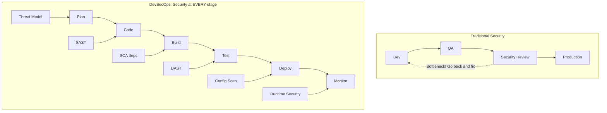
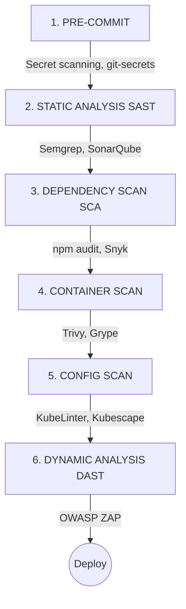
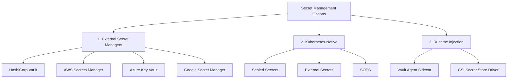
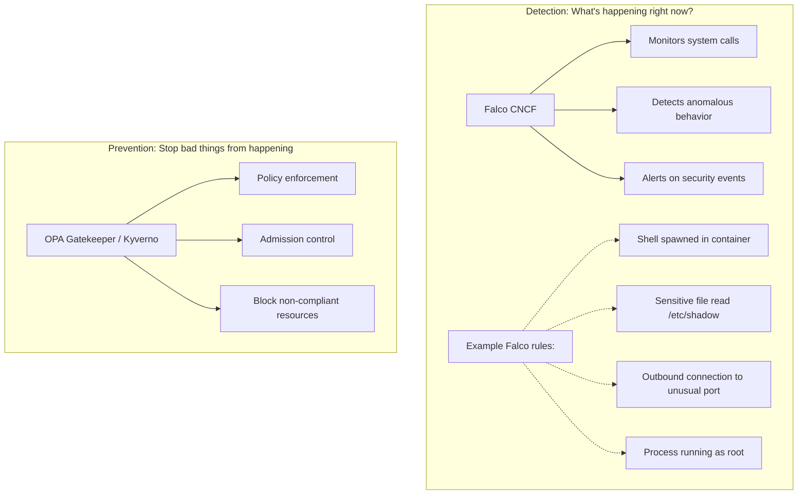

## What You'll Be Able to Do

After completing this module, you will be able to:
- **Design** a secure CI/CD pipeline incorporating pre-commit hooks, image scanning, secret management, and policy enforcement to prevent vulnerabilities from reaching production.
- **Evaluate** common Kubernetes security risks, including misconfigurations, exposed dashboards, and excessive RBAC privileges, and apply appropriate mitigation strategies.
- **Implement** Pod Security Standards (PSS) to restrict container privileges dynamically at the namespace level in modern Kubernetes environments (v1.35+).
- **Compare** and contrast various DevSecOps tools such as Trivy, OPA/Gatekeeper, and Falco, understanding their distinct roles in static analysis, admission control, and runtime threat detection.
- **Diagnose** unauthorized lateral movement risks within a cluster and write strict NetworkPolicy rules to explicitly control pod-to-pod communication based on the principle of zero trust.
- **Debug** insecure Kubernetes manifests and refactor them to adhere to the principle of least privilege, ensuring non-root execution and minimal capabilities.

## Why This Module Matters

In 2018, Tesla's cloud infrastructure was compromised in a highly publicized incident. The attackers did not utilize a sophisticated zero-day exploit or bypass complex cryptography; they simply found an administrative Kubernetes dashboard that had been left exposed to the public internet without password protection. Once inside, the attackers deployed cryptojacking containers, consuming massive amounts of compute resources to mine cryptocurrency at Tesla's expense. While the immediate financial impact of the stolen compute resources was significant, the potential for data exfiltration and complete infrastructure compromise was catastrophic. 

Similarly, the 2019 Capital One breach resulted in the theft of over 100 million credit card applications. A misconfigured web application firewall allowed an attacker to access the underlying cloud provider metadata service. Because the Identity and Access Management (IAM) role assigned to the instance was overly permissive, the attacker was able to seamlessly list and download sensitive data from internal storage buckets. This incident underscores a hard truth: in cloud-native environments, misconfiguration is your greatest adversary, and traditional perimeter defenses are entirely insufficient.

DevSecOps is the industry's response to these systemic failures. It is not merely about running scanners; it represents a fundamental shift in engineering culture and architecture. Traditional security acted as a gatekeeper at the end of the development lifecycle, acting as a bottleneck that delayed releases and frustrated developers. DevSecOps embeds security natively into the continuous integration and continuous deployment (CI/CD) pipeline, catching vulnerabilities when they are cheapest and easiest to fix. In a modern Kubernetes environment, where infrastructure is defined entirely as code, security must also be codified, automated, and continuous.

## What is DevSecOps?

DevSecOps stands for Development, Security, and Operations. It is the practice of integrating security testing and enforcement seamlessly into the agile development process. Historically, security teams operated in silos. Developers would write code, QA would test for functionality, and only then would the security team perform audits or penetration tests. If a vulnerability was found, the release was halted, and the code was sent back to the developers, causing massive delays and friction.

In the DevSecOps model, security is treated as a shared responsibility. Automated security checks are triggered at every commit, build, and deployment phase. This ensures that security is a continuous process rather than a final gate.



By embedding tools like Static Application Security Testing (SAST) and Dependency Scanning (SCA) directly into the developer workflow, teams can identify and remediate flaws before they ever reach a production cluster. This continuous feedback loop builds security into the product by design, rather than attempting to bolt it on as an afterthought.

## The Shift Left Philosophy

The core tenet of DevSecOps is the "Shift Left" philosophy. In a standard timeline moving from left to right (Plan -> Code -> Build -> Test -> Deploy -> Monitor), shifting left means moving security practices as early in the lifecycle (as far to the left) as possible. 

The rationale behind this is entirely economic and practical. The cost of fixing a bug or security flaw grows exponentially the later it is discovered. 

> **Stop and think**: If a developer hardcodes a password in a feature branch, at what stage of the pipeline should it ideally be caught to minimize cost and risk?

If a developer realizes they hardcoded a password while writing code in their IDE, fixing it costs nothing. If a pre-commit hook catches it, it takes a few seconds to amend the commit. However, if that password makes it into the master branch, the CI/CD system builds an image, and it gets deployed to production, the remediation cost skyrockets. The team must now rotate the compromised credential across all systems, investigate potential unauthorized access, review audit logs, and potentially trigger an expensive incident response process.

```mermaid
flowchart LR
    A[Code] -- "$" --> B[Build]
    B -- "$$" --> C[Test]
    C -- "$$$" --> D[Stage]
    D -- "$$$$" --> E[Production]
    E -- "$$$$$$$" --> F[Breach!]

    classDef default fill:#f9f9f9,stroke:#333,stroke-width:2px;
    style F fill:#ff9999,stroke:#cc0000,stroke-width:3px;
```

Shifting left empowers developers to own the security of their code by providing them with immediate, actionable feedback in the tools they already use every day.

## Security in CI/CD Pipeline

A mature CI/CD pipeline acts as a gauntlet that code must survive before it is allowed to run in a Kubernetes cluster. Each stage of the pipeline utilizes specialized tools designed to catch specific categories of vulnerabilities.



### The Stages Explained

1. **Pre-Commit**: Tools like `git-secrets` or `trufflehog` scan code locally before it is even pushed to a remote repository. This prevents API keys, tokens, and passwords from entering the version control history.
2. **Static Analysis (SAST)**: Tools like Semgrep or SonarQube analyze the source code for insecure coding patterns, such as SQL injection vulnerabilities, cross-site scripting (XSS), or buffer overflows, without needing to execute the code.
3. **Dependency Scanning (SCA)**: Modern applications are built on open-source libraries. Software Composition Analysis (SCA) tools like Snyk or `npm audit` check your project's dependency tree against databases of known vulnerabilities (CVEs) to ensure you aren't importing vulnerable third-party code.
4. **Container Scan**: Once the application is packaged into a Docker image, tools like Trivy or Grype analyze the OS packages and binaries within the image to detect vulnerabilities in the base image.
5. **Config Scan**: Before deploying, tools like KubeLinter or Kubescape analyze the Kubernetes YAML manifests to ensure they follow best practices, such as not running as root or requiring read-only filesystems.
6. **Dynamic Analysis (DAST)**: Once deployed to an ephemeral staging environment, tools like OWASP ZAP attack the running application from the outside, probing for misconfigured headers, authentication bypasses, and runtime flaws.

## Container Security

Kubernetes orchestrates containers, so securing the cluster begins with securing the containers themselves. The principle of least privilege dictates that a container should only have the minimum tools and permissions necessary to execute its primary function.

### 1. Image Security

A common mistake is using full-blown operating system images (like `ubuntu:latest`) for simple applications. These images contain hundreds of unnecessary utilities (like `curl`, `wget`, or shell environments) that an attacker can leverage if they compromise the application. Furthermore, containers run as the `root` user by default, which is a massive security risk.

```dockerfile
# BAD: Large attack surface, runs as root
FROM ubuntu:latest
RUN apt-get update && apt-get install -y nginx
COPY app /app
CMD ["nginx"]

# GOOD: Minimal image, non-root user
FROM nginx:1.25-alpine
RUN adduser -D -u 1000 appuser
COPY --chown=appuser:appuser app /app
USER appuser
EXPOSE 8080
```

The good example uses a minimal Alpine Linux base image, creates a dedicated non-root user (`appuser`), and explicitly instructs the container runtime to execute the application as that user.

### 2. Image Scanning

Even minimal images can contain vulnerabilities. Automated image scanning is critical to identify Common Vulnerabilities and Exposures (CVEs) before deployment.

```bash
# Trivy - most popular open-source scanner
trivy image nginx:1.25

# Example output:
# nginx:1.25 (debian 12.0)
# Total: 142 (UNKNOWN: 0, LOW: 89, MEDIUM: 45, HIGH: 7, CRITICAL: 1)
```

By integrating this scan into the CI/CD pipeline, you can configure the build to fail automatically if any `CRITICAL` or `HIGH` vulnerabilities are detected.

### 3. Image Signing

To protect against supply chain attacks, it is vital to ensure that the image deployed to your cluster is the exact same image that passed your CI/CD security scans. Image signing guarantees the integrity and provenance of the artifact.

```bash
# Sign images to ensure they haven't been tampered with
# Using cosign (sigstore)
cosign sign myregistry/myapp:v1.0

# Verify before deploying
cosign verify myregistry/myapp:v1.0
```

Kubernetes admission controllers can be configured to reject any pod creation request if the referenced image does not have a valid cryptographic signature from a trusted CI/CD pipeline.

## Kubernetes Security

Once the container image is secure, the next layer of defense is the Kubernetes configuration. Misconfigured Pods can inadvertently grant attackers access to the underlying worker node.

### Common Misconfigurations

A Pod manifest determines how the container runtime (like containerd) sandboxes the process. Granting excessive permissions can completely negate container isolation.

```yaml
# BAD: Overly permissive pod
apiVersion: v1
kind: Pod
metadata:
  name: insecure-pod
spec:
  containers:
  - name: app
    image: myapp
    securityContext:
      privileged: true          # Never do this!
      runAsUser: 0              # Don't run as root
    volumeMounts:
    - name: host
      mountPath: /host          # Don't mount host filesystem
  volumes:
  - name: host
    hostPath:
      path: /

# GOOD: Secure pod configuration
apiVersion: v1
kind: Pod
metadata:
  name: secure-pod
spec:
  securityContext:
    runAsNonRoot: true
    runAsUser: 1000
    fsGroup: 1000
  containers:
  - name: app
    image: myapp
    securityContext:
      allowPrivilegeEscalation: false
      readOnlyRootFilesystem: true
      capabilities:
        drop:
        - ALL
    resources:
      limits:
        memory: "128Mi"
        cpu: "500m"
```

In the secure example, we explicitly prevent privilege escalation, force the filesystem to be read-only (preventing attackers from downloading malware), drop all Linux capabilities, and set strict resource limits to prevent Denial of Service (DoS) attacks via resource exhaustion.

### Pod Security Standards

Relying on developers to remember every security context setting is error-prone. Modern Kubernetes (v1.35+) uses Pod Security Standards (PSS) enforced via the Pod Security Admission controller. This allows administrators to enforce security baselines automatically at the namespace level.

```yaml
# Enforce security standards at namespace level
apiVersion: v1
kind: Namespace
metadata:
  name: production
  labels:
    pod-security.kubernetes.io/enforce: restricted
    pod-security.kubernetes.io/warn: restricted
    pod-security.kubernetes.io/audit: restricted
```

PSS defines three distinct profiles:

| Level | Description |
|-------|-------------|
| privileged | No restrictions (dangerous) |
| baseline | Minimal restrictions, prevents known escalations |
| restricted | Highly restrictive, follows best practices |

Applying the `restricted` profile ensures that even if a developer submits a manifest with `privileged: true`, the Kubernetes API server will outright reject the request.

## Secret Management

Managing sensitive data such as database passwords, TLS certificates, and API tokens is a chronic pain point in distributed systems.

### The Problem

Kubernetes native `Secret` objects are merely base64 encoded, not encrypted. If you store these secrets in a Git repository to follow GitOps practices, anyone with repository access can decode them instantly.

```yaml
# NEVER DO THIS
apiVersion: v1
kind: ConfigMap
metadata:
  name: app-config
data:
  DATABASE_PASSWORD: "supersecret123"  # In Git history forever!
```

Once a secret is committed to Git, it lives in the history forever, even if the file is subsequently deleted in a later commit.

### Solutions

To maintain GitOps workflows without compromising security, teams must employ specialized secret management strategies.



### Sealed Secrets Example

Bitnami's Sealed Secrets is a popular Kubernetes-native solution. It utilizes asymmetric cryptography. A public key is used by developers to encrypt secrets locally, and only the private key—stored securely inside the Kubernetes cluster—can decrypt them.

```bash
# Install sealed-secrets controller
# Then create sealed secrets that can be committed to Git

kubeseal --format yaml < secret.yaml > sealed-secret.yaml

# sealed-secret.yaml can be committed
# Only the cluster can decrypt it
```

This workflow allows developers to commit `sealed-secret.yaml` files directly to public or private Git repositories with zero risk of exposure.

## Network Security

By default, Kubernetes has a "flat" network topology where any Pod can communicate with any other Pod in the cluster, regardless of namespace. This is convenient for development but disastrous for security. If an attacker breaches a frontend web pod, they can easily scan the internal network and attack the backend database pods.

> **Pause and predict**: If you apply a default-deny NetworkPolicy to a namespace, what happens to the existing pods that are currently communicating with each other?

Applying a default-deny policy immediately drops all unauthorized traffic. To restore functionality securely, you must explicitly allow traffic using a zero-trust model via NetworkPolicies.

```yaml
# Network Policy: Only allow specific traffic
apiVersion: networking.k8s.io/v1
kind: NetworkPolicy
metadata:
  name: api-network-policy
  namespace: production
spec:
  podSelector:
    matchLabels:
      app: api
  policyTypes:
  - Ingress
  - Egress
  ingress:
  - from:
    - podSelector:
        matchLabels:
          app: frontend
    ports:
    - protocol: TCP
      port: 8080
  egress:
  - to:
    - podSelector:
        matchLabels:
          app: database
    ports:
    - protocol: TCP
      port: 5432
```

In this example, the `api` pod is only permitted to receive incoming traffic from the `frontend` pod on port 8080, and is only permitted to send outgoing traffic to the `database` pod on port 5432. All other lateral communication attempts will be silently dropped by the network plugin (e.g., Calico or Cilium).

## Security Scanning Tools

Static scanning tools analyze configurations before they are applied, ensuring compliance with organizational policies.

### KubeLinter (Configuration)

KubeLinter analyzes Kubernetes YAML files and Helm charts to identify misconfigurations against built-in best practice checks.

```bash
# Scan Kubernetes YAML for issues
kube-linter lint deployment.yaml

# Example output:
# deployment.yaml: (object: myapp apps/v1, Kind=Deployment)
# - container "app" does not have a read-only root file system
# - container "app" is not set to runAsNonRoot
```

### Kubescape (Comprehensive)

Kubescape provides a more holistic view, scanning entire clusters or repositories against established compliance frameworks like the NSA-CISA Kubernetes Hardening Guidance or MITRE ATT&CK.

```bash
# Full security scan against frameworks like NSA-CISA
kubescape scan framework nsa

# Scans for:
# - Misconfigurations
# - RBAC issues
# - Network policies
# - Image vulnerabilities
```

### Trivy (Everything)

Trivy is a versatile, all-in-one scanner that handles container images, filesystems, Git repositories, and Kubernetes configurations.

```bash
# Scan container image
trivy image myapp:v1

# Scan Kubernetes manifests
trivy config .

# Scan running cluster
trivy k8s --report summary cluster
```

## Runtime Security

Even with perfect static scanning, zero-day vulnerabilities or compromised credentials can lead to runtime breaches. Runtime security provides the final layer of defense by monitoring active processes and system calls.



Tools like Falco tap into the Linux kernel (often via eBPF) to monitor syscalls in real-time. If an attacker manages to execute a remote code execution (RCE) exploit and spawns a bash shell inside an Nginx container, Falco will immediately detect the anomalous `execve` syscall and trigger an alert. Meanwhile, tools like OPA Gatekeeper act as preventative admission controllers, rejecting misconfigured resources before they are persisted to the etcd database.

## RBAC Best Practices

Role-Based Access Control (RBAC) is the primary mechanism for authorizing actions within the Kubernetes API. The guiding principle for RBAC is the **Principle of Least Privilege**: users and service accounts should only have the exact permissions required to perform their tasks, and absolutely nothing more.

A common anti-pattern is granting cluster-wide administrative privileges to developers or CI/CD pipelines just to make things "work." This dramatically increases the blast radius of a compromised account.

```yaml
# Principle of least privilege
# Give only the permissions needed

# BAD: Cluster admin for everything
apiVersion: rbac.authorization.k8s.io/v1
kind: ClusterRoleBinding
metadata:
  name: developer-admin
subjects:
- kind: User
  name: developer@company.com
roleRef:
  kind: ClusterRole
  name: cluster-admin    # Too much power!
```

Instead of using a `ClusterRoleBinding` that grants access across all namespaces, you should use namespace-scoped `Role` and `RoleBinding` objects. This ensures the user is constrained to a specific environment.

```yaml
# GOOD: Namespace-scoped, minimal permissions
apiVersion: rbac.authorization.k8s.io/v1
kind: Role
metadata:
  namespace: development
  name: developer
rules:
- apiGroups: ["apps"]
  resources: ["deployments"]
  verbs: ["get", "list", "create", "update"]
- apiGroups: [""]
  resources: ["pods"]
  verbs: ["get", "list"]
```

```yaml
# GOOD: RoleBinding to attach the Role to the User
apiVersion: rbac.authorization.k8s.io/v1
kind: RoleBinding
metadata:
  name: developer-binding
  namespace: development
subjects:
- kind: User
  name: developer@company.com
roleRef:
  kind: Role
  name: developer
```

In the secure configuration, the developer can only interact with deployments and pods, and their access is strictly confined to the `development` namespace. They cannot delete resources, modify secrets, or interact with other namespaces.

## Did You Know?

- **Over 90% of Kubernetes security incidents** are caused by misconfiguration, not zero-day exploits. The infamous 2018 Tesla breach happened simply because an administrative Kubernetes dashboard was left exposed to the internet without a password.
- **The Capital One Breach (2019)** resulted in the theft of 100 million credit card applications due to an overly permissive IAM role, highlighting exactly why the principle of least privilege (like strict RBAC) is critical.
- **The Codecov Supply Chain Attack (2021)** occurred when attackers modified a bash script to exfiltrate CI/CD environment variables, emphasizing why secret management and dependency scanning must be integrated into pipelines.
- **Falco processes billions of events** at companies like Shopify. At that scale, it can detect a malicious anomaly—like a shell being unexpectedly spawned in a production container—within milliseconds.

## Common Mistakes

| Mistake | Why It Hurts | Solution |
|---------|--------------|----------|
| Secrets in Git | Permanent exposure | Use secret managers |
| Running as root | Container escape risk | Always runAsNonRoot |
| No network policies | Lateral movement | Default deny policies |
| Latest tag | No vulnerability tracking | Pin specific versions |
| No image scanning | Unknown vulnerabilities | Scan in CI/CD |
| Cluster-admin everywhere | Blast radius | Least privilege RBAC |

## Quiz

1. **Your team is planning a new microservice. The lead developer suggests running security scans only on the final container image right before production deployment to save CI time. Why is this approach risky in a DevSecOps culture?**
   <details>
   <summary>Answer</summary>
   This approach violates the "Shift Left" principle, which advocates finding security issues as early in the development lifecycle as possible. Waiting until the final container image is built means any discovered vulnerabilities (like outdated dependencies or insecure code) will require sending the work all the way back to the development phase. Fixing issues in production or staging is significantly more expensive and time-consuming than catching them during local development or at the pull request stage. By shifting left, teams can address flaws when the context is still fresh in the developer's mind.
   </details>

2. **A developer creates a Pod manifest that sets `runAsUser: 0` because their application needs to install a package at startup. If this container is compromised, what is the primary risk, and how should it be mitigated?**
   <details>
   <summary>Answer</summary>
   Setting `runAsUser: 0` means the container runs as the root user, which creates a severe security risk if an attacker gains execution capabilities inside the container. If a vulnerability is exploited, the attacker would have root-level permissions, making it much easier to escape the container boundary and compromise the underlying Kubernetes worker node. To mitigate this, the container image should be built with all necessary packages installed during the CI phase, not at runtime. The Pod manifest should enforce `runAsNonRoot: true` and specify a non-privileged user ID to limit the blast radius of any potential compromise.
   </details>

3. **You need to implement security checks in your CI/CD pipeline. Your manager asks you to choose between SAST (Static Application Security Testing) and DAST (Dynamic Application Security Testing) because of budget constraints. How do you explain the different threats each one addresses?**
   <details>
   <summary>Answer</summary>
   SAST and DAST are complementary tools that address different types of security threats, so choosing only one leaves a significant blind spot. SAST analyzes the static source code before it is compiled or run, making it excellent for catching hardcoded secrets, dangerous function calls, and logic flaws early in the development cycle. Conversely, DAST interacts with the running application from the outside, simulating an attacker to find runtime vulnerabilities like cross-site scripting (XSS), misconfigured HTTP headers, or authentication bypasses. Because they evaluate the application in entirely different states, a robust DevSecOps pipeline requires both to ensure comprehensive coverage.
   </details>

4. **A junior engineer proposes committing a Kubernetes `Secret` manifest containing database credentials directly to the Git repository, arguing that the repository is private and secure. What is the fundamental flaw in this reasoning, and what is a better alternative?**
   <details>
   <summary>Answer</summary>
   Committing raw secrets to any version control system, even a private one, is fundamentally flawed because Git retains a permanent history of all changes. Once a secret is committed, anyone with read access to the repository—or anyone who gains access in the future—can retrieve the credentials from the commit history, even if the file is later deleted. A better alternative is to use a tool like Sealed Secrets, which uses asymmetric cryptography to encrypt the secret so that it can be safely committed to Git. Only the Kubernetes cluster holds the private key required to decrypt the SealedSecret back into a usable Kubernetes Secret object.
   </details>

5. **Your organization wants to enforce a policy where no pods can run in the `production` namespace with privileged access or host-level mounts. How can you implement this natively in modern Kubernetes (v1.35+) without installing third-party admission controllers?**
   <details>
   <summary>Answer</summary>
   You can achieve this natively by configuring Pod Security Standards (PSS) at the namespace level using specific labels. By applying the label `pod-security.kubernetes.io/enforce: restricted` to the `production` namespace, the Kubernetes built-in admission controller will automatically reject any Pod creation requests that violate the restricted profile. This profile explicitly forbids privileged containers, host network namespaces, and hostpath volumes, among other insecure configurations. This native approach requires no additional tooling and ensures that misconfigured pods are blocked before they are ever scheduled onto a node.
   </details>

6. **A developer accidentally commits an AWS access key to their local Git repository. They realize the mistake before pushing to the remote repository, but they want to ensure this never happens again. What DevSecOps practice should be implemented to prevent this specific scenario?**
   <details>
   <summary>Answer</summary>
   The team should implement pre-commit scanning using a tool like `git-secrets` or `trufflehog` configured to run as a Git pre-commit hook. This practice intercepts the commit process locally on the developer's machine and scans the staged files for patterns matching known sensitive data formats, such as API keys or passwords. If a secret is detected, the hook aborts the commit, providing immediate feedback to the developer and preventing the secret from ever entering the local Git history. This is a prime example of "shifting left," as it addresses the vulnerability at the earliest possible moment in the development lifecycle.
   </details>

7. **An attacker compromises a frontend web pod and immediately attempts to connect to the backend database pod on port 5432. By default, Kubernetes allows this traffic. What specific resource must you write to block this unauthorized lateral movement?**
   <details>
   <summary>Answer</summary>
   You must write a Kubernetes `NetworkPolicy` resource to explicitly control and restrict pod-to-pod communication. By default, all pods in a Kubernetes cluster can communicate with each other freely, which facilitates lateral movement during a breach. By defining a default-deny NetworkPolicy and then explicitly allowing only ingress traffic from the frontend pod to the database pod on port 5432, you create a zero-trust network boundary. This ensures that even if an attacker compromises a pod in a different part of the cluster, they cannot reach the database because the network layer will drop the unauthorized packets.
   </details>

## Hands-On Exercise

**Task**: Practice Kubernetes security scanning and remediation by identifying flaws in an insecure deployment and replacing it with a secure configuration.

```bash
# 1. Create an insecure deployment
cat << 'EOF' > insecure-deployment.yaml
apiVersion: apps/v1
kind: Deployment
metadata:
  name: insecure-app
spec:
  replicas: 1
  selector:
    matchLabels:
      app: insecure
  template:
    metadata:
      labels:
        app: insecure
    spec:
      containers:
      - name: app
        image: nginx:latest
        securityContext:
          privileged: true
          runAsUser: 0
        ports:
        - containerPort: 80
EOF

# 2. Scan with kubectl (basic check)
kubectl apply -f insecure-deployment.yaml --dry-run=server
# Note: This won't catch security issues, just syntax

# 3. If you have trivy installed:
# trivy config insecure-deployment.yaml

# 4. Manual security checklist:
echo "Security Review Checklist:"
echo "[ ] Image uses specific tag (not :latest)"
echo "[ ] Container runs as non-root"
echo "[ ] privileged: false"
echo "[ ] Resource limits set"
echo "[ ] readOnlyRootFilesystem: true"
echo "[ ] Capabilities dropped"

# 5. Create a secure version
cat << 'EOF' > secure-deployment.yaml
apiVersion: apps/v1
kind: Deployment
metadata:
  name: secure-app
spec:
  replicas: 1
  selector:
    matchLabels:
      app: secure
  template:
    metadata:
      labels:
        app: secure
    spec:
      securityContext:
        runAsNonRoot: true
        runAsUser: 1000
        fsGroup: 1000
      containers:
      - name: app
        image: nginx:1.25-alpine
        securityContext:
          allowPrivilegeEscalation: false
          readOnlyRootFilesystem: true
          capabilities:
            drop:
            - ALL
        ports:
        - containerPort: 8080
        resources:
          limits:
            memory: "128Mi"
            cpu: "500m"
          requests:
            memory: "64Mi"
            cpu: "250m"
EOF

# 6. Compare the two
echo "=== Insecure vs Secure ==="
diff insecure-deployment.yaml secure-deployment.yaml || true

# 7. Cleanup
rm insecure-deployment.yaml secure-deployment.yaml
```

**Success criteria**: Understand the specific parameters that differentiate the insecure vs secure configurations, such as explicit resource limits, dropped capabilities, and strict non-root enforcement.

## Track Complete!

Congratulations! You've finished the **Modern DevOps Practices** prerequisite track. By understanding the core tenets of DevSecOps, you are now equipped to build secure, resilient platforms. 

You now understand:
1. Infrastructure as Code methodologies
2. GitOps workflows and continuous reconciliation
3. CI/CD pipeline architecture
4. Observability fundamentals for distributed systems
5. Platform Engineering concepts
6. Security practices and the Shift Left philosophy

**Next Steps**:
- [CKA Curriculum](/k8s/cka/part0-environment/module-0.1-cluster-setup/) - Dive into the Certified Kubernetes Administrator track to master cluster operations.
- [CKAD Curriculum](/k8s/ckad/part0-environment/module-0.1-ckad-overview/) - Focus on the Developer certification to build robust cloud-native applications.
- [Philosophy & Design](/prerequisites/philosophy-design/module-1.1-why-kubernetes-won/) - Understand the historical context of why Kubernetes won the orchestration war.