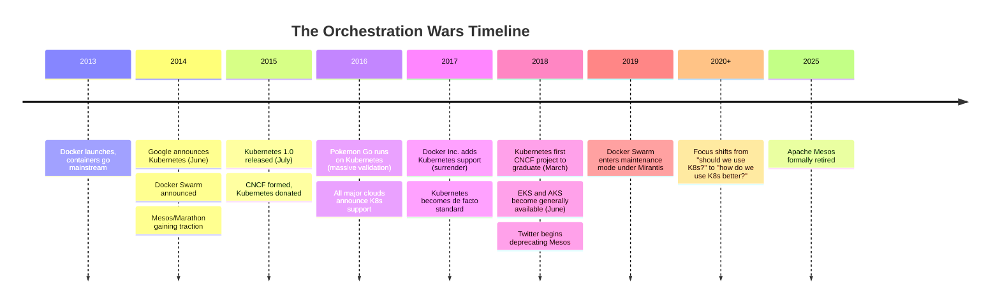
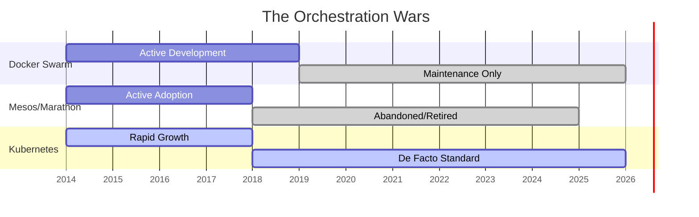

> **Complexity**: `[QUICK]` - Conceptual foundation with a practical evaluation exercise
>
> **Time to Complete**: 45-55 minutes
>
> **Prerequisites**: None - this is where everyone starts

---

# Module 1.1: Why Kubernetes Won

## Learning Outcomes

After this module, you will be able to:

- **Compare** Kubernetes with Docker Swarm, Apache Mesos plus Marathon, and HashiCorp Nomad using concrete technical and ecosystem tradeoffs.
- **Evaluate** infrastructure technology claims by testing whether the project has declarative operation, extensibility, neutral governance, and broad provider adoption.
- **Diagnose** why manually managed or proprietary orchestration approaches fail as workloads, teams, and failure modes scale.
- **Design** a short adoption argument that explains when Kubernetes is the right platform choice and when a simpler alternative is more appropriate.

---

## Why This Module Matters

It was 3 AM on Black Friday 2014, and a developer at a fast-growing e-commerce company was staring at terminal windows across a fleet of Linux servers. Their flash sale had gone far beyond the forecast, containers were crashing as traffic shifted between overloaded hosts, and every attempted manual restart created another question about capacity, ports, logs, and whether the replacement process had landed on a healthy machine. By sunrise the incident review was already forming: the company had lost hundreds of thousands of dollars in orders, but the deeper failure was that the team had tried to operate a distributed system as if it were a collection of pets.

That kind of incident is why the orchestration wars mattered. Docker made containers approachable, but approachability did not answer the harder operational questions: where should each container run, what happens when a machine disappears, how does a rollout happen without downtime, and who remembers the intended shape of the system after several emergency commands have changed production? Kubernetes won because it turned those questions into a persistent control problem rather than a heroic shell session, and that difference still shapes every Kubernetes task you will practice in this curriculum.

This module is not a nostalgia tour through old infrastructure brands. It is a decision-making lesson about why some platforms become durable standards while others become historical footnotes, respectable niches, or maintenance burdens. As you move into Kubernetes 1.35 and later modules, you will see controllers, manifests, labels, Deployments, Services, Custom Resource Definitions, and managed clusters; the history explains why those pieces exist and why they are arranged around an API-driven, declarative control loop instead of a pile of remote commands.

Before we go further, set the command-language expectation for the rest of the path. In hands-on Kubernetes modules, KubeDojo uses the shell alias `alias k=kubectl`, so a phrase such as `k get pods` means the normal Kubernetes CLI with a shorter name. This particular module is mostly conceptual, but introducing the alias here prevents a small syntax detail from becoming a distraction when the next module begins using commands for real.

---

## The Problem: Containers Solved Packaging, Not Operations

Docker's breakthrough was not that Linux suddenly gained isolation primitives in 2013; namespaces, cgroups, and related kernel mechanisms already existed. Docker's breakthrough was that it made container packaging, image distribution, and local execution understandable to ordinary application teams. A developer could build an image, run it on a laptop, push it to a registry, and reasonably expect the same filesystem and process environment to appear on a server. That was a major improvement over long setup documents and hand-tuned machines, but it moved the bottleneck from "how do I package this app?" to "how do I keep thousands of those packages alive?"

The first operational trap was placement. If ten services each need memory, CPU, storage, ports, and low-latency network paths to dependencies, someone has to decide where each replica belongs. On one host, that decision is easy enough to make by looking at `docker ps`, but across a large fleet it becomes a scheduling problem with constraints, competing priorities, and constant change. A system that places containers once and then forgets about them will slowly decay as machines fill up, workloads spike, disks fail, or teams deploy new versions with different resource profiles.

The second trap was failure recovery. Containers made processes cheap to replace, but cheap replacement is only useful when the platform can notice failure, choose a safe destination, restart the workload, and reconnect traffic without waiting for a person to read a dashboard. A human operator can restart one container after one crash; a platform has to handle node failure, image pull errors, bad releases, partial network outages, and noisy neighbor effects while preserving the intended service shape. That is why orchestration is not just a convenience layer over containers; it is the difference between "we can run a container" and "the service keeps running after reality changes."

The third trap was coordination between teams. Once container adoption spread, application developers, security engineers, network teams, storage teams, and operations teams all needed a shared contract. Without a common API, every team invented its own deployment scripts, environment conventions, service discovery habits, and emergency procedures. Those local conventions work until teams need to share tooling or move workloads between environments, and then every hidden assumption becomes a migration cost.

Pause and predict: if you had to update one hundred running containers by hand with zero downtime, which part would fail first: choosing hosts, routing traffic, rolling back a bad version, or proving afterward what actually happened? Most teams discover that the hardest part is not starting the first replacement container. The hard part is preserving intent while many small actions happen under pressure, because imperative actions leave the operator responsible for remembering the desired final state.

That pressure produced a category called container orchestration. A container orchestrator schedules work, monitors health, restarts failed containers, scales replicas, connects services, coordinates rollouts, and gives the organization a vocabulary for how production should look. The contenders of the mid-2010s agreed that orchestration was necessary, but they made different bets about simplicity, scope, extensibility, and governance. Kubernetes won because those bets lined up with how infrastructure standards actually survive.

---

## The Contenders and Their Tradeoffs

Docker Swarm was the most obvious answer for teams that already loved Docker. It promised a gentle path from local Docker commands to clustered container management, and that mattered because the early container audience did not want to become distributed systems specialists overnight. Its best feature was familiarity: if a small team had Docker Compose files and a modest deployment footprint, Swarm felt like the shortest distance between local containers and production scheduling.

```text
Pros:
- Simple to set up
- Native Docker integration
- Familiar Docker Compose syntax
- "It just works" for small deployments

Cons:
- Limited feature set
- Poor multi-cloud support
- Vendor lock-in to Docker Inc.
- Scaling limitations
```

The same familiarity that made Swarm attractive also limited its strategic reach. Enterprises were not only asking for a nicer way to start containers; they needed a platform that could become the meeting point for networking, storage, observability, policy, security, release automation, and cloud-provider services. Swarm did not build enough gravity around extension points and neutral governance to make competitors comfortable investing heavily in it. When Docker later added Kubernetes support and Mirantis acquired Docker Enterprise in 2019, the market signal was clear: Swarm remained useful for some small or established deployments, but it was no longer the center of container-platform innovation.

Apache Mesos plus Marathon represented the opposite end of the spectrum. Mesos was powerful, proven, and designed as a broad datacenter resource manager rather than a container-only product. It had real credibility because large engineering organizations such as Twitter had run it at significant scale, and its two-level scheduling model could support many workload types beyond containers. If Swarm's risk was that it was too narrow, Mesos's risk was that ordinary application teams had to understand too much machinery before they could ship confidently.

```text
Pros:
- Battle-tested at massive scale (Twitter)
- Flexible (runs containers AND other workloads)
- Two-level scheduling architecture
- Proven in production

Cons:
- Complex to operate
- Steep learning curve
- Smaller ecosystem
- Required separate components (Marathon, Chronos)
```

Mesos teaches an important lesson about platform competition: excellent technology can still lose if the adoption path is too heavy and the ecosystem becomes fragmented. Marathon, Chronos, DC/OS, framework choices, and operational complexity created a surface area that rewarded specialist teams but intimidated many mainstream adopters. Kubernetes did not have a trivial learning curve, but it offered a clearer container-first story, a standard API shape, and a fast-growing ecosystem that made new integrations feel like investments in the industry default. Apache formally retired Mesos to the Attic in 2025, which turned that market outcome into project history.

HashiCorp Nomad is the most interesting comparison because it did not disappear. Nomad chose a pragmatic design: a single binary, a smaller conceptual surface, and first-class support for mixed workloads such as containers, Java services, batch jobs, and ordinary binaries. It fits organizations that value operational simplicity and already use Consul, Vault, or Terraform. That makes Nomad less like a defeated rival and more like a disciplined alternative for teams that do not need the full Kubernetes ecosystem.

```text
Pros:
- Incredibly simple to deploy (single binary)
- Runs non-containerized workloads (like Java or binaries) easily
- Integrates tightly with the HashiCorp ecosystem (Consul, Vault)
- Lower operational overhead than Kubernetes

Cons:
- Smaller ecosystem compared to Kubernetes
- Less momentum for pure container-first architectures
```

Nomad's survival matters because it prevents a lazy conclusion. Kubernetes did not win because every other orchestrator was useless, and it is not automatically the best answer for every workload. Kubernetes won the broad industry standard role because it matched the needs of cloud-native container platforms, vendor ecosystems, and extensible APIs better than the alternatives. Nomad continues to make sense where the problem is mixed workload scheduling with lower platform overhead, especially when an organization can accept a smaller third-party integration universe.

Kubernetes entered the contest with a different kind of credibility. Google had operated Borg and then explored Omega, giving the founding team hard-won experience with scheduling, reconciliation, service management, and failure at enormous scale. Kubernetes was not a direct open-source dump of Borg, but it carried lessons from a decade of internal container management into a project that outside teams could run, inspect, extend, and govern together. The project also arrived at the right time: Docker had popularized containers, cloud providers were competing for portable workloads, and enterprises wanted a standard that no single vendor could take away.

```text
Pros:
- Google's decade of experience
- Declarative model (desired state)
- Massive ecosystem
- Cloud-native foundation
- Strong community governance

Cons:
- Complex
- Steep learning curve
- "Too much" for simple deployments
```

The honest version of the Kubernetes story includes that last disadvantage. Kubernetes is complex, and the complexity is not imaginary; a cluster brings API servers, etcd, controllers, schedulers, networking plugins, storage integrations, certificates, RBAC, admission control, node lifecycle, and upgrade planning. The reason the industry accepted that complexity is that many organizations already had the underlying distributed-systems problems, and Kubernetes gave them a shared control plane instead of countless custom scripts. Complexity did not vanish; it moved into a standard platform where the ecosystem could amortize the learning.

---

## The Declarative Model Changed the Job

The deepest difference between Kubernetes and many early approaches is the move from imperative commands to declarative desired state. Imperative operation tells the system exactly which steps to perform: start this container here, restart that process there, add two more replicas when traffic grows, and run this rollback command if a release fails. Declarative operation records the intended final condition and lets controllers continuously compare that intent with the actual cluster. This is the mental model behind Deployments, Services, ConfigMaps, Secrets, custom resources, and almost every advanced Kubernetes pattern you will meet later.

```text
Imperative (Swarm/Traditional):
"Start 3 nginx containers on server-1"
"If one dies, start another"
"If traffic increases, start 2 more"

Declarative (Kubernetes):
"I want 3 nginx replicas running. Always."
(Kubernetes figures out the rest)
```

The phrase "Kubernetes figures out the rest" should not be read as magic. It means the API server stores desired state, controllers watch that state, the scheduler selects nodes, kubelets run workloads, and status flows back into the control plane. Each controller owns a narrow reconciliation loop: observe reality, compare it with the desired object, and take the next safe step toward convergence. If a pod disappears but the Deployment still declares three replicas, the system does not need a human to remember that the missing pod was supposed to exist.

Pause and predict: if a Deployment declares three replicas and someone manually deletes two matching pods, what should a declarative system do after it observes the mismatch? The correct answer is that it creates replacements until the observed state matches the desired state again, subject to scheduling capacity and policy. That behavior feels obvious once you know Kubernetes, but it was a profound shift from treating deployment as a one-time command sequence.

Declarative design also changes accountability. In an imperative system, the record of production may be a shell history, a runbook, and a set of people who remember what was done during an incident. In a declarative system, the intended configuration can live in version-controlled manifests, reviewed changes, and auditable API objects. That does not eliminate mistakes, but it gives teams a stable source of truth to inspect when something drifts.

The tradeoff is that declarative systems require learners to become comfortable with indirect action. When you change a Deployment, you are not personally starting each replacement pod; you are changing the desired object and letting controllers execute the rollout. Beginners sometimes interpret that indirection as unnecessary YAML ceremony, especially when a direct `docker run` command feels faster. The platform's value appears when the third replica fails at midnight, a node drains during maintenance, or a rollout needs to pause, resume, and report status without inventing custom control logic.

This is why Kubernetes concepts can feel oddly philosophical at first. A Deployment is not merely a file format, and a Service is not merely a network rule. They are API contracts that let independent controllers and tools coordinate around desired state. The same pattern later powers GitOps, operators, autoscaling, policy controllers, and service meshes, because each extension can work with the Kubernetes API rather than inventing a separate platform from scratch.

---

## Experience Became an Open Platform

Google's role mattered, but not in the simplistic sense that "Google built it, so everyone followed." The stronger point is that Kubernetes encoded production lessons from Borg and Omega while deliberately avoiding the trap of remaining a Google-only platform. The Borg, Omega, and Kubernetes paper describes lessons from three generations of container management systems, and those lessons show up in Kubernetes as control loops, labels, service abstraction, desired state, and API machinery. That background gave Kubernetes credibility before most companies had enough container history to know which failures were waiting for them.

The first Kubernetes commit landed in June 2014, the public announcement followed at DockerCon, and version 1.0 arrived in July 2015 alongside donation to the newly formed Cloud Native Computing Foundation. Those dates matter because the project moved from a vendor-originated idea into a neutral foundation before cloud providers had to decide whether adopting it meant endorsing a competitor's proprietary product. That governance move was not administrative decoration; it was one of the reasons AWS, Azure, Google Cloud, Red Hat, VMware, and many others could build businesses around the same API.

Consider the strategic choice from Google's point of view. If Google had kept Kubernetes as a tightly controlled Google Cloud feature, it might have gained a temporary product advantage, but the broader industry would have remained fragmented across cloud-specific orchestrators. By open-sourcing the project and placing it under neutral governance, Google helped commoditize the orchestration layer and made workload portability a more realistic expectation. That made Google Cloud more credible for teams that did not want to bet everything on a single provider, even though it also allowed competitors to offer managed Kubernetes services.

The cloud providers' adoption created a feedback loop. Once Google Kubernetes Engine, Azure Kubernetes Service, Amazon Elastic Kubernetes Service, and other managed offerings existed, many organizations could use Kubernetes without building every control-plane component themselves. Managed services lowered the entry barrier, which brought more users, which attracted more vendors, which produced more integrations, which made the platform even harder to ignore. Kubernetes did not become simple; it became the standard complexity that cloud providers were willing to operate on behalf of customers.

Which approach would you choose here and why: a proprietary orchestrator that is technically elegant but tied to one vendor, or a rougher open platform with multiple providers competing to host it? For foundational infrastructure, the second option often wins because buyers are not only purchasing features. They are purchasing exit options, hiring pools, training materials, third-party integrations, and confidence that the platform will outlive a single product roadmap.

The CNCF also changed how related projects formed. Prometheus, Envoy, Fluentd, containerd, Helm, OpenTelemetry, and many other cloud-native tools could integrate with Kubernetes while living in a broader foundation ecosystem. Some of those projects predated or evolved independently from Kubernetes, but Kubernetes gave them a common operating environment. That is the ecosystem effect: the platform becomes more valuable because other projects can assume its API, labels, service discovery patterns, and operational vocabulary.

The Spotify migration from Helios to Kubernetes illustrates the point at an organizational scale learners can understand. Spotify had a homegrown orchestration system that solved real problems for its environment, but feature parity with a fast-moving open ecosystem became expensive. Moving toward Kubernetes meant Spotify could benefit from shared tooling, community knowledge, and industry-standard integrations instead of carrying every platform improvement alone. The lesson is not that internal platforms are always wrong; the lesson is that internal platforms must justify the compounding cost of being outside the ecosystem.

---

## Extensibility Turned Kubernetes into a Platform for Platforms

Kubernetes won partly because it did not try to hard-code every future infrastructure idea into the core project. Instead, it exposed an API model that could be extended through Custom Resource Definitions, controllers, admission webhooks, storage interfaces, networking interfaces, and standard metadata. That design let the ecosystem build platform features around Kubernetes without requiring every feature to become part of Kubernetes itself. A smaller core with strong extension points is easier to evolve than a monolith that must bless every workflow centrally.

Custom Resource Definitions are the clearest example. A CRD lets a team define a new API type that the Kubernetes API server can store and serve, such as a certificate request, database cluster, backup policy, rollout strategy, or machine-learning inference service. A controller can then watch those custom objects and reconcile real infrastructure to match them. This pattern is why Kubernetes became a substrate for operators and platform engineering rather than only a place to run stateless web containers.

Extensibility also explains why Kubernetes could absorb disagreement. Teams disagreed about networking approaches, storage backends, ingress behavior, runtime choices, packaging methods, and deployment workflows. A less extensible platform would have forced one answer early, alienating users whose environments needed another approach. Kubernetes instead defined enough common ground for interoperability while leaving room for Container Network Interface plugins, Container Storage Interface drivers, ingress controllers, service meshes, GitOps tools, and policy engines.

That flexibility has a cost. A new learner can reasonably ask why there are so many ways to expose traffic, install applications, collect metrics, manage certificates, or run policy checks. The answer is that Kubernetes became a marketplace of operational approaches, and marketplaces produce choice overload. The cure is not to memorize every ecosystem project at the beginning; it is to understand the core control model well enough to evaluate whether an extension follows Kubernetes patterns or fights them.

The API-first approach made automation durable. Tools do not need to scrape a dashboard or SSH into nodes to understand intent; they can read and write Kubernetes objects through the API. A deployment tool can update a manifest, an autoscaler can change replica counts, an admission controller can reject unsafe specs, and an observability system can label metrics with Kubernetes metadata. When many tools share the same API grammar, integration becomes less fragile.

The same extensibility is why Kubernetes can feel "too much" for tiny applications. A two-container hobby project may not need CRDs, admission control, autoscaling, storage classes, multi-zone scheduling, or service meshes. For that project, Docker Compose, a small platform-as-a-service, or a managed container app service may be the better engineering decision. Kubernetes wins when its ecosystem and control loops solve problems the team actually has, not when the team wants a fashionable architecture diagram.

---

## Timeline and Market Outcome

The orchestration wars happened quickly because container adoption compressed years of infrastructure debate into a few crowded release cycles. Docker arrived as the developer-friendly packaging layer, Swarm tried to extend that familiarity into clustering, Mesos brought proven resource-management ideas from large-scale datacenters, Nomad offered a lean scheduler for mixed workloads, and Kubernetes combined container-first abstractions with neutral governance and extensibility. By the end of the decade, the question in many companies had changed from "which orchestrator should we choose?" to "how do we operate Kubernetes responsibly?"



Timelines can make victory look inevitable, but engineers living through those years did not have that luxury. Docker had the developer mindshare, Mesos had scale credentials, Nomad had operational elegance, and Kubernetes had a steep learning curve. The decisive factor was not one feature; it was the way several forces compounded. Declarative controllers made operations more resilient, Google's experience made the design credible, CNCF governance made vendors comfortable, cloud-provider support made adoption practical, and extensibility made the ecosystem self-reinforcing.

The Pokemon Go launch in 2016 became an unusually visible proof point because traffic reportedly surged far beyond expectations and Google Cloud discussed how Kubernetes and GKE helped handle the load. Case studies should never be treated as universal proof that one platform solves every scaling problem, but they matter because enterprises often need public evidence before trusting a young infrastructure project. Kubernetes gained a story that was easy to retell: real consumer traffic, extreme demand, and an orchestration platform that could scale under pressure.

The Gantt view below is a simplified market map rather than a precise maintenance calendar. Its value is that it shows the different endings: Swarm remained available but no longer defined the market, Mesos moved from proven enterprise technology to retirement, and Kubernetes moved from rapid growth into default-platform status. Nomad is not shown in this preserved diagram, but you should remember it as the niche survivor rather than a failed clone.



Adoption data reinforces the outcome, but it should be read carefully. CNCF survey numbers describe respondent populations and usage categories, not every server in the world, so they are better evidence of momentum than a perfect census. The more important pattern is that Kubernetes moved from experimentation into production infrastructure across industries, while managed Kubernetes services made the API available even to teams that did not want to operate the full control plane themselves.

By 2026, the discussion had shifted again. Kubernetes was no longer only the web-service orchestrator from the container boom; it had become a control-plane pattern for platform teams, security policy, data infrastructure, and AI workloads. That expansion creates both opportunity and risk. The opportunity is that a stable API substrate can support many kinds of automation; the risk is that teams will treat Kubernetes as a universal answer and ignore simpler deployment models that would meet their needs with less operational burden.

Another way to read the market outcome is through hiring and training. A company choosing Kubernetes can recruit engineers who have seen similar objects, failure modes, and operational patterns elsewhere, even if the surrounding cloud provider and tooling differ. A company choosing a private orchestrator must teach every new engineer its local model from scratch, and every vendor integration becomes a translation project. That does not make the private choice impossible, but it raises the long-term cost of being unique.

The same shared vocabulary helps during incidents. When an engineer says a rollout is stuck, a pod is pending, a Service has no endpoints, or a controller is reconciling slowly, other Kubernetes practitioners can form useful hypotheses quickly because the abstractions are standard. In a custom platform, the team may first need to rediscover what the local terms mean and which component owns the next action. Standards matter most when the room is tired, production is noisy, and precision saves time.

---

## Patterns & Anti-Patterns

The first durable pattern is to separate the platform decision from the packaging decision. Containers answer how an application artifact is built and run; orchestration answers how many copies should exist, where they should run, how they recover, how they receive traffic, and how teams coordinate changes. Kubernetes won because it treated orchestration as a persistent platform responsibility. A team evaluating a new technology should ask whether the tool only improves packaging convenience or whether it also owns the control-loop problems that appear during real production failure.

The second pattern is to prefer APIs over hidden procedures. Kubernetes resources are not perfect documentation, but they are inspectable objects with metadata, status, ownership relationships, and declarative specs. That makes the system legible to controllers and humans at the same time. When teams build platform workflows around scripts that mutate servers directly, they often lose that shared record; when they build around API objects, other tools can observe, validate, and extend the workflow.

The third pattern is to value neutral ecosystems for foundational layers. A developer tool can sometimes thrive as a single-vendor product because the switching cost is low and the integration surface is narrow. A production orchestration layer touches networking, storage, identity, deployment, monitoring, cloud contracts, and team training. For that kind of layer, neutral governance and multiple provider implementations reduce adoption fear because organizations can invest without assuming one vendor will always make decisions in their favor.

The most common anti-pattern is the heroic internal orchestrator. A team starts with a reasonable script that restarts a few containers, then adds placement rules, then health checks, then blue-green deployments, then service discovery, then secrets handling, then logs, then rollback behavior, then audit requirements. At each step the script seems cheaper than adopting a platform, but after enough incidents the team owns a partial orchestrator with fewer tests, fewer contributors, and fewer integrations than the standard tool it avoided.

Another anti-pattern is Kubernetes maximalism. Some teams hear that Kubernetes won and conclude that every workload should move there immediately. That is historically illiterate in the opposite direction from ignoring Kubernetes: the lesson is not that the biggest platform always wins locally, but that ecosystem fit and operational needs matter. If a team has one small service, no autoscaling need, no multi-team platform contract, and no reason to standardize around Kubernetes APIs, a simpler service may be a better first move.

The final anti-pattern is ecosystem shopping without core understanding. New learners sometimes collect Helm charts, service meshes, dashboards, and policy engines before they can explain why a Deployment recreates a pod or how a Service selects endpoints. That reverses the learning order. Kubernetes won because its core abstractions created a stable base for extensions, so a team that does not understand the base will misconfigure the extensions and blame the ecosystem for confusion it introduced itself.

The preserved misconception table below captures three useful corrections. Keep it nearby when you hear simplified origin stories, because each row warns against reducing a complex platform outcome to a single cause.

| Misconception | Reality |
|---------------|---------|
| "K8s won because Google" | Google helped, but neutral governance was key. AWS wouldn't adopt a Google-controlled product. |
| "Swarm lost because Docker" | Swarm lost because it couldn't match K8s features or ecosystem. Company issues accelerated it. |
| "Mesos was inferior technology" | Mesos was powerful but too complex. Technology alone doesn't win—ecosystem and simplicity matter. |

---

## Decision Framework

Use Kubernetes when the operational problem has grown beyond simple container startup. Good signals include multiple services, multiple teams, rolling updates, self-healing requirements, horizontal scaling, service discovery, policy enforcement, and a need for shared tooling across environments. The platform starts to pay for itself when the same API can support deployment, observability, security, and automation workflows that would otherwise be rebuilt separately. In that world, Kubernetes is not merely running containers; it is giving the organization a common contract for production change.

Use a simpler alternative when the workload is small, the team is early, or the operational surface does not justify a cluster. Docker Compose, a managed platform-as-a-service, a serverless container service, or Nomad may be the more responsible choice when the business needs speed with fewer moving parts. Choosing something simpler is not a failure to appreciate Kubernetes. It is applying the same historical lesson correctly: platform choices should fit the coordination and failure problems you actually face.

Use Nomad or another lean scheduler when mixed workloads and operational simplicity matter more than Kubernetes-native ecosystem depth. This is common in organizations with long-running non-container workloads, batch jobs, existing HashiCorp tooling, and a platform team that wants a small scheduling core. The tradeoff is that the team accepts fewer Kubernetes-native integrations and a smaller hiring and training market. That can be an excellent trade when it is explicit and matched to real constraints.

Avoid proprietary orchestration as a foundational bet unless the integration boundary is intentionally narrow. A cloud-specific scheduler can be valuable if your organization has already made a strong provider commitment and the service reduces toil dramatically. It becomes risky when teams need portability, independent tooling, multi-cloud leverage, or long-lived platform knowledge that survives vendor roadmap changes. Kubernetes won partly because it made competitors comfortable enough to support the same model, so a new technology that lacks that property should face harder questions.

When evaluating a new foundational infrastructure technology today, apply this survival checklist. It is not a guarantee, but it forces the right conversation before a team mistakes a polished demo for a durable platform.

- [ ] **Declarative State Management**: Does it rely on continuous reconciliation rather than imperative commands?
- [ ] **Extensible Architecture**: Can users add their own custom resources without modifying the core codebase?
- [ ] **Neutral Governance**: Is it hosted by a foundation (like CNCF) rather than controlled by a single vendor?
- [ ] **Pluggable Interfaces**: Can the networking, storage, and runtimes be easily swapped out?
- [ ] **Cloud Provider Buy-in**: Are multiple competing cloud providers offering it as a managed service?

Before running this decision framework in a real team meeting, write down the strongest argument against your preferred answer. If you prefer Kubernetes, describe the operational burden honestly. If you prefer a simpler platform, describe the migration trigger that would make Kubernetes worth revisiting. Good platform decisions include their own expiration conditions.

---

## Did You Know?

- **Kubernetes means "helmsman" or "pilot" in Ancient Greek.** It is also the etymological root of "cybernetics", and the abbreviation **K8s** counts the 8 letters between the "K" and the "s".

- **Kubernetes was publicly announced at DockerCon on June 10, 2014.** The project had begun days earlier with an initial GitHub commit that included 250 files, then reached version 1.0 in July 2015.

- **The logo is a ship's wheel, and the 7 spokes are a Star Trek reference.** They nod to the project's early internal codename, *Project Seven of Nine*, which itself referenced Borg.

- **Apache Mesos became an Apache top-level project in June 2013 and retired to the Apache Attic in 2025.** That history is a useful reminder that serious, proven infrastructure can still lose platform momentum.

---

## Common Mistakes

When learning about container orchestration history and applying its lessons, beginners often make these conceptual errors:

| Mistake | Why It Happens | How to Fix It |
|---------|----------------|---------------|
| Treating K8s as just "Docker Swarm but bigger" | It is tempting to compare only the visible container-starting behavior and miss the shift from commands to reconciliation loops. | Understand K8s as a state-matching engine with controllers, not as a larger script runner. |
| Choosing K8s for a simple 2-container app | Teams confuse the industry-standard platform with the right local answer for every small workload. | Start with Docker Compose, a managed app platform, or another simpler option until orchestration requirements are real. |
| Believing vendor-locked orchestrators are safer | A polished single-vendor service can feel safer than a broad open ecosystem when the first demo is smooth. | Prioritize open governance and exit options for foundational infrastructure that will shape hiring, tooling, and architecture. |
| Ignoring the CNCF ecosystem | Beginners sometimes rebuild logging, monitoring, policy, and delivery workflows without noticing that standard integrations already exist. | Evaluate mature ecosystem tools before creating custom platform components that your team must maintain alone. |
| Focusing only on Google's role | The origin story is memorable, so it can overshadow the governance and provider-adoption choices that made adoption safe for competitors. | Explain Kubernetes as Google experience plus CNCF neutrality plus multi-provider adoption, not as a Google product story. |
| Assuming Kubernetes replaces Docker | Container images, runtimes, and orchestrators solve different parts of the system and are often discussed together loosely. | Differentiate image building, runtime execution, and orchestration so each tool's responsibility stays clear. |
| Trying to learn K8s without understanding the "Why" | Jumping straight into YAML can make Kubernetes feel like arbitrary ceremony rather than a control-system design. | Learn the history and declarative philosophy first, then connect each object to the operational problem it solves. |

---

## Quiz

<details><summary>1. Your startup is moving from one server to several nodes, and the lead developer proposes a Python script that SSHes into hosts, starts Docker containers, checks them every few minutes, and restarts failed processes. Based on orchestration history, what risk should you diagnose first?</summary>

The first risk is that the team is accidentally building an imperative orchestrator without the engineering budget of a real platform. The script may handle the happy path, but it must eventually learn placement, health checks, rollout safety, node failure behavior, logging, auditability, and conflict handling. Kubernetes won because it made desired state durable and delegated reconciliation to controllers instead of relying on a person or script to remember every corrective action. The safer argument is not "never automate"; it is "do not hide a growing control plane inside one-off automation."

</details>

<details><summary>2. A cloud vendor releases a proprietary orchestrator that benchmarks faster than Kubernetes but only runs on that vendor's platform. How should you evaluate the claim using the Kubernetes survival checklist?</summary>

You should separate technical speed from platform survivability. A faster scheduler may matter for some workloads, but a foundational orchestrator also needs neutral governance, extension points, multi-provider confidence, and an ecosystem that outside vendors will support. Kubernetes won because competitors could adopt and extend it without surrendering control to Google. A proprietary single-cloud tool might be useful inside that cloud, but it is a weaker broad standard unless your organization has intentionally accepted the lock-in.

</details>

<details><summary>3. Your team is comparing Docker Swarm and Kubernetes for an enterprise application that may run across AWS and on-premises servers. One engineer argues for Swarm because setup is simpler. What historical context changes the decision?</summary>

The engineer is correct that Swarm can be simpler at the start, so the response should not dismiss the concern. The historical issue is that Swarm did not build the same extensible, vendor-neutral, multi-cloud ecosystem that Kubernetes built, and it no longer represents the main direction of container-platform development. For a small deployment, simplicity may win; for an enterprise system expected to span environments and integrate with modern tooling, Kubernetes offers a more durable API and ecosystem. The decision turns on future coordination costs, not only day-one installation effort.

</details>

<details><summary>4. During an incident review, someone says the Deployment YAML is "just documentation" because operators can always run commands directly. How do you explain the declarative model?</summary>

The YAML is not merely documentation; it is the desired state consumed by the Kubernetes API and controllers. Direct commands can be useful during investigation, but they do not automatically create a durable record of what production should converge toward. A Deployment spec tells the system how many replicas should exist and gives controllers a target to restore after drift or failure. That is why declarative configuration is central to Kubernetes rather than a stylistic preference.

</details>

<details><summary>5. A platform team wants to build an internal orchestrator because Kubernetes feels complex. Which lesson from Spotify's Helios migration should shape your response?</summary>

Spotify's experience shows that a homegrown orchestrator can solve real local problems and still become expensive when the broader ecosystem moves faster. The team must maintain features, integrations, training, and operational knowledge that the Kubernetes community and vendors are already sharing. That does not prove every internal platform is wrong, but it raises the bar for building one. The response should compare total ecosystem cost, not just the discomfort of learning Kubernetes.

</details>

<details><summary>6. A CTO notes that Mesos was proven at massive scale and asks why the "best technology" did not win. How should you answer?</summary>

The answer is that platform outcomes depend on adoption path, ecosystem, governance, and usability as well as raw technical capability. Mesos was powerful and credible, but its operational model and surrounding components were harder for mainstream container teams to adopt. Kubernetes offered a clearer container-first API, strong extension points, and neutral governance that encouraged cloud-provider support. The "best" platform for industry adoption is often the one that enough teams can learn, extend, and trust together.

</details>

<details><summary>7. Your organization is evaluating a new Kubernetes operator that defines several CRDs. What should you check before treating it as an ecosystem-aligned choice?</summary>

You should check whether the operator follows Kubernetes patterns rather than merely installing custom complexity into the cluster. Look for clear CRD schemas, controller behavior that reconciles status predictably, RBAC scoped to the required resources, upgrade guidance, and compatibility with your Kubernetes version. CRDs are powerful because they extend the API model, but they also add new operational responsibilities. The safe choice is not "anything with a CRD"; it is a tool whose extension points are understandable and maintainable.

</details>

---

## Hands-On Exercise: Orchestration Architecture Reflection

This module is conceptual, but the learning should still produce an artifact you can use in an engineering conversation. Imagine your company's CTO wants to build a proprietary internal orchestration system for microservices because Kubernetes "feels too complex." Your task is to prepare a short technical argument that uses the orchestration wars as evidence without pretending Kubernetes is free of tradeoffs.

Start by writing three sentences that define the operational problem, not the preferred tool. Your argument should mention placement, failure recovery, rollout safety, and shared APIs because those are the problems that appear after basic container packaging succeeds. Then write two sentences explaining why an imperative script or proprietary scheduler becomes expensive as teams and failure modes grow. This forces you to diagnose the control-plane problem before recommending the control-plane product.

Next, compare at least two historical contenders. Use Docker Swarm to discuss the difference between day-one simplicity and long-term ecosystem gravity, and use Mesos to discuss the difference between proven scale and mainstream adoption. If you include Nomad, treat it fairly as a living niche alternative rather than as a failed Kubernetes clone. The goal is to show judgment, not brand loyalty.

Then make the Kubernetes case with both strengths and limits. Mention declarative reconciliation, extensibility through the API, CNCF governance, managed cloud-provider adoption, and the availability of standard integrations. Also include one sentence describing when Kubernetes would be too much for the current workload. A persuasive platform argument is stronger when it admits the boundary where a simpler option would be better.

Finally, turn your notes into a brief recommendation. It should be short enough for an architecture review comment, specific enough to survive follow-up questions, and grounded enough that another engineer can see the historical evidence behind it. Treat this as practice for the platform conversations you will have later when choosing between native Kubernetes, managed services, operators, GitOps tools, and simpler deployment systems.

### Success Criteria

- [ ] You identified at least one ecosystem risk related to building a custom orchestrator, referencing CNCF governance or Kubernetes integrations.
- [ ] You explained the difference between imperative commands and declarative reconciliation in your argument.
- [ ] You referenced the maintenance burden implied by Google's decade of Borg and Omega experience.
- [ ] You provided a concrete example of a company or project that moved away from its earlier orchestration approach.
- [ ] You stated one condition where Kubernetes would be the wrong first choice for a small workload.

<details><summary>Solution notes</summary>

A strong answer says that the team should avoid building a proprietary orchestrator unless it can justify owning scheduling, reconciliation, rollout behavior, service discovery, security integration, observability hooks, and ecosystem maintenance. It uses Swarm as the warning about day-one simplicity without broad ecosystem gravity, Mesos as the warning that proven scale does not guarantee mainstream adoption, and Spotify's Helios migration as a warning about internal feature parity costs. It recommends Kubernetes when the organization needs a shared API and ecosystem, while admitting that Docker Compose, a managed app platform, or Nomad may fit smaller or mixed-workload cases better.

</details>

---

## Sources

- [Kubernetes Blog: 10 Years of Kubernetes](https://kubernetes.io/blog/2024/06/06/10-years-of-kubernetes/)
- [Kubernetes Blog: 4 Years of K8s](https://kubernetes.io/blog/2018/06/06/4-years-of-k8s/)
- [Google Research: Borg, Omega, and Kubernetes](https://research.google/pubs/borg-omega-and-kubernetes/)
- [Kubernetes Documentation: Components](https://kubernetes.io/docs/concepts/overview/components/)
- [Kubernetes Documentation: Controllers](https://kubernetes.io/docs/concepts/architecture/controller/)
- [Kubernetes Documentation: Custom Resources](https://kubernetes.io/docs/concepts/extend-kubernetes/api-extension/custom-resources/)
- [Kubernetes Documentation: Declarative Management of Objects](https://kubernetes.io/docs/tasks/manage-kubernetes-objects/declarative-config/)
- [Docker Docs: Swarm Mode](https://docs.docker.com/engine/swarm/)
- [Apache Attic: Apache Mesos](https://attic.apache.org/projects/mesos.html)
- [Apache Mesos Project Site](https://mesos.apache.org/)
- [CNCF Announcement: 2025 Annual Cloud Native Survey](https://www.cncf.io/announcements/2026/01/20/kubernetes-established-as-the-de-facto-operating-system-for-ai-as-production-use-hits-82-in-2025-cncf-annual-cloud-native-survey/)
- [Google Cloud Blog: Bringing Pokemon Go to Life on Google Cloud](https://cloud.google.com/blog/products/containers-kubernetes/bringing-pokemon-go-to-life-on-google-cloud)
- [CNCF Blog: Spotify Capacity Planning with Kubernetes](https://www.cncf.io/blog/2019/06/27/with-kubernetes-spotifys-capacity-planning-went-from-almost-an-hour-to-seconds-or-minutes-2/)
- [HashiCorp Nomad Documentation](https://developer.hashicorp.com/nomad/docs)

---

## Next Module

[Module 1.2: Declarative vs Imperative](../module-1.2-declarative-vs-imperative/) - The next module turns the philosophy from this lesson into hands-on Kubernetes behavior, showing how desired state changes what you do at the command line.
