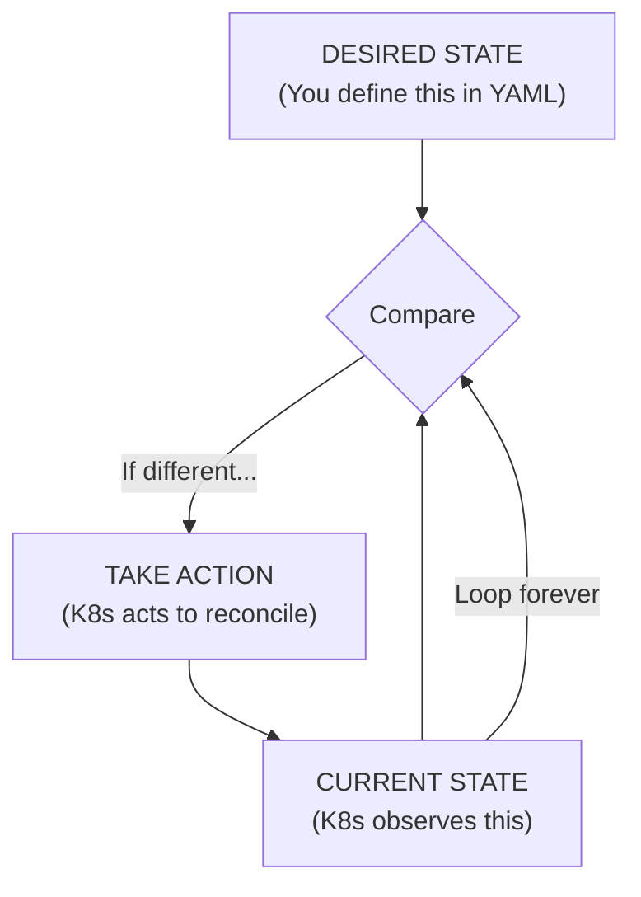
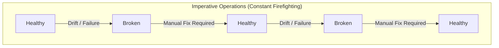
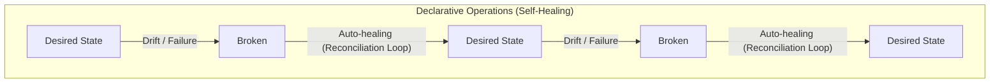

# Module 1.2: Declarative vs Imperative - The Philosophy

> **Complexity**: `[QUICK]` - Conceptual understanding with production consequences
>
> **Time to Complete**: 25-30 minutes
>
> **Prerequisites**: Module 1 (Why Kubernetes Won)
>
> **Kubernetes Version**: 1.35+

---

## What You'll Be Able to Do

After this module, you will be able to:

- **Compare** imperative and declarative approaches using concrete Kubernetes workload examples.
- **Predict** how Kubernetes reconciles a managed object after manual drift, deletion, or failure.
- **Design** a production-safe workflow that turns one-off commands into reviewed declarative manifests.
- **Diagnose** outages caused by imperative thinking, configuration drift, and multiple sources of truth.

---

## Why This Module Matters

The on-call engineer at a SaaS company got paged at 2 AM because a revenue-critical checkout service was crash-looping during a regional promotion. Half-asleep, she treated the system like an old fleet of hand-managed servers: SSH into the node, restart the container, watch the process come back, and close the alert. Kubernetes immediately killed her manually started container and replaced it with a new pod from the Deployment template, which still contained the broken environment variable. She restarted it again, Kubernetes removed it again, and the incident stretched for 45 minutes while customers abandoned carts and the incident channel filled with contradictory theories.

Nothing in that story requires Kubernetes to be broken. The cluster was doing exactly what it was built to do: compare the declared desired state with the observed current state and move reality back toward the declaration. The operational failure came from using imperative instincts inside a declarative control system. When the engineer finally changed the Deployment YAML, committed the fix, and applied the corrected manifest, the next rollout converged in seconds because she stopped fighting the controller and started changing the source of truth.

That difference is not academic. Kubernetes rewards operators who ask, "What state should exist?" before asking, "What command should I run?" It punishes teams that treat a live cluster as a collection of mutable servers because every controller is designed to undo unowned manual edits. In this module, you will build the mental model that makes Deployments, Services, GitOps, drift detection, and self-healing feel like parts of one system rather than a pile of commands.

---

## The Two Approaches

Imperative operations are direct instructions to perform steps now. They feel natural because most early computing tasks were taught this way: open a shell, run a command, inspect the output, run the next command, and keep going until the system looks right. In a small environment, this style can be fast and satisfying because the operator has immediate feedback and can adapt as new information appears. The hidden cost is that the operator becomes the control loop, which means the system only keeps working while a human remembers the steps, watches the state, and repeats the fix after every failure.

The simplest imperative deployment story looks like this. The commands are easy to read, but the operational burden is buried in the comments: someone must check, decide, repeat, and document every correction.

```bash
# Imperative approach
ssh server1
docker run -d nginx
docker run -d nginx
docker run -d nginx
# Check if they're running
docker ps
# If one dies, start another
# If traffic increases, run more
# If server fails, SSH somewhere else and repeat
```

Pause and predict: if this server reboots while the operator is asleep, what component notices that three `nginx` containers are required, and where is that requirement recorded? If your answer depends on a person remembering the desired count or on a shell history being available, you have found the weakness of imperative operation. The current state may have been correct for a moment, but the intent was never given to a system that can preserve it.

Declarative operations change the conversation. Instead of issuing each step, you describe the end state and hand that declaration to a controller that is responsible for making it true. The declaration is not a suggestion or a script transcript; it is a durable record of intent. In Kubernetes, that record is an API object stored by the control plane, observed by controllers, and used repeatedly whenever the live cluster drifts away from the target.

```yaml
# Declarative approach
apiVersion: apps/v1
kind: Deployment
metadata:
  name: nginx
spec:
  replicas: 3
  selector:
    matchLabels:
      app: nginx
  template:
    metadata:
      labels:
        app: nginx
    spec:
      containers:
      - name: nginx
        image: nginx
```

For the rest of this curriculum, define the short alias `k` once in your shell and use it for Kubernetes commands. The alias is only a typing convenience; it does not change the API request or the operational model.

```bash
alias k=kubectl
```

The original one-line apply command from many beginner tutorials still captures the important idea: submit the declaration, then let Kubernetes handle the ongoing work. In daily practice, this module uses the `k` alias after introducing it, but you should recognize both forms when reading documentation or old runbooks.

```bash
kubectl apply -f nginx-deployment.yaml
# Done. Kubernetes handles the rest.
```

```bash
k apply -f nginx-deployment.yaml
```

Pause and predict: if you run the same `k apply -f nginx-deployment.yaml` command a second time without changing the file, what should Kubernetes create, update, or leave alone? The correct expectation is not "run the deployment again." The correct expectation is "compare the declaration with the stored object and converge only if something differs." That property, called idempotency, is one reason declarative configuration works so well in automated pipelines.

The distinction between the two styles is not that imperative commands are evil and declarative files are always good. The distinction is where long-term intent lives. Imperative work is useful for exploration, quick diagnostics, and temporary emergency action because it gives an operator immediate leverage. Declarative work is safer for production because intent survives the operator, can be reviewed before it changes the cluster, and can be reconciled by software after the next crash, reschedule, or rollout.

| Operating Question | Imperative Thinking | Declarative Thinking |
|---|---|---|
| Primary question | What command should I run next? | What state should the system maintain? |
| Source of truth | Human memory, runbook, shell history, ticket notes | Versioned manifests and API objects |
| Failure response | Human observes, decides, and acts | Controller observes, compares, and reconciles |
| Repeated execution | Can duplicate work or hit "already exists" errors | Should converge on the same state |
| Auditability | Depends on external logging and discipline | Changes can flow through review and Git history |

War story: a platform team once investigated a memory-limit change that appeared in production during an incident but could not be found in Git, the deployment pipeline, or the service repository. The change had been made with a live edit at the end of a long call, fixed the immediate symptom, and then disappeared when the next normal release applied the old manifest. The outage postmortem was not about the memory limit itself; it was about the dangerous gap between live state and declared state.

---

## The Reconciliation Loop

Kubernetes is built around reconciliation. A controller watches desired state from the API server, observes current state from the cluster, compares the two, and takes action when they differ. This pattern appears in Deployments, ReplicaSets, StatefulSets, Jobs, Services, Nodes, and many extension controllers. It is the reason Kubernetes can recover from pod deletion, node failure, and partial rollout progress without waiting for a human to re-run the last correct command.



The important word in that diagram is "forever." `k apply` is not the deployment itself in the way a shell script might be the deployment. Applying a manifest sends desired state to the API server; controllers continue the work after the command exits. If a node fails five minutes later, the Deployment controller still knows the desired replica count because the desired state is stored in the Kubernetes API, not in the terminal that ran the command.

This is why manual changes to managed objects often feel like Kubernetes is being stubborn. Imagine deleting one pod from a Deployment because you want to "restart" it. The Deployment controller does not interpret that deletion as a new desired state of fewer pods. It observes that the ReplicaSet now has fewer available pods than requested, creates a replacement, and keeps moving toward the declared count. From the controller's point of view, it is repairing damage, not arguing with the operator.

```yaml
# You say: "I want 3 replicas"
spec:
  replicas: 3
```

Before running this in a lab, predict the controller's behavior: if you manually delete a pod managed by a Deployment with `spec.replicas: 3`, will Kubernetes preserve the deletion, create a replacement, or wait for the next `k apply`? The key is ownership. A managed pod is not the source of truth; the Deployment and its ReplicaSet are higher-level declarations that explain how many matching pods should exist.

The reconciliation model also explains why Kubernetes does not need every failure mode encoded in your deployment pipeline. You do not write separate pipeline steps for "if a container exits, start another," "if a node disappears, reschedule elsewhere," or "if a rollout stalls, expose status." You declare a workload shape, and controllers perform narrow, repeated corrections. The platform is powerful because each controller has a small responsibility and can keep performing it after the original change request is long gone.

There is still a boundary to respect. Controllers are not magic recovery agents that can infer a correct business configuration from a broken declaration. If you declare the wrong image, wrong Secret name, or impossible resource request, Kubernetes will faithfully converge toward the wrong target and surface symptoms through status, events, and conditions. Declarative systems reduce toil; they do not remove the need to make accurate declarations.

---

## Real-World Analogy: The Thermostat

A thermostat is the classic analogy because it separates desired state from manual action. In an imperative room, you feel cold, turn on the heater, wait, feel warm, turn it off, and repeat. You are constantly observing the environment and issuing commands. This model can work for one person in one room, but it collapses when the room is unattended, the weather changes overnight, or several people keep touching the switch with different preferences.

```text
You: "It's cold. Turn on the heater."
[Time passes]
You: "It's hot now. Turn off the heater."
[Time passes]
You: "Cold again. Turn on the heater."
[Repeat forever, or give up and suffer]
```

In the declarative version, you choose a target temperature and let a control loop handle the repeated measurement and correction. The thermostat does not ask you whether the furnace should turn on at every minute. It compares current temperature with target temperature and acts according to the rules built into the system. The value is not that the thermostat is smarter than you; the value is that the target remains explicit while the repetitive adjustment becomes automated.

```text
You: "I want it to be 72 degrees F."
Thermostat: [Continuously monitors and adjusts]
```

Kubernetes applies the same shape of reasoning to infrastructure. A Deployment is not a heater switch; it is a target condition for a controller. A Service is not a hand-edited load balancer rule; it is a stable networking intent that the system implements through cluster mechanisms. A ConfigMap is not a note to an operator; it is an API object that can be consumed by pods and updated through controlled change.

The analogy also shows a common mistake. If someone stands next to the thermostat and manually toggles the heater switch every few seconds, the room may briefly feel right, but the person is fighting the automation. The correct fix is to change the set point, repair the sensor, or adjust the controller's policy. In Kubernetes, the equivalent is updating the manifest, fixing labels and selectors, or changing the controller-owned resource rather than editing a pod by hand.

Which approach would you choose here and why: during a production traffic spike, should an engineer run `k scale deployment web --replicas=10` and leave the manifest unchanged, or update the declarative replica setting through the normal release path? A practical answer can include an emergency manual scale, but only if the team records the decision and follows immediately with a manifest change. Otherwise the next routine apply may undo the emergency capacity and create a second incident.

---

## Why Declarative Wins

Declarative infrastructure wins in Kubernetes because it turns operations into a repeatable relationship between intent, observation, and correction. That relationship supports self-healing, safe automation, reviewable change, and drift detection. The benefits compound: a manifest can be applied repeatedly, reviewed before merge, used by a GitOps controller, compared against live state, and reused to rebuild the environment after failure. Imperative work can accomplish the first change quickly, but it struggles to preserve the next thousand corrections.

Self-healing is the first visible benefit. When a container crashes, Kubernetes can start another because the desired pod template still exists. When a node dies, the scheduler can place replacement pods elsewhere because the workload declaration still requests capacity. When someone deletes a pod, the controller can recreate it because the desired replica count still says the pod population is incomplete. You did not write all of that recovery logic; you expressed the shape of the desired workload.

Idempotency is the second benefit, and it matters more than beginners expect. Pipelines retry. Humans double-submit commands. GitOps agents reconcile in loops. If repeated execution created duplicate objects every time, automation would be terrifying. Declarative apply semantics make the safe path boring: the same input should converge to the same result, and a no-op should remain a no-op when the cluster already matches the file.

```bash
# Run this 100 times
kubectl apply -f deployment.yaml

# Result: Same state every time
# No duplicates, no conflicts, no "already exists" errors
```

```bash
# With the alias used in this course
k apply -f deployment.yaml
```

Version control is the third benefit because declarative configuration can be reviewed like application code. A replica increase, a memory-limit fix, and a readiness probe change become visible commits rather than tribal memory. This does not make every YAML file beautiful, and it does not remove the need for good review, but it does give the team a durable timeline of infrastructure intent.

```bash
# Your infrastructure is code
git log --oneline
a1b2c3d feat: scale web to 5 replicas
d4e5f6g fix: increase memory limit
g7h8i9j feat: add health checks

# Roll back infrastructure with git
git revert a1b2c3d
kubectl apply -f .
```

The `git revert` example is intentionally simple. Real rollbacks may require database migrations, compatibility checks, image availability, or staged traffic movement. Declarative infrastructure does not guarantee that every rollback is safe; it guarantees that the intended infrastructure change is recorded and can be discussed, tested, and replayed. That is a major improvement over asking an exhausted operator to reconstruct commands from memory.

Drift detection is the fourth benefit. Drift means live reality no longer matches the source of truth. In an imperative environment, drift can be invisible until a rebuild fails or a release overwrites a hidden manual change. In a declarative environment, drift becomes something a tool can detect because there is a known desired state to compare against. GitOps tools extend this idea by continuously reconciling the cluster with Git, but the underlying concept starts with Kubernetes objects.

```text
Imperative world:
- Someone SSH'd in and made changes
- Documentation doesn't match reality
- "It works on my machine"
- Fear of touching production

Declarative world:
- Git is the source of truth
- K8s continuously enforces that truth
- Changes require PR review
- Confidence in deployments
```

There is a tradeoff. Declarative systems can feel indirect when you are debugging because the object you edit may not be the object that actually runs. A Deployment creates ReplicaSets, which create pods. A Service selects endpoints through labels. An Ingress may be implemented by a controller outside the core API. The price of self-healing is that you must learn ownership chains and status fields instead of assuming the first visible process is the right place to edit.

---

## The Imperative Trap

Kubernetes includes imperative commands because operators need fast ways to explore, debug, and handle exceptional situations. `k run` can create a temporary pod, `k logs` can inspect symptoms, `k describe` can surface events, and `k scale` can buy time during an incident. The trap appears when a temporary command becomes the unrecorded production source of truth. A live change that is not represented in the manifest is a loan from the future; eventually a controller, pipeline, or teammate will collect it.

```bash
# These work, but...
kubectl run nginx --image=nginx
kubectl scale deployment nginx --replicas=5
kubectl set image deployment/nginx nginx=nginx:1.27
```

```bash
# Course style after the alias is defined
k run nginx --image=nginx
k scale deployment nginx --replicas=5
k set image deployment/nginx nginx=nginx:1.27
```

The danger is not that those commands fail. The danger is that they succeed outside the review path. A manual scale can stabilize traffic, but if the manifest still says three replicas, the next apply can reduce capacity. A manual image update can test a fix, but if the Deployment file still references the old image, the next rollout can restore the bug. A live edit can unblock a team, but if no one knows which field changed, the root cause becomes harder to diagnose.

The safer pattern is to use imperative tooling to generate or inspect declarations, then move the durable change into a file. This gives beginners a practical bridge: you can use the command-line generator to avoid memorizing every YAML field, but you still review, commit, and apply the manifest as the source of truth. The command helps you write the declaration; it does not replace the declaration.

```bash
# Generate YAML, don't apply directly
kubectl create deployment nginx --image=nginx --dry-run=client -o yaml > deployment.yaml

# Review, commit, then apply
kubectl apply -f deployment.yaml
```

```bash
# Same workflow using the course alias
k create deployment nginx --image=nginx --dry-run=client -o yaml > deployment.yaml
k apply -f deployment.yaml
```

When an emergency demands a direct command, treat it like a production hotfix, not like a normal workflow. Write down the command in the incident channel, explain why the normal path was too slow, and create the follow-up manifest change before the incident is considered closed. This discipline matters because an imperative change can be operationally correct for the next ten minutes while still being organizationally dangerous for the next release.

The strongest diagnostic question is simple: "If we rebuild this environment from Git tomorrow, will this change still exist?" If the answer is no, the current live state is not reproducible. You may accept that temporarily during a severe incident, but you should never pretend it is stable. Declarative work is how teams convert emergency action into durable system behavior.

---

## Visualization: State Over Time

State over time reveals the real operational difference. In an imperative workflow, health is often restored by human action after each drift or failure event. That can work during office hours with a small system and a careful operator, but it does not scale across services, regions, teams, and months of maintenance. The system's reliability is coupled to human attention, which is the scarcest resource during an incident.



Declarative operation does not mean failures disappear. Nodes still fail, bad images still ship, and humans still write incorrect YAML. The difference is that the system has a durable target and a controller assigned to move toward it. When reality drifts for a reason the controller can handle, recovery starts without waiting for an operator to remember a command.



The practical lesson is to debug at the level where intent is declared. If a pod keeps reappearing, inspect the Deployment or StatefulSet that owns it. If a label keeps changing, find the controller or pipeline that applies the resource. If a Service does not route traffic, compare its selector with the pod labels rather than editing endpoints by hand. Declarative systems reward upstream diagnosis because downstream symptoms are often just the controller doing its job.

Worked example: suppose `web-abc123` is crash-looping. An imperative instinct says to exec into the container, edit a file, and restart the process. A declarative diagnosis first asks which object owns that pod, whether the pod template references the correct image and configuration, whether the referenced ConfigMap or Secret exists, and whether recent Git changes explain the drift. The fix may still involve a quick command for inspection, but the durable correction belongs in the owning manifest.

---

## Reading Ownership in a Declarative Failure

The fastest way to stop fighting Kubernetes is to ask which object owns the symptom you are staring at. A pod name is often the most visible thing in an alert, but a pod is usually not the most meaningful place to make a durable change. Deployments own ReplicaSets, ReplicaSets own pods, StatefulSets own ordered pods, Jobs own completion behavior, and GitOps controllers may own the manifests that create all of them. If you edit the bottom of that chain while a higher object still declares a different target, the higher object will eventually win.

This ownership chain is why `k describe pod` is more than a wall of text. It gives you events, scheduling messages, image pull status, restart counts, labels, and owner references. Those details help you connect the symptom to the declaration that produced it. A pod stuck in `ImagePullBackOff` may point to a bad image name in the Deployment template. A pod that never becomes ready may point to a probe declaration that does not match the application. A pod that keeps returning after deletion points to a controller doing its assigned work.

The same reasoning applies to Services. A beginner may see a Service that does not route traffic and try to recreate it by hand. A declarative operator checks the selector, then checks whether any pod labels match that selector, then checks whether the owning workload template sets those labels. The durable fix may be a label correction in the Deployment, not a Service rewrite. The Service object expresses desired networking intent, but the endpoint population depends on other declared state being consistent with that intent.

ConfigMaps and Secrets create another common ownership puzzle. A team may update a ConfigMap and expect every running process to behave differently instantly. Some mounted files update over time, some applications need a restart to reload configuration, and environment variables are fixed when the container starts. Declarative thinking does not mean every field has immediate runtime effect. It means the desired objects are explicit, and you must understand which controllers and runtimes consume each field.

Managed fields and server-side apply add even more nuance in advanced workflows, but the beginner rule is enough for now: one resource should have one clear owner for each important field. If a GitOps controller, a Helm release, and a human all update the same Deployment, the live object becomes a battlefield. The problem is not that declarative tools are weak. The problem is that several actors are declaring incompatible truths without a process that resolves the conflict before it reaches the API server.

Think of a Kubernetes object as a contract between a team and a controller. The team promises to express intent accurately, and the controller promises to keep working toward that intent within its responsibility. If the contract says three replicas, the controller should not guess that a deleted pod means you secretly wanted two replicas. If the contract says an image tag, the controller should not infer a safer tag from a ticket comment. Reliable automation depends on this narrowness, even when it feels rigid during a bad night.

This is also why status matters. A declarative object usually has a `spec`, which describes desired state, and a `status`, which describes observed state. Operators change `spec`; controllers update `status`. When troubleshooting, compare the two instead of looking only at whether the command succeeded. A successful apply means the API accepted the declaration, not necessarily that the workload is healthy. A rollout condition, event, or unavailable replica count tells you how far reality still is from the desired state.

Pause and predict: if a Deployment's `spec.replicas` is five but its status reports two available replicas, is the declaration wrong, the cluster wrong, or the system still converging? The answer depends on the surrounding evidence. It may be a normal rollout in progress, a scheduling shortage, failing readiness probes, or a bad image. Declarative diagnosis starts with the gap between spec and status, then follows events and ownership until the reason for the gap becomes concrete.

Experienced Kubernetes operators build a habit of moving from symptom to owner to declaration to status. They do not skip inspection, but they also do not confuse inspection with repair. Logs can tell you why a container exits, events can tell you why a pod cannot schedule, and status can tell you whether a rollout is progressing. The durable repair happens when the declaration is corrected so the controller can produce the healthy state again and keep producing it after the next disruption.

---

## The Mindset Shift

The old infrastructure mindset was shaped by individual machines. A deployment meant logging into a host, pulling code, starting a process, editing a local web server config, opening firewall rules, testing manually, and hoping the notes were good enough for the next person. That workflow creates a deep emotional attachment to the server because the server contains undocumented labor. People become afraid to replace it because nobody knows which hand-made changes make it special.

```text
Old Thinking (Imperative)
"I need to deploy my app"
-> SSH to server
-> Pull code
-> Build
-> Start process
-> Configure nginx
-> Update firewall
-> Test
-> Document what I did
```

The Kubernetes mindset treats the cluster as a reconciliation platform rather than a collection of pets. You still care deeply about reliability, but you care less about preserving one particular container or node. The important artifact is the declared system shape: workloads, labels, probes, resource requests, configuration references, policies, and rollout strategy. If the cluster can recreate that shape from versioned declarations, failure becomes an expected input instead of a personal emergency.

```text
New Thinking (Declarative)
"I need to deploy my app"
-> Define desired state in YAML
-> Commit to Git
-> kubectl apply (or let GitOps do it)
-> K8s handles the rest
-> Git IS the documentation
```

This mindset shift changes troubleshooting language. Instead of asking only, "How do I restart the thing?" a declarative operator asks, "Why does the controller believe this is the thing that should exist?" Instead of asking, "Who changed the server?" the team asks, "Which commit or controller changed the declared state?" Instead of treating Kubernetes as an obstacle that undoes manual fixes, the team treats it as a persistent worker that needs accurate instructions.

The shift also changes how you design processes. Production changes should flow through manifests, reviews, automated checks, and reconciliation. Debugging commands should be temporary and observable. Emergency commands should create follow-up work. Shared resources should have clear ownership because two teams declaring different states for the same object will not produce a peaceful compromise; the last apply usually wins until the next apply changes it again.

This is why good Kubernetes teams write runbooks differently from old server teams. An imperative runbook often says, "Run these commands in this order." A declarative runbook says, "Confirm this owner, inspect this status, change this declaration, and verify these conditions." The second style still includes commands, but the commands serve the model rather than replacing it. The operator is not just typing; the operator is reasoning about which desired state should be corrected.

Declarative thinking also changes how teams review each other's work. A reviewer should not only ask whether the YAML is syntactically valid. The reviewer should ask whether the declaration matches the operational promise the service needs to keep. Does the replica count match expected load? Do labels match Service selectors? Do probes describe real readiness? Do resource requests leave the scheduler enough information? These questions are practical because Kubernetes will enforce whatever the team declares, including mistakes that pass basic syntax checks.

The model is especially helpful when teaching new engineers. Instead of giving them a bag of commands, you can give them a sequence of questions: what object declares the desired state, what controller reconciles it, what current state is being observed, and what evidence explains the gap? A beginner who learns those questions early will make fewer destructive guesses. They may still need help reading events or status fields, but they will look in the right direction.

There is a cultural benefit too. Declarative infrastructure makes operations less dependent on heroics because the system records intent in shared artifacts. That does not remove judgment, but it moves judgment into places where teams can review it before production changes. The best incident responders still use sharp commands under pressure; they also know that an incident is not finished until the declared state, the live state, and the team's explanation agree.

Finally, remember that declarative does not mean passive. You are still responsible for designing the target, validating the rollout, watching status, and correcting bad assumptions. Kubernetes automates convergence, not wisdom. The skill you are building is the ability to express intent precisely enough that controllers can do repetitive work safely, while you focus on diagnosing whether the intent itself is correct.

That balance is the philosophy behind this module. You should leave with respect for commands, but more respect for declarations that can be reviewed, repeated, reconciled, and explained after the immediate pressure has passed.

---

## When This Doesn't Apply

For an introductory module, the useful pattern is not "never use imperative commands." The useful pattern is "do not let imperative commands become untracked desired state." Use direct commands when you are learning the API, inspecting live symptoms, generating starter YAML, running a temporary debug pod, or taking a documented emergency action. Convert the lasting change back into a manifest before the cluster and the repository drift apart.

The anti-pattern is command-first production management. Teams fall into it because commands feel faster, incidents create pressure, and YAML can feel verbose when the problem seems obvious. The better alternative is to make the declarative path fast enough that it is usable during normal pressure: templates, examples, review habits, and GitOps reconciliation should make the reviewed path the easiest stable path. If the only fast path is manual mutation, the process will train people to bypass the source of truth.

| Pattern or Anti-Pattern | When Teams Reach For It | Operational Result | Better Habit |
|---|---|---|---|
| Generate then review YAML | A learner knows the command but not every field | Fast start without losing declarative ownership | Use `--dry-run=client -o yaml`, then commit the file |
| Git as source of truth | Multiple people deploy the same service | Reviews and history explain production state | Keep manifests close to the service or in a platform repo |
| Temporary imperative debug | A live symptom needs fast inspection | Useful evidence without pretending it is permanent | Record the command and remove temporary objects |
| Live edits as normal deployment | The release path feels too slow | Drift, missing audit trail, and surprise rollbacks | Fix the release path and apply reviewed manifests |
| Multiple tools own one object | Teams combine Helm, raw apply, and GitOps casually | Fields flip between competing declarations | Assign one owner and one reconciliation path per resource |
| Unencrypted secrets in Git | Teams want every object declarative | Sensitive values spread through history | Use External Secrets, SOPS, or Sealed Secrets with review |

Scaling consideration: the more services and teams you have, the more expensive untracked state becomes. A single manual fix can be remembered by one person for one afternoon. Hundreds of manual fixes across clusters become unreproducible infrastructure. Declarative discipline is not ceremony for its own sake; it is how teams keep the system explainable after the people, incidents, and releases have changed.

---

## When You'd Use This vs Alternatives

Choose declarative management for production workloads, shared environments, repeatable infrastructure, and any change that must survive a rebuild. Choose imperative commands for exploration, one-time inspection, temporary debug objects, and emergency actions that are immediately followed by a declarative update. Choose GitOps when you want a controller to continuously compare the cluster with Git rather than relying on a human or CI job to run `k apply` at the right time.

```text
Decision path

Need a durable production change?
  yes -> Put it in a manifest, review it, and apply or reconcile from Git.
  no  -> Is it only inspection or temporary debugging?
          yes -> Use an imperative command and clean it up.
          no  -> Generate YAML, review the result, and keep the file.

Did an emergency require a direct live change?
  yes -> Record the command, open a follow-up change, and reconcile Git with reality.
  no  -> Keep the normal declarative path as the source of truth.
```

Use this decision path during incidents because pressure narrows thinking. A fast manual command may be the right first action when customers are affected, but it should not be the last action. The moment the immediate risk is reduced, the team should ask what declaration must change so the controller can maintain the fixed state without relying on memory.

| Situation | Best First Move | Why |
|---|---|---|
| Learning a new resource type | Generate a manifest with `--dry-run=client -o yaml` | You learn the schema while keeping the durable result reviewable |
| Production rollout | Commit and apply a manifest or let GitOps reconcile | The change is reviewed, repeatable, and auditable |
| Pod crash investigation | Use `k describe`, `k logs`, and owner references | Inspection is temporary; the fix belongs in the owning declaration |
| Sudden traffic spike | Scale quickly if needed, then update the manifest | Emergency capacity should not disappear on the next apply |
| Competing changes to a namespace | Stop and assign one source of truth | Kubernetes will not negotiate conflicting desired states for you |

The framework is deliberately conservative because Kubernetes itself is conservative about declared state. Controllers do not ask whether a manual change was clever, urgent, or made by a senior engineer. They compare current state with desired state. A mature team designs workflows that make the right desired state easy to declare and hard to bypass accidentally.

---

## Did You Know?

- **Kubernetes controllers are reconciliation loops by design.** The official controller documentation describes each controller as tracking at least one resource type and moving current state toward desired state, which is why the same idea appears across Deployments, Jobs, Nodes, and extensions.
- **Every Kubernetes resource is an API object with declarative shape.** Pods, Services, ConfigMaps, Secrets, Deployments, and custom resources all express desired or observed state through the API, even when a human created them with an imperative command.
- **GitOps grew from the same control-loop idea.** Tools such as Flux and Argo CD extend reconciliation by making Git the desired source and repeatedly comparing the live cluster against the committed manifests.
- **Terraform uses a related model outside Kubernetes.** Modern infrastructure tools often maintain a desired configuration, compare it with observed provider state, and calculate changes, showing that declarative thinking is now a broad infrastructure pattern rather than a Kubernetes-only habit.

---

## Common Mistakes

| Mistake | Why It Happens | How to Fix It |
|---|---|---|
| Using imperative commands as the normal production release path | Commands feel faster than waiting for review, especially when YAML is unfamiliar | Use `k create ... --dry-run=client -o yaml` to generate manifests, then review, commit, and apply them |
| Editing live resources with `k edit` and never updating Git | The live edit solves the immediate symptom, so the follow-up feels optional | Treat every live edit as an incident hotfix that requires a matching manifest change before closure |
| Assuming Kubernetes "undoing" a manual change is a bug | The operator focuses on the visible object and misses its owner controller | Inspect owner references and change the higher-level declaration that owns the object |
| Mixing Helm, raw `k apply`, and GitOps on the same resource | Each tool seems declarative in isolation, so ownership boundaries are ignored | Assign exactly one tool and one repository path as the source of truth for each managed resource |
| Forgetting to prune resources removed from files | Applying a changed file updates known objects but does not always delete old named objects | Use GitOps pruning or carefully scoped `k apply --prune` policies, and verify before deleting shared resources |
| Storing sensitive values directly in plain YAML | Teams want all configuration in Git and confuse declarative with unencrypted | Use External Secrets, SOPS, Sealed Secrets, or another approved secret-management workflow |
| Believing `k apply` makes a multi-resource release perfectly atomic | Declarative convergence can involve several controllers and partial progress | Design readiness probes, rollout checks, and rollback plans around eventual convergence |

---

## Quiz

<details><summary>Your team deploys a web application with three replicas. A node hosting two pods loses power, and the application returns to three replicas without a human running a command. What mechanism should you name in the incident review, and how does it work?</summary>

The mechanism is the reconciliation loop, implemented by controllers that compare desired state with current state. The Deployment declares the desired replica count, while Kubernetes observes that fewer matching pods are currently available after the node failure. The controller acts by creating replacement pods that can be scheduled on healthy nodes. The key reasoning is that the desired state lived in the API object, not in the command that originally created the workload.

</details>

<details><summary>During a traffic spike, an engineer runs `k scale deployment web --replicas=10`. Two days later, a normal release applies the manifest and the workload drops back to three replicas. What caused the outage?</summary>

The manual scale changed live state without changing the declarative source of truth. When the normal release applied the manifest, Kubernetes reconciled the Deployment back to the replica count declared in that file. The trap was not the emergency scale itself; it was leaving the repository and the cluster with different stories about desired capacity. A proper follow-up would commit the new replica target or a more appropriate autoscaling configuration.

</details>

<details><summary>Your pipeline runs `k apply -f deployment.yaml` several times in a row after a retry bug. The file does not change. What should happen, and why is that safe?</summary>

The cluster should converge to the same declared state each time rather than creating duplicate Deployments or extra unmanaged pods. Declarative apply is intended to be idempotent: repeating the same desired state should produce the same end state. Kubernetes may update managed fields or report that the object is unchanged, but the workload shape should remain stable. This property is what makes retries and continuous reconciliation practical.

</details>

<details><summary>An engineer deletes a pod managed by a Deployment because it looks unhealthy. A replacement pod appears almost immediately. What should the engineer inspect next?</summary>

The engineer should inspect the owning Deployment, ReplicaSet, pod events, and recent manifest changes rather than trying to preserve the deletion. The replacement appeared because the controller observed that the current number of matching pods was below the declared desired count. If the new pod is unhealthy too, the durable problem is probably in the pod template, image, configuration, probes, or dependencies. Deleting pods can reset symptoms, but it rarely fixes the declaration that produced them.

</details>

<details><summary>Your team uses a GitOps controller. An administrator manually edits a configuration file inside a running pod, sees the bug disappear, and then sees it return later. Why did the fix not stick?</summary>

The edit happened inside live runtime state rather than in the declared configuration that creates the pod. A restarted pod, new rollout, or GitOps reconciliation will recreate workload state from the committed manifests and configured objects. The manual edit may have been useful evidence, but it was not a durable production fix. The correct fix is to change the ConfigMap, Secret reference, image, or application configuration in the repository that the controller reconciles.

</details>

<details><summary>You misspell a Secret name in YAML, apply it, correct the name, and apply again. Later you see both Secret objects. Why did idempotency not remove the misspelled object?</summary>

Idempotency applies to repeating the same object identity, not to guessing that a differently named object was a mistake. Kubernetes treats the corrected Secret name as a new object because kind, namespace, and name identify resources. A normal apply updates or creates the objects you present; it does not automatically prune every older object that vanished from your file. You need a deliberate deletion, a controlled prune workflow, or a GitOps tool configured to remove obsolete resources.

</details>

<details><summary>Two teams apply competing labels to the same shared namespace through separate pipelines. One declares `environment: production`, and the other declares `environment: staging`. What happens, and what design flaw does this expose?</summary>

The label can flip depending on which pipeline applied its desired state most recently. Kubernetes is not resolving a business disagreement; it is accepting API updates from two sources that both claim ownership over the same field. The design flaw is multiple sources of truth for a shared resource. The fix is to assign ownership, centralize the namespace declaration, and move conflicts into review where humans can resolve them before controllers act.

</details>

---

## Hands-On Exercise

This exercise uses a local or disposable Kubernetes 1.35+ cluster. You do not need a production cluster, and you should not run these commands against a shared environment unless your team has explicitly approved the namespace and cleanup steps. The goal is to see reconciliation, idempotency, and drift with a tiny Deployment so the behavior is familiar before you meet it during a real incident.

First, create a clean namespace and a small declarative Deployment. The manifest intentionally uses an explicit label selector because selectors are how the Deployment knows which pods belong to its desired state. Read the file before applying it and predict how many pods should exist after convergence.

```bash
alias k=kubectl
k create namespace declarative-lab --dry-run=client -o yaml > namespace.yaml
```

```yaml
apiVersion: apps/v1
kind: Deployment
metadata:
  name: web
  namespace: declarative-lab
spec:
  replicas: 3
  selector:
    matchLabels:
      app: web
  template:
    metadata:
      labels:
        app: web
    spec:
      containers:
      - name: nginx
        image: nginx:1.27
        ports:
        - containerPort: 80
```

Apply the namespace and Deployment from files, then inspect what Kubernetes created. The important observation is that you apply one higher-level object, but the controller creates lower-level pods to satisfy it.

```bash
k apply -f namespace.yaml
k apply -f web-deployment.yaml
k get deployment web -n declarative-lab
k get pods -n declarative-lab -l app=web
```

Now deliberately create drift by deleting one pod. Do not immediately reapply the manifest. Watch the pod list until the replacement appears, and connect the behavior back to the reconciliation loop from the diagram.

```bash
POD_NAME="$(k get pods -n declarative-lab -l app=web -o jsonpath='{.items[0].metadata.name}')"
k delete pod "$POD_NAME" -n declarative-lab
k get pods -n declarative-lab -l app=web --watch
```

Next, test idempotency by applying the same Deployment again. The expected result is not an additional Deployment and not six pods. The expected result is convergence to the same declared shape.

```bash
k apply -f web-deployment.yaml
k apply -f web-deployment.yaml
k get deployment web -n declarative-lab
```

Finally, create a temporary imperative scale and then correct it declaratively. This is the incident pattern in miniature: a manual command changes live state, and the durable fix is to update the manifest so the source of truth matches the desired capacity.

```bash
k scale deployment web -n declarative-lab --replicas=5
k get deployment web -n declarative-lab
```

Edit `web-deployment.yaml` so `spec.replicas` is `5`, apply it, and explain in your notes why this is different from leaving the manual scale alone. Clean up the namespace only after you have captured the observations you need.

```bash
k apply -f web-deployment.yaml
k delete namespace declarative-lab
```

- [ ] You created a namespace and applied a Deployment from declarative YAML.
- [ ] You deleted a managed pod and observed Kubernetes create a replacement.
- [ ] You applied the same manifest more than once and confirmed the workload did not duplicate.
- [ ] You performed a temporary imperative scale and then updated the manifest to match.
- [ ] You cleaned up the lab namespace after recording the reconciliation behavior.

<details><summary>Solution notes</summary>

After the first apply, the Deployment should report three desired replicas and the pod list should show three matching pods once scheduling finishes. When you delete one pod, the pod disappears briefly and a replacement is created because the Deployment controller still sees `spec.replicas: 3` as the desired state. Reapplying the same file should not double the workload because the object identity and desired fields are the same. The manual scale to five replicas is acceptable as a temporary observation, but the durable correction is changing `web-deployment.yaml` so Git and the cluster agree.

</details>

---

## Sources

- [Kubernetes Documentation: Kubernetes Components](https://kubernetes.io/docs/concepts/overview/components/)
- [Kubernetes Documentation: Controllers](https://kubernetes.io/docs/concepts/architecture/controller/)
- [Kubernetes Documentation: Deployments](https://kubernetes.io/docs/concepts/workloads/controllers/deployment/)
- [Kubernetes Documentation: Declarative Management of Kubernetes Objects](https://kubernetes.io/docs/tasks/manage-kubernetes-objects/declarative-config/)
- [Kubernetes Documentation: Imperative Management of Kubernetes Objects Using Configuration Files](https://kubernetes.io/docs/tasks/manage-kubernetes-objects/imperative-config/)
- [Kubernetes Documentation: Managing Kubernetes Objects Using Imperative Commands](https://kubernetes.io/docs/tasks/manage-kubernetes-objects/imperative-command/)
- [Kubernetes Reference: kubectl apply](https://kubernetes.io/docs/reference/kubectl/generated/kubectl_apply/)
- [Kubernetes Documentation: Object Management](https://kubernetes.io/docs/concepts/overview/working-with-objects/object-management/)
- [Kubernetes Documentation: Labels and Selectors](https://kubernetes.io/docs/concepts/overview/working-with-objects/labels/)
- [Kubernetes Documentation: ConfigMaps](https://kubernetes.io/docs/concepts/configuration/configmap/)
- [Kubernetes Documentation: Secrets](https://kubernetes.io/docs/concepts/configuration/secret/)

---

## Next Module

[Module 1.3: What We Don't Cover (and Why)](../module-1.3-what-we-dont-cover/) - You will learn how KubeDojo draws boundaries so you can focus on Kubernetes fundamentals without confusing adjacent topics for core platform behavior.
