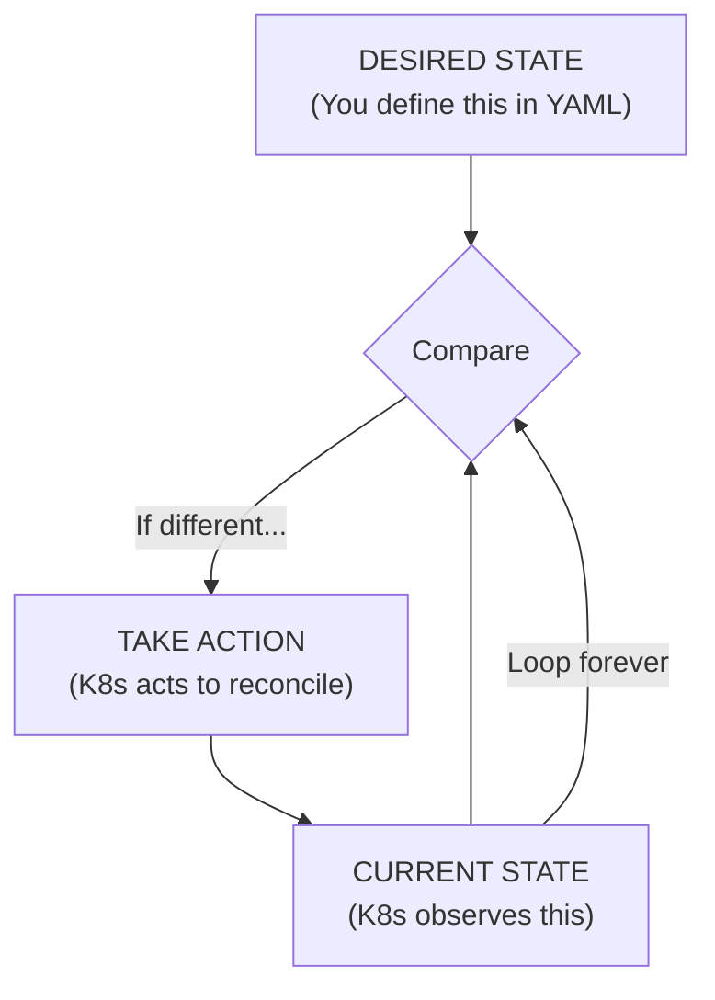
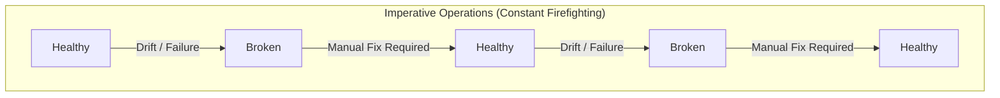
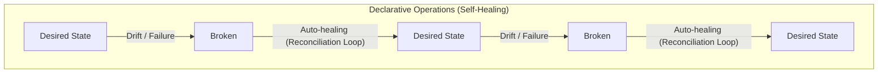

> **Complexity**: `[QUICK]` - Conceptual understanding
>
> **Time to Complete**: 25-30 minutes
>
> **Prerequisites**: Module 1 (Why Kubernetes Won)

---

## What You'll Be Able to Do

After this module, you will be able to:
- **Explain** the difference between declarative and imperative approaches with real K8s examples
- **Predict** what Kubernetes will do when you manually change something it manages (and why)
- **Write** declarative manifests instead of imperative commands for production workloads
- **Diagnose** problems caused by imperative thinking in a declarative system

---

## Why This Module Matters

The on-call engineer at a SaaS company got paged at 2 AM — a critical pod was crash-looping. Half-asleep, she SSH'd into the node and manually restarted the container. Problem solved, back to sleep. Except Kubernetes immediately killed her manually-started container and replaced it with a new one — which also crash-looped. She restarted it again. Kubernetes killed it again. For 45 minutes, she fought the system, not realizing that **Kubernetes wasn't broken — she was thinking imperatively in a declarative world.**

The moment she updated the Deployment YAML to fix the actual configuration issue and ran `kubectl apply`, the system healed itself in 12 seconds. That's the difference between imperative and declarative thinking — and it's the single most important concept in Kubernetes.

If you understand declarative thinking, Kubernetes makes sense. If you don't, you'll fight the system instead of using it.

---

## The Two Approaches

### Imperative: Tell the System What to Do

```bash
# Imperative approach
ssh server1
docker run -d nginx
docker run -d nginx
docker run -d nginx
# Check if they're running
docker ps
# If one dies, start another
# If traffic increases, run more
# If server fails, SSH somewhere else and repeat
```

You are the control loop. You observe, decide, and act.

### Declarative: Tell the System What You Want

```yaml
# Declarative approach
apiVersion: apps/v1
kind: Deployment
metadata:
  name: nginx
spec:
  replicas: 3
  selector:
    matchLabels:
      app: nginx
  template:
    metadata:
      labels:
        app: nginx
    spec:
      containers:
      - name: nginx
        image: nginx
```

```bash
kubectl apply -f nginx-deployment.yaml
# Done. Kubernetes handles the rest.
```

Kubernetes is the control loop. It observes, decides, and acts—continuously.

---

## The Reconciliation Loop

This is Kubernetes' core mechanism:



**This loop runs constantly.** Not once when you run `kubectl apply`—forever.

---

## Real-World Analogy: The Thermostat

### Imperative (No Thermostat)

```
You: "It's cold. Turn on the heater."
[Time passes]
You: "It's hot now. Turn off the heater."
[Time passes]
You: "Cold again. Turn on the heater."
[Repeat forever, or give up and suffer]
```

You are the control loop.

### Declarative (Thermostat)

```
You: "I want it to be 72°F."
Thermostat: [Continuously monitors and adjusts]
```

The thermostat is the control loop. You declared your desired state (72°F), and the system maintains it.

---

## Why Declarative Wins

### 1. Self-Healing

```yaml
# You say: "I want 3 replicas"
spec:
  replicas: 3
```

> **Pause and predict**: What happens if you manually delete a pod managed by a Deployment?

What happens when:
- A container crashes? → K8s starts another
- A node dies? → K8s reschedules pods elsewhere
- Someone manually deletes a pod? → K8s recreates it

You didn't write any of this logic. You just declared what you want.

### 2. Idempotency

```bash
# Run this 100 times
kubectl apply -f deployment.yaml

# Result: Same state every time
# No duplicates, no conflicts, no "already exists" errors
```

Declarative operations are **idempotent**—applying the same configuration repeatedly produces the same result.

### 3. Version Control & GitOps

```bash
# Your infrastructure is code
git log --oneline
a1b2c3d feat: scale web to 5 replicas
d4e5f6g fix: increase memory limit
g7h8i9j feat: add health checks

# Roll back infrastructure with git
git revert a1b2c3d
kubectl apply -f .
```

Declarative config can be versioned, reviewed, and audited.

### 4. Drift Detection

```
Imperative world:
- Someone SSH'd in and made changes
- Documentation doesn't match reality
- "It works on my machine"
- Fear of touching production

Declarative world:
- Git is the source of truth
- K8s continuously enforces that truth
- Changes require PR review
- Confidence in deployments
```

---

## The Imperative Trap

> **Stop and think**: If Kubernetes constantly reconciles state, what does that mean for manual hotfixes done directly on the server?

Kubernetes has imperative commands:

```bash
# These work, but...
kubectl run nginx --image=nginx
kubectl scale deployment nginx --replicas=5
kubectl set image deployment/nginx nginx=nginx:1.26
```

**Why they're dangerous:**

1. **No audit trail**: Who ran that command? When?
2. **No review**: Changes bypass PR/review process
3. **Drift**: System state doesn't match any file
4. **Not reproducible**: "What commands did we run to set this up?"

**When imperative is OK:**
- Learning and experimentation
- Debugging (temporary changes)
- Emergencies (with immediate follow-up to update declarative config)

**Best practice:**
```bash
# Generate YAML, don't apply directly
kubectl create deployment nginx --image=nginx --dry-run=client -o yaml > deployment.yaml

# Review, commit, then apply
kubectl apply -f deployment.yaml
```

---

## Visualization: State Over Time





---

## Did You Know?

- **The reconciliation loop runs every 10 seconds** by default. Controllers constantly check if reality matches desired state.

- **Every Kubernetes resource is declarative.** Pods, Services, ConfigMaps—all are just desired state declarations that controllers reconcile.

- **GitOps was born from this model.** ArgoCD and Flux extend declarative thinking: Git becomes the source of truth, and K8s reconciles against Git.

- **Terraform uses the same model.** The declarative revolution extends beyond K8s. Modern infrastructure tools are almost universally declarative.

---

## Common Mistakes

| Mistake | Why It Hurts | Solution |
|---------|--------------|----------|
| Using imperative commands in production | No audit trail, drift risk | Always use `kubectl apply -f` |
| Editing live resources with `kubectl edit` | Changes not in Git | Update YAML files, apply from Git |
| Not understanding that changes are continuous | Surprise when K8s "undoes" manual changes | Embrace the model—change the declaration |
| Fighting the reconciliation loop | Frustration, workarounds | Work with the system, not against it |
| Mixing declarative tools (e.g., Helm + raw `kubectl apply`) | Tools overwrite each other's configurations, causing drift and deployment failures | Choose one deployment method per resource and stick to it |
| Forgetting to prune deleted resources | Old resources removed from YAML linger in the cluster, consuming capacity | Use GitOps tools or `kubectl apply --prune` (with caution) |
| Storing secrets in declarative YAML without encryption | Exposes highly sensitive data in plain text within version control | Use tools like Sealed Secrets, SOPS, or External Secrets Operator |
| Assuming `kubectl apply` is perfectly atomic | Partial failures can leave multi-resource applications in a broken, half-deployed state | Rely on health checks, readiness probes, and controllers to reach a steady state safely |

---

## The Mindset Shift

### Old Thinking (Imperative)
```
"I need to deploy my app"
→ SSH to server
→ Pull code
→ Build
→ Start process
→ Configure nginx
→ Update firewall
→ Test
→ Document what I did
```

### New Thinking (Declarative)
```
"I need to deploy my app"
→ Define desired state in YAML
→ Commit to Git
→ kubectl apply (or let GitOps do it)
→ K8s handles the rest
→ Git IS the documentation
```

---

## Quiz

1. **You deploy a web application with 3 replicas. Suddenly, the underlying node hosting two of those pods loses power. Without any human intervention, the application is back to 3 replicas within minutes. What exact Kubernetes mechanism is responsible for this, and how does it work?**
   <details>
   <summary>Answer</summary>
   The reconciliation loop is the core mechanism responsible for this self-healing behavior. Kubernetes continuously compares the desired state (your declaration of 3 replicas) with the current state (only 1 replica running after the node failure). When it detects this mismatch, the controller immediately takes action to schedule 2 new pods on healthy nodes to reconcile the difference. This loop runs continuously in the background, ensuring your infrastructure constantly strives to match your declared intent.
   </details>

2. **During a high-traffic event, an engineer quickly runs `kubectl scale deployment web --replicas=10` to handle the load. Two days later, a junior developer merges a PR updating the application image, and the deployment suddenly drops back to 3 replicas, causing an outage. What caused this, and why did the imperative command create a trap?**
   <details>
   <summary>Answer</summary>
   The imperative `kubectl scale` command changed the live cluster state without updating the source of truth in Git, creating what is known as configuration drift. When the junior developer applied the updated YAML from Git, Kubernetes saw the declared state was 3 replicas and dutifully "corrected" the cluster back to 3, unaware of the manual scaling. Imperative commands are dangerous because they leave no audit trail in version control, bypass peer review, and create a false reality that will inevitably be overwritten the next time declarative configurations are applied. This incident highlights exactly why manual overrides should only be used in true emergencies and must immediately be followed by a commit.
   </details>

3. **Your CI/CD pipeline is configured to run `kubectl apply -f deployment.yaml` every time a commit is merged to the main branch. A developer accidentally triggers the pipeline 5 times in a row without changing the deployment file. What happens to the cluster, and what property of declarative systems makes this safe?**
   <details>
   <summary>Answer</summary>
   The cluster state remains exactly the same, with no duplicate pods or resources created, thanks to the property of idempotency. An operation is idempotent if applying it multiple times yields the exact same result as applying it once. In a declarative system, `kubectl apply` simply tells Kubernetes what the end state should be; if the cluster already matches that state, Kubernetes takes no action. This makes automation inherently safe and predictable, allowing pipelines to run repeatedly without risking destructive side effects or resource exhaustion.
   </details>

4. **A rogue script accidentally runs `kubectl delete pod` on a database pod managed by a StatefulSet. Before the on-call engineer can even open their laptop to investigate the alert, the pod is already restarting. Why didn't the system wait for human intervention?**
   <details>
   <summary>Answer</summary>
   Kubernetes immediately created a new pod because it operates on a continuous declarative control loop rather than waiting for imperative commands. The controller monitoring the StatefulSet saw that the current state (0 pods) deviated from the desired state (1 pod) specified in the manifest. It didn't care why the pod disappeared or who deleted it; its only job is to reconcile reality with the declared intent. This demonstrates how declarative self-healing fundamentally replaces human firefighting with automated remediation.
   </details>

5. **Your team uses ArgoCD (a GitOps tool) to manage a production cluster. An administrator SSHs into a node and manually edits an Nginx configuration file inside a running pod to fix a bug. Ten minutes later, the bug reappears. Why did this happen, and how does GitOps handle this situation?**
   <details>
   <summary>Answer</summary>
   The bug reappeared because GitOps enforces the declarative state stored in your version control repository as the absolute source of truth. The manual change inside the pod created configuration drift between the live state and the Git repository. The GitOps controller (or Kubernetes' own pod lifecycle management) eventually reconciled the state by either restarting the pod or overriding the manual changes to match the declared configuration. To fix the bug permanently, the engineer must update the configuration in Git and let the system apply it declaratively.
   </details>

6. **You apply a declarative manifest that creates a Secret, but you accidentally misspell the Secret's name in the YAML file. You correct the typo in the file and run `kubectl apply` again. Later, you notice there are two Secrets in the cluster. Doesn't idempotency prevent duplicate resources?**
   <details>
   <summary>Answer</summary>
   Idempotency ensures that applying the exact same configuration yields the same result, but it maps resources based on their name and kind. When you changed the name of the Secret in the YAML, Kubernetes treated it as a completely new, distinct resource and created it. It did not delete the old Secret because `kubectl apply` only adds or updates resources; it does not automatically prune resources that were removed from the file unless specifically instructed (e.g., using `--prune`). To remove the misspelled Secret, you must imperatively delete it or use an automated GitOps tool that handles resource pruning.
   </details>

7. **Team A applies a manifest labeling a shared namespace with `environment: production`. Team B applies a different manifest labeling the exact same namespace with `environment: staging`. They both use automated pipelines running `kubectl apply`. What happens to the namespace, and what does this reveal about declarative management?**
   <details>
   <summary>Answer</summary>
   The namespace's label will constantly flip between `production` and `staging` depending on which team's pipeline ran most recently. Kubernetes will dutifully execute each declarative command, as both teams are asserting their desired state onto the same resource. This reveals that while declarative management is powerful, it lacks built-in conflict resolution for uncoordinated changes to shared resources. It highlights the necessity of having a single source of truth (like a unified Git repository) where all teams collaborate, ensuring conflicts are caught during the pull request review rather than fighting in the live cluster.
   </details>

---

## Reflection Exercise

This module is conceptual—reflect on these questions:

**1. The thermostat analogy:**
- What other systems in your life work declaratively? (Cruise control? Auto-brightness?)
- What makes them easier to use than manual alternatives?

**2. Your current workflow:**
- How do you deploy software today?
- Is it more imperative or declarative?
- What would change if you switched to the other model?

**3. Self-healing implications:**
- If Kubernetes "undoes" manual changes, is that a feature or a bug?
- How does this change your troubleshooting approach?

**4. Git and infrastructure:**
- Why is storing infrastructure as YAML in Git powerful?
- What questions can you answer with `git log` that you couldn't answer before?

**5. Mental model shift:**
- An operator asks "what commands do I run?" A declarative thinker asks "what state do I want?"
- Which question leads to more maintainable systems? Why?

This shift in thinking—from "how" to "what"—is the most important concept in this entire curriculum.

---

## Summary

The declarative model is Kubernetes' foundation:

- **Desired state**: You define what you want (YAML)
- **Reconciliation**: K8s continuously makes reality match desire
- **Self-healing**: Failures are automatically corrected
- **Idempotent**: Apply the same config repeatedly, get same result
- **Version controlled**: Your infrastructure is code in Git

This isn't just a technical choice—it's a philosophy that enables reliable, scalable, auditable infrastructure.

---

## Next Module

[Module 1.3: What We Don't Cover (and Why)](../module-1.3-what-we-dont-cover/) - Understanding KubeDojo's scope and where to go for topics we skip.