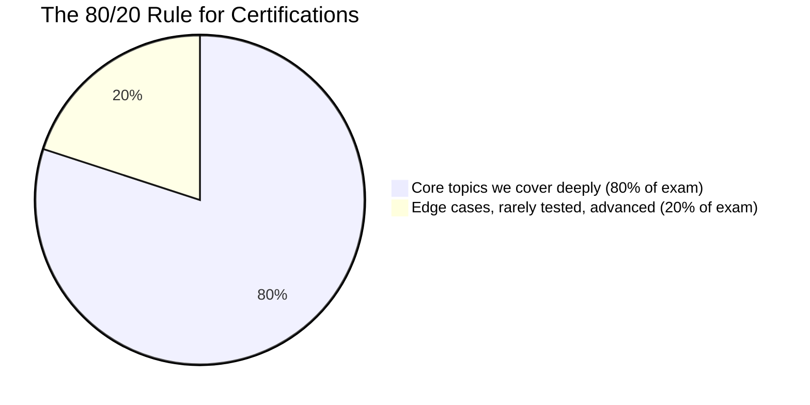
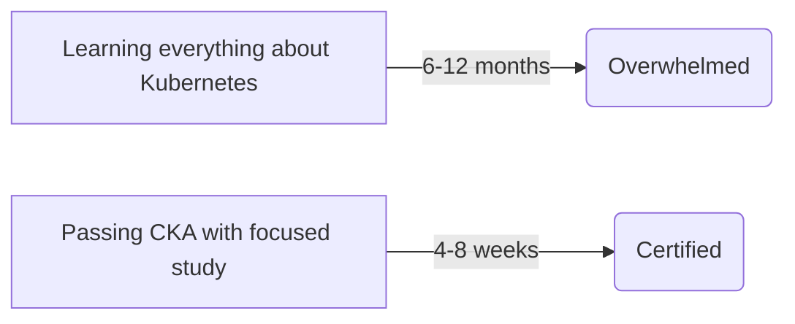
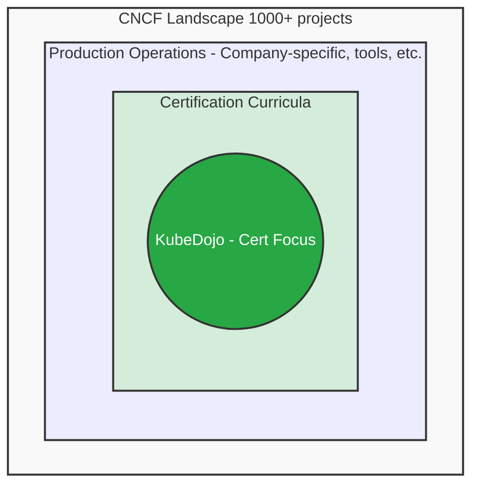

```mermaid
gantt
    title Depth Levels by Topic (Exam Needs vs. Expert Level)
    dateFormat X
    axisFormat %s

    section Pods
    Exam Needs          :a1, 0, 4
    Expert Level        :a2, 0, 10

    section Deployments
    Exam Needs          :b1, 0, 4
    Expert Level        :b2, 0, 8

    section Services
    Exam Needs          :c1, 0, 4
    Expert Level        :c2, 0, 9

    section NetworkPolicy
    Exam Needs          :d1, 0, 3
    Expert Level        :d2, 0, 8

    section RBAC
    Exam Needs          :e1, 0, 3
    Expert Level        :e2, 0, 10

    section Helm
    Exam Needs          :f1, 0, 4
    Expert Level        :f2, 0, 9

    section etcd backup
    Exam Needs          :g1, 0, 1
    Expert Level        :g2, 0, 10
```

> **Complexity**: `[QUICK]` - Setting expectations
>
> **Time to Complete**: 20-25 minutes
>
> **Prerequisites**: Module 1, Module 2

---

## What You'll Be Able to Do

After this module, you will be able to:
- **Identify** which K8s topics are exam-relevant vs interesting-but-off-scope
- **Prioritize** your study time by knowing the 80/20 of what the exams actually test
- **Explain** why we skip certain topics (e.g., custom CNI development, etcd internals) and where to learn them if curious
- **Plan** an efficient learning path that avoids the 100+ hours trap

---

## Why This Module Matters

Here's a secret that paid certification courses won't tell you: **you can waste 100+ hours studying topics that will never appear on the exam.** We've seen it happen — engineers spending weeks deep-diving into etcd internals or building custom CNI plugins, only to discover the CKA doesn't test any of it.

KubeDojo is surgical about what we teach. Every module exists because it either appears on the exam or is essential for understanding something that does. This module tells you exactly what we skip and why — so you don't waste a single hour on the wrong thing.

---

## Our Philosophy: Exam-Focused, Not Exhaustive

KubeDojo exists to help you pass certifications efficiently. We apply the 80/20 rule:

We don't try to cover everything. We cover what matters for passing.

---

## What We Deliberately Skip

### 1. Cloud Provider Specifics

| Topic | Why We Skip | Where to Learn |
|-------|-------------|----------------|
| AWS EKS details | Exam uses generic K8s, not cloud-specific | AWS documentation, eksctl docs |
| GKE features | Same reason | Google Cloud documentation |
| AKS specifics | Same reason | Azure documentation |
| Cloud IAM integration | Provider-specific | Provider documentation |

**Our approach**: We teach Kubernetes. Cloud providers add their own layers. Learn the platform, then learn your provider's implementation.

### 2. Production Operations at Scale

| Topic | Why We Skip | Where to Learn |
|-------|-------------|----------------|
| Multi-cluster federation | Beyond certification scope | K8s docs, KubeFed project |
| Cluster autoscaling | Cloud-specific implementations | Provider docs |
| Disaster recovery | Organization-specific | SRE books, your company runbooks |
| Cost optimization | Cloud-specific | FinOps resources, cloud calculators |

**Our approach**: Certifications test fundamentals. Production operations require experience plus company-specific context.

### 3. Deep Networking

| Topic | Why We Skip | Where to Learn |
|-------|-------------|----------------|
| BGP configuration | Beyond certification scope | Network engineering resources |
| Service mesh internals | Istio/Linkerd are separate domains | Project documentation |
| eBPF/Cilium internals | Advanced networking topic | Cilium documentation |
| Custom CNI development | Developer topic, not admin | CNI specification |

**Our approach**: We cover networking concepts the exam tests. Deep networking is a separate specialization.

### 4. Specific Tools/Projects

| Tool | Why We Skip | Where to Learn |
|------|-------------|----------------|
| ArgoCD | GitOps tool, not on exam | ArgoCD documentation |
| Istio | Service mesh, separate certification track | Istio documentation |
| Terraform | IaC tool, not K8s-specific | HashiCorp Learn |
| Prometheus/Grafana | Observability tools, briefly touched | Project documentation |

**Our approach**: We mention these tools for context but don't teach them deeply. Each deserves its own curriculum.

> **Stop and think**: If your company uses Istio heavily, should you study it for the CKA? How do you balance passing the exam with being useful at work on day one?

---

## Why We Make These Choices

### Reason 1: Time Efficiency

The difference is focus. Certifications are gates, not destinations. Pass efficiently, then go deep on what your job requires.

### Reason 2: Exam Relevance

The CKA, CKAD, and CKS have defined curricula. We align to those curricula. Adding content beyond the exam:
- Increases study time
- Adds confusion
- Doesn't improve pass rates

### Reason 3: Avoiding Outdated Content

Kubernetes moves fast. The more topics we cover, the more we must maintain. By focusing on exam-relevant content:
- Less content to keep updated
- Higher quality on what we cover
- More sustainable long-term

---

## The "Just Enough" Principle

For topics we do cover, we aim for exam sufficiency, not exhaustive mastery:

> **Pause and predict**: Look at the depth chart above. Why do you think 'etcd backup' requires very little depth for the exam, but maximum depth for an expert? What happens in production if you mess it up?

---

## Where We Suggest Going Deeper

After passing certifications, you'll want to go deeper. Here's our recommended path:

### For Platform Engineers
- Cluster API
- GitOps (ArgoCD/Flux)
- Multi-tenancy patterns
- Platform engineering resources

### For Developers
- Kubernetes patterns (sidecar, ambassador, adapter)
- Operators and CRD development
- Kubernetes API programming
- Kubectl plugins

### For Security Focus
- OPA/Gatekeeper deep dive
- Falco and runtime security
- Supply chain security (Sigstore)
- Network policy advanced patterns

### For SRE/Operations
- SLO-based alerting
- Chaos engineering
- Capacity planning
- Incident response

---

## Visualization: KubeDojo Scope

---

## Did You Know?

- **The CNCF landscape has 1000+ projects.** No human can master them all. Specialization is necessary.

- **Most production K8s users know ~20% of Kubernetes deeply.** They know what their job requires. Certifications prove breadth, work builds depth.

- **Certification curricula change.** Topics get added and removed. We track changes and update accordingly.

- **"Expert" is context-dependent.** A networking expert knows different things than a security expert. There's no universal "Kubernetes expert" checklist.

---

## Common Questions

### "But I might need [topic] at work!"

Possibly. Our suggestion:
1. Pass the certification first (validates fundamentals)
2. Learn job-specific topics on the job
3. Use project documentation for tools (ArgoCD, Istio, etc.)

### "Why not include everything to be complete?"

Completeness is impossible and counterproductive:
- K8s changes constantly
- More content = more maintenance = stale content
- Focused content = higher quality

### "What if the exam asks about something you didn't cover?"

Our curriculum matches official exam objectives. If something appears on the exam, it's in our curriculum. Edge cases that rarely appear aren't worth the study time.

---

## Common Mistakes When Studying for K8s Certifications

| Mistake | Why It Happens | The Better Approach |
|---------|----------------|---------------------|
| **Rabbitholing on CNI plugins** | Networking is fascinating, and Calico/Cilium docs are great. | Learn just enough to install a CNI (usually one `kubectl apply` command) and understand basic NetworkPolicies. |
| **Memorizing YAML syntax** | Fear of a blank screen during the exam. | Master `kubectl run` and `kubectl create` with the `--dry-run=client -o yaml` flags to generate templates. |
| **Studying cloud-specific IAM** | Your company uses AWS IRSA or EKS Pod Identity, so you think it's core K8s. | Focus on pure Kubernetes RBAC (Roles, RoleBindings, ServiceAccounts). The exam is vanilla K8s. |
| **Building a Raspberry Pi cluster** | You want "hands-on" experience building from scratch. | Use kind, minikube, or a managed cloud VM. The exam tests *using* K8s, not overcoming ARM architecture quirks. |
| **Over-indexing on Helm/Helmfiles** | It's how you deploy apps at work every day. | *Note on Exam Changes:* As of the current exam curricula, Helm is explicitly tested in the CKAD, but it does *not* appear in the official CKA or CKS curriculum. Focus on standard Helm commands for the CKAD, and skip it when studying for the CKA or CKS. |
| **Studying GitOps (ArgoCD/Flux)** | It's the modern standard for K8s deployments. | ArgoCD is not on the exam. Understand the *concept* of declarative state, but don't learn the tool for the test. |
| **Trying to master etcd operations** | etcd is the brain of the cluster, so it seems critical. | You only need to know how to snapshot and restore etcd using the official `etcdctl` tool. Leave cluster defragmentation to the experts. |

---

## Hands-On Exercise: Audit Your Study Materials

Instead of a cluster exercise, this is a planning exercise. Open your current study bookmarks, YouTube playlists, or company wikis.

**Task**: Categorize your existing study materials into "Exam Scope" and "Post-Exam Specialization".

**Success Criteria:**
- [ ] You have identified at least two topics you were planning to study that are actually outside the certification scope (e.g., Istio, EKS specifics).
- [ ] You have moved those topics to a "Post-Exam" list.
- [ ] You have verified that your primary study materials focus on vanilla Kubernetes.
- [ ] You have created a hard boundary: "I will not study X until after I pass."

---

## Quiz

1. **Scenario**: You are a junior DevOps engineer preparing for the CKA. Your manager suggests you use the next two weeks to deeply learn Terraform and AWS EKS because that's what the team uses in production. How should you respond regarding your CKA study plan?
   

   
Answer

   Explain that while Terraform and EKS are critical for the job, they are strictly outside the scope of the CKA exam. The exam tests generic, vanilla Kubernetes components and is completely cloud-agnostic, meaning cloud-provider tools will not be present. Spending two weeks on Terraform will improve your work performance but will actively delay your certification progress. You should politely propose splitting your time, or focusing entirely on the certification first before mastering the company's specific toolchain. By separating your goals, you can achieve certification faster and then bring focused expertise to the team.
   

2. **Scenario**: While studying NetworkPolicies for the CKAD, you find an incredible 4-hour tutorial on writing custom eBPF programs using Cilium. You find networking fascinating. Should you take this tutorial now?
   

   
Answer

   No, you should bookmark it for after the exam. While Cilium and eBPF are powerful and increasingly standard in modern clusters, the CKAD exam only requires you to understand standard Kubernetes NetworkPolicy objects. Diving into eBPF is a classic example of the "100+ hours trap" mentioned in this module. The certification tests your ability to declare standard access rules, not your ability to write custom kernel-level network filters. Stick to the 80/20 rule and master the basics first so you can pass the exam efficiently.
   

3. **Scenario**: You are building a study plan for the CKA. You allocate 5 hours to learning how to deploy and configure ArgoCD for GitOps, and 5 hours to practicing standard Kubernetes Deployments and Services. Critique this study plan.
   

   
Answer

   This study plan is heavily misaligned with the exam objectives. ArgoCD, while an industry standard for GitOps, is a third-party tool and does not appear on the CKA exam at all. The CKA tests native Kubernetes primitives and operations, meaning your ability to use `kubectl` natively is what matters. Allocating equal time to a non-exam topic and core exam topics violates the exam-focused philosophy. You should reallocate the ArgoCD time entirely toward mastering core Kubernetes primitives, troubleshooting, and cluster architecture to ensure you pass.
   

4. **Scenario**: A colleague failed the CKA exam and complains, "The exam is so unrealistic! At work, I just use the AWS Console to add nodes, but the exam wanted me to troubleshoot kubelet systemd services." Why did your colleague fail, and what does this say about the exam's scope?
   

   
Answer

   Your colleague failed because they conflated cloud-provider abstractions with core Kubernetes administration. The CKA specifically tests your ability to administer vanilla Kubernetes, which means interacting directly with components like the `kubelet` and `systemd` on raw Linux nodes. This highlights exactly why we explicitly skip cloud provider specifics in KubeDojo. Relying on cloud abstractions masks the fundamental cluster operations you are actually tested on during the certification. To pass, you must understand the underlying system services that actually run the cluster, rather than relying on a managed service UI.
   

5. **Scenario**: You are reading the Kubernetes documentation on scaling, and you come across Cluster Autoscaler and Horizontal Pod Autoscaler (HPA). Based on KubeDojo's philosophy of "What We Deliberately Skip," which of these should you focus on for the exam, and why?
   

   
Answer

   You should focus entirely on the Horizontal Pod Autoscaler (HPA). HPA is a core Kubernetes API object that scales pods based on metrics, and it is explicitly part of the exam curriculum. Cluster Autoscaler, on the other hand, interacts with the underlying cloud provider's infrastructure to add or remove actual nodes. Because the exam is rigorously cloud-agnostic, cloud-specific infrastructure scaling mechanisms are entirely out of scope. Mastering HPA will directly contribute to your exam success, whereas Cluster Autoscaler knowledge, while useful in practice, will not be tested.
   

6. **Scenario**: You want to practice for the exam, so you decide to spend the weekend setting up a highly available, multi-master Kubernetes cluster on bare metal using kubeadm, complete with an external etcd cluster and HAProxy load balancers. Is this a good use of your study time?
   

   
Answer

   This is an excellent exercise for a senior platform engineer, but a terrible use of time for passing the CKA. The exam does not require you to build complex, highly available architectures from scratch; it requires you to understand how to bootstrap a basic cluster using kubeadm. Building an HA bare-metal cluster introduces immense complexity that is completely outside the exam's "Just Enough" depth boundary. The time spent troubleshooting external load balancers or hardware quirks detracts from learning the core K8s API. You should use a simple, pre-configured environment or a tool like `kind` or `minikube` for your studies instead.
   

7. **Scenario**: Looking at the "Depth Levels by Topic" chart, you see that "etcd backup" is rated at a very low depth for the exam, but maximum depth for an expert. You are taking the exam next week. Should you read the official etcd disaster recovery whitepaper?
   

   
Answer

   Absolutely not, as this would be a massive waste of study time. The exam only requires you to know exactly two commands for etcd: how to take a snapshot, and how to restore it using the official `etcdctl` tool. Reading a disaster recovery whitepaper goes far beyond the "Just Enough" principle into advanced operations. The exam tests your ability to execute the mechanical backup process, not your theoretical understanding of etcd consensus or defragmentation. You must ruthlessly prioritize the mechanical execution of the snapshot process over a deep theoretical understanding.
   

---

## Reflection Exercise

This module sets expectations—reflect on your learning journey:

**1. Your learning goals:**
- Why are you learning Kubernetes?
- Is certification the end goal, or a stepping stone?
- What specific job role or project motivates you?

**2. The 80/20 principle:**
- In your field, what 20% of knowledge handles 80% of situations?
- Does going deeper always help, or can it distract?

**3. Scope discipline:**
- Have you ever wasted time learning something that turned out irrelevant?
- How do you decide what's worth learning deeply vs. just knowing exists?

**4. After certification:**
- Which specialization interests you? (Platform engineering, security, SRE, development?)
- What would your ideal Kubernetes job look like?

**5. Time budgeting:**
- How much time can you dedicate to this?
- Given KubeDojo's focus, do you need additional resources for your specific goals?

Understanding scope helps you learn efficiently and plan beyond certification.

---

## Summary

KubeDojo makes deliberate choices about scope:

- **We cover**: Certification curricula thoroughly
- **We skip**: Cloud specifics, production operations at scale, deep networking, specific tools
- **Our philosophy**: Exam-focused efficiency over exhaustive coverage
- **After certification**: Specialize based on your role and job requirements

Understanding these boundaries helps you set expectations and plan your broader learning journey.

---

## Next Module

[Module 1.4: Dead Ends - Technologies We Skip](../module-1.4-dead-ends/) - Why certain technologies are deprecated and shouldn't be learned.