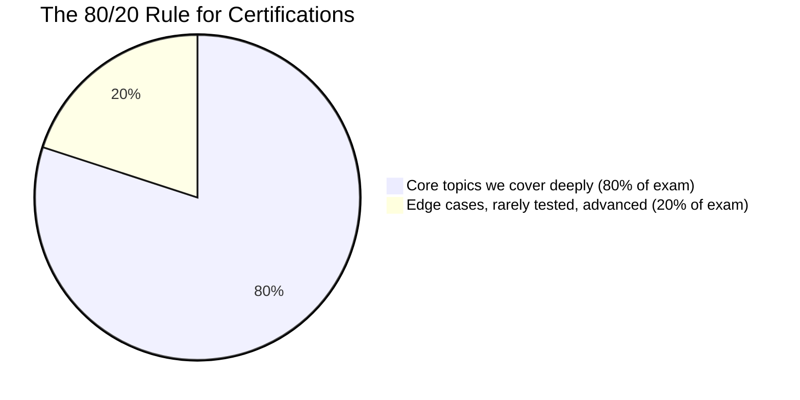
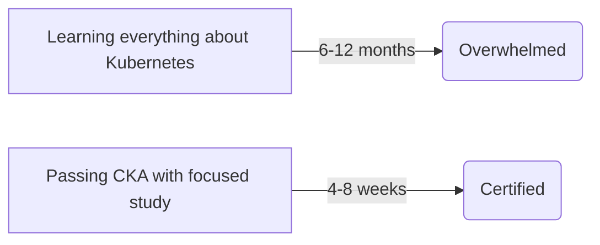
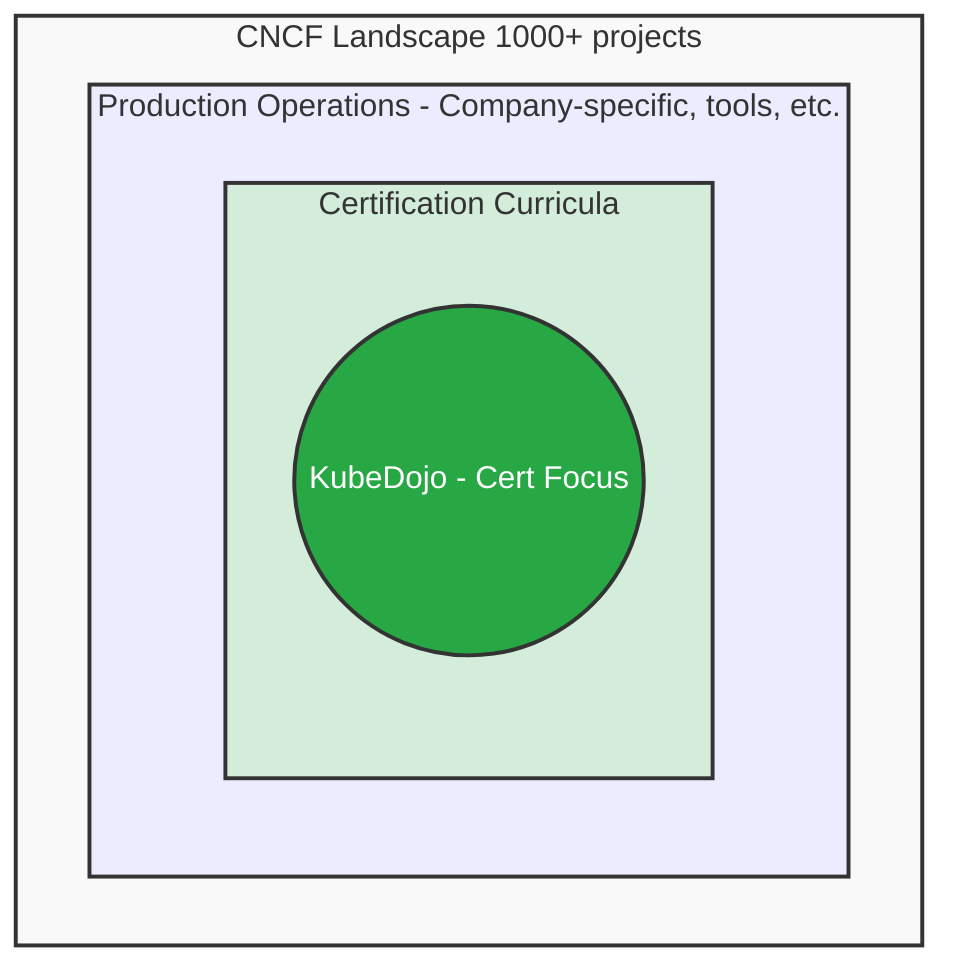

> **Complexity**: `[QUICK]` - Setting expectations
>
> **Time to Complete**: 35-45 minutes
>
> **Prerequisites**: Module 1, Module 2

---

# Module 1.3: What We Don't Cover (and Why)

## Learning Outcomes

After this module, you will be able to:

- **Evaluate** certification study materials by separating exam scope from post-exam specialization.
- **Compare** vanilla Kubernetes objectives with cloud-provider, tool-specific, and deep-networking distractions.
- **Design** a time-boxed learning plan that protects core Kubernetes practice from scope creep.
- **Diagnose** scope creep when team pressure, curiosity, or production tooling pulls you away from the exam.
- **Implement** a personal boundary that moves advanced topics into a post-exam roadmap instead of deleting them.

---

## Why This Module Matters

In late 2023, a platform team preparing three engineers for Kubernetes certification made a very ordinary mistake. Their production clusters ran on a managed cloud platform with a service mesh, GitOps delivery, cloud identity integration, and a monitoring stack that had grown over several years, so their study plan mirrored the environment they saw every day. Two engineers spent evenings learning Terraform modules, provider-specific node group behavior, service mesh traffic policies, and custom dashboards, then failed their first practice exams because they were slow at native tasks such as inspecting pods, fixing RBAC, reading events, and using `kubectl` under time pressure. The cost was not only exam fees; it was several weeks of delayed project work, lost confidence, and a calendar full of rework that could have been avoided with a tighter definition of scope.

That story matters because Kubernetes is too large to study by wandering. A learner can spend a productive-looking weekend reading about etcd quorum behavior, eBPF datapaths, CNI plugin design, ArgoCD sync waves, cloud IAM federation, and multi-cluster failover, yet gain almost nothing that improves CKA, CKAD, or CKS performance. Certification exams are not a judgment on whether those topics are useful in production. They are a timed test of specific Kubernetes capabilities, and KubeDojo treats that boundary as a design constraint rather than an inconvenience.

This module teaches the discipline behind that boundary. We are not telling you to ignore production realities forever, and we are not pretending that exam objectives cover every skill a strong engineer needs. We are showing you how to protect certification study from attractive distractions, how to decide when a topic belongs in the main path, and how to park advanced material without feeling like you are abandoning it. The goal is not a smaller understanding of Kubernetes; the goal is the right sequence, with exam fundamentals first and specialization after the credential no longer competes for your attention.

---

## Our Philosophy: Exam-Focused, Not Exhaustive

KubeDojo exists to help you pass Kubernetes certifications efficiently, then use that foundation as a launchpad for deeper work. The curriculum is therefore selective on purpose. We apply the 80/20 rule because certification performance usually comes from repeated practice with core primitives, troubleshooting workflows, and command fluency rather than from broad exposure to every project in the cloud-native ecosystem. If a topic appears directly in the exam objectives, we teach it. If it does not appear but explains an objective well enough to improve performance, we teach the minimum useful version. If it is fascinating but unrelated to the tested task, we mark it as post-exam specialization.



The chart is intentionally simple because the decision is intentionally practical. A certification candidate does not need an encyclopedic model of the CNCF ecosystem before learning how to create a Deployment, debug a failing Service, repair a kubelet, or apply a NetworkPolicy. Those skills are closer to the center of the exam because they are native Kubernetes tasks that can be tested in a constrained terminal environment. A custom controller, a managed cloud identity feature, or a vendor dashboard may be valuable at work, but it is difficult to test fairly across all candidates, and that usually pushes it outside the certification path.

Think of the exam like a driving test rather than a mechanical engineering degree. The examiner cares whether you can operate the vehicle safely, interpret road conditions, recover from common problems, and follow the rules under pressure. They do not ask you to design a transmission, tune a racing suspension, or compare every commercial GPS system. Those deeper topics can make you a better specialist later, but studying them before you can pass the road test is a sequencing error.

This is also why our examples prefer vanilla Kubernetes and Kubernetes 1.35+ semantics unless a certification objective says otherwise. The exam environment rewards knowledge that travels across clusters: API objects, control plane concepts, RBAC, scheduling, workload management, observability basics, security primitives, and troubleshooting with standard tools. When we use command examples, we introduce the shorthand once with `alias k=kubectl`, then use `k` because speed matters in timed environments and because the alias is common in Kubernetes study labs.

```bash
alias k=kubectl
k version --client
k get pods --all-namespaces
```

Pause and predict: if you spend one evening practicing `k describe`, `k logs`, `k auth can-i`, and `k get events`, then spend another evening reading a cloud provider's managed node group documentation, which evening is more likely to improve your exam score next week, and why? The answer is not that cloud infrastructure is unimportant. The answer is that the exam can directly measure your native troubleshooting workflow, while provider-specific infrastructure knowledge belongs to a different learning objective.

The tradeoff is real. A focused curriculum can feel incomplete when your workplace uses tools we deliberately do not teach in depth, and it can feel conservative when a new project becomes popular faster than exam objectives change. We accept that discomfort because certification learning has a different job than production onboarding. KubeDojo teaches the portable layer first, then points you toward credible sources for role-specific depth after the exam pressure is gone.

---

## What We Deliberately Skip

The easiest way to misuse Kubernetes study time is to treat every adjacent topic as equally urgent. In practice, the exam rewards a narrower skill set: native APIs, basic cluster operations, workload behavior, security controls, troubleshooting, and enough networking to reason about Services, DNS, and NetworkPolicy. The topics below are not "bad" topics. They are deliberately skipped because they either depend on a vendor implementation, require a specialist background, or represent a tool ecosystem that deserves its own course.

### Cloud Provider Specifics

| Topic | Why We Skip | Where to Learn |
|-------|-------------|----------------|
| AWS EKS details | Exam uses generic K8s, not cloud-specific | AWS documentation, eksctl docs |
| GKE features | Same reason | Google Cloud documentation |
| AKS specifics | Same reason | Azure documentation |
| Cloud IAM integration | Provider-specific | Provider documentation |

Cloud providers add valuable layers around Kubernetes, but those layers are not the same as Kubernetes itself. EKS, GKE, and AKS each make different choices about node provisioning, identity, load balancers, storage classes, upgrade channels, and control plane ownership. If you study those choices before you can reason about a Pod, Service, Deployment, Secret, RoleBinding, and node condition in a plain cluster, you are learning the wrapper before the object it wraps. That can make your production environment feel familiar while leaving you slow in an exam shell where the wrapper is absent.

Our approach is to teach Kubernetes first. When you understand the platform, provider documentation becomes easier because you can separate the native object from the provider integration. For example, a cloud load balancer annotation is meaningful only after you understand what a Service of type `LoadBalancer` is trying to accomplish. A cloud identity feature is easier to reason about after you understand ServiceAccounts and RBAC. KubeDojo covers the native foundation and leaves provider-specific workflows to the provider's own documentation.

### Production Operations at Scale

| Topic | Why We Skip | Where to Learn |
|-------|-------------|----------------|
| Multi-cluster federation | Beyond certification scope | K8s docs, KubeFed project |
| Cluster autoscaling | Cloud-specific implementations | Provider docs |
| Disaster recovery | Organization-specific | SRE books, your company runbooks |
| Cost optimization | Cloud-specific | FinOps resources, cloud calculators |

Production operations at scale are where Kubernetes becomes deeply contextual. A disaster recovery plan depends on data stores, recovery objectives, organizational risk tolerance, cloud regions, backup tooling, incident roles, and the team's appetite for operational complexity. Cost optimization depends on billing models, reserved capacity, autoscaling policies, workload seasonality, and business priorities. Multi-cluster design depends on latency, tenancy, compliance, traffic management, and who is allowed to operate the platform. Those topics are important, but they cannot be reduced to a portable certification checklist without losing the context that makes them useful.

The exam does test operational thinking, but at a smaller and more mechanical scale. You may need to drain a node, inspect a failed control plane component, restore an etcd snapshot, reason about resource requests, or identify why a workload is not scheduled. Those tasks are operational, but they are bounded. KubeDojo therefore teaches the tested mechanics and the reasoning behind them, while leaving full production design to SRE practice, company runbooks, and platform-specific training.

### Deep Networking

| Topic | Why We Skip | Where to Learn |
|-------|-------------|----------------|
| BGP configuration | Beyond certification scope | Network engineering resources |
| Service mesh internals | Istio/Linkerd are separate domains | Project documentation |
| eBPF/Cilium internals | Advanced networking topic | Cilium documentation |
| Custom CNI development | Developer topic, not admin | CNI specification |

Networking is the most tempting rabbit hole because it explains so many real outages. A learner starts with a Service that cannot reach a Pod, then finds kube-proxy, iptables, IPVS, DNS, CoreDNS, CNI plugins, overlay networks, BGP, eBPF, and service meshes. The chain is technically coherent, but the exam does not ask you to become a network plugin author. It asks you to reason about Kubernetes networking from the perspective of an administrator or application operator: labels, selectors, ports, endpoints, DNS names, NetworkPolicies, and basic troubleshooting.

The distinction matters during practice. If a NetworkPolicy blocks traffic, you should be able to inspect pod labels, namespace selectors, ingress and egress rules, and the intended source and destination. You do not need to write a CNI plugin or explain every datapath optimization used by a particular implementation. A specialist who works on Cilium or Calico needs that depth, but a certification candidate needs the portable object model first.

### Specific Tools and Projects

| Tool | Why We Skip | Where to Learn |
|------|-------------|----------------|
| ArgoCD | GitOps tool, not on exam | ArgoCD documentation |
| Istio | Service mesh, separate certification track | Istio documentation |
| Terraform | IaC tool, not K8s-specific | HashiCorp Learn |
| Prometheus/Grafana | Observability tools, briefly touched | Project documentation |

The cloud-native ecosystem is full of excellent tools that sit beside Kubernetes rather than inside the certification objective. ArgoCD is a strong GitOps controller, Terraform is a widely used infrastructure tool, Istio is a service mesh with its own mental model, and Prometheus with Grafana is a common observability pairing. We mention these projects when they clarify the landscape, but we do not turn a certification module into four additional curricula. Each tool has its own commands, failure modes, and design tradeoffs, and mixing those into the core path usually makes learners slower at the native tasks the exam actually measures.

There is one subtle exception: Helm is currently explicit in CKAD scope, while it is not the center of CKA or CKS study. That does not mean Helm is unimportant; it means your depth should match the exam you are taking. For CKAD, standard chart operations are worth practicing because the objective says so. For CKA or CKS, Helm may remain useful context, but it should not crowd out native troubleshooting, cluster maintenance, workload configuration, or security tasks.

Stop and think: if your company uses Istio heavily, should you study it for the CKA? The disciplined answer is that you should learn enough at work to avoid being dangerous in production, but you should not spend certification study blocks learning service mesh internals unless your immediate goal has changed. Balancing usefulness at work with exam readiness means naming the goal of each study session before you start.

---

## Why We Make These Choices

The first reason is time efficiency. Kubernetes certification study is usually squeezed into evenings, weekends, or a short training window between project commitments. A broad plan can look ambitious on paper and still fail because it does not create enough repetitions on the tasks that actually appear in the exam environment. A focused plan may feel less impressive, but it builds speed where speed matters: reading manifests, generating YAML, checking events, fixing misconfigurations, and choosing the right native object under time pressure.



The second reason is exam relevance. The CKA, CKAD, and CKS each publish defined curricula, and those curricula create a contract between the learner and the exam. KubeDojo aligns to that contract rather than to whatever happens to be popular in production this quarter. Adding extra material does not automatically make a course better; it increases cognitive load, creates false urgency, and can make a learner confuse adjacent expertise with tested competence. When an extra topic helps explain a tested task, we use it sparingly. When it does not, we point elsewhere.

The third reason is maintainability. Kubernetes moves quickly enough that even a focused curriculum needs regular review for version drift, deprecated behavior, changed defaults, and exam objective updates. The more optional topics a course includes, the more likely some of them become stale, misleading, or shallow. A smaller scope lets us maintain higher quality on the topics we do cover, especially for Kubernetes 1.35+ behavior and current certification expectations.

There is also a psychological reason. Learners often use advanced topics to avoid uncomfortable basics because advanced reading feels more prestigious than repetitive practice. Reading about service mesh policy can feel more satisfying than creating ten slightly different NetworkPolicies and checking whether traffic should pass. Reading about etcd internals can feel more serious than practicing snapshot and restore commands until the flags are familiar. The exam rewards the second kind of effort because it measures execution, not admiration.

Before running another study session, ask yourself this: what output do you expect from the session, and how would you know it improved exam readiness? If the output is a bookmark folder, a collection of notes about a third-party tool, or a vague sense that you "covered networking," the session may not be aligned. If the output is a solved troubleshooting scenario, a faster command workflow, or a corrected manifest you can explain, the session is much closer to the certification target.

---

## The "Just Enough" Principle

"Just enough" does not mean shallow. It means the depth of a topic should match the job the topic is doing in your current learning path. Pods, Deployments, Services, RBAC, NetworkPolicy, scheduling, storage, and troubleshooting all deserve meaningful practice because they appear across the certifications and because they form the portable vocabulary of Kubernetes. Other topics require a narrower slice. For etcd, a candidate may need to know how to take and restore a snapshot using the official tool, while a production expert may need to understand quorum, compaction, defragmentation, latency, backup validation, and failure domains.

```mermaid
gantt
    title Depth Levels by Topic (Exam Needs vs. Expert Level)
    dateFormat X
    axisFormat %s

    section Pods
    Exam Needs          :a1, 0, 4
    Expert Level        :a2, 0, 10

    section Deployments
    Exam Needs          :b1, 0, 4
    Expert Level        :b2, 0, 8

    section Services
    Exam Needs          :c1, 0, 4
    Expert Level        :c2, 0, 9

    section NetworkPolicy
    Exam Needs          :d1, 0, 3
    Expert Level        :d2, 0, 8

    section RBAC
    Exam Needs          :e1, 0, 3
    Expert Level        :e2, 0, 10

    section Helm
    Exam Needs          :f1, 0, 4
    Expert Level        :f2, 0, 9

    section etcd backup
    Exam Needs          :g1, 0, 1
    Expert Level        :g2, 0, 10
```



Pause and predict: look at the depth chart above and decide why etcd backup has a small exam-depth bar but a large expert-depth bar. The exam can ask you to execute a bounded recovery workflow, so the necessary skill is precise command practice with the documented snapshot process. Production expertise is wider because a real restore can affect every workload, every controller, and every API object in the cluster, and a mistake can turn a recoverable incident into data loss.

This principle also helps you avoid false equivalence. A topic can be simple to name and still require deep expertise, while another topic can look complex and still require only a practical slice for the exam. "NetworkPolicy" sounds like one object, but real network isolation requires careful label design, namespace boundaries, plugin behavior, default-deny posture, and testing. "Cluster Autoscaler" sounds like an operational basics topic, but it depends heavily on infrastructure providers and node provisioning behavior, so it belongs outside the generic certification path for most learners.

A useful study question is not "Could this ever matter?" Almost everything in the Kubernetes ecosystem can matter somewhere. The better question is "What is the smallest version of this topic that improves my next exam attempt?" If the smallest useful version is still large, vendor-specific, or disconnected from the published objectives, park it in the post-exam roadmap. Parking is not forgetting; it is protecting sequence.

Worked example: suppose you are studying Services and discover that your production cluster uses a cloud load balancer controller with many annotations. The exam-relevant slice is to know how Service types behave, how selectors map to endpoints, how ports and targetPorts relate, and how to troubleshoot a Service that has no endpoints. The post-exam slice is to study the provider controller, external traffic policy behavior in that environment, annotation-specific features, and cost implications. Those are connected, but they are not the same learning task.

---

## Where We Suggest Going Deeper

After you pass the certification, specialization becomes the right move. The difference is that you will be choosing depth from a stable foundation instead of using advanced topics to compensate for missing basics. A platform engineer, application developer, security engineer, and SRE all need Kubernetes, but they do not need the same second layer. The exam gives you shared vocabulary; the post-exam path gives you role-specific leverage.

For platform engineers, the natural next step is platform design: Cluster API, GitOps with ArgoCD or Flux, multi-tenancy patterns, developer portals, policy controls, and the tradeoffs of building abstractions for application teams. That work asks you to think about ownership, upgrade paths, paved roads, tenancy, and how much Kubernetes detail to expose to users. The certification helps because it gives you the raw primitives, but platform engineering asks a different question: how do you package those primitives into a reliable internal product?

For developers, the next layer is application architecture on Kubernetes. Sidecar, ambassador, and adapter patterns become more interesting once you understand pods and containers. Operators and CRD development become safer once you understand the API server, reconciliation, and what normal workload objects already provide. Kubectl plugins and client programming become useful when you can distinguish a convenience wrapper from the underlying API behavior.

For security-focused learners, the post-exam path can include OPA or Gatekeeper policy, Falco runtime detection, supply chain security with Sigstore-style workflows, advanced NetworkPolicy design, admission control, and threat modeling for multi-tenant clusters. CKS covers some security primitives, but production security requires broader evidence, operational controls, logging, incident response, and organizational accountability. You should know where the exam stops so you can plan that deeper path deliberately.

For SRE and operations work, the next layer is reliability engineering: SLO-based alerting, capacity planning, chaos experiments, backup validation, incident response, upgrade strategy, and post-incident learning. Kubernetes gives you objects and controllers, but reliability comes from feedback loops and disciplined operations. A certification can verify that you can operate the platform at a foundational level; it cannot replace the repeated practice of running real services through real failure modes.

Which approach would you choose here and why: one month of mixed study where every evening jumps between CKA tasks, ArgoCD, Terraform, Cilium, and cost dashboards, or three weeks of certification focus followed by a post-exam specialization month? The second plan usually wins because it removes competition between goals. It lets you become certified sooner and then gives the advanced topics a dedicated runway instead of treating them as interruptions.

---

## Visualization: KubeDojo Scope

The scope diagram below is the mental model for this module. KubeDojo sits inside the certification curricula, which sit inside production operations, which sit inside the much larger CNCF landscape. The nesting is important because it prevents two common errors. One error is assuming the exam covers all production Kubernetes. The other error is assuming that anything outside the exam is irrelevant. The truth is more useful: the exam is a focused slice, and KubeDojo follows that slice.



Use this diagram when you feel tension between work relevance and exam relevance. If a topic is inside the certification box, it belongs in your immediate study plan. If it is inside production operations but outside certification, it may belong in your work learning plan or post-exam roadmap. If it is somewhere in the broader CNCF landscape, it may be worth knowing exists, but it should not consume certification time unless a direct objective pulls it inward.

The diagram also explains why KubeDojo can be opinionated without being dismissive. We can say "do not study ArgoCD for the CKA" and still respect ArgoCD as a production tool. We can say "do not learn BGP configuration for CKAD" and still respect networking specialists. A curriculum that refuses to draw boundaries eventually becomes a map of everything, and a map of everything is hard to use when you have a timed exam in front of you.

---

## How to Classify a Topic Before It Steals a Week

The most practical skill in this module is classification. When a new topic appears, do not ask whether it is interesting, modern, or used by serious teams, because those questions are too easy to answer with yes. Ask what role the topic plays in your current goal. A topic can be exam scope, supporting context, post-exam specialization, or workplace urgency. Those categories let you make a decision without arguing about whether the topic has value in some abstract sense.

Exam-scope topics are the ones you should be able to perform, not merely recognize. If the objective expects workload configuration, you should create and modify workloads until the commands feel ordinary. If the objective expects troubleshooting, you should inspect events, logs, selectors, node conditions, and rollout state until you can move from symptom to hypothesis quickly. Exam-scope work produces visible practice artifacts: fixed manifests, working commands, corrected policies, and explanations you can give without notes.

Supporting context is different. Supporting context helps a tested topic make sense, but it does not become a new destination. For example, you may need a basic mental model of how controllers reconcile desired state so Deployments and ReplicaSets stop feeling magical. You do not need to write a custom controller before the CKAD. You may need to know that a CNI plugin provides pod networking so NetworkPolicy behavior has somewhere to happen. You do not need to implement a CNI plugin before the CKA.

Post-exam specialization is where many excellent topics belong. This category should feel respectful rather than dismissive because it preserves future learning. If you put "ArgoCD sync waves" in the post-exam list, you are saying that GitOps deserves focused attention after native Deployments, Services, ConfigMaps, Secrets, and rollout troubleshooting are solid. If you put "Cilium eBPF internals" there, you are saying that datapath expertise deserves a separate study block after you can already reason about standard Services and NetworkPolicies.

Workplace urgency is the category that can override the exam plan, but it should do so consciously. If you are on call for a production cluster tomorrow and your team needs you to understand a provider-specific incident runbook, then operational safety may matter more than certification progress that evening. The mistake is pretending that the provider runbook also counts as CKA study. It may be the right work for the day, but you should record the tradeoff honestly and reschedule the native practice you displaced.

A useful classification habit is to write one sentence before opening any long resource: "I am reading this because it will help me do X on the exam." If you cannot fill in X with a native Kubernetes task, the resource probably belongs outside the main study block. This small friction point prevents accidental wandering because it turns vague learning into a claim you can test. The claim may still be valid, but it has to earn its place.

Consider a learner who starts with a simple question: why can one Pod not reach another? The exam-scope path checks labels, Services, endpoints, ports, DNS, NetworkPolicy, namespace boundaries, and events. The supporting-context path explains that the cluster uses a CNI plugin to provide pod networking. The post-exam path explores a specific implementation such as Cilium, Calico, or cloud-native routing. The workplace-urgency path follows the local incident runbook if production traffic is failing right now. Same symptom, four categories, four different study decisions.

The same classification works for security. Exam-scope RBAC means creating Roles and RoleBindings, checking permissions with `k auth can-i`, and understanding the difference between namespace-scoped and cluster-scoped grants. Supporting context might include why least privilege matters and how ServiceAccounts attach identity to Pods. Post-exam specialization could include OPA policy authoring, admission control design, workload identity federation, or supply chain signing. Workplace urgency might require learning your company's emergency access procedure before the next on-call shift.

Classification also protects you from the prestige trap. Advanced topics often feel like proof that you are becoming a real Kubernetes engineer, while repetitive native drills can feel basic. In reality, timed certification work rewards fast access to fundamentals. A candidate who can rapidly diagnose a Service selector mismatch, fix a broken RoleBinding, and recover from a misconfigured Deployment is better prepared than a candidate who can describe service mesh architecture but hesitates at `k describe pod`.

There is a second trap in the opposite direction: treating everything outside the exam as a waste. That attitude can make a learner pass the exam and then become brittle in production. The better posture is sequence, not contempt. You are allowed to say, "This is worth learning, and not now." That sentence is one of the healthiest habits in technical education because it separates respect for the topic from commitment to the current goal.

When you classify a resource, also classify the expected output. Exam-scope work should end in practice results, such as solved labs or commands you can repeat. Supporting context can end in a short explanation or a diagram. Post-exam specialization can end in a bookmark plus a reason to return. Workplace urgency can end in a runbook note or an incident action. If every category ends in the same pile of notes, you have not really made a decision.

This is why KubeDojo keeps returning to deliberate boundaries. The boundary is not a wall around your curiosity; it is a queue. The first items in the queue are the ones that make you competent in the exam environment. Later items make you more useful in your team, stronger in your specialty, and better prepared for real incidents. A queue is more humane than a denial because it lets you keep the future without sacrificing the present.

---

## When This Doesn't Apply

Because this is a quick orientation module, the main pattern is simple: use KubeDojo as an exam path when your primary goal is passing a Kubernetes certification in the near term. The pattern works best when you have a fixed exam date, limited study hours, and enough discipline to keep advanced topics in a separate backlog. It also works well for teams because it creates shared language around scope. Instead of arguing whether a topic is interesting, the team can ask whether it is exam scope, supporting context, or post-exam specialization.

The anti-pattern is equally simple: do not use an exam-focused path as your only production training plan. If you are on call for a real cluster tomorrow, you may need provider-specific runbooks, company incident procedures, backup validation, dashboards, logging conventions, and tool-specific safety checks before you finish a certification track. Exam focus is not an excuse to ignore operational risk. It is a way to keep one learning goal from swallowing another.

Another anti-pattern is deleting advanced curiosity entirely. Some of the best Kubernetes engineers become strong because they follow curiosity deeply after they have the basics. The problem is not curiosity; the problem is letting curiosity interrupt a constrained study plan without making an explicit tradeoff. A better pattern is to capture advanced topics in a post-exam list, add the source you want to revisit, and write one sentence explaining why it matters for your role.

Here is a worked example you can reuse when a team study group starts drifting. Imagine the group is preparing for the CKA and one member suggests a session on managed cloud load balancer annotations because their production ingress depends on them. The facilitator should not argue that annotations are useless. Instead, they should ask what native task the session improves. If the answer is "understanding Services," the group can spend ten minutes explaining the provider layer, then return to Service types, selectors, endpoints, ports, and troubleshooting. If the answer is "learning our cloud platform," the session belongs in a separate workplace track.

The same technique works for a security tangent. Suppose someone wants to replace an RBAC drill with a deep dive into a policy engine because the company plans to adopt admission control. A useful response is to split the topic into layers. The exam layer is ServiceAccounts, Roles, RoleBindings, ClusterRoles, ClusterRoleBindings, and permission checks. The policy-engine layer is post-exam or workplace specialization. By naming the layers, the group can respect the production roadmap without sacrificing the certification skill that must be practiced first.

This approach is especially helpful when the person suggesting the tangent is senior. Senior engineers often recommend topics from real incidents, and those recommendations carry weight because they are grounded in painful experience. A junior learner may feel irresponsible for saying no. The better move is to say, "That sounds important, and I want it on our post-exam list. For this CKA session, what native Kubernetes task should we practice first?" That wording accepts the senior engineer's context while defending the study objective.

You can also use the boundary when studying alone. When you notice that you have opened five browser tabs and none of them describes a task you could perform in the exam shell, stop and classify the tabs. One may become supporting context, two may move to post-exam specialization, and one may be irrelevant to your current role. The act of closing or moving tabs is not a loss of knowledge. It is a recovery from accidental scope expansion before it consumes the rest of the evening.

The strongest learners become comfortable with temporary incompleteness. They can say, "I do not know the internals of this provider controller yet, but I can explain the Kubernetes object it watches and the symptom I need to troubleshoot." That sentence is honest and useful. It avoids pretending to be an expert while still demonstrating real competence. Certification study should build that kind of grounded confidence, not a fragile feeling that you must know every layer before touching the platform.

---

## When You'd Use This vs Alternatives

Use the KubeDojo scope boundary when the immediate outcome is certification readiness. Use vendor documentation when the immediate outcome is operating a specific managed service. Use project documentation when the immediate outcome is adopting or debugging a specific tool. Use SRE books, company runbooks, and incident reviews when the immediate outcome is production reliability. These alternatives are not competitors; they answer different questions.

| Learning Goal | Best Primary Source | Why This Source Fits |
|---------------|---------------------|----------------------|
| Pass CKA, CKAD, CKS, KCNA, or KCSA | KubeDojo plus official exam objectives | The scope is bounded around native Kubernetes skills and current certification expectations. |
| Operate EKS, GKE, or AKS | Provider documentation and company runbooks | Managed services differ in identity, upgrades, networking, storage, and support boundaries. |
| Adopt ArgoCD, Istio, Terraform, or Prometheus | Project documentation and a focused lab | Third-party tools have their own models, commands, and failure modes. |
| Design multi-cluster production reliability | SRE practice, architecture reviews, and incident history | The right answer depends on risk, traffic, data, staffing, and business constraints. |

The decision test is to name the job before choosing the resource. "I need to pass the CKAD" leads to a different source mix than "I need to debug our Istio ingress path" or "I need to reduce cloud spend in a production platform." When learners skip that step, they often confuse a useful resource with a useful resource for right now. KubeDojo is useful for right now when the "right now" is exam readiness.

---

## Did You Know?

- **The CNCF landscape has 1000+ projects.** No human can master them all, and the existence of a project in the landscape does not automatically make it certification scope.
- **Most production Kubernetes users know a focused slice deeply.** They know what their job requires, while certifications prove portable breadth and work builds role-specific depth.
- **Certification curricula change over time.** A study plan should track the current official objectives instead of relying on an old course outline or a coworker's memory.
- **"Expert" is context-dependent.** A networking expert, security expert, developer platform engineer, and SRE may all be strong at Kubernetes while having different deep specialties.

---

## Common Mistakes When Studying for Kubernetes Certifications

| Mistake | Why It Happens | How to Fix It |
|---------|----------------|---------------|
| **Rabbitholing on CNI plugins** | Networking is fascinating, and Calico or Cilium docs can make the datapath feel like the real exam. | Learn enough to install or recognize a CNI, then practice standard Services, DNS, and NetworkPolicies with native objects. |
| **Memorizing YAML syntax** | A blank editor feels scary, so learners try to remember every field by sight. | Master `k run` and `k create` with `--dry-run=client -o yaml`, then edit generated manifests quickly and accurately. |
| **Studying cloud-specific IAM** | Your company uses AWS IRSA, EKS Pod Identity, GKE Workload Identity, or AKS integrations, so it feels like core Kubernetes. | Focus first on ServiceAccounts, Roles, ClusterRoles, RoleBindings, ClusterRoleBindings, and `k auth can-i` in vanilla Kubernetes. |
| **Building a Raspberry Pi cluster** | Hands-on hardware feels more authentic than a local lab. | Use kind, minikube, or a simple VM lab because the exam tests Kubernetes operation, not hardware quirks or ARM image issues. |
| **Over-indexing on Helm or Helmfile** | Helm may be the way your team deploys applications every day. | Match depth to the exam: practice standard Helm tasks for CKAD, but do not let Helm crowd out CKA or CKS core tasks. |
| **Studying GitOps with ArgoCD or Flux too early** | GitOps is a modern production norm, and it feels like the natural next step after Deployments. | Understand declarative state conceptually, then postpone tool-specific sync behavior until after native workload and troubleshooting fluency. |
| **Trying to master etcd operations** | etcd is the brain of the cluster, so deep theory seems necessary for credibility. | Practice the official snapshot and restore workflow required for the exam, then leave compaction, quorum tuning, and disaster design for specialization. |

---

## Quiz

<details>
<summary>Your manager wants you to spend the next two weeks learning Terraform and EKS because your team uses them in production. How should you protect your CKA study plan?</summary>

You should acknowledge that Terraform and EKS matter for the job, then separate that goal from certification preparation. The CKA tests portable Kubernetes administration, so two weeks of provider-specific infrastructure work would mostly displace native practice with pods, nodes, RBAC, troubleshooting, and control plane tasks. A good response is to propose a boundary: finish the certification-focused block first, then schedule a post-exam provider onboarding block. This protects exam readiness without dismissing the team's real production needs.
</details>

<details>
<summary>You are studying NetworkPolicies and find a long Cilium eBPF tutorial that looks excellent. Should it become part of this week's CKAD plan?</summary>

It should be bookmarked for later, not added to the current CKAD plan. CKAD requires you to work with standard Kubernetes objects and reason about application behavior, while eBPF implementation detail belongs to deep networking specialization. The tutorial may be valuable after the exam, especially if your workplace uses Cilium, but it will not improve the immediate skill of writing and validating NetworkPolicies under time pressure. The better study move is to create several policy scenarios and predict which traffic should pass.
</details>

<details>
<summary>Your study calendar gives equal time to ArgoCD setup and standard Deployments and Services. What is wrong with that allocation?</summary>

The allocation treats a third-party GitOps tool as equal to native Kubernetes primitives for an exam that primarily measures native skill. ArgoCD is useful in production, but it is not the same as understanding how Deployments create ReplicaSets, how labels connect Services to Pods, or how to troubleshoot endpoints. Equal time creates a hidden opportunity cost because every hour spent on sync waves or application resources is an hour not spent on exam tasks. Move ArgoCD to the post-exam roadmap and use the time for native workload practice.
</details>

<details>
<summary>A colleague failed a practice exam after relying on the AWS Console for node operations at work. How would you diagnose the scope creep in their preparation?</summary>

The scope creep came from confusing a managed-service workflow with vanilla Kubernetes administration. A console can hide kubelet behavior, node conditions, systemd services, certificates, and control plane mechanics that the CKA may expect you to inspect directly. The fix is not to abandon managed services at work; it is to practice the lower-level Kubernetes and Linux tasks that the exam can test. Their next plan should include native commands, node troubleshooting, and cluster component inspection instead of more console walkthroughs.
</details>

<details>
<summary>You see Horizontal Pod Autoscaler and Cluster Autoscaler in the same documentation session. Which one deserves exam focus, and how do you compare the two?</summary>

Horizontal Pod Autoscaler deserves more exam focus because it is a Kubernetes API-driven workload scaling feature, while Cluster Autoscaler interacts with the infrastructure layer that provides nodes. The exact Cluster Autoscaler behavior depends heavily on the cloud or node provisioning environment, which makes it less portable as certification study. Comparing them this way prevents a common mistake: treating all scaling topics as equally exam-relevant. Study the native object deeply enough for the exam, then learn infrastructure scaling when you work on a real platform.
</details>

<details>
<summary>You plan to build a highly available bare-metal cluster with external etcd before taking the CKA next week. Is that a good design for a time-boxed learning plan?</summary>

It is a strong platform engineering project, but it is a poor design for a time-boxed exam plan. The build would introduce load balancers, hardware behavior, external etcd operations, networking choices, and failure modes that are far beyond what you need before next week's exam. A focused plan should use a simple lab and spend the limited time on the tasks most likely to be tested. Put the highly available build in the post-exam roadmap and practice kubeadm, troubleshooting, and etcd snapshot mechanics now.
</details>

<details>
<summary>You have a bookmark list full of Istio, ArgoCD, Cilium, provider IAM, and etcd articles. How would you implement a personal boundary without losing those resources?</summary>

Create two lists: exam scope and post-exam specialization. Move each advanced resource into the second list with a short note about why it might matter later, such as "service mesh for production traffic policy" or "Cilium datapath for our platform team." Then choose a smaller set of exam-scope tasks for the current week, such as RBAC drills, Service troubleshooting, NetworkPolicy scenarios, and etcd snapshot practice. This boundary keeps curiosity alive while preventing it from consuming the certification schedule.
</details>

---

## Hands-On Exercise: Audit Your Study Materials

This exercise is a planning lab rather than a cluster lab because the skill you need is scope control. Open your current study bookmarks, playlists, notes, company wiki pages, or training backlog. Your job is to turn an unfocused pile of useful resources into a certification plan that has a clear boundary and a separate post-exam roadmap.

### Setup

Create a short document with three headings: `Exam Scope`, `Supporting Context`, and `Post-Exam Specialization`. If you already have a study tracker, add those labels there instead of creating a new file. The tool does not matter; the decision quality matters.

### Tasks

1. Inventory at least twelve resources you were planning to use, including videos, docs pages, internal runbooks, and practice labs. Mark each one with the certification you are pursuing and the reason you thought it belonged in the plan.
2. Evaluate each resource against official exam objectives and move it into `Exam Scope`, `Supporting Context`, or `Post-Exam Specialization`. Be strict: a resource can be useful and still be outside this month's certification goal.
3. Compare the advanced items with the native Kubernetes tasks they might be replacing. For example, compare an Istio traffic policy tutorial with Service and NetworkPolicy practice, or compare a cloud IAM guide with RBAC drills.
4. Design a one-week time-boxed learning plan that gives most of your practice time to native Kubernetes tasks and reserves only brief context time for anything outside scope.
5. Diagnose one likely pressure point that could pull you off plan, such as a manager asking for provider knowledge, a coworker recommending a tool, or your own curiosity about internals.
6. Implement a personal boundary by writing one sentence that starts with: `I will not study ... until after I pass because ...`.

<details>
<summary>Solution guidance</summary>

A strong answer should not delete advanced topics. It should move them into a visible post-exam roadmap so you can return to them without letting them compete with the current certification. Your `Exam Scope` list should contain native Kubernetes practice such as workloads, Services, RBAC, scheduling, storage, troubleshooting, security primitives, and any tool explicitly named by the objective for your exam. Your `Supporting Context` list should be small and should explain a tested concept rather than introduce a new toolchain. Your `Post-Exam Specialization` list should contain provider details, GitOps tools, service mesh depth, deep CNI internals, production cost optimization, and role-specific reliability work.
</details>

### Success Criteria

- [ ] You have evaluated at least twelve study materials and assigned each one to `Exam Scope`, `Supporting Context`, or `Post-Exam Specialization`.
- [ ] You have identified at least two topics you were planning to study that are outside the certification scope, such as Istio, EKS specifics, ArgoCD, Cilium internals, or Terraform.
- [ ] You have compared at least one advanced topic with the native Kubernetes task it was displacing.
- [ ] You have designed a one-week time-boxed learning plan that protects core Kubernetes practice.
- [ ] You have diagnosed one realistic scope-creep pressure point and written how you will respond.
- [ ] You have implemented a hard boundary sentence that says what you will not study until after you pass.

---

## Sources

- [Kubernetes documentation: Concepts overview](https://kubernetes.io/docs/concepts/)
- [Kubernetes documentation: Tasks](https://kubernetes.io/docs/tasks/)
- [Kubernetes documentation: kubectl reference](https://kubernetes.io/docs/reference/kubectl/)
- [Kubernetes documentation: Network Policies](https://kubernetes.io/docs/concepts/services-networking/network-policies/)
- [Kubernetes documentation: Role-Based Access Control](https://kubernetes.io/docs/reference/access-authn-authz/rbac/)
- [Kubernetes documentation: Operating etcd clusters for Kubernetes](https://kubernetes.io/docs/tasks/administer-cluster/configure-upgrade-etcd/)
- [Linux Foundation Training: Certified Kubernetes Administrator](https://training.linuxfoundation.org/certification/certified-kubernetes-administrator-cka/)
- [Linux Foundation Training: Certified Kubernetes Application Developer](https://training.linuxfoundation.org/certification/certified-kubernetes-application-developer-ckad/)
- [Linux Foundation Training: Certified Kubernetes Security Specialist](https://training.linuxfoundation.org/certification/certified-kubernetes-security-specialist/)
- [Container Network Interface specification](https://github.com/containernetworking/cni)
- [Argo CD documentation](https://argo-cd.readthedocs.io/en/stable/)
- [Istio documentation](https://istio.io/latest/docs/)

---

## Next Module

[Module 1.4: Dead Ends - Technologies We Skip](../module-1.4-dead-ends/) - Why certain technologies are deprecated and should not be part of your Kubernetes certification path.
