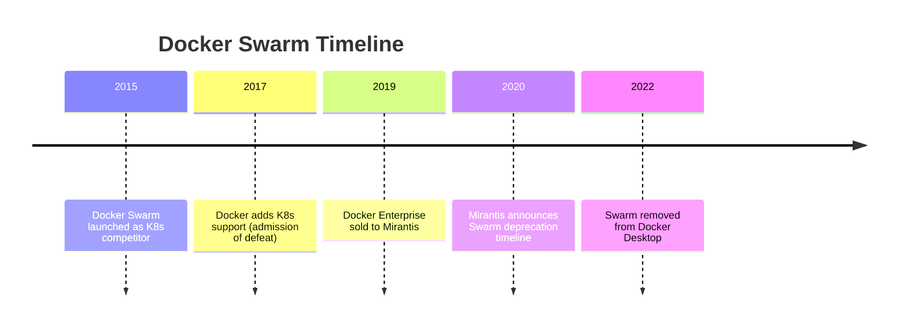
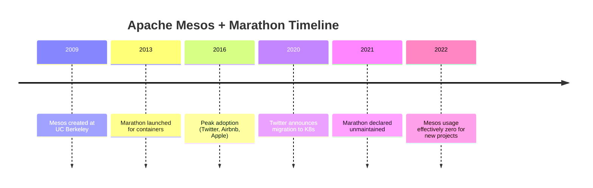
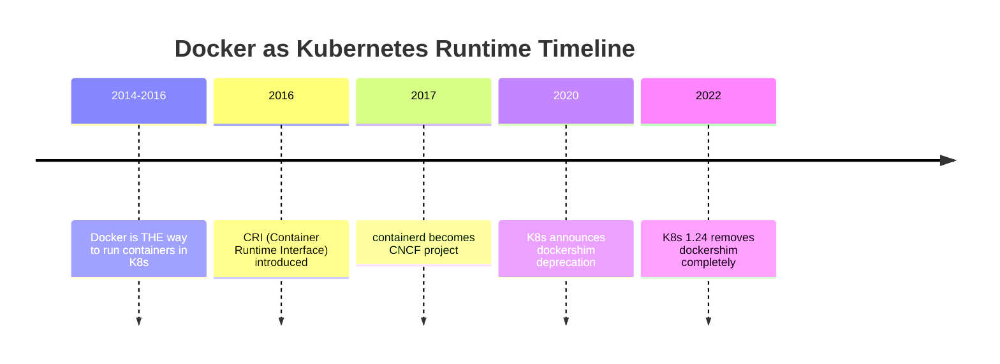
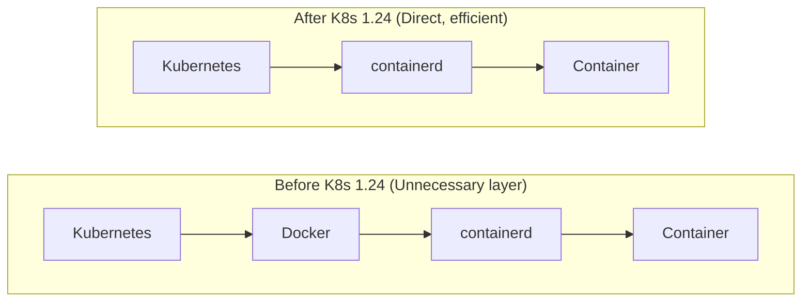
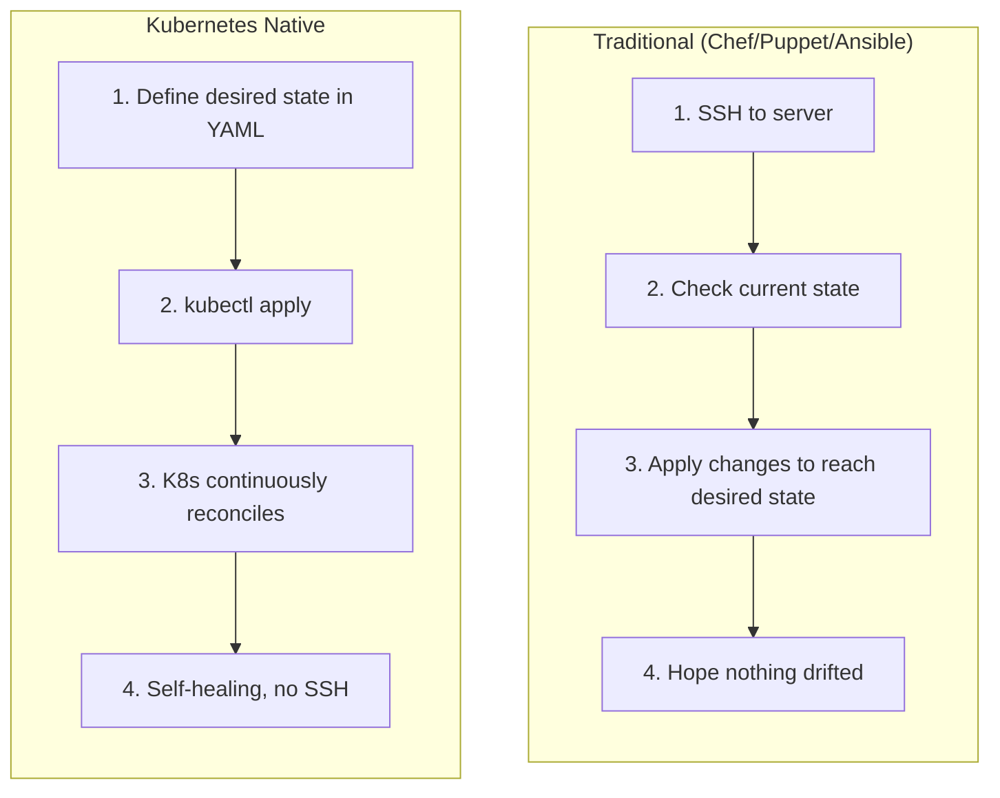
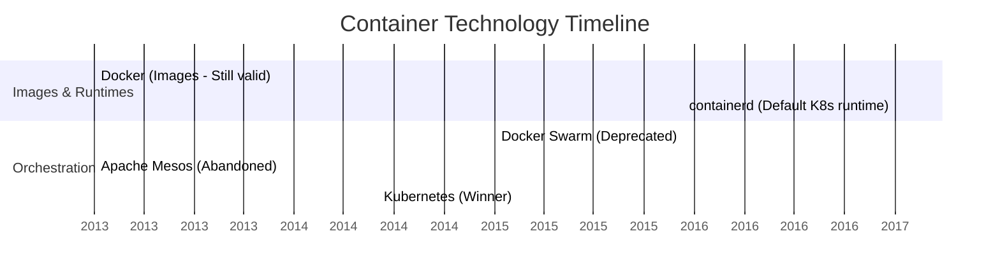

> **Complexity**: `[QUICK]` - Understanding what not to learn.
>
> **Time to Complete**: 25-30 minutes.
>
> **Prerequisites**: Module 1, Module 2, Module 3.

---

## What You'll Be Able to Do

After this module, you will be able to:

- **Evaluate** container orchestration technologies using governance, ecosystem, cloud-provider support, and adoption signals.
- **Diagnose** why Docker Swarm, Apache Mesos, Cloud Foundry, and Compose production deployments became dead ends.
- **Compare** Docker as an image-building workflow with Docker as a Kubernetes runtime removed after dockershim.
- **Design** a modernization plan that replaces dead-end tools with Kubernetes, containerd, Helm, Kustomize, GitOps, and managed clusters.

## Why This Module Matters

In 2018, a large retailer spent roughly $2.3 million building a container platform on Apache Mesos and Marathon. The team hired specialists, wrote custom deployment workflows, and trained application engineers to think in frameworks that looked sensible at the time because Twitter, Airbnb, and Apple had all used Mesos in serious production environments. By 2020, the platform choice had become a liability: hiring was harder, vendor integrations were thinning, the internal tooling required constant maintenance, and the migration plan pointed straight toward Kubernetes. The painful part was not merely that a tool lost popularity; it was that two years of operational habit had to be unwound while the business still expected releases to continue.

That story matters because beginners often assume the best career move is to learn every technology that appears in old architecture diagrams. In cloud-native engineering, that instinct is expensive. A dead-end technology can still have documentation, conference talks, and working clusters, so the question is not whether it ever solved a problem. The question is whether it is still a good place to invest learning time, production risk, and team attention when Kubernetes 1.35 and the surrounding ecosystem have become the default platform vocabulary.

This module is a tour through the cloud-native graveyard, but the purpose is not mockery. Docker Swarm, Apache Mesos, early Cloud Foundry, Chef, Puppet, Ansible, and Docker Compose each solved real problems for real teams. You will study why they lost ground, which parts remain useful, and how to evaluate the next tool that claims to replace Kubernetes. The practical skill is judgment: you should leave able to spot decline signals before your team builds a platform, career plan, or migration strategy around them.

## Start With the Shape of a Dead End

A technology becomes a dead end when its learning value, operational value, and ecosystem value fall out of alignment. It may still run. It may still have loyal users. It may even have a few job postings that pay well because legacy systems need care. The warning sign is that new teams no longer choose it for new work, adjacent tools stop integrating with it first, and community energy moves somewhere else. When that happens, every month of investment buys less future portability.

Cloud-native dead ends usually share three forces. First, the abstraction stops matching the workload. Second, the governance model fails to attract competitors, cloud providers, and independent vendors. Third, the ecosystem around the winner becomes so large that alternatives must be dramatically better to justify their isolation. Kubernetes won not because it was simple, but because it became the common integration target for runtimes, networking, storage, policy, observability, security, and managed cloud services.

Pause and predict: if your team finds a tool that is easier than Kubernetes for one narrow deployment path, what would have to be true before you would recommend it for a five-year platform bet? The answer should include more than feature checklists. You would need credible governance, a healthy contributor base, support from more than one cloud provider, a migration story, a security model, and evidence that the tool's abstraction will still fit when workloads become stateful, regulated, or globally distributed.

The useful mental model is a city map. A tool can be a lovely side street, but a platform needs roads, utilities, emergency services, maintenance crews, and businesses that expect the address to exist. Kubernetes is not only an orchestrator; it is the address system used by a large part of modern infrastructure. Dead ends often failed because they remained excellent side streets while the industry finished building the city somewhere else.

Before looking at individual tools, separate four questions. Is the technology obsolete, or is only one usage pattern obsolete? Is the concept still valuable even if the product declined? Is there a modern replacement with better ecosystem alignment? Is your team solving a production problem or chasing an attractive tutorial? These questions keep you from making the two common beginner mistakes: throwing away Docker entirely because dockershim was removed, or learning Docker Swarm because it appears next to Compose in old Docker material.

## Diagnose Orchestration Dead Ends

Container orchestration is where the most visible dead ends appeared because the industry could not support many competing control planes forever. Orchestration is not just starting containers. A production orchestrator schedules work across nodes, tracks health, rolls out new versions, routes traffic, handles secrets, coordinates storage, integrates with identity, and exposes APIs that other tools can extend. Once organizations need those capabilities, the platform with the largest ecosystem becomes safer than the platform with the cleanest first demo.

Docker Swarm is the simplest example because it was attached to the company that made Docker famous. Swarm felt natural for teams already using Docker locally: it used Docker language, Docker commands, and a friendly path from a single machine to a cluster. That simplicity was its attraction, but it also limited the room for the ecosystem to grow. Kubernetes was harder, yet it offered a more general API model, stronger extension points, and a neutral home that made it easier for cloud providers and vendors to support without strengthening a direct competitor.

**What it was**: Docker's native orchestration solution.

**Status**: Effectively deprecated. Docker Desktop removed Swarm mode in 2022.



The Swarm lesson is not that vendor-built tools are automatically bad. The lesson is that infrastructure platforms need trust from organizations that compete with one another. When a single vendor controls the roadmap, every other vendor asks whether deep integration helps the platform owner more than the customer. Kubernetes avoided that trap by moving under the CNCF and becoming a neutral target. That governance shift gave the ecosystem a place to cooperate while still competing on managed services, networking, storage, and developer experience.

For a learner, the decision is straightforward. Do not spend serious study time on Swarm concepts, Swarm networking, Swarm service definitions, or Swarm-mode production design unless you are explicitly maintaining an existing Swarm estate. Docker Compose remains useful for local development, and Dockerfiles remain valuable for image building, but Swarm does not provide the career leverage or production portability that Kubernetes provides. If a tutorial says "deploy production with Swarm," treat it as historical material rather than current guidance.

Apache Mesos and Marathon are more subtle because Mesos was technically impressive. Mesos came from UC Berkeley and targeted large-scale resource sharing before Kubernetes reached dominance. It offered a two-level scheduling model where Mesos managed cluster resources and frameworks such as Marathon decided how to run workloads. That made sense for organizations running mixed workloads at high scale, but it made the developer and operator experience harder to standardize. Kubernetes narrowed the interface, made the workload API more approachable, and let the ecosystem build around pods, services, controllers, and declarative manifests.

**What it was**: Two-level resource scheduler (Mesos) with container orchestration (Marathon).

**Status**: Marathon abandoned. Mesos in maintenance mode.



Mesos shows that technically powerful systems can lose when the surrounding model asks too much from ordinary teams. Two-level scheduling is elegant if you have platform specialists who can reason about frameworks, resource offers, and custom schedulers. Most product teams wanted a consistent way to deploy services, attach storage, expose endpoints, and get logs without becoming scheduler experts. Kubernetes still has complexity, but its complexity created a shared vocabulary that vendors, educators, and hiring markets could reinforce.

Cloud Foundry is a different kind of dead end because the product did not simply disappear. Its original model was a highly opinionated Platform-as-a-Service for stateless twelve-factor applications. For the right application, `cf push` was magical: developers pushed code, the platform staged it, routed traffic, collected logs, and hid infrastructure details. That high abstraction became a weakness when teams needed stateful systems, custom networking, GPUs, sidecars, service meshes, and workload-specific operators. The platform hid infrastructure so well that advanced teams could not reach the knobs they needed.

**What it was**: A heavily opinionated Platform-as-a-Service (PaaS) that predated Kubernetes, designed primarily for stateless 12-factor apps.

**Status**: Pivoted. The original Diego architecture was deprecated in favor of running Cloud Foundry directly on Kubernetes.

Stop and think: if a platform handles routing, logging, and deployment perfectly for stateless web apps, why would users leave it for something harder like Kubernetes? The answer is control surface. Kubernetes exposes lower-level primitives that can be composed into many shapes, while a PaaS exposes a beautiful path for a narrower class of workloads. Teams left because their workloads outgrew the path, not because the old path had never been useful.

The practical diagnosis is to ask where the abstraction breaks. If your application portfolio is only stateless web services, a PaaS can be efficient. If your platform must host databases, event systems, batch jobs, machine learning pipelines, custom controllers, and policy engines, Kubernetes gives you a common substrate. Cloud Foundry eventually became a layer that can run on Kubernetes because the industry chose the more flexible "infrastructure operating system" underneath specialized developer experiences.

Do not learn BOSH, Diego, Mesos architecture, Marathon configuration, or Swarm service definitions as core cloud-native career skills unless a current employer pays you to maintain them. Learn the ideas they reveal: orchestration requires scheduling, health management, rollout control, and ecosystem trust. Those ideas transfer. The old product-specific workflows mostly do not.

## Separate Docker Images From the Kubernetes Runtime

The Docker story causes more confusion than any other dead end because people use the word Docker to mean several different things. Docker can mean Dockerfiles, the Docker CLI, Docker Desktop, the Docker Engine, the Docker image format, Docker Hub, or Docker as the node-level runtime behind Kubernetes. Kubernetes removed only the dockershim path that let kubelet talk to Docker Engine as a runtime. It did not remove OCI container images, Dockerfiles, local image builds, or the everyday developer workflow of packaging software into containers.

**What it was**: The original container runtime for Kubernetes.

**Status**: Removed from Kubernetes in version 1.24 (May 2022).

Pause and predict: if Docker was the first major container runtime, why did the Kubernetes community build the CRI, the Container Runtime Interface, instead of hardcoding Docker support forever? A stable interface lets Kubernetes talk to runtimes such as containerd and CRI-O without treating one full developer platform as special. That interface reduced coupling, removed an unnecessary layer, and let node operators use leaner runtimes designed for orchestration rather than desktop convenience.



The dockershim removal is a perfect example of evaluating a usage pattern instead of condemning a whole tool. Docker as an image-building workflow is still worth knowing because developers need repeatable image builds, local test loops, and clear Dockerfiles. Docker as the Kubernetes runtime is the obsolete part because kubelet can now talk directly to containerd or CRI-O through CRI. The old path asked Kubernetes to call Docker Engine, which then called containerd, which then created containers. The modern path removes the middle layer.



When a junior engineer says "Kubernetes removed Docker, so we must rewrite every Dockerfile," your response should be calm and precise. Kubernetes runs OCI images. Docker builds OCI-compatible images. The node runtime changed; the image contract did not. In a Kubernetes 1.35 cluster, you should expect containerd or CRI-O underneath kubelet, but your build pipeline may still run `docker build`, BuildKit, Buildah, Kaniko, or another image builder depending on your security and platform constraints.

Here is the operator-facing habit this module expects in later Kubernetes labs. If you use kubectl enough that repeated typing slows you down, define the standard `k` alias once in your shell and use it consistently for interactive inspection. The alias is convenience, not magic, and scripts should still be clear about the tool they require.

```bash
alias k=kubectl
k get nodes
k get pods --all-namespaces
```

The deeper lesson is that technology evaluation requires vocabulary hygiene. "Docker is dead" is false. "Docker Engine as the Kubernetes runtime path is gone after dockershim" is true. "Docker Compose is bad" is false. "Docker Compose is insufficient as a single-node production orchestrator for a multi-service system that needs self-healing and failover" is true. Precise language prevents teams from overcorrecting and throwing away useful tools while still avoiding obsolete platform bets.

## Replace Server Configuration Thinking With Declarative Platform Thinking

Chef, Puppet, and Ansible belong to a different operational era. They manage servers by connecting to machines, inspecting state, and applying ordered changes until the machine looks right. That model works for long-lived servers where administrators own the operating system and expect to patch, mutate, and repair the same hosts over time. Kubernetes asks you to think differently. You declare desired state to an API, controllers reconcile that state continuously, and individual pods are disposable results of the control loop rather than precious machines to repair by hand.

**What they were**: Configuration management tools for managing servers.

**Status**: Wrong paradigm for Kubernetes workloads.

| Traditional CM | Kubernetes Native |
|---------------|-------------------|
| Mutable servers | Immutable containers |
| SSH to servers | API-driven changes |
| Converge to state | Declare desired state |
| Agent on each server | No agents needed |
| Imperative scripts | Declarative YAML |

The table is not saying Ansible, Chef, and Puppet are useless. They still appear in traditional infrastructure, compliance automation, and cluster provisioning workflows. The mistake is using them to directly manage Kubernetes workload objects as if pods were servers. If Ansible creates a pod, waits for it, then later edits it imperatively, Ansible is competing with the Kubernetes reconciliation loop. The more native approach is to store manifests or Helm values in version control, let GitOps apply them, and let controllers converge the cluster toward the declared state.



The anti-pattern is easy to miss because Ansible has Kubernetes modules and can call the API. The presence of a module does not mean the tool should own the operational model. If Ansible provisions a managed cluster, installs baseline controllers, or bootstraps a GitOps operator, it may be useful. If Ansible becomes the day-to-day deployment source of truth for Deployments, Services, ConfigMaps, and Secrets, the team has recreated imperative server management on top of a declarative system.

Which approach would you choose here and why: a playbook that SSHes to every node and restarts containers in place, or a Git pull request that changes a Deployment image tag and lets Kubernetes roll pods through a readiness-gated rollout? The second option aligns with Kubernetes because the rollout is represented as desired state, recorded in version control, and executed by the control plane. The first option depends on procedural timing and hidden host state, which becomes fragile as the cluster grows.

Docker Compose for production is the same paradigm mismatch in a different costume. Compose is excellent for defining a local multi-container environment on one machine. It lets a developer bring up an API, database, cache, and worker without learning the full Kubernetes object model on day one. The problem appears when teams copy that local convenience into production and expect a single host to behave like a distributed control plane.

**What it is**: A tool for defining and running multi-container Docker applications using a simple YAML file.

**Status**: Exceptional for local development, but an anti-pattern for production deployment.

Pause and predict: if `docker-compose up` brings up your entire stack locally, why is it dangerous to run that exact same command on a production server? The risk is not that the file format is ugly. The risk is that a single-node process lacks cluster scheduling, multi-node failover, native rollout control, API-driven policy, and the self-healing behavior that production users eventually demand.

Consider a typical `docker-compose.yml`:

```yaml
version: '3'
services:
  api:
    image: myapi:v1
    ports:
      - "8080:8080"
  db:
    image: postgres:13
    volumes:
      - db-data:/var/lib/postgresql/data
```

If the node hosting this Compose stack crashes, the application goes down. There is no Kubernetes scheduler to place a replacement pod on a healthy node, no controller to compare desired replicas with actual replicas, and no cluster-native service object to maintain stable discovery while workloads move. You can wrap Compose in scripts, systemd units, and monitoring, but each wrapper rebuilds a small piece of the orchestrator you were trying to avoid. At some point, the simplicity becomes accidental complexity.

Compose also lacks production-grade defaults for rolling updates, secrets, policy, and traffic management. A local developer can tolerate downtime while containers recreate. A user-facing service cannot. A local `.env` file may be fine for a laptop. A regulated production environment needs RBAC, secret rotation, encryption at rest, audit logs, and clear ownership boundaries. A local port mapping is enough for testing. A production platform may need ingress policy, mutual TLS, canary routing, and observability that follows workloads across nodes.

Translation tools such as Kompose can help people see rough Kubernetes equivalents, but one-to-one translation is rarely a good final architecture. A Compose service does not automatically imply a production Deployment with readiness probes, resource requests, PodDisruptionBudgets, network policies, service accounts, and environment-specific configuration. The modernization task is to redesign using Kubernetes primitives, not to mechanically convert syntax and hope the missing operational requirements appear.

## Evaluate Technology Bets With Governance, Ecosystem, and Cloud-Provider Signals

The dead-end pattern becomes clearer when you compare what lost with what remains current. Kubernetes did not win every technical argument. It won the coordination argument. Once cloud providers, tooling vendors, educators, security products, storage drivers, service meshes, and hiring pipelines treated Kubernetes as the shared target, alternatives had to offer overwhelming value to overcome isolation. Most did not.

Common patterns in technological dead ends include single-vendor control, complexity without proportional benefit, the wrong abstraction level, and losing to ecosystem effects. Swarm suffered because Docker controlled the center while Kubernetes moved into neutral governance. Mesos suffered because its power came with scheduler complexity that most application teams did not need. Chef and Puppet suffered in cloud-native workload management because the server abstraction stopped matching immutable containers. Compose suffers in production because local single-machine convenience cannot replace distributed reconciliation.

| Category | Current/Relevant |
|----------|-----------------|
| Orchestration | Kubernetes |
| Runtime | containerd, CRI-O |
| Images | Docker/Buildah for building |
| Config | Helm, Kustomize, native YAML |
| GitOps | ArgoCD, Flux |
| Service Mesh | Istio, Linkerd, Cilium |
| Monitoring | Prometheus, Grafana |
| Logging | Fluentd, Loki |

The table is intentionally not a shopping list to memorize. It is a map of where ecosystem energy currently lives. A platform team designing for Kubernetes 1.35 should expect Kubernetes for orchestration, containerd or CRI-O for runtime, OCI images built by Docker or Buildah-family tools, Helm or Kustomize for packaging and overlays, GitOps for continuous reconciliation, and Prometheus-style observability. The exact product can vary, but the direction of travel should not surprise anyone interviewing for modern infrastructure roles.



Use a simple evaluation routine whenever a new deployment tool appears. Ask what problem it solves that Kubernetes does not solve well enough. Check whether it is controlled by one vendor or governed in a way that competitors can trust. Look at cloud-provider support, not just GitHub stars. Read the release history and issue tracker to see whether maintainers respond to security and compatibility work. Then ask the harsh question: if this company disappeared, could your team still operate the system, hire for it, and migrate away from it?

Before running a pilot, what output do you expect from that evaluation? A healthy result should name the operational problem, the risk being reduced, the ecosystem dependencies, the exit strategy, and the compatibility path with Kubernetes rather than simply saying "the demo was faster." If the proposed tool replaces the whole platform, the evidence bar should be high. If it complements Kubernetes, such as a controller, policy engine, or packaging helper, the adoption risk is smaller but still real.

A useful distinction is replacement versus layer. Cloud Foundry becoming a layer on Kubernetes is different from Cloud Foundry replacing Kubernetes. Argo CD, Flux, Helm, Kustomize, Istio, Cilium, and Prometheus succeed because they extend or operate within the Kubernetes ecosystem instead of asking the industry to abandon it. A replacement must fight the entire city map. A layer can use the roads that already exist.

## Worked Example: Project Phoenix Assessment

Imagine that Project Phoenix is a medium-sized SaaS product with an API, a worker fleet, a PostgreSQL database, a Redis cache, and a small internal dashboard. The production environment runs on three virtual machines managed by Puppet. Docker is installed on each host, Swarm schedules containers, and a third-party conversion script turns the local Compose file into production service definitions. Nothing about this stack is imaginary in spirit; many teams built similar systems because each step felt reasonable when taken alone.

The first diagnostic move is to separate incident risk from modernization preference. A Swarm cluster can run containers today, so saying "Swarm is old" is not enough for an engineering decision. The stronger argument is operational: if a node fails, if a security patch requires coordinated rollout, if the team needs cloud load balancer integration, or if a new engineer must debug production, the organization receives less help from the modern ecosystem than it would on Kubernetes. The age of the tool matters because it predicts support friction.

Next, examine the Puppet role with care. Puppet may still be doing useful host provisioning, package installation, or baseline compliance. The dead-end part is not the existence of Puppet; it is Puppet acting as the owner of live application state. If the desired number of API replicas lives in a Puppet manifest, a Swarm service definition, and a converted Compose file, the team has three sources of truth. During an outage, nobody can confidently say which control loop should win.

The Compose file deserves the same distinction. A local Compose file is a productive development contract because it gives every engineer a repeatable way to start dependencies. Throwing it away completely may hurt onboarding for no gain. The production mistake is treating that local contract as the architecture itself. The modernization plan should keep the developer convenience if it remains helpful, then design production separately with Deployments, Services, persistent storage choices, probes, and environment-specific configuration.

A good assessment memo names failure modes in concrete language. "Swarm is deprecated" is weaker than "Swarm reduces our access to managed cloud integrations, current hiring pools, and Kubernetes-native security tooling." "Puppet is bad" is weaker than "Puppet should not repair pods because Kubernetes controllers already own desired state and rollout behavior." "Compose is not production" is weaker than "Compose gives us no multi-node scheduler, no native service account boundaries, and no controller that replaces failed replicas across hosts."

Now map replacements by responsibility rather than by brand. Swarm's responsibility is production orchestration, so Kubernetes is the replacement. Docker Engine's old runtime responsibility under kubelet is handled by containerd or CRI-O, but Docker's build responsibility can remain in the developer or CI workflow. Puppet's workload-management responsibility moves to GitOps, Helm, Kustomize, and Kubernetes controllers, while Puppet may remain for non-Kubernetes host concerns if the team still has hosts to manage. Compose's local-development responsibility can remain local, while production design moves to Kubernetes manifests.

The next decision is whether to operate Kubernetes directly or use a managed service. For most teams, managed Kubernetes is the conservative choice because the control plane is not where application teams usually create business value. Running Kubernetes the hard way can be educational in a lab, but production control planes require upgrades, backups, certificates, API availability, audit configuration, and security response. If Project Phoenix lacks a platform team, EKS, GKE, AKS, or another managed offering reduces the number of sharp edges during migration.

The migration should start with a non-critical service, not the database. Pick the internal dashboard or a stateless worker with modest traffic and clear rollback behavior. Package it as an OCI image, define a Deployment with resource requests and readiness probes, expose it through a Service, and manage the manifest through Git review. The purpose of the first migration is not raw scale. It is teaching the organization the new operating rhythm: desired state in Git, reconciliation in the cluster, and observable rollout status.

After one stateless service works, the team should build the platform minimums before moving the core API. That minimum includes namespaces, RBAC, secret management, ingress, logging, metrics, image scanning, base resource policies, and a GitOps controller if the organization chooses that model. Skipping these pieces makes Kubernetes look deceptively easy during the pilot and painfully incomplete during the first serious incident. Dead-end migrations often fail because teams replace the scheduler but postpone the operating model.

Data services need a separate conversation. Moving PostgreSQL from a Compose volume to Kubernetes persistent storage may be possible, but it may not be the best first move. A managed database often gives stronger backup, failover, patching, and operational support than a self-managed database inside the cluster. The dead-end analysis does not require every workload to run in Kubernetes. It requires each workload to have an intentional home with clear ownership, recovery behavior, and support expectations.

Security review is where the old stack usually reveals hidden cost. A converted Compose file may rely on broad environment variables, host-mounted paths, and implicit network trust. Kubernetes gives better primitives, but only if the team uses them: service accounts, namespace boundaries, network policies, secret handling, admission control, and workload identity where the cloud supports it. A rushed migration that ignores these controls simply moves weak assumptions into YAML.

Observability also changes shape. In the Swarm and Compose world, engineers may SSH to a node, run container commands, and inspect logs locally. In Kubernetes, workloads move, replicas change, and the node is not the right user interface for application debugging. Project Phoenix needs centralized logs, metrics, events, alerts, and a clear incident playbook. This is another reason Compose production is a dead end: it encourages node-centric troubleshooting in a world where the workload should be the unit of analysis.

Training should target concepts before tools. Engineers need to learn what a Deployment controls, how a Service gives stable discovery, why readiness differs from liveness, how resource requests influence scheduling, and how rollouts interact with health checks. Helm and Kustomize are useful only after those primitives make sense. GitOps is useful only when the team agrees that Git is the desired-state source. Otherwise, new tools become decoration on top of old habits.

The team should also plan for coexistence. A migration rarely moves every service in one weekend, and trying to force that schedule creates avoidable risk. For a period, Swarm and Kubernetes may both exist, with routing, DNS, secrets, and observability crossing the boundary. That coexistence is not a failure if it has a retirement date, ownership, and clear criteria for when new services stop landing on the old platform. Dead ends become dangerous when "temporary" becomes permanent without review.

Success metrics should be operational, not cosmetic. Count reduced recovery time, successful rolling updates without user-visible downtime, fewer manual host repairs, clearer audit trails, and the number of services owned through declarative review. A migration that only changes the orchestrator name in a slide deck has not solved the dead-end problem. A migration that changes how the team reasons about desired state, failure, and support has created durable value.

The final recommendation for Project Phoenix should read like a risk-managed modernization plan rather than an accusation against the past. The old stack was a reasonable accumulation of decisions made under earlier constraints. The new stack should keep the useful parts, such as OCI image builds and local Compose convenience, while retiring production dependencies that isolate the team from the current ecosystem. That tone matters because migrations are social systems as much as technical ones.

By the time you can write that assessment, you are no longer memorizing which tools are dead. You are practicing platform judgment. You can diagnose why Docker Swarm, Mesos, Cloud Foundry, and Compose production deployments became risky, compare Docker's surviving image role with its retired runtime role, evaluate governance and ecosystem signals, and design a modernization plan that uses Kubernetes without treating it as a magic word.

## Patterns & Anti-Patterns

Patterns help you repeat the good decisions behind the current ecosystem, while anti-patterns help you detect when old thinking is sneaking into new platforms. Treat these as operating habits rather than trivia. A team that can explain why a tool fits the platform model is less likely to be captured by a slick demo or by nostalgia for a workflow that worked in a different era.

| Pattern | When to Use It | Why It Works |
|---------|----------------|--------------|
| Prefer neutral infrastructure governance | Choosing core orchestration, runtime, networking, or policy layers | Competitors, vendors, and cloud providers are more willing to integrate when no single company controls the center. |
| Separate concepts from products | Evaluating Docker, Compose, Cloud Foundry, or any older tool | You keep useful ideas such as image builds and developer workflows without inheriting obsolete production patterns. |
| Design for declarative reconciliation | Managing Kubernetes workloads, policy, and configuration | Desired state in an API gives controllers a stable contract for healing, rollout, audit, and automation. |
| Keep an exit strategy | Piloting any new platform component | Migration paths, data ownership, and open standards reduce the cost of being wrong. |

The strongest pattern is preserving portable concepts while retiring obsolete control planes. You should still learn container images, health checks, service discovery, rollout strategy, resource isolation, and declarative configuration. Those ideas matter across tools. You should not spend scarce beginner time memorizing Swarm service syntax, Mesos framework behavior, Diego internals, or Compose production tricks unless a specific maintenance role requires them.

| Anti-Pattern | What Goes Wrong | Better Alternative |
|--------------|-----------------|--------------------|
| Choosing a single-vendor orchestrator for core platform work | Ecosystem support narrows when competitors avoid strengthening the owner | Use Kubernetes or another neutrally governed standard with broad provider support. |
| Translating local Compose files directly into production | Missing probes, policies, scheduling, rollout controls, and secret boundaries stay hidden | Redesign the workload using Kubernetes objects, Helm, Kustomize, and GitOps review. |
| Managing pods like mutable servers | Imperative repair steps fight controllers and create drift | Declare desired state through the Kubernetes API and let reconciliation do the work. |
| Treating legacy expertise as future proof | Hiring and integration markets move away while maintenance burden grows | Convert legacy knowledge into transferable concepts and current platform practice. |

These patterns also explain why Kubernetes itself should not be treated as untouchable forever. A future platform could displace it if it solved real pain, offered trustworthy governance, preserved compatibility or migration paths, attracted cloud-provider support, and created an ecosystem large enough to justify the switch. Until those signals exist, "simpler than Kubernetes" is not enough. Simpler for the first day can become harder for the fifth year.

## Decision Framework

Use this framework when your team considers whether to learn, adopt, maintain, or retire a cloud-native technology. The point is not to produce a perfect score. The point is to force the conversation out of vibes and into operational evidence. If the tool is core infrastructure, a weak answer in any category should slow adoption because core platforms are expensive to replace after teams build habits around them.

| Question | Green Signal | Red Signal | Decision Guidance |
|----------|--------------|------------|-------------------|
| What problem does it solve? | Clear operational pain with measurable impact | Mostly novelty, aesthetic preference, or tutorial convenience | Pilot only when the problem is real and named. |
| Who governs it? | Neutral foundation, multi-company maintainers, open roadmap | Single startup controls roadmap and trademarks | Avoid core dependency unless exit path is strong. |
| Who integrates with it? | Major clouds, security vendors, observability tools, storage providers | Integrations are mostly first-party or community scripts | Prefer ecosystem standards for production platforms. |
| What happens if it fails? | Data and workloads can migrate through open interfaces | Migration requires a rewrite of platform habits and tooling | Keep blast radius small or stay with current standards. |
| Does it align with Kubernetes? | Extends, automates, or secures Kubernetes primitives | Requires replacing the cluster model without strong evidence | Treat replacement claims as high-risk architecture choices. |

For a beginner, the simplest rule is this: learn the dominant standard deeply enough to understand why alternatives are attractive, then evaluate alternatives from that foundation. If you have never operated a Deployment, Service, ConfigMap, Secret, Ingress, and basic rollout, you cannot fairly judge a tool that claims to replace them. You may be reacting to the pain of being new rather than to an actual platform deficiency.

For a working team, the decision framework should end in one of four actions. Adopt when the tool solves a real problem, aligns with the ecosystem, and has a credible support model. Layer when it adds developer experience or policy on top of Kubernetes without replacing the core. Contain when a legacy system must be maintained but should not spread into new services. Retire when the tool creates hiring risk, migration drag, or operational fragility beyond the value it still provides.

## Did You Know?

- **Mesos powered major production systems** at companies such as Twitter and Airbnb before Kubernetes became the common target for new container platforms.
- **Docker Engine was not the container image format** removed from Kubernetes; Kubernetes 1.24 removed dockershim, while OCI images and Dockerfiles remained usable.
- **Kubernetes moved fast because multiple competitors could still cooperate** through CNCF governance, which made it easier for clouds and vendors to support the same API surface.
- **Chef, Puppet, and Ansible are not dead technologies**; they are simply a poor default for managing Kubernetes workloads that should be controlled through declarative APIs.

## Common Mistakes

| Mistake | Why It Happens | How to Fix It |
|---------|----------------|---------------|
| **Learning Docker Swarm as a new orchestration skill** | Old Docker tutorials make Swarm look like the natural next step after Compose. | Skip Swarm tutorials unless you maintain an existing Swarm cluster; focus on Kubernetes orchestration. |
| **Using Docker Compose in production** | The local development workflow feels simple, so teams assume one large server is enough. | Use Compose for local dev only; use Kubernetes, managed serverless, or another production orchestrator for live services. |
| **Applying Chef, Puppet, or Ansible mindsets to pods** | Server administrators are used to mutable machines and procedural repairs. | Embrace immutable containers, declarative YAML, GitOps, and the Kubernetes reconciliation loop. |
| **Ignoring managed Kubernetes services** | Teams confuse learning value with production ownership and try to operate control planes too early. | Use EKS, GKE, AKS, or another managed service unless you have a dedicated platform team. |
| **Translating Compose to Kubernetes one-to-one** | Conversion tools make syntax migration look equivalent to architecture migration. | Design Kubernetes manifests intentionally with probes, resources, RBAC, configuration boundaries, and rollout strategy. |
| **Chasing abandoned or isolated projects** | Hype, old case studies, or impressive demos hide weak maintenance and governance signals. | Check foundation status, release cadence, maintainer diversity, cloud-provider support, and issue health before adopting. |
| **Assuming Docker is dead** | Dockershim removal is confused with removal of Dockerfiles and OCI images. | Continue learning image builds; only Docker Engine as the Kubernetes runtime path is obsolete. |

## Quiz

<details>
<summary>1. Your startup wants to run production microservices with Docker Compose on one large virtual machine because it works on laptops. How should you diagnose the risk?</summary>

The risk is not that Compose is useless; it is that Compose does not provide distributed scheduling, node failover, cluster services, or a reconciliation loop. A single host becomes a single point of failure, and recreating containers during updates can cause downtime unless the team builds extra machinery around it. You should recommend keeping Compose for local development while designing production around Kubernetes or a managed platform that owns health, rollout, and failover.
</details>

<details>
<summary>2. A recruiter offers a highly paid contract for Apache Mesos and Marathon administration. How should you evaluate the career tradeoff?</summary>

Legacy work can be rational when the pay and scope are explicit, but Mesos and Marathon are weak long-term learning investments for new platform skills. The ecosystem has moved toward Kubernetes, and Marathon-specific knowledge does not transfer as cleanly as broader scheduling, reliability, and migration concepts. If you accept the role, treat it as legacy maintenance and deliberately convert the experience into Kubernetes migration, platform risk, and operational design stories.
</details>

<details>
<summary>3. During a Kubernetes 1.35 upgrade, a junior engineer says all Dockerfiles must be rewritten because Kubernetes removed Docker. What do you explain?</summary>

You should compare Docker as an image-building workflow with Docker as a Kubernetes runtime. Kubernetes removed dockershim in 1.24, which ended the special path where kubelet used Docker Engine as the node runtime, but OCI images built from Dockerfiles still run through containerd or CRI-O. The build pipeline may remain unchanged while the node runtime changes, so the migration plan should focus on runtime compatibility and operational testing rather than rewriting application images unnecessarily.
</details>

<details>
<summary>4. A senior administrator wants Ansible to directly create and repair pods because that worked for virtual machines. Why is that an anti-pattern?</summary>

Ansible is procedural, while Kubernetes workload management is declarative and controller-driven. If a playbook owns pod repair step by step, it competes with the reconciliation loop and can create drift between what Git says, what the API stores, and what the cluster is running. A better plan is to manage manifests, Helm values, or Kustomize overlays through review and GitOps, then let Kubernetes controllers perform rollout and self-healing.
</details>

<details>
<summary>5. Your team finds a new orchestrator from one startup with no neutral governance and little cloud-provider support. What adoption signal worries you most?</summary>

The governance and ecosystem signals are the main concern because core infrastructure needs broad trust. If one company controls the roadmap, competitors and cloud providers have weaker incentives to integrate deeply, and your team may inherit vendor lock-in if the company pivots or fails. A small pilot may still be acceptable for a contained problem, but replacing Kubernetes would require much stronger evidence, a credible exit strategy, and proof that the ecosystem can sustain the platform.
</details>

<details>
<summary>6. Your company uses Cloud Foundry successfully for stateless web apps, then needs stateful data pipelines with GPUs and custom networking. Why might Kubernetes fit better?</summary>

Cloud Foundry's original value was a high-level developer abstraction for a narrower class of applications. Stateful systems, specialized hardware, custom scheduling, and complex networking require more control over infrastructure primitives than the original PaaS model wanted to expose. Kubernetes is harder on day one, but its lower-level API, controllers, storage model, and extensibility make it a better substrate for diverse workloads that outgrow a pure `cf push` workflow.
</details>

<details>
<summary>7. A migration proposal mechanically converts a large Compose file into Kubernetes YAML and calls the platform modernized. What should you challenge?</summary>

You should challenge the assumption that syntax conversion equals architecture design. A production Kubernetes workload needs readiness and liveness probes, resource requests, service accounts, network policies, configuration boundaries, rollout strategy, and often GitOps ownership. The right modernization plan should redesign the workload using Kubernetes primitives rather than simply preserving local Compose assumptions in a different file format.
</details>

## Hands-On Exercise: Technology Radar Audit

In this exercise, you will audit an imaginary legacy stack and propose a modernization plan based on the patterns in this module. The scenario is deliberately realistic rather than exotic: Project Phoenix uses Docker Swarm for production orchestration, Puppet to SSH into nodes and install or repair Docker, and a monolithic `docker-compose.yml` translated into production by a third-party script. Your job is to separate what should be retired, what should be kept, and what must be redesigned rather than translated.

Start by writing a short risk memo. Do not list every possible weakness; focus on the risks that would matter during an outage, a hiring plan, a security review, and a migration. Then map each dead-end tool to a modern replacement and explain the paradigm shift in plain language. The best answer does not merely say "use Kubernetes." It explains why Kubernetes, containerd, Helm, Kustomize, GitOps, and managed clusters reduce specific risks created by Swarm, Puppet-driven workload repair, and production Compose.

### Tasks

- [ ] **Evaluate container orchestration technologies** by writing governance, ecosystem, cloud-provider support, and adoption notes for Swarm versus Kubernetes.
- [ ] **Diagnose Docker Swarm, Apache Mesos, Cloud Foundry, and Compose production dead ends** by naming the failure pattern each one demonstrates.
- [ ] **Compare Docker image-building workflow with Kubernetes runtime dockershim removal** and state which Docker skills remain useful.
- [ ] **Design a modernization plan** that replaces dead-end tools with Kubernetes, containerd, Helm, Kustomize, GitOps, and managed clusters.
- [ ] **Explain the paradigm shift** from Puppet-managed mutable servers to declarative Kubernetes reconciliation in one paragraph for the team.

### Suggested Workspace

Use a plain text file or notebook for your audit. If you have access to a disposable Kubernetes cluster, you can also inspect the cluster shape with the `k` alias after defining it, but the exercise is primarily architectural judgment rather than command memorization.

```bash
alias k=kubectl
k get nodes
k get deploy --all-namespaces
```

### Solution Guide

<details>
<summary>Show one possible modernization plan</summary>

A strong plan identifies Swarm as the production orchestration risk because it lacks the ecosystem, hiring market, and Kubernetes-native integration path expected by modern platforms. It identifies Puppet-driven pod or container repair as a paradigm mismatch because Kubernetes workloads should be described declaratively and reconciled by controllers. It keeps Dockerfiles or another OCI image build workflow while moving runtime expectations to containerd or CRI-O. It replaces one-to-one Compose translation with intentional Kubernetes design: Deployments, Services, ConfigMaps, Secrets, probes, resource requests, RBAC, and GitOps-managed changes. It also recommends a managed Kubernetes service unless the organization has a platform team ready to own the control plane.
</details>

### Success Criteria

- [ ] Your audit identifies at least three critical points of failure or dead-end technologies in Project Phoenix.
- [ ] Your replacement map distinguishes tools to retire from concepts to keep, especially Docker image building.
- [ ] Your modernization plan uses Kubernetes for orchestration and containerd or CRI-O as the runtime expectation.
- [ ] Your configuration plan moves workload ownership from Puppet procedures to declarative YAML, Helm, Kustomize, or GitOps.
- [ ] Your final paragraph explains why Compose remains useful locally but should not define the production architecture.

## Sources

- [Kubernetes Dockershim Removal FAQ](https://kubernetes.io/blog/2020/12/02/dockershim-faq/)
- [Kubernetes Dockershim Historical Context](https://kubernetes.io/blog/2022/05/03/dockershim-historical-context/)
- [Kubernetes Container Runtimes](https://kubernetes.io/docs/setup/production-environment/container-runtimes/)
- [Kubernetes RuntimeClass](https://kubernetes.io/docs/concepts/containers/runtime-class/)
- [Docker Swarm Mode Documentation](https://docs.docker.com/engine/swarm/)
- [Apache Mesos Project](https://mesos.apache.org/)
- [Marathon Repository](https://github.com/mesosphere/marathon)
- [Cloud Foundry and Kubernetes](https://www.cloudfoundry.org/blog/cloud-foundry-and-kubernetes/)
- [CNCF containerd Project](https://www.cncf.io/projects/containerd/)
- [CRI-O Project](https://cri-o.io/)
- [Kubernetes Declarative Management](https://kubernetes.io/docs/tasks/manage-kubernetes-objects/declarative-config/)
- [Docker Compose Documentation](https://docs.docker.com/compose/)

## Next Module

[Cloud Native 101](/prerequisites/cloud-native-101/module-1.1-what-are-containers/) continues with the container fundamentals behind the platform choices you just evaluated.
