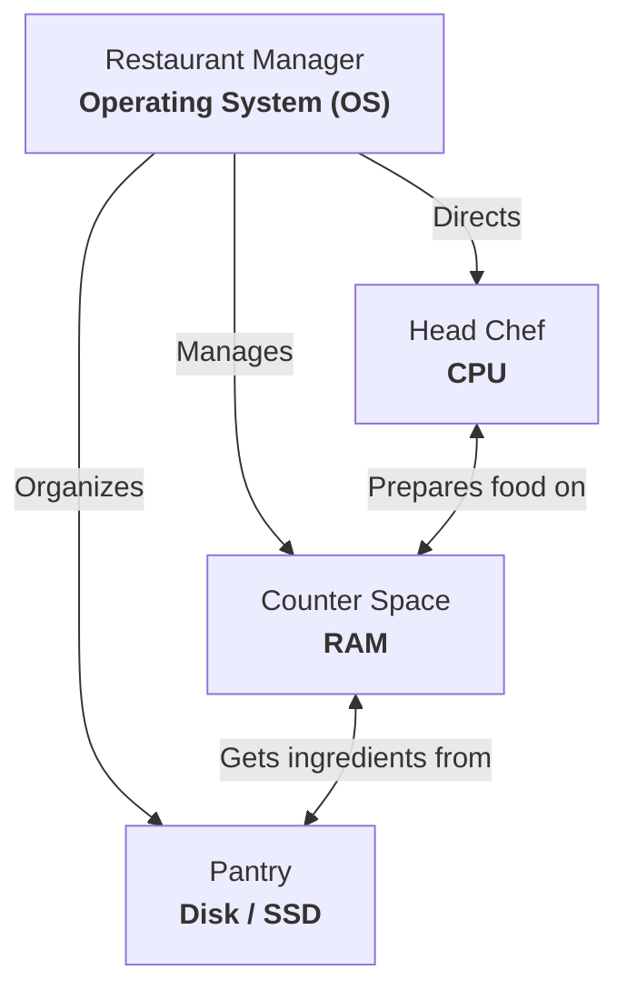

> **Complexity**: `[QUICK]` - No technical experience needed
>
> **Time to Complete**: 20 minutes
>
> **Prerequisites**: None. Seriously, none. If you can read this, you're ready.

---

## What You'll Be Able to Do

After this module, you will be able to:
- **Name** the four core parts of any computer (CPU, RAM, disk, OS) and explain what each one does
- **Predict** what happens when your computer runs out of RAM or disk space
- **Find** your own computer's specs using system tools or terminal commands
- **Explain** why servers run Linux and why that matters for Kubernetes

---

## Why This Module Matters

Every single thing you'll learn in this curriculum -- Kubernetes, containers, cloud computing -- runs on computers. But most people have never been told what's actually happening inside the box on their desk (or the slab in their pocket).

Understanding your computer's parts isn't just trivia. When something goes wrong later -- when a program is slow, when a server runs out of memory, when Kubernetes decides to restart your application -- you'll know *why* because you understand the hardware underneath.

This is where your journey begins.

---

## The Restaurant Kitchen

Imagine a restaurant kitchen. Not a fancy one -- just a regular, busy kitchen that needs to take orders, prepare food, and serve customers.

Your computer works exactly like this kitchen. Every part has a job, and when they work together, meals (or programs) get made.

Let's meet the kitchen staff and equipment.



---

## The CPU: Your Head Chef

The **CPU** (Central Processing Unit) is the chef. It's the part of the computer that actually *does the work*.

When you click a button, type a letter, or open a program, the CPU is the one carrying out those instructions. It reads instructions one by one (incredibly fast) and executes them.

```
Think of it this way:

  Order comes in: "Make a sandwich"
  Chef reads the recipe:
    Step 1: Get bread         ✓
    Step 2: Add lettuce       ✓
    Step 3: Add tomato        ✓
    Step 4: Serve             ✓
```

A faster CPU is like a faster chef -- they can handle more orders per second.

**What you'll see on your computer**: Something like "Intel Core Ultra" or "Apple M5" or "AMD Ryzen 5". These are brand names for CPUs, like saying "Chef Gordon" or "Chef Julia". The number of **cores** is like having multiple chefs -- a 4-core CPU has 4 chefs working at the same time.

---

## RAM: Your Counter Space

**RAM** (Random Access Memory) is the counter space in your kitchen -- the area where the chef does their active work.

When you open a program, it gets loaded from storage into RAM. Why? Because RAM is *fast*. The chef needs ingredients within arm's reach, not in a pantry down the hall.

Here's the critical thing about counter space: **when you close the kitchen (turn off the computer), the counter gets wiped clean.** Everything on it disappears. That's exactly how RAM works -- it only holds things while the power is on.

```
More RAM = More counter space = More things open at once

  4 GB RAM   → You can chop vegetables OR boil pasta (not both well)
  8 GB RAM   → You can comfortably prep a full meal
  16 GB RAM  → You can prep multiple meals simultaneously
  32 GB RAM  → You're running a professional kitchen
```

**When RAM fills up**, your computer gets slow. Just like a chef with no counter space has to keep putting things away and getting them back out, your computer starts "swapping" data back and forth to disk. This is painfully slow.

> **Pause and predict**: You have 8 GB of RAM and you open a web browser with 30 tabs, a video editor, and a music player — all at once. What do you think happens? If you guessed "the computer gets painfully slow" — you're right. Each program needs counter space, and a browser with many tabs open can easily use several gigabytes of RAM. The OS starts shuffling data between RAM and disk (swapping), and everything grinds to a crawl.

---

## Disk/SSD: Your Pantry

The **disk** (also called storage, hard drive, or SSD) is your pantry. This is where everything is stored *permanently*.

Unlike counter space (RAM), the pantry survives when you close the kitchen. Turn off your computer, turn it back on -- your files, photos, programs are all still there. They were in the pantry the whole time.

```
Two types of pantry:

  HDD (Hard Disk Drive):
    - Like a big walk-in pantry
    - Lots of space, affordable
    - Slower to find things (mechanical moving parts)

  SSD (Solid State Drive):
    - Like a well-organized shelf right outside the kitchen
    - Faster to find things (no moving parts)
    - More expensive per shelf
    - This is what most modern computers use
```

**What you'll see on your computer**: Storage is measured in gigabytes (GB) or terabytes (TB). 1 TB = 1,000 GB. A typical laptop has 256 GB to 1 TB of storage.

**When your disk fills up**, your computer can no longer save files, download updates, or install programs. More importantly, if your RAM is full and the OS tries to "swap" data to a completely full disk, your system can freeze or crash because it has no space left to operate.

---

## The Operating System: Your Restaurant Manager

The **Operating System** (OS) is the restaurant manager. It doesn't cook anything itself, but *nothing works without it*.

The OS:
- Decides which chef (CPU core) handles which order (program)
- Manages counter space (RAM) so programs don't step on each other
- Organizes the pantry (disk) so files can be found
- Handles communication (networking, display, keyboard input)

```
The three main operating systems:

  Windows  → The most common desktop OS (StatCounter: 60.8% worldwide, March 2026)
  macOS    → Apple's system (what runs on Macs)
  Linux    → The open-source family used heavily in servers and cloud infrastructure
```

Here's the part that will matter a LOT in your Kubernetes journey: Linux is the default environment you'll see in most Kubernetes tutorials and many production clusters, but it is not the only option. The Kubernetes docs say [worker nodes can run either Linux or Microsoft Windows, while the control plane stays on Linux](https://kubernetes.io/docs/concepts/windows/intro/). That's why we'll be learning Linux commands in the next modules.

> **Stop and think**: Why is Linux so common in cloud and Kubernetes environments, even though Windows servers exist? Servers usually prioritize automation, remote administration, predictable behavior, and low overhead. Linux fits that model well, which is why it shows up so often in cloud-native docs and labs.

Checked April 15, 2026: [StatCounter Desktop OS Market Share Worldwide](https://gs.statcounter.com/os-market-share/desktop/worldwide/) and [Kubernetes Windows in Kubernetes](https://kubernetes.io/docs/concepts/windows/).

---

## Programs: Your Recipes

A **program** (also called an application or app) is a recipe. It's a set of instructions that tells the CPU what to do.

When you open a web browser, you're telling the restaurant manager (OS) to hand the browser recipe to the chef (CPU), set up counter space (RAM) for it, and let it do its thing.

```
Some "recipes" you use every day:

  Web browser (Chrome, Firefox)  → Recipe for displaying web pages
  Text editor (Word, Notepad)    → Recipe for editing text
  Terminal                       → Recipe for talking directly to the OS
```

That last one -- the **terminal** -- is what we'll spend most of our time with. It's like walking into the kitchen and talking directly to the staff, instead of placing orders through a waiter (the graphical interface).

---

## How It All Works Together

Let's trace what happens when you open a photo on your computer:

```
1. You double-click "vacation.jpg"

2. The OS (manager) sees your request
   → "Customer wants to see a photo"

3. The OS loads the photo viewer program from disk (pantry) into RAM (counter)
   → "Get the photo recipe and ingredients ready"

4. The OS loads vacation.jpg from disk into RAM
   → "Grab that specific dish from storage"

5. The CPU (chef) processes the image data
   → "Follow the recipe to prepare the photo for display"

6. The result appears on your screen
   → "Dish served!"
```

Every single thing your computer does follows this pattern. Every. Single. Thing.

---

## Why This Matters for Kubernetes

Here's where this gets exciting.

Kubernetes is a system that manages **thousands of these kitchens** (computers) at the same time. It decides:

- Which kitchen (server) should handle which order (program)
- How much counter space (RAM) each program gets
- What to do when a kitchen breaks down (move the orders to another kitchen)
- How to add more kitchens when the restaurant gets busy

You can't manage thousands of kitchens if you don't understand how *one* kitchen works. That's what this module gave you. In the cloud, pricing depends on the instance type, operating system, region, and purchase model. For example, a small cloud VM can cost only a few cents per hour, but the exact price depends on the instance type, operating system, region, and purchase model. Misunderstanding these resources literally costs money. Source: [AWS EC2 T2 Instances](https://aws.amazon.com/ec2/instance-types/t2/).

---

## Did You Know?

- **Your phone is a computer too.** A modern smartphone is dramatically more capable than the computers used in the Apollo era; for perspective, the Apollo Guidance Computer worked with only tens of kilobytes of memory.

- **RAM was once magnetic.** [Early computers used tiny magnetic rings (called "core memory") for RAM. Each ring stored a single bit (0 or 1).](https://en.wikipedia.org/wiki/Magnetic-core_memory) A full megabyte of core memory would have needed millions of tiny rings. Today, your computer's RAM chip is smaller than a postage stamp and holds billions of bits.

- **SSDs have no moving parts.** Traditional hard drives have spinning metal disks and a moving arm (like a record player). SSDs store data in electronic circuits with zero moving parts, which is why they're faster, quieter, and more durable. Drop a laptop with an HDD and you might lose data. Drop one with an SSD and you probably won't.

- **The first computer bug was an actual bug.** [In 1947, engineers working on the Harvard Mark II computer found a literal moth stuck in a relay, causing the machine to fail. They taped the moth into their logbook and noted it as the "first actual case of bug being found."](https://en.wikipedia.org/wiki/Harvard_Mark_II) The term "debugging" has been used in computer science ever since.

---

## Common Mistakes

| Mistake | Why It's a Problem | What to Do Instead |
|---------|-------------------|-------------------|
| Confusing RAM and storage | "I have 256 GB of memory" -- you probably mean storage, not RAM | RAM = temporary counter space (8-32 GB typical). Storage = permanent pantry (256 GB - 2 TB typical) |
| Thinking more storage = faster computer | A bigger pantry doesn't make the chef cook faster | Speed comes from CPU and RAM. Storage just means more room for files |
| Ignoring RAM when computer is slow | Opening 47 browser tabs and wondering why things crawl | Check how much RAM is in use. Close what you don't need |
| Over-provisioning cloud servers | "Let's just use the biggest server so it doesn't crash." | In the cloud, you pay for what you provision. A team might pay hundreds of dollars per month for a larger server than their application actually needs. Right-sizing can save substantial money over time. |
| Assuming CPU speed solves internet lag | "My web pages load slowly, I need a better processor." | Internet speed depends on your network bandwidth and latency. Troubleshoot your router, Wi-Fi signal, or ISP connection first before blaming your computer hardware. |
| Never restarting the operating system | "I just close my laptop lid, why is my computer glitching?" | Restarting clears out the RAM completely and restarts background processes. Make it a habit to reboot at least once a week to clear temporary issues. |
| Judging a CPU only by its clock speed | "A 4 GHz CPU is always better than a 3 GHz one." | Look at the number of cores as well. A 3 GHz CPU with 8 cores can handle many simultaneous tasks much better than a 4 GHz CPU with only 2 cores. |

---

## Quiz

1. **You are hired to set up a new restaurant kitchen. You have a chef (CPU), counter space (RAM), and a pantry (Disk), but no one to take orders from customers, assign tasks to the chef, or organize the ingredients. What component is missing?**
   <details>
   <summary>Answer</summary>
   The Operating System (OS) is missing. Just like a restaurant manager, the OS does not process the data itself, but it coordinates all the hardware. It decides which CPU core handles which program, manages the RAM so programs do not overwrite each other's data, and organizes files on the disk. Without an OS, the hardware cannot communicate with the user or run any software. It essentially acts as the bridge between your instructions and the physical machine.
   </details>

2. **You're writing a document and the power goes out before you save. What is lost and what survives? Explain using the kitchen analogy.**
   <details>
   <summary>Answer</summary>
   The unsaved changes to your document are lost, but the original file and your other programs survive. Before you save, your work is kept in RAM, which is temporary "counter space" that requires electricity to hold data. When the power goes out, the counter is wiped clean. The files that survive were already stored on your disk, which acts as the "pantry" and permanently retains data even without power. This is why frequent saving or auto-save features are critical for protecting your work.
   </details>

3. **Your computer is running a video call and the video keeps freezing, but your internet speed test shows 100 Mbps. Which component is most likely the bottleneck — CPU, RAM, or disk? Why?**
   <details>
   <summary>Answer</summary>
   The CPU is the most likely bottleneck in this scenario. Processing live video requires the computer to constantly decode and encode images in real-time, which is a highly intensive task for the CPU "chef". If the internet is fast, the data is arriving on time, but the CPU simply cannot keep up with processing it fast enough. While RAM might also be a factor if it is completely full, video encoding and decoding are primarily bound by CPU performance. Closing other heavy applications can help free up CPU resources for the call.
   </details>

4. **Your friend says their computer is slow and asks if they should buy a bigger hard drive. What would you tell them, and what should they check first?**
   <details>
   <summary>Answer</summary>
   A bigger hard drive will not make their computer faster, because storage capacity does not affect processing speed. That would be like building a bigger pantry and expecting the chef to cook faster. They should first check their RAM and CPU usage to see if the system is overloaded with too many open programs. If their RAM is entirely full, the computer is likely "swapping" data back and forth to the slow disk, which causes the sluggishness. Upgrading the RAM or switching to an SSD (if they have an older HDD) would be more effective upgrades.
   </details>

5. **Your team is deploying a new web application to the cloud and debating whether to use Windows or Linux servers. Based on what you know about operating systems, why is Linux usually the default choice for Kubernetes-based workloads even though Kubernetes can also use Windows worker nodes?**
   <details>
   <summary>Answer</summary>
   Linux is usually the default choice because most Kubernetes examples, container images, and operational tooling assume Linux, and Kubernetes control planes run on Linux. Windows worker nodes are supported, but teams typically use them only when an application depends on Windows-specific software or Windows containers. If the application has no Windows-only requirement, Linux is usually the simpler and more common platform to automate and operate at scale.
   </details>

6. **You are running a database server for your company's e-commerce site, and during a major sale, the server crashes. The monitoring logs show that CPU utilization was at 20%, but memory usage hit 100% right before the crash. What caused the crash, and how should you fix it?**
   <details>
   <summary>Answer</summary>
   The crash was caused by the server running out of RAM (memory exhaustion) rather than a lack of processing power. When the server reached 100% memory usage, the operating system had no more "counter space" to process the sudden influx of customer orders and likely killed the database process to protect itself. To fix this, you need to either provision a server with more RAM to handle the peak load, or optimize the database queries to use less memory. The low CPU utilization indicates that upgrading the processor would not have prevented this outage.
   </details>

7. **Your colleague accidentally spills coffee on their laptop, completely destroying the motherboard, CPU, and RAM. However, a technician manages to extract the internal SSD and connect it to a new computer. Will your colleague be able to recover their files? Why or why not?**
   <details>
   <summary>Answer</summary>
   Yes, your colleague will almost certainly be able to recover their files. The SSD acts as the computer's "pantry," where data is stored permanently even when the power is off or other components fail. Because the CPU and RAM only handle active processing and temporary data, their destruction does not erase the information saved on the storage drive. As long as the physical SSD itself was not damaged by the spill or encrypted without a backup key, all documents, photos, and installed programs remain intact and readable.
   </details>

---

## Hands-On Exercise: Check Your Computer's Specs

Time to look inside your own kitchen. Let's find out what hardware you're working with.

### On macOS (Apple):

Click the Apple menu (top-left corner) and select **About This Mac**. You'll see:
- **Chip** or **Processor**: Your CPU (the chef)
- **Memory**: Your RAM (the counter space)
- **Storage**: Click the Storage tab to see your disk (the pantry)

You can also open Terminal (search for "Terminal" in Spotlight) and type:

```bash
# See your CPU info
sysctl -n machdep.cpu.brand_string

# See your RAM (in bytes -- divide by 1073741824 to get GB)
sysctl -n hw.memsize

# See your disk space
df -h /
```

### On Windows:

Press `Windows key + I` to open Settings, then go to **System > About**. Or search for "System Information" in the Start menu. You'll see:
- **Processor**: Your CPU
- **Installed RAM**: Your counter space
- **Storage**: Open File Explorer and look at your C: drive

You can also open Command Prompt and type:

```
systeminfo
```

### On Linux:

Open a terminal and type:

```bash
# See your CPU info
lscpu

# See your RAM
free -h

# See your disk space
df -h
```

### What to Look For

Write down (yes, physically write it down or type it somewhere):

1. **My CPU is**: _____________
2. **I have ___ GB of RAM**
3. **I have ___ GB of storage**
4. **My operating system is**: _____________

**Success criteria**: You can name your CPU, how much RAM you have, and how much storage you have. You now know your kitchen better than most people know theirs.

### Stretch Challenge

Open Activity Monitor (macOS) / Task Manager (Windows) / top (Linux) and identify which program is using the most RAM. Can you predict what would happen if you closed it?

---

## What's Next?

In [Module 0.2: What is a Terminal?](../module-0.2-what-is-a-terminal/), you'll learn what the terminal actually is, why it exists alongside the graphical interface, and why every engineer eventually learns to use it.

The graphical interface is the dining room. The terminal is the kitchen. Time to find out what's behind that door.

---

> **You just used a tool that senior engineers use every day. You belong here.**

## Sources

- [StatCounter Desktop OS Market Share Worldwide](https://gs.statcounter.com/os-market-share/desktop/worldwide) — Market-share reference for the module's Windows desktop OS example, included here because the claim sits inside a non-wrappable code block.
- [Windows containers in Kubernetes](https://kubernetes.io/docs/concepts/windows/intro/) — Official Kubernetes documentation covering Windows worker-node support and Linux control-plane requirements.
- [Magnetic-core memory](https://en.wikipedia.org/wiki/Magnetic-core_memory) — Background on early magnetic-core RAM and how one bit was stored per core.
- [Harvard Mark II](https://en.wikipedia.org/wiki/Harvard_Mark_II) — Reference for the moth-in-relay anecdote behind the early "computer bug" story.
- [MDN Web Docs: tabs.discard()](https://developer.mozilla.org/en-US/docs/Mozilla/Add-ons/WebExtensions/API/tabs/discard) — Useful illustration that browsers can discard tab contents to reduce memory pressure.
- [Apollo Guidance Computer](https://en.wikipedia.org/wiki/Apollo_Guidance_Computer) — Further reading on the Apollo-era computer used as the module's smartphone comparison example.
- [AWS Well-Architected Framework: Select the correct resource type, size, and number](https://docs.aws.amazon.com/wellarchitected/latest/cost-optimization-pillar/select-the-correct-resource-type-size-and-number.html) — Practical guidance on right-sizing cloud resources for cost efficiency.
- [Computer](https://en.wikipedia.org/wiki/Computer) — A broad beginner-friendly overview of what a computer is and how its major parts fit together.
- [Operating system](https://en.wikipedia.org/wiki/Operating_system) — Useful follow-up for the module's explanation of the OS as the part that coordinates hardware and programs.
- [Random-access memory](https://en.wikipedia.org/wiki/Random-access_memory) — Additional background on RAM, including why it is temporary and why capacity affects performance.
