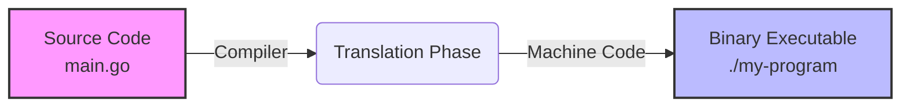
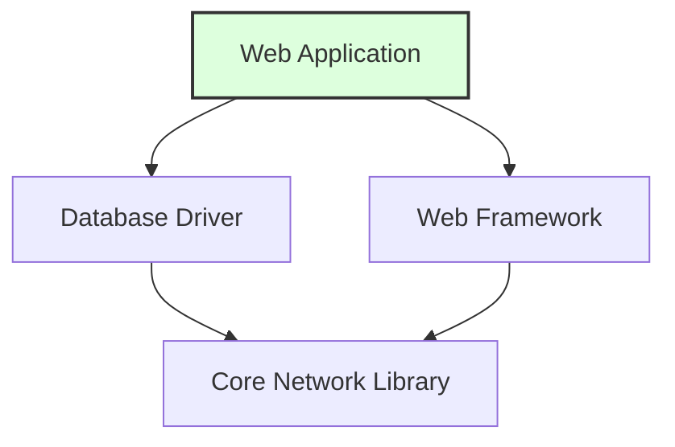

> **Complexity**: `[QUICK]` - Absolute beginner
>
> **Time to Complete**: 25-30 minutes
>
> **Prerequisites**: [Module 0.7: What is Networking?](/prerequisites/zero-to-terminal/module-0.7-what-is-networking/) — You should be comfortable with the terminal, files, and basic networking concepts.

---

## What You'll Be Able to Do

After this module, you will be able to:
- **Execute** software installations from the terminal using your OS's package manager
- **Analyze** the differences between package managers (apt, brew, dnf) to determine the right tool for a given operating system
- **Evaluate** the security and stability implications of updating or removing packages in a system
- **Diagnose** dependency requirements by extracting information about installed packages

---

## Why This Module Matters

To work with Kubernetes, Docker, and cloud tools, you'll need to **install software** on your computer — not by downloading installers from websites and clicking "Next, Next, Finish," but by typing a single command in the terminal.

This module teaches you how software works, what package managers are, and how to install your first tools from the command line. These are skills you'll use literally every day in engineering.

---

## What is Software?

Let's start from the very beginning.

**Software** is a set of instructions that tells a computer what to do. When you open a web browser, play a video, or run a command in the terminal — software is making it happen.

Software is written by humans in **programming languages** — languages like Python, Go, Java, or JavaScript that are designed to be readable by both humans and computers (sort of).

Here's a tiny example in Python:

```python
print("Hello, World!")
```

That's software. One line that tells the computer: "Display the text Hello, World! on the screen."

> Kitchen analogy: Software is a **recipe**. It's the instructions for making a dish. The computer is the chef that follows the recipe exactly as written. Programming languages are the language the recipe is written in (English, French, etc.).

---

## From Source Code to Running Program

> **Stop and think**: If a computer's processor only understands binary (1s and 0s), how can it execute a recipe written in human-readable words? Consider what must happen between writing the code and running it.

There's a journey every piece of software takes from "words typed by a human" to "something your computer can run":

### Step 1: Source Code

This is what programmers write. It looks like text:

```go
package main

import "fmt"

func main() {
    fmt.Println("Hello from Go!")
}
```

You can read it (more or less). Your computer cannot run it directly.

### Step 2: Compilation (For Some Languages)

Some languages need to be **compiled** — translated from human-readable code into **machine code** (binary — the 1s and 0s your computer's processor understands).

```
Source Code  →  Compiler  →  Binary (executable)
(recipe)        (translator)  (the finished dish, ready to serve)
```



The result is called a **binary** or **executable** — a file your computer can actually run.

> Kitchen analogy: Source code is the recipe on paper. Compilation is the cooking process. The binary is the finished dish, plated and ready to eat.

### Step 3: Execution

You **run** (execute) the binary, and the computer follows the instructions.

```bash
$ ./my-program
Hello from Go!
```

> Not all languages need compilation. Python, for example, is **interpreted** — it reads and runs the code line by line, like a chef reading the recipe one step at a time while cooking. Languages like Go, C, and Rust are compiled first, then run — like a chef prep-cooking everything beforehand.

---

## What is a Package?

> **Pause and predict**: If you had to install a program without a graphical installer, what manual steps would you need to take to get the source code, translate it, and place it in the right directory?

Installing software from source code is complicated. You'd need to:

1. Download the source code
2. Install the right compiler
3. Compile it
4. Move the binary to the right place
5. Hope nothing went wrong

A **package** wraps all of that up into a neat bundle. It's the source code, already compiled (usually), bundled with instructions for where to install it and what else it needs.

> Kitchen analogy: A package is a **meal kit** (like Blue Apron or HelloFresh). Instead of going to the grocery store, finding every ingredient, and figuring out quantities, someone has bundled everything together for you. Just open the box and follow the simple instructions.

---

## What is a Package Manager?

A **package manager** is a tool that downloads, installs, updates, and removes packages for you. It's like an **app store** for your terminal.

Instead of visiting a website, downloading a file, and clicking through an installer, you type one command:

```bash
$ sudo apt install htop       # On Ubuntu/Debian Linux
$ brew install htop            # On macOS
```

And the package manager:
1. Finds the package in its catalog
2. Downloads it
3. Installs it
4. Sets it up so you can use it

### Common Package Managers

| Package Manager | Operating System | Install Command |
|----------------|-----------------|-----------------|
| **apt** | Ubuntu, Debian (Linux) | `sudo apt install package-name` |
| **dnf** / **yum** | Fedora, RHEL, CentOS (Linux) | `sudo dnf install package-name` |
| **brew** (Homebrew) | macOS (and Linux) | `brew install package-name` |
| **pacman** | Arch Linux | `sudo pacman -S package-name` |
| **choco** | Windows | `choco install package-name` |

> In this curriculum, we'll mostly use **apt** (for Linux) and **brew** (for macOS) because they are common choices on the platforms we'll use.

---

## What is `sudo`?

You'll notice some commands start with `sudo`. This is important.

**`sudo`** stands for **"superuser do"** — it runs a command with **administrator privileges**.

Your computer has a safety system: regular users can't install software system-wide, change system files, or do anything that might break the computer. This is on purpose. It prevents accidents and keeps your system secure.

But installing software requires writing files to system directories that regular users can't touch. So you use `sudo` to temporarily become the **superuser** (also called **root** — the all-powerful administrator account).

```bash
$ apt install htop              # Error: permission denied
$ sudo apt install htop         # Works (asks for your password)
```

> **Pause and predict**: What exactly happens if you run `apt install tree` on a Linux system without `sudo`? Don't just guess—try running it and read the exact error message the system gives you.

When you type `sudo`, you'll be asked for your password. This is your user password — the same one you use to log in. When you type it, you won't see any characters appear on screen (no dots, no stars, nothing). This is normal and intentional — it prevents someone looking over your shoulder from counting characters. Just type your password and press Enter.

> Kitchen analogy: `sudo` is like the **manager's key**. Most staff can work in the kitchen, but to access the supply room or change the thermostat, you need the manager's key. `sudo` gives you that key temporarily.

### On macOS with Homebrew

Homebrew (`brew`) is designed so that you usually **don't need `sudo`**. It installs packages into your user space, not system directories. This is one reason Homebrew is popular — less fiddling with permissions.

```bash
$ brew install htop             # Works without sudo on macOS
```

---

## Dependencies: Software That Needs Other Software

Software rarely works alone. Most programs need other programs or libraries to function. These are called **dependencies**.

For example:
- A web application might depend on a database
- A command-line tool might depend on a specific library
- A Python program depends on Python being installed



> Kitchen analogy: Dependencies are like **ingredients for ingredients**. To make the special sauce, you need mayonnaise. But to make mayonnaise, you need eggs and oil. The eggs and oil are dependencies of the mayonnaise, which is itself a dependency of the special sauce.

### Why Dependencies Matter

**The good news**: Package managers handle dependencies automatically. When you install a package, the package manager also installs everything that package needs.

```bash
$ sudo apt install some-program
Reading package lists... Done
The following additional packages will be installed:
  dependency-1 dependency-2 dependency-3
```

The package manager figures out the whole chain of dependencies and installs them all. You don't need to track them down yourself.

**The less-good news**: Sometimes dependencies conflict with each other. Program A needs version 1.0 of a library, but Program B needs version 2.0. This is called **dependency hell**, and it's one of the problems that containers (which you'll learn about soon) were invented to solve.

> **Stop and think**: Imagine you are setting up a server. Program A strictly requires `libfoo` version 1.0. Program B strictly requires `libfoo` version 2.0. If your operating system only allows one version of a library to be installed globally, which would you install first and why? This kind of dependency conflict is one reason engineers use containers, which you will learn about soon, because containers can give each program a more isolated set of dependencies.

---

## Installing Your First Packages

Let's install some useful tools. Follow the instructions for your operating system.

### Updating the Package List

> **Pause and predict**: Why do you think you need to run `update` before `install`? Think about it: the package manager has a local catalog of what's available. But new versions come out every day. If you install without updating, you might get an old version — or fail entirely because the catalog doesn't know about the package yet.

Before installing anything, update your package manager's catalog. Think of it as refreshing the list of what's available:

**Ubuntu/Debian Linux:**

```bash
$ sudo apt update
```

This doesn't install or change anything — it just downloads the latest list of available packages and their versions.

**macOS:**

First, if you don't have Homebrew installed yet, install it now:

```bash
# First, install Homebrew (macOS only — skip if you already have it)
/bin/bash -c "$(curl -fsSL https://raw.githubusercontent.com/Homebrew/install/HEAD/install.sh)"
```

> This may take a few minutes. It will ask for your password (the one you use to log into your Mac).

Once Homebrew is installed, update it:

```bash
$ brew update
```

### Installing `htop` — A System Monitor

`htop` is a visual tool that shows you what programs are running on your computer, how much CPU and memory they're using, and more.

**Ubuntu/Debian Linux:**

```bash
$ sudo apt install htop
```

**macOS:**

```bash
$ brew install htop
```

Now run it:

```bash
$ htop
```

You'll see a colorful display showing CPU usage, memory usage, and running processes (programs). This is like looking at the kitchen's order board — you can see everything that's happening at once.

**Press `q` to quit htop.**

### Installing `tree` — A Directory Visualizer

Remember how we created directories in Module 0.4? `tree` shows directory structures in a beautiful visual format.

**Ubuntu/Debian Linux:**

```bash
$ sudo apt install tree
```

**macOS:**

```bash
$ brew install tree
```

Now try it:

```bash
$ tree ~/kubedojo-practice
```

You should see something like:

```
/home/yourname/kubedojo-practice
└── recipes
    ├── appetizers
    │   └── bruschetta.txt
    ├── desserts
    │   └── tiramisu.txt
    └── main-courses
        └── pasta-carbonara.txt
```

(If you completed the exercise in Module 0.4. If not, `tree` still works — just try it on any directory.)

---

## Updating and Removing Software

### Updating All Installed Packages

Over time, the software on your computer gets updates — bug fixes, security patches, new features. You should update regularly.

**Ubuntu/Debian Linux:**

```bash
$ sudo apt update              # Refresh the package list
$ sudo apt upgrade             # Install available updates
```

You can combine them:

```bash
$ sudo apt update && sudo apt upgrade
```

The `&&` means "run the second command only if the first one succeeds." Think of it as: "Refresh the list AND THEN install updates."

**macOS:**

```bash
$ brew update && brew upgrade
```

### Why Updates Matter: A War Story

A well-known lesson from software security is that delaying a patch for a known vulnerability can lead to a major breach, large legal costs, and long-term reputational damage. In the engineering world, running package upgrades isn't just about getting new features; it's a critical security responsibility.

> **Stop and think**: If updates are so important, why not just set servers to auto-update every night? In production environments, an unexpected update can break your application. If a library your code depends on changes its behavior in a new version, your app might crash in the middle of the night. This is why engineers carefully test updates in a staging environment before applying them to production servers.

### Removing Software

**Ubuntu/Debian Linux:**

```bash
$ sudo apt remove package-name
```

**macOS:**

```bash
$ brew uninstall package-name
```

### Searching for Packages

Not sure what a package is called?

**Ubuntu/Debian Linux:**

```bash
$ apt search keyword
```

**macOS:**

```bash
$ brew search keyword
```

---

## Did You Know?

> 1. **Homebrew was created to give macOS users an easier package-management workflow.** It became a major open-source project, and its beer-themed terminology includes names like "formulae" and "Cellar."
>
> 2. **The `apt` package manager gives Ubuntu users access to a very large catalog of packages.** From text editors to databases to scientific tools, one package-management workflow can install a wide range of software.
>
> 3. **The concept of `sudo` came from a real security need.** It was created so trusted users could run selected commands as root without sharing the root password, and modern `sudo` can log privileged actions for later auditing.
>
> 4. **The phrase "dependency hell" is a widely used technical term.** It describes conflicts where one program needs a different dependency version than another program on the same system.

---

## Common Mistakes

| Mistake | What Happens | Fix | Real-World Consequence |
|---------|-------------|-----|------------------------|
| Forgetting `sudo` on Linux | `Permission denied` or `Operation not permitted` | Add `sudo` before the command: `sudo apt install ...` | The installation fails, leaving you unable to use the required tool. |
| Using `sudo` with `brew` on macOS | Homebrew warns you or things install wrong | Don't use `sudo` with `brew` — it doesn't need it | You can break Homebrew's file permissions, requiring tedious manual fixes to install tools in the future. |
| Not running `apt update` first | Might install an old version or not find the package | Always run `sudo apt update` before installing on Linux | You might install software with a known security vulnerability, or the installation may fail entirely. |
| Typo in package name | `Unable to locate package htoop` | Check the spelling or use `apt search` / `brew search` to find the right name | You might accidentally install a malicious package created by a hacker hoping for that exact typo ([typosquatting](https://owasp.org/www-project-top-10-ci-cd-security-risks/CICD-SEC-03-Dependency-Chain-Abuse)). |
| Not reading the output | Missing important warnings or errors | Read what the terminal tells you! It often explains exactly what went wrong | You might believe a critical security tool installed successfully when it actually failed silently, leaving your system exposed. |
| Pressing Enter during password prompt without typing anything | Authentication failure | Type your password (you won't see characters) and then press Enter | You waste time retrying commands and could potentially lock out your account if you fail too many times. |

---

## Quiz

**Question 1**: You just joined a new company and need to install Node.js, PostgreSQL, and Redis on your work laptop. Your colleague tells you to "just go to their websites and download the installers." Why might using a package manager be a better engineering approach for this setup?

<details>
<summary>Show Answer</summary>

Using a package manager is vastly more efficient and maintainable than manual downloads. A package manager acts as a centralized app store for your terminal, allowing you to install all three tools with just one or two commands. It also handles downloading any hidden dependencies automatically, ensuring the software works right away without missing components. Furthermore, when updates or security patches are released, you can update all your tools at once with a single command instead of revisiting three separate websites.

</details>

**Question 2**: Troubleshooting Scenario: You are logged into a Linux server as a standard user and attempt to install a monitoring tool by running `apt install htop`. The terminal returns a "Permission denied" error. Why did the system block this action, and what command structure should you use to resolve it?

<details>
<summary>Show Answer</summary>

The system blocked the action because installing software requires writing to system-level directories, which is restricted to prevent unauthorized or accidental modifications by standard users. To resolve this, you must prepend your command with `sudo` (e.g., `sudo apt install htop`), which temporarily grants you superuser or root privileges. This mechanism forces you to explicitly authenticate and confirm that you intend to make an administrative change, thereby protecting the system's integrity.

</details>

**Question 3**: You try to install a simple command-line weather app, but the package manager output shows it's also downloading 15 other packages, including something called `python3-requests`. Why is the package manager downloading all these extra tools you didn't ask for?

<details>
<summary>Show Answer</summary>

The extra packages are dependencies that the weather app needs in order to function correctly. Software rarely works in isolation; developers rely on existing libraries to handle tasks like making network requests instead of writing that code from scratch. The package manager is doing its job by automatically identifying, downloading, and installing these prerequisites so that the weather app works seamlessly right out of the box. Without this automated dependency resolution, you would have to manually track down and install all 15 libraries yourself.

</details>

**Question 4**: Troubleshooting Scenario: A security bulletin announces a critical vulnerability in the `curl` tool, and you are instructed to patch it immediately. You run `sudo apt upgrade curl`, but the terminal reports that `curl is already the newest version`, even though you know the patch was released hours ago. Why is the package manager failing to install the patch, and how do you fix this workflow?

<details>
<summary>Show Answer</summary>

The package manager is failing to install the patch because it is relying on a stale local catalog of available software versions. The `upgrade` command only installs newer versions of packages that it already knows about in its local database. To fix this workflow, you must first run `sudo apt update` to download the latest package index from the remote repositories. Once the local catalog is refreshed with the knowledge of the new patch, running the upgrade command will successfully download and apply the security fix.

</details>

**Question 5**: You are screensharing with a junior developer to help them fix an issue. You tell them to run a command with `sudo`. They type their password, but then immediately stop and say, "My keyboard is broken, nothing is typing." How do you explain what is happening and why the system behaves this way?

<details>
<summary>Show Answer</summary>

The system is intentionally hiding the keystrokes as a built-in security feature. Unlike web browsers that show asterisks or dots, the terminal displays absolutely nothing when typing passwords. This prevents anyone looking over your shoulder or watching a screenshare from knowing the exact length of your password. You should tell the junior developer to confidently type their full password and press Enter, reassuring them that the computer is indeed receiving their input.

</details>

**Question 6**: Troubleshooting Scenario: You run `sudo apt install nginx` to install a web server on a brand new Linux machine, but the terminal immediately outputs: `E: Unable to locate package nginx`. You know for a fact that `nginx` is a valid package name. What is the most likely cause of this error, and what command should you run to fix it?

<details>
<summary>Show Answer</summary>

The most likely cause is that the local catalog of available packages is completely empty or outdated because this is a brand new machine. The package manager does not yet know where to download the package from because it has not synced with the remote software repositories. To fix this, you must first run `sudo apt update` to download the latest package index. Once the catalog is refreshed, running the install command again will successfully locate and download the package.

</details>

---

## Hands-On Exercise: Your First Software Installations

### Objective

Use your package manager to install, run, and explore new software from the terminal.

### Steps

1. **Update your package manager:**

On Ubuntu/Debian Linux:
```bash
$ sudo apt update
```

On macOS:
```bash
$ brew update
```

2. **Install htop:**

On Ubuntu/Debian Linux:
```bash
$ sudo apt install htop -y
```

On macOS:
```bash
$ brew install htop
```

The `-y` flag (on apt) means "yes to all prompts" — it automatically confirms the installation without asking "Are you sure? [Y/n]".

3. **Run htop and explore:**

```bash
$ htop
```

Observe:
- The CPU usage bars at the top
- The memory usage bar
- The list of running processes
- Each process has a PID (Process ID — a unique number)

Press `q` to quit.

4. **Install tree:**

On Ubuntu/Debian Linux:
```bash
$ sudo apt install tree -y
```

On macOS:
```bash
$ brew install tree
```

5. **Use tree to visualize a directory:**

```bash
$ tree ~/kubedojo-practice
```

If you don't have `kubedojo-practice`, try:

```bash
$ tree ~ -L 1
```

The `-L 1` flag means "only show 1 level deep" — useful for large directories.

6. **Check what's installed:**

On Ubuntu/Debian Linux:
```bash
$ apt list --installed | head -20
```

On macOS:
```bash
$ brew list
```

7. **Search for a package:**

On Ubuntu/Debian Linux:
```bash
$ apt search "system monitor"
```

On macOS:
```bash
$ brew search "monitor"
```

8. **Check the version of an installed tool:**

```bash
$ htop --version
```

Most programs support `--version` or `-v` to show their version number. This is useful when troubleshooting: "Which version of this tool do I have?"

### Stretch Challenge: Dependency Investigation

Software relies on other software. Let's trace a dependency chain to see how interconnected things are.

1. Pick a package you just installed (like `tree` or `htop`).
2. Run `apt show htop` (on Linux) or `brew info htop` (on macOS).
3. Look at the output and find the "Depends" or "Dependencies" section.
4. Pick one of those dependencies and run the `apt show` or `brew info` command on it to see what *it* depends on.

Understanding how to inspect a package before installing it is a critical skill for evaluating the security footprint and bloat of new tools.

### Success Criteria

You've completed this exercise when you can:

- [ ] Update your package manager
- [ ] Install `htop` and run it (and quit with `q`)
- [ ] Install `tree` and use it to display a directory
- [ ] Search for packages by keyword
- [ ] Check the version of an installed tool
- [ ] Inspect a package's dependencies (Stretch Challenge)

---

> You just used a tool that senior engineers use every day. You belong here.

---

## What's Next?

You now know how software gets from code to a running program, how to install tools with a package manager, and what `sudo` does. Your terminal toolkit is growing.

From here, you have the foundation to start learning about containers, cloud computing, and eventually Kubernetes. Every tool in the Kubernetes ecosystem — `kubectl`, `helm`, `kind`, `docker` — gets installed exactly the way you just learned.

**Continue to**: [Module 0.9: What is the Cloud?](/prerequisites/zero-to-terminal/module-0.10-what-is-the-cloud/) — Learn what the cloud actually is, how data centers work, and why companies rent servers instead of buying them.

## Sources

- [OWASP CI/CD-SEC-03: Dependency Chain Abuse](https://owasp.org/www-project-top-10-ci-cd-security-risks/CICD-SEC-03-Dependency-Chain-Abuse) — Explains supply-chain risks including malicious dependency publication and lookalike-package attacks.
- [MDN: Package management basics](https://developer.mozilla.org/en-US/docs/Learn_web_development/Extensions/Client-side_tools/Package_management) — Good beginner-friendly background on what packages, registries, and dependency management are.
- [Wikipedia: Package manager](https://en.wikipedia.org/wiki/Package_manager) — Useful overview of what package managers do across operating systems and ecosystems.
- [Wikipedia: Dependency hell](https://en.wikipedia.org/wiki/Dependency_hell) — Gives beginners extra context for the dependency-conflict problem introduced in this module.
