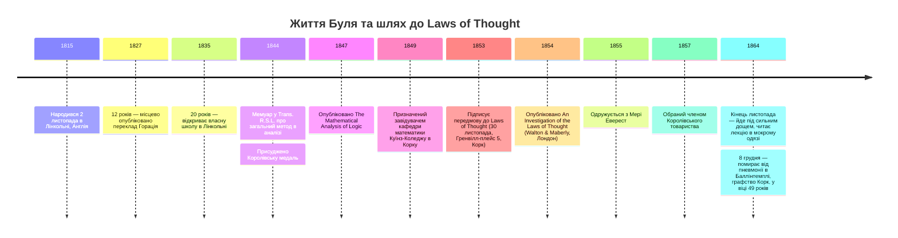

:::tip[В одному абзаці]
1854 року математик-самоук із Лінкольна Джордж Буль опублікував працю *An Investigation of the Laws of Thought*, доводячи, що саме міркування підкоряється математичним законам. З невеликого символьного словника він збудував на папері числення класів і висловлювань. Його часткове трактування додавання згодом стало тією точкою напруги, з якої постала сучасна булева алгебра.
:::

<strong>Дійові особи</strong>

| Ім'я | Роки життя | Роль |
|---|---|---|
| Джордж Буль | 1815–1864 | Математик-самоук із Лінкольна; завідувач кафедри математики Куїнз-Коледжу в Корку (1849); автор праці *An Investigation of the Laws of Thought* (1854). |
| Мері Еверест Буль | 1832–1916 | Дружина Буля (одружилися 1855); після його смерті — бібліотекарка Куїнз-Коледжу в Лондоні; педагогиня математики; винахідниця «вишивання кривих». |
| Огастес Де Морган | 1806–1871 | Лондонський математик; майже сучасник і свідок Булевої праці; зафіксовано, що він написав, що Буль «вхопив справжній зв'язок між алгеброю та логікою». |
| Дункан Ф. Грегорі | 1813–1844 | Перший редактор *Cambridge Mathematical Journal*; допоміг Булю надрукувати його ранні математичні праці. |
| Джон Раялл | — | Віцепрезидент і професор грецької мови Куїнз-Коледжу в Корку; особа, якій присвячено *Laws of Thought*; дядько Мері Еверест по материнській лінії. |
| Вільям Стенлі Джевонс | 1835–1882 | Британський логік, який 1864 року переозначив `+` як інклюзивну диз'юнкцію, відмовився від Булевої системи й побудував те, що науковці називають першою версією сучасної булевої алгебри. |

<strong>Хронологія (1815–1864)</strong>

<strong>Словник простими словами</strong>

- **Алгебра логіки** — система, у якій логічне міркування виконується маніпулюванням символами так само, як арифметична алгебра виконує числове міркування. Книга Буля 1854 року — її засадничий текст.
- **Клас** — у Булевому словнику це сукупність об'єктів, яку виокремлює певна назва. «Люди» — це клас; «білі речі» — це клас; «білі вівці» — це клас об'єктів, що належать до обох.
- **Числення (у Булевому розумінні)** — не диференціальне числення. Буль уживає це слово в його давнішому значенні: система символьних обчислень, метод переходу від засновків до висновків через механічне маніпулювання знаками.
- **Універсум міркування** — клас, що містить кожен об'єкт в обговорюваній області. Буль приписав йому символ $1$, а його протилежності, порожньому класу («Ніщо»), — $0$.
- **Закон двоїстості / закон ідемпотентності** — Булева назва для рівняння $x^2 = x$: перетин будь-якого класу із самим собою повертає клас незмінним. Сучасну назву «закон ідемпотентності» дав гарвардський математик Бенджамін Пірс 1870 року.
- **Строго-диз'юнктне додавання** — у Булевій системі 1854 року $x + y$ було означене лише для класів, що не мають спільного члена. Для перекривних класів він окремо писав $x + y(1 - x)$ як обхідний прийом. Джевонс згодом замінив часткове $+$ на інклюзивне (за якого $x + x = x$), і за ним пішла сучасна булева алгебра.

<strong>Математика, за потреби</strong>

Уся символьна система Буля в *Laws of Thought* тримається на короткому переліку рівнянь.

- **Закон двоїстості (фундаментальне рівняння):** $x^2 = x$. Перетин будь-якого класу із самим собою дає клас незмінним. Буль ототожнив це з алгебраїчною формою арістотелівського принципу суперечності.
- **Доповнення (логічне НЕ):** $1 - x$. Віднімання від універсального класу дає клас усього, що не входить до $x$.
- **Суперечність:** $x(1 - x) = 0$. Рівносильне $x^2 = x$ через розкриття. Жоден об'єкт не належить водночас до класу й до його доповнення.
- **Строго-диз'юнктна сума:** $x + y$ — означене лише тоді, коли $x$ та $y$ не мають спільного члена. Рівняння (3) розділу II §11.
- **Обхідний прийом для включного АБО:** $x + y(1 - x)$ — власна побудова Буля (розділ IV §§7–8) для випадку, коли два класи перекриваються: $x$ плюс та частина $y$, що ще не лежить усередині $x$.
- **Переформулювання Джевонса 1864 року:** $x + x = x$. Досяжне лише через переозначення $+$ як інклюзивної диз'юнкції. Буль відкинув цей крок у листуванні; Джевонс відмовився від Булевої системи й побудував на новому означенні першу версію сучасної булевої алгебри.

Джордж Буль народився 2 листопада 1815 року в невеликому соборному місті Лінкольн, що в Лінкольнширі, Англія. Його батько був ремісником дуже скромних статків, чиїми справжніми й серйозними захопленнями були заняття математикою та виготовлення оптичних приладів. У родині, де формальні академічні шляхи були фінансово недосяжними, старший Буль навчав сина елементарної математики й користування оптичними приладами. Приязний книгар із Лінкольна допомагав хлопцеві з латинською граматикою, але поза цими початковими основами молодший Буль був цілковито самоуком. У дванадцять років його віршований переклад оди Горація надрукував гордий батько в місцевому лінкольнському часописі — досягнення, яке спонукало сусіднього вчителя написати до редакції й публічно заперечити, що переклад такої якості міг створити настільки юний автор.

У віці від шістнадцяти до двадцяти років Буль працював помічником учителя — спершу в Донкастері у Йоркширі, а потім у Ваддінгтоні поблизу Лінкольна. Свої нечисленні години дозвілля він присвячував вивченню сучасних мов і патристичної літератури, самотужки опановуючи грецьку, німецьку та французьку. У двадцять років, щоб утримувати літніх батьків, він відкрив власну школу в Лінкольні. Попри щоденні вимоги шкільного викладання, інтелектуальний фокус Буля рішуче повернувся до математики. Працюючи самостійно з французьким оригіналом, він узявся вивчати *Mécanique céleste* П'єра-Симона Лапласа та *Mécanique analytique* Жозефа-Луї Лагранжа. З ретельних нотаток, які він робив, опрацьовуючи Лагранжа, почав вимальовуватися його перший математичний мемуар.

Невдовзі він знайшов прихильника — Дункана Ф. Грегорі, першого редактора *Cambridge Mathematical Journal*, який допоміг провінційному вчителеві надрукувати його ранні праці. Грегорі та інші в кембриджському колі визнали талант Буля й порадили йому пройти звичайний математичний курс в університеті. Буль відмовився; він не міг дозволити собі залишити батьків чи школу, яка їх утримувала. Працюючи цілком поза університетською системою, він подав мемуар про загальний метод в аналізі — застосування алгебраїчної техніки «відокремлення символів» до диференціальних рівнянь зі змінними коефіцієнтами, — який було опубліковано 1844 року в *Transactions of the Royal Society of London*. Стаття принесла йому Королівську медаль. Через три роки, 1847-го, він видав тоненький том під назвою *The Mathematical Analysis of Logic* — свою першу спробу в алгебрі міркувань.

Цей тоненький том з'явився з конкретного приводу. Сер Вільям Гамільтон з Единбурга й Огастес Де Морган з Лондона публічно сперечалися про те, що згодом назвали *квантифікацією предиката* — чи має логіка формально розрізняти «всі люди смертні» та «всі люди є деякими смертними», — і ця суперечка надала давно затихлому питанню про логіку-як-алгебру нової актуальності. *The Mathematical Analysis of Logic* Буля відповів на технічне питання, трактуючи саму логіку як алгебру, у якій проблема квантифікації розчинялася в рутині символьних маніпуляцій. Де Морган був найкваліфікованішим британським сучасником-свідком того, що намагався зробити Буль. У листі до сера Вільяма Роуена Гамільтона — ірландського математика, а не единбурзького філософа з суперечки про квантифікацію, — який зберіг Макфарлейн десь шістдесят три роки потому, Де Морган написав, що буде «радий побачити його працю виданою, бо він, гадаю, вхопив справжній зв'язок між алгеброю та логікою». Ця фраза — приватний комплімент колезі — є тим найближчим, що дає підтверджений запис до тогочасного вердикту про те, що Буль збирався опублікувати.

1849 року життя Буля докорінно змінилося, коли його призначили завідувачем кафедри математики щойно заснованого Куїнз-Коледжу в Корку, Ірландія. Куїнз-Коледж у Корку був одним із трьох позаконфесійних коледжів (разом із Белфастом і Голвеєм), заснованих 1849 року згідно з Актом про Куїнз-коледжі 1845 року, у країні, де наявні університетські заклади — Триніті-Коледж у Дубліні та Мейнут — мали конфесійний характер. Коледж дав Булю інституційний дім, постійну платню й час, якого він ніколи не мав у Лінкольні. Саме там, наприкінці 1853 року, сидячи за своїм столом на Гренвілл-плейс, 5, у Корку, Буль підписав передмову до книги, яку готував роками.

## Числення класів

1854 року лондонська фірма Walton & Maberly опублікувала *An Investigation of the Laws of Thought, on which are founded the Mathematical Theories of Logic and Probabilities*. Книгу було присвячено докторові Джонові Раяллу, віцепрезидентові й професорові грецької мови Куїнз-Коледжу в Корку. У вступному розділі Буль виклав амбітну, об'єднавчу заяву про задум: «дослідити фундаментальні закони тих операцій розуму, якими здійснюється міркування; виразити їх символьною мовою Числення».

У розділі II — «Про знаки загалом і про знаки, властиві науці логіки зокрема» — Буль заклав інфраструктуру своєї системи на друкованій сторінці. Твердження I, у четвертому параграфі, дає перелік його власними словами: «Усі операції Мови як інструмента міркування можуть здійснюватися системою знаків, що складається з таких елементів» — по-перше, літерні символи, як-от $x$ та $y$, що позначають речі або класи речей; по-друге, знаки операцій — $+$, $-$ і $\times$, — якими ці поняття поєднуються чи розкладаються; по-третє, знак тотожності, $=$. Три класи елементів, третій із них — єдиний символ. Усе числення буде збудоване з цього короткого переліку.

Крок, від якого залежить решта книги, — це перехід від *імені* до *класу*. Буль почав зі слів. Іменник «люди» виокремлює в мові тих осіб, що підпадають під цю назву; прикметник «добрий» у виразі «добрі речі» виокремлює об'єкти, до яких застосовна ця якість. Першим формальним кроком Буля було трактувати обидва — і іменник, і прикметник — як такі, що виокремлюють той самий різновид сутності: клас, тобто сукупність об'єктів, на які вказує слово чи поєднання слів. Щойно іменник і прикметник почали однаково позначати класи, операції мови стали операціями над класами, а операції над класами допускали алгебру. Цей стрибок малий за формою й величезний за наслідками: це той поворот, що уможливлює все подальше в книзі.

Буль продемонстрував це на прикладі, який стане його найвідомішим розв'язаним зразком. «Нехай $x$ позначає „усіх людей“, або клас „люди“», — написав він у параграфі 6 розділу II. Якщо $x$ саме по собі означає «білі речі», а $y$ означає «вівці», то нехай $xy$ означає «білі вівці». Ця операція множення відповідала логічному перетину двох класів, збираючи лише ті об'єкти, до яких застосовні обидві назви. З цього означення Буль швидко вивів, як рівняння (1) параграфа 7, що множення літерних символів комутативне: $xy = yx$. Порядок, у якому розум подумки поєднує «біле» та «вівці», не змінює отриманого класу. Доведення спирається не на огляд, а на зміст самого перетину: річ належить до «білих овець» тоді й лише тоді, коли вона належить до «овець, що є білими», бо обидва вирази виокремлюють ті самі об'єкти у світі.

Однак, коли Буль перейшов до додавання, він увів обмеження, яке визначить межі його початкової системи. У параграфі 11 розділу II він наполягав, що «слова „і“, „або“, вставлені між термінами, що описують два чи більше класів об'єктів, означають, що ці класи цілком відмінні, так що жоден член одного не трапляється в іншому». На думку Буля, звичайна мова, вжита в строгому сенсі, не зливала перекривні класи під одним сполучником; «усі чоловіки й усі жінки в кімнаті» означало дві групи, що не перекриваються, а не категорію, яка двічі рахувала б того, хто якось належав би до обох. Відповідно, у Булевому численні 1854 року додавання $x + y$ було *частковою* операцією. Рівняння (3) — $x + y = y + x$ — було чинним, але лише тоді, коли класи були взаємно виключними. Булів символ $+$ не був сучасним інклюзивним АБО; він був строго диз'юнктним.

Ціна цього обмеження проявиться в розділі IV, коли Булю довелося будувати окрему форму для інклюзивного випадку, і знову десять років потому, коли молодший логік сів писати Булю листа про це.

## Два символи, один закон

Визначивши елементи, Буль у розділі III, «Виведення законів», перейшов до питання про те, які числові інтерпретації сумісні з його численням. Ще опрацьовуючи розділ II, він помітив, що літерні символи його системи універсально підпорядковані дивному рівнянню: $x \cdot x = x$, або у звичнішому скороченні $x^2 = x$. Рівняння стверджує, що перетин будь-якого класу із самим собою повертає клас незмінним — і це правда за самим змістом перетину, адже речі, які є водночас *людьми* й *людьми*, — це просто речі, які є *людьми*. Але $x^2 = x$ *не* є тотожністю у звичайній алгебрі чисел. Якщо $x$ — число, рівняння $x^2 = x$ задовольняють лише $x = 0$ та $x = 1$. Із цього зіткнення числення й числової системи Буль зробив разючий висновок: символи логіки, якщо їх взагалі тлумачити числово, можуть набувати лише цих двох значень. Він приписав їх на межах обсягу класу. Твердження II розділу III подає це приписування простою прозою: «відповідні інтерпретації символів 0 та 1 в системі Логіки — це Ніщо й Універсум». Нуль — це порожній клас, клас, до якого не належить жоден об'єкт; одиниця — це універсум міркування, клас, що містить усе в розглядуваній області. Якщо $x$ позначає будь-який клас об'єктів, то Буль у Твердженні III означив логічне доповнення як $1 - x$ — «протилежний, або додатковий, клас об'єктів, тобто клас, що включає всі об'єкти, які не охоплені класом $x$». Віднімання від універсального класу дає заперечення.

:::tip[Простими словами]
Буль не припускає наперед сучасну двійкову логіку й не міркує у зворотному напрямі. Він запитує, які значення звичайних чисел могли б підійти до числення класів, яке він щойно означив, і алгебра зводить відповідь до двох граничних випадків.
:::

З цих трьох означень — літерних символів класів, двох крайнощів 0 та 1 і доповнення $1 - x$ — постав наріжний камінь усього числення. У Твердженні IV Буль безпосередньо вивів наслідок. Якщо клас $x$ помножити на його протилежність $1 - x$, результат має бути порожнім, бо жоден об'єкт не може водночас належати до класу й лежати поза ним. Алгебраїчно $x(1 - x) = 0$, що розкривається до $x - x^2 = 0$, або $x^2 = x$. Буль ототожнив це фундаментальне рівняння з алгебраїчним виразом арістотелівського принципу суперечності. Щоб довести цей родовід, він у виносці процитував арістотелеву *Metaphysica* безпосередньо грецькою: у власному англійському переказі Буля — «Неможливо, щоб та сама якість водночас належала й не належала тій самій речі». Те, що Арістотель сформулював у діалектиці, Буль тепер сформулював як рівняння другого степеня.

Він пішов далі. Рівняння $x^2 = x$ Буль назвав «законом двоїстості» — це його власний винахід, прикріплений до рівняння в завершальному параграфі розділу III «з причин, які стають очевидними з наведеного вище обговорення». (Своєї сучасної назви, «закон ідемпотентності», воно набуде лише тоді, коли гарвардський математик Бенджамін Пірс перейменує його 1870 року, через шість років після смерті Буля.) Що важливіше, Буль доводив, що математична *форма* цього рівняння відкриває глибоку істину про людське пізнання. «Із того факту, що фундаментальне рівняння мислення має другий степінь, — писав Буль, — випливає, що ми здійснюємо операцію аналізу й класифікації через поділ на пари протилежностей, або, як кажуть технічно, через дихотомію». Це було власне Булеве обґрунтування двозначної логіки. Природний спосіб людського аналізу є двійковим не тому, що у світі є лише два різновиди речей, а тому, що алгебра, яка керує міркуванням, є *квадратною* — а квадратне рівняння має, загалом, два корені.

Буль розвинув цей аргумент у формі контрфактичного припущення, якому немає рівних у решті книги. Якби фундаментальне рівняння мало третій степінь, а не другий, писав він, «розумовий поділ мусив би бути потрійним за характером, і ми мусили б діяти через різновид трихотомії […], справжню природу якої нам, з нашими наявними здібностями, неможливо адекватно осягнути». Два значення — не домовленість. Вони є природним наслідком рівняння, яке Буль щойно вивів друком. Той, хто міркує, з нашими здібностями не може, за Булем, навіть уявити, на що було б схоже міркування за умови кубічного рівняння.

До кінця розділу III, менш ніж на двадцяти сторінках суцільного тексту, Буль завершив символьне ядро *Laws of Thought*. Він мав числення класів, два значення, три операції й один фундаментальний закон. *An Investigation of the Laws of Thought* налічує двадцять два розділи; перші три подають задум, числення та його закони, а решта дев'ятнадцять застосовують систему — до виключення змінних у системі висловлювань, до вторинних висловлювань, що складають його логіку висловлювань, і нарешті, у довгій другій половині книги, до науки про ймовірність. Ця структура протилежна сучасному підручнику логіки, де означення стислі, а застосування заповнюють том; у книзі Буля стислою є алгебра, а застосування і є томом. Те, що він збудував — на папері, у символах, — було достатньо повним, щоб людина-читач, озброєна олівцем, могла в принципі вивести наслідки будь-якої коректно сформованої системи засновків самими лише алгебраїчними маніпуляціями. Він збудував числення, а не машину.

## Проблема диз'юнктної суми

Строго-диз'юнктне додавання було обмеженням, і Буль сам це знав. У параграфах 7 та 8 розділу IV він подав ручний обхідний прийом для недиз'юнктного випадку. Ця побудова є в його власному тексті: коли класи, позначені $x$ та $y$, є виключними, пишемо $x + y$; коли вони не виключні, пишемо $x + y(1 - x)$. Друга формула — це інклюзивне АБО сучасного читача, вбране в незвичну нотацію. Прочитайте її повільно: $x$ плюс та частина $y$, що не лежить уже всередині $x$, — це точно об'єднання двох класів: кожен член $x$, кожен член $y$, який не входить також до $x$, і жодного подвійного рахування. Отже, ця побудова була присутня на власних сторінках Буля від 1854 року. Чого Буль *не* зробив, так це не переозначив свій фундаментальний символ $+$, щоб той означав об'єднання; часткова операція лишилася частковою, а обхідний прийом лишився обхідним прийомом. Він віддавав перевагу численню, у якому символ $+$ зберігав своє строге прочитання, а інклюзивний випадок був явним складеним виразом, — над численням, у якому $+$ мовчки поглинав би припущення про диз'юнктність, а алгебра набувала б трохи дивної тотожності $x + x = x$.

:::tip[Простими словами]
Уявіть два кола, що перекриваються, на діаграмі Венна. Щоб отримати сучасне об'єднання $x \cup y$ з трьох операцій Буля, заштрихуйте все коло $x$; потім заштрихуйте лише ту частину $y$, яка **ще не** заштрихована. Цей другий крок — це множник $(1 - x)$, «частина $y$ поза межами $x$». Формула $x + y(1 - x)$ збирає об'єднання як два шматки, що не перекриваються, і додає їх, що зберігає строге прочитання Булевого строго-диз'юнктного $+$.
:::

Буль також показав, що його алгебра не обмежується класифікацією об'єктів. Перші десять розділів *Laws of Thought* — те, що Буль називав «первинними висловлюваннями», — розвивають алгебру класів. Розділи XI та XII потім застосовують те саме числення до «вторинних висловлювань», тобто висловлювань про висловлювання. Первинне висловлювання стверджує відношення між класами («усі люди смертні»); вторинне висловлювання стверджує відношення між первинними висловлюваннями («якщо всі люди смертні і Сократ — людина, то Сократ смертний»). Те, що сучасні логіки й комп'ютерні науковці називають *логікою висловлювань*, упізнаване, у цьому строгому сенсі, у розділах XI та XII Булевої книги 1854 року. Поширене уявлення, нібито Буль винайшов лише алгебру класів, а комп'ютерним науковцям пізніше довелося наново відкривати логіку висловлювань деінде, хибне через замовчування; обидві системи існують пліч-о-пліч в одному томі й трактуються тим самим численням.

Стрибок від часткової алгебри Буля до того, що комп'ютерні науковці сьогодні називають булевою алгеброю, стався не Булевими руками, а руками наступного покоління. 1864 року — того самого, коли Буль потрапив під дощ, що його вбив, — британський логік Вільям Стенлі Джевонс написав Булю, пропонуючи невелику зміну задля спрощення: щоб символ $+$ переозначити як інклюзивну диз'юнкцію з наслідком $x + x = x$. Ця пропозиція сплощувала Булеву ретельну часткову операцію до тотальної. Буль її відкинув. У листуванні, що цитується у статті про його працю в *Stanford Encyclopedia of Philosophy*, Буль різко відповів, що «неправда, нібито в Логіці $x + x = x$». Джевонса це не спинило, і він цілком відмовився від Булевої системи. За кілька місяців він опублікував систему, у якій $+$ був інклюзивним за означенням, часткова операція зникла, а те, що сучасний огляд Стенлі Берріса називає «першою версією сучасної булевої алгебри», лягло на сторінку.

Подальший поступ можна датувати. 1864 року Джевонс відмовився від Булевого часткового $+$ і побудував інклюзивний. 1870 року гарвардський математик Бенджамін Пірс — батько Ч. С. Пірса — дав сучасну назву *закон ідемпотентності* тому, що Буль називав законом двоїстості. Від кінця 1860-х Ч. С. Пірс розширив Булеву алгебру до логіки відношень і раннього числення предикатів. Між 1890 та 1895 роками Ернст Шредер опублікував три томи свого *Vorlesungen über die Algebra der Logik* — праці, у якій булева алгебра Джевонса–Пірса–Шредера набула зрілої, енциклопедичної форми. Поширене уявлення, нібито Булева алгебра вісімдесят років спала недоторканою, перш ніж на початку двадцятого століття дістала інженерне тлумачення, за цим записом просто хибне; математичні логіки безперервно працювали над Булевим численням і проти нього впродовж усього цього періоду. Бракувало не роботи над булевою алгеброю, а її *інженерного тлумачення*, і ця відсутність — тема пізнішого розділу, а не цього.

На той час, коли Джевонсова ревізія почала поширюватися, життя Буля раптово добігало кінця. 1855 року, через рік після виходу *Laws of Thought*, він одружився з Мері Еверест. Вона була небогою доктора Джона Раялла — колеги з Корка, якому Буль присвятив свою книгу, — а також небогою сера Джорджа Евереста, колишнього генерального землеміра Індії, на честь якого 1865 року перейменують Пік XV у Гімалаях. Макфарлейн, спираючись на некролог Роберта Гарлі 1866 року в *Proceedings of the Royal Society*, пов'язує присвяту й одруження одним рядком, який звеселяє читачів відтоді й донині: «Наступного року, можливо, унаслідок присвяти, він одружився з міс Еверест, небогою того колеги». Подружжя оселилося в Корку й мало п'ятьох дочок. 1857 року математичні досягнення Буля дістали офіційне визнання, коли його обрали членом Королівського товариства.

Наприкінці листопада 1864 року — Британніка подає дату конкретно як 24 листопада, хоча Макфарлейн та архів MacTutor дають лише «один із днів 1864 року» — Буль ішов від своєї оселі до Куїнз-Коледжу в Корку під сильним дощем. Свідчення про відстань різняться: Макфарлейн і MacTutor кажуть про дві милі; Британніка — про три. Так чи інак, прогулянка була достатньо довгою, щоб подальша лекція в мокрому одязі мала значення. Прийшовши промоклим, Буль прочитав лекцію, не переодягнувшись. Застуда, яку він підхопив, невдовзі переросла, за висловом Макфарлейна, у «гарячкову застуду, що скоро впала йому на легені»; сучасний діагноз, поданий у *Stanford Encyclopedia of Philosophy* та в Британніці, — пневмонія. Джордж Буль помер у Баллінтемплі, графство Корк, 8 грудня 1864 року — Макфарлейн пише «на 50-му році життя», вікторіанська порядково-річна ідіома для чоловіка, якому було сорок дев'ять років і тридцять шість днів.

Мері Еверест Буль у ретроспективах інколи зображують як хранительку математичної спадщини чоловіка — терплячу опікунку його архіву, дружину, яка тримала його логічні теорії в академічному обігу. Перевірені відкриті джерела не підкріплюють цього трактування; вони розповідають іншу, хоч і не менш прикметну історію. Після смерті Буля родина переїхала до Лондона. За підтримки богослова Фредеріка Денісона Моріса Мері Еверест Буль обійняла посаду бібліотекарки в Куїнз-Коледжі в Лондоні — жіночому коледжі, який Моріс допоміг заснувати. Вона навчала математики жінок і дітей, спираючись на методи, які перейняла від такого собі месьє Депласа, що був її власним наставником у дитинстві. Вона винайшла те, що називала *вишиванням кривих*, — техніку отримання видимої обвідної кривої через прокладання прямих стібків між пронумерованими точками на картоні, метод, який дожив до класів початкової школи й знайомить дитину з поняттям дотичної ще до того, як стане досяжною мова математичного аналізу. Від 1880-х вона публікувала плідно: довгу низку книжок і брошур про філософію математичної освіти й про подеколи містичну філософію розуму. Трактування, нібито вона зберегла символьну логіку Джорджа Буля, — народна історія; її власна задокументована спадщина полягає в математичній педагогіці, а не у формальній алгебраїчній логіці.

Її сучасники подеколи вороже ставилися до тієї роботи, яку вона таки робила. Макфарлейн 1916 року відкинув одну з її книжок як «парадоксальну книжку хибного штибу». Цей розділ бере задокументовану версію її життя з біографічного запису *MacTutor* і відмовляється від сентиментальнішого трактування. Ця відмінність важлива, бо це перший розділ книги з історії ШІ, і стандарт доказовості, якого книга дотримуватиметься в пізніших розділах, — це стандарт, заданий тут. Її власна спадщина реальна й полягає в математичній освіті. Вона просто не полягає в збереженні Булевої логіки, і розділ прямо про це каже.

Джордж Буль лишив по собі числення класів і висловлювань, викарбуване цілком на папері й чорнилом. У вступному абзаці *Laws of Thought* він окреслив свій задум як дослідження «фундаментальних законів тих операцій розуму, якими здійснюється міркування» — науку про розум, рівну (а можливо, і вищу) тогочасній науці про ймовірність. У жодному місці книги він не пропонував побудови фізичних механізмів для виконання своїх рівнянь; текст не містить ані схем кіл, ані запропонованого приладу, ані передчуття обчислювальної машини. Робота, яку Джевонс, Чарльз Сандерс Пірс і Шредер зробили з численням за пів століття після смерті Буля, була логічною, а не інженерною — безперервною математичною діяльністю, а не дрімотою. Міст від цієї алгебри до фізичного приладу, що виконує міркування, пропускаючи електричний струм крізь дроти, належить пізнішому розділові; він потребує власних доказів та іншого складу дійових осіб. Розділ завершується, як завершується книга Буля, — численням.

:::note[Чому це досі важливо сьогодні]
Кожна цифрова схема, якою ви будь-коли користувалися, зводиться до AND, OR та NOT — операцій, символьне трактування яких починається тут. Пошукові запити, програмні умовні переходи й фільтри баз даних — усі вони виконують ланцюги булевих обчислень. Шлях від Булевої нотації до кремнію забирає ще пів століття математичної роботи й свіже інженерне осяяння; розділи, що далі, простежують його.
:::
