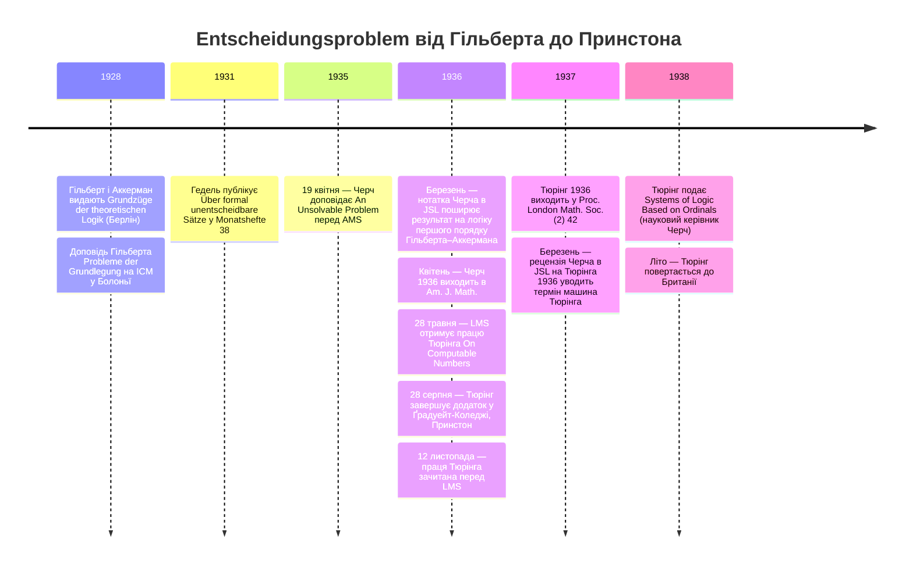

:::tip[В одному абзаці]
1936 року Алонзо Черч у Принстоні й Алан Тюрінг у Кембриджі незалежно довели нерозв'язність Гільбертової *Entscheidungsproblem* — вимоги механічної процедури, що вирішує вивідність будь-якої формули першого порядку. Доведення Черча через λ-числення першим дійшло до негативної відповіді; тюрінгова «обчислювальна машина», що зчитує паперову стрічку, дала другому доведенню його тривку метафору. У §6 тієї самої праці Тюрінг описав єдину універсальну машину ще до того, як постав хоч один фізичний комп'ютер зі збереженою програмою.
:::

<strong>Дійові особи</strong>

| Ім'я | Роки життя | Роль |
|---|---|---|
| Давид Гільберт | 1862–1943 | Геттінгенський математик; разом з Аккерманом у *Grundzüge der theoretischen Logik* 1928 року (розд. 3) і своєю доповіддю на ICM у Болоньї того ж року поставив *Entscheidungsproblem*. |
| Курт Гедель | 1906–1978 | Віденський логік; його стаття 1931 року в *Monatshefte* (Теорема VI) показала, що будь-яке ω-несуперечливе рекурсивне розширення *Principia Mathematica* містить формули, які не є ні вивідними, ні спростовними, — зруйнувавши повноту, але лишивши питання розв'язності відкритим. |
| Алонзо Черч | 1903–1995 | Асистент-професор Принстона; засновник лямбда-числення; представив негативну відповідь AMS 19 квітня 1935 року й опублікував її в *Am. J. Math.* у квітні 1936-го — перший дійшов до результату. |
| Стівен Коул Кліні | 1909–1994 | Щойно захистив докторську дисертацію в Принстоні під керівництвом Черча; співрозробник λ-означуваності; незалежно довів рівносильність λ-означуваності рекурсивності Геделя–Ербрана. |
| Алан Тюрінг | 1912–1954 | Член Кінґс-Коледжу в Кембриджі (1935); незалежно розв'язав *Entscheidungsproblem* через модель a-машини в праці «On Computable Numbers» (отримано LMS 28 травня 1936 року); у §6 увів універсальну обчислювальну машину. |
| Макс Ньюмен | 1897–1984 | Кембриджський математик; його лекції з основ математики познайомили Тюрінга з *Entscheidungsproblem*; написав Черчеві листа з рекомендацією взяти Тюрінга до Принстона. |

<strong>Хронологія (1928–1938)</strong>

<strong>Словник простими словами</strong>

- ***Entscheidungsproblem*** — з нім. «проблема розв'язності». Вимога Гільберта 1928 року щодо механічної процедури, яка для будь-якої логічної формули першого порядку за скінченний час вирішує, чи є формула вивідною. Опорне питання цього розділу.
- **Лямбда-числення (λ-числення)** — символьна система Черча для означення математичних функцій, що розвивалася від кінця 1920-х. Функцію записують як λ-вираз; обчислюється те, що зводиться до нормальної форми скінченним ланцюгом правил перетворення.
- **a-машина** — Тюрінгів термін на позначення його абстрактного пристрою: головка зі скінченною кількістю станів, що рухається вздовж нескінченної стрічки, поділеної на квадрати, читаючи й записуючи по одному символу за раз згідно зі скінченною таблицею m-конфігурацій. Рецензія Черча 1937 року перейменувала його на «машину Тюрінга».
- **Універсальна обчислювальна машина (U)** — Тюрінгова стала машина, що симулює будь-яку іншу обчислювальну машину за закодованим описом на її стрічці. Уведена в §6 праці Тюрінга 1936 року.
- **Рекурсивна функція** — функція, означувана з базових арифметичних операцій скінченною послідовністю підстановок, примітивно-рекурсивних побудов і мінімізації. Розроблена Геделем та Ербраном до 1934 року; Кліні довів її рівносильність λ-означуваності.
- **Теза Черча–Тюрінга** — *філософське* твердження, що рекурсивні, λ-означувані й обчислювані за Тюрінгом функції всі схоплюють інтуїтивне поняття «ефективно обчислюваного». Теза, а не теорема; проголошена в §7 праці Черча 1936 року й у додатку до праці Тюрінга 1936 року.

Виклик був чітко окреслений у третьому розділі підручника, якому судилося визначити засадничу кризу математики початку двадцятого століття. У праці *Grundzüge der theoretischen Logik*, виданій у Берліні 1928 року, Давид Гільберт і Вільгельм Аккерман систематично сформулювали те, що назвали *Entscheidungsproblem*. Проблема ставила на позір просте питання про абсолютні межі формальної логіки: чи існує «загальний процес» для визначення того, чи є будь-яка задана формула функційного числення вивідною? Амбіція була конкретною: скінченна процедура, яку будь-який достатньо терплячий обчислювач — у 1928 році людина — міг би механічно виконати, узявши логічну формулу як вхід і видавши єдиний біт результату (*вивідна* чи *невивідна*) без жодного звертання до винахідливості чи прозріння.

Гільберт, найвпливовіший математик свого покоління, попередні десятиліття намагався вберегти підвалини математики від повзучих парадоксів теорії множин. Його ширша програма трималася на сподіванні, що всі математичні істини можна формалізувати в строгу, механічну систему. В історичних ретроспективах амбіцію Гільберта часто розкладають на три окремі вимоги: повноту, що забезпечує доведення кожного істинного математичного твердження в межах системи; несуперечливість, що гарантує неможливість довести в системі суперечність; і розв'язність — вимогу, щоб існувала механічна процедура для визначення істинності чи хибності будь-якого формального твердження. *Entscheidungsproblem* була вимогою розв'язності. На відміну від повноти, яка стосувалася того, що система може в принципі продемонструвати, розв'язність стосувалася того, що машина може за скінченний час вирішити. Якби її вдалося розв'язати позитивно, математика звелася б, у принципі, до механічного виконання скінченного набору правил.

Перші два стовпи Гільбертової програми завалилися майже одразу. У жовтні 1930 року Курт Гедель, молодий австрійський математик, оголосив нищівне відкриття перед Віденською академією наук. Наступного року він опублікував докладне доведення в *Monatshefte für Mathematik und Physik* — у стриманій статті з густої формальної логіки під назвою «Über formal unentscheidbare Sätze der *Principia Mathematica* und verwandter Systeme I».

Стаття Геделя знищила і повноту, і можливість довести несуперечливість зсередини самої системи. Його Теорема VI стверджувала, що будь-яке ω-несуперечливе рекурсивне розширення *Principia Mathematica* містить арифметичні формули, які не є ні вивідними, ні спростовними в самій системі. Гедель ретельно показав, що ні таке твердження, ні його заперечення не можна довести власними правилами системи за умови, що система ω-несуперечлива, — технічної умови, якої вимагала Теорема VI; 1936 року Россер посилив результат, показавши, що він справджується вже за звичайної несуперечливості. Мрія про повну формальну систему загинула назавжди.

Доведення трималося на кодувальному прийомі надзвичайної економності. Гедель винайшов схему нумерації, що приписувала кожному символові, кожній формулі й кожному доведенню в мові *Principia Mathematica* окреме натуральне число, так що твердження про те, що система здатна довести, ставали, формально, твердженнями про звичайну арифметику — твердженнями, які сама система могла виразити. Зсередини цієї арифметизованої метамови Гедель збудував формулу `r`: речення, яке, розкодоване, стверджувало власну невивідність. Якщо система доводила `r`, вона доводила твердження, що заперечувало існування будь-якого такого виведення. Якщо вона доводила заперечення `r`, вона стверджувала, що невивідна формула є вивідною. За умови несуперечливості системи жоден із двох варіантів не лишався можливим. Якась арифметична істина, показав Гедель, лежала поза досяжністю кожної несуперечливої формальної аксіоматизації, достатньо потужної, щоб її виразити.

Та хоч якою нищівною була Геделева теорема про неповноту для математичної ортодоксії 1931 року, вона не поставила остаточної крапки в Гільбертових засадничих питаннях. Гедель довів, що формальні системи мають сліпі плями, але не довів, що неможливо встановити, де ці сліпі плями розташовані. Розв'язність — *Entscheidungsproblem* — була, строго кажучи, окремим питанням. Чи існувала механічна процедура, яка могла б дослідити твердження й правильно повідомити, вивідне воно чи невивідне?

Цю прогалину прямо усвідомлювали саме ті люди, яким судилося її закрити. Сам Алан Тюрінг ретельно провів це розрізнення. «Можливо, варто зауважити, що те, що я доводитиму, цілком відрізняється від добре відомих результатів Геделя, — напише Тюрінг через п'ять років. — З іншого боку, я покажу, що не існує загального методу, який визначав би, чи є задана формула вивідною». Гедель довів, що математика неповна. Знадобилося двоє інших математиків, які працювали незалежно й по різні боки Атлантики, щоб довести, що математика також нерозв'язна.

## Паралельне відкриття

Першим, хто довів нерозв'язність *Entscheidungsproblem*, був Алонзо Черч, асистент-професор математики Принстонського університету. Працюючи зі своїм колишнім студентом Стівеном Коулом Кліні, Черч на початку 1930-х розробляв нову формальну систему, названу лямбда-численням. Через низку проміжних публікацій в *Annals of Mathematics* та *American Journal of Mathematics* Черч і Кліні допрацьовували лямбда-числення, аж доки воно стало достатньо надійним, щоб правити за строгу теорію обчислюваності. Цей апарат постав із ранніх праць Черча про основи логіки наприкінці 1920-х і визрів через спільну розробку з Кліні впродовж початку 1930-х, а технічне знаряддя нарощувалося поступово — внеском Черча в *Annals of Mathematics* (том 34, 1933) і довшою статтею Кліні в *American Journal of Mathematics* (том 57, 1935). До 1935 року це був усталений апарат для роботи невеликого принстонського кола над обчислюваністю.

19 квітня 1935 року Черч доповів свої результати Американському математичному товариству. Цілий рік потому, у квітні 1936-го, докладне формальне доведення з'явилося в *American Journal of Mathematics* під назвою «An Unsolvable Problem of Elementary Number Theory». Стисліша супровідна праця, що прямо поширювала результат на формулювання Гільберта й Аккермана, вийшла одночасно в *Journal of Symbolic Logic* у березні 1936 року.

Річний проміжок між доповіддю й публікацією — теж частина історії. Аргумент Черча вже понад рік циркулював серед логіків, які займалися основами математики, на той час, коли рукопис Тюрінга дістався Лондона. Хронологія мала значення: Черч дійшов до негативної відповіді першим, і друкований запис закріпив цей пріоритет ще до того, як друге доведення тієї самої теореми взагалі віддали до набору.

Стаття Черча 1936 року — шедевр абстрактної формальної логіки. У її сьомому розділі, названому «The notion of effective calculability», Черч зробив вирішальний концептуальний стрибок. Він запропонував строго ототожнити інтуїтивне, неформальне поняття «ефективно обчислюваної» функції з формально означеним класом рекурсивних функцій — або, рівносильно, з функціями, означуваними в його лямбда-численні. Черч обачно подав цю рівносильність не як математичну теорему, яку можна довести, а як засадниче означення. «Це означення вважається виправданим міркуваннями, що подані далі, — писав Черч, — настільки, наскільки взагалі можна здобути позитивне виправдання для вибору формального означення, що відповідає інтуїтивному поняттю». Це філософське твердження сучасні комп'ютерні науки називають тезою Черча.

Закріпивши означення обчислюваності, Черч узявся доводити її межі. Його Теорема XVIII встановила, що властивість правильно побудованої формули мати нормальну форму не є рекурсивною властивістю. Звідти Теорема XIX завдала смертельного удару. «Не існує рекурсивної функції двох формул A та B, — писав Черч, — значення якої дорівнює 2 чи 1 залежно від того, чи A conv B, чи ні», — жодного алгоритму, сучасною мовою, здатного вирішити, чи можна дві правильно побудовані лямбда-формули звести одну до одної скінченним ланцюгом правил перетворення. Нерозв'язність перетворення була, своєю чергою, тим важелем, яким Черч відкрив проблему розв'язності самих *Principia Mathematica*. Стаття завершувалася прямим наслідком, спрямованим у саме серце того, що лишалося від Гільбертової програми. *Entscheidungsproblem* будь-якої ω-несуперечливої системи, достатньо потужної, щоб допускати певні порівняно прості методи означення й доведення, — з прямим виокремленням системи *Principia Mathematica* — була математично нерозв'язною.

Доведення Черча було коректним, вичерпним і строго повним. Він першим дійшов до негативної відповіді на *Entscheidungsproblem*. Та його формулювання, виражене цілком у густому, стриманому синтаксисі лямбда-числення, узагалі не згадувало обчислювальної техніки. Доведення було тріумфом формальної логіки, але йому бракувало фізичної метафори. Це був аргумент про взаємоперетворність абстрактних символів. У власній рецензії 1937 року на працю Тюрінга Черч надав перевагу машинній моделі Тюрінга за її інтуїтивну переконливість — раннє визнання того, що лямбда-числення, математично неприступне, саме по собі не давало того концептуального містка до фізичного приладу, який дала тюрінгова a-машина. Переклад цього абстрактного результату про неможливість у фізичну архітектуру мав прийти від молодого аспіранта, що працював цілком незалежно в Англії.

## Паперова стрічка

У Кінґс-Коледжі в Кембриджі Алана Тюрінга обрали членом коледжу 1935 року, у напрочуд молодому віці двадцяти двох років, на підставі дисертації про центральну граничну теорему. За стандартними біографічними відомостями, Тюрінг відвідував лекції з основ математики, які читав Макс Ньюмен, і саме вони, найімовірніше, познайомили його з *Entscheidungsproblem*. Працюючи на самоті більшу частину року, цілком не знаючи про лямбда-числення, що ходило в Принстоні, Тюрінг узявся за проблему, звівши акт обчислення до його найпримітивнішої, механічної суті. Образ у центрі його статті був спершу не машиною, а клерком — людиною, яка зчитує символи з аркуша паперу, звіряється зі сталою таблицею правил і у відповідь пише нові символи. Те, що він створив, було строгим математичним перекладом цього клерка-людини у скінченну формальну специфікацію — і лише потому уявним пристроєм, здатним виконувати цю специфікацію автоматично.

Рукопис Тюрінга «On Computable Numbers, with an Application to the Entscheidungsproblem» Лондонське математичне товариство отримало 28 травня 1936 року. Замість того щоб спиратися на рекурсивні функції чи абстрактну символьну логіку, Тюрінг обґрунтував своє доведення на уявному експерименті з гіпотетичною машиною.

У вступному розділі своєї статті Тюрінг увів те, що назвав «обчислювальною машиною» (а згодом — «a-машиною», від automatic machine, тобто автоматична машина). «Ми можемо порівняти людину в процесі обчислення дійсного числа з машиною, здатною лише на скінченну кількість станів», — писав Тюрінг. Він відкинув усю людську інтуїцію, лишивши тільки головку, що рухається вздовж одновимірної стрічки, поділеної на квадрати. «Машину забезпечено „стрічкою“ (аналог паперу), що проходить крізь неї й поділена на ділянки (звані „квадратами“), кожна з яких здатна нести „символ“». У будь-яку мить поведінку машини цілком визначали два чинники: її поточний внутрішній стан — який Тюрінг називав «m-конфігурацією» — і єдиний символ, видимий під головкою цієї миті. З цієї пари скінченна таблиця задавала три речі: символ, який головка має вписати назад у поточний квадрат (можливо, той самий символ, можливо, новий); напрям, у якому стрічка має рухатися далі (один квадрат ліворуч, один квадрат праворуч або лишитися на місці); і наступну m-конфігурацію, якої машина має набути. Не було ні годинників. Не було випадкових коливань. Не було оператора. Уся динаміка системи була закодована в тій єдиній скінченній таблиці, яку Тюрінг явно виписав для кількох розібраних прикладів у ранніх розділах статті.

Тюрінг зробив ще одне попереднє розрізнення. «Якщо на кожному кроці рух машини… цілком визначається конфігурацією, — писав він у другому розділі, — ми називатимемо таку машину „автоматичною машиною“ (або *a*-машиною)». Окремий клас — «машина вибору», яка лишала частину ходів на вибір зовнішнього оператора, — було відкладено вбік; усе подальше стосувалося строго автоматичного випадку.

У межах класу автоматичних машин Тюрінг провів іще одне різке розрізнення між двома типами. Машину, яка друкувала лише скінченну кількість вихідних символів (цифр першого роду) і потому переставала продукувати нові, було названо «циклічною» (circular). Машину, яка друкувала вихідні символи нескінченно, названо «нециклічною» (circle-free). Обчислювані числа, доводив Тюрінг, — це саме ті послідовності, які продукують нециклічні машини.

Встановивши цей механічний словник, Тюрінг перейшов до восьмого розділу статті, де розгорнув діагональний аргумент, щоб довести, що певні машини ніколи не можуть існувати. Він поставив питання: чи можна винайти машину загального призначення, названу D, яка могла б дослідити креслення будь-якої іншої машини й успішно вирішити, чи є та машина нециклічною? Через строгу логічну суперечність Тюрінг показав, що якби машина D існувала, її можна було б використати для побудови парадоксальної машини, що порушує власні правила роботи. «Отже, обидва вердикти неможливі, — підсумував Тюрінг, — і ми робимо висновок, що машини D бути не може».

Далі він узагальнив цей висновок у те, що стане наріжним каменем теоретичних комп'ютерних наук. Не може бути машини E, довів Тюрінг, «яка, отримавши С.О. [стандартний опис] довільної машини M, визначатиме, чи надрукує M колись заданий символ (скажімо, 0)». У сучасних підручниках з комп'ютерних наук це поняття повсюдно відоме як проблема зупинки — дидактична назва, яку 1958 року популяризував математик Мартін Девіс. Сам Тюрінг ніколи не вживав слова «зупинка», вибудовуючи доведення строго навколо понять нециклічності й друкування конкретних символів.

Останнім кроком було повернути цю механічну неможливість назад до Гільберта. В одинадцятому розділі статті Тюрінг звів *Entscheidungsproblem* до проблеми друкування символу. Він показав, як побудувати логічну формулу `Un(M)`, яка була б вивідною у функційному численні тоді й лише тоді, коли задана обчислювальна машина M колись надрукує символ 0. Оскільки восьмий розділ щойно довів, що жоден загальний механічний процес не може визначити, чи надрукує M символ 0, неминуче випливало, що жоден загальний процес не може визначити, чи є формула `Un(M)` вивідною. Висновок був абсолютним: «Гільбертова Entscheidungsproblem не може мати розв'язку».

Зведення розгорталося у двох коротких лемах. Лема 1 показувала, що для будь-якої обчислювальної машини M формула `Un(M)` вивідна у функційному численні K саме тоді, коли M колись надрукує символ 0; Лема 2 доводила обернену імплікацію. Зшиті разом, ці дві леми перетворювали питання про друкування символу — яке восьмий розділ щойно показав механічно нерозв'язним — на питання про формальну вивідність. Гільберт запитував, чи зводяться істини математики до процедури. Тюрінг відповів, що жодної процедури тут немає. Негативний результат, до якого Черч дійшов через символьну комбінаторику лямбда-числення, Тюрінг здобув через пристрій зі скінченною кількістю станів, що зчитує стрічку.

## Народження програмного забезпечення

Нерозв'язність *Entscheidungsproblem* була проголошеною метою статті Тюрінга, але тривка історична спадщина статті захована в її шостому розділі. Саме тут, майже як механічну зручність на допомогу ширшому доведенню, Тюрінг увів поняття, що тихо здійснить переворот у людській технології.

«Можна винайти єдину машину, яку можна використати для обчислення будь-якої обчислюваної послідовності», — писав Тюрінг. Цю теоретичну конструкцію він назвав універсальною обчислювальною машиною.

До цього абзацу обчислення уявляли як царину виготовлених на замовлення вузькоспеціальних механізмів. Машину фізично налаштовували на виконання одного конкретного обчислення. Якщо потрібно було обчислити іншу послідовність, доводилося будувати іншу машину з іншою таблицею m-конфігурацій.

Тюрінг розбив це припущення. Він зауважив, що таблицю інструкцій, яка керує будь-якою конкретною обчислювальною машиною M, можна й саму закодувати як рядок літер і чисел — те, що він назвав її стандартним описом, або С.О. Оскільки С.О. був лише послідовністю символів, його можна було виписати на квадратах паперової стрічки. Отже, можна було побудувати єдину універсальну машину U зі сталою апаратною частиною. «Якщо цій машині U подати стрічку, на початку якої записано С.О. деякої обчислювальної машини M, — пояснював Тюрінг, — то U обчислить ту саму послідовність, що й M».

У сьомому розділі Тюрінг віддав майже п'ять сторінок статті докладній таблиці інструкцій, що означувала поведінку U. Кожен рядок задавав m-конфігурацію, символ, що зчитується цієї миті, символ, який слід вписати на його місце, напрям руху головки й наступний стан. Таблиця була скінченна. Її, у принципі, міг переписати будь-який достатньо терплячий клерк і перевірити рядок за рядком. Мета Тюрінга в сьомому розділі полягала в тому, щоб поставити універсальну машину поза досяжністю закидів: це була не приблизна метафора, прикликана задля доведення, а явний механізм, поведінку якого можна перевірити символ за символом. Він описав — зі строгістю, з якою кресляр ставиться до опорної балки, — математичну специфікацію програмовного комп'ютера більш ніж за десятиліття до того, як така машина постала в міді й сталі.

Архітектурні наслідки універсальної обчислювальної машини були глибокими. Показавши, що таблицю інструкцій машини можна закодувати на тій самій стрічці, яка містить її вхідні дані, Тюрінг знищив фундаментальне субстратне розрізнення між механізмом керування й матеріалом, яким керують. Апаратна частина машини — її фізична головка читання/запису та внутрішній регістр стану — могла лишатися цілком сталою. Поведінку машини цілком диктувала б «програма», подана їй як дані. А дані, своєю чергою, годі було відрізнити від програми.

До 1936 року фізичні артефакти обчислень утілювали дві окремі категорії об'єктів. Були *програми* — фізично втілені як передатні числа шестерень механічного калькулятора, перемички в комутаційній панелі табулятора чи кулачки музичної скриньки, — і були *дані*, заготовки, над якими ці програми працювали. Ці дві категорії були онтологічно роздільні: програма — це щось збудоване; дані — це щось оброблюване. Універсальна машина Тюрінга стерла це розрізнення. Таблиця інструкцій будь-якої машини M, закодована як С.О., була скінченним рядком символів. А рядки символів — це саме те, що обчислювальна машина читала й писала. Щоб запустити M, машині U подавали С.О. машини M як вхід, і універсальна машина його виконувала. Програми були різновидом даних. Дані могли стати програмою. І те, і те жило на тій самій паперовій стрічці, і за формою їх годі було розрізнити.

Тюрінг не винайшов фізичного комп'ютера 1936 року. Розділ історії, що оповідає, як інженери втілювали ці абстрактні поняття у вакуумні лампи й кремній, продираючись крізь фізичні вузькі місця пам'яті та швидкодії, належить повоєнним зусиллям 1940-х. Було б анахронізмом стверджувати, що універсальна обчислювальна машина 1936 року *була* кресленням для EDVAC чи ENIAC. Те, що Тюрінг зробив 1936 року, — це математично описав фундаментальний архітектурний об'єкт, який робить категорію «програмного забезпечення» логічно зв'язною.

Те, що породив §6, було повною математичною специфікацією архітектури. Апаратна частина була скінченна. Поведінка була детермінована. Формат входу — стрічка, що несе С.О. деякої машини M, — був означений; операційна семантика — таблиця для U, надрукована в сьомому розділі, — була означена. Бракувало фізичного втілення. Жоден набір вакуумних ламп, жоден блок реле, жоден електромеханічний пристрій у жодній лабораторії 1936 року не відповідав специфікації універсальної машини. Архітектура існувала так, як існує незбудована будівля в кресленнях архітектора: цілком описана, цілком безтілесна. Більш ніж за десятиліття до того, як інженер з'єднав би дротами фізичну машину зі збереженою програмою, Тюрінг уже наніс на карту теоретичну територію, на якій вони будуватимуть. Перехід від специфікації до втілення — це робота кількох наступних розділів цієї книги.

## Принстонський зв'язок

Історія сприйняття універсальної машини — це зрештою історія крихкої, аналогової інфраструктури математики 1930-х. Не було жодних цифрових мереж, щоб синхронізувати відкриття; були лише трансатлантичні поштові пароплави, що везли академічні часописи між Англією та Сполученими Штатами, причому час у дорозі нерідко розтягувався на тиждень і довше.

Дослідження основ математики середини 1930-х рухалися зі швидкістю пошти. Випуски *Proceedings of the London Mathematical Society* та *American Journal of Mathematics* подорожували кораблем між Британією та Сполученими Штатами, і відкриття того, що результати Черча й Тюрінга перетинаються, поширювалося в ритмі журнальних публікацій та особистого листування, а не миттєвого обміну.

Десь між тим, як Лондонське математичне товариство отримало рукопис Тюрінга 28 травня 1936 року, і кінцем серпня Тюрінг дізнався про паралельну працю Алонзо Черча. У виносці, доданій на першу сторінку статті, Тюрінг відзначив «нещодавню статтю» Черча в *American Journal of Mathematics*, а також супровідну нотатку в *Journal of Symbolic Logic*.

Замість того щоб відкликати власний рукопис, зіткнувшись із пріоритетом Черча, Тюрінг усвідомив, що його механічний підхід і символьний підхід Черча описують ту саму математичну межу. Упродовж наступних місяців він склав тристорінковий додаток до статті. Датований «Додано 28 серпня 1936 року», додаток мав назву «Computability and effective calculability». Він відкривався прямим викладом своєї мети: «Теорема про те, що всі ефективно обчислювані (λ-означувані) послідовності є обчислюваними, і обернена до неї доводяться нижче в загальних рисах». Стратегія Тюрінга полягала в тому, щоб показати два напрями включення окремо — легкий напрям, що кожна обчислювана за Тюрінгом послідовність має відповідний лямбда-вираз, і важчий напрям, що кожну λ-означувану послідовність може продукувати якась машина Тюрінга. Коли обидва включення встановлено, λ-означуваність і обчислюваність були не просто співмірними назвами, а доведено тим самим математичним класом.

Додаток ніс промовисту зворотну адресу: «The Graduate College, Princeton University, New Jersey, U.S.A.».

До осені 1936 року Тюрінг перетнув Атлантику, щоб навчатися в Черча у Принстоні. (За стандартними біографічними відомостями про принстонський період Тюрінга, його прибуття до Сполучених Штатів стало початком дворічного періоду, упродовж якого він мав запрошену стипендію Проктора й 1938 року подав докторську дисертацію «Systems of Logic Based on Ordinals» під науковим керівництвом Черча.)

Математична спільнота швидко синтезувала ці паралельні відкриття. У березні 1937 року Алонзо Черч опублікував коротку рецензію на працю Тюрінга в *Journal of Symbolic Logic*. Саме в цій рецензії Черч уславлено запровадив термін «машина Тюрінга» на позначення тюрінгової a-машини. Що важливіше, Черч визнав, що механічне формулювання Тюрінга мало виразну концептуальну перевагу над його власним лямбда-численням. Обчислюваність машиною Тюрінга, писав Черч, «має ту перевагу, що робить ототожнення з ефективністю у звичайному (явно не означеному) сенсі негайно очевидним».

З додатком Тюрінга теоретичні підвалини комп'ютерних наук стали на місце. Трикутник формальних рівносильностей був завершений: λ-означуваність Черча, апарат загальної рекурсивності Геделя–Ербрана (для якого Кліні нещодавно довів рівносильність із λ-означуваністю) та обчислюваність за Тюрінгом — усі вони точно окреслювали той самий клас математичних функцій.

Математичне доведення їхньої рівносильності було теоремою; додаток Тюрінга його продемонстрував, а рівносильність між λ-означуваністю та рекурсивністю Геделя–Ербрана, раніше встановлена Кліні, закрила третю сторону трикутника. Філософське ж твердження, що цей конкретний формальний клас функцій досконало схоплює неформальну, людську інтуїцію того, що означає бути «ефективно обчислюваним», було й лишилося тезою. Сьогодні це твердження відоме як теза Черча–Тюрінга, що вшановує і людину, яка першою формалізувала цю межу, і людину, яка дала межі її найтривкішу механічну метафору.

1936 рік не був роком, коли винайшли комп'ютер. Жодної фізичної машини не збудували, жодного дроту не припаяли, жодної вакуумної лампи не запалили. Універсальна обчислювальна машина існувала лише як послідовність логічних тверджень, надрукованих на сторінках *Proceedings of the London Mathematical Society*. Але 1936-й був роком, коли обчислення перестало бути просто діяльністю, яку виконують люди, і натомість стало строго означеним математичним об'єктом. *Entscheidungsproblem* упала. Ера програмного забезпечення тихо почалася.

:::note[Чому це досі важливо сьогодні]
Кожен комп'ютер у реальній експлуатації сьогодні — це, на найнижчому рівні абстракції, універсальна машина тюрінгового зразка: сталий процесор, що зчитує інструкції, які зберігаються в тій самій пам'яті, що й його дані. Подання програми як даних із §6 — це те, що робить можливими компілятори, інтерпретатори, віртуальні машини й контейнери: усі вони є програмами, що читають інші програми як вхід. Негативний результат теж досі дошкуляє: проблема розв'язності щодо друку символу / нециклічності — це причина, чому жоден статичний аналізатор не може досконало визначити поведінку кожної програми, чому жоден антивірус не може остаточно класифікувати кожен двійковий файл і чому формальна верифікація спиняється на доказово-розв'язних підмножинах коду. Гільберт запитував, чи можна звести математику до процедури; відповідь — ні, і це «ні» задало архітектуру обчислювальної техніки.
:::
