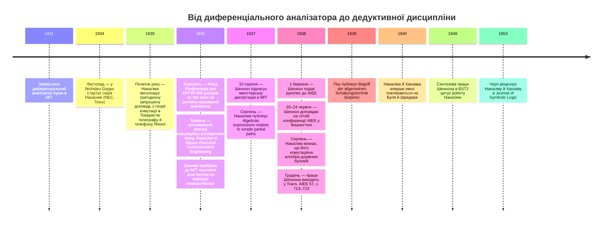

:::tip[В одному абзаці]
У серпні 1937 року Клод Шеннон підписав магістерську дисертацію в MIT, яка дала проєктуванню комутаційних схем аксіоматичну основу: вісім постулатів, доведення методом досконалої індукції та явне ототожнення релейної алгебри з численням висловлювань Джорджа Буля. Акіра Накасіма в NEC дійшов того самого осяяння в Токіо двома роками раніше; Ганнсі Піш, а також Плехль і Душек прийдуть до споріднених ідей у німецькомовній Європі. Вирізняльним внеском Шеннона була аксіоматична повнота — проєктування схем стало дедуктивною дисципліною, і це осяяння не належало лише Шеннонові.
:::

<strong>Дійові особи</strong>

| Ім'я | Роки життя | Роль |
|---|---|---|
| Клод Шеннон | 1916–2001 | Науковий асистент на кафедрі електротехніки MIT (1936–1937); підписав «A Symbolic Analysis of Relay and Switching Circuits» 10 серпня 1937 року; опублікував її в *Trans. AIEE* у грудні 1938-го. Головний герой розділу; його внесок — аксіоматична повнота числення. |
| Веннівер Буш | 1890–1974 | Віцепрезидент MIT і декан інженерної справи; архітектор програми диференціального аналізатора, чия проблема налаштування спонукала Шеннона до дисертації. Отримувач рокфеллерівського гранту від 17 березня 1936 року. |
| Акіра Накасіма | 1908–1970 | Інженер Nippon Electric Company (NEC) у Токіо; розробив алгебру релейних мереж раніше за дисертацію Шеннона й згодом визнав її тотожність з алгеброю Буля. |
| Масао Ханзава | — | Інженер групи проєктування АТС у NEC; співавтор Накасіми від 1936 року, зокрема праць 1940-го, що вперше явно покликаються на Буля й Шредера. |
| Френк Л. Гічкок | 1875–1957 | Професор математики MIT; *формальний* науковий керівник дисертації Шеннона — на відміну від Буша, керівника його дослідницької програми й роботодавця в MIT. |
| Семюел Г. Колдвелл | 1904–1960 | Колега Буша в MIT і його заступник у рокфеллерівському проєкті диференціального аналізатора; перебрав на себе щоденне керівництво новим аналізатором, коли віцепрезидентські обов'язки Буша зросли; подяку йому винесено у виносці до публікації Шеннона 1938 року. |

<strong>Хронологія (1931–1953)</strong>

<strong>Словник простими словами</strong>

- **Перешкода (hindrance)** — Шеннонів термін на позначення алгебричного значення, приписаного двополюсній комутаційній схемі. `0` позначає перешкоду *замкненого* кола (струм тече; «немає перешкоди»); `1` позначає перешкоду *розімкненого* кола (струм не тече). Це обернення сучасної булевої домовленості, де `1` означає «істина / замкнено».
- **Послідовно-паралельна схема** — у численні Шеннона `X + Y` позначає *послідовне* з'єднання двох двополюсних схем, а `X · Y` (часто пишуть `XY`) — *паралельне* з'єднання. Будь-який вираз із `+`, `·` та запереченням описує послідовно-паралельну мережу, і навпаки.
- **Постулат** — засаднича аксіома, яку числення стверджує, а не доводить. Дисертація Шеннона наводить вісім постулатів, упорядкованих двоїстими парами від `1a/1b` до `4a/4b`, що задають взаємодію `+`, `·`, `0` та `1`.
- **Досконала індукція** — Шеннонова назва доведення вичерпуванням випадків. Оскільки кожна змінна набуває лише двох значень, кожну теорему можна перевірити, обчисливши обидві сторони для кожної скінченної комбінації входів.
- **Замикальний / розмикальний контакт** — два фізичні різновиди релейного контакту. *Замикальний* контакт нормально розімкнений і замикається, коли реле під напругою; *розмикальний* нормально замкнений і розмикається. Шеннон означив заперечення `X'` як «перешкоду розмикальних контактів того самого реле, чиї замикальні контакти мають перешкоду `X`», перетворивши логічне НЕ на фізично здійсненну операцію.
- **Числення висловлювань** — булева алгебра логічних висловлювань 1854 року, де `+` — це АБО над істинністю, а `·` — І над істинністю. Дисертація Шеннона ототожнює його комутаційну алгебру з цим численням за оберненням, яке задає домовленість про перешкоду; Таблиця I праці 1938 року робить цю аналогію явною рядок за рядком.

1931 року в Массачусетському технологічному інституті (MIT) завершили будівництво диференціального аналізатора Веннівера Буша. Це була механічна машина — довгий стіл-каркас, пронизаний з'єднуваними між собою валами, з низкою креслярських дошок уздовж одного боку й шістьма дисковими інтеграторами вздовж іншого. Машина коштувала близько 25 000 доларів. Дисковий інтегратор був, як зауважив історик Ларрі Овенс, «серцем аналізатора й засобом, яким він виконував операцію інтегрування», — фрикційною передачею змінного тертя, чия геометрія змушувала складові вали обертатися згідно із заданим співвідношенням.

Машина 1931 року займала скромну площу за мірками великого промислового обладнання, але втілювала щільний зв'язок між механічним рухом і математичною операцією. Кожен із шести дискових інтеграторів виконував одне інтегрування; ланцюги зубчастих валів передавали отримані оберти валів до пер на креслярських дошках, які виводили на папері криві-розв'язки аналізатора. Щоб розв'язати нове диференціальне рівняння, оператор прокладав зубчасті з'єднання між інтеграторами, виходами креслярських дошок і магістральними валами, що тяглися вздовж усього столу, фактично «комутуючи» аналізатор для однієї цієї задачі. Переналаштування було ручною працею, а не клацанням перемикача.

У березні 1936 року, прагнучи автоматизувати цей виснажливий процес налаштування, Фонд Рокфеллера надав MIT грант на 85 000 доларів на три роки для побудови диференціального аналізатора Рокфеллера. Ця наступна машина мала покладатися на автоматичне електричне з'єднання елементів, а не на ручне налаштування зубчастих передач.

Грант було офіційно задокументовано в листі Буша до Воррена Вівера, директора відділу природничих наук Рокфеллера, від 17 березня 1936 року. Семюел Г. Колдвелл, колега Буша в MIT, який з'являється на архівних світлинах машини 1931 року, перебрав на себе щоденне керівництво новим проєктом, коли віцепрезидентські й деканські обов'язки Буша зросли. Новий аналізатор, уперше продемонстрований 13 грудня 1941 року й присвячений воєнній роботі 1942-го, зрештою вмістив «близько двох тисяч вакуумних ламп, кілька тисяч реле, сто п'ятдесят моторів та автоматизовані пристрої введення» й важив майже сто тонн. Цей повоєнний масштаб належить уже готовій машині. Проте в 1936 й 1937 роках релейно-керований наступник існував лише на креслярських дошках Буша; робочою машиною в MIT досі був механічний аналізатор 1931 року, без жодного реле в обчислювальному тракті взагалі.

Найважчим інженерним викликом нової машини було автоматичне керування — швидке, ефективне й автоматичне призначення обчислювальних елементів різним задачам. Цей виклик, за словами Овенса, «був, по суті, програмною проблемою». Клод Е. Шеннон прибув науковим асистентом на кафедру електротехніки MIT саме тоді, коли робочою машиною ще був механічний аналізатор 1931 року, а рокфеллерівського наступника планували й проєктували. Його робота над проблемою налаштування аналізатора дала поштовх новому способу мислення про проєктування схем.

Шеннон здобув ступінь бакалавра в Мічиганському університеті 1936 року й прибув до MIT того ж року. Підтверджені записи свідчать, що він був науковим асистентом на кафедрі електротехніки MIT, коли проблема налаштування аналізатора була актуальною. Довкола нього був потік дрібних, заплутаних задач конфігурування: кожне нове диференціальне рівняння доводилося кодувати як певне розташування зубчастих коліс і валів. Тягар конфігурування однієї механічної машини був осяжним; тягар конфігурування, який тепер планував Буш, — релейно-керований наступник, що автоматично переналаштовувався б від однієї задачі до іншої, — осяжним не був, хіба що як задача чогось абстрактнішого за зубчасті колеса.

## Паралельне відкриття

Поки інженери MIT змагалися з проблемою налаштування аналізатора, подібні теоретичні прориви незалежно відбувалися по всьому світу. Акіра Накасіма, випускник Токійського університету, працював інженером у Nippon Electric Company (NEC) у Токіо над проєктуванням релейних мереж. Накасіма провів великий аналіз багатьох конкретних випадків релейних мереж, намагаючись сформулювати єдину теорію проєктування. Він почав розглядати імпеданси релейних контактів як двозначні змінні, використовуючи логічні операції АБО та І для зображення послідовних і паралельних з'єднань.

Кар'єра Накасіми в NEC поставила його на той самий рубіж телефонної комутації, що рухав і контекст Шеннона в MIT. Ніва Ясудзіро, головний інженер NEC, і Сімадзу Ясудзіро були старшими постатями в лабораторії; більшу частину своїх досліджень з теорії комутації Накасіма провадив після робочих годин. 1936 року його перевели до групи передавальної техніки в NEC, але дослідження релейних мереж він продовжував поряд із новими обов'язками, дедалі більше у співпраці з Масао Ханзавою з групи проєктування АТС. Три різні англійські написання його прізвища — Nakashima, Nakasima, Nakajima — трапляються в його публікаціях, відбиваючи мінливість тогочасних правил романізації; написання ієрогліфами теж коливається між двома формами в його доробку. Дослідник Акіхіко Ямада, який десятиліттями пізніше відтворив бібліографію, описав Накасіму як автора «першої у світі праці з теорії комутації».

Накасіма виклав свої результати в серії публікацій у *Nichiden Geppo* (технічному журналі NEC), що виходила від листопада 1934-го до вересня 1935 року японською. Товариство телеграфу й телефону Японії запросило Накасіму виголосити тригодинну доповідь з теорії комутації на щорічних зборах Товариства на початку 1935 року. Доповідь згодом опублікували як «Synthesis theory of relay networks» у *Journal of the Institute of Telegraph and Telephone Engineers of Japan* у вересні 1935-го, а англомовний виклад з'явився в *Nippon Electrical Communication Engineering* у травні 1936 року.

Спершу Накасіма розробляв свою алгебру без символьної нотації. Лише в серпні 1938 року — після того, як працю Шеннона представили у Сполучених Штатах, — він визнав, що його незалежно розроблена комутаційна алгебра «насправді дорівнює булевій алгебрі», а перше явне покликання на Джорджа Буля та Ернста Шредера з'явилося в його праці 1940 року у співавторстві з Ханзавою. Нотація Накасіми майже точно збігалася з пізнішою роботою Шеннона: Накасіма вживав `A=∞` для розімкнених кіл і `A=0` для замкнених (протилежно до Шеннонової домовленості про перешкоду), тоді як обидва вживали `+` для послідовного з'єднання й `·` для паралельного, і обидва вживали риску згори або штрих для заперечення.

Цю історичну асиметрію варто викласти чітко. Накасіма дійшов до *осяяння* — що релейні мережі мають власну алгебру — раніше за Шеннона: приблизно на два роки, якщо рахувати від серії в *Nichiden Geppo*, що почалася наприкінці 1934-го, або на п'ятнадцять місяців, якщо рахувати від англомовного викладу в *Nippon Electrical Communication Engineering* за травень 1936 року проти підпису Шеннона на дисертації в серпні 1937-го. Немає задокументованого шляху, який показував би, що Шеннон читав японські статті Накасіми чи їхні англійські виклади перед поданням власної дисертації, і найощадливіше історичне прочитання — це незалежне одночасне відкриття по різні боки Тихого океану. Внеском Шеннона, якого Накасіма ще не мав — у 1937-му, — була *аксіоматична повнота*: закритий перелік постулатів, метод доведення досконалою індукцією та явне ототожнення числення з булевою алгеброю висловлювань уже в першій публікації, а не в другій чи третій редакції.

## Дисертація

10 серпня 1937 року Клод Шеннон підписав свою магістерську дисертацію «A Symbolic Analysis of Relay and Switching Circuits» на кафедрі електротехніки MIT. Його формальним науковим керівником був професор Ф. Л. Гічкок.

Дисертація відкривалася встановленням каркаса з двох задач для проєктування схем: «аналіз» (визначення робочих характеристик заданої схеми) та «синтез» (пошук схеми, яка втілює задані характеристики й в ідеалі потребує найменшого числа ножів перемикачів і релейних контактів). Шеннон прямо назвав практичні застосування, що мотивували цю теорію: «автоматичні телефонні станції, обладнання промислового керування двигунами та майже будь-які схеми, призначені автоматично виконувати складні операції».

Серцем питання був синтез. Телефонна станція наприкінці 1930-х маршрутизувала окремий виклик крізь послідовність релейних контактів, і кожен із цих контактів коштував грошей, займав місце на підлозі й додавав малу, але накопичувану ймовірність механічної несправності. Інженери десятиліттями вміли *аналізувати* задану релейну мережу — почати з одного виводу, простежити можливі шляхи до іншого, перелічити умови, за яких потече струм, — але ніхто не мав чистої процедури для оберненої задачі. Маючи бажану поведінку, виражену таблицею істинності над входами реле, якою була найпростіша мережа, що її реалізує? Дисертація Шеннона мала на меті перетворити це інженерне питання на питання алгебричних перетворень.

Щоб відобразити фізичні схеми в математику, Шеннон увів нотацію «перешкоди». «Символ 0 (нуль) використовуватиметься для позначення перешкоди замкненого кола, — писав він, — а символ 1 (одиниця) — для позначення перешкоди розімкненого кола». Послідовне з'єднання двополюсних схем він позначав знаком `+`, а паралельне — знаком `·` (множенням). Тоді він навів вісім постулатів, упорядкованих парами, щоб підкреслити їхню двоїстість: «якщо в будь-якому з *a*-постулатів нулі замінити одиницями, а множення — додаваннями і навпаки, то вийде відповідний *b*-постулат».

Перша пара постулатів, 1a і 1b, стверджувала, що замкнене коло послідовно із замкненим колом є замкненим (`0 + 0 = 0`), а розімкнене коло паралельно з розімкненим колом є розімкненим (`1 · 1 = 1`). Наступні пари охоплювали асиметричні випадки. Постулат 4 фіксував двозначне обмеження — кожна змінна будь-якої миті дорівнювала або `0`, або `1` — і це обмеження робило кожне подальше доведення вичерпною перевіркою випадків. Структура з пар і двоїстості не була стилістичною оздобою. Вона робила алгебру симетричною щодо одночасної заміни `+` на `·` та `0` на `1`, що, своєю чергою, означало: кожна теорема в дисертації автоматично давала двоїсту теорему на протилежному боці сторінки.

Щоб довести свої теореми, Шеннон використовував метод «досконалої індукції» — перевірку теореми для всіх можливих випадків, яких скінченна кількість, бо кожна змінна набуває лише значень 0 та 1. Заперечення `X'` він означив на підставі фізичних властивостей реле: «Якщо X — перешкода замикальних контактів реле, то X' — перешкода розмикальних контактів того самого реле». Теореми про заперечення — `X + X' = 1`, `X · X' = 0`, `0' = 1`, `1' = 0` та `(X')' = X` — випливали прямо з цього означення.

На домовленості про перешкоду варто спинитися, бо Шеннонів вибір того, яке значення відповідає якому фізичному стану, протилежний до домовленості, що пануватиме в підручниках з цифрової логіки через два покоління. У сучасній булевій нотації `1` — це *істина*, що відповідає замкненому перемикачу, крізь який тече струм; послідовні кола реалізують І. У Шенноновому формулюванні 1937 року `1` — це *перешкода розімкненого кола*, тобто кола, крізь яке струм не тече, а послідовність двох розімкнених кіл сама розімкнена, тож операція `+` діє як АБО над розімкненістю, що рівносильно І над замкненістю. Ці два формулювання взаємозамінні через просте обернення, але читачеві, який звіряє дисертацію із сучасним підручником, треба обережно застосовувати обернення, інакше він ризикує читати кожен постулат навиворіт.

Найважливіше — Шеннон прямо ототожнив своє числення з працею Джорджа Буля. «Алгебра логіки… започаткована Джорджем Булем, — писав він, — є символьним методом дослідження логічних відношень». Посилання 4 в опублікованій праці 1938 року вказувало на статтю Е. В. Гантінгтона «Sets of independent postulates for the algebra of logic» 1904 року в *Transactions of the American Mathematical Society* — ту саму статтю, яку історики теорії комутації згодом визначать як канонічний набір постулатів булевої алгебри. Тож це ототожнення не було туманною аналогією. Шеннон стверджував, маючи в одній руці набір постулатів Гантінгтона, а в іншій — власні постулати, виведені з поведінки реле, що ці дві системи є тією самою алгеброю за різних фізичних інтерпретацій. Булеві змінні були значеннями істинності висловлювань; Шеннонові — перешкодами двополюсних схем; формальна структура була однаковою. У таблиці (пізніше опублікованій як Таблиця I: «Analogue Between the Calculus of Propositions and the Symbolic Relay Analysis») Шеннон явно зіставив поняття: `X+Y` як послідовне з'єднання відповідало висловлюванню, що істинне X або Y; `XY` як паралельне з'єднання — висловлюванню, що істинні обидва; а `X'` — суперечному висловлюванню. Із цього ототожнення методологія проєктування комутаційних схем випливала без подальшої метафізики. Щоб спроєктувати релейну мережу, яка виконує задану логічну функцію, інженер записував функцію в булевій формі, спрощував її алгебрично й зчитував спрощений вираз як послідовно-паралельну схему.

Алгебра Шеннона показала, що головним знаряддям оптимізації обладнання може бути математика, а не метод спроб і помилок. До цієї теоретичної основи проєктування складної релейної схеми означало користуватися методом «спроб і підгонки», «спершу задовольняючи одну вимогу, а потім додаючи елементи, доки задоволені всі». Отриманий проєкт, зауважив Шеннон, «рідко буде найпростішим» і часто містив приховані небажані кола.

Натомість, писав Шеннон, «будь-який вираз, утворений операціями додавання, множення й заперечення, явно позначає схему, що містить лише послідовні й паралельні з'єднання. Таку схему називатимемо послідовно-паралельною. Кожна літера у виразі такого роду позначає замикальний чи розмикальний релейний контакт, або ніж перемикача з контактом». Щоб знайти схему, яка потребує найменшого числа контактів, «отже, необхідно перетворити вираз до форми, у якій з'являється найменше число літер».

## Спрощення

Він навів розібраний приклад на доведення цієї методології. Початкова функція перешкоди, накреслена як Рисунок 5 у дисертації, була `Xab = W + W'(X+Y) + (X+Z)(S+W'+Z)(Z'+Y+S'V)` — схема з тринадцятьма входженнями елементів, розподіленими між шістьма різними реле (`W`, `X`, `Y`, `Z`, `S`, `V`). Через повторне застосування теореми 17b — правила переписування, що поглинало вкладені вирази однієї змінної, — і дистрибутивного закону функція звелася до `Xab = W + X + Y + ZS'V`. Спрощена форма була Рисунком 6: схемою з п'ятьма входженнями елементів для тих самих шести різних реле. «Зверніть увагу на велике зменшення числа елементів», — зауважив Шеннон. Популярна формула, нібито скорочення було «з п'яти реле до трьох» — повторювана в багатьох пізніших популяризаціях, — не відповідає першоджерелу. Число реле не змінилося; число контактів і ножів перемикачів упало з тринадцяти до п'яти.

:::tip[Просте прочитання]
Теорема 17b — це закон поглинання: у численні Шеннона $X + XY = X$, тобто змінна, уже наявна в гілці, поглинає добуток, що містить ту саму змінну. У парі з дистрибутивним законом $X(Y+Z) = XY + XZ$ він дає змогу 13-контактному виразу згорнутися рівносильними переписуваннями, доки лишиться тільки `W + X + Y + ZS'V`.
:::

Педагогічний хід, закладений у розібраному прикладі, заслуговує на назву. Приклад показав інженерові, як узяти довільну вимогу, виразити її в алгебричній формі й звести цю форму до мінімального числа контактів ще до того, як збудовано будь-яке фізичне обладнання. Заощадження не були теоретичними. У телефонно-маршрутному стояку кожен контакт, прибраний спрощенням, був реальним шматком металу, який не доведеться встановлювати чи обслуговувати. Алгебра Шеннона перенесла вартість проєктування з робочого столу до математичного зошита, де її сплачують символами, а не паянням і міддю.

Ще дальші скорочення він продемонстрував у прикладі вибіркової схеми (Selective Circuit) з розділу V, де реле `A` мало спрацьовувати, коли спрацьовувало будь-яке одне, будь-які три або всі чотири з реле `w`, `x`, `y`, `z`. Почавши з початкової послідовно-паралельної форми на 20 елементів — суми семи добуткових членів, що перелічували кожну робочу комбінацію, — Шеннон розпізнав цю вимогу як *симетричну функцію* чотирьох її аргументів і переписав як `A = S₄(1, 3, 4)`, функцію, що вибирає випадки ваги один, три чи чотири. Форма симетричної функції потребувала 15 елементів. Тоді він помітив, що *доповняльна* функція `A' = S₄(0, 2)` ще простіша, і побудував `A` як двоїсту мережу реалізації `A'` — перетворення, що міняло послідовне з'єднання з паралельним, а розмикальні контакти із замикальними. Форма двоїстої мережі потребувала 14 елементів, що, як зазначив Шеннон, було «ймовірно, найощаднішою схемою будь-якого роду» для заданої вимоги.

Праця Тюрінга 1936 року про універсальну машину стоїть поряд лише як указівник, а не як засновок: дисертація Шеннона стосувалася синтезу релейних схем, і ці дві праці не перебували в діалозі.

## Від дисертації до стандарту

Шеннон подав свій рукопис до Американського інституту інженерів-електриків 1 березня 1938 року. Працю зробили доступною для попереднього друку 27 травня 1938 року, і в червні він доповів її на літній конференції AIEE у Вашингтоні. Її опублікували в *Transactions of the American Institute of Electrical Engineers* у грудні 1938-го. У виносці до авторського рядка Шеннон висловив подяку докторові Ф. Л. Гічкоку, докторові Венніверові Бушу та докторові С. Г. Колдвеллу.

Формулювання алгебри комутаційних схем було ідеєю, що виникала в кількох інженерних осередках. 1939 року Ганнсі Піш опублікувала «Begriff der allgemeinen Schaltungstechnik» в *Archiv für Elektrotechnik* (том 33, число 10, с. 672–686) — перше ґрунтовне німецькомовне формулювання алгебри релейних мереж. 1946 року, по війні, Отто Плехль та Адольф Душек опублікували «Grundzüge einer Algebra der elektrischen Schaltungen» у віденському *Österreichisches Ingenieur-Archiv* (том I, випуск 3, с. 203–230) — австрійське формулювання, що з'явилося запізно, щоб бути справжнім паралельним відкриттям, і чия перша публікація цитує Накасіму, але не Шеннона. Перше вагоме західне покликання Шеннона на роботу Накасіми з'явилося в його праці 1949 року в *Bell System Technical Journal* «The synthesis of two-terminal switching circuits» (том 28, число 1, с. 59–98). Японську роботу остаточно ввели в літературу символьної логіки 1953 року, коли Алонзо Черч рецензував статті Накасіми й Ханзави в *The Journal of Symbolic Logic* (том 18, число 4, с. 346).

Праця 1938 року в *Trans. AIEE* була інженерно-фаховим, а не академічно-математичним виданням. Її пізніший вплив краще викладати обережніше, ніж дозволяє звична оповідь про витоки: у повоєнних згадках цей каркас постає не стільки як подія одного джерела, скільки як дедуктивна мова проєктування схем, що поступово стала частиною підвалин цифрової логіки.

Дисертація заслуговує на свою репутацію, але лише з обережним обрамленням. Це не був момент, коли винайшли цифровий комп'ютер; це поєднання прийшло пізніше — через воєнну роботу Атанасова й Беррі, команди ENIAC у Школі Мура, інженерів Colossus у Блетчлі-Парку та повоєнні проєкти зі збереженою програмою фон Неймана й його колег. Це не був момент, коли булева алгебра скрізь увійшла в інженерну практику; Накасіма почав цей рух у Японії в 1934–1935 роках, Піш, а також Плехль і Душек зроблять його в німецькомовній Європі 1939-го й 1946-го, а засадничий математичний апарат чекав у Булевих *Laws of Thought* від 1854 року. Це не було навіть унікальним осяянням лише Шеннона; документальні свідчення вказують на кілька незалежних шляхів на ту саму аксіоматичну територію. Чим вона *була* — так це моментом, коли одна ретельна магістерська дисертація зафіксувала постулати, доведення, заперечення, ототожнення з численням висловлювань і методологію спрощення в єдиній дедуктивній системі та прив'язала цю систему явно до праці Джорджа Буля. Проєктування схем після серпня 1937 року можна було провадити як дедуктивну дисципліну. Саме це, а не винайдення комп'ютера, є вартим збереження внеском дисертації Шеннона.

:::note[Чому це досі важливо сьогодні]
Кожен цифровий чип у промисловій експлуатації сьогодні — кожен CPU, GPU, мікроконтролер, FPGA — це, на найнижчому комбінаційному шарі, послідовно-паралельна мережа двопозиційних елементів, спроєктована саме тією дедуктивною дисципліною, яку назвала дисертація Шеннона. Сучасні мови опису апаратури описують булеві функції; інструменти логічного синтезу спрощують їх до мінімальних мереж рівня вентилів; інструменти розміщення й трасування розкладають їх у кремнії. Кожен крок — це продовження спрощення Рисунок 5 → Рисунок 6: алгебра, виконана до того, як збудовано будь-яке фізичне обладнання, економія, оплачена символами, а не міддю. Тихіший урок розділу — що те саме осяяння дійшло до Токіо двома роками раніше, а до Берліна й Відня невдовзі по тому — це історіографічна поправка, що лишається в силі.
:::
