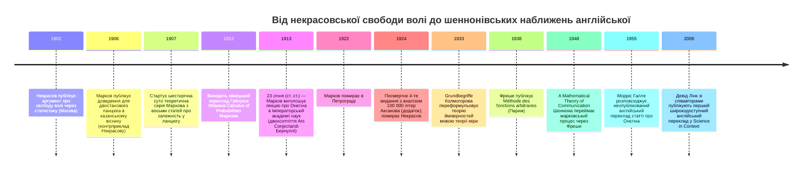

:::tip[В одному абзаці]
1906 року Андрій Марков спростував аргумент Павла Некрасова про свободу волі через статистику, довівши, що слабкий закон великих чисел поширюється на двостанові ланцюги, у яких послідовні випробування не є незалежними. Сім років по тому, 23 січня 1913 року (за ст. ст.), він уручну порахував 20 000 голосних і приголосних у Пушкіновому «Євгенії Онєгіні», щоб дати теоремі емпіричне підтвердження. Концептуальний родовід до мовних моделей реальний, але шлях передавання був непрямим.
:::

<strong>Дійові особи</strong>

| Ім'я | Роки життя | Роль |
|---|---|---|
| Андрій Марков | 1856–1922 | Петербурзький математик; перебрав курс теорії ймовірностей Чебишова по його виході у відставку 1883 року; опублікував доведення про залежність у ланцюгу 1906-го в казанському віснику й аналіз «Євгенія Онєгіна» 1913 року в Імператорській академії наук. Головний герой розділу. |
| Павло Некрасов | 1853–1924 | Московський математик із теологічно-семінарською освітою; його статтю 1902 року Марков прочитав як аргумент на користь того, що попарна незалежність необхідна для слабкого закону великих чисел, — «зловживання математикою», яке Марков узявся спростувати. |
| Пафнутій Чебишов | 1821–1894 | Петербурзький математик; опублікував ширше за Бернуллі доведення слабкого закону великих чисел; наставник Маркова; передав йому свій курс теорії ймовірностей по виході у відставку 1883 року. |
| Олександр Чупров | 1874–1926 | Петербурзький статистик; багаторічний кореспондент Маркова; ключове джерело приватного бачення Марковим суперечки з Некрасовим (збережене в Ондара, 1981). |
| Моріс Фреше | 1878–1973 | Французький математик; його *Méthode des fonctions arbitraires* 1938 року стала важливим бібліографічним містком між Марковим і Шенноном. |
| Клод Шеннон | 1916–2001 | Математик Bell Labs; §3 «The Series of Approximations to English» його «A Mathematical Theory of Communication» (BSTJ, 1948) проганяє n-грамні наближення англійського тексту, послуговуючись формалізмом марковського процесу. Доходить до Маркова через родову назву, а не пряме цитування. |

<strong>Хронологія (1902–2006)</strong>

<strong>Словник простими словами</strong>

- **Слабкий закон великих чисел (ЗВЧ)** — теорема про те, що для арифметичного середнього за багатьма випробуваннями це середнє збігається за ймовірністю до сподіваного значення. Бернуллі довів окремий випадок 1713 року; Чебишов дав ширшу версію. Стаття Маркова 1906 року показала, що він тримається й тоді, коли послідовні випробування залежать одне від одного в ланцюгу.
- **Незалежність (випадкових величин)** — дві випадкові величини *незалежні*, якщо знання однієї нічого не каже про іншу. Підкидання монети — підручниковий приклад. Некрасов, як його прочитав Марков, доводив, що ЗВЧ тримається лише для незалежних величин; стаття Маркова 1906 року дала контрприклад.
- **Ланцюг Маркова** — послідовність випадкових станів, де ймовірність наступного стану залежить лише від поточного (ланцюг першого порядку) — або, у вищих порядках, лише від останніх $n$ станів. Доведення Маркова 1906 року стосувалося двостанового ланцюга першого порядку з усіма чотирма ймовірностями переходу строго між 0 та 1.
- **Ймовірність переходу** — у ланцюгу Маркова ймовірність переходу з одного стану до заданого наступного. Аналіз *Онєгіна* в Маркова оцінив, наприклад, що ймовірність голосної після приголосної в Пушкіновій кирилиці становить $p_0 \approx 0.663$; ймовірність голосної після голосної — $p_1 \approx 0.128$.
- **Коефіцієнт дисперсії** — статистика згоди моделі з даними: відношення емпіричної дисперсії до дисперсії, яку передбачає модель ланцюга. Коефіцієнт, близький до 1, означає, що модель пасує; відхилення від 1 вимірює, наскільки мінливість даних відхиляється від тієї, що її давала б модель. Для підрахунків з *Онєгіна* емпіричне значення було 0.208; ланцюг другого порядку передбачив 0.195 (добра згода), ланцюг першого порядку — 0.300 (гірша згода).
- **N-грама** — суцільна послідовність із $n$ токенів (тут — літер чи слів), узята з тексту. §3 Шеннона 1948 року проганяв наближення англійської n-грамами першого, другого, третього порядку та на рівні слів. *N*-грами — це найпростіша передбачувальна мовна модель і прямий нащадок Маркового методу підрахунку-й-зумовлення на Пушкіні.

<strong>Математика, за потреби</strong>

Доведення Маркова 1906 року й демонстрація 1913-го обидва тримаються на короткому переліку означень і підрахунків.

- **Двостановий ланцюг першого порядку.** Якщо поточний стан A, то наступний стан буде A з імовірністю $p_1$ і B з імовірністю $1 - p_1$. Зі стану B: A з імовірністю $p_0$ і B з імовірністю $1 - p_0$. Марков 1906 року довів, що ЗВЧ тримається для будь-якого ланцюга з $0 < p_0, p_1 < 1$.
- **Перевірка незалежності.** За незалежності дві ймовірності переходу збігаються: $p_1 = p_0$. Діагностикою Маркова був розрив $\delta = p_1 - p_0$; що більший $|\delta|$, то глибша залежність між послідовними випробуваннями.
- **Дисперсія блоків в Онєгіні.** Середнє число голосних на 100-літерний блок: $43.19$, отже безумовна ймовірність голосної $p \approx 0.432$. Сума квадратів відхилень $1022.8$ на $200$ блоків дає дисперсію $5.114$ і стандартне відхилення $\sigma \approx 2.26$.
- **Підрахунки першого порядку в Онєгіні.** З $8{,}638$ голосних серед $20{,}000$ літер $p_1 = 1{,}104 / 8{,}638 \approx 0.128$ (голосна йде за голосною). З позицій після приголосної $p_0 \approx 0.663$ (голосна йде за приголосною). Отже, $\delta = p_1 - p_0 = -0.535$ — істотне відхилення від незалежності.
- **Ланцюг другого порядку.** Зумовлення на попередні *дві* літери дає чотири ймовірності переходу $p_{1,1}, p_{1,0}, p_{0,1}, p_{0,0}$. Марков знайшов $p_{1,1} \approx 0.104$ — після двох голосних поспіль шанс третьої голосної *нижчий*, ніж після однієї ($0.104 < p_1 = 0.128$), і значно нижчий за безумовний $p \approx 0.432$.
- **Коефіцієнт дисперсії як згода моделі.** Емпіричний коефіцієнт був $0.208$; ланцюг другого порядку передбачив $0.195$, першого — $0.300$. Що ближче передбачення моделі до емпіричного значення, то краща згода — отже, ланцюг залежності в Пушкіновій прозі тягнеться щонайменше на одну літеру назад.

Росія на зламі двадцятого століття мала дві імперії теорії ймовірностей, розділені Пулковським меридіаном і тривалою суперечкою про те, що математиці дозволено стверджувати про людську дію. З одного боку стояв Петербурзький університет — світський, республіканський спадкоємець математичної традиції, що тягнулася від *Ars Conjectandi* Якоба Бернуллі 1713 року через Пафнутія Чебишова, який опублікував ширше за самого Бернуллі доведення слабкого закону великих чисел і чий курс теорії ймовірностей перейшов до єдиного наступника по виході у відставку 1883 року. З іншого боку стояв Московський університет — церковна твердиня, чий професорський склад був тісно пов'язаний з Російською православною церквою.

Іскру того, що стане математичною основою мовного моделювання, висікли в Москві. Павло Олексійович Некрасов, математик московського факультету, який починав освіту в духовній семінарії, опублікував статтю 1902 року. Твердженням Некрасова, за тлумаченням Андрія Андрійовича Маркова, було те, що попарна незалежність доданків необхідна й достатня для того, щоб тримався слабкий закон великих чисел. Наслідок цього аргументу був далекосяжним. Як переказав науковий публіцист Браян Гейс, у популярній формі аргумент звучав так: вільні вчинки незалежні, як підкидання монети; закон великих чисел застосовний лише до таких незалежних подій; дані, зібрані суспільствознавцями, як-от статистика злочинів, узгоджуються із законом великих чисел; отже, базові вчинки індивідів мають бути незалежними й вільними. Свобода волі, у формулюванні Некрасова, була математично доказовною.

З Петербурга Марков прочитав цей аргумент як фундаментальне зловживання теорією ймовірностей. Марков, народжений у Рязані 1856 року в родині чиновника лісового відомства, який згодом керував маєтком одного аристократа, був, за більшістю свідчень, людиною дражливою, різкою навіть із друзями й завзято войовничою із суперниками. У приватному листуванні до статистика Олександра Олександровича Чупрова він назвав роботу Некрасова «зловживанням математикою». Він не був людиною поміркованої опозиції. Коли цар Микола II наклав вето на обрання письменника Максима Горького до Імператорської академії наук 1902 року, Марков оголосив, що відмовлятиметься від усіх майбутніх царських почестей, — не складаючи власного членства. Коли Російська православна церква відлучила Лева Толстого 1908 року, Марков попросив церкву відлучити й його — і це прохання вдовольнили. Історик Юджин Сенета, працюючи з листуванням Маркова й Чупрова, збереженим у виданні Х. О. Ондара 1981 року, занотовує, що Маркова антипатія не охолола з часом: наприкінці 1910 року, коли Чупров згадав Некрасова в позитивному світлі, Марков відповів тим, що Сенета називає «палкими листівками». Через вісім років після початкової статті 1902 року суперечка ще тривала.

Тут доречне зауваження про історичні джерела. Сенета обережніший за Гейса щодо суті аргументу 1902 року. Марков *витлумачив* Некрасова як твердження, що попарна незалежність необхідна для слабкого закону; чи буквально Некрасов це доводив у тих самих термінах — питання, якого цей розділ не може розв'язати, бо статтю Некрасова 1902 року не прочитано безпосередньо. Популярне тлумачення через свободу волі у Гейса — це те, що Марков/Гейс вважали наслідком слів Некрасова; обережніше сформульоване математичне твердження в Сенети — це те, що Марков вирішив спростувати. Ці два прочитання сумісні, але розділ фіксує Маркове прочитання Некрасова, а не дослівний самоопис Некрасова.

Власна кар'єра Маркова розгорталася в петербурзькій традиції з незвичайною точністю. Він перебрав курс теорії ймовірностей Чебишова в Петербурзькому університеті по виході Чебишова у відставку 1883 року — того ж року, коли одружився з Марією Вальватьєвою, донькою власника маєтку, яким колись керував його батько. Його обрали ад'юнктом Імператорської академії наук 1886 року за пропозицією Чебишова та екстраординарним академіком 30 січня 1890 року (за старим стилем). 1893 року його підвищили до повного професора університету; 1896-го, через два роки після смерті Чебишова, його обрали ординарним академіком академії. Перше видання його підручника *Ischislenie Veroiatnostei* (*Числення ймовірностей*) вийшло 1900 року; друге — 1908-го. На час, коли некрасовський аргумент 1902 року дістався Петербурга, Марков був незмінним стовпом петербурзької школи з двома десятиліттями викладання, прив'язаного до традиції Бернуллі–Чебишова.

## Контрприклад 1906 року

Марков вийшов у відставку з Петербурзького університету як заслужений професор 1905 року, хоча лишився академіком і далі викладав успадкований курс теорії ймовірностей. Саме з цієї позиції він сформулював свою відповідь. У статті 1906 року для казанського вісника (*Izvestiia*) Марков побудував навмисний контрприклад до твердження Некрасова. Він довів, що слабкий закон великих чисел тримається для двостанового ланцюга, у якому всі чотири ймовірності переходу лежать строго між нулем та одиницею. Якщо поточний стан A, то наступним був би A з імовірністю p1 і B з імовірністю 1 − p1, і закон великих чисел усе одно застосовувався б попри залежність між послідовними випробуваннями.

Математична сила спростування була суворою. Некрасов — як його прочитав Марков — вимагав попарної незалежності для того, щоб тримався слабкий закон. Марков дав явний контрприклад, у якому послідовні випробування доказово *не* були незалежними і в якому середнє попри те збігалося згідно із законом великих чисел. Двостановий ланцюг був найпростішим нетривіальним залежним процесом із доступних, і збіжність трималася, не спираючись на жодну властивість, яку дало б незалежне випробування. Після 1906 року висновок від «соціальна статистика узгоджується із ЗВЧ» до «базові вчинки мають бути незалежними» більше не був математично виправданим. Чи вільні людські вчинки, чи зумовлені, лишалося — як було й до того, як Некрасов спробував урятувати свободу волі теоремою, — питанням метафізичним.

Доведення було символьним, написаним на папері й проходило цілком без емпіричної ілюстрації. Це був початок шестирічної суто теоретичної серії з восьми статей, що поширювала теорію залежності в ланцюгу на багато станів, складні ланцюги та події, лишені спостереження. Подальші праці мали чітку бібліографічну форму. Стаття 1907 року «Recherches sur un cas remarquable d'épreuves dépendantes» вийшла в *Bulletin de l'Académie Impériale des Sciences de St.-Pétersbourg*; дещо інша французька версія дісталася *Acta Mathematica* 1910 року, давши роботі перше широке західноєвропейське читацтво. Стаття 1908 року в *Mémoires* академії поширила граничні теореми на суми в ланцюгу; стаття 1910 року узагальнила доведення для ланцюга поза двома станами; подальші праці 1911 та 1912 років охопили «valeurs liées qui ne forment pas une chaîne véritable», ланцюги з кількох кроків і ланцюги, у яких частина подій лишалася без спостереження. У всіх цих статтях Марков не шукав емпіричних застосувань. За словами Девіда Лінка, упродовж тих шести років Марков «не міг придумати практичної ілюстрації та емпіричної перевірки своїх висновків — або не був зацікавлений її шукати». Сам Марков був недвозначним. У листі до Чупрова він написав, що його турбують лише питання чистого аналізу, додавши, що до питання застосовності теорії ймовірностей він ставиться байдуже.

## Лекція до двохсотліття Бернуллі

Ця байдужість урвалася 23 січня 1913 року за старим російським календарем — 5 лютого за григоріанським. Поки Росія загалом готувалася відзначати триста років правління Романових, тієї зими припало двохсотліття зовсім іншої події: посмертної публікації 1713 року, здійсненої небожем Якоба Бернуллі Ніклаусом, *Ars Conjectandi* — книги, що вперше сформулювала закон великих чисел. Марков організував лекцію для фізико-математичного факультету Імператорської академії наук у Петербурзі на її вшанування. Лінк, пишучи як обережний історик цієї лекції, зауважує лише, що цей вибір «надав події фізико-математичного факультету політичного виміру»; Гейс, пишучи як біограф Маркова, трактує цей вибір як навмисний контрапункт до трьохсотліття Романових. Хай яке прочитання правильне, той самий математичний світ, що чув шість років суто теоретичних доведень Маркова про ланцюги, тепер почув би емпіричну демонстрацію одного з них — і емпіричним випадком став би літературний текст.

Його тестова добірка була літературною, але вибір — ні. Пушкінів «Євгеній Онєгін» — початий під час південного заслання Пушкіна в Одесі, після його вигнання з Петербурга за політичну поезію, і продовжений у материнському сільському маєтку в Михайловському — пропонував Маркову довгий, структурно однорідний корпус стандартизованої кирилиці. Він узяв перші 20 000 літер: увесь перший розділ і шістнадцять строф другого. Він вилучив розділові знаки, пробіли, а також тверді та м'які знаки, зауваживши, що м'які знаки не вимовлялися окремо, а лише пом'якшували попередню літеру.

На початку лекції Марков означив сім імовірностей. Безумовну ймовірність того, що літера — голосна, він назвав p; умовні ймовірності першого порядку — ймовірність голосної за умови, що попередня літера була голосною чи приголосною, — p1 і p0; і чотири умовні ймовірності другого порядку, зумовлені на попередні дві літери, p1,1, p1,0, p0,1 та p0,0. Перші три нестимуть аргумент першого порядку; чотири інші приберігалися для гострішої перевірки ланцюга другого порядку.

Він упорядкував безперервний потік кириличних символів у двісті малих таблиць, кожна по десять рядків на десять стовпців. Він порахував голосні в кожному стовпці, спарував стовпці один і шість, два і сім, три і вісім, чотири і дев'ять та п'ять і десять і вписав суми жирним шрифтом. Таке розташування дозволяло одночасне горизонтальне й вертикальне підсумовування по кожній таблиці; сорок таких таблиць спарованих сум заповнюють цілу сторінку опублікованої лекції. Лінк, досліджуючи цей апарат століттям пізніше, схарактеризував перетворення, яке Марков здійснив над Пушкіновим текстом, як «паперовий автомат» і «письмову гру з дискретними символами» — абетку, перелиту у скінченний простір станів, текст, перелитий у послідовність переходів між цими станами.

Середнє арифметичне число голосних на столітерний блок становило 43.19, що дає безумовну ймовірність голосної p ≈ 0.432. Дисперсія, обчислена методом найменших квадратів — технікою, розробленою Адрієном-Марі Лежандром 1805 року та Карлом Фрідріхом Гауссом 1809-го, — вийшла 1022.8 / 200 = 5.114 з відповідним стандартним відхиленням близько 2.26. У графіку поблочні підрахунки голосних лягали вздовж нормальної кривої майже так само чисто, ніби літери тягли незалежно. Незалежність, інакше кажучи, на рівні блоків не спростовувалася — довга вибірка усереднюється, незалежно від залежності всередині. Залежність довелося б шукати на рівні пар.

Повернувшись до безперервного потоку літер, Марков порахував патерни пар. З 8638 голосних загалом він знайшов 1104 пари «голосна-голосна», що дає p1 — ймовірність голосної після голосної — як 1104 / 8638 = 0.128. Вилучивши першу літеру, яка не має попередника, він знайшов 7534 приголосні після голосної та 3827 пар «приголосна-приголосна» з 11 361 доступної позиції після приголосної, що дає p0 — ймовірність голосної після приголосної — як 0.663. Ймовірність приголосної після голосної, q1, була отже 0.872. Діагностичним підписом ланцюга була різниця δ = p1 − p0 = 0.128 − 0.663 = −0.535. За незалежності p1 і p0 збігалися б; що більший абсолютний розрив, то глибша залежність між послідовними літерами. Пів одиниці було істотним відхиленням.

Марков не спинився на залежності першого порядку. Він порахував патерни трійок, щоб дослідити ланцюг другого порядку: 115 послідовностей «голосна-голосна-голосна» та 505 послідовностей «приголосна-приголосна-приголосна» у 20 000-літерній вибірці. Після двох голосних поспіль імовірність третьої голосної падала до 0.104 — нижча за безумовну частоту 0.432 більш ніж учетверо й нижча навіть за p1, імовірність голосної після однієї голосної. Після двох приголосних імовірність ще однієї приголосної була 1 − 0.132 = 0.868. Коли ці значення підставили в двокроковий ланцюг, теоретичний коефіцієнт дисперсії вийшов 0.195. Це була набагато тісніша згода з емпіричним коефіцієнтом дисперсії 0.208, ніж 0.300, що його давав однокроковий ланцюг. Ланцюг залежності був реальним і доказово тягнувся щонайменше на одну літеру назад.

Праця, потрібна для цього табулювання олівцем і папером, була величезною. Століттям пізніше, пробуючи подібний підрахунок на англійському перекладі, Гейс обводив пари «голосна-голосна» ручкою на роздруківці й пропустив 62 з 248 із них у перших десяти строфах; він дійшов висновку, що Марков був «імовірно, швидшим і точнішим за мене» і «мусив витратити на ці труди кілька днів». Результатом була цілком емпірична демонстрація того, що слабкий закон великих чисел тримається на ланцюгу, чиї ланки були вимірно реальними, — і нагадування для будь-якого читача, схильного припускати, ніби статистичний поворот у мовному моделюванні наприкінці двадцятого століття був першим разом, коли хтось рахував літери вручну, що цей підрахунок зробили ще 1913 року, на Пушкіні, проти теореми про свободу волі.

## Сорокарічна тиша

Аналіз *Онєгіна* в Маркова опублікували у *Bulletin of the Imperial Academy of Sciences of St. Petersburg* лише російською. За кілька років він повторив вправу на іншому корпусі: на перших 100 000 літерах автобіографічних «Дитячих років Багрова-внука» Сергія Тимофійовича Аксакова — спогадів, які Аксаков диктував доньці, бо вже десять років був сліпий. Цей другий аналіз увійшов до додатка посмертного четвертого видання Маркового *Числення ймовірностей* 1924 року. Марков пережив Жовтневу революцію на п'ять років; 1921-го він поскаржився академії, що не може відвідувати засідання через брак придатного взуття, і комітет на чолі з Максимом Горьким — тим самим Горьким, чиє обрання 1902 року цар відхилив своїм вето, — зрештою знайшов йому пару, яку Марков відкинув як «безглуздо зшиту». Марков помер у Петрограді 20 липня 1922 року; Некрасов пішов услід 1924-го, а його робота канула в постреволюційне забуття.

Ланцюги Маркова все одно мандрували на захід — не через статтю про *Онєгіна*, а через термін «марковський процес». Німецький переклад Гайнріха Лібмана 1912 року Маркового *Числення ймовірностей* засіяв апарат ланцюгів у європейській математичній спільноті. *Grundbegriffe der Wahrscheinlichkeitsrechnung* Андрія Колмогорова 1933 року переформулювало теорію ймовірностей — разом із ланцюгами Маркова — мовою теорії міри. *Méthode des fonctions arbitraires. Théorie des événements en chaîne dans le cas d'un nombre fini d'états possibles* Моріса Фреше 1938 року, видана в Парижі Gauthier-Villars, узагальнила формалізм марковського процесу французькою. На 1948 рік марковський процес був усталеним математичним терміном трьома мовами з усталеною літературою, навіть попри те, що сама стаття про *Онєгіна* лишалася непрочитаною поза Росією.

Саме 1948 року Клод Шеннон опублікував «A Mathematical Theory of Communication» у *Bell System Technical Journal*. У третьому розділі, «The Series of Approximations to English», Шеннон узяв дискретні марковські процеси за модель джерела інформації. Він навів розібрані n-грамні наближення англійського тексту першого, другого, третього порядку та на рівні слів. Вивід другого порядку читався «OCRO HLI RGWR NMIELWIS EU LL NBNESEBYA TH EEI ALHENHTTPA OOBTTVA NAH BRL»; третього порядку дав «IN NO IST LAT WHEY CRATICT FROURE BIRS GROCID PONDENOME OF DEMONSTURES OF THE REPTAGIN IS REGOACTIONA OF CRE».

Шеннон узагальнив побудову в §4, «Graphical Representation of a Markoff Process». Розділ 5, «Ergodic and Mixed Sources», дав умови, за яких статистики такого джерела є чітко визначеними; розділ 6, «Choice, Uncertainty and Entropy», прикріпив міру ентропії, що понесе решту статті. Найважливіше, що єдина виноска, яка спрямовувала читачів до докладного розбору формалізму марковського процесу, вказувала не на Маркова, а на *Méthode des fonctions arbitraires* Фреше. Передавання було концептуальним і відбувалося через родову назву процесу, а не пряме цитування статей 1913 чи 1906 років. Текстові наближення Шеннона самі були вправою з ручного підрахунку. Як Шеннон виклав у третьому розділі, його вибірку другого порядку побудовано за допомогою книжки випадкових чисел у поєднанні з таблицею частот літер. Приклади вищих порядків породжували так: розгортали книжку навмання, знаходили попередні літери й копіювали наступну — той самий різновид процедури олівцем і папером, яким користувався Марков. Залучена праця, зауважив Шеннон, ставала величезною на наступному етапі. Те саме обмеження, на яке Марков наразився на Пушкіні 1913 року, у 1948-му все ще було чинним обмеженням у Bell Labs.

Стаття Маркова про *Онєгіна* лишалася недоступною англомовному світові навіть тоді, коли Шеннон будував на формалізмі марковського процесу. 1955 року лінгвіст MIT Морріс Галле підготував мімеографований англійський переклад на прохання колег, які досліджували статистичні підходи до мови. Той переклад так і не опублікували; він уцілів лише в мімеографованій формі в кількох бібліотеках. Минув ще п'ятдесят один рік, поки Девід Лінк із колегами опублікували широкодоступну англійську версію в *Science in Context* 2006 року — через дев'яносто три роки після лекції й через п'ятдесят вісім після того, як стаття Шеннона вже ввібрала формалізм через Фреше.

## Чесне завершення

Між Марковими таблицями по Пушкіну, зробленими олівцем і папером, і будь-яким практичним застосуванням n-грамних моделей лежали чотири десятиліття та інституційна інфраструктура, якої ще не існувало. Не було опублікованого англійського перекладу статті про *Онєгіна*; не було теорії зв'язку, якій потрібне було б стохастичне джерело на вході; і не було цифрового сховища, здатного нести матриці переходів для будь-якого словника з понад двома станами. Практичні питання, що цікавлять сучасні дослідження ланцюгів Маркова, — швидкість збіжності, межі похибки для передчасно обірваних симуляцій, методи вибірки з обчислювально складних розподілів — це питання, на які може відповісти лише комп'ютер, а в Маркова його ніколи не було.

Марков не передбачав породження тексту. Він довів теорему проти теологічного зловживання математикою, дав їй літературну демонстрацію й пішов геть. Ланцюг передавання до мовного моделювання двадцять першого століття реальний, але глибоко непрямий — він проходить через Лібмана, Колмогорова й Фреше для формалізму, через §3 Шеннона 1948 року для n-грамної демонстрації на англійській і через піввікову затримку перед опублікованим англійським доступом до самої статті про *Онєгіна*. Знадобиться теорія зв'язку часів холодної війни, досліджена в розділі 9, та зрештою постання статистичного підпілля, висвітленого в розділі 30, щоб перетворити математичний контрприклад на основу нового штучного інтелекту.

Одне останнє уточнення належить на завершення. Авторегресійні мовні моделі початку двадцять першого століття — це статистичні моделі, що передбачають наступний токен у послідовності, і тією мірою вони рідняться з Марковим методом підрахунку-й-зумовлення на Пушкіні. Проте вони не є ланцюгами Маркова в жодному технічно значущому сенсі. Марковська властивість — що наступний стан залежить лише від поточного, або у вищих порядках лише від останніх n, — це саме те, що порушує механізм уваги на повний контекст у трансформера. Теорема 1906 року каже щось конкретне про клас стохастичних процесів; сучасні мовні моделі не належать до того класу. Родовід від Маркова до великих мовних моделей справжній, але він проходить через *ідею* статистичного зумовлення на попередній текст, а не через *механізм* скінченно-станних ланцюгів. Сама ця непрямість і є думкою розділу.

:::note[Чому це досі важливо сьогодні]
Кожна сучасна мовна модель — це, по суті, машина підрахунку-й-зумовлення: вона оцінює ймовірність наступного токена за попереднім контекстом — те саме завдання, яке Марков виконував уручну на Пушкіні 1913 року. Марковська властивість буквально не тримається для моделей на основі трансформерів, чий механізм уваги читає все контекстне вікно, тож технічний механізм змінився. Але *ідея* статистичного зумовлення на попередній текст — це спадок, який лишив Марков. Тихіша думка розділу — що Марков не передбачав породження тексту і що шлях від його статті до Шеннона був непрямим — це історіографічна поправка, варта збереження.
:::
