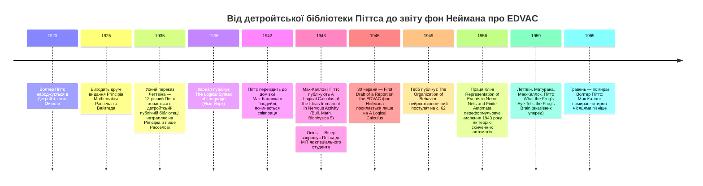

:::tip[В одному абзаці]
1943 року Воррен Мак-Каллок і Волтер Піттс опублікували статтю «Логічне числення ідей, іманентних нервовій діяльності» в журналі *Bulletin of Mathematical Biophysics*. Вони не винайшли математичне дослідження нейронів — біофізична спільнота Ніколаса Рашевського вже існувала в Чикаго, — але замінили її неперервні диференціальні рівняння численням висловлень Карнапа та Рассела-Вайтгеда. Ця абстракція увійде в архітектуру комп'ютера зі збереженою програмою через працю фон Неймана «First Draft of a Report on the EDVAC».
:::

<strong>Дійові особи</strong>

| Ім'я | Роки життя | Роль |
|---|---|---|
| Воррен Мак-Каллок | 1898–1969 | Нейрофізіолог; 1943 року був афілійований одночасно з кафедрою психіатрії Іллінойського нейропсихіатричного інституту та Чиказьким університетом. Співавтор статті «Логічне числення ідей, іманентних нервовій діяльності» (1943). |
| Волтер Піттс | 1923–1969 | Логік-самоук; співавтор статті 1943 року у віці 19–20 років; згодом «спеціальний студент» у MIT під керівництвом Вінера. Популярні сцени його раннього життя значною мірою спираються на пізніший усний переказ. |
| Джером Леттвін | 1920–2011 | На початку 1940-х — студент-медик Іллінойського університету; познайомив Піттса з Мак-Каллоком і є джерелом майже кожної популярної сцени з біографії Піттса (записано в *Talking Nets*, 2000). Співавтор статті 1959 року про око жаби. |
| Ніколас Рашевський | 1899–1972 | Математичний біофізик у Чиказькому університеті; засновник і редактор журналу *Bulletin of Mathematical Biophysics* — видання, що опублікувало статтю 1943 року. Інституційний контекст, який розділ має тримати в полі зору. |
| Дональд Гебб | 1904–1985 | Канадський психолог у Університеті Макґілла; його праця «Організація поведінки» (1949) ставить його роботу поряд із лінією Рашевського-Піттса-Мак-Каллока і подає «нейрофізіологічний постулат» на с. 62 — це *біологічна* гіпотеза про зміцнення синапсів, а не алгоритм. |
| Джон фон Нейман | 1903–1957 | Послався на «Логічне числення» в §4.2 свого «First Draft of a Report on the EDVAC» (червень 1945 року) — єдине журнальне посилання в усьому звіті. Шлях, яким словник статті 1943 року увійшов в архітектуру комп'ютера зі збереженою програмою. |

<strong>Хронологія (1923–1969)</strong>

<strong>Словник простими словами</strong>

- **Нейрон «усе або нічого»** — Ідеалізація біологічного нейрона, у якій спрацьовування є двійковим: на будь-якому часовому кроці нейрон або спрацьовує (вихід 1), або ні (вихід 0). Одне з п'яти фізичних припущень на с. 118 статті 1943 року.
- **Порогово-логічний вентиль** — Вузол, який спрацьовує, коли (зважена) сума його збудливих входів сягає фіксованого порога, а жоден гальмівний вхід не активний. Мак-Каллок і Піттс реалізували І (AND) за порога 2, АБО (OR) за порога 1, а НЕ (NOT) — через гальмівне з'єднання.
- **Мережа без кіл** — Мережа Мак-Каллока-Піттса без петель зворотного зв'язку — еквівалентна за виражальною силою численню висловлень. Комбінаційне ядро числення 1943 року.
- **Мережа з колами** — Мережа Мак-Каллока-Піттса, що містить петлі зворотного зв'язку, у якій спрацьовування нейрона тепер може залежати від його (чи іншого нейрона) спрацьовування один або більше часових кроків тому. Несе обмежену пам'ять і виражає рекурсивні предикати; пізніше прочитується як *скінченний автомат* у словнику Кліні 1956 року.
- **Теорема 7** — Формальне врахування пластичності в статті 1943 року: «Змінні синапси можна замінити колами» (оригінал, с. 124). Мережу, чиї з'єднання змінюються з часом, можна переформулювати як фіксовану мережу з додатковими круговими шляхами, що керують потоком сигналу. Теорема поглинає навчання; вона *не* постачає алгоритму навчання.
- **Геббівський постулат** — Гіпотеза Гебба 1949 року («Організація поведінки», с. 62) про те, що повторюване спільне спрацьовування двох нейронів зміцнює синапс між ними. *Біологічна* гіпотеза про те, де в нервовій тканині може міститися пластичність, а не правило оновлення ваг. Стиснене в підручниках «правило Гебба» дістало цю назву пізніше.

В історії обчислень перехід від неперервних фізичних процесів до дискретних логічних операцій часто трактують як неминучий поступ. Але на початку 1940-х застосування математики до нервової системи переважно визначали диференціальні рівняння та біофізика. Інтелектуальний стрибок, що трактував спрацьовування ідеалізованого нейрона як висловлення, а мережу нейронів — як числення висловлень, вимагав глибокої зміни математичної мови. Цю зміну формалізувала стаття Воррена Мак-Каллока та Волтера Піттса 1943 року під назвою «Логічне числення ідей, іманентних нервовій діяльності». Це не була ані перша математична модель нейронів, ані функціональний алгоритм навчання, який можна було б тренувати на даних. Натомість це був акт називання правильного рівня абстракції — формальний міст, що з'єднав біологію мозку із символьною логікою ранньої інформатики.

Щоб зрозуміти, як постала ця абстракція, ми маємо придивитися до неймовірної співпраці, що її породила. Популярну історію життя Волтера Піттса часто подають у драматичних, майже міфологічних барвах. Більшість того, що зазвичай повторюють про його ранні роки, веде до усного переказу його друга й колеги Джерома Леттвіна, записаного через десятиліття й збереженого в подальших біографічних викладах, — і ці події найкраще читати як усно-історичні реконструкції Леттвіна, а не як усталені документальні факти. У версії, яку запам'ятав Леттвін, Піттс народився в Детройті 1923 року. Кажуть, що 1935 року він шукав прихистку від сусідських задирак, ховаючись у публічній бібліотеці. Згідно з цією реконструкцією, дванадцятирічний Піттс натрапив на монументальні *Principia Mathematica* Бертрана Рассела та Альфреда Норта Вайтгеда. За переказами, він прочитав ці розлогі томи за три дні, виявив помилки в їхній грізній логіці й написав листа безпосередньо Расселові. Рассел нібито відповів, визнавши виправлення й запросивши юного вундеркінда навчатися в Кембриджі, — запрошення, яке дванадцятирічний хлопчик не міг прийняти.

Через три роки, 1938-го, виклад Леттвіна стверджує, що, почувши про візит Рассела до Чиказького університету, п'ятнадцятирічний Піттс утік з Детройта до Чикаго, щоб більше ніколи не побачити своєї родини. На початку 1940-х Піттс, за переказами, тинявся кампусом Чиказького університету, перебиваючись чорною роботою й потайки відвідуючи лекції Рассела. Саме в цей період Леттвін, тоді студент-медик Іллінойського університету, познайомив Піттса з Воррена Мак-Каллока.

Мак-Каллок, народжений близько 1898 року, був нейрофізіологом цілком іншого тла. Він вивчав математику в Гаверфордському коледжі, філософію та психологію в Єльському університеті й здобув медичний ступінь у Колумбійському університеті з фокусом на нейрофізіології. Йому було сорок два роки, коли він зустрів вісімнадцяти- чи дев'ятнадцятирічного Піттса. На початку 1940-х Мак-Каллок був афілійований водночас із кафедрою психіатрії Іллінойського нейропсихіатричного інституту Медичного коледжу Іллінойського університету та з Чиказьким університетом. Розпізнавши в молодшому надзвичайну вправність до символьної логіки, Мак-Каллок запросив Піттса жити в нього з родиною в Гінсдейлі, штат Іллінойс. Саме в цій домівці двоє розпочали інтенсивну співпрацю, що увінчається статтею 1943 року. Старший нейрофізіолог і юний логік скували партнерство, яке назавжди змінить траєкторію моделювання нейронів, перевівши його з царини неперервної біології в дискретну математику.

Ці популярні сцени варто тримати на відстані витягнутої руки. Найретельніша опублікована біографія Піттса — це стаття Ніла Смолгайзера 2000 року в *Perspectives in Biology and Medicine*, і похідні від Смолгайзера виклади подають стриманіший опис, ніж драматична версія, яку згодом розповів Леттвін і яку згодом виклала Гефтер. Популярний виклад стверджує точне триденне прочитання приблизно двох тисяч сторінок *Principia*, виявлення помилок і конкретний лист від Рассела; поза пізнішим усним переказом Леттвіна документальний запис незалежно не встановлює цих деталей рівня сцен. Детройтський початок, прибуття до Чикаго й знайомство через Леттвіна широко повторюються у виведених від Леттвіна викладах. Драматичні подробиці прив'язані до цих подій через пізніший переказ Леттвіна. Те, що потрібне читачеві, — це співпраця, що породила статтю 1943 року; історія про вундеркінда — це те, що читач найімовірніше запам'ятає й найімовірніше запам'ятає хибно.

Інтелектуальна репутація Піттса, щойно вона дістала своє оточення, поширилася далеко за межі Гінсдейла. Наприкінці 1943 року Норберт Вінер запросив Піттса до MIT як «спеціального студента» — докторський напрям попри відсутність будь-якого формального атестата про середню освіту, — і Піттс переїхав до Кембриджа, штат Массачусетс. Того грудня він написав Мак-Каллокові з MIT, що тепер розуміє «одразу десь сім восьмих того, що говорить Вінер, а це, як мені кажуть, певне досягнення», — приватний лист, збережений у McCulloch Papers (BM139) в Американському філософському товаристві й процитований Гефтер. Через чотири роки Мак-Каллок написав Рудольфові Карнапу, описуючи Піттса як «найвсеїднішого з-поміж науковців і вчених» і додаючи, що «за все своє довге життя я ніколи не бачив людини настільки ерудованої чи настільки справді практичної». Обидва свідчення подаються через прочитання Гефтер кореспонденції Мак-Каллока й лишаються попередніми, доки їх не закріплять перехресно в самому архіві; жодне з них не є істотним для аргументу розділу. Вони просто розташовують автора статті 1943 року всередині робочого кібернетичного кола, яке двома роками пізніше пустить його числення в той контекст, у якому на нього послався фон Нейман.

## Чиказьке середовище математичної біофізики

Поширена хибна думка — буцімто Мак-Каллок і Піттс першими принесли математику в дослідження нейронів. Як зауважив філософ Ґуалтьєро Піччініні, 1943 року вже існувала жвава спільнота біофізиків, що виконували математичну роботу над нейронними мережами. Ця спільнота гуртувалася в Чиказькому університеті навколо Ніколаса Рашевського, який заснував і редагував *Bulletin of Mathematical Biophysics*. Цей журнал був головним майданчиком для математичних підходів до біології того часу, і саме там мала бути опублікована стаття Мак-Каллока-Піттса 1943 року.

Мак-Каллок шукав логічного підґрунтя для нервової діяльності ще з років навчання в Єлі та Колумбії. Він уявляв ляйбніцівський проєкт — «абетку думки», де складні, безладні операції розуму можна було б звести до дискретних, фундаментальних логічних одиниць. Однак панівна математична біофізика школи Рашевського будувалася на неперервній математиці. Вона моделювала дифузію хімічних збудників і плавну, неперервну динаміку електричних потенціалів у клітинній мембрані. Мак-Каллокові був потрібен інший символьний апарат, щоб подати думку як обчислення.

Він знайшов його в математичній логіці тієї доби. Стаття 1943 року прямо перейняла символьні позначення з праці Рудольфа Карнапа «Логічний синтаксис мови» 1938 року, називаючи їх «Мовою II Карнапа», і доповнила їх позначеннями, узятими з другого видання *Principia Mathematica* Рассела та Вайтгеда (виданого між 1925 і 1927 роками). Список літератури на с. 131 статті назвав і третє запозичення: «Grundzüge der Theoretischen Logik» Давида Гільберта та Вільгельма Аккермана 1927 року — підручник математичної логіки, з апарату якого стаття пізніше виведе гільбертову диз'юнктивну нормальну форму, використану в її поводженні з рекурсивними предикатами. Стаття 1943 року не взяла своєї вирішальної новизни з біофізики рашевського штибу; вона запозичила символьну технологію традиції математичної логіки 1920-х і 1930-х. Карнап, Рассел і Гільберт дали синтаксис; Піттс дав технічну спроможність ним орудувати.

Вибір майданчика мав свою вагу. *Bulletin of Mathematical Biophysics* був журналом, підконтрольним Рашевському, і публікуватися там означало публікуватися всередині наявної спільноти, а не поза нею. Спільна афіліація Мак-Каллока з Іллінойським нейропсихіатричним інститутом і Чиказьким університетом — відтворена дослівно в авторському блоці на с. 115 — розташувала статтю на шві між клінічною нейрофізіологією та чиказьким колом математичної біофізики. Піттс, без жодної формальної афіліації, постав на сторінці як співавтор Мак-Каллока, а не як чийсь студент.

Отже, історична новизна статті 1943 року полягала не в застосуванні математики до мозку, а в конкретному виборі — вжити числення висловлень замість диференціальних рівнянь. Як пізніше зауважить Дональд О. Гебб у вступі до своєї книжки «Організація поведінки» 1949 року, застосуванням математики безпосередніше до взаємодії популяцій нейронів займалися «Рашевський, Піттс, Гаусголдер, Ландаль, Мак-Каллок та інші». Вони були частиною визнаної спільноти. Те, що зробили Мак-Каллок і Піттс, — це зсунули парадигму від неперервної фізики клітини до дискретної логіки висловлення.

## Стаття 1943 року, прочитана поволі

Стаття 1943 року, «Логічне числення ідей, іманентних нервовій діяльності», відкривається сміливим заявленням в анотації: «нервові події та відношення між ними можна трактувати засобами числення висловлень». Прочитати статтю поволі — означає бути свідком навмисної побудови нового теоретичного всесвіту, ретельно зведеного на наборі явних, ідеалізованих біологічних аксіом.

У розділі 2 статті під назвою «Теорія: мережі без кіл» автори викладають п'ять фізичних припущень, які формують підвалини їхнього числення. По-перше, вони припустили, що активність нейрона є процесом «усе або нічого». По-друге, певне фіксоване число синапсів має бути збуджене в межах періоду латентного додавання, щоб збудити нейрон у будь-який момент, і це число незалежне від попередньої активності та положення на нейроні. По-третє, вони постулювали, що єдина значуща затримка в нервовій системі — це синаптична затримка. По-четверте, активність будь-якого гальмівного синапсу абсолютно унеможливлює збудження нейрона в цей момент. Нарешті — і, можливо, найважливіше для їхніх пізніших аргументів — вони припустили, що структура мережі не змінюється з часом.

Ці припущення навмисно відсіяли безладну, неперервну біологічну реальність справжніх нейронів — змінні швидкості проведення, синаптичні затримки понад 0,5 мілісекунди, періоди латентного додавання близько 0,25 мілісекунди, що їх записує вступ на с. 116. Автори обґрунтували припущення «усе або нічого» кількісними біологічними ремарками у своєму вступі на с. 116, зазначаючи, що синаптична затримка перевищувала 0,5 мілісекунди, що період латентного додавання становив близько 0,25 мілісекунди, а швидкість проведення аксона коливалася від менш як один метр за секунду в тонких аксонах до понад сто п'ятдесят у товстих. Ці числа вкорінили припущення «усе або нічого» в нейрофізіології 1940-х, але вони не увійшли у формальне числення. Біофізика була тлом; символьна логіка була переднім планом.

Установивши ці фізичні обмеження, Мак-Каллок і Піттс ввели свої символьні позначення. Висловлення «нейрон $i$ спрацьовує в момент $t$» вони позначали виразом $N_i(t)$. Щоб упоратися з поступом часу через синапси, вони визначили функтор часового зсуву $S$, такий що $S(P)(t) \equiv P(t-1)$. Це означало, що коли нейрон спрацьовував, логічний наслідок цього спрацьовування поширювався б на наступний нейрон із точною затримкою в один часовий крок. Нотаційний апарат спирався на три традиції водночас: синтаксичні угоди Карнапа поставали жирним шрифтом, традиція *Principia* постачала крапки як засоби групування, а перевернуту літеру E (оператор існування) задля типографської зручності в наборі журналу замінили на пряму `E`. Стрілка позначала імплікацію. Передбачалося, що читач статті 1943 року засвоїв *Principia Mathematica* та «Логічний синтаксис мови» як тло; стаття не йшла на жодні поступки читачеві, незнайомому з формальною логікою.

Маючи цей словник, вони показали, як мережі цих ідеалізованих нейронів можуть обчислювати фундаментальні логічні операції. Вони будували порогово-логічні вентилі за допомогою діаграм олівцем на папері. Щоб обчислити логічне І двох вхідних нейронів, вони з'єднували їх із цільовим нейроном із порогом спрацьовування 2. Цільовий нейрон спрацьовував би лише тоді, коли обидва входи спрацьовували одночасно. Щоб обчислити логічне АБО, вони задавали поріг цільового нейрона рівним 1 — це означало, що він спрацює, якщо спрацює будь-який з входів або обидва. Логічне НЕ досягалося через четверте фізичне припущення: абсолютне гальмівне з'єднання, яке наклало б вето на спрацьовування цільового нейрона незалежно від інших збудливих входів. Оскільки абсолютне гальмування було припущенням, єдиного гальмівного аферентного волокна вистачало, щоб закодувати заперечення; не було потреби балансувати збудливі та гальмівні ваги чи вводити градуйовані впливи, і числення лишалося строго всередині двійкового режиму.

Цих трьох конструкцій — кон'юнкція за порога два, диз'юнкція за порога один, заперечення через гальмування — вистачило, щоб механізувати числення висловлень. Будь-яку правильно побудовану формулу числення висловлень можна було розібрати в дерево кон'юнкцій, диз'юнкцій і заперечень, а потім зібрати, вентиль за вентилем, у відповідну мережу без кіл. Переклад був прямим, механічним і однозначним. Формула на сторінці породжувала одну конкретну мережу; мережа, своєю чергою, спрацьовувала рівно тоді, коли умови істинності формули задовольнялися активністю на її вхідних волокнах.

Через ці витончені конструкції стаття довела глибоку теорему: кожен вираз числення висловлень має відповідну нейронну мережу без кіл, і навпаки, кожна мережа без кіл реалізує такий вираз. Фізична мережа нервових волокон, якщо її ідеалізувати згідно з їхніми п'ятьма припущеннями, була математично еквівалентна системі формального числення висловлень. Доведення не залежало від жодного конкретного числа нейронів чи конкретного призначення порогів; воно залежало лише від еквівалентності двох формальних мов. Мак-Каллок і Піттс показали, що архітектура ідеалізованої нервової системи — це достоту архітектура дедуктивної логіки.

## Що стаття сказала про навчання

Але числення не зупинилося на простих прямопрохідних логічних вентилях. У розділі 3 під назвою «Теорія: мережі з колами» Мак-Каллок і Піттс розширили свою рамку на мережі, що містили петлі, де виходи нейронів подавалися назад як входи до них самих або до висхідних нейронів. Це розширення було вирішальним. Мережі з колами дозволяли системі підтримувати стани в часі, фактично надаючи мережі обмежену пам'ять. Воно дозволяло численню виражати рекурсивні предикати, значно розширюючи його обчислювальне сягання.

Аргумент на сторінках 124–130 використовував гільбертову диз'юнктивну нормальну форму, щоб виразити будь-який логічний предикат як диз'юнкцію кон'юнкцій минулих станів, а тоді відображав ці диз'юнкції та кон'юнкції на порогово-логічні мережі, чиї петлі зворотного зв'язку переносили попередні висловлення вперед у часі. Коло в мережі фактично втримувало висловлення в активності — нейрон спрацьовує тепер тому, що нейрон спрацював один часовий крок тому, — і скінченна популяція таких кіл могла переносити вперед ті минулі стани, яких вимагав рекурсивний предикат. Маючи пам'ять у цій обмеженій формі, числення могло обчислювати рекурсивні предикати, які М-П явно визначили у своєму тексті, — роботу, яка пізніше стане ретроспективно прочитуваною, у словнику Стівена Кліні 1956 року, як робота зі скінченними автоматами. Сягання було суттєвим: мережі з колами описували те, що пізніше буде розпізнане, мовою, яку Стівен Кліні ввів 1956 року, як скінченні автомати.

Розділ 4, «Наслідки», на сторінках 130 і 131, зібрав висновки. Автори стверджували, що будь-яку умову, яку нервова система могла б задати у формі логічного предиката над минулим сенсорним входом, можна обчислити деякою мережею з колами, і що зворотне теж справджується: функцію будь-якої такої мережі можна було б подати як логічну специфікацію. Результатом була теорема еквівалентності на рівні всієї нервової системи, абстрагованої до її ядра «усе або нічого». «Ідеї, іманентні нервовій діяльності» з назви статті були, у їхньому формальному прочитанні, просто тими предикатами, які скінченний автомат міг обчислити над своєю історією входів.

Саме всередині цієї ширшої рамки стаття звертається до проблеми навчання. Поширена ретроспективна критика моделі Мак-Каллока-Піттса полягає в тому, що вона була жорстко закодованою й не мала механізму навчання. Це сплощення історичного тексту. Стаття 1943 року прямо визнавала синаптичну пластичність; те, що вона зробила, — це формально поглинула цю пластичність у своє числення з фіксованими з'єднаннями.

В обрамлювальному абзаці розділу 1 автори заявили прямо: «для мереж, що зазнають обох видів змін [полегшення, згасання та навчання], ми можемо підставити еквівалентні фіктивні мережі, складені з нейронів, чиї з'єднання та пороги незмінні». Вони формалізували цю ідею в розділі 3 за допомогою Теореми 7, яка стисло стверджує: «Змінні синапси можна замінити колами».

Це був явний математичний хід статті щодо навчання. Якщо нейронна мережа змінює свої з'єднання з часом — якщо вона навчається, — цю мережу, що змінюється, можна математично переформулювати як більшу, фіксовану мережу, що містить додаткові кругові шляхи. Ці кругові шляхи, приведені в активність конкретними периферійними аферентами, діяли б як пам'ять про подію навчання, керуючи потоком сигналів у спосіб, що імітував змінений синапс. Хід був консервативним у точному математичному сенсі: жодного нового теоретичного апарату не було потрібно, щоб умістити пластичність. Числення вже мало те, що йому було потрібно, у формі петель пам'яті, щоб формально подати змінні синапси, які Теорема 7 поглинула в модель. Мак-Каллок і Піттс не зігнорували навчання; вони дали теоретичне трактування, яке довело, що навчання не ламає їхнього логічного числення.

Чого статті 1943 року бракувало — це не трактування навчання, а алгоритму навчання. Теорема 7 довела, що змінену мережу можна подати фіксованою мережею з колами, але вона не дала жодної процедури для знаходження правильних змін із набору даних. Вона не запропонувала жодного покрокового механізму, яким мережа могла б оновлювати власні пороги чи ваги з'єднань на основі досвіду. Теорема припускала, що якимось чином правильна картина пластичних змін уже відбулася; вона тоді переформульовувала цей уже завершений результат усередині фіксованого числення. Ніщо в статті не казало, як виникне правильна картина. Ця різниця критична: Мак-Каллок і Піттс досягли формального врахування пластичності, але не дали для неї алгоритму. Теорема була, по суті, результатом про існування; процедуру, яка породжує такий результат із даних, мав би знайти хтось інший.

## Геббівський міст

Пошук того, як навчання могло б справді відбуватися в біологічній тканині, зробив значний крок уперед шістьма роками пізніше, з публікацією книжки Дональда О. Гебба «Організація поведінки: нейропсихологічна теорія» 1949 року. Як зазначено раніше, Гебб розглядав свою працю як таку, що йде паралельно зі спільнотою математичної біофізики Рашевського, Піттса, Гаусголдера, Ландаля та Мак-Каллока. Вступ на с. xv його книжки незвично відвертий щодо цього розташування: він описує застосування математики безпосередньо до популяцій нейронів як роботу інших — названого списку — і обрамлює власний проєкт як доповняльний, біологічніший підхід. Він не претендував на спадкоємність від Мак-Каллока та Піттса; він претендував на суміжність. Внесок Гебба був біологічним, а не алгоритмічним.

Розділ 4 книжки, озаглавлений «Перша стадія сприйняття: ріст ансамблю», відкривається на с. 60 ретельним налаштуванням того, що Гебб назвав ростом ансамблю: ідеєю, що саме сприйняття залежить від формування стабільних груп нейронів, чиї спрацьовування взаємно підкріплюють одне одного впродовж життя організму. Такий ансамбль, за викладом Гебба, не закладений наперед генетикою; він наростав через досвід. Питання, яке тоді ставить розділ 4, є механістичним: яка фізична зміна в нервовій тканині могла б перетворити повторюване спільне спрацьовування на тривкий зв'язок між клітинами?

Гебб відповів тепер уже славнозвісним нейрофізіологічним постулатом на с. 62: «Коли аксон клітини A достатньо близький, щоб збудити клітину B, і повторювано чи постійно бере участь у її спрацьовуванні, у одній чи обох клітинах відбувається якийсь процес росту або метаболічна зміна, така що ефективність A як однієї з клітин, що спрацьовують B, зростає».

Ця пропозиція була біологічною гіпотезою про те, де і як пластичність могла б реалізуватися у фізичній нервовій системі, — а саме через зміцнення синапсів між повторювано спільно активними нейронами. Варто бути точним щодо того, чим цей постулат є і чим не є. Це не правило оновлення ваг, застосоване до мережі Мак-Каллока-Піттса. Це не математичний алгоритм. Гебб не написав різницевого рівняння. Він не задав сталої часу. Він не запропонував темпу навчання. Він дав словесну гіпотезу про клітинну біологію, і зробив це в прозі, яка називає клас клітинних подій — ріст, метаболічну зміну, — а не формулу. Стиснене в підручниках «правило Гебба», у якому вага з'єднання $w_{ij}$ між двома модельними нейронами оновлюється пропорційно до збіжної активності, вчитує в постулат точність, якої постулат не містив. Це математичне обрамлення прибуло пізніше, у роботі дослідників, яким був потрібен алгоритм і які вжили ім'я Гебба для правила, що з нього вийшло.

Що Гебб справді постачив — це біологічний міст: гіпотезу про те, де, в живій тканині, могли б насправді міститися ті зміни, які Теорема 7 поглинула в кола. Числення Мак-Каллока-Піттса показало, що навчання, хоч би як воно здійснювалося, не ламає логічної структури нервової системи. Гебб запропонував фізичне місце для цього здійснення. Алгоритмічну реалізацію навчання — процедуру, що могла б автоматично налаштовувати з'єднання штучної мережі так, щоб змусити її виконувати цільове обчислення, — довелося чекати до Френка Розенблатта та винайдення перцептрона пізніше в 1950-х.

Спадок статті 1943 року визначається не так тим, що вона спершу стверджувала, як тим, куди потік її впливу. Її найглибший задокументований вплив припав на зароджувану галузь інформатики; засвоєння цієї вкрай абстрактної логічної моделі біологічною нейронаукою лежить поза межами цього розділу. Закріплена лінія впливу пролягає через обчислення. Піччініні визначив чотири головні внески статті 1943 року: вона ввела формалізм, чиє вдосконалення привело прямо до теорії скінченних автоматів; вона дала техніку, яка надихнула проєктування цифрової логіки; вона позначила перше використання обчислення для розгляду психофізичної проблеми; і вона стала першою сучасною обчислювальною теорією розуму й мозку.

Вплив статті на архітектуру комп'ютера був стрімким і прямим. Коли Джон фон Нейман склав основоположну архітектуру сучасного комп'ютера зі збереженою програмою у своєму «First Draft of a Report on the EDVAC» (червень 1945 року), він явно змоделював логічні вузли машини на ідеалізованих нейронах Мак-Каллока та Піттса. У розділі 4.2 звіту, на дванадцятій сторінці документа, фон Нейман написав: «Услід за В. Піттсом і В. С. Мак-Каллоком (“A logical calculus of the ideas immanent in nervous activity”, Bull. Math. Bio-physics, т. 5 (1943), с. 115–133) ми нехтуємо складнішими аспектами функціонування нейрона…» Повне сканування документа не знаходить жодного іншого журнального посилання ніде в його ста з гаком сторінках: стаття Мак-Каллока-Піттса є єдиним журнальним посиланням під основоположним документом обчислень зі збереженою програмою. Через два з половиною роки після публікації числення 1943 року стало технічним примітивом, на якому фон Нейман був готовий будувати логічні вузли EDVAC. Цим шляхом словник статті — порогова логіка й дискретні двійкові стани — назавжди вкорінився в апаратурі цифрової доби.

До кінця 1950-х стаття тієї самої групи 1959 року про око жаби, авторства Леттвіна, Матурани, Мак-Каллока та Піттса, вкаже за межі строго логічного прочитання числення 1943 року — нитку, яку підхоплять пізніші розділи.

Стаття 1943 року не дала робочого креслення того, як мозок навчається, ані не запропонувала алгоритму, який можна було б натренувати розпізнавати образи. Те, чого досягли Воррен Мак-Каллок і Волтер Піттс, було чимось основоположнішим. Замінивши диференціальні рівняння біофізики дискретними символами числення висловлень, вони назвали правильний рівень абстракції. Вони довели, що, здавалося б, невимовні операції розуму можна відобразити, математично й строго, на мережу двійкових перемикачів. Зробивши це, вони створили теоретичну мову, яка дозволить дослідженню мозку та інженерії комп'ютера говорити одне з одним до кінця століття.

:::note[Чому це досі важливо сьогодні]
Кожна штучна нейронна мережа в продакшені сьогодні успадковує абстракцію Мак-Каллока-Піттса: вузол, чий вихід є пороговою комбінацією зважених входів. Словник — «нейрон», «вага», «поріг», «активація» — це лексикон статті 1943 року, навіть там, де сучасні процедури тренування полишили строге прочитання логічної схеми. Поглинання пластичності в мережі «фіксовані з петлями» (розділ 1 / Теорема 7) передвіщає те, як сучасні рекурентні мережі несуть стан у циклічній структурі. Тихіша теза розділу — що Мак-Каллок і Піттс постачили формальну абстракцію, не постачивши алгоритму навчання, і що алгоритм чекав на перцептрон Розенблатта наприкінці 1950-х — зберігає історичну послідовність, яку стиснення в підручниках часто розмиває.
:::
