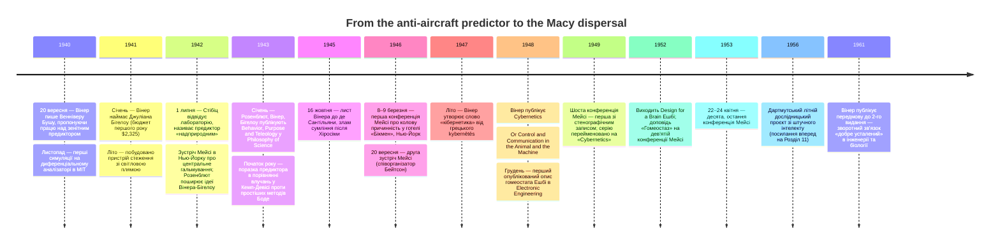

:::tip[В одному абзаці]
Між 1940 і 1953 роками сформувалася паралельна дослідницька програма — збудована на фізичних машинах зі зворотним зв'язком, міждисциплінарних лабораторних зустрічах і словнику стернування та гомеостазу радше, ніж логіки. Кібернетика мала власну невдалу збройову програму (Вінерів зенітний предиктор), основоположну статтю (Розенблют, Вінер, Бігелоу, 1943), інституційний майданчик (конференції Мейсі в готелі «Бікмен») і канонічну машину (гомеостат Ешбі). До 1953 року синтез почав розпорошуватися у дисципліни, що його породили.
:::

<strong>Дійові особи</strong>

| Ім'я | Роки життя | Роль |
|---|---|---|
| Норберт Вінер | 1894–1964 | Професор математики, MIT. Праця над зенітним предиктором (1940–1943); співавтор статті 1943 року; утворив слово «кібернетика» від грецького *kybernētēs* улітку 1947 року; опублікував «Cybernetics» 1948 року. Відійшов від засекреченої збройової роботи після Хіросіми. |
| Джуліан Бігелоу | 1913–2003 | Інженер-електрик із підготовкою в MIT; найнятий Вінером у січні 1941 року для схем зенітного предиктора. Сконструював навмисно мляву «пілотну» ручку керування, що імітувала людську затримку реакції, у пристрої стеження зі світловою плямою 1941 року. Співавтор статті 1943 року. |
| Артуро Розенблют | 1900–1970 | Кардіолог і фізіолог; працював із Вінером у дискусійній групі Гарвардської медичної школи до 1944 року. Співавтор «Behavior, Purpose and Teleology». |
| Воррен Мак-Каллок | 1898–1969 | Нейрофізіолог; голова та інтелектуальний модератор конференцій Мейсі від 1946 року. Архітектор суворої політики дисциплінарного паритету відвідуваності. Перехресне посилання на Розділ 5 щодо логічного числення Піттса-Мак-Каллока 1943 року. |
| В. Росс Ешбі | 1903–1972 | Директор з досліджень у лікарні Барнвуд-Гаус, Глостер. Сконструював гомеостат (уперше опубліковано 1948 року в *Electronic Engineering*; формалізовано в книжці «Design for a Brain» 1952 року). Представив «Гомеостаз» на дев'ятій конференції Мейсі (1952). Відмовлявся називати свою машину «розумною» — лише «ультрастабільною». |
| Грегорі Бейтсон | 1904–1980 | Антрополог; співорганізатор другої зустрічі Мейсі на тему «Teleological Mechanisms in Society» (20 вересня 1946 року). Сформулював підсумкову фразу: «Гадаю, що кібернетика — це найбільший укус від плоду Дерева пізнання, який людство зробило за останні 2000 років». |

<strong>Хронологія (1940–1961)</strong>

<strong>Словник простими словами</strong>

- **Кібернетика** — Утворене Вінером 1947 року від грецького *kybernētēs* («стерновий») слово, що назвало поле, яке формувалося від 1942 року під ранішими ярликами («колові причинні механізми», «зворотний зв'язок»).
- **Негативний зворотний зв'язок** — Контур керування, у якому система вимірює різницю між поточним і цільовим станом і використовує сигнал похибки, щоб скерувати наступну дію так, аби *зменшити* похибку. Термостат — підручниковий приклад. Кібернетика піднесла негативний зворотний зв'язок із терміна керування до операційного визначення *цілі*.
- **Телеологія (у кібернетичному сенсі)** — У статті Розенблюта-Вінера-Бігелоу 1943 року «телеологічну поведінку» переформульовано в суто механічних термінах: як поведінку, керовану негативним зворотним зв'язком. Метафізичні прочитання телеології як майбутньої причини, що діє на теперішнє, відкинуто.
- **Конференції Мейсі** — Серія з десяти закритих міждисциплінарних зустрічей (1946–1953), що їх фінансував Фонд Джозаї Мейсі-молодшого, організовував Френк Фрімонт-Сміт і головував Мак-Каллок. Приблизно по 20 учасників на зустріч за суворою політикою дисциплінарного паритету. Перші п'ять не мали стенографічного запису; конференції 6–10 (1949–1953) застенографував Гайнц фон Ферстер.
- **Сервомеханізм** — Термін з керувальної інженерії: система зі зворотним зв'язком, що приводить вихід у відповідність до цільового входу — гарматні наводчики, автопілоти, заводські позиціонери. Стаття 1943 року навмисно ототожнила «сервомеханізм» із кібернетичною телеологією.
- **Гомеостат** — Електромеханічна демонстрація *ультрастабільної* системи, що її Ешбі побудував 1948 року: чотири блоки з магнітами на осях, жолобами з водою та електродами, виходами тріодів і кроковими перемикачами шукали конфігурацію, яка повертала б магніти до центру. Демонстрував пошук рівноваги, а не маніпуляцію символами. Ешбі відмовлявся від прикметника «гомеостатичний» — пріоритет належав Кенноновому терміну 1932 року.

20 вересня 1940 року, коли німецьке Люфтваффе вело повітряну кампанію проти Британії, що значно загострилася після серпневого «Дня орла», математик Норберт Вінер написав Венніверу Бушу. Шукаючи собі роль у воєнних зусиллях, що розгорталися, Вінер запропонував знайти якийсь «куточок діяльності», де він міг би стати в пригоді під час надзвичайного стану. Його конкретна пропозиція стосувалася керування зенітним вогнем. Виклик збити маневровий літак був за своєю суттю проблемою екстраполяції: зенітна гармата мала вистрелити не туди, де літак був, а туди, де він буде, коли долетить снаряд.

До листопада 1940 року Вінер випробовував теоретичні моделі цього зенітного предиктора на механічному диференціальному аналізаторі Буша в Массачусетському технологічному інституті, симулюючи прямолінійні траєкторії, траєкторії з подвоєним нахилом, параболічні та напівколо-інтегральні типи. Усвідомивши, що йому потрібен інженерний досвід, аби перекласти статистичні теорії на функційну апаратуру, Вінер у січні 1941 року найняв Джуліана Бігелоу, інженера-електрика з підготовкою в MIT. Проєкт фінансувала секція D-2 Національного комітету оборонних досліджень під керівництвом Воррена Вівера. Масштаб задуму був рішуче скромним; бюджет першого року становив лише $2,325, з яких $1,200 виділили на побудову схем і приблизно $450 — на три людино-місяці часу на диференціальному аналізаторі. Порівняно з масивними федеральними витратами, що невдовзі поллються в Радіаційну лабораторію та Мангеттенський проєкт, зенітний предиктор був мізерною операцією.

Малий бюджет важливий, бо закріплює проєкт у тому матеріальному світі, який він насправді посідав. Це не була загальна воєнна обчислювальна програма, що чекала, аби стати програмним забезпеченням. Це був вузько окреслений аналоговий експеримент з керування вогнем, збудований навколо наявної техніки в MIT і нагальної операційної проблеми затриманої реакції. Диференціальний аналізатор міг симулювати криві, але не перетворював Вінерову теорію на повторно вживану цифрову процедуру. Запропонований предиктор мусив бути втілений як схеми, фільтри, органи керування та випробувальні траси. Навіть патентні домовленості наслідували ранішу сервомеханічну програму, підкреслюючи, що доступною інституційною категорією для проєкту була не «мисляча машина», а апаратура зі зворотним зв'язком.

Упродовж літа 1941 року Вінер і Бігелоу спорудили симуляційну апаратуру в лабораторії MIT. Пристрій мав проєктор світлової плями, що кидав на стіну нерівномірну, стрибливу білу пляму. Бігелоу, який був активним пілотом, сконструював навмисно мляву ручку керування, покликану мати «відчуття» справжнього органу керування, щоб імітувати притаманну фізіологічну затримку людини-оператора. Оператор використовував би цю ручку, щоб вести другу кольорову пляму в переслідуванні першої, генеруючи дані стеження, які подавалися безпосередньо в схеми предиктора.

Сцена була навмисно штучною, але саме штучність і була суттю. Літак під обстрілом не можна було привести в лабораторію. Маневр ухиляння пілота довелося стиснути до керованого сліду: пляма на стіні, людська рука, що відстає, друга пляма, що намагається стежити за першою, і схеми, що силкуються вивести наступне положення з нещодавнього минулого. Тож наукова засновок предиктора вже був поведінковим. Він не моделював намірів пілота, питаючи, у що пілот вірив чи чого боявся. Він моделював пілота як патерн поправок під обмеженням — тіло й машина разом намагаються зменшити позиційну похибку, поки ціль рухається.

Якийсь час інженерні результати здавалися навдивовижу багатообіцяльними. 1 липня 1942 року Джордж Стібіц із лабораторій Белла відвідав лабораторію й спостерігав предиктор у дії. Він записав у щоденнику, що для часу випередження приблизно у дві секунди статистичний предиктор Вінера й Бігелоу «творить дива». Демонстрація була така вражальна, що Стібіц занотував, як Воррен Вівер «погрожує принести наступного разу ножівку й перепиляти ніжки столу, аби перевірити, чи немає десь прихованих дротів».

Та все ж остаточний вирок проєктові визначили б не лабораторні демонстрації, а жорсткі дані стеження. Наприкінці 1942 року команда проаналізувала льотні траси 303 і 304, записані з інтервалом в одну секунду Зенітною радою в Кемп-Девісі, Північна Кароліна. У грудні 1942-го й січні 1943 року Вінер уклав для Вівера таблицю порівняння влучань, зіставивши свій статистичний метод із двома простішими геометричними предикторами, що їх розробив Гендрик Боде в лабораторіях Белла. Результати показали, що статистичний предиктор лише ледь не дотягнув. На трасі 303 простий метод Боде дав 6 влучань, десятисекундний метод Боде — 22, а складний статистичний метод Вінера — 23. На трасі 304 простий метод Боде дав 35, десятисекундний метод — 55, а метод Вінера — лише 49. Як дієва зброя предиктор був щонайбільше трохи кращим на одній трасі й виразно гіршим на іншій.

Вінер рекомендував призупинити подальше дослідження предиктора до кінця війни. На початку 1943 року він написав Віверу, визнаючи поразку: «Я й досі шкодую, що не зміг створити чогось, аби вбити кількох ворогів, замість того щоб лише показати, як не треба намагатися їх убивати».

Суперечність у джерелах важлива. Щоденник Стібіца за липень 1942 року вловив реальний інженерний ефект: пристрій міг виглядати приголомшливо, коли лабораторна ціль рухалася достатньо плавно, щоб статистична апаратура встигала її випередити. Порівняння в Кемп-Девісі вловило іншу істину: проти справжніх даних стеження вишуканий статистичний предиктор не виправдовував себе перед простішими геометричними екстраполяторами Боде. Кібернетика виросте з обох цих фактів водночас. Її перша машина не була ні тріумфом, ні соромом, який варто забути. Це був інженерний майже-успіх, чий концептуальний здобуток перевищив його збройовий результат.

## Поведінка, ціль і телеологія

Хоча зенітний предиктор зазнав невдачі як військова зброя, він удався як концептуальний тигель. Інженерна рамка, яку Вінер і Бігелоу збудували, щоб моделювати пілота, що ухиляється від зенітного вогню, трактувала людину-оператора не як свідому сутність, що робить вільний вибір, а як компонент, що намагається мінімізувати похибку між ціллю та своїм поточним положенням. Пілот під обстрілом діяв «як сервомеханізм, що намагається подолати внутрішню затримку, спричинену динамікою його літака».

Щоб формалізувати це прозріння, Вінер і Бігелоу звернулися до Артуро Розенблюта, кардіолога й фізіолога, який тоді працював із Вінером у дискусійній групі Гарвардської медичної школи. Вони поставили Розенблюту конкретне клінічне питання: чи є якийсь відомий патологічний стан, у якому пацієнт, намагаючись виконати довільну дію на кшталт того, щоб узяти склянку води, проскакує ціль і впадає в некеровані коливання? Розенблют відповів негайно. Цей стан відомий як «цільовий тремор» і характерно пов'язаний з ушкодженням мозочка. Для Вінера й Бігелоу висновок був ясний: неврологічно вражений пацієнт поводився точнісінько як система зі зворотним зв'язком із недостатнім демпфуванням.

Цей міждисциплінарний синтез кульмінував у січні 1943 року публікацією статті «Behavior, Purpose and Teleology» за співавторством Розенблюта, Вінера й Бігелоу. Принципово, що статтю розмістили не в інженерному чи фізіологічному журналі, а в *Philosophy of Science* — на майданчику, що обрамив амбіції статті широко. Лише на семи щільних сторінках автори запропонували вичерпну біхевіористську таксономію, що охоплювала і живі організми, і машини. Поведінку, доводили вони, можна класифікувати як активну чи пасивну; активну поведінку — як цілеспрямовану чи безцільну (випадкову); цілеспрямовану поведінку — як зі зворотним зв'язком чи без нього; а поведінку зі зворотним зв'язком — як передбачувальну чи непередбачувальну. Передбачувальну поведінку вони далі поділили на порядки, порівнюючи передбачення першого порядку з котом, що женеться за мишею, передбачення другого порядку — з киданням каменя в рухому ціль, а вищі порядки — з використанням пращі чи лука.

Порядок таксономії виконував філософську роботу. Автори не починали з розуму, свідомості чи репрезентації. Вони починали зі спостережуваної поведінки та джерела енергії, що уможливлювало дію. Пасивною була поведінка, у якій об'єкт не постачав енергії для відгуку. Активна — постачала. Звідти ключовим поділом було те, чи можна витлумачити активність як спрямовану до кінцевого стану, чи вона випадкова. Лише після того, як ці розрізнення стали на місце, у міркування входив зворотний зв'язок. Зворотний зв'язок не був декоративною метафорою; він був механізмом, що дозволяв трактувати ціль як операційну властивість, а не внутрішній стан.

Найрадикальнішим філософським маневром статті було її перевизначення телеології. Історично її вважали метафізичною незручністю, що передбачала майбутні причини, які діють на теперішні події; тут телеологію переформулювали в суто механічних термінах. «Телеологічна поведінка стає, отже, синонімом поведінки, керованої негативним зворотним зв'язком», — писали автори. За цим визначенням торпеда, оснащена механізмом самонаведення, була за своєю суттю цілеспрямованою, і інженерний термін «сервомеханізм» був достоту правильним її означенням.

Передбачення загострило це твердження. Непередбачувальна система зі зворотним зв'язком могла коригувати лише проти теперішньої похибки між своїм поточним станом і своєю ціллю. Передбачувальна система зі зворотним зв'язком могла діяти щодо майбутнього положення, що його передбачає рух цілі. Це була достоту та воєнна проблема, яку Вінер і Бігелоу щойно не змогли розв'язати достатньо добре для керування зенітним вогнем. Стаття 1943 року зберегла інтелектуальну структуру невдачі, відкинувши засекречену зброю. Рухомий літак став загальним випадком переслідування; затримка оператора стала загальною проблемою виправлення похибки; предиктор став одним членом у родині цілеспрямованих механізмів.

Щоб проілюструвати, як біологічні системи спираються на ті самі принципи, вони задіяли аналогію з хворобою мозочка, що й запалила співпрацю: «Якщо, однак, його попросити перенести склянку води зі столу до рота, то рука, що несе склянку, виконуватиме серію коливальних рухів зі зростальною амплітудою в міру наближення склянки до рота, так що вода розіллється й ціль не буде досягнута». Відтак автори «наважуються припустити, що головна функція мозочка — це керування нервовими механізмами зворотного зв'язку, задіяними в цілеспрямованій руховій активності». Ціль уже не була неспостережуваним психічним станом; вона стала вимірюваною властивістю механічного контуру виправлення похибки.

## Конференції Мейсі

Словник зворотного зв'язку, виправлення похибки та колової причинності швидко набув інституційного розгону. 1942 року Розенблют поширив ранні ідеї Вінера-Бігелоу на нью-йоркській зустрічі про центральне гальмування, що її фінансував Фонд Джозаї Мейсі-молодшого, — захід, на якому був присутній нейрофізіолог Воррен С. Мак-Каллок. Наприкінці зими 1943–1944 років Вінер і математик Джон фон Нейман скликали в Принстоні спільну зустріч, що звела разом інженерів, фізіологів і математиків. Мак-Каллок і Лоренте де Но представляли фізіологів, Герман Голдстайн був присутній як конструктор обчислювальних машин, а фон Нейман, Волтер Піттс і Вінер представляли математику. Наприкінці принстонського зібрання всім стало ясно, що є істотна спільна база ідей і що слід докласти певних зусиль, аби виробити спільний словник.

Навесні 1946 року Мак-Каллок домовився з Фондом Мейсі провести присвячену цим темам окрему конференцію. Медичний директор Фонду Френк Фрімонт-Сміт, відомий як «містер Міждисциплінарна конференція» за свій досвід в організації інших серій медичних зустрічей, застосував до нового предмета свій стандартний робочий формат. Перша конференція про колову причинність відбулася 8 і 9 березня 1946 року в готелі «Бікмен» на Парк-авеню в Нью-Йорку. Фрімонт-Сміт виконував роль адміністративного організатора, а Мак-Каллок діяв як інтелектуальний модератор. Початкова назва серії була «Circular Causal and Feedback Mechanisms in Biological and Social Systems».

Конференції Мейсі дотримувалися суворого формату: закрита група приблизно з двадцяти основних учасників збиралася на два дні, заповнюючи час неформальними доповідями, розлогими дискусіями та спільними трапезами. Мак-Каллок наполягав на суворому дисциплінарному паритеті, навмисно балансуючи склад квотами по троє математиків, троє фізіологів, троє психіатрів, троє соціологів і троє психологів. Рекомендації нових членів відхиляли, якщо вони порушили б цей дисциплінарний паритет, через що зустрічі лишалися значною мірою закритими для зовнішніх запитів.

Це була інфраструктура, а не просто гостинність. Формат змушував математика, фізіолога, психіатра, антрополога й інженера лишатися в одній маленькій кімнаті достатньо довго, щоб дізнатися про взаємні технічні роздратування одне одного. Він також обмежував поширення руху. Закрита зустріч могла породити інтенсивність, але не могла створити того відкритого каналу набору, який давав би журнал, лабораторний курс чи спільна формальна нотація. Рання серія Мейсі будувалася, щоб плекати міждисциплінарний переклад серед вибраних учасників, а не щоб готувати ціле поле в масштабі.

Організатори намагалися залучити абсолютно найвищі ешелони науки, але не всі погодилися. Бертран Рассел, Альберт Ейнштейн і Алан Тюрінг — кожен відхилив запрошення. Рассел відмовився, посилаючись на втому після американського «вояжу» на початку 1953 року. Ейнштейн відбувся зневажливою заувагою, схарактеризувавши тему лише як «прикладну математику» — корисний інструмент для «фахівців», але ділянку, де його власні знання надто «поверхові», щоб щось привнести. Тюрінг, чия робота над машиною ACE та воєнною криптографією досконало поєднувала математичну й інженерну царини, що їх група прагнула об'єднати, відмовився, пославшись на те, що він «домосід»; він указав на початок нового академічного семестру й, імовірно, плекав міркування конфіденційності.

Цим відхиленим запрошенням не слід надавати надмірного значення як поразці престижу. Вони показують амбіцію Мак-Каллока щодо складу учасників і межі мережі, яку він міг зібрати. Відсутність Тюрінга особливо промовиста, бо вона утримує розділ від того, щоб звести кібернетику до всієї історії обчислень. Група Мейсі та британська праця над цифровими машинами були сусідніми, обізнаними зі спільними питаннями, частково пов'язаними через таких постатей, як фон Нейман і Бігелоу, але вони не були тим самим інституційним проєктом.

Попри помітні відсутності, група Мейсі викувала те, що пізніше визнають за потужний тристовповий синтез інтелектуальних течій 1940-х. Цей синтез спирався на логічне числення нервової діяльності Піттса й Мак-Каллока 1943 року, на теорію інформації Клода Шеннона, що тоді поставала, і на поведінкову теорію зворотного зв'язку Вінера-Бігелоу-Розенблюта 1943 року. Це була смілива спроба поєднати універсальну теорію цифрових машин, стохастичну теорію символьного зв'язку та недетерміновану, проте телеологічну теорію зворотного зв'язку, щоб пояснити все — від біологічних організмів до економічних і естетичних явищ.

Щоб суспільні науки були цілком інтегровані, антропологи Маргарет Мід і Грегорі Бейтсон стали основними членами групи. Бейтсон навіть допоміг організувати другу зустріч Мейсі під назвою «Teleological Mechanisms in Society» 20 вересня 1946 року. Третя зустріч того ж року розширила соціологічний фокус, залучивши Пола Лазарсфельда, Мід і Ф. С. К. Нортропа. Результатом був не вузький інженерний семінар із принагідними біологічними аналогіями. Від самого початку конференції трактували зв'язок, соціальну організацію, економічний вибір і нервове керування як можливих членів однієї родини колових причинних систем. Бейтсон, розмірковуючи про амбіцію руху, пізніше зауважив: «Гадаю, що кібернетика — це найбільший укус від плоду Дерева пізнання, який людство зробило за останні 2000 років».

Поле дістало свою остаточну назву 1948 року, коли Вінер опублікував книжку «Cybernetics: Or Control and Communication in the Animal and the Machine». Вінер утворив цей термін улітку 1947 року від грецького *kybernētēs*, що означає «стерновий», навмисно шукаючи нового ярлика, щоб охопити цю міждисциплінарну рамку. Після публікації книжки серія Мейсі офіційно перейменувала себе на «Cybernetics» 1949 року.

За весь час свого існування десять конференцій Мейсі з кібернетики відбулися між 1946 і 1953 роками. Перші п'ять конференцій (1946–1948) ніколи не стенографували, через що дискусії доводиться реконструювати з листування й порядків денних. Опубліковані праці почалися з шостої конференції, що відбулася 24–25 березня 1949 року, де Гайнц фон Ферстер перебрав роль секретаря й почав вести суворий стенографічний запис.

Ця асиметрія важлива для історика. Саме ті зустрічі, що зробили інституційний злам від воєнної праці над предиктором до міждисциплінарного руху, є тими зустрічами, чиї усні обміни найменше піддаються відновленню. Багатий на цитати запис Мейсі належить здебільшого до періоду після того, як назва усталилася й після того, як фон Ферстер почав готувати редаговані праці. Для перших п'яти конференцій збережені свідчення тонші: порядки денні, листування, списки учасників і пізніші спогади. Тому розділ опирається спокусі зробити ранні зустрічі задокументованішими, ніж вони є насправді. Інституція була реальна; поверхня стенограми — нерівна.

## Гомеостат

Хоча зустрічі Мейсі давали теоретичну й соціальну інфраструктуру, рух кібернетики потребував також фізичної демонстрації. Якщо зенітний предиктор був основоположним інженерним артефактом руху, то канонічною машиною був гомеостат, що його сконструював В. Росс Ешбі, директор з досліджень у лікарні Барнвуд-Гаус у Глостері, Англія. Бібліографія Ешбі датує перший опублікований опис груднем 1948 року в статті в *Electronic Engineering*, але звірений опис конструкції для цього розділу походить із книжки 1952 року «Design for a Brain» (ґрунтовно переробленої у другому виданні 1960 року) та з його праці «An Introduction to Cybernetics» 1956 року.

Метою Ешбі було не збудувати машину, що міркує висловленнями. Він хотів фізичного відображення *ультрастабільної* системи: системи, що могла б пережити збурення, знайшовши нову конфігурацію, у якій її істотні змінні поверталися в межі норми. Тому гомеостат не був моделлю маніпуляції символами. Це була модель адаптивної рівноваги. Її драматизм полягав у спостереженні за тим, як фізична система перебирає власні зв'язки, аж доки її стрілки не вгамуються.

Гомеостат був електромеханічним утіленням пошуку рівноваги. Фізична конструкція машини, позначена як Частина A, складалася з чотирьох взаємопов'язаних блоків. Кожен блок ніс згори магніт на осі, чиє кутове відхилення від центрального положення давало одну з чотирьох головних змінних системи. Перед кожним магнітом був жолоб з водою з електродами на кінцях, що забезпечували градієнт потенціалу. Прикріплений до магніта дріт занурювався у воду, знімаючи залежний від положення електричний потенціал, який подавався на сітку тріода, даючи анодний вихід, пропорційний відхиленню магніта.

Цю неперервну аналогову поведінку керувала дискретна комутаційна система, позначена як Частина B. Ця секція містила електричне реле й чотири 25-позиційні крокові перемикачі, причому кожна позиція перемикача несла резистор певної величини. Така архітектура давала 781 250 можливих внутрішніх конфігурацій для Частини B. Поведінку машини визначало правило зв'язку між двома частинами: реле було знеструмлене тоді й лише тоді, коли магніти в Частині A були стабільні у своїх центральних положеннях. Щойно магніти відхилялися від центру — чи то через внутрішню нестабільність, чи то через те, що експериментатор вручну збурював блок, — реле опинялося під струмом. Поки воно було під струмом, жоден зі станів Частини B не був рівноважним, через що крокові перемикачі безперервно рухалися й переналаштовували внутрішні параметри опору. Перемикачі перебирали випадкові конфігурації, аж доки система не натрапляла на набір параметрів, за яких магніти Частини A поверталися до центральної рівноваги. У цю мить реле знеструмлювалося, перемикачі спинялися, і машина «запам'ятовувала» стабільний стан, утримуючи положення перемикачів.

Число 781 250 легко сприйняти хибно — за обчислювальну загальність. Воно нею не було. Воно походило з двох станів реле, помножених на чотири 25-позиційні крокові перемикачі, тобто 2 × 25⁴. Здобутий простір пошуку був великим для настільної електромеханічної апаратури, але це був простір пошуку налаштувань резисторів у фіксованій системі з чотирьох блоків. Гомеостат не розбирав вхідних даних, не зберігав символьного опису й не виконував відокремлюваної процедури. Вона змінювала власні внутрішні зв'язки, аж доки аналогові змінні тієї самої апаратури не поверталися до стабільного центру.

Коли Ешбі представив свою працю на дев'ятій конференції Мейсі 1952 року під назвою «Гомеостаз», сесія викликала жваве коло запитань. Вінер запитав прямо: «Що за випадково з'єднана мережа всередині цієї скриньки?» Ешбі, воліючи тримати теоретичний фокус на рівні принципів радше, ніж спускатися до самих лише схем кіл, перевів розмову на часткові функції, повні функції, східчасті функції та нульові функції у випадкових мережах.

Цей обмін найкраще передає стиль Мейсі. Вінер почув у гомеостаті питання про випадкові мережі; Мак-Каллок, Піттс, Бігелоу, Віснер та інші напосідали зі своїми дисциплінарними кутами зору; Ешбі намагався тримати дискусію на рівні функцій і стабільності радше, ніж на особливостях апаратури. Машина дала групі спільний об'єкт, навколо якого можна було сперечатися. Вона також оголила, як сильно кібернетика все ще залежала від об'єктів, чия фізична конструкція виконувала теоретичну роботу.

Принципово, що гомеостат демонстрував достоту те, що кібернетика стверджувала про ціль, і нічого більше. Машина довела, що електромеханічна система може автономно знайти шлях назад до ультрастабільності через пошук у багатих на часткові функції просторах станів. Ешбі ретельно уникав роздування тверджень. Він називав систему «ультрастабільною», а не розумною. Він навіть відмежувався від мовного тлумачення поведінки машини; у примітці він написав: «Їй дали назву „гомеостат“ для зручності посилання, і цей іменник видається прийнятним. Проте похідні „гомеостатичний“ і „гомеостатично“ невдалі, бо вони наводять на думку про покликання на машину, тоді як пріоритет вимагає, щоб їх уживали лише як похідні від Кеннонового „гомеостазу“».

Гомеостат також висвітлив притаманні обмеження кібернетичного аналогового субстрату. Він був цілковито прив'язаний до задачі. 781 250 конфігурацій крокових перемикачів змінювали лише внутрішні параметри зв'язку апаратури рівноваги з чотирма магнітами. Гомеостат не можна було перепрограмувати, щоб відфільтровувати сигнал від шуму, так само як не можна було перепрограмувати зенітний предиктор, щоб грати в шахи. Фізична структура цих машин *була* їхньою програмою.

Це найсильніший сенс, у якому кібернетика була паралельною до символьного ШІ програмою, а не його передісторією. Кібернетичні машини робили ціль видимою через кероване виправлення похибки, стабільність, переслідування й адаптацію. Вони ще не давали середовища, у якому ту саму машину можна було б проінструктувати виконувати докорінно іншу інтелектуальну задачу. Цифровий комп'ютер зі збереженою програмою міг, принаймні в принципі, відокремити машину від програми. Гомеостат — не міг. Його розумність, якщо хтось хотів би вжити це небезпечне слово, була невіддільна від його магнітів, реле, жолобів, електродів і крокових перемикачів.

## Наслідки

Розпорошення мало не одну причину, і джерела не підтримують єдиного чистого пояснення. Аналоговий субстрат важив: предиктор і гомеостат були потужними прикладами, але поганими шаблонами для загальної перепрограмовної дослідницької програми. Формат Мейсі важив: закрита міждисциплінарна розмова могла породити словник і дружби, не виробивши спільного технічного середовища. Власний моральний розрив Вінера із засекреченою збройовою роботою теж важив, але його треба тримати прив'язаним до Вінера, а не узагальнювати на кожного учасника Мейсі.

Привид ядерної зброї глибоко змінив погляди Вінера. 16 жовтня 1945 року, лише за два місяці після бомбардувань Хіросіми й Наґасакі, Вінер написав філософові Джорджо де Сантільяні: «Відколи впала атомна бомба, я оговтуюся від гострого нападу сумління як один із науковців, що виконував воєнну роботу й що бачив свою воєнну роботу частиною більшого тіла, яке використовують у спосіб, що його я не схвалюю… Я серйозно розглядав можливість облишити свої наукові продуктивні зусилля, бо не знаю способу публікуватися, не дозволяючи моїм винаходам потрапити в негідні руки».

Через два дні, 18 жовтня, Вінер склав листа до президента MIT Карла Т. Комптона, проголошуючи намір «остаточно й цілковито полишити наукову роботу» й відступити на ферму на селі. Хоча він не звільнився, цей лист позначив остаточний пацифістський розрив. Виклад Галісона пов'язує цей приватний розрив із пізнішою публічною відмовою Вінера брати участь у засекречених військових дослідженнях. Ця відмова вилучила самого Вінера з повоєнного шляху збройового фінансування, яким далі користувалися інші математики й інженери. Але вона не зробила пацифістською всю групу Мейсі й сама собою не пояснює пізнішого розпорошення кібернетики.

Конференції Мейсі провели свою десяту, останню зустріч 22–24 квітня 1953 року, і серія завершилася без формального розпуску. Коли Вінер написав передмову до другого видання «Cybernetics» 1961 року, ландшафт уже невідворотно змінився. Він зауважив, що «роль зворотного зв'язку як в інженерному проєктуванні, так і в біології стала добре усталеною. Роль інформації та техніка вимірювання й передавання інформації становлять цілу дисципліну для інженера, фізіолога, психолога й соціолога». Ранні, основоположні моделі були перевершені; «прості лінійні зворотні зв'язки… тепер бачаться куди менш простими й куди менш лінійними, ніж видавалися з першого погляду».

Рух кібернетики не зазнав поразки; радше він успішно розподілив свої прозріння між своїми складовими дисциплінами. Теорія інформації увібрала символьний і стохастичний виміри зв'язку; керувальна інженерія успадкувала аналогові механізми зворотного зв'язку, що привело до сервомеханізмів і керування процесами; нейрофізіологія зберегла логічний субстрат Мак-Каллока-Піттса; а психіатрія й антропологія інтегрували поняття соціального зворотного зв'язку. Розпорошення не лишило жодної єдиної кібернетичної інституції з правом власності на весь синтез. Воно також лишило питання про «мислячу машину» відкритим для іншої коаліції, яка могла привласнити його як власну дослідницьку програму. 1956 року Дартмутський літній дослідницький проєкт збере це питання під новою назвою — штучний інтелект — і за іншого технічного припущення: що розумність можна осягати через цифрове символьне обчислення, а не через аналогові машини, чиї тіла були їхніми програмами.

:::note[Чому це досі важливо сьогодні]
Словник зворотного зв'язку, керування й гомеостазу настільки вкорінений у сучасній інженерії та біології, що взагалі перестав виглядати як чийсь внесок. Термостати, автопілоти, ПІД-регулятори, роботизовані руки, коди з виправленням похибок, телеметрія тренувального циклу та сигнал винагороди в замкненому контурі навчання з підкріпленням — усі вони спадкоємці перевизначення цілі як поведінки, керованої негативним зворотним зв'язком, що його дала стаття 1943 року. Обмеження аналогового субстрату кібернетики теж видиме в сучасному поділі: усе, що потребує бути перепрограмовним для докорінно інших задач, працює на цифровій апаратурі зі збереженою програмою; усе, що потребує неперервного, швидкого керування фізичним станом із малою затримкою, досі використовує спеціалізовані контури зворотного зв'язку зі структурою, вбудованою в субстрат.
:::
