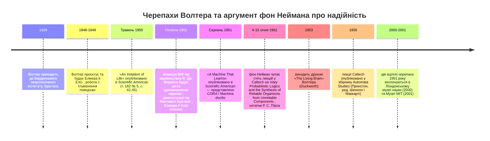

:::tip[В одному абзаці]
Між 1948 і 1949 роками нейрофізіолог В. Ґрей Волтер побудував дві електронні черепахи — Елмера й Елсі — у Берденському неврологічному інституті. Маючи крихітний набір сенсорів, ламп, двигунів і контактів, вони досліджували, шукали світло, оминали перешкоди й підзаряджалися. Волтерова *Machina speculatrix* довела, що життєподібна поведінка не потребує мозку, але поведінкою була сама схемотехніка; переглянути її означало перебудувати схему. У січні 1952 року лекції фон Неймана в Caltech кількісно окреслили стіну масштабування для надійних машин, побудованих із ненадійних частин.
:::

<strong>Дійові особи</strong>

| Ім'я | Роки життя | Роль |
|---|---|---|
| В. Ґрей Волтер | 1910–1977 | Нейрофізіолог, народжений у Канзас-Сіті; директор фізіологічного відділу Берденського неврологічного інституту (BNI), Брістоль, від 1939 року; конструктор *Machina speculatrix*. |
| Джон фон Нейман | 1903–1957 | Професор Інституту перспективних досліджень, Принстон; прочитав п'ять лекцій у Caltech (січень 1952 року) про ймовірнісні логіки та надійні організми з ненадійних компонентів. |
| Р. С. Пірс | — | Конспектатор лекцій фон Неймана в Caltech у січні 1952 року; текст *Automata Studies* 1956 року «спирається на нотатки, зроблені Р. С. Пірсом». |
| В. Дж. «Банні» Воррен | — | Інженер BNI, якого Волтер залучив після війни; побудував надійнішу партію 1951 року з шести вдосконалених черепах, що уможливили публічні демонстрації. |
| Овен Е. Голланд | — | Робототехнік, чия стаття 2003 року в *Phil. Trans. R. Soc. A* є зчепленим першоджерелом для схемного відтворення та біографічних деталей розділу. |
| Бернарда Брайсон Шан | — | Художниця, чиї вісім стилізованих ескізів супроводжували статтю Волтера «An Imitation of Life» у *Scientific American* за травень 1950 року. |

<strong>Хронологія (1939–2001)</strong>

<strong>Словник простими словами</strong>

- **Machina speculatrix** — Волтерова назва роду його електронних черепах. Латинське *speculatrix* означає «та, що спостерігає» або «дослідниця»; Волтер вигадав цей термін, щоб позначити їх як інструменти для перевірки того, скільки нервоподібної поведінки можна породити невеликою кількістю взаємодійних частин.
- **Фотоелемент (фотоелектрична комірка)** — пристрій, чий електричний вихід змінюється залежно від світла, що на нього падає. «Оком» черепахи був єдиний фотоелемент, заекранований так, щоб бачити лише те, що лежало прямо перед переднім ведучим колесом; напруга з фотоелемента керувала першим каскадом дволампового підсилювача.
- **Мультивібратор** — двокаскадний електронний генератор, що перемикається туди-сюди між двома станами. У черепасі схема оминання перешкод перетворювала звичайний двокаскадний підсилювач на мультивібратор щоразу, коли замикався контакт на панцирі; реле RL1 і RL2 тоді коливалися, породжуючи характерний візерунок «удар — відступ — обхід».
- **Тропізм (позитивний / негативний)** — Волтерів термін для орієнтації до стимулу (позитивний) або від нього (негативний). Черепаха виявляла позитивний тропізм до помірного світла й негативний тропізм від інтенсивного світла, причому поріг був закладений у поведінці насичення підсилювача.
- **Мультиплексування (у сенсі фон Неймана)** — техніка надійності, у якій кожну обчислювальну лінію замінюють пучком паралельних ліній, а істинний стан визначають голосуванням за більшістю серед них. Січневі лекції фон Неймана 1952 року в Caltech показали, що розмір пучка швидко зростає з цільовою надійністю.
- **Середня довжина вільного пробігу (між помилками)** — запозичено з фізики, де вона означає середню відстань, яку частинка долає між зіткненнями. Фон Нейман уживав цей вислів для середнього часу, який обчислювальна машина працює до системно-руйнівної помилки.
- **Апаратура-як-програма** — устрій, у якому поведінку машини задано фізичним розташуванням її компонентів. Елмер та Елсі були канонічним прикладом; архітектурний шлях виходу — відокремлення того, *що* машина робить, від того, *як* з'єднано її частини, — є темою Розділу 8.

Між 1948 і 1949 роками нейрофізіолог В. Ґрей Волтер, американець за народженням, спроєктував та побудував дві електронні черепахи — піонерські прототипи штучного роду, який він назвав *Machina speculatrix*. Проєктування цих черепах і скрупульозне тлумачення їхньої поведінки відбувалися протягом цих двох вирішальних років у Брістолі (Голланд, 2003, с. 2087). Сам Волтер був різнобічною постаттю. Народжений 19 лютого 1910 року в Канзас-Сіті, штат Міссурі, він провів майже всю свою кар'єру по той бік Атлантики, у Сполученому Королівстві, а помер у Кліфтоні (Брістоль) у травні 1977 року.

До 1939 року Волтер обійняв посаду нейрофізіолога в Берденському неврологічному інституті (BNI) у Брістолі, де очолював фізіологічний відділ. Він залишався в BNI десятиліттями, безперервно працюючи аж до 1970 року, коли важка аварія на моторолері різко обірвала його активну дослідницьку кар'єру. В історії кібернетики Волтер посідає унікальне місце. Як описав Родрі Гейворд і процитував Овен Голланд (2003, с. 2088), Волтер мав публічний образ «бунтаря» та «відчайдуха», проте за суттю був радше клініцистом-практиком, ніж відлюдкуватим аутсайдером. Він незмінно отримував належне визнання своїх досягнень від спільноти електроенцефалографії (ЕЕГ).

Це важливо, бо черепах легко подати як відхилення самотнього винахідника, тоді як архівні дані вказують на вужчий і цікавіший випадок. Повсякденною роботою Волтера було не будування театральних роботів. Це була клінічна та експериментальна нейрофізіологія всередині установи, заснованої для вивчення нервової системи. У короткій авторській примітці до статті 1950 року *Scientific American* представив його не як шоумена чи інженера, а як директора фізіологічного відділу Берденського неврологічного інституту в Брістолі (Волтер, 1950, с. 45). Черепахи належали саме до цього контексту: невеликі робочі моделі, побудовані нейрофізіологом, який намагався перевірити, скільки нервоподібної поведінки можна породити дуже малою кількістю взаємодійних елементів.

Принципово, що електронні черепахи, якими Волтер нині найвідоміший, становили лише незначну частку його доробку за все життя. Проєкт черепах не був остаточним поворотом убік від його основної клінічної роботи з ЕЕГ. Як документує Голланд, проєкт вилився лише в один розділ Волтерової книжки 1953 року *The Living Brain* та жменьку статей серед 174, зафіксованих за його авторством у бібліографії BNI (Голланд, 2003, с. 2088). Елмер та Елсі були важливі не тому, що Волтер покинув нейрофізіологію заради робототехніки, а тому, що короткий побічний проєкт усередині неврологічної установи дав напрочуд чистий доказ для ширшого твердження: життєподібна, цілеспрямована поведінка не потребувала надзвичайно складної, мозкоподібної архітектури.

Перша наукова публікація про черепах дійшла до загалу в травневому числі *Scientific American* за 1950 рік під назвою «An Imitation of Life». Займаючи чотири сторінки (з 42-ї по 45-ту), стаття пропонувала доступний вступ до Волтерових витворів, лишаючи багато конструкційних деталей для пізніших джерел. Текст супроводжувала серія з восьми стилізованих ескізів художниці Бернарди Брайсон Шан (Голланд, 2003, с. 2089). На початку Волтер відрізнив кібернетичний підхід від простої ілюзії. Імітацію життя, зауважив він, можна досягти магією чаклунського образу, яка «вдовольняється копіюванням зовнішнього вигляду», але наукова імітація життя «більше переймається продуктивністю та поведінкою» (Волтер, 1950, с. 42).

Це розрізнення дало Волтеру змогу представити черепах радше як інструменти, ніж як ляльки. Питання було не в тому, чи можна змусити оболонку з металу та пластику нагадувати тварину. Питання було в тому, чи здатна машина майже без жодних частин рухатися середовищем у спосіб, який спостерігач звично описав би біологічними дієсловами: шукаючи, оминаючи, обираючи, повертаючись, годуючись і взаємодіючи. Волтер поставив свою роботу поряд із ранішими нерухомими кібернетичними пристроями, зокрема гомеостатом В. Р. Ешбі, але черепаха додала рухливості. Вона мусила зустрічати світ, а не просто осідати у внутрішню рівновагу.

Волтер охрестив рід своїх машин *Machina speculatrix*. Перших двох прототипних черепах він прозвав Елмером та Елсі — акронімами, утвореними з конкретних термінів, що їх описують: «ELectro MEchanical Robots, Light-Sensitive, with Internal and External stability» (електромеханічні роботи, світлочутливі, з внутрішньою та зовнішньою стабільністю) (Волтер, 1950, с. 42). У напрочуд короткому абзаці Волтер виклав повний перелік їхньої апаратури. Машини покладалися на дивовижно мінімальне обладнання: «дві мініатюрні радіолампи, два органи чуття, один для світла, а другий для дотику, та два ефектори, або двигуни, один для повзання, а другий для керування. Живлення їм постачає мініатюрна анодна батарея B від слухового апарата та мініатюрний шестивольтовий акумулятор» (Волтер, 1950, с. 42).

Попри цей мінімалізм, поведінка, змальована в статті, була тонко розмаїтою. Волтер описав безперервне циклоїдальне дослідження, коли черепаха діяла в темряві. Рухоме своїм сканувальним двигуном, око черепахи постійно обнишпорювало середовище. Коли фотоелемент виявляв помірно яскраве світло, черепаха виявляла позитивний тропізм, полишаючи свої циклоїдальні блукання заради прямого, орієнтованого руху до світла. Однак якщо світло виявлялося надто інтенсивним — як-от «ліхтарик за шість дюймів» — черепаха зазнавала негативного тропізму, за якого вона «різко відвертала вбік і шукала лагіднішого клімату» (Волтер, 1950, с. 43).

У складніших середовищах черепахи демонстрували надзвичайну здатність орієнтуватися серед суперних стимулів. Поставлена між двома привабливими джерелами світла, черепаха не завмирала, як Буріданів осел, паралізований між двома однаковими оберемками сіна. Натомість вона прокладала «складний шлях наближення та відступу», щоб розв'язати конфлікт (Волтер, 1950, с. 43). Волтер також докладно описав цикл підзарядки черепахи. Усередині «хатки» чи «буди» він установив зарядний пристрій і 20-ватну лампу. Коли внутрішній акумулятор черепахи починав сідати, її підсилювач ставав надчутливим. Унаслідок цього 20-ватна лампа, яка зазвичай відштовхнула б повністю заряджену черепаху, ставала вкрай привабливою.

Черепаха заходила до буди й під'єднувалася до зарядного пристрою. «Тієї миті, коли струм потече в колі між зарядним пристроєм і батареями, — пояснював Волтер, — власні нервова система й двигуни створіння автоматично від'єднуються; зарядка триває, доки напруга батареї не підніметься до максимуму» (Волтер, 1950, с. 43). Щойно зарядка завершувалася, внутрішні кола автоматично під'єднувалися знову. Тепер повністю заряджена, черепаха знову знаходила яскраву 20-ватну лампу глибоко відразливою й відкочувалася геть назустріч новим пригодам.

Волтер далі відзначив механізм оминання перешкод. Панцир черепахи був установлений на єдиному гумовому контакті; коли його відхиляла перешкода, вмикалася схема мультивібратора. Важлива деталь полягала не просто в тому, що черепаха задкувала. У цьому режимі контакт пригнічував звичайний пошук світла й перетворював пересування на візерунок зіткнення, відступу та обходу. Машина поводилася так, наче перцепцією тимчасово заволоділа фрустрація.

Волтер також описав, як додавання маленької сигнальної лампочки до схеми керування наділяло машини цілком новим режимом поведінки. Опинившись перед дзеркалом, черепаха бачила власну мерехтливу сигнальну лампочку, через що модель «мерехтіла й сіпалася перед своїм відображенням у спосіб настільки специфічний, що, якби це була тварина, біолог мав би підстави приписати їй здатність до самовпізнавання» (Волтер, 1950, с. 45). Це застереження виконує справжню роботу. Волтер не стверджував буквального самовпізнавання для Елмера чи Елсі. Він казав, що якби тварина поводилася так, біолог міг би слушно вдатися до такого опису. Та сама обачність стосується взаємодії двох черепах, у якій світло кожної машини могло стати частиною сенсорного світу іншої, призводячи зрештою до статечного відступу. Або, у сценарії, який Волтер назвав «собака на сіні», черепаха, що втручалася, могла перепинити знесиленому товаришеві шлях до буди, «через що нужденнішому судилося згаснути від виснаження в полі зору порятунку» (Волтер, 1950, с. 45). Захищаючи простоту своєї конструкції, Волтер підрахував, що лише шість елементів могли б породжувати «новий візерунок кожну десяту частку секунди впродовж 280 років — учетверо більше за людський вік у 70 років» (Волтер, 1950, с. 43).

## Усередині панцира

Якщо стаття у *Scientific American* за травень 1950 року пропонувала загалу поведінкову розповідь, то реальність усередині панцира ґрунтувалася на точній, жорстко-з'єднаній інженерії. Голланд зауважує, що популярна стаття давала лише найкоротший конструкційний опис; схемний погляд походить із пізнішої книжки Волтера, архівних діаграм BNI та Голландового їх відтворення (Голланд, 2003, с. 2089, 2098–2102). У Волтеровому брістольському домашньому кабінеті, перетвореному на майстерню, черепаха була радше скінченним автоматом, опосередкованим через реле, ніж безперервним аналоговим варивом. Як докладно викладає Голланд (2003, с. 2099–2100) на основі архівних діаграм, осердя «мозку» черепахи складалося з двох мініатюрних термоелектронних ламп, або радіоламп, з'єднаних як двокаскадний підсилювач.

Сенсорні входи були суто механічними та фотоелектричними. «Оком» був єдиний фотоелемент, оснащений кожухом, що блокував світло з усіх напрямків, окрім переднього. Принципово, що цей фотоелемент був установлений на тому самому вертикальному шпинделі, що й переднє ведуче колесо. Це механічне вирівнювання забезпечувало, що око завжди дивилося точно в тому напрямку, у якому рухалася черепаха. Напруга з цього фотоелемента керувала струмом першого каскаду підсилювача. Перший каскад, своєю чергою, керував струмом другого каскаду, який живив дві котушки реле, RL1 та RL2. Ці реле відповідали за перемикання кермового двигуна та ходового двигуна між станами «вимкнено», «півпотужності» та «повної потужності». Голландове пояснення схеми додає невелику, але промовисту асиметрію: RL1 було під'єднано до лінії живлення через фару та резистор, тож воно могло видавати лише близько половини струму RL2, під'єднаного безпосередньо (Голланд, 2003, с. 2100). Поведінка поставала саме з такого влаштованого дисбалансу, а не з прихованого центрального контролера.

Конструкційне шасі черепахи спиралося на три колеса: єдине переднє ведуче колесо, яке також оберталося навколо вертикальної осі, щоб скеровувати машину, та два задні колеса без власного приводу. Прозорий пластиковий панцир спочивав на єдиному гумовому кріпленні. Це кріплення тримало кільцевий контакт, що замикався щоразу, коли панцир відхилявся силою тяжіння на схилі або через фізичний контакт із перешкодою. До того ж невелика фара, лампочка-ліхтарик, була ввімкнена послідовно з кермовим двигуном, через що засвічувалася лише тоді, коли кермовий двигун був активний. Ця сигнальна лампочка, видима через отвір у передній частині панцира, уможливлювала складні взаємодії машини з дзеркалами та з іншими черепахами.

Система живлення була так само обмежена, як і система керування. Волтерів перелік 1950 року відокремлював мініатюрну анодну батарею B від слухового апарата від мініатюрного шестивольтового акумулятора, причому останній постачав струми A та C для ламп, а також струм для двигунів (Волтер, 1950, с. 42). Це розмежування допомагає пояснити, чому сцена з будою важила як інженерія, а не лише як театр. Черепаху було збудовано довкола скінченного бортового запасу енергії, зарядного пристрою та лампи, чий поведінковий сенс змінювався зі станом батареї. Те, що в демонстрації виглядало як апетит, було зсувом зміщення в невеликому підсилювачі, прив'язаному до схеми підзарядки.

Взаємодія цих компонентів виливалася в чотири окремі режими поведінки, які Волтер пізніше формалізував у неопублікованому машинописі BNI 1960 року («Machina speculatrix — нотатки про роботу»), уживши літери E, P, N та O (Голланд, 2003, с. 2100–2102).

Поведінка E означала дослідження. За відсутності привабливого джерела світла ходовий двигун працював на півшвидкості, тоді як кермовий двигун безперервно обертався на повній швидкості. Це створювало характерну циклоїдальну траєкторію черепахи та безперервне сканування середовища.

Поведінка P означала позитивний тропізм. Коли фотоелемент вирівнювався з помірно яскравим світлом, струм першого каскаду трохи спадав, а струм другого каскаду помітно зростав, вмикаючи реле RL2. У цьому стані кермовий двигун не отримував струму, тоді як ходовий двигун отримував повний струм, штовхаючи черепаху прямо до світла.

Поведінка N означала негативний тропізм. Коли фотоелемент натрапляв на сильне, інтенсивне джерело світла, обидва каскади підсилювача насичувалися. Реле RL1 перемикало свій стан; поворотний двигун повертався до повної швидкості, тоді як ходовий двигун лишався на повній швидкості, з оберненим ефектом керування. Унаслідок цього черепаха відвертала вбік від сліпучого джерела.

Поведінка O означала оминання перешкод. Коли черепаха стикалася з предметом, панцир на гумовому кріпленні відхилявся, замикаючи кільцевий контакт. Це перетворювало двокаскадний підсилювач на мультивібратор. Реле починали коливатися, а вхід від фотоелемента цілком пригнічувався. Як описував це Волтер, «усі стимули ігноруються, а її хода перетворюється на послідовність ударів, відступів і обходів» (Волтер, 1950, с. 44). Це коливання тривало близько секунди після того, як перешкоду було подолано, діючи як «коротка пам'ять про фрустрацію», що забезпечувала черепасі широкий обхід небезпеки, перш ніж відновити пошук.

Ось чому пізніше протиставлення «аналогового» та «цифрового» є надто грубим для Волтерової машини. Око та підсилювач були безперервними пристроями, але названі поведінки були станами, опосередкованими через реле: дослідження, позитивний тропізм, негативний тропізм та оминання перешкод. Елмер та Елсі вже були гібридами. Вони не містили збереженого списку інструкцій, але й не були суто аналоговими комп'ютерами безперервної дії в пізнішому сенсі. Їхня логіка жила в розташуванні ламп, реле, батарей, двигунів, контактів і лампи.

## Апаратура — це програма

Архітектура Елмера та Елсі — безперервний фотоелементний підсилювач, що керує дискретними, опосередкованими через реле станами поведінки, — утілювала всеохопну конструкторську філософію Волтера. У Додатку C до *The Living Brain* (1953) Волтер виклав три суворі умови того, що він уважав легітимною робочою моделлю біологічних явищ. По-перше, він вимагав, щоб «кілька рис загадки були відомі». По-друге, він наполягав, що «модель мусить містити абсолютний мінімум робочих частин, аби відтворити відомі риси». По-третє, він приписував, що «модель мусить відтворювати інші риси — або як передбачення, або як несподівані поєднання» (Волтер, 1953, с. 280, цитовано в Голланд, 2003, с. 2095).

Це був мінімалізм не заради самої лише елегантності. Це був метод біологічного аргументу. Якби модель уживала забагато частин, джерело її поведінки стало б важко локалізувати; якби вона вживала замало, то не змогла б відтворити цільове явище. Черепаха мала сидіти саме на цьому лезі. Вона мала достатньо структури, щоб шукати, оминати, підзаряджатися та взаємодіяти, але так мало частин, що читач міг правдоподібно простежити поведінку назад крізь схему. Волтерова амбіція полягала не в тому, щоб симулювати кожну деталь нервової системи тварини. Вона полягала в тому, щоб показати, що малий аналог відношень нервової системи здатен породжувати додаткові риси, причому ці риси не встановлюються окремо.

Для Волтера фізична модель була прямим утіленням теоретичних відношень. «Модель — це просто аналог одного набору знайомих математичних виразів, що стосуються пасивних мереж, з'єднаних нелінійним оператором у вигляді розрядної лампи, — писав він. — Її цілком можна було б скласти з хімічних чи механічних частин, і в теорії вона не містить більше інформації, ніж алгебричні рівняння» (Волтер, 1953, с. 284–286, цитовано в Голланд, 2003, с. 2095–2096). Приголомшливий комбінаторний вихід черепах — де шість елементів могли породжувати новий візерунок кожну десяту частку секунди впродовж 280 років — слугував його головним захистом мінімалізму. Модель із малою кількістю компонентів могла, у принципі, дослідити майже невичерпний простір станів.

Однак цей самий комбінаторний захист водночас виявляв центральне вузьке місце підходу: апаратура була програмою. Емерджентна поведінка черепахи була нерозривно пов'язана з її фізичною схемотехнікою. Єдиним способом переглянути базову логіку машини чи змінити її репертуар поведінок було відкрити панцир і перебудувати схему. Поведінковий репертуар організму був зафіксований схемною діаграмою його компонентів.

Ця зафіксованість не робила поведінку простою. Вона робила перегляд дорогим. Нове відношення між світлом, дотиком, керуванням і приводом не було новою інструкцією, набраною в пам'яті; це було нове фізичне влаштування. Той самий факт, що надавав Волтеровій моделі доказової сили, водночас обмежував її майбутнє. Оскільки робочих частин було мало, їхні причинові ролі можна було оглянути. Оскільки робочі частини були фізичними, зміна цих ролей означала переробку машини. Вузьке місце, інакше кажучи, полягало не в тому, що черепаха була аналоговою. Воно полягало в тому, що поведінка моделі та її схемотехніка були тим самим об'єктом.

До того ж початкове втілення цієї філософії потерпало від тяжкої механічної крихкості. Як зауважує Голланд, Елмера й Елсі «нашвидкуруч склепали з надлишкових компонентів воєнного часу та брухту — наприклад, їхні шестерні були вилучені зі старих газових лічильників і будильників» (Голланд, 2003, с. 2092). Через свою імпровізовану конструкцію прототипні черепахи були хронічно ненадійними. На той час, коли наближався Фестиваль Британії 1951 року, що приніс попит на публічні демонстрації знаменитих роботизованих створінь, оригінальні моделі вже не були життєздатними.

Щоб задовольнити попит, Волтер мусив покластися на В. Дж. «Банні» Воррена та інженерну команду BNI, які побудували свіжу партію з шести вдосконалених черепах на початку 1951 року. Хоча ця нова партія зберегла майже ідентичну логіку схеми порівняно з прототипами, механічна інженерія була значно надійнішою, нарешті надавши стабільну платформу для виставок (Голланд, 2003, с. 2092, 2099). Самих Елмера й Елсі, схоже, було списано приблизно в той самий час. Ця заміна є важливою поправкою до романтики. Ще до того, як хтось спробував масштабувати цей принцип у велику штучну нервову систему, два оригінальні дослідницькі інструменти були достатньо крихкими, щоб публічні демонстрації потребували ретельніше сконструйованого покоління.

Ця крихкість не була моральною хибою Волтерового бачення, а також не означала, що аналогові обчислення були недійсними. Вона ілюструвала, що побудова надійної поведінки безпосередньо з фізичних компонентів робила ці прототипи ламкими, оголюючи концептуальну стелю парадигми «апаратура-як-програма». Перша стеля була практичною: брухтові шестерні, деталі зі старих газових лічильників та делікатні лампи робили прототипи ненадійними. Друга стеля була архітектурною: додавання нових поведінок означало додавання чи перекомпонування фізичних механізмів. Лекції фон Неймана 1952 року зробили б той самий різновид стелі кількісним, але в набагато більшому масштабі.

## Калтехівське числення фон Неймана

Кількісні межі надійної поведінки з ненадійних частин було формалізовано математично в січні 1952 року, коли Джон фон Нейман прочитав серію з п'яти лекцій у Каліфорнійському технологічному інституті. Названі *Probabilistic Logics and the Synthesis of Reliable Organisms from Unreliable Components*, лекції було виголошено між 4 та 15 січня. Першоджерельним текстом є машинопис лекцій у Caltech у передруку Інституту перспективних досліджень; він спирався на нотатки, зроблені Р. С. Пірсом і переглянуті фон Нейманом, а пізніше стаття з'явилася у збірнику 1956 року *Automata Studies* (фон Нейман, 1952, IAS PDF с. 1).

Лекції фон Неймана відкрилися радикальним переосмисленням відношення між обчисленням і відмовою компонента. Замість трактувати відмову як прикрий інженерний артефакт, який можна просто відшліфувати геть, фон Нейман підніс помилку до основоположного принципу проєктування. «Тому помилку розглядають не як сторонню та хибно скеровану чи таку, що хибно скеровує, випадковість, — доводив він у вступному розділі, — а як суттєву частину розглядуваного процесу, причому її важливість у синтезі автоматів цілком зіставна з важливістю того чинника, який зазвичай беруть до уваги, — задуманої та правильної логічної структури» (фон Нейман, 1952, IAS PDF с. 1).

У розділі 10 свого тексту фон Нейман увів поняття базових компонентів, які відмовляють із певною ймовірністю під час кожної операції (фон Нейман, 1952, IAS PDF с. 37). Базовими органами в навколишньому аналізі були цифрові логічні елементи, як-от органи штриха Шеффера та мажоритарні органи, тож лекцію не можна вживати як доказ того, що цифрові машини були звільнені від цієї проблеми. Вони були саме проблемним випадком. Щоб подолати притаманну ненадійність, він проаналізував, як помилки поширюються і як їх можна придушити. Запропонованим ним механізмом було мультиплексування: заміна кожної окремої обчислювальної лінії в мережі пучком із N паралельних ліній і визначення істинного стану системи голосуванням за більшістю серед цих ліній.

Цю ідею легко сформулювати й дорого впровадити. Якщо один компонент може відмовити, продублюй його; якщо дублікати можуть відмовляти незалежно, ужий їх багато й дай більшості переголосувати помилки. Заковика в тому, що кількість потрібних надлишкових ліній залежить від бажаної надійності всієї машини, а не лише від надійності однієї частини. Мала демонстрація може стерпіти видимі негаразди. Велика обчислювальна машина не може дозволити, щоб одне хибне спрацювання зіпсувало весь прогін. Тому приклад фон Неймана питав, яка надлишковість знадобилася б для звичайної, скінченної інженерної цілі, а не для ідеальної машини.

Щоб продемонструвати приголомшливу вартість цього підходу, фон Нейман подав докладний опрацьований приклад у розділі 10.5.3.1. «Розгляньмо спершу обчислювальну машину з 2500 вакуумних ламп, кожна з яких спрацьовує в середньому раз на 5 мікросекунд, — припустив він. — Припустімо, що бажана середня довжина вільного пробігу між помилками становить 8 годин» (фон Нейман, 1952, IAS PDF с. 45). За цей восьмигодинний період, підрахував він, система зазнала б величезних 1,4 × 10¹³ спрацювань. Щоб досягти цільової середньої довжини вільного пробігу без системно-руйнівного збою, потрібна частота помилок на одне спрацювання мала бути зникомо малою: приблизно 7 × 10⁻¹⁴.

Застосувавши свою математику мультиплексування для досягнення такого ступеня надійності від базових, ненадійних вакуумних ламп, фон Нейман підрахував потрібну надлишковість. Він визначив, що система потребувала б коефіцієнта мультиплексування N ≈ 14 000. Простими словами, ліки були більшими за хворобу. Комп'ютер на 2500 ламп, зроблений надійним цим методом, не просто додав би кілька запобіжних кіл навколо вразливих компонентів; логічна комунікація машини мусила б нестися в пучках по 14 000 ліній (фон Нейман, 1952, IAS PDF с. 46).

Висновок, зроблений у розділі 11.1, був ясним і нещадним. «Техніка мультиплексування непрактична на рівні нинішньої технології, — заявив фон Нейман, — але цілком практична для досконалішої технології, яку цілком можна уявити, та для природних релейних органів (нейронів)» (фон Нейман, 1952, IAS PDF с. 47). Цей вирок не був суцільним засудженням аналогових кіл, а також не був простим схваленням цифрових обчислень. Комп'ютер на 2500 вакуумних ламп з опрацьованого прикладу фон Неймана сам був цифровою, дискретно-станною машиною. Протиставлення лекції було не аналогове проти цифрового. Це було нинішня технологія компонентів проти майбутньої мікрокомпонентики, достатньо щільної, достатньо дешевої та достатньо численної, щоб зробити надлишковість практичною.

Натомість фон Нейман окреслив стіну масштабування. Виклик побудови високонадійних, складних організмів із фундаментально ненадійних фізичних компонентів був нездоланним за брутальної сили мультиплексування апаратури 1952 року. Дволампові черепахи Волтера елегантно обійшли потребу в мозку, але математика фон Неймана попереджала, що будь-яка спроба масштабувати ту саму технологію компонентів у складну, мозкоподібну архітектуру заплатить нищівний податок надійності.

Дві історії не варто силоміць зводити в пряму лінію впливу. Першоджерельні дані тут не містять свідчень, що Волтер і фон Нейман листувалися про черепах або що хтось із них читав роботу іншого у відповідний момент. Їхній зв'язок є структурним. Волтер показав, скільки поведінки можна отримати від крихітного жорстко-з'єднаного організму в реальному середовищі. Фон Нейман показав, наскільки болісно було б будувати великий надійний організм, перемножуючи ненадійні компоненти. Разом вони роблять аналогове вузьке місце точнішим: малі жорстко-з'єднані машини могли дивувати спостерігачів, але надійність і придатність до перегляду не масштабувалися простим додаванням фізичних частин.

## Що було далі

Утім усвідомлення цього вузького місця не вилилося в раптовий похорон Волтерової кібернетичної роботи. Сам Волтер ніколи не змальовував черепах як переможену методологію, і Голландова розповідь веде лінію вперед крізь CORA, *Machina docilis* та пізнішу роботу над IRMA, а не зупиняється на Елмері й Елсі (Голланд, 2003, с. 2110–2114). По суті, навіть коли оригінальні черепахи, складені з брухту, насилу зберігали свою фізичну цілісність, Волтер уже дивився за їхні межі. У завершальному, спрямованому в майбутнє абзаці своєї статті в *Scientific American* за травень 1950 року він проголосив свій наступний концептуальний стрибок.

«Складніші моделі, що ми їх зараз будуємо, мають кола пам'яті, у яких асоціації зберігаються як електричні коливання, — писав Волтер, — тож створіння можуть вивчати прості трюки, повільно їх забувати й швидше перевчатися. Ця компактна, пластична та легкодоступна форма короткочасної пам'яті може бути дуже подібна до того, як мозок установлює простіші й більш скороминущі умовні рефлекси» (Волтер, 1950, с. 45).

Це бачення матеріалізувалося наступного року як CORA — акронім від Conditioned Reflex Analogue (аналог умовного рефлексу), який Волтер представив у своїй статті «A Machine That Learns» за серпень 1951 року. CORA становила амбітну спробу втілити вироблення умовних рефлексів за Павловим в апаратурі. Голландова зчеплена цитата, узята з Волтера 1951 року, достатня, щоб показати напрям руху. В одному влаштуванні специфічним стимулом було помірне світло, а нейтральним — свисток; після повторюваних поєднань модель починала йти на свисток так, наче то було світло (Волтер, 1951, с. 62, через Голланд, 2003, с. 2112–2113). В іншому влаштуванні специфічний стимул постачав дотик, тож свисток, поєднаний зі зіткненням, міг пізніше запускати відступ. Протокол тренування був яскраво прямим: «Після дюжини стусанів модель знатиме, що свисток означає халепу, тож господар може відводити її від небезпеки» (Волтер, 1951, с. 62, через Голланд, 2003, с. 2112–2113).

CORA загострює межу, а не розчиняє її. Волтер не зупинився на пошуку світла та оминанні перешкод і не трактував Елмера й Елсі як завершений глухий кут. Він не переставав питати, скільки пластичності можна отримати з доступних кіл. Водночас CORA також підтверджує центральне обмеження: саме навчання все ще будували як схему. Асоціація, пам'ять, забування та перевчання ще не були окремими програмами, накладеними на стабільну машину загального призначення. Вони лишалися фізичними влаштуваннями коливань, сенсорів і відгуків.

Водночас механічну спадщину лінії *Machina speculatrix* було збережено. З шести надійних, удосконалених черепах, сконструйованих командою В. Дж. Воррена для Фестивалю Британії 1951 року, дві спромоглися дожити до сучасної доби. Ці взірці ранньої кібернетичної апаратури зрештою знайшли постійний дім у поважних установах: одна потрапила на експозицію в Лондонському музеї науки 2000 року, а інша приєдналася до Музею MIT 2001 року (Голланд, 2003, с. 2092).

Зрештою Волтерові електронні черепахи були суттєвим містком в історії штучного інтелекту. Вони довели, що життєподібна, цілеспрямована поведінка могла поставати з мінімальної мережі фізичних компонентів. Але ненадійні компоненти та жорстке обмеження «апаратура-як-програма» означали, що складна поведінка не могла нескінченно масштабуватися простим додаванням нових реле та підсилювачів. Архітектурний шлях виходу — відокремлення того, *що* машина робить, від того, *як* фізично з'єднано її частини, — уже опрацьовували паралельно в Інституті перспективних досліджень. Це й є темою наступного розділу. Цей розділ завершується на вузькому місці, а не на похороні.

:::note[Чому це досі важливо сьогодні]
Дві теми цього розділу досі формують робочі системи. *Апаратура-як-програма* — поведінка, зафіксована схемотехнікою, — це й досі те, як працюють замовні кристали та FPGA; відповідь, до якої Волтер ще не міг дійти, — відокремлення логіки від фізичного компонування — нині є усталеною в усьому, від мікроконтролерів, що виконують прошивку, до GPU, що виконують тензорні ядра. *Надійність із ненадійних частин* — фон-Нейманове трактування помилки як суттєвої, а не побічної — є конструкторським принципом кожної сучасної розподіленої системи, від масивів RAID та консенсусу блокчейну до виборів лідера в Kubernetes. Черепахи Волтера також передбачили тихішу ідею: що цілеспрямована поведінка може поставати з невеликої кількості вдало дібраних петель зворотного зв'язку, а не з центрального контролера.
:::
