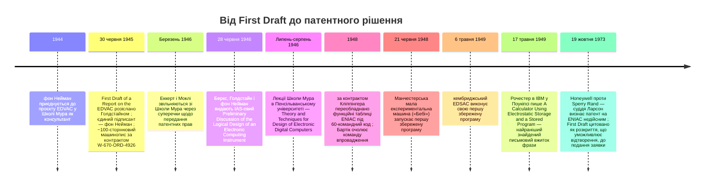

:::tip[В одному абзаці]
30 червня 1945 року *First Draft of a Report on the EDVAC* Джона фон Неймана — 100-сторінковий машинопис, розмножений на мімеографі й позначений лише його іменем — запропонував поділити цифрову обчислювальну систему на п'ять логічних органів і зберігати інструкції в записуваній пам'яті поряд із даними. Через рік IAS-овий *Preliminary Discussion* Беркса, Голдстайна та фон Неймана уточнив це правило. Поштова розсилка *First Draft* позбавила чинності патентні претензії Еккерта й Моклі. Сама фраза «stored program» з'явилася пізніше — у внутрішньому звіті IBM.
:::

<strong>Дійові особи</strong>

| Ім'я | Роки життя | Роль |
|---|---|---|
| Джон фон Нейман | 1903–1957 | Математик IAS; консультант проєкту EDVAC у Школі Мура від літа 1944 року; єдиний підписант *First Draft* (30 червня 1945 року); співавтор IAS-ового *Preliminary Discussion* (1946). |
| Дж. Преспер Еккерт-молодший | 1919–1995 | Головний інженер-електрик проєкту ENIAC у Школі Мура; співрозробник із Моклі концепції наступника EDVAC; звільнився в березні 1946 року через передання патентних прав; дав інтерв'ю для проєкту усної історії OH 13 у 1977 році. |
| Джон Моклі | 1907–1980 | Професор фізики в Урсінус-коледжі; запропонував ENIAC у своєму меморандумі для Школи Мура в серпні 1942 року; співрозробник EDVAC разом з Еккертом. |
| Герман Г. Голдстайн | 1913–2004 | Зв'язковий від Артилерійського управління армії при Школі Мура; розіслав копії *First Draft* улітку 1945 року; співавтор IAS-ового *Preliminary Discussion*. |
| Джин Дженнінгс Бартік | 1924–2011 | Одна з перших шести програмісток ENIAC; очолила команду з чотирьох програмісток, яка 1948 року переобладнала функційні таблиці ENIAC, щоб ті вмістили 60-командний код. |
| Натаніель Рочестер | 1919–2001 | Інженер IBM у Поукіпсі; автор внутрішнього звіту від 17 травня 1949 року «A Calculator Using Electrostatic Storage and a Stored Program» — найранішого знайденого письмового вжитку цієї фрази. |

<strong>Хронологія (1944–1973)</strong>

<strong>Словник простими словами</strong>

- **First Draft** — машинопис від 30 червня 1945 року «First Draft of a Report on the EDVAC, by John von Neumann», приблизно 100 сторінок, розмножених на мімеографі й розповсюджених за контрактом Артилерійського управління армії США W-670-ORD-4926. На його титульній сторінці зазначено лише фон Неймана; пізніші читачі трактували його як основоположний документ архітектури цифрового комп'ютера.
- **ENIAC** — Electronic Numerical Integrator and Computer, завершений у Школі електротехніки Мура при Пенсільванському університеті 1945 року. Програмувався фізичним перекомпонуванням кабелів і перемикачів, аж доки переобладнання 1948 року не дало йому 60-командний код, що зберігався в його функційних таблицях.
- **EDVAC** — Electronic Discrete Variable Automatic Computer, запропонований наступник ENIAC і предмет *First Draft*. Архітектура пережила документ; сам EDVAC завершили лише 1951 року.
- **Збережена програма (stored program)** — устрій, у якому інструкції машини зберігаються в записуваній електронній пам'яті поряд із даними, так що нову програму можна завантажити, записавши її в пам'ять, а не перемонтувавши машину. Сама фраза «stored program» не вживалася в жодній публікації 1940-х до травня 1949 року.
- **Парадигма сучасного коду** — термін Гейга, Прістлі та Роупа на позначення виконання записуваних інструкцій, що зберігаються в основній пам'яті, на відміну від інших ідей, які пізніше стиснули в збірний ярлик «концепція збереженої програми».
- **Архітектура фон Неймана** — поділ обчислювальної машини на спеціалізовані логічні «органи»: центральну арифметичну частину (CA), центральне керування (CC), пам'ять (M) та ввід/вивід (I, O). Висловлено обережно у *First Draft* і чітко — у звіті IAS 1946 року.
- **Код команд (order code)** — набір числових кодів, які машина трактує як інструкції. Ранні переобладнання використовували невеликі числові коди команд; пізніші машини використовували значно більші та гнучкіші набори команд.

Витоки комп'ютера зі збереженою програмою лежать у виснажливій фізичній праці з обслуговування машин, які йому передували. До середини Другої світової війни завдання обчислення балістичних траєкторій на Абердинському випробувальному полігоні та у Школі електротехніки Мура Пенсільванського університету розрослося понад спроможність традиційних методів. Як зауважує історикиня Дженніфер С. Лайт, «Майже двісті молодих жінок, як цивільних, так і військових, працювали над проєктом людьми-«обчислювачами», виконуючи балістичні обчислення під час війни». За допомогою механічних настільних калькуляторів і диференціального аналізатора Буша одне обчислення траєкторії могло забрати в людини-обчислювачки від двадцяти хвилин до кількох днів. Сам обсяг цих обчислень спонукав до створення ENIAC — розлогого електронного велетня з тисячами вакуумних ламп.

Але швидкість машини породила нове вузьке місце: проблему її конфігурування. У середині 1945 року, коли ENIAC наближався до робочого стану, армійський зв'язковий капітан Герман Г. Голдстайн доручив шістьом найкращим людям-обчислювачкам навчитися програмувати машину й звітувати Джонові Голбертону. Шістьма обраними для цього завдання жінками були Кетлін Макналті, Френсіс Білас, Бетті Джин Дженнінгс, Рут Ліхтерман, Елізабет Снайдер і Марлін Вескофф. Їхнє початкове знайомство з ENIAC було цілком абстрактним, бо їхні допуски до секретної інформації ще не оформили. Макналті пізніше згадувала цей досвід: «Хтось дав нам цілий стос креслень — а це були схеми з'єднань усіх панелей — і сказав: "Ось, розберіться, як працює машина, а тоді розберіться, як її програмувати"».

Програмування ENIAC було не справою написання рядків коду; це була справа фізичного перебудування шляхів машини для кожної нової математичної задачі. ENIAC був паралельною машиною, побудованою з кількома шинами пам'яті, а не з централізованим лічильником команд. Як пояснювала Бетті Джин Дженнінгс (пізніше Бартік), «замість лічильника команд… він мав програмні лотки, які ти втикала й виймала, щоб активувати наступну операцію. А тоді, звісно, яку б операцію ти не виконувала, замість того щоб робити її програмно, доводилося виставляти перемикачі, округлення та все таке інше». Умовне розгалуження вимагало складного влаштування спеціалізованих адаптерів, щоб скеровувати числові дані безпосередньо в лінії керування програмою, тоді як виділений блок Master Programmer керував узгодженням циклів.

Невідповідність між електронною швидкістю та людською працею з налаштування була закладена в устрій зберігання машини. ENIAC мав невелику кількість записуваної електронної числової пам'яті, але значна частина інформації, що змушувала обчислення працювати, жила поза будь-чим, що нагадувало б сучасну пам'ять. Вона жила в програмних лотках, налаштуваннях перемикачів, функційних таблицях і кабельних шляхах. Самі функційні таблиці спершу не проєктувалися як сховище програми. Це були великі банки перемикачів, призначені повертати табульовані математичні значення. Щоб підготувати новий прогін, програмісткам доводилося вирішувати, які блоки виконують які операції, як імпульси рухаються між блоками, де лічитимуться цикли, як слід обробляти знаки й налаштування округлення та як зробити, щоб певна умова змінювала наступну операцію. Помилка могла бути логічною, електричною або просторовою: правильний математичний крок усе одно міг опинитися на панельному шляху, що не відповідав часовим параметрам машини.

Ось чому стос креслень Макналті мав значення. Шістьом жінкам не вручили мову програмування. Їм вручили анатомію машини й попросили вивести метод її використання. Доки вони не отримали регулярного доступу до фізичного ENIAC, діаграми мусили заступати самі панелі. Практика, що з цього постала, не була «програмним забезпеченням» у пізнішому сенсі, але не була й канцелярською роботою. Вона вимагала трактувати математичну процедуру як фізичне коло крізь розподілену машину, де кожне майбутнє розгалуження й повторення перекладалося в налаштування, які ENIAC міг утілити.

Початково очікувалося, що математики чи фізики, яким належали задачі, з'ясують логічні кроки, а шість жінок слугуватимуть просто операторками машини, втикаючи кабелі за інструкціями. Цей поділ праці розпався майже миттєво. Виклик перекладання абстрактної математичної логіки у фізичні обмеження панелей ENIAC був настільки глибоким, що жінкам самим довелося перебрати на себе інтелектуальну роботу програмування. «Наша роль змінилася, — зауважувала Бартік, — тож ми справді були програмістками». Та навіть для досвідчених програмісток фізична інфраструктура ENIAC була принципово немасштабованою. Керівники команди Школи Мура, Дж. Преспер Еккерт і Джон Моклі, розуміли, що наступник ENIAC муситиме цілком відмовитися від моделі «кабель-і-перемикач». Йому потрібно буде зберігати свої інструкції всередині записуваної електронної пам'яті.

## Чернетка фон Неймана

Улітку 1944 року Джон фон Нейман приєднався до проєкту Школи Мура як консультант. На той час обговорення між Еккертом, Моклі та інженерною командою щодо наступника ENIAC — зрештою названого EDVAC — уже тривали. Десятиліттями пізніше Еккерт стверджуватиме, що основоположні ідеї цієї нової архітектури цілком походили від інженерів Школи Мура. Хоча першість лишається спірною, історики Томас Гейг, Марк Прістлі та Кріспін Роуп зауважують, що команда Школи Мура «створила принаймні частину ідей, уміщених у First Draft».

Те, що фон Нейман приніс у проєкт, було не просто новими ідеями, а формальною логічною мовою та незрівнянним академічним авторитетом. Він синтезував тривалі обговорення в єдиний цілісний текст. 30 червня 1945 року машинопис із приблизно 100 сторінок, розмножений на мімеографі, було офіційно розповсюджено за контрактом № W-670-ORD-4926 між Артилерійським управлінням армії Сполучених Штатів і Пенсільванським університетом. На його титульній сторінці значилося рівно одне ім'я: «First Draft of a Report on the EDVAC, by John von Neumann». Ані Еккерта, ані Моклі не зазначили як авторів.

Фізичний документ був скромним: машинопис, відтворений для розповсюдження, а не відшліфована монографія. Уцілілий передрук, підготовлений Майклом Д. Годфрі, зберігає відчуття робочого технічного звіту, де номери розділів виконують значну частину аргументаційної роботи. Годфрі зауважує, що в оригінальній друкарській машинці бракувало грецьких літер, тож математичні символи доводилося вставляти від руки або позначати звичайними літерами. Навіть ця матеріальна деталь важить, бо пізніша фраза «архітектура фон Неймана» може змусити звіт звучати як канонічне креслення, що сходить уже повністю сформованим. Сам артефакт був куди менш остаточним за це: інженерний меморандум воєнного часу, написаний формальною математичною прозою, що рухався в мімеографованих копіях ще до того, як люди, чию роботу він підсумовував, владнали питання авторства та володіння патентом.

Документ запропонував розбити автоматичну цифрову обчислювальну систему на спеціалізовані, відмінні підсистеми. Фон Нейман перелічив п'ять логічних органів. Першим була центральна арифметична частина, яку він позначив CA. Другим — центральне керування, або CC. Третім і найвагомішим була пам'ять, M. У розділі 2.5 тексту фон Нейман сформулював осердя архітектурної засновки проєкту, хоча зробив це з нехарактерною обережністю: «проте спокусливо трактувати всю пам'ять як один орган і зробити її частини навіть якомога взаємозамінними». Ця єдина, уніфікована пам'ять мала б зберігати і числові дані, що обробляються, і інструкції, які скеровують обчислення. Четвертим і п'ятим органами були системи вводу (I) та виводу (O).

Початкові розділи також виявляють, який саме різновид задачі фон Нейман уважав, що формалізує. Він почав не з ділової машини, лабораторного приладу чи калькулятора у звичному настільному сенсі. Він почав з «автоматичної цифрової обчислювальної системи» — пристрою, чию роботу можна розкласти на арифметику, керування, пам'ять і зв'язок із зовнішнім світом. Термінологія «органів» не була декоративною. Вона дала йому змогу відокремити логічні частини комп'ютера від конкретних панелей і штекерів ENIAC. Арифметику можна було трактувати як один орган, керування — як інший, пам'ять — як третій, ввід і вивід — як інтерфейси. Ця абстракція є однією з причин, чому звіт так добре подорожував. Читачі могли сперечатися про апаратуру, усе одно впізнаючи ту саму функційну машину.

Текст також сягнув назад до концептуального словника кібернетики та нейронного моделювання. У розділі 2.6 фон Нейман провів явну аналогію з людським мозком: «Три специфічні частини CA, CC (разом C) і M відповідають асоціативним нейронам у людській нервовій системі. Лишається обговорити еквіваленти сенсорних, або аферентних, і моторних, або еферентних, нейронів». Щоб обґрунтувати цю біологічну метафору, розділ 4.2 формально процитував статтю 1943 року Воррена Маккалока та Волтера Піттса «A logical calculus of the ideas immanent in nervous activity». Отже, документ, який визначить архітектуру цифрового комп'ютера, був явно прив'язаний до абстрактних нейронних мереж своєї доби.

Однак *First Draft* був справді чернеткою — фрагментарним і неповним начерком. Як зауважив Майкл Д. Годфрі, який пізніше підготував сучасний набір документа: «по всьому тексту фон Нейман посилається на подальші Розділи, які, вочевидь, так і не були написані. Найпомітніше, що бракує Розділів про програмування та про систему вводу/виводу». Там, де ці розділи мали б бути, машинопис містив порожні фігурні дужки `{}`. Понад те, текст зробив колаборативне середовище Школи Мура майже невидимим. Пошук у тексті виявляє, що «J. W. Mauchly» згадано в тілі документа рівно один раз — у побіжному дужковому зауваженні, що приписує схему кодування множення. Еккерта не згадано взагалі.

Відсутні розділи не є периферійними упущеннями. Звіт, який пізніші читачі трактуватимуть як документ архітектурного походження, мав мало готового матеріалу про те, як звичайні програмісти насправді користуватимуться машиною. Код команд, описаний у навколишньому обговоренні, був аскетичним. Він не давав пізніших зручностей, які роблять цикли й розгалуження природними на відчуття: ні індексного регістра, ні звичайної інструкції умовного розгалуження, ні незалежного сховища символьних міток. У проєкті, який відтворюють Гейг, Прістлі та Роуп, зміна адресного поля інструкції не була екзотичним трюком, призначеним для тямущих програмістів. Це був механізм, яким цикл міг завершитися, умовний шлях міг бути обраний або міг бути досягнутий наступний елемент послідовності на кшталт масиву. Тож знаменита єдність коду й даних від початку несла технічний тягар. Якщо інструкції були числами в пам'яті, то інструкції могли також ставати об'єктами арифметичних операцій і операцій пересилання.

Попри прогалини, Голдстайн розіслав копії за списком дослідників обчислювальної техніки в Сполучених Штатах і Сполученому Королівстві. Його вплив був миттєвим. За кілька місяців Алан Тюрінг цитував його як остаточне джерело з проєктування комп'ютерів загального призначення у своїй пропозиції для британського проєкту Pilot ACE.

## Переформалізація в IAS

Майже рівно через рік архітектурний начерк *First Draft* було уточнено, формалізовано й перевидано. 28 червня 1946 року Інститут перспективних досліджень у Принстоні, штат Нью-Джерсі, опублікував наступний звіт під назвою *Preliminary Discussion of the Logical Design of an Electronic Computing Instrument*. Документ було видано за контрактом W-36-034-ORD-7481 між Артилерійським управлінням армії та IAS.

Цей новий звіт зробив суттєві корективи в поданні ідей. По-перше, титульна сторінка визнала кількох співавторів: Артура В. Беркса, Германа Г. Голдстайна та Джона фон Неймана зазначили як співавторів. Передмова також трохи розширила коло визнання, дякуючи «д-ру Джонові Тюкі з Принстонського університету за багато цінних обговорень і пропозицій».

Зміна назви також важила. Документ 1945 року був звітом про EDVAC — конкретну машину-наступника, усе ще прив'язану до інженерних обговорень Школи Мура. Звіт IAS 1946 року був «логічним проєктом» для «електронного обчислювального інструмента». Її перші розділи перепредставили машину в загальніших термінах: арифметичний орган, орган пам'яті, орган керування та канали вводу й виводу під керуванням людини. Тож спокусливо, але оманливо трактувати ці два звіти як взаємозамінні. Перший — це грубий і знаменитий документ; другий — чистіше викладення проєкту. Пізніший ярлик «архітектура фон Неймана» черпає значну частину своєї уявної чіткості з формулювання 1946 року.

Принципово, що звіт IAS 1946 року прибрав вагання *First Draft*. Там, де фон Нейман раніше називав «спокусливим» трактувати пам'ять як один уніфікований орган, розділ 1.3 звіту IAS виклав правило з цілковитою ясністю: «Концептуально ми обговорили дві різні форми пам'яті: зберігання чисел і зберігання команд. Однак якщо команди до машини звести до числового коду й якщо машина може якимось чином відрізнити число від команди, то орган пам'яті можна використати для зберігання і чисел, і команд».

Як це відтворюють Гейг, Прістлі та Роуп, проєкт IAS 1946 року визначив механізм розрізнення чисел і команд усередині уніфікованої пам'яті: прапорцевий біт, що позначає кожне слово, причому пересилання в слово-дані перезаписує весь його вміст, а пересилання в слово-інструкцію перезаписує лише його адресне поле. Це влаштування дозволяло програмі безпечно змінювати власні інструкції — структурну необхідність для виконання циклів і умовних розгалужень у коді команд *First Draft*, де зміна інструкції була єдиним наданим механізмом, щоб завершити цикл, виконати умовне розгалуження або змінити адресу, з якої інструкція брала дані. Пізніші проєкти у стилі фон Неймана відкинуть конструкцію з прапорцевим бітом, щойно багатші набори команд зроблять самозмінний код радше необов'язковим, ніж визначальним.

Отже, документ IAS 1946 року є чистішим викладенням архітектури. *First Draft* надав початкову грубу таксономію органів, але звіт IAS сформулював відшліфований набір правил. Однак для Еккерта й Моклі звіт IAS нічого не розв'язав. Хоча Беркса й Голдстайна додали як авторів, два головні інженери Школи Мура все ще були цілком відсутні в основоположній літературі галузі, яку вони допомогли започаткувати.

Ця відсутність тонко вплинула на пізніший словник обчислювальної техніки. «Архітектура фон Неймана» стала назвою стилю поділу на органи: арифметика, керування, пам'ять, ввід, вивід. Але суперечка Школи Мура ніколи не була лише про цю таксономію. Найвагоміша теза Еккерта стосувалася інженерного проєкту наступника EDVAC, включно з технологією пам'яті та рішенням зберігати інструкції в записуваному електронному сховищі. Думка Гейга, Прістлі та Роупа полягає в тому, що пізніший єдиний ярлик ховає кілька різних претензій. Людина могла прийняти роль фон Неймана як формалізатора звіту, відкинути його як єдиного автора інженерних ідей і все ж використовувати звіт IAS 1946 року як найясніше друковане викладення архітектури. Суперечка триває, бо ці позиції не є взаємовиключними.

## Суперечка про авторство та звільнення

Рішення Голдстайна розповсюдити *First Draft* поштою влітку 1945 року мало наслідки, що сягнули далеко за межі академічного престижу. Розповсюдивши технічні деталі проєкту EDVAC серед науковців по всьому світу ще до того, як подали будь-які формальні патентні заявки, Голдстайн фактично передав вміст звіту в суспільне надбання. Юридично машинопис, розмножений на мімеографі, діяв як патентна перешкода.

Десятиліттями пізніше, в інтерв'ю усної історії з Ненсі Стерн у жовтні 1977 року, Дж. Преспер Еккерт запропонував гірке прочитання цих подій. На думку Еккерта, розповсюдження *First Draft* було не просто адміністративним прорахунком чи жестом академічної відкритості, а розрахованим маневром. Він стверджував, що фон Нейман навмисно скинув інженерну роботу команди в суспільне надбання, щоб обійти патентні обмеження, зокрема щоб посприяти власним консультаційним домовленостям. «Дивіться, він продав усі наші ідеї з-під поли в IBM, працюючи на них консультантом», — доводив Еккерт. Його виклад механізму був різким: «фон Нейман пішов і опублікував усю ту всячину. Усі звіти інженерів пішли до Бібліотеки Конгресу, що поставило перешкоду на будь-які патенти, які могли б отримати будь-хто з його працівників» (Eckert OH 13, с. 46–47, за Гейгом-Прістлі-Роупом).

Важлива дисципліна — тримати шари окремо. Розповсюдження звіту задокументоване. Пізніший ефект патентної перешкоди задокументований. Тлумачення мотиву Еккертом теж задокументоване, але воно лишається тлумаченням Еккерта, висловленим через тридцять два роки після тих подій їх головним учасником, який втратив і визнання, і юридичні важелі. Наявні першоджерела не дають розділові змоги вирішити, чи фон Нейман навмисно організував розкриття з пов'язаних з IBM причин, чи Голдстайн розповсюдив звіт за академічними й військовими нормами технічного обміну, чи обидві рамки охоплюють частину тієї самої інституційної плутанини. Що можна сказати — це вужче й твердіше: публічне розповсюдження сталося до відповідних патентних подань, і воно зашкодило здатності Еккерта й Моклі претендувати на виключне володіння розкритим проєктом.

Наслідки були миттєвими й тяжкими. На початку 1946 року конфлікт щодо передання патентних прав розколов команду Школи Мура, що призвело до того, що Еккерт і Моклі цілком звільнилися зі своїх посад. Це звільнення належить до тієї самої інституційної історії, що й титульна сторінка. Річ була не просто в тому, що зі звіту випустили ім'я. Річ була в тому, що робоча група породила ідеї, чиє володіння одночасно владнували військовий контракт, університетська політика, академічне розповсюдження, консультаційні відносини та нова комерційна можливість. *First Draft* зробив технічну архітектуру придатною для поширення. Він так само виніс за межі Школи Мура суперечку про визнання заслуг.

Останній іронічний наслідок розповсюдження *First Draft* надійде лише майже через три десятиліття. 19 жовтня 1973 року в Окружному суді США в окрузі Міннесота суддя Ерл Р. Ларсон виніс своє рішення в знаковій справі *Honeywell, Inc. проти Sperry Rand Corp.* (180 U.S.P.Q. 673). Позов мав на меті визнати недійсним основоположний патент на ENIAC, що належав Sperry Rand — корпоративному наступнику комп'ютерної компанії Еккерта й Моклі. Суддя Ларсон скасував патент. Однією з названих підстав для визнання недійсності було те, що *First Draft* від 30 червня 1945 року становив розкриття, що уможливлює відтворення технології, до подання патентної заявки. Правова система зрештою визнала механізм патентної перешкоди, на який нарікав Еккерт, але зробила це, скасовуючи патент, чию вартість ця скарга мала захищати.

## Перша машина, що справді це зробила

Попри концептуальний стрибок, який представляв *First Draft*, машина, яку він описував — EDVAC — не була першим комп'ютером, що виконав збережений код команд з основного електронного сховища. Першою машиною, що справді виконала інструкції в цьому новому стилі, був, дещо несподівано, сам ENIAC, який після переобладнання 1948 року виконував свій набір команд зі своїх функційних таблиць, доступних лише для читання.

1948 року Річард Кліппінгер, математик Лабораторії балістичних досліджень, ініціював контракт зі Школою Мура, щоб докорінно змінити те, як програмували ENIAC. Замість фізичного скеровування кабелів і виставляння перемикачів для визначення потоку керування, великі банки функційних таблиць ENIAC — спершу спроєктовані для табличного пошуку інтерпольованих математичних значень — перепризначили на зберігання числового набору команд. Джин Дженнінгс Бартік найняли назад, щоб очолити команду з чотирьох програмісток, відповідальну за впровадження цього перетворення.

Архітектура нового набору команд зазнала сильного впливу консультацій у Принстоні. Кліппінгер спершу віддавав перевагу трьохадресному формату команд, але, як згадувала Бартік, «він поговорив із фон Нейманом, і фон Нейман сказав ні, використовувати одноадресну команду». Бартік і Адель Голдстайн здійснювали консультаційні поїздки до Принстона, де, за спогадами Бартік, вони щодня ненадовго зустрічалися з фон Нейманом. Пристрій пам'яті не був елегантним. Це була стара інфраструктура функційних таблиць ENIAC, втиснута в нову роль. Але саме тому це переобладнання є історично виразним: суттєве виконання парадигми сучасного коду не чекало завершення EDVAC. Воно постало завдяки тому, що стару машину навчили трактувати встановлені перемикачами числові записи як команди.

«60-командний код», що з цього постав, глибоко змінив відносини між машиною та її операторами. Щойно перетворення завершили, ручну працю з перемонтування було усунуто. Програми вводили у функційні таблиці числовим способом. Як висловилася Бартік, це зробило так, що жахлива проблема програмування ENIAC зникла — словами самої Бартік. За цією модифікацією 1948 року ENIAC виконав складну математичну програму, що містила умовні розгалуження, зчитування даних за обчисленою адресою та підпрограму, викликану з кількох місць коду — повну, виробничого масштабу демонстрацію нового стилю програмування.

Інші машини швидко прийшли слідом, і зробили вони це з різними технологіями пам'яті. 21 червня 1948 року Манчестерська мала експериментальна машина, відома як «Бебі», запустила свою першу програму, ставши першою системою, побудованою з нуля як комп'ютер зі збереженою програмою. Її основне сховище використовувало трубку Вільямса — електростатичну пам'ять на електронно-променевій трубці. Наступного року, 6 травня 1949 року, EDSAC у Кембриджському університеті виконав свій перший успішний прогін, використовуючи пам'ять на ртутних лініях затримки. Ці машини важать не тому, що вони раз і назавжди залагоджують суперечку про першість, а тому, що показують, як швидко архітектурна ідея відчепилася від проєкту EDVAC. До 1949 року стиль збереженої програми був уже не звітом про одну запропоновану машину. Це були перегони між лабораторіями за те, щоб зробити електронну пам'ять достатньо надійною для команд так само, як і для чисел.

Але сама фраза «stored program» не існувала під час воєнних обговорень, і її не вигадали ні фон Нейман, ні Еккерт, ні Моклі. Архівні дослідження Гейга, Прістлі та Роупа виявляють, що цю фразу не можна знайти в жодній публікації 1940-х років до 1949 року. Найраніший знайдений вжиток з'являється у внутрішньому звіті від 17 травня 1949 року команди Натаніеля Рочестера на підприємстві IBM у Поукіпсі під назвою «A Calculator Using Electrostatic Storage and a Stored Program». Словник сучасної обчислювальної доби надійшов через чотири роки після *First Draft*, написаний інженерами IBM.

Це середовище IBM — більше, ніж примітка про термінологію. Команда Рочестера в Поукіпсі працювала в контексті наявної в IBM культури обчислень на перфокартах, де комутаційні панелі та керування з подаванням карток мали власну довгу практичну історію. У тому середовищі «stored program» називало контраст, що мав значення операційно: щойно машина досягала певної складності, програму обчислень уже не можна було зручно втілити в зовнішніх кабельних з'єднаннях і конфігураціях комутаційних панелей. Її треба було завантажити в електронне сховище. Тож фраза надійшла не як філософський ярлик для прориву 1945 року, а як практичний інженерний опис усередині компанії, що намагалася перейти від електромеханічних обчислень до електронних.

Озираючись назад, суперечки про першість щодо «концепції збереженої програми» заплутані почасти тому, що фраза стискає кілька окремих ідей в один ярлик. Як доводять Гейг, Прістлі та Роуп, концепція насправді складається з трьох окремих парадигм: парадигми сучасного коду (виконання записуваних інструкцій, що зберігаються в основній пам'яті), парадигми архітектури фон Неймана (поділ машини на спеціалізовані органи на кшталт CA, CC і M) та парадигми апаратури EDVAC (специфічне використання послідовних побітових компонувань та акустичних ліній затримки). *First Draft* містив усі три. Не всі три вціліли. Парадигма сучасного коду — це те, на що вказувала Бартік, коли пізніше стверджувала, що завдяки переобладнанню 1948 року «ENIAC насправді був першим комп'ютером зі збереженою програмою». Строго кажучи, ENIAC дав перше суттєве виконання парадигми сучасного коду, але його не будували з нуля як машину зі збереженою програмою; ця першість належить манчестерському «Бебі».

Ось чому розділ не може завершитися врученням однієї медалі. Якщо питання в тому, який документ першим розповсюдив п'ятиорганну архітектуру у формі, яку дослідники по всіх Сполучених Штатах і Британії могли цитувати, відповідь указує на *First Draft*. Якщо питання в тому, який звіт найчистіше виклав правило уніфікованої пам'яті, відповідь указує на IAS-овий *Preliminary Discussion* 1946 року. Якщо питання в тому, яка робоча електронна машина першою виконала суттєвий код у новому стилі, відповідь указує назад, несподівано, на переобладнаний ENIAC. Якщо питання в тому, яка спеціально побудована машина першою це зробила, відповідь зміщується до Манчестера. Ярлик «stored program» надійшов лише після того, як ці події вже почали розходитися.

Зрештою *First Draft* не вигадав цифровий комп'ютер з чистого аркуша. Він формалізував структуру й дав пізнішим читачам тривкий спосіб обговорювати обчислювальні органи, пам'ять і керування. Але архітектурне бачення, яке він описав — єдина, уніфікована електронна пам'ять, що на високій швидкості зберігає і інструкції, і дані — лишалося теоретичним у 1945 році. Архітектура працювала на папері, але могла стати реальністю лише тоді, коли інженери спромоглися б побудувати апаратуру пам'яті, достатньо швидку, тиху й надійну, щоб підтримати таку архітектуру. Технології пам'яті, що закрили цей розрив, належать до історії наступного розділу.

:::note[Чому це досі важливо сьогодні]
Дві ідеї цього розділу досі формують кожен робочий комп'ютер. Поділ на спеціалізовані органи — арифметику, керування, пам'ять, ввід, вивід — виживає, лише в незначно зміненій формі, як компонування кожного процесора та мікроконтролера, побудованого відтоді. А правило уніфікованої пам'яті — що інструкції й дані живуть в одному записуваному сховищі — це те, що робить звичайне програмне забезпечення таким, що його можна завантажувати, оновлювати й виправляти на місці. Фраза «stored program» відчувається невидимою, бо альтернатива — програмування машини її перемонтуванням — відступила так далеко, що мало хто з практиків її взагалі бачить. Суперечка про авторство теж триває: кожна суперечка про те, чия робота рахується як «проєкт», коли його формують багато рук, походить від напруги «патент проти публікації», яку оголив *First Draft*.
:::
