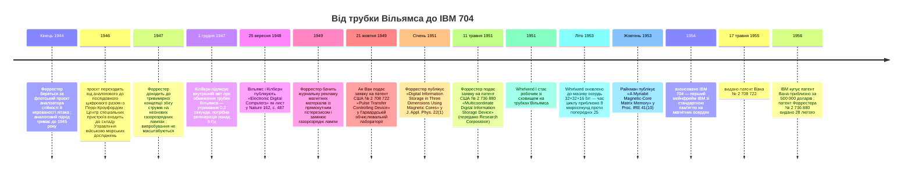

:::tip[В одному абзаці]
1947 року манчестерська трубка Вільямса показала, якою крихкою може бути пам'ять зі збереженою програмою, тоді як ртутні лінії затримки передавали дані ударними хвилями крізь ртуть. Проєктові Whirlwind у МТІ потрібна була пам'ять, що не забуває. Тривимірна концепція збігу струмів Джея Форрестера спершу використовувала несталі неонові газорозрядні лампи, а потім перейшла на магнітні матеріали з прямокутним гістерезисом. Троє винахідників — Форрестер, Ян Райхман, Ан Ван — зійшлися на пам'яті на магнітних осердях між 1949 та 1953 роками. SAGE перетворив варіант МТІ на промисловий стандарт комп'ютера IBM 704.
:::

<strong>Дійові особи</strong>

| Ім'я | Роки життя | Роль |
|---|---|---|
| Джей В. Форрестер | 1918–2016 | Директор Лабораторії цифрових обчислювальних машин МТІ (1946–1951); очолював проєкт Whirlwind і роботу над пам'яттю для SAGE; 1947 року сформулював концепцію тривимірного сховища зі збігом струмів, а 1949-го перейшов на магнітні матеріали. |
| Фредерік К. Вільямс | 1911–1977 | Професор електротехніки Манчестерського університету; співавтор листа до *Nature* (вересень 1948 року), що сповістив про дієву експериментальну машину зі збереженою програмою на основі електростатичної ЕПТ-пам'яті (трубки Вільямса). |
| Том Кілберн | 1921–2001 | Дослідник у Манчестері під керівництвом Вільямса; автор внутрішнього звіту від 1 грудня 1947 року «A Storage System for Use with Binary Digital Computing Machines» — головного для цього розділу джерела щодо робочих обмежень трубки Вільямса. |
| Ян А. Райхман | 1911–1989 | Лабораторії RCA (Камден, Нью-Джерсі); розробив трубку «Селектрон» (1946–1947); паралельно з Форрестером працював над матричною пам'яттю на феритових осердях. |
| Ан Ван | 1920–1990 | Науковий співробітник Гарвардської обчислювальної лабораторії під керівництвом Говарда Ейкена; подав заявку на патент США № 2 708 722 («Pulse Transfer Controlling Device») 21 жовтня 1949 року — на вісімнадцять місяців раніше за Форрестера. |
| Кеннет Г. «Кен» Олсен | 1926–2011 | Науковий асистент МТІ під керівництвом Нормана Тейлора; співбудівник Випробувального комп'ютера пам'яті (Memory Test Computer), який підтвердив придатність пам'яті на осердях зі збігом струмів у промисловому масштабі перед перенесенням її у Whirlwind. |

<strong>Хронологія (1944–1956)</strong>

<strong>Словник простими словами</strong>

- **Трубка Вільямса** — електростатична пам'ять, що зберігала двійкові цифри як візерунок заряду на внутрішньому люмінофорному екрані звичайної електронно-променевої трубки. Швидкий довільний доступ, але летка: потребувала постійної регенерації.
- **Ртутна лінія затримки** — послідовна пам'ять, у якій біт мандрував акустичною ударною хвилею вздовж приблизно метрової трубки з ртуттю, зчитувався на дальньому кінці й повторно вводився, щоб біт «жив». Надійна, але повільна; час доступу визначався очікуванням, поки потрібний біт вийде з трубки.
- **Прямокутна петля гістерезису** — крива відгуку магнітного матеріалу, у якій намагніченість чітко перемикається між двома станами насичення з різким порогом між ними. «Прямокутна» форма — майже без проміжного відгуку — і зробила вибірку збігом струмів надійною.
- **Вибірка збігом струмів** — прийом адресації в основі пам'яті на магнітних осердях: кожна координатна лінія несе лише половину струму, потрібного для перемикання осердя, тож перемикається тільки те осердя, що лежить на перетині двох активованих ліній. Напіввибрані осердя в тому самому рядку чи стовпці лишаються незмінними.
- **Пам'ять на магнітних осердях** — енергонезалежна пам'ять із довільним доступом, побудована з тривимірної ґратки малих феритових кілець (осердь), кожне з яких зберігає один біт напрямком своєї намагніченості. Зчитування біта руйнує його, тож за кожним зчитуванням іде перезапис — цю проблему розв'язав патент Вана на імпульсне передавання 1949 року.
- **Проєкт Whirlwind / SAGE** — Whirlwind був проєктом МТІ зі створення цифрового комп'ютера реального часу, який до 1949 року перейшов від флотського авіасимулятора до завдань протиповітряної оборони ВПС. SAGE — Semi-Automatic Ground Environment (напівавтоматичне наземне середовище) — стала промисловою мережею ППО, що профінансувала промислове масштабування пам'яті на магнітних осердях і спрямувала цю технологію до IBM.
- **Випробувальний комп'ютер пам'яті (Memory Test Computer)** — спеціально побудована машина МТІ, яку Норман Тейлор і Кен Олсен зібрали з наявного цифрового випробувального обладнання; вона підтвердила роботу пам'яті на осердях зі збігом струмів у повному системному масштабі перед перенесенням у Whirlwind улітку 1953 року.

Архітектура зі збереженою програмою фон Неймана, описана в попередніх розділах, була блискучою логічною конструкцією, що розв'язала проблему конфігурування машини. На папері вона припускала наявність такого носія пам'яті, який міг би надійно й без забування зберігати інструкції та дані. Та коли архітектуру вперше втілили в апаратурі, це припущення зіткнулося з фізичною реальністю. Найперші машини страждали на амнезію.

Ця слабкість мала значення, бо ідея збереженої програми перемістила центр ваги всередину машини. Конфігурування перестало бути лише зовнішнім налаштуванням: машина зі збереженою програмою клала свої інструкції в те саме фізичне сховище, що й числа. Якщо це сховище «пливло», машина втрачала не просто відповідь — вона могла втратити самі інструкції, за якими знала, яку операцію виконати далі. Пам'ять перестала бути пасивною шафою, прибудованою до обчислення. Вона стала умовою, що робила архітектуру реальною.

Машина, яку широко визнають за демонстрацію архітектури зі збереженою програмою на практиці, працювала в Лабораторії обчислювальних машин Королівського товариства при Манчестерському університеті вже в середині 1948 року. Описана в листі до *Nature* (вересень 1948 року) за авторством Ф. К. Вільямса й Т. Кілберна, ця установка була незаперечною віхою. Втім, її автори відверто говорили про обмеження, характеризуючи машину в першому ж абзаці як «суто експериментальну, а за масштабом — надто малу, щоб мати математичну цінність». Вони зазначали, що її «побудовано насамперед для перевірки надійності застосованого принципу зберігання».

Цим принципом зберігання була електростатична пам'ять на електронно-променевій трубці (ЕПТ) — трубка Вільямса. Вона використовувала внутрішній люмінофорний екран звичайної ЕПТ, щоб зберігати візерунок заряду, який позначав двійкові цифри. Як робочий носій вона була до краю крихкою. Внутрішній звіт Т. Кілберна (грудень 1947 року), затверджений Вільямсом, без прикрас виклав робочі обмеження. Трубка Вільямса мала короткочасне утримання «близько 0,2 секунди» — короткий пільговий проміжок, що пасивно забезпечувався «ізоляційними властивостями матеріалу екрана».

Щоб програма прожила довше, ніж частку секунди, машина мусила постійно зчитувати й перезаписувати власну пам'ять. Звіт Кілберна 1947 року вказував, що для підтримання довготривалого зберігання потрібно «регенерувати візерунок заряду з частотою понад 5 циклів за секунду». Гіпотетична машина з таким сховищем у послідовному режимі, за розрахунками звіту, могла «підготувати й виконати» інструкцію за 600 мікросекунд. У звіті також розглянуто можливі способи кодування при зберіганні, зокрема відображення «крапка-тире», «тире-крапка», «розфокус-фокус», «фокус-розфокус» та упередження (anticipation).

На цих схемах кодування варто спинитися, бо вони показують, наскільки експериментальним був цей носій. Кілберн описував не усталений компонент, який можна вставити в інженерний проєкт. Він порівнював способи зробити так, щоб видимий електричний слід на екрані електронно-променевої трубки позначав стійкий двійковий стан. Самі назви — «крапка-тире» та «розфокус-фокус» — виказують, наскільки близькою ще була ця пам'ять до лабораторного приладдя. Біт треба було зробити видимим, зчитати, оновити й знову довіритися йому, перш ніж мине наступний інтервал згасання.

Машина, чия пам'ять згасає за 0,2 секунди, не є архітектурою зі збереженою програмою в жодному практичному, експлуатаційному сенсі; це делікатна схема, що регенерує власну пам'ять сотні разів на хвилину, покладаючись на те, що кожен цикл точний.

Тогочасною альтернативою була ртутна акустична лінія затримки. Вона ґрунтувалася на поширенні ударної хвилі крізь стовп ртуті. Джей В. Форрестер у запису усної історії 1994 року, який зробила Конкордська публічна бібліотека, пригадував характеристики лінії затримки: трубка завдовжки приблизно один метр із часом проходження близько однієї мілісекунди. Місткість сховища, за його спогадами, становила «можливо, щось із тисячу цих поштовхів, які або були, або були відсутні в трубці, рухаючись униз по трубці». Оскільки сховище було послідовним, час доступу визначався найгіршим випадком очікування, поки потрібний біт вийде з дальнього кінця. Форрестер підсумував компроміс: «Воно працювало. Але було повільним».

Перед цим вибором конструктори часто обирали трубку Вільямса за швидший доступ, попри її леткість. Та згодом Форрестер схарактеризував електростатичну ЕПТ-пам'ять, яку спершу використовував його власний проєкт, як «дорогу, недовговічну й не дуже надійну». Інфраструктурна ціна запуску реальних програм на апаратурі, що їх забувала, була величезною.

Тож лінії затримки й трубки Вільямса зазнавали невдачі протилежними способами. Лінія затримки запам'ятовувала, перетворюючи час на петлю: біт існував як акустична подія, що циркулювала крізь ртуть, і машина чекала на повернення цієї події. Трубка Вільямса давала швидший довільний доступ, але лише ціною прийняття поверхні зберігання, що безперервно вислизала з-під машини. Між ними лежала центральна інженерна дилема кінця 1940-х. Корисному комп'ютерові потрібна була пам'ять, водночас адресовна й довговічна. Наявні пристрої схильні були давати одну чесноту, жертвуючи іншою.

## Криза пам'яті проєкту Whirlwind

Крихкість електростатичної пам'яті та пам'яті на лініях затримки була прикрим обмеженням для наукових обчислень, але становила екзистенційну загрозу для інженерів, які намагалися будувати системи керування реального часу. Саме ця відмінність між пакетним обробленням і безперервним керуванням визначила кризу, що охопила проєкт Whirlwind у Массачусетському технологічному інституті й докорінно змінила траєкторію розвитку комп'ютерної пам'яті.

Проєкт Whirlwind розпочався наприкінці 1944 року за підтримки Центру спеціальних пристроїв ВМС США. Початковою метою було побудувати аналоговий аналізатор стійкості й керованості літака. За усною історією Форрестера 1994 року, команда трималася аналогового підходу до 1945 року, але дійшла висновку, що він «не буде задовільним». Приблизно 1946 року, через розмови з Перрі Кроуфордом із Центру спеціальних пристроїв — який наполегливо тримав увагу людей на можливостях цифрових комп'ютерів, — проєкт перейшов на послідовну цифрову архітектуру.

Це була не лабораторія універсальних обчислювальних машин у пошуках елегантної машини. Це був інженерний проєкт, від якого вимагали моделювати поведінку літака досить швидко, щоб це мало значення для керування. Форрестер згодом згадував, що рання лабораторія містилася на 211 Массачусетс-авеню, навпроти фабрики Necco, і пригадував Кроуфорда як куратора, що вільно переходив між проєктами, аби втримувати увагу на цифрових обчисленнях. Це інституційне походження допомагає пояснити, чому проблема пам'яті Whirlwind відчувалася інакше, ніж манчестерська. Питання було не в тому, чи можна продемонструвати збережену програму. Питання було в тому, чи здатна цифрова машина лишатися синхронною зі світом, який не зупиниться, поки її пам'ять відновлюється.

До 1948 року уявлення про те, чого може досягти цифровий комп'ютер реального часу, розширилося. Форрестер пригадував, що команда «написала два меморандуми про можливість того, щоб цифровий комп'ютер опрацьовував потік бойової інформації в корабельному з'єднанні», пропонуючи інтегрувати оперативні дані в централізовані бойові інформаційні центри.

Геополітичний ландшафт пришвидшив цей перехід. Випробування атомної бомби Радянським Союзом у серпні 1949 року стало каталізатором дослідження з протиповітряної оборони, відомого як проєкт «Чарльз». Джордж Веллі, доцент фізики МТІ та консультант ВПС, допоміг залучити Форрестера до цієї розмови. Разом із Робертом Р. Евереттом, головним заступником Форрестера, команда продемонструвала концепцію наведення на перехоплення на основі Whirlwind, яка зрештою втягнула цю роботу в траєкторію протиповітряної оборони часів холодної війни, що згодом стала системою SAGE.

Це був ланцюг інституційної ескалації: профінансований ВМС симулятор став проєктом цифрового керування; проєкт цифрового керування став пропозицією щодо бойових інформаційних центрів; випробування атомної бомби перетворило протиповітряну оборону на нагальну національну проблему; а проєкт «Чарльз» зробив Whirlwind кандидатною архітектурою для цієї проблеми. Жоден із цих кроків не робить магнітне осердя неминучим. Але вони пояснюють, чому МТІ мав проєкт, готовий витратити роки на технологію пам'яті, яка спершу була тільки складною лабораторною можливістю.

Цей перехід від авіасимулятора до мережі протиповітряної оборони означав, що леткість пам'яті була вже не просто прикрістю — це була проблема, що вбивала проєкт. Форрестер прямо протиставляв наголос Whirlwind на надійності іншим тогочасним проєктам цифрових комп'ютерів, зауважуючи, що ті «були присвячені науковим обчисленням, де, якщо машина переставала працювати, можна було почати спочатку або зробити роботу завтра». Контур керування протиповітряною обороною не можна було перезапустити завтра.

Наявні технології пам'яті не давали жодних гарантій. Форрестер згадував цю добу як добу глибокого браку: «люди розпачливо потребували пам'яті для комп'ютерів. Випробовували всілякі речі». Розпач сягнув такого рівня, що команда розглядала архітектурні рішення, які в ретроспективі звучать абсурдно, але були цілком раціональними з огляду на альтернативи. Форрестер розповідав, що вони «всерйоз розглядали оренду телевізійного каналу зв'язку від Бостона до Баффало й назад, щоб зберігати двійкові цифри в часі проходження, потрібному для подорожі туди й назад телевізійним каналом».

Ідею «Бостон — Баффало» найкраще читати не як комічну розрядку, а як інженерний вимір. Якщо не можна купити задовільний пристрій пам'яті, можливо, можна орендувати канал зв'язку й використати затримку поширення як сховище. Ця пропозиція розтягнула логіку ртутної лінії затримки через географію: відправ біт геть, дочекайся його повернення й вважай цю подорож туди й назад інтервалом пам'яті. Це була погана відповідь, але вона точно вказувала на проблему. Машині потрібне було фізичне явище, здатне утримати двійкову відмінність достатньо довго й достатньо чисто, щоб обчислення тривало.

Хоча Whirlwind I став робочим 1951 року, використовуючи сховище на трубках Вільямса, пам'ять лишалася серйозним вузьким місцем. Щоб виконати свій мандат, інженерна команда мусила знайти цілком інший фізичний носій.

## Тривимірна ідея

Пошук надійної пам'яті привів до тривимірної пам'яті на магнітних осердях зі збігом струмів. Хоча вона зрештою стала промисловим стандартом, ця архітектура почалася як логічна структура в пошуку придатного матеріалу.

У своїй усній історії Форрестер пригадував, що приблизно 1947 року почав думати про геометрію зберігання: «якщо в нас є одновимірне сховище й двовимірне сховище, то яка можливість тривимірного сховища». Він дійшов до логічної структури, що задовольняла вимоги, але початкова фізична реалізація спиралася на неонові газорозрядні лампи тліючого розряду.

Привабливістю цієї геометрії була вибірковість. Одновимірне сховище потребувало довгої лінії або послідовного потоку. Двовимірна матриця дозволяла однією координатою вибирати рядок, а іншою — стовпець. Тривимірне розташування обіцяло ще краще співвідношення масштабування: більше збережених бітів без окремого проводу на кожен біт. Якщо пам'ять зростала за об'ємом, а проводка — за довжиною ребра, пам'ять могла масштабуватися, не топлячи машину в з'єднаннях.

Концепція газорозрядної лампи 1947 року вже містила ключовий механізм, що визначить пам'ять на магнітних осердях: вибірку збігом струмів. Як описував Форрестер, «можна було активувати провід, скажімо, по осі „x“ та інший, що перетинає його по осі „y“, і лише газорозрядна лампа на перетині мала на собі достатню напругу, щоб пробитися й почати розряджатися». Команда випробувала окремі елементи, але фізична реальність газорозрядних ламп виявилася непереборною. Їхні «характеристики… змінюються з температурою та віком», — пригадував Форрестер. Через це дрейфування вони не годилися для надійного довготривалого розрізнення, тож команда «по суті, не стала цього розвивати».

Базова логіка пережила невдалий пристрій. Вибірка збігом залежить від порога. Кожна вибрана координата дає лише частину сили, потрібної для зміни стану; тільки на адресованому перетині ці внески складаються в достатню величину. Усюди інде напіввибірка має бути нешкідливою. Саме тому дрейф із температурою та віком був згубним для газорозрядних ламп. Якщо поріг зсувався, пристрій, який мав би проігнорувати частковий сигнал, міг перемкнутися, або ж пристрій, який мав би перемкнутися, не перемикався. Пам'ять вимагала не просто хитрої схеми адресації, а матеріалу, на чию поведінку перемикання можна було покладатися знову і знову.

Прорив стався, коли Форрестер знайшов матеріал, що відповідав логічній структурі. 1949 року, за його спогадами, він побачив журнальну рекламу магнітних матеріалів із прямокутною петлею гістерезису — матеріалів, які, як він пригадував, розробила німецька армія для магнітних підсилювачів танкових башт під час Другої світової війни. Усвідомивши, що ці магнітні матеріали можуть замінити несталі газорозрядні лампи, він змінив фокус проєкту. Він зазначав: «за два чи три місяці ми розробили, як це можна зробити, а потім, упродовж наступних приблизно трьох років, ми справді довели це до стану робочої, стало надійної системи».

Технічне обґрунтування цього підходу офіційно представлено в січні 1951 року, коли Форрестер опублікував «Digital Information Storage in Three Dimensions Using Magnetic Cores» у *Journal of Applied Physics*. Анотація статті виклала разючі відмінності в швидкодії між доступними матеріалами. У ній зазначено, що «випробування показують, що більшість наявних металевих магнітних матеріалів перемикаються за 20–10 000 мікросекунд і є надто повільними». Натомість стверджувалося, що «неметалеві магнітні матеріали… перемикаються менш ніж за мікросекунду». Запропонована Форрестером архітектура потребувала «лише одного магнітного осердя на двійкову цифру» й працювала за співвідношенням розрізнення намагнічувальної сили 2:1.

Це співвідношення 2:1 було технічним серцем конструкції. Струм лише в одній координатній лінії мусив лишатися нижчим за поріг перемикання; одночасні струми в лініях, що перетинаються, мусили його перевищувати. Вибране осердя змінювало стан, тоді як численні напіввибрані осердя в тому самому рядку чи стовпці лишалися незмінними. На практиці масив був полем крихітних магнітних рішень, і кожне рішення ухвалювалося лише тоді, коли дві координати погоджувалися щодо того самого місця. Порівняно з часом очікування ртутної лінії затримки чи тягарем регенерації трубки Вільямса, твердження, що неметалевий магнітний матеріал може перемикатися менш ніж за мікросекунду, не було незначним поліпшенням. Це була різниця між пам'яттю як нестабільним часовим трюком і пам'яттю як адресовним компонентом.

11 травня 1951 року Форрестер подав заявку на патент США № 2 736 880 на «Multicoordinate Digital Information Storage Device», переданий Research Corporation. Специфікація патенту прямо вимагала кілець «із магнітного матеріалу, кожне з яких має по суті прямокутні властивості гістерезису… кілька кілець розташовано рядками й стовпцями». У ній детально описано механізм збігу струмів, що спирається на «одночасне (тобто збіжне в часі) прикладання двох чи більше таких струмів» для перемикання стану осердя. Також підкреслено переваги масштабування тривимірного масиву: він потребував лише «3·∛(кількість осердь)» вхідних виводів.

Патент видали лише 28 лютого 1956 року. Ця затримка важлива для оповіді, бо винахід не перейшов чисто від одного розуму до одного патенту й до однієї галузі. На той час, коли заявка Форрестера стала виданим патентом, інші претензії на магнітну пам'ять уже було подано, опубліковано або поглинуто корпоративною стратегією. Тому історія пам'яті на осердях — це не перегони за пріоритет із простою фінішною межею. Це збіг механізмів, матеріалів, патентів і виробничих каналів.

## Патентна війна

Популярна оповідь часто подає Форрестера як єдиного винахідника пам'яті на магнітних осердях, але історичні свідчення розкривають ландшафт паралельного винахідництва. У критичному вікні між 1949 та 1953 роками одночасно розвивалися три окремі шляхи до пам'яті на магнітних осердях.

У лабораторіях RCA у Камдені, штат Нью-Джерсі, Ян А. Райхман уже зарекомендував себе як піонер технології пам'яті. Між 1946 та 1947 роками він розробив трубку «Селектрон» (Selectron) — електростатичну запам'ятовувальну трубку на 256 бітів, яку застосували в комп'ютері JOHNNIAC у корпорації RAND. Після цього Райхман почав розвивати шлях магнітних осердь зі збігом струмів паралельно з Форрестером. Формуючи свої дослідні феритові осердя за допомогою переобладнаного преса для таблеток аспірину, Райхман розробив технологію матричної пам'яті RCA. Цей паралельний напрям увінчався в жовтні 1953 року публікацією «A Myriabit Magnetic-Core Matrix Memory» у *Proceedings of the IRE*, у назві якої вжито слово «myriabit» (міріабіт) на позначення матриці на 10 000 бітів.

Шлях Райхмана важливий, бо починався з тієї самої незадоволеності електростатичним зберіганням, але пролягав через інше інституційне середовище. RCA мала глибокий досвід із лампами, і «Селектрон» був спробою зробити досконаліше електростатичне сховище з довільним доступом. Його присутність в історії запобігає хибному протиставленню грубих старих ламп та елегантних нових осердь. Конкуренція точилася між серйозними технологіями пам'яті. Магнітне осердя перемогло не тому, що кожна альтернатива була безглуздою, а тому, що феритова матриця давала інженерам кращу комбінацію збереження даних, доступу й придатного до виробництва масштабу.

Водночас вирішальна робота тривала в Гарвардській обчислювальній лабораторії. 21 жовтня 1949 року — на вісімнадцять місяців раніше за подання патентної заявки Форрестера — Ан Ван подав заявку на патент США № 2 708 722 на «Pulse Transfer Controlling Device». Патент Вана, який зрештою видали 17 травня 1955 року, описував пристрій на магнітних осердях, що розв'язував критичний цикл перезапису після зчитування, роблячи оперативну пам'ять на осердях зі збігом струмів придатною до експлуатації. Патент визначав використання магнітних матеріалів із залишковою магнітною індукцією «щонайменше 0,4–0,5, а краще понад 0,80» від насичення. У ньому також зазначено, що оскільки пристрій «не передбачає механічного руху… отже, його швидкість не обмежена механічними міркуваннями». [^1]

Претензія Вана зачіпала іншу, але не менш практичну частину проблеми. Магнітний стан міг позначати біт, але придатній до використання пам'яті з довільним доступом потрібен був ще й надійний цикл для зчитування й відновлення цього стану. Формулювання патенту про залишкову магнітну індукцію не було декоративною фізикою. Воно визначало, наскільки сильно матеріал має пам'ятати після того, як прикладений імпульс завершиться. У технології пам'яті залишкова намагніченість і була суттю: пристрій мусив утримувати відмінність без безперервного живлення чи механічного руху.

Ці паралельні розробки породили перекривні претензії. Суперечку про пріоритет, схоже, розв'язало не остаточне судове рішення в патентному суді, а радше сила комерційного ліцензування. Велика комерційна розв'язка настала 1956 року, коли, за поширеними історичними свідченнями, IBM купила патент Вана приблизно за 500 000 доларів. Ця угода ввела основоположні претензії Вана до портфеля IBM і допомогла залагодити патентну війну комерційно.

## Комерціалізація

Промислове домінування форрестерівського варіанта пам'яті на магнітних осердях постало не лише з технічної першості. Натомість воно було результатом інституційного конвеєра МТІ. Технологія дозріла всередині профінансованої військовими екосистеми, що дала нагальний сценарій застосування, глибокі ресурси й прямий шлях до масового промислового виробництва.

Ця відмінність має значення. Стаття й патент Форрестера 1951 року описали потужну архітектуру; заявка Вана 1949 року розв'язувала ключовий робочий цикл; робота Райхмана в RCA продемонструвала паралельний корпоративний поступ до великих матриць. Те, що мав МТІ, — це вимоглива системна проблема й шлях від лабораторної перевірки до закупівлі. Винахід установив претензії. Whirlwind і SAGE установили виробничий шлях.

Перш ніж пам'ять на магнітних осердях могла стати промисловим стандартом, її треба було перевірити в масштабі. Цей вирішальний крок зорганізували Норман Тейлор, головний інженер Лабораторії цифрових обчислювальних машин МТІ, і Кеннет Олсен, науковий асистент. Вони запропонували побудувати спеціальний Випробувальний комп'ютер пам'яті, використовуючи наявні в команди будівельні блоки цифрового випробувального обладнання.

Ця пропозиція була дисциплінованим способом знизити ризик. Замість того, щоб вставити неперевірену пам'ять на осердях просто у Whirlwind і сподіватися, що всю машину вдасться налагодити заразом, Тейлор і Олсен ізолювали проблему пам'яті в машині, побудованій для випробувань. Спогад Форрестера про те, що її зібрали з наявного випробувального обладнання, є значущим. Лабораторія накопичила достатньо цифрових будівельних блоків, щоб зробити спеціалізований комп'ютер, чиїм завданням було довести, чи може пам'ять поводитися як система, а не як перспективне поодиноке осердя на лабораторному столі.

Форрестер, пригадуючи цю пропозицію, визнавав свій скептицизм: «Мушу сказати, я сумнівався, що вони зможуть це зробити, і вже точно не за ті дев'ять місяців, які, за їхніми словами, на це знадобляться, але вони підійшли дуже близько». Випробувальний комп'ютер пам'яті успішно довів, що масиви на магнітних осердях зі збігом струмів можуть надійно працювати в масштабі. Маючи це підтвердження, Форрестер пригадував, «упродовж кількох місяців після цього ми перенесли її у комп'ютер Whirlwind, щоб замінити електростатичні запам'ятовувальні трубки, які ми використовували для пам'яті, але які були дорогими, недовговічними й не дуже надійними».

Це і є перехідна ланка між винаходом та інфраструктурою. Матеріал із прямокутною петлею гістерезису був необхідним, але недостатнім. Масив треба було з'єднати проводами, керувати ним, зчитувати його й вбудувати в часозадавальні схеми. Він мусив витримувати багаторазові записи та зчитування, не дрейфуючи, як газорозрядні лампи, і не вимагаючи регенерації, як трубка Вільямса. Випробувальний комп'ютер пам'яті перетворив пам'ять на осердях із правдоподібного пристрою на інженерну підсистему.

Історичні хроніки загалом датують це оновлення літом 1953 року, зазначаючи, що воно ввело масив 32×32×16 біт — шістнадцять складених площин по 1024 осердя в кожній. Поліпшення швидкодії, як широко цитують, знизило час циклу приблизно до 9 мікросекунд проти близько 25 мікросекунд для витісненої електростатичної системи. Ці точні числа є радше маркерами масштабу, ніж найтвердішим ґрунтом в історії. Твердіший момент — форрестерівський: нова пам'ять замінила електростатичні трубки, які його команда вважала дорогими, недовговічними й ненадійними.

Виробнича історія також потребує стриманості. Ретроспективні свідчення описують ранні масиви, що їх збирали під мікроскопами працівники з тонкою моторикою, бо архітектура зі збігом струмів вимагала похилого проводу зчитування, який чинив опір машинному протягуванню. Пізніші огляди також описують поліпшення проводки 1956 року, що скоротило час протягування прямих ліній вибирання в масиві 128×128 із багатьох годин до хвилин. Ці деталі передають складність виготовлення, але вони не дають підстав переносити відомішу історію про ручне плетіння канатної пам'яті доби «Аполлона» на період Whirlwind та IBM 704. Вужчого твердження достатньо: пам'ять на осердях розв'язала проблему леткості, перенісши труднощі в матеріали, проводку й виробничу техніку.

Коли пам'ять на осердях довела свою спроможність у Whirlwind, Лінкольнівська лабораторія МТІ дістала технологічний фундамент, потрібний для мережі протиповітряної оборони SAGE. Їм був потрібен комерційний партнер, здатний виготовляти ці системи в безпрецедентному масштабі. За словами Форрестера, лабораторія розіслала запити «значній кількості компаній, мабуть, із 15 чи близько того». Оцінивши відповіді, «стало ясно, що IBM значно випереджає всіх інших як можлива компанія для виконання цієї роботи, тож ми рекомендували її Військово-повітряним силам».

Підсумковий серійний комп'ютер SAGE — IBM AN/FSQ-7 — широко описують як суттєво модифіковану версію архітектури Whirlwind. Форрестер пригадував, що мережа SAGE розрослася до понад 30 центрів керування по всій Північній Америці. Кожен центр займав чотириповерхову будівлю приблизно 160 на 160 футів і містив від 60 000 до 80 000 електронних ламп. За пізнішою розповіддю Форрестера, впровадження суворих протоколів надійності збільшило строк служби електронної лампи приблизно з 500 годин до близько 500 000 годин, що дало центрам змогу досягти експлуатаційної готовності близько 99,8 відсотка.

Ці числа варто лишати прив'язаними до ретроспективної розповіді Форрестера про масштаб системи та програму надійності. І все ж закономірність безпомильна. SAGE був не просто більшим Whirlwind. Це було виробниче середовище, у якому пам'ять, логіка, процедура обслуговування й виробнича дисципліна мусили працювати разом. Той самий проєкт, що вимагав надійної пам'яті, вимагав і культури надійності навколо решти машини. Пам'ять на осердях була однією частиною цього ширшого переходу від експериментальних цифрових обчислень до операційної інфраструктури.

«До 1956 року, — зазначав Форрестер, — систему протиповітряної оборони SAGE по суті було спрямовано остаточно. Перший із понад 30 комп'ютерних центрів добігав завершення в Нью-Джерсі». Програма SAGE фактично профінансувала індустріалізацію пам'яті на магнітних осердях.

Ці військові інвестиції швидко дали комерційні дивіденди. Вторинні свідчення вказують, що IBM 704 представили 1954 року, а загальний випуск між 1955 та 1960 роками сягнув приблизно 123 одиниць. Цю машину зазвичай описують як перший масово вироблений комерційний комп'ютер, що мав пам'ять на магнітних осердях як стандартний компонент, замінивши сховище на трубках Вільямса свого попередника — IBM 701. Ці свідчення подають його стандартний блок магнітної пам'яті на осердях 737 (737 Magnetic Core Storage Unit) як 4096 36-бітних слів пам'яті. Висновок — це не одна тріумфальна дата, а траєкторія: до середини 1950-х осердя перемістилося від лабораторної проблеми МТІ до продуктової лінійки IBM.

Час цієї комерціалізаційної дуги був вирішальним. На той час, коли дослідники зібралися на Дартмутський літній дослідницький проєкт зі штучного інтелекту влітку 1956 року, найкричущішу фізичну вразливість архітектури фон Неймана було значною мірою усунено. Програма символьного ШІ успадкувала інфраструктуру пам'яті, яка була швидкою, енергонезалежною й промислово масштабованою. Це не зробило комп'ютери дешевими, малими чи легкими для програмування. Але це змінило питання. Для великих інституційних машин, якими символьний ШІ користувався спершу, апаратна пам'ять перестала бути головним несівним обмеженням; наступним вузьким місцем стане саме програмне забезпечення (див. розділ 11).

:::note[Чому це досі важливо сьогодні]
Дві інженерні ідеї цього розділу досі впорядковують сучасні обчислення. *Вибірка збігом струмів* — адресація окремого біта за згодою двох координат, кожна з яких несе лише половину сили активації, — є прямим предком кожної комірки пам'яті, що відрізняє «вибране» від «напіввибраного» за аналоговим запасом. Підсилювачі зчитування DRAM, комірки з пороговою напругою у флеш-пам'яті та асоціативний пошук за вмістом у мережевих маршрутизаторах — усі вони походять від того самого трюку «поріг і збіг». *Паралельне винахідництво з комерційною розв'язкою* — збіг Форрестера / Райхмана / Вана, залагоджений купівлею патенту компанією IBM за 500 000 доларів, а не судовим рішенням, — теж досі з нами: більшість сучасних патентних суперечок щодо апаратного забезпечення розв'язується через ліцензування, а не судовий процес, з тих самих інституційних причин, що зумовили розвиток пам'яті доби SAGE.
:::

[^1]: Чимало вторинних джерел приписують винахід пам'яті на магнітних осердях 1949 року Ану Вану та Вей-Дун Ву з Гарвардської обчислювальної лабораторії. Однак патент США № 2 708 722 на своєму титульному аркуші називає офіційно зазначеним винахідником лише Ана Вана. Питання співавторства лишається предметом історичної дискусії.
